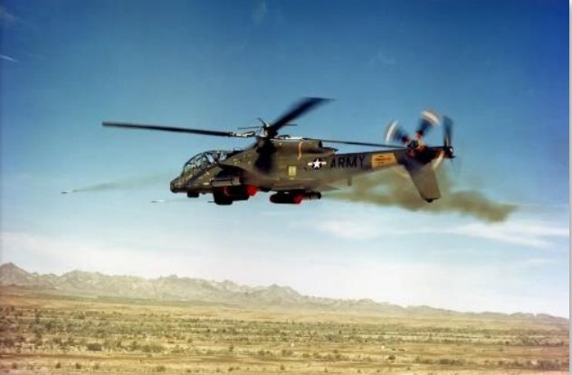
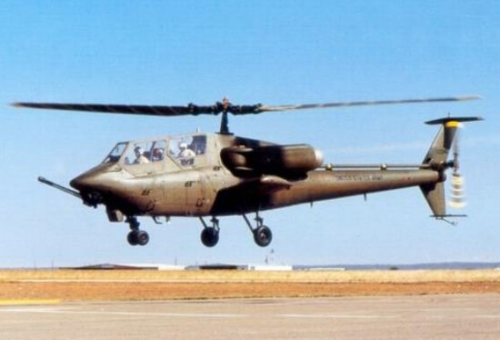
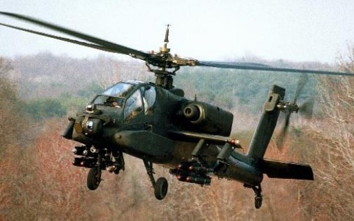
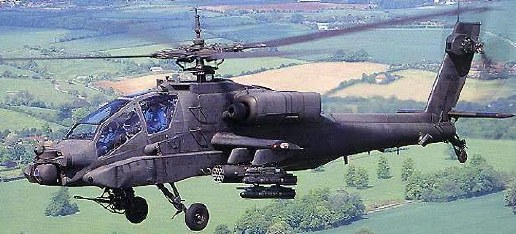

# AIRCRAFT HISTORY

The AH-64D is the second generation of the AH-64 legacy, which pre-dates the AH-64 itself. In 1963, the
Advanced Aerial Fire Support System (AAFSS) program was created, which produced the AH-56 prototype
helicopter. This was succeeded by the Advanced Attack Helicopter (AAH) program in 1972, which resulted in the
delivery of the AH-64A in 1983, and subsequently the AH-64D in 1997. The conceptual design of AH-64D centered
around the AN/APG-78 fire control radar, an upgraded communications system that permitted the sharing of
targeting data between AH-64 team members, and more advanced AGM-114 anti-armor missiles.

## Advanced Aerial Fire Support System

In 1948, James V. Forrestal, the first U.S. Secretary of Defense, drafted the Key West Agreement, which codified
the separation of air assets between the Army and the newly founded U.S. Air Force. In particular, it limited Army
Aviation to employing fixed-wing aircraft below 2,500 pounds weight and helicopters below 4,000 pounds. It was
believed that the Air Force would provide fixed-wing aircraft for the close air support (CAS) role with a new
generation of multirole fighter aircraft.

In 1960, President Kennedy’s Secretary of Defense, Robert S. McNamara, revisited this agreement by creating
the Army Tactical Mobility Requirements Board. The Board and its chairman, Lieutenant General Hamilton H.
Howze, recommended that Army Aviation be greatly expanded to include a well-developed attack role, among
many others. McNamara followed the board’s recommendation, which garnered an immediate rebuke from U.S.
Air Force leadership, insistent that fixed-wing fighters were the only effective platforms for performing CAS.
U.S. Army leadership was eager to demonstrate otherwise, having noted the success of armed UH-1 helicopters.
To that end, in 1963, the Army initiated the Advanced Aerial Fire Support System (AAFSS) development program
to design a purpose-built attack helicopter, rather than an armed variant of an existing utility helicopter. In 1964,
the request for proposals (RFP) was announced; and in 1968,                                                          

Lockheed won the competition with its proposal for the AH-
56 Cheyenne, a purpose-built attack helicopter, also
commonly referred to as a “gunship”.

In the late 1960s, the U.S. military’s strategic concern shifted
to the large numbers of tanks that Warsaw Pact countries
could employ in a European ground war. Thus, aircraft
development priority shifted from close air support to the
anti-armor role. In response to this shift, the Air Force
founded the A-X program (which would eventually result in
the A-10A “Warthog”), and in 1972, the Army canceled
development of the AH-56 in favor of a program to develop
a more capable anti-tank platform.
                                                      
                                                      
                                                      

## Advanced Attack Helicopter Program

The U.S. Army’s subsequent program to build an anti-tank helicopter was called the Advanced Attack Helicopter
(AAH) program, and its goal was to design a capable replacement for the AH-1 Cobra, the Army’s dedicated
attack helicopter of the period.

The AAH program’s RFP was announced in November 1972, specifying that the helicopter would need to operate
at night at extremely low altitudes, should utilize the same General Electric T700 engine as the Utility Tactical
Transport Aircraft System (which would eventually evolve into the UH-60 Blackhawk), and should be armed with
a 30mm cannon and sixteen anti-tank TOW missiles. As the separately developed AGM-114 Hellfire missile neared
completion, the RFP was amended to include a requirement to carry sixteen Hellfires in place of the TOW missiles.
Bell, Boeing, Vertol/Grumman, Hughes, Lockheed, and Sikorsky all submitted proposals for the AAH program;
and in July of 1973, the Department of Defense selected the Hughes Model 77 and the Bell Model 409 as the
prototypes that would be built to compete for the contract. A few months later, the Army designated the AAH
program as one of its “Big Five” top priority projects, reflecting the importance of developing a capable anti-tank
helicopter.

The Bell Model 409, designated the YAH-63, first flew on September 30, 1975, and the Hughes Model 77
(designated YAH-64) performed its first flight only a day later. After a series of trials and tests, the Army decided
to move ahead with the YAH-64; citing its increased survivability over the YAH-63, stemming from the YAH-64’s
four-blade main rotor and tailwheel landing gear configuration.

## AH-64A

Per Phase Two of the AAH program, the YAH-64 entered pre-
production. In Phase Two, the YAH-64 airframe was
integrated with the weapon and sensor systems it would
employ, in particular the AGM-114, which would be the
cornerstone anti-tank missile for the helicopter. During pre-
production, the aircraft was re-designated as the AH-64A.
The AH-64A was equipped with two revolutionary targeting
systems, called the Integrated Helmet And Designation
Sighting System (IHADSS) and Target Acquisition
Designation Sight (TADS). These systems enabled aircrews
to acquire targets at long-range under total darkness, while
operating mere feet over the terrain and amongst obstacles,
and rapidly engage targets with the 30mm cannon using
helmet-mounted displays. Combined with the Pilot Night Vision System (PNVS), the helmet-mounted displays
made the AH-64A a lethal day and night attack aircraft.

Following pre-production, in 1981, three AH-64As were
delivered to the Army for Operational Test II. The engines
were upgraded to the more powerful T700-GE-701, with a
shaft horsepower of 1,690 SHP. In 1982, the Army approved
the AH-64A for full-scale production, and in 1983, the first
production AH-64A rolled off the line at Hughes’s production
facility in Mesa, Arizona. In January 1984, the Army took
delivery of its first production AH-64A, and in March 1986,
began training its first operational AH-64A unit, the 7th
Battalion, 17th Cavalry Brigade, in Fort Hood, Texas.

The AH-64A first saw combat in 1989 as part of Operation Just Cause, the U.S. invasion of Panama. But it wouldn’t
be until Operation Desert Shield in 1990 that the AH-64A would be deployed in significant numbers for a large-
scale conflict.

In January 1991, two teams of AH-64As from the 101st Airborne
Division, along with U.S. Air Force MH-53 Pave Low helicopters, struck
the first targets in Iraq during the initial hours of Operation Desert
Storm.

Guided by the precision GPS navigation units on board the MH-53’s
across the featureless desert, the teams of AH-64’s approached two
separate early warning radar sites along the border between Saudi
Arabia and Iraq. Flying radio silent, each AH-64 aircrew acquired their
assigned targets through their Forward-Looking Infrared (FLIR)
sensors. With a single radio call, the attack commenced with an
onslaught of Hellfire missiles, followed by rockets and 30mm fire.
Within minutes, the radar sites were disabled, and hundreds of
coalition aircraft streamed through the gap in radar coverage to begin
the air campaign against the Iraqi military.
When the ground phase of Desert Storm began in late February of
that year, battalions of AH-64A attack helicopters would be launched
en masse against multiple objectives forward of friendly ground
forces. On several occasions, an entire brigade of Iraqi armor would
be decimated by a single battalion of AH-64A helicopters in just one
battle.

Over 1,000 AH-64As were produced, most of which have since been upgraded to the D model. The AH-64A was
operated by the U.S. Army until July 2012, when the last A model was taken out of service for upgrades.

## AH-64D

Following Operation Desert Storm, McDonnell Douglas
(which had since acquired Hughes) proposed the AH-64B
upgrade, which would incorporate a modernized cockpit
and fire control system as well as new rotor blades. The
program was approved and funded by the U.S. Congress
but was canceled merely a year later in favor of the AH-64D
proposal; a much more ambitious upgrade to the airframe
that had originally been conceived in the late 1980’s as the
Airborne Adverse Weather Weapon System (AAWWS).
The AH-64D incorporated upgraded engines and an
expanded fuselage to house an entirely new suite of
sensors. Most notable was the addition of the AN/APG-78
fire control radar, mounted above the main rotor, making
many D models immediately identifiable. In addition, the
AH-64D was upgraded with a new communications suite
that included a modem for transmitting data across the
voice radios and integrated SINCGARS radios, avionics
supporting a MIL-STD 1553B data bus, a modern “glass”
cockpit equipped with multi-purpose displays, more
powerful T700-GE-701C engines rated at 1,940 SHP, and
the ability to fire the radar-guided AGM-114L Hellfire missile. The first D model prototype was flown in April of
1992, and by 1995 testing had concluded, and full-scale production began. The first AH-64D was delivered to the
U.S. Army on March 31, 1997.

Since August 1997, Boeing (which acquired McDonnell-Douglas) has produced AH-64D’s domestically for the
United States and for foreign partners. Partnered with Boeing, AgustaWestland produced AH-64D’s (designated
AH Mk1) for the United Kingdom, and Fuji Heavy Industries produced AH-64D’s (designated AH-64DJP) for the
Japanese Ground Self Defense Force. Along with the U.S., U.K., and Japan, the AH-64D is also operated by the
militaries of the Netherlands, Greece, Israel, United Arab Emirates, Singapore, Saudi Arabia, Kuwait, and Egypt.

In addition to newly manufactured AH-64D’s, the U.S. Army awarded McDonnell-Douglas a $1.9 billion contract
to upgrade existing A models to D models. Starting in August of 1997, Boeing has since upgraded all U.S. Army
AH-64A’s to D models. In all, 2,400 AH-64’s have been produced since 1975; over a thousand of them AH-64D’s.

