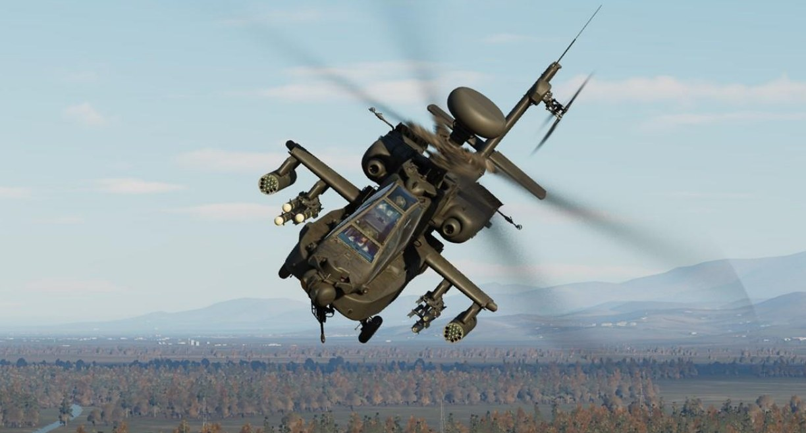
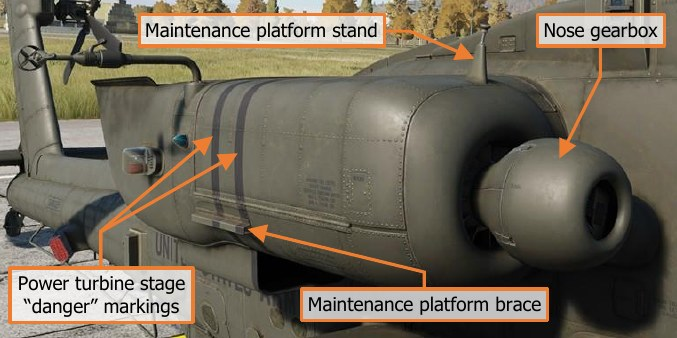
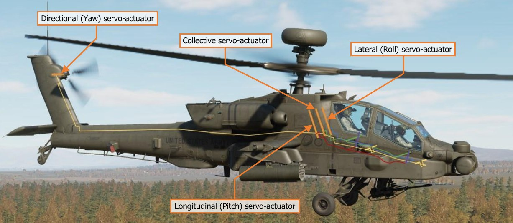
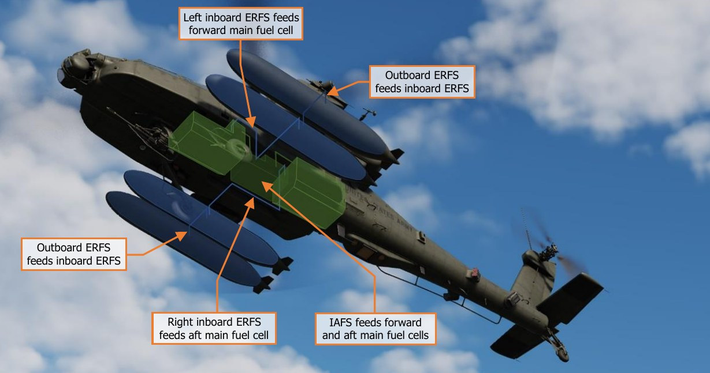
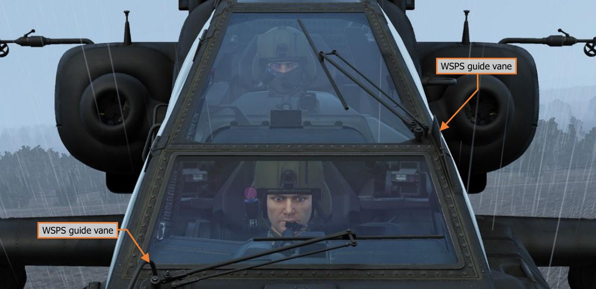
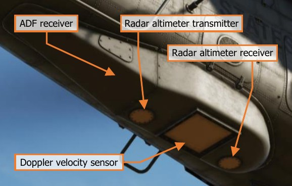
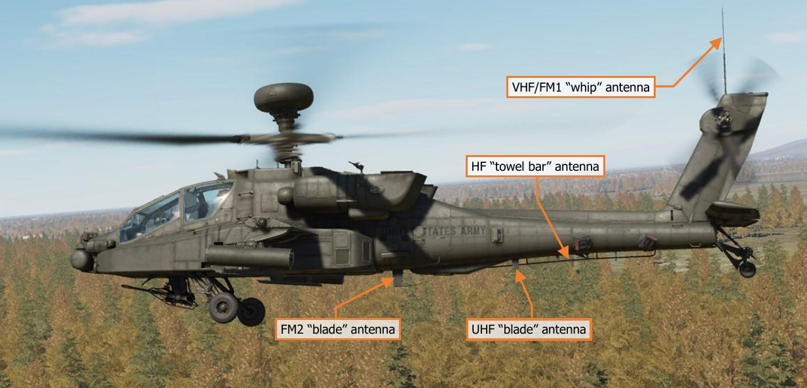
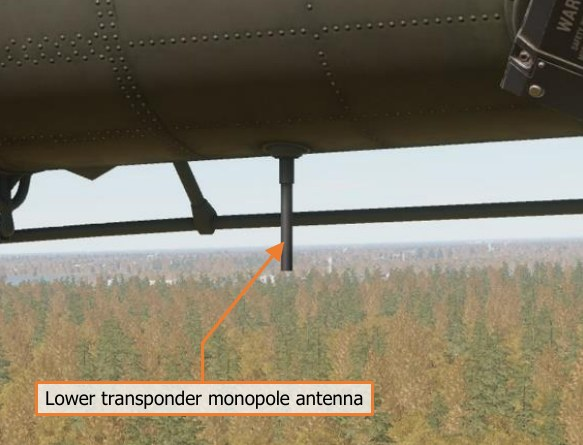
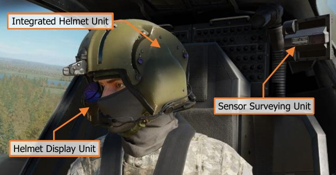
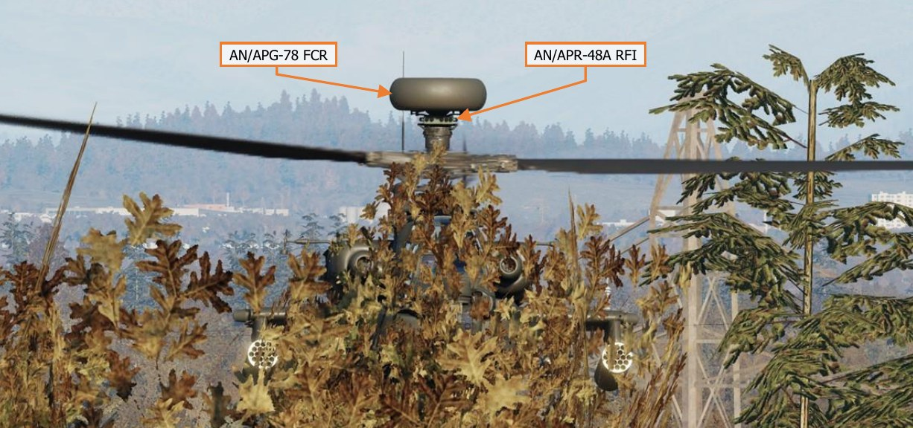

# AIRCRAFT OVERVIEW

The AH-64D is a two-person day/night attack helicopter initially developed by McDonnell Douglas for the U.S.
Army. The helicopter was originally designed by Hughes for the anti-tank role, employing the AGM-114 Hellfire
missile as its primary weapon. Its design incorporates significant survivability and systems redundancy after
lessons learned in the Vietnam war. The AH-64D provides the U.S Army (and other militaries) with one of the
most maneuverable, survivable, and heavily armed rotary-winged aircraft on the modern battlefield.

DCS: AH-64D features a U.S. Army AH-64D Block 2 in service between the years of 2005-2010. The DCS: AH-
64D simulates Lot 9.1 avionics, which was fielded in 2005, along with additional equipment that was fielded to
the U.S Army fleet between 2005 and 2007, such as the Modernized TADS (M-TADS), Common Missile Warning
System (CMWS), and revised engine exhaust assemblies.

## Cockpit

The AH-64D uses a tandem cockpit
layout, with the Pilot (PLT) in the aft
cockpit and the Copilot/Gunner (CPG)
in the forward cockpit. Identical flight
controls are present in both cockpits,
and each can employ any of the AH-
64’s weapon systems, but the Pilot
lacks several targeting and weapon
employment controls that are only
present in the CPG cockpit.
Both cockpits are protected with
ballistic armor, and an additional
ballistic shield separates the two
cockpits. Each crewmember sits within
an armored seat that is mounted on compressible pistons that stroke downward during high-speed vertical
impacts. Coupled with the stroking action of the landing gear, this system is designed to attenuate the impact
forces translated to the crewmembers’ spines, resulting in higher survival rates during crash sequences.
Both cockpit canopies consist of two heated glass windshields, four acrylic side panels, and a fifth acrylic panel
over the Pilot’s crewstation. The canopy doors open upward and to the side for ingress and egress, and manually
latched for flight. Improper latching is detected and annunciated by the onboard avionics.
For emergency egress, both cockpits include a canopy jettison system. Jettison handles are installed for the Pilot
and CPG, as well as an exterior jettison handle for rescue personnel. The jettison system consists of a detonating
cord that ejects the four acrylic side panels for crew egress.

## Fuselage

The AH-64D fuselage is armored in
strategic locations, with 2,500
pounds      of   ballistic   shielding
designed to sustain hits from
projectiles up to 23mm in caliber.
The aft fuselage includes three
integral fire/overheat detectors:
one adjacent the main transmission,
and one on each firewall louver door
(where transmission oil is cooled).
The indication of a fire in these
areas will trigger a visual and audio
warning to the crew.

Critical system relays and wiring are installed in opposing areas, permitting redundancy within the avionics in the
case of computer failure or damage. Each processor group is composed of two individual computers: one primary
and one backup. If the primary processor fails or is damaged from weapons fire, the backup processor
immediately takes over the required computing tasks.

## Fire Protection System

Engine fire detection is provided by two optical flame detectors in each engine compartment, and two in the APU
compartment. Two fire bottles, a primary and a reserve, contain halon fire suppressant. If a fire is detected in
either engine compartment or the APU compartment, a voice warning message will announce to the crew the
location of the fire, along with fire warning lights on the instrument panel. These warning lights will illuminate
which buttons the crew must press to discharge the fire suppressant in an attempt to extinguish the fire.
An additional fire detection circuit is installed into the aft deck area behind the main transmission, near the
accessory gearbox and between the two engines. This fire detection circuit will generate a voice warning message
and an AFT DECK FIRE warning on the EUFD, but there is no fire suppression capability in this area.

## Engines

The AH-64D is powered by two General Electric T700-GE-701C turboshaft engines, each generating up to 1,940
shaft horsepower. The engine output shafts are coupled with frontal-mounted nose gearboxes and regulated by
a Digital Electronic Control (DEC) and integral Hydro-Mechanical Units (HMU). Each engine is assembled in a
modular layout, consisting of a cold section, hot section, power turbine section, and accessory section.

The cold section consists of an inlet particle
separator for dust and sand protection, a six-
stage compressor, variable inlet guide vanes
(IGVs), and variable stator vanes. The DEC is
mounted to underside of the cold section.

The hot section consists of the annular
combustor, nozzle assembly and gas
generator turbine stages. The gas generator is
connected to the cold section’s compressor
through a central shaft, which rotates the
compressor stage to produce self-sustaining
engine power.

The power turbine section consists of two free turbine stages and the exhaust frame. The power turbine shaft
rotates within the gas generator compressor shaft and runs the full length of the engine to the front-mounted
nose gearbox. The engine turbine gas temperature (TGT) thermocouples are mounted to this stage, just aft of
the gas generator stages, along with the engine speed and torque sensors that provide cockpit indications of N P
and TQ respectfully.

The accessory section includes the HMU, NG speed sensor, fuel boost pump, oil system, and the Air Turbine
Starter. Each engine’s nose-mounted reduction gearbox powers the main transmission through an over-running
“sprag” clutch that will disengage the engine from the main transmission if the powertrain system is operating at
a higher RPM than the engine’s power turbine.

### Digital Electronic Control and Hydro-Mechanical Unit

The DEC and HMU work together to manage each engine, managing fuel flow based on the position of the power
levers and collective handles. The power lever position is mechanically transmitted to the HMU via a Power
Available Spindle (PAS), and the collective position mechanically via a Load Demand Spindle (LDS). During normal
operation, the HMU controls fuel flow to the combustor according to the PAS and LDS. The HMU also schedules
the inlet guide vanes, controls the anti-ice and start bleed valve, and regulates discharge air pressure and NG
(gas generator RPM). The HMU includes an automatic NG overspeed cut-off that will flame out the engine to
prevent an engine overspeed.

The DEC coordinates automatic torque load-sharing between the two engines, monitors NP (power turbine RPM),
and limits turbine gas temperature (TGT). Like the HMU’s automatic NG overspeed cut-off, the DEC has an
automatic NP overspeed cut-off. The DEC is normally powered by the engine’s alternator but can use aircraft
power as a backup. The DEC for each engine can be disabled by momentarily placing the engine’s power lever
into the “lock-out” position.

The DEC has a contingency power feature that automatically activates during single-engine operations. If an
engine fails, the DEC of the opposite engine automatically increases the TGT limiter of the remaining engine to a
higher value, permitting an increase in operating temperature at the expense of engine life.

### Starter System

The starter system consists of a pneumatic starter valve, an ignition system with two igniter plugs, and the DEC.
Pneumatic pressure for engine start can be supplied by the Auxiliary Power Unit (APU), Aircraft Ground Power
Unit (AGPU), or a running engine (cross-bleed start).

During engine start, the DEC will monitor engine parameters and automatically abort the start if an imminent hot
start is detected.

## Auxiliary Power Unit (APU)

The GTCP36-155 APU, manufactured by Allied Signal/Garret, is a self-contained gas turbine engine that drives
the accessory section of the main transmission to generate electrical and hydraulic power without operating the
main engines or rotating the rotor blades. The APU can generate pressurized air, which is primarily used to start
the main engines without requiring external ground power sources.
The APU draws fuel from the aft fuel cell only
and consumes approximately 175 pounds per
hour when operating.

The APU is automatically monitored by an
Electronic Control Unit (ECU), which detects
overspeed and overcurrent anomalies, as well as
abnormal oil pressure. The ECU will
automatically shut down the APU when an
anomaly is detected. The ECU also controls the
power takeoff (PTO) clutch engagement to the
accessory section of the main transmission.

## Drivetrain

The main rotor drive system consists of the main rotor drive shaft, main rotor transmission, three-stage reduction
gearing, and dual independent integral oil systems. The main transmission receives power from two nose gearbox
inputs, one mounted on each turboshaft engine. The main transmission is used to drive the main rotor.

An accessory gearbox is mounted to the aft side of the main transmission. This gearbox provides mechanical
power to the aircraft’s two electrical AC generators and two hydraulic pumps, one for the Primary hydraulic
system and the other for the Utility hydraulic system. This prevents the loss of generator and hydraulic power
during an autorotation when both engines have failed. The APU powers the transmission’s accessory gearbox via
the APU drive shaft, which provides full electrical power to the aircraft avionics and hydraulic power to the flight
controls prior to starting the main engines. The accessory gearbox also includes the rotor brake and the main
rotor RPM (NR) sensor.

The tail rotor drive system consists of the tail rotor drive shaft, intermediate gearbox, and tail rotor gearbox. The
tail rotor drive shaft consists of four sections within the tail boom. The sections are connected with flexible
couplings and mounted with hanger bearings to accommodate aerodynamic and maneuvering loads from the tail
boom. The intermediate gearbox is at the base of the vertical stabilizer, and the tail rotor gearbox is at the base
of the tail rotor static mast. Both gearboxes reduce the transmission RPM and change the angle of the drive.

The main and tail rotor drive shafts are designed to carry torque loads only. Each of these shafts pass through
and rotate within a static mast. The main rotor static mast carries all vertical and bending loads, and the tail rotor
static mast absorbs all tail rotor loads. This allows the aircraft to perform aggressive or aerobatic maneuvers
while minimizing stresses to the drive train system.

## Rotors

The AH-64D has a four-blade main rotor for lift and propulsion, and a four-blade tail rotor for anti-torque and
directional control.

The main rotor is fully articulated, with each blade able to
flap, feather, lead, and lag independently. Mechanical
droop stops under each Pitch Change Housing limits blade
droop.

The four-blade tail rotor is semi-rigid of a teetering design.
Each opposing pair of rotor blades are offset at 55° for
ease of maintenance and to increase tail rotor efficiency.
Flapping and feathering of the tail rotor to counter
dissymmetry of lift in forward flight is facilitated by the use
of a delta hinge installed to each pair of tail rotor blades.

## Flight Controls

AH-64D flight controls are hydromechanical, consisting of mechanical linkages between the flight controls and
control surfaces, augmented by transmission-driven hydraulic power. The flight controls are conventional and
consist of a cyclic stick, collective lever, and anti-torque pedals.

The cyclic is mechanically connected to the swashplate on the rotor mast that tilts the main rotor for attitude
control using cyclic feathering of the rotor blades. The collective is mechanically connected to the swashplate and
each engine’s Load Demand Spindle (LDS) and directly controls lift by collectively feathering all rotor blades at
once. The anti-torque pedals feather the tail rotor blades for anti-torque and directional control.

Hydraulic augmentation is provided by the Stability and Command Augmentation System (SCAS), which consists
of electro-hydraulic actuators commanded by the Flight Management Computer (FMC). The FMC provides rate
damping and enhanced aircraft stability for accurate weapons employment; and command augmentation for
immediate, smooth, and consistent control feel across the full range of helicopter airspeeds. The FMC also
provides attitude and altitude hold capability for limited hands-off flying.

The AH-64D has an articulating horizontal stabilator
controlled by an electric actuator. The horizontal
stabilator improves pitch control and improves over-
the-nose visibility at low airspeeds. In automatic
mode, the FMC schedules the horizontal stabilator
position according to collective position and airspeed.
In nap-of-the-earth/approach mode (NOE/A), the
horizontal stabilator is driven to the 25° trailing edge
down position when below 80 knots, to further
improve over-the-nose visibility. In manual mode, either crewmember may control the stabilator position with a
switch on the collective.

To ease pilot workload, a force trim system is provided for the cyclic and pedals. The force trim system consists
of lateral, longitudinal, and directional force trim springs and magnetic solenoids that engage and disengage the
force trim. A button on the cyclic disengages the force trim springs, allowing the cyclic and anti-torque pedals to
move freely without resistance. When re-engaged, the force trim springs hold the cyclic and pedals in their current
position and provide an increasing force gradient as the cyclic and/or pedals are deflected away from this
reference position.

## Back-Up Control System (BUCS)

Normally, the Pilot and CPG flight controls are mechanically linked. The mechanical linkages are protected by
shear pins and mis-track sensors to prevent a control jam or severance from affecting both sets of flight controls.

If the flight controls are decoupled by the shear pin, or a mis-track is otherwise sensed, the Back-Up Control
System is automatically activated. The BUCS is a single-channel, four-axis, non-redundant electric fly-by-wire
(FBW) system. The FBW system is designed to replicate the feel of the hydromechanical controls but does not
replicate SCAS functionality.

BUCS can only be active for the Pilot or the CPG station. Either the Pilot or the CPG can transfer BUCS control to
their station if necessary, depending on the nature and location of the jam or severance within the flight controls.

## Landing Gear

The AH-64D has two trailing-link, main landing gear wheels and a lockable, free-castoring tailwheel. The main
landing gear consists of two single wheels with integral disc brakes, mounted on separate nitrogen-oil shock
struts.

Each anti-torque pedal is connected to a hydraulic disc brake on the corresponding main landing gear wheel.
Each brake is connected to its own master cylinder, which provides hydraulic pressure to the braking system.
The Pilot and CPG anti-torque pedals, when pressed downwards, actuate the hydraulic brake system for the
corresponding wheel. A parking brake valve maintains brake pressure when closed.

The tailwheel is free-castoring in a full 360° of rotation. A spring-loaded tailwheel lock can be hydraulically
actuated to hold the tailwheel in its
forward position. The tailwheel lock is
activated from the Collective Flight Grips
or the tail wheel lock pushbuttons.

Both main landing gear shock struts have
a one-time capability to absorb loads from
a high-stress impact. Shear rings and
rupture discs on each strut, when
activated by a hard landing, start a
controlled collapse of the strut to reduce
crash loads on the airframe.

## Fuel System

The AH-64D includes two internal self-sealing, crash-resistant fuel cells. The forward fuel cell holds up to 156
gallons, and the aft fuel cell holds up to 220 gallons. Fuel is normally balanced between the two cells automatically
by the avionics.

A 230-gallon ERFS external fuel tank can be mounted on each of the four stub wing pylons. The external fuel
tank mounted under the left inboard pylon feeds the forward fuel cell, and the external fuel tank mounted under
the right inboard pylon feeds the aft fuel cell. If an additional two fuel tanks are mounted under the outboard
pylons, the outboard external fuel tanks feed fuel to each respective inboard external fuel tank.

An Internal Auxiliary Fuel System (IAFS) may be installed into the ammunition bay, storing 100 gallons at the
expense of reducing the 1200 round ammunition capacity to 300 rounds.

### Fuel Transfer Sub-system

Fuel is transferred between the forward and aft cells using pneumatic pressure. Transfer is normally automatic
but can be manually controlled by the aircrew.

Fuel transfer from the IAFS or external tanks is one-way only. Transfer from the external tanks to the internal
cells is pneumatic, and an electric fuel pump transfers fuel from the IAFS to the internal cells. If fuel is being
transferred between the forward and aft fuel cells, any fuel transfer from external or internal auxiliary fuel systems
will be paused.

Normally, the forward cell feeds engine 1 and the aft cell feeds engine 2. However, if necessary during abnormal
circumstances, the aircrew can manually select different crossfeed modes where both engines feed from one fuel
cell.

An electric boost pump is used to provide motive flow from the aft cell during engine start. This boost pump can
also be manually selected on during an emergency or operations in extreme cold temperatures. The APU has its
own electric boost pump that also draws from the aft cell.

### Nitrogen Inerting Unit (NIU)

The fuel cells are inerted using nitrogen to reduce the risk of fire. The NIU is completely self-contained and
automatic. It uses aircraft power and pressurized air and generates an inerted mix containing around 99%
nitrogen. This inerted gas is used to pressurize the internal cells, to include the IAFS during fuel transfer, if the
IAFS is installed.

## Electrical System

Electrical aircraft power is managed by the Electrical Power Management System (EPMS). The EPMS is a fully
redundant and automatic power system consisting of a distributor for battery, AC, and DC power.
The battery is a 24-volt, 15-amp fiber nickel-cadmium (FNC) design. It can provide power for normal flight loads
for up to 12 minutes, assuming at least an 80% charge.

AC power is provided by two brushless, air-cooled generators. Each generator outputs 45 kVA three-phase four-
wire power at 115 or 200 volts and 400 Hz. Each generator has its own Generator Control Unit (GCU). A single
generator is capable of handling full flight loads without shedding. The generators are mounted to the
transmission accessory gearbox, which is powered by the main transmission while at flight RPMs or the APU
during ground operations.

DC power is provided by two Transformer-Rectifier Units (TRUs), each providing 28 volts and 350 amps of DC
power. Like the generators, a single TRU can provide sufficient power for full flight loads without shedding.
Power is distributed by four AC busses, four DC busses, four battery busses, and a battery hot bus. Each bus and
power consumer is protected by a resettable circuit breaker.

An external power receptacle can provide DC and AC power for all systems from an Auxiliary Ground Power Unit
(AGPU).

## Hydraulic System

The AH-64D has two independent hydraulic systems, labeled Primary and Utility. The Primary system exclusively
powers the hydraulic flight control system via the FMC and mechanical flight control linkages. It’s powered by the
main transmission and has a total capacity of six pints with a one-pint reservoir.
The Utility system is a secondary source of hydraulic power for the flight controls (bypassing the FMC), and
powers all other hydraulic systems: rotor brake, Area Weapon System turret drive, ammunition handling system,
APU start motor, tailwheel unlock actuator, and external weapon pylon elevation actuators. Because of the higher
loads placed on the utility system, it has a higher-volume manifold and larger reservoir.
The utility system also charges a 3,000-psi hydraulic accumulator. The hydraulic accumulator is used to provide
hydraulic damping during gun fire, hydraulic power to the APU starter, and can be used to temporarily power the
flight controls via the utility system in an emergency.

Both hydraulic systems are pressurized by a corresponding hydraulic pump powered by the transmission
accessory gearbox, which is powered by the main transmission while at flight RPMs or the APU during ground
operations.

## Integrated Pressurized Air System (IPAS)

The IPAS provides pressurized air to aircraft pneumatic systems from engine bleed air. Bleed air is drawn from
two ports on each engine: a high-pressure port is exclusively used by each hydraulic pump, and a low-pressure
port is used by all other consumers. Low-pressure air is used by the engine air turbine starters, fuel boost and
transfer pumps, anti-ice system, ice detection probe, nitrogen inerting unit, vapor cycle cooling system, and
environmental control system.

IPAS bleed air can be provided by one or both engines, the APU, or an external source such as an AGPU.

### Anti-Ice System

Ice detection is provided by an aspirating ice
detect probe, powered by pneumatic air from
the IPAS. The ice detect probe activates
whenever free air temperature drops to 5° C
or below. When the anti-ice system is in AUTO
mode, detection of ice will automatically
command activation of all anti-ice systems.

Ice protection is provided by engine inlet anti-
ice from main engine bleed air, electrical heat
to the pitot and air data system (ADS) sensors,
electric sensor aperture anti-ice, and
electrically heated canopies.

The canopies also include crewmember-controllable windshield wipers and a defog system powered by the IPAS.

## Environmental Control System (ECS)

The ECS provides avionics cooling via ventilation fans that force conditioned cooling air into each of the four
avionics bays. The ECS also provides crewmember comfort through ventilation, heating, and air conditioning.

Cockpit environmental control is provided via four gaspers installed in each crewstation, two over each shoulder
and another two mounted within the forward instrument panels.

Cockpit heating is provided by regulated bleed air from the IPAS.

Air conditioning is provided from two independent vapor cycle cooling systems. One system provides cooled air
for the Pilot and aft sections of each Extended Forward Avionics Bay (EFAB); the other system provides cooled
air for the CPG, the TADS and PNVS turrets, and the forward sections of each EFAB. A digital control unit (DCU)
manages the flow of cooled air for each system.

In the event of a failure of one of the ECS systems, the DCU of the functioning system will automatically open an
interconnect valve between the two cockpits. The ventilation fans in the failed cockpit will stop, and the functional
cockpit’s ventilation fans will force cooled air into both cockpits.

## Lighting System

The AH-64D’s interior lighting consists of primary instrument lighting and secondary floodlights. The primary
lighting provides backlighting for all panels within the cockpit, such as switch labels, display bezels, and the
keypad. The floodlights are used to illuminate the main instrument panel and side consoles of each cockpit.

Each crewmember also has a dimmable utility light that can be aimed around the cockpit like a flashlight. The
standby instruments in the Pilot cockpit have their own independent lighting and, along with the utility light and
NVG-compatible floodlights, are powered by the battery in the event of a dual generator failure.

Exterior lighting consists of formation lights, navigation lights, anti-collision lights, and a steerable search and
landing light. The landing light is powered by the battery in the event of a dual generator failure.

## Avionics

AH-64D avionics subsystems communicate across four redundant multiplex (MUX) bus channels at 1 Mbps. Each
bus channel consists of a primary and secondary bus. Channel 1 is used for controls and displays, communications
and transponder equipment, and aircraft systems. Channel 2 is used by the Aircraft Survivability Equipment (ASE),
Data Transfer Unit (DTU), flight controls, and navigation systems. Channel 3 is used by the sighting, sensors,
and weapons systems. Channel 4 is used exclusively by the Fire Control Radar (FCR) and Radar Frequency
Interferometer (RFI).

Avionics systems are controlled in both cockpits by Multi-Purpose Displays (MPDs), two per cockpit. Each MPD
has six variable-action buttons (VAB) per side. The buttons of the top row are labeled (left to right) T1–T6, the
bottom row B1–B6, and the left and right columns are labeled (top to bottom) L1–L6 and R1–R6, respectively.
Button B1, labeled “M”, returns the crewmember to the MPD Menu page. Each MPD also includes six fixed-action
buttons (FAB) that allow immediate access to the FCR, WPN, TSD, A/C, COM and VID pages; and a "favorites"
button that allows quick access of up to three frequently used MPD pages.

With external power connected and both throttles in the OFF position, the MPDs will enter a “screen saver” mode
after five minutes of inactivity. Pressing any MPD button will re-activate all MPDs.

Unlike most other aircraft, the AH-64D’s primary flight information is presented to the crewmembers through a
helmet-mounted display, in lieu of dedicated instruments or displays on the instrument panel. This not only frees
up the MPDs to display mission-, sensor-, or weapons-related data, it also ensures the crewmembers can monitor
the flight state of the aircraft while keeping their focus “heads out” of the cockpit, regardless of the direction they
may be looking.

### Navigation System

The AH-64D’s navigation system consists of two Embedded GPS Inertial Navigation Systems (EGI), the Doppler
Radar Velocity Sensor (DRVS), radar altimeter, automatic direction finder (ADF), Helicopter Air Data System
(HADS), and Flight Management Computer (FMC).

Each EGI consists of a five-channel encrypted GPS receiver that provides position updates to a ring laser gyro
(RLG) inertial navigation unit (INU). The two EGIs are labeled INU1 and INU2, and the navigation system will
automatically select between each as either primary or backup.

In addition, the AH-64D uses the AN/ASN-157 Doppler Radar Velocity Sensor (DRVS) as a velocity-aiding source
for the EGI. The DRVS uses Doppler radar measurements to determine aircraft ground speed and direction.
The AN/APN-209 Radar Altimeter provides height above ground level (AGL) to the navigation system. The APN-
209 uses a downward-facing radar transmitter and a separate receiver antenna to determine AGL altitude.

The AN/ARN-149 Automatic Direction Finder (ADF) provides audio and radio direction-finding capability for
transmissions between 100 and 2199.5 kHz.

The Air Data System (ADS) consists of two
independent air data subsystems: the Flight
Management Computer (FMC) and the
Helicopter Air Data System (HADS). The HADS
is comprised of the High Integrated Air Data
Computer (HIADC) and two Airspeed And
Direction Sensor (AADS) probes mounted to
the engine nacelles. The AADS probes sense
airspeed magnitude, direction, and free
airstream temperature. The HIADC uses this
data, along with ambient and pitot pressure
sensors, to compute air mass related data.

The FMC uses static and dynamic air pressures
measured from the static ports and pitot tubes to compute pressure altitude, air speed, and density altitude
related information. The FMC receives longitudinal and lateral true air speeds, static temperature, and non-filtered
true air speeds from the HIADC.

### Communications System

The communications system includes an intercom for crewmember communication, an ARC-186(V) VHF-AM radio,
an ARC-164(V) UHF-AM radio, two ARC-201D VHF-FM radios, and an ARC-220 HF radio.

The VHF radio can receive between 108.000 and 115.975 MHz and transmit/receive between 116.000 and
151.975 MHz. The VHF radio includes no frequency-hopping or encryption capability.

The UHF can transmit and receive between 225.000 and 399.975 MHz; and includes a separate GUARD receiver
tuned to 243.000 MHz. The radio is capable of HAVE QUICK and HAVE QUICK II frequency-hopping as an
electronic counter-countermeasures (ECCM) capability. A KY-58 is installed which facilitates voice and data
encryption for the UHF radio.

The two FM radios can transmit and receive between 30.000 and 87.975 MHz. The radios support SINCGARS
combat nets for frequency-hopping and include internal encryption for secure voice and data. The FM1 radio can
be augmented by an improved FM amplifier capable of providing up to 40 watts of transmit power for extending
the transmission range of the radio.

The HF radio can transmit and receive between 2.0000 and 29.9999 MHz and utilizes a KY-100 for voice and data
encryption.

The AH-64D includes an MD-1295A modem that can transmit and receive AFAPD (Air Force Applications Program
Development) messages over any radio except the ARC-220 HF radio, which has its own internal modem.
All radios are connected to the battery bus and can be utilized without generator power, but are limited to single-
channel radio frequencies that have been pre-loaded into the avionics.

### Identification System

The AH-64D includes an APX-118(V) transponder, capable of responding to interrogations in Mode 1, Mode 2,
Mode 3/A, and Mode C formats. The APX-118(V) can also reply to encrypted Mode 4 interrogations.

## Sensor and Sighting Systems

The primary sensor and sighting system for
the AH-64 is the Integrated Helmet And
Display Sighting System (IHADSS). The
IHADSS consists of the Helmet Display Unit
(HDU), a small, collimated display placed in
front of the crewmember’s right eye (on a
rotatable arm); the Integrated Helmet Unit
(IHU) and Sensor Surveying Units (SSU), a
series of sensors in the cockpit that determine
crewmember head position and line-of-sight;
the Boresight Reticle Units (BRU), which
establishes sensor boresight; and avionics
systems that can slave sensor and weapon
systems to the IHADSS line of sight.

The IHADSS displays sensor, targeting, and
aircraft information in the crewmember’s
line-of-sight, helping the crewmembers to
locate and track targets and maintain
situational awareness. The HDU symbology
format changes depending on the display
mode selected by the crew. The display is
also capable of overlaying video from the
PNVS or TADS sensors, augmenting the
crewmembers’ view of terrain, obstacles,
and targets at night or inclement weather.
FLIR video for the Pilot comes from the
AN/AAQ-11 Pilot Night Vision System
(PNVS), which provides day- and night-
capable infrared video.

The AN/ASQ-170 Target Acquisition Designation Sight (TADS) is an integrated target acquisition and tracking
system for the AH-64D’s Copilot/Gunner. It consists of both FLIR and Day TV (DTV) video systems, a laser
rangefinder/designator (LRF/D), and a laser spot tracker (LST). This gives the CPG the ability to locate, track,
and laser designate targets day and night, and in inclement weather conditions.

Unique to the D model AH-64 is the AN/APG-78 Fire Control Radar (FCR) and AN/APR-48A Radar Frequency
Interferometer (RFI). The APG-78 is a millimeter-wave radar with the capability to detect and classify up to 256
air or ground targets. The radar is mounted atop the main rotor mast, allowing the helicopter to remain masked
while scanning for targets. It has a scan capability of ±45° in azimuth and ±25° in elevation, but can be rotated
±90° in azimuth to scan a sector to either side in air-to-ground mode, or a full 360° in air-to-air mode.

Along with the IHADSS and TADS, the FCR can be used as a source of targeting data for the 30mm Area Weapon
System, 2.75-inch unguided rockets, and AGM-114 Hellfire anti-tank missiles.

