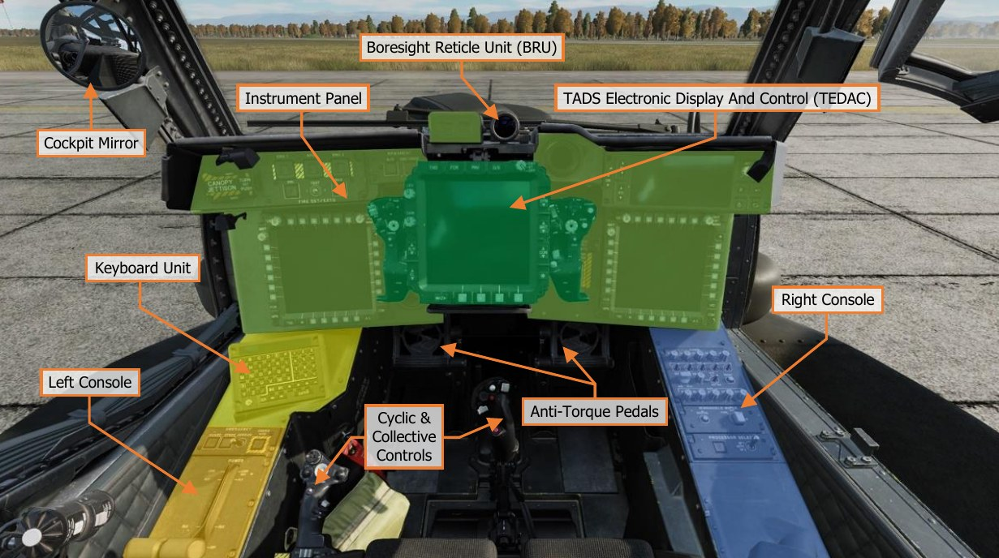
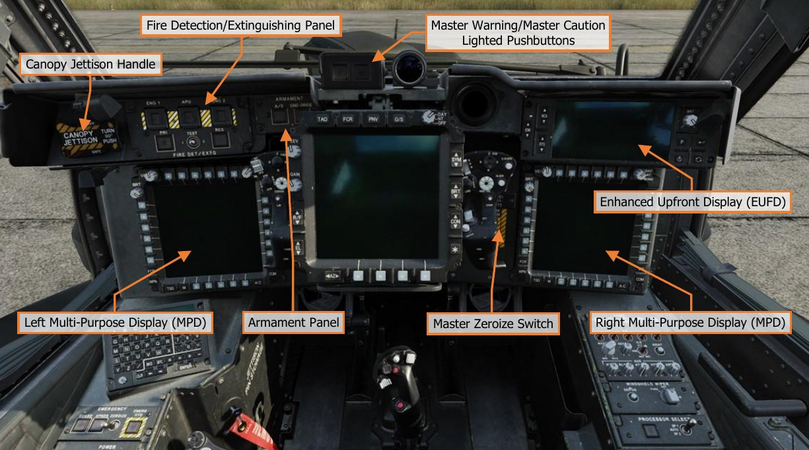
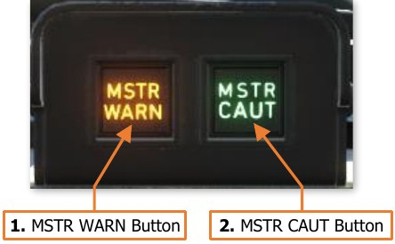
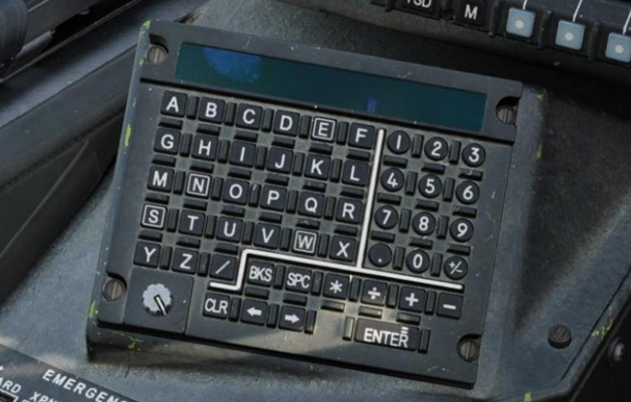
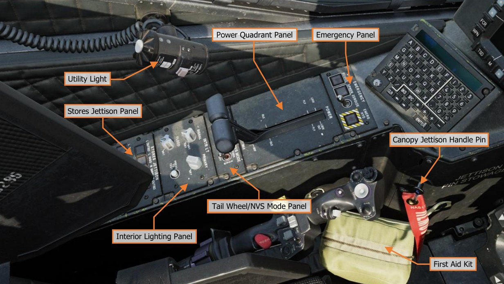
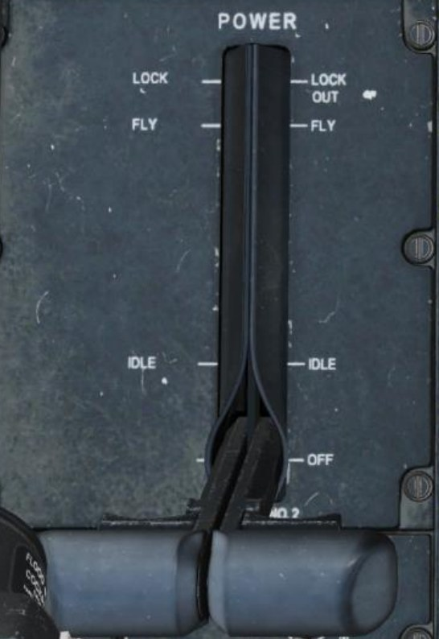
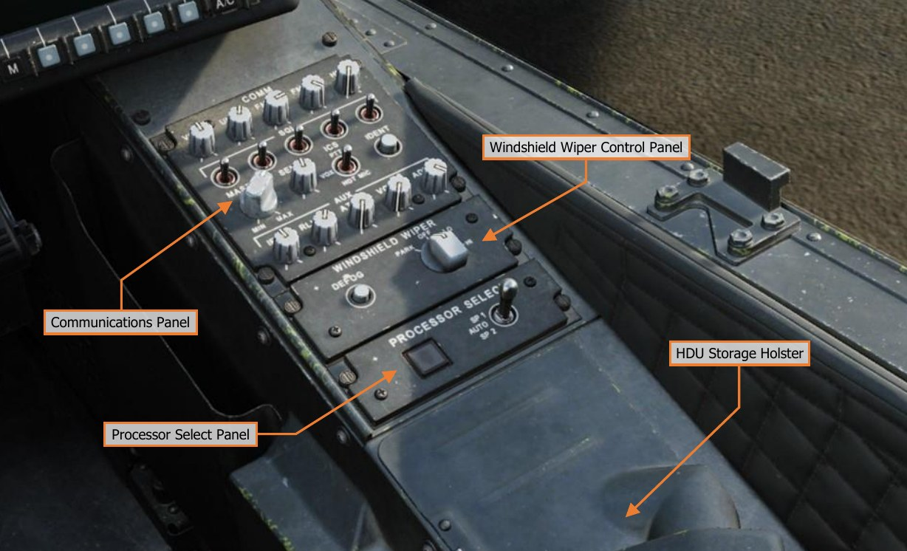
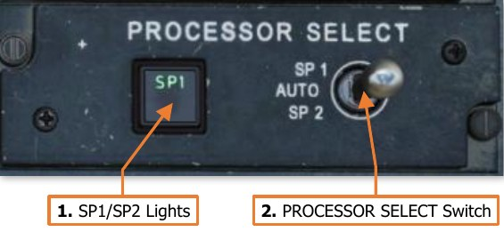
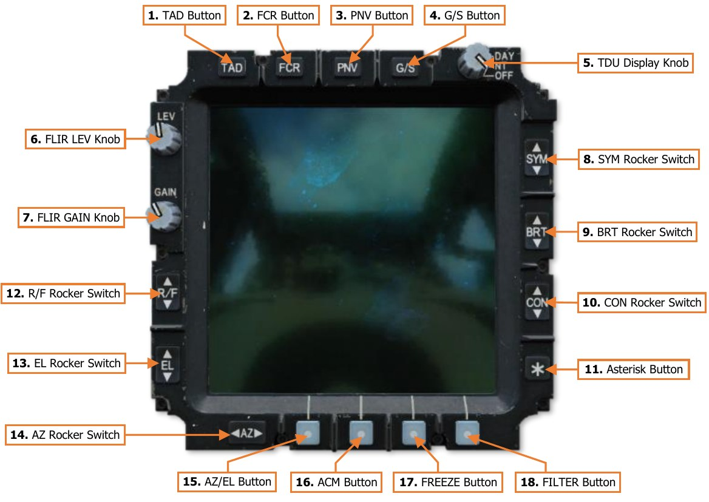
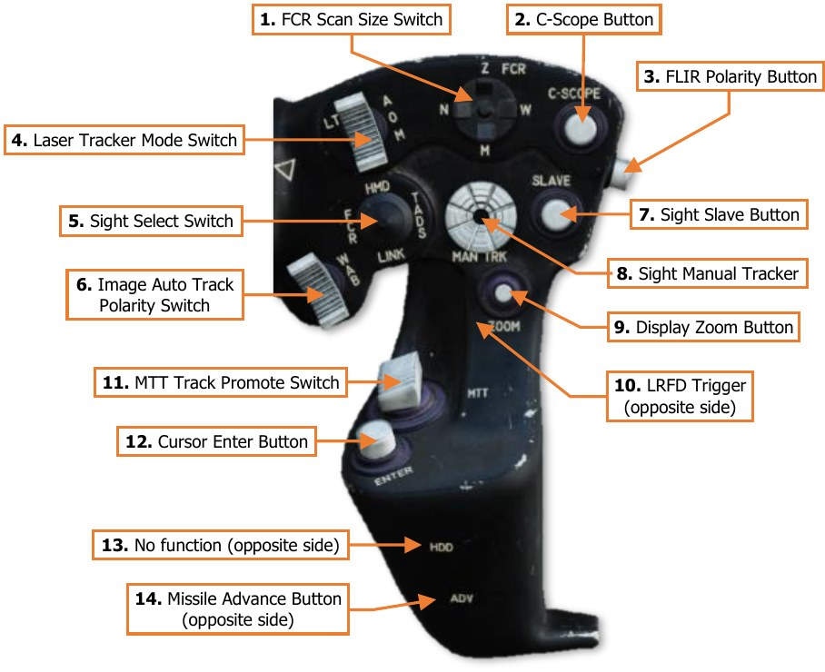

# COPILOT/GUNNER COCKPIT OVERVIEW

The Copilot/Gunner’s primary task is to utilize the aircraft sensors to continuously search, acquire, identify, and
(when appropriate) engage targets on the battlefield with the aircraft’s weapon systems. When enemy targets
are located and identified, the Copilot/Gunner (CPG) coordinates with the Pilot (PLT) to determine the best course
of action to accomplish the mission. Effective communication and coordination between the crewmembers are
critical to mission success.

The CPG’s secondary task is to manage the aircraft navigation and communication systems during the mission.
As the Pilot will often be focused on flying the aircraft and maneuvering around the terrain and obstacles, the
CPG will typically be focused inside the cockpit to tune radio frequencies, monitor the aircraft movement along
the current route, and receive or transmit tactical reports. Accordingly, the CPG coordinates with other units, to
include ground forces, or the other Copilot/Gunners within the team to delineate sectors of fire, sensor coverage,
and fires distribution on enemy targets.

The CPG can effectively utilize any sensor on the aircraft to search for or engage enemy targets. While the Pilot
can assist in the targeting process by using the FCR to hand over targets to the Copilot/Gunner, the CPG can also
directly control the FCR, and may autonomously hand over targets between the FCR and the TADS. If necessary,
the CPG may even hand over a TADS target to the Pilot for an engagement using the FCR, while the CPG continues
to scan the battlefield for additional targets with the electro-optical sensors in the TADS.

It is important to have a general understanding of where the various controls are located. To help locate items
more easily, the cockpit has been delineated into five primary areas: Instrument Panel, the Keyboard Unit
(KU), Left Console, Right Console, and the TADS Electronic Display And Control (TEDAC).
Each text box above may be selected to jump to a more detailed description of that instrument panel or console,
to include the Cyclic & Collective Controls. Selecting the image of the instrument panel or console will return
the manual back to this page.

### Instrument Panel

Each text box above may be selected to jump to a more detailed description of that panel. Selecting the image
of the panel will return the manual back to this page.

The Enhanced Upfront Display (EUFD) and Multi-Function Displays (MPD) are described in dedicated sections
later in this chapter. //link

The Fire Detection/Extinguishing Panel, Armament Panel, Canopy Jettison Handle, and Master Zeroize Switch
function identically to those in the Pilot cockpit. //link

#### Master Warning/Master Caution Lighted Pushbuttons

The Master Warning/Master Caution lighted pushbuttons alerts the
CPG to observe the EUFD WCA area for warning and caution messages
indicating conditions that require their immediate attention.

1. **MSTR WARN Button**. Acknowledges the MAST ER WARNING
     condition. Extinguishes the MSTR WARN light in the CPG
     crewstation and ceases the corresponding voice warning message
     in both crewstations.

    -   MSTR WARN Light. Flashes to alert the CPG to a
            WARNING message displayed on the EUFD.

1. **MSTR WARN Button**. Acknowledges the MASTER CAUTION condition. Extinguishes the MSTR CAUT light
     and ceases the corresponding caution audio tone in the CPG crewstation.

    -   MSTR CAUT Light. Illuminates to alert the CPG to a CAUTION message displayed on the EUFD.

#### Keyboard Unit

The Keyboard Unit (KU) functions
identically to the KU in the Pilot
cockpit. //link

### Left Console

Each text box above may be selected to jump to a more detailed description of that panel. Selecting the image
of the panel will return the manual back to this page.
The Emergency Panel, Tail Wheel/NVS Mode Panel, and Stores Jettison Panel function identically to those in the
Pilot cockpit. //link

#### Power Quadrant Panel

The ENG POWER levers in the Copilot/Gunner cockpit
function identically to those located on the Pilot’s Power
Quadrant Panel.

The CPG’s ENG POWER levers are connected to the
Pilot’s ENG POWER levers through linkages between the
cockpits. When either crewmember moves an ENG
POWER lever, the corresponding lever in the other
cockpit will move accordingly.

However, the CPG’s finger-lift detent levers are not
mechanically linked to the physical detents of the Pilot’s
ENG POWER levers. The detent levers on the ENG
POWER levers in the CPG cockpit use microswitches to
electrically command the detents in the Pilot cockpit. As
such, the electrical power is required for the CPG to
physically move the ENG POWER levers beyond the
LOCK OUT or IDLE detents.

#### Interior Lighting Panel

The Interior Lighting panel controls the exterior aircraft 
lighting and the interior lighting within the
Copilot/Gunner cockpit.

1. **SIGNAL Knob**. Adjusts the brightness of the signal
     lights within the cockpit when set to nighttime
     brightness levels. This knob will have no function if
     the signal lights are set to daytime brightness level.
     Rotating the knob to the RST (Reset) detent will set
     the signal light brightness scale to nighttime levels
     if the PRIMARY knob is not in the OFF position and
     the FLOOD knob is less than 50%.

1. **PRIMARY Knob**. Adjusts the brightness of the
     primary instrument backlighting within the cockpit.
     Rotating this knob to the OFF position will revert
                                                           
     the signal lights to daytime mode.

1. **FLOOD Knob**. Adjusts the brightness of the interior flood lights within the cockpit. Rotating this knob
     clockwise beyond the 50% setting will revert the signal lights to daytime mode.

1. **PRESS TO TEST Button**. Illuminates all signal lights to verify their function.

### Right Console

The Communications Panel and Windshield Wiper Control Panel function identically to those in the Pilot cockpit. //link

#### Processor Select Panel

The Processor Select panel controls the System
Processor (SP) selection for aircraft functions. (N/I)

1. **SP1/SP2 Lights**. Illuminates either SP1 or SP2 to
     indicate which System Processor is primary.

1. **Processor Select Switch**. Sets primary SP
     selection to automatic or manual selection.

    -   SP1. Manually selects SP1 as the primary SP.

    -   AUTO. Enables automatic switchover of aircraft functions if the primary SP malfunctions.

    -   SP2. Manually selects SP2 as the primary SP.

#### TADS Electronic Display And Control (TEDAC)

The TEDAC is a modernized replacement for the Optical Relay Tube (ORT) from the AH-64A and early AH-64D
aircraft. Its primary purpose is to present the CPG with high-resolution sensor video from the Modernized Target
Acquisition Designation Sight (M-TADS).

Along with the TDU bezel controls, fixed handgrips on either side of the TEDAC are used to control aircraft
sensors, weapons, and the CPG’s MPD cursor. Many of these controls replicate functions on the CPG’s cyclic and
collective controls but allow the CPG to utilize such functions without actively interfering with the Pilot’s flight
control inputs.

The TEDAC can also be used to display the FCR page as an alternative to an MPD. However, since the TEDAC
does not have Variable Action Buttons along the bezel of its display, the bezel FCR controls may only be utilized
using the left handgrip cursor controller.
Each text box above may be selected to jump to a more detailed description of that TEDAC component. Selecting
the image of the component will return the manual back to this page.

#### TEDAC Display Unit (TDU)

The TEDAC Display Unit provides the CPG with a “heads-out” display for presenting TADS or PNVS sensor video,
or FCR targeting information. The TDU will display sensor video in a grayscale format when the TDU Display Knob
is set to DAY mode, or in a greenscale format when the Display Knob is set to NT mode.

If the CPG’s NVS Mode switch is set to NORM or FIXED, the TDU will function as a repeater of the CPG’s
Helmet Display Unit (HDU) and display HMD Flight symbology and NVS sensor video. The TAD, FCR, PNV,
and G/S buttons along the top of the TDU will be inhibited.

1. **TAD Button**. If the CPG’s NVS Mode switch is set OFF, the TDU will display HMD Weapon symbology when
     the CPG’s selected sight is HMD, or TADS Weapon symbology and TADS sensor video when the CPG’s
     selected sight is TADS.

1. **FCR Button**. If the CPG’s NVS Mode switch is set OFF, the TDU will display the FCR page. All FCR page
     functions (except for accessing the UTIL sub-page) are mirrored on the TDU; however, they may only be
     accessed by using the MPD cursor.
     The MPD cursor can only be moved to the TDU using the “bump” method, and only when the FCR page is
     displayed. To bump the cursor to the TDU FCR page, move the cursor to the inboard edge of either MPD,
     release input on the Cursor Controller, and then re-apply pressure input inboard toward the TDU.

1. **PNV Button**. If the CPG’s NVS Mode switch is set OFF, the TDU will display the Pilot’s HMD Flight symbology
     and NVS sensor video. If the CPG’s selected sight is TADS or FCR, this button will also display the Pilot’s
     HMD Flight symbology and NVS sensor video within the CPG’s HDU.

1. **G/S Button**. If the CPG’s NVS Mode switch is set OFF, the TDU will display a grayscale pattern. The
     grayscale pattern is used to set the appropriate brightness and contrast levels for the TDU video output.

1. **TDU Display Knob**. Powers the TDU video screen and selects the overall brightness scale.

    - DAY. Powers on the TDU and sets the overall brightness scale to daytime levels.

    - NT. Powers on the TDU and sets the overall brightness scale to nighttime levels.

    - OFF. Powers off the TDU screen only. All TEDAC functions and TDU bezel buttons remain functional.

1. **FLIR LEV Knob**. Controls the relative brightness scale of thermographic video from the PNVS or TADS FLIR
     cameras.

1. **FLIR GAIN Knob**. Controls the relative thermographic gain from the PNVS or TADS FLIR cameras.

1. **SYM Rocker Switch**. Controls the brightness level of displayed symbology on the TDU or within the CPG’s
     HDU. When the CPG’s selected sight is HMD, the symbology within the CPG’s HDU will be adjusted. When
     the CPG’s selected sight is TADS or FCR, the symbology brightness on the TDU will be adjusted. The
     symbology brightness may be incrementally adjusted using short presses, or continually adjusted using
     continuous presses.

1. **BRT Rocker Switch**. Controls the overall brightness level of the TDU or CPG’s HDU. When the CPG’s
     selected sight is HMD, the overall brightness level of the CPG’s HDU will be adjusted. When the CPG’s
     selected sight is TADS or FCR, the overall brightness level of the TDU will be adjusted. The brightness level
     may be incrementally adjusted using short presses, or continually adjusted using continuous presses.

1. **CON Rocker Switch**. Controls the contrast level of the TDU or CPG’s HDU. When the CPG’s selected sight
    is HMD, the contrast level of the CPG’s HDU will be adjusted. When the CPG’s selected sight is TADS or FCR,
    the contrast level of the TDU will be adjusted. The contrast level may be incrementally adjusted using short
    presses, or continually adjusted using continuous presses.

1. **Asterisk Button**. Resets the overall brightness and contrast levels to their default settings. When the CPG’s
    selected sight is HMD, the overall brightness and contrast of the CPG’s HDU will be reset. When the CPG’s
    selected sight is TADS or FCR, the overall brightness and contrast of the TDU will be reset.

1. **R/F Rocker Switch**. Adjusts the range focus of the selected TADS sensor. Pressing up on the rocker switch
    sets the focus to longer ranges. Pressing down on the rocker switch sets the focus to shorter ranges. The
    focus may be incrementally adjusted using short presses, or continually adjusted using continuous presses.

1. **EL Rocker Switch**. Not implemented.

1. **AZ Rocker Switch**. Not implemented.

1. **AZ/EL Button**. Not implemented.

1. **ACM Button**. Not implemented.

1. **FREEZE Button**. Freezes the current frame on the TDU video screen. The video output will continue to
    update normally on other displays within either crewstation.

1. **FILTER Button**. Not implemented.

#### TEDAC Left Handgrip (LHG)

1. **Image Auto Track/Offset Switch**. Controls the Image Auto-Track (IAT) targeting functions of the TADS.

    - IAT (Forward). Commands an auto-track on the target within the TADS line-of-sight (LOS) reticle
         and sets it as the IAT primary track.
         If the TADS LOS reticle is within the IAT primary track gates, commands the primary track Aim Point
         to update its position to the centroid of the TADS LOS reticle.

    - OFS (Aft). If the TADS LOS is outside the IAT primary track gates, a short press (<0.5 second) to the
         OFS position will command the TADS LOS reticle to return to the IAT primary track from its offset
         postion.
         If the TADS LOS is within the IAT primary track gates, a short press (<0.5 second) to the OFS position
         will drop the primary track.
         A long press (>0.5 second) to the OFS position will command the TADS to drop the primary track and
         any secondary tracks, regardless of the current position of the TADS LOS reticle.

1. **TADS Field-Of-View Switch**. Selects the magnification field-of-view of the TADS FLIR/DTV cameras.

    - W (Wide, Right). Sets the FLIR/DTV optical magnification to wide field-of-view.

    - M (Medium, Aft). Sets the FLIR optical magnification to medium field-of-view. If DTV is the selected
         sensor, sets the DTV optical magnification to wide field-of-view.

    - N (Narrow, Left). Sets the FLIR/DTV optical magnification to narrow field-of-view.

    - Z (Zoom, Forward). Sets the FLIR/DTV video to a 2:1 electronic magnification.

1. **Video Record Button**. Not implemented.

1. **TADS Sensor Select Switch**. Selects the TADS sensor to be used for targeting. This switch position is
     overridden and commanded to FLIR when the CPG NVS Mode switch is set to NORM or FIXED.

    - FLIR (Forward). Sets the TADS sensor video to the Forward-Looking Infrared thermographic camera.

    - DTV (Center). Sets the TADS sensor video to the Day Television camera.

    - DVO (Aft). No function.

1. **Weapon Action Switch (WAS)**. Selects, or “actions”, a weapon system for employment. (Also known as
     “WASing”, pronounced “Wahz-ing”). Selecting the same weapon a second time will de-select, or “de-action”,
     the weapon. If the Copilot/Gunner actions a weapon from the TEDAC Left Handgrip (LHG), only the weapon
     trigger on the LHG will be activated for weapons employment from the CPG station.
     Neither crewstation has priority over the other, allowing either cyclic Weapon Action Switch to action the
     weapon, taking control away from the other crewstation in a “last actioned” logic.

    - G (Gun, Forward). Actions/de-actions the Area Weapon System (AWS) for employment and slaves
          the gun to the weapon solution of the selected sight within the crewstation.

    - R (Rocket, Left). Actions/de-actions the Aerial Rocket Sub-system (ARS) for employment, activates
          pylon articulation, and displays the Rocket Steering Cursor symbology within the crewstation.
          If the CPG actions rockets using the Weapon Action Switch on the LHG and the Pilot actions rockets,
          the crew will enter COOP (Cooperative) rocket mode.
          If the CPG actions rockets using the Weapon Action Switch on the CPG cyclic and the Pilot actions
          rockets, the rockets will be assigned to either crewstation using the “last actioned” logic.

    - M (Missile, Right). Actions/de-actions the Hellfire Modular Missile System (HMMS) for employment,
          activates pylon articulation, and displays the Missile Launch symbology within the crewstation.

    - A (Air-To-Air, Aft). No function.

1. **Store/Update Switch**. Stores new target or waypoint locations using the CPG’s selected sight or perform
     position updates to the aircraft navigation system.

    - STORE (Forward). When the CPG’s selected sight is set to TADS, moving the switch momentarily to
          this position stores a Target (TG) point along the TADS line-of-sight at the current range. When the
          CPG’s selected sight is set to FCR, moving the switch momentarily to this position stores a Target (TG)
          point at the location of the Next-To-Shoot (NTS Target).
          When used in conjunction with the TSD Point sub-page, may be used to store a Waypoint (WP) or
          Target Point (TG), and may be used in conjunction with either the HMD or the TADS.

    - UPDT (Aft). Not implemented.

1. **FCR Mode Switch**. Not implemented.

1. **Cursor Controller/Enter**. Controls the MPD cursor movement on the MPD, allowing bezel options to be
     selected by the cursor in lieu of the bezel buttons; or cursor-selection of points on the MPD itself. Depressing
     the Cursor Controller commands the highlighted item underneath the cursor to be selected.

1. **Cursor Display Select Button**. Sets the MPD cursor to the center of the opposite MPD.

1. **Weapon Trigger**. Fires the weapon system that has been actioned within the crewstation.

    - First Detent. Fires the weapon system if no Performance or Safety Inhibits are present.

    - Second Detent. Fires the weapon system if no Safety Inhibits are present.

1. **FCR Scan Switch**. When the CPG’s selected sight is set to FCR, momentarily setting the switch to either
    position will initiate an FCR scanburst. If the FCR is already performing a single or continuous scanburst,
    momentarily setting the switch to either position will terminate the ongoing scanburst.

    - S-SCAN (Forward). Initiates a single scanburst. The FCR will perform several scans of the FCR scan
         volume and then terminate scanning. The number of scans that are performed within a single scanburst
         are dependent on the selected scan size.

    - C-SCAN (Aft). Initiates a continuous scanburst. The FCR will perform scans of the FCR scan volume
         continuously until manually terminated by the crewmember or until a different sight is selected.

1. **Cued Search Button**. Not implemented.

1. **Cage Button**. No function.

1. **Linear Motion Compensation Button**. Toggles the Linear Motion Compensation function of the TADS
    system. (See Target Acquisition Designation Sight (TADS) for more information.)

#### TEDAC Right Handgrip (RHG)

1. **FCR Scan Size Switch**. Selects the FCR scan size when the CPG’s selected sight is set to FCR.

    - Wide (W). Sets the FCR scan volume to 90° in azimuth.

    - Medium (M). Sets the FCR scan volume to 45° in azimuth.

    - Narrow (N). Sets the FCR scan volume to 30° in azimuth.

    - Zoom (Z). Sets the FCR scan volume to 15° in azimuth.

1. **C-Scope Button**. Not implemented.

1. **FLIR Polarity Button**. Toggles the FLIR image polarity between white-hot and black-hot.

1. **Laser Tracker Mode Switch**. Enables/disables the Laser Spot Track (LST) mode of the TADS system.

    - A (Automatic). Enables the LST in Automatic mode and inhibits the LRFD from firing.

    - O (Off). Disables the LST and permits the LRFD to fire.

    - M (Manual). Enables the LST in Manual mode and inhibits the LRFD from firing.

1. **Sight Select Switch**. Selects the sight to be used for targeting and weapon employment within the
     Copilot/Gunner (CPG) crewstation.

    - HMD (Forward). Sets the CPG sight to the CPG’s Helmet-Mounted Display. The CPG’s HDU will display
          HMD Flight symbology.

    - FCR (Left). Sets the CPG crewstation sight to the Fire Control Radar and displays the FCR page on
          the left MPD if not already displayed. When selected while the CPG’s NVS Mode switch is set to OFF,
          the CPG’s HDU will display TADS Weapon symbology and TADS sensor video. If the Pilot is using the
          TADS as his/her NVS sensor, the CPG’s HDU will display HMD Flight symbology.
          Neither crewstation has priority over the other, allowing either Sight Select Switch to select the FCR as
          the sight, taking control away from the other crewstation in a “last selected” logic.

    - TADS (Right). Sets the CPG sight to the Target Acquisition Designation Sight. The CPG’s HDU will
          display TADS Weapon symbology and TADS sensor video. If either crewmember is using the TADS as
          their NVS sensor, this switch position will be inhibited.

    - LINK (Aft). Not implemented.

1. **Image Auto Track Polarity Switch**. Not implemented.

1. **Sight Slave Button**. Slaves/de-slaves the CPG’s selected sight to the selected acquisition source.

1. **Sight Manual Tracker**. Manually controls the CPG’s selected sight when de-slaved from the selected
     acquisition source. Also called the “thumb force controller”.

1. **Display Zoom Button**. Not implemented.

1. **LRFD Trigger**. Fires the laser rangefinder/designator if the A/S button on the Armament panel is set to
    ARM and the LRFD is powered (VAB L6 on the WPN Utility sub-page).

    - First Detent. Fires a short pulse of laser energy for range-finding purposes. To fire additional range-
          finding pulses, the trigger must be released prior to pulling the trigger again.

    - Second Detent. Fires a continuous pulse of laser energy for designation purposes, for the duration
          the trigger is depressed.

1. **MTT Track Promote Switch**. When using the Multi-Target Track sub-mode of the Image Auto-Track, this
    switch cycles the primary track through each auto-tracked target.

    - `–` (Forward). Promotes the previous secondary track as the primary track and commands the TADS
          LOS reticle to the Aim Point of the new primary track.

    - `+` (Aft). Promotes the next secondary track as the primary track and commands the TADS LOS reticle
          to the Aim Point of the new primary track.

1. **Cursor Enter Button**. Commands the highlighted item underneath the cursor to be selected. Used as an
    alternate method of cursor-selection in lieu of depressing the Cursor Controller itself.

1. **HDD Button**. No function.

1. **Missile Advance Button**. Steps to the next Hellfire missile in sequence. This button is only functional when
    the missile mode is set to MAN.

