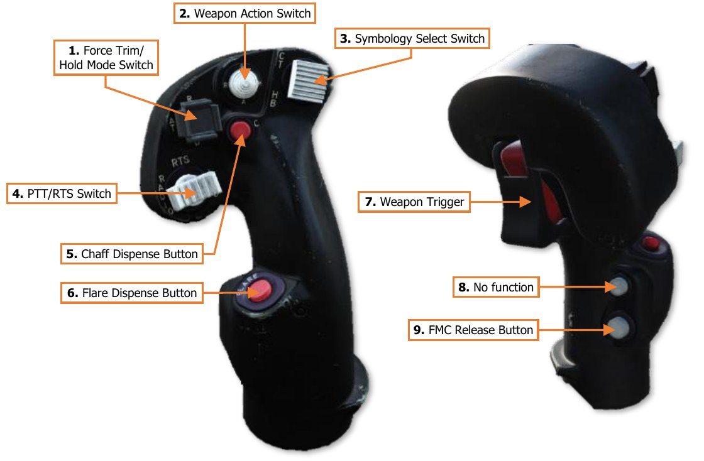

# CYCLIC & COLLECTIVE HAND CONTROLS

The cyclic and collective hand controls allows either crewmember to control many of the aircraft functions
regarding sensors, weapons, communications, and defensive systems without removing their hands from the
flight controls.

The Pilot and Copilot/Gunner cyclic and collective grips are identical in form and function. The only exception is
this is the BUCS trigger on the Pilot’s Collective Flight Grip is non-functional.

### Cyclic Grip

The Cyclic Grip is used to control weapons, communications, and countermeasure functions. It also includes
functions for controlling the IHADSS flight symbology.

1. **Force Trim/Hold Mode Switch**. Controls the force trim and Hold modes provided by the Flight
     Management Computer (FMC).

    -   R (Release, Forward). When held forward, the force trim is interrupted, releasing the magnetic
            brakes on the cyclic and pedals. While force trim is interrupted, Heading Hold and Attitude Hold will be
            disengaged.
            When the switch itself is released, the force trim will re-engage the magnetic brakes on the cyclic and
            pedals, set a new force trim reference point at the current cyclic/pedal positions in pitch, roll and yaw,
            and any applicable hold modes will re-engage (assuming their specific re-engagement logic is met).

    -   AT (Attitude Hold, Left). Activates/deactivates Attitude Hold.

    -   AL (Altitude Hold, Right). Activates/deactivates Altitude Hold.

    -   D (Disengage, Aft). Deactivates Attitude Hold and Altitude Hold.

1. **Weapon Action Switch (WAS)**. Selects, or “actions”, a weapon system for employment. (Also known as
     “WASing”, pronounced “Wahz-ing”). Selecting the same weapon a second time will de-select, or “de-action”,
     the weapon. If the Copilot/Gunner actions a weapon from the Cyclic Grip, only the weapon trigger on the
     Cyclic Grip will be activated for weapons employment from the CPG station.
     Neither crewstation has priority over the other, allowing either cyclic Weapon Action Switch to action the
     weapon, taking control away from the other crewstation in a “last actioned” logic.

    - G (Gun, Forward). Actions/de-actions the Area Weapon System (AWS) for employment and slaves
          the gun to the weapon solution of the selected sight within the crewstation.

    - R (Rocket, Left). Actions/de-actions the Aerial Rocket Sub-system (ARS) for employment, activates
          pylon articulation, and displays the Rocket Steering Cursor symbology within the crewstation.
          If the CPG actions rockets using the Weapon Action Switch on the TEDAC Left Handgrip (LHG) and the
          Pilot actions rockets, the crew will enter COOP (Cooperative) rocket mode.
          If the CPG actions rockets using the Weapon Action Switch on the CPG cyclic and the Pilot actions
          rockets, the rockets will be assigned to either crewstation using the “last actioned” logic.

    - M (Missile, Right). Actions/de-actions the Hellfire Modular Missile System (HMMS) for employment,
          activates pylon articulation, and displays the Missile Launch symbology within the crewstation.

    - A (Air-To-Air, Aft). No function.

1. **Symbology Select Switch**. Selects the IHADSS symbology mode. The symbology mode is common to
     both crewstations, in that the symbology will remain the same for both crewmembers, regardless of which
     Symbology Select Switch was used to change the IHADSS symbology mode.

    - CT (Cruise/Transition, Forward). Selects Transition symbology mode. If Transition symbology is
          already displayed, each subsequent press will toggle between Cruise and Transition symbology modes.

    - HB (Hover/Bob-Up, Aft). Selects Hover symbology mode. If Hover symbology is already displayed,
          each subsequent press will toggle between Bob-Up and Hover symbology modes.
          Each time Bob-Up mode is entered, a new Bob-Up box will be “dropped”, and the command heading
          will be referenced to the current heading value.

    - FLT Page Access/Return (Z-Axis, Depress). Displays the FLT page on the left MPD within the
          crewstation. If the FLT page is already displayed, it will have no effect. If the FLT page is displayed on
          the right MPD, the MPD pages will be swapped.
          If no button is pressed on the FLT page within 10 minutes, depressing the Symbology Select Switch
          will return the left MPD to the previous page. After 10 minutes, the return logic will timeout and will no
          longer be available.

1. **PTT/RTS Switch**. Activates the crewmember’s microphone or selects the next radio for transmission.

    - RADIO (Left). Transmits over the radio currently selected by the RTS indicator on the EUFD.

    - ICS (Right). Transmits over the cockpit intercom to the opposite crewstation and/or ground crews.

    - RTS (Depress). Cycles the Radio Transmit Select indicator on the EUFD to the next radio in sequence.
          If the RTS indicator is set to the HF radio at the bottom of the list, RTS indicator will cycle to the VHF
          radio at the top of the list.

1. **Chaff Dispense Button**. Dispenses the chaff program.

1. **Flare Dispense Button**. Dispenses the flare program.

1. **Weapon Trigger (Guarded)**. Fires the weapon system that has been actioned within the crewstation.

    - First Detent. Fires the weapon system if no Performance or Safety Inhibits are present.

    - Second Detent. Fires the weapon system if no Safety Inhibits are present.

1. **Cage Button**. No function.

1. **FMC Release Button**. Deactivates the Pitch, Roll, Yaw and Collective FMC channels.

### Collective Flight Grip

The Collective Flight Grip is used to control flight and navigation functions.

1. **Emergency Jettison Button (Guarded)**. Jettisons all weapon stations from the underwing pylons.

1. **Boresight/Polarity Switch**. Controls the FLIR polarity for the NVS sensor assigned to the crewstation.

    -   B/S (Boresight). No function.

    -   PLRT (Polarity). Toggles the FLIR image polarity between white-hot and black-hot.

1. **Searchlight Switch**. Activates, deactivates or stows the fuselage-mounted search/landing light.

    -   ON (Forward). Powers the searchlight on.

    -   OFF (Center). Powers the searchlight off.

    -   STOW (Aft). Commands the searchlight to retract to the stowed position. The switch will be spring-
            loaded from STOW to the OFF position.

1. **Searchlight Position Switch**. Controls the position of the fuselage-mounted search/landing light.
     Searchlight position control will be inhibited for 1 minute after STOW is commanded.

    -   EXT (Extend, Forward). Rotates the searchlight bulb forward and up.

    -   L (Left). Rotates the searchlight bulb left/counter-clockwise.

    -   R (Right). Rotates the searchlight bulb right/clockwise.

    -   RET (Retract, Aft). Rotates the searchlight bulb down and back.

1. **NVS Select Switch**. Selects the NVS sensor within the crewstation. When this occurs, the format of the
     Field-Of-Regard Box within each crewmember’s IHADSS symbology will update to reflect their selected NVS
     sensor azimuth/elevation slew limits. (See IHADSS Flight Symbology for more information.)
     Neither crewstation has priority over the other, allowing the NVS Select Switch in either crewstation to select
     either NVS sensor.

    - TADS (Forward). Selects the TADS as the NVS sensor in the crewstation.

    - PNVS (Aft). Selects the PNVS as the NVS sensor in the crewstation.

1. **Stabilator Control Switch**. Sets the horizontal stabilator to Manual or Automatic mode, and controls the
     stabilator angle when set to Manual mode.

    - ND (Nose-Down, Forward). Slews the stabilator trailing edge down, causing the nose to pitch
         forward. If the stabilator is in Automatic mode, this position will set the mode to Manual.

    - NU (Nose-Up, Aft). Slews the stabilator trailing edge up, causing the nose to pitch up. If the stabilator
         is in Automatic mode, this position will set the mode to Manual.

    - RESET (Depress). Resets the stabiliator mode to Automatic.

1. **Chop Button (Guarded)**. Pressing this button activates the Engine Chop circuit, which reduces engine
     power to idle. Pressing it again resets the Engine Chop circuit and restores normal engine power. (N/I)

1. **Tail Wheel Lock/Unlock Button**. Toggles the commanded state of the tail wheel locking mechanism
     between locked and unlocked.

1. **BUCS Trigger (CPG only)**. Enables the Copilot/Gunner (CPG) to override the flight controls in the Pilot
     crewstation when the Back-Up Control System (BUCS) is on. This trigger is non-functional in the Pilot
     crewstation. (N/I)

### Collective Mission Grip

The Collective Mission Grip is used to control aircraft sensors and the MPD cursor.

1. **FCR Mode Switch**. Not implemented.

1. **FCR Scan Size Switch**. Selects the FCR scan size when the crewmember’s selected sight is set to FCR.
  
    -  Wide (W). Sets the FCR scan volume to 90° in azimuth.
  
    -  Medium (M). Sets the FCR scan volume to 45° in azimuth.
  
    -  Narrow (N). Sets the FCR scan volume to 30° in azimuth.
  
    -  Zoom (Z). Sets the FCR scan volume to 15° in azimuth.

1. **Cursor Controller/Enter**. Controls the MPD cursor movement on the MPD, allowing bezel options to be
       selected by the cursor in lieu of the bezel buttons; or cursor-selection of points on the MPD itself. Depressing
       the Cursor Controller commands the highlighted item underneath the cursor to be selected.

1. **Sight Select Switch**. Selects the sight to be used for targeting and weapon employment within the
       crewstation.
  
    -  HMD (HMD). Sets the crewstation sight to the Helmet-Mounted Display. The crewmember’s HDU will
             display HMD Flight symbology.
  
    -  FCR (Left). Sets the crewstation sight to the Fire Control Radar and displays the FCR page on the left
             MPD if not already displayed. When selected in the Copilot/Gunner (CPG) crewstation while the CPG’s
             NVS Mode switch is set to OFF, the CPG’s HDU will display TADS Weapon symbology and TADS sensor
             video. If the Pilot is using the TADS as his/her NVS sensor, the CPG’s HDU will display HMD Flight
             symbology.
             Neither crewstation has priority over the other, allowing either Sight Select Switch to select the FCR as
             the sight, taking control away from the other crewstation in a “last selected” logic.
  
    -  TADS (Right). Sets the Copilot/Gunner (CPG) sight to the Target Acquisition Designation Sight. If the
             CPG’s NVS Mode switch is set to OFF, the CPG’s HDU will display TADS Weapon symbology and TADS
          sensor video. If either crewmember is using the TADS as their NVS sensor, this switch position will be
          inhibited.
          This switch position is non-functional in the Pilot crewstation.

    - LINK (Aft). Not implemented.

1. **Cursor Display Select Button**. Sets the MPD cursor to the center of the opposite MPD.

1. **FCR Scan Switch**. When the crewmember’s selected sight is set to FCR, momentarily setting the switch to
     either position will initiate an FCR scanburst. If the FCR is already performing a single or continuous
     scanburst, momentarily setting the switch to either position will terminate the ongoing scanburst.

    - S-SCAN (Forward). Initiates a single scanburst. The FCR will perform several scans of the FCR scan
          volume and then terminate scanning. The number of scans that are performed within a single scanburst
          are dependent on the selected scan size.

    - C-SCAN (Aft). Initiates a continuous scanburst. The FCR will perform scans of the FCR scan volume
          continuously until manually terminated by the crewmember or until a different sight is selected.

1. **Cued Search Button**. Not implemented.

1. **Missile Advance Button**. Steps to the next Hellfire missile in sequence. This button is only functional when
     the missile mode is set to MAN.

1. **Alternate Cursor Enter Trigger**. Commands the highlighted item underneath the cursor to be selected.
     Used as an alternate method of cursor-selection in lieu of depressing the Cursor Controller itself.

