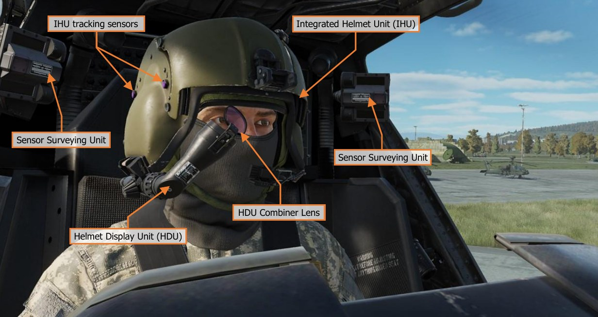
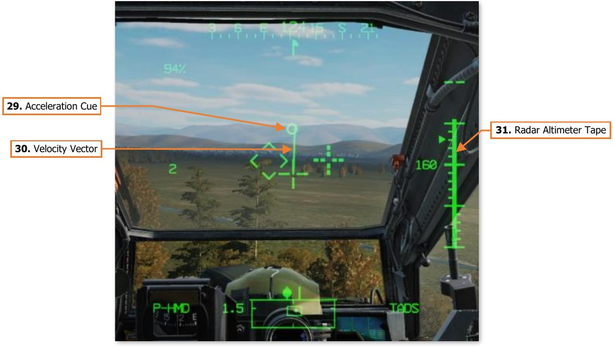
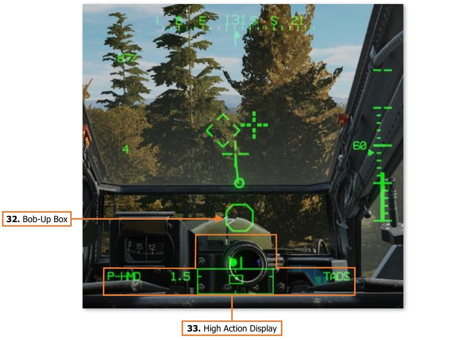
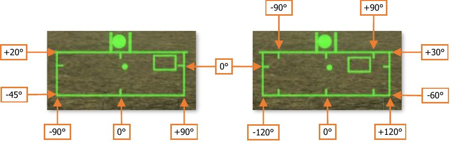
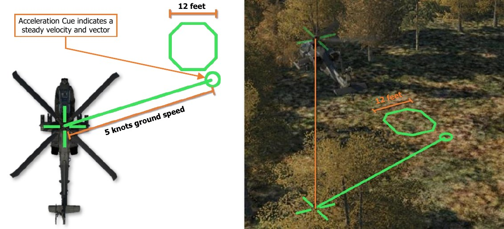
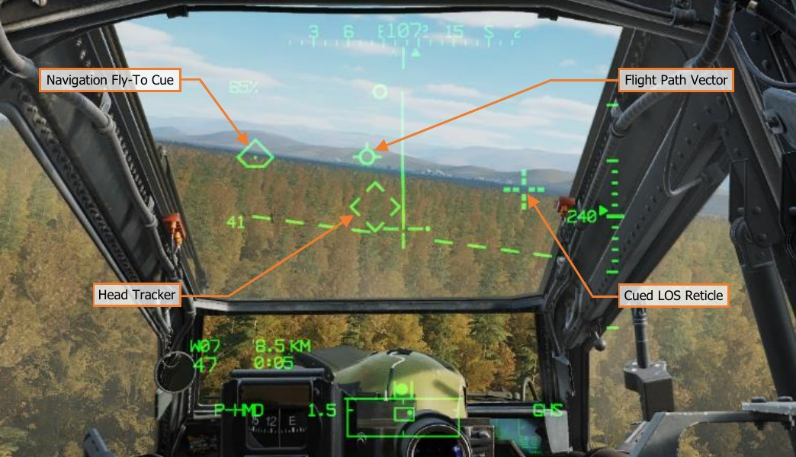

# INTEGRATED HELMET AND DISPLAY SIGHTING SYSTEM (IHADSS)

The IHADSS allows the crewmembers to view flight and navigation information, sensor video, targeting
information, and weapon status. The IHADSS also allows each crewmember to independently cue weapons and
sensors using their head movements. The system is an integral part of flight operations during the day, and a
crucial system in performing flight operations at night.

As a subcomponent of the IHADSS, each crewmember’s individual Helmet Display Unit (HDU) projects symbology
and video onto a combiner lens directly in front of the crewmembers’ right eye. Similar to a Heads-Up Display
(HUD) found in many other aircraft types, the HDU is the primary source of flight and navigation data for the
crewmember that is on the controls. However, unlike many HUD designs that are fixed to an aircraft’s instrument
panel, the HDU in the AH-64 is designed to allow a crewmember to view and effectively utilize this data without
requiring them to focus their attention straight ahead over the nose of the aircraft.

Symbology is displayed within the crewmember HDU’s in one of two formats: Flight symbology or Weapon
symbology. Weapon symbology is displayed within the CPG’s HDU when the CPG’s selected sight is TADS.
(See TADS Weapon Symbology for more information.)

### Flight Symbology

The Pilot is always presented with Flight symbology within the HDU. The Copilot/Gunner (CPG) is presented with
Flight symbology within the HDU when the CPG’s selected sight is HMD, or any time the CPG’s NVS Mode is set
to NORM or FIXED. Flight symbology is presented to the crewmembers in one of four symbology modes: Cruise,
Transition, Hover, or Bob-Up. The Symbology Select Switch on either Cyclic Grip is used to change the selected
symbology mode for both crewstations simultaneously.

1. **Heading Tape**. Displays a 180° hemisphere of magnetic headings. Major tick marks are displayed in 30°
     increments and marked by a cardinal direction or heading in the tens value. Minor tick marks are displayed
     in 10° increments.

1. **Aircraft Heading**. Displays a digital readout of the aircraft’s current magnetic heading in 1° increments,
     superimposed over the Heading Tape.

1. **Lubber Line**. The Lubber Line is aligned to the centerline of the aircraft and serves as a reference for both
     the aircraft heading and for the Bank Angle Indicator when in Cruise symbology mode.

1. **Engine Torque**. Displays the highest torque value of the two engines, in 1% increments. A box will be
     displayed around the torque at 98% or greater. If the difference in engine torque values exceeds 12%, the
     torque digital readout will flash.

1. **Horizon Line**. Indicates the horizon position and orientation relative to the aircraft nose, which is referenced
     to the LOS Reticle.
     When in Cruise symbology mode, the the Horizon Line is displaced in pitch in a 2:1 movement ratio.
     When in Transition symbology mode, the Horizon Line is displaced in pitch in a 4:1 movement ratio, up to
     a maximum of ±30°. When aircraft pitch attitude exceeds ±30° in pitch, the Transition mode Horizon Line
     will remain saturated at maximum deflection until the pitch attitude is less than ±30°.

1. **Head Tracker**. Represents the armament datum line (ADL, or centerline) of the aircraft; 0° in azimuth and
     -4.9° in elevation. The Head Tracker assists the crewmembers in maintaining awareness of their head
     position relative to the nose of the aircraft, especially under low-light conditions while using the PNVS or
     TADS sensors for flight and navigation.

1. **True Airspeed**. Indicates the true airspeed (TAS) of the aircraft in 1 knot increments, from 0 to 210 knots.
     The airspeed indication is boxed if the airspeed exceeds VNE.
     When Attitude Hold is engaged, a rounded “status window” box is displayed around the TAS digital readout.

1. **Pitch Ladder**. Indicates aircraft pitch attitude when in Cruise symbology mode. Pitch ladder increments are
     displayed at ±10°, ±20°, ±30°, ±45° and ±60° pitch.

1. **Waypoint Status**. Displays the point selected for navigation, its distance in
     kilometers or nautical miles, and estimated time enroute (ETE). The ETE is based
     on the current ground speed and distance remaining, and is presented in HH:MM
     format when the ETE is ≥5 minutes, or M:SS format when ETE is <5 minutes.
     The ETE is not displayed when ground speed is <15 knots or ETE is >10 hours.
     Waypoint Status information is not displayed if there is no active destination point.

1. **Ground Speed**. Indicates the speed across the surface in 1 knot increments. Ground Speed is only displayed
    in Cruise and Transition symbology modes, and only when the primary INU is aligned.

1. **Bank Angle Indicator**. Indicates bank angle relative to the horizon when in Cruise symbology mode. When
    the Bank Angle Indicator is aligned with the lubber line below the heading tape, the aircraft is in a level
    attitude.

1. **Barometric Altitude**. Indicates the barometric altitude when Cruise mode symbology is displayed.
    Barometric Altitude is displayed in 10-foot increments from -2,300 feet to 20,000 feet.

1. **Flight Path Vector**. The Flight Path Vector (FPV) represents the point towards which the helicopter is
    flying. It is a 3-dimensional representation of the aircraft’s velocity vector. The FPV is not displayed in Hover
    or Bob-Up symbology modes, if the 3-dimensional velocity is <5 knots ground speed, or if the aircraft is
    weight-on-wheels.

1. **Vertical Speed Indicator (VSI)**. The Vertical Speed Indicator moves up and down the rate-of-climb scale
    to indicate vertical speed. The VSI becomes saturated at the ±1,000 fpm tick marks at the top or bottom of
    the Rate-of-climb Scale, augmented by digital readouts of rate-of-climb in 100 fpm increments.

1. **Rate-of-climb Scale**. Major tick marks are placed at 0, ±500 and ±1,000 feet per minute (fpm) rates of
    climb/descent. Minor tick marks are placed in 100 fpm increments between 0 and ±500 fpm. When the rate-
    of-climb/descent exceeds ±1,000 fpm, a digital readout to the nearest 100 fpm value is displayed adjacent
    to the 1,000 fpm major tick marks.
     When Altitude Hold is engaged, a rounded “homeplate” box is displayed next to the Rate-of-climb Scale at
     0 fpm.

1. **Radar Altitude**. Indicates the radar-detected altitude above ground level from 0 to 1,428 feet. The Radar
    Altitude is displayed in increments of 1 foot from 0 to 50 feet in altitude, and increments of 10 feet between
    50 feet and 1,428 feet in altitude.
     The Radar Altitude is not displayed when the altitude exceeds 1,428 feet above ground level.

1. **Skid/Slip Indicator**. Also called the “trim ball”; indicates whether the aircraft is in coordinated flight (also
    known as “in aerodynamic trim”, or simply “in trim”). With the ball is centered between the tick marks, the
    aircraft is in coordinated flight, which minimizes drag. If the ball is left of center, applying left pedal will
    adjust tail rotor thrust to bring the aircraft back into coordinated flight. Likewise, if the ball is right of center,
    applying right pedal will adjust tail rotor thrust to bring the aircraft back into coordinated flight.

1. **Command Heading**. Indicates the magnetic heading to the Navigation Fly-To Cue when in Cruise,
    Transition, or Hover symbology modes. When Bob-up symbology mode is entered, the Command Heading
    chrevron is set to the heading of the aircraft, and maintained at that value until Bob-Up mode is exited.

1. **Engine TGT**. Displays the highest of the two engines’ Turbine Gas Temperature (TGT) indications if
    operating in an intermediate or contingency TGT limit.
     When operating under dual engine intermediate power, the TGT (in °C) will be displayed during the final
     two minutes of either the 30-minute or 10-minute allowable timers.
     When operating under single engine contingency power, the TGT (in °C) will be displayed during the entire
     2.5 minutes allowable for operating in the contingency power temperature range.

1. **Line-Of-Sight (LOS) Reticle**. Indicates the crewmember’s helmet line-of-sight (LOS). The LOS Reticle is
    used as a positional reference for the Head Tracker, Horizon Line, Velocity Vector, Acceleration Cue, and
    Bob-Up Box. It is also used as an aiming crosshair for weapons employment, and is bolded when in Cruise
    symbology mode.
     The LOS Reticle flashes when the crewmember’s LOS is invalid, the selected NVS sensor is at its slew limit,
     or if the gun is actioned and the gun system has failed and is no longer following the crewmember’s helmet.

1. **Navigation Fly-To Cue**. Indicates the location of the current point selected for navigation. Also called the
    “homeplate” symbol, the Navigation Fly-To Cue is sized so the Flight Path Vector fits within it for precise 3-
    dimensional navigation.
     The Navigation Fly-To Cue is not displayed when the aircraft is weight-on-wheels.

1. **G Status**. Displays the accelerometer measured G-force on the aircraft when the load factor exceeds 2G’s,
    or if within ¼G of the G load factor limit under the current conditions of velocity, density altitude, and gross
    weight.

1. **Field-Of-View (FOV) Box**. The FOV box indicates the relative position of the crewmember’s helmet line-
    of-sight within the larger Field-of-Regard box. The FOV box represents a 30° x 40° field of view and is driven
    by the crewmember’s helmet orientiation as detected by helmet sensors within each resepective cockpit.

1. **Field-Of-Regard (FOR) Box**. The FOR box indicates azimuth limits for the crewmember’s Night Vision
    System (NVS) sensor turret. The format of the FOR box is determined by the NVS sensor (PNVS or TADS)
    assigned to that crewstation. Tick marks around the edges of the PNVS FOR box mark 0° in azimuth and
    elevation. Tick marks around the edges of the TADS FOR box mark 0° and ±90° in azimuth, and 0° elevation.

    

1. **Alternate Sensor Bearing**. Indicates the magnetic heading of the opposite crewmember’s selected sight
    when the opposite crewmember’s sight is HMD or TADS.
     The Alternate Sensor Bearing symbol is not displayed when the other crewmember’s selected sight is FCR.

1. **Cued Line-Of-Sight Reticle**. Indicates the virtual location of the crewmember’s selected acquisition
    source.
     If CUEING is deselected on the Pilot’s WPN Utility (UTIL) sub-page, this symbol is not displayed.

1. **Cueing Dots**. Indicates the quadrant direction of the selected acquisition source to “cue” the crewmember’s
    helmet position to the location of the Cued LOS Reticle. The dots are removed when the Cued LOS Reticle
    is with 4° of that quadrant relative to the LOS Reticle.
     All four dots flash when the “IHADSS B/S REQUIRED” message is present within the Sight Status field of the
     High Action Display, indicating the crewmember needs to boresight their IHADSS.
     If CUEING is deselected on the Pilot’s WPN Utility (UTIL) sub-page, these dots are not displayed.

1. **Cued Line-Of-Sight Dot**. Indicates the relative location of the selected acquisition source within the Field-
    of-Regard box.

1. **Acceleration Cue**. The Acceleration Cue indicates magnitude and direction of the aircraft’s rate of
    acceleration. The Acceleration Cue is displayed in Transition, Hover, and Bob-Up symbology modes.
     When in Transition mode, or in Hover or Bob-Up modes when the ground speed is <6 knots, the Acceleration
     Cue is displaced from the outer point of the Velocity Vector. When in Hover or Bob-Up modes and the
     Velocity Vector becomes “saturated” at 6 knots ground speed, the Acceleration Cue displacement originates
     from the center of the LOS reticle.

1. **Velocity Vector**. The Velocity Vector indicates the aircraft’s 2-dimensional direction and magnitude of
    velocity across the surface.
     In Hover and Bob-Up symbology modes, the Velocity Vector will become “saturated” (reaching it’s maximum
     displacement) at 6 knots ground speed. In Transition symbology mode, the Velocity Vector will become
     saturated at 60 knots ground speed.

1. **Radar Altimeter Tape**. The Radar Altimeter Tape displays altitude above ground level in an “analog”
    format. Major tick marks are displayed in 50-foot increments between 0 and 200 feet. Minor tick marks are
    displayed in 10-foot increments between 0 and 50 feet.
     When the aircraft has exceeded 200 feet AGL, the Radar Altimeter Tape will be removed from the symbology.
     The Radar Altimeter Tape will not be subsequently displayed until the aircraft descends below 180 feet AGL.

1. **Bob-Up Box**. The Bob-Up Box represents a 12-foot wide octogonal box anchored to a position on the
    surface below the helicopter.
     When Bob-Up symbology mode is entered, the Bob-Up Box is displayed and referenced to the 2-dimensional
     position on the surface the helicopter was located over when Bob-Up mode was entered. This is termed
     “dropping a Bob-Up box”. The box will remain in this position until the crew changes symbology modes.
     As the aircraft moves laterally across the surface, the Bob-Up Box moves within the symbology to indicate
     the relative position of the reference location. When the Bob-Up box has become “saturated” (reaching it’s
     maximum displacement), the aircraft has displaced 40 feet from the reference position on the surface. Once
     the aircraft returns to within 40 feet of the reference position, the Bob-Up Box will become de-saturated.

1. **High Action Display**. The High Action Display is displayed in both Flight and Weapons symbology. The
    HAD provides prioritized sight and weapon status messages to the crew for targeting and weapons
    employment. (See High Action Display in the Helmet-Mounted Display chapter for more information.)

#### Symbology Categories

Symbology elements can be grouped into one of four categories: Informational elements, Longitudinally scaled
elements, Laterally scaled elements, and Virtual elements.

#### Informational Symbology Elements

Symbology elements that provide data and status indications are fixed in location within the symbology. Some of
these elements are only displayed in specific symbology modes, such as Ground Speed and Barometric Altitude.
Other elements are only displayed when relevant; or when approaching an aircraft limitation, such as the G Status
or Turbine Gas Temperature (TGT) indications.

#### Longitudinally Scaled Symbology Elements

Symbology elements that are longitudinally scaled include the Horizon Line, Pitch Ladder, Bank Angle Indicator,
Skid/Slip Indicator, Vertical Speed Indicator and Rate-of-climb Scale, and the Heading Tape along with its
associated azimuth indicators. These symbology elements can be thought of as representing a front-facing
viewpoint from behind the helicopter, or as the IHADSS equivalent of the MPD FLT page.

#### Laterally Scaled Symbology Elements

Symbology elements that are laterally scaled include the Velocity Vector, Acceleration Cue, and Bob-Up Box.
These symbology elements can be thought of as representing a top-down view of the helicopter over the surface.

#### Virtual Symbology Elements

Virtual symbology elements include the Flight Path Vector, Head Tracker, Cued LOS Reticle, and Navigation Fly-
To Cue. These symbology elements are displayed at their true positions relative to the crewmember’s line-of-
sight, as virtual representations of locations “out-the-window”. As the crewmember turns his or her head, the
positions of these symbols are updated within the symbology field-of-view in real-time so they reflect the true
positions of their respective sources.

### Night Vision System (NVS)

The IHADSS integrates the use of a Night Vision System
(NVS) mode for flight operations at night. Each
crewmember can enable a FLIR video underlay within
their respective HDU by setting the NVS Mode switch in
their crewstation to NORM or FIXED.

(See Tail Wheel/NVS Mode Panel for more information.) //link

By default, the PNVS is assigned to the Pilot crewstation and the TADS assigned to the CPG crewstation, but
either crewmember can take control of either NVS sensor by using the NVS Select switch on the Collective Flight
Grip. This can be especially critical in the case of a failure in the NVS system while operating at extremely low
altitudes at night. (See Collective Flight Grip for more information.) //link

When the NVS Mode switch is set to NORM, the NVS sensor assigned to the crewstation will unstow if necessary
and become slaved to the crewmember’s helmet line-of-sight. If the crewmember’s helmet reaches or exceeds
the slew limits of their NVS sensor, the LOS Reticle will flash and “LIMITS” will be displayed within the Sight
Status field of the High Action Display.

When the NVS Mode switch is set to FIXED, the NVS sensor assigned to the crewstation will slave to the fixed
forward location (0° in azimuth/-4.9° elevation). This can be used in the case of a failure in the IHADSS helmet
tracking, which will result in the sensor turret remaining at its last commanded position. If this were to occur, the
last detected helmet position may be off to one side or at an extreme look-down angle, preventing the
crewmember from viewing the aircraft’s current flight path and any imminent obstacles.

When the NVS is set to NORM or FIXED, virtual symbology elements within the HDU become “video-stabilized”.
This is to reduce visual disorientation if the crewmember rotates their head faster than the NVS turret can slew.
If this occurs, virtual elements such as the Flight Path Vector will remain stabilized to their relative locations within
the FLIR video, to prevent a false perception of the aircraft’s flight path within the FLIR imagery.
The exception to this logic is the Head Tracker symbol, which will always remain “helmet-stabilized” to the
crewmember’s line-of-sight, even when the NVS is in FIXED mode.

#### AN/AAQ-11 Pilot Night Vision System (PNVS)

The PNVS is a Forward-Looking Infrared (FLIR) sensor housed within a steerable turret on the topside of the
aircraft nose sensor assembly. The PNVS is primarily intended to aid the Pilot in performing low-altitude flight
under any lighting conditions, ranging from twilight to total darkness without ambient lighting from celestial or
terrestrial light sources.

The PNVS can slew ±90° in azimuth and +20° to -45° in elevation, at up to 120° per second. As the crewmember
moves his or her head, the IHADSS sensors within the cockpit track the movements of the helmet and translate
those motions into steering commands. As the crewmember looks left or right, the PNVS turret slews left and
right to follow. As the crewmember looks up or down, the FLIR sensor itself articulates up and down within the
turret housing.

The Modernized PNVS (M-PNVS) includes an enlarged sensor housing with a second optical sensor aperture for
potential upgrades and “growth” within the system.

#### AN/ASQ-170 TADS as Night Vision System

The TADS is a multi-sensor targeting system housed within a steerable turret on the underside of the aircraft
nose sensor assembly. The TADS is primarily intended to allow the Copilot/Gunner to target and designate enemy
locations and vehicles for the aircraft’s weapon systems. Like the PNVS, the TADS includes a Forward-Looking
Infrared (FLIR) sensor. Unlike the PNVS, the TADS FLIR sensor is intended for targeting purposes, and includes
three levels of optical magnification. However, if required, the TADS FLIR can be used as an NVS sensor for the
Copilot/Gunner, or as a backup NVS sensor for the Pilot (should the PNVS fail).

The TADS can slew ±120° in azimuth and +30° to -60° in elevation, at up to 60° per second. As the crewmember
moves his or her head, the IHADSS sensors within the cockpit track the movements of the helmet and translate
those motions into steering commands. As the pilot looks around, the TADS turret rotates in azimuth and elevation
to follow. However, due to the slower slew rate of the TADS, the crewmember must be more deliberate when
moving his or her head to avoid “outrunning the TADS” and inducing visual disorientation.

If the CPG is using the TADS for targeting as their selected sight and moves their NVS Mode switch to NORM or
FIXED, their sight selection will automatically switch to HMD, the TADS video will switch to FLIR (overriding the
TADS Sensor Select switch on the TEDAC Left Handgrip), the TADS Field-Of-View will switch to Wide, and the
TADS will be slaved to the CPG’s helmet position.

If the Pilot’s NVS Mode switch is in NORM or FIXED and the Pilot presses forward on the NVS Select Switch, the
same events will occur, except the TADS turret will be slaved to the Pilot’s helmet position.

