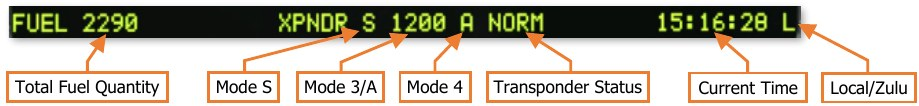
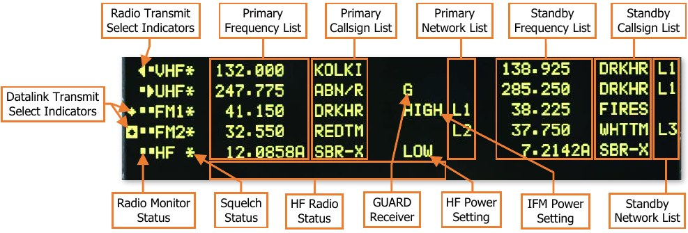

# Enhanced Up-Front Display (EUFD)

The Enhanced Up-Front Display (EUFD) provides the aircrew with a consolidated location for viewing critical
message alerts about aircraft systems and managing voice and data communications. Unlike the MPDs, the EUFD
functionality is retained when the aircraft is operating on battery power.
The display itself is divided into three primary areas: warnings/cautions/advisories (WCA), radio status, and
information display. Additional controls for interacting with and controlling the EUFD are located to either side of
the LED display.

1. **Warning/Caution/Advisory (WCA) Scroll Rocker**. Accesses additional WCA messages by scrolling the
      WCA areas up or down in a scrolling manner. This may be necessary if 8 or more messages exist in any of
      the three WCA columns. A double arrowhead symbol is displayed along the EUFD display if any column
      contains 8 or more active message alerts to indicate to the crew that WCA scrolling is necessary to view all
      messages.

1. **Warning Message Area**. Warning messages alert the crew to critical aircraft emergencies or malfunctions
      that could result in death to the aircrew and/or catastrophic loss of the aircraft. These emergency conditions
      will be accompanied by the flashing illumination of the MSTR WARN pushbutton light and an audio voice
      message alerting the crew to the nature of the emergency.
      Examples of warning alerts include an engine fire, an engine flameout, or a total loss of hydraulics.

1. **Caution Message Area**. Caution messages alert the crew to less critical but potentially hazardous aircraft
      malfunctions or conditions that could affect safe flight operations. These conditions will be accompanied by
      the illumination of the MSTR CAUT pushbutton light and an audio caution tone to the crew.
      Examples of caution alerts include a loss of oil or transmission pressure, overtemperature conditions, failures
      in the electrical system, or low fuel levels.

1. **Advisory Message Area**. Advisory messages alert the crew to non-critical conditions, status of systems,
      or reception of datalink transmissions. Some messages may be accompanied by unique audio tones to cue
      the crew to their presence.
     Examples of advisory alerts include the commanded state of the tail wheel lock (when weight-on-wheels),
     completion of an automatic fuel check, or an unlatched canopy door.

1. **Brightness Control Knob**. Adjusts the brightness of the EUFD display.

1. **Preset Button**. Toggles display of the Preset frequency list. (See Tuning a Radio using the EUFD for more
     information.)

1. **Enter Button**. Tunes the currently selected radio frequency from the displayed Preset frequency list.

1. **Datalink Transmit Select Rocker**. Selects a radio for datalink transmission.

1. **Radio Transmit Select (RTS) Rocker**. Cycles the Radio Transmit Select indicator on the EUFD to the
     next or previous radio in sequence. If the RTS indicator is set to the HF radio at the bottom of the list,
     pressing down on the RTS rocker will cycle the indicator to the VHF radio at the top of the list. If the RTS
     indicator is set to the VHF radio at the top of the list, pressing up on the RTS rocker will cycle the indicator
     to the HF radio at the bottom of the list.

1. **Information Display Area**. Displays fuel, transponder and time information in a single line.

    - Total onboard fuel quantity, in pounds (lbs).

    - Transponder Mode S enabled status. This data field will be blank if Mode S is disabled. (N/I)

    - Transponder Mode 3A code (“squawk” code). This data field will be blank if Mode 3/A is disabled. (N/I)

    - Transponder Mode 4 code (A or B). This data field will be blank if Mode 4 is disabled. (N/I)

    - Transponder status (STBY, NORM or EMER). (N/I)

    - Current time (Local or Zulu). If the stopwatch is enabled, elapsed time is displayed above current time.

    

1. **Radio Status Area**. The 6 rows in the center of the EUFD display each of the five radios, their various
    states and settings, and the primary and standby frequency information for each radio.

    - Primary Frequency List. Displays the currently tuned frequency for each radio.

    - Primary Callsign List. Displays the 5-character callsign associated with the currently tuned preset
          frequency. If the primary frequency is manually tuned, “MAN” will be displayed in this data field. If the
          primary frequency is a GUARD frequency, “GUARD” will be displayed in this data field.

    - Primary Datalink Network List. Displays the datalink network number currently tuned to the radio. If
          no datalink protocol has been tuned, this data field will be blank.

    - Standby Frequency List. Displays the standby frequency for each radio.

    - Standby Callsign List. Displays the 5-character callsign associated with the standby preset frequency.
          If the standby frequency is manually tuned, “MAN” will be displayed in this data field. If the standby
          frequency is a GUARD frequency, “GUARD” will be displayed in this data field.

    - Radio Monitor Status. Displays which radios are being monitored by each crewmember. If a dot is
          present along the left row, the respective radio is being monitored within the crewstation. If a dot is
          present along the right row, the respective radio is being monitored within the opposite crewstation.
          Pulling out the volume knob of the VHF, UHF, FM1, FM2, or HF radio on the crewstation’s
          Communications panel will blank the dot that corresponds with that radio on in this data field.

    - Squelch Status. Displays which radios have squelch enabled. If an asterisk is present alongside a radio,
           squelch is enabled for that radio. Squelch can be toggled using the Squelch switches on the
           Communications panel in either cockpit.

    - HF Radio Status. When the RTS indicator for the current crewstation is set to the HF radio, the 6th radio
           status line will display additional information regarding the HF transmit frequency. (N/I)

    - UHF GUARD Receiver. Displays “G” if the dedicated GUARD receiver of the ARC-164 radio is enabled
           to monitor 243.0 MHz.

    - HF Power Setting. Displays the current power setting of the ARC-220 HF radio. (N/I)

    - IFM Power Setting. Displays the current power setting of the IFM amplifier for the ARC-201D FM1 radio.

    - Standby Datalink Network List. Displays the datalink network number in standby. If no datalink protocol
           is present, this data field will be blank.

        

    - Radio Transmit Select Indicator. The icons shown indicates which radio has been selected for voice
           transmission:

        

        

        

        

    - Datalink Transmit Select Indicator. The icons shown indicates which radio has been selected for
           data transmission:

        

        

        

1. **Stopwatch Button**. Starts and stops the stopwatch, which is displayed
    above the current time. A square symbol is displayed to the right of the
    stopwatch timer when the stopwatch is paused.
    Holding this button for >2 seconds resets the stopwatch timer and
    removes it from the EUFD.
    NOTE: The EUFD stopwatch in each crewstation is independent of the other. Starting, stopping, or resetting
    the EUFD stopwatch in one crewstation will have no effect on the EUFD stopwatch in the other crewstation.

1. **Swap Button**. Swaps the radio frequency, encryption mode, and network configuration with the standby
    values of the currently selected radio.

{!abbr.md!}
{!dev-docs/ah64d/abbr.md!}
{!docs/ah64d/abbr.md!}
