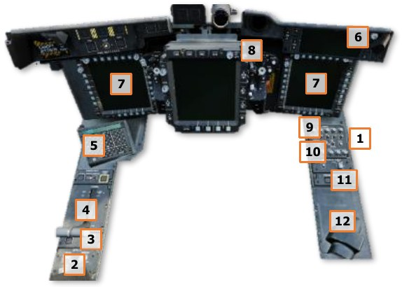
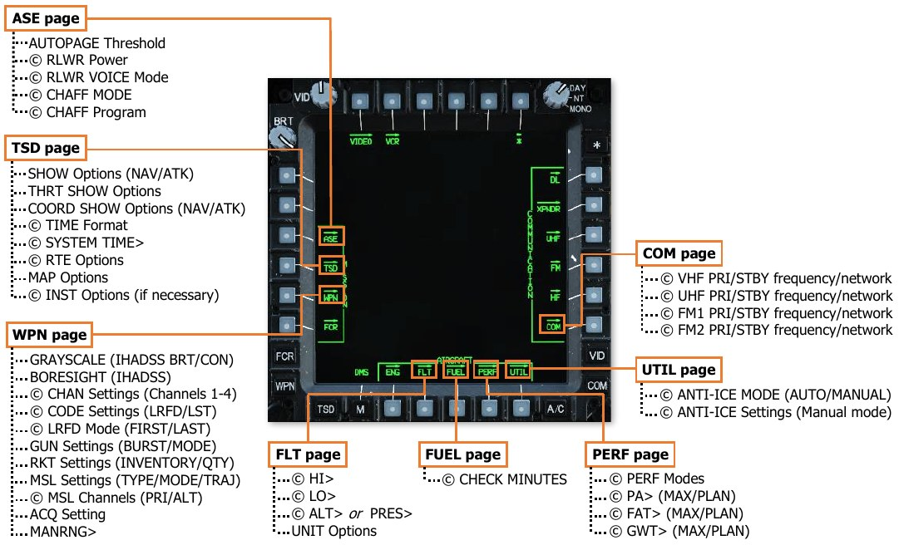

# Aircraft Start

The AH-64 was designed to be operated from a “field environment” away from established ground support
infrastructure or airfield facilities. Although it is equipped with external power and pneumatic air receptacles,
allowing it to be supported by Aviation Ground Power Units (AGPU) or other ground support equipment, the
primary method of starting the aircraft is via its integrated GTCP36-155 Auxiliary Power Unit (the same gas
turbine engine that powers the AGPU).

Once the APU is up to operating speed, the APU drive shaft mechanically engages the main transmission’s
accessory gearbox, which in turn powers the primary and utility hydraulic pumps and both AC generators. This
pressurizes the flight control servo-actuators and enables AC electrical power to be delivered to some aircraft
systems, including both Transformer Rectifier Units (TRU) which converts AC power to DC power. Once DC power
is supplied to the remainder of the electrical busses, all aircraft systems may be configured as necessary, and the
aircraft battery will be charged.

## Prior to Starting APU

After an external preflight inspection and walk-around has been performed by the aircrew to ensure the aircraft
is flightworthy and all gear and equipment is properly secured within the storage bays, the aircrew enters their
respective crewstations. The seat harness restraints are secured and the crewmembers secure intercom cables
and electrical connectors that supply power to the IHU helmet-tracking sensors.
If not already performed during the preflight inspection, the aircrew inspects their crewstation to ensure all
switches and knobs are set appropriately prior to enabling electrical power and starting the APU.

### Interior Checks (Pilot crewstation)          [[PLT]]

1.   Canopy door – Set as desired (open or intermediate position).

    **Check the following on the Left Console:**

2.   EXT LT/INTR LT panel – Set NAV lights in
     accordance with local procedures, ANTI-COL to
     OFF, and interior lighting knobs as desired.

3.   Power levers – OFF.                           

4.   ENG START switches – OFF.                     
                                                   
                                                   
5.   RTR BRK switch – OFF.
                                                   
                                                   
6.   NVS MODE switch – OFF.
                                                   
    **Check the following on the Keyboard Unit:**
                                                   
7.   KU brightness knob – As desired.

    **Check the following on the Instrument Panel:       **

8.   EUFD brightness knob – As desired.
9.   MPD brightness and Mode knobs – As desired.
10. PARK BRAKE – Brakes set, PARK BRAKE handle is pulled outward.
11. Standby flight instruments – Check:

    - Standby Attitude Indicator – Caged.

    **Check the following on the CMWS Control Panel:**

12. CMWS Control Indicator PWR knob – OFF.
13. CMWS Control Panel – Set Switches as follows:

    - ARM/SAFE switch – SAFE.

    - CMWS/NAV switch – As appropriate.

    - BYPASS/AUTO switch – As appropriate.

    - JETTISON guarded switch – Down (cover closed).

    **Check the following on the Right Console:**

14. COMM panel audio volume knobs – As desired.
15. COMM panel ICS switch and SENS knob – As desired.
16. Helmet Display Unit (HDU) – As desired.

### Interior Checks (Copilot/Gunner crewstation)            [[CPG]]

1.   Canopy door – Set as desired (open or intermediate position).

    **Check the following on the Left Console:**

2.   INTR LT panel – As desired.
3.   NVS MODE switch – OFF.
4.   Power levers – OFF.                        

    **Check the following on the Keyboard Unit:**

5.   KU brightness knob – As desired.

    **Check the following on the Instrument Panel:**

6.   EUFD brightness knob – As desired.
                                                
7.   MPD brightness and Mode knobs – As desired.
                                                

    **Check the following on the TEDAC handgrips:**

8.   TEDAC Right Handgrip LT switch – OFF.

    **Check the following on the Right Console:**

9.   COMM panel audio volume knobs – As desired.
10. COMM panel ICS switch and SENS knob – As desired.
11. PROCESSOR SELECT switch – AUTO.
12. Helmet Display Unit (HDU) – As desired.

### Battery Checks

Once the interior checks are complete, perform the following:

1.   [[**PLT**]]   MSTR IGN switch – BATT (or EXT PWR if external power is to be used).
2.   [[**PLT**]]   TAIL WHEEL button – Verify locked; “UNLOCK” light is not illuminated.
3.   [[**PLT & CPG**]]   ICS system – Check to verify communications between crewstations.
4.   [[**PLT & CPG**]]   INTR LT PRESS-TO-TEST button – Press and hold; verify all signal lights illuminate.
5.   [[**PLT / CPG**]]   MSTR WARN, MSTR CAUT, and EUFD – Check for any malfunction indications.
6.   [[**PLT**]]   TEST switch held to position 1 – Both crewmembers check the following:

    -  “MSTR WARN” light – Flashing.

    -  ENG 1 FIRE, APU FIRE, and ENG 2 FIRE buttons – “FIRE” lights are illuminated.

    -  EUFD – “AFT DECK FIRE” warning message is displayed.

    -  Audio Warnings – “ENG 1 FIRE”, “APU FIRE”, “ENG 2 FIRE” and “AFT DECK FIRE” voice warning
           messages are heard in sequence.

7.   [[**CPG**]]   TEST switch held to position 2 – Both crewmembers check the following:

    -  “MSTR WARN” light – Flashing.

    -  ENG 1 FIRE, APU FIRE, and ENG 2 FIRE buttons – “FIRE” lights are illuminated.

    -  PRI and RES buttons – “DISCH” lights are illuminated.

    -  EUFD – “AFT DECK FIRE” warning message is displayed.

    -  Audio Warnings – “ENG 1 FIRE”, “APU FIRE”, “ENG 2 FIRE” and “AFT DECK FIRE” voice warning
           messages are heard in sequence.

## APU Start

When the APU button is pressed, a nitrogen pre-charge will force hydraulic fluid from the accumulator cylinder
to discharge through the APU starter, allowing the APU compressor to spool up to sufficient speed for combustion.

Once the APU has reached a sufficient speed for the gas generator to become self-sustaining, the APU starter
will disengage.

The APU start sequence is fully automatic and requires no additional action by the crew.

1.     [[**PLT**]]   APU button – Press and release to initiate APU start sequence.

2.     [[**PLT**]]   EUFD advisory column – Verify “APU ON” message is displayed.

3.     [[**PLT**]]   MSTR IGN switch – BATT (if external power was used prior to APU start).

### After Starting APU

Once the APU has been started and the MPDs have initialized, perform the following:

1.    [[**PLT & CPG**]]   Canopy door – Close.
2.    [[**PLT / CPG**]]   DTU page – Select MASTER LOAD to upload DTC data to the aircraft systems. (N/I)
3.    [[**PLT & CPG**]]   Aircraft systems – Initialize and configure remaining options as appropriate for mission.

### Initialize Aircraft Systems

After a Master Load has been completed on the DTU page, remaining options within each cockpit are configured
for the mission. This process is commonly referred to as a “DMS sweep”. A DMS sweep may be conducted in
accordance with crewmember preferences, but it is important to be consistent and coordinate with the other
crewmember to ensure any settings that are common between crewstations are agreed upon and the start-up
process is conducted in an efficient manner. (© Denotes “common” options or settings)

An example DMS sweep is shown as follows (settings that are common between crewstations will be annotated
by a **©** symbol):

1.   [[**PLT & CPG**]]   M (Menu) button – Press.
2.   [[**PLT & CPG**]]   ASE (VAB L3) – Select.

    -  AUTOPAGE (VAB R1) – Set as desired.

    -  UTIL (VAB T6) – Select.
        - **©** RLWR Power (VAB R4) – Press.
        - **©** RLWR VOICE (VAB R5) – Set as desired.
        - **©** CHAFF MODE (VAB L1) – Set as desired.
        - **©** CHAFF Program (VAB L2-L5) – Set as desired.

3.   [[**PLT & CPG**]]   TSD Button – Press.

    -  SHOW (VAB T3) – Select and configure NAV SHOW options.
        - PHASE (VAB B2) – Select ATK and configure ATK phase SHOW options.
        - THRT SHOW (VAB T5) – Select and configure THRT SHOW options.
        - COORD SHOW (VAB T6) – Select and configure ATK phase COORD SHOW options.
        - PHASE (VAB B2) – Select NAV and configure NAV phase COORD SHOW options.
        - SHOW (VAB T3) – Deselect.

    -  UTIL (VAB T6) – Select.
        - **©** TIME (VAB R2) – Set Zulu/Local as desired.
        - **©** SYSTEM TIME> (VAB R3) – Update Local time if necessary.
        - UTIL (VAB T6) – Deselect.

    -  Scale (VAB R1 & R2) – Set as desired.

    -  CTR (VAB R3) – Set as desired.

    -  RTE (VAB B5) – Select.
        - **©** RTM (VAB B6) – Select desired Route.
        - **©** DIR (VAB L5) – Set to desired point, if necessary.
        - RTE (VAB B5) – Deselect.

    -  MAP (VAB B4) – Select.
        - TYPE (VAB L2) – Set as desired.
        - COLOR BAND (VAB L4) – Set as desired.
        - GRID (VAB T5) – Set as desired.
        - ORIENT (VAB R5) – Set as desired.
        - MAP (VAB B4) – Deselect.

    -  INST VAB (L1) – Select if the ADF is intended to be utilized for navigation.
        - UTIL (VAB T6) – Select.
        - **©** ADF (VAB B6) – Turn on ADF, if necessary.
        - **©** Configure ADF as desired.
        - UTIL (VAB T6) – Deselect.
        - INST (VAB L1) – Deselect.

4.   [[**PLT**]]   WPN Button – Press.

    -  GRAYSCALE (VAB L6) – Select.

    -  IHADSS BRT and CON knobs – Optimize HDU video (see Video Panel).

    -  GRAYSCALE (VAB L6) – Deselect.

    -  SYM knob - As desired (see Video Panel).

     [[**CPG**]]   WPN Button – Press.

    -  UTIL (VAB T6) – Press.

    -  TADS (VAB L4) – Press.

    -  LASER (VAB L6) – Press.

    -  Sight Select switch – HMD (see TEDAC Right Handgrip).

    -  GRAYSCALE (VAB L6) – Select.

    -  TDU BRT and CON rocker switches – Optimize HDU video (see TEDAC Display Unit).

    -  GRAYSCALE (VAB L6) – Deselect.

    -  TDU SYM rocker switch - As desired (see TEDAC Display Unit).

     [[**PLT & CPG**]]   BORESIGHT (VAB B5) – Select and perform IHADSS boresight procedure. (see IHADSS Boresight)

    -  BORESIGHT (VAB B5) – Deselect.

    -  GUN (VAB B2) – Select.
        - BURST LIMIT (VAB L1- L5) – Select.
        - MODE (VAB R2) – Select.

    -  MSL (VAB B3) – Select.
        - CODE (VAB T4) – Select.
        - **©** SET (VAB T2) – Select LRFD and set as appropriate.
        - **©** SET (VAB T2) – Select LST and set as appropriate.
        - **©** CHAN (VAB T1) – Select missile channels 1-4, ensure a channel matches the LRFD code.
        - CHAN (VAB T1) – Deselect.
        - **©** PRI (VAB L1) – Select channel that matches the LRFD.
        - **©** ALT (VAB L2) – Select channel that matches the LST, or as appropriate.

    -  RKT (VAB B5) – Select.
        - INVENTORY (VAB L1-L5) – Select.
        - QTY (VAB R1) – Select.
        - RKT (VAB B5) – Deselect.

    -  ACQ (VAB R6) – Set as desired ([[**CPG**]] must select SLAVE for cueing within the HMD Flight Symbology).

    -  MANRNG> (VAB B6) – Set as desired or enter ‘A’ for Auto-Range.

5.   [[**PLT & CPG**]]   A/C Button – Press.

    -  FLT (VAB   T2) – Select.
        - SET VAB (B6) – Select.
        - **©** HI> (VAB T1) – Set as desired.
        - **©** LO> (VAB T3) – Set as desired.
        - UNIT (VAB T4) – Set as desired.
        - **©** ALT> (VAB T5) – Set airfield elevation if known.
                      or
        - **©** PRES> (VAB T6) – Set altimeter if known.
        - UNIT VAB (B2) – Set as desired.
        - SET (VAB B6) – Deselect.

    -  FUEL (VAB T3) – Select.
        - CHECK (VAB B6) – Select.
        - **©** MINUTES (VAB R2-R4) – Select as desired.
        - CHECK (VAB B6) – Deselect.

    -  PERF (VAB T4) – Select.
        - **©** PERF MODE – MAX (VAB B3) – Select.
        - **©** PA> (VAB L1) – Set as desired.
        - **©** FAT> (VAB L2) – Set as desired.
        - **©** GWT> (VAB L3) – Set as desired.
        - **©** PERF MODE – PLAN (VAB B4) – Select.
        - **©** PA> (VAB L1) – Set as desired.
        - **©** FAT> (VAB L2) – Set as desired.
        - **©** GWT> (VAB L3) – Set as desired.
        - **©** PERF MODE – CUR (VAB B2) – Select.

    -  UTIL (VAB T6) – Select.
        - **©** ANTI-ICE – SYSTEM (VAB R1) – Set as desired.
        - **©** ANTI-ICE (VAB R3-R6) – Set as desired (only if SYSTEM is set to MANUAL).

6.   [[**PLT / CPG**]]   COM Button – Press.

    -  Presets (VAB L1-L5, R1-R5) – Select and tune as desired.
        - RADIO (VAB T1-T5) – Select.
        - TUNE (VAB B2) – Select as desired.
        - TUNE Radio – SC (VAB B6) – Select.
           or

    -  MAN (VAB B2) – Select and tune as desired.
        - **©** VHF FREQ> (VAB L1) – Set as desired.
        - **©** UHF FREQ> (VAB L2) – Set as desired.
        - **©** FM1 FREQ> (VAB L3) – Set as desired.
        - **©** FM2 FREQ> VAB (L4) – Set as desired.

7.   [[**PLT**]]   CMWS Power/Set knob – ON.

     [[**CPG**]]   TDU Display knob – DAY or NT, as appropriate.

    -  Sight Select switch – TADS (see TEDAC Right Handgrip).

    -  TDU G/S button – Press (see TEDAC Display Unit).

    -  TDU BRT and CON rocker switches – Optimize TDU video.

    -  TDU TAD button – Press.

    -  TDU SYM rocker switch - As desired.

    -  Sight Select switch – HMD.

## Engine Start

Prior to starting the engines, perform the following:

1.    [[**PLT & CPG**]]   NVS Mode switch – As desired.     
2.    [[**PLT**]]   Standby Attitude Indicator – Uncage.
3.    [[**PLT & CPG**]]   Area around helicopter – Clear.   

4.     [[**PLT**]] RTR BRK switch – OFF (or LOCK if
      performing a Rotor Lock start).               
5.     [[**PLT**]] EXT LT ANTI-COL – WHT for day, or RED
      for night.
                                                    
    During normal operations, Engine 1 is started first,
followed by Engine 2. The APU must remain in
operation until the engine POWER levers are set to
FLY and the NR has stabilized at 101%, otherwise the
AC generators will drop offline and the aircraft will
lose primary electrical power.

6.    [[**PLT**]]   First engine – Start as follows:

    !!! note

        During the start, if any of the following conditions are observed, abort the start by moving the
        corresponding POWER lever to OFF:

        - It appears the TGT will exceed 851°C prior to NG reaching the idle speed of 63%.
        - No increase of TGT, NP, or ENG OIL PSI within 45 seconds after moving the POWER lever to IDLE.
        - The ENG 1/2 START advisory is removed from the EUFD prior to the NG reaching 52%.
 
    -  ENG START switch – START; observe “ENG 1 START” or “ENG 2 START” advisory displayed on the
            EUFD and the START box displayed on the ENG page.
 
    -  POWER lever – IDLE, at first indication of NG increase and if TGT is less than 80° C.
 
    -  Cockpit indications – Monitor.
        - Engine TGT
        - Engine NG
        - Engine OIL PSI
        - EUFD Advisory column

7.    [[**PLT**]]   Second Engine – Repeat the steps above after first engine start sequence is complete.
8.    [[**PLT**]]   RTR BRK switch – OFF.

    !!! note

        Prior to advancing the POWER levers to FLY, confirm the ENGINE OIL PSI indications for both engines
        are less than 70 PSI.

        If performing operations in cold weather, confirm the NGB TEMP °C indications are
        above 20° C.

        (see [ENG Systems sub-page](09.mpd.md#eng-systems-sys-sub-page) for more information.)

9.     [[**PLT**]] POWER levers – Advance both POWER levers smoothly to FLY; ensure the TORQUE % indications for
      both engines increase simultaneously.

10.   [[**PLT**]]   NP and NR – Verify 101%.
11.   [[**PLT**]]   MSTR WARN, MSTR CAUT, and EUFD – Monitor for any malfunction indications.
12.   [[**PLT**]]   APU button – Press and release to initiate APU shutdown sequence.

