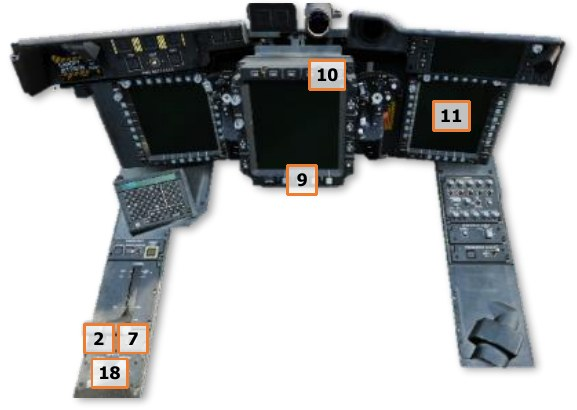
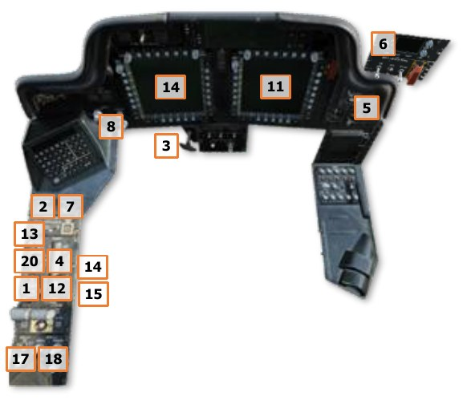

# Aircraft Shutdown

Just as with departing from its parking location and taxiing to the takeoff area, the AH-64 may perform hover
taxi (<25 feet and <20 knots) or air taxi (<100 feet and/or >20 knots) to transition back to the parking area
after landing, but ground taxi is typically used when feasible.

Once clear of the active runway or designated arrival/departure area, the transponder is typically set to standby
and the exterior lights are set in accordance with local regulations and procedures. As the aircraft is arriving to
the designated parking location and in the intended parking heading, it is necessary to straighten the aircraft’s
direction of travel for a short distance to allow the free-rotating tail wheel to align with the locking actuator. Once
the tail wheel has been successfully locked (indicated by the “UNLOCK” light on the TAIL WHEEL button
extinguishing), the aircraft can be brought to a stop. (see Ground Taxi for more information.)

The aircraft may be aerodynamically braked using aft cyclic input with 27-30% torque applied, or the wheel
brakes may be used in either crewstation. After coming to a halt, the Pilot should set the wheel brakes using the
PARK BRAKE handle. (see Parking Brake Handle for more information.)

## After Landing Check

After landing, perform the following:

1.    [[**PLT / CPG**]]   TAIL WHEEL button – Unlock as necessary for ground taxi.
2.    [[**PLT**]]   EXT LT – Set exterior lighting in accordance with local procedures.
3.    [[**PLT / CPG**]]   Avionics – As desired (COM page).

    -   Transponder – STBY.

    -   Communications – As appropriate; verify on EUFD.

## Aircraft Shutdown

Once stationary in the designated parking location, perform the following:

1.    [[**PLT**]]   APU button – Press and release to initiate APU start sequence.

2.    [[**PLT / CPG**]]   TAIL WHEEL button – Verify locked; “UNLOCK” light is not illuminated.
3.    [[**PLT**]]   PARK BRAKE – Brakes set; PARK BRAKE handle is pulled outward.
Prior to retarding the POWER levers to IDLE, verify the “APU ON” advisory message is displayed on the EUFD.
4.     [[**PLT**]] POWER levers – Retard both POWER levers to IDLE; press EUFD Stopwatch button to start a timer for
      a 2-minute engine cooldown. (see Enhanced Up-Front Display (EUFD) for more information.)
5.    [[**PLT**]]   Standby Attitude Indicator – Cage.
6.     [[**PLT**]] CMWS Power/Test knob – OFF. (see
      Common Missile Warning System for more
      information.)

7.    [[**PLT & CPG**]]   NVS Mode switch – OFF.
8.    [[**PLT**]]   ACM switch – OFF.
9.    [[**CPG**]] ACM button – Disable ACM. (see TEDAC
      Display Unit for more information.)
10.   [[**CPG**]]   TDU Display knob – OFF.
11.   [[**PLT / CPG**]]DMS SHUT DOWN page – MASTER
      OFF. (see DMS Shutdown page for more
      information.)
12.    [[**PLT**]] POWER levers – OFF after 2 minutes have
      elapsed on EUFD stopwatch.
13.   [[**PLT**]]  RTR BRK switch – BRK after NR has
      decreased below 50%.
14.   [[**PLT**]]  Stabilator – Manually set the stabilator
      angle to 0° (Stabilator Control Switch on the
      Collective Flight Grip), as indicated on the ENG
      Systems sub-page.
15.   [[**PLT**]]   Searchlight – STOW.
16.    [[**PLT**]] RTR BRK switch – OFF after main rotor has
      stopped.
17.   [[**PLT**]]   EXT LT – All exterior lighting to OFF.
18.   [[**PLT & CPG**]]   INTR LT – All interior lighting to OFF.
19.   [[**PLT**]] APU button – Press and release to initiate
      APU shutdown sequence.
20.   [[**PLT**]]   MSTR IGN – OFF.

{!abbr.md!}
{!dev-docs/ah64d/abbr.md!}
{!docs/ah64d/abbr.md!}
