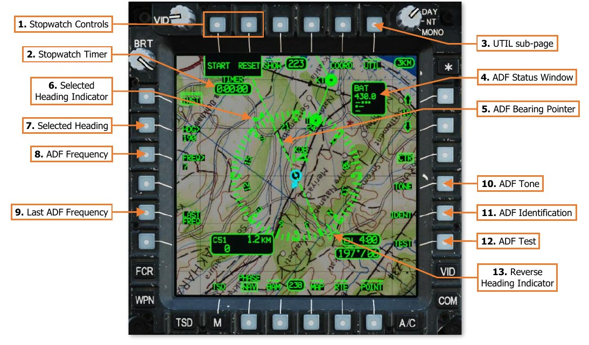
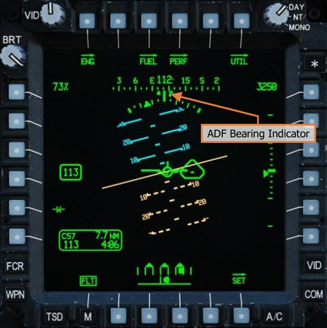
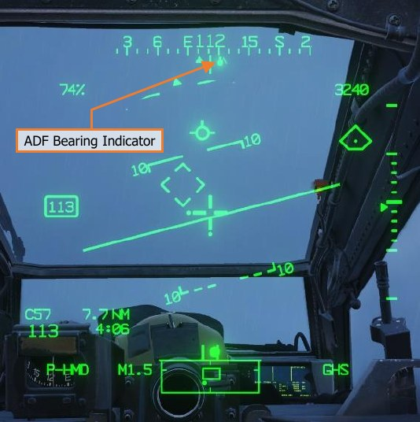
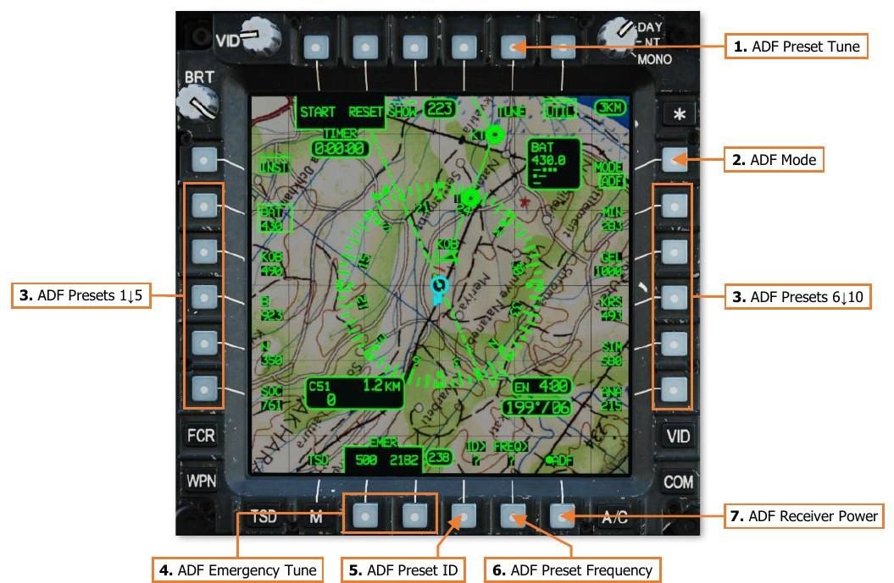
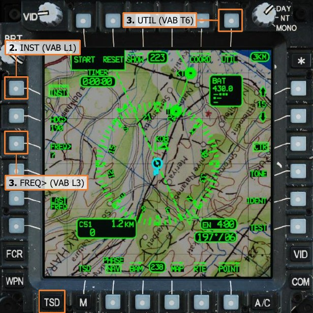
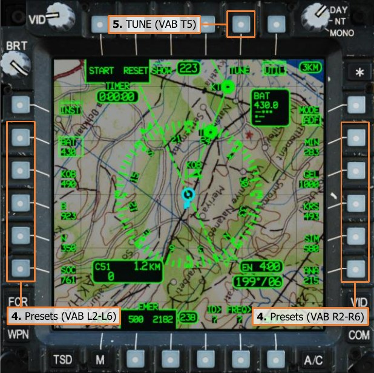
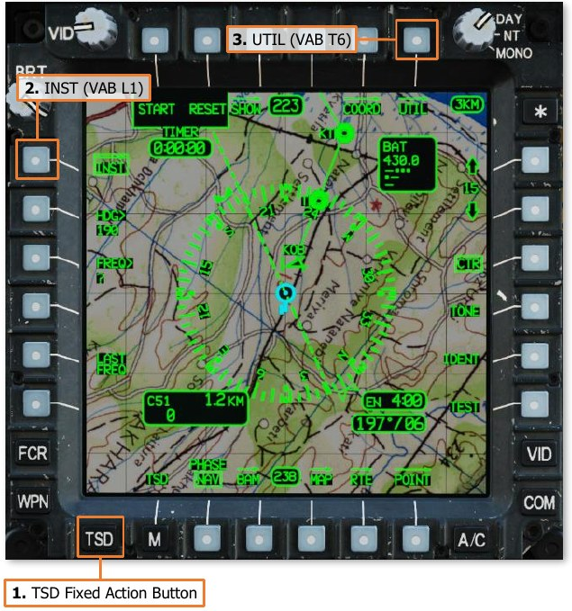
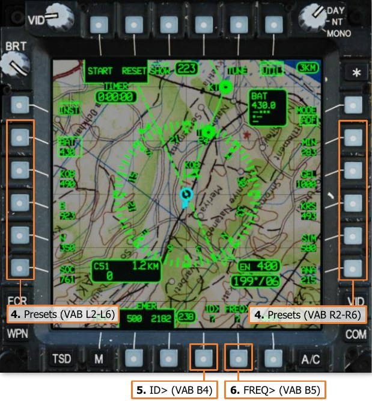

# RADIO NAVIGATION IN LOW-VISIBILITY CONDITIONS

Although the AH-64D was not designed to perform flight within Instrument Meteorological Conditions (IMC), it
can perform limited navigation under such conditions with on-board equipment. This equipment primarily includes
the AN/ARN-149 Automatic Direction Finder (ADF) receiver, the Instruments (INST) sub-page of the TSD, along
with the associated navigation symbology on the Flight (FLT) page and in the IHADSS Flight symbology.

The AN/ARN-49 ADF is a radio navigation receiver with a directional antenna that can determine a coarse azimuth
to an AM radio signal within the frequency range of 100.0 to 2199.5 kHz. Audio from AM radio signals received
within this frequency range may also be monitored by the crew using the ADF audio channel of the ICS system.

The ADF receiver is controlled through the TSD Instruments (INST) sub-page on the TSD. The INST sub-page
format enables the crew to determine relative bearings from known Non-Directional Beacon (NDB) stations; and
integrates the radio navigation equipment with the existing functionality of the TSD moving map, routes, points
database, waypoint status, winds, and endurance data.

(See the TSD Instruments sub-page for more information.)

Setting the Color Band Shading to “A/C” on the TSD Map sub-page may aid in maintaining clearance above terrain
and obstacles when operating in low-visibility conditions.

!!! note
    The Common Missile Warning System (CMWS) utilizes the ADF audio channel of the ICS to provide missile
    threat warnings to the crew. To monitor the ADF receiver audio, the CMWS/NAV switch must be set to the NAV
    position on the CMWS Control Panel, which is located in the Pilot crewstation.

### TSD Instruments (INST) Sub-page

The INST sub-page of the Tactical Situation Display is a sub-page optimized for radio navigation and includes
controls for the AN/ARN-149 Automatic Direction Finder (ADF).

Any time the INST sub-page is displayed, the Horizontal Situation Indicator (HSI) will be displayed around the
Ownship, regardless of whether the crewmember has enabled the HSI for display on the TSD SHOW sub-page.

!!! note
    If the ARN-149 ADF receiver is not powered on the INST Utility sub-page, the following items will not be
    displayed on the INST sub-page.

    -    ADF    Frequency (VAB L3)                       
    -  ADF Tone (VAB R4)

    -    Last   ADF Frequency (VAB L5)                   
    -  ADF Identification (VAB R5)

    -    ADF    Status Window                            
    -  ADF Test (VAB R6)

    -    ADF    Bearing Pointer

All remaining functions of the Tactical Situation Display (TSD) page that are not described below are described
in the Multi-Purpose Display (MPD) section of the AH-64D chapter.

1.   **Stopwatch Controls.** Controls the stopwatch timer within the crewstation.

    -    **START/STOP.** Starts or pauses the stopwatch timer. When the stopwatch timer is running, the START
             label will be replaced with the STOP label. When the stopwatch timer has been paused or reset, the
             STOP label will be replaced with the START label.

    -    **RESET.** Stops and resets the stopwatch timer to 0:00:00.

2.   **Stopwatch Timer.** Displays the elapsed time in H:MM:SS format, from 0:00:00 to a maximum of 9:59:59.
     
    !!! note
        The stopwatch timer in each crewstation is independent of the other. Starting, stopping, or resetting
        the stopwatch timer in one crewstation will have no effect on the stopwatch timer in the other crewstation.

3.   **UTIL sub-page.** Displays the INST Utility sub-page.

4.   **ADF Status Window.** Displays the tuned ADF Preset ID, ADF frequency, and morse code equivalent of the
     Preset ID for identifying the NDB station via the ADF audio channel. If the ADF is manually tuned to a
     frequency in lieu of an ADF Preset, only the ADF frequency will be displayed.
     When the ADF is tuned to an emergency frequency (500 or 2182 kHz), the ADF status window will display
     EMER and the morse code equivalent of “S-O-S”.

5.   **ADF Bearing Pointer.** Indicates the bearing toward the AM radio signal as measured by the ADF receiver.

6.   **Selected Heading Indicator.** Indicates the Selected Heading value input via the KU.

7.   **Selected Heading.** Activates the KU for inputting a magnetic heading. After entry, the Selected Heading
     Indicator will be displayed at this heading around the HSI. Valid frequency headings are 001˚ to 360˚ in 1-
     degree increments.

8.   **ADF Frequency.** Activates the KU for inputting a frequency. After entry, the ADF receiver will be tuned to
     this frequency. Valid frequency range is 100.0-2199.5 kHz in 0.1 kHz increments.

9.   **Last ADF Frequency.** Tunes the ADF to the previous radio frequency. Subsequent presses of this button
     will toggle between the current and previous frequencies.

10. **ADF Tone.** Not implemented.

11. **ADF Identification.** Not implemented.

12. **ADF Test.** Performs a test of the ADF receiver. When pressed, the ADF Bearing Pointer will momentarily
    shift 90° clockwise before returning to the original bearing. A faulty system circuit could cause the ADF
    Bearing Pointer to shift to a value other than 90° clockwise.
     
    !!! note
        The rate at which the ADF Bearing Indicator returns to the original bearing direction indicates the
         relative strength of the AM signal being received. The faster the return, the stronger the signal.

13. **Reverse Heading Indicator.** Indicates the reverse heading from the Selected Heading input via the KU.

Any time the ARN-49 ADF is set to ADF mode on the INST Utility sub-page and is receiving a signal over the
corresponding frequency, the ADF Bearing Indicator (resembling an inverted “lollipop”) will be displayed along
the Heading Tape on the FLT page and in the IHADSS Flight symbology.

#### TSD Instruments, Utility (UTIL) Sub-page

The INST Utility sub-page includes controls for powering the AN/ARN-49 ADF receiver, tuning the ADF to a preset
NDB station, or editing any of the ten preset NDB stations.

!!! note
    If the ARN-149 ADF receiver is not powered at VAB B6, the remaining items on the INST Utility sub-page
    will not be displayed.

1.   **ADF Preset Tune.** Tunes the ADF receiver to the selected ADF Preset.

2.   **ADF Mode.** Toggles the ADF receiver between Automatic Direction Finder (ADF) and Antenna (ANT) modes.

    - **ADF.** Displays the ADF Bearing Pointer for indicating the measured bearing to the received AM radio
          signal and supplies received radio audio to the ADF audio channel.

    - **ANT.** Supplies received radio audio to the ADF audio channel but does not display the ADF Bearing
          Pointer.

3.   **ADF Presets.** Selects the corresponding ADF Preset for tuning or editing.

4.   **ADF Emergency Tune.** Tunes the ADF receiver to an international distress frequency.

    - **500.** Tunes the ADF receiver to 500.0 kHz.

    - **2182.** Tunes the ADF receiver to 2182.0 kHz.

5.   **ADF Preset ID.** Activates the KU for inputting a new 3-character identifier for the selected ADF Preset.

6.   **ADF Preset Frequency.** Activates the KU for inputting a new frequency for the selected ADF Preset. Valid
     frequency range is 100.0-2199.5 kHz in 0.1 kHz increments.

7.   **ADF Receiver Power.** Enables/disables the AN/ARN-49 ADF receiver.

### Tuning the ADF to an NDB Frequency

The ADF receiver may be tuned to a manual frequency on the INST sub-page or to a preset frequency on the
INST UTIL sub-page. After powering the ADF receiver (VAB B6) on the INST UTIL sub-page, additional options
are presented to the crew on both sub-pages which include ADF presets and emergency frequencies for tuning.

To tune the ADF to a manual or preset
frequency, perform the following:

1.   TSD Fixed Action Button – Press.
2.   INST (VAB L1) – Select.
3.   FREQ> (VAB L3) – Select and input the
     manual frequency using the KU.

    or

    UTIL (VAB T6) – Select.

4.   Preset (VAB L2-L6, R2-R6) – Select as

5.   TUNE (VAB T5) – Select.

### Editing an ADF Preset

An existing ADF preset may be edited by entering a different 3-character identifier or radio frequency via the
Keyboard Unit (KU). The ADF status window will automatically display the morse code that should be expected
to be heard over the NDB station based on the 3-character identifier of the tuned preset.

To edit an ADF preset using the KU, perform
the following:

1.   TSD Fixed Action Button – Press.
2.   INST (VAB L1) – Select.
3.   UTIL (VAB T6) – Select.
4.   Preset (VAB L2-L6, R2-R6) – Select as
     desired.
5.   ID> (VAB B4) – Select and input the
     desired 3-character identifier.
6.   FREQ> (VAB B5) – Select and input the
     desired frequency.

