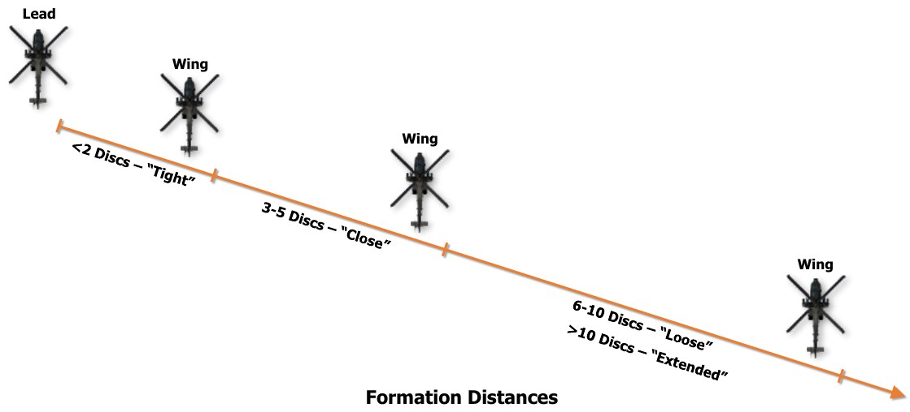
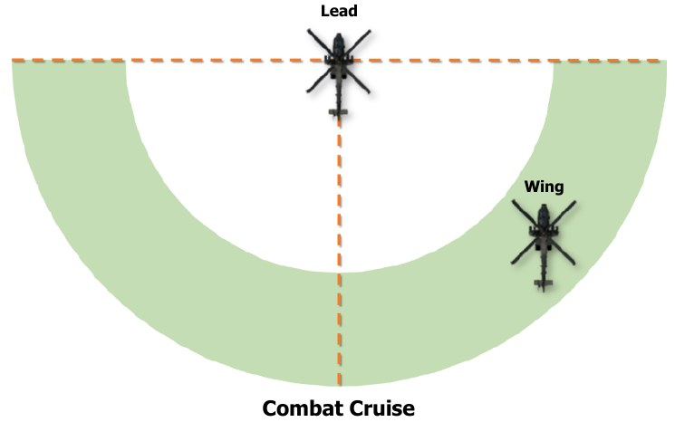
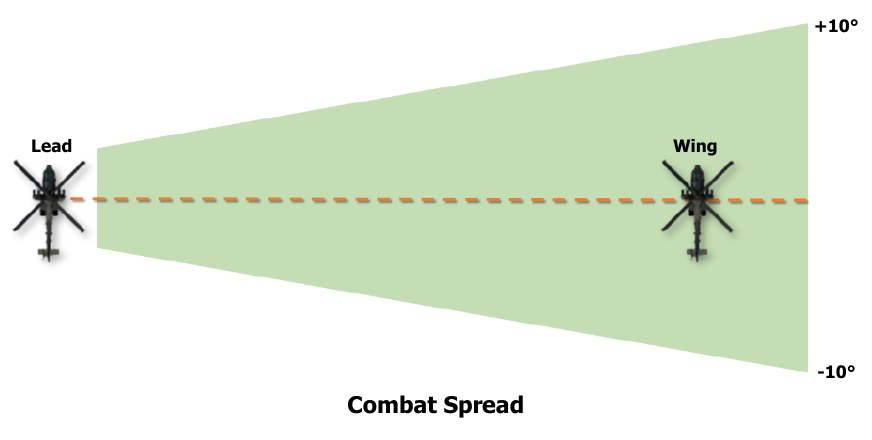
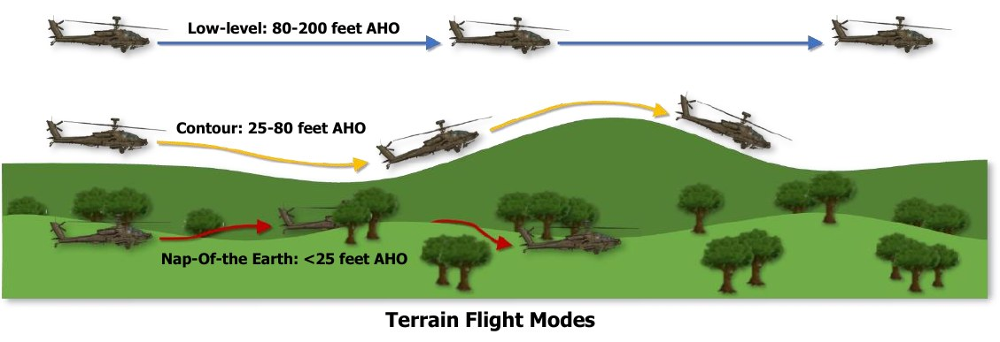
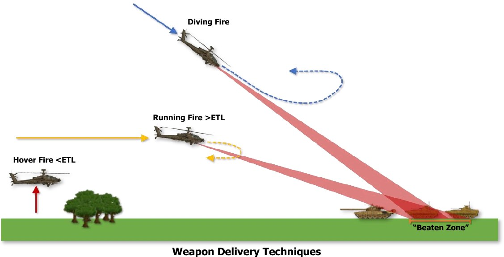

# AH-64 TACTICAL EMPLOYMENT

Pre-mission planning is the most important part of any successful combat mission. Just as in the case with other
military aircraft, factors such as terrain and threat locations should be considered when planning mission routes,
altitudes, and weapon loads. Routes and altitudes should be selected to maximize survivability and reduce the
probability of detection by threat weapon systems.

Routes, pre-planned targets, enemy threats, and other graphical control measures can be displayed on the AH-
64D’s Tactical Situation Display (TSD) along with information from the aircraft’s sensors to enhance situational
awareness and provide an overview of the surroundings. The TSD can further enhance situational awareness of
potential threat blind spots by using Color Bands (enabled from the TSD Map sub-page and TSD Threat Show
sub-page) and selecting an appropriate map type and scale. Configuring the SHOW options on the TSD is
important in ensuring critical information is present on the TSD for crews to reference during each phase of the
mission.

Upon departure from the airfield, assembly area, or FARP, or when approaching the Forward Edge of Battle Area
(FEBA), aircrews should conduct pre-combat checks and ensure the aircraft is ready to respond to enemy contact.
Accordingly, the AH-64D team should adjust their formation and flight patterns to those which are best suited for
the tactical situation, terrain, and airspeeds they intend to fly.

## Team Maneuvering

The basic building block of any U.S. Army attack helicopter unit is an Air Weapons Team (AWT or simply “team”)
of two AH-64’s under the control of an Air Mission Commander (AMC), which is typically the most experienced
Pilot-in-Command (PC) within the flight. The AMC is responsible for ensuring the success of the team’s mission
and is the overall weapons release authority for the team.

Maneuverability is the primary consideration for the AWT. The lead aircraft (“Lead”) should strive to maneuver
in a predictable manner for the wingman (“Wing” or “Trail”); and the wingman should strive to position their
aircraft in such a way to never inhibit the lead aircraft’s ability to maneuver while always being ready to provide
suppressive fire in support of Lead, if needed. Distance between aircraft can vary based on terrain, proximity to
the ground, illumination/visibility, and expected or known enemy threats; but distances may range from 3 to 5
rotor discs to a kilometer or more. Distances are typically greater when over open terrain, whereas distances
between aircraft will be less when operating in restrictive terrain.

Combat Cruise is the standard formation for AWT employment. It is preferable at very low altitudes and provides
the most flexibility of the flight while reducing predictability. Combat Cruise provides an area to the rear of the
lead aircraft, along their aft hemisphere, for wingmen to maneuver. The trail aircraft positions their aircraft in
such a way to provide fire support for the lead aircraft if unexpected enemy units are encountered. Combat Cruise
Left/Right “pins” the wingmen to one side of the lead aircraft during situations in which maneuvers to the
opposite side are not feasible, possibly due to terrain.

Combat Spread maximizes forward firepower with overlapping sensor fields-of-view and weapons fields-of-fire,
at the expense of ease of maneuverability and team flexibility. The trail aircraft sets their position abeam of the
lead aircraft at the 3 o’clock or 9 o’clock positions. Combat Spread requires a high degree of scanning and
coordination between the Pilot’s in each aircraft, particularly at night due to the field-of-view limitations of Night
Vision Systems (NVS). Distance between aircraft should be based on maneuver room, visibility, terrain, and
expected enemy contact.

## Terrain Flight Modes

The purpose of terrain flight and the associated modes of terrain flight is to deny or delay enemy forces the ability
to detect, track, and engage the aircraft. Terrain flight requires constant visual scanning to see and avoid
obstacles, particularly at night. The most important rule when conducting terrain flight is to never “out-fly” the
capabilities of the sensor being used for flight, nor the capabilities of the aircrew to respond to low-level hazards.

If weather and ambient lighting conditions restrict or reduce visibility, the aircrew should decrease their airspeed.
Continuous operations in a single terrain flight mode is typically unlikely, as terrain and vegetation will vary
throughout the Area of Operations (AO). Crews can expect to transition into and out of each mode as a natural
part of performing terrain flight operations. The modes of terrain flight are defined below:

- **Low-level.** Low-level flight is conducted at a constant altitude and airspeed, typically between 80 to 200
     feet above the highest obstacle (AHO). Under these conditions, it will most likely be advantageous to use a
     “Traveling” movement technique (constant altitude and airspeed) to rapidly transit from one place to
     another, however this method provides the least amount of security for unexpected enemy encounters.

- **Contour.** Contour flight is conducted at low altitude conforming to the contours of the earth, typically
     between 25 to 80 feet AHO. It is characterized by varying airspeeds and altitude, which will be dictated by
     the terrain itself and obstacles. Under these conditions, it will most likely be advantageous to use a “Traveling
     Overwatch” movement technique (varying altitudes and airspeeds) and utilize Combat Cruise as the
     formation pattern in which the trail aircraft is positioned to respond to enemy contact.

- **Nap-Of-the-Earth (NOE).** NOE flight is conducted at low airspeeds and altitudes as close to the earth’s
     surface as vegetation and obstacles permit, usually between the surface and 25 feet AHO. Under these
     conditions, it will most likely be advantageous to use a “Bounding Overwatch” movement technique, where
     one aircraft maintains position and provides cover while the other aircraft moves to the next position. Care
     should be taken to avoid bounding beyond the range of the weapon systems of the aircraft providing cover.

## Weapon Delivery Techniques

The three techniques for weapons delivery from an attack helicopter are defined below:

- **Hover Fire.** Hover fire is typically conducted at speeds less than effective translational lift (ETL, roughly 16-
     24 knots airspeed) and may be conducted from a stationary hover or a hover with movement; such as
     laterally un-masking.

- **Running Fire.** Running fire is typically conducted at speeds greater than ETL. Forward airspeed adds
     stability to the helicopter and increases the accuracy of unguided weapon systems, particularly rockets.

- **Diving Fire.** Diving fire is an engagement conducted in a diving profile, typically between -10° to -30° pitch
     attitudes. Airspeed and altitude will be determined by the expected threat level from enemy defenses and
     desired weapons effects, with a steeper dive providing a smaller “beaten zone” and improved accuracy.
     However, a steep dive will also require more altitude for recovery. Diving fire may be performed following a
     climb from low altitudes (a “bump” from behind cover), or from level flight at high altitudes.

