# HELMET-MOUNTED DISPLAY (HMD)

The Helmet-Mounted Display is part of the Integrated Helmet And Display Sighting System (IHADSS) which allows
either crewmember to employ aircraft weapons, cue other aircraft sensors to specific locations, or even direct
the opposite crewmember to locations seen outside the cockpit.

Unlike many helmet cueing systems that were post-production modifications to fixed-wing combat aircraft, the
AH-64’s helmet sight was designed from the beginning to function as both the primary display for flight
information and as an independent but integrated targeting system.

The overall IHADSS consists of several subcomponents that must be defined.

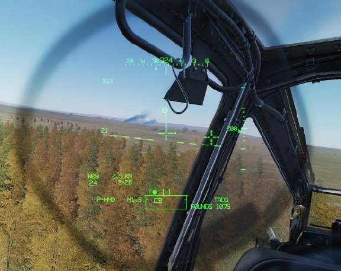

- **IHU.**    Integrated     Helmet     Unit; the
     crewmember’s flight helmet with integrated
     helmet position tracking sensors.

- **HDU.** Helmet Display Unit; the physical
     device that is clipped to the crewmember’s
     IHU that projects symbology and video onto
     a combiner lens in front of the right eye.

- **HMD.** Helmet-Mounted Display; the method
     of sighting through aiming symbology
     projected onto the HDU combiner lens for
     generating weapon solutions.

- **IHADSS.** Integrated Helmet And Display
     Sighting System; the entire system that
     tracks the position of each crewmember’s
     IHU, generates symbology for display on the
     HDU, and processes weapon solutions based
     on sighting through the HMD.

### HMD Activation

Both crewmembers’ individual Helmet Display Units (HDU)
receive symbology and video data from the aircraft Display
Processors (DP); however the CPG’s HDU also requires the
TADS to be powered in order to function. As such, the HDU’s
in each cockpit are automatically initialized when the APU is
powered on. If the TADS is powered off from the CPG’s WPN
Utility sub-page (shown at right), or from either crewstation
on the DMS Shutdown sub-page, the CPG’s HDU will blank
completely.

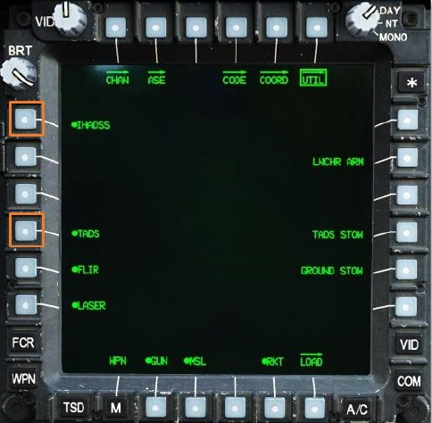

The IHADSS can be selectively powered on or off from either
crewstation by pressing VAB L1 on the WPN Utility sub-page,
but disabling this system will affect the HDU’s in both
crewstations. When the IHADSS is disabled, helmet-tracking
in both crewstations is disabled and symbology displayed
within the HDU’s will be lost, although sensor video may still
be present.

### Integrated Helmet Unit (IHU) & Helmet Display Unit (HDU)

The Integrated Helmet Unit uses a
combination of infrared tracking sensors
integrated into the helmet itself and Sensor
Surveying Units (SSU) mounted within the
crewstation to determine the helmet
position in azimuth and elevation.

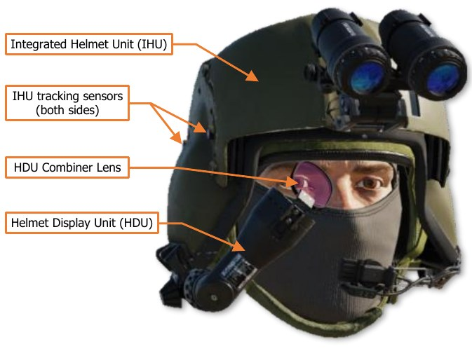

The helmet position is processed by the
aircraft  electronics,  which     updates
symbology projected into the Helmet
Display Unit in real-time. If the
crewmember’s selected sight is HMD, the
aircraft electronics calculates weapon
solutions for the crewmember’s current
weapon based on the selected range
source along the HMD line-of-sight.
During initialization of aircraft systems prior
to takeoff, each crewmember performs a
boresight of their IHU after mounting the
HDU to their helmet.

(See IHADSS Boresight on the following page for more information.)

## IHADSS Boresight

During aircraft start-up, the helmet within each crewstation must be boresighted to provide the IHADSS with
accurate azimuth and elevation position data of each crewmember’s helmet. Until a successful boresight has been
performed, the Sight Status field of the High Action Display will alternate between displaying “IHADSS” and “B/S
REQUIRED” status messages, and the Cueing Dots will flash around the HMD LOS Reticle. (See HMD High Action
Display for more information.)

The IHADSS boresight procedure is performed by accessing the BORESIGHT sub-page by pressing VAB L5 on the
WPN page. After entering the BORESIGHT sub-page, the crewmember selects IHADSS (VAB L4) to enable the
IHADSS boresight logic and activate the Boresight Reticle Unit (BRU) mounted on top of the instrument panel
(below, left). When IHADSS is pressed and the text is boxed, B/S NOW is displayed at VAB L6 and the MPD cursor
is automatically positioned over the option (below, right).

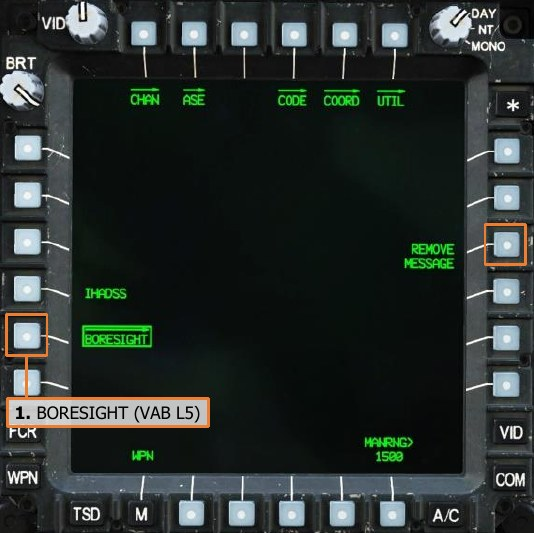

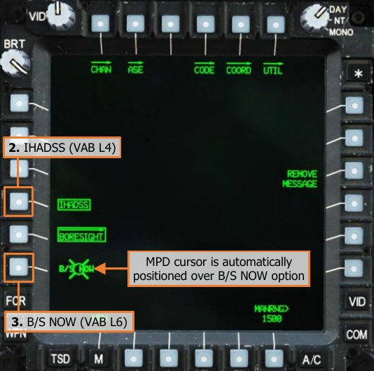

If desired, REMOVE MESSAGE (VAB R3) may be pressed to remove the “IHADSS B/S REQUIRED” message from
the Sight Status field of the High Action Display.

When the IHADSS boresight logic is enabled, a bullseye pattern is displayed within the BRU, the brightness of
which is controlled by the PRIMARY lighting knob on the EXTLT/INTR LT panel on the Pilot’s Left Console, or the
INTR LT panel on the CPG’s Left Console.

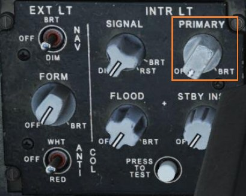

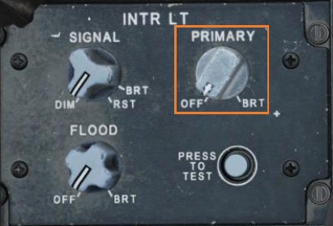

After the BRU has been activated and is adjusted to the appropriate brightness, the position and orientation of
the helmet should be adjusted so that the bullseye pattern is centered within the BRU and the LOS Reticle is
aligned with the center of the bullseye, as shown below. If necessary, Transition or Cruise symbology modes
should be selected to ensure the Horizon Line is level with the cockpit frame.

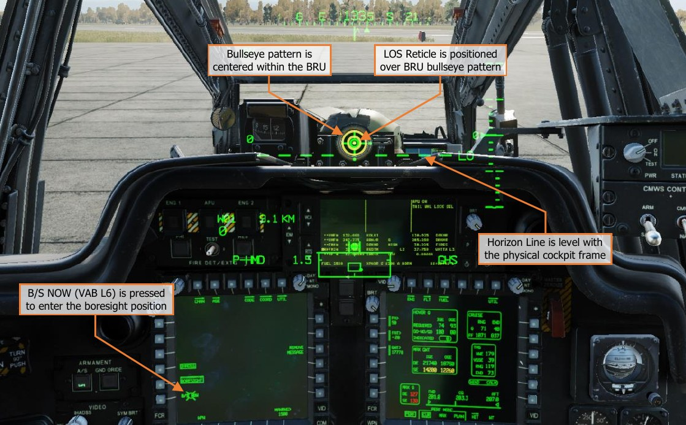

When the HMD LOS Reticle and the BRU bullseye pattern are properly aligned, the B/S NOW is commanded by
pressing VAB L6 or by using the MPD Cursor-Enter option on the Collective Mission Grip (or the TEDAC Left
Handgrip in the CPG crewstation). If the boresight position is accepted, the bullseye pattern within the BRU will
extinguish, the B/S NOW option (VAB L6) will be removed, and IHADSS (VAB L4) on the BORESIGHT sub-page
will be un-boxed.

The IHADSS boresight process may be aborted at any time by re-selecting IHADSS (VAB L4), which will remove
the B/S NOW option and extinguish the bullseye pattern within the BRU.

## HMD HIGH ACTION DISPLAY

If the crewmember’s selected sight is HMD, Flight symbology is displayed on the crewmember’s HDU; and
specifically in the case of the Copilot/Gunner (CPG), HMD Weapon symbology is displayed on the CPG’s TDU.
The pertinent targeting- and weapon-related symbology when using HMD as the selected sight is the Line-Of-
Sight (LOS) Reticle, LOS Reticle Cueing Dots, and the High Action Display (HAD) data fields shown below.

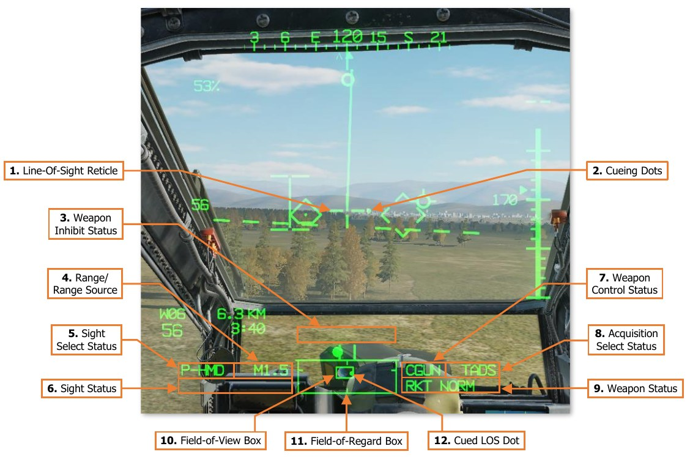

1.   **Line-Of-Sight Reticle.** Indicates the HMD line-of-sight (LOS). When the crewmember’s selected sight is
     HMD, the LOS Reticle is used as an aiming crosshair for weapons employment and laser designation.
     The LOS Reticle flashes when the selected sight’s LOS is invalid or has reached its slew limit.

2.   **Cueing Dots.** Indicates the quadrant direction of the selected acquisition source to “cue” the crewmember’s
     helmet position to the location of the Cued LOS Reticle. The dots are removed when the Cued LOS Reticle
     is with 4° of that quadrant relative to the LOS Reticle.
     All four dots flash when the “IHADSS B/S REQUIRED” message is present within the Sight Status field of the
     High Action Display, indicating the crewmember needs to boresight their IHADSS.

3.   **Weapon Inhibit Status.** Displays any pertinent safety or performance inhibits that may affect weapons
     employment, based on the currently actioned weapon within the crewstation.

4.   **Range Source/Range.** Displays the range source in use and the current range in tenths of kilometers, or
     meters if the range source is the LRFD.

    -   **Default range.** Default range is selected upon initial aircraft power-on, or any time the crewmember’s
            current range source is no longer valid. The Default range for the Pilot is 1.5 km, and 3.0 km for the
            CPG (displayed as “1.5” and “3.0” respectively).

    - **Manual range.** Manual range may be selected and modified on the WPN page and may be set in 1-
          meter increments between 100 and 50,000 meters (displayed as “M0.1” to “M50.0”).

    - **Automatic range.** Auto range may be selected on the WPN page and provides dynamic range
          calculations between 0.1 km and 50 km (displayed as “A0.1” to “A50.0”).

    - **Navigation range.** Navigation range is automatically entered as the range source any time the
          crewmember’s sight is slaved to an acquisition source that has been set to a stored point within the
          navigational database. A Nav range is dynamically updated to reflect the current slant range between
          the aircraft and the point set as the acquisition source, between 0.1 km and 32 km (displayed as “N0.1”
          to “N32.0”).

    - **Radar range.** Radar range is automatically entered as the range source any time the crewmember’s
          selected sight is set to FCR. A radar range is dynamically updated to reflect the current slant range
          between the aircraft and the Next-To-Shoot FCR target, between 0.1 km and 9.9 km (displayed as
          “R0.1” to “R9.9”).

    - **Laser range.** Laser range is automatically entered as the range source any time the CPG fires the
          LRFD. The laser range is displayed in 1-meter increments between 500 and 9,999 meters (displayed
          as 500 to 9999). An asterisk (‫ )٭‬is displayed to the left of the laser range any time the LRFD is firing
          and processing a stable laser return from the object or surface within the TADS Line-of-Sight Reticle.

5.   **Sight Select Status.** Indicates the sight currently selected within the crewstation.

    - **P-HMD.** Displayed in the Pilot’s symbology when the Pilot’s selected sight is HMD.

    - **P-FCR.** Displayed in the Pilot’s symbology when the Pilot’s selected sight is FCR.

    - **C-HMD.** Displayed in the CPG’s symbology when the CPG’s selected sight is HMD.

    - **C-FCR.** Displayed in the CPG’s symbology when the CPG’s selected sight is FCR.

    - **TADS.** Displayed in the CPG’s symbology when the CPG’s selected sight is TADS.

6.   **Sight Status.** Displays status messages regarding the currently selected sight within the crewstation and
     the employment of laser-guided AGM-114 missiles when launched in a Remote Fire mode.

7.   **Weapon Control Status.** Indicates the opposite crewmember’s actioned weapon system. If the Weapon
     Control Status field is blank, no weapon system is actioned by the opposite crewmember.

    - **PGUN.** Displayed in the CPG’s symbology to indicate the Pilot’s actioned weapon is the gun.

    - **PRKT.** Displayed in the CPG’s symbology to indicate the Pilot’s actioned weapon is rockets.

    - **PMSL.** Displayed in the CPG’s symbology to indicate the Pilot’s actioned weapon is missiles.

    - **CGUN.** Displayed in the Pilot’s symbology to indicate the CPG’s actioned weapon is the gun.

    - **CRKT.** Displayed in the Pilot’s symbology to indicate the CPG’s actioned weapon is the rockets.

    - **CMSL.** Displayed in the Pilot’s symbology to indicate the CPG’s actioned weapon is the missiles.

    - **COOP.** Displayed in both crewmember’s symbology to indicate both crewmembers’ actioned weapon
          is rockets, in Cooperative mode.

8.   **Acquisition Select Status.** Indicates the acquisition source currently selected within the crewstation.

    - **PHS.** When slave is enabled, the currently selected sight will slave to the azimuth and elevation of the
          Pilot’s Helmet Sight.

    - **GHS.** When slave is enabled, the currently selected sight will slave to the azimuth and elevation of the
          Copilot/Gunner’s Helmet Sight.

    - **SKR.** If the next-to-shoot AGM-114 is tracking a laser designation or target in LOBL mode when slave
          is enabled, the currently selected sight will slave to the azimuth and elevation of the missile seeker.

    - **FCR.** When slave is enabled, the currently selected sight will slave to the location of the Next-To-Shoot
          (NTS) target detected by the Fire Control Radar. This option is only displayed if the FCR mast-mounted
          assembly is installed and the FCR is powered.

    - **FXD.** When slave is enabled, the currently selected sight will slave to a fixed forward direction along
          the Armament Datum Line (ADL, 0° in azimuth/-4.9° in elevation).

    - **W##, H##, C##, T##.** When slave is enabled, the currently selected sight will slave to the location
          of the Waypoint, Hazard, Control Measure, or Target/Threat point set as the acquisition source within
          the crewstation, and the range source will switch to a Navigation range equal to the slant range
          between the aircraft and the selected point. ## indicates the specific point number to which the
          Waypoint, Hazard, Control Measure, or Target/Threat point has been stored.

    - **TRN.** When slave is enabled, the currently selected sight will slave to the location of the terrain location
          cursor-selected on the TSD within the crewstation, and the range source will switch to a Navigation
          range equal to the slant range between the aircraft and the Terrain point.

9.   **Weapon Status.** Displays status messages regarding the currently actioned weapon within the crewstation.

10. **Field-Of-Regard (FOV) Box.** The FOV box indicates the relative position of the crewmember’s helmet
    line-of-sight within the larger Field-of-Regard box. The FOV box represents a 30° x 40° field of view and is
    driven by the crewmember’s helmet orientiation as detected by helmet sensors within each resepective
    cockpit.

11. **Field-Of-Regard (FOR) Box.** The FOR box indicates azimuth limits for the crewmember’s Night Vision
    System (NVS) sensor turret. The format of the FOR box is determined by the NVS sensor (PNVS or TADS)
    assigned to that crewstation. Tick marks around the edges of the PNVS FOR box mark 0° in azimuth and
    elevation. Tick marks around the edges of the TADS FOR box mark 0° and ±90° in azimuth, and 0° elevation.

    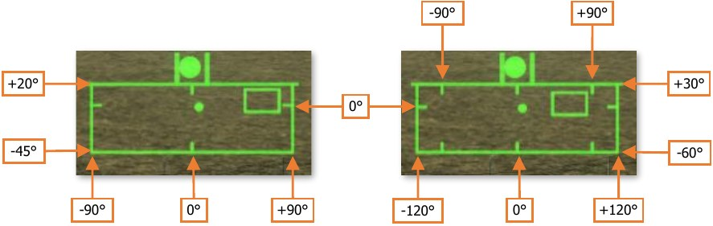

12. **Cued Line-Of-Sight Dot.** Indicates the relative location of the selected acquisition source within the Field-
    of-Regard box.

#### HMD Sight Status Messages

The following status messages pertain to the use of the HMD as the selected sight within the crewstation and
when using the PNVS or TADS as an NVS (Night Vision System) sensor during operations at night.

- **IHADSS B/S REQUIRED**. A boresight of the IHADSS has not been performed within the crewstation following initialization of the IHADSS.

    Perform IHADSS boresight procedures or select REMOVE MESSAGE on WPN Boresight sub-page.

- **IHADSS FAIL**. The IHADSS has failed within the corresponding crewstation.

    The IHADSS line-of-sight for the affected crewstation is set to fixed forward. The HMD should not be used for weapon employment.

- **IHADSS LOS INVALID**. The IHADSS line-of-sight is no longer valid due to a failure of an IHADSS component or the IHADSS being powered off.

    The IHADSS is frozen at the last position that was detected as valid. If using NVS for piloting under low-visibility conditions or darkness, set NVS mode to FIXED.

- **LIMITS**. The NVS sensor (PNVS or TADS FLIR) that has been assigned to the crewstation encountered a slew limitation.

    Adjust the helmet position to within the slew limits of the assigned NVS sensor (PNVS or TADS).

- **NVS FIXED**. NVS has been enabled and set to FIXED mode.

    No action required.

- **NVS FAIL**. The NVS sensor (PNVS or TADS FLIR) that has been assigned to the crewstation has failed.

    If using NVS for piloting under night conditions, transfer flight controls to opposite crewmember and switch to night vision goggles.

- **NVS NORM**. NVS has been enabled and set to NORM mode.

    No action required.

## HMD ACQUISITION AND RANGING

Detecting, acquiring, and engaging targets with the HMD is fairly straightforward, in that the HMD simply needs
to be pointed toward the target to generate an appropriate weapon solution. Unlike the TADS, the HMD does not
include additional targeting modes to assist the crewmember in stabilizing their HMD line-of-sight onto a target
position. As such, when using HMD as the selected sight, the aircraft electronics do not provide the same levels
of ballistic compensation as compared to using the TADS. Ballistic compensation for aircraft movement or lead
angle compensation for target movement is not provided; however ballistic compensation for range is provided,
subject to the crewmember’s selected range source.

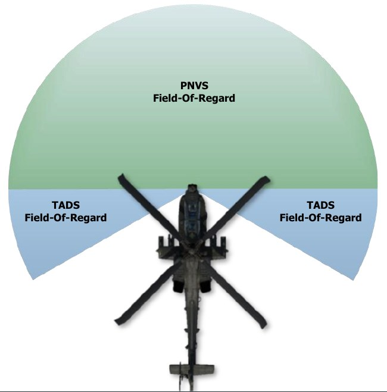

When operating at night, using Night Vision
System (NVS) in NORM mode allo ws either
crewmember to utilize their respective FLIR
system to detect and acquire targets, even those
that may otherwise be obscured by the cockpit
structure or canopy frames. However, it is
important to understand each sensor (PNVS and
TADS) is subject to different slew values.

(See Night Vision System for more information.)

The format of the Field-Of-Regard (FOR) Box
displayed within the HMD High Action Display is
indicative of not only the slew limitations of the
currently assigned NVS sensor, but which sensor
is assigned to the crewstation. If the LOS Reticle
has exceeded the slew limitations of the NVS
sensor currently assigned to the crewstation,
even if the NVS mode is set to OFF, the HMD LOS
Reticle will flash and LIMITS will be displayed
within the Sight Status field of the High Action
Display.

### Acquisition Sources

The use of acquisition sources can reduce the time necessary to bring the HMD onto an intended target. When
a target is detected using another sensor onboard the aircraft (to include visual detection by either crewmember),
setting that sensor as the acquisition source and enabling the SLAVE function increases the efficiency of target
acquisition within the HMD field-of-view.

However, since the HMD line-of-sight is solely directed by the crewmember’s helmet position, “cueing” indications
are displayed within the HMD symbology. When a valid acquisition source is selected, cueing dots will appear
around the HMD LOS Reticle to cue the crewmember’s head position to the corresponding direction of where the
acquisition source is located.

HMD cueing is enabled within a crewstation any time the HMD is the selected sight and SLAVE is enabled. Within
the CPG crewstation, SLAVE is toggled from the TEDAC Right Handgrip. However, since the Pilot crewstation does
not have an option to selectively enable SLAVE, SLAVE is permanently enabled for the Pilot. The Pilot does have
an option to disable the display of cueing dots within the HMD symbology from the WPN Utility sub-page.
Acquisition sources also reduce the amount of verbal communications and coordination of sensors that must
occur between the crewmembers, which also increases combat efficiency. By replacing the verbal description of
a target (or threat) using a verbose “description, direction, distance” with a concise “sight to source” command,
target handovers between crewstations may become near instantaneous with a proficient aircrew. In addition,
cueing the opposite crewmember’s helmet line-of-sight directly to the location of the acquisition source reduces
the effects of inaccurate range estimations and removes the need for verbal descriptions of the intended target,
obstacles or hazards to flight, or visual reference points.

An example of an inefficient obstacle handover during flight operations at night is shown below:

> “Tower obstacle at 11 o’clock, approximately 2 kilometers, on our flight route along the right side of the valley.”

The Pilot must look toward the approximate direction, visually trace their projected flight path along the right
side of the valley and then locate the obstacle amongst any background clutter seen within the NVS FLIR video.

Examples of efficient handovers of obstacles or hazards utilizing HMD cueing to an acquisition source (such as
the opposite crewmember’s helmet sight) are shown below:

> “Tower obstacle in 2 kilometers, my line-of-sight.”

> “Aircraft, my line-of-sight, on the horizon, come right to avoid.”

In either case, the crewmember simply follows the cueing within their HMD symbology until the Cued LOS Reticle
becomes visible, at which point they can see the precise location that is being referenced by the other
crewmember’s helmet sight, removing most of any ambiguity that exists.

Acquisition sources that will cue the HMD to a specific azimuth and elevation relative to the aircraft nose are
listed below.

- **PHS.** Pilot Helmet Sight; cues the HMD to the line-of-sight of the Pilot’s helmet. May be used to direct the
     CPG’s HMD line-of-sight to the location designated by the Pilot’s HMD LOS Reticle.

- **GHS.** Gunner Helmet Sight; cues the HMD to the line-of-sight of the Copilot/Gunner’s helmet. May be used
     to direct the Pilot’s HMD line-of-sight to the location designated by the CPG’s HMD LOS Reticle.

- **SKR.** Seeker; cues the HMD to the line-of-sight of the next-to-shoot AGM-114 missile seeker. May be used
     to direct the crewmember’s HMD line-of-sight to the target location that is currently being tracked by the
     next-to-shoot AGM-114 missile, possibly to confirm target identification prior to weapons release.

- **FXD.** Fixed forward; cues the HMD to align with the Armament Datum Line (ADL) at 0° in azimuth and -
     4.9° in elevation.

- **TADS.** Target Acquisition Designation Sight; cues the HMD to the line-of-sight of the TADS turret. May be
     used to monitor the TADS sensor position for situational awareness or coordinating weapon engagements.

Acquisition sources that will cue the HMD to a 3-dimensional location relative to the ownship position are listed
below.

- **FCR.** Fire Control Radar; cues the HMD to the location of the next-to-shoot target designated on the FCR
     page. May be used to direct the crewmember’s HMD line-of-sight to the location of the designated target
     for situational awareness or to engage the designated target while using HMD as the sight.

- **W##, H##, C##, T##.** Waypoint, Hazard, Control Measure, or Target/Threat point; cues the HMD to
     the coordinates of the selected point within the navigation database. May be used to direct the
     crewmember’s HMD line-of-sight to a pre-planned, stored, or transmitted location for reconnaissance, visual
     identification, weapons engagement, or re-acquisition if line-of-sight was lost.

- **TRN.** Terrain point; cues the HMD to the coordinates of the selected terrain point within the navigation
     database. May be used to direct the crewmember’s HMD line-of-sight to a cursor-selected location on the
     TSD that is not associated with an existing Waypoint, Hazard, Control Measure, or Target/Threat point for
     reconnaissance, visual identification, or weapons engagement.

### Range Sources

Once a target has been visually acquired by the crewmember, the next and perhaps most critical step in ensuring
a successful weapon engagement is determining an appropriate range source for the engagement. As the HMD
line-of-sight can only determine a target’s relative azimuth and elevation with respect to the aircraft’s attitude,
measuring the range to the target along the HMD line-of-sight provides the third dimension needed to determine
the target’s 3-dimensional position relative to the ownship.

Among the three sights (HMD, TADS, and FCR) that may be employed by the AH-64D aircrew for targeting, the
HMD is roughly comparable to the TADS with regards to the available methods of ranging that may be employed.
When a method of ranging is employed, this is called a “range source”, and is displayed within the High Action
Display in both Flight Symbology and Weapon Symbology.

The range sources that are available to either crewmember when using the HMD as the selected sight are shown
below, from the most accurate to the least accurate.

- **Laser range (COOP mode).** Laser range is automatically entered as the range source any time the CPG
     fires the TADS LRFD to measure the slant range between the ownship and the target using reflected laser
     energy. Laser range is only displayed in the Pilot’s HMD when employing rockets in a Cooperative mode.

- **Navigation range.** Navigation range is automatically entered as the range source any time the HMD is
     cued to a Waypoint, Hazard, Control Measure, Target/Threat, or a Terrain point. The slant range between
     the ownship and the corresponding point’s navigational coordinates are calculated and is subject to the
     position confidence of the aircraft.

- **Automatic range.** Automatic range is selected from the WPN page by pressing MANRNG> (VAB B6) and
     entering “A” on the Keyboard Unit (KU) in place of a numerical value. Auto-range is determined by the radar
     altitude of the aircraft over the ground and the elevation “look-down” angle of the HMD line-of-sight.

- **Manual range.** Manual range is selected from the WPN page by pressing MANRNG> (VAB B6) and entering
     a numeric value on the Keyboard Unit.

- **Default range.** Default range is selected upon initial aircraft power-on, or any time the crewmember’s
     current range source is no longer valid.

!!! note
    When transitioning from using the TADS as the selected sight to using the HMD, it is possible for the
    Copilot/Gunner (CPG) to retain a static laser range as the range source. When the gun is actioned while the HMD
    is the selected sight, the range source will automatically revert to the Manual range within the crewstation.

    However, if intending to employ rockets using the HMD, a different range source should be considered that is
    appropriate for the given situation.

When determining which range source to utilize when the HMD is the selected sight, the common deciding factor
will be whether the engagement is “deliberate” or “hasty” in nature. When conducting a deliberate engagement,
the crew will typically have time to reliably calculate and/or store the target location, determine a reasonably
accurate range from the intended weapon release point to the target, and employ a weapon system while the
target is directly in front of the aircraft in optimal release parameters. In such situations, a dynamic range source
such as a Navigation range to the target location or (when employing unguided rockets) Cooperative TADS laser
ranging will provide a more accurate targeting solution. Automatic range is another dynamic range source that
may be used but may not always be appropriate depending on the terrain the aircraft is operating over, or the
resulting oscillations in calculated range caused by rapid head and/or aircraft movements.

In many situations in which a crewmember is using the HMD as the selected sight to engage a close-range target
in a hasty manner, a static range source such as Manual range is typically more appropriate since it allows the
crewmember to rapidly adjust rounds onto the target without needing to change the acquisition source to employ
a Nav range; nor is it subject to the errors with Auto-ranging when operating over un-even terrain or when the
crewmember is rapidly moving his/her head. A Manual range is not dynamic and represents a fixed point in space
to which weapon solutions are calculated. As such, the HMD elevation relative to the target will need to be
manually adjusted to account for rounds that impact prior to or beyond the target (also referred to as landing
“short” or “long”).

#### Navigation Range

Navigation range is calculated by simply measuring the slant range between the ownship position and the
coordinates of a point stored within the navigational database. Although a Nav range is more accurate than using
Auto-ranging or Man-ranging, in that it is dynamically updated with aircraft movement and does not rely on flat
terrain as is the case with Automatic range, Nav range may be somewhat inflexible when using the HMD as the
selected sight for targeting.

Any time the acquisition source is set to a Waypoint, Hazard, Control Measure, Target/Threat, or Terrain point,
the slant range to the corresponding point is entered as a Nav range (the SLAVE button must be pressed to
update the HMD range source to a Nav range in the CPG crewstation). When employing weapons while using the
HMD as the selected sight, a Navigation range is only preferred if the intended target is within close proximity to
the coordinates of the point being referenced by the Nav range, or if employing area effect weapons against the
general area surrounding the point.

In the figure below, the intended target is at a range to the ownship that is substantially closer than the point
being referenced (T01) for the Nav range. In such a situation, rockets would impact beyond the target due to
the equivalent slant range being applied along the HMD line-of-sight, placing the weapon solution beyond the
target and below the surface plane. The HMD LOS Reticle would need to be displaced below the target within
the HMD field-of-view to adjust the weapon solution in such a manner so that the weapon trajectory would
intersect with the target location.

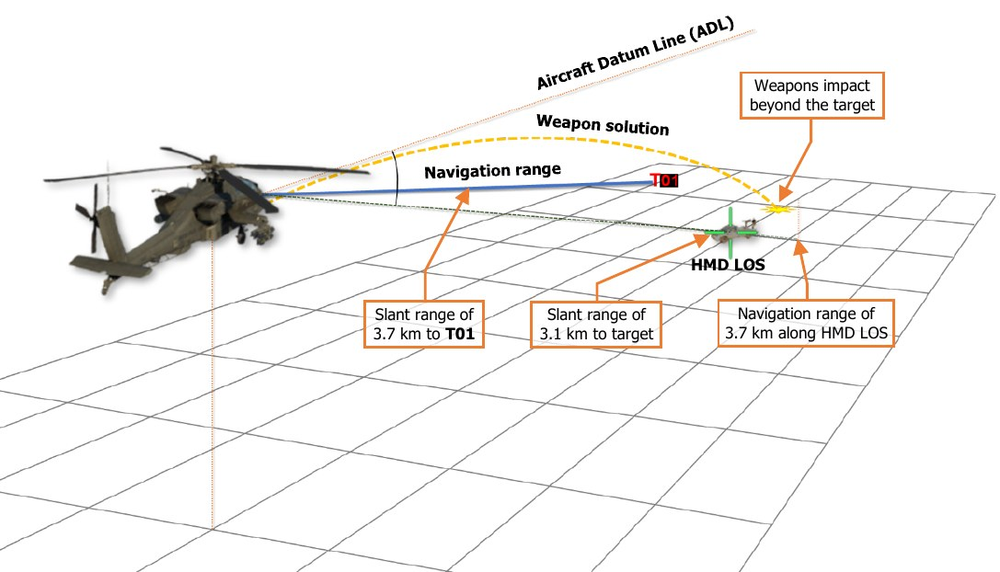

The most common use cases for employing a Nav range are when the Pilot is employing unguided rockets with
variable time delay fuzes independently of the CPG. Rocket types such as the M255A1 or M261 are dependent
on an accurate range to target for their warheads to be effective. Unless fired in Cooperative mode with the CPG’s
TADS supplying an accurate laser range, the most accurate range source that can be used by the Pilot to achieve
the desired warhead effects is a Nav range.

#### Automatic Range

Automatic range is calculated using trigonometric ratios of right triangles, where the HMD look-down angle
relative to the vertical axis between the aircraft and the surface below it is the acute angle; and the altitude
above ground level (as measured by the radar altimeter) is the adjacent edge of the right triangle.

Using these two variables, along with an assumption the target is at an elevation equal to the that of the surface
directly below the aircraft along a lateral axis that represents the opposite edge of the right triangle, the
hypotenuse is calculated to determine the slant range to target. This calculation is performed continuously based
on the HMD line-of-sight elevation and the radar altitude of the aircraft.

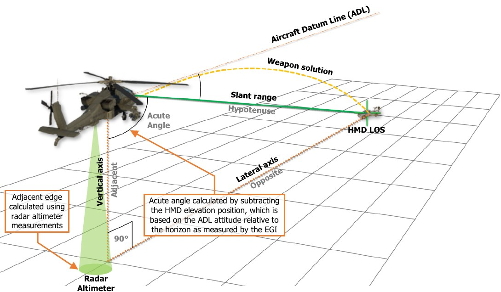

As the HMD line-of-sight (LOS) approaches the horizon and the look-down angles become quite shallow, the
Auto-range calculations will become increasingly less precise due to the trigonometric ratios becoming quite large
which is exacerbated if the aircraft is operating at very low altitudes over the surface.

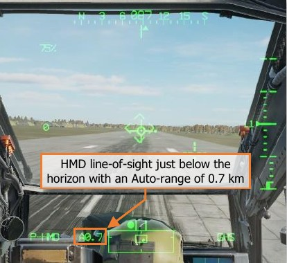

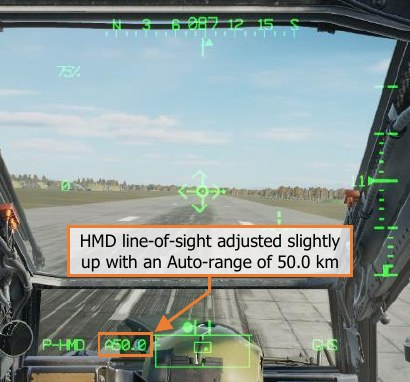

Automatic range relies upon a functioning radar altimeter and will only be usable when the aircraft’s altitude
above ground level (AGL) is less than 1,428 feet (the maximum altitude that is capable of being measured by the
radar altimeter).

It is important to note that the accuracy of Automatic range is predicated on the assumption that the target is at
the same elevation as the surface directly below the aircraft. As this may not always be the case, using Auto-
range for weapon engagements should only be performed in areas with minimal terrain relief, such as open
plains, non-mountainous deserts, large plateaus, or basins. Auto-range should not be used when operating over
mountains, rolling hills, or complex urban areas.

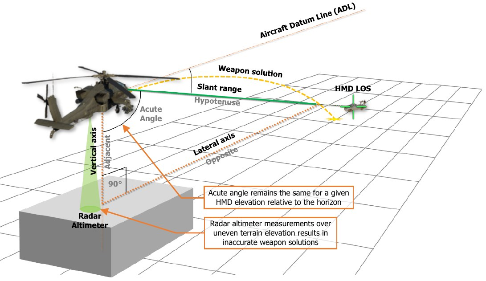

In situations where the terrain directly below the aircraft is at a significantly higher elevation than that of the
intended target, it should be expected that any weapon solution generated using Auto-range will result in
unguided, ballistic munitions such as rockets or gun rounds landing short of the target location. Likewise, in
situations where the terrain directly below the aircraft is at a significantly lower elevation than that of the intended
target, it should be expected that rockets or gun rounds will land long beyond the target location.

#### Manual/Default Range

Manual range is the most inaccurate form of ranging when using the HMD. However, it is the most flexible ranging
option when needing to engage targets in a hasty manner, and as a result is typically the preferred range source.
When a manual range value is entered, the weapon solution will continue to update based on the HMD line-of-
sight (LOS), but the range value will be to a fixed point in space along the LOS at the range entered on the WPN
page.

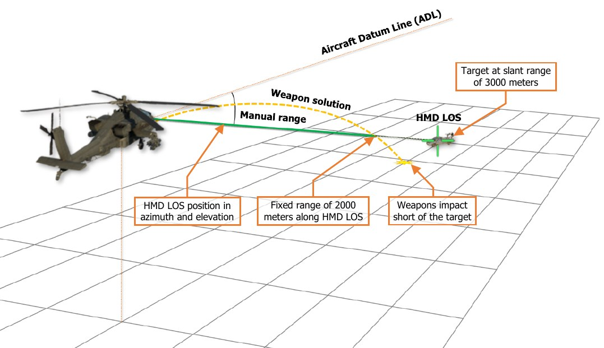

A Man-range is analogous to zeroing a rifle at a specific distance, and manually compensating for bullet drop by
manually elevating the weapon sight higher or lower depending on the estimated range to the target relative to
the range to which the rifle was zeroed.

- If the intended target is estimated to be at a range greater than the manual range value, the HMD LOS
     Reticle must be aimed above the target to compensate for the additional bullet (or rocket) drop.

- If the intended target is estimated to be at a range less than the manual range value, the HMD LOS Reticle
     must be aimed below the target to compensate for the reduced bullet (or rocket) drop.

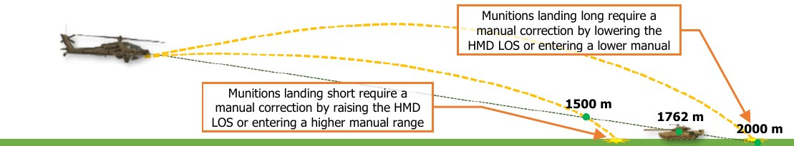

!!! note
    Default ranges for the Pilot and CPG are 1,500 and 3,000 meters respectively (displayed as “1.5” and
    “3.0”), but are essentially the same as using a corresponding manual range (displayed as “M1.5” and “M3.0”).

## HMD HAND CONTROLS

Either crewmember may use their respective Helmet Mounted Displays for targeting and engagement of enemy
targets independently of the other crewstation. In addition, the CPG may use the HMD for storing points through
the TSD Point sub-page. Night Vision System (NVS) controls are shown as PNVS (or TADS in NVS mode) would
be required to employ the HMD as a sight during operations at night, although NVS mode in itself is not a sight.

### Cyclic & Collective Controls

Either crewmember may select HMD as his or her sight on the Collective Mission Grip, with additional controls for
selecting Flight symbology modes on the cyclic and NVS sensor controls on the Collective Flight Grip.

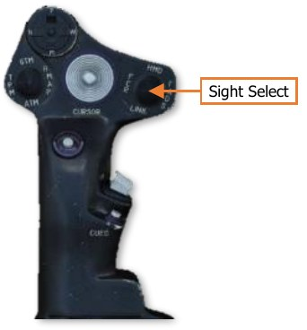
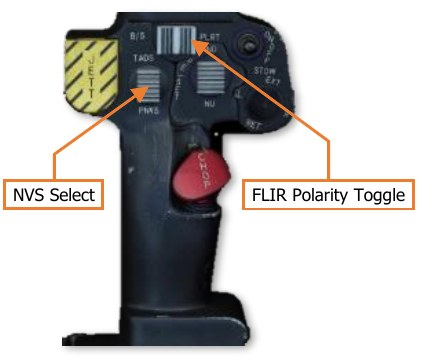
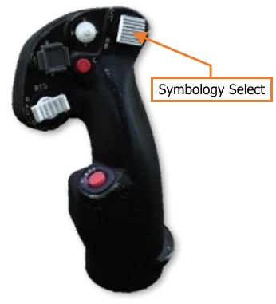

### TEDAC Controls

When the CPG is not using the flight controls, TEDAC controls may be used in conjunction with the HMD to avoid
interfering with the Pilot’s operation of the cyclic and collective.

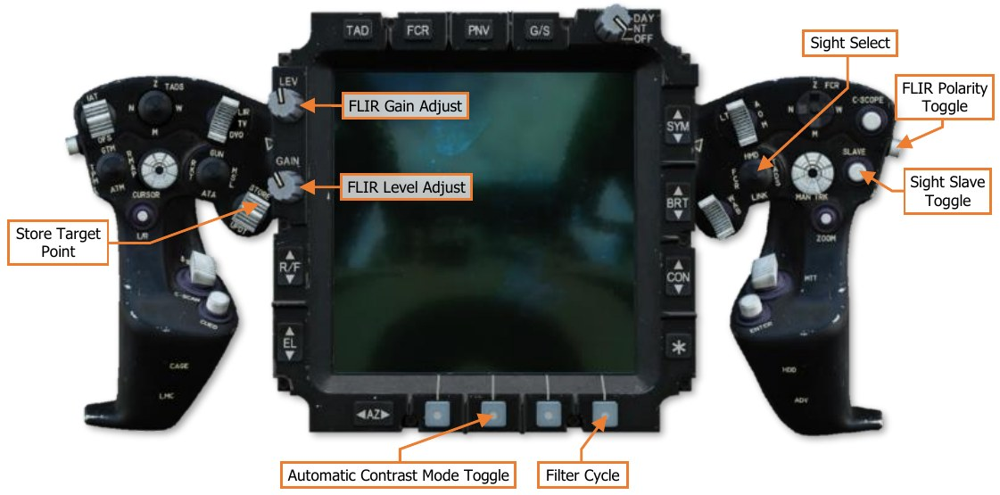

