# TADS TARGETING MODES

The TADS may be utilized with several targeting modes to assist the Copilot/Gunner (CPG) in performing targeting
operations against enemy target locations. Targeting modes consist of Linear Motion Compensation (LMC), Image
Auto-Track (IAT), and Laser Spot Track (LST). These targeting modes reduce the workload of the CPG when
using the TADS but do not directly affect the operation of any weapon system on the aircraft.

### Linear Motion Compensation (LMC)

Linear Motion Compensation provides additional stabilization of the TADS to compensate for linear movement of
the aircraft or the target.

When LMC is disabled, the slew rates of the TADS turret are based on raw
input magnitudes received from the force-sensing Sight Manual Tracker
(MAN TRK, also called the “thumb force controller”) on the TEDAC Right
Handgrip. When no force is applied to the Sight Manual Tracker, the
angular slew rates of the TADS turret are dampened in azimuth and
elevation. When thumb force is applied, the TADS turret slew rate will
increase as the force magnitude increases and will correspondingly
decrease as force magnitude decreases.

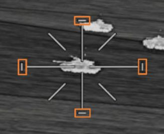{ align=left }

When LMC is enabled, indicated by the presence of the LMC Indicator
around the TADS Line-Of-Sight Reticle, angular slew rates of the TADS
turret are maintained until modified by CPG input or alternate steering
commands by the TADS electronics themselves. When no force is applied
to the Sight Manual Tracker, the angular slew rates of the TADS turret are maintained. When thumb force is
applied, the TADS turret slew rate will increase at a rate corresponding to the force magnitude applied to the
Sight Manual Tracker.

LMC automatically converts angular rates based on the current range value utilized by the TADS to compensate
for motion parallax. As the range increases or decreases, the LMC will automatically adjust the TADS slew rate
to maintain the calculated angular velocity at the corresponding range. As targets that are closer in range will
have a higher angular rate compared to targets further away, the LMC will increase the TADS slew rate to
compensate. In addition, angular rate gains from Sight Manual Tracker input force magnitudes will accordingly
scale based on the current range value.

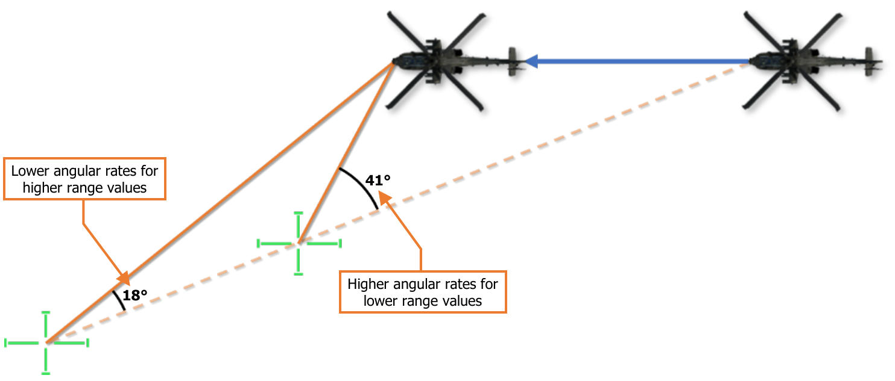

### Image Auto-Track (IAT)

IAT is an automatic tracking mode that allows the TADS to automatically maintain the Line-Of-Sight (LOS) Reticle
on battlefield targets. Unlike the previous generation of TADS in which the IAT tracking logic relied purely on
object contrast amongst its background, the digital tracking logic within the M-TADS uses the scene content
within the video source to lock onto distinct features.

Additionally, the digital IAT will automatically enter an inertial track and “coast” in the event weapons fire, smoke,
obscurance, or explosions on the battlefield interfere with its ability to maintain track. This inertial track logic
prevents the M-TADS from locking on to an unintended target or nearby object when a break lock occurs, which
was characteristic of previous versions of TADS that functioned purely on contrast tracking.

When the IAT/OFS switch on the TEDAC Left Handgrip is momentarily set to the IAT position, an track is initiated
on the target underneath the TADS LOS Reticle. When this occurs, a set of four brackets, called the Primary Track
Gates, are placed around the tracked object, a Track Number is placed below the tracking gates, and the total
number of tracks is updated in the top right corner of the TADS symbology.

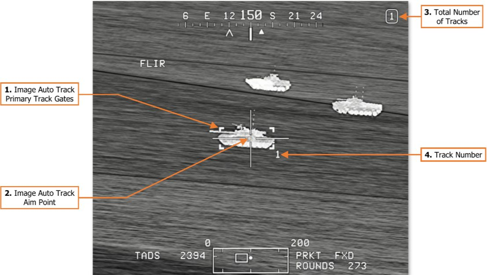

1. **Image Auto Track Primary Track Gates.** Indicates the primary tracked target. When the TADS LOS
       reticle is within the boundaries of the Primary Track Gates, the gates are bolded.
2. **Image Auto Track Aim Point.** Displayed within the Primary Track Gates to indicate the precise location
       the IAT will maintain the TADS LOS Reticle after the track is established and when returning the LOS Reticle
       from an offset position.
3. **Track Number.** Indicates the assigned track number for the primary tracked target.
4. **Total Number of Tracks.** Indicates the total number of tracked targets, out of a maximum of 3. (See
       Multi-Target Tracker for more information.)

Once a new primary track is established, the TADS will automatically maintain the LOS Reticle over the IAT Aim
Point until a slew is commanded. If the Copilot/Gunner (CPG) inputs a slew using the Sight Manual Tracker, the
TADS LOS is released from automatic slewing and may be manually slewed until the TADS is commanded to
return to the primary track using the OFS position of the IAT/OFS switch.

The specific functionality of the IAT/OFS switch will vary depending on whether the TADS
LOS Reticle is within the boundaries of the Primary Track Gates, signified by the gates
themselves becoming bolded. Additionally, the commanded function when set to the
OFS position is dependent on the duration of the press.

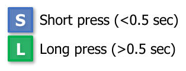

When the LOS Reticle is within the boundaries of the Primary Track Gates, the following commands apply:

- IAT position will update the Aim
     Point location within the Primary
     Track Gates to the current
     centroid of the TADS LOS Reticle.

    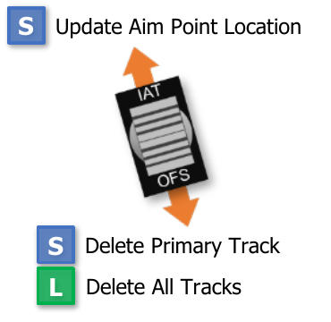

- OFS position for less than 0.5
     seconds will delete the primary
     track.

- OFS position for greater than 0.5
     seconds will delete all tracks.

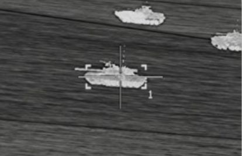

When the LOS Reticle is outside the boundaries of the Primary Track Gates, the following commands apply:

- IAT position will establish a
     new primary track and initiate
     automatic slew for target
     tracking.

    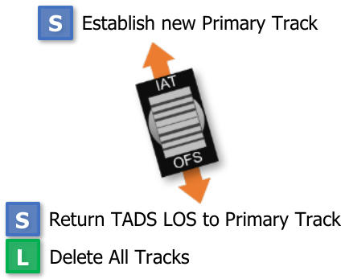

- OFS position for less than 0.5
     seconds will return the TADS
     LOS Reticle to the primary
     track’s Aim Point and initiate   
     automatic slew for target        
     tracking. A subsequent press
     to the OFS position prior to
     arriving within the Primary 
     Track Gates will revert to
     manual tracking.

- OFS position for greater than 0.5 seconds will delete all tracks.

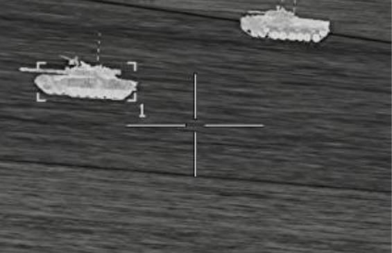

Additional details regarding the Image Auto-Track are shown below.

- Target tracking is only performed in one TADS sensor at a time. If a track is established while the selected
     TADS sensor is set to FLIR, the track will continue to be tracked within the FLIR camera, even if the CPG
     selects DTV using the Sensor Select switch on the TEDAC Left Handgrip, and vice versa.

- Once a primary track has been established, the TADS turret may only be slewed to the extent that the
     primary track can be maintained within the current optical field-of-view of the TADS sensor within which the
     automatic tracking is being performed.

- Target tracking is limited to objects that occupy between 0.75% to 50% of the tracking sensor’s field-of-
     view. If the object being tracked is too small or too large within the current optical field-of-view, a track
     cannot be established, and an existing track will switch to inertial tracking.

Due to the combination of these factors, FLIR is better suited for maintaining multiple tracks due to its wider
field-of-view, especially for tracks that are widely spaced on the battlefield, or for retaining the primary track
within the field-of-view when a significant offset slew is desired. However, the DTV is better suited for maintaining
tracks at longer range due to its higher magnification levels.

### Multi-Target Tracker (MTT)

The M-TADS digital tracker is capable of maintaining an image auto-track on up to three separate targets, a
single primary track and two secondary tracks. When being used in this manner, the tracking and slew logic and
the IAT/OFS switch functions remain the same but are only referenced to primary track.

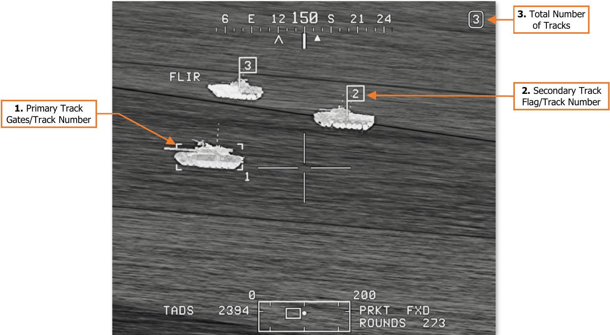

1. **Primary Track Gates/Track Number.** Indicates the primary tracked target and track number.
2. **Secondary Track Flag/Track Number.** Indicates the secondary tracked target(s) and track number(s).
3. **Total Number of Tracks.** Indicates the total number of tracked targets, out of a maximum of 3.

Any time a new track is established, the new track is designated as the primary track, and the existing primary
track is demoted to a secondary track. An existing secondary track may be promoted back to primary track at
any time using one of two methods.

- Manually slew the LOS Reticle over the desired track and momentarily press the IAT/OFS switch to the IAT
        position. This will promote the secondary track under the LOS Reticle to primary track, update the Aim Point
        of the new primary track, and automatic slewing will be performed until another secondary track is promoted
        or the Copilot/Gunner inputs a slew using the Sight Manual Tracker. (See TEDAC Left Handgrip for more
        information.)

- Set the MTT Promote switch to the + or – positions to promote the secondary tracks to primary track in a
        cyclic pattern. When a secondary track is promoted to the primary track using the MTT Promote switch,
        the TADS LOS Reticle will be slewed to the Aim Point of the new primary track and automatic slewing will
        be performed until another secondary track is promoted or the Copilot/Gunner inputs a slew using the
        Sight Manual Tracker. (See TEDAC Right Handgrip for more information.)

#### Inertial Tracking

In the event weapons fire, smoke, obscurance, or explosions on the battlefield interfere with the automatic
tracking of the primary or secondary tracks, the track will enter an inertial tracking sub-mode. In this mode, the
track will “coast” along its previous path for a short period before the track is dropped altogether. If the track is
reacquired while in inertial track, automatic tracking will resume.

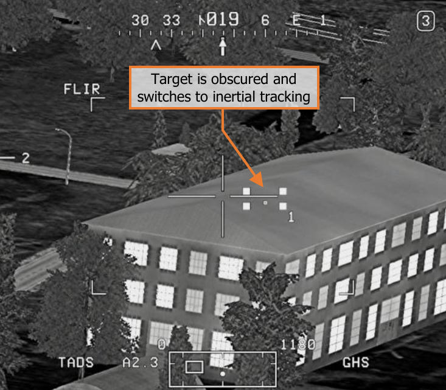
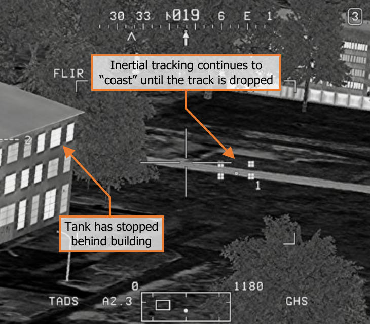

- If the primary track has switched to inertial tracking, the Primary
     Track Gates will be replaced by the Inertial Gates. After 5 seconds
     of inertial tracking, the Inertial Gates will be replaced by the Low
     Confidence Gates.

- If a secondary track has switched to inertial tracking, the
     Secondary Track Flag will become dashed to indicate inertial
     tracking. After 5 seconds of inertial tracking, the Secondary Track
     Flag will become dotted to indicate low confidence.

- If the track is not reacquired within 10 seconds of inertial
     tracking, the track will be dropped and “TRK # DROP” will be
     displayed in the Weapon Inhibit Status field, where # is the                             number of the track that has been dropped.

    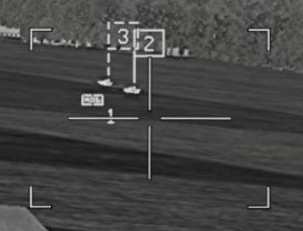

If the primary or secondary tracks are forced outside the TADS field-
of-view, the Primary Track Gates and/or Secondary Track Flags are
replaced by bars along the edge of the video to indicate the location of
the tracks relative to the TADS field-of-view.

- When a track has been forced outside the TADS field-of-view, a
     solid bar will be displayed along the edge of the TADS video with
     the associated track number.

- After 5 seconds of inertial tracking, the bar will become dashed to
     indicate low confidence

- A bracket will be displayed next to the bar to indicate which track
     is the primary track.

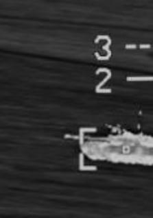
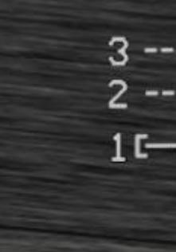

### Laser Spot Track (LST)

The LST may be configured to search for and track pulsed laser designations using standard PRF codes
independently of the ownship’s LRFD code. The Laser Spot Tracker is enabled using the LT switch on the TEDAC
Right Handgrip. When set to the A position, the LST is enabled and set to automatic mode. When set to the M
position, the LST is enabled and set to manual mode. When set to the O position, the LST is disabled.

!!! NOTE
    The TADS laser rangefinder/designator (LRFD) cannot be fired while the LST is enabled.

When the LST is employed, the Multi-Target Tracker will continue to perform automatic tracking of the primary
and secondary tracks if the respective tracks remain within the optical field-of-view of the TADS sensor. However,
if the tracks are forced outside the TADS field-of-view while LST operations are being performed, the tracks will
enter inertial track, and may eventually be dropped.

#### Automatic Mode

When the LST is enabled in the automatic mode, the TADS will enter a continuous, 4-bar azimuth/elevation scan
pattern until a laser designation matching the PRF code assigned to the LST is detected, or the LST is disabled.
Once a matching laser designation is detected, the TADS will slew to and track the laser designation. If the laser
designation is lost, the TADS will resume the 4-bar scan.

!!! NOTE
    It is advisable that the LST be disabled prior to instructing the designating platform to cease lasing. If the
    laser designation is lost before the LST is disabled, the TADS turret will resume the 4-bar scan pattern.

In addition, when slaving the TADS to an acquisition source, the LST should be disabled prior to disabling the
SLAVE function to ensure the TADS is not inadvertently slewed from the intended location by the 4-bar scan in
automatic mode, or if a matching laser designation is detected in automatic or manual mode.

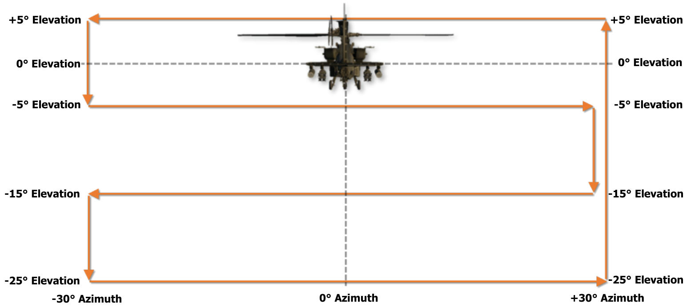

#### Manual Mode

When the LST is enabled in the manual mode, the Copilot/Gunner retains manual slew control of the TADS turret
until a laser designation matching the PRF code assigned to the LST is detected. Once a matching laser
designation is detected, the TADS will slew to and track the laser designation. If the laser designation is lost,
manual slew control of the TADS turret is restored.

