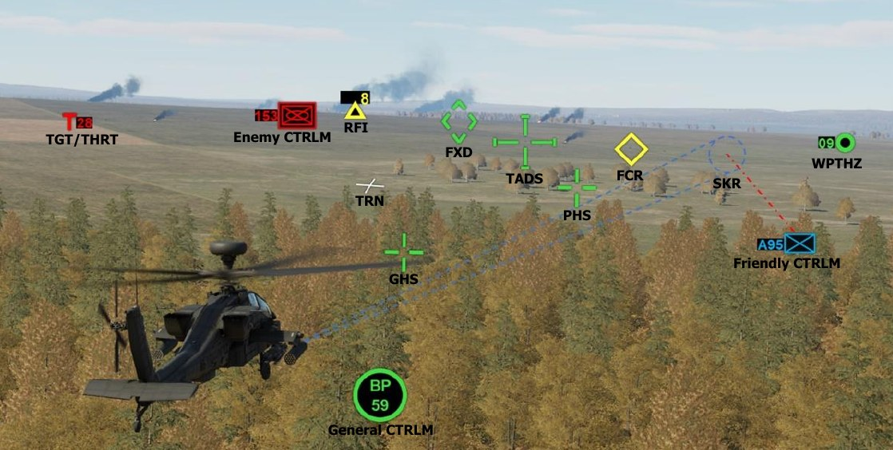
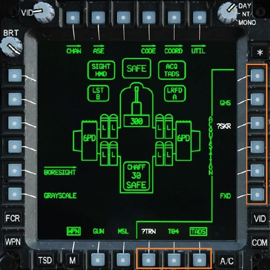
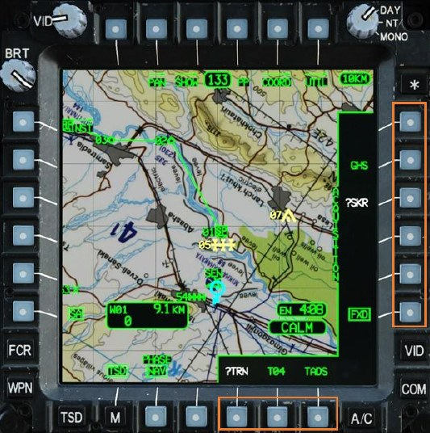

# ACQUISITION (ACQ) SOURCES

Acquisition sources increase aircrew efficiency in orienting their sights to locations on the battlefield, whether it
be to slave a sight to a target detected or tracked by another sensor onboard the aircraft (to include visual
detection by either crewmember), or to slave their sight to a set of three-dimensional coordinates. The purpose
of the acquisition source is to automate or reduce the need to manually search and acquire a target with the
selected sight; acquisition sources do not directly affect the weapon aiming solution for any weapon system.

In the case of the TADS or FCR, these sights will physically slew to the location of the acquisition source selected
within the crewstation. In the case of the HMD, the crewmember will receive cueing indications within their
helmet symbology of which direction they must direct their head to acquire the selected acquisition source (in
lieu of a robotic arm physically grabbing their head and forcibly turning it in the correct direction). As several
examples, the Copilot/Gunner (CPG) could select the Pilot’s helmet as the acquisition source to slave the TADS
turret to a target that the Pilot is looking at, the Pilot could select TADS as the acquisition source to monitor the
direction the CPG is aiming the TADS, or either crewmember could select a target point stored within the database
to slave their sight to that 3-dimensional location.

Each crewmember may select an acquisition (ACQ) source from the following list:

- PHS – Pilot Helmet Sight                   
- GHS – Gunner Helmet Sight                  
- SKR – Tracking missile seeker              
- RFI – Radar Frequency Interferometer                  
- FCR – Fire Control Radar                   
-  FXD – Fixed forward (0° in azimuth/-4.9° elevation)
-  TADS – Target Acquisition Designation Sight
-  W##, H##, C##, T## – Waypoint, Hazard, Control Measure, or Target/Threat
-  TRN – Cursor-selected terrain location on the TSD

As is the case with sight selections, choosing the best acquisition source in any given situation is key to reducing
the time needed to search, acquire, and engage enemy targets. In most circumstances, the most important
factors in choosing the correct acquisition source is proper coordination and communication between
crewmembers; so that each crewmember is aware of how the other is using their selected sight, and whether a
target should be handed off from one crewmember to the other for engagement by the appropriate sight/weapon
combination.

### ACQ Selection Logic

In most cases, any of the available sights (HMD, TADS, or FCR) may serve as an acquisition source for another
sight. However, a crewmember cannot select an acquisition source that is already selected as the sight within
the same crewstation. For example, the CPG cannot simultaneously select TADS as a sight and an acquisition
source, because the TADS cannot be slaved to itself (the TADS is already looking where it is currently looking).
As such, some acquisition sources will be contextually removed from the acquisition selection menu if already
selected as the crewmember’s sight (e.g., “TADS” will be removed from the CPG’s acquisition selection menu if
the CPG has selected TADS as a sight).

- If the Pilot’s selected sight is HMD, PHS will be removed from the Pilot’s ACQ selection menu.

- If the Pilot’s selected sight is FCR, FCR will be removed from the Pilot’s ACQ selection menu.

- If the CPG’s selected sight is HMD, GHS will be removed from the CPG’s ACQ selection menu.

- If the CPG’s selected sight is TADS, TADS will be removed from the CPG’s ACQ selection menu.

- If the CPG’s selected sight is FCR, FCR will be removed from the CPG’s ACQ selection menu.

- If the FCR mast-mounted assembly is not installed, FCR and RFI will not be available within either
     crewmember’s ACQ selection menu.

- If the TADS is being used as an NVS sensor, TADS will be removed from the ACQ selection menu within the
     same crewstation in which it is being used. (See Night Vision System for more information.)

Acquisition sources may be selected from the WPN, TSD, or FCR pages by opening the ACQ selection menu (VAB R6).
Acquisition sources that are available for selection will be displayed, with the current ACQ selection boxed.

In many instances, an acquisition source may be available for selection, but the acquisition may be invalid and
cannot provide cueing to a crewmember’s sight. When this occurs, the acquisition source will be displayed in
white and annotated with a “?”. As an example, if a crewmember has not created a Terrain point on their TSD,
`?TRN` will be displayed within the ACQ selection menu but will be invalid until the crewmember creates a Terrain
point.

#### ACQ Slave Logic

Once an acquisition source is selected within the CPG crewstation, the CPG’s sight must be “slaved” to it. The
CPG may selectively enable (“slaved”) or disable (“de-slaved”) the Slave function using the SLAVE button located
on the TEDAC Right Handgrip.

- If the CPG selects a different sight, SLAVE is automatically disabled.

- If the CPG selects a different acquisition source, SLAVE is automatically disabled.

The Pilot does not have an option to selectively enable/disable the Slave function. The Pilot’s sight is always
“slaved” to the Pilot’s acquisition source.

- If the Pilot’s selected sight is FCR, the FCR will be slaved to the Pilot’s ACQ at all times.

- The Pilot may selectively remove ACQ cueing from the HMD Flight symbology. (See WPN Utility sub-page
     for more information.)

In the case of setting the acquisition source to a point within the database (Waypoint, Hazard, Control Measure,
or Target/Threat) or to a cursor-selected terrain location on the TSD (Terrain point), this action will also set that
crewmember’s range source to a Navigation range when SLAVE is subsequently enabled.

- If the CPG’s acquisition source is set to a Waypoint, Hazard, Control Measure, Target/Threat, or Terrain
     point, the slant range to that point will be entered as a Navigation range when the SLAVE button is pressed
     on the TEDAC Right Handgrip.

- If the Pilot’s acquisition source is set to a Waypoint, Hazard, Control Measure, Target/Threat, or Terrain
     point, the slant range to that point will be entered as a Navigation range immediately upon selection from
     the ACQ selection menu.
Typically, during training flights outside of a combat area, each crewmember selects the opposite crewmember’s
helmet (GHS/PHS) as their acquisition source to facilitate traffic and obstacle advisories.

During combat, it may be useful for the CPG to be slaved to GHS to remain “heads out” while searching for
targets, and then de-slaving when a target or point of interest is acquired. The Pilot may often use TADS as the
acquisition source to maintain situational awareness of where the TADS is oriented. This is particularly useful for
the Pilot since it provides the Cued LOS Dot within the HMD Field-Of-Regard (FOR), which assists the Pilot in
monitoring the position of the TADS turret so that he or she may maneuver the aircraft to avoid the turret slew
limits.
