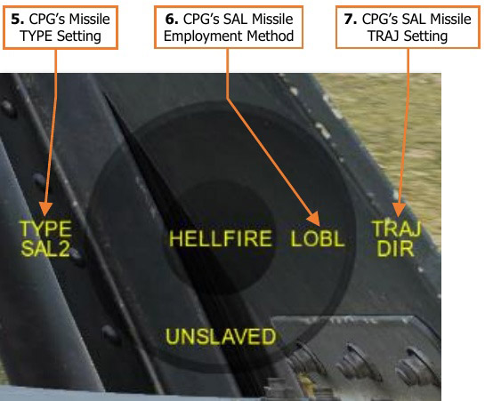
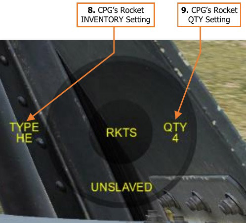

# PLAYER-AS-PLT “GEORGE” AI CONTROLS

When the player is in the Pilot (PLT) crewstation, pressing the George AI Helper Interface – Show/Hide
command will display a circular interface element as a directional reference for giving commands to George (as
the Copilot/Gunner). The associated AI Helper Controls direct George where to search for targets and, when
appropriate, to assign a weapon with which George should engage the currently tracked target. Additional settings
will be displayed within the interface depending on which weapon, if any, has been assigned to George.

The text color of the AI Helper Interface corresponds with the Rules Of Engagement (ROE) setting that George
(as the CPG) has been commanded to adhere to.

[[Weapons Hold]] George will fire his assigned weapon at the target that he is currently tracking after the player
has pressed the “Consent To Fire” AI Helper Command. After firing one burst from the gun or one missile, George
will not fire again until a subsequent “Consent To Fire” command is given.

[[Weapons Free George]] will engage the target that he is currently tracking until the target is destroyed or his
assigned weapon is depleted. George will also fire rockets in COOP mode if the Rocket Steering Cursor is aligned.

1.   **CPG’s Assigned Weapon.** Displays the weapon that has been assigned to George (as the CPG).

    - **NO WPN.** George will de-action all weapons but will continue to track his assigned target.

    - **GUN.** George will action the 30mm gun and prepare to engage his assigned target.

    - **HELLFIRE.** George will action the AGM-114 missiles and prepare to engage his assigned target.

    - **RKTS.** George will action the 2.75-inch unguided rockets and prepare to engage his assigned target.

2.   **TADS LRFD State.** Displays the commanded state of the TADS Laser Rangefinder/Designator.

    - **NOT LASING.** George has been commanded to stop firing the LRFD.

    - **LASING.** George has been commanded to designate his assigned target with the LRFD.

3.   **TADS SLAVE State.** Displays the commanded state of the SLAVE button when George is using the TADS.

    - **UNSLAVED.** The TADS is not slaved to the CPG’s ACQ source.

    - **SLAVED.** The TADS is slaved to the CPG’s ACQ source.

4.   **CPG’s Gun BURST LIMIT Setting.** Displays the CPG’s BURST LIMIT setting when the gun has been
     assigned to George (as the CPG). (See Area Weapon System for more information.)

    - Weapons Hold. George will wait for a Consent to Fire command from the player. Once consent
          has been given by the player, he will fire a single burst from the gun when firing parameters have
          been met.

    - Weapons Free. George will begin firing the gun after being assigned a target to track when firing
              parameters have been met.

5.   **CPG’s Missile TYPE Setting.** Displays the CPG’s missile TYPE setting when the missiles have been assigned
     to George (as the CPG).

    - **SAL2.** George will select semi-active laser-homing (SAL) AGM-114K missiles.

    - **RF.** George will select fire-and-forget radio frequency (RF) AGM-114L missiles.

6.   **CPG’s SAL Missile Employment Method.** Displays the employment method that George will utilize when
     commanded to select AGM-114K SAL missiles. (See Hellfire Modular Missile System for more information.)

    - **LOBL.** George will employ a Lock-On-Before-Launch method after being assigned a target to track.

        - Weapons Hold. George will begin lasing immediately after being assigned a target to track and
              wait for a Consent To Fire command from the player. Once consent has been given by the player,
              he will launch a missile when acceptable launch parameters have been met.

        - Weapons Free. George will begin lasing immediately after being assigned a target to track and
              then fire a missile when acceptable launch parameters have been met.

    - **LOAL.** George will employ a Lock-On-After-Launch method after being assigned a target to track.

        - Weapons Hold. George will wait for a Consent To Fire command from the player. Once consent
              has been given by the player, he will launch a missile when acceptable launch parameters have
              been met. After the missile has been launched, he will begin lasing his assigned target.

        - Weapons Free. George will fire a missile after being assigned a target to track and when
              acceptable launch parameters have been met. After the missile has been launched, he will begin
              lasing his assigned target.
    !!! note
        This option is only available when George has been commanded to utilize DIR for his TRAJ setting.
        If the TRAJ option is set to LO or HI, the employment method will remain in LOAL and cannot be changed.

7.   **CPG’s SAL Missile TRAJ Setting.** Displays the CPG’s TRAJ setting when the missiles have been assigned
     to George (as the CPG) and he has been commanded to select AGM-114K SAL missiles.

    !!! note
        This option is only available when George has been commanded to utilize LOAL for his SAL missile
        employment method. If the employment method is to LOBL, the TRAJ option will remain in DIR and cannot
        be changed.

8.   **CPG’s Rocket INVENTORY Setting.** Displays the CPG’s rocket INVENTORY setting when the rockets have
     been assigned to George (as the CPG).

9.   **CPG’s Rocket QTY Setting.** Displays the CPG’s rocket QTY setting when the rockets have been assigned
     to George (as the CPG).

    - **HE.** George will select M151 or M229 high explosive rockets.

    - **ILL.** George will select M257 battlefield illumination rockets.

    - **SMK.** George will select M274 target practice smoke rockets.

## Player-as-PLT AI Helper Controls

The AI Helper Controls are contextual based on the current mode of the AI Helper Interface. The actions listed
below correspond with the commands issued by the player when occupying the Pilot crewstation.

##### TARGET DESIGNATION /WEAPON CONTROL

- **Left      Short.**     Cycles George’s weapon NO WPN→GUN→HELLFIRE→RKTS

- **Left      Long.**    HELLFIRE: toggles TYPE between SAL2 and RF.
                    RKTS: cycles TYPE of HE→ILL→SMK.
                    (Only missile/rocket types that are loaded onboard will be displayed)

- **Right     Short.**    NO WPN: toggles between NOT LASING and LASING the target.
                   GUN: cycles BURST LIMIT of 10→20→50→100→ALL.
                   HELLFIRE: toggles between LOBL and LOAL. (If DIR is selected)
                   RKTS: cycles QTY of 1→2→4→8→12→24→ALL.

- **Right     Long.**    HELLFIRE: cycles TRAJ of DIR→LO→HI. (If LOAL is selected)

- **Up        Short.**     Commands George to slave the TADS to Pilot Helmet Sight (PHS)
                    and search along designated line of sight for targets.
                    If potential targets are detected, a Target List will be displayed.

- **Up        Long.**    Toggles George’s rules of engagement (ROE) between “Weapons
                    Hold” and “Weapons Free”. “Weapons Hold” is the default ROE
                    state.

- **Down      Short.**     Commands George to stop tracking the current target. George will
                    slave the TADS to Fixed Forward (FXD).

- **Down      Long.**    Commands George to repeat the previous search and regenerate the
                    Target List if applicable.

##### TARGET LIST SELECTION/ TARGET ID

- **Left Short.**     Cancels Target List selection without assigning a target to George.

- **Left Long.**      Enables Target List filtering.
                    (Excludes friendlies if enemy or unknown contacts are detected)

- **Right Short.**     Commands George to track the current target within the Target List.
- **Right Long.**     Disables Target List filtering.
                    (Displays all detected contacts, including friendlies.)

- **Up Short.**    Moves Target List selection up.

- **Up Long.**     Commands George to increase sensor magnification to the next
                    TADS Field-Of-View setting.

- **Down Short.**    Moves Target List selection down.

- **Down Long.**     Commands George to decrease sensor magnification to the previous
                    TADS Field-Of-View setting.

## AI Target Acquisition & Tracking

The player uses the HMD LOS Reticle within the IHADSS Flight Symbology to direct George to an area on the
battlefield to scan for potential targets.

After looking at the desired area, the player presses [[Up-Short]] while the AI Interface is displayed. George will set
his ACQ source to Pilot Helmet Sight (PHS) and press SLAVE to slew the TADS to the location. Once the TADS
has aligned to the Pilot Helmet Sight, George will press SLAVE a second time and announce that he has “de-
slaved” the TADS. At this point, the player may move their head away from the desired area as necessary.

This process may take several moments, during which time the player must maintain their HMD LOS Reticle on
the location they are intending for George to scan for potential targets. If the player moves the HMD LOS Reticle
elsewhere before George has confirmed the TADS has been de-slaved, George will begin scanning in a different
location than originally intended. If George detects any targets with the TADS, he will generate a Target List.

!!! note
    Any time George is commanded to scan an area for potential targets via [[Up-Short]] while the A/S button
    on the Armament Panel is set to SAFE, he will set the button to ARM, which will permit the TADS LRFD to fire for
    gaining accurate range to target. When commanded to stop tracking his target and slave the TADS back to fixed
    forward via [[Down-Short]], he will set the A/S button back to SAFE.

### Weapon Employment

If George is assigned a weapon and is tracking a target, George will prepare the weapon system for engagement
against that target, in accordance with the directed weapon settings, up to actually firing the weapon. When
George is ready to fire the weapon, he will either wait for a Consent To Fire AI Helper Command from the player
(if ROE is set to Weapons Hold), or he will immediately begin engaging the target if acceptable weapon release
parameters have been met (if ROE is set to Weapons Free).

### Pilot-Commanded Laser Designation

When George is tracking a target with NO WPN assigned, the player may order him to designate the target with
the TADS LRFD by pressing Right-Short while the AI interface is displayed. This may be used if the player intends
to employ AGM-114K laser-guided missiles from the Pilot crewstation while George provides laser guidance.

## AI Combat Identification (CID)

While occupying the Copilot/Gunner crewstation, George is capable of identifying military units and equipment
on the battlefield and whether they are friend or foe. This process is known as Combat Identification, or CID.
The speed and accuracy at which George performs CID may vary based on the DCS mission settings, the distance
to the target, the target aspect, and whether the type of equipment is exclusive to one or multiple coalitions.

As is the case with many gameplay options within DCS, George’s CID ability level may be forced to adhere to a
specific type of behavior within the AH-64D Additional Properties tab of the Mission Editor, or it may be configured
based on a combination of F10 View Options and Label settings.

**AI IFF Detection Mode.** Sets the level of
Identification-Friend-or-Foe (IFF) that George will
utilize when detecting and identifying potential
targets.

- **Auto.** The ability of George to determine the type
      of target and its coalition affiliation will be derived
      from the combination of F10 View Options and
      Labels settings. These settings themselves may
      be enforced by the mission or may be determined
      by the player’s personal preferences set on the
      Gameplay tab within the DCS Options.

- **Simple.** No factors affect George’s ability to
      determine the type of target or its coalition
      affiliation. Upon detection of a target, George will
      instantly determine (without error) the type of
      target and whether the target is friendly or
      hostile.

- **Label Only.** Identification logic factors affect
      George’s ability to determine the type of target,
      but they do not affect his ability to determine the
      coalition affiliation. Upon detection of a target, George will attempt to determine the type of target, which
      is affected by the aspect and angular size of the target within the sensor field-of-view; and will then instantly
      determine (without error) whether the target is friendly or hostile.

- **Realistic.** Identification logic factors affect George’s ability to determine the type of target and the coalition
      affiliation. Upon detection of a target, George will attempt to correctly determine the type of target, which
      is affected by the aspect and angular size of the target within the sensor field-of-view; and will then attempt
      to determine whether the target is friendly or hostile, with the potential for a false identification.

When the AI IFF Detection Mode is set to Auto, George will use Simple, Label Only, or Realistic IFF modes
based on the matrix logic shown below.

### Combat Identification Process

George will perform the Combat Identification process in four steps. As each step is performed for a given contact,
the level of detail displayed within the Target List will be updated accordingly.

1.   **Contact Detection.** A contact is detected and initially classified as either GROUND,
     AIR, or NAVAL.

2.   **Unit Classification.** A contact is further classified by the general type of unit, such as
     ARMORED, AAA, HELICOPTER, etc.

3.   **Equipment Recognition.** A contact is recognized by determining the type of
     equipment, such as BMP-3, ZSU-23-4, Mi-24, etc.

4.   **Target Identification.** The recognized type of equipment is compared to the list of
     equipment used by each coalition to determine coalition affiliation.

If Simple IFF mode is used, all four steps are performed instantly and without error.

If Label Only IFF mode is used, identification factors will affect George’s ability in performing steps 1-3, but step
4 will be performed instantly and without error after steps 1-3 have been performed.

If Realistic IFF mode is used, identification factors will affect George’s ability in performing each step.

### Combat Identification Factors

The following factors may affect George’s ability to identify a contact’s type or its coalition affiliation, depending
on the AI IFF Detection Mode.

**Angular Size.** Angular size of the contact is measured from the point of view of the CPG through the TADS. As
the range to the contact decreases, the greater the angular size of the contact within the TADS sensor, and the
easier it is for George to identify the equipment type.

**Aspect.** Angular size automatically includes aspect dependence. Vehicles that are head-on within the TADS
sensor will have a smaller angular size, hindering the ability for George to identify the contact compared to a
contact that is being viewed from the side at the same range.

**Coalition Order Of Battle.** When the type of equipment is determined (e.g., a BMP-3 vs an M2A1), the
equipment type is compared to the equipment known to be employed by either coalition, also known as the Order
Of Battle. If only one coalition uses the type of equipment, the contact is identified as friendly or enemy based
on the corresponding coalition. If multiple coalitions use the type of equipment, there is a chance that the final
identification may be incorrectly identified as friendly or enemy.

### Sensors

Currently, George will only use the TADS FLIR sensor, which carries no restrictions for target acquisition during
night missions. Any contacts of the required angular size within the TADS sensor video will be detected by George
when he is directed to scan an area for targets.

George AI will utilize multiple zoom levels as appropriate in an attempt to recognize each contact in the designated
area within a reasonable period of time. However, if there are enough contacts within the sensor field-of-view,
George may not be able to identify each of them before presenting the Target List to the player.

When the Target List is displayed, the player may select specific Target List entries to direct George to focus the
TADS at that contact. During this time, George will continue to perform Combat Identification and update the
Target List accordingly as he works through each step of the identification process, which may be further
enhanced by directing George to increase the TADS sensor magnification while focused on a given contact.

### Target List

If George (as the CPG) detects any targets after being commanded to scan an area of the battlefield with the
TADS, he will generate a Target List. The list will be sorted according to target priority, with the highest priority
targets such as air defenses shown at the top of the list, and the lowest priority targets such as unarmed vehicles
and support equipment shown at the bottom.

As the player (as the Pilot) scrolls up or down through the
Target List, George will slew the TADS sensor turret to the
corresponding target location. If the target identification
process has not been completed for the target, George will
resume the process when the target is within the sensor
field-of-view. The player may monitor and even assist with
this process by commanding George to zoom in or out by
pressing Up-Long or Down-Long respectively via the AI
Helper Controls.

By default, the Target List will only display targets that have
been identified as enemies or as unknown types, or remove
unknown targets that are subsequently identified as friendly.
The player may display detected friendly units amongst the
list by pressing Right-Long via the AI Helper Controls while
the AI Interface is displayed; or may switch back to only
enemy/unknown targets by pressing Left-Long. If no
enemies or unknown targets are detected, friendlies will
automatically be displayed to aid in preventing fratricide
(friendly fire).

!!! note
    The player may command George to engage a target that George has identified as friendly. Care should
    be taken when operating areas near the frontline in which friendly and enemy positions are not well known, as
    George has the potential to incorrectly identify a friendly unit as enemy or an enemy unit as a friendly.

When the Target List is presented to the player (as the Pilot), targets will be displayed using the AI Color Scheme
that is chosen on the Special tab within the DCS Options.

- **NATO.** Targets will be colored based on their hostility status, regardless of their coalition color.

    - [[   Unit belongs to Hostile Coalition]] 
    - [[  Unit belongs to Friendly Coalition]] 
    - [[ Unit belongs to Neutral Coalition]] 
    - [[Coalition affiliation is unknown.]] 

- **Coalition color.** The Target List will display all targets in accordance with their assigned coalition.

    - [[   Unit belongs to Red Coalition]]
    - [[  Unit belongs to Blue Coalition]]
    - [[ Unit belongs to Neutral Coalition]]
    - [[Coalition affiliation is unknown.]]

{!abbr.md!}
{!dev-docs/ah64d/abbr.md!}
{!docs/ah64d/abbr.md!}
