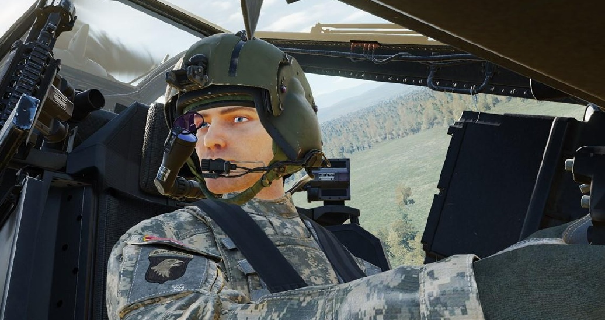

# “GEORGE” AI

The AH-64D is operated by two crewmembers: a Pilot (PLT) and a Copilot/Gunner (CPG). The DCS: AH-64D
module supports multicrew capability, where two players can occupy the two seats in a multiplayer session for
cooperative play. To accommodate a single-player experience, a player may utilize “George” AI, a virtual
crewmember that allows players to manage mission-critical items in the crewstation that the player is not
occupying.

Unless specifically disabled in the Mission Editor options, George AI will always be present in the opposite
crewstation from the player. When the player enters an AH-64D in DCS, they will be placed in the aft Pilot
crewstation while George AI occupies the front CPG crewstation. If the player moves to the CPG crewstation,
George will occupy the Pilot crewstation.

George may be directed by keyboard commands or a 4-way hat switch on the player’s joystick. As an AI
crewmember, George is more than simply a means of interacting with the controls and systems in the crewstation
that the player is not occupying. George is designed to mimic the real-life procedures used by AH-64D crew
members, which permits players to direct and coordinate the AI crewmember actions in a similar manner to
interacting with another person, albeit in a more limited capacity. When a player directs George AI via a command
or control input, they are directing George to perform “tasks” rather than simple “actions”. These tasks could be
as basic as toggling the laser designator on and off to begin/cease target designation, or they may be as complex
as following a sequence of waypoints to navigate a route at low altitude into a battle position.

As George is simulating a real crewmember, some commands may not result in an immediate or apparent reaction
from George. This simulates the time needed to communicate the command over the intercom and the
commanded action(s) to be performed by a real crewmember. Many commands carry several implied actions
beyond what the command itself entails. These will be described throughout this chapter.

!!! note
    George will continue to be refined throughout the Early Access process and will receive new features on
    a periodic basis.

## AH-64D AI Controls Structure

The AI controls are divided into two categories: AI Helper Commands and AI Helper Controls.
AI Helper Commands. Simple but immediate commands that may be given to George at any time, such as
“Consent To Fire” or “Request Aircraft Control.” These commands do not require the George AI Helper Interface
to be displayed.

AI Helper Controls. Complex commands that are contextual based on the current mode of the George AI Helper
Interface, such as commanding George as the CPG to action a specific weapon or commanding George as the
Pilot to fly along the current route. These controls are only available when the AI Helper Interface is displayed.
The AI Helper Interface responds to short and long presses of the interface controls to perform different functions.
A short press is held down for less than 0.5 seconds, and a long press is held down for more than 0.5 seconds.
Under the AH-64D Pilot and AH-64D CPG aircraft control modes, the AH-64D George AI Helper input functions
category contains the input command entries for the AI Helper Commands that are available from each respective
AH-64D crewstation and the input command entry for displaying the George AI Helper Interface.

                       Aircraft Control Mode        Input Functions                 Input Command Entries

Under the AH-64D George AI Helper aircraft control mode, input command entries may be programmed to
navigate and utilize the George AI Helper Interface. These commands may be dual-bound to any command
entries that are already bound within the AH-64D Pilot or AH-64D CPG control modes; however, these commands
will take priority when the AI Helper Interface is displayed.
For example, if a 4-way hat switch is bound to the Sight Select switch under AH-64D Pilot and to the George AI
Helper Interface under AH-64D George AI Helper, the 4-way hat switch will perform its function as the Sight
Select switch when the AI Helper Interface is hidden, but will function as the AI Helper Controls switch when the
AI Helper Interface is shown.

                       Aircraft Control Mode        Input Functions                 Input Command Entries

To control George from either crewstation, the George AI Helper Interface Up/Down/Left/Right and
George AI Interface Hide commands will need to be bound under AH-64D George AI Helper aircraft control
mode; as will the George AI Helper Interface Show/Hide Menu command entry under AH-64D Pilot and
AH-64D CPG aircraft control modes.
AH-64D AI Helper Commands
The George AI Helper Interface is not required to be displayed to utilize the commands listed below.
Consent To Fire. If George (as the CPG) is tracking a target, this command will give George clearance to fire
his assigned weapon at that target, even if his ROE is set to Hold Fire. This command is only available when the
Player is occupying the Pilot seat.
George AI Helper Interface – Show/Hide. Displays the AI Helper Interface and enables the input command
entries within the AH-64D George AI Helper aircraft control mode. It is recommended that this command is bound
to the same button as George AI Helper Interface – Hide under AH-64D George AI Helper aircraft control
mode to allow the AI Helper Interface to be toggled between shown/hidden with the same input.
Request Aircraft Control. When flying without another player, this command transfers aircraft control to
George (as the Pilot) or returns it to the player (as the CPG). George cannot accept aircraft control when
performing CPG duties. This command is only available when the player is occupying the CPG seat.
When flying with another player in multi-crew, this command transfers the flight controls from the other player.
For example, if the Pilot is flying the helicopter and the Copilot/Gunner presses this button to request control; if
the Pilot accepts the handoff the CPG’s cyclic stick will un-stow, and the Pilot’s flight controls will become inactive.
NOTE: If George AI is disabled in the Mission Editor, the player will be required to fly the aircraft at all times,
regardless of which seat the player is occupying at any point in the mission.
TADS Store Target. If George (as the CPG) is tracking a target with the TADS, this command will direct George
to store a Target point (T##) using the STORE/UPDT switch on the TEDAC Left Handgrip. If George is not already
lasing, he will momentarily fire the LRFD to get accurate range data before storing the location as a Target point.
This command is only available when the Player is occupying the Pilot seat.
NOTE: This command may also be used while the Target List is displayed to store multiple Target points.

AH-64D AI Helper Controls
The commands listed below will only function when the George AI Helper Interface is displayed.
George AI Helper Interface – Hide. Hides the on-screen AI Helper Interface and disables the input command
entries within the AH-64D George AI Helper aircraft control mode. It is recommended that this command is bound
to the same button as George AI Helper Interface – Hide under AH-64D George AI Helper aircraft control
mode to allow the AI Helper Interface to be toggled between shown/hidden with the same input.
George AI Helper Interface – Down. Performs the function associated with the Down action, given the
current Interface mode.
George AI Helper Interface – Left. Performs the function associated with the Left action, given the current
Interface mode.
George AI Helper Interface – Right. Performs the function associated with the Right action, given the current
Interface mode.
George AI Helper Interface – Up. Performs the function associated with the Up action, given the current
Interface mode.
See the command list of AI Helper Controls in the Player-as-CPG or Player-as-PLT sections of this chapter for
more information.
PLAYER-AS-CPG “GEORGE” AI CONTROLS
When the player is in the Copilot/Gunner (CPG) crewstation, pressing the George AI Helper Interface –
Show/Hide command will display a horizontal situation indicator that can be used as a directional reference for
giving commands to George (as the Pilot).

              1. Desired Heading                                                       3. Desired Heading

                                                                                       4. Radar/Barometric
         2. Desired Ground Speed
                                                                                        Altitude Indicator

             5. Ownship Heading
                                                                                       6. Desired Heading Bug

                7. Bearing to
            Navigation Fly-To Cue                                                      8. Ownship

                                                                                       9. Relative Bearing Scale
             10. Compass Wheel

           11. AI Interface Mode

                                          Player-as-CPG AI Interface

1.   Desired Heading. Displays the heading that George has been commanded to maintain.
2.   Desired Ground Speed. Displays the ground speed that George has been commanded to maintain.
3.   Desired Altitude. Displays the altitude that George has been commanded to maintain.
4.   Radar/Barometric Altitude Indicator. Displays the altitude reference that George will use to maintain
     the desired altitude.
     •      R. George will maintain the desired radar altitude above ground level (AGL).
     •      B. George will maintain the desired barometric altitude above mean sea level (MSL).
5.   Ownship Heading. Displays the current heading of the ownship on the compass wheel.
6.   Desired Heading Bug. Displays the heading that George has been commanded to maintain relative to the
     ownship heading on the compass wheel.
7.   Bearing to Navigation Fly-To Cue. Displays the bearing to the Navigation Fly-To Cue relative to the
     ownship heading on the compass wheel.
8.   Ownship. Indicates the aircraft orientation relative to the compass wheel and associated bearing indicators.
9.   Relative Bearing Scale. Displays bearings relative to the desired heading bug at the 3 o’clock, 6 o’clock,
     and 9 o’clock positions.
10. Compass Wheel. Displays the magnetic heading reference around the ownship.
11. AI Interface Mode. Displays the current mode of the George AI Helper Interface.
    •    FLT. The AI Interface is set to “Flight” mode, which is used to direct specific flight parameters for
         George to fly.
         o    Assign a ground speed to achieve and maintain.
         o    Assign a heading to turn toward and maintain.
         o    Assign an altitude to achieve and maintain.
         o    Turn the aircraft toward the direction the player (as the CPG) is looking.
    •    H-B. The AI Interface is set to “Hover/Bob-up” mode, which is used to direct George to maneuver the
         aircraft while in a stationary hover, such as when occupying a battle position.
         o    Translate the aircraft forward/backward/left/right across the surface at low speed.
         o    Assign a hover altitude to achieve and maintain.
         o    Turn the aircraft toward the direction the player (as the CPG) is looking.
         NOTE: H-B mode is only available when the aircraft is below 30 knots ground speed. When above 30
         knots ground speed, this mode will be skipped, and the AI Interface Mode will proceed from FLT directly
         to CMBT.
    •    CMBT. The AI Interface is set to “Combat” mode, which is used to direct George in performing combat
         mission-related tasks.
         o    Perform an immediate break turn to the 3 o’clock, 6 o’clock, or 9 o’clock directions.
         o    Align the aircraft heading to the azimuth of the TADS sensor turret.
         o    Navigate along the current route and come to a hover at the final waypoint.
    •    CMWS. The AI Interface is set to “Common Missile Warning System” mode. This mode directs George
         to change the settings on the CMWS control panel in the Pilot crewstation.
         o    Arm/Safe the flare dispensers.
         o    Enable/disable automatic dispensing of flares.
When CMWS mode is entered, an
additional circular interface element
will be displayed to the player as a
directional reference for giving
commands, showing the current
settings of the CMWS control panel.                                12. ARM/SAFE Switch

The text color of the AI Helper                                  13. BYPASS/AUTO Switch
Interface text corresponds with the
Arm/Safe status of the CMWS in the
same color pattern as the A/S button
on the Armament Panel.

12. ARM/SAFE Switch. Displays                       Player-as-CPG AI Interface - CMWS mode
    the position of the ARM/SAFE
    switch on the CMWS control panel.
    •    SAFE Flare dispensers are safed.

    •    ARMED Flare dispensers are armed.
13. BYPASS/AUTO Switch. Displays the position of the BYPASS/AUTO switch on the CMWS control panel.
    •    AUTO. Flares will be dispensed automatically when threats are detected by the CMWS.
    •    BYPASS. Flares will not be dispensed when threats are detected by the CMWS.
Player-as-CPG AI Helper Controls
The AI Helper Controls are contextual based on the current mode of the AI Helper Interface. The actions listed
below correspond with the commands issued by the player when occupying the Copilot/Gunner crewstation.
 MODE                COMMAND            ACTION
 FLT                 Left      Short    If >30 knots, changes the AI Interface mode to CMBT.
 FLIGHT                                 If <30 knots, changes the AI Interface mode to H-B.
 PARAMETERS
                               Long     Moves desired heading bug left. After the button is released,
                                        commands George to turn the helicopter to the new heading.
                     Right     Short    Commands George to turn the helicopter toward the direction you
                                        are looking.
                               Long     Moves desired heading bug right. After the button is released,
                                        commands George to turn the helicopter to the new heading.

                     Up        Short    Increases the desired speed in the GS window. After a short delay,
                                        George will accelerate the helicopter to the new speed.

                               Long     Increases the desired altitude in the ALT window. After the button is
                                        released, George will increase the helicopter’s altitude. If set to
                                        <1,420 feet AGL, George will hold the radar altitude. If set ≥1,420
                                        feet AGL, George will hold the barometric altitude.

                     Down      Short    Decreases the desired speed in the GS window. After a short delay,
                                        George will decelerate the helicopter to the new speed.
                                        (H-B Interface mode becomes available if speed decreases below 30
                                        knots.)

                               Long     Decreases the desired radar altitude in the ALT window. After the
                                        button is released, George will decrease the helicopter’s altitude. If
                                        set to <1,420 feet AGL, George will hold the radar altitude. If set
                                        ≥1,420 feet AGL, George will hold the barometric altitude.
 H-B                 Left      Short    Changes the AI Interface mode to CMBT.
 HOVER/BOB-UP
 MANEUVERS                     Long     George translates the helicopter to the left while the button is held.

                     Right     Short    Same function as FLT mode.

                               Long     George translates the helicopter to the right while the button is held.

                     Up        Short    George increases hover altitude by 10 feet.

                               Long     George translates the helicopter forward while the button is held.

                     Down      Short    George decreases hover altitude by 10 feet.

                               Long     George translates the helicopter backward while the button is held.
 CMBT                Left      Short    Changes the AI Interface mode to CMWS.
 COMBAT TASKS
                               Long     Commands George to perform a 90° turn to the left to evade or
                                        more quickly re-attack.

                     Right     Short    Commands George to fly a direct path to the current Navigation
                                        Direct-To Cue. If the point is part of a route, George will continue
                                        along that route in sequence. If the point is not part of a route, or is
                             the final point in the route, George will come to a hover at that
                             location.
                     Long    Commands George to perform a 90° turn to the right to evade or
                             more quickly re-attack.

             Up      Short   Commands George to turn the aircraft to the heading of the TADS
                             LOS reticle. This is useful for starting an attack run, bringing the
                             helicopter into Hellfire launch constraints, or aligning the Rocket
                             Steering Cursor.
                     Long    No Function.

             Down    Short   No Function.
                     Long    Commands George to perform a 180° turn to evade or turn away
                             after an attack.
CMWS         Left    Short   Changes the AI Interface mode to FLT.
CMWS PANEL
SETTINGS             Long    No Function.

             Right   Short   No Function.

                     Long    No Function.

             Up      Short   Toggles flare dispensers arming state between ARM and SAFE.

                     Long    No Function.

             Down    Short   Toggles flare dispense mode between AUTO and BYPASS.

                     Long    No Function.
PLAYER-AS-PLT “GEORGE” AI CONTROLS
When the player is in the Pilot (PLT) crewstation, pressing the George AI Helper Interface – Show/Hide
command will display a circular interface element as a directional reference for giving commands to George (as
the Copilot/Gunner). The associated AI Helper Controls direct George where to search for targets and, when
appropriate, to assign a weapon with which George should engage the currently tracked target. Additional settings
will be displayed within the interface depending on which weapon, if any, has been assigned to George.
The text color of the AI Helper Interface corresponds with the Rules Of Engagement (ROE) setting that George
(as the CPG) has been commanded to adhere to.
Weapons Hold George will fire his assigned weapon at the target that he is currently tracking after the player
has pressed the “Consent To Fire” AI Helper Command. After firing one burst from the gun or one missile, George
will not fire again until a subsequent “Consent To Fire” command is given.
Weapons Free George will engage the target that he is currently tracking until the target is destroyed or his
assigned weapon is depleted. George will also fire rockets in COOP mode if the Rocket Steering Cursor is aligned.
  1. CPG’s Assigned Weapon           2. TADS LRFD State             3. TADS SLAVE State           4. CPG’s Gun BURST LIMIT Setting

 Player-as-PLT AI Interface – NO WPN format                              Player-as-PLT AI Interface – GUN format
  5. CPG’s Missile     6. CPG’s SAL Missile      7. CPG’s SAL Missile                       8. CPG’s Rocket       9. CPG’s Rocket
   TYPE Setting        Employment Method             TRAJ Setting                         INVENTORY Setting         QTY Setting

 Player-as-PLT AI Interface – HELLFIRE format                           Player-as-PLT AI Interface – RKTS format
1.   CPG’s Assigned Weapon. Displays the weapon that has been assigned to George (as the CPG).
     •   NO WPN. George will de-action all weapons but will continue to track his assigned target.
     •   GUN. George will action the 30mm gun and prepare to engage his assigned target.
     •   HELLFIRE. George will action the AGM-114 missiles and prepare to engage his assigned target.
     •   RKTS. George will action the 2.75-inch unguided rockets and prepare to engage his assigned target.
2.   TADS LRFD State. Displays the commanded state of the TADS Laser Rangefinder/Designator.
     •   NOT LASING. George has been commanded to stop firing the LRFD.
     •   LASING. George has been commanded to designate his assigned target with the LRFD.
3.   TADS SLAVE State. Displays the commanded state of the SLAVE button when George is using the TADS.
     •   UNSLAVED. The TADS is not slaved to the CPG’s ACQ source.
     •   SLAVED. The TADS is slaved to the CPG’s ACQ source.
4.   CPG’s Gun BURST LIMIT Setting. Displays the CPG’s BURST LIMIT setting when the gun has been
     assigned to George (as the CPG). (See Area Weapon System for more information.)
         o    Weapons Hold. George will wait for a Consent to Fire command from the player. Once consent
              has been given by the player, he will fire a single burst from the gun when firing parameters have
              been met.
         o    Weapons Free. George will begin firing the gun after being assigned a target to track when firing
              parameters have been met.
5.   CPG’s Missile TYPE Setting. Displays the CPG’s missile TYPE setting when the missiles have been assigned
     to George (as the CPG).
     •   SAL2. George will select semi-active laser-homing (SAL) AGM-114K missiles.
     •   RF. George will select fire-and-forget radio frequency (RF) AGM-114L missiles.
6.   CPG’s SAL Missile Employment Method. Displays the employment method that George will utilize when
     commanded to select AGM-114K SAL missiles. (See Hellfire Modular Missile System for more information.)
     •   LOBL. George will employ a Lock-On-Before-Launch method after being assigned a target to track.
         o    Weapons Hold. George will begin lasing immediately after being assigned a target to track and
              wait for a Consent To Fire command from the player. Once consent has been given by the player,
              he will launch a missile when acceptable launch parameters have been met.
         o    Weapons Free. George will begin lasing immediately after being assigned a target to track and
              then fire a missile when acceptable launch parameters have been met.
     •   LOAL. George will employ a Lock-On-After-Launch method after being assigned a target to track.
         o    Weapons Hold. George will wait for a Consent To Fire command from the player. Once consent
              has been given by the player, he will launch a missile when acceptable launch parameters have
              been met. After the missile has been launched, he will begin lasing his assigned target.
         o    Weapons Free. George will fire a missile after being assigned a target to track and when
              acceptable launch parameters have been met. After the missile has been launched, he will begin
              lasing his assigned target.
     NOTE: This option is only available when George has been commanded to utilize DIR for his TRAJ setting.
     If the TRAJ option is set to LO or HI, the employment method will remain in LOAL and cannot be changed.
7.   CPG’s SAL Missile TRAJ Setting. Displays the CPG’s TRAJ setting when the missiles have been assigned
     to George (as the CPG) and he has been commanded to select AGM-114K SAL missiles.
     NOTE: This option is only available when George has been commanded to utilize LOAL for his SAL missile
     employment method. If the employment method is to LOBL, the TRAJ option will remain in DIR and cannot
     be changed.
8.   CPG’s Rocket INVENTORY Setting. Displays the CPG’s rocket INVENTORY setting when the rockets have
     been assigned to George (as the CPG).
9.   CPG’s Rocket QTY Setting. Displays the CPG’s rocket QTY setting when the rockets have been assigned
     to George (as the CPG).
     •    HE. George will select M151 or M229 high explosive rockets.
     •    ILL. George will select M257 battlefield illumination rockets.
     •    SMK. George will select M274 target practice smoke rockets.

Player-as-PLT AI Helper Controls
The AI Helper Controls are contextual based on the current mode of the AI Helper Interface. The actions listed
below correspond with the commands issued by the player when occupying the Pilot crewstation.
 MODE                 COMMAND            ACTION
 TARGET               Left      Short     Cycles George’s weapon NO WPN→GUN→HELLFIRE→RKTS
 DESIGNATION
 /WEAPON                        Long      HELLFIRE: toggles TYPE between SAL2 and RF.
 CONTROL                                  RKTS: cycles TYPE of HE→ILL→SMK.
                                          (Only missile/rocket types that are loaded onboard will be displayed)

                      Right     Short    NO WPN: toggles between NOT LASING and LASING the target.
                                         GUN: cycles BURST LIMIT of 10→20→50→100→ALL.
                                         HELLFIRE: toggles between LOBL and LOAL. (If DIR is selected)
                                         RKTS: cycles QTY of 1→2→4→8→12→24→ALL.

                                Long      HELLFIRE: cycles TRAJ of DIR→LO→HI. (If LOAL is selected)

                      Up        Short     Commands George to slave the TADS to Pilot Helmet Sight (PHS)
                                          and search along designated line of sight for targets.
                                          If potential targets are detected, a Target List will be displayed.

                                Long      Toggles George’s rules of engagement (ROE) between “Weapons
                                          Hold” and “Weapons Free”. “Weapons Hold” is the default ROE
                                          state.

                      Down      Short     Commands George to stop tracking the current target. George will
                                          slave the TADS to Fixed Forward (FXD).

                                Long      Commands George to repeat the previous search and regenerate the
                                          Target List if applicable.

 TARGET LIST          Left      Short     Cancels Target List selection without assigning a target to George.
 SELECTION/
 TARGET ID                      Long      Enables Target List filtering.
                                          (Excludes friendlies if enemy or unknown contacts are detected)

                      Right     Short     Commands George to track the current target within the Target List.
                                 Long     Disables Target List filtering.
                                          (Displays all detected contacts, including friendlies.)

                      Up         Short    Moves Target List selection up.

                                 Long     Commands George to increase sensor magnification to the next
                                          TADS Field-Of-View setting.

                      Down       Short    Moves Target List selection down.

                                 Long     Commands George to decrease sensor magnification to the previous
                                          TADS Field-Of-View setting.

AI Target Acquisition & Tracking
The player uses the HMD LOS Reticle within the IHADSS Flight Symbology to direct George to an area on the
battlefield to scan for potential targets.
After looking at the desired area, the player presses Up-Short while the AI Interface is displayed. George will set
his ACQ source to Pilot Helmet Sight (PHS) and press SLAVE to slew the TADS to the location. Once the TADS
has aligned to the Pilot Helmet Sight, George will press SLAVE a second time and announce that he has “de-
slaved” the TADS. At this point, the player may move their head away from the desired area as necessary.
This process may take several moments, during which time the player must maintain their HMD LOS Reticle on
the location they are intending for George to scan for potential targets. If the player moves the HMD LOS Reticle
elsewhere before George has confirmed the TADS has been de-slaved, George will begin scanning in a different
location than originally intended. If George detects any targets with the TADS, he will generate a Target List.
NOTE: Any time George is commanded to scan an area for potential targets via Up-Short while the A/S button
on the Armament Panel is set to SAFE, he will set the button to ARM, which will permit the TADS LRFD to fire for
gaining accurate range to target. When commanded to stop tracking his target and slave the TADS back to fixed
forward via Down-Short, he will set the A/S button back to SAFE.

Weapon Employment
If George is assigned a weapon and is tracking a target, George will prepare the weapon system for engagement
against that target, in accordance with the directed weapon settings, up to actually firing the weapon. When
George is ready to fire the weapon, he will either wait for a Consent To Fire AI Helper Command from the player
(if ROE is set to Weapons Hold), or he will immediately begin engaging the target if acceptable weapon release
parameters have been met (if ROE is set to Weapons Free).

Pilot-Commanded Laser Designation
When George is tracking a target with NO WPN assigned, the player may order him to designate the target with
the TADS LRFD by pressing Right-Short while the AI interface is displayed. This may be used if the player intends
to employ AGM-114K laser-guided missiles from the Pilot crewstation while George provides laser guidance.
AI Combat Identification (CID)
While occupying the Copilot/Gunner crewstation, George is capable of identifying military units and equipment
on the battlefield and whether they are friend or foe. This process is known as Combat Identification, or CID.
The speed and accuracy at which George performs CID may vary based on the DCS mission settings, the distance
to the target, the target aspect, and whether the type of equipment is exclusive to one or multiple coalitions.
As is the case with many gameplay options within DCS, George’s CID ability level may be forced to adhere to a
specific type of behavior within the AH-64D Additional Properties tab of the Mission Editor, or it may be configured
based on a combination of F10 View Options and Label settings.
AI IFF Detection Mode. Sets the level of
Identification-Friend-or-Foe (IFF) that George will
utilize when detecting and identifying potential
targets.
•     Auto. The ability of George to determine the type
      of target and its coalition affiliation will be derived
      from the combination of F10 View Options and
      Labels settings. These settings themselves may
      be enforced by the mission or may be determined
      by the player’s personal preferences set on the
      Gameplay tab within the DCS Options.
•     Simple. No factors affect George’s ability to
      determine the type of target or its coalition
      affiliation. Upon detection of a target, George will
      instantly determine (without error) the type of
      target and whether the target is friendly or
      hostile.
•     Label Only. Identification logic factors affect
      George’s ability to determine the type of target,         Mission Editor – Additional Properties tab
      but they do not affect his ability to determine the
      coalition affiliation. Upon detection of a target, George will attempt to determine the type of target, which
      is affected by the aspect and angular size of the target within the sensor field-of-view; and will then instantly
      determine (without error) whether the target is friendly or hostile.
•     Realistic. Identification logic factors affect George’s ability to determine the type of target and the coalition
      affiliation. Upon detection of a target, George will attempt to correctly determine the type of target, which
      is affected by the aspect and angular size of the target within the sensor field-of-view; and will then attempt
      to determine whether the target is friendly or hostile, with the potential for a false identification.
When the AI IFF Detection Mode is set to Auto, George will use Simple, Label Only, or Realistic IFF modes
based on the matrix logic shown below.

                                                                     F10 VIEW OPTIONS

                                          All / Allies Only / Fog of War                 My A/C / Map Only

                     Full
                  Abbreviated                       Simple                                   Simple

     LABELS       Symbol Only
    SETTINGS
                                                    Simple                                 Label Only

                   Dot Neutral
                    No Labels                       Simple                                  Realistic
Combat Identification Process
George will perform the Combat Identification process in four steps. As each step is performed for a given contact,
the level of detail displayed within the Target List will be updated accordingly.
1.   Contact Detection. A contact is detected and initially classified as either GROUND,
     AIR, or NAVAL.
2.   Unit Classification. A contact is further classified by the general type of unit, such as
     ARMORED, AAA, HELICOPTER, etc.
3.   Equipment Recognition. A contact is recognized by determining the type of
     equipment, such as BMP-3, ZSU-23-4, Mi-24, etc.
4.   Target Identification. The recognized type of equipment is compared to the list of
     equipment used by each coalition to determine coalition affiliation.
If Simple IFF mode is used, all four steps are performed instantly and without error.
If Label Only IFF mode is used, identification factors will affect George’s ability in performing steps 1-3, but step
4 will be performed instantly and without error after steps 1-3 have been performed.
If Realistic IFF mode is used, identification factors will affect George’s ability in performing each step.

Combat Identification Factors
The following factors may affect George’s ability to identify a contact’s type or its coalition affiliation, depending
on the AI IFF Detection Mode.
Angular Size. Angular size of the contact is measured from the point of view of the CPG through the TADS. As
the range to the contact decreases, the greater the angular size of the contact within the TADS sensor, and the
easier it is for George to identify the equipment type.
Aspect. Angular size automatically includes aspect dependence. Vehicles that are head-on within the TADS
sensor will have a smaller angular size, hindering the ability for George to identify the contact compared to a
contact that is being viewed from the side at the same range.
Coalition Order Of Battle. When the type of equipment is determined (e.g., a BMP-3 vs an M2A1), the
equipment type is compared to the equipment known to be employed by either coalition, also known as the Order
Of Battle. If only one coalition uses the type of equipment, the contact is identified as friendly or enemy based
on the corresponding coalition. If multiple coalitions use the type of equipment, there is a chance that the final
identification may be incorrectly identified as friendly or enemy.

Sensors
Currently, George will only use the TADS FLIR sensor, which carries no restrictions for target acquisition during
night missions. Any contacts of the required angular size within the TADS sensor video will be detected by George
when he is directed to scan an area for targets.
George AI will utilize multiple zoom levels as appropriate in an attempt to recognize each contact in the designated
area within a reasonable period of time. However, if there are enough contacts within the sensor field-of-view,
George may not be able to identify each of them before presenting the Target List to the player.
When the Target List is displayed, the player may select specific Target List entries to direct George to focus the
TADS at that contact. During this time, George will continue to perform Combat Identification and update the
Target List accordingly as he works through each step of the identification process, which may be further
enhanced by directing George to increase the TADS sensor magnification while focused on a given contact.
Target List
If George (as the CPG) detects any targets after being commanded to scan an area of the battlefield with the
TADS, he will generate a Target List. The list will be sorted according to target priority, with the highest priority
targets such as air defenses shown at the top of the list, and the lowest priority targets such as unarmed vehicles
and support equipment shown at the bottom.
As the player (as the Pilot) scrolls up or down through the
Target List, George will slew the TADS sensor turret to the
corresponding target location. If the target identification
process has not been completed for the target, George will
resume the process when the target is within the sensor
field-of-view. The player may monitor and even assist with
this process by commanding George to zoom in or out by
pressing Up-Long or Down-Long respectively via the AI
Helper Controls.
By default, the Target List will only display targets that have
been identified as enemies or as unknown types, or remove
unknown targets that are subsequently identified as friendly.
The player may display detected friendly units amongst the
list by pressing Right-Long via the AI Helper Controls while
the AI Interface is displayed; or may switch back to only
enemy/unknown targets by pressing Left-Long. If no
enemies or unknown targets are detected, friendlies will
automatically be displayed to aid in preventing fratricide
(friendly fire).
NOTE: The player may command George to engage a target that George has identified as friendly. Care should
be taken when operating areas near the frontline in which friendly and enemy positions are not well known, as
George has the potential to incorrectly identify a friendly unit as enemy or an enemy unit as a friendly.
When the Target List is presented to the player (as the Pilot), targets will be displayed using the AI Color Scheme
that is chosen on the Special tab within the DCS Options.
     •    NATO. Targets will be colored based on their hostility status, regardless of their coalition color.
          o    Unit belongs to Hostile Coalition
          o    Unit belongs to Friendly Coalition
          o    Unit belongs to Neutral Coalition
          o    Coalition affiliation is unknown.

     •    Coalition color. The Target List will display all targets in accordance with their assigned coalition.
          o    Unit belongs to Red Coalition
          o    Unit belongs to Blue Coalition
          o    Unit belongs to Neutral Coalition
          o    Coalition affiliation is unknown.
ADDITIONAL “GEORGE” AI FEATURES
Some additional features and important notes regarding George are listed below.
•    During a cold start, George will close his cockpit canopy when the player closes theirs, or after the APU is
     powered on, whichever comes first. George will also power on the TADS and boresight the CPG IHADSS.
•    George may be configured to automatically take over the flight controls when the player switches from the
     Pilot seat to the Copilot/Gunner seat. (See the Special Tab in the DCS Fundamentals chapter for more
     information.)
•    When George assumes control of the aircraft, he will attempt to maintain the current flight parameters until
     ordered to do otherwise.
•    George will not ground taxi. When the player is occupying the Copilot/Gunner seat, George may be directed
     to takeoff by increasing the Desired Altitude above zero, or order him to land by decreasing the Desired
     Altitude to zero. Once airborne, the FLT and H-B modes may be used to direct George to fly, hover, or
     translate in any direction. This can be useful to hover taxi around a FARP or airfield or maneuver the aircraft
     within a battle position.
•    When the player is occupying the Pilot seat and George is tracking a target, he will automatically laser
     designate the tracked target if required for his assigned weapon within the engagement parameters.
•    George is not immortal. If the player “dies”, George cannot occupy the player’s position to resume the
     mission.

AI Mission Editor Options
Mission creators may configure several additional options that affect the behavior of George during a mission.
These options are displayed within the Aircraft Additional Properties tab for the AH-64D BLK.II.
AI IFF Detection Mode. Sets the level of Identification-
Friend-or-Foe that George will utilize when detecting,
acquiring, and identifying potential targets. Depending on         Aircraft Additional
                                                                     Properties tab
the selection, F10 View Options and Labels selections will
affect the level George is able to identify whether a contact
is friendly or enemy, and what type of target it is. (See AI
Combat Identification for more information)
Track Air Targets. When checked, George (as the CPG) will
include aircraft as potential targets when generating the
Target List. If this option is un-checked, George will ignore
helicopter and fixed-wing aircraft when performing sensor
scans of the battlefield.
AI Disabled. When checked, this option will disable all
George AI Interface functions.
•    As the CPG, George will not scan for targets, will not
     use the TADS laser rangefinder/designator, and will not
     action any weapons.
•    As the Pilot, George will not fly the aircraft.
If the player is flying the DCS AH-64D by himself or herself
in single-player, they will need to perform all duties as
necessary, which will usually require switching between seats.
AI HELPER CONTROLS

                       S Increase Airspeed                                          S Slave TADS to ACQ PHS
                       L Increase Altitude                                          L Toggle ROE Mode
                                W                                                              W

 S CMBT/H-B Mode*                             S Designate Turn    S CPG WPN Cycle                            S WPN/Laser Setting
                         A
                              FLT       D                                                A               D
 L Turn Left                                  L Turn Right        L MSL/RKT Type                             L MSL TRAJ Select
                                S                                                              S

                       S Decrease Airspeed                                          S Slave TADS to ACQ FXD
                       L Decrease Altitude                                          L Repeat Previous Search

                       S Increase Altitude 10 ft                                    S Target Select Up
                       L Translate Forward                                          L Next TADS FOV
                                 W                                                             W

 S CMBT Mode                                  S Designate Turn    S Cancel Target            Target          S Track Target
                         A
                              H-B       D                                                A               D
 L Translate Left                             L Translate Right   L Filter Friendlies         List           L Show All Units
                                 S                                                              S

                       S Decrease Altitude 10 ft                                    S Target Select Down
                       L Translate Backward                                         L Previous TADS FOV

                    S Align Heading to TADS
                                W

    S CMWS Mode                              S Fly DIR/Route
                         A
                             CMBT       D

    L Break Left 90°                         L Break Right 90°
                                S

                       L 180° Evasion Turn

                       S CMWS Arm/Safe
                                W

        S FLT Mode       A
                             CMWS

                                S

                       S CMWS Auto/Bypass

S Short press (<0.5 sec)             * H-B    mode is not         WEAPONS TIGHT (Default ROE; Player consent required)
L    Long press (>0.5 sec)            available >30 knots         WEAPONS FREE (CPG will engage tracked target at will)
APPENDICES

    APPENDICES
APPENDIX A – ABBREVIATED CHECKLISTS
Procedures
Aircraft Start                         Before Takeoff                           After Landing

Ground Taxi                            Before Landing                           Aircraft Shutdown

Navigation
Adding a Point on the TSD           Creating a Route on the TSD         Tuning the ADF to a Manual Frequency

Editing a Point on the TSD          Editing a Route on the TSD          Tuning the ADF to a Preset Frequency

Deleting a Point on the TSD         Selecting a New Route               Editing an ADF Preset

Storing a Point on the TSD          Deleting a Route

Radio Communications
Tuning a Radio to a Preset frequency/network            Tuning a Radio to a Manual frequency

Datalink Communications
Editing Ownship network settings      Sending a TSD Point                         Sending a Text message

Editing a Preset network settings     Receiving a TSD Point                       Receiving a Text message

Building a Datalink network           Sending a BDA Report                        Sending a Misson File

Editing a Datalink network            Sending a TGT Report                        Receiving a Mission File

Drawing/Assigning Fire Zones          Sending a PP Report                         Sending an RF Handover

Sending Fire Zones                    Sending a FARM Report                       Receiving an RF Handover

Receiving Fire Zones                  Receiving BDA/TGT/PP/FARM Reports

Combat Employment
Performing Pre-Combat Checks                                Selecting an Acquisition Source

Engaging targets with AGM-114K Laser-guided Missiles        Engaging targets with 2.75-inch Unguided Rockets

Engaging targets with AGM-114L Radar-guided Missiles        Engaging targets with 30mm Area Weapon System

Performing Post-Engagement Procedures
                                                                                                         Checklist index
Procedures
Abbreviated checklists for performing start-up, ground taxi, takeoff, landing, and shutdown procedures.

Aircraft Start
Once the interior checks are complete, perform the following:

 1      PLT   MSTR IGN switch – BATT (or EXT PWR if external power is to be used).
 2      PLT   TAIL WHEEL button – Verify locked; “UNLOCK” light is not illuminated.
 3     PLT & CPG   ICS system – Check to verify communications between crewstations.
 4     PLT & CPG   INTR LT PRESS-TO-TEST button – Press and hold; verify all signal lights illuminate.
 5     PLT / CPG   MSTR WARN, MSTR CAUT, and EUFD – Check for any malfunction indications.
 6      PLT   FIRE DET/EXTG TEST switch held to position 1 – Both crewmembers check for correct indications.
 7     CPG    FIRE DET/EXTG TEST switch held to position 2 – Both crewmembers check for correct indications.
 8      PLT   APU button – Press and release to initiate APU start sequence.
 9      PLT   EUFD advisory column – Verify “APU ON” message is displayed.
 10     PLT   MSTR IGN – BATT (if external power was used prior to APU start).

Once the APU has been started and the MPDs have initialized, perform the following:

 11    PLT & CPG   Canopy door – Close.
 12    PLT / CPG   DTU page – Select MASTER LOAD to upload DTC data to the aircraft systems. (N/I)
 13    PLT & CPG   Aircraft systems – Initialize and configure remaining options as appropriate for mission
 14     PLT   Standby Attitude Indicator – Uncage.
 15     PLT   RTR BRK switch – OFF (or LOCK if performing a Rotor Lock start).
 16     PLT   EXT LT ANTI-COL switch – WHT for day, or RED for night.
        PLT   First engine – Start as follows:
 17           •    ENG START switch – START.
              •    POWER lever – IDLE, at first indication of NG increase and if TGT is less than 80° C.
 18     PLT   Second Engine – Repeat the steps above after first engine start sequence is complete.
 19     PLT   RTR BRK switch – OFF.
 20     PLT   POWER levers – Advance both POWER levers smoothly to FLY.
 21     PLT   NP and NR – Verify 101%.
 22     PLT   MSTR WARN, MSTR CAUT, and EUFD – Monitor for any malfunction indications.
 23     PLT   APU button – Press and release to initiate APU shutdown sequence
                                                                                                           Checklist index
Ground Taxi
Prior to initiating ground taxi, perform the following:

 1      PLT / CPG   Chocks removed – Verify.
 2      PLT / CPG   Bleed Air – On.
 3      PLT / CPG   ANTI-ICE – As required.
 4      PLT   EXT LT panel – As required.
 5      PLT & CPG   Searchlight – As required.
 6      PLT   PARK BRAKE – Release by applying wheel brake pressure; ensure PARK BRAKE handle is inward.

During ground taxi, perform the following:

 7      PLT / CPG   TAIL WHEEL button – Unlock; “UNLOCK” light is illuminated.
 8      PLT & CPG   Wheel brakes – Check in each crew station.
 9      PLT / CPG   ENG page – Check; ensure NP and NR 101%, all indications green.
 10     PLT / CPG   FLT page – Check; update altimeter if necessary.
 11     PLT   Pilot standby instruments – Check; update standby altimeter if necessary

Before Takeoff
Perform the following prior to lifting up to a hover or initiating takeoff from the ground:

        PLT & CPG   Weapons systems – Check the following:
                    •    A/S button – “SAFE” light is illuminated.
 1
                    •    GND ORIDE button – Off; “ON” light is not illuminated.
                    •    Weapons not actioned – Verify.
 2      PLT / CPG   TAIL WHEEL button – Verify locked; “UNLOCK” light is not illuminated.
 3      PLT   PARK BRAKE – As desired (Ensure released unless operating on uneven or sloped terrain).
 4      PLT & CPG   POWER levers – Ensure both POWER levers are set to FLY.
        PLT / CPG   Systems – Check as follows:
                    •    FUEL page – Verify options set as appropriate.
                    •    Fuel quantity – Check; verify sufficient fuel is onboard the aircraft for the mission.
 5                  •    EUFD – Check; clear of Warnings and Cautions.
                    •    Engine and flight instruments – Check.
                    •    ASE – As required.
                    •    Avionics – As desired (Transponder/Radios on COM page; Navigation on TSD page).
 6      PLT   Hover Power Check – Perform. (see Hover Power Check for more information.)
                                                                                            Checklist index
Before Landing
Prior to landing, perform the following:

        PLT & CPG   Weapons systems – Check the following:
                    •   A/S button – “SAFE” light is illuminated.
 1
                    •   GND ORIDE button – Off; “ON” light is not illuminated.
                    •   Weapons not actioned – Verify.
 2      PLT / CPG   ASE – As required.
 3      PLT / CPG   TAIL WHEEL button – Verify locked; “UNLOCK” light is not illuminated.
 4      PLT   PARK BRAKE – Ensure brakes are released, PARK BRAKE handle is inward.

After Landing
After landing, perform the following:

 1      PLT / CPG   TAIL WHEEL button – Unlock as necessary for ground taxi.
 2      PLT   EXT LT – Set exterior lighting in accordance with local procedures.
        PLT / CPG   Avionics – As desired (COM/TSD pages).
 3                  •   Transponder – STBY.
                    •   Communications – As appropriate; verify on EUFD.
                                                                                                 Checklist index
Aircraft Shutdown
Once stationary in designated parking location, perform the following:

 1      PLT   APU button – Press and release to initiate APU start sequence.
 2     PLT / CPG   TAIL WHEEL button – Verify locked; “UNLOCK” light is not illuminated.
 3      PLT   PARK BRAKE – Brakes set; PARK BRAKE handle is pulled outward.

Prior to retarding the POWER levers to IDLE, verify the “APU ON” advisory message is displayed on the EUFD:

        PLT   POWER levers – Retard both POWER levers to IDLE; press EUFD Stopwatch button to start a timer
 4
              for a 2-minute engine cooldown.
 5      PLT   Standby Attitude Indicator – Cage.
 6      PLT   CMWS Power/Test knob – OFF.
 7     PLT & CPG   NVS Mode switch – OFF.
 8      PLT   ACM switch – OFF.
 9     CPG    ACM button – Disable ACM.
 10    CPG    TDU Mode knob – OFF.
 11    PLT / CPG   DMS SHUT DOWN page – MASTER OFF.
 12     PLT   POWER levers – OFF after 2 minutes have elapsed on EUFD stopwatch.
 13     PLT   RTR BRK switch – BRK after NR has decreased below 50%.
 14     PLT   Stabilator – Manually set the stabilator angle to 0°.
 15     PLT   Searchlight – STOW.
 16     PLT   RTR BRK switch – OFF after main rotor has stopped.
 17     PLT   EXT LT – All exterior lighting to OFF.
 18    1.
       PLT & CPG INTR LT – All interior lighting to OFF.

 19     PLT   APU button – Press and release to initiate APU shutdown sequence.
 20     PLT   MSTR IGN – OFF.
                                                                                               Checklist index
Navigation
Abbreviated checklists for adding/editing/deleting/storing points, selecting a point for direct navigation,
selecting/editing/deleting a route, tuning the ADF to an NDB, or editing an NDB preset.

Adding a Point on the TSD
To quickly add a point using the “cursor drop” method, perform the following:

 1     TSD Fixed Action Button – Press.
 2     POINT (VAB B6) – Select.
 3     ADD (VAB L2) – Select.
 4     Point Type (VAB L3-L6) – Select WP, HZ, CM, or TG as desired.
 5     MPD Cursor Controller/Enter – Slew to desired location on TSD.
 6     MPD Cursor Controller/Enter – Press.

To add a point using the Keyboard Unit, perform the following:

 1     TSD Fixed Action Button – Press.
 2     POINT (VAB B6) – Select.
 3     ADD (VAB L2) – Select.
 4     ABR (T4) – Select, as required to review point abbreviations.
 5     Point Type (VAB L3-L6) – Select WP, HZ, CM, or TG as desired.
 6     IDENT> (VAB L1) – Select.
 7     Input identifier data using the KU, and press ENTER on the KU.
 8     Input free text data using the KU, and press ENTER on the KU.
 9     Input location data using the KU, and press ENTER on the KU.
 10    Input altitude data using the KU, and press ENTER on the KU.
                                                                                                       Checklist index
Editing a Point on the TSD
To edit a point using the Keyboard Unit, perform the following:

 1     TSD Fixed Action Button – Press.
 2     POINT (VAB B6) – Select.
       POINT> (VAB L1) – Select and input the point index of the point to be edited into the KU.
 3           or
       MPD Cursor Controller/Enter – Select the point to be edited on TSD.
 4     EDIT (VAB L3) – Select.
 5     FREE> (VAB L1) – Select.
       If the existing free text is desired, simply press ENTER on the KU. If different free text data is desired,
 6
       input new free text, and press ENTER on the KU.
       If the existing location is desired, simply press ENTER on the KU. If different location data is desired,
 7
       input new location, and press ENTER on the KU.
       If the existing altitude is desired, simply press ENTER on the KU. If different altitude data is desired,
 8
       input new altitude, and press ENTER on the KU.

Deleting a Point on the TSD
To delete a point, perform the following:

 1     TSD Fixed Action Button – Press.
 2     POINT (VAB B6) – Select.
       POINT> (VAB L1) – Select and input the point index of the point to be edited into the KU.
 3           or
       MPD Cursor Controller/Enter – Select the point to be edited on TSD.
 4     DEL (VAB L4) – Select.
       YES (VAB L3) – Select to confirm deletion.
 5           or
       NO (VAB L4) – Select to abort deletion.

Storing a Point on the TSD
To store a point at the current aircraft position, perform the following:

 1     TSD Fixed Action Button – Press.
 2     POINT (VAB B6) – Select.
 3     STO (VAB L5) – Select.
 4     TYPE (VAB L6) – Select WP or TG as desired.
 5     NOW (VAB L1) - Select.
                                                                                                   Checklist index
To store a point at the CPG’s HMD line-of-sight using an Automatic range, perform the following:

 1     Sight Select switch – HMD.
 2     WPN Fixed Action Button – Press.
 3     MANRNG (VAB B6) – Select, enter “A” on the KU, and press ENTER.
 4     TSD Fixed Action Button – Press.
 5     POINT (VAB B6) – Select.
 6     STO (VAB L5) – Select.
 7     TYPE (VAB L6) – Select WP or TG as desired.
 8     Position the HMD LOS Reticle over the desired location.
 9     STORE/UPDT switch – STORE.

To store a point at the CPG TADS line-of-sight using a laser range, perform the following:

 1     NVS Mode switch – OFF, if applicable.
 2     Sight Select switch – TADS.
 3     Sight Manual Tracker – Position the TADS LOS Reticle over the desired location.
 4     TSD Fixed Action Button – Press.
 5     POINT (VAB B6) – Select.
 6     STO (VAB L5) – Select.
 7     TYPE (VAB L6) – Select WP or TG as desired.
 8     ARM/SAFE button – ARM.
 9     LRFD trigger – 1st detent for ranging.
 10    STORE/UPDT switch – STORE.

To store a point at the CPG TADS line-of-sight using an Automatic range, perform the following:

 1     NVS Mode switch – OFF, if applicable.
 2     Sight Select switch – TADS.
 3     WPN Fixed Action Button – Press.
 4     MANRNG (VAB B6) – Select, enter “A” on the KU, and press ENTER.
 5     Sight Manual Tracker – Position the TADS LOS Reticle over the desired location.
 6     TSD Fixed Action Button – Press.
 7     POINT (VAB B6) – Select.
 8     STO (VAB L5) – Select.
 9     TYPE (VAB L6) – Select WP or TG as desired.
 10    STORE/UPDT switch – STORE.
                                                                                                     Checklist index
Creating a Route on the TSD
To add points to a new route, perform the following:

 1     TSD Fixed Action Button – Press.
 2     RTE (VAB B5) – Select.
 3     ADD (VAB L2) – Select.
       POINT> (VAB L1) – Select and input the point index of the point to be added into the KU.
 4          or
       MPD Cursor Controller/Enter – Select the point to be added on TSD.
       Route Point (VAB R5) – Select the button adjacent to the route “END” identifier to place the point at the
 5
       start of the route.
       POINT> (VAB L1) – Select and input the point index of the next point to be added into the KU.
 6          or
       MPD Cursor Controller/Enter – Select the next point to be added on TSD.
       Route Point (VAB R2-R5) – Select the button adjacent to the route “END” identifier to place the next
 7
       point at the end of the route.

To create a direct route to a point, perform the following:

 1     TSD Fixed Action Button – Press.
 2     RTE (VAB B5) – Select.
 3     DIR (VAB L5) – Select.
       POINT> (VAB L1) – Select and input the point index of the point to be added into the KU.
            or
 4     MPD Cursor Controller/Enter – Select the point to be removed on TSD.
            or, if the point is part of the current route,
       Route Scroll (VAB R1/R6) – Select, as necessary.
       Route Points (VAB R2-R5) – Select the button that corresponds with the point desired for creating a
 5
       direct route.
                                                                                                    Checklist index
Editing a Route on the TSD
To insert a point into the current route, perform the following:

 1     TSD Fixed Action Button – Press.
 2     RTE (VAB B5) – Select.
 3     ADD (VAB L2) – Select.
       POINT> (VAB L1) – Select and input the point index of the point to be added into the KU.
 4          or
       MPD Cursor Controller/Enter – Select the point to be added on TSD.
       Route Points (VAB R2-R5) – Select the button that corresponds with the desired location within the route
 5
       to which the point will be inserted.

To remove a point from the current route, perform the following:

 1     TSD Fixed Action Button – Press.
 2     RTE (VAB B5) – Select.
 3     DEL (VAB L4) – Select.
       MPD Cursor Controller/Enter – Select the point to be removed on TSD.
 4          or
       Route Scroll (VAB R1/R6) – Select, as necessary.
 5     Route Points (VAB R2-R5) – Select the button that corresponds with the point that to be removed.
                                                                                                  Checklist index
Selecting a New Route
To select a new route for navigation, perform the following:

 1     TSD Fixed Action Button – Press.
 2     RTE (VAB B5) – Select.
 3     RTM (VAB B6) – Select.
 4     NEW (VAB L4) – Verify boxed.
 5     Paging Controls (VAB B2/B3) – Select as necessary to view the available route sequences.
 6     Route Select (VAB T1-T5) – Select the desired route sequence.
       REVERSE ROUTE (VAB R5) – Select as necessary, depending on the direction the route is intended to
 7
       be flown.

Deleting a Route
To select a route for deletion, perform the following:

 1     TSD Fixed Action Button – Press.
 2     RTE (VAB B5) – Select.
 3     RTM (VAB B6) – Select.
 4     DEL (VAB L4) – Verify boxed.
 5     Paging Controls (VAB B2/B3) – Select as necessary to view the available route sequences.
 6     Route Select (VAB T1-T5) – Select the route sequence that is intended for deletion.
       YES (VAB L4) – Select to confirm deletion.
 7          or
       NO (VAB L5) – Select to abort deletion.
                                                                                       Checklist index
Tuning the ADF to a Manual Frequency
To tune the ADF to a manual frequency, perform the following:

 1     TSD Fixed Action Button – Press.
 2     INST (VAB L1) – Select.
 3     FREQ> (VAB L3) – Select and input the manual frequency using the KU.

Tuning the ADF to a Preset Frequency
To tune the ADF to a preset frequency, perform the following:

 1     TSD Fixed Action Button – Press.
 2     INST (VAB L1) – Select.
 3     UTIL (VAB T6) – Select.
 4     Preset (VAB L2-L6, R2-R6) – Select as desired.
 5     TUNE (VAB T5) – Select.

Editing an ADF Preset
To edit an ADF preset using the KU, perform the following:

 1     TSD Fixed Action Button – Press.
 2     INST (VAB L1) – Select.
 3     UTIL (VAB T6) – Select.
 4     Preset (VAB L2-L6, R2-R6) – Select as desired.
 5     ID> (VAB B4) – Select and input the desired 3-character identifier on the KU.
 6     FREQ> (VAB B5) – Select and input the desired preset frequency on the KU.
                                                                                                 Checklist index
Radio Communications
Abbreviated checklists for tuning radios to preset or manual frequencies, via the EUFD or the MPD COM page.

Tuning a Radio to a Preset frequency/network
To assign a preset frequency/network to a radio using an MPD, perform the following:

 1     COM Fixed Action Button – Press.
 2     Preset (VAB L1-L5, R1-R5) – Select as desired.
 3     RADIO (VAB T1-T5) – Select as desired.
 4     TUNE Mode (VAB B2) – Set as PRI or STBY as desired.
 5     TUNE Select (VAB B6) – Select SC.

To assign a preset frequency/network to a radio using the EUFD, perform the following:

 1     EUFD Preset button – Press to display the preset list
 2     EUFD RTS rocker switch – Select radio to tune.
 3     EUFD WCA rocker switch – Select preset frequency from preset list.
 4     EUFD Enter button – Press.

Tuning a Radio to a Manual frequency
To manually tune a VHF, UHF, or FM frequency, perform the following:

 1     COM Fixed Action Button – Press.
 2     MAN (VAB B2) – Select.
       VHF> (VAB L1) – Select and input the frequency on the KU.
            or
       UHF> (VAB L1) – Select and input the frequency on the KU.
 3          or
       FM1> (VAB L1) – Select and input the frequency on the KU
            or
       FM2> (VAB L1) – Select and input the frequency on the KU

To manually tune an HF frequency, perform the following:

 1     COM Fixed Action Button – Press.
 2     MAN (VAB B2) – Select.
 3     HF RECV – FREQ> (VAB R1) – Select and input the receive frequency on the KU.
 4     HF XMIT – FREQ> (VAB R3) – Select and input the transmit frequency on the KU.
                                                                                                    Checklist index
Datalink Communications
Abbreviated checklists for configuring datalink networks and transmitting/receiving/reviewing datalink messages.

NOTE: Tuning a datalink network is performed by tuning the COM Preset to which the network is associated,
using the MPD COM page or the EUFD. (See the Radio Communications checklists above.)

Editing the Ownship network settings
To edit the ownship Originator Identification using the Member Directory, perform the following:

 1     COM Fixed Action Button – Press.
 2     ORIG ID (VAB B4) – Select.
 3     ORIG DIR (VAB L6) – Select.
 4     Directory Member (VAB L1-L4, R1-R4) – Select as desired.
       REPLACE (VAB T5) – Select to replace the existing ownship originator information with the selected
 5
       directory member.

To edit the ownship Originator Identification using the Keyboard Unit, perform the following:

 1     COM Fixed Action Button – Press.
 2     ORIG ID (VAB B4) – Select.
 3     DATALINK ORIG ID> (VAB R1) – Select and input the ownship’s originator ID number on the KU.

Editing a Preset network settings
To enable a COM Preset to use a Datalink network, perform the following:

 1     COM Fixed Action Button – Press.
 2     Preset (VAB L1-L5, R1-R3) – Select as desired.
 3     PRESET EDIT (VAB B6) – Select.
 4     MODEM (VAB R6) – Select.
 5     PROTOCOL (VAB L1) – Select.
 6     DATALINK (VAB L1) – Select.
                                                                                                   Checklist index
Building a Datalink network
To build a COM Preset’s network of Subscribers from the Member Directory, perform the following:

 1     COM Fixed Action Button – Press.
 2     Preset (VAB L1-L5, R1-R3) – Select as desired.
 3     NET (VAB B4) – Select.
 4     MBR DIR (VAB L6) – Select.
 5     Directory Member (VAB L1-L4, R1-R4) – Select as desired.
       ADD (VAB T6) – Select to add the selected directory member into the first available subscriber entry.
            or
 6
       REPLACE (VAB T5) – Select to replace an existing subscriber entry with the selected directory
       member.
       Network Member (VAB L1-L5, R1-R5) – Select the network member to replace with the selected
 7
       directory member.

Editing a Datalink network
To edit a COM Preset’s network of Subscribers using the Keyboard Unit, perform the following:

 1     COM Fixed Action Button – Press.
 2     Preset (VAB L1-L5, R1-R3) – Select as desired.
 3     NET (VAB B4) – Select.
 4     Network Member (VAB L1-L5, R1-R5) – Select.
 5     C/S> (VAB T5) – Select and input the network member’s callsign on the KU.
 6     SUB> (VAB T6) – Select and input the network member’s subscriber ID on the KU.
 7     TEAM (VAB T3) – Set to enable the network member to receive Team datalink messages.
 8     PRI (VAB T4) – Set to enable the network member to receive Primary datalink messages.
                                                                                               Checklist index
Sending a Text message
To send a pre-composed Text message to all Team members within a datalink network, perform the following:

 1     DL rocker switch – Select radio with the corresponding datalink network.
 2     COM Fixed Action Button – Press.
 3     MSG – SEND (VAB T6) – Select.
 4     TEXT (VAB T6) – Select.
 5     TEXT MSG – MPS (VAB T3) – Select.
 6     Message Select (VAB L1-L5, R1-R5) – Select as desired.
 7     SEND (VAB R6) – Press.

To send a custom Text message to all Team members within a datalink network, perform the following:

 1     DL rocker switch – Select radio with the corresponding datalink network.
 2     COM Fixed Action Button – Press.
 3     MSG – SEND (VAB T6) – Select.
 4     TEXT (VAB T6) – Select.
 5     TEXT MSG – FREE (VAB T4) – Select.
 6     CLEAR (VAB T5) – Select to clear existing text entries if necessary.
 7     TEXT 1> (VAB L1) – Select and input the first line of text on the KU.
 8     TEXT 2> (VAB L1) – Select and input the second line of text on the KU, if desired.
 9     TEXT 3> (VAB L1) – Select and input the third line of text on the KU, if desired.
 10    TEXT 4> (VAB L1) – Select and input the fourth line of text on the KU, if desired.
 11    SEND (VAB R6) – Press.

Receiving a Text message
To review a text message received through the datalink, perform the following:

 1     COM Fixed Action Button – Press.
 2     MSG – REC (VAB B5) – Select.
 3     Message Select (VAB L1-L6, R1-R6) – Select the FREE TEXT message to be reviewed.
 4     RVW (VAB T2) – Select.
                                                                                                      Checklist index
Sending a Mission File
To send a Mission File, or all Mission Files, to all Team members within a datalink network, perform the following:

 1     DL rocker switch – Select radio with the corresponding datalink network.
 2     COM Fixed Action Button – Press.
 3     MSG – SEND (VAB T6) – Select.
 4     CURRENT MISSION (VAB R1) – Select.
       Mission File Select (VAB L1-L3, L4, L5, or R2) – Select as desired to send an individual mission file.
 5          or
       ALL (VAB B4) – Select to send all mission files in the aircraft memory.
 6     SEND (VAB R6) – Press.

To send a Route, or the Route file, to all Team members within a datalink network, perform the following:

 1     DL rocker switch – Select radio with the corresponding datalink network.
 2     COM Fixed Action Button – Press.
 3     MSG – SEND (VAB T6) – Select.
 4     CURRENT MISSION (VAB R1) – Select.
 5     ROUTE (VAB B3) – Select.
       Route Select (VAB L1-L6, R2-R5) – Select as desired to send n single route.
 6          or
       ALL (VAB B4) – Select to send all routes within the Route file.
 7     SEND (VAB R6) – Press.

Receiving a Mission File
To store a Mission File received through the datalink, perform the following:

 1     COM Fixed Action Button – Press.
 2     MSG – REC (VAB B5) – Select.
       Message Select (VAB L1-L6, R1-R6) – Select the WPT/HZD FILE, CLTRM FILE, TGT/THRT FILE,
 3
       LASER CODES, ROUTE, or ROUTE FILE to be stored.
 4     STORE (VAB T2) – Press.
                                                                                                 Checklist index
Sending a TSD Point
To send an individual TSD Point to selected Primary members, perform the following:

 1     DL rocker switch – Select radio with the corresponding datalink network.
 2     TSD Fixed Action Button – Press.
 3     POINT (VAB B6) – Select.
 4     XMIT (VAB L6) – Select
       POINT> (VAB L1) – Select and input the point index of the point to be transmitted into the KU.
 5          or
       MPD Cursor Controller/Enter – Select the point to be transmitted on TSD.
 6     Primary Member(s) (VAB T5, T6, R1-R5) – Select as desired.
 7     SEND (VAB R6) – Press.

Receiving a TSD Point
To store a TSD Point received through the datalink from the TSD page, perform the following::

 1     TSD Fixed Action Button – Press.
 2     REC (VAB L2) – Select.
 3     Message Select (VAB L2-L5) – Select WPT/HZD, CTRLM, or TGT/THRT.

To store a TSD Point received through the datalink from the COM page, perform the following:

 1     COM Fixed Action Button – Press.
 2     MSG – REC (VAB B5) – Select.
 3     Message Select (VAB L1-L6, R1-R6) – Select the WPT/HZD, CLTRM, or TGT/THRT to be stored.
 4     STORE (VAB T2) – Press.
                                                                                                 Checklist index
Sending a BDA Report
To send/request a Battle Damage Assessment Report to selected Primary members, perform the following:

 1     DL rocker switch – Select radio with the corresponding datalink network.
 2     TSD Fixed Action Button – Press.
 3     RPT (VAB T1) – Select.
 4     BDA (VAB L1) – Select.
       MSG (VAB B2) – Set to SEND to send a BDA Report.
 5          or
       MSG (VAB B2) – Set to RQST to request a BDA Report.
       OWN (VAB L4) – Select to include ownship SHOT file in the BDA report.
 6          or
       ALL (VAB L5) – Select to include ownship and datalink-received SHOT files in the BDA report.
 7     Primary Member(s) (VAB T5, T6, R1-R5) – Select as desired
 8     SEND (VAB R6) – Press.

Sending a TGT Report
To send an FCR Target Report to selected Primary members, perform the following:

 1     DL rocker switch – Select radio with the corresponding datalink network.
 2     TSD Fixed Action Button – Press.
 3     RPT (VAB T1) – Select.
       ALL (VAB L4) – Select to include all FCR targets in the TGT report.
            or
 4     PRI (VAB L5) – Select to include 16 high-priority FCR targets in the TGT report.
            or
       MPD Cursor Controller/Enter – Select individual FCR targets to be transmitted within the TGT report.
 5     Primary Member(s) (VAB T5, T6, R1-R5) – Select as desired
 6     SEND (VAB R6) – Press.
                                                                                                 Checklist index
Sending a PP Report
To send/request a Present Position Report to selected Primary members, perform the following:

 1     DL rocker switch – Select radio with the corresponding datalink network.
 2     TSD Fixed Action Button – Press.
 3     RPT (VAB T1) – Select.
 4     PP (VAB L3) – Select.
       MSG (VAB B2) – Set to SEND to send a PP Report.
 5          or
       MSG (VAB B2) – Set to RQST to request a PP Report.
 6     Primary Member(s) (VAB T5, T6, R1-R5) – Select as desired
 7     SEND (VAB R6) – Press.

Sending a FARM Report
To send/request a Fuel/Ammunition/Rockets/Missiles Report to selected Primary members, perform the following:

 1     DL rocker switch – Select radio with the corresponding datalink network.
 2     TSD Fixed Action Button – Press.
 3     RPT (VAB T1) – Select.
 4     FARM (VAB L4) – Select.
       MSG (VAB B2) – Set to SEND to send a FARM Report.
 5          or
       MSG (VAB B2) – Set to RQST to request a FARM Report.
 6     Primary Member(s) (VAB T5, T6, R1-R5) – Select as desired
 7     SEND (VAB R6) – Press.
                                                                                                  Checklist index
Receiving BDA/TGT/PP/FARM Reports
To store BDA, TGT, PP, or FARM Reports received through the datalink from the TSD page, perform the following:

 1     TSD Fixed Action Button – Press.
 2     REC (VAB L2) – Select.
       Message Select (VAB L2-L5) – Select BDA REPORT, FCR TGT RPT, PP REPORT, or FARM
 3
       REPORT.

To store BDA, TGT, PP, or FARM Reports received through the datalink from the COM page, perform the following:

 1     COM Fixed Action Button – Press.
 2     MSG – REC (VAB B5) – Select.
       Message Select (VAB L1-L6, R1-R6) – Select the BDA REPORT, FCR TGT RPT, PP REPORT, or
 3
       FARM REPORT to be stored.
 4     STORE (VAB T2) – Press.
                                                                                                    Checklist index
Drawing/Assigning Fire Zones
To draw Priority Fire Zones on the TSD page, perform the following:

 1     TSD Fixed Action Button – Press.
 2     BAM (VAB B3) – Select.
 3     TYPE (VAB L1) – Set to PF.
 4     OPT (VAB L2) – Select AUTO, MAN, or TRP as desired.
       #Z (VAB L5) – Select desired number of zones if OPT is set to AUTO or MAN.
 5          or
       KM (VAB L5) – Select zone size (in kilometers) if OPT is set to TRP.
 6     DR (VAB L6) – Select BX or LN as desired.
 7     MPD Cursor Controller/Enter – Draw each zone in sequence as necessary.

To assign Priority Fire Zones to selected Primary members on the TSD page, perform the following:

 1     TSD Fixed Action Button – Press.
 2     BAM (VAB B3) – Select.
 3     TYPE (VAB L1) – Set to PF to draw Priority Fire Zones.
 4     ASN (VAB T4) – Select.
       Primary Member(s) (VAB T5, T6, R1-R5) – Select for each zone in sequence as desired.
 5          or
       OWN (VAB B6) – Select to assign ownship to the selected zone.

To draw No Fire Zones on the TSD page, perform the following:

 1     TSD Fixed Action Button – Press.
 2     BAM (VAB B3) – Select.
 3     TYPE (VAB L1) – Set to NF.
 4     SEL (VAB L2) – Select as desired.
 5     Zone Select (VAB T1, T2, L1-L6) – Select an empty (white) zone as desired.
 6     DR (VAB L6) – Select BX or LN as desired.
 7     MPD Cursor Controller/Enter – Draw each zone in sequence as necessary.
       ACT (VAB L3) – Select to accept and activate the NFZ.
 8          or
       ACCEPT (VAB L4) – Select to accept but not activate the NFZ.
                                                                                                 Checklist index
Sending Fire Zones
To send Priority Fire Zones and/or No Fire Zones to selected Primary members, perform the following:

 1     TSD Fixed Action Button – Press.
 2     BAM (VAB B3) – Select.
       TYPE (VAB L1) – Set to PF or NF, if intending to send only one type of zones
 3          or
       XMIT BOTH (VAB B5) – Select, if intending to send both types of zones.
 4     Primary Member(s) (VAB T5, T6, R1-R5) – Select as desired
 5     SEND (VAB R6) – Press.

Receiving Fire Zones
To store Fire Zones received through the datalink from the TSD page, perform the following:

 1     TSD Fixed Action Button – Press.
 2     REC (VAB L2) – Select.
 3     Message Select (VAB L2-L5) – Select PF ZONE or NF ZONE.

To store Fire Zones received through the datalink from the COM page, perform the following:

 1     COM Fixed Action Button – Press.
 2     MSG – REC (VAB B5) – Select.
 3     Message Select (VAB L1-L6, R1-R6) – Select the PF ZONE or NF ZONE to be stored.
 4     STORE (VAB T2) – Press.
                                                                                           Checklist index
Sending an RF Handover
To send an RFHO to selected Primary members, perform the following:

       Sight Select switch – FCR, if FCR is not the selected sight.
 1          or
       FCR Fixed Action Button – Press, if FCR is the selected sight.
       NTS (VAB L1) – Select NTS target for RF Handover.
 2          or
       MPD Cursor Controller/Enter – Select NTS target for RF Handover.
 3     RFHO (VAB R4) – Select.
 4     Primary Member(s) (VAB T5, T6, R1-R5) – Select as desired.
 5     SEND (VAB R6) – Press.

Receiving an RF Handover
To store an RFHO received through the datalink from the TSD page, perform the following:

 1     TSD Fixed Action Button – Press.
 2     REC (VAB L2) – Select.
 3     Message Select (VAB L2-L5) – Select RFHO.

To store an RFHO received through the datalink from the COM page, perform the following:

 1     COM Fixed Action Button – Press.
 2     MSG – REC (VAB B5) – Select.
 3     Message Select (VAB L1-L6, R1-R6) – Select the RFHO to be stored.
 4     STORE (VAB T2) – Press.
                                                                                                    Checklist index
Combat Employment
Abbreviated checklists for performing pre-combat checks, selecting acquisition sources, engaging targets with
each weapon system, and post-engagement procedures.

Performing Pre-Combat Checks
When approaching the Forward Edge of Battle Area (FEBA), the following should be considered:

 1     Weapons – Set Armament panel to ARM and ensure weapons are properly configured for the mission.
 2     ASE – Arm defensive systems on the ASE page and CMWS control panel.
 3     IFF (N/I) – Ensure Identification Friend-or-Foe transponder settings are configured.
 4     Lights – Off (or set Formation lighting as appropriate).
 5     Recorder (N/I) – Configure and set appropriately.
 6     MPDs – Select TSD phase and pages as desired.

Selecting an Acquisition Source
To select an Acquisition source from the ACQ expanded menu, perform the following:

 1     TSD, FCR, or WPN Fixed Action Button – Press.
 2     ACQ (VAB R6) – Select.
 3     Select desired ACQ source from expanded menu options.

To select a TSD Point as an Acquisition source directly from the TSD page, perform the following:

 1     TSD Fixed Action Button – Press.
 2     CAQ (VAB R5) – Select.
 3     MPD Cursor Controller/Enter – Select the desired point on TSD.

To select a TSD point as an Acquisition source from the COORD page database, perform the following:

 1     TSD or WPN Fixed Action Button – Press.
 2     COORD (VAB T5) – Select.
 3     WPTHZ (VAB T1) or CTRLM (VAB T2) – Select if necessary.
       Use paging controls (VAB B2/B3) – Select.
 4          or
       SRCH> (VAB B4) – Select and enter desired point index on the KU.
 5     Point select (VAB L1-L6) – Select the desired point.
                                                                                                    Checklist index
Engaging a Target with 30mm Area Weapon System
To engage a target with the 30mm Area Weapon System (AWS), perform the following:

 1     Sight select – TADS, FCR, or HMD as desired and verify in HAD Sight Select Status field.
 2     Weapon Action Switch (WAS) – Forward to GUN.
 3     ARM/SAFE button – ARM (Performed by crewmember not on the controls).
 4     Range – Set as desired or verify in the HAD Range/Range Source field.
       Messages – Verify no Weapon Inhibit messages are displayed.
 5
                       Verify “ROUNDS ####” is displayed in the HAD Weapon Status field.
 6     Fire – Squeeze weapon trigger to 1st detent (2nd detent to override performance inhibits).

Engaging a Target with 2.75-inch Unguided Rockets
To independently (HMD) engage a target with 2.75-inch unguided rockets, perform the following:

 1     Sight select – TADS, FCR, or HMD as desired and verify in HAD Sight Select Status field.
 2     Weapon Action Switch (WAS) – Left to RKT.
 3     ARM/SAFE button – ARM (Performed by crewmember not on the controls).
 4     Range – Set as desired or verify in the HAD Range/Range Source field.
       Messages – Verify no Weapon Inhibit messages are displayed.
 5
                       Verify “RKT NORM” is displayed in the HAD Weapon Status field.
 6     Fire – Squeeze weapon trigger to 1st detent (2nd detent to override performance inhibits).

To cooperatively (COOP) engage a target with 2.75-inch unguided rockets, perform the following:

 1     PLT   Sight select – HMD and verify in HAD Sight Select Status field.
 2     CPG   Sight select – TADS or FCR and verify in HAD Sight Select Status field.
 3     PLT   Weapon Action Switch (WAS) on Cyclic – Left to RKT.
 4     CPG   Weapon Action Switch (WAS) on TEDAC Left Handgrip – Left to RKT.
 5     PLT / CPG   ARM/SAFE button – ARM (Performed by crewmember not on the controls).
 6     CPG   Range – Set as desired or verify in the HAD Range/Range Source field.
       PLT & CPG   Messages – Verify no inhibit messages are displayed. Verify “COOP” is displayed in HAD
 7
                   Weapon Control field and “RKT NORM” is displayed in the HAD Weapon Status field.
 8     PLT   Fire – Squeeze weapon trigger to 1st detent (2nd detent to override performance inhibits).
                                                                                                       Checklist index
Engaging a Target with AGM-114K Laser-Guided Missile
To engage a target with an AGM-114K laser-guided missile, perform the following:

 1     CPG   Sight select – TADS and verify in HAD Sight Select Status field.
 2     CPG   Weapon Action Switch (WAS) – Right to MSL.
 3     CPG   ARM/SAFE button – ARM.
 4     CPG   Range – Set as desired or verify in the HAD Range/Range Source field.
 5     CPG   (If launching LOBL) Designate – Pull and hold LRFD trigger, 2nd detent.
       CPG   Messages – Verify no Weapon Inhibits are displayed.
 6           (If launching LOBL) Verify “PRI CHAN TRK” is displayed in the HAD Weapon Status field.
             (If launching LOAL) Verify trajectory and mode is displayed as desired in HAD Weapon Status field.
 7     PLT   Maneuver as necessary to ensure aircraft is within missile launch constraints).
 8     CPG   Fire – Pull weapon trigger to 1st detent (2nd detent to override performance inhibits).

Engaging a Target with AGM-114L Radar-Guided Missile
To engage a target with an AGM-114L radar-guided missile, perform the following:

       (PLT/CPG) Sight select – FCR and verify in HAD Sight Select Status field.
 1           or
       (CPG only) Sight select – TADS and verify in HAD Sight Select Status field.
 2     Weapon Action Switch (WAS) – Right to MSL (set TYPE to RF on WPN page, if TADS is selected sight).
 3     ARM/SAFE button – ARM (Performed by crewmember not on the controls).
 4     Range – Verify in the HAD Range/Range Source field.
       (CPG only, if TADS is selected sight) Designate – Pull and hold LRFD trigger, 2nd detent, until “TARGET
 5
       DATA?” is removed from HAD Sight Status field.
       Messages – Verify no Weapon Inhibits are displayed.
 6
       (If launching LOBL) Verify “RF MSL TRACK” is displayed in the HAD Weapon Status field.
 7     (PLT only) Maneuver as necessary to ensure aircraft is within missile launch constraints.
 8     Fire – Pull weapon trigger to 1st detent (2nd detent to override performance inhibits).

Performing Post-Engagement Procedures
Following an engagement, the crewmember engaging the target with a weapon system should:

 1     Ensure finger is off the weapon trigger.
 2     Ensure weapon is de-actioned.
 3     ARM/SAFE button – As desired (Performed by crewmember not on the controls).
APPENDIX B – ASE THREAT SYMBOLS
The Tactical Situation Display (TSD) and Aircraft Survivability Equipment (ASE) pages provide the crew with
warning indications of radar and laser threats in azimuth, accompanied by audio alerts.
The threat symbols under the “ASE” column correspond with how the radar or laser threat will appear on the
Tactical Situation Display (TSD) and Aircraft Survivability Equipment (ASE) pages.
The quoted words or phrases under the “AUDIO” column correspond with the associated audio alert that will be
heard over the ICS when the radar or laser threat is detected.
Air defense radar systems are further identified by their type in small font under the “RADAR SYSTEMS” column.
The table below lists the definition of each type abbreviation following the radar system’s designation/name to
identify the radar’s function within their respective air defense units.

 TYPE      DESCRIPTION                                    TYPE    DESCRIPTION
 CWAR      Continuous-Wave Acquisition Radar              STR     Search and Tracking Radar
 EWR       Early Warning Radar                            TAR     Target Acquisition Radar
 FCR       Fire Control Radar                             TI      Target Illumination
 RR        Ranging Radar                                  TTR     Target Tracking Radar
 SR        Surveillance Radar

Air Defense Radar Systems
 ASE AUDIO THREAT TYPE                            AIR DEFENSE SYSTEM          RADAR SYSTEMS

                                                                              1L13 “BOX SPRING” SR/EWR
        “Radar”   Surveillance radar                                          5G66 “TALL RACK” SR/EWR
                                                                              AN/FPS-117 “SEEK IGLOO” SR/EWR
                                                  S-75, S-125, S-200          P-19 “FLAT FACE B” SR/TAR
        “Radar”   Target acquisition radar        S-200, S-300                ST-68U “TIN SHIELD” TAR
                                                  PPRU-M1                     9S80M1 “DOG EAR” TAR
                                                                              SNR-75 “FAN SONG” TTR
        “SA-2”    SA-2 air defense battery        S-75
                                                                              RD-75 Amazonka RR
        “SA-3”    SA-3 air defense battery        S-125                       SNR-125 “LOW BLOW” TTR
        “SA-5”    SA-5 air defense battery        S-200                       5N62 “SQUARE PAIR” TTR/TI
        “SA-6”    SA-6 air defense battery        2K12 Kub                    1S91 “STRAIGHT FLUSH” TAR/TI
                                                                              HQ-7 ACU TAR
        “HQ-7”    CSA-7/HQ-7B air defense unit    Hóng Qí-7
                                                                              Type 345 TTR
        “SA-8”    SA-8 air defense unit           9K33 Osa                    “LAND ROLL” TAR/TTR
                                                                              64N6E “BIG BIRD” TAR
        “SA-10”   SA-10 air defense battery       S-300PS                     5N66M “CLAM SHELL” TAR
                                                                              30N6E “FLAP LID” TTR
                                                                              9S18M1 “SNOW DRIFT” TAR
        “SA-11”   SA-11 air defense battery       9K37M Buk-M1
                                                                              9S35 “FIRE DOME” TTR
        “SA-13”   SA-13 air defense unit          9K35 Strela-10M3            9S86 “SNAP SHOT” RR
      “SA-15”     SA-15 air defense unit                 9K331 Tor-M1              “SCRUM HALF” TAR/TTR
       “2S6”      SA-19 air defense unit                 2S6M Tunguska             1RL144 “HOT SHOT” TAR/TTR
       “ZSU”      ZSU-23-4 air defense gun unit          ZSU-23-4 Shilka           RPK-2 “GUN DISH” FCR
       “Gun”      Air defense gun battery                S-60, KS-19               SON-9 “FIRE CAN” FCR
                                                         Flakpanzer Gepard         MPDR-12 TAR / Albis FCR
       “Gun”      Self-propelled air defense gun unit
                                                         M163 Vulcan ADS           AN/VPS-2 RR
                                                                                   Rapier PU SR
      “Rapier”    Rapier air defense unit                Rapier FSA
                                                                                   DN 181 Blindfire TTR
                                                         Roland TÜR                MPDR-3002S SR
      “Roland”    Roland air defense unit
                                                         Marder Roland             MPDR-16 TAR / DOMINO-30 TTR
                                                                                   AN/MPQ-50 TAR
      “Hawk”      Hawk air defense battery               MIM-23B I-Hawk            AN/MPQ-46 TTR
                                                                                   AN/MPQ-55 CWAR
      “Patriot”   Patriot air defense battery            MIM-104C Patriot PAC-2    AN/MPQ-53 STR
       “SAM”      NASAMS air defense battery             NASAMS 2                  AN/MPQ-64F1 Sentinel STR
      “Radar”     Naval air defense system

Airborne Radar Systems
ASE    AUDIO          AIRCRAFT              ASE    AUDIO         AIRCRAFT         ASE    AUDIO         AIRCRAFT
      “Fixed Wing”    MiG-19                      “Fixed Wing”   JF-17                  “Fixed Wing”   F-4
      “Fixed Wing”    MiG-21                      “Fixed Wing”   J-11                   “Fixed Wing”   F-5
      “Fixed Wing”    MiG-23                      “Fixed Wing”   KJ-2000                “Fixed Wing”   F-14
      “Fixed Wing”    Su-24                                                             “Fixed Wing”   F-15
      “Fixed Wing”    MiG-25                      “Fixed Wing”   Mirage F1              “Fixed Wing”   F-16
      “Fixed Wing”    MiG-29                      “Fixed Wing”   Mirage 2000            “Fixed Wing”   F/A-18
      “Fixed Wing”    Su-27                       “Fixed Wing”   Tornado GR4            “Fixed Wing”   E-2
      “Fixed Wing”    Su-33                       “Fixed Wing”   Tornado IDS            “Fixed Wing”   E-3
      “Fixed Wing”    Su-30                       “Fixed Wing”   AJS37
      “Fixed Wing”    MiG-31
      “Fixed Wing”    Su-34
      “Fixed Wing”    A-50
Other Threat Symbols
ASE         AUDIO            TYPE                                 THREATS
      “Fixed Wing, Launch”   Air-to-air missile radar detected    Active radar-homing (ARH) air-to-air missiles
        “Laser Ranging”      Laser rangefinder detected           Tank/IFV guns, electro-optical fire control sensors
      “Laser Designating”    Laser designator detected            ATGMs, electro-optical fire control sensors
        “Laser Beaming”      Laser beam-rider guidance detected   ATGMs, electro-optical missile guidance sensors
APPENDIX C – ABR PAGE POINT TABLES
The Abbreviation (ABR) sub-page provides the crew a library of aircraft point symbols that can be added to the
TSD for the purposes of navigation, increasing situational awareness, or as a method of cueing sensors. This
page can be accessed via the TSD Point or TSD Utility sub-pages and can provide a quick look-up of required
IDENT codes for inputting new points.
In the tables below, icons with “AAA” associated with the point symbol will display the three-character free text
of that point directly on the TSD itself; whereas other points will only display the point’s index within the database.

Waypoints (WPTHZ)
 SYMBOL IDENT NAME                                           DESCRIPTION
                CC     Communications Check Point            A radio message should be sent upon arrival/crossing

                LZ     Landing Zone                          Helicopter landing or pickup location of ground troops

                PP     Passage Point                         Passage across friendly front line positions

                RP     Release Point                         Final point of navigation route

                SP     Start Point                           First point of navigation route

                WP     Waypoint                              Point used for navigation or routing

Hazards (WPTHZ)
 SYMBOL IDENT NAME                                           DESCRIPTION
                TO     Tower, Over 1000’                     Vertical tower hazard >1000 feet AGL

                TU     Tower, Under 1000’                    Vertical tower hazard <1000 feet AGL

                WL     Wires, Power                          Tall linear wire hazard

                WS     Wires, Telephone/Electric             Short linear wire hazard

General Control Measures (CTRLM)
 SYMBOL IDENT NAME                                           DESCRIPTION
                AP     Air Control Point                     Point used for control or timing of aircraft movement

                AG     Airfield, General                     Large airfield without navigational aids

                AI     Airfield, Instrumented                Large airfield with navigational aids

                AL     Lighted Airport                       Small lighted airfield

                F1     Artillery Firing Point 1              1st portion of Artillery Firing Point (i.e., AB1___)

                F2     Artillery Firing Point 2              2nd portion of Artillery Firing Point (i.e., ___234)
         AA   Assembly Area              Rear area for assembly of friendly forces

         BN   Battalion                  Battalion echelon, below Brigade but above Company

         BP   Battle Position            Position used for engaging enemy forces

         BR   Bridge/Gap                 Bridge across an obstacle or a passable gap in terrain

         BD   Brigade                    Brigade echelon, below Division but above Battalion

         CP   Checkpoint                 Reference point used for maneuver and orientation

         CO   Company                    Company echelon, below Battalion but above Platoon

         CR   Corps                      Corps echelon, above Division but below U.S. Army

         DI   Division                   Division echelon, above Brigade but below Corps

         FF   FARP, Fuel only            Forward Arming & Refueling Point with fuel

         FM   FARP, Ammo only            Forward Arming & Refueling Point with munitions

         FC   FARP, Fuel and Ammo        Forward Arming & Refueling Point with fuel/munitions

         FA   Forward Assembly Area      Forward area for assembly of friendly forces

         GL   Ground Light/Small Town    Visual reference point used for navigation/orientation

         HA   Holding Area               Brief holding area while enroute to/from mission area

         NB   NBC Area                   Nuclear, Biological, or Chemical contaminated area

         ID   Datalink Subscriber        ID and position of datalink network subscriber

         BE   NDB Symbol                 Non-Directional Beacon navigational aid

         RH   Railhead Point             Location for loading/unloading cargo from trains

         GP   Regiment/Group             Regiment echelon, above Battalion but below Division

         US   U.S. Army                  U.S. Army echelon, above Corps

Friendly Control Measures (CTRLM)
SYMBOL IDENT NAME                        DESCRIPTION
         AD   Friendly Air Defense       Friendly air defense unit/command position

         AS   Friendly Air Assault       Friendly helicopter-borne infantry unit position

         AV   Friendly Air Cavalry       Friendly scout/cavalry helicopter position

         AB   Friendly Airborne          Friendly paratrooper unit position

         AM   Friendly Armor             Friendly armor unit position

         CA   Friendly Armored Cavalry   Friendly recon/cavalry ground unit position
        MA    Friendly Aviation Maintenance     Friendly helicopter maintenance unit position

         CF   Friendly Chemical                 Friendly chemical unit position

         DF   Friendly Decontamination          Friendly decontamination site

         EN   Friendly Engineers                Friendly engineer unit position

        FW    Friendly Electronic Warfare       Friendly electronic warfare unit position

        WF    Friendly Fixed Wing               Friendly fixed-wing airbase/staging area

         FL   Friendly Field Artillery          Friendly artillery/MLRS firing position

        AH    Friendly Attack Helicopter        Friendly attack helicopter position

         FG   Friendly Helicopter, General      Friendly cargo/utility helicopter position

        HO    Friendly Hospital                 Friendly medical facility/trauma care station

         FI   Friendly Infantry                 Friendly infantry unit position

         MI   Friendly Mechanized Infantry      Friendly mechanized infantry/motor rifle unit position

        MD    Friendly Medical                  Friendly medical unit position/aid station

         TF   Friendly Tactical Operations Center Friendly headquarters/command unit position

         FU   Friendly Unit                     Generic friendly unit position/marker

Enemy Control Measures (CTRLM)
SYMBOL IDENT NAME                               DESCRIPTION
         ES   Enemy Air Assault                 Enemy helicopter-borne infantry unit position

         EV   Enemy Air Cavalry                 Enemy scout/cavalry helicopter position

         ED   Enemy Air Defense                 Enemy air defense unit/command position

         EB   Enemy Airborne                    Enemy paratrooper unit position

         EC   Enemy Armored Cavalry             Enemy recon/cavalry ground unit position

         AE   Enemy Armor                       Enemy armor unit position

        ME    Enemy Aviation Maintenance        Enemy helicopter maintenance unit position

         CE   Enemy Chemical                    Enemy chemical unit position

         DE   Enemy Decontamination             Enemy decontamination site

         EE   Enemy Engineers                   Enemy engineer unit position

        WR    Enemy Electronic Warfare          Enemy electronic warfare unit position

         EF   Enemy Field Artillery             Enemy artillery/MLRS firing position
        WE    Enemy Fixed Wing                Enemy fixed-wing airbase/staging area

         EK   Enemy Attack Helicopter         Enemy attack helicopter position

        HG    Enemy Helicopter, General       Enemy cargo/utility helicopter position

         EH   Enemy Hospital                  Enemy medical facility/trauma care station

         EI   Enemy Infantry                  Enemy infantry unit position

        EM    Enemy Mechanized Infantry       Enemy mechanized infantry/motor rifle unit position

         EX   Enemy Medical                   Enemy medical unit position/aid station

         ET   Enemy Tactical Operations Center Enemy headquarters/command unit position

         EU   Enemy Unit                      Generic enemy unit position/marker

Target (TGT/THRT)
SYMBOL IDENT NAME                             DESCRIPTION
         TG   Target Point                    Target reference point

Threats (TGT/THRT)
SYMBOL IDENT NAME                             DESCRIPTION
         AX   AMX-13 Air Defense Gun

         AS   Aspide SAM System

        AD    Friendly Air Defense Unit       Generic 8 km threat ring

        GP    Gepard Air Defense Gun          Flakpanzer Gepard 30mm SPAAA vehicle

         G1   Growth 1                        Generic 1 km threat ring

         G2   Growth 2                        Generic 2 km threat ring

         G3   Growth 3                        Generic 3 km threat ring

         G4   Growth 4                        Generic 4 km threat ring

        SD    Spada SAM System

         83   M1983 Air Defense Gun

         U    Unknown Air Defense Unit        Insurgent technical vehicle w/ 23mm AA gun

         S6   2S6/SA-19 Air Defense Unit      2S6M Tunguska SAM/SPAAA vehicle

         AA   Air Defense Gun                 S-60 57mm AA battery w/ SON-9 fire control radar

        GU    Generic Air Defense Unit        Generic 5 km threat ring
MK   Marksman Air Defense Gun

SB   Sabre Air Defense Gun

GS   Self-Propelled Air Defense Gun   ZSU-57-2 57mm SPAAA vehicle

GT   Towed Air Defense Gun            ZU-23-2 23mm AA emplacement

ZU   ZSU-23-4 Air Defense Gun         ZSU-23-4 23mm SPAAA vehicle

NV   Naval Air Defense System

SR   Battlefield Surveillance Radar   Early warning/search radar, 100km threat ring

TR   Target Acquisition Radar         PPRU-M1 Sborka air defense coordination radar

70   RBS-70 SAM System

BP   Blowpipe SAM System

BH   Bloodhound SAM System

CH   Chapparal SAM System             M48 SAM vehicle

CT   Crotale SAM System               HQ-7 SAM battery

C2   CSA-2/1/X SAM System

HK   Hawk SAM System                  MIM-23B SAM battery

JA   Javelin SAM System

PT   Patriot SAM System               MIM-104C SAM battery

RE   Redeye SAM System

RA   Rapier SAM System                Rapier FSA SAM battery

RO   Roland SAM System                Marder Roland SAM vehicle

1    SA-1 SAM System

2    SA-2 SAM System                  S-75 SAM battery

3    SA-3 SAM System                  S-125 SAM battery

4    SA-4 SAM System

5    SA-5 SAM System                  S-200 SAM battery

6    SA-6 SAM System                  2K12 Kub SAM battery

7    SA-7 SAM System

8    SA-8 SAM System                  9K33 Osa SAM vehicle

9    SA-9 SAM System                  9K31 Strela-1 SAM vehicle
10   SA-10 SAM System            S-300PS SAM battery

11   SA-11 SAM System            9K37M Buk-M1 battery

12   SA-12 SAM System

13   SA-13 SAM System            9K13 Strela-10M3 SAM vehicle

14   SA-14 SAM System

15   SA-15 SAM System            9K331 Tor-M1 SAM vehicle

16   SA-16 SAM System            Igla/Igla-S MANPADS position [used for SA-18 threat]

17   SA-17 SAM System

SM   SAMP SAM System

SC   SATCP SAM System

SP   Self-Propelled SAM System

SH   Shahine/R440 SAM System

SS   Starstreak SAM System

TC   Tigercat SAM System

ST   Stinger SAM System          Avenger SAM vehicle/Stinger MANPADS position

SA   Towed SAM System            NASAMS 2 SAM battery

VU   Vulcan Air Defense Gun      M163 Vulcan SPAAA vehicle
APPENDIX D – FREQUENTLY ASKED
QUESTIONS (FAQ)
What version of the AH-64D does the DCS: AH-64D simulate?
DCS: AH-64D simulates an AH-64D Block 2 in service with the United States Army between the years of 2005-
2010, with a specific equipment configuration that was common (but not exclusive) within that time period. The
specific avionics version that is being modeled is Lot 9.1, which was fielded to U.S. Army AH-64D Block 2 aircraft
in 2005, along with additional equipment that was fielded to the U.S Army fleet between 2005 and 2007.

What is the difference between an AH-64D equipped with a mast-mounted Fire Control
Radar and an AH-64D without the FCR?
There is very little difference between these aircraft configurations. The presence (or absence) of the FCR mast-
mounted assembly does not denote a different model of AH-64 but is simply a removeable sensor system (much
like a targeting pod on a strike fighter). When the FCR system is removed, the aircraft will still perform and
operate the same, albeit with less overall gross weight and more limited sensor/targeting options to the crew.
Further, while the U.S. Army has operated AH-64D's with a mixed fleet of FCR and non-FCR aircraft, some
countries have operated exclusively FCR-equipped AH-64D variants (such as the United Kingdom's Army Air
Corps), or exclusively non-FCR-equipped variants (such as the Royal Netherlands Air Force).

What is the difference between the Pilot Night Vision System (PNVS) and the Target
Acquisition Designation Sight (TADS)?
The PNVS is a FLIR-only steerable turret that is designed to aid the Pilot in the back seat while flying in total
darkness. The TADS is a multi-sensor steerable turret that allows the Copilot/Gunner in the front seat to target
and designate enemy locations and vehicles for the aircraft’s weapon systems. The TADS can also be used to fly
in total darkness and serves as a backup to the PNVS in this regard. Either crewmember can select either the
PNVS or the TADS FLIR sensors for flying, but neither sensor can be used by both crewmembers at the same
time.
(See Night Vision Systems for more information.)

Can the PNVS be used to aim weapons?
The PNVS is simply a Forward-Looking Infrared (FLIR) sensor that provides a video underlay to the crewmember
using it for flying at night; it is not a sight and it does not perform targeting nor aim any weapon systems. In
such an instance where the Pilot is using the PNVS, the Pilot can be sight-selected to HMD while using the PNVS,
and the HMD does aim weapon systems while the PNVS provides video imagery of the surroundings.

Can the TADS be used by the Pilot in the backseat?
The TADS can be used in one of two ways: as a sight for targeting or as a sensor for flying. In the case of the
former, only the Copilot/Gunner in the front seat can directly control the TADS for the purposes of targeting and
aiming of weapon systems. In the case of the latter, the TADS FLIR can also be used as a night-flying sensor
using the NVS Sensor Select switch on the Collective Flight Grip. Because of this, either crewmember can select
the TADS as their NVS sensor, but only the Copilot/Gunner can select the TADS as their sight for targeting.
(See Night Vision Systems for more information.)
What is the difference between the Pilot Night Vision System (PNVS) and night vision
goggles?
The PNVS is a steerable Forward-Looking Infrared (FLIR) turret that follows the helmet movements of the Pilot
and transmits a thermal-based video of the environment to the Pilot's Helmet Display Unit (HDU). This system
displays the thermal environment through various shades of brightness to distinguish varying levels of heat
emissions from objects within the FLIR's field of view. Night vision goggles on the other hand amplify light sources
and reflected light from the environment to allow a human eye to distinguish detail and contrast.

Why can I see IR pointers when using night vision goggles, but I cannot see them when
using the TADS or PNVS?
Typical night vision goggles (such as the AN/AVS-6 goggles simulated in the DCS: AH-64D) amplify visible and
near-infrared light to a level that can be used by the human eye to distinguish detail and contrast. Because of
this, devices that transmit light in the near-infrared spectrum (such as IR beacons or IR pointers) can be seen by
individuals wearing NVG's; whereas some FLIR systems that operate on different portions of the IR spectrum,
such as the AH-64D PNVS and TADS turrets, cannot.

Why can’t night vision goggles be used at the same time as the Helmet Display Unit
(HDU)?
The HDU itself physically interferes with the proper wear of the AN/AVS-6 night-vision goggles. However, more
importantly, the use of NVG’s and the HDU simultaneously can often present circumstances where the two devices
are not properly aligned and can incur aiming errors when employing the helicopter sensors or weapon systems.
For this reason, use of the two devices in such a manner is a prohibited practice for U.S. Army crewmembers.

Is an IR pointer and a laser designator the same?
No, an IR pointer is a tightly focused beam of light that continuously emits in the near-infrared spectrum, whereas
a laser designator employs a coded pulse of laser energy that can be detected by compatible sensors or weapon
systems that are scanning for that precise laser pulse sequence.

Why does the horizon line in the IHADSS symbology not coincide with the real horizon?
The IHADSS allows the crewmembers to maintain situational awareness of the majority of the AH-64D's flight
state, sensors, and weapon systems, regardless of where the crewmember is looking at any given time. Either
crewmember can look independently of the helicopter's flight path or nose direction without losing key pieces of
data necessary to fly and fight. This allows the Pilot on the controls to be looking back over his/her shoulder
while in a steep pitch-back turn and still have full awareness of the aircraft's attitude and flight state; or be
scanning out to either side for threats or obstacles while flying slowly at nap-of-the-earth altitudes just feet over
the treetops.
When viewing the horizon line (and/or pitch ladder in Cruise mode), the Line-Of-Sight (LOS) Reticle – or central
crosshairs – within the symbology represents the nose of the aircraft, much like the watermark on a cockpit
attitude indicator. If the artificial horizon line bisects the LOS reticle, the helicopter's pitch attitude is level with
the horizon.
(See Symbology Elements for more information.)
Why is the AH-64D’s gun called the Area Weapon System?
The AWS was designed primarily as a close-in defensive weapon system when directed by a crewmember’s
helmet sight to provide suppression against immediate threats to the aircraft or the team. However, the AWS can
also be effectively used as an offensive weapon against light armor, soft-skinned vehicles, or personnel; especially
when directed by the TADS as the sight.

Why does my range source keep switching to a Manual range when I action the gun?
As described above, the gun is designed to be used as a close-in defensive weapon system when employed by
the aircrew’s helmet sights. As such, when a crewmember’s selected sight is HMD (Helmet Mounted Display), the
range source will automatically revert to the Manual range (as set on the WPN page) whenever that crewmember
actions the gun. This prevents an un-intended ranging value from being used when hasty, close-in fires are
needed. As an example, if the crewmember had a Nav range to a target 4 kilometers away, the gun would
attempt to elevate for a ballistic solution of 4,000 meters, and the rounds would impact a location much further
than anticipated. For this reason, it is wise to set a Manual range value on the WPN page that you are proficient
with in engaging targets at close range.
However, this does not prevent the crewmember from setting a different range source such as an Automatic or
Navigation range after the gun is actioned.

Why does the Rocket Steering Cursor not behave as a conventional Continuously
Computed Impact Point (CCIP) reticle?
The Aerial Rocket Sub-system on the AH-64D was designed to be employed as "aerial rocket artillery", making a
team of AH-64D's akin to a hovering MLRS battery. Because unguided rockets can only be employed using ballistic
trajectories (like bullets), the accuracy of the weapon is heavily determined by what sighting method is used to
generate a targeting solution. With CCIP targeting methods, the target must not only be visible to the naked eye,
but any adjustments made to the aimpoint must also be precise enough and distinguishable to the crew in order
for such corrections to unguided munition trajectories to be effective. At longer ranges, the very thickness of any
symbology elements of a CCIP reticle itself on a HUD or helmet display may be the difference of several hundred
meters. For this reason, CCIP reticles are only effective at relatively close ranges, and within visual range of the
naked eye.
In order to engage ground targets with unguided rockets beyond normal visual ranges on the battlefield, and
with such aimpoint accuracy that can be distinguishable at such ranges, the Rocket Steering Cursor is employed
to enable the crew in aligning the helicopter with the required targeting solution for rocket delivery. While used
in Cooperative mode, a secondary advantage to the Rocket Steering Cursor is that the Pilot can use the symbology
to align the helicopter with the required targeting solution provided by the Copilot/Gunner while the Pilot
continues to scan the surrounding terrain for immediate threats, without ever looking in the direction the aircraft
nose is pointed for rocket delivery. Further, since the TADS itself can be slaved to a set of three-dimensional
coordinates, the Rocket Steering Cursor allows the crew to deliver rockets to an area target from behind cover
without having a direct line-of-sight (LOS) to the target.

Why doesn’t the DCS: AH-64D have Stinger or Sidewinder air-to-air missiles?
The DCS: AH-64D is simulating a U.S. Army AH-64D. U.S. Army AH-64’s have never been equipped or capable of
firing Stinger or Sidewinder missiles, despite a small number of weapons tests conducted with such missiles.
There are several “growth” provisions within the AH-64D cockpit controls (such as an Air-To-Air weapon select
position and a missile Cage button) to support future additions of such capability to the AH-64D, however the
avionics of AH-64D’s in U.S. Army service have never supported such weapon systems.
What is a “sight” and how do I determine which one I should use in a tactical situation?
There are three possible “sights” that can be selected to directly aim a weapon or generate a targeting solution
in the AH-64D. These selections are the Helmet-Mounted Display (HMD), the Target Acquisition Designation Sight
(TADS), or the optionally-mounted Fire Control Radar (FCR). Any of these three sight selections can be used by
the Copilot/Gunner, but only HMD and FCR are available to the Pilot. The sight currently selected by the
crewmember will be displayed in the bottom-left corner of the IHADSS symbology.
Each sight used by the AH-64D has both advantages and disadvantages that must be known and evaluated for
any given tactical situation. For example, the TADS is very useful for long-range target identification and
designation for Hellfire missiles, however it may not be the quickest method for engaging a target that is at close-
range. On the other hand, the HMD is very useful for rapidly engaging targets at close-range simply by using the
crewmember’s helmet-tracking capabilities, but the HMD is less accurate than the TADS and cannot designate
targets for missile engagement.
(See Sights and Sensors for more information.)

What is an “acquisition source” or “ACQ” and how do I determine which one I should use
in a tactical situation?
An acquisition source can quickly orient a crewmember’s selected sight to either a point in space relative to the
aircraft nose or a set of three-dimensional coordinates on the battlefield. The purpose of the acquisition source
is to reduce the time needed to manually search and acquire a target with any given sight. In the case of the
TADS or FCR, these sights will physically slew to the location of the selected acquisition source. In the case of
the HMD, the crewmember will receive cueing indications in their helmet symbology of where they should look
to point their head toward the selected acquisition source (in lieu of a robotic arm physically grabbing their head
and forcibly turning it in the correct direction).
As is the case with sight selections, choosing the best acquisition source in any given situation is key to reducing
the time it takes to search, acquire, and engage enemy targets.
(See Acquisition Sources for more information.)

How do I enter a set of MGRS coordinates if a JTAC or other ground unit gives me MGRS
in 4-, 6- or 10-digit formats?
The AH-64D will only accept MGRS coordinates in an 8-digit format. If coordinates are entered using a 4-, 6- or
10-digit MGRS format, the Keyboard Unit (KU) will not accept this entry and the KU display will simply flash to
indicate an invalid data entry. If given a 4-digit or 6-digit MGRS location, simply append zeros to the easting and
northing to achieve the number of required digits, such as 12001200 when given “1212” or 12301230 when given
“123123”. Conversely, when given a 10-digit MGRS coordinate, simply remove the 5th digit from both the easting
and northing to achieve the required 8-digit format, such as 12341234 when given “1234512345”
APPENDIX E – GLOSSARY OF TERMS
AA     Anti-Aircraft.
AAA    Anti-Aircraft Artillery.
A/C    Aircraft; MPD fixed action button or COLOR BAND option on the TSD>MAP page.
ACK    Acknowledge; regarding the automatic acknowledgement that is transmitted by the datalink
       modem to the originator of a datalink message after reception.
ACM    Automatic Control Mode; automatic gain control of the FLIR sensors.
ACQ    Acquisition source; method of cueing sensors or sights to locations on the battlefield.
ADF    Automatic Direction Finder; a receive-only radio antenna for determining relative bearing to
       radio transmissions.
ADU    Air Defense Unit.
AGL    Above Ground Level; altitude above the surface directly underneath the aircraft as indicated
       by the radar altimeter.
ALT    Alternate missile channel; the laser code to which the follow-on SAL missile is scanning when
       missile system is set to RIPL mode of operation.
APC    Armored Personnel Carrier.
APU    Auxiliary Power Unit; a small gas turbine engine that powers the accessory section of the
       main transmission (which provides generator power and hydraulic pressure) and provides
       pneumatic pressure to the air turbine starter of each main engine.
ARH    Active Radar-Homing missile.
ARS    Aerial Rocket Subsystem; the M261 rocket launchers and associated aircraft interface
       systems.
ASE    Aircraft Survivability Equipment; the suite of sensors and external components designed to
       enhance the survivability of the aircraft.
ASN    Assign; format of the BAM sub-page of the TSD in which a crewmember assigns other AH-
       64D Primary members to specific Priority Fire Zones (PFZ).
ATGM   Anti-Tank Guided Missile.
ATM    Air Targeting Mode; a mode of the APG-78 Fire Control Radar.
AWS    Area Weapon System; the M230 gun, its turret, the ammunition handling system, and
       associated aircraft interface systems.
AWT    Air Weapons Team; the smallest fighting echelon of AH-64’s within a unit, comprising two
       AH-64 helicopters.
AZ     Azimuth; regarding angular direction along the horizontal plane, either in relative azimuth
       from the aircraft nose or relative azimuth from North.
BAM    Battle Area Management; sub-page of the TSD which provides a means of creating, editing,
       and deleting Priority Fire Zones (PFZ) and No Fire Zones (NFZ), or transmitting them to other
       flight members.
BDA    Battle Damage Assessment; a tactical report in which the SHOT files of the ownship are
       transmitted to other Primary members across the datalink network.
BIT       Built-In Test; self-diagnostic test that can provide indications to equipment or system
          malfunctions.
BL        Boundary Line; a linear maneuver control measure that delineates sectors of the battlefield
          to facilitate coordination and deconfliction between adjacent units, formations, or areas.
BP        Battle Position; a maneuver control measure within which units are positioned to fire into a
          designated Engagement Area (EA) or engage targets of opportunity.
BRU       Boresight Reticle Unit; scope-like device mounted on top of the glareshield in each
          crewstation that provides a reticle to align the HMD LOS crosshairs during an IHADSS
          boresight procedure.
B-SCOPE   A type of radar display that presents a rectangular, top-down view of the area being scanned
          by the radar, with radar contacts projected in relative azimuth and range.
C/S       Callsign; the 3- to 5-character alphanumeric designation of a datalink subscriber within a
          network.
CG        Center-of-Gravity; the average location of the weight of an aircraft, around which the force
          of gravity appears to act.
CHAN      Channel; one of four possible missile channels set on the WPN page for SAL missile guidance,
          of which at least one needs to be set as the PRI channel, and another may be set as ALT;
          corresponds to one of 16 laser code presets.
COM       Communications; MPD fixed action button.
COOP      Cooperative; a mode of rocket employment in which the CPG uses the TADS to provide a
          targeting solution for the PLT during a rocket engagement.
COORD     Coordinate; an MPD sub-page accessed via the WPN or TSD pages to view detailed
          information of any Point, Line, Area, Shot-At or FARM files stored within the database.
CPG       Copilot/Gunner; the crewmember occupying the front crewstation.
C-SCAN    Continuous Scan; a scan mode of the APG-78 Fire Control Radar.
C-SCOPE   A type of radar display that presents a forward-looking view of the area being scanned by
          the radar, with radar contacts projected in azimuth and elevation relative to a central line-
          of-sight.
CTR       Center; regarding the TSD option to center or de-center the TSD relative to the ownship
          position.
CTRLM     Control Measure; a Point type within the database used to control the positioning of the
          flight, aid in navigation, or provide situational awareness on the battlefield.
DE        Dual Engine power or Dual Engine operations.
DEL       Delete; an option to remove data corresponding with the page, format, or data field to which
          the option pertains.
DIR       Direct; LOAL trajectory option on WPN page in MSL format, or a method of navigation directly
          to a Point within the database independent of the currently selected route (accessed via the
          TSD>RTE page).
DL        Datalink; a modem-based communications network that relays digital data between aircraft
          using radio transceivers.
DTED      Digital Terrain Elevation Data; stored data within the aircraft memory of the surface elevation
          above sea level of any location or set of coordinates at ground level.
DTV    Day Television; a passive sensor within the TADS for electro-optical-based targeting at
       medium- to long-ranges.
DVO    Direct View Optics; a passive sensor within the TADS for optical-based targeting, but was
       removed from the AH-64D fleet and is not present in aircraft equipped with the M-TADS
       upgrade, despite the switch option being present on the LHG.
EA     Engagement Area; a maneuver control measure within which an enemy force is planned to
       be contained and destroyed using the massed effects of multiple weapon systems.
ECS    Environmental Control System; provides temperature management for the EFAB
       compartments, TADS and PNVS turrets, and crewstations.
EFAB   Extended Forward Avionics Bays; equipment bays that run alongside the fuselage from just
       aft of the TADS turret to underneath each stub wing and provide storage and mounting to
       much of the aircraft avionics.
EGI    Embedded GPS/INS; a navigational device that uses a combination of inertial measurement
       devices coupled with a Global Positioning System for enhanced accuracy and calibration
       correction.
EL     Elevation; regarding angular direction within the vertical plane, either in relative elevation
       from the aircraft nose or relative elevation above or below the horizon.
ELEV   Elevation; regarding the COLOR BAND option on the TSD>MAP page.
ENDR   Endurance; indication of the flight time remaining based on fuel quantity on board and
       current burn rate.
ENG    Engine; regarding Engine 1 or Engine 2 on the cockpit panels and displays.
ETA    Estimated Time of Arrival; the clock time (Local or Zulu) at which the aircraft will arrive at
       the designated reference point.
ETE    Estimated Time Enroute; the amount of time (duration) it will take the aircraft to travel to a
       reference point or a certain distance.
EUFD   Enhanced Up-Front Display; LED display under the glareshield of each crewstation that
       displays active Warnings, Cautions and Advisories; radio, transponder and modem
       configurations; total fuel quantity; system time; and a stopwatch function.
FARM   Fuel/Ammo/Rockets/Missiles; a tactical report in which the fuel and munitions onboard the
       ownship are transmitted to other Primary members across the datalink network.
FARP   Forward Arming and Refueling Point; a location relatively close to the combat area or
       objective that can provide rearming and/or refueling services.
FAT    Free Air Temperature; an indication of the ambient air temperature as directly read by probes
       outside the aircraft unaffected by nearby component heating.
FCR    Fire Control Radar; sight selection option, acquisition source option, MPD fixed action button,
       or the FCR component of the MMA.
FEBA   Forward Edge of the Battle Area; a linear maneuver control measure that marks the forward
       most point of the main battle area in which combat units are deployed, not including units
       that are performing screening or covering operations.
FLET   Forward Line of Enemy Troops; a linear maneuver control measure that marks the forward-
       most positions of enemy units, either based on intelligence estimates or direct observation.
FLIR   Forward-Looking Infrared; a passive sensor within the PNVS and TADS for navigating under
       darkness/low-visibility conditions, or thermal-based targeting at short- to long-ranges (TADS
       FLIR only).
FLOT   Forward Line of Own Troops; a linear maneuver control measure that marks the forward-
       most positions of friendly units, including units that are performing screening or covering
       operations, but excluding small, long-range reconnaissance units.
FMC    Flight Management Computer; provides enhanced aircrew control of the aircraft via the
       SCAS.
FOR    Field-Of-Regard; the large box within the High Action Display (HAD) that indicates the slew
       limits of the crewmember’s selected sight or NVS sensor, as well as the relative direction of
       the crewmember’s acquisition source.
FOV    Field-Of-View; the small box within the FOR that indicates the current azimuth and elevation
       of the crewmember’s selected sight or NVS sensor.
FPV    Flight Path Vector; airplane-shaped symbology within the HMD flight symbology that
       indicates the three-dimensional flight direction of the aircraft when above 5 knots of 3D
       ground speed.
FSCL   Fire Support Coordination Line; a linear fire support coordination measure that marks the
       forward-most limit of a unit’s own organic weapon systems, beyond which any air- or surface-
       based fires must be coordinated with other units that may be affected.
FTR    Force Trim Release; when pressed, the magnetic brake system on the Pilot’s cyclic and pedals
       releases; suspends any active hold mode inputs to the flight control servos.
FXD    Fixed; acquisition source option, AWS mode of operation, or NVS mode of operation.
GRBX   Gearbox; regarding the Intermediate Gearbox (IGB) or the Tail Rotor Gearbox (TGB), both
       of which are mounted to the vertical stabilizer.
GEN    Generator; regarding Generator 1 or Generator 2 on the cockpit panels and displays.
GHS    Gunner Helmet Sight; acquisition source option.
GPS    Global Positioning System; constellation of United States Government-owned satellites that
       provide radio-based precise navigation and timing signals to receivers anywhere in the world.
G-S    Ground Stow; regarding the “RKT G-S” indication of the weapon pylons manually selected to
       GND STOW on the WPN>UTIL page when a crewmember actions rockets.
GTM    Ground Targeting Mode; a mode of the APG-78 Fire Control Radar.
GWT    Gross Weight; the current total weight of the aircraft to include fuel, munitions, expendables
       such as chaff and flares, and crew.
HAD    High Action Display; the bottom portion of each crewmember’s HMD, TADS or FCR
       symbology that provide key information regarding sight and acquisition source selection,
       range data, sight and weapon data, and any messages that affect successful engagement
       using the currently actioned weapon.
HDD    Head Down Display; button on RHG that has no function on TEDAC-equipped aircraft.
HDU    Helmet Display Unit; the physical device that is clipped to the crewmember’s IHU that
       projects symbology and video onto a combiner lens in front of the right eye.
HIT    Health Indicator Test; regarding a check of an engine’s expected performance by comparing
       its current TGT at a set torque output to a baseline TGT for a given pressure altitude (PA)
       and free air temperature (FAT).
HMD         Helmet Mounted Display; sight selection option to utilize the IHADSS for sensor cueing or
            weapon aiming.
IAFS        Internal Auxiliary Fuel System (aka “Robbie tank”); an assembly manufactured by Robinson
            Fuel Systems that can be mounted in place of the standard ammunition magazine; can hold
            100 gallons of fuel along with 242 rounds of 30x113mm ammunition.
IAS         Indicated Airspeed or Knots Indicated Airspeed (KIAS); airspeed measured directly within
            the pitot-static system.
IAT         Image Auto Track; an automatic tracking mode of the ASQ-170 TADS that uses image
            contrast to control turret slew.
ICS         Inter-Communication System; regarding the audio communication system between each
            crewstation.
ID          Identification; the 1- or 2-character alphanumeric address of a datalink subscriber within a
            network.
IDENT       Identification; regarding the button on the communications panel that highlights the aircraft
            position to air traffic controllers via an additional signal via the transponder Mode 3A.
IFF         Identification Friend or Foe; a series of coded replies sent via the transponder antennas to
            interrogating IFF transmitters to indicate that the aircraft is friendly.
IFV         Infantry Fighting Vehicle.
IGN ORIDE   Ignition Override; motors the T701C engines using the air turbine starters but inhibits the
            ignitors from firing to prevent combustion.
IHADSS      Integrated Helmet And Designation Sight System; the entire system that tracks the position
            of each crewmember’s IHU, generates symbology for display on the HDU, and processes
            weapon solutions based on sighting through the HMD.
IHU         Integrated Helmet Unit; the crewmember’s flight helmet with integrated helmet position
            tracking sensors.
IMC         Instrument Meteorological Conditions; weather conditions exist in which visual separation
            from terrain, obstacles and other aircraft cannot be achieved through visual means; requires
            navigational aids to fly safely.
IN          Inches; regarding the UNIT setting on the FLT page that displays the barometric pressure
            setting in inches of Mercury.
INU         Inertial Navigation Unit; a navigational device that uses inertial measurement devices to
            output attitude, velocity, and position information.
KM          Kilometer; regarding the UNIT setting on the FLT page that displays navigational distances,
            TSD range scale, and TSD grid-lines in kilometers.
KU          Keyboard Unit; device in each crewstation for inputting data into the avionics; includes
            calculator functions for basic arithmetic.
LAT         Latitude; regarding the North/South portion of a set of Lat/Long coordinates.
LB          Pound; regarding the unit of weight measurement in determining the aircraft gross weight
            and/or fuel quantity on board.
HMMS        Hellfire Modular Missile System; the M299 missile launchers and associated aircraft interface
            systems.
LD          Line of Departure; a linear maneuver control measure that marks the starting location of
            friendly units when performing an attack, used for coordination of maneuvering units.
LHG       Left Handgrip; the CPG left TEDAC handgrip.
LMC       Linear Motion Compensation; a toggleable slew logic within the ASQ-170 TADS that allows
          the CPG to adjust and maintain continuous turret slew rates instead of using raw MAN TRK
          controller inputs.
LN        Line; a method of drawing PF or NF zones on the BAM sub-page of the TSD.
LOAL      Lock-On After Launch; the AGM-114 Hellfire missile will lock on to a target designation or
          achieve a target track after the missile has been launched.
LOBL      Lock-On Before Launch; the AGM-114 Hellfire missile will lock on to a target designation or
          achieve a target track prior to the missile being launched.
LONG      Longitude; regarding the East/West portion of a set of Lat/Long coordinates.
LRFD      Laser Rangefinder/Designator; an active ranging sensor within the TADS; designates targets
          for weapons utilizing SAL guidance.
LST       Laser Spot Tracker; a passive sensor within the TADS for detecting laser designations from
          other platforms.
MAN       Manual; missile management mode of operation.
MANPADS   Man Portable Air Defense System.
MANRG     Manual Range; regarding the option to set a manual range value for ballistic solutions using
          the WPN page MANRG option.
MB        Millibars; regarding the UNIT setting on the FLT page that displays the barometric pressure
          setting in millibars.
MBR DIR   Member Directory; COM sub-page in which all pre-planned network subscribers are listed.
MBT       Main Battle Tank.
MGRS      Military Grid Reference System; a UTM-derived coordinate system that divides each UTM grid
          zone into a series of square identifiers that measure 100 kilometers wide, and is in
          widespread use by various military services in many nations.
MMA       Mast-Mounted Assembly; the entire assembly that includes the FCR, RFI and de-rotational
          mount on top of the main rotor mast.
MPD       Multi-Purpose Display; one of two primary displays in each crewstation.
M-PNVS    Modernized PNVS; an upgraded version of the AAQ-11 PNVS that includes a next-generation
          FLIR (part of the M-TADS upgrade).
MPS       Mission Planning System; a type of text message that has been pre-composed prior to a
          mission through the use of a mission planning computer.
MSG       Message; COM sub-pages in which messages or files may be sent or received across a
          datalink network.
MSL       Missile or Mean Sea Level; WAS option of the HMMS or altitude above Mean Sea Level as
          indicated by the barometric altimeter.
M-TADS    Modernized TADS; an upgraded version of the ASQ-170 TADS system that includes a next-
          generation FLIR along with enhanced tracking, processing and boresighting functions.
MTT       Multi-Target Tracker; regarding the ability to set automatic tracking onto multiple targets
          using the ASQ-170 IAT function.
NAK        No Acknowledgement; an advisory displayed on the EUFD that indicates the ownship’s
           modem did not receive an acknowledgement of reception from the modems of all network
           subscribers to which a datalink message was addressed.
NDB        Non-Directional Beacon; an omni-directional radio navigational aid that can be tuned by the
           ADF receiver.
NET        Network; COM sub-page that permits crewmembers to add, edit, or delete individual
           subscribers from the selected datalink network.
NF         No Fire; format of the BAM sub-page of the TSD that allows a crewmember to create, delete,
           or activate individual No Fire Zones on the TSD.
NFZ        No Fire Zone; a geographical area set on the BAM sub-page of the TSD that precludes target
           prioritization by the APG-78 Fire Control Radar.
NG         RPM speed of the gas generator stage (sometimes referred to as N1 stage or gas producer
           stage) as measured from the accessory gearbox of each T701C engine.
NGB        Nose Gearbox; regarding the gearbox mounted to the front of each engine that redirects
           shaft horsepower into the main transmission.
NM         Nautical Mile; regarding the UNIT setting on the FLT page that displays navigational
           distances, TSD range scale, and TSD grid-lines in nautical miles.
NOE        Nap-Of-the-Earth; a mode of terrain flight in which the aircraft flies as close to the ground
           as possible with varying airspeeds and altitudes.
NORM       Normal; missile management mode of operation, gun mode of operation, or NVS mode of
           operation.
NP         RPM speed of the power turbine stage (sometimes referred to as N2 stage) as measured
           from the power turbine shaft of each T701C engine.
NR         RPM speed of the AH-64D powertrain system as measured from the main transmission.
NTS        Next-To-Shoot; the current target being engaged when using the APG-78 Fire Control Radar
           as the selected sight.
NVG        Night Vision Goggles; AN/AVS-6 aviator night vision goggles.
NVS        Night Vision System; the PNVS or TADS being utilized as an aided pilotage system to a
           crewmember.
OPER       Operate; sets the selected system or device to operational status.
ORIG DIR   Originator Directory; COM sub-page in which all pre-planned originator identification
           configurations are listed.
ORIG ID    Originator Identification; COM sub-page in which the digital identification settings may be
           configured to uniquely identify the ownship on a datalink network.
PA         Pressure Altitude; the altitude above the standard datum plane, which is the point where the
           atmospheric barometric pressure is 29.92 inches of mercury or 1013.2 millibars (not to be
           confused with true altitude as reported by the barometric altimeter when corrected for non-
           standard temperature/pressure via the Kollsman window).
PEN        Penetration; time delay setting on the WPN page for the M433 fuze when used in conjunction
           with the 6RC rocket type selection.
PERF       Performance page; provides key performance-related data of the helicopter given current or
           predicted pressure altitude (PA), free air temperature (FAT) and gross weight (GW).
PF        Priority Fire; format of the BAM sub-page of the TSD that allows crewmembers to create,
          delete, or activate PFZs on the TSD.
PFZ       Priority Fire Zone; a geographical area set on the BAM sub-page of the TSD that increases
          target prioritization by the APG-78 Fire Control Radar.
PHS       Pilot Helmet Sight; acquisition source option.
PL        Phase Line; a linear maneuver control measure that facilitates control and coordination of a
          military operation, typically coinciding with a visually identifiable terrain feature.
PLRT      Polarity; toggles FLIR sensor between White-Hot and Black-Hot brightness scales.
PLT       Pilot; the crewmember occupying the aft crewstation.
PNVS      Pilot Night Vision System; the top sensor turret on the nose consisting of a FLIR sensor.
PP        Present Position; the 3-dimensional position of the ownship or a tactical report in which the
          present position of the ownship is transmitted to other Primary members across the datalink
          network.
PPI       Plan Position Indicator; a type of radar display that presents a circular, top-down view of the
          area being scanned by the radar, with the position of the radar antenna in the center and
          radar contacts projected around the radar antenna in true azimuth and range. A “Sector PPI”
          display is limited to an area less than 360°.
PRI       Priority missile channel or Primary member; the laser code to which the next to fire SAL
          missile is scanning or a datalink network subscriber that is designated to receive Primary
          datalink messages.
PSI       Pounds per Square Inch; unit of measurement of pressure within the various oil and hydraulic
          systems of the AH-64D.
PTT       Push-To-Talk; initiates radio transmission when activated.
RAD ALT   Radar Altimeter; uses radar pulses transmitted by a ventral-mounted radio antenna below
          the aircraft to measure absolute altitude above ground level (AGL).
REC       Receive; option presented on the main TSD page to receive a report, a point, or a file residing
          in the datalink buffer.
RF        Radio Frequency missile; the AGM-114L air-to-surface missile that utilizes active radar
          guidance.
RFHO      RF Hand-Over; method of receiving a target location for an AGM-114L missile engagement
          via the datalink.
RFI       Radar Frequency Interferometer; acquisition source option or the RFI component of the
          MMA.
RHG       Right Handgrip; the CPG right TEDAC handgrip.
RIPL      Ripple; missile management mode of operation.
RJAM      Radar Jammer; regarding the ALQ-136 electronic countermeasure (ECM) device.
RKT       Rocket; WAS option of the ARS.
RMAP      Radar Mapping Mode; a mode of the APG-78 Fire Control Radar.
RLWR      Radar/Laser Warning Receiver; regarding the combined components and functions of the
          APR-39 Radar Signal Detecting Set and the AVR-2 Laser Detecting Set.
RPT      Report; sub-page of the TSD for sending or requesting reports to/from flight members via
         the datalink.
RQST     Request; a datalink message in which the ownship sends a query for a tactical report to be
         transmitted from Primary members across a datalink network.
RST      Reset; regarding the generator reset switches in the Pilot cockpit, which permits the Pilot to
         reset generator power when the MPDs are not operational due to lack of DC power.
RTE      Route; sub-page of the TSD within which the crew can edit routes or set direct routes to
         individual points.
RTM      Route Menu; sub-page of the TSD within which the crew can select or delete routes.
RTS      Radio Transmit Select; voice radio controls on the cyclic and EUFD.
RVW      Review; regarding the review of data, messages or points that reside within the aircraft
         memory.
SAL      Semi-Active Laser missile; the AGM-114 family of air-to-surface missiles (excluding the AGM-
         114L) that utilize semi-active laser guidance.
SAM      Surface-to-Air Missile; individual missile or SAM-equipped air defense emplacement/battery.
SCAS     Stability and Command Augmentation System; the system that enhances the stability of the
         aircraft for weapons delivery, increases the maneuverability of the aircraft at lower airspeeds,
         and provides hold mode functionality for decreased pilot workload.
SE       Single Engine power or Single Engine operations.
SFR      Specific Fuel Range; a calculation of speed across the surface divided by the fuel flow rate.
SHOT     Shot-At; a TSD sub-page that displays the locations of all AGM-114 missile engagements
         conducted by the ownship in addition to any SHOT files within BDA reports received from
         Primary members across a datalink network.
SINC     SINCGARS; Single Channel Ground and Airborne Radio System family of radios used by
         militaries of the United States and NATO members that permit secure voice and data radio
         transmissions between a wide number of military units.
SKR      Seeker; acquisition source option utilizing a SAL missile tracking a laser designation matching
         the PRI missile channel or an RF missile tracking a target in LOBL mode.
SMDL     Secure Modem Datalink; a modem-based datalink network which exchanges short bursts of
         data across voice radios onboard the aircraft.
SP       System Processor; commands all subsystem initiated tests, monitors system status and
         faults, and processes information for display.
SPAAA    Self-Propelled Anti-Aircraft Artillery.
SPQ      Super Quick; minimal time delay setting on the WPN page for the M433 fuze when used in
         conjunction with the 6RC rocket type selection.
SQL      Squelch; a function that suppresses the audio output of a radio system until a signal is
         received that exceeds the set squelch threshold.
S-SCAN   Single Scan; a scan mode of the APG-78 Fire Control Radar.
STAB     Stabilator; regarding the movable horizontal tail plane mounted to the end of the tailboom
         that provides additional attitude control in the pitch axis.
STBY     Standby; sets the selected system or device to standby status.
STO        Store; regarding the STO format of the TSD POINT sub-page to perform a position store of
           a location designated by the CPG HMD or TADS line-of-sight, or a fly-over store using the
           aircraft position.
SUB        Subscriber; a network member that has been designated to receive datalink messages from
           the ownship.
SYM        Symbology; regarding any characters, shapes or symbols that are displayed to the crew to
           represent quantifiable data, provide feedback regarding system status, or indicate current
           settings/selections/modes of operation.
TADS       Target Acquisition Designation Sight; sight selection option, acquisition source option, or the
           bottom sensor turret on the nose consisting of FLIR, DTV, LST, and LRFD.
TAS        True Airspeed or Knots True Airspeed (KTAS); the speed of the aircraft through an air mass,
           corrected for air density that affects the measurement of indicated airspeed.
TDU        TEDAC Display Unit; the video screen component of the TEDAC assembly.
TEDAC      TADS Electronic Display And Control; the assembly that includes both TEDAC grips (LHG and
           RHG) and the TDU.
TGT        Turbine Gas Temperature or Target; temperature of the hot expanding gases entering the
           power turbine stage of the T701C as measured between the 2 nd stage of the gas generator
           section and the 1st stage nozzle of the power turbine section; or a tactical report in which
           FCR target data is transmitted to other Primary members across the datalink network.
TGT/THRT   Target/Threat; a Point type within the database used to designate targets for engagement,
           or locations of air defense threats.
TOF        Time Of Flight; the duration of time a munition is in the air toward its intended ballistic
           solution, target or impact point.
TPM        Terrain Profile Mode; a mode of the APG-78 Fire Control Radar.
TQ         Torque; the measurement of engine power applied to the transmission as measured from
           the power turbine shaft of each T701C engine.
TRAJ       Trajectory; regarding the selection of DIR (Direct), LO (Low), or HI (High) LOAL trajectory
           options on the WPN page in MSL format.
TRK        Track; regarding the Hellfire missile tracking in LOBL mode.
TRN        Terrain; acquisition source option via the TSD page.
TRP        Target Reference Point; a geographic location (that can typically be identified through visual
           or optical means) from which fires can be referenced and, if necessary, adjusted.
TSD        Tactical Situation Display, MPD fixed action button.
TSE        Target State Estimator; processing logic that provides lead angle ballistic compensation
           against moving ground targets when using TADS as the selected sight while employing a
           continuous laser designation.
UPDT       Update; regarding the STORE/UPDT button on the CPG left TEDAC grip pressed to perform
           a navigational position update.
UTM        Universal Transverse Mercator; a grid coordinate system from which the Military Grid
           Reference System (MGRS) is derived.
VID        Video; MPD fixed action button.
VMC     Visual Meteorological Conditions; weather conditions exist in which visual separation from
        terrain, obstacles and other aircraft can be achieved through visual means; does not require
        navigational aids.
VNE     Velocity Never Exceed; an airspeed that, if exceeded, may cause structural damage to the
        AH-64D.
VSSE    Velocity Safe Single Engine; the minimum airspeed at which the AH-64D can maintain level
        flight with one engine inoperative.
WAS     Weapon Action Switch; pronounced “Woz” or “Wahz”, or used as a verb as “WASing”, a
        crewmember selects or “actions” one of the three available weapon systems for engaging
        their intended target.
WCA     Warnings, Cautions, Advisories.
WPN     Weapon; MPD fixed action button.
WPTHZ   Waypoint/Hazard; a Point type within the database used for navigation, routing or to
        designate locations of hazards to flight such as towers and wires.
WSPS    Wire Strike Protection System; assortment of devices mounted to the external fuselage to
        guide wires around key portions of the airframe and into sharp blades to aid in severing the
        unseen wire obstacles that may be encountered during low-altitude flight.
XMIT    Transmit; regarding the FCR transmitting while performing scans of the surrounding
        battlespace or transmitting a datalink message.
XMSN    Transmission; regarding the main transmission.
XPNDR   Transponder; regarding the APX-118 transponder.
ZN      Zone; sets the number of PFZs to be drawn on the BAM sub-page of the TSD when in PF
        format.
APPENDIX F – FORMULAS
Use these calculation and conversion formulas for pre-mission planning or while in flight. Desired resultants are
bolded.

Speed/Time/Distance Calculations
Ground Speed Required (knots) = (Distance ÷ Minutes) × 60
Time of Flight (mins) = (Distance ÷ Ground Speed) × 60

Fuel/Endurance Calculations
Bingo Fuel (lbs) = (Time of Flight ÷ 60) × Fuel LB/HR
Objective Time (mins) = ([Total Fuel − Bingo Fuel] ÷ Fuel LB/HR) × 60

Fuel/Range Calculations
Specific Fuel Range (SFR) Factor = Ground Speed ÷ Fuel LB/HR
Flight Range (NM) = SFR × Total Fuel

Distance Conversion
km to NM = [km] ÷ 1.85
NM to km = [NM] × 1.85

Altitude/Elevation Conversion
Feet to Meters = [ft] ÷ 3.281
Meters to Feet = [m] × 3.281

Latitude/Longitude Conversion
DDD-MM-SS.SS to DDD-MM.MMM

          SS.SS ÷ 60 =          .MMM
DDD-MM.MMM to DDD-MM-SS.SS

        .MMM      × 60 =        SS.SS
Good hunting!
The Eagle Dynamics SA team
EAGLE DYNAMICS SA © 2022

