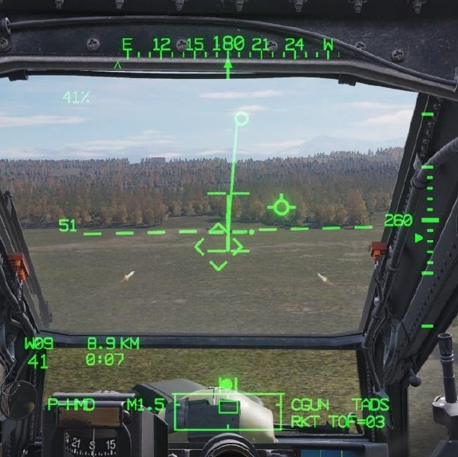

# AERIAL ROCKET SUB-SYSTEM (ARS)

The Aerial Rocket Sub-system is an aerial rocket bombardment system designed for engaging or suppressing
area targets at long range and is effective against groups of vehicles or personnel in the open.

The ARS consists of up to four M261 rocket launchers (also called “rocket pods”), which are capable of firing
2.75-inch unguided rockets of the Hydra-70 rocket family. Each 19-tube pod is “zoned”, which permits the
carriage of up to three different warhead types when a single pair of launchers are used, or up to five different
warhead types when two pairs of launchers are used. Single rocket pods may also be loaded if desired, in the
case of reducing overall gross weight as necessary.

Rockets may be employed “independently” by either crewmember when using the HMD or FCR as the selected
sight; or by both crewmembers in a “cooperative” manner in which the Pilot aligns the aircraft with the ballistic
solution calculated by the CPG’s selected sight (usually the TADS).

When employed using the HMD as the selected sight, rocket engagements are typically performed at speeds
above effective translational lift (ETL), using forward airspeed to increase the stability of the aircraft. These
engagements are performed using weapon delivery techniques known as “running fire” or “diving fire”, which
improves the accuracy of unguided munitions such as rockets. (See Weapon Delivery Techniques for more
information.)

When employed using the TADS or FCR as the selected sight, rocket engagements may be performed using a
third weapon delivery technique known as “hover fire”, in which the aircraft remains stationary while employing
unguided rockets against area targets. These engagements may be used in either a “direct fire” mode, in which
the target location is directly sighted by the TADS when making aiming adjustments; or an “indirect fire” mode,
in which the TADS is slaved to a 3-dimensional target location previously stored using the TADS, detected by the
FCR, received via the datalink, or manually input by the aircrew, and the rockets are launched from behind cover
without having a direct line-of-sight to the target area.

## Hydra-70 2.75-inch Unguided Rockets

Unguided rockets have been in use by military helicopters for decades, with the first large-scale use by UH-1 and
AH-1 helicopters during the Vietnam War of the 1960’s and early 1970’s. Although fire control systems in various
military fixed-wing aircraft and helicopters have advanced in accuracy and sophistication, the overall design of
the rockets themselves has remained comparatively simple with few changes.

The most commonly used rocket motor by the U.S. Army during the Vietnam War was the Mk40 FFAR (Folding
Fin Aerial Rocket), itself derived from the World War 2-era “Mighty Mouse” aerial rocket. The Mk40 was a tube-
launched, solid-propellant rocket motor 2.75 inches (70mm) in diameter, with four stabilizing fins that would
deploy once the rocket had been expelled from its launcher. The Mk40 rocket motor could be fitted with a variety
of compatible warheads, including high-explosives, white phosphorus for target marking, or even flechette-
dispensing warheads for anti-personnel.

The Mk66 rocket motor was later developed and gradually replaced the Mk40 as the principal rocket motor for
Hydra-70 rocket systems in the U.S. military. The Mk66 included a revised “wrap-around folding fin” design and
a more powerful rocket motor with an increased propellant load, allowing it to be employed against targets as
far as 7,500 meters. The rocket propellant is expelled through a spiral-fluted nozzle that generates a spinning
motion to increase the ballistic stability and accuracy of the rocket after launch. Like the previous Mk40 rocket
motors, the Mk66 is compatible with a large number of the same 2.75-inch diameter warheads.

Weapon designations of the Hydra family of rockets are typically denoted by the installed warheads, despite being
composed of three distinct components to include the Mk66 rocket motor, warhead, and fuze. Depending on the
specific warhead that is installed on the rocket, some fuzes are integrated within the warhead itself while others
may be fitted with an external fuze option.

Compatible fuzes are grouped into three categories, based on their method of function. Rocket warheads that
may employ these types of fuzes are listed below within each applicable fuze category.

##### Point-Detonating Fuze            

Initiates upon impact.           
                                 
- M151 High Explosive         
- M229 High Explosive         
- M274 Training Smoke         
- M156 WP Smoke               
                                 

##### Variable Delay Fuze                               

Initiates based on target range or                
a variable time delay after impact.               

- M151 High Explosive                          
- M229 High Explosive                          
- M255A1 Flechette
- M261 MP Sub-Munition
- M264 RP Smoke

##### Fixed Delay Fuze

Initiates based on a fixed time
delay after launch.

- M257 Illumination
- M258 IR Illumination

**M423 Point-Detonating (PD) Fuze.** The M423 fuze initiates the warhead charge immediately upon impact
with any solid surface. This fuze is the most commonly used by M151 and M229 high-explosive warheads, but is
also used by the M156 white phosphorus smoke rocket for target marking and by the M274 training rocket.

**M433 Resistance Capacitance (RC) Fuze.** The M433 is a variable-time delay fuze that uses an electrical
charge delivered by the launching aircraft to set the desired time delay based on the specific cockpit selection.
The fuze is activated upon impact with a solid surface and initiates the warhead charge after a brief delay,
allowing the warhead to penetrate obstructions prior to detonation. This fuze is not commonly used but could be
employed to increase the penetration of high-explosive warheads through dense foliage or defensive fortifications.

**M439 Air Burst Fuze.** The M439 is a variable-time delay fuze that uses an electrical charge delivered by the
launching aircraft to set the desired time delay based on the specific cockpit selection. The fuze is activated upon
launch and initiates the warhead charge after a delay, allowing the warhead to reach a pre-determined range
along its trajectory prior to detonation or delivery of the warhead contents. This fuze is integrated into the M255A1
Flechette, M261 Multi-Purpose Sub-Munition (MPSM), and M264 red phosphorus smoke rockets.

**M442 Cargo Fuze.** The M442 is a fixed-time delay fuze that initiates the warhead charge approximately 9
seconds following rocket motor burnout. The combined flight time of the rocket motor burn and the subsequent
fuze delay deploys the warhead contents approximately 3,500 meters from the launch point and is integrated
into the M257 and M278 battlefield illumination rockets.

### Rocket Launcher Zones

The AH-64 is capable of employing up to five unique rocket warhead types when loaded with four M261 rocket
launchers. Each of the 19 individual rocket tubes of each M261 launcher is equipped with independent firing and
fuzing circuits, which allow the rockets to be selectively fired based on which tube is physically occupied by a
rocket and which warhead “zone” the tube is assigned.

Each zone is permanently allocated to each of the four wing pylons, meaning that zones A and B will only be
assigned to M261 launchers mounted under the outboard wing pylons, and zones C and D will only be assigned
to launchers mounted under the inboard wing pylons. However, zone E will always be assigned to the center
three tubes of any installed launchers.

### Rocket Steering Cursor

The Aerial Rocket Sub-system (ARS) enables accurate delivery of massed fires against area targets and provides
an AH-64 team with a direct and indirect fire capability akin to a light rocket artillery battery. The fire control
system of the AH-64 calculates ballistic trajectories of 2.75-inch unguided rockets out to a range of 7,500 meters,
and at such distances most vehicle-sized targets would be difficult to visually acquire, depending on the nature
of the terrain. If a target could be seen at such a distance, direct aiming devices would be inadequate in providing
the level of aiming precision that would be necessary to ensure unguided munitions, even an area effect weapon
such as unguided rockets, could be delivered in the vicinity of the target. This would preclude the use of direct
sighting methods such as a Continuously Computed Impact Point (CCIP) or any other reticle that would require
adjustments to an aimpoint toward distant target locations.

 The key piece of symbology associated with employing rockets is
 the Rocket Steering Cursor, an I-beam shaped symbol displayed
 within the crewmembers’ sight symbology. The Rocket Steering

 Cursor is a steering cue which indicates the required position that
 the nose of the aircraft must be placed in azimuth and elevation,
 taking into account the limited articulation range of the pylons.
 When the symbology LOS Reticle is aligned along the “I-beam”
 between the upper and lower limits of the Rocket Steering Cursor,
 the aircraft is positioned in which the calculated weapon aiming
 solution against the intended target is within the articulation range
 of the wing pylons.

The Rocket Steering Cursor is longitudinally-scaled and is not a
virtual symbology element; its displayed location does not
correspond with a real-world location that is observed “out-the-
window” like the Head Tracker or Flight Path Vector. This removes the limitations of direct sighting against long-
range targets and allows the AH-64 to employ unguided rockets from behind cover when the aircraft may not
have a direct line-of-sight to the target location. This capability facilitates indirect fire against target locations that
have been handed off to the AH-64 aircrew from another platform such as another AH-64 team member, a scout
helicopter, or friendly ground forces.

To aid the aircrew in aligning the rocket launchers with the calculated weapon aiming solution, the weapon pylons
themselves articulate in the vertical axis to account for target range and the pitch attitude of the helicopter at a
given airspeed. The pylons have an articulation range of +4° to -15° relative to the Aircraft Datum Line (ADL),
which represents the longitudinal axis of the fuselage.

The Head Tracker symbol within the IHADSS Flight symbology is displayed at -4.9° relative to the ADL. In a stable
hover with no winds, or when landed, the Head Tracker will be level with the horizon; and is at an approximate
mid-point between the upper and lower articulation limits of the pylons.

### Rocket Steering Cursor Alignment

The Rocket Steering Cursor is longitudinally positioned within the symbology based on the position of the weapon
aiming solution relative to the nose of the aircraft, which is represented by the LOS Reticle. If the Rocket Steering
Cursor is displayed to the left of the LOS Reticle, the heading of the aircraft should be adjusted to the left until
the Rocket Steering Cursor is aligned with the LOS Reticle, and vice versa if the Rocket Steering Cursor is to the
right of the LOS Reticle.

In the example below, the sight’s LOS Reticle has been placed over a group of vehicles approximately 3 kilometers
away. The LOS Reticle is being used to designate the target location and is also being used to represent the nose
of the aircraft as a reference point from which the Rocket Steering Cursor is being displayed. While the Head
Tracker is a virtual symbology element representing the real-world position of the aircraft nose, the Rocket
Steering Cursor is a longitudinally-scaled symbology element that is displayed relative to the LOS Reticle. As a
result, the Rocket Steering Cursor is indicating to the Pilot that the nose of the aircraft must be steered to the
left to align the rocket launchers with the weapon aiming solution.

In this scenario, the LOS Reticle is vertically aligned between the upper and lower limits of the Rocket Steering
Cursor, indicating that the weapon aiming solution is within the articulation range of the wing pylons. However,
the LOS Reticle is laterally misaligned to the right from the Rocket Steering Cursor, indicating the rockets will
impact to the right of the intended target. If the rockets were fired under these conditions, they would impact to
the right of the target but would be at the correct range (assuming the ranging data being used by the selected
sight is accurate).

To correct lateral misalignment of the Rocket Steering Cursor, the Pilot should turn in the direction of the Rocket
Steering Cursor until the LOS Reticle is aligned along the vertical axis of the “I-beam”. If in a hover or at low
speeds near hover, the Pilot should use the pedals to yaw the aircraft in the direction of the Rocket Steering
Cursor. If in forward flight, the Pilot should use the cyclic to bank the aircraft in the direction of the Rocket
Steering Cursor while adjusting the pedals to keep the skid/slip indicator (“trim ball”) centered.

In the next example below, the sight’s LOS Reticle has been placed over a group of vehicles approximately 6
kilometers away, and the aircraft nose is correctly aligned with the weapon aiming solution. However, due to the
range between the aircraft and the targets, the weapon aiming solution is beyond the articulation range of the
wing pylons. As a result, the Rocket Steering Cursor is indicating to the Pilot that the nose of the aircraft must
be elevated to align the rocket launchers with the weapon aiming solution.

In addition, the Rocket Steering Cursor itself is dashed to indicate that a weapon inhibit exists, in this case a
performance inhibit, accompanied by the “PYLON LIMIT” inhibit message displayed within the symbology. (See
Rocket Steering Cursor Format on the following page for more information.)

In this scenario, the LOS Reticle is laterally aligned with the Rocket Steering Cursor, indicating that the aircraft is
on the correct heading for an accurate rocket delivery. However, the LOS Reticle is vertically misaligned below
the Rocket Steering Cursor. If the rockets were fired under these conditions, their ballistic trajectory would be
insufficient to achieve the required range and would impact the ground prior to reaching the target.

To correct vertical misalignment of the Rocket Steering Cursor, the Pilot should use the cyclic to adjust the pitch
attitude of the aircraft in the direction of the Rocket Steering Cursor until the LOS Reticle is aligned between the
upper and lower limits of the “I-beam”. This technique uses the pitch attitude of the helicopter to augment the
elevation of the rocket launchers and is called “super-elevating”.

If in a hover or at low speeds near hover, the Pilot should use caution when super-elevating the nose near
obstacles as the pitch-up attitude will induce a backwards acceleration. If sufficient maneuver area is available,
it may be advisable to gain some forward speed prior to performing a “super-elevation maneuver” for long-range
rocket delivery. Forward airspeeds also increase airflow over the tail, providing the added benefit of improving
the helicopter’s stability, which will enhance the accuracy of unguided munitions.

### Rocket Steering Cursor Format

The Rocket Steering Cursor is displayed in four formats to indicate whether the weapon aiming solution is within
the articulation range of the wing pylons (Valid or Invalid) and the current pylon state (Normal or Ground Stow).

If the weapon aiming solution is within the articulation range of the wing
pylons and no Weapon Inhibit messages are displayed within the High Action
Display, the Rocket Steering Cursor will be displayed as Valid.

If the weapon aiming solution is beyond the articulation range of the wing
pylons or any Weapon Inhibit messages are displayed within the High Action
Display, the Rocket Steering Cursor will be displayed as Invalid.

If Ground Stow (GND STOW) is disabled on the WPN Utility sub-page, enabling
normal articulation functions of the wing pylons, the Rocket Steering Cursor
will be displayed as a continuous “I-beam” symbol.

If Ground Stow (GND STOW) is enabled on the WPN Utility sub-page, disabling
the normal articulation functions of the wing pylons and setting the pylons to

-5° relative to the Aircraft Datum Line (coincident with the Head Tracker
symbol within the HMD Flight symbology), the Rocket Steering Cursor will be
displayed as a broken “I-beam” symbol.

!!! note
    When the Rocket Steering Cursor is displayed in the GND STOW format, the broken “I-beam” symbol will
    remain referenced from the LOS Reticle based on the calculated weapon aiming solution.

### Rocket Weapon Inhibits

The following conditions will inhibit the rockets from being fired or interrupt the firing of the rockets if already in
in progress. Performance inhibits may be overridden by pulling the trigger to the 2nd detent. Safety inhibits cannot
be overridden.

##### Performance Inhibits

- **BAL LIMIT:**

    The required weapon aiming
solution exceeds the ballistics
processing capability.

    - If tactically feasible, engage the target at a closer
range.

- **PYLON LIMIT
 (IN FLIGHT):**

    The commanded position of the
rocket launcher(s) exceeds the
pylon articulation limits.
(+4° to -15°).

    - Adjust the aircraft pitch attitude as necessary to bring
the weapon aiming solution within the articulation
range of the wing pylons (e.g., pitch the nose toward
the Rocket Steering Cursor).

##### Safety Inhibits

- **ACCEL LIMIT:**

    Vertical acceleration is <0.5 G;
the main rotor blades may
obstruct the trajectory of the
rockets when fired.

    - Reduce the severity of the current maneuver to
increase the positive G load on the aircraft.

- **ALT LAUNCH:**

    A missile launch is already in
progress.

    - The rockets may be fired 2 seconds after the missile
launch is complete.

- **GUN OBSTRUCT:**

    The gun is out of coincidence
from the weapon aiming
solution and may obstruct the
trajectory of rockets fired from
the inboard wing pylons.

    - If tactically feasible, instruct the crewmember that has
actioned the gun to de-action in order to permit the
firing of rockets.

- **LOS INVALID:**

    The line-of-sight of the selected
sight is invalid or has failed;
and cannot provide a weapon
aiming solution to the gun.

    - Select a different sight for engagement.
If using HMD as the sight and the LOS Reticle is
flashing, adjust the helmet position to within the slew
limits of the assigned NVS sensor (PNVS or TADS).

- **PYLON ERROR:**

    Indicates that the pylon position
is not equal to the commanded
pylon position or the rocket
launcher positions are
unknown.

    - If inhibit message remains, the corresponding wing
pylons may have experienced a failure.
A different rocket warhead selection may be made (if
available) on a different set of wing pylons; otherwise
the rockets should be de-actioned.

- **PYLON LIMIT
(ON GROUND):**

    The commanded position of the
rocket launcher(s) exceeds the
pylon articulation limits.
(+4° to -5°).

    - Adjust the weapon aiming solution as necessary to
that which may be utilized within the articulation range
of the wing pylons.

- **SAFE:**

    The master armament state is
currently set to SAFE; weapons
cannot be fired.

    - Set the A/S button on the Armament Panel to ARM.

### WPN Rocket (RKT) Format

When rockets are selected for employment within the crewstation, the WPN page will be set to RKT format.

1.   **Inventory Select.** Displays the available rocket warhead types and the remaining quantity onboard for
     each type. A rocket warhead type may be selected for employment using VAB L1-L5, with the current
     selection boxed. This setting is independent between crewstations unless COOP mode is entered.

    !!! note
        All rocket zones that are loaded with the same warhead type are consolidated into a single selection.

2.   **Quantity Select.** Displays the selected quantity of rockets that will be fired within a salvo. Selection of VAB
     R1 will display the Quantity Select menu that permits a different quantity to be selected. Available options
     are 1, 2, 4, 8, 16, 24 or ALL.

3.   **Rocket Status.** Indicates a rocket launcher is installed onto the corresponding wing pylon. The launcher
     icon appearance and text label indicate the status and warhead inventory selection of the launcher.

### Rocket Weapon Status Messages

The following messages will be displayed in the High Action Display based on current rocket status or weapon
page settings when rockets are actioned.

     

- **LIMITS:**         The commanded position of the rocket launcher(s) exceeds the pylon articulation limits.
- **NO ROCKETS:**        Rockets are actioned but no rockets are available.
                    Rockets are actioned. Ground stow is enabled on the WPN Utility sub-page and rocket
- **RKT G-S:**
                    launchers are not articulating.
- **RKT NORM:**         Rockets are actioned. Rocket launchers are articulating to the weapon aiming solution.
                    The remaining time of flight (in seconds) for the most recent rocket salvo that has been
- **RKT TOF=##:**
                    fired.
                    Rockets are actioned but a rocket type has not been selected from the INVENTORY on
- **TYPE?:**         the WPN page; or the previous type has been depleted and another rocket type must be
                    selected.
- **WEAPON?:**         The weapon trigger has been pulled but no weapon has been actioned.

## Rocket Engagement using TADS (Direct Fire in COOP Mode)

When employing unguided rockets in Cooperative (COOP) mode, the TADS is used by the CPG to calculate the
weapon aiming solution while the Pilot maneuvers the aircraft to align the Rocket Steering Cursor. If the target
is moving, continuous laser designation via the 2nd detent of the laser trigger should be used to incorporate the
Target State Estimator (TSE) for lead-angle compensation. TADS LMC and/or IAT may also be used to assist the
CPG in stabilizing the TADS LOS Reticle on the target.

Cooperative mode can only be entered when the CPG actions rockets on the TEDAC Left Handgrip and the Pilot
actions rockets on the Cyclic Grip.

When COOP mode is entered, the Pilot’s WPN page settings in the RKT format will default to the setting s of the
CPG. However, when in COOP mode, these settings are common between crewstations in that changing the
INVENTORY (VAB L1-L5) or QTY (VAB R1) settings in one crewstation will change them in the other.

To engage a target with Direct Fire rockets in Cooperative mode, using the TADS as the selected sight:

1. [[**PLT**]] Sight Select switch – HMD.
      (Collective Mission Grip)
2. [[**CPG**]] Sight Select switch – TADS.
      (TEDAC Right Handgrip)                     

3. [[**CPG**]]   WPN Fixed Action Button – Press.
4. [[**CPG**]] (Optional) Determine the
      appropriate acquisition source (ACQ) for
      acquiring the target.

    - If the target is visually acquired by
            either crewmember, set ACQ to PHS
            or GHS.
                                                 
    - If the target is stored as a point
            within the navigational database,
            set ACQ to the corresponding point.
                                                 
5. [[**CPG**]]  (Optional) SLAVE button – Press,
      and then press again to de-slave when
      the TADS has finished slewing.
6. [[**PLT**]] Weapon Action switch (WAS) –
      Left. (Cyclic Grip)
7. [[**CPG**]] Weapon Action Switch (WAS) –
      Left. (TEDAC Left Handgrip)

    

8. [[**PLT & CPG**]] Weapon Control Status – Verify
      “COOP”. (High Action Display)
9. [[**PLT & CPG**]] Weapon Status – Verify “RKT
      NORM”. (High Action Display)
10. [[**PLT**]] / CPG Weapon settings – Verify or
      select. (WPN page)

    - © TYPE (VAB L1-L5) – Select as
            desired.
    - © QTY (VAB R1) – Select as
            desired.

11. [[**CPG**]] © A/S button – Verified in ARM.
      (Armament Panel)

12. [[**CPG**]] Range source – Verify or select:
      Laser, Navigation, Auto, or Manual.
      (TADS Acquisition and Ranging)

    

13. [[**CPG**]] If the target or aircraft are moving,
      engage TADS targeting modes to
      stabilize the TADS on target.

    - Manual tracking - Engage LMC and
            employ the Sight Manual Tracker.
    - Automatic tracking - Engage IAT.

14. [[**CPG**]] LRFD Trigger – Pull, if laser ranging
      is desired. (TEDAC Right Handgrip)

    - Target and aircraft are stationary –
            LRFD trigger, 1st detent, may be
            pulled momentarily (ranging).
    - Target or aircraft are moving –      
            LRFD trigger, 2nd detent, should be
            pulled and held (designation).

15. [[**CPG**]] Instruct the Pilot to align the
      aircraft with the Rocket Steering Cursor
      and fire – “Match and Shoot.”
16. [[**PLT**]] Rocket Steering Cursor – Align with                                                    
      the HMD LOS Reticle.

    - Running/Diving Fire – Apply cyclic
            inputs in the direction of the Rocket
            Steering Cursor while applying
            pedal      inputs     to     maintain
            aerodynamic trim.
    - Hover Fire – Apply pedal inputs in
            the direction of the Rocket Steering
            Cursor.

    

17. [[**PLT & CPG**]] Weapon Inhibit messages –        
      Verify no Safety or Performance inhibit
      messages are displayed:

    - ACCEL LIMIT
    - ALT LAUNCH
    - GUN OBSTRUCT
    - PYLON ERROR
    - BAL LIMIT
    - PYLON LIMIT

18. [[**PLT**]]   Weapon Trigger – Pull and hold for duration of salvo. (Cyclic Grip)
19. [[**CPG**]]   TADS Field-Of-View (FOV) - Decrease by one level. (e.g., switch FLIR from Narrow to Medium FOV)
20. [[**PLT & CPG**]]        Observe for rocket impacts – Adjust the TADS LOS Reticle aimpoint and repeat rocket salvo as
      necessary until target effects are achieved.

## Rocket Engagement using TADS (Indirect Fire in COOP Mode)

When employing unguided rockets in Cooperative (COOP) mode, the TADS is used by the CPG to calculate the
weapon aiming solution while the Pilot maneuvers the aircraft to align the Rocket Steering Cursor. When
employed in an indirect fire manner in which the target cannot be directly observed by the aircraft sensors, the
TADS is slaved to a point within the navigational database corresponding with the target’s 3-dimensional location.
This point may be stored using the TADS, manually input by the crew, or received from another team member.

Cooperative mode can only be entered when the CPG actions rockets on the TEDAC Left Handgrip and the Pilot
actions rockets on the Cyclic Grip.

When COOP mode is entered, the Pilot’s WPN page settings in the RKT format will default to the settings of the
CPG. However, when in COOP mode, these settings are common between crewstations in that changing the
INVENTORY (VAB L1-L5) or QTY (VAB R1) settings in one crewstation will change them in the other.

To engage a target with Indirect Fire rockets in Cooperative mode, using the TADS as the selected sight:

1. [[**PLT**]]  Sight Select switch – HMD.
     (Collective Mission Grip)
2. [[**CPG**]]  Sight Select switch – TADS.
     (TEDAC Right Handgrip)                    

3. [[**CPG**]]    WPN Fixed Action Button – Press.
4. [[**CPG**]]   Determine the appropriate
     acquisition source (ACQ) for acquiring
     the target.

    - COORD (VAB T5) – Select.
    - Point (VAB L1-L6) – Select; or use
           paging controls to locate the target
           point within the database.
    
    !!! note
        If the target location is not
        already present in the navigational       
        database, the target point must be
        received via the datalink or manually
        input on the POINT sub-page. (See the
        Datalink chapter or TSD Point sub-page
        for more information.)

5. [[**CPG**]]    SLAVE button – Press.
6. [[**PLT**]]  Weapon Action switch (WAS) –
     Left. (Cyclic Grip)
7. [[**CPG**]]  Weapon Action Switch (WAS) –
     Left. (TEDAC Left Handgrip)
8. [[**PLT & CPG**]]  Weapon Control Status – Verify
     “COOP”. (High Action Display)
9. [[**PLT & CPG**]]  Weapon Status – Verify “RKT
     NORM”. (High Action Display)

    

10. [[**PLT**]]  / CPG Weapon settings – Verify or
      select. (WPN page)

    - © TYPE (VAB L1-L5) – Select as
            desired.
    - © QTY (VAB R1) – Select as
            desired.
11.      A A/S button – Verified in ARM.
       CPG
      (Armament Panel)
12. [[**CPG**]]  Range source – Verify Navigation.
      (TADS Acquisition and Ranging)

    

13. [[**CPG**]]  Instruct the Pilot to align the
      aircraft with the Rocket Steering Cursor
      and fire – “Match and Shoot.”
14. [[**PLT**]]   Rocket Steering Cursor – Align with
      the HMD LOS Reticle.

    - Running Fire – Apply cyclic inputs
            in the direction of the Rocket
            Steering Cursor while applying
            pedal inputs to maintain
            aerodynamic trim.
    - Hover Fire – Apply pedal inputs in
            the direction of the Rocket Steering
            Cursor.
                                                
    

15. [[**PLT & CPG**]] Weapon Inhibit messages –
      Verify no Safety or Performance inhibit
      messages are displayed:
    
    - ACCEL LIMIT
    - ALT LAUNCH
    - GUN OBSTRUCT
    - PYLON ERROR
    - BAL LIMIT
    - PYLON LIMIT

16. [[**PLT**]]  Weapon Trigger – Pull and hold for
      duration of salvo. (Cyclic Grip)          

17. [[**PLT & CPG**]] If no observers are able to
      provide a damage assessment after
      rockets are fired, it may be necessary to
      un-mask and observe the target area to
      determine if the desired target effects
      are achieved.

## Rocket Engagement using FCR (Direct Fire or Indirect Fire)

When employing unguided rockets independently from either crewstation using the FCR, the NTS target is used
for calculating the weapon aiming solution for the Rocket Steering Cursor. If the target is moving, the target
should be engaged in as short amount of time possible following the completion of the FCR scan to ensure the
lead-angle compensation to the target is accurate.

Since the 3-dimensional location of the NTS
target is used for calculating the weapon
aiming solution, unguided rockets may be
employed in a direct fire manner in which the
target can be directly observed by the aircraft
sensors, or in an indirect fire manner in which
the target cannot be directly observed by the
aircraft sensors.

When employing unguided rockets in
Cooperative (COOP) mode, the FCR is used by
the CPG to calculate the weapon aiming
solution while the Pilot maneuvers the aircraft
to align the Rocket Steering Cursor.
Cooperative mode can only be entered when
the CPG actions rockets on the TEDAC Left
Handgrip and the Pilot actions rockets on the
Cyclic Grip.

To engage a target from either crewstation
while using the FCR as the selected sight:

1.   Sight Select switch – FCR. (Collective
     Mission Grip or TEDAC Right Handgrip)
2.   NTS (VAB L1) – Select to advance NTS to
     desired target for engagement.

     or                                       

    MPD Cursor Controller/Enter – Select
     desired target for engagement.

3.   WPN Fixed Action Button – Press.
4.   Weapon Action switch (WAS) – Left.
     (Cyclic Grip)
5.   Weapon Status – Verify “RKT NORM”.
     (High Action Display)
6.   Weapon settings – Verify or select. (WPN
     page)

    - TYPE (VAB L1-L5) – Select as        
          desired.
    - QTY (VAB R1) – Select as desired.

7.   A/S button – Verified in ARM. (Armament
     Panel)
8.   Range source – Verify Radar range is
     within appropriate engagement range.
9.   Rocket Steering Cursor – Align with the
     HMD LOS Reticle.

    - Running/Diving Fire – Apply cyclic
         inputs in the direction of the Rocket
         Steering Cursor while applying
         pedal      inputs     to     maintain
         aerodynamic trim.
    - Hover Fire – Apply pedal inputs in
         the direction of the Rocket Steering
         Cursor.

    

10. Weapon Inhibit messages – Verify no
    Safety or Performance inhibit messages
    are displayed:
    
    - ACCEL LIMIT
    - ALT LAUNCH
    - GUN OBSTRUCT
    - PYLON ERROR 
    - BAL LIMIT
    - PYLON LIMIT

11. Weapon Trigger – Pull and hold for
    duration of salvo. (Cyclic Grip)

## Rocket Engagement using HMD (Direct Fire)

When employing unguided rockets independently from either crewstation, the crewmember uses the HMD to
calculate the weapon aiming solution while maneuvering the aircraft to align the Rocket Steering Cursor. Since
the HMD LOS Reticle designates the target location, the helmet position must be maintained on the target to
provide continuous and accurate steering cues via the Rocket Steering Cursor.

To engage a target with Direct Fire rockets, using the HMD as the selected sight:

1.   Sight Select switch – HMD. (Collective
     Mission Grip)
2.   WPN Fixed Action Button – Press.
3.   Weapon Action switch (WAS) – Left.
     (Cyclic Grip)
4.   Weapon Status – Verify “RKT NORM”.
     (High Action Display)
5.   Weapon settings – Verify or select. (WPN
     page)

    - TYPE (VAB L1-L5) – Select as
          desired.
    - QTY (VAB R1) – Select as desired.

6.   A/S button – Verified in ARM. (Armament   
     Panel)
7.   Range source – Verify or select:
     Navigation, Auto, or Manual. (HMD
     Acquisition and Ranging)

8.   HMD LOS Reticle – Designate the target.
9.   Rocket Steering Cursor – Align with the
     HMD LOS Reticle while maintaining the
     HMD LOS Reticle on the target.

    - Running/Diving Fire – Apply cyclic
          inputs in the direction of the Rocket
          Steering Cursor while applying       
          pedal      inputs     to     maintain
          aerodynamic trim.
    - Hover Fire – Apply pedal inputs in
          the direction of the Rocket Steering
          Cursor.

10. Weapon Inhibit messages – Verify no
    Safety or Performance inhibit messages
    are displayed:

    - ACCEL LIMIT
    - ALT LAUNCH
    - GUN OBSTRUCT
    - PYLON ERROR
    - BAL LIMIT
    - PYLON LIMIT

11. Weapon Trigger – Pull and hold for
    duration of salvo. (Cyclic Grip)
12. Observe for rocket impacts – Adjust the
    HMD LOS Reticle aimpoint and repeat
    rocket salvo as necessary until target
    effects are achieved.

    

