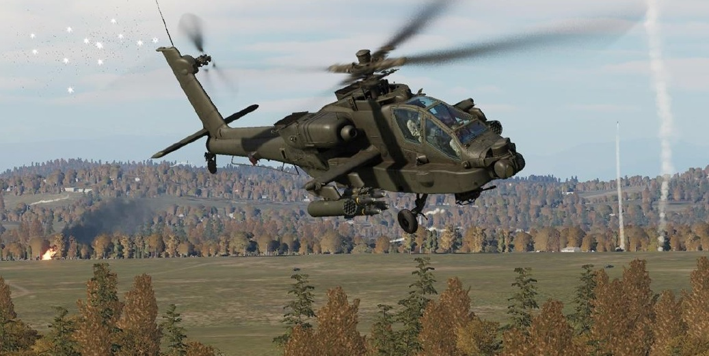
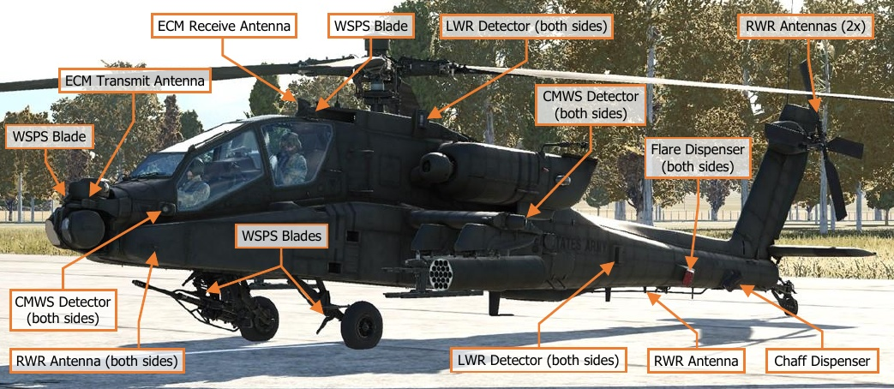
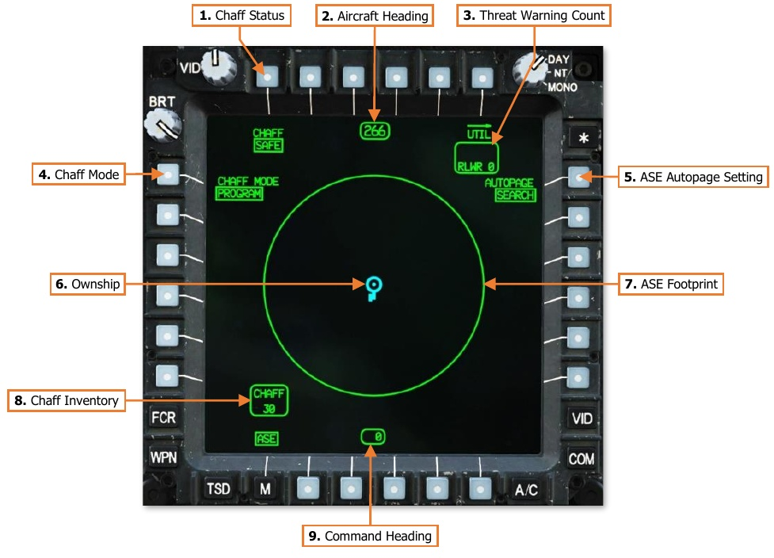
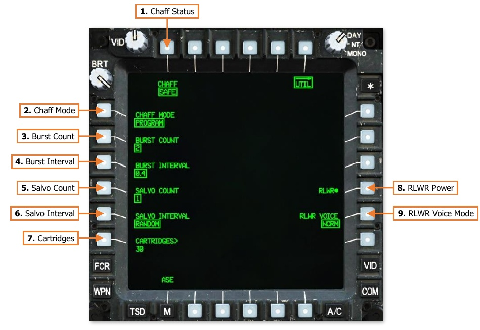

# AIRCRAFT SURVIVABILITY EQUIPMENT

The AH-64D features a comprehensive suite of active and passive defensive systems that are designed to ensure
the survival of the aircraft while operating at NOE (Nap-Of-the-Earth) altitudes in a high threat environment. The
various defensive systems installed on the aircraft are known collectively as Aircraft Survivability Equipment (ASE).

The ASE kit installed on the AH-64D includes a combined radar and laser warning receiver (RLWR), an electronic
radar jamming system (ECM), a missile warning system (CMWS), chaff and flare countermeasures dispensers,
infrared suppression integrated into the engine exhausts, and a Wire Strike Protection System (WSPS) installed
on the forward fuselage and underside.

!!! note
    The ECM system is not implemented at this time.

## Aircraft Survivability Equipment (ASE) Page

The primary threat warning indications are integrated into the Tactical Situation Display’s ASE “footprint”;
however, the crew can also view the threat environment on a decluttered “footprint” on the ASE page. The ASE
page also allows the crew to initialize and configure individual ASE systems.

1.   **Chaff Status.** Displays the state of the chaff dispenser. Pressing VAB T1 will toggle the state between SAFE
     and ARM.

    - **SAFE.** Chaff dispensing is inhibited. The status will default to SAFE with aircraft weight-on-wheels and
           inhibited from selection.

    - **ARM.** Chaff may be dispensed by either crewstation.

2.   **Aircraft Heading.** Displays the current heading of the aircraft.

3.   **Threat Warning Count.** Displays the total number of threats displayed around the ASE footprint.

    - **RFI.** Indicates the number of radar threats detected by the RFI and displayed on the outside of the
           ASE footprint, up to a maximum of 10. This field will be blank if the FCR mast-mounted assembly is
           not installed.

    - **RLWR.** Indicates the number of radar and/or laser threats detected by the RLWR and displayed on
           the inside of the ASE footprint, up to a maximum of 7.

4.   **Chaff Mode.** Displays the chaff dispense mode. Pressing VAB L1 will toggle the state between PROGRAM
     and MANUAL.

    - **PROGRAM.** A single chaff program will be dispensed if the chaff dispenser is armed and the Chaff
           button is pressed on the Cyclic Grip in either crewstation. The chaff program may be edited on the ASE
           Utility page.

    - **MANUAL.** An individual chaff cartridge will be dispensed if the chaff dispenser is armed and the Chaff
          button is pressed on the Cyclic Grip in either crewstation.

5.   **ASE Autopage Setting.** Displays the ASE autopage setting for the crewstation. Pressing VAB R1 will display
     an expanded selection of autopage options.

    - **SEARCH.** If a new threat is detected, the TSD will be autopaged if the ASE or TSD pages are not
          already displayed within the crewstation.

    - **ACQUISITION.** If a detected threat elevates to ACQUISITION, the TSD will be autopaged if the ASE
          or TSD pages are not already displayed within the crewstation.

    - **TRACK.** If a detected threat elevates to TRACK, the TSD will be autopaged if the ASE or TSD pages
          are not already displayed within the crewstation.

    - **OFF.** ASE autopaging is disabled.

6.   **Ownship.** Represents the present position of the aircraft.

7.   **ASE Footprint.** Displays the relative bearings of detected radar and laser threats around the ownship.
     Radar and/or laser threats detected by the RLWR are displayed around the inside of the ASE footprint. Radar
     threats detected by the RFI (if the FCR mast-mounted assembly is installed) are displayed around the outside
     of the ASE footprint.

8.   **Chaff Inventory.** Indicates the number of remaining chaff cartridges onboard, up to a maximum of 30.

9.   **Heading to Waypoint.** Displays the heading to the next point in the route.

### ASE Utility (UTIL) Sub-page

The ASE Utility page allows the crew to initialize the RLWR, set the RLWR voice mode, and configure the chaff
dispenser settings.

1.   **Chaff Status.** Displays the state of the chaff dispenser. Pressing VAB T1 will toggle the state between SAFE
     and ARM.

    - **SAFE.** Chaff dispensing is inhibited. The status will default to SAFE with aircraft weight-on-wheels and
           will be inhibited from selection.

    - **ARM.** Chaff may be dispensed by either crewstation.

2.   **Chaff Mode.** Displays the chaff dispense mode. Pressing VAB L1 will toggle the state between PROGRAM
     and MANUAL.

    - **PROGRAM.** A single chaff program will be dispensed if the chaff dispenser is armed and the Chaff
           button is pressed on the Cyclic Grip in either crewstation.

    - **MANUAL.** An individual chaff cartridge will be dispensed if the chaff dispenser is armed and the Chaff
           button is pressed on the Cyclic Grip in either crewstation.

3.   **Burst Count.** Sets the number of chaff cartridges dispensed within each salvo of the chaff program.
     Pressing VAB L2 will display an expanded selection of burst count options of 1, 2, 3, 4, 6, and 8 cartridges.

4.   **Burst Interval.** Sets the time interval between individual chaff cartridges dispensed within each salvo of
     the chaff program. Pressing VAB L3 will display an expanded selection of burst interval options of 0.1, 0.2,
     0.3, and 0.4 seconds.

5.   **Salvo Count.** Sets the number of salvos dispensed within each chaff program. Pressing VAB L4 will display
     an expanded selection of salvo count options of 1, 2, 4, 8, and CONTINUOUS. When set to CONTINUOUS,
     salvos will be dispensed in accordance with the remainder of the chaff program settings until the chaff
     dispenser is depleted or the chaff is set to SAFE status.

6.   **Salvo Interval.** Sets the time interval between each salvo dispensed within the chaff program. Pressing
     VAB L5 will display an expanded selection of salvo interval options of 1, 2, 3, 4, 5, 8, and RANDOM. When
     set to RANDOM, the interval between each salvo will be randomly selected.

7.   **Cartridges Input.** Activates the KU for inputting the current chaff cartridge quantity, if necessary.

8.   **RLWR Power.** Enables/Disables power to the Radar/Laser Warning System.

9.   **RLWR Voice Mode.** Displays the voice warning mode of the Radar/Laser Warning System. Pressing VAB
     L5 will toggle the mode between NORM and TERSE.

    - **NORM.** The RLWR will report radar and laser threats by threat classification, clock direction, and
          lethality when initially detected. If any detected threat elevates in lethality, the RLWR will repeat the
          audio report to include the current clock direction and increased lethality.

        - Audio report of a laser threat: “Laser ranging, 1 o’clock.”

        - Initial audio report of an SA-8 radar: “SA-8, 1 o’clock, searching.”

        - Updated audio report of an SA-8 radar: “SA-8, 1 o’clock, tracking.”

    - **TERSE.** The RLWR will report radar and laser threats by threat type and lethality only when initially
          detected. If any detected threat elevates in lethality, the RLWR will repeat the audio report to include
          the increased lethality.

        - Audio report of a laser threat: “Laser ranging.”

        - Initial audio report of an SA-8 radar: “Radar searching.”

        - Updated audio report of an SA-8 radar: “Radar tracking.”

