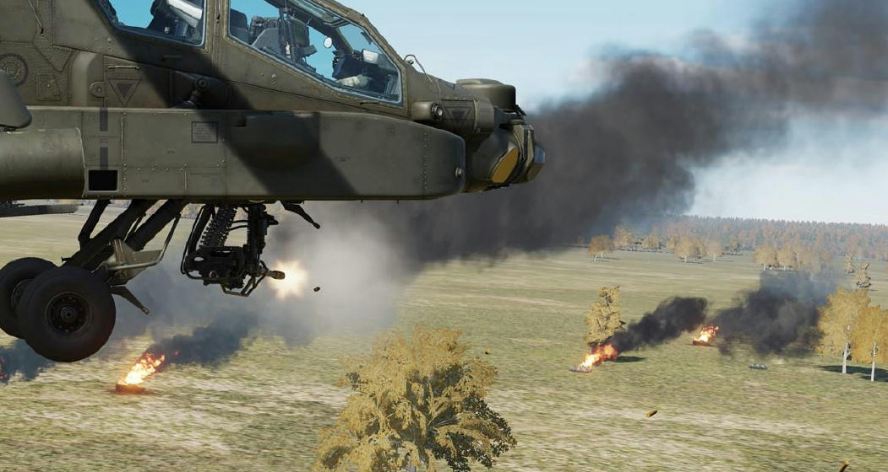
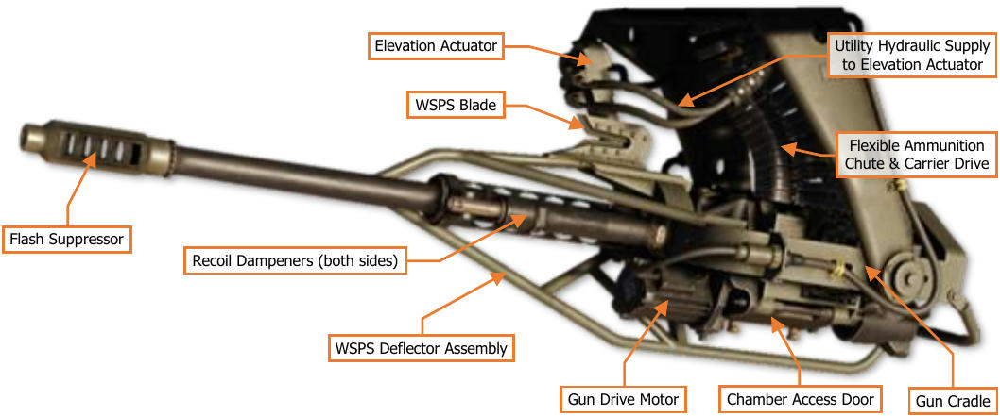
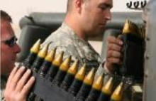
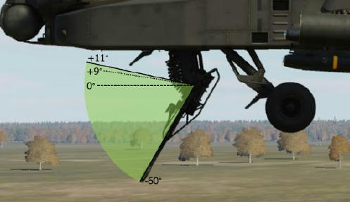
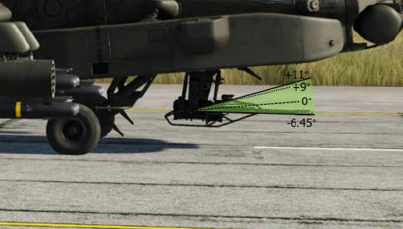
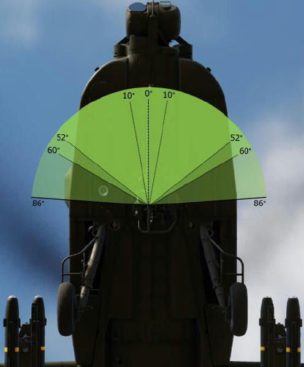
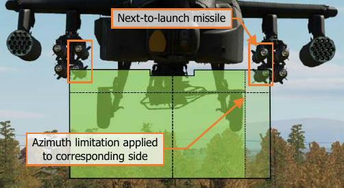
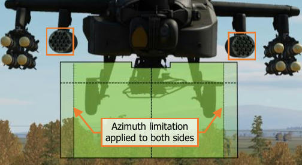

# AREA WEAPON SYSTEM (AWS)

The Area Weapon System is designed for engaging or suppressing targets at close range and is effective against
lightly armored vehicles, unarmored vehicles, and personnel. Although the entire M139 AWS also includes the
hydraulically-steered turret, ammunition magazine, and ammo handling system that transports ammunition from
the magazine to the turret, the most noticeable component of the AWS is the M230E1 30mm gun (also called the
“thirty” or simply the “gun”).

The gun may be employed by either crewmember when using the HMD or FCR as the selected sight; or by the
CPG when using the TADS. When employed using the HMD as the selected sight, gun engagements are typically
performed with the intent to engage or suppress close-range threats to the aircraft, in which the speed of placing
“rounds on target” is of greater importance over accuracy and precision. When employed using the TADS as the
selected sight, gun engagements may be performed in a more offensive manner in which accuracy and precision
is desired.

The gun may be used in the normal “flex gun” mode (NORM mode) in which the gun turret is articulated to match
the ballistic solution against the target location as calculated by the Weapon Processors; or in a forward-firing
“fixed gun” mode (FXD mode) in which the gun is fixed to a ballistic solution of 1,575 meters directly in front of
the aircraft, regardless of the selected sight or computed target location.

During major combat operations, the ammunition capacity of the Area Weapon System can hold up to 1,200
rounds if necessary. However, the ammunition magazine may be replaced with an Internal Auxiliary Fuel System
(IAFS), which includes a reduced-size 30mm ammunition magazine but extends the range and endurance of the
aircraft with an additional 100 gallons of fuel. The IAFS reduces the ammunition storage to just 25% of its full
capacity, limiting the total rounds that may be carried to 300.

## M230E1 30mm Automatic Gun

The M230 is a single-barrel, automatic chain gun which fires 30x113mm link-less ammunition. The M230 is
designed as an anti-material and anti-personnel weapon, employing a high-explosive dual-purpose (HEDP) round
that is capable of penetrating light armor while simultaneously producing fragmentation effects against
unarmored vehicles or personnel.

As a chain gun, the weapon uses a rotating chain within the receiver assembly to cycle the internal action in
loading the next round for firing and clearing the empty casing from the chamber after firing. This contrasts with
other weapons which use the expanding gases from the round’s explosive charge or the recoil of the round itself
to cycle the internal action. The gun action is powered by an external drive motor which is supplied with aircraft
electrical power.

The gun turret itself is steered using hydraulic pressure from the Utility hydraulic system and includes Wire Strike
Protection System (WSPS) components. The WSPS is intended to divert or sever high-tension wires that may be
inadvertently encountered by the aircraft during low-level operations, especially during hours of darkness. The
M230 is intended as a “low-signature weapon”, in which tracer rounds are not utilized and the gun barrel is
equipped with a flash suppressor to reduce visual detection during operations at night.

The M230 has an approximate rate of fire of 625 (±25) rounds per minute, but this may vary slightly between
individual aircraft. Two types of ammunition may be employed, each with identical ballistic characteristics.

**M789 High-Explosive Dual-Purpose (HEDP).** The M789 round uses a shaped
charge surrounded by a steel case to provide armor penetration and fragmentation
effects.

**M788 Training/Practice (TP).** The M788 round uses an inert round casing with
an aluminum tip to simulate the ballistic characteristics of the M789 during live-fire
training and exercises.

The M789 and M788 rounds have a relatively low muzzle velocity. As such, they are ill-suited for long-range
precision engagements, with an effective range of approximately 1,500 meters; although the AH-64 fire control
system will calculate a ballistic solution for the M230 out to 4,200 meters.

### Gun Articulation Limits

The AWS turret can articulate through a maximum range of ±86° in azimuth and +11°/-60° in elevation.
However, additional limitations are automatically applied to the turret based on specific conditions.

- If the gun azimuth is within ±10° of the aircraft centerline, the elevation is limited to +9°. This limitation
    does not apply when the gun is de-actioned and the gun is stowed at +11° in elevation.
- If the aircraft is on the ground (weight-on-wheels), the elevation is limited to -6.45°.

- If the gun is actioned while the missiles are also actioned, and the next-to-launch missile is on an inboard
    launcher rail of an inboard pylon, the gun azimuth will be limited to 52° on the corresponding side of the
    aircraft to prevent the missile from colliding with the gun barrel.
- If the gun is actioned while the rockets are also actioned, and rocket launchers are installed on the inboard
    pylons, the gun azimuth will be limited to ±60° to either side to prevent the rockets from colliding with the
    gun barrel.

### Gun Weapon Inhibits

The following conditions will inhibit the gun from being fired or interrupt the firing of the gun if already in in
progress. Performance inhibits may be overridden by pulling the trigger to the 2 nd detent. Safety inhibits cannot
be overridden.

##### Performance Inhibits

- **BAL LIMIT:**

    The required weapon aiming
solution exceeds the ballistics
processing capability.

    - If tactically feasible, engage the target at a closer
range.

##### Safety Inhibits

- **ALT LAUNCH:**

    A missile launch or a rocket
salvo is already in progress.

    - The gun may be fired 2 seconds after the missile
launch or rocket salvo is complete.

- **AZ LIMIT:**

    The gun turret is at an azimuth
limit and cannot reach the
weapon aiming solution.

    - Adjust the aircraft heading as necessary to bring the
weapon aiming solution within the azimuth limits of
the gun turret.

- **COINCIDENCE:**

    The gun is out of coincidence
from the weapon aiming
solution.

    - Wait for the gun to reach the weapon aiming solution.
If inhibit message remains, the gun may have
experienced a failure and should be de-actioned.

- **EL LIMIT:**

    The gun turret is at an elevation
limit and cannot reach the
weapon aiming solution.

    - Adjust the aircraft pitch attitude as necessary to bring
the weapon aiming solution within the elevation limits
of the gun turret (e.g., pitch the nose up when
engaging a target at long range).

- **LOS INVALID:**

    The line-of-sight of the selected
sight is invalid or has failed;
and cannot provide a weapon
aiming solution to the gun.

    - Select a different sight for engagement.
If using HMD as the sight and the LOS Reticle is
flashing, adjust the helmet position to within the slew
limits of the assigned NVS sensor (PNVS or TADS).

- **SAFE:**

    The master armament state is
currently set to SAFE; weapons
cannot be fired.

    - Set the A/S button on the Armament Panel to ARM.

### WPN Gun (GUN) Format

When the gun is selected for employment within the crewstation, the WPN page will be set to GUN format.

                                                                                               2. Mode Select

         1. Burst Limit Select

                                                                                               3. Gun Status
                                                                                                   Icon

         4. Harmonize Mode

1.   Burst Limit Select. Displays the quantity of 30mm rounds that will be fired each time the weapon trigger
     is pulled and held. When the burst limit is reached, a subsequent trigger pull is required to fire a subsequent
     burst. This setting is independent between crewstations.
     •     10. Gun burst is limited to 10 rounds of ammunition.
     •     20. Gun burst is limited to 20 rounds of ammunition.
     •     50. Gun burst is limited to 50 rounds of ammunition.
     •     100. Gun burst is limited to 100 rounds of ammunition.
     •     ALL. The gun will continuously fire until the ammunition is depleted.
2.   Mode Select. Displays the selected firing mode of the gun. This setting is independent between
     crewstations.
     •     NORM. The gun turret is articulated to match the weapon aiming solution derived from the
           crewmember’s selected sight and range source, as calculated by the Weapon Processors.
     •     FXD. The gun turret is fixed forward to a weapon aiming solution directly in front of the aircraft at a
           range of 1,575 meters, regardless of the selected sight or range source.
3.   Gun Status. Displays the status of the gun and the remaining quantity of ammunition on board the aircraft.
4.   Harmonize Mode (CPG Only). Not implemented.

### Gun Weapon Status Messages

The following messages will be displayed in the High Action Display based on current gun status or weapon page
settings when the gun is actioned.

- **ROUNDS ####:** The gun is actioned and the number of remaining rounds onboard is displayed.
- **WEAPON?:** The weapon trigger has been pulled but no weapon has been actioned.

## Gun Engagement using TADS (NORM Mode)

When employing the AWS with the TADS, ballistic compensation for aircraft linear velocities and environmental
factors is automatically calculated. If the target is moving, continuous laser designation via the 2 nd detent of the
laser trigger should be used to incorporate the Target State Estimator (TSE) for lead-angle compensation. TADS
LMC and/or IAT may also be used to assist the CPG in stabilizing the TADS LOS Reticle on the target.
To engage a target from the CPG crewstation while using the TADS as the selected sight:
1.     CPG Sight Select switch – TADS.
      (TEDAC Right Handgrip)
2.    CPG   WPN Fixed Action Button – Press.         7. BURST LIMIT               8. ARM Status
                                                       (VAB L1-L5)
3.    CPG (Optional) Determine the
      appropriate acquisition source (ACQ) for                                                              7. MODE (VAB R2)
      acquiring the target.
      •     If the target is visually acquired by
            either crewmember, set ACQ to PHS
            or GHS.
      •     If the target is stored as a point
            within the navigational database,
            set ACQ to the corresponding point.                                                         3. ACQ Select (VAB R6)

4.     CPG (Optional) SLAVE button – Press,
      and then press again to de-slave when
                                                    2. WPN Fixed Action Button
      the TADS has finished slewing.
5.    CPG Weapon Action Switch (WAS) –
      Forward. (TEDAC Left Handgrip)
6.    CPG Weapon Status – Verify “ROUNDS
      ####”. (High Action Display)
7.     CPG Weapon settings – Verify or select.
      (WPN page)
      •     BURST LIMIT (VAB L1-L5) – Select
            as desired.
      •     MODE (VAB R2) – Select NORM.
8.     CPG A/S button – Verified in ARM.                                                              10. LMC or IAT
      (Armament Panel)
9.     CPG Range source – Verify or select:
      Laser, Navigation, Auto, or Manual.
      (TADS Acquisition and Ranging)
10.    CPG If the target or aircraft are moving,
      engage TADS targeting modes to
      stabilize the TADS on target.                                                                     3. ACQ Select

      •     Manual tracking - Engage LMC and
            employ the Sight Manual Tracker.
      •     Automatic tracking - Engage IAT.
                                                      1. Sight Select TADS   9. Range Source      6. Verify “ROUNDS ####”
11.    CPG LRFD Trigger – Pull, if laser ranging
      is desired. (TEDAC Right Handgrip)
      •    Target and aircraft are stationary –
           LRFD trigger, 1st detent, may be
           pulled momentarily (ranging).
      •    Target or aircraft are moving –
           LRFD trigger, 2nd detent, should be            11. Fire LRFD
           pulled and held (designation).
12.   CPG Weapon Inhibit messages – Verify
      no Safety or Performance inhibit
      messages are displayed:
      •    COINCIDENCE
      •    AZ LIMIT
      •    EL LIMIT
                                                   12. Weapon Inhibits
      •    BAL LIMIT
13.   CPG Weapon Trigger – Pull and hold for
      duration of burst. (TEDAC Left
      Handgrip)
14.    CPG Observe for round impacts – Adjust
      the TADS LOS Reticle aimpoint and
      repeat bursts on target as necessary
      until target effects are achieved.
Gun Engagement using FCR (NORM Mode)
When employing the AWS with the FCR, the NTS target is used for calculating the weapon aiming solution for
the AWS turret. Ballistic compensation for aircraft linear velocities and environmental factors is automatically
calculated. If the target is moving, the target should be engaged in as short amount of time possible following
the completion of the FCR scan to ensure the lead-angle compensation to the target is accurate.
To engage a target from either crewstation while using the FCR as the selected sight:
1.   Sight Select switch – FCR. (Collective
     Mission Grip or TEDAC Right Handgrip)
2.   NTS (VAB L1) – Select to advance NTS to
     desired target for engagement.                2. NTS (VAB L1)

     or
2.   MPD Cursor Controller/Enter – Select
     desired target for engagement.                                        2. MPD Cursor – Select NTS

3.   Weapon Action Switch (WAS) – Forward.
     (Cyclic Grip or TEDAC Left Handgrip)
4.   Weapon Status – Verify “ROUNDS
     ####”. (High Action Display)
5.   WPN Fixed Action Button – Press.
6.   Weapon settings – Verify or select.
                                                                                                        9. Weapon Inhibits
     •    BURST LIMIT ( VAB L1-L5) – Select
          as desired.
     •    MODE (VAB R2) – Select NORM.               1. Sight Select FCR    8. Range Source      4. Verify “ROUNDS ####”

7.   A/S button – Verify ARM is illuminated.
     (Armament Panel)
8.   Range source – Verify Radar range is
     within appropriate engagement range.
                                                   6. BURST LIMIT                7. ARM Status
                                                     (VAB L1-L5)
9.   Weapon Inhibit messages – Verify no
     Safety or Performance inhibit messages
     are displayed:                                                                                         6. MODE (VAB R2)

     •    COINCIDENCE
     •    AZ LIMIT
     •    EL LIMIT
     •    BAL LIMIT
10. Weapon Trigger – Pull and hold for
    duration of burst. (Cyclic Grip or TEDAC
    Left Handgrip)

                                                  5. WPN Fixed Action Button
Gun Engagement using HMD (NORM Mode)
When employing the AWS with the HMD, the gun can be used to rapidly suppress close-in threats to the aircraft.
However, unlike the TADS, the HMD does not provide any ballistic compensation for the gun with the exception
of range compensation. Lead angle and other linear velocity compensations must be manually provided by the
crewmember by adjusting the LOS Reticle of the HMD accordingly.
To engage a target from either crewstation while using the HMD as the selected sight:
1.   Sight Select switch – HMD. (Cyclic Grip or
     TEDAC Right Handgrip)
2.   Weapon Action Switch (WAS) – Forward.        5. BURST LIMIT               6. ARM Status
     (Cyclic Grip or TEDAC Left Handgrip)           (VAB L1-L5)

     NOTE: The range source will be
                                                                                                      5. MODE (VAB R2)
     automatically set to Manual range based
     on the WPN page MANRNG> value.
3.   Weapon Status – Verify “ROUNDS
     ####”. (High Action Display)
4.   WPN Fixed Action Button – Press.
5.   Weapon settings – Verify or select.
     •    BURST LIMIT (VAB L1-L5) – Select
          as desired.
                                                  4. WPN Fixed Action Button
     •    MODE (VAB R2) – Select NORM.
6.   A/S button – Verify ARM is illuminated.
     (Armament Panel)
7.   Range source – Verify or select:
     Navigation, Auto, or Manual. (HMD
     Acquisition and Ranging)
8.   Weapon Inhibit messages – Verify no
     Safety or Performance inhibit messages
     are displayed:
     •    COINCIDENCE
     •    AZ LIMIT
     •    EL LIMIT
     •    BAL LIMIT
9.   Weapon Trigger – Pull and hold for
     duration of burst. (Cyclic Grip or TEDAC
     Left Handgrip)
     NOTE: If the CPG actions the gun from
     the Cyclic Grip, the cyclic weapon trigger
     must be used. If the CPG actions the gun
     from the TEDAC Left Handgrip, the
     TEDAC weapon trigger must be used.            8. Weapon Inhibits

10. Observe for round impacts – Adjust the
    HMD LOS Reticle aimpoint and repeat
    bursts on target as necessary until
                                                   1. Sight Select HMD   7. Range source   3. Verify “ROUNDS ####”
    weapon effects are achieved.
Gun Engagement using HMD (FXD Mode)
When employing the AWS in Fixed mode, the gun is fixed forward at a ballistic solution of 1,575 meters, requiring
the pilot to maneuver the aircraft to aim the gun at the target. The Fixed Gun Reticle is identical to the Cued LOS
Reticle of the acquisition source (ACQ) and represents the virtual location in front of the aircraft that coincides
with the 1,575-meter ballistic solution.
To engage a target from either crewstation while using the gun in Fixed mode and the HMD as the selected sight:
1.   Sight Select switch – HMD. (Cyclic Grip)
2.   Weapon Action Switch (WAS) – Forward.
     (Cyclic Grip)                                  5. BURST LIMIT              6. ARM Status
                                                      (VAB L1-L5)
3.   Weapon Status – Verify “ROUNDS
     ####”. (High Action Display)
                                                                                                       5. MODE (VAB R2)
4.   WPN Fixed Action Button – Press.
5.   Weapon settings – Verify or select. (WPN
     page)
     •    BURST LIMIT (VAB L1-L5) – Select
          as desired.
     •    MODE (VAB R2) – Select FXD.
6.   A/S button – Verify ARM is illuminated.
     (Armament Panel)                              4. WPN Fixed Action Button

7.   Weapon Inhibit messages – Verify no
     Safety or Performance inhibit messages
     are displayed:
     •    COINCIDENCE
8.   Maneuver aircraft to adjust the HMD
     Fixed Gun Reticle aimpoint as necessary.
9.   Weapon Trigger – Pull and hold for
     duration of burst. (Cyclic Grip)
10. Observe for round impacts – Maneuver
    aircraft to adjust the HMD Fixed Gun
    Reticle aimpoint and repeat bursts on
    target as necessary until weapon effects         8. Fixed Gun Reticle
    are achieved.

                                                    7. Weapon Inhibits

                                                     1. Sight Select HMD                    3. Verify “ROUNDS ####”
AERIAL ROCKET SUB-SYSTEM (ARS)
The Aerial Rocket Sub-system is an aerial rocket bombardment system designed for engaging or suppressing
area targets at long range and is effective against groups of vehicles or personnel in the open.

The ARS consists of up to four M261 rocket launchers (also called “rocket pods”), which are capable of firing
2.75-inch unguided rockets of the Hydra-70 rocket family. Each 19-tube pod is “zoned”, which permits the
carriage of up to three different warhead types when a single pair of launchers are used, or up to five different
warhead types when two pairs of launchers are used. Single rocket pods may also be loaded if desired, in the
case of reducing overall gross weight as necessary.
Rockets may be employed “independently” by either crewmember when using the HMD or FCR as the selected
sight; or by both crewmembers in a “cooperative” manner in which the Pilot aligns the aircraft with the ballistic
solution calculated by the CPG’s selected sight (usually the TADS).
When employed using the HMD as the selected sight, rocket engagements are typically performed at speeds
above effective translational lift (ETL), using forward airspeed to increase the stability of the aircraft. These
engagements are performed using weapon delivery techniques known as “running fire” or “diving fire”, which
improves the accuracy of unguided munitions such as rockets. (See Weapon Delivery Techniques for more
information.)
When employed using the TADS or FCR as the selected sight, rocket engagements may be performed using a
third weapon delivery technique known as “hover fire”, in which the aircraft remains stationary while employing
unguided rockets against area targets. These engagements may be used in either a “direct fire” mode, in which
the target location is directly sighted by the TADS when making aiming adjustments; or an “indirect fire” mode,
in which the TADS is slaved to a 3-dimensional target location previously stored using the TADS, detected by the
FCR, received via the datalink, or manually input by the aircrew, and the rockets are launched from behind cover
without having a direct line-of-sight to the target area.
Hydra-70 2.75-inch Unguided Rockets
Unguided rockets have been in use by military helicopters for decades, with the first large-scale use by UH-1 and
AH-1 helicopters during the Vietnam War of the 1960’s and early 1970’s. Although fire control systems in various
military fixed-wing aircraft and helicopters have advanced in accuracy and sophistication, the overall design of
the rockets themselves has remained comparatively simple with few changes.
The most commonly used rocket motor by the U.S. Army during the Vietnam War was the Mk40 FFAR (Folding
Fin Aerial Rocket), itself derived from the World War 2-era “Mighty Mouse” aerial rocket. The Mk40 was a tube-
launched, solid-propellant rocket motor 2.75 inches (70mm) in diameter, with four stabilizing fins that would
deploy once the rocket had been expelled from its launcher. The Mk40 rocket motor could be fitted with a variety
of compatible warheads, including high-explosives, white phosphorus for target marking, or even flechette-
dispensing warheads for anti-personnel.

                                                                                                             Spiral-fluted Nozzle

                                                                                       Spring-loaded Wrap-
                                                                                       around Folding Fins
                                                               Mk66 Rocket Motor

                                 M151 High-Explosive Warhead

    M423 Point-detonating Fuze

The Mk66 rocket motor was later developed and gradually replaced the Mk40 as the principal rocket motor for
Hydra-70 rocket systems in the U.S. military. The Mk66 included a revised “wrap-around folding fin” design and
a more powerful rocket motor with an increased propellant load, allowing it to be employed against targets as
far as 7,500 meters. The rocket propellant is expelled through a spiral-fluted nozzle that generates a spinning
motion to increase the ballistic stability and accuracy of the rocket after launch. Like the previous Mk40 rocket
motors, the Mk66 is compatible with a large number of the same 2.75-inch diameter warheads.
Weapon designations of the Hydra family of rockets are typically denoted by the installed warheads, despite being
composed of three distinct components to include the Mk66 rocket motor, warhead, and fuze. Depending on the
specific warhead that is installed on the rocket, some fuzes are integrated within the warhead itself while others
may be fitted with an external fuze option.
Compatible fuzes are grouped into three categories, based on their method of function. Rocket warheads that
may employ these types of fuzes are listed below within each applicable fuze category.
Point-Detonating Fuze            Variable Delay Fuze                               Fixed Delay Fuze
Initiates upon impact.           Initiates based on target range or                Initiates based on a fixed time
                                 a variable time delay after impact.               delay after launch.
•    M151 High Explosive         •    M151 High Explosive                          •    M257 Illumination
•    M229 High Explosive         •    M229 High Explosive                          •    M258 IR Illumination
•    M274 Training Smoke         •    M255A1 Flechette
•    M156 WP Smoke               •    M261 MP Sub-Munition
                                 •    M264 RP Smoke
M423 Point-Detonating (PD) Fuze. The M423 fuze initiates the warhead charge immediately upon impact
with any solid surface. This fuze is the most commonly used by M151 and M229 high-explosive warheads, but is
also used by the M156 white phosphorus smoke rocket for target marking and by the M274 training rocket.
M433 Resistance Capacitance (RC) Fuze. The M433 is a variable-time delay fuze that uses an electrical
charge delivered by the launching aircraft to set the desired time delay based on the specific cockpit selection.
The fuze is activated upon impact with a solid surface and initiates the warhead charge after a brief delay,
allowing the warhead to penetrate obstructions prior to detonation. This fuze is not commonly used but could be
employed to increase the penetration of high-explosive warheads through dense foliage or defensive fortifications.
M439 Air Burst Fuze. The M439 is a variable-time delay fuze that uses an electrical charge delivered by the
launching aircraft to set the desired time delay based on the specific cockpit selection. The fuze is activated upon
launch and initiates the warhead charge after a delay, allowing the warhead to reach a pre-determined range
along its trajectory prior to detonation or delivery of the warhead contents. This fuze is integrated into the M255A1
Flechette, M261 Multi-Purpose Sub-Munition (MPSM), and M264 red phosphorus smoke rockets.
M442 Cargo Fuze. The M442 is a fixed-time delay fuze that initiates the warhead charge approximately 9
seconds following rocket motor burnout. The combined flight time of the rocket motor burn and the subsequent
fuze delay deploys the warhead contents approximately 3,500 meters from the launch point and is integrated
into the M257 and M278 battlefield illumination rockets.
                                                      M442

                                                                   M439
                                                                                                  M433
                                        M423

                  0.5                                        3.5              Target Range (km)                           7.5

                                                Rocket Fuze Functions

Rocket Launcher Zones
The AH-64 is capable of employing up to five unique rocket warhead types when loaded with four M261 rocket
launchers. Each of the 19 individual rocket tubes of each M261 launcher is equipped with independent firing and
fuzing circuits, which allow the rockets to be selectively fired based on which tube is physically occupied by a
rocket and which warhead “zone” the tube is assigned.
Each zone is permanently allocated to each of the four wing pylons, meaning that zones A and B will only be
assigned to M261 launchers mounted under the outboard wing pylons, and zones C and D will only be assigned
to launchers mounted under the inboard wing pylons. However, zone E will always be assigned to the center
three tubes of any installed launchers.
       Left Outboard                 Left Inboard                         Right Inboard                  Right Outboard

                                 Zone          Zone     Zone         Zone          Zone

                                               Rocket Launcher Zones
Rocket Steering Cursor
The Aerial Rocket Sub-system (ARS) enables accurate delivery of massed fires against area targets and provides
an AH-64 team with a direct and indirect fire capability akin to a light rocket artillery battery. The fire control
system of the AH-64 calculates ballistic trajectories of 2.75-inch unguided rockets out to a range of 7,500 meters,
and at such distances most vehicle-sized targets would be difficult to visually acquire, depending on the nature
of the terrain. If a target could be seen at such a distance, direct aiming devices would be inadequate in providing
the level of aiming precision that would be necessary to ensure unguided munitions, even an area effect weapon
such as unguided rockets, could be delivered in the vicinity of the target. This would preclude the use of direct
sighting methods such as a Continuously Computed Impact Point (CCIP) or any other reticle that would require
adjustments to an aimpoint toward distant target locations.
                                                   The key piece of symbology associated with employing rockets is
                                                   the Rocket Steering Cursor, an I-beam shaped symbol displayed
         LOS Reticle must be aligned within        within the crewmembers’ sight symbology. The Rocket Steering
          the boxed region by turning left
                                                   Cursor is a steering cue which indicates the required position that
                                                   the nose of the aircraft must be placed in azimuth and elevation,
                                                   taking into account the limited articulation range of the pylons.
                                                   When the symbology LOS Reticle is aligned along the “I-beam”
                                                   between the upper and lower limits of the Rocket Steering Cursor,
                   LOS Reticle
                                                   the aircraft is positioned in which the calculated weapon aiming
                                                   solution against the intended target is within the articulation range
Rocket Steering
    Cursor                                         of the wing pylons.
                                                  The Rocket Steering Cursor is longitudinally-scaled and is not a
                                                  virtual symbology element; its displayed location does not
                                                  correspond with a real-world location that is observed “out-the-
window” like the Head Tracker or Flight Path Vector. This removes the limitations of direct sighting against long-
range targets and allows the AH-64 to employ unguided rockets from behind cover when the aircraft may not
have a direct line-of-sight to the target location. This capability facilitates indirect fire against target locations that
have been handed off to the AH-64 aircrew from another platform such as another AH-64 team member, a scout
helicopter, or friendly ground forces.
To aid the aircrew in aligning the rocket launchers with the calculated weapon aiming solution, the weapon pylons
themselves articulate in the vertical axis to account for target range and the pitch attitude of the helicopter at a
given airspeed. The pylons have an articulation range of +4° to -15° relative to the Aircraft Datum Line (ADL),
which represents the longitudinal axis of the fuselage.

                                                                                                              +4°

                                                                                                               0°

                                                                                                               -4.9°
                                                                                             Head Tracker

                                                                                                              -15°

                                              Pylon Articulation Limits

The Head Tracker symbol within the IHADSS Flight symbology is displayed at -4.9° relative to the ADL. In a stable
hover with no winds, or when landed, the Head Tracker will be level with the horizon; and is at an approximate
mid-point between the upper and lower articulation limits of the pylons.
Rocket Steering Cursor Alignment
The Rocket Steering Cursor is longitudinally positioned within the symbology based on the position of the weapon
aiming solution relative to the nose of the aircraft, which is represented by the LOS Reticle. If the Rocket Steering
Cursor is displayed to the left of the LOS Reticle, the heading of the aircraft should be adjusted to the left until
the Rocket Steering Cursor is aligned with the LOS Reticle, and vice versa if the Rocket Steering Cursor is to the
right of the LOS Reticle.
In the example below, the sight’s LOS Reticle has been placed over a group of vehicles approximately 3 kilometers
away. The LOS Reticle is being used to designate the target location and is also being used to represent the nose
of the aircraft as a reference point from which the Rocket Steering Cursor is being displayed. While the Head
Tracker is a virtual symbology element representing the real-world position of the aircraft nose, the Rocket
Steering Cursor is a longitudinally-scaled symbology element that is displayed relative to the LOS Reticle. As a
result, the Rocket Steering Cursor is indicating to the Pilot that the nose of the aircraft must be steered to the
left to align the rocket launchers with the weapon aiming solution.

                                                                                           Rocket launcher elevation
                                                                                           within articulation range of
                                                                                                 the wing pylon

                                                                         Weapon Aiming
                                                                           Solution

                                                                                           Head
                                                               Rocket                     Tracker
                                                              Steering
                                                               Cursor
                                                                             LOS
                                                                            Reticle

                          Rocket Steering Cursor indicates                                 Rockets impact to the right
                         that the nose must be turned left                                  of the target if LOS Reticle
                         to align the rocket launchers with                                is misaligned to the right of
                            the weapon aiming solution                                      the Rocket Steering Cursor

                                Rocket Steering Cursor – Lateral Misalignment

In this scenario, the LOS Reticle is vertically aligned between the upper and lower limits of the Rocket Steering
Cursor, indicating that the weapon aiming solution is within the articulation range of the wing pylons. However,
the LOS Reticle is laterally misaligned to the right from the Rocket Steering Cursor, indicating the rockets will
impact to the right of the intended target. If the rockets were fired under these conditions, they would impact to
the right of the target but would be at the correct range (assuming the ranging data being used by the selected
sight is accurate).
To correct lateral misalignment of the Rocket Steering Cursor, the Pilot should turn in the direction of the Rocket
Steering Cursor until the LOS Reticle is aligned along the vertical axis of the “I-beam”. If in a hover or at low
speeds near hover, the Pilot should use the pedals to yaw the aircraft in the direction of the Rocket Steering
Cursor. If in forward flight, the Pilot should use the cyclic to bank the aircraft in the direction of the Rocket
Steering Cursor while adjusting the pedals to keep the skid/slip indicator (“trim ball”) centered.
In the next example below, the sight’s LOS Reticle has been placed over a group of vehicles approximately 6
kilometers away, and the aircraft nose is correctly aligned with the weapon aiming solution. However, due to the
range between the aircraft and the targets, the weapon aiming solution is beyond the articulation range of the
wing pylons. As a result, the Rocket Steering Cursor is indicating to the Pilot that the nose of the aircraft must
be elevated to align the rocket launchers with the weapon aiming solution.
In addition, the Rocket Steering Cursor itself is dashed to indicate that a weapon inhibit exists, in this case a
performance inhibit, accompanied by the “PYLON LIMIT” inhibit message displayed within the symbology. (See
Rocket Steering Cursor Format on the following page for more information.)

                                                                                              Weapon aiming solution is
                                                                                               beyond the articulation
                                                                                              range of the wing pylons
                                                                       Weapon Aiming
                                                                         Solution
                                                                                              Rocket launcher elevation
                                                                                             is limited by the wing pylon
                                                                                                 upper articulation limit

                                                                                           Rocket
                                                                                          Steering
                                                                                           Cursor

                                                                                Head
                                                                               Tracker       LOS
                                                                                            Reticle

                                                                                                 Rocket Steering Cursor
                                                                                              indicates the nose must be
                            Rockets will impact short of the                                     pitched up to bring the
                          calculated target location if the LOS                                  weapon aiming solution
                          Reticle isn’t aligned within the limits                              into the articulation range
                             of the Rocket Steering Cursor                                          of the wing pylons

                                Rocket Steering Cursor – Vertical Misalignment

In this scenario, the LOS Reticle is laterally aligned with the Rocket Steering Cursor, indicating that the aircraft is
on the correct heading for an accurate rocket delivery. However, the LOS Reticle is vertically misaligned below
the Rocket Steering Cursor. If the rockets were fired under these conditions, their ballistic trajectory would be
insufficient to achieve the required range and would impact the ground prior to reaching the target.
To correct vertical misalignment of the Rocket Steering Cursor, the Pilot should use the cyclic to adjust the pitch
attitude of the aircraft in the direction of the Rocket Steering Cursor until the LOS Reticle is aligned between the
upper and lower limits of the “I-beam”. This technique uses the pitch attitude of the helicopter to augment the
elevation of the rocket launchers and is called “super-elevating”.
If in a hover or at low speeds near hover, the Pilot should use caution when super-elevating the nose near
obstacles as the pitch-up attitude will induce a backwards acceleration. If sufficient maneuver area is available,
it may be advisable to gain some forward speed prior to performing a “super-elevation maneuver” for long-range
rocket delivery. Forward airspeeds also increase airflow over the tail, providing the added benefit of improving
the helicopter’s stability, which will enhance the accuracy of unguided munitions.
Rocket Steering Cursor Format
The Rocket Steering Cursor is displayed in four formats to indicate whether the weapon aiming solution is within
the articulation range of the wing pylons (Valid or Invalid) and the current pylon state (Normal or Ground Stow).
                                     If the weapon aiming solution is within the articulation range of the wing
                                     pylons and no Weapon Inhibit messages are displayed within the High Action
                                     Display, the Rocket Steering Cursor will be displayed as Valid.
                                     If the weapon aiming solution is beyond the articulation range of the wing
  Valid Rocket     Invalid Rocket
 Steering Cursor   Steering Cursor   pylons or any Weapon Inhibit messages are displayed within the High Action
    (NORM)            (NORM)         Display, the Rocket Steering Cursor will be displayed as Invalid.
                                     If Ground Stow (GND STOW) is disabled on the WPN Utility sub-page, enabling
                                     normal articulation functions of the wing pylons, the Rocket Steering Cursor
                                     will be displayed as a continuous “I-beam” symbol.
                                     If Ground Stow (GND STOW) is enabled on the WPN Utility sub-page, disabling
                                     the normal articulation functions of the wing pylons and setting the pylons to
  Valid Rocket     Invalid Rocket
 Steering Cursor   Steering Cursor   -5° relative to the Aircraft Datum Line (coincident with the Head Tracker
  (GND STOW)        (GND STOW)       symbol within the HMD Flight symbology), the Rocket Steering Cursor will be
                                     displayed as a broken “I-beam” symbol.
NOTE: When the Rocket Steering Cursor is displayed in the GND STOW format, the broken “I-beam” symbol will
remain referenced from the LOS Reticle based on the calculated weapon aiming solution.

Rocket Weapon Inhibits
The following conditions will inhibit the rockets from being fired or interrupt the firing of the rockets if already in
in progress. Performance inhibits may be overridden by pulling the trigger to the 2nd detent. Safety inhibits cannot
be overridden.
Performance Inhibits
     INHIBIT           CONDITION                          CORRECTIVE ACTION
                       The required weapon aiming
                                                           If tactically feasible, engage the target at a closer
    BAL LIMIT          solution exceeds the ballistics
                                                           range.
                       processing capability.
                       The commanded position of the       Adjust the aircraft pitch attitude as necessary to bring
  PYLON LIMIT          rocket launcher(s) exceeds the      the weapon aiming solution within the articulation
   (IN FLIGHT)         pylon articulation limits.          range of the wing pylons (e.g., pitch the nose toward
                       (+4° to -15°).                      the Rocket Steering Cursor).

Safety Inhibits
     INHIBIT           CONDITION                          CORRECTIVE ACTION
                       Vertical acceleration is <0.5 G;
                       the main rotor blades may           Reduce the severity of the current maneuver to
  ACCEL LIMIT
                       obstruct the trajectory of the      increase the positive G load on the aircraft.
                       rockets when fired.
                       A missile launch is already in      The rockets may be fired 2 seconds after the missile
   ALT LAUNCH
                       progress.                           launch is complete.
             The gun is out of coincidence
             from the weapon aiming                  If tactically feasible, instruct the crewmember that has
GUN OBSTRUCT solution and may obstruct the           actioned the gun to de-action in order to permit the
             trajectory of rockets fired from        firing of rockets.
             the inboard wing pylons.

                 The line-of-sight of the selected   Select a different sight for engagement.
                 sight is invalid or has failed;     If using HMD as the sight and the LOS Reticle is
 LOS INVALID
                 and cannot provide a weapon         flashing, adjust the helmet position to within the slew
                 aiming solution to the gun.         limits of the assigned NVS sensor (PNVS or TADS).

                 Indicates that the pylon position   If inhibit message remains, the corresponding wing
                 is not equal to the commanded       pylons may have experienced a failure.
PYLON ERROR      pylon position or the rocket        A different rocket warhead selection may be made (if
                 launcher positions are              available) on a different set of wing pylons; otherwise
                 unknown.                            the rockets should be de-actioned.
                 The commanded position of the
                                                     Adjust the weapon aiming solution as necessary to
 PYLON LIMIT     rocket launcher(s) exceeds the
                                                     that which may be utilized within the articulation range
 (ON GROUND)     pylon articulation limits.
                                                     of the wing pylons.
                 (+4° to -5°).
                 The master armament state is
     SAFE        currently set to SAFE; weapons      Set the A/S button on the Armament Panel to ARM.
                 cannot be fired.
WPN Rocket (RKT) Format
When rockets are selected for employment within the crewstation, the WPN page will be set to RKT format.

                                                                                             2. Quantity Select

       1. Inventory Select

                                                                                            3. Rocket Status
                                                                                                  Icon

1.   Inventory Select. Displays the available rocket warhead types and the remaining quantity onboard for
     each type. A rocket warhead type may be selected for employment using VAB L1-L5, with the current
     selection boxed. This setting is independent between crewstations unless COOP mode is entered.
     NOTE: All rocket zones that are loaded with the same warhead type are consolidated into a single selection.
2.   Quantity Select. Displays the selected quantity of rockets that will be fired within a salvo. Selection of VAB
     R1 will display the Quantity Select menu that permits a different quantity to be selected. Available options
     are 1, 2, 4, 8, 16, 24 or ALL.
3.   Rocket Status. Indicates a rocket launcher is installed onto the corresponding wing pylon. The launcher
     icon appearance and text label indicate the status and warhead inventory selection of the launcher.
Rocket Weapon Status Messages
The following messages will be displayed in the High Action Display based on current rocket status or weapon
page settings when rockets are actioned.

    WEAPON
                    CONDITION
    STATUS
     LIMITS         The commanded position of the rocket launcher(s) exceeds the pylon articulation limits.
  NO ROCKETS        Rockets are actioned but no rockets are available.
                    Rockets are actioned. Ground stow is enabled on the WPN Utility sub-page and rocket
     RKT G-S
                    launchers are not articulating.
   RKT NORM         Rockets are actioned. Rocket launchers are articulating to the weapon aiming solution.
                    The remaining time of flight (in seconds) for the most recent rocket salvo that has been
  RKT TOF=##
                    fired.
                    Rockets are actioned but a rocket type has not been selected from the INVENTORY on
      TYPE?         the WPN page; or the previous type has been depleted and another rocket type must be
                    selected.
    WEAPON?         The weapon trigger has been pulled but no weapon has been actioned.
Rocket Engagement using TADS (Direct Fire in COOP Mode)
When employing unguided rockets in Cooperative (COOP) mode, the TADS is used by the CPG to calculate the
weapon aiming solution while the Pilot maneuvers the aircraft to align the Rocket Steering Cursor. If the target
is moving, continuous laser designation via the 2nd detent of the laser trigger should be used to incorporate the
Target State Estimator (TSE) for lead-angle compensation. TADS LMC and/or IAT may also be used to assist the
CPG in stabilizing the TADS LOS Reticle on the target.
Cooperative mode can only be entered when the CPG actions rockets on the TEDAC Left Handgrip and the Pilot
actions rockets on the Cyclic Grip.
When COOP mode is entered, the Pilot’s WPN page settings in the RKT format will default to the setting s of the
CPG. However, when in COOP mode, these settings are common between crewstations in that changing the
INVENTORY (VAB L1-L5) or QTY (VAB R1) settings in one crewstation will change them in the other.
To engage a target with Direct Fire rockets in Cooperative mode, using the TADS as the selected sight:
1.     PLT Sight Select switch – HMD.
      (Collective Mission Grip)
2.     CPG Sight Select switch – TADS.               10. INVENTORY               11. ARM Status
      (TEDAC Right Handgrip)                           (VAB L1-L5)                                       10. QTY (VAB R1)

3.    CPG   WPN Fixed Action Button – Press.
4.    CPG (Optional) Determine the
      appropriate acquisition source (ACQ) for
      acquiring the target.
      •     If the target is visually acquired by
            either crewmember, set ACQ to PHS
            or GHS.
                                                                                                     4. ACQ Select (VAB R6)
      •     If the target is stored as a point
            within the navigational database,
            set ACQ to the corresponding point.
                                                    3. WPN Fixed Action Button
5.    CPG  (Optional) SLAVE button – Press,
      and then press again to de-slave when
      the TADS has finished slewing.
6.     PLT Weapon Action switch (WAS) –
      Left. (Cyclic Grip)
7.    CPG Weapon Action Switch (WAS) –
      Left. (TEDAC Left Handgrip)
8.    PLT & CPG Weapon Control Status – Verify
      “COOP”. (High Action Display)
9.    PLT & CPG Weapon Status – Verify “RKT
                                                                                  8. Verify “COOP”     9. Verify “RKT NORM”
      NORM”. (High Action Display)
10.   PLT / CPG Weapon settings – Verify or
      select. (WPN page)
      •     © TYPE (VAB L1-L5) – Select as
            desired.
      •     © QTY (VAB R1) – Select as
            desired.
11.    CPG © A/S button – Verified in ARM.
      (Armament Panel)
12.    CPG Range source – Verify or select:
      Laser, Navigation, Auto, or Manual.
      (TADS Acquisition and Ranging)
13.    CPG If the target or aircraft are moving,
                                                      14. Fire LRFD
      engage TADS targeting modes to
      stabilize the TADS on target.
      •     Manual tracking - Engage LMC and
            employ the Sight Manual Tracker.
      •     Automatic tracking - Engage IAT.
14.    CPG LRFD Trigger – Pull, if laser ranging
      is desired. (TEDAC Right Handgrip)              17. Weapon Inhibits
      •     Target and aircraft are stationary –
            LRFD trigger, 1st detent, may be
            pulled momentarily (ranging).
      •     Target or aircraft are moving –                                 12. Range Source
            LRFD trigger, 2nd detent, should be
            pulled and held (designation).
15.   CPG Instruct the Pilot to align the
      aircraft with the Rocket Steering Cursor
      and fire – “Match and Shoot.”
16.    PLT Rocket Steering Cursor – Align with                                           16. Align Rocket Steering
                                                                                           Cursor to LOS Reticle
      the HMD LOS Reticle.
      •     Running/Diving Fire – Apply cyclic
            inputs in the direction of the Rocket
            Steering Cursor while applying
            pedal      inputs     to     maintain
            aerodynamic trim.
      •     Hover Fire – Apply pedal inputs in
            the direction of the Rocket Steering
            Cursor.
17.   PLT & CPG Weapon Inhibit messages –            17. Weapon Inhibits
      Verify no Safety or Performance inhibit
      messages are displayed:
      •     ACCEL LIMIT
      •     ALT LAUNCH
      •     GUN OBSTRUCT
      •     PYLON ERROR
      •     BAL LIMIT
      •     PYLON LIMIT
18.   PLT   Weapon Trigger – Pull and hold for duration of salvo. (Cyclic Grip)
19.   CPG   TADS Field-Of-View (FOV) - Decrease by one level. (e.g., switch FLIR from Narrow to Medium FOV)
20.           Observe for rocket impacts – Adjust the TADS LOS Reticle aimpoint and repeat rocket salvo as
      PLT & CPG
      necessary until target effects are achieved.
Rocket Engagement using TADS (Indirect Fire in COOP Mode)
When employing unguided rockets in Cooperative (COOP) mode, the TADS is used by the CPG to calculate the
weapon aiming solution while the Pilot maneuvers the aircraft to align the Rocket Steering Cursor. When
employed in an indirect fire manner in which the target cannot be directly observed by the aircraft sensors, the
TADS is slaved to a point within the navigational database corresponding with the target’s 3-dimensional location.
This point may be stored using the TADS, manually input by the crew, or received from another team member.
Cooperative mode can only be entered when the CPG actions rockets on the TEDAC Left Handgrip and the Pilot
actions rockets on the Cyclic Grip.
When COOP mode is entered, the Pilot’s WPN page settings in the RKT format will default to the settings of the
CPG. However, when in COOP mode, these settings are common between crewstations in that changing the
INVENTORY (VAB L1-L5) or QTY (VAB R1) settings in one crewstation will change them in the other.
To engage a target with Indirect Fire rockets in Cooperative mode, using the TADS as the selected sight:
1.    PLT Sight Select switch – HMD.
     (Collective Mission Grip)
2.    CPG Sight Select switch – TADS.               10. INVENTORY               11. ARM Status
     (TEDAC Right Handgrip)                           (VAB L1-L5)                                       10. QTY (VAB R1)

3.   CPG   WPN Fixed Action Button – Press.
4.   CPG  Determine the appropriate
     acquisition source (ACQ) for acquiring
     the target.
     •     COORD (VAB T5) – Select.
     •     Point (VAB L1-L6) – Select; or use
           paging controls to locate the target                                                     4. ACQ Select (VAB R6)
           point within the database.
     NOTE: If the target location is not
     already present in the navigational           3. WPN Fixed Action Button
     database, the target point must be
     received via the datalink or manually
     input on the POINT sub-page. (See the
     Datalink chapter or TSD Point sub-page
     for more information.)
5.   CPG   SLAVE button – Press.
6.    PLT Weapon Action switch (WAS) –
     Left. (Cyclic Grip)
7.   CPG Weapon Action Switch (WAS) –
     Left. (TEDAC Left Handgrip)
                                                                                 8. Verify “COOP”     9. Verify “RKT NORM”
8.   PLT & CPG Weapon Control Status – Verify
     “COOP”. (High Action Display)
9.   PLT & CPG Weapon Status – Verify “RKT
     NORM”. (High Action Display)
10.   PLT / CPG Weapon settings – Verify or
      select. (WPN page)
      •     © TYPE (VAB L1-L5) – Select as
            desired.
      •     © QTY (VAB R1) – Select as
            desired.
11.      A A/S button – Verified in ARM.
       CPG
      (Armament Panel)
12.    CPG Range source – Verify Navigation.
      (TADS Acquisition and Ranging)
13.   CPG Instruct the Pilot to align the
      aircraft with the Rocket Steering Cursor
      and fire – “Match and Shoot.”
                                                    15. Weapon Inhibits                        4. ACQ Select
14.   PLT  Rocket Steering Cursor – Align with
      the HMD LOS Reticle.
      •     Running Fire – Apply cyclic inputs
            in the direction of the Rocket                       12. Range Source
            Steering Cursor while applying
            pedal inputs to maintain
            aerodynamic trim.
      •     Hover Fire – Apply pedal inputs in
            the direction of the Rocket Steering
            Cursor.
                                                                                    14. Align Rocket Steering
15.   PLT & CPGWeapon Inhibit messages –                                              Cursor to LOS Reticle

      Verify no Safety or Performance inhibit
      messages are displayed:
      •     ACCEL LIMIT
      •     ALT LAUNCH
      •     GUN OBSTRUCT
      •     PYLON ERROR
      •     BAL LIMIT
      •     PYLON LIMIT
16.    PLT Weapon Trigger – Pull and hold for
      duration of salvo. (Cyclic Grip)             15. Weapon Inhibits

17.   PLT & CPGIf no observers are able to
      provide a damage assessment after
      rockets are fired, it may be necessary to
      un-mask and observe the target area to
      determine if the desired target effects
      are achieved.
Rocket Engagement using FCR (Direct Fire or Indirect Fire)
When employing unguided rockets independently from either crewstation using the FCR, the NTS target is used
for calculating the weapon aiming solution for the Rocket Steering Cursor. If the target is moving, the target
should be engaged in as short amount of time possible following the completion of the FCR scan to ensure the
lead-angle compensation to the target is accurate.
Since the 3-dimensional location of the NTS
target is used for calculating the weapon
aiming solution, unguided rockets may be
employed in a direct fire manner in which the
                                                   2. NTS (VAB L1)
target can be directly observed by the aircraft
sensors, or in an indirect fire manner in which
the target cannot be directly observed by the
aircraft sensors.
                                                                           2. MPD Cursor – Select NTS
When employing unguided rockets in
Cooperative (COOP) mode, the FCR is used by
the CPG to calculate the weapon aiming
solution while the Pilot maneuvers the aircraft
to align the Rocket Steering Cursor.
Cooperative mode can only be entered when
the CPG actions rockets on the TEDAC Left
Handgrip and the Pilot actions rockets on the
Cyclic Grip.                                                                                            10. Weapon Inhibits

To engage a target from either crewstation
while using the FCR as the selected sight:
1.   Sight Select switch – FCR. (Collective          1. Sight Select FCR    8. Range Source      5. Verify “RKT NORM”
     Mission Grip or TEDAC Right Handgrip)
2.   NTS (VAB L1) – Select to advance NTS to
     desired target for engagement.
     or                                            6. INVENTORY                  7. ARM Status
                                                    (VAB L1-L5)                                             6. QTY (VAB R1)
2.   MPD Cursor Controller/Enter – Select
     desired target for engagement.
3.   WPN Fixed Action Button – Press.
4.   Weapon Action switch (WAS) – Left.
     (Cyclic Grip)
5.   Weapon Status – Verify “RKT NORM”.
     (High Action Display)
6.   Weapon settings – Verify or select. (WPN
     page)
     •    TYPE (VAB L1-L5) – Select as            3. WPN Fixed Action Button
          desired.
     •    QTY (VAB R1) – Select as desired.
7.   A/S button – Verified in ARM. (Armament
     Panel)
8.   Range source – Verify Radar range is
     within appropriate engagement range.
9.   Rocket Steering Cursor – Align with the
     HMD LOS Reticle.
     •   Running/Diving Fire – Apply cyclic
         inputs in the direction of the Rocket      9. Turn toward
                                                 Rocket Steering Cursor
         Steering Cursor while applying
         pedal      inputs     to     maintain
         aerodynamic trim.
     •   Hover Fire – Apply pedal inputs in
         the direction of the Rocket Steering
         Cursor.
10. Weapon Inhibit messages – Verify no
    Safety or Performance inhibit messages
    are displayed:                               10. Weapon Inhibits
     •   ACCEL LIMIT
     •   ALT LAUNCH
     •   GUN OBSTRUCT
     •   PYLON ERROR                              1. Sight Select FCR     8. Range Source
     •   BAL LIMIT
     •   PYLON LIMIT
11. Weapon Trigger – Pull and hold for
    duration of salvo. (Cyclic Grip)
Rocket Engagement using HMD (Direct Fire)
When employing unguided rockets independently from either crewstation, the crewmember uses the HMD to
calculate the weapon aiming solution while maneuvering the aircraft to align the Rocket Steering Cursor. Since
the HMD LOS Reticle designates the target location, the helmet position must be maintained on the target to
provide continuous and accurate steering cues via the Rocket Steering Cursor.
To engage a target with Direct Fire rockets, using the HMD as the selected sight:
1.   Sight Select switch – HMD. (Collective
     Mission Grip)
2.   WPN Fixed Action Button – Press.             5. INVENTORY                   6. ARM Status
                                                   (VAB L1-L5)                                             5. QTY (VAB R1)
3.   Weapon Action switch (WAS) – Left.
     (Cyclic Grip)
4.   Weapon Status – Verify “RKT NORM”.
     (High Action Display)
5.   Weapon settings – Verify or select. (WPN
     page)
     •    TYPE (VAB L1-L5) – Select as
          desired.
     •    QTY (VAB R1) – Select as desired.
6.   A/S button – Verified in ARM. (Armament      2. WPN Fixed Action Button
     Panel)
7.   Range source – Verify or select:
     Navigation, Auto, or Manual. (HMD
     Acquisition and Ranging)

8.   HMD LOS Reticle – Designate the target.
9.   Rocket Steering Cursor – Align with the
     HMD LOS Reticle while maintaining the
     HMD LOS Reticle on the target.
     •    Running/Diving Fire – Apply cyclic
          inputs in the direction of the Rocket
          Steering Cursor while applying             9. Turn toward                                8. Place HMD LOS Reticle
          pedal      inputs     to     maintain   Rocket Steering Cursor                              over target location

          aerodynamic trim.
     •    Hover Fire – Apply pedal inputs in
          the direction of the Rocket Steering
          Cursor.
10. Weapon Inhibit messages – Verify no
    Safety or Performance inhibit messages
    are displayed:
     •    ACCEL LIMIT
                                                  10. Weapon Inhibits
     •    ALT LAUNCH
     •    GUN OBSTRUCT
     •    PYLON ERROR
     •    BAL LIMIT                                1. Sight Select HMD     7. Range Source   4. Verify “RKT NORM”
     •    PYLON LIMIT
11. Weapon Trigger – Pull and hold for
    duration of salvo. (Cyclic Grip)
12. Observe for rocket impacts – Adjust the
    HMD LOS Reticle aimpoint and repeat
    rocket salvo as necessary until target
    effects are achieved.
HELLFIRE MODULAR MISSILE SYSTEM
(HMMS)
The Hellfire Modular Missile System is the primary weapon system of the AH-64D, capable of employing any
variant of the AGM-114 Hellfire missile family. The AGM-114 was designed as a highly accurate anti-armor
munition, capable of engaging point targets at long range across a wide variety of battlefield conditions.

The HMMS consists of up to four M299 Hellfire missile launchers (also called “HML’s”), which can carry up to four
AGM-114 missiles of any model. Each individual launcher rail is processed by the aircraft electronics independently
of the others, essentially equipping the AH-64 with up to 16 individual missile stations. Any combination of M299
missile launchers may be used in conjunction with the M261 rocket pods, to include such possibilities of three
missile launchers and one rocket pod, or a single missile launcher and a single rocket pod in the case of reducing
overall gross weight.
The HMMS provides various levels of automation for managing the missile inventory, allowing the crew to focus
on targeting and engagement of ground targets while minimizing the duration the AH-64D is un-masked and
exposed to enemy detection and weapons fire. AGM-114 missiles may be employed by either crewmember when
using the HMD or FCR as the selected sight, or by the CPG when using the TADS. However, only specific missile
types (SAL or RF) may be employed depending on the selected sight within the crewstation.
•    HMD. When the selected sight is HMD, only Semi-Active Laser (SAL) AGM-114 missiles may be selected and
     fired from the crewstation. When employed by the CPG, an offboard source of laser designation is required.
     When employed by the Pilot, an offboard laser designation is required or the CPG may provide designation
     using the TADS.
•    FCR. When the selected sight is FCR, only Radio Frequency (RF) AGM-114 missiles may be selected and
     fired from the crewstation.
•    TADS. When the CPG’s selected sight is TADS, either SAL or RF missiles may be selected and fired,
     depending on the CPG’s Weapon (WPN) page settings.
AGM-114K Semi-Active Laser-homing (SAL) Missile
The AGM-114 family of anti-tank missiles entered service in the early 1980’s alongside the AH-64A. The laser-
guided Hellfire missiles were proven to be much more capable compared to the wire-guided BGM-71 TOW missiles
which they were to replace, with the ability to be guided to a target by the launching platform or by any other
target designation system capable of emitting a matching laser code. In addition, the AGM-114’s increased range,
speed, and its ability to employ one of several post-launch trajectories added to its versatility on the battlefield.
The first generation of missiles, commonly referred to as “Basic Hellfire” variants, included the A-, B-, C- and F-
models, and were used to a high degree of success during Operation Desert Storm in 1991.
Although the early variants of the AGM-114 missile were quite successful in combat, development of a second
generation of AGM-114 missiles, commonly referred to as “Hellfire II” variants, entered service in the late 1990’s.
These new AGM-114 variants featured numerous improvements and enhancements over the first generation,
including a new digital autopilot to replace the original analog electronics, an electronic arming fuze,
countermeasure hardening, and an integrated tandem warhead for defeating reactive armor. As a side note, the
AGM-114F did include a second warhead for defeating reactive armor, giving it a noticeable increase in length
compared to other AGM-114 variants, leading to the F-model being referred to as “Interim Hellfire”.

                                                                                                                    Moving Control
                                                                                                                      Surfaces
                                                                                                    Fixed Control
                                                                                                       Surfaces
                                                                               Digital Autopilot,
                                                                                Control Gyros,
                                                                 Tandem,           & Battery
                                                               Shaped-charge
                                                     Warhead     Warhead
                                                      Fuze
                                     Fixed Control
                          Missile       Surfaces
            Gimbaled     Umbilical
          Laser Seeker
                                               AGM-114K Hellfire missile

The AGM-114K was the first model of “Hellfire II” variants produced. Like the initial “Basic Hellfire”, the laser
frequency and post-launch trajectory are selectable from the cockpit and are immediately uploaded through the
missile’s umbilical, giving the aircrew the ability to rapidly configure the missile as needed. This flexibility, along
with the AGM-114K’s tandem shaped-charge warhead, which is capable of defeating any known armor on the
battlefield, makes the “Kilo” a versatile precision-strike weapon.
The AGM-114K may be employed in either a Lock-On-Before-Launch (LOBL) or a Lock-On-After-Launch (LOAL)
mode. If the missile’s laser seeker detects a laser designation that matches its assigned laser code prior to launch,
regardless of whether that laser designation is provided by the launching aircraft or by an offboard source such
as another aircraft or a ground-based designator, the missile will be launched in LOBL mode.
When tracking a laser designation in LOBL mode the acceptable launch envelope, referred to as the “missile
launch constraints”, is significantly more permissive when compared to LOAL. However, LOBL requires the
launching aircraft have a direct line-of-sight to the target prior to launch, which may expose the aircraft to enemy
detection and weapons fire.
SAL Post-Launch Trajectories
The acceptable launch envelope when firing the missile in LOAL is more restrictive than LOBL to ensure the
missile is fired into the general vicinity of the intended target prior to designation. However, this allows the
launching aircraft to fire the missile while remaining behind cover and hidden from enemy detection. When a SAL
missile is launched while using LOAL, the crew may select one of three trajectories for the missile to utilize while
enroute to the target, depending on the range and any obstructions between the aircraft and the target.
•    High (HI) Trajectory. When employed using a High trajectory, the missile will use a maximum loft climb
     after launch, ascending approximately 1,300 feet above the aircraft within 2,000 meters before leveling off
     and continuing along a level altitude. The High trajectory should be utilized when the missile needs to clear
     significant terrain obstructions between the launching aircraft and the intended target, or to maximize the
     missile’s kinematic range.
•    Low (LO) Trajectory. When employed using a Low trajectory, the missile will use a moderate loft climb
     after launch, ascending approximately 500 feet above the aircraft within 1,000 meters before leveling off
     and continuing along a level altitude. The Low trajectory should be utilized when the missile needs to clear
     low terrain obstructions between the launching aircraft and the intended target, or to increase the missile’s
     kinematic range.
•    Direct (DIR) Trajectory. When employed using a Direct trajectory, the missile will use a minimum loft
     climb after launch, ascending approximately 50 feet above the aircraft within 500 meters, but will continue
     along its launch azimuth in a very slight climb, reaching a peak altitude of 250 feet within 5 kilometers. The
     Direct trajectory should be utilized when there are no terrain obstructions between the launching aircraft
     and the intended target, or if the target is at a relatively close range.
     NOTE: The trajectory option on the WPN page should be set to Direct (DIR) if the missile is intended to be
     employed in a Lock-On-Before-Launch mode. (See Missile Constraints Box for more information.)

                                                                          1,300 ft

                                                    750 ft

                                                                         500 ft

                                 300 ft
                                                             300 ft

                                                                                     50 ft

              LOAL-HI

                                          LOAL-LO

                                                                      LOAL-DIR

                                              SAL Post-Launch Trajectories

Regardless of which trajectory is selected, the AGM-114K will continue along the same azimuth following launch
until it detects a laser designation with a matching laser code, at which point it will dive onto the designated
target. If no laser designation is detected, the missile will gradually lose altitude as its kinematic energy is depleted
and it impacts the ground.
Laser Codes & Missile Channels
The AH-64D allocates laser frequencies using a combination of alphabetical laser codes and preset missile
channels to increase cockpit efficiency. Up to 16 distinct laser frequencies may be programmed and assigned to
laser codes “A” through “R”, excluding I and O to prevent confusion with one and zero respectively. These laser
codes are then allocated amongst other team members to ensure each AH-64D can designate targets
independently of one other, enabling simultaneous laser-guided missile engagements without mutual
interference. (See WPN Code sub-page for more information.)
The pre-programmed laser codes also allow rapid switching of the TADS Laser Rangefinder/Designator (LRFD)
and Laser Spot Tracker (LST) coding, without needing to manually input a 4-digit pulse repetition frequency using
the Keyboard Unit each time a change is required. Although it is rare that an AH-64D crew will need to change
their LRFD code from that which was assigned to their aircraft during a mission, the LST code may be changed
several times throughout the mission, depending on the nature of any target handovers received from other
laser-capable platforms within the battlespace.
Once the laser codes have been programmed and assigned to the TADS LRFD and LST sensors, the appropriate
laser codes must be assigned to the missile channels. Missile channels permit rapid re-coding of SAL missiles
directly from the main WPN page, independently of the ownship’s TADS LRFD and LST code assignments, and
determine which laser designations SAL missiles will scan for and track. (See WPN Channel sub-page for more
information.)

                                                 Laser Frequencies (WPN Frequency sub-page)

Code A            Code C             Code E            Code G            Code J            Code L            Code N            Code Q

         Code B             Code D            Code F            Code H            Code K            Code M            Code P            Code R
                                                       Laser Codes (WPN Code sub-page)

                                                   Missile Channels assigned on
                                                 WPN Missile Channel (CHAN) sub-page
          TADS Codes assigned on
         WPN Code (CODE) sub-page

               LRFD A           LST B                     Channel 1 A        Channel 2 B        Channel 3 C       Channel 4 D
                   LRFD          LT                         Priority          Alternate
                  Trigger      Switch                       Channel           Channel
                     TADS Codes                            Missile Channels (PRI & ALT assigned on WPN page, MSL format)

                                                 Laser Coding & Missile Channels

If the WPN page is displayed in MSL format, any of the four missile channels may be selected as the Priority or
Alternate channels for SAL missile coding. The Priority missile channel determines how the next launched SAL
missile will be coded, as in which laser pulse repetition frequency it will scan for and track. The Alternate missile
channel is only used when the missile mode is set to Ripple (RIPL) and determines how the subsequently launched
SAL missile will be coded. (See WPN Missile format and Missile Modes on the following page for more information.)
Missile Modes
The AH-64’s missile management mode may be set to either Normal, Ripple, or Manual, which dictates the
manner in which the next and subsequent missiles are selected and coded for laser designations. For more
information regarding Manual mode, see WPN Missile format.
In Normal mode, each missile that is launched is coded to a single missile channel (set as the Priority channel on
the WPN page), meaning each missile searches for and tracks laser designations of a single laser pulse frequency.

                     1st Missile                            2nd Missile                   3rd Missile                       4th Missile

                             Code A                                   Code A                      Code A                            Code A

                                                 Normal (NORM) Missile Mode

When set to Ripple mode, each missile that is launched is coded to one of two missile channels (set as the Priority
and Alternate channels on the WPN page), which automatically cycles between the two channels every time a
missile is fired. This allows missiles to be employed against two separate laser pulse frequencies that are providing
simultaneous target designations without needing to manually switch the Priority missile channel between each
pull of the weapon trigger.

                     1st Missile                            2nd Missile                   3rd Missile                        4th Missile

                             Code A                                   Code B                      Code A                             Code B

                                                    Ripple (RIPL) Missile Mode

It should be noted that the selected missile mode only provides a means of managing how each subsequent
missile is coded prior to launch, and does not directly correlate with how targets are designated, or whether the
target is designated by the launching aircraft, another aircraft in the vicinity, or a ground-based designator. In
the figure below, the aircraft launching in NORM mode may or may not be the source of laser designation against
the intended target. NORM mode simply results in each missile being coded to the Priority missile channel.

                                                                  A
                                                                                                        A
                                           A
                                                                                                            B
                                                                                      A

                                                                                          B

                 NORM

                                   Each missile is fired on the                                The Priority and Alternate missile
                                     Priority missile channel                  RIPL            channels automatically swap after
                                                                                                each pull of the weapon trigger

                                        Normal (NORM) and Ripple (RIPL) Modes

Likewise, the aircraft launching in RIPL mode may or may not be one of the sources of laser designation against
the intended targets. Either of the designation sources could be provided by the launching aircraft, another
aircraft in the vicinity, or a ground-based designator. RIPL mode simply results in the cycling of the Priority and
Alternate channels following each launch to permit engagement of multiple targets using two designation sources.
SAL Missile Constraints Box
The key piece of symbology associated with employing the AGM-114K is the Missile Constraints Box displayed
within the crewmember’s sight symbology. The Missile Constraints Box is a steering cue and launch mode indicator
which indicates the launch mode of the missile and whether the missile is within acceptable launch constraints.
                                                           The Missile Constraints Box is longitudinally-scaled and is not a
                                                           virtual symbology element; its displayed location does not
        Aircraft should be turned to the left              correspond with a real-world location that is observed “out-the-
        to launch missile within constraints
                                                           window” like the Head Tracker or Flight Path Vector. The position
                                                           of the Missile Constraints Box is referenced from the LOS Reticle,
                                                           which corresponds to the Missile Datum Line (0° in azimuth and
                                                           elevation from the longitudinal axis of the missile body). However,
                                                           the referenced position of which the Missile Constraints Box
                                                           represents is dependent on whether the missile is in LOBL or LOAL
                   LOS Reticle
                                                           mode; and when in LOAL mode, which post-launch trajectory has
                                                           been selected by the crewmember.
    Missile
Constraints Box                                 To augment the missiles’ post-launch trajectory and to ensure the
                                                missiles do not strike the ground, the wing pylons articulate in the
                                                vertical axis to maintain the pylon angle of each missile launcher
4° above the inertial horizon when the missiles are actioned. This results in the Missile Datum Line of each missile
being stabilized 4° above the horizon regardless of the aircraft pitch attitude.
Lock-On-Before-Launch Mode (LOBL)
When the missile seeker detects a laser designation that matches its assigned laser code, the missile enters LOBL
mode. When in LOBL mode, the Missile Constraints Box corresponds with the position of the missile’s seeker, in
azimuth and elevation, relative to the Missile Datum Line.
The maximum allowable offset angle when the missile is in LOBL mode is 20°, ensuring the missile will be able
to maintain track on the laser designation after launch; otherwise, the Constraints Box will be displayed as invalid,
indicating the missile is outside of launch constraints. (See Missile Constraints Box Format for more information.)

                                                                                            Wing pylons articulate to maintain missile
                                                                                             launchers 4° above the inertial horizon

                                                                                                                  4°

                                                                                                         Head
                                                                                                        Tracker

                                                                                        TADS
                                                                                      LOS Reticle

                        The position of the Missile Constraints
                          Box within the sight symbology is             Missile
                        displayed relative to the LOS Reticle,                                       Missile seeker’s position relative
                                                                    Constraints Box
                       which represents the Missile Datum Line                                          to the Missile Datum Line

                                                SAL Missile Constraints Box – LOBL
Lock-On-After-Launch Mode, Direct Trajectory (LOAL-DIR)
When the missile seeker is not detecting a laser designation that matches its assigned laser code, the missile is
in LOAL mode. If the post-launch trajectory is set to DIR, the missile seeker is slaved to the crewmember’s
selected sight and the Missile Constraints Box corresponds with the position of the selected sight (HMD or TADS),
in azimuth and elevation, relative to the Missile Datum Line.
When the CPG pulls the LRFD trigger on the TEDAC Right Handgrip to the 2nd detent to designate the target, the
seeker is de-slaved, allowing the missile to track the laser designation from the launching aircraft. When the LRFD
trigger is released, the missile seeker is once again slaved to the crewmember’s selected sight.
The maximum allowable offset angle when the missile is in LOAL mode is 7.5°. This ensures the missile is fired
in the vicinity of the target location and that the missile’s flight path will carry it close enough for the seeker to
detect a laser designation after launch. Otherwise, the Constraints Box will be displayed as invalid, indicating the
missile is outside of launch constraints. (See Missile Constraints Box Format for more information.)

                                                                                       Wing pylons articulate to maintain missile
                                                                                        launchers 4° above the inertial horizon

                                                                                                             4°

                                                                                                    Head
                                                                                                   Tracker

                                                                                   TADS
                                                                                 LOS Reticle

                     The position of the Missile Constraints       Missile
                       Box within the sight symbology is       Constraints Box
                     displayed relative to the LOS Reticle,                                       Position of the selected sight
                    which represents the Missile Datum Line                                    relative to the Missile Datum Line

                                      SAL Missile Constraints Box – LOAL-DIR

Lock-On-After-Launch Mode, Low/High Trajectory (LOAL-LO or LOAL-HI)
When the missile seeker is not detecting a laser designation that matches its assigned laser code, the missile is
in LOAL mode. If the post-launch trajectory is set to LO or HI, the missile seeker is caged directly ahead and the
Missile Constraints Box corresponds with the position of the acquisition source (ACQ), in azimuth and elevation,
relative to the Missile Datum Line when the ACQ is set to a point within the navigational database. If the ACQ is
not set to a point from the database, the Constraints Box will be displayed as invalid and be positioned at the
LOS Reticle, indicating the launch constraints are unknown.
The Missile Constraints Box indicates the azimuth to which the aircraft should be aligned to launch the missile
toward the point set as the crewmember’s ACQ. These trajectories are typically used when launching a laser-
guided AGM-114 toward a target that will be designated by an offboard designation source; in which the target
coordinates have been relayed to the launching aircraft in advance. (See Remote Fire for more information.)
The maximum allowable offset angle when the missile is in LOAL mode is 7.5°. This ensures the missile is fired
in the vicinity of the target location and that the missile’s flight path will carry it close enough for the seeker to
detect a laser designation after launch. Otherwise, the Constraints Box will be displayed as invalid, indicating the
missile is outside of launch constraints. (See Missile Constraints Box Format for more information.)
                                                       Missile Seeker is caged straight              Position of the point set as ACQ
                                                       ahead along Missile Datum Line               relative to the Missile Datum Line

                                                                                                                  4°

                                                                                                        Head
                                                                                                                        Target
                                                                                                       Tracker
                                                                                                                         Point
                                                                                        TADS
                                                                                      LOS Reticle

                                                                                                  Missile
                                     The position of the Missile Constraints                  Constraints Box
                                       Box within the sight symbology is
                                     displayed relative to the LOS Reticle,                               Missile Constraints Box
                                    which represents the Missile Datum Line                            provides steering toward ACQ

                              SAL Missile Constraints Box – LOAL-LO or LOAL-HI

SAL Missile Constraints Box Format
The Missile Constraints Box is displayed in four formats to indicate the missile’s launch mode (LOBL or LOAL) and
whether the missile is within acceptable launch constraints (Valid or Invalid).
                                    If the missile seeker is not tracking a laser designation that matches its assigned
                                    laser code, the missile will launch in Lock-On-After-Launch (LOAL) mode.
     LOAL Mode       LOAL Mode
    Valid Launch   Invalid Launch   If the missile seeker is tracking a laser designation that matches its assigned
    Constraints      Constraints    laser code, the missile will launch in Lock-On-Before-Launch (LOBL) mode.
                                    If the missile is within acceptable launch constraints and no Weapon Inhibit
                                    messages are displayed within the High Action Display, the Missile Constraints
                                    Box will be displayed as Valid.

     LOBL Mode       LOBL Mode      If the missile is outside acceptable launch constraints or any Weapon Inhibit
    Valid Launch   Invalid Launch   messages are displayed within the High Action Display, the Missile Constraints
    Constraints      Constraints
                                    Box will be displayed as Invalid.
The acceptable launch constraints for SAL missiles are dependent on the launch mode and the selected LOAL
trajectory (if applicable).
•      LOBL Constraints. Missile seeker LOS is offset ≤ 20° from Missile Datum Line.
•      LOAL-DIR Constraints. Selected sight (HMD or TADS LOS) is offset ≤ 7.5° from Missile Datum Line.
•      LOAL-LO or LOAL-HI Constraints. Line-of-sight (LOS) to the location of the point currently set as the
       acquisition source (ACQ) is offset ≤ 7.5° from Missile Datum Line.
SAL Missile Weapon Inhibits
The following conditions will inhibit the SAL missiles from being fired. Performance inhibits may be overridden by
pulling the trigger to the 2nd detent. Safety inhibits cannot be overridden.
Performance Inhibits
     INHIBIT           CONDITION                           CORRECTIVE ACTION
                       The required weapon aiming
                                                           If tactically feasible, engage the target at a closer
    BAL LIMIT          solution exceeds the ballistics
                                                           range.
                       processing capability.
                                                           Wait for the missile launchers to reach the optimum
                       The position of the missile         launch position.
                       launcher(s) is ≥10° from the        If inhibit message remains, missiles may still be fired
  PYLON ANGLE
                       optimum launch position or the      but the missile launcher positions should be visually
                       pylon position is unknown.          confirmed to ensure the appropriate considerations
                                                           may be made for a successful engagement.
                       The commanded position of the
                                                           Adjust the aircraft pitch attitude as necessary to bring
  PYLON LIMIT          missile launcher(s) exceeds the
                                                           the articulation range of the wing pylons to +4° above
   (IN FLIGHT)         pylon articulation limits.
                                                           the inertial horizon.
                       (+4° to -15°).
                       The pitch, roll, and/or yaw rates
   RATE LIMIT                                            Stabilize the aircraft attitude prior to launch.
                       are excessive.
                       The roll angle of the aircraft is
   ROLL LIMIT                                              Reduce the roll attitude of the aircraft prior to launch.
                       excessive.

                       When the missile is in LOBL         Adjust the heading or pitch attitude of the aircraft to
    SKR LIMIT          mode, the missile seeker has        bring the target within the missile seeker field-of-view.
                       reached a gimbal limit.             (e.g., turn toward the Missile Constraints box).
                       When the missile is in LOAL         Adjust the heading of the aircraft to bring the target
                       mode, the target position           position closer to the aircraft centerline.
   YAW LIMIT
                       relative to the aircraft heading
                       is excessive.                       (e.g., turn toward the Missile Constraints box).

Safety Inhibits
     INHIBIT           CONDITION                           CORRECTIVE ACTION
                       Vertical acceleration is <0.5 G;
                       the main rotor blades may           Reduce the severity of the current maneuver to
  ACCEL LIMIT
                       obstruct the trajectory of the      increase the positive G load on the aircraft.
                       missile when fired.
                       The firing of a rocket salvo is     The missile may be fired 2 seconds after the rocket
   ALT LAUNCH
                       already in progress.                salvo is complete.
                                                           The missile is not tracking the TADS laser designation,
                       The TADS LRFD is firing and the     possibly due to atmospheric obscurance between the
                       difference between the SAL          aircraft and the target such as dust or smoke.
 BACK SCATTER
                       missile seeker line-of-sight and    Release the laser trigger to slave the missile seeker
                       the TADS line-of-sight is >2°.      back to the TADS line-of-sight and attempt to
                                                           designate again.
                                                      If tactically feasible, instruct the crewmember that has
             The gun is out of coincidence            actioned the gun to de-action in order to permit the
             from the weapon aiming                   firing of missiles.
GUN OBSTRUCT solution and may obstruct the
             trajectory of missiles fired from        A different missile may be manually selected by setting
             the inboard wing pylons.                 the Mode to MAN and pressing the Missile Advance
                                                      button.
                  The line-of-sight of the selected
 LOS INVALID                                          Select a different sight for engagement.
                  sight is invalid or has failed.
                  The SAL priority missile channel
                  is set to NONE in NORM or RIPL      Select a priority missile channel for SAL engagement.
 MSL NOT RDY      mode.                               Press the Missile Advance button to select the next
                  A missile has not been selected     missile in MAN mode.
                  in MAN mode.
                  The aircraft is on the ground
                                                      If inhibit message remains, the corresponding wing
                  (weight-on-wheels) and the
PYLON ERROR                                           pylons may have experienced a failure and the missiles
                  missile launcher positions are
                                                      should be de-actioned.
                  unknown.
                  The commanded position of the
 PYLON LIMIT      missile launcher(s) exceeds the
                                                      The missiles should be de-actioned.
 (ON GROUND)      pylon articulation limits.
                  (+4° to -5°).
                  The master armament state is
     SAFE         currently set to SAFE; weapons      Set the A/S button on the Armament Panel to ARM.
                  cannot be fired.
WPN Missile (MSL) Format – SAL Missile Settings
When SAL missiles are selected for employment within the crewstation, the WPN page will display SAL missile
settings when set to MSL format.
NOTE: The only SAL missile variant of the AGM-114 missile family that is simulated in DCS: AH-64D is the AGM-
114K, which is of the Hellfire II series of sub-variants. As a result, only SAL2 missile icons will be displayed and
available for employment.

              1. Priority Channel                                                               5. Type Select

            2. Alternate Channel                                                                6. Mode Select

                   3. SAL Select                                                                7. Trajectory Select

     4. Missile Channels Status                                                                 8. RF Missile Icon

                                                                                                9. SAL Missile Icon
           10. Missile Counter-
          Countermeasures Mode

1.    Priority Channel. Displays the missile channel selection menu for selecting one of the four missile channels
      as the Priority channel, with the current channel selection boxed and displayed as “PRI”. This setting is
      common between crewstations.
      •       Channel 1. Missile channel 1 will be selected as the Priority channel.
              The next SAL missile to be fired will be coded to the laser code assigned
              to channel 1.
      •       Channel 2. Missile channel 2 will be selected as the Priority channel.
              The next SAL missile to be fired will be coded to the laser code assigned
              to channel 2.
      •       Channel 3. Missile channel 3 will be selected as the Priority channel.
              The next SAL missile to be fired will be coded to the laser code assigned
              to channel 3.
      •       Channel 4. Missile channel 4 will be selected as the Priority channel.
              The next SAL missile to be fired will be coded to the laser code assigned
              to channel 4.
      •       NONE. No missile channels will be selected as the Priority channel. SAL missiles will not be coded and
              are inhibited from launch. ALT channel selection (VAB L2) is inhibited and automatically set to NONE.
      NOTE: A missile channel cannot be selected as both the Priority and Alternate channels simultaneously. If
      the Alternate channel is selected as Priority, the Priority and Alternate channels will simply be swapped.
2.   Alternate Channel. Displays the missile channel selection menu for selecting one of the four missile
     channels as the Alternate channel, with the current channel selection boxed and displayed as “ALT”. This
     setting is common between crewstations.
     When the Mode is set to RIPL, SAL missiles will be coded in an alternating
     sequence between the two missile channels designated as Priority and
     Alternate.
     •    Channel 1. Missile channel 1 will be selected as the Alternate channel.
     •    Channel 2. Missile channel 2 will be selected as the Alternate channel.
     •    Channel 3. Missile channel 3 will be selected as the Alternate channel.
     •    Channel 4. Missile channel 4 will be selected as the Alternate channel.
     •    NONE. No missile channels will be selected as the Alternate channel.
          RIPL mode is inhibited from selection within the MODE selection menu
          (VAB R2).
     NOTE: A missile channel cannot be selected as both the Priority and Alternate
     channels simultaneously. If the Priority channel is selected as Alternate, the Priority and Alternate channels
     will simply be swapped.
3.   SAL Select. Selects the sub-variant of SAL missiles to be employed, between Basic Hellfire (SAL1), Hellfire
     II (SAL2), or automatic selection between the two sub-variants. (N/I)
4.   Missile Channels Status. Displays the laser code assignments to each of the four missile channels and
     which channels are designated as Priority (PRI, white box) and Alternate (ALT, green box).
5.   Type Select. Displays the selected missile type for employment. This setting is independent between
     crewstations and is contextually dependent on the selected sight within the crewstation.
     •    SAL. SAL missiles are selected for employment from the crewstation. The High Action Display will
          display relevant symbology for SAL missile employment and the WPN page will display SAL missile
          settings when set to MSL format.
          o    If the selected sight is set to HMD, SAL is automatically selected as the missile type and
               crewmember selection will be inhibited.
     •    RF. RF missiles are selected for employment from the crewstation. The High Action Display will display
          relevant symbology for RF missile employment and the WPN page will display RF missile settings when
          set to MSL format.
          o    If the selected sight is set to FCR, RF is automatically selected as the missile type and crewmember
               selection will be inhibited.
6.   Mode Select. Selects the mode of missile inventory management. This setting is common between
     crewstations.
     •    RIPL. Missile inventory, coding, and launch sequencing is managed automatically. Missile launches will
          be alternated between each wing station to maintain center-of-gravity, as appropriate.
          o    The first three missiles that are designated for launch will be coded in an alternating sequence,
               with the first and third missiles coded to the Priority channel and the second missile coded to the
               Alternate channel. As each missile is fired, subsequent missiles are progressively coded in the
               same alternating sequence.
     •    NORM. Missile inventory, coding, and launch sequencing is managed automatically. Missile launches
          will be alternated between each wing station to maintain center-of-gravity, as appropriate.
          o    The first three missiles that are designated for launch will be coded to the Priority channel. As
               each missile is fired, subsequent missiles are progressively coded to the Priority channel.
     •    MAN. Missile inventory, coding, and launch sequencing is managed manually by the aircrew. Missile
          launches may lead to asymmetric loading and may cause center-of-gravity issues.
          o    A single missile is selected and coded. The Missile Advance button on the Collective Mission Grip
               or the TEDAC Right Handgrip may be used to select the next missile for launch. As each missile
               is fired, the Missile Advance button must be used to select and code the next missile.
7.   Trajectory Select. Selects the post-launch trajectory that will be employed by the SAL missile when fired
     in Lock-On After Launch (LOAL) mode. This setting is independent between crewstations.
     •    HI. If the missile seeker does not detect a laser designation, the missile will employ a high-altitude loft
          trajectory along its launch azimuth.
     •    LO. If the missile seeker does not detect a laser designation, the missile will employ a low-altitude loft
          trajectory along its launch azimuth.
     •    DIR. If the missile seeker does not detect a laser designation, the missile will employ a direct trajectory
          with minimal loft along its launch azimuth.
8.   RF Missile Icon. Indicates an AGM-114L missile is loaded onto the corresponding missile launcher rail. The
     missile icon appearance and text label indicate the operational state and status of the missile. (See RF Missile
     Type Settings for more information.)
9.   SAL Missile Icon. Indicates an AGM-114K missile is loaded onto the corresponding missile launcher rail.
     The missile icon appearance and text label indicate the operational state and status of the missile.
     •    A SAL2 missile is loaded           •    A solid missile icon is             •    A hollow, white, flashing
          onto the corresponding                  displayed when the WPN                   missile icon indicates the
          missile launcher rail.                  page is in MSL format.                   next missile to be fired.
     •    No    laser   code      is         •    Laser code “A” is                   •    Laser code “A” is
          assigned. Missile is in a               assigned. Missile is in a                assigned. Missile is in a
          Standby status.                         Ready status.                            Tracking status.

10. Missile Counter-Countermeasures Mode. Not implemented.
SAL Missile Weapon Status Messages
The following messages will be displayed in the High Action Display based on current missile status or weapon
page settings when missiles are actioned and the missile type is set to SAL.

    WEAPON
                    CONDITION
    STATUS
                    Missiles coded to the Priority and Alternate missile channels are tracking corresponding
   2 CHAN TRK
                    laser designations in RIPL mode. Missiles are in LOBL mode.
                    A missile coded to the Alternate missile channel is tracking a corresponding laser
 ALT CHAN TRK
                    designation in RIPL mode. Missile is in LOBL mode.
    DIR MAN         LOAL trajectory is set to DIR. Missile management mode is set to MAN.
   DIR NORM         LOAL trajectory is set to DIR. Missile management mode is set to NORM.
    DIR RIPL        LOAL trajectory is set to DIR. Missile management mode is set to RIPL.
                    8 seconds has elapsed since the last launch of a SAL missile and one or more SAL
   FIRE MSLS        missiles are remaining onboard the aircraft and set to the Priority missile channel that
                    matches the laser code set to the TADS LRFD.
                    The remaining time of flight (in seconds) for the next SAL missile that was set to a
   HF TOF=##
                    Priority channel that matches the laser code set to the TADS LRFD.
     HI MAN         LOAL trajectory is set to HI. Missile management mode is set to MAN.
    HI NORM         LOAL trajectory is set to HI. Missile management mode is set to NORM.
     HI RIPL        LOAL trajectory is set to HI. Missile management mode is set to RIPL.
                    12 seconds time of flight remains for the next SAL missile that was set to a Priority
 LASE ## TRGT       channel that matches the laser code set to the TADS LRFD, requiring terminal guidance
                    be provided by the TADS LRFD.
     LO MAN         LOAL trajectory is set to LO. Missile management mode is set to MAN.
    LO NORM         LOAL trajectory is set to LO. Missile management mode is set to NORM.
     LO RIPL        LOAL trajectory is set to LO. Missile management mode is set to RIPL.
                    A launch has been commanded of the next SAL missile that was set to a Priority channel
  MSL LAUNCH
                    that matches the laser code set to the TADS LRFD.
   MSL SELECT       Missiles are actioned but the Priority missile channel is set to NONE.
   MSL TYPE?        Missiles are actioned but no missiles of the selected type (SAL or RF) are available.
  NO MISSILES       Missiles are actioned but no SAL or RF missiles are available.
                    A missile coded to the Priority missile channel is tracking a corresponding laser
 PRI CHAN TRK
                    designation in MAN, NORM, or RIPL mode. Missile is in LOBL mode.
    WEAPON?         The weapon trigger has been pulled but no weapon has been actioned.
Laser-guided Hellfire Engagement (LOBL)
When employing a SAL missile in Lock-On-Before-Launch (LOBL) mode, the TADS LRFD is used by the CPG to
continuously designate the target prior to missile launch and throughout the missile’s flight until it impacts the
target. TADS LMC and/or IAT targeting modes may be used to assist the CPG in stabilizing the TADS LOS Reticle
on the target. When missiles are actioned in the CPG crewstation, the Missile Constraints Box will also be displayed
in the Pilot crewstation to ensure the aircraft is maneuvered to within acceptable launch constraints.
To engage a target with a SAL missile in LOBL mode, using the TADS as the selected sight to self-designate:
1.    CPG Sight Select switch – TADS.
     (TEDAC Right Handgrip)
                                                                                                           6. TYPE (VAB R1)
2.   CPG   WPN Fixed Action Button – Press.                                      9. ARM Status               MODE (VAB R2)
                                                    6. PRI (VAB L1)                                           TRAJ (VAB R3)
3.   CPG (Optional) Determine the
     appropriate acquisition source (ACQ) for
     acquiring the target.
     •     If the target is visually acquired by
           either crewmember, set ACQ to PHS
           or GHS.
     •     If the target is stored as a point
           within the navigational database,
           set ACQ to the corresponding point.                                                        3. ACQ Select (VAB R6)

4.    CPG (Optional) SLAVE button – Press,
     and then press again to de-slave when
                                                   2. WPN Fixed Action Button
     the TADS has finished slewing.
5.   CPG Weapon Action Switch (WAS) –
     Right. (TEDAC Left Handgrip)
6.    CPG Weapon settings – Verify or select.
     (WPN page)
     •     TYPE (VAB R1) – SAL.
     •     © MODE (VAB R2) – NORM or MAN.
     •     TRAJ (VAB R3) – DIR.
     •     © PRI (VAB L1) – Verify Priority
           missile channel is set to the same                                                         10. LMC or IAT

           laser code as the LRFD.
7.   CPG Weapon Status – Verify “DIR
     NORM” or “DIR MAN”. (High Action
     Display)
8.   CPG   Sight Status – Verify “REMOTE” is
     not displayed. (High Action Display)
9.    CPG A/S button – Verified in ARM.
     (Armament Panel)                                                                                 3. ACQ Select

                                                   1. Sight Select TADS   8. “REMOTE” not displayed    7. Verify “DIR NORM”
10.    CPG If the target or aircraft are moving,
      engage TADS targeting modes to
      stabilize the TADS on target.
      •     Manual tracking - Engage LMC and
            employ the Sight Manual Tracker.
                                                                           14. Align Missile Constraints
                                                         11. Fire LRFD       Box within parameters
      •     Automatic tracking - Engage IAT.
11.   CPG LRFD Trigger – Pull and hold, 2nd
      detent. (TEDAC Right Handgrip)
12.   CPG Weapon Status – Verify “PRI CHAN
      TRK”. (High Action Display)
13.   CPG Instruct the Pilot to align the
      aircraft with the Missile Constraints Box
      – “Constraints.”
                                                     15. Weapon Inhibits
14.   PLT Missile Constraints Box – Align
      toward the HMD LOS Reticle.
      •     Running/Diving Fire – Apply cyclic
            inputs in the direction of the Missile                          12. Verify “PRI CHAN TRK”
            Constraints Box.
      •     Hover Fire – Apply pedal inputs in
            the direction of the Missile
            Constraints Box.
15.   CPG Weapon Inhibit messages – Verify
      no Safety or Performance inhibit
      messages are displayed:
      •     ACCEL LIMIT
      •     ALT LAUNCH
      •     BACK SCATTER
      •     GUN OBSTRUCT
      •     PYLON ERROR
      •     BAL LIMIT
      •     PYLON ANGLE
      •     PYLON LIMIT
      •     RATE LIMIT
      •     ROLL LIMIT
      •     SKR LIMIT
16.   CPG Weapon Trigger – Pull. (TEDAC
      Left Handgrip)
17.   CPG Weapon Status – Verify “MSL
      LAUNCH”. (High Action Display)
18.    CPG LRFD Trigger – Maintain
      designation, 2nd detent, until the missile
      impacts the target. (TEDAC Right
      Handgrip)
Laser-guided Hellfire Engagement (LOAL, DIR Trajectory)
When employing a SAL missile in Lock-On-After-Launch (LOAL) mode, the TADS LRFD is used by the CPG to
designate the target after missile launch and throughout the remainder of the missile’s flight until it impacts the
target. TADS LMC and/or IAT targeting modes may be used to assist the CPG in stabilizing the TADS LOS Reticle
on the target. When missiles are actioned in the CPG crewstation, the Missile Constraints Box will also be displayed
in the Pilot crewstation to ensure the aircraft is maneuvered to within acceptable launch constraints.
To engage a target with a SAL missile in LOAL-DIR mode, using the TADS as the selected sight to self-designate:
1.    CPG Sight Select switch – TADS.
     (TEDAC Right Handgrip)
                                                                                                                6. TYPE (VAB R1)
2.   CPG   WPN Fixed Action Button – Press.                                        9. ARM Status                  MODE (VAB R2)
                                                    6. PRI (VAB L1)                                                TRAJ (VAB R3)
3.   CPG (Optional) Determine the
     appropriate acquisition source (ACQ) for
     acquiring the target.
     •     If the target is visually acquired by
           either crewmember, set ACQ to PHS
           or GHS.
     •     If the target is stored as a point
           within the navigational database,
           set ACQ to the corresponding point.                                                           3. ACQ Select (VAB R6)

4.    CPG (Optional) SLAVE button – Press,
     and then press again to de-slave when
                                                   2. WPN Fixed Action Button
     the TADS has finished slewing.
5.   CPG Weapon Action Switch (WAS) –
     Right. (TEDAC Left Handgrip)
6.    CPG Weapon settings – Verify or select.
     (WPN page)
     •     TYPE (VAB R1) – SAL.
     •     © MODE (VAB R2) – NORM or MAN.
     •     TRAJ (VAB R3) – DIR.
     •     © PRI (VAB L1) – Verify Priority                10. LMC or IAT                          12. Align Missile Constraints
           missile channel is set to the same                                                        Box within parameters
           laser code as the LRFD.
7.   CPG Weapon Status – Verify “DIR
     NORM” or “DIR MAN”. (High Action
     Display)
8.   CPG   Sight Status – Verify “REMOTE” is
     not displayed. (High Action Display)
9.    CPG A/S button – Verified in ARM.
     (Armament Panel)                                13. Weapon Inhibits                                   3. ACQ Select

                                                   1. Sight Select TADS     8. “REMOTE” not displayed      7. Verify “DIR NORM”
10.    CPG If the target or aircraft are moving,
      engage TADS targeting modes to
      stabilize the TADS on target.
      •    Manual tracking - Engage LMC and
           employ the Sight Manual Tracker.         16. Fire LRFD to designate
                                                      the target no later than
      •    Automatic tracking - Engage IAT.         “LASE # TRGT” is displayed

11.   CPG Instruct the Pilot to align the
      aircraft with the Missile Constraints Box
      – “Constraints.”
12.    PLT Missile Constraints Box – Align
      toward the HMD LOS Reticle.
      •    Running/Diving Fire – Apply cyclic
           inputs in the direction of the Missile
           Constraints Box.
      •    Hover Fire – Apply pedal inputs in
           the direction of the Missile
           Constraints Box.
13.   CPG Weapon Inhibit messages – Verify
      no Safety or Performance inhibit
      messages are displayed:
      •    ACCEL LIMIT
      •    ALT LAUNCH
      •    BACK SCATTER
      •    GUN OBSTRUCT
      •    PYLON ERROR
      •    BAL LIMIT
      •    PYLON ANGLE
      •    PYLON LIMIT
      •    RATE LIMIT
      •    ROLL LIMIT
      •    YAW LIMIT
14.   CPG Weapon Trigger – Pull. (TEDAC
      Left Handgrip)
15.   CPG Weapon Status – Verify “MSL
      LAUNCH”. (High Action Display)
16.    CPG LRFD Trigger – Pull, 2nd detent,
      after the missile clears the missile rail
      but no later than “LASE # TRGT” is
      displayed in the Weapon Status field,
      and hold until the missile impacts the
      target. (TEDAC Right Handgrip)
Laser-guided Hellfire Engagement (Rapid Fire)
When employing SAL missiles using Rapid Fire against multiple targets, the TADS LRFD is used by the CPG to
designate each target in sequence while multiple missiles are in flight simultaneously. After the first missile
impacts its target, the laser designation is shifted to the next target, which will divert the next missile while in
flight. The TADS Multi-Target Tracker may be used to assist the CPG in shifting the TADS LOS Reticle to each
subsequent target. (See TADS Targeting Modes for more information)
To rapidly engage multiple targets with SAL missiles, using the TADS as the selected sight to self-designate:
1.    CPG Sight Select switch – TADS.
     (TEDAC Right Handgrip)
                                                                                                               6. TYPE (VAB R1)
2.   CPG   WPN Fixed Action Button – Press.                                        9. ARM Status                 MODE (VAB R2)
                                                    6. PRI (VAB L1)                                               TRAJ (VAB R3)
3.   CPG (Optional) Determine the
     appropriate acquisition source (ACQ) for
     acquiring the target.
     •     If the target is visually acquired by
           either crewmember, set ACQ to PHS
           or GHS.
     •     If the target is stored as a point
           within the navigational database,
           set ACQ to the corresponding point.                                                           3. ACQ Select (VAB R6)

4.    CPG (Optional) SLAVE button – Press,
     and then press again to de-slave when
                                                   2. WPN Fixed Action Button
     the TADS has finished slewing.
5.   CPG Weapon Action Switch (WAS) –
     Right. (TEDAC Left Handgrip)
6.    CPG Weapon settings – Verify or select.
     (WPN page)
     •     TYPE (VAB R1) – SAL.
     •     © MODE (VAB R2) – NORM or MAN.
     •     TRAJ (VAB R3) – DIR.
     •     © PRI (VAB L1) – Verify Priority           10. IAT on next target                       14. Align Missile Constraints
           missile channel is set to the same                                                        Box within parameters
           laser code as the LRFD.
7.   CPG Weapon Status – Verify “DIR
     NORM” or “DIR MAN”. (High Action
     Display)
8.   CPG   Sight Status – Verify “REMOTE” is
     not displayed. (High Action Display)
9.    CPG A/S button – Verified in ARM.
     (Armament Panel)                                 15. Weapon Inhibits                                  3. ACQ Select

                                                   1. Sight Select TADS     8. “REMOTE” not displayed      7. Verify “DIR NORM”
10.    CPG If the targets or aircraft are
      moving, engage TADS targeting modes
      to stabilize the TADS on target.
      •     Manual tracking - Engage LMC and
            employ the Sight Manual Tracker.
      •     Automatic tracking - Engage IAT on
            subsequent targets using MTT.
11.    CPG LRFD Trigger – Pull and hold, 2nd
      detent, if engaging in LOBL mode.
      (TEDAC Right Handgrip)
12.   CPG Weapon Status – Verify “PRI CHAN                                                   20. Fire next missile no
      TRK” if engaging in LOBL mode. (High                                                   earlier than “FIRE MSLS”

      Action Display)
13.   CPG Instruct the Pilot to align the
      aircraft with the Missile Constraints Box
      – “Constraints.”
14.    PLT Missile Constraints Box – Align
      toward the HMD LOS Reticle.
      •     Running/Diving Fire – Apply cyclic
            inputs in the direction of the Missile
            Constraints Box.
      •     Hover Fire – Apply pedal inputs in
                                                                          22. Shift LRFD
            the direction of the Missile                                  designation to
            Constraints Box.                                               next target

15.   CPG Weapon Inhibit messages – Verify
      no Safety or Performance inhibit
      messages are displayed:
      •     ACCEL LIMIT
      •     ALT LAUNCH
      •     BACK SCATTER
      •     GUN OBSTRUCT
      •     PYLON ERROR
      •     BAL LIMIT
      •     PYLON ANGLE
      •     PYLON LIMIT
      •     RATE LIMIT
      •     ROLL LIMIT
      •     SKR LIMIT
      •     YAW LIMIT
16.   CPG   Weapon Trigger – Pull. (TEDAC Left Handgrip)
17.   CPG   Weapon Status – Verify “MSL LAUNCH”. (High Action Display)
18.   CPG  LRFD Trigger – Pull and hold after the missile clears the missile rail and hold, 2nd detent, if not already
      lasing in LOBL mode. (TEDAC Right Handgrip)
19.   CPG   Weapon Status – Verify “FIRE MSLS” 8 seconds after the first missile launch. (High Action Display)
20.   CPG   Weapon Trigger – Pull. (TEDAC Left Handgrip)
21.   CPG Weapon Status – Verify “MSL
      LAUNCH”. (High Action Display)
22.    CPG When the first missile impacts the
      first target, shift the TADS LOS Reticle
      to the next target while continuing to
      hold the LRFD Trigger. (TEDAC Right
      Handgrip)
      •    Manual tracking – Use Sight Manual
           Tracker to shift TADS LOS Reticle to
           next target.
      •    Automatic tracking – Use IAT/OFS
           switch to shift TADS LOS Reticle to
           next target. (See Image Auto-Track
           for more information.)
23.    CPG LRFD Trigger – Maintain
      designation, 2nd detent, until the second
      missile impacts the second target.
      (TEDAC Right Handgrip)
NOTE: A minimum of 8 seconds is required between missile launches to ensure the TADS LOS Reticle may be
shifted to the next target with sufficient time to guide the next missile to its intended target. However, this is
based on the assumption that each target is relatively close to the next. If the targets are widely spaced, the CPG
should increase the interval between missile launches to ensure there is sufficient time to shift the laser
designation to the next target before the missile reaches the designation.
A good rule of thumb is to only use the Rapid Fire technique if each target is simultaneously visible within the
same TADS field-of-view that will be used for laser designation, and to ensure that each subsequent target is at
the same range or further than the previous target.
Laser-guided Hellfire Engagement (Remote Fire, LO or HI Trajectory)
When employing a SAL missile using Remote Fire, the missile is fired in Lock-On-After-Launch (LOAL) mode
toward a target location, after which an offboard source of laser designation provides terminal guidance onto the
intended target. Remote Fire is conducted in similar fashion to an artillery fire mission, in which the designating
platform relays the target location to which the munition should be delivered and the designator’s laser code.
To engage a target with a SAL missile in LOAL-LO or LOAL-HI mode, with another platform remotely providing
terminal guidance to the missile:
1.    CPG Sight Select switch – TADS.
     (TEDAC Right Handgrip)
                                                                                                           7. TYPE (VAB R1)
2.   CPG   WPN Fixed Action Button – Press.                                     10. ARM Status               MODE (VAB R2)
                                                    5. CHAN (VAB T1)                                          TRAJ (VAB R3)
3.    CPG Determine the appropriate
     acquisition source (ACQ) for acquiring
     the target.
     •     COORD (VAB T5) – Select.
                                                    7. PRI (VAB L1)
     •     Point (VAB L1-L6) – Select; or use
           paging controls to locate the target
           point within the database.
     NOTE: If the target location is not                                                             3. ACQ Select (VAB R6)
     already present in the navigational
     database, the target point must be
     received via the datalink or manually
                                                   2. WPN Fixed Action Button
     input on the POINT sub-page. (See the
     Datalink chapter or TSD Point sub-page
     for more information.)
4.   CPG SLAVE button – Press, and evaluate
     Navigation range to target.
     NOTE: If range to target exceeds 8
     kilometers, instruct the Pilot to re-
     position the aircraft as necessary prior
     to launch.
5.   CPG CHAN (VAB T1) – Select. (WPN
     page)
     •     © CHANNEL (VAB T2-T5) – Select
           any un-used missile channel.
     •     © Code Selection – Select the laser
           code that corresponds with the
           designating platform.
     NOTE: If the designating platform is
     using a laser code that is not already
     present on the CHAN sub-page, the
     code must be manually input on the                     4. Range Source                           3. ACQ Select
     FREQ sub-page. (See WPN Frequency
     sub-page for more information.)
6.   CPG Weapon Action Switch (WAS) –
     Right. (TEDAC Left Handgrip)                  1. Sight Select TADS   9. “REMOTE” is displayed   8. Verify “HI NORM”
7.     CPG Weapon settings – Verify or select.
      (WPN page)
      •    TYPE (VAB R1) – SAL.
      •    © MODE (VAB R2) – NORM or MAN.
                                                     12. Align Missile Constraints
      •    TRAJ (VAB R3) – LO or HI.                   Box within parameters

      •    © PRI (VAB L1) – Select, and set
           the missile channel corresponding
           with the designating platform as
           Priority.
8.     CPG Weapon Status – Verify “LO
      NORM” or “LO MAN”; or “HI NORM” or
      “HI MAN”. (High Action Display)
9.    CPG Sight Status – Verify “REMOTE” is          13. Weapon Inhibits

      displayed. (High Action Display)
10.    CPG A/S button – Verified in ARM.
      (Armament Panel)
                                                           17. Verify “HF TOF=##”
11.   CPG Instruct the Pilot to align the
      aircraft with the Missile Constraints Box
      – “Constraints.”
12.    PLT Missile Constraints Box – Align
      toward the HMD LOS Reticle.
      •    Running/Diving Fire – Apply cyclic
           inputs in the direction of the Missile
           Constraints Box.
      •    Hover Fire – Apply pedal inputs in
           the direction of the Missile
           Constraints Box.
13.   CPG Weapon Inhibit messages – Verify
      no Safety or Performance inhibit                19. Verify the designating
                                                     platform is lasing the target
      messages are displayed:                           for terminal guidance
      •    ACCEL LIMIT
      •    ALT LAUNCH
      •    GUN OBSTRUCT
      •    PYLON ERROR
      •    BAL LIMIT
      •    PYLON ANGLE
      •    PYLON LIMIT                              16.   CPG Sight Status – Verify “MSL LAUNCH”. (High Action

      •    RATE LIMIT                                     Display)
      •    ROLL LIMIT                               17.   PLT / CPG Notify designating platform that the missile has
      •    YAW LIMIT                                      been launched and the approximate time of flight.
14.    PLT / CPG Verify the designating platform
                                                    18.   CPG Sight Status – Observe “LASE # TRGT”. (High
      is ready to designate the target.                   Action Display)
15.   CPG Weapon Trigger – Pull. (TEDAC
                                                    19.    PLT / CPG Verify the designating platform is lasing the
      Left Handgrip)                                      target for terminal guidance.
Laser-guided Hellfire Engagement (Ripple Fire)
When employing SAL missiles using Ripple (RIPL) mode against multiple targets, the missile management logic
will automatically cycle the Priority and Alternate channels each time a missile is launched, allowing each missile
to be guided by two separate sources of laser designation. Ripple Fire may conducted using a combination of
several missile engagement techniques:
•    Lock-On-Before-Launch (LOBL). One or both laser designators are lasing prior to launch.
•    Lock-On-After-Launch (LOAL). One or both laser designators begin lasing after launch.
•    Remote Fire. One or both missiles are being remotely guided by an offboard source of laser designation.
•    Rapid Fire. Multiple missiles may be guided by each source of laser designation, with the designating
     platforms shifting laser designations to subsequent targets following each preceding missile impact.
In each case, the launching aircraft may or may not be providing one of the sources of laser designation. However,
regardless of which platforms are providing terminal guidance to the SAL missiles, it is critical that the Priority
and Alternate channels correspond with the correct laser codes, and that sufficient coordination between the
launching platform and designating platform(s) is performed for a successful engagement. As an example in the
procedure below, the launching aircraft will designate for the first missile while a second AH-64D team member
will designate for the second missile. Both aircraft will begin designation prior to launch in LOBL mode to ensure
each missile is tracking their corresponding laser codes.
To rapidly engage multiple targets with SAL missiles, using the TADS as the selected sight to self-designate for
the first missile while another platform designates for the second missile:
1.    CPG Sight Select switch – TADS.
     (TEDAC Right Handgrip)
                                                                                                     6. TYPE (VAB R1)
2.   CPG   WPN Fixed Action Button – Press.                                     8. ARM Status          MODE (VAB R2)
                                                    6. PRI (VAB L1)                                     TRAJ (VAB R3)
3.   CPG (Optional) Determine the
     appropriate acquisition source (ACQ) for
     acquiring the target.
     •     If the target is visually acquired by
           either crewmember, set ACQ to PHS
           or GHS.
                                                   6. ALT (VAB L2)
     •     If the target is stored as a point
           within the navigational database,
           set ACQ to the corresponding point.                                                  3. ACQ Select (VAB R6)

4.    CPG (Optional) SLAVE button – Press,
     and then press again to de-slave when
                                                   2. WPN Fixed Action Button
     the TADS has finished slewing.
5.   CPG Weapon Action Switch (WAS) –
     Right. (TEDAC Left Handgrip)
6.    CPG Weapon settings – Verify or select.
     (WPN page)
     •     TYPE (VAB R1) – SAL.
     •     © MODE (VAB R2) – RIPL.
     •     TRAJ (VAB R3) – DIR.
     •     © PRI (VAB L1) – Verify Priority missile channel is set to the same laser code as the LRFD.
      •     © ALT (VAB L2) – Verify Alternate
            missile channel is set to the same
            laser code as the team member that
            will be designating the second
            target.
                                                                                                          9. LMC or IAT
7.    CPG Weapon Status – Verify “DIR
      RIPL”. (High Action Display)
8.     CPG A/S button – Verified in ARM.
      (Armament Panel)
9.     CPG If the targets or aircraft are
      moving, engage TADS targeting modes
      to stabilize the TADS on target.
      •     Manual tracking - Engage LMC and
            employ the Sight Manual Tracker.                                                             3. ACQ Select

      •     Automatic tracking - Engage IAT on
            each target using MTT.
10.   PLT / CPG Instruct the team member to
      begin designating their target.                1. Sight Select TADS    8. “REMOTE” not displayed    7. Verify “DIR RIPL”

11.   CPG Weapon Status – Verify “ALT CHAN
      TRK” is displayed after team member
      begins designating. (High Action
      Display)
12.   CPG LRFD Trigger – Pull and hold, 2nd
      detent. (TEDAC Right Handgrip)                                                              15. Align Missile Constraints
                                                           12. Fire LRFD                            Box within parameters
13.   CPG Weapon Status – Verify “2 CHAN
      TRACK”. (High Action Display)
      NOTE: If “PRI CHAN TRK” is displayed in
      the Weapon Status field of the High
      Action Display, the first missile to be
      launched is tracking a source of laser
      designation. If “ALT CHAN TRK” is
      displayed, the second missile to be
      launched is tracking a source of laser           16. Weapon Inhibits
      designation. If “2 CHAN TRACK” is
      displayed, both sources of laser
      designation are being tracked by the
      corresponding missiles.
                                                                                                   13. Verify “2 CHAN TRACK”
14.   CPG   Instruct the Pilot to align the
      aircraft with the Missile Constraints Box – “Constraints.”
15.   PLT   Missile Constraints Box – Align toward the HMD LOS Reticle.
      •     Running/Diving Fire – Apply cyclic inputs in the direction of the Missile Constraints Box.
      •     Hover Fire – Apply pedal inputs in the direction of the Missile Constraints Box.
16.   CPG Weapon Inhibit messages – Verify
      no Safety or Performance inhibit
      messages are displayed:
      •    ACCEL LIMIT
      •    ALT LAUNCH
      •    BACK SCATTER
      •    GUN OBSTRUCT
      •    PYLON ERROR
      •    BAL LIMIT
      •    PYLON ANGLE
      •    PYLON LIMIT
      •    RATE LIMIT
      •    ROLL LIMIT
      •    SKR LIMIT
      •    YAW LIMIT
17.    CPG Weapon Trigger – Pull to launch
      first missile. (TEDAC Left Handgrip)
18.   CPG Weapon Status – Verify “MSL
      LAUNCH”. (High Action Display)
19.    CPG Weapon Trigger – Pull to launch
      second missile. (TEDAC Left Handgrip)
20.   CPG Weapon Status – Verify “MSL
      LAUNCH”. (High Action Display)
21.    PLT / CPG Notify the designating team
      member that the missiles have been
      launched.
22.    CPG LRFD Trigger – Maintain
      designation, 2nd detent, until the first
      missile impacts the target being
      designated by the ownship’s TADS.
      (TEDAC Right Handgrip)
AGM-114L Radio Frequency (RF) Missile
The AGM-114L was the first and only model of Hellfire missile that was designed to utilize radar-based guidance
in lieu of laser guidance. The missile itself utilizes the same components and features of the AGM-114K, including
the digital autopilot and integrated tandem warhead for defeating reactive armor, but replaced the forward nose
section with a millimeter-wave radar seeker and its associated electronics. Like the “Kilo”, the “Lima” was designed
to destroy 21st century main battle tanks and other heavy armor. But unlike the “Kilo”, the “Lima” was specifically
developed to be used in conjunction with the newly fielded AH-64D.

                                                                                                                    Moving Control
                                                                                                                      Surfaces
                                                                                                    Fixed Control
                                                                                                       Surfaces
                                                                               Digital Autopilot,
                                                                                Control gyros,
                                                                  Tandem,          & Battery
                                                               Shaped-charge
                                                     Warhead     Warhead
                                                      Fuze
                                     Fixed Control
                          Missile       Surfaces
            Gimbaled     Umbilical
          Radar Seeker

The forward section of the “Lima” is occupied by an active-radar seeker that can detect and track moving or
stationary ground targets, with a limited capacity to engage slow-moving air targets such as other helicopters.
Although the missile is most effective when employed using the AN/APG-78 Fire Control Radar (FCR), the AGM-
114L may also be employed when using the AN/ASQ-170 Target Acquisition Designation Sight (TADS). Prior to
launch, the missile receives a handover of the target location, whether the target location data was generated by
the FCR or the TADS, at which time it utilizes inertial guidance to navigate to its target.
When initially powered, the AGM-114L requires an alignment of its inertial guidance system to ensure it can
properly navigate to its target. An “inertial handover” of attitude and linear velocity is provided by the AH-64D’s
INU to the RF missiles as a means of rapid alignment, after which the missile is ready to receive a target handover.
However, due to the increased amount of electronics within the “Lima” compared to the “Kilo”, the missiles may
potentially overheat if the missile remains powered for extended periods of time. To mitigate this risk, the AH-
64D automatically manages the missile power amongst all RF missiles loaded on the weapon stations. The
automatic missile power logic will only keep a portion of the RF missile inventory powered at any given time; and
will cycle power to the next sub-set of the missile inventory every 10 minutes to permit the remaining missiles to
cool while keeping a number of RF missiles ready for immediate engagement.
(See WPN Missile format for more information regarding missile power management.)
Just as in the case of the AGM-114K, the AGM-114L may be employed in either a Lock-On-Before-Launch (LOBL)
mode or a Lock-On-After-Launch (LOAL) mode. However, the electronics within the AGM-114L missile itself
performs an automatic determination of which mode it should utilize, based on the nature of the target handover
it receives. The aircrew does not have any direct control over which mode the missile defaults to, but it is possible
to inhibit the RF missiles from utilizing LOBL mode, if necessary.
RF LOBL/LOAL Selection Logic
Unlike the SAL missile variants, the RF missile performs its own determination of which launch mode (LOBL or
LOAL) is optimal for target acquisition, based on the nature of the target handover it receives.
Lock-On-Before-Launch (LOBL). LOBL is used to increase the likelihood of a successful engagement if the
target is moving or is at a close range to the aircraft (<2.5 km). If the missile determines the optimal mode is
LOBL, which will be indicated by “LOBL” being displayed in the Weapon Status field of the crewmember’s High
Action Display, it will immediately activate its onboard radar seeker and scan the vicinity of the target location in
an attempt to acquire and track its target. If a target is successfully acquired, “RF MSL TRACK” will be displayed
in the High Action Display.
•      If the target is stationary but less than 1 km in range, there is insufficient time to acquire the target after
       launch and LOBL is necessary for a successful engagement. If target acquisition is unsuccessful, “NO
       ACQUIRE” will be displayed in the High Action Display, and engagement should not be attempted.
•      If the target is stationary and between 1 and 2.5 km in range, there may be insufficient time to acquire the
       target after launch and LOBL increases the likelihood of a successful engagement. If target acquisition is
       unsuccessful, “LOAL” will be displayed in the High Action Display to indicate that LOAL is acceptable.
•      If the target is moving at any range, LOBL is necessary for a successful engagement. If target acquisition is
       unsuccessful, “NO ACQUIRE” will be displayed in the High Action Display, and engagement should not be
       attempted.
If target acquisition has failed and it is desired to make another attempt to acquire the target prior to launch, the
crewmember should de-action the missile system, which will erase the target handover data from the missile.
The missiles may then be actioned once more and another target handover may be attempted. However, if
ambient temperatures are high, multiple and repeated attempts to force the missile to activate its onboard radar
and acquire a target may increase the likelihood of the missile overheating.
NOTE: The “LOBL” or “LOAL” messages displayed in the Weapon Status field of the High Action Display indicate
the launch mode that the missile has entered; “LOBL” does not indicate the missile has acquired its target when
in a LOBL state. If “LOBL” is still displayed when the RF missile is launched, prior to “RF MSL TRACK” being
displayed and accompanied by a large Missile Constraints Box, the missile will launch in a LOAL state and may
not successfully acquire the target after launch. (See RF Missile Constraints Box for more information)
      Moving target                                              LOBL

    Stationary target   LOBL     LOBL or LOAL                                 LOAL

                    0.5    1.0                  2.5                     Target Range (km)                       8.0

                                                LOBL & LOAL Selection Logic

Lock-On-After-Launch (LOAL). LOAL is used if LOBL is not required to ensure a successful engagement, if
the target cannot be acquired prior to launch and there is sufficient time to acquire the target after launch, or if
LOBL INHIBIT is enabled on the WPN page. If the missile determines the optimal mode is LOAL, which will be
indicated by “LOAL” being displayed in the Weapon Status field of the crewmember’s High Action Display, it
should be launched as soon as the target handover is complete to ensure a successful engagement.
•      If the target is stationary and between 1 and 2.5 km in range, and LOBL is unsuccessful, “LOAL” will be
       displayed in the High Action Display to indicate that LOAL is acceptable.
•      If the target is stationary and greater than 2.5 km in range, “LOAL” will be displayed in the High Action
       Display to indicate that LOAL is acceptable.
RF Post-Launch Trajectories
When an RF missile is launched, the missile will utilize one of two trajectories based on the missiles ability to
acquire and track the target. If the missile cannot acquire or maintain a track on the target, it will utilize an off-
axis flight profile to increase its radar resolution of the target amongst the ground clutter. Otherwise, the missile
will use a direct flight profile toward the target.
•    Doppler Beam Sharpening (DBS) Trajectory. When employing an off-axis flight profile, the RF missile
     leverages a radar processing principle known as Doppler beam sharpening to increase the radar processing
     resolution in order to acquire or maintain track of its target. A DBS trajectory is more likely to occur when
     the target is at sufficient range in which such a maneuver is possible, or when the missile is employed in
     LOAL launch mode. (See Doppler Beam Sharpening on the following page for more information.)
•    Direct Trajectory. When employed against targets that are easily acquired and tracked, or against targets
     that are at close range with insufficient maneuver space to perform a DBS trajectory, the missile will use a
     direct trajectory toward the target.

                                           RF Post-Launch Trajectories

NOTE: The RF missile may impact obstructions when utilizing a DBS trajectory after launch, such as when
employed near high terrain or tall urban structures. If necessary, the nose of the aircraft may be offset to either
side of the target azimuth to force the missile to execute a DBS trajectory in the corresponding direction.
                                  Target              Target                     Target
                                 Azimuth             Azimuth                    Azimuth

               Missile will                                                                    Missile will
              continue DBS                                                                    continue DBS
                to the left                                                                    to the right

                                                Missile may DBS to
                                                 either direction

               Aircraft nose                                                                 Aircraft nose
            offset to the left                                                            offset to the right
            of target azimuth                                                             of target azimuth

                                           DBS Trajectory Direction
Doppler Beam Sharpening (DBS)
Doppler beam sharpening is a method of processing received radar returns to produce a higher resolution radar
map and is used in many applications in the world today, even outside of military aviation. Typical real-beam
radar mapping is limited in resolution, whereas Doppler beam sharpening uses differences in radial velocity to
achieve a more detailed radar image. However, Doppler beam sharpening is limited by the relative aspect angle
of the radar returns in relation to the movement of the transmitting radar antenna across the surface.
As the radar antenna moves across the
surface, whether it is mounted to an aircraft
like the F-16 or a missile like the AGM-114L,
radar returns are received from terrain and
objects such as vegetation, structures, or
vehicles. Even if all detected objects are
stationary, the velocity of the missile itself
generates a measurable shift in the frequency
of the electromagnetic radar energy reflected
back toward the missile seeker; a Doppler                                                      Doppler beam sharpening is
                                                                                                ineffective directly within
effect. However, radar reflections that are                                                      the missile’s flight path
received from either side of the missile’s track
across the surface will generate a lower
Doppler shift due to their lower radial velocity                                             Radial velocities from Doppler
compared to those directly in front of the                                                    returns will vary relative to
missile. The greater the angular offset from the                                                 the missile flight path

missile’s flight path, the lower the measured
radial velocity.
As the radar returns are processed for these
small differences in Doppler shift, the returns                                                    Velocity Components

from any location within the radar image can                                                              Relative Velocity

be calculated and further separated into                                                                  Angular Velocity
distinct points to account for the deviations in                                                          Radial Velocity
radial velocity. This results in a more refined
and higher resolution radar image.                        Doppler Beam Sharpening Processing Method
Since Doppler beam sharpening relies on a
sufficient difference in Doppler frequency within a measurable area, such calculations cannot be performed when
the radar is scanning an area directly in front of the missile’s flight path (nor directly abeam). As a result, Doppler
beam sharpening is rendered ineffective unless the scanned area is sufficiently offset to either side of the missile’s
flight path. When Doppler beam sharpening is necessary to acquire and track a given target, the AGM-114L will
fly an off-axis DBS trajectory to permit this processing method.
RF Missile Constraints Box
The key piece of symbology associated with employing the AGM-114L is the Missile Constraints Box displayed
within the crewmember’s sight symbology. The Missile Constraints Box is a steering cue and launch mode indicator
which indicates the launch mode of the missile and whether the missile is within acceptable launch constraints.
                                                          The Missile Constraints Box is longitudinally-scaled and is not a
                                                          virtual symbology element; its displayed location does not
        Aircraft should be turned to the left             correspond with a real-world location that is observed “out-the-
        to launch missile within constraints
                                                          window” like the Head Tracker or Flight Path Vector. The position
                                                          of the Missile Constraints Box is referenced from the LOS Reticle,
                                                          which corresponds to the Missile Datum Line (0° in azimuth and
                                                          elevation from the longitudinal axis of the missile body). However,
                                                          the referenced position of which the Missile Constraints Box
                                                          represents is either the target location relative to the Missile
                   LOS Reticle
                                                          Datum Line; or ,specifically in the case when TADS is the selected
                                                          sight and a target handover has not yet been performed, the
    Missile                                               Missile Constraints Box is derived from the position of the TADS
Constraints Box                                           turret relative to the Missile Datum Line.
                                               To augment the missiles’ post-launch trajectory and to ensure the
missiles do not strike the ground, the wing pylons articulate in the vertical axis to maintain the pylon angle of
each missile launcher 4° above the inertial horizon when the missiles are actioned. This results in the Missile
Datum Line of each missile being stabilized 4° above the horizon regardless of the aircraft pitch attitude.
Lock-On-Before-Launch Mode (LOBL), Missile Tracking (RF MSL TRACK)
If the missile is in LOBL mode and is tracking a target with its onboard seeker, the Missile Constraints Box
corresponds with the position of the missile’s seeker, in azimuth and elevation, relative to the Missile Datum Line.
The maximum allowable offset angle for the RF missile in LOBL mode is 20° for targets at a range of 1 km or
greater, or 5° for targets at ranges less than 1 km; otherwise, the Constraints Box will be displayed as invalid,
indicating the missile is outside of launch constraints. (See Missile Constraints Box Format for more information.)

                                                                                               Wing pylons articulate to keep missile
                                                                                              launchers 4° above the inertial horizon

                                                                                                                    4°

                                                               Missile Seeker                           Head
                                                                                                       Tracker

                                                                                  TADS
                                                                                LOS Reticle

                The position of the Missile Constraints
                  Box within the sight symbology is
                displayed relative to the LOS Reticle,                                              Missile seeker’s position relative
                                                                Missile
               which represents the Missile Datum Line                                                 to the Missile Datum Line
                                                            Constraints Box

                              RF Missile Constraints Box – LOBL and tracking a target
Lock-On-After-Launch Mode (LOAL), Target Handover Complete
If the missile has received a target handover and is in LOAL mode, the Missile Constraints Box corresponds with
the location of the target, in azimuth and elevation, relative to the Missile Datum Line.
The maximum allowable offset angle for the RF missile in LOAL mode is 20° for targets at a range of 1 kilometer
or greater; otherwise, the Constraints Box will be displayed as invalid, indicating the missile is outside of launch
constraints. (See Missile Constraints Box Format for more information.)

                                                          Target handover from                   Wing pylons articulate to keep missile
                                                        TADS has been completed                 launchers 4° above the inertial horizon

                                                                                                                      4°

                                                                                                          Head
                                                                                                         Tracker

                                                                                    TADS
                                                                                  LOS Reticle

                    The position of the Missile Constraints
                      Box within the sight symbology is             Missile
                    displayed relative to the LOS Reticle,                                                  Target location relative to
                                                                Constraints Box
                   which represents the Missile Datum Line                                                   the Missile Datum Line

                        RF Missile Constraints Box – LOAL with a successful target handover

RF Missile Constraints Box Format
The Missile Constraints Box is displayed in four formats to indicate the missile’s launch mode (LOBL or LOAL) and
whether the missile is within acceptable launch constraints (Valid or Invalid).
                                            If the missile seeker is not tracking a target after receiving a target handover,
                                            the missile will be launched in Lock-On-After-Launch (LOAL) mode.
     LOAL Mode           LOAL Mode
    Valid Launch       Invalid Launch       If the missile seeker acquired and is tracking a target, the missile will be
    Constraints          Constraints        launched in Lock-On-Before-Launch (LOBL) mode.
                                            If the missile is within acceptable launch constraints and no Weapon Inhibit
                                            messages are displayed within the High Action Display, the Missile Constraints
                                            Box will be displayed as Valid.
     LOBL Mode           LOBL Mode          If the missile is outside acceptable launch constraints or any Weapon Inhibit
    Valid Launch       Invalid Launch       messages are displayed within the High Action Display, the Missile Constraints
    Constraints          Constraints
                                            Box will be displayed as Invalid.
•      LOBL Constraints (< 1 km). Missile seeker LOS is offset ≤ 5° from the Missile Datum Line.
•      LOBL Constraints (≥ 1 km). Missile seeker LOS is offset ≤ 20° from the Missile Datum Line.
•      LOAL Constraints (≥ 1 km). Line-of-sight (LOS) to the target is offset ≤ 20° from the Missile Datum Line.
RF Missile Weapon Inhibits
The following conditions will inhibit the RF missiles from being fired. Performance inhibits may be overridden by
pulling the trigger to the 2nd detent. Safety inhibits cannot be overridden.
Performance Inhibits
     INHIBIT           CONDITION                           CORRECTIVE ACTION
                       The required weapon aiming
                                                           If tactically feasible, engage the target at a closer
    BAL LIMIT          solution exceeds the ballistics
                                                           range.
                       processing capability.
                                                           Wait for the missile launchers to reach the optimum
                       The position of the missile         launch position.
                       launcher(s) is ≥10° from the        If inhibit message remains, missiles may still be fired
  PYLON ANGLE
                       optimum launch position or the      but the missile launcher positions should be visually
                       pylon position is unknown.          confirmed to ensure the appropriate considerations
                                                           may be made for a successful engagement.
                       The commanded position of the
                                                           Adjust the aircraft pitch attitude as necessary to bring
  PYLON LIMIT          missile launcher(s) exceeds the
                                                           the articulation range of the wing pylons to +4° above
   (IN FLIGHT)         pylon articulation limits.
                                                           the inertial horizon.
                       (+4° to -15°).
                       The pitch, roll, and/or yaw rates
   RATE LIMIT                                            Stabilize the aircraft attitude prior to launch.
                       are excessive.
                       The roll angle of the aircraft is
   ROLL LIMIT                                              Reduce the roll attitude of the aircraft prior to launch.
                       excessive.
                                                           Adjust the heading or pitch attitude of the aircraft to
                       The missile seeker has reached      bring the target within the missile seeker field-of-view.
    SKR LIMIT
                       a gimbal limit.
                                                           (e.g., turn toward the Missile Constraints box).
                       When the missile is in LOAL         Adjust the heading of the aircraft to bring the target
                       mode, the target position           position closer to the aircraft centerline.
   YAW LIMIT
                       relative to the aircraft heading
                       is excessive.                       (e.g., turn toward the Missile Constraints box).

Safety Inhibits
     INHIBIT           CONDITION                           CORRECTIVE ACTION
                       Vertical acceleration is <0.5 G;
                       the main rotor blades may           Reduce the severity of the current maneuver to
  ACCEL LIMIT
                       obstruct the trajectory of the      increase the positive G load on the aircraft.
                       missile when fired.
                       The firing of a rocket salvo is     The missile may be fired 2 seconds after the rocket
   ALT LAUNCH
                       already in progress.                salvo is complete.
                                                           If tactically feasible, instruct the crewmember that has
              The gun is out of coincidence                actioned the gun to de-action in order to permit the
              from the weapon aiming                       firing of missiles.
 GUN OBSTRUCT solution and may obstruct the
              trajectory of missiles fired from            A different missile may be manually selected by setting
              the inboard wing pylons.                     the Mode to MAN and pressing the Missile Advance
                                                           button.
              The line-of-sight of the selected
LOS INVALID                                       Select a different sight for engagement.
              sight is invalid or has failed.
              No RF missiles have received an
                                                  Ensure MSL PWR is set to ALL or AUTO to permit RF
              inertial alignment from the
                                                  missiles to receive inertial alignment.
MSL NOT RDY   aircraft.
                                                  Press the Missile Advance button to select the next
              A missile has not been selected
                                                  missile in MAN mode.
              in MAN mode.
              The aircraft is on the ground
                                                  If inhibit message remains, the corresponding wing
              (weight-on-wheels) and the
PYLON ERROR                                       pylons may have experienced a failure and the missiles
              missile launcher positions are
                                                  should be de-actioned.
              unknown.
              The commanded position of the
PYLON LIMIT   missile launcher(s) exceeds the
                                                  The missiles should be de-actioned.
(ON GROUND)   pylon articulation limits.
              (+4° to -5°).
              The master armament state is
   SAFE       currently set to SAFE; weapons      Set the A/S button on the Armament Panel to ARM.
              cannot be fired.
WPN Missile (MSL) Format – RF Missile Settings
When RF missiles are selected for employment within the crewstation, the WPN page will display RF missile
settings when set to MSL format.

                                                                                                   4. Type Select

           1. Missile Power
                                                                                                   5. Mode Select
          Management Mode

                                                                                                   6. RF Missile Icon
              2. LOBL Inhibit
                                                                                                   7. SAL Missile Icon
         3. 2nd Target Inhibit

1.   Missile Power Management Mode. When the Mode is set to NORM, selects the power management
     setting for all AGM-114L missiles loaded on the aircraft. This setting is common between crewstations.
     •       ALL. All RF missiles are powered on. All RF missiles perform an inertial alignment and self-test, and
             are ready to receive target handovers, but may overheat if left in this state for an extended period.
     •       AUTO. Power to RF missiles is automatically managed based on missile inventory quantity. Sub-sets
             of the missile inventory are powered and aligned in 10-minute intervals. After 10 minutes have elapsed,
             the missiles are powered off and the next sub-set of the inventory is powered and aligned. This ensures
             that a portion of the inventory is ready to receive target handovers while mitigating the risk of missiles
             overheating.
             o      If 8 or more RF missiles are loaded, 4 missiles are kept in a “Ready” state.
             o      If 4 to 7 RF missiles are loaded, 2 missiles are kept in a “Ready” state.
             o      If 2 or 3 RF missiles are loaded, 1 missile is kept in a “Ready” state.
             o      If 1 RF missile is loaded, the missile will be powered on to a “Ready” state when either crewstation
                    actions missiles with TYPE (VAB R1) set to RF. If the missiles are de-actioned or if the TYPE is set
                    to SAL, the singular RF missile will be powered off.
     •       NONE. All RF missiles are powered off. All RF missiles remain unaligned and are unable to receive
             target handovers, but are prevented from overheating.
2.   LOBL Inhibit. RF missiles are inhibited from emitting radar signals prior to launch. This will prevent AGM-
     114L missiles from entering LOBL mode or tracking assigned targets prior to launch.
3.   2nd Target Inhibit. Not implemented.
4.   Type Select. Displays the selected missile type for employment. This setting is independent between
     crewstations and is contextually dependent on the selected sight within the crewstation.
     •    SAL. SAL missiles are selected for employment from the crewstation. The High Action Display will
          display relevant symbology for SAL missile employment and the WPN page will display SAL missile
          settings when set to MSL format.
          o    If the selected sight is set to HMD, SAL is automatically selected as the missile type and
               crewmember selection will be inhibited.
     •    RF. RF missiles are selected for employment from the crewstation. The High Action Display will display
          relevant symbology for RF missile employment and the WPN page will display RF missile settings when
          set to MSL format.
          o    If the selected sight is set to FCR, RF is automatically selected as the missile type and crewmember
               selection will be inhibited.
5.   Mode Select. Selects the mode of missile inventory management. This setting is common between
     crewstations.
     •    NORM. Missile inventory, power management, and launch sequencing is managed automatically.
          Missile launches will be alternated between each wing station to maintain center-of-gravity, as
          appropriate.
          o    Missile power management will be in accordance with the MSL PWR selection (VAB L1-L3).
     •    MAN. Missile inventory, power management, and launch sequencing is managed manually by the
          aircrew. Missile launches may lead to asymmetric loading and may cause center-of-gravity issues.
          Improper power management may lead to missile over-temperature conditions.
          o    A single missile is selected and powered. The Missile Advance button on the Collective Mission
               Grip or the TEDAC Right Handgrip may be used to select the next missile for launch. As each
               missile is fired, the Missile Advance button must be used to select and power the next missile.
6.   RF Missile Icon. Indicates an AGM-114L missile is loaded onto the corresponding missile launcher rail. The
     missile icon appearance and text label indicate the operational state and status of the missile.
     •    An RF missile is loaded           •    A solid missile icon is            •    A hollow, white, flashing
          onto the corresponding                 displayed when the WPN                  missile icon indicates the
          missile launcher rail.                 page is in MSL format.                  next missile to be fired.
     •    Missile is in a Standby           •    Missile is powered and in          •    Next missile to be fired is
          status while a built-in-               a Ready status.                         in a Tracking status.
          test is performed.
     •    Missile is powered and
          indicating it is in an over-
          temperature status.

7.   SAL Missile Icon. Indicates an AGM-114K missile is loaded onto the corresponding missile launcher rail.
     The missile icon appearance and text label indicate the operational state and status of the missile. (See SAL
     Missile Type Settings for more information.)
RF Missile Weapon Status Messages
The following messages will be displayed in the High Action Display based on current missile status or weapon
page settings when missiles are actioned and the missile type is set to RF.

     INHIBIT        CONDITION
   HF TOF=##        The remaining time of flight (in seconds) for the next RF missile.
    LOAL MAN        The next-to-launch RF missile is in LOAL mode. Missile management mode is set to MAN.
                    The next-to-launch RF missile is in LOAL mode. Missile management mode is set to
   LOAL NORM
                    NORM.
                    LOBL INHIBIT has been enabled on the WPN page. The next-to-launch RF missile is
  LOBL INHIBIT
                    forced to LOAL mode.
                    The next-to-launch RF missile is in LOBL mode and attempting to acquire a target. Missile
    LOBL MAN
                    management mode is set to MAN.
                    The next-to-launch RF missile is in LOBL mode and attempting to acquire a target. Missile
   LOBL NORM
                    management mode is set to NORM.
  MSL LAUNCH        A launch has been commanded of the next RF missile.
   MSL TYPE?        Missiles are actioned but no missiles of the selected type (SAL or RF) are available.
                    The next-to-launch missile requires LOBL for a successful engagement but has failed to
  NO ACQUIRE
                    acquire at target. Launch should not be attempted.
  NO MISSILES       Missiles are actioned but no SAL or RF missiles are available.
 RF MSL TRACK       The next-to-launch missile is in LOBL mode and is tracking a target.
    WEAPON?         The weapon trigger has been pulled but no weapon has been actioned.
Radar-guided Hellfire Engagement (FCR, Ground Targeting Mode)
When employing an RF missile from either crewstation using the FCR, the target data is transferred to the AGM-
114L when the missiles are actioned and an NTS target is selected. When missiles are actioned in the CPG
crewstation, the Missile Constraints Box will also be displayed in the Pilot crewstation to ensure the aircraft is
maneuvered to within acceptable launch constraints.
To engage a ground target with an RF missile while using the FCR in GTM to generate a target handover:
1.   Sight Select switch – FCR. (Collective
     Mission Grip or TEDAC Right Handgrip)
2.   FCR Mode switch – GTM. (Collective
     Mission Grip or TEDAC Left Handgrip)          4. NTS (VAB L1)

3.   FCR Scan switch – S-SCAN. (Collective
     Mission Grip or TEDAC Left Handgrip)                                   4. MPD Cursor – Select NTS

4.   NTS (VAB L1) – Select NTS target.
     or
4.   MPD Cursor Controller/Enter – Select
     desired target for engagement.
5.   WPN Fixed Action Button – Press.
                                                   1. FCR Fixed Action Button
6.   Weapon Action Switch (WAS) – Right.
     (Cyclic Grip or TEDAC Left Handgrip)
7.   Weapon settings – Verify or select. (WPN
     page)
     •    © MODE (VAB R2) – NORM or MAN.              1. Sight Select FCR   9. Range Source

     •    © MSL PWR (VAB R1 or R2) – ALL
          or AUTO.
8.   A/S button – Verified in ARM. (Armament
     Panel)
                                                     7. MSL PWR                   8. ARM Status
                                                    (VAB L1 or L2)                                       7. MODE (VAB R2)
9.   Range source – Verify Radar range is
     within appropriate engagement range.
Launch Mode Selection (LOBL/LOAL)
After the target data has been received, the
RF missile will automatically select LOBL or
LOAL mode based on the nature of the target
data itself. (See RF LOBL/LOAL Selection Logic
for more information.)
If the missile is attempting to lock on to a
target, “LOBL NORM” or “LOBL MAN” will be
displayed within the Weapon Status field of
the High Action Display.
                                                   5. WPN Fixed Action Button
If the missile successfully acquires a target in
LOBL mode, “RF MSL TRACK” will be displayed
in the Weapon Status field.
If the missile fails to acquire a target that is
moving or is less than 1 kilometer in range,
“NO ACQUIRE” will be displayed in the
Weapon Status field. The missile may still be
fired in LOAL mode, but the missile may not
hit the target. The missiles should be de-
actioned to erase the target handover and re-
actioned to attempt another target handover.
If the missile is not attempting to lock on to a
target or has failed to acquire a stationary
target between 1 and 2.5 kilometer in range,
“LOAL NORM” or “LOAL MAN” will be displayed
within the Weapon Status field.
10. Weapon Status – Verify “RF MSL TRACK”,
    “LOAL NORM”, or “LOAL MAN”. (High
    Action Display)
                                                                                                       13. Weapon Inhibits
      NOTE: “LOBL INHIBIT” may also be
      displayed if enabled on the WPN page.
11.    CPG (If CPG) Instruct the Pilot to align
                                                                                              “LOBL NORM” when scanning
      the aircraft with the Missile Constraints
      Box – “Constraints.”
12.    PLT Missile Constraints Box – Align
      toward the HMD LOS Reticle.
      •    Running/Diving Fire – Apply cyclic
           inputs in the direction of the Missile
           Constraints Box.
                                                       10. Missile Constraints Box
                                                      shown in LOBL format when
      •    Hover Fire – Apply pedal inputs in          a target has been acquired
                                                                                                12. Align Missile Constraints
                                                                                                  Box within parameters
           the direction of the Missile
           Constraints Box.
13. Weapon Inhibit messages – Verify no
    Safety or Performance inhibit messages
    are displayed:
      •    ACCEL LIMIT
      •    ALT LAUNCH
      •    GUN OBSTRUCT
      •    PYLON ERROR                                                                                 13. Weapon Inhibits
      •    BAL LIMIT
      •    PYLON ANGLE
      •    PYLON LIMIT
      •    RATE LIMIT                                                   10. Verify “RF MSL TRACK” prior to launch in LOBL
      •    ROLL LIMIT
      •    SKR LIMIT
      •    YAW LIMIT
14. Weapon Trigger – Pull. (Cyclic or TEDAC Left Handgrip)
15. Weapon Status – Verify “MSL LAUNCH”. (High Action Display)
      NOTE: When engaging a target with an RF missile in LOAL mode, the Pilot should align the aircraft within
      launch constraints and the missile should be fired as soon as possible after target handover to the missile.
Radar-guided Hellfire Engagement (FCR, Air Targeting Mode)
When employing an RF missile from either crewstation using the FCR, the target data is transferred to the AGM-
114L when the missiles are actioned and an NTS target is selected. When missiles are actioned in the CPG
crewstation, the Missile Constraints Box will also be displayed in the Pilot crewstation to ensure the aircraft is
maneuvered to within acceptable launch constraints.
To engage an airborne target with an RF missile while using the FCR in ATM to generate a target handover:
1.   Sight Select switch – FCR. (Collective
     Mission Grip or TEDAC Right Handgrip)
2.   FCR Mode switch – ATM. (Collective
     Mission Grip or TEDAC Left Handgrip)           4. NTS (VAB L1)         4. MPD Cursor – Select NTS

3.   FCR Scan switch – S-SCAN. (Collective
     Mission Grip or TEDAC Left Handgrip)
4.   NTS (VAB L1) – Select NTS target.
     or
4.   MPD Cursor Controller/Enter – Select
     desired target for engagement.
5.   WPN Fixed Action Button – Press.
6.   Weapon Action Switch (WAS) – Right.
     (Cyclic Grip or TEDAC Left Handgrip)
7.   Weapon settings – Verify or select. (WPN
     page)
     •    © MODE (VAB R2) – NORM or MAN.              1. Sight Select FCR   9. Range Source

     •    © MSL PWR (VAB R1 or R2) – ALL
          or AUTO.
8.   A/S button – Verified in ARM. (Armament
     Panel)                                          7. MSL PWR                   8. ARM Status
                                                    (VAB L1 or L2)                                       7. MODE (VAB R2)
9.   Range source – Verify Radar range is
     within appropriate engagement range.
Launch Mode Selection (LOBL/LOAL)
After the target data has been received, the
RF missile will automatically select LOBL or
LOAL mode based on the nature of the target
data itself. (See RF LOBL/LOAL Selection Logic
for more information.)
If the missile is attempting to lock on to a
target, “LOBL NORM” or “LOBL MAN” will be
displayed within the Weapon Status field of
the High Action Display.                           5. WPN Fixed Action Button

If the missile successfully acquires a target in
LOBL mode, “RF MSL TRACK” will be displayed
in the Weapon Status field.
If the missile fails to acquire a target that is
moving or is less than 1 kilometer in range,
“NO ACQUIRE” will be displayed in the
Weapon Status field. The missile may still be
fired in LOAL mode, but the missile may not
hit the target. The missiles should be de-
actioned to erase the target handover and re-
actioned to attempt another target handover.
If the missile is not attempting to lock on to a
target or has failed to acquire a stationary
target between 1 and 2.5 kilometer in range,
“LOAL NORM” or “LOAL MAN” will be displayed
within the Weapon Status field.
10. Weapon Status – Verify “RF MSL TRACK”,
    “LOAL NORM”, or “LOAL MAN”. (High
    Action Display)
                                                                                                       13. Weapon Inhibits
      NOTE: “LOBL INHIBIT” may also be
      displayed if enabled on the WPN page.
11.    CPG (If CPG) Instruct the Pilot to align
                                                                                              “LOBL NORM” when scanning
      the aircraft with the Missile Constraints
      Box – “Constraints.”
12.    PLT Missile Constraints Box – Align
      toward the HMD LOS Reticle.
      •    Running/Diving Fire – Apply cyclic          10. Missile Constraints Box
           inputs in the direction of the Missile     shown in LOBL format when
                                                       a target has been acquired
           Constraints Box.
      •    Hover Fire – Apply pedal inputs in
           the direction of the Missile
           Constraints Box.
                                                                                                12. Align Missile Constraints
13. Weapon Inhibit messages – Verify no                                                           Box within parameters
    Safety or Performance inhibit messages
    are displayed:
      •    ACCEL LIMIT
      •    ALT LAUNCH
      •    GUN OBSTRUCT
      •    PYLON ERROR                                                                                 13. Weapon Inhibits
      •    BAL LIMIT
      •    PYLON ANGLE
      •    PYLON LIMIT
      •    RATE LIMIT                                                   10. Verify “RF MSL TRACK” prior to launch in LOBL
      •    ROLL LIMIT
      •    SKR LIMIT
      •    YAW LIMIT
14. Weapon Trigger – Pull. (Cyclic or TEDAC Left Handgrip)
15. Weapon Status – Verify “MSL LAUNCH”. (High Action Display)
      NOTE: When engaging a target with an RF missile in LOAL mode, the Pilot should align the aircraft within
      launch constraints and the missile should be fired as soon as possible after target handover to the missile.
Radar-guided Hellfire Engagement (TADS)
When employing an RF missile while using the TADS to generate targeting data, the target is designated by the
TADS LRFD for 3 seconds prior to missile launch. TADS LMC and/or IAT targeting modes should be used to assist
the CPG in stabilizing the TADS LOS Reticle on the target, which will increase the accuracy of the target data sent
to the missile. When missiles are actioned in the CPG crewstation, the Missile Constraints Box will also be displayed
in the Pilot crewstation to ensure the aircraft is maneuvered to within acceptable launch constraints.
To engage a target with an RF missile while using the TADS to generate a target handover:
1.    CPG Sight Select switch – TADS.
     (TEDAC Right Handgrip)
2.   CPG   WPN Fixed Action Button – Press.          6. MSL PWR                    8. ARM Status              6. TYPE (VAB R1)
                                                    (VAB L1 or L2)                                              MODE (VAB R2)
3.   CPG (Optional) Determine the
     appropriate acquisition source (ACQ) for
     acquiring the target.
     •     If the target is visually acquired by
           either crewmember, set ACQ to PHS
           or GHS.
     •     If the target is stored as a point
           within the navigational database,
           set ACQ to the corresponding point.                                                          3. ACQ Select (VAB R6)

4.    CPG (Optional) SLAVE button – Press,
     and then press again to de-slave when
                                                    2. WPN Fixed Action Button
     the TADS has finished slewing.
5.   CPG Weapon Action Switch (WAS) –
     Right. (TEDAC Left Handgrip)
6.    CPG Weapon settings – Verify or select.
     (WPN page)
     •     TYPE (VAB R1) – RF.
     •     © MODE (VAB R2) – NORM or MAN.
     •     © MSL PWR (VAB R1 or R2) – ALL
           or AUTO.
7.   CPG Sight Status – Verify “TARGET
                                                             10. Fire LRFD                            9. IAT on target
     DATA?” is displayed. (High Action
     Display)
8.    CPG A/S button – Verified in ARM.
     (Armament Panel)
9.    CPG If the target or aircraft are moving,
     engage TADS targeting modes to
     stabilize the TADS on target.
     •     Manual tracking - Engage LMC and             1. Sight Select TADS                             3. ACQ Select
           employ the Sight Manual Tracker.
     •     Automatic tracking - Engage IAT.

                                                                             7. “TARGET DATA?” is displayed
10.    CPG LRFD Trigger – Pull and hold for 3
      seconds, 2nd detent, until “TARGET
      DATA?” is removed from the Sight
      Status field. (TEDAC Right Handgrip)
      NOTE: When “TARGET DATA?” is
      removed from the Sight Status field, the
      LRFD trigger may be released.
Launch Mode Selection (LOBL/LOAL)
After the target data has been received, the
RF missile will automatically select LOBL or
LOAL mode based on the nature of the target
data itself. (See RF LOBL/LOAL Selection Logic
for more information.)
If the missile is attempting to lock on to a
target, “LOBL NORM” or “LOBL MAN” will be
displayed within the Weapon Status field of
the High Action Display.
If the missile successfully acquires a target in
LOBL mode, “RF MSL TRACK” will be displayed            10. “TARGET DATA?” not displayed      10. “LOBL NORM” when scanning
in the Weapon Status field.
If the missile fails to acquire a target that is
moving or is less than 1 kilometer in range,
“NO ACQUIRE” will be displayed in the
Weapon Status field. The missile may still be
fired in LOAL mode, but the missile may not             11. Missile Constraints Box
hit the target. The missiles should be de-             shown in LOBL format when                  13. Align Missile Constraints
actioned to erase the target handover and re-           a target has been acquired                  Box within parameters
actioned to attempt another target handover.
If the missile is not attempting to lock on to a
target or has failed to acquire a stationary
target between 1 and 2.5 kilometers in range,
“LOAL NORM” or “LOAL MAN” will be displayed
within the Weapon Status field.
11.    CPG Weapon Status – Verify “RF MSL
                                                       14. Weapon Inhibits
      TRACK”, “LOAL NORM”, or “LOAL MAN”.
      (High Action Display)
      NOTE: “LOBL INHIBIT” may also be
      displayed if enabled on the WPN page.
                                                                             11. Verify “RF MSL TRACK” prior to launch in LOBL
12.   CPG   Instruct the Pilot to align the
      aircraft with the Missile Constraints Box – “Constraints.”
13.   PLT   Missile Constraints Box – Align toward the HMD LOS Reticle.
      •     Running/Diving Fire – Apply cyclic inputs in the direction of the Missile Constraints Box.
      •     Hover Fire – Apply pedal inputs in the direction of the Missile Constraints Box.
14.   CPG Weapon Inhibit messages – Verify
      no Safety or Performance inhibit
      messages are displayed:
      •    ACCEL LIMIT
      •    ALT LAUNCH
      •    GUN OBSTRUCT
      •    PYLON ERROR
      •    BAL LIMIT
      •    PYLON ANGLE
      •    PYLON LIMIT
      •    RATE LIMIT
      •    ROLL LIMIT
      •    SKR LIMIT
      •    YAW LIMIT
15.   CPG Weapon Trigger – Pull. (TEDAC
      Left Handgrip)
16.   CPG Weapon Status – Verify “MSL
      LAUNCH”. (High Action Display)
      NOTE: When engaging a target with an
      RF missile in LOAL mode, the Pilot
      should align the aircraft within launch
      constraints and the CPG should fire the
      missile as soon as possible after the
      target handover to the missile, signified
      by “TARGET DATA?” being removed
      from the Sight Status field of the High
      Action Display.
Radar-guided Hellfire Engagement (RF Handover)
When employing an RF missile after receiving an RFHO via the datalink, the RFHO target data is stored as the
FCR Next-To-Shoot (NTS) target, even if the receiving AH-64D is not equipped with an FCR itself. When missiles
are actioned, the target data is transferred to the AGM-114L. The Missile Constraints Box will also be displayed
in the Pilot crewstation to ensure the aircraft is maneuvered to within acceptable launch constraints.
To engage a target with an RF missile while using an RF Handover (RFHO) to generate a target handover:
1.   TSD Fixed Action Button – Press.
2.   RF Handover (RFHO) – Receive (TSD
     page)
     •    REC (VAB L2) - Select.
                                                   2. RFHO (VAB L2-L5)
     •    RFHO (VAB L2-L5) – Select.
3.   Sight Select switch – FCR. (Collective
     Mission Grip or TEDAC Right Handgrip)
4.   Weapon Action Switch (WAS) – Right.
     (Cyclic Grip or TEDAC Left Handgrip)
5.   Weapon settings – Verify or select. (WPN
     page)
     •    © MODE (VAB R2) – NORM or MAN.
     •    © MSL PWR (VAB R1 or R2) – ALL
                                                          1. TSD Fixed Action Button
          or AUTO.
6.   A/S button – Verified in ARM. (Armament
     Panel)
7.   Range source – Verify Radar range is
     within appropriate engagement range.
Launch Mode Selection (LOBL/LOAL)
After the target data has been received, the
RF missile will automatically select LOBL or
LOAL mode based on the nature of the target
data itself. (See RF LOBL/LOAL Selection Logic                            2. RFHO target location
                                                                            is displayed on TSD
for more information.)
If the missile is attempting to lock on to a
target, “LOBL NORM” or “LOBL MAN” will be
displayed within the Weapon Status field of
the High Action Display.
If the missile successfully acquires a target in
LOBL mode, “RF MSL TRACK” will be displayed
in the Weapon Status field.
If the missile fails to acquire a target that is
moving or is less 1 kilometer in range, “NO
ACQUIRE” will be displayed in the Weapon
Status field. The missile may still be fired in
LOAL mode, but the missile may not hit the
target. The missiles should be de-actioned to
erase the target handover and re-actioned to
attempt another target handover.
                                                      5. MSL PWR                 6. ARM Status
If the missile is not attempting to lock on to a     (VAB L1 or L2)                                 5. MODE (VAB R2)
target or has failed to acquire a stationary
target between 1 and 2.5 kilometers in range,
“LOAL NORM” or “LOAL MAN” will be displayed
within the Weapon Status field.
8.    Weapon Status – Verify “RF MSL TRACK”,
      “LOAL NORM”, or “LOAL MAN”. (High
      Action Display)
      NOTE: “LOBL INHIBIT” may also be
      displayed if enabled on the WPN page.
9.     CPG (If CPG) Instruct the Pilot to align
      the aircraft with the Missile Constraints     4. WPN Fixed Action Button
      Box – “Constraints.”
10.    PLT Missile Constraints Box – Align
      toward the HMD LOS Reticle.
      •    Running/Diving Fire – Apply cyclic
           inputs in the direction of the Missile
           Constraints Box.
      •    Hover Fire – Apply pedal inputs in
           the direction of the Missile
           Constraints Box.
11. Weapon Inhibit messages – Verify no
    Safety or Performance inhibit messages
    are displayed:
      •    ACCEL LIMIT
      •    ALT LAUNCH
      •    GUN OBSTRUCT
      •    PYLON ERROR
      •    BAL LIMIT
      •    PYLON ANGLE
      •    PYLON LIMIT
      •    RATE LIMIT
      •    ROLL LIMIT
                                                                                                 11. Weapon Inhibits
      •    SKR LIMIT
      •    YAW LIMIT
12. Weapon Trigger – Pull. (Cyclic or TEDAC
    Left Handgrip)                                     3. Sight Select FCR   7. Range Source

13.   CPG Weapon Status – Verify           “MSL
      LAUNCH”. (High Action Display)
      NOTE: When the crew receives an RF Handover, they should attempt to engage the target as soon as
      possible after the RFHO notification is annunciated within the cockpit. When engaging a target with an RF
      missile using an RF Handover, the Pilot should align the aircraft within launch constraints and the missile
      should be fired as soon as possible after the RFHO has been received and the missiles have been actioned.
WEAPON HAND CONTROLS
Either crewmember may employ any aircraft weapon system independently of the other crewstation. However,
only the Copilot/Gunner can use the TADS to provide laser guidance for the AGM-114K Hellfire missile.

Cyclic & Collective Controls
The Pilot and Copilot/Gunner Cyclic and Collective Mission Grips include identical controls for weapons
employment. However, the CPG’s cyclic weapon trigger is only activated if the CPG actions a weapon using the
Weapon Action Switch on the cyclic.

                                                                     Weapon Action
                                                                      Switch (WAS)

                                                                              Weapon Trigger
                                                                                (Guarded)

             Missile Advance

TEDAC Controls
The CPG’s TEDAC weapon trigger is only activated if the CPG actions a weapon using the Weapon Action Switch
on the TEDAC Left Handgrip.

              Weapon Action Switch (WAS)

Weapon Trigger
(opposite side)

                                                                                               Missile Advance
                                                                                               (opposite side)
AIRCRAFT
SURVIVABILITY
EQUIPMENT (ASE)

AIRCRAFT SURVIVABILITY
   EQUIPMENT (ASE)
AIRCRAFT SURVIVABILITY EQUIPMENT
The AH-64D features a comprehensive suite of active and passive defensive systems that are designed to ensure
the survival of the aircraft while operating at NOE (Nap-Of-the-Earth) altitudes in a high threat environment. The
various defensive systems installed on the aircraft are known collectively as Aircraft Survivability Equipment (ASE).

The ASE kit installed on the AH-64D includes a combined radar and laser warning receiver (RLWR), an electronic
radar jamming system (ECM), a missile warning system (CMWS), chaff and flare countermeasures dispensers,
infrared suppression integrated into the engine exhausts, and a Wire Strike Protection System (WSPS) installed
on the forward fuselage and underside.
NOTE: The ECM system is not implemented at this time.

                        ECM Receive Antenna       WSPS Blade   LWR Detector (both sides)                        RWR Antennas (2x)

          ECM Transmit Antenna
                                                                              CMWS Detector
                                                                               (both sides)
  WSPS Blade
                                                                                              Flare Dispenser
                                                                                                (both sides)

                                    WSPS Blades

   CMWS Detector
    (both sides)

   RWR Antenna (both sides)                                     LWR Detector (both sides)     RWR Antenna           Chaff Dispenser

                                  AH-64D Aircraft Survivability Equipment (ASE)
Aircraft Survivability Equipment (ASE) Page
The primary threat warning indications are integrated into the Tactical Situation Display’s ASE “footprint”;
however, the crew can also view the threat environment on a decluttered “footprint” on the ASE page. The ASE
page also allows the crew to initialize and configure individual ASE systems.
                               1. Chaff Status    2. Aircraft Heading   3. Threat Warning Count

          4. Chaff Mode                                                                           5. ASE Autopage Setting

             6. Ownship                                                                           7. ASE Footprint

      8. Chaff Inventory

                                                 9. Command Heading

1.   Chaff Status. Displays the state of the chaff dispenser. Pressing VAB T1 will toggle the state between SAFE
     and ARM.
     •     SAFE. Chaff dispensing is inhibited. The status will default to SAFE with aircraft weight-on-wheels and
           inhibited from selection.
     •     ARM. Chaff may be dispensed by either crewstation.
2.   Aircraft Heading. Displays the current heading of the aircraft.
3.   Threat Warning Count. Displays the total number of threats displayed around the ASE footprint.
     •     RFI. Indicates the number of radar threats detected by the RFI and displayed on the outside of the
           ASE footprint, up to a maximum of 10. This field will be blank if the FCR mast-mounted assembly is
           not installed.
     •     RLWR. Indicates the number of radar and/or laser threats detected by the RLWR and displayed on
           the inside of the ASE footprint, up to a maximum of 7.
4.   Chaff Mode. Displays the chaff dispense mode. Pressing VAB L1 will toggle the state between PROGRAM
     and MANUAL.
     •     PROGRAM. A single chaff program will be dispensed if the chaff dispenser is armed and the Chaff
           button is pressed on the Cyclic Grip in either crewstation. The chaff program may be edited on the ASE
           Utility page.
     •    MANUAL. An individual chaff cartridge will be dispensed if the chaff dispenser is armed and the Chaff
          button is pressed on the Cyclic Grip in either crewstation.
5.   ASE Autopage Setting. Displays the ASE autopage setting for the crewstation. Pressing VAB R1 will display
     an expanded selection of autopage options.
     •    SEARCH. If a new threat is detected, the TSD will be autopaged if the ASE or TSD pages are not
          already displayed within the crewstation.
     •    ACQUISITION. If a detected threat elevates to ACQUISITION, the TSD will be autopaged if the ASE
          or TSD pages are not already displayed within the crewstation.
     •    TRACK. If a detected threat elevates to TRACK, the TSD will be autopaged if the ASE or TSD pages
          are not already displayed within the crewstation.
     •    OFF. ASE autopaging is disabled.
6.   Ownship. Represents the present position of the aircraft.
7.   ASE Footprint. Displays the relative bearings of detected radar and laser threats around the ownship.
     Radar and/or laser threats detected by the RLWR are displayed around the inside of the ASE footprint. Radar
     threats detected by the RFI (if the FCR mast-mounted assembly is installed) are displayed around the outside
     of the ASE footprint.
8.   Chaff Inventory. Indicates the number of remaining chaff cartridges onboard, up to a maximum of 30.
9.   Heading to Waypoint. Displays the heading to the next point in the route.
ASE Utility (UTIL) Sub-page
The ASE Utility page allows the crew to initialize the RLWR, set the RLWR voice mode, and configure the chaff
dispenser settings.
                                   1. Chaff Status

           2. Chaff Mode

          3. Burst Count

         4. Burst Interval

          5. Salvo Count                                                                 8. RLWR Power

         6. Salvo Interval                                                               9. RLWR Voice Mode

            7. Cartridges
                Input

1.   Chaff Status. Displays the state of the chaff dispenser. Pressing VAB T1 will toggle the state between SAFE
     and ARM.
     •     SAFE. Chaff dispensing is inhibited. The status will default to SAFE with aircraft weight-on-wheels and
           will be inhibited from selection.
     •     ARM. Chaff may be dispensed by either crewstation.
2.   Chaff Mode. Displays the chaff dispense mode. Pressing VAB L1 will toggle the state between PROGRAM
     and MANUAL.
     •     PROGRAM. A single chaff program will be dispensed if the chaff dispenser is armed and the Chaff
           button is pressed on the Cyclic Grip in either crewstation.
     •     MANUAL. An individual chaff cartridge will be dispensed if the chaff dispenser is armed and the Chaff
           button is pressed on the Cyclic Grip in either crewstation.
3.   Burst Count. Sets the number of chaff cartridges dispensed within each salvo of the chaff program.
     Pressing VAB L2 will display an expanded selection of burst count options of 1, 2, 3, 4, 6, and 8 cartridges.
4.   Burst Interval. Sets the time interval between individual chaff cartridges dispensed within each salvo of
     the chaff program. Pressing VAB L3 will display an expanded selection of burst interval options of 0.1, 0.2,
     0.3, and 0.4 seconds.
5.   Salvo Count. Sets the number of salvos dispensed within each chaff program. Pressing VAB L4 will display
     an expanded selection of salvo count options of 1, 2, 4, 8, and CONTINUOUS. When set to CONTINUOUS,
     salvos will be dispensed in accordance with the remainder of the chaff program settings until the chaff
     dispenser is depleted or the chaff is set to SAFE status.
6.   Salvo Interval. Sets the time interval between each salvo dispensed within the chaff program. Pressing
     VAB L5 will display an expanded selection of salvo interval options of 1, 2, 3, 4, 5, 8, and RANDOM. When
     set to RANDOM, the interval between each salvo will be randomly selected.
7.   Cartridges Input. Activates the KU for inputting the current chaff cartridge quantity, if necessary.
8.   RLWR Power. Enables/Disables power to the Radar/Laser Warning System.
9.   RLWR Voice Mode. Displays the voice warning mode of the Radar/Laser Warning System. Pressing VAB
     L5 will toggle the mode between NORM and TERSE.
     •    NORM. The RLWR will report radar and laser threats by threat classification, clock direction, and
          lethality when initially detected. If any detected threat elevates in lethality, the RLWR will repeat the
          audio report to include the current clock direction and increased lethality.
                    o    Audio report of a laser threat: “Laser ranging, 1 o’clock.”
                    o    Initial audio report of an SA-8 radar: “SA-8, 1 o’clock, searching.”
                    o    Updated audio report of an SA-8 radar: “SA-8, 1 o’clock, tracking.”
     •    TERSE. The RLWR will report radar and laser threats by threat type and lethality only when initially
          detected. If any detected threat elevates in lethality, the RLWR will repeat the audio report to include
          the increased lethality.
                    o    Audio report of a laser threat: “Laser ranging.”
                    o    Initial audio report of an SA-8 radar: “Radar searching.”
                    o    Updated audio report of an SA-8 radar: “Radar tracking.”
RADAR & LASER SIGNAL DETECTING SETS
The AN/APR-39A(V)4 provides detection of threat radar emissions by using a series of external antennas to
passively detect and identify radar signals. The AN/AVR-2A provides detection of threat laser emissions by using
a series of external detectors to passively detect and classify laser sources. As the combined RLWR system, the
APR-39 and AVR-2 provide threat indications to the aircrew by displaying threat symbols on the TSD and ASE
pages. In addition, the RLWR generates audio voice warnings describing the type of threat, threat direction, and
what mode the radar or laser is operating, allowing the crew to remain focused outside for obstructions to flight
or searching for enemy targets.
Like the TSD, the ASE page provides a singular footprint for the combined indications of the RLWR and RFI (if
equipped with an FCR mast-mounted assembly). The display is an azimuth-only top-down display, with RLWR
threat symbols displayed within the inside of the ASE footprint. The nature of the threat is indicated by the type
of symbol and label, and the severity of the threat is indicated by enhancements placed around the symbol itself.

        F/A-18 airborne radar        Laser Rangefinder             SA-8 SAM radar                     Laser Designator
           in Search mode                                           in Track mode

          Naval air defense           SA-15 SAM radar                                ZSU-23-4 radar
        radar in Search mode           in Search mode                                in Track mode

                                  MPD ASE Page (Left) and TSD Page (Right)

        •      New threat detected. A new radar or laser threat is displayed in a bolded symbol format for 3
               seconds following initial detection.
        •      Radar in Search mode. A radar signal in               •      Laser Rangefinder. A laser source
               search mode.                                                 emitting in a range-finding mode.
        •      Radar in Track mode. A radar signal in                •      Laser Designator. A laser source
               target tracking mode.                                        emitting in a target designation mode.
        •      Radar in Launch mode. A radar signal                  •      Laser Beam-Rider. A laser source
  (Flashing)   in missile guidance mode.                       (Flashing)   emitting in a beam-riding guidance mode.
        •      Fixed-Wing Radar. A radar signal
               identified as an airborne platform.
        •      Threat signal lost. A threat that is no longer detected will be displayed in partial intensity for 10
               seconds before being removed from the RLWR “footprint”.
COMMON MISSILE WARNING SYSTEM
The AN/AAR-57 Common Missile Warning System (CMWS) provides detection of threat missiles via a series of
external detectors to passively detect missiles after launch. The system displays the threat direction to the Pilot
via the Control Indicator Display, along with an audio threat alert to the crew. The AAR-57 is also capable of
automatically dispensing flare countermeasures without crew interaction; however, the crew retains the ability to
manually dispense flares by pressing the cyclic-mounted FLARE button in either crewstation.
As a post-production modification to the AH-64D, the CMWS utilizes the ADF audio channel to provide audio
threat alerts to each crewstation. As such, the ADF knob on the Communications Panel controls the volume of
CMWS threat alerts within the crewstation, independently of the RLWR volume.
The CMWS/NAV switch on the CMWS Control Panel in the Pilot crewstation is used to switch the ADF audio
channel between radio signals received by the AN/ARN-49 Automatic Direction Finder and the CMWS. The Pilot
should ensure this switch is set to the CMWS position if operating in a hostile area where missile threats are
expected.

  1. Control Indicator Display                                                               3. No function

           2. Power/Test Knob                                                                4. LAMP Knob

          5. ARM/SAFE Switch                                                                 7. JETTISON Switch

          6. CMWS/NAV Switch                                                                 8. BYPASS/AUTO Switch

                                   CMWS Control Panel (Pilot crewstation only)

1.    Control Indicator Display. Displays the current inventory of chaff and flare countermeasures onboard
      the aircraft, direction of detected missile threats, and system status.
2.    Power/Test Knob. Enables/disables power to the CMWS and initiates a Built-In-Test (BIT) sequence.
      •       OFF. Disables power to the CMWS.
      •       ON. Enables power to the CMWS. A BIT will automatically be performed after the CMWS initializes.
      •       TEST. Manually initiates a BIT of the CMWS.
3.    AUDIO Knob. No function.
4.    LAMP Knob. Adjusts the brightness of the Control Indicator Display.
5.    ARM/SAFE Switch. Arms flare dispensers for automatic or manual dispensing. Flare dispensing is inhibited
      with aircraft weight-on-wheels regardless of the switch position.
      •       SAFE. Flare dispensing is inhibited.
      •       ARM. Flares may be automatically dispensed upon detection of a missile threat or manually dispensed
              by either crewstation.
6.   CMWS/NAV Switch. Sets the ADF audio channel in both crewstations to the CMWS or ADF receiver.
     •    CMWS. The ADF audio channel will relay threat alert audio from the CMWS. While providing threat
          alert audio, the crew will be unable to monitor radio signals received by the ADF.
     •    NAV. The ADF audio channel will relay radio audio from the ADF receiver. While providing ADF radio
          audio, the crew will be unable to receive threat alert audio from the CMWS.
7.   JETTISON Switch (Guarded). Jettisons all flares from the tail-mounted flare dispensers in an emergency.
     The CMWS does not need to be armed to initiate a jettison of flares.
8.   BYPASS/AUTO Switch. Enables/disables automatic flare dispensing as commanded by the CMWS. Missile
     threat alert audio is provided regardless of switch position.
     •    BYPASS. Automatic dispensing commands by the CMWS are bypassed. Flares will only by dispensed
          if the FLARE button on either Cyclic Grip is pressed.
     •    AUTO. Automatic dispensing commands by the CMWS are enabled. Flares may be automatically
          dispensed by the CMWS when missile threats are detected, or manually dispensed if the FLARE button
          on either Cyclic Grip is pressed.

                                                                             11. Quadrant Arrows
                9. Flare Inventory
                                                                             12. Dispense Indicator

               10. Chaff Inventory
                                                                             13. Ready Indicator

                                    CMWS Control Panel Indicator
                                                  Display
9.   Flare Inventory. Indicates the number of remaining flare cartridges onboard, up to a maximum of 60.
     When all flares have been depleted, the flare inventory will alternate between “0” and “OUT”.
10. Chaff Inventory. Indicates the number of remaining chaff cartridges onboard, up to a maximum of 30.
    When all chaff cartridges have been depleted, the flare inventory will alternate between “0” and “OUT.
11. Quadrant Arrows. When illuminated, indicates the direction of threat missile detection(s).
12. Dispense Indicator. When illuminated, indicates dispensing of flares or chaff is in progress.
13. Ready Indicator. When illuminated, indicates system is in a “ready” state for flare dispensing (CMWS
    ARM/SAFE switch is in the ARM position and the aircraft is not weight-on-wheels).
COUNTERMEASURES DISPENSERS
The AH-64D is equipped with three expendable countermeasures dispensers: a single M-141 dispenser for chaff
and two Improved Countermeasure Dispensers (ICMD) for flares. Due to each dispenser’s mounted location and
orientation, the countermeasures loaded in each dispenser are not interchangeable between chaff and flares.

Chaff Dispenser
The M-141 chaff dispenser is mounted on the left side of the tail boom and can hold 30 chaff cartridges. Chaff
cartridges may be dispensed individually in MANUAL mode, or sequentially when in PROGRAM mode. The
dispenser mode is toggled between MANUAL and PROGRAM on the ASE or ASE UTIL pages, and the chaff program
may be edited on the ASE UTIL page as well.
The chaff dispenser can only be set to ARM when the aircraft is airborne. If the aircraft is weight-on-wheels, the
chaff dispenser is automatically set to SAFE and inhibited from dispensing.

                                                       Chaff Dispenser

Either crewmember may arm the chaff dispenser or configure the chaff settings, which are common between
each crewstation, and either crewmember may dispense chaff by pressing the Chaff button on the Cyclic Grip.
The chaff quantity and ARM/SAFE status is also indicated on the WPN page.
Flare Dispensers
A pair of Improved Countermeasures Dispensers (ICMD) are mounted on opposing sides of the tail boom and
each can hold 30 flare cartridges. Flares may be dispensed automatically by the CMWS itself or manually by either
crewmember when the CMWS BYPASS/AUTO switch on the CMWS Control Panel is set to the AUTO position. If
the switch is set to the BYPASS position, automatic flare dispensing is bypassed and may only be manually
dispensed by the aircrew by pressing the Flare button on the Cyclic Grip.
The flare dispensers are only armed when the aircraft is airborne. If the aircraft is weight-on-wheels, the flare
dispensers will be inhibited from dispensing, regardless of the position of the CMWS ARM/SAFE switch on the
CMWS Control Panel in the Pilot crewstation.

                        Flare dispensers (both sides)

The flare dispensers utilize a pre-set flare program, which can only be modified by an external panel by ground
support crews when the engines are off. Flares are dispensed using this program regardless of whether the
dispensing is commanded automatically by the CMWS or manually by the aircrew.
The flare program may be edited on the Aircraft Additional Properties tab within the Mission Editor, or from the
cockpit by utilizing the player kneeboard. The available program options include Burst Count, Burst Interval, Salvo
Count, Salvo Interval, and Minimum Time Between Programs.

  Aircraft Additional
    Properties tab
ASE HAND CONTROLS
Either crewmember may manually dispense chaff and flares. Either crewmember may configure and arm the
chaff dispenser; however, only the Pilot has access to the CMWS Control Panel to arm the flare dispensers.

Cyclic & Collective Controls
The Pilot and Copilot/Gunner Cyclic Grips include buttons for dispensing chaff
and flares.

                                                                                 Chaff Dispense

                                                                                 Flare Dispense
“GEORGE” AI

     “GEORGE” AI
“GEORGE” AI
The AH-64D is operated by two crewmembers: a Pilot (PLT) and a Copilot/Gunner (CPG). The DCS: AH-64D
module supports multicrew capability, where two players can occupy the two seats in a multiplayer session for
cooperative play. To accommodate a single-player experience, a player may utilize “George” AI, a virtual
crewmember that allows players to manage mission-critical items in the crewstation that the player is not
occupying.

Unless specifically disabled in the Mission Editor options, George AI will always be present in the opposite
crewstation from the player. When the player enters an AH-64D in DCS, they will be placed in the aft Pilot
crewstation while George AI occupies the front CPG crewstation. If the player moves to the CPG crewstation,
George will occupy the Pilot crewstation.
George may be directed by keyboard commands or a 4-way hat switch on the player’s joystick. As an AI
crewmember, George is more than simply a means of interacting with the controls and systems in the crewstation
that the player is not occupying. George is designed to mimic the real-life procedures used by AH-64D crew
members, which permits players to direct and coordinate the AI crewmember actions in a similar manner to
interacting with another person, albeit in a more limited capacity. When a player directs George AI via a command
or control input, they are directing George to perform “tasks” rather than simple “actions”. These tasks could be
as basic as toggling the laser designator on and off to begin/cease target designation, or they may be as complex
as following a sequence of waypoints to navigate a route at low altitude into a battle position.
As George is simulating a real crewmember, some commands may not result in an immediate or apparent reaction
from George. This simulates the time needed to communicate the command over the intercom and the
commanded action(s) to be performed by a real crewmember. Many commands carry several implied actions
beyond what the command itself entails. These will be described throughout this chapter.
NOTE: George will continue to be refined throughout the Early Access process and will receive new features on
a periodic basis.
AH-64D AI Controls Structure
The AI controls are divided into two categories: AI Helper Commands and AI Helper Controls.
AI Helper Commands. Simple but immediate commands that may be given to George at any time, such as
“Consent To Fire” or “Request Aircraft Control.” These commands do not require the George AI Helper Interface
to be displayed.
AI Helper Controls. Complex commands that are contextual based on the current mode of the George AI Helper
Interface, such as commanding George as the CPG to action a specific weapon or commanding George as the
Pilot to fly along the current route. These controls are only available when the AI Helper Interface is displayed.
The AI Helper Interface responds to short and long presses of the interface controls to perform different functions.
A short press is held down for less than 0.5 seconds, and a long press is held down for more than 0.5 seconds.
Under the AH-64D Pilot and AH-64D CPG aircraft control modes, the AH-64D George AI Helper input functions
category contains the input command entries for the AI Helper Commands that are available from each respective
AH-64D crewstation and the input command entry for displaying the George AI Helper Interface.

                       Aircraft Control Mode        Input Functions                 Input Command Entries

Under the AH-64D George AI Helper aircraft control mode, input command entries may be programmed to
navigate and utilize the George AI Helper Interface. These commands may be dual-bound to any command
entries that are already bound within the AH-64D Pilot or AH-64D CPG control modes; however, these commands
will take priority when the AI Helper Interface is displayed.
For example, if a 4-way hat switch is bound to the Sight Select switch under AH-64D Pilot and to the George AI
Helper Interface under AH-64D George AI Helper, the 4-way hat switch will perform its function as the Sight
Select switch when the AI Helper Interface is hidden, but will function as the AI Helper Controls switch when the
AI Helper Interface is shown.

                       Aircraft Control Mode        Input Functions                 Input Command Entries

To control George from either crewstation, the George AI Helper Interface Up/Down/Left/Right and
George AI Interface Hide commands will need to be bound under AH-64D George AI Helper aircraft control
mode; as will the George AI Helper Interface Show/Hide Menu command entry under AH-64D Pilot and
AH-64D CPG aircraft control modes.
AH-64D AI Helper Commands
The George AI Helper Interface is not required to be displayed to utilize the commands listed below.
Consent To Fire. If George (as the CPG) is tracking a target, this command will give George clearance to fire
his assigned weapon at that target, even if his ROE is set to Hold Fire. This command is only available when the
Player is occupying the Pilot seat.
George AI Helper Interface – Show/Hide. Displays the AI Helper Interface and enables the input command
entries within the AH-64D George AI Helper aircraft control mode. It is recommended that this command is bound
to the same button as George AI Helper Interface – Hide under AH-64D George AI Helper aircraft control
mode to allow the AI Helper Interface to be toggled between shown/hidden with the same input.
Request Aircraft Control. When flying without another player, this command transfers aircraft control to
George (as the Pilot) or returns it to the player (as the CPG). George cannot accept aircraft control when
performing CPG duties. This command is only available when the player is occupying the CPG seat.
When flying with another player in multi-crew, this command transfers the flight controls from the other player.
For example, if the Pilot is flying the helicopter and the Copilot/Gunner presses this button to request control; if
the Pilot accepts the handoff the CPG’s cyclic stick will un-stow, and the Pilot’s flight controls will become inactive.
NOTE: If George AI is disabled in the Mission Editor, the player will be required to fly the aircraft at all times,
regardless of which seat the player is occupying at any point in the mission.
TADS Store Target. If George (as the CPG) is tracking a target with the TADS, this command will direct George
to store a Target point (T##) using the STORE/UPDT switch on the TEDAC Left Handgrip. If George is not already
lasing, he will momentarily fire the LRFD to get accurate range data before storing the location as a Target point.
This command is only available when the Player is occupying the Pilot seat.
NOTE: This command may also be used while the Target List is displayed to store multiple Target points.

AH-64D AI Helper Controls
The commands listed below will only function when the George AI Helper Interface is displayed.
George AI Helper Interface – Hide. Hides the on-screen AI Helper Interface and disables the input command
entries within the AH-64D George AI Helper aircraft control mode. It is recommended that this command is bound
to the same button as George AI Helper Interface – Hide under AH-64D George AI Helper aircraft control
mode to allow the AI Helper Interface to be toggled between shown/hidden with the same input.
George AI Helper Interface – Down. Performs the function associated with the Down action, given the
current Interface mode.
George AI Helper Interface – Left. Performs the function associated with the Left action, given the current
Interface mode.
George AI Helper Interface – Right. Performs the function associated with the Right action, given the current
Interface mode.
George AI Helper Interface – Up. Performs the function associated with the Up action, given the current
Interface mode.
See the command list of AI Helper Controls in the Player-as-CPG or Player-as-PLT sections of this chapter for
more information.
PLAYER-AS-CPG “GEORGE” AI CONTROLS
When the player is in the Copilot/Gunner (CPG) crewstation, pressing the George AI Helper Interface –
Show/Hide command will display a horizontal situation indicator that can be used as a directional reference for
giving commands to George (as the Pilot).

              1. Desired Heading                                                       3. Desired Heading

                                                                                       4. Radar/Barometric
         2. Desired Ground Speed
                                                                                        Altitude Indicator

             5. Ownship Heading
                                                                                       6. Desired Heading Bug

                7. Bearing to
            Navigation Fly-To Cue                                                      8. Ownship

                                                                                       9. Relative Bearing Scale
             10. Compass Wheel

           11. AI Interface Mode

                                          Player-as-CPG AI Interface

1.   Desired Heading. Displays the heading that George has been commanded to maintain.
2.   Desired Ground Speed. Displays the ground speed that George has been commanded to maintain.
3.   Desired Altitude. Displays the altitude that George has been commanded to maintain.
4.   Radar/Barometric Altitude Indicator. Displays the altitude reference that George will use to maintain
     the desired altitude.
     •      R. George will maintain the desired radar altitude above ground level (AGL).
     •      B. George will maintain the desired barometric altitude above mean sea level (MSL).
5.   Ownship Heading. Displays the current heading of the ownship on the compass wheel.
6.   Desired Heading Bug. Displays the heading that George has been commanded to maintain relative to the
     ownship heading on the compass wheel.
7.   Bearing to Navigation Fly-To Cue. Displays the bearing to the Navigation Fly-To Cue relative to the
     ownship heading on the compass wheel.
8.   Ownship. Indicates the aircraft orientation relative to the compass wheel and associated bearing indicators.
9.   Relative Bearing Scale. Displays bearings relative to the desired heading bug at the 3 o’clock, 6 o’clock,
     and 9 o’clock positions.
10. Compass Wheel. Displays the magnetic heading reference around the ownship.
11. AI Interface Mode. Displays the current mode of the George AI Helper Interface.
    •    FLT. The AI Interface is set to “Flight” mode, which is used to direct specific flight parameters for
         George to fly.
         o    Assign a ground speed to achieve and maintain.
         o    Assign a heading to turn toward and maintain.
         o    Assign an altitude to achieve and maintain.
         o    Turn the aircraft toward the direction the player (as the CPG) is looking.
    •    H-B. The AI Interface is set to “Hover/Bob-up” mode, which is used to direct George to maneuver the
         aircraft while in a stationary hover, such as when occupying a battle position.
         o    Translate the aircraft forward/backward/left/right across the surface at low speed.
         o    Assign a hover altitude to achieve and maintain.
         o    Turn the aircraft toward the direction the player (as the CPG) is looking.
         NOTE: H-B mode is only available when the aircraft is below 30 knots ground speed. When above 30
         knots ground speed, this mode will be skipped, and the AI Interface Mode will proceed from FLT directly
         to CMBT.
    •    CMBT. The AI Interface is set to “Combat” mode, which is used to direct George in performing combat
         mission-related tasks.
         o    Perform an immediate break turn to the 3 o’clock, 6 o’clock, or 9 o’clock directions.
         o    Align the aircraft heading to the azimuth of the TADS sensor turret.
         o    Navigate along the current route and come to a hover at the final waypoint.
    •    CMWS. The AI Interface is set to “Common Missile Warning System” mode. This mode directs George
         to change the settings on the CMWS control panel in the Pilot crewstation.
         o    Arm/Safe the flare dispensers.
         o    Enable/disable automatic dispensing of flares.
When CMWS mode is entered, an
additional circular interface element
will be displayed to the player as a
directional reference for giving
commands, showing the current
settings of the CMWS control panel.                                12. ARM/SAFE Switch

The text color of the AI Helper                                  13. BYPASS/AUTO Switch
Interface text corresponds with the
Arm/Safe status of the CMWS in the
same color pattern as the A/S button
on the Armament Panel.

12. ARM/SAFE Switch. Displays                       Player-as-CPG AI Interface - CMWS mode
    the position of the ARM/SAFE
    switch on the CMWS control panel.
    •    SAFE Flare dispensers are safed.

    •    ARMED Flare dispensers are armed.
13. BYPASS/AUTO Switch. Displays the position of the BYPASS/AUTO switch on the CMWS control panel.
    •    AUTO. Flares will be dispensed automatically when threats are detected by the CMWS.
    •    BYPASS. Flares will not be dispensed when threats are detected by the CMWS.
Player-as-CPG AI Helper Controls
The AI Helper Controls are contextual based on the current mode of the AI Helper Interface. The actions listed
below correspond with the commands issued by the player when occupying the Copilot/Gunner crewstation.
 MODE                COMMAND            ACTION
 FLT                 Left      Short    If >30 knots, changes the AI Interface mode to CMBT.
 FLIGHT                                 If <30 knots, changes the AI Interface mode to H-B.
 PARAMETERS
                               Long     Moves desired heading bug left. After the button is released,
                                        commands George to turn the helicopter to the new heading.
                     Right     Short    Commands George to turn the helicopter toward the direction you
                                        are looking.
                               Long     Moves desired heading bug right. After the button is released,
                                        commands George to turn the helicopter to the new heading.

                     Up        Short    Increases the desired speed in the GS window. After a short delay,
                                        George will accelerate the helicopter to the new speed.

                               Long     Increases the desired altitude in the ALT window. After the button is
                                        released, George will increase the helicopter’s altitude. If set to
                                        <1,420 feet AGL, George will hold the radar altitude. If set ≥1,420
                                        feet AGL, George will hold the barometric altitude.

                     Down      Short    Decreases the desired speed in the GS window. After a short delay,
                                        George will decelerate the helicopter to the new speed.
                                        (H-B Interface mode becomes available if speed decreases below 30
                                        knots.)

                               Long     Decreases the desired radar altitude in the ALT window. After the
                                        button is released, George will decrease the helicopter’s altitude. If
                                        set to <1,420 feet AGL, George will hold the radar altitude. If set
                                        ≥1,420 feet AGL, George will hold the barometric altitude.
 H-B                 Left      Short    Changes the AI Interface mode to CMBT.
 HOVER/BOB-UP
 MANEUVERS                     Long     George translates the helicopter to the left while the button is held.

                     Right     Short    Same function as FLT mode.

                               Long     George translates the helicopter to the right while the button is held.

                     Up        Short    George increases hover altitude by 10 feet.

                               Long     George translates the helicopter forward while the button is held.

                     Down      Short    George decreases hover altitude by 10 feet.

                               Long     George translates the helicopter backward while the button is held.
 CMBT                Left      Short    Changes the AI Interface mode to CMWS.
 COMBAT TASKS
                               Long     Commands George to perform a 90° turn to the left to evade or
                                        more quickly re-attack.

                     Right     Short    Commands George to fly a direct path to the current Navigation
                                        Direct-To Cue. If the point is part of a route, George will continue
                                        along that route in sequence. If the point is not part of a route, or is
                             the final point in the route, George will come to a hover at that
                             location.
                     Long    Commands George to perform a 90° turn to the right to evade or
                             more quickly re-attack.

             Up      Short   Commands George to turn the aircraft to the heading of the TADS
                             LOS reticle. This is useful for starting an attack run, bringing the
                             helicopter into Hellfire launch constraints, or aligning the Rocket
                             Steering Cursor.
                     Long    No Function.

             Down    Short   No Function.
                     Long    Commands George to perform a 180° turn to evade or turn away
                             after an attack.
CMWS         Left    Short   Changes the AI Interface mode to FLT.
CMWS PANEL
SETTINGS             Long    No Function.

             Right   Short   No Function.

                     Long    No Function.

             Up      Short   Toggles flare dispensers arming state between ARM and SAFE.

                     Long    No Function.

             Down    Short   Toggles flare dispense mode between AUTO and BYPASS.

                     Long    No Function.
PLAYER-AS-PLT “GEORGE” AI CONTROLS
When the player is in the Pilot (PLT) crewstation, pressing the George AI Helper Interface – Show/Hide
command will display a circular interface element as a directional reference for giving commands to George (as
the Copilot/Gunner). The associated AI Helper Controls direct George where to search for targets and, when
appropriate, to assign a weapon with which George should engage the currently tracked target. Additional settings
will be displayed within the interface depending on which weapon, if any, has been assigned to George.
The text color of the AI Helper Interface corresponds with the Rules Of Engagement (ROE) setting that George
(as the CPG) has been commanded to adhere to.
Weapons Hold George will fire his assigned weapon at the target that he is currently tracking after the player
has pressed the “Consent To Fire” AI Helper Command. After firing one burst from the gun or one missile, George
will not fire again until a subsequent “Consent To Fire” command is given.
Weapons Free George will engage the target that he is currently tracking until the target is destroyed or his
assigned weapon is depleted. George will also fire rockets in COOP mode if the Rocket Steering Cursor is aligned.
  1. CPG’s Assigned Weapon           2. TADS LRFD State             3. TADS SLAVE State           4. CPG’s Gun BURST LIMIT Setting

 Player-as-PLT AI Interface – NO WPN format                              Player-as-PLT AI Interface – GUN format
  5. CPG’s Missile     6. CPG’s SAL Missile      7. CPG’s SAL Missile                       8. CPG’s Rocket       9. CPG’s Rocket
   TYPE Setting        Employment Method             TRAJ Setting                         INVENTORY Setting         QTY Setting

 Player-as-PLT AI Interface – HELLFIRE format                           Player-as-PLT AI Interface – RKTS format
1.   CPG’s Assigned Weapon. Displays the weapon that has been assigned to George (as the CPG).
     •   NO WPN. George will de-action all weapons but will continue to track his assigned target.
     •   GUN. George will action the 30mm gun and prepare to engage his assigned target.
     •   HELLFIRE. George will action the AGM-114 missiles and prepare to engage his assigned target.
     •   RKTS. George will action the 2.75-inch unguided rockets and prepare to engage his assigned target.
2.   TADS LRFD State. Displays the commanded state of the TADS Laser Rangefinder/Designator.
     •   NOT LASING. George has been commanded to stop firing the LRFD.
     •   LASING. George has been commanded to designate his assigned target with the LRFD.
3.   TADS SLAVE State. Displays the commanded state of the SLAVE button when George is using the TADS.
     •   UNSLAVED. The TADS is not slaved to the CPG’s ACQ source.
     •   SLAVED. The TADS is slaved to the CPG’s ACQ source.
4.   CPG’s Gun BURST LIMIT Setting. Displays the CPG’s BURST LIMIT setting when the gun has been
     assigned to George (as the CPG). (See Area Weapon System for more information.)
         o    Weapons Hold. George will wait for a Consent to Fire command from the player. Once consent
              has been given by the player, he will fire a single burst from the gun when firing parameters have
              been met.
         o    Weapons Free. George will begin firing the gun after being assigned a target to track when firing
              parameters have been met.
5.   CPG’s Missile TYPE Setting. Displays the CPG’s missile TYPE setting when the missiles have been assigned
     to George (as the CPG).
     •   SAL2. George will select semi-active laser-homing (SAL) AGM-114K missiles.
     •   RF. George will select fire-and-forget radio frequency (RF) AGM-114L missiles.
6.   CPG’s SAL Missile Employment Method. Displays the employment method that George will utilize when
     commanded to select AGM-114K SAL missiles. (See Hellfire Modular Missile System for more information.)
     •   LOBL. George will employ a Lock-On-Before-Launch method after being assigned a target to track.
         o    Weapons Hold. George will begin lasing immediately after being assigned a target to track and
              wait for a Consent To Fire command from the player. Once consent has been given by the player,
              he will launch a missile when acceptable launch parameters have been met.
         o    Weapons Free. George will begin lasing immediately after being assigned a target to track and
              then fire a missile when acceptable launch parameters have been met.
     •   LOAL. George will employ a Lock-On-After-Launch method after being assigned a target to track.
         o    Weapons Hold. George will wait for a Consent To Fire command from the player. Once consent
              has been given by the player, he will launch a missile when acceptable launch parameters have
              been met. After the missile has been launched, he will begin lasing his assigned target.
         o    Weapons Free. George will fire a missile after being assigned a target to track and when
              acceptable launch parameters have been met. After the missile has been launched, he will begin
              lasing his assigned target.
     NOTE: This option is only available when George has been commanded to utilize DIR for his TRAJ setting.
     If the TRAJ option is set to LO or HI, the employment method will remain in LOAL and cannot be changed.
7.   CPG’s SAL Missile TRAJ Setting. Displays the CPG’s TRAJ setting when the missiles have been assigned
     to George (as the CPG) and he has been commanded to select AGM-114K SAL missiles.
     NOTE: This option is only available when George has been commanded to utilize LOAL for his SAL missile
     employment method. If the employment method is to LOBL, the TRAJ option will remain in DIR and cannot
     be changed.
8.   CPG’s Rocket INVENTORY Setting. Displays the CPG’s rocket INVENTORY setting when the rockets have
     been assigned to George (as the CPG).
9.   CPG’s Rocket QTY Setting. Displays the CPG’s rocket QTY setting when the rockets have been assigned
     to George (as the CPG).
     •    HE. George will select M151 or M229 high explosive rockets.
     •    ILL. George will select M257 battlefield illumination rockets.
     •    SMK. George will select M274 target practice smoke rockets.

Player-as-PLT AI Helper Controls
The AI Helper Controls are contextual based on the current mode of the AI Helper Interface. The actions listed
below correspond with the commands issued by the player when occupying the Pilot crewstation.
 MODE                 COMMAND            ACTION
 TARGET               Left      Short     Cycles George’s weapon NO WPN→GUN→HELLFIRE→RKTS
 DESIGNATION
 /WEAPON                        Long      HELLFIRE: toggles TYPE between SAL2 and RF.
 CONTROL                                  RKTS: cycles TYPE of HE→ILL→SMK.
                                          (Only missile/rocket types that are loaded onboard will be displayed)

                      Right     Short    NO WPN: toggles between NOT LASING and LASING the target.
                                         GUN: cycles BURST LIMIT of 10→20→50→100→ALL.
                                         HELLFIRE: toggles between LOBL and LOAL. (If DIR is selected)
                                         RKTS: cycles QTY of 1→2→4→8→12→24→ALL.

                                Long      HELLFIRE: cycles TRAJ of DIR→LO→HI. (If LOAL is selected)

                      Up        Short     Commands George to slave the TADS to Pilot Helmet Sight (PHS)
                                          and search along designated line of sight for targets.
                                          If potential targets are detected, a Target List will be displayed.

                                Long      Toggles George’s rules of engagement (ROE) between “Weapons
                                          Hold” and “Weapons Free”. “Weapons Hold” is the default ROE
                                          state.

                      Down      Short     Commands George to stop tracking the current target. George will
                                          slave the TADS to Fixed Forward (FXD).

                                Long      Commands George to repeat the previous search and regenerate the
                                          Target List if applicable.

 TARGET LIST          Left      Short     Cancels Target List selection without assigning a target to George.
 SELECTION/
 TARGET ID                      Long      Enables Target List filtering.
                                          (Excludes friendlies if enemy or unknown contacts are detected)

                      Right     Short     Commands George to track the current target within the Target List.
                                 Long     Disables Target List filtering.
                                          (Displays all detected contacts, including friendlies.)

                      Up         Short    Moves Target List selection up.

                                 Long     Commands George to increase sensor magnification to the next
                                          TADS Field-Of-View setting.

                      Down       Short    Moves Target List selection down.

                                 Long     Commands George to decrease sensor magnification to the previous
                                          TADS Field-Of-View setting.

AI Target Acquisition & Tracking
The player uses the HMD LOS Reticle within the IHADSS Flight Symbology to direct George to an area on the
battlefield to scan for potential targets.
After looking at the desired area, the player presses Up-Short while the AI Interface is displayed. George will set
his ACQ source to Pilot Helmet Sight (PHS) and press SLAVE to slew the TADS to the location. Once the TADS
has aligned to the Pilot Helmet Sight, George will press SLAVE a second time and announce that he has “de-
slaved” the TADS. At this point, the player may move their head away from the desired area as necessary.
This process may take several moments, during which time the player must maintain their HMD LOS Reticle on
the location they are intending for George to scan for potential targets. If the player moves the HMD LOS Reticle
elsewhere before George has confirmed the TADS has been de-slaved, George will begin scanning in a different
location than originally intended. If George detects any targets with the TADS, he will generate a Target List.
NOTE: Any time George is commanded to scan an area for potential targets via Up-Short while the A/S button
on the Armament Panel is set to SAFE, he will set the button to ARM, which will permit the TADS LRFD to fire for
gaining accurate range to target. When commanded to stop tracking his target and slave the TADS back to fixed
forward via Down-Short, he will set the A/S button back to SAFE.

Weapon Employment
If George is assigned a weapon and is tracking a target, George will prepare the weapon system for engagement
against that target, in accordance with the directed weapon settings, up to actually firing the weapon. When
George is ready to fire the weapon, he will either wait for a Consent To Fire AI Helper Command from the player
(if ROE is set to Weapons Hold), or he will immediately begin engaging the target if acceptable weapon release
parameters have been met (if ROE is set to Weapons Free).

Pilot-Commanded Laser Designation
When George is tracking a target with NO WPN assigned, the player may order him to designate the target with
the TADS LRFD by pressing Right-Short while the AI interface is displayed. This may be used if the player intends
to employ AGM-114K laser-guided missiles from the Pilot crewstation while George provides laser guidance.
AI Combat Identification (CID)
While occupying the Copilot/Gunner crewstation, George is capable of identifying military units and equipment
on the battlefield and whether they are friend or foe. This process is known as Combat Identification, or CID.
The speed and accuracy at which George performs CID may vary based on the DCS mission settings, the distance
to the target, the target aspect, and whether the type of equipment is exclusive to one or multiple coalitions.
As is the case with many gameplay options within DCS, George’s CID ability level may be forced to adhere to a
specific type of behavior within the AH-64D Additional Properties tab of the Mission Editor, or it may be configured
based on a combination of F10 View Options and Label settings.
AI IFF Detection Mode. Sets the level of
Identification-Friend-or-Foe (IFF) that George will
utilize when detecting and identifying potential
targets.
•     Auto. The ability of George to determine the type
      of target and its coalition affiliation will be derived
      from the combination of F10 View Options and
      Labels settings. These settings themselves may
      be enforced by the mission or may be determined
      by the player’s personal preferences set on the
      Gameplay tab within the DCS Options.
•     Simple. No factors affect George’s ability to
      determine the type of target or its coalition
      affiliation. Upon detection of a target, George will
      instantly determine (without error) the type of
      target and whether the target is friendly or
      hostile.
•     Label Only. Identification logic factors affect
      George’s ability to determine the type of target,         Mission Editor – Additional Properties tab
      but they do not affect his ability to determine the
      coalition affiliation. Upon detection of a target, George will attempt to determine the type of target, which
      is affected by the aspect and angular size of the target within the sensor field-of-view; and will then instantly
      determine (without error) whether the target is friendly or hostile.
•     Realistic. Identification logic factors affect George’s ability to determine the type of target and the coalition
      affiliation. Upon detection of a target, George will attempt to correctly determine the type of target, which
      is affected by the aspect and angular size of the target within the sensor field-of-view; and will then attempt
      to determine whether the target is friendly or hostile, with the potential for a false identification.
When the AI IFF Detection Mode is set to Auto, George will use Simple, Label Only, or Realistic IFF modes
based on the matrix logic shown below.

                                                                     F10 VIEW OPTIONS

                                          All / Allies Only / Fog of War                 My A/C / Map Only

                     Full
                  Abbreviated                       Simple                                   Simple

     LABELS       Symbol Only
    SETTINGS
                                                    Simple                                 Label Only

                   Dot Neutral
                    No Labels                       Simple                                  Realistic
Combat Identification Process
George will perform the Combat Identification process in four steps. As each step is performed for a given contact,
the level of detail displayed within the Target List will be updated accordingly.
1.   Contact Detection. A contact is detected and initially classified as either GROUND,
     AIR, or NAVAL.
2.   Unit Classification. A contact is further classified by the general type of unit, such as
     ARMORED, AAA, HELICOPTER, etc.
3.   Equipment Recognition. A contact is recognized by determining the type of
     equipment, such as BMP-3, ZSU-23-4, Mi-24, etc.
4.   Target Identification. The recognized type of equipment is compared to the list of
     equipment used by each coalition to determine coalition affiliation.
If Simple IFF mode is used, all four steps are performed instantly and without error.
If Label Only IFF mode is used, identification factors will affect George’s ability in performing steps 1-3, but step
4 will be performed instantly and without error after steps 1-3 have been performed.
If Realistic IFF mode is used, identification factors will affect George’s ability in performing each step.

Combat Identification Factors
The following factors may affect George’s ability to identify a contact’s type or its coalition affiliation, depending
on the AI IFF Detection Mode.
Angular Size. Angular size of the contact is measured from the point of view of the CPG through the TADS. As
the range to the contact decreases, the greater the angular size of the contact within the TADS sensor, and the
easier it is for George to identify the equipment type.
Aspect. Angular size automatically includes aspect dependence. Vehicles that are head-on within the TADS
sensor will have a smaller angular size, hindering the ability for George to identify the contact compared to a
contact that is being viewed from the side at the same range.
Coalition Order Of Battle. When the type of equipment is determined (e.g., a BMP-3 vs an M2A1), the
equipment type is compared to the equipment known to be employed by either coalition, also known as the Order
Of Battle. If only one coalition uses the type of equipment, the contact is identified as friendly or enemy based
on the corresponding coalition. If multiple coalitions use the type of equipment, there is a chance that the final
identification may be incorrectly identified as friendly or enemy.

Sensors
Currently, George will only use the TADS FLIR sensor, which carries no restrictions for target acquisition during
night missions. Any contacts of the required angular size within the TADS sensor video will be detected by George
when he is directed to scan an area for targets.
George AI will utilize multiple zoom levels as appropriate in an attempt to recognize each contact in the designated
area within a reasonable period of time. However, if there are enough contacts within the sensor field-of-view,
George may not be able to identify each of them before presenting the Target List to the player.
When the Target List is displayed, the player may select specific Target List entries to direct George to focus the
TADS at that contact. During this time, George will continue to perform Combat Identification and update the
Target List accordingly as he works through each step of the identification process, which may be further
enhanced by directing George to increase the TADS sensor magnification while focused on a given contact.
Target List
If George (as the CPG) detects any targets after being commanded to scan an area of the battlefield with the
TADS, he will generate a Target List. The list will be sorted according to target priority, with the highest priority
targets such as air defenses shown at the top of the list, and the lowest priority targets such as unarmed vehicles
and support equipment shown at the bottom.
As the player (as the Pilot) scrolls up or down through the
Target List, George will slew the TADS sensor turret to the
corresponding target location. If the target identification
process has not been completed for the target, George will
resume the process when the target is within the sensor
field-of-view. The player may monitor and even assist with
this process by commanding George to zoom in or out by
pressing Up-Long or Down-Long respectively via the AI
Helper Controls.
By default, the Target List will only display targets that have
been identified as enemies or as unknown types, or remove
unknown targets that are subsequently identified as friendly.
The player may display detected friendly units amongst the
list by pressing Right-Long via the AI Helper Controls while
the AI Interface is displayed; or may switch back to only
enemy/unknown targets by pressing Left-Long. If no
enemies or unknown targets are detected, friendlies will
automatically be displayed to aid in preventing fratricide
(friendly fire).
NOTE: The player may command George to engage a target that George has identified as friendly. Care should
be taken when operating areas near the frontline in which friendly and enemy positions are not well known, as
George has the potential to incorrectly identify a friendly unit as enemy or an enemy unit as a friendly.
When the Target List is presented to the player (as the Pilot), targets will be displayed using the AI Color Scheme
that is chosen on the Special tab within the DCS Options.
     •    NATO. Targets will be colored based on their hostility status, regardless of their coalition color.
          o    Unit belongs to Hostile Coalition
          o    Unit belongs to Friendly Coalition
          o    Unit belongs to Neutral Coalition
          o    Coalition affiliation is unknown.

     •    Coalition color. The Target List will display all targets in accordance with their assigned coalition.
          o    Unit belongs to Red Coalition
          o    Unit belongs to Blue Coalition
          o    Unit belongs to Neutral Coalition
          o    Coalition affiliation is unknown.
ADDITIONAL “GEORGE” AI FEATURES
Some additional features and important notes regarding George are listed below.
•    During a cold start, George will close his cockpit canopy when the player closes theirs, or after the APU is
     powered on, whichever comes first. George will also power on the TADS and boresight the CPG IHADSS.
•    George may be configured to automatically take over the flight controls when the player switches from the
     Pilot seat to the Copilot/Gunner seat. (See the Special Tab in the DCS Fundamentals chapter for more
     information.)
•    When George assumes control of the aircraft, he will attempt to maintain the current flight parameters until
     ordered to do otherwise.
•    George will not ground taxi. When the player is occupying the Copilot/Gunner seat, George may be directed
     to takeoff by increasing the Desired Altitude above zero, or order him to land by decreasing the Desired
     Altitude to zero. Once airborne, the FLT and H-B modes may be used to direct George to fly, hover, or
     translate in any direction. This can be useful to hover taxi around a FARP or airfield or maneuver the aircraft
     within a battle position.
•    When the player is occupying the Pilot seat and George is tracking a target, he will automatically laser
     designate the tracked target if required for his assigned weapon within the engagement parameters.
•    George is not immortal. If the player “dies”, George cannot occupy the player’s position to resume the
     mission.

AI Mission Editor Options
Mission creators may configure several additional options that affect the behavior of George during a mission.
These options are displayed within the Aircraft Additional Properties tab for the AH-64D BLK.II.
AI IFF Detection Mode. Sets the level of Identification-
Friend-or-Foe that George will utilize when detecting,
acquiring, and identifying potential targets. Depending on         Aircraft Additional
                                                                     Properties tab
the selection, F10 View Options and Labels selections will
affect the level George is able to identify whether a contact
is friendly or enemy, and what type of target it is. (See AI
Combat Identification for more information)
Track Air Targets. When checked, George (as the CPG) will
include aircraft as potential targets when generating the
Target List. If this option is un-checked, George will ignore
helicopter and fixed-wing aircraft when performing sensor
scans of the battlefield.
AI Disabled. When checked, this option will disable all
George AI Interface functions.
•    As the CPG, George will not scan for targets, will not
     use the TADS laser rangefinder/designator, and will not
     action any weapons.
•    As the Pilot, George will not fly the aircraft.
If the player is flying the DCS AH-64D by himself or herself
in single-player, they will need to perform all duties as
necessary, which will usually require switching between seats.
AI HELPER CONTROLS

                       S Increase Airspeed                                          S Slave TADS to ACQ PHS
                       L Increase Altitude                                          L Toggle ROE Mode
                                W                                                              W

 S CMBT/H-B Mode*                             S Designate Turn    S CPG WPN Cycle                            S WPN/Laser Setting
                         A
                              FLT       D                                                A               D
 L Turn Left                                  L Turn Right        L MSL/RKT Type                             L MSL TRAJ Select
                                S                                                              S

                       S Decrease Airspeed                                          S Slave TADS to ACQ FXD
                       L Decrease Altitude                                          L Repeat Previous Search

                       S Increase Altitude 10 ft                                    S Target Select Up
                       L Translate Forward                                          L Next TADS FOV
                                 W                                                             W

 S CMBT Mode                                  S Designate Turn    S Cancel Target            Target          S Track Target
                         A
                              H-B       D                                                A               D
 L Translate Left                             L Translate Right   L Filter Friendlies         List           L Show All Units
                                 S                                                              S

                       S Decrease Altitude 10 ft                                    S Target Select Down
                       L Translate Backward                                         L Previous TADS FOV

                    S Align Heading to TADS
                                W

    S CMWS Mode                              S Fly DIR/Route
                         A
                             CMBT       D

    L Break Left 90°                         L Break Right 90°
                                S

                       L 180° Evasion Turn

                       S CMWS Arm/Safe
                                W

        S FLT Mode       A
                             CMWS

                                S

                       S CMWS Auto/Bypass

S Short press (<0.5 sec)             * H-B    mode is not         WEAPONS TIGHT (Default ROE; Player consent required)
L    Long press (>0.5 sec)            available >30 knots         WEAPONS FREE (CPG will engage tracked target at will)
APPENDICES

    APPENDICES
APPENDIX A – ABBREVIATED CHECKLISTS
Procedures
Aircraft Start                         Before Takeoff                           After Landing

Ground Taxi                            Before Landing                           Aircraft Shutdown

Navigation
Adding a Point on the TSD           Creating a Route on the TSD         Tuning the ADF to a Manual Frequency

Editing a Point on the TSD          Editing a Route on the TSD          Tuning the ADF to a Preset Frequency

Deleting a Point on the TSD         Selecting a New Route               Editing an ADF Preset

Storing a Point on the TSD          Deleting a Route

Radio Communications
Tuning a Radio to a Preset frequency/network            Tuning a Radio to a Manual frequency

Datalink Communications
Editing Ownship network settings      Sending a TSD Point                         Sending a Text message

Editing a Preset network settings     Receiving a TSD Point                       Receiving a Text message

Building a Datalink network           Sending a BDA Report                        Sending a Misson File

Editing a Datalink network            Sending a TGT Report                        Receiving a Mission File

Drawing/Assigning Fire Zones          Sending a PP Report                         Sending an RF Handover

Sending Fire Zones                    Sending a FARM Report                       Receiving an RF Handover

Receiving Fire Zones                  Receiving BDA/TGT/PP/FARM Reports

Combat Employment
Performing Pre-Combat Checks                                Selecting an Acquisition Source

Engaging targets with AGM-114K Laser-guided Missiles        Engaging targets with 2.75-inch Unguided Rockets

Engaging targets with AGM-114L Radar-guided Missiles        Engaging targets with 30mm Area Weapon System

Performing Post-Engagement Procedures
                                                                                                         Checklist index
Procedures
Abbreviated checklists for performing start-up, ground taxi, takeoff, landing, and shutdown procedures.

Aircraft Start
Once the interior checks are complete, perform the following:

 1      PLT   MSTR IGN switch – BATT (or EXT PWR if external power is to be used).
 2      PLT   TAIL WHEEL button – Verify locked; “UNLOCK” light is not illuminated.
 3     PLT & CPG   ICS system – Check to verify communications between crewstations.
 4     PLT & CPG   INTR LT PRESS-TO-TEST button – Press and hold; verify all signal lights illuminate.
 5     PLT / CPG   MSTR WARN, MSTR CAUT, and EUFD – Check for any malfunction indications.
 6      PLT   FIRE DET/EXTG TEST switch held to position 1 – Both crewmembers check for correct indications.
 7     CPG    FIRE DET/EXTG TEST switch held to position 2 – Both crewmembers check for correct indications.
 8      PLT   APU button – Press and release to initiate APU start sequence.
 9      PLT   EUFD advisory column – Verify “APU ON” message is displayed.
 10     PLT   MSTR IGN – BATT (if external power was used prior to APU start).

Once the APU has been started and the MPDs have initialized, perform the following:

 11    PLT & CPG   Canopy door – Close.
 12    PLT / CPG   DTU page – Select MASTER LOAD to upload DTC data to the aircraft systems. (N/I)
 13    PLT & CPG   Aircraft systems – Initialize and configure remaining options as appropriate for mission
 14     PLT   Standby Attitude Indicator – Uncage.
 15     PLT   RTR BRK switch – OFF (or LOCK if performing a Rotor Lock start).
 16     PLT   EXT LT ANTI-COL switch – WHT for day, or RED for night.
        PLT   First engine – Start as follows:
 17           •    ENG START switch – START.
              •    POWER lever – IDLE, at first indication of NG increase and if TGT is less than 80° C.
 18     PLT   Second Engine – Repeat the steps above after first engine start sequence is complete.
 19     PLT   RTR BRK switch – OFF.
 20     PLT   POWER levers – Advance both POWER levers smoothly to FLY.
 21     PLT   NP and NR – Verify 101%.
 22     PLT   MSTR WARN, MSTR CAUT, and EUFD – Monitor for any malfunction indications.
 23     PLT   APU button – Press and release to initiate APU shutdown sequence
                                                                                                           Checklist index
Ground Taxi
Prior to initiating ground taxi, perform the following:

 1      PLT / CPG   Chocks removed – Verify.
 2      PLT / CPG   Bleed Air – On.
 3      PLT / CPG   ANTI-ICE – As required.
 4      PLT   EXT LT panel – As required.
 5      PLT & CPG   Searchlight – As required.
 6      PLT   PARK BRAKE – Release by applying wheel brake pressure; ensure PARK BRAKE handle is inward.

During ground taxi, perform the following:

 7      PLT / CPG   TAIL WHEEL button – Unlock; “UNLOCK” light is illuminated.
 8      PLT & CPG   Wheel brakes – Check in each crew station.
 9      PLT / CPG   ENG page – Check; ensure NP and NR 101%, all indications green.
 10     PLT / CPG   FLT page – Check; update altimeter if necessary.
 11     PLT   Pilot standby instruments – Check; update standby altimeter if necessary

Before Takeoff
Perform the following prior to lifting up to a hover or initiating takeoff from the ground:

        PLT & CPG   Weapons systems – Check the following:
                    •    A/S button – “SAFE” light is illuminated.
 1
                    •    GND ORIDE button – Off; “ON” light is not illuminated.
                    •    Weapons not actioned – Verify.
 2      PLT / CPG   TAIL WHEEL button – Verify locked; “UNLOCK” light is not illuminated.
 3      PLT   PARK BRAKE – As desired (Ensure released unless operating on uneven or sloped terrain).
 4      PLT & CPG   POWER levers – Ensure both POWER levers are set to FLY.
        PLT / CPG   Systems – Check as follows:
                    •    FUEL page – Verify options set as appropriate.
                    •    Fuel quantity – Check; verify sufficient fuel is onboard the aircraft for the mission.
 5                  •    EUFD – Check; clear of Warnings and Cautions.
                    •    Engine and flight instruments – Check.
                    •    ASE – As required.
                    •    Avionics – As desired (Transponder/Radios on COM page; Navigation on TSD page).
 6      PLT   Hover Power Check – Perform. (see Hover Power Check for more information.)
                                                                                            Checklist index
Before Landing
Prior to landing, perform the following:

        PLT & CPG   Weapons systems – Check the following:
                    •   A/S button – “SAFE” light is illuminated.
 1
                    •   GND ORIDE button – Off; “ON” light is not illuminated.
                    •   Weapons not actioned – Verify.
 2      PLT / CPG   ASE – As required.
 3      PLT / CPG   TAIL WHEEL button – Verify locked; “UNLOCK” light is not illuminated.
 4      PLT   PARK BRAKE – Ensure brakes are released, PARK BRAKE handle is inward.

After Landing
After landing, perform the following:

 1      PLT / CPG   TAIL WHEEL button – Unlock as necessary for ground taxi.
 2      PLT   EXT LT – Set exterior lighting in accordance with local procedures.
        PLT / CPG   Avionics – As desired (COM/TSD pages).
 3                  •   Transponder – STBY.
                    •   Communications – As appropriate; verify on EUFD.
                                                                                                 Checklist index
Aircraft Shutdown
Once stationary in designated parking location, perform the following:

 1      PLT   APU button – Press and release to initiate APU start sequence.
 2     PLT / CPG   TAIL WHEEL button – Verify locked; “UNLOCK” light is not illuminated.
 3      PLT   PARK BRAKE – Brakes set; PARK BRAKE handle is pulled outward.

Prior to retarding the POWER levers to IDLE, verify the “APU ON” advisory message is displayed on the EUFD:

        PLT   POWER levers – Retard both POWER levers to IDLE; press EUFD Stopwatch button to start a timer
 4
              for a 2-minute engine cooldown.
 5      PLT   Standby Attitude Indicator – Cage.
 6      PLT   CMWS Power/Test knob – OFF.
 7     PLT & CPG   NVS Mode switch – OFF.
 8      PLT   ACM switch – OFF.
 9     CPG    ACM button – Disable ACM.
 10    CPG    TDU Mode knob – OFF.
 11    PLT / CPG   DMS SHUT DOWN page – MASTER OFF.
 12     PLT   POWER levers – OFF after 2 minutes have elapsed on EUFD stopwatch.
 13     PLT   RTR BRK switch – BRK after NR has decreased below 50%.
 14     PLT   Stabilator – Manually set the stabilator angle to 0°.
 15     PLT   Searchlight – STOW.
 16     PLT   RTR BRK switch – OFF after main rotor has stopped.
 17     PLT   EXT LT – All exterior lighting to OFF.
 18    1.
       PLT & CPG INTR LT – All interior lighting to OFF.

 19     PLT   APU button – Press and release to initiate APU shutdown sequence.
 20     PLT   MSTR IGN – OFF.
                                                                                               Checklist index
Navigation
Abbreviated checklists for adding/editing/deleting/storing points, selecting a point for direct navigation,
selecting/editing/deleting a route, tuning the ADF to an NDB, or editing an NDB preset.

Adding a Point on the TSD
To quickly add a point using the “cursor drop” method, perform the following:

 1     TSD Fixed Action Button – Press.
 2     POINT (VAB B6) – Select.
 3     ADD (VAB L2) – Select.
 4     Point Type (VAB L3-L6) – Select WP, HZ, CM, or TG as desired.
 5     MPD Cursor Controller/Enter – Slew to desired location on TSD.
 6     MPD Cursor Controller/Enter – Press.

To add a point using the Keyboard Unit, perform the following:

 1     TSD Fixed Action Button – Press.
 2     POINT (VAB B6) – Select.
 3     ADD (VAB L2) – Select.
 4     ABR (T4) – Select, as required to review point abbreviations.
 5     Point Type (VAB L3-L6) – Select WP, HZ, CM, or TG as desired.
 6     IDENT> (VAB L1) – Select.
 7     Input identifier data using the KU, and press ENTER on the KU.
 8     Input free text data using the KU, and press ENTER on the KU.
 9     Input location data using the KU, and press ENTER on the KU.
 10    Input altitude data using the KU, and press ENTER on the KU.
                                                                                                       Checklist index
Editing a Point on the TSD
To edit a point using the Keyboard Unit, perform the following:

 1     TSD Fixed Action Button – Press.
 2     POINT (VAB B6) – Select.
       POINT> (VAB L1) – Select and input the point index of the point to be edited into the KU.
 3           or
       MPD Cursor Controller/Enter – Select the point to be edited on TSD.
 4     EDIT (VAB L3) – Select.
 5     FREE> (VAB L1) – Select.
       If the existing free text is desired, simply press ENTER on the KU. If different free text data is desired,
 6
       input new free text, and press ENTER on the KU.
       If the existing location is desired, simply press ENTER on the KU. If different location data is desired,
 7
       input new location, and press ENTER on the KU.
       If the existing altitude is desired, simply press ENTER on the KU. If different altitude data is desired,
 8
       input new altitude, and press ENTER on the KU.

Deleting a Point on the TSD
To delete a point, perform the following:

 1     TSD Fixed Action Button – Press.
 2     POINT (VAB B6) – Select.
       POINT> (VAB L1) – Select and input the point index of the point to be edited into the KU.
 3           or
       MPD Cursor Controller/Enter – Select the point to be edited on TSD.
 4     DEL (VAB L4) – Select.
       YES (VAB L3) – Select to confirm deletion.
 5           or
       NO (VAB L4) – Select to abort deletion.

Storing a Point on the TSD
To store a point at the current aircraft position, perform the following:

 1     TSD Fixed Action Button – Press.
 2     POINT (VAB B6) – Select.
 3     STO (VAB L5) – Select.
 4     TYPE (VAB L6) – Select WP or TG as desired.
 5     NOW (VAB L1) - Select.
                                                                                                   Checklist index
To store a point at the CPG’s HMD line-of-sight using an Automatic range, perform the following:

 1     Sight Select switch – HMD.
 2     WPN Fixed Action Button – Press.
 3     MANRNG (VAB B6) – Select, enter “A” on the KU, and press ENTER.
 4     TSD Fixed Action Button – Press.
 5     POINT (VAB B6) – Select.
 6     STO (VAB L5) – Select.
 7     TYPE (VAB L6) – Select WP or TG as desired.
 8     Position the HMD LOS Reticle over the desired location.
 9     STORE/UPDT switch – STORE.

To store a point at the CPG TADS line-of-sight using a laser range, perform the following:

 1     NVS Mode switch – OFF, if applicable.
 2     Sight Select switch – TADS.
 3     Sight Manual Tracker – Position the TADS LOS Reticle over the desired location.
 4     TSD Fixed Action Button – Press.
 5     POINT (VAB B6) – Select.
 6     STO (VAB L5) – Select.
 7     TYPE (VAB L6) – Select WP or TG as desired.
 8     ARM/SAFE button – ARM.
 9     LRFD trigger – 1st detent for ranging.
 10    STORE/UPDT switch – STORE.

To store a point at the CPG TADS line-of-sight using an Automatic range, perform the following:

 1     NVS Mode switch – OFF, if applicable.
 2     Sight Select switch – TADS.
 3     WPN Fixed Action Button – Press.
 4     MANRNG (VAB B6) – Select, enter “A” on the KU, and press ENTER.
 5     Sight Manual Tracker – Position the TADS LOS Reticle over the desired location.
 6     TSD Fixed Action Button – Press.
 7     POINT (VAB B6) – Select.
 8     STO (VAB L5) – Select.
 9     TYPE (VAB L6) – Select WP or TG as desired.
 10    STORE/UPDT switch – STORE.
                                                                                                     Checklist index
Creating a Route on the TSD
To add points to a new route, perform the following:

 1     TSD Fixed Action Button – Press.
 2     RTE (VAB B5) – Select.
 3     ADD (VAB L2) – Select.
       POINT> (VAB L1) – Select and input the point index of the point to be added into the KU.
 4          or
       MPD Cursor Controller/Enter – Select the point to be added on TSD.
       Route Point (VAB R5) – Select the button adjacent to the route “END” identifier to place the point at the
 5
       start of the route.
       POINT> (VAB L1) – Select and input the point index of the next point to be added into the KU.
 6          or
       MPD Cursor Controller/Enter – Select the next point to be added on TSD.
       Route Point (VAB R2-R5) – Select the button adjacent to the route “END” identifier to place the next
 7
       point at the end of the route.

To create a direct route to a point, perform the following:

 1     TSD Fixed Action Button – Press.
 2     RTE (VAB B5) – Select.
 3     DIR (VAB L5) – Select.
       POINT> (VAB L1) – Select and input the point index of the point to be added into the KU.
            or
 4     MPD Cursor Controller/Enter – Select the point to be removed on TSD.
            or, if the point is part of the current route,
       Route Scroll (VAB R1/R6) – Select, as necessary.
       Route Points (VAB R2-R5) – Select the button that corresponds with the point desired for creating a
 5
       direct route.
                                                                                                    Checklist index
Editing a Route on the TSD
To insert a point into the current route, perform the following:

 1     TSD Fixed Action Button – Press.
 2     RTE (VAB B5) – Select.
 3     ADD (VAB L2) – Select.
       POINT> (VAB L1) – Select and input the point index of the point to be added into the KU.
 4          or
       MPD Cursor Controller/Enter – Select the point to be added on TSD.
       Route Points (VAB R2-R5) – Select the button that corresponds with the desired location within the route
 5
       to which the point will be inserted.

To remove a point from the current route, perform the following:

 1     TSD Fixed Action Button – Press.
 2     RTE (VAB B5) – Select.
 3     DEL (VAB L4) – Select.
       MPD Cursor Controller/Enter – Select the point to be removed on TSD.
 4          or
       Route Scroll (VAB R1/R6) – Select, as necessary.
 5     Route Points (VAB R2-R5) – Select the button that corresponds with the point that to be removed.
                                                                                                  Checklist index
Selecting a New Route
To select a new route for navigation, perform the following:

 1     TSD Fixed Action Button – Press.
 2     RTE (VAB B5) – Select.
 3     RTM (VAB B6) – Select.
 4     NEW (VAB L4) – Verify boxed.
 5     Paging Controls (VAB B2/B3) – Select as necessary to view the available route sequences.
 6     Route Select (VAB T1-T5) – Select the desired route sequence.
       REVERSE ROUTE (VAB R5) – Select as necessary, depending on the direction the route is intended to
 7
       be flown.

Deleting a Route
To select a route for deletion, perform the following:

 1     TSD Fixed Action Button – Press.
 2     RTE (VAB B5) – Select.
 3     RTM (VAB B6) – Select.
 4     DEL (VAB L4) – Verify boxed.
 5     Paging Controls (VAB B2/B3) – Select as necessary to view the available route sequences.
 6     Route Select (VAB T1-T5) – Select the route sequence that is intended for deletion.
       YES (VAB L4) – Select to confirm deletion.
 7          or
       NO (VAB L5) – Select to abort deletion.
                                                                                       Checklist index
Tuning the ADF to a Manual Frequency
To tune the ADF to a manual frequency, perform the following:

 1     TSD Fixed Action Button – Press.
 2     INST (VAB L1) – Select.
 3     FREQ> (VAB L3) – Select and input the manual frequency using the KU.

Tuning the ADF to a Preset Frequency
To tune the ADF to a preset frequency, perform the following:

 1     TSD Fixed Action Button – Press.
 2     INST (VAB L1) – Select.
 3     UTIL (VAB T6) – Select.
 4     Preset (VAB L2-L6, R2-R6) – Select as desired.
 5     TUNE (VAB T5) – Select.

Editing an ADF Preset
To edit an ADF preset using the KU, perform the following:

 1     TSD Fixed Action Button – Press.
 2     INST (VAB L1) – Select.
 3     UTIL (VAB T6) – Select.
 4     Preset (VAB L2-L6, R2-R6) – Select as desired.
 5     ID> (VAB B4) – Select and input the desired 3-character identifier on the KU.
 6     FREQ> (VAB B5) – Select and input the desired preset frequency on the KU.
                                                                                                 Checklist index
Radio Communications
Abbreviated checklists for tuning radios to preset or manual frequencies, via the EUFD or the MPD COM page.

Tuning a Radio to a Preset frequency/network
To assign a preset frequency/network to a radio using an MPD, perform the following:

 1     COM Fixed Action Button – Press.
 2     Preset (VAB L1-L5, R1-R5) – Select as desired.
 3     RADIO (VAB T1-T5) – Select as desired.
 4     TUNE Mode (VAB B2) – Set as PRI or STBY as desired.
 5     TUNE Select (VAB B6) – Select SC.

To assign a preset frequency/network to a radio using the EUFD, perform the following:

 1     EUFD Preset button – Press to display the preset list
 2     EUFD RTS rocker switch – Select radio to tune.
 3     EUFD WCA rocker switch – Select preset frequency from preset list.
 4     EUFD Enter button – Press.

Tuning a Radio to a Manual frequency
To manually tune a VHF, UHF, or FM frequency, perform the following:

 1     COM Fixed Action Button – Press.
 2     MAN (VAB B2) – Select.
       VHF> (VAB L1) – Select and input the frequency on the KU.
            or
       UHF> (VAB L1) – Select and input the frequency on the KU.
 3          or
       FM1> (VAB L1) – Select and input the frequency on the KU
            or
       FM2> (VAB L1) – Select and input the frequency on the KU

To manually tune an HF frequency, perform the following:

 1     COM Fixed Action Button – Press.
 2     MAN (VAB B2) – Select.
 3     HF RECV – FREQ> (VAB R1) – Select and input the receive frequency on the KU.
 4     HF XMIT – FREQ> (VAB R3) – Select and input the transmit frequency on the KU.
                                                                                                    Checklist index
Datalink Communications
Abbreviated checklists for configuring datalink networks and transmitting/receiving/reviewing datalink messages.

NOTE: Tuning a datalink network is performed by tuning the COM Preset to which the network is associated,
using the MPD COM page or the EUFD. (See the Radio Communications checklists above.)

Editing the Ownship network settings
To edit the ownship Originator Identification using the Member Directory, perform the following:

 1     COM Fixed Action Button – Press.
 2     ORIG ID (VAB B4) – Select.
 3     ORIG DIR (VAB L6) – Select.
 4     Directory Member (VAB L1-L4, R1-R4) – Select as desired.
       REPLACE (VAB T5) – Select to replace the existing ownship originator information with the selected
 5
       directory member.

To edit the ownship Originator Identification using the Keyboard Unit, perform the following:

 1     COM Fixed Action Button – Press.
 2     ORIG ID (VAB B4) – Select.
 3     DATALINK ORIG ID> (VAB R1) – Select and input the ownship’s originator ID number on the KU.

Editing a Preset network settings
To enable a COM Preset to use a Datalink network, perform the following:

 1     COM Fixed Action Button – Press.
 2     Preset (VAB L1-L5, R1-R3) – Select as desired.
 3     PRESET EDIT (VAB B6) – Select.
 4     MODEM (VAB R6) – Select.
 5     PROTOCOL (VAB L1) – Select.
 6     DATALINK (VAB L1) – Select.
                                                                                                   Checklist index
Building a Datalink network
To build a COM Preset’s network of Subscribers from the Member Directory, perform the following:

 1     COM Fixed Action Button – Press.
 2     Preset (VAB L1-L5, R1-R3) – Select as desired.
 3     NET (VAB B4) – Select.
 4     MBR DIR (VAB L6) – Select.
 5     Directory Member (VAB L1-L4, R1-R4) – Select as desired.
       ADD (VAB T6) – Select to add the selected directory member into the first available subscriber entry.
            or
 6
       REPLACE (VAB T5) – Select to replace an existing subscriber entry with the selected directory
       member.
       Network Member (VAB L1-L5, R1-R5) – Select the network member to replace with the selected
 7
       directory member.

Editing a Datalink network
To edit a COM Preset’s network of Subscribers using the Keyboard Unit, perform the following:

 1     COM Fixed Action Button – Press.
 2     Preset (VAB L1-L5, R1-R3) – Select as desired.
 3     NET (VAB B4) – Select.
 4     Network Member (VAB L1-L5, R1-R5) – Select.
 5     C/S> (VAB T5) – Select and input the network member’s callsign on the KU.
 6     SUB> (VAB T6) – Select and input the network member’s subscriber ID on the KU.
 7     TEAM (VAB T3) – Set to enable the network member to receive Team datalink messages.
 8     PRI (VAB T4) – Set to enable the network member to receive Primary datalink messages.
                                                                                               Checklist index
Sending a Text message
To send a pre-composed Text message to all Team members within a datalink network, perform the following:

 1     DL rocker switch – Select radio with the corresponding datalink network.
 2     COM Fixed Action Button – Press.
 3     MSG – SEND (VAB T6) – Select.
 4     TEXT (VAB T6) – Select.
 5     TEXT MSG – MPS (VAB T3) – Select.
 6     Message Select (VAB L1-L5, R1-R5) – Select as desired.
 7     SEND (VAB R6) – Press.

To send a custom Text message to all Team members within a datalink network, perform the following:

 1     DL rocker switch – Select radio with the corresponding datalink network.
 2     COM Fixed Action Button – Press.
 3     MSG – SEND (VAB T6) – Select.
 4     TEXT (VAB T6) – Select.
 5     TEXT MSG – FREE (VAB T4) – Select.
 6     CLEAR (VAB T5) – Select to clear existing text entries if necessary.
 7     TEXT 1> (VAB L1) – Select and input the first line of text on the KU.
 8     TEXT 2> (VAB L1) – Select and input the second line of text on the KU, if desired.
 9     TEXT 3> (VAB L1) – Select and input the third line of text on the KU, if desired.
 10    TEXT 4> (VAB L1) – Select and input the fourth line of text on the KU, if desired.
 11    SEND (VAB R6) – Press.

Receiving a Text message
To review a text message received through the datalink, perform the following:

 1     COM Fixed Action Button – Press.
 2     MSG – REC (VAB B5) – Select.
 3     Message Select (VAB L1-L6, R1-R6) – Select the FREE TEXT message to be reviewed.
 4     RVW (VAB T2) – Select.
                                                                                                      Checklist index
Sending a Mission File
To send a Mission File, or all Mission Files, to all Team members within a datalink network, perform the following:

 1     DL rocker switch – Select radio with the corresponding datalink network.
 2     COM Fixed Action Button – Press.
 3     MSG – SEND (VAB T6) – Select.
 4     CURRENT MISSION (VAB R1) – Select.
       Mission File Select (VAB L1-L3, L4, L5, or R2) – Select as desired to send an individual mission file.
 5          or
       ALL (VAB B4) – Select to send all mission files in the aircraft memory.
 6     SEND (VAB R6) – Press.

To send a Route, or the Route file, to all Team members within a datalink network, perform the following:

 1     DL rocker switch – Select radio with the corresponding datalink network.
 2     COM Fixed Action Button – Press.
 3     MSG – SEND (VAB T6) – Select.
 4     CURRENT MISSION (VAB R1) – Select.
 5     ROUTE (VAB B3) – Select.
       Route Select (VAB L1-L6, R2-R5) – Select as desired to send n single route.
 6          or
       ALL (VAB B4) – Select to send all routes within the Route file.
 7     SEND (VAB R6) – Press.

Receiving a Mission File
To store a Mission File received through the datalink, perform the following:

 1     COM Fixed Action Button – Press.
 2     MSG – REC (VAB B5) – Select.
       Message Select (VAB L1-L6, R1-R6) – Select the WPT/HZD FILE, CLTRM FILE, TGT/THRT FILE,
 3
       LASER CODES, ROUTE, or ROUTE FILE to be stored.
 4     STORE (VAB T2) – Press.
                                                                                                 Checklist index
Sending a TSD Point
To send an individual TSD Point to selected Primary members, perform the following:

 1     DL rocker switch – Select radio with the corresponding datalink network.
 2     TSD Fixed Action Button – Press.
 3     POINT (VAB B6) – Select.
 4     XMIT (VAB L6) – Select
       POINT> (VAB L1) – Select and input the point index of the point to be transmitted into the KU.
 5          or
       MPD Cursor Controller/Enter – Select the point to be transmitted on TSD.
 6     Primary Member(s) (VAB T5, T6, R1-R5) – Select as desired.
 7     SEND (VAB R6) – Press.

Receiving a TSD Point
To store a TSD Point received through the datalink from the TSD page, perform the following::

 1     TSD Fixed Action Button – Press.
 2     REC (VAB L2) – Select.
 3     Message Select (VAB L2-L5) – Select WPT/HZD, CTRLM, or TGT/THRT.

To store a TSD Point received through the datalink from the COM page, perform the following:

 1     COM Fixed Action Button – Press.
 2     MSG – REC (VAB B5) – Select.
 3     Message Select (VAB L1-L6, R1-R6) – Select the WPT/HZD, CLTRM, or TGT/THRT to be stored.
 4     STORE (VAB T2) – Press.
                                                                                                 Checklist index
Sending a BDA Report
To send/request a Battle Damage Assessment Report to selected Primary members, perform the following:

 1     DL rocker switch – Select radio with the corresponding datalink network.
 2     TSD Fixed Action Button – Press.
 3     RPT (VAB T1) – Select.
 4     BDA (VAB L1) – Select.
       MSG (VAB B2) – Set to SEND to send a BDA Report.
 5          or
       MSG (VAB B2) – Set to RQST to request a BDA Report.
       OWN (VAB L4) – Select to include ownship SHOT file in the BDA report.
 6          or
       ALL (VAB L5) – Select to include ownship and datalink-received SHOT files in the BDA report.
 7     Primary Member(s) (VAB T5, T6, R1-R5) – Select as desired
 8     SEND (VAB R6) – Press.

Sending a TGT Report
To send an FCR Target Report to selected Primary members, perform the following:

 1     DL rocker switch – Select radio with the corresponding datalink network.
 2     TSD Fixed Action Button – Press.
 3     RPT (VAB T1) – Select.
       ALL (VAB L4) – Select to include all FCR targets in the TGT report.
            or
 4     PRI (VAB L5) – Select to include 16 high-priority FCR targets in the TGT report.
            or
       MPD Cursor Controller/Enter – Select individual FCR targets to be transmitted within the TGT report.
 5     Primary Member(s) (VAB T5, T6, R1-R5) – Select as desired
 6     SEND (VAB R6) – Press.
                                                                                                 Checklist index
Sending a PP Report
To send/request a Present Position Report to selected Primary members, perform the following:

 1     DL rocker switch – Select radio with the corresponding datalink network.
 2     TSD Fixed Action Button – Press.
 3     RPT (VAB T1) – Select.
 4     PP (VAB L3) – Select.
       MSG (VAB B2) – Set to SEND to send a PP Report.
 5          or
       MSG (VAB B2) – Set to RQST to request a PP Report.
 6     Primary Member(s) (VAB T5, T6, R1-R5) – Select as desired
 7     SEND (VAB R6) – Press.

Sending a FARM Report
To send/request a Fuel/Ammunition/Rockets/Missiles Report to selected Primary members, perform the following:

 1     DL rocker switch – Select radio with the corresponding datalink network.
 2     TSD Fixed Action Button – Press.
 3     RPT (VAB T1) – Select.
 4     FARM (VAB L4) – Select.
       MSG (VAB B2) – Set to SEND to send a FARM Report.
 5          or
       MSG (VAB B2) – Set to RQST to request a FARM Report.
 6     Primary Member(s) (VAB T5, T6, R1-R5) – Select as desired
 7     SEND (VAB R6) – Press.
                                                                                                  Checklist index
Receiving BDA/TGT/PP/FARM Reports
To store BDA, TGT, PP, or FARM Reports received through the datalink from the TSD page, perform the following:

 1     TSD Fixed Action Button – Press.
 2     REC (VAB L2) – Select.
       Message Select (VAB L2-L5) – Select BDA REPORT, FCR TGT RPT, PP REPORT, or FARM
 3
       REPORT.

To store BDA, TGT, PP, or FARM Reports received through the datalink from the COM page, perform the following:

 1     COM Fixed Action Button – Press.
 2     MSG – REC (VAB B5) – Select.
       Message Select (VAB L1-L6, R1-R6) – Select the BDA REPORT, FCR TGT RPT, PP REPORT, or
 3
       FARM REPORT to be stored.
 4     STORE (VAB T2) – Press.
                                                                                                    Checklist index
Drawing/Assigning Fire Zones
To draw Priority Fire Zones on the TSD page, perform the following:

 1     TSD Fixed Action Button – Press.
 2     BAM (VAB B3) – Select.
 3     TYPE (VAB L1) – Set to PF.
 4     OPT (VAB L2) – Select AUTO, MAN, or TRP as desired.
       #Z (VAB L5) – Select desired number of zones if OPT is set to AUTO or MAN.
 5          or
       KM (VAB L5) – Select zone size (in kilometers) if OPT is set to TRP.
 6     DR (VAB L6) – Select BX or LN as desired.
 7     MPD Cursor Controller/Enter – Draw each zone in sequence as necessary.

To assign Priority Fire Zones to selected Primary members on the TSD page, perform the following:

 1     TSD Fixed Action Button – Press.
 2     BAM (VAB B3) – Select.
 3     TYPE (VAB L1) – Set to PF to draw Priority Fire Zones.
 4     ASN (VAB T4) – Select.
       Primary Member(s) (VAB T5, T6, R1-R5) – Select for each zone in sequence as desired.
 5          or
       OWN (VAB B6) – Select to assign ownship to the selected zone.

To draw No Fire Zones on the TSD page, perform the following:

 1     TSD Fixed Action Button – Press.
 2     BAM (VAB B3) – Select.
 3     TYPE (VAB L1) – Set to NF.
 4     SEL (VAB L2) – Select as desired.
 5     Zone Select (VAB T1, T2, L1-L6) – Select an empty (white) zone as desired.
 6     DR (VAB L6) – Select BX or LN as desired.
 7     MPD Cursor Controller/Enter – Draw each zone in sequence as necessary.
       ACT (VAB L3) – Select to accept and activate the NFZ.
 8          or
       ACCEPT (VAB L4) – Select to accept but not activate the NFZ.
                                                                                                 Checklist index
Sending Fire Zones
To send Priority Fire Zones and/or No Fire Zones to selected Primary members, perform the following:

 1     TSD Fixed Action Button – Press.
 2     BAM (VAB B3) – Select.
       TYPE (VAB L1) – Set to PF or NF, if intending to send only one type of zones
 3          or
       XMIT BOTH (VAB B5) – Select, if intending to send both types of zones.
 4     Primary Member(s) (VAB T5, T6, R1-R5) – Select as desired
 5     SEND (VAB R6) – Press.

Receiving Fire Zones
To store Fire Zones received through the datalink from the TSD page, perform the following:

 1     TSD Fixed Action Button – Press.
 2     REC (VAB L2) – Select.
 3     Message Select (VAB L2-L5) – Select PF ZONE or NF ZONE.

To store Fire Zones received through the datalink from the COM page, perform the following:

 1     COM Fixed Action Button – Press.
 2     MSG – REC (VAB B5) – Select.
 3     Message Select (VAB L1-L6, R1-R6) – Select the PF ZONE or NF ZONE to be stored.
 4     STORE (VAB T2) – Press.
                                                                                           Checklist index
Sending an RF Handover
To send an RFHO to selected Primary members, perform the following:

       Sight Select switch – FCR, if FCR is not the selected sight.
 1          or
       FCR Fixed Action Button – Press, if FCR is the selected sight.
       NTS (VAB L1) – Select NTS target for RF Handover.
 2          or
       MPD Cursor Controller/Enter – Select NTS target for RF Handover.
 3     RFHO (VAB R4) – Select.
 4     Primary Member(s) (VAB T5, T6, R1-R5) – Select as desired.
 5     SEND (VAB R6) – Press.

Receiving an RF Handover
To store an RFHO received through the datalink from the TSD page, perform the following:

 1     TSD Fixed Action Button – Press.
 2     REC (VAB L2) – Select.
 3     Message Select (VAB L2-L5) – Select RFHO.

To store an RFHO received through the datalink from the COM page, perform the following:

 1     COM Fixed Action Button – Press.
 2     MSG – REC (VAB B5) – Select.
 3     Message Select (VAB L1-L6, R1-R6) – Select the RFHO to be stored.
 4     STORE (VAB T2) – Press.
                                                                                                    Checklist index
Combat Employment
Abbreviated checklists for performing pre-combat checks, selecting acquisition sources, engaging targets with
each weapon system, and post-engagement procedures.

Performing Pre-Combat Checks
When approaching the Forward Edge of Battle Area (FEBA), the following should be considered:

 1     Weapons – Set Armament panel to ARM and ensure weapons are properly configured for the mission.
 2     ASE – Arm defensive systems on the ASE page and CMWS control panel.
 3     IFF (N/I) – Ensure Identification Friend-or-Foe transponder settings are configured.
 4     Lights – Off (or set Formation lighting as appropriate).
 5     Recorder (N/I) – Configure and set appropriately.
 6     MPDs – Select TSD phase and pages as desired.

Selecting an Acquisition Source
To select an Acquisition source from the ACQ expanded menu, perform the following:

 1     TSD, FCR, or WPN Fixed Action Button – Press.
 2     ACQ (VAB R6) – Select.
 3     Select desired ACQ source from expanded menu options.

To select a TSD Point as an Acquisition source directly from the TSD page, perform the following:

 1     TSD Fixed Action Button – Press.
 2     CAQ (VAB R5) – Select.
 3     MPD Cursor Controller/Enter – Select the desired point on TSD.

To select a TSD point as an Acquisition source from the COORD page database, perform the following:

 1     TSD or WPN Fixed Action Button – Press.
 2     COORD (VAB T5) – Select.
 3     WPTHZ (VAB T1) or CTRLM (VAB T2) – Select if necessary.
       Use paging controls (VAB B2/B3) – Select.
 4          or
       SRCH> (VAB B4) – Select and enter desired point index on the KU.
 5     Point select (VAB L1-L6) – Select the desired point.
                                                                                                    Checklist index
Engaging a Target with 30mm Area Weapon System
To engage a target with the 30mm Area Weapon System (AWS), perform the following:

 1     Sight select – TADS, FCR, or HMD as desired and verify in HAD Sight Select Status field.
 2     Weapon Action Switch (WAS) – Forward to GUN.
 3     ARM/SAFE button – ARM (Performed by crewmember not on the controls).
 4     Range – Set as desired or verify in the HAD Range/Range Source field.
       Messages – Verify no Weapon Inhibit messages are displayed.
 5
                       Verify “ROUNDS ####” is displayed in the HAD Weapon Status field.
 6     Fire – Squeeze weapon trigger to 1st detent (2nd detent to override performance inhibits).

Engaging a Target with 2.75-inch Unguided Rockets
To independently (HMD) engage a target with 2.75-inch unguided rockets, perform the following:

 1     Sight select – TADS, FCR, or HMD as desired and verify in HAD Sight Select Status field.
 2     Weapon Action Switch (WAS) – Left to RKT.
 3     ARM/SAFE button – ARM (Performed by crewmember not on the controls).
 4     Range – Set as desired or verify in the HAD Range/Range Source field.
       Messages – Verify no Weapon Inhibit messages are displayed.
 5
                       Verify “RKT NORM” is displayed in the HAD Weapon Status field.
 6     Fire – Squeeze weapon trigger to 1st detent (2nd detent to override performance inhibits).

To cooperatively (COOP) engage a target with 2.75-inch unguided rockets, perform the following:

 1     PLT   Sight select – HMD and verify in HAD Sight Select Status field.
 2     CPG   Sight select – TADS or FCR and verify in HAD Sight Select Status field.
 3     PLT   Weapon Action Switch (WAS) on Cyclic – Left to RKT.
 4     CPG   Weapon Action Switch (WAS) on TEDAC Left Handgrip – Left to RKT.
 5     PLT / CPG   ARM/SAFE button – ARM (Performed by crewmember not on the controls).
 6     CPG   Range – Set as desired or verify in the HAD Range/Range Source field.
       PLT & CPG   Messages – Verify no inhibit messages are displayed. Verify “COOP” is displayed in HAD
 7
                   Weapon Control field and “RKT NORM” is displayed in the HAD Weapon Status field.
 8     PLT   Fire – Squeeze weapon trigger to 1st detent (2nd detent to override performance inhibits).
                                                                                                       Checklist index
Engaging a Target with AGM-114K Laser-Guided Missile
To engage a target with an AGM-114K laser-guided missile, perform the following:

 1     CPG   Sight select – TADS and verify in HAD Sight Select Status field.
 2     CPG   Weapon Action Switch (WAS) – Right to MSL.
 3     CPG   ARM/SAFE button – ARM.
 4     CPG   Range – Set as desired or verify in the HAD Range/Range Source field.
 5     CPG   (If launching LOBL) Designate – Pull and hold LRFD trigger, 2nd detent.
       CPG   Messages – Verify no Weapon Inhibits are displayed.
 6           (If launching LOBL) Verify “PRI CHAN TRK” is displayed in the HAD Weapon Status field.
             (If launching LOAL) Verify trajectory and mode is displayed as desired in HAD Weapon Status field.
 7     PLT   Maneuver as necessary to ensure aircraft is within missile launch constraints).
 8     CPG   Fire – Pull weapon trigger to 1st detent (2nd detent to override performance inhibits).

Engaging a Target with AGM-114L Radar-Guided Missile
To engage a target with an AGM-114L radar-guided missile, perform the following:

       (PLT/CPG) Sight select – FCR and verify in HAD Sight Select Status field.
 1           or
       (CPG only) Sight select – TADS and verify in HAD Sight Select Status field.
 2     Weapon Action Switch (WAS) – Right to MSL (set TYPE to RF on WPN page, if TADS is selected sight).
 3     ARM/SAFE button – ARM (Performed by crewmember not on the controls).
 4     Range – Verify in the HAD Range/Range Source field.
       (CPG only, if TADS is selected sight) Designate – Pull and hold LRFD trigger, 2nd detent, until “TARGET
 5
       DATA?” is removed from HAD Sight Status field.
       Messages – Verify no Weapon Inhibits are displayed.
 6
       (If launching LOBL) Verify “RF MSL TRACK” is displayed in the HAD Weapon Status field.
 7     (PLT only) Maneuver as necessary to ensure aircraft is within missile launch constraints.
 8     Fire – Pull weapon trigger to 1st detent (2nd detent to override performance inhibits).

Performing Post-Engagement Procedures
Following an engagement, the crewmember engaging the target with a weapon system should:

 1     Ensure finger is off the weapon trigger.
 2     Ensure weapon is de-actioned.
 3     ARM/SAFE button – As desired (Performed by crewmember not on the controls).
APPENDIX B – ASE THREAT SYMBOLS
The Tactical Situation Display (TSD) and Aircraft Survivability Equipment (ASE) pages provide the crew with
warning indications of radar and laser threats in azimuth, accompanied by audio alerts.
The threat symbols under the “ASE” column correspond with how the radar or laser threat will appear on the
Tactical Situation Display (TSD) and Aircraft Survivability Equipment (ASE) pages.
The quoted words or phrases under the “AUDIO” column correspond with the associated audio alert that will be
heard over the ICS when the radar or laser threat is detected.
Air defense radar systems are further identified by their type in small font under the “RADAR SYSTEMS” column.
The table below lists the definition of each type abbreviation following the radar system’s designation/name to
identify the radar’s function within their respective air defense units.

 TYPE      DESCRIPTION                                    TYPE    DESCRIPTION
 CWAR      Continuous-Wave Acquisition Radar              STR     Search and Tracking Radar
 EWR       Early Warning Radar                            TAR     Target Acquisition Radar
 FCR       Fire Control Radar                             TI      Target Illumination
 RR        Ranging Radar                                  TTR     Target Tracking Radar
 SR        Surveillance Radar

Air Defense Radar Systems
 ASE AUDIO THREAT TYPE                            AIR DEFENSE SYSTEM          RADAR SYSTEMS

                                                                              1L13 “BOX SPRING” SR/EWR
        “Radar”   Surveillance radar                                          5G66 “TALL RACK” SR/EWR
                                                                              AN/FPS-117 “SEEK IGLOO” SR/EWR
                                                  S-75, S-125, S-200          P-19 “FLAT FACE B” SR/TAR
        “Radar”   Target acquisition radar        S-200, S-300                ST-68U “TIN SHIELD” TAR
                                                  PPRU-M1                     9S80M1 “DOG EAR” TAR
                                                                              SNR-75 “FAN SONG” TTR
        “SA-2”    SA-2 air defense battery        S-75
                                                                              RD-75 Amazonka RR
        “SA-3”    SA-3 air defense battery        S-125                       SNR-125 “LOW BLOW” TTR
        “SA-5”    SA-5 air defense battery        S-200                       5N62 “SQUARE PAIR” TTR/TI
        “SA-6”    SA-6 air defense battery        2K12 Kub                    1S91 “STRAIGHT FLUSH” TAR/TI
                                                                              HQ-7 ACU TAR
        “HQ-7”    CSA-7/HQ-7B air defense unit    Hóng Qí-7
                                                                              Type 345 TTR
        “SA-8”    SA-8 air defense unit           9K33 Osa                    “LAND ROLL” TAR/TTR
                                                                              64N6E “BIG BIRD” TAR
        “SA-10”   SA-10 air defense battery       S-300PS                     5N66M “CLAM SHELL” TAR
                                                                              30N6E “FLAP LID” TTR
                                                                              9S18M1 “SNOW DRIFT” TAR
        “SA-11”   SA-11 air defense battery       9K37M Buk-M1
                                                                              9S35 “FIRE DOME” TTR
        “SA-13”   SA-13 air defense unit          9K35 Strela-10M3            9S86 “SNAP SHOT” RR
      “SA-15”     SA-15 air defense unit                 9K331 Tor-M1              “SCRUM HALF” TAR/TTR
       “2S6”      SA-19 air defense unit                 2S6M Tunguska             1RL144 “HOT SHOT” TAR/TTR
       “ZSU”      ZSU-23-4 air defense gun unit          ZSU-23-4 Shilka           RPK-2 “GUN DISH” FCR
       “Gun”      Air defense gun battery                S-60, KS-19               SON-9 “FIRE CAN” FCR
                                                         Flakpanzer Gepard         MPDR-12 TAR / Albis FCR
       “Gun”      Self-propelled air defense gun unit
                                                         M163 Vulcan ADS           AN/VPS-2 RR
                                                                                   Rapier PU SR
      “Rapier”    Rapier air defense unit                Rapier FSA
                                                                                   DN 181 Blindfire TTR
                                                         Roland TÜR                MPDR-3002S SR
      “Roland”    Roland air defense unit
                                                         Marder Roland             MPDR-16 TAR / DOMINO-30 TTR
                                                                                   AN/MPQ-50 TAR
      “Hawk”      Hawk air defense battery               MIM-23B I-Hawk            AN/MPQ-46 TTR
                                                                                   AN/MPQ-55 CWAR
      “Patriot”   Patriot air defense battery            MIM-104C Patriot PAC-2    AN/MPQ-53 STR
       “SAM”      NASAMS air defense battery             NASAMS 2                  AN/MPQ-64F1 Sentinel STR
      “Radar”     Naval air defense system

Airborne Radar Systems
ASE    AUDIO          AIRCRAFT              ASE    AUDIO         AIRCRAFT         ASE    AUDIO         AIRCRAFT
      “Fixed Wing”    MiG-19                      “Fixed Wing”   JF-17                  “Fixed Wing”   F-4
      “Fixed Wing”    MiG-21                      “Fixed Wing”   J-11                   “Fixed Wing”   F-5
      “Fixed Wing”    MiG-23                      “Fixed Wing”   KJ-2000                “Fixed Wing”   F-14
      “Fixed Wing”    Su-24                                                             “Fixed Wing”   F-15
      “Fixed Wing”    MiG-25                      “Fixed Wing”   Mirage F1              “Fixed Wing”   F-16
      “Fixed Wing”    MiG-29                      “Fixed Wing”   Mirage 2000            “Fixed Wing”   F/A-18
      “Fixed Wing”    Su-27                       “Fixed Wing”   Tornado GR4            “Fixed Wing”   E-2
      “Fixed Wing”    Su-33                       “Fixed Wing”   Tornado IDS            “Fixed Wing”   E-3
      “Fixed Wing”    Su-30                       “Fixed Wing”   AJS37
      “Fixed Wing”    MiG-31
      “Fixed Wing”    Su-34
      “Fixed Wing”    A-50
Other Threat Symbols
ASE         AUDIO            TYPE                                 THREATS
      “Fixed Wing, Launch”   Air-to-air missile radar detected    Active radar-homing (ARH) air-to-air missiles
        “Laser Ranging”      Laser rangefinder detected           Tank/IFV guns, electro-optical fire control sensors
      “Laser Designating”    Laser designator detected            ATGMs, electro-optical fire control sensors
        “Laser Beaming”      Laser beam-rider guidance detected   ATGMs, electro-optical missile guidance sensors
APPENDIX C – ABR PAGE POINT TABLES
The Abbreviation (ABR) sub-page provides the crew a library of aircraft point symbols that can be added to the
TSD for the purposes of navigation, increasing situational awareness, or as a method of cueing sensors. This
page can be accessed via the TSD Point or TSD Utility sub-pages and can provide a quick look-up of required
IDENT codes for inputting new points.
In the tables below, icons with “AAA” associated with the point symbol will display the three-character free text
of that point directly on the TSD itself; whereas other points will only display the point’s index within the database.

Waypoints (WPTHZ)
 SYMBOL IDENT NAME                                           DESCRIPTION
                CC     Communications Check Point            A radio message should be sent upon arrival/crossing

                LZ     Landing Zone                          Helicopter landing or pickup location of ground troops

                PP     Passage Point                         Passage across friendly front line positions

                RP     Release Point                         Final point of navigation route

                SP     Start Point                           First point of navigation route

                WP     Waypoint                              Point used for navigation or routing

Hazards (WPTHZ)
 SYMBOL IDENT NAME                                           DESCRIPTION
                TO     Tower, Over 1000’                     Vertical tower hazard >1000 feet AGL

                TU     Tower, Under 1000’                    Vertical tower hazard <1000 feet AGL

                WL     Wires, Power                          Tall linear wire hazard

                WS     Wires, Telephone/Electric             Short linear wire hazard

General Control Measures (CTRLM)
 SYMBOL IDENT NAME                                           DESCRIPTION
                AP     Air Control Point                     Point used for control or timing of aircraft movement

                AG     Airfield, General                     Large airfield without navigational aids

                AI     Airfield, Instrumented                Large airfield with navigational aids

                AL     Lighted Airport                       Small lighted airfield

                F1     Artillery Firing Point 1              1st portion of Artillery Firing Point (i.e., AB1___)

                F2     Artillery Firing Point 2              2nd portion of Artillery Firing Point (i.e., ___234)
         AA   Assembly Area              Rear area for assembly of friendly forces

         BN   Battalion                  Battalion echelon, below Brigade but above Company

         BP   Battle Position            Position used for engaging enemy forces

         BR   Bridge/Gap                 Bridge across an obstacle or a passable gap in terrain

         BD   Brigade                    Brigade echelon, below Division but above Battalion

         CP   Checkpoint                 Reference point used for maneuver and orientation

         CO   Company                    Company echelon, below Battalion but above Platoon

         CR   Corps                      Corps echelon, above Division but below U.S. Army

         DI   Division                   Division echelon, above Brigade but below Corps

         FF   FARP, Fuel only            Forward Arming & Refueling Point with fuel

         FM   FARP, Ammo only            Forward Arming & Refueling Point with munitions

         FC   FARP, Fuel and Ammo        Forward Arming & Refueling Point with fuel/munitions

         FA   Forward Assembly Area      Forward area for assembly of friendly forces

         GL   Ground Light/Small Town    Visual reference point used for navigation/orientation

         HA   Holding Area               Brief holding area while enroute to/from mission area

         NB   NBC Area                   Nuclear, Biological, or Chemical contaminated area

         ID   Datalink Subscriber        ID and position of datalink network subscriber

         BE   NDB Symbol                 Non-Directional Beacon navigational aid

         RH   Railhead Point             Location for loading/unloading cargo from trains

         GP   Regiment/Group             Regiment echelon, above Battalion but below Division

         US   U.S. Army                  U.S. Army echelon, above Corps

Friendly Control Measures (CTRLM)
SYMBOL IDENT NAME                        DESCRIPTION
         AD   Friendly Air Defense       Friendly air defense unit/command position

         AS   Friendly Air Assault       Friendly helicopter-borne infantry unit position

         AV   Friendly Air Cavalry       Friendly scout/cavalry helicopter position

         AB   Friendly Airborne          Friendly paratrooper unit position

         AM   Friendly Armor             Friendly armor unit position

         CA   Friendly Armored Cavalry   Friendly recon/cavalry ground unit position
        MA    Friendly Aviation Maintenance     Friendly helicopter maintenance unit position

         CF   Friendly Chemical                 Friendly chemical unit position

         DF   Friendly Decontamination          Friendly decontamination site

         EN   Friendly Engineers                Friendly engineer unit position

        FW    Friendly Electronic Warfare       Friendly electronic warfare unit position

        WF    Friendly Fixed Wing               Friendly fixed-wing airbase/staging area

         FL   Friendly Field Artillery          Friendly artillery/MLRS firing position

        AH    Friendly Attack Helicopter        Friendly attack helicopter position

         FG   Friendly Helicopter, General      Friendly cargo/utility helicopter position

        HO    Friendly Hospital                 Friendly medical facility/trauma care station

         FI   Friendly Infantry                 Friendly infantry unit position

         MI   Friendly Mechanized Infantry      Friendly mechanized infantry/motor rifle unit position

        MD    Friendly Medical                  Friendly medical unit position/aid station

         TF   Friendly Tactical Operations Center Friendly headquarters/command unit position

         FU   Friendly Unit                     Generic friendly unit position/marker

Enemy Control Measures (CTRLM)
SYMBOL IDENT NAME                               DESCRIPTION
         ES   Enemy Air Assault                 Enemy helicopter-borne infantry unit position

         EV   Enemy Air Cavalry                 Enemy scout/cavalry helicopter position

         ED   Enemy Air Defense                 Enemy air defense unit/command position

         EB   Enemy Airborne                    Enemy paratrooper unit position

         EC   Enemy Armored Cavalry             Enemy recon/cavalry ground unit position

         AE   Enemy Armor                       Enemy armor unit position

        ME    Enemy Aviation Maintenance        Enemy helicopter maintenance unit position

         CE   Enemy Chemical                    Enemy chemical unit position

         DE   Enemy Decontamination             Enemy decontamination site

         EE   Enemy Engineers                   Enemy engineer unit position

        WR    Enemy Electronic Warfare          Enemy electronic warfare unit position

         EF   Enemy Field Artillery             Enemy artillery/MLRS firing position
        WE    Enemy Fixed Wing                Enemy fixed-wing airbase/staging area

         EK   Enemy Attack Helicopter         Enemy attack helicopter position

        HG    Enemy Helicopter, General       Enemy cargo/utility helicopter position

         EH   Enemy Hospital                  Enemy medical facility/trauma care station

         EI   Enemy Infantry                  Enemy infantry unit position

        EM    Enemy Mechanized Infantry       Enemy mechanized infantry/motor rifle unit position

         EX   Enemy Medical                   Enemy medical unit position/aid station

         ET   Enemy Tactical Operations Center Enemy headquarters/command unit position

         EU   Enemy Unit                      Generic enemy unit position/marker

Target (TGT/THRT)
SYMBOL IDENT NAME                             DESCRIPTION
         TG   Target Point                    Target reference point

Threats (TGT/THRT)
SYMBOL IDENT NAME                             DESCRIPTION
         AX   AMX-13 Air Defense Gun

         AS   Aspide SAM System

        AD    Friendly Air Defense Unit       Generic 8 km threat ring

        GP    Gepard Air Defense Gun          Flakpanzer Gepard 30mm SPAAA vehicle

         G1   Growth 1                        Generic 1 km threat ring

         G2   Growth 2                        Generic 2 km threat ring

         G3   Growth 3                        Generic 3 km threat ring

         G4   Growth 4                        Generic 4 km threat ring

        SD    Spada SAM System

         83   M1983 Air Defense Gun

         U    Unknown Air Defense Unit        Insurgent technical vehicle w/ 23mm AA gun

         S6   2S6/SA-19 Air Defense Unit      2S6M Tunguska SAM/SPAAA vehicle

         AA   Air Defense Gun                 S-60 57mm AA battery w/ SON-9 fire control radar

        GU    Generic Air Defense Unit        Generic 5 km threat ring
MK   Marksman Air Defense Gun

SB   Sabre Air Defense Gun

GS   Self-Propelled Air Defense Gun   ZSU-57-2 57mm SPAAA vehicle

GT   Towed Air Defense Gun            ZU-23-2 23mm AA emplacement

ZU   ZSU-23-4 Air Defense Gun         ZSU-23-4 23mm SPAAA vehicle

NV   Naval Air Defense System

SR   Battlefield Surveillance Radar   Early warning/search radar, 100km threat ring

TR   Target Acquisition Radar         PPRU-M1 Sborka air defense coordination radar

70   RBS-70 SAM System

BP   Blowpipe SAM System

BH   Bloodhound SAM System

CH   Chapparal SAM System             M48 SAM vehicle

CT   Crotale SAM System               HQ-7 SAM battery

C2   CSA-2/1/X SAM System

HK   Hawk SAM System                  MIM-23B SAM battery

JA   Javelin SAM System

PT   Patriot SAM System               MIM-104C SAM battery

RE   Redeye SAM System

RA   Rapier SAM System                Rapier FSA SAM battery

RO   Roland SAM System                Marder Roland SAM vehicle

1    SA-1 SAM System

2    SA-2 SAM System                  S-75 SAM battery

3    SA-3 SAM System                  S-125 SAM battery

4    SA-4 SAM System

5    SA-5 SAM System                  S-200 SAM battery

6    SA-6 SAM System                  2K12 Kub SAM battery

7    SA-7 SAM System

8    SA-8 SAM System                  9K33 Osa SAM vehicle

9    SA-9 SAM System                  9K31 Strela-1 SAM vehicle
10   SA-10 SAM System            S-300PS SAM battery

11   SA-11 SAM System            9K37M Buk-M1 battery

12   SA-12 SAM System

13   SA-13 SAM System            9K13 Strela-10M3 SAM vehicle

14   SA-14 SAM System

15   SA-15 SAM System            9K331 Tor-M1 SAM vehicle

16   SA-16 SAM System            Igla/Igla-S MANPADS position [used for SA-18 threat]

17   SA-17 SAM System

SM   SAMP SAM System

SC   SATCP SAM System

SP   Self-Propelled SAM System

SH   Shahine/R440 SAM System

SS   Starstreak SAM System

TC   Tigercat SAM System

ST   Stinger SAM System          Avenger SAM vehicle/Stinger MANPADS position

SA   Towed SAM System            NASAMS 2 SAM battery

VU   Vulcan Air Defense Gun      M163 Vulcan SPAAA vehicle
APPENDIX D – FREQUENTLY ASKED
QUESTIONS (FAQ)
What version of the AH-64D does the DCS: AH-64D simulate?
DCS: AH-64D simulates an AH-64D Block 2 in service with the United States Army between the years of 2005-
2010, with a specific equipment configuration that was common (but not exclusive) within that time period. The
specific avionics version that is being modeled is Lot 9.1, which was fielded to U.S. Army AH-64D Block 2 aircraft
in 2005, along with additional equipment that was fielded to the U.S Army fleet between 2005 and 2007.

What is the difference between an AH-64D equipped with a mast-mounted Fire Control
Radar and an AH-64D without the FCR?
There is very little difference between these aircraft configurations. The presence (or absence) of the FCR mast-
mounted assembly does not denote a different model of AH-64 but is simply a removeable sensor system (much
like a targeting pod on a strike fighter). When the FCR system is removed, the aircraft will still perform and
operate the same, albeit with less overall gross weight and more limited sensor/targeting options to the crew.
Further, while the U.S. Army has operated AH-64D's with a mixed fleet of FCR and non-FCR aircraft, some
countries have operated exclusively FCR-equipped AH-64D variants (such as the United Kingdom's Army Air
Corps), or exclusively non-FCR-equipped variants (such as the Royal Netherlands Air Force).

What is the difference between the Pilot Night Vision System (PNVS) and the Target
Acquisition Designation Sight (TADS)?
The PNVS is a FLIR-only steerable turret that is designed to aid the Pilot in the back seat while flying in total
darkness. The TADS is a multi-sensor steerable turret that allows the Copilot/Gunner in the front seat to target
and designate enemy locations and vehicles for the aircraft’s weapon systems. The TADS can also be used to fly
in total darkness and serves as a backup to the PNVS in this regard. Either crewmember can select either the
PNVS or the TADS FLIR sensors for flying, but neither sensor can be used by both crewmembers at the same
time.
(See Night Vision Systems for more information.)

Can the PNVS be used to aim weapons?
The PNVS is simply a Forward-Looking Infrared (FLIR) sensor that provides a video underlay to the crewmember
using it for flying at night; it is not a sight and it does not perform targeting nor aim any weapon systems. In
such an instance where the Pilot is using the PNVS, the Pilot can be sight-selected to HMD while using the PNVS,
and the HMD does aim weapon systems while the PNVS provides video imagery of the surroundings.

Can the TADS be used by the Pilot in the backseat?
The TADS can be used in one of two ways: as a sight for targeting or as a sensor for flying. In the case of the
former, only the Copilot/Gunner in the front seat can directly control the TADS for the purposes of targeting and
aiming of weapon systems. In the case of the latter, the TADS FLIR can also be used as a night-flying sensor
using the NVS Sensor Select switch on the Collective Flight Grip. Because of this, either crewmember can select
the TADS as their NVS sensor, but only the Copilot/Gunner can select the TADS as their sight for targeting.
(See Night Vision Systems for more information.)
What is the difference between the Pilot Night Vision System (PNVS) and night vision
goggles?
The PNVS is a steerable Forward-Looking Infrared (FLIR) turret that follows the helmet movements of the Pilot
and transmits a thermal-based video of the environment to the Pilot's Helmet Display Unit (HDU). This system
displays the thermal environment through various shades of brightness to distinguish varying levels of heat
emissions from objects within the FLIR's field of view. Night vision goggles on the other hand amplify light sources
and reflected light from the environment to allow a human eye to distinguish detail and contrast.

Why can I see IR pointers when using night vision goggles, but I cannot see them when
using the TADS or PNVS?
Typical night vision goggles (such as the AN/AVS-6 goggles simulated in the DCS: AH-64D) amplify visible and
near-infrared light to a level that can be used by the human eye to distinguish detail and contrast. Because of
this, devices that transmit light in the near-infrared spectrum (such as IR beacons or IR pointers) can be seen by
individuals wearing NVG's; whereas some FLIR systems that operate on different portions of the IR spectrum,
such as the AH-64D PNVS and TADS turrets, cannot.

Why can’t night vision goggles be used at the same time as the Helmet Display Unit
(HDU)?
The HDU itself physically interferes with the proper wear of the AN/AVS-6 night-vision goggles. However, more
importantly, the use of NVG’s and the HDU simultaneously can often present circumstances where the two devices
are not properly aligned and can incur aiming errors when employing the helicopter sensors or weapon systems.
For this reason, use of the two devices in such a manner is a prohibited practice for U.S. Army crewmembers.

Is an IR pointer and a laser designator the same?
No, an IR pointer is a tightly focused beam of light that continuously emits in the near-infrared spectrum, whereas
a laser designator employs a coded pulse of laser energy that can be detected by compatible sensors or weapon
systems that are scanning for that precise laser pulse sequence.

Why does the horizon line in the IHADSS symbology not coincide with the real horizon?
The IHADSS allows the crewmembers to maintain situational awareness of the majority of the AH-64D's flight
state, sensors, and weapon systems, regardless of where the crewmember is looking at any given time. Either
crewmember can look independently of the helicopter's flight path or nose direction without losing key pieces of
data necessary to fly and fight. This allows the Pilot on the controls to be looking back over his/her shoulder
while in a steep pitch-back turn and still have full awareness of the aircraft's attitude and flight state; or be
scanning out to either side for threats or obstacles while flying slowly at nap-of-the-earth altitudes just feet over
the treetops.
When viewing the horizon line (and/or pitch ladder in Cruise mode), the Line-Of-Sight (LOS) Reticle – or central
crosshairs – within the symbology represents the nose of the aircraft, much like the watermark on a cockpit
attitude indicator. If the artificial horizon line bisects the LOS reticle, the helicopter's pitch attitude is level with
the horizon.
(See Symbology Elements for more information.)
Why is the AH-64D’s gun called the Area Weapon System?
The AWS was designed primarily as a close-in defensive weapon system when directed by a crewmember’s
helmet sight to provide suppression against immediate threats to the aircraft or the team. However, the AWS can
also be effectively used as an offensive weapon against light armor, soft-skinned vehicles, or personnel; especially
when directed by the TADS as the sight.

Why does my range source keep switching to a Manual range when I action the gun?
As described above, the gun is designed to be used as a close-in defensive weapon system when employed by
the aircrew’s helmet sights. As such, when a crewmember’s selected sight is HMD (Helmet Mounted Display), the
range source will automatically revert to the Manual range (as set on the WPN page) whenever that crewmember
actions the gun. This prevents an un-intended ranging value from being used when hasty, close-in fires are
needed. As an example, if the crewmember had a Nav range to a target 4 kilometers away, the gun would
attempt to elevate for a ballistic solution of 4,000 meters, and the rounds would impact a location much further
than anticipated. For this reason, it is wise to set a Manual range value on the WPN page that you are proficient
with in engaging targets at close range.
However, this does not prevent the crewmember from setting a different range source such as an Automatic or
Navigation range after the gun is actioned.

Why does the Rocket Steering Cursor not behave as a conventional Continuously
Computed Impact Point (CCIP) reticle?
The Aerial Rocket Sub-system on the AH-64D was designed to be employed as "aerial rocket artillery", making a
team of AH-64D's akin to a hovering MLRS battery. Because unguided rockets can only be employed using ballistic
trajectories (like bullets), the accuracy of the weapon is heavily determined by what sighting method is used to
generate a targeting solution. With CCIP targeting methods, the target must not only be visible to the naked eye,
but any adjustments made to the aimpoint must also be precise enough and distinguishable to the crew in order
for such corrections to unguided munition trajectories to be effective. At longer ranges, the very thickness of any
symbology elements of a CCIP reticle itself on a HUD or helmet display may be the difference of several hundred
meters. For this reason, CCIP reticles are only effective at relatively close ranges, and within visual range of the
naked eye.
In order to engage ground targets with unguided rockets beyond normal visual ranges on the battlefield, and
with such aimpoint accuracy that can be distinguishable at such ranges, the Rocket Steering Cursor is employed
to enable the crew in aligning the helicopter with the required targeting solution for rocket delivery. While used
in Cooperative mode, a secondary advantage to the Rocket Steering Cursor is that the Pilot can use the symbology
to align the helicopter with the required targeting solution provided by the Copilot/Gunner while the Pilot
continues to scan the surrounding terrain for immediate threats, without ever looking in the direction the aircraft
nose is pointed for rocket delivery. Further, since the TADS itself can be slaved to a set of three-dimensional
coordinates, the Rocket Steering Cursor allows the crew to deliver rockets to an area target from behind cover
without having a direct line-of-sight (LOS) to the target.

Why doesn’t the DCS: AH-64D have Stinger or Sidewinder air-to-air missiles?
The DCS: AH-64D is simulating a U.S. Army AH-64D. U.S. Army AH-64’s have never been equipped or capable of
firing Stinger or Sidewinder missiles, despite a small number of weapons tests conducted with such missiles.
There are several “growth” provisions within the AH-64D cockpit controls (such as an Air-To-Air weapon select
position and a missile Cage button) to support future additions of such capability to the AH-64D, however the
avionics of AH-64D’s in U.S. Army service have never supported such weapon systems.
What is a “sight” and how do I determine which one I should use in a tactical situation?
There are three possible “sights” that can be selected to directly aim a weapon or generate a targeting solution
in the AH-64D. These selections are the Helmet-Mounted Display (HMD), the Target Acquisition Designation Sight
(TADS), or the optionally-mounted Fire Control Radar (FCR). Any of these three sight selections can be used by
the Copilot/Gunner, but only HMD and FCR are available to the Pilot. The sight currently selected by the
crewmember will be displayed in the bottom-left corner of the IHADSS symbology.
Each sight used by the AH-64D has both advantages and disadvantages that must be known and evaluated for
any given tactical situation. For example, the TADS is very useful for long-range target identification and
designation for Hellfire missiles, however it may not be the quickest method for engaging a target that is at close-
range. On the other hand, the HMD is very useful for rapidly engaging targets at close-range simply by using the
crewmember’s helmet-tracking capabilities, but the HMD is less accurate than the TADS and cannot designate
targets for missile engagement.
(See Sights and Sensors for more information.)

What is an “acquisition source” or “ACQ” and how do I determine which one I should use
in a tactical situation?
An acquisition source can quickly orient a crewmember’s selected sight to either a point in space relative to the
aircraft nose or a set of three-dimensional coordinates on the battlefield. The purpose of the acquisition source
is to reduce the time needed to manually search and acquire a target with any given sight. In the case of the
TADS or FCR, these sights will physically slew to the location of the selected acquisition source. In the case of
the HMD, the crewmember will receive cueing indications in their helmet symbology of where they should look
to point their head toward the selected acquisition source (in lieu of a robotic arm physically grabbing their head
and forcibly turning it in the correct direction).
As is the case with sight selections, choosing the best acquisition source in any given situation is key to reducing
the time it takes to search, acquire, and engage enemy targets.
(See Acquisition Sources for more information.)

How do I enter a set of MGRS coordinates if a JTAC or other ground unit gives me MGRS
in 4-, 6- or 10-digit formats?
The AH-64D will only accept MGRS coordinates in an 8-digit format. If coordinates are entered using a 4-, 6- or
10-digit MGRS format, the Keyboard Unit (KU) will not accept this entry and the KU display will simply flash to
indicate an invalid data entry. If given a 4-digit or 6-digit MGRS location, simply append zeros to the easting and
northing to achieve the number of required digits, such as 12001200 when given “1212” or 12301230 when given
“123123”. Conversely, when given a 10-digit MGRS coordinate, simply remove the 5th digit from both the easting
and northing to achieve the required 8-digit format, such as 12341234 when given “1234512345”
APPENDIX E – GLOSSARY OF TERMS
AA     Anti-Aircraft.
AAA    Anti-Aircraft Artillery.
A/C    Aircraft; MPD fixed action button or COLOR BAND option on the TSD>MAP page.
ACK    Acknowledge; regarding the automatic acknowledgement that is transmitted by the datalink
       modem to the originator of a datalink message after reception.
ACM    Automatic Control Mode; automatic gain control of the FLIR sensors.
ACQ    Acquisition source; method of cueing sensors or sights to locations on the battlefield.
ADF    Automatic Direction Finder; a receive-only radio antenna for determining relative bearing to
       radio transmissions.
ADU    Air Defense Unit.
AGL    Above Ground Level; altitude above the surface directly underneath the aircraft as indicated
       by the radar altimeter.
ALT    Alternate missile channel; the laser code to which the follow-on SAL missile is scanning when
       missile system is set to RIPL mode of operation.
APC    Armored Personnel Carrier.
APU    Auxiliary Power Unit; a small gas turbine engine that powers the accessory section of the
       main transmission (which provides generator power and hydraulic pressure) and provides
       pneumatic pressure to the air turbine starter of each main engine.
ARH    Active Radar-Homing missile.
ARS    Aerial Rocket Subsystem; the M261 rocket launchers and associated aircraft interface
       systems.
ASE    Aircraft Survivability Equipment; the suite of sensors and external components designed to
       enhance the survivability of the aircraft.
ASN    Assign; format of the BAM sub-page of the TSD in which a crewmember assigns other AH-
       64D Primary members to specific Priority Fire Zones (PFZ).
ATGM   Anti-Tank Guided Missile.
ATM    Air Targeting Mode; a mode of the APG-78 Fire Control Radar.
AWS    Area Weapon System; the M230 gun, its turret, the ammunition handling system, and
       associated aircraft interface systems.
AWT    Air Weapons Team; the smallest fighting echelon of AH-64’s within a unit, comprising two
       AH-64 helicopters.
AZ     Azimuth; regarding angular direction along the horizontal plane, either in relative azimuth
       from the aircraft nose or relative azimuth from North.
BAM    Battle Area Management; sub-page of the TSD which provides a means of creating, editing,
       and deleting Priority Fire Zones (PFZ) and No Fire Zones (NFZ), or transmitting them to other
       flight members.
BDA    Battle Damage Assessment; a tactical report in which the SHOT files of the ownship are
       transmitted to other Primary members across the datalink network.
BIT       Built-In Test; self-diagnostic test that can provide indications to equipment or system
          malfunctions.
BL        Boundary Line; a linear maneuver control measure that delineates sectors of the battlefield
          to facilitate coordination and deconfliction between adjacent units, formations, or areas.
BP        Battle Position; a maneuver control measure within which units are positioned to fire into a
          designated Engagement Area (EA) or engage targets of opportunity.
BRU       Boresight Reticle Unit; scope-like device mounted on top of the glareshield in each
          crewstation that provides a reticle to align the HMD LOS crosshairs during an IHADSS
          boresight procedure.
B-SCOPE   A type of radar display that presents a rectangular, top-down view of the area being scanned
          by the radar, with radar contacts projected in relative azimuth and range.
C/S       Callsign; the 3- to 5-character alphanumeric designation of a datalink subscriber within a
          network.
CG        Center-of-Gravity; the average location of the weight of an aircraft, around which the force
          of gravity appears to act.
CHAN      Channel; one of four possible missile channels set on the WPN page for SAL missile guidance,
          of which at least one needs to be set as the PRI channel, and another may be set as ALT;
          corresponds to one of 16 laser code presets.
COM       Communications; MPD fixed action button.
COOP      Cooperative; a mode of rocket employment in which the CPG uses the TADS to provide a
          targeting solution for the PLT during a rocket engagement.
COORD     Coordinate; an MPD sub-page accessed via the WPN or TSD pages to view detailed
          information of any Point, Line, Area, Shot-At or FARM files stored within the database.
CPG       Copilot/Gunner; the crewmember occupying the front crewstation.
C-SCAN    Continuous Scan; a scan mode of the APG-78 Fire Control Radar.
C-SCOPE   A type of radar display that presents a forward-looking view of the area being scanned by
          the radar, with radar contacts projected in azimuth and elevation relative to a central line-
          of-sight.
CTR       Center; regarding the TSD option to center or de-center the TSD relative to the ownship
          position.
CTRLM     Control Measure; a Point type within the database used to control the positioning of the
          flight, aid in navigation, or provide situational awareness on the battlefield.
DE        Dual Engine power or Dual Engine operations.
DEL       Delete; an option to remove data corresponding with the page, format, or data field to which
          the option pertains.
DIR       Direct; LOAL trajectory option on WPN page in MSL format, or a method of navigation directly
          to a Point within the database independent of the currently selected route (accessed via the
          TSD>RTE page).
DL        Datalink; a modem-based communications network that relays digital data between aircraft
          using radio transceivers.
DTED      Digital Terrain Elevation Data; stored data within the aircraft memory of the surface elevation
          above sea level of any location or set of coordinates at ground level.
DTV    Day Television; a passive sensor within the TADS for electro-optical-based targeting at
       medium- to long-ranges.
DVO    Direct View Optics; a passive sensor within the TADS for optical-based targeting, but was
       removed from the AH-64D fleet and is not present in aircraft equipped with the M-TADS
       upgrade, despite the switch option being present on the LHG.
EA     Engagement Area; a maneuver control measure within which an enemy force is planned to
       be contained and destroyed using the massed effects of multiple weapon systems.
ECS    Environmental Control System; provides temperature management for the EFAB
       compartments, TADS and PNVS turrets, and crewstations.
EFAB   Extended Forward Avionics Bays; equipment bays that run alongside the fuselage from just
       aft of the TADS turret to underneath each stub wing and provide storage and mounting to
       much of the aircraft avionics.
EGI    Embedded GPS/INS; a navigational device that uses a combination of inertial measurement
       devices coupled with a Global Positioning System for enhanced accuracy and calibration
       correction.
EL     Elevation; regarding angular direction within the vertical plane, either in relative elevation
       from the aircraft nose or relative elevation above or below the horizon.
ELEV   Elevation; regarding the COLOR BAND option on the TSD>MAP page.
ENDR   Endurance; indication of the flight time remaining based on fuel quantity on board and
       current burn rate.
ENG    Engine; regarding Engine 1 or Engine 2 on the cockpit panels and displays.
ETA    Estimated Time of Arrival; the clock time (Local or Zulu) at which the aircraft will arrive at
       the designated reference point.
ETE    Estimated Time Enroute; the amount of time (duration) it will take the aircraft to travel to a
       reference point or a certain distance.
EUFD   Enhanced Up-Front Display; LED display under the glareshield of each crewstation that
       displays active Warnings, Cautions and Advisories; radio, transponder and modem
       configurations; total fuel quantity; system time; and a stopwatch function.
FARM   Fuel/Ammo/Rockets/Missiles; a tactical report in which the fuel and munitions onboard the
       ownship are transmitted to other Primary members across the datalink network.
FARP   Forward Arming and Refueling Point; a location relatively close to the combat area or
       objective that can provide rearming and/or refueling services.
FAT    Free Air Temperature; an indication of the ambient air temperature as directly read by probes
       outside the aircraft unaffected by nearby component heating.
FCR    Fire Control Radar; sight selection option, acquisition source option, MPD fixed action button,
       or the FCR component of the MMA.
FEBA   Forward Edge of the Battle Area; a linear maneuver control measure that marks the forward
       most point of the main battle area in which combat units are deployed, not including units
       that are performing screening or covering operations.
FLET   Forward Line of Enemy Troops; a linear maneuver control measure that marks the forward-
       most positions of enemy units, either based on intelligence estimates or direct observation.
FLIR   Forward-Looking Infrared; a passive sensor within the PNVS and TADS for navigating under
       darkness/low-visibility conditions, or thermal-based targeting at short- to long-ranges (TADS
       FLIR only).
FLOT   Forward Line of Own Troops; a linear maneuver control measure that marks the forward-
       most positions of friendly units, including units that are performing screening or covering
       operations, but excluding small, long-range reconnaissance units.
FMC    Flight Management Computer; provides enhanced aircrew control of the aircraft via the
       SCAS.
FOR    Field-Of-Regard; the large box within the High Action Display (HAD) that indicates the slew
       limits of the crewmember’s selected sight or NVS sensor, as well as the relative direction of
       the crewmember’s acquisition source.
FOV    Field-Of-View; the small box within the FOR that indicates the current azimuth and elevation
       of the crewmember’s selected sight or NVS sensor.
FPV    Flight Path Vector; airplane-shaped symbology within the HMD flight symbology that
       indicates the three-dimensional flight direction of the aircraft when above 5 knots of 3D
       ground speed.
FSCL   Fire Support Coordination Line; a linear fire support coordination measure that marks the
       forward-most limit of a unit’s own organic weapon systems, beyond which any air- or surface-
       based fires must be coordinated with other units that may be affected.
FTR    Force Trim Release; when pressed, the magnetic brake system on the Pilot’s cyclic and pedals
       releases; suspends any active hold mode inputs to the flight control servos.
FXD    Fixed; acquisition source option, AWS mode of operation, or NVS mode of operation.
GRBX   Gearbox; regarding the Intermediate Gearbox (IGB) or the Tail Rotor Gearbox (TGB), both
       of which are mounted to the vertical stabilizer.
GEN    Generator; regarding Generator 1 or Generator 2 on the cockpit panels and displays.
GHS    Gunner Helmet Sight; acquisition source option.
GPS    Global Positioning System; constellation of United States Government-owned satellites that
       provide radio-based precise navigation and timing signals to receivers anywhere in the world.
G-S    Ground Stow; regarding the “RKT G-S” indication of the weapon pylons manually selected to
       GND STOW on the WPN>UTIL page when a crewmember actions rockets.
GTM    Ground Targeting Mode; a mode of the APG-78 Fire Control Radar.
GWT    Gross Weight; the current total weight of the aircraft to include fuel, munitions, expendables
       such as chaff and flares, and crew.
HAD    High Action Display; the bottom portion of each crewmember’s HMD, TADS or FCR
       symbology that provide key information regarding sight and acquisition source selection,
       range data, sight and weapon data, and any messages that affect successful engagement
       using the currently actioned weapon.
HDD    Head Down Display; button on RHG that has no function on TEDAC-equipped aircraft.
HDU    Helmet Display Unit; the physical device that is clipped to the crewmember’s IHU that
       projects symbology and video onto a combiner lens in front of the right eye.
HIT    Health Indicator Test; regarding a check of an engine’s expected performance by comparing
       its current TGT at a set torque output to a baseline TGT for a given pressure altitude (PA)
       and free air temperature (FAT).
HMD         Helmet Mounted Display; sight selection option to utilize the IHADSS for sensor cueing or
            weapon aiming.
IAFS        Internal Auxiliary Fuel System (aka “Robbie tank”); an assembly manufactured by Robinson
            Fuel Systems that can be mounted in place of the standard ammunition magazine; can hold
            100 gallons of fuel along with 242 rounds of 30x113mm ammunition.
IAS         Indicated Airspeed or Knots Indicated Airspeed (KIAS); airspeed measured directly within
            the pitot-static system.
IAT         Image Auto Track; an automatic tracking mode of the ASQ-170 TADS that uses image
            contrast to control turret slew.
ICS         Inter-Communication System; regarding the audio communication system between each
            crewstation.
ID          Identification; the 1- or 2-character alphanumeric address of a datalink subscriber within a
            network.
IDENT       Identification; regarding the button on the communications panel that highlights the aircraft
            position to air traffic controllers via an additional signal via the transponder Mode 3A.
IFF         Identification Friend or Foe; a series of coded replies sent via the transponder antennas to
            interrogating IFF transmitters to indicate that the aircraft is friendly.
IFV         Infantry Fighting Vehicle.
IGN ORIDE   Ignition Override; motors the T701C engines using the air turbine starters but inhibits the
            ignitors from firing to prevent combustion.
IHADSS      Integrated Helmet And Designation Sight System; the entire system that tracks the position
            of each crewmember’s IHU, generates symbology for display on the HDU, and processes
            weapon solutions based on sighting through the HMD.
IHU         Integrated Helmet Unit; the crewmember’s flight helmet with integrated helmet position
            tracking sensors.
IMC         Instrument Meteorological Conditions; weather conditions exist in which visual separation
            from terrain, obstacles and other aircraft cannot be achieved through visual means; requires
            navigational aids to fly safely.
IN          Inches; regarding the UNIT setting on the FLT page that displays the barometric pressure
            setting in inches of Mercury.
INU         Inertial Navigation Unit; a navigational device that uses inertial measurement devices to
            output attitude, velocity, and position information.
KM          Kilometer; regarding the UNIT setting on the FLT page that displays navigational distances,
            TSD range scale, and TSD grid-lines in kilometers.
KU          Keyboard Unit; device in each crewstation for inputting data into the avionics; includes
            calculator functions for basic arithmetic.
LAT         Latitude; regarding the North/South portion of a set of Lat/Long coordinates.
LB          Pound; regarding the unit of weight measurement in determining the aircraft gross weight
            and/or fuel quantity on board.
HMMS        Hellfire Modular Missile System; the M299 missile launchers and associated aircraft interface
            systems.
LD          Line of Departure; a linear maneuver control measure that marks the starting location of
            friendly units when performing an attack, used for coordination of maneuvering units.
LHG       Left Handgrip; the CPG left TEDAC handgrip.
LMC       Linear Motion Compensation; a toggleable slew logic within the ASQ-170 TADS that allows
          the CPG to adjust and maintain continuous turret slew rates instead of using raw MAN TRK
          controller inputs.
LN        Line; a method of drawing PF or NF zones on the BAM sub-page of the TSD.
LOAL      Lock-On After Launch; the AGM-114 Hellfire missile will lock on to a target designation or
          achieve a target track after the missile has been launched.
LOBL      Lock-On Before Launch; the AGM-114 Hellfire missile will lock on to a target designation or
          achieve a target track prior to the missile being launched.
LONG      Longitude; regarding the East/West portion of a set of Lat/Long coordinates.
LRFD      Laser Rangefinder/Designator; an active ranging sensor within the TADS; designates targets
          for weapons utilizing SAL guidance.
LST       Laser Spot Tracker; a passive sensor within the TADS for detecting laser designations from
          other platforms.
MAN       Manual; missile management mode of operation.
MANPADS   Man Portable Air Defense System.
MANRG     Manual Range; regarding the option to set a manual range value for ballistic solutions using
          the WPN page MANRG option.
MB        Millibars; regarding the UNIT setting on the FLT page that displays the barometric pressure
          setting in millibars.
MBR DIR   Member Directory; COM sub-page in which all pre-planned network subscribers are listed.
MBT       Main Battle Tank.
MGRS      Military Grid Reference System; a UTM-derived coordinate system that divides each UTM grid
          zone into a series of square identifiers that measure 100 kilometers wide, and is in
          widespread use by various military services in many nations.
MMA       Mast-Mounted Assembly; the entire assembly that includes the FCR, RFI and de-rotational
          mount on top of the main rotor mast.
MPD       Multi-Purpose Display; one of two primary displays in each crewstation.
M-PNVS    Modernized PNVS; an upgraded version of the AAQ-11 PNVS that includes a next-generation
          FLIR (part of the M-TADS upgrade).
MPS       Mission Planning System; a type of text message that has been pre-composed prior to a
          mission through the use of a mission planning computer.
MSG       Message; COM sub-pages in which messages or files may be sent or received across a
          datalink network.
MSL       Missile or Mean Sea Level; WAS option of the HMMS or altitude above Mean Sea Level as
          indicated by the barometric altimeter.
M-TADS    Modernized TADS; an upgraded version of the ASQ-170 TADS system that includes a next-
          generation FLIR along with enhanced tracking, processing and boresighting functions.
MTT       Multi-Target Tracker; regarding the ability to set automatic tracking onto multiple targets
          using the ASQ-170 IAT function.
NAK        No Acknowledgement; an advisory displayed on the EUFD that indicates the ownship’s
           modem did not receive an acknowledgement of reception from the modems of all network
           subscribers to which a datalink message was addressed.
NDB        Non-Directional Beacon; an omni-directional radio navigational aid that can be tuned by the
           ADF receiver.
NET        Network; COM sub-page that permits crewmembers to add, edit, or delete individual
           subscribers from the selected datalink network.
NF         No Fire; format of the BAM sub-page of the TSD that allows a crewmember to create, delete,
           or activate individual No Fire Zones on the TSD.
NFZ        No Fire Zone; a geographical area set on the BAM sub-page of the TSD that precludes target
           prioritization by the APG-78 Fire Control Radar.
NG         RPM speed of the gas generator stage (sometimes referred to as N1 stage or gas producer
           stage) as measured from the accessory gearbox of each T701C engine.
NGB        Nose Gearbox; regarding the gearbox mounted to the front of each engine that redirects
           shaft horsepower into the main transmission.
NM         Nautical Mile; regarding the UNIT setting on the FLT page that displays navigational
           distances, TSD range scale, and TSD grid-lines in nautical miles.
NOE        Nap-Of-the-Earth; a mode of terrain flight in which the aircraft flies as close to the ground
           as possible with varying airspeeds and altitudes.
NORM       Normal; missile management mode of operation, gun mode of operation, or NVS mode of
           operation.
NP         RPM speed of the power turbine stage (sometimes referred to as N2 stage) as measured
           from the power turbine shaft of each T701C engine.
NR         RPM speed of the AH-64D powertrain system as measured from the main transmission.
NTS        Next-To-Shoot; the current target being engaged when using the APG-78 Fire Control Radar
           as the selected sight.
NVG        Night Vision Goggles; AN/AVS-6 aviator night vision goggles.
NVS        Night Vision System; the PNVS or TADS being utilized as an aided pilotage system to a
           crewmember.
OPER       Operate; sets the selected system or device to operational status.
ORIG DIR   Originator Directory; COM sub-page in which all pre-planned originator identification
           configurations are listed.
ORIG ID    Originator Identification; COM sub-page in which the digital identification settings may be
           configured to uniquely identify the ownship on a datalink network.
PA         Pressure Altitude; the altitude above the standard datum plane, which is the point where the
           atmospheric barometric pressure is 29.92 inches of mercury or 1013.2 millibars (not to be
           confused with true altitude as reported by the barometric altimeter when corrected for non-
           standard temperature/pressure via the Kollsman window).
PEN        Penetration; time delay setting on the WPN page for the M433 fuze when used in conjunction
           with the 6RC rocket type selection.
PERF       Performance page; provides key performance-related data of the helicopter given current or
           predicted pressure altitude (PA), free air temperature (FAT) and gross weight (GW).
PF        Priority Fire; format of the BAM sub-page of the TSD that allows crewmembers to create,
          delete, or activate PFZs on the TSD.
PFZ       Priority Fire Zone; a geographical area set on the BAM sub-page of the TSD that increases
          target prioritization by the APG-78 Fire Control Radar.
PHS       Pilot Helmet Sight; acquisition source option.
PL        Phase Line; a linear maneuver control measure that facilitates control and coordination of a
          military operation, typically coinciding with a visually identifiable terrain feature.
PLRT      Polarity; toggles FLIR sensor between White-Hot and Black-Hot brightness scales.
PLT       Pilot; the crewmember occupying the aft crewstation.
PNVS      Pilot Night Vision System; the top sensor turret on the nose consisting of a FLIR sensor.
PP        Present Position; the 3-dimensional position of the ownship or a tactical report in which the
          present position of the ownship is transmitted to other Primary members across the datalink
          network.
PPI       Plan Position Indicator; a type of radar display that presents a circular, top-down view of the
          area being scanned by the radar, with the position of the radar antenna in the center and
          radar contacts projected around the radar antenna in true azimuth and range. A “Sector PPI”
          display is limited to an area less than 360°.
PRI       Priority missile channel or Primary member; the laser code to which the next to fire SAL
          missile is scanning or a datalink network subscriber that is designated to receive Primary
          datalink messages.
PSI       Pounds per Square Inch; unit of measurement of pressure within the various oil and hydraulic
          systems of the AH-64D.
PTT       Push-To-Talk; initiates radio transmission when activated.
RAD ALT   Radar Altimeter; uses radar pulses transmitted by a ventral-mounted radio antenna below
          the aircraft to measure absolute altitude above ground level (AGL).
REC       Receive; option presented on the main TSD page to receive a report, a point, or a file residing
          in the datalink buffer.
RF        Radio Frequency missile; the AGM-114L air-to-surface missile that utilizes active radar
          guidance.
RFHO      RF Hand-Over; method of receiving a target location for an AGM-114L missile engagement
          via the datalink.
RFI       Radar Frequency Interferometer; acquisition source option or the RFI component of the
          MMA.
RHG       Right Handgrip; the CPG right TEDAC handgrip.
RIPL      Ripple; missile management mode of operation.
RJAM      Radar Jammer; regarding the ALQ-136 electronic countermeasure (ECM) device.
RKT       Rocket; WAS option of the ARS.
RMAP      Radar Mapping Mode; a mode of the APG-78 Fire Control Radar.
RLWR      Radar/Laser Warning Receiver; regarding the combined components and functions of the
          APR-39 Radar Signal Detecting Set and the AVR-2 Laser Detecting Set.
RPT      Report; sub-page of the TSD for sending or requesting reports to/from flight members via
         the datalink.
RQST     Request; a datalink message in which the ownship sends a query for a tactical report to be
         transmitted from Primary members across a datalink network.
RST      Reset; regarding the generator reset switches in the Pilot cockpit, which permits the Pilot to
         reset generator power when the MPDs are not operational due to lack of DC power.
RTE      Route; sub-page of the TSD within which the crew can edit routes or set direct routes to
         individual points.
RTM      Route Menu; sub-page of the TSD within which the crew can select or delete routes.
RTS      Radio Transmit Select; voice radio controls on the cyclic and EUFD.
RVW      Review; regarding the review of data, messages or points that reside within the aircraft
         memory.
SAL      Semi-Active Laser missile; the AGM-114 family of air-to-surface missiles (excluding the AGM-
         114L) that utilize semi-active laser guidance.
SAM      Surface-to-Air Missile; individual missile or SAM-equipped air defense emplacement/battery.
SCAS     Stability and Command Augmentation System; the system that enhances the stability of the
         aircraft for weapons delivery, increases the maneuverability of the aircraft at lower airspeeds,
         and provides hold mode functionality for decreased pilot workload.
SE       Single Engine power or Single Engine operations.
SFR      Specific Fuel Range; a calculation of speed across the surface divided by the fuel flow rate.
SHOT     Shot-At; a TSD sub-page that displays the locations of all AGM-114 missile engagements
         conducted by the ownship in addition to any SHOT files within BDA reports received from
         Primary members across a datalink network.
SINC     SINCGARS; Single Channel Ground and Airborne Radio System family of radios used by
         militaries of the United States and NATO members that permit secure voice and data radio
         transmissions between a wide number of military units.
SKR      Seeker; acquisition source option utilizing a SAL missile tracking a laser designation matching
         the PRI missile channel or an RF missile tracking a target in LOBL mode.
SMDL     Secure Modem Datalink; a modem-based datalink network which exchanges short bursts of
         data across voice radios onboard the aircraft.
SP       System Processor; commands all subsystem initiated tests, monitors system status and
         faults, and processes information for display.
SPAAA    Self-Propelled Anti-Aircraft Artillery.
SPQ      Super Quick; minimal time delay setting on the WPN page for the M433 fuze when used in
         conjunction with the 6RC rocket type selection.
SQL      Squelch; a function that suppresses the audio output of a radio system until a signal is
         received that exceeds the set squelch threshold.
S-SCAN   Single Scan; a scan mode of the APG-78 Fire Control Radar.
STAB     Stabilator; regarding the movable horizontal tail plane mounted to the end of the tailboom
         that provides additional attitude control in the pitch axis.
STBY     Standby; sets the selected system or device to standby status.
STO        Store; regarding the STO format of the TSD POINT sub-page to perform a position store of
           a location designated by the CPG HMD or TADS line-of-sight, or a fly-over store using the
           aircraft position.
SUB        Subscriber; a network member that has been designated to receive datalink messages from
           the ownship.
SYM        Symbology; regarding any characters, shapes or symbols that are displayed to the crew to
           represent quantifiable data, provide feedback regarding system status, or indicate current
           settings/selections/modes of operation.
TADS       Target Acquisition Designation Sight; sight selection option, acquisition source option, or the
           bottom sensor turret on the nose consisting of FLIR, DTV, LST, and LRFD.
TAS        True Airspeed or Knots True Airspeed (KTAS); the speed of the aircraft through an air mass,
           corrected for air density that affects the measurement of indicated airspeed.
TDU        TEDAC Display Unit; the video screen component of the TEDAC assembly.
TEDAC      TADS Electronic Display And Control; the assembly that includes both TEDAC grips (LHG and
           RHG) and the TDU.
TGT        Turbine Gas Temperature or Target; temperature of the hot expanding gases entering the
           power turbine stage of the T701C as measured between the 2 nd stage of the gas generator
           section and the 1st stage nozzle of the power turbine section; or a tactical report in which
           FCR target data is transmitted to other Primary members across the datalink network.
TGT/THRT   Target/Threat; a Point type within the database used to designate targets for engagement,
           or locations of air defense threats.
TOF        Time Of Flight; the duration of time a munition is in the air toward its intended ballistic
           solution, target or impact point.
TPM        Terrain Profile Mode; a mode of the APG-78 Fire Control Radar.
TQ         Torque; the measurement of engine power applied to the transmission as measured from
           the power turbine shaft of each T701C engine.
TRAJ       Trajectory; regarding the selection of DIR (Direct), LO (Low), or HI (High) LOAL trajectory
           options on the WPN page in MSL format.
TRK        Track; regarding the Hellfire missile tracking in LOBL mode.
TRN        Terrain; acquisition source option via the TSD page.
TRP        Target Reference Point; a geographic location (that can typically be identified through visual
           or optical means) from which fires can be referenced and, if necessary, adjusted.
TSD        Tactical Situation Display, MPD fixed action button.
TSE        Target State Estimator; processing logic that provides lead angle ballistic compensation
           against moving ground targets when using TADS as the selected sight while employing a
           continuous laser designation.
UPDT       Update; regarding the STORE/UPDT button on the CPG left TEDAC grip pressed to perform
           a navigational position update.
UTM        Universal Transverse Mercator; a grid coordinate system from which the Military Grid
           Reference System (MGRS) is derived.
VID        Video; MPD fixed action button.
VMC     Visual Meteorological Conditions; weather conditions exist in which visual separation from
        terrain, obstacles and other aircraft can be achieved through visual means; does not require
        navigational aids.
VNE     Velocity Never Exceed; an airspeed that, if exceeded, may cause structural damage to the
        AH-64D.
VSSE    Velocity Safe Single Engine; the minimum airspeed at which the AH-64D can maintain level
        flight with one engine inoperative.
WAS     Weapon Action Switch; pronounced “Woz” or “Wahz”, or used as a verb as “WASing”, a
        crewmember selects or “actions” one of the three available weapon systems for engaging
        their intended target.
WCA     Warnings, Cautions, Advisories.
WPN     Weapon; MPD fixed action button.
WPTHZ   Waypoint/Hazard; a Point type within the database used for navigation, routing or to
        designate locations of hazards to flight such as towers and wires.
WSPS    Wire Strike Protection System; assortment of devices mounted to the external fuselage to
        guide wires around key portions of the airframe and into sharp blades to aid in severing the
        unseen wire obstacles that may be encountered during low-altitude flight.
XMIT    Transmit; regarding the FCR transmitting while performing scans of the surrounding
        battlespace or transmitting a datalink message.
XMSN    Transmission; regarding the main transmission.
XPNDR   Transponder; regarding the APX-118 transponder.
ZN      Zone; sets the number of PFZs to be drawn on the BAM sub-page of the TSD when in PF
        format.
APPENDIX F – FORMULAS
Use these calculation and conversion formulas for pre-mission planning or while in flight. Desired resultants are
bolded.

Speed/Time/Distance Calculations
Ground Speed Required (knots) = (Distance ÷ Minutes) × 60
Time of Flight (mins) = (Distance ÷ Ground Speed) × 60

Fuel/Endurance Calculations
Bingo Fuel (lbs) = (Time of Flight ÷ 60) × Fuel LB/HR
Objective Time (mins) = ([Total Fuel − Bingo Fuel] ÷ Fuel LB/HR) × 60

Fuel/Range Calculations
Specific Fuel Range (SFR) Factor = Ground Speed ÷ Fuel LB/HR
Flight Range (NM) = SFR × Total Fuel

Distance Conversion
km to NM = [km] ÷ 1.85
NM to km = [NM] × 1.85

Altitude/Elevation Conversion
Feet to Meters = [ft] ÷ 3.281
Meters to Feet = [m] × 3.281

Latitude/Longitude Conversion
DDD-MM-SS.SS to DDD-MM.MMM

          SS.SS ÷ 60 =          .MMM
DDD-MM.MMM to DDD-MM-SS.SS

        .MMM      × 60 =        SS.SS
Good hunting!
The Eagle Dynamics SA team
EAGLE DYNAMICS SA © 2022

