# BATTLE AREA MANAGEMENT

As attack helicopters, AH-64D’s are capable of engaging large numbers of enemy targets within a short time
span. When massing fires against enemy forces, proper distribution of fire should be used to ensure as many
targets are engaged as possible while maximizing the use of all munitions that are available within the team, all
while avoiding potential fratricide and collateral damage of non-military infrastructure. This is especially crucial
when employing “fire-and-forget” weapons such as the radar-guided AGM-114L missile.

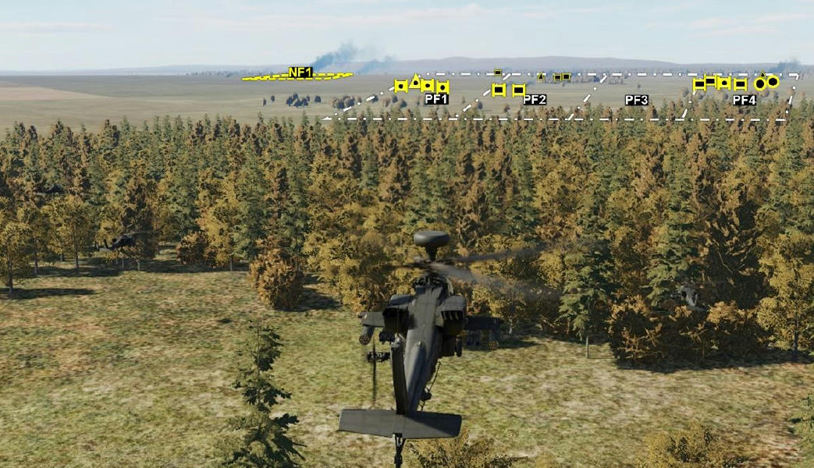

Fire zones facilitate this distribution of firepower across the battlefield by assigning specific geographic zones for
engagement by individual AH-64D’s (Priority Fire Zones; PFZ) and other geographic zones that should not be
engaged (No Fire Zones; NFZ). Priority Fire Zones and No Fire Zones may be transmitted between selected
Primary members across the datalink network, which allows flight leaders and commanders to digitize the
distribution of fires during the mission. These fire zones may be created, deleted, transmitted, or received through
the TSD. In addition, received fire zones may also be stored from the MSG REC sub-page, which is accessed from
the COM page.

When drawing Priority Fire Zones or No Fire Zones, 4-sided zones may be created by either crewmember using
several methods, ranging from simple rectangles to irregular-shaped quadrilaterals. Once drawn, PFZ’s may then
be assigned to any Primary member(s) within the selected datalink network.

Fire zones may also be individually activated or deactivated, which will affect how any FCR-equipped AH-64D’s
prioritize ground targets that are detected within those zones. (See the Fire Control Radar chapter for more
information.)

- All FCR targets detected within an activated PFZ will out-prioritize any FCR targets that are outside the PFZ.
- All FCR targets detected within an activated NFZ will not be prioritized by the FCR, even if those targets are
     also within an overlapping PFZ that is also activated. However, it should be noted that activating an NFZ will
     not prevent any targets within the zone from being engaged; it will only affect the FCR’s target prioritization
     process.

## TSD Battle Area Management (BAM) Sub-page

All functions regarding Priority Fire and No Fire Zones are performed through the BAM sub-page on the TSD. This
sub-page allows crewmembers to create or delete fire zones, activate/deactivate fire zones, assign PFZ’s to
specific Primary members, or transmit fire zones to Primary members within the selected datalink network.

### Priority Fire (PF) format

The BAM sub-page is displayed in PF format when the fire zone type (VAB L1) is set to PF. This format displays
options and controls for creating, deleting, assigning, or activating Priority Fire Zones.

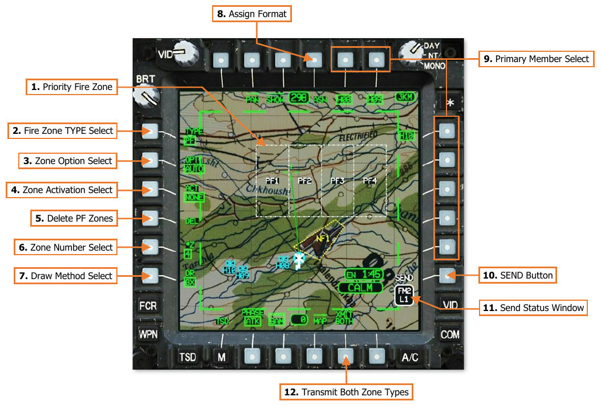

1.      **Priority Fire Zone.** Displays a geographic area in which weapons fire from the assigned Primary member
        should be concentrated at the appropriate time in battle. Up to 8 PFZ’s may be present on the TSD at any
        given time, with each zone identified with a number 1 through 8.

2.      **Fire Zone TYPE Select.** Toggles the BAM page between PF and NF formats.

3.      **Zone Option Select (OPT).** Selects the method of sub-dividing geographic areas between each Priority
        Fire Zone.

    - **AUTO.** The geographic area to encompass all PFZ boundaries is selected using the MPD cursor, which
                 is automatically subdivided into individual PFZ’s based on the number of zones selected using VAB L5.

    - **MAN.** Each individual PFZ is manually drawn using the MPD cursor, the total number of which is
                 selected using VAB L5.

    - **TRP.** Four equally sized PFZ’s are placed on the TSD by the MPD cursor in a Target Reference Point
                 quadrant pattern, with the height and width of each PFZ based on the KM value selected using VAB
                 L5. The MPD cursor will be displayed in TRP format when positioned within the TSD footprint.

4.   **Zone Activation Select (ACT).** Displays the PFZ activation menu, which allows the crewmember to
     activate any PFZ from the displayed list. When a PFZ has been activated, the border lines of the zone will
     marquee in a continuous pattern. Only one PFZ may be active at any given time.
     NOTE: Activating a PFZ will remove all zone text labels within the boundaries of the zone.

5.   **Delete PF Zones (DEL).** Deletes all Priority Fire Zones.

6.   **Zone Number Select (#Z).** Displays the zone number selection menu, which allows the crewmember to
     choose the number of PFZ’s that are drawn when OPT is set to AUTO or MAN.
     When entering the BAM sub-page, this selection will default to the number of Primary members that are
     present within the datalink network selected by the Datalink Transmit Select Indicator, plus one additional
     zone for the ownship (e.g., if there are three Primary members within the selected datalink network, the
     zone number selection will default to “4”).
     If the Datalink Transmit Select Indicator is set to a radio that is not tuned to a datalink network, or the
     selected datalink network has no subscribers designated as Primary members, the zone number selection
     will default to 1.

7.   **Draw Method Select (DR).** Selects the method of drawing Priority Fire Zones using the MPD cursor.

    - **Box (BX).** A rectangular-shaped zone will be drawn based on the alignment of the TSD. The first
          Cursor-Enter command using the MPD cursor will establish the first corner, and the second Cursor-
          Enter command will establish the opposing corner.

    - **Line (LN).** A custom quadrilateral-shaped zone may be drawn independent of the alignment of the
          TSD. Each Cursor-Enter command using the MPD cursor establishes the next corner of the zone in
          sequence.

8.   **Assign format (ASN).** Displays the Priority Fire Assign format.

9.   **Primary Member Select.** Displays a list of Primary members within the selected datalink network that
     may be selected to receive the PF Zone file. Each entry within the list is generated from the Callsigns of
     Primary members as displayed on the NET sub-page, truncated to the last three alphanumeric characters.
     For example, “DH08” is displayed as “H08” within the Primary member list on the TSD page.
     If the Datalink Transmit Select Indicator is moved to a different datalink network on the EUFD, the Primary
     member list will update to reflect the Primary members within the selected datalink network. If the Datalink
     Transmit Select Indicator is moved to a radio that has not been tuned to a preset with a datalink network,
     or that network contains no Primary members, no callsigns will be displayed within the Primary member list.

10. **SEND Button.** The SEND button is displayed on the PF format when at least one PFZ is present on the
    TSD, the Datalink Transmit Select Indicator is set to a radio that has been configured for transmitting digital
    messages, and at least one Primary member has been selected to receive it.

11. **Send Status Window.** Displays the radio and datalink network over which the zone(s) will be
    transmitted.

12. **Transmit Both Zone Types (XMIT BOTH).** The XMIT BOTH button is displayed on the BAM sub-page
    when at least one PFZ and one NFZ is present on the TSD. When selected, pressing the SEND button will
    simultaneously transmit the PF Zone and NF Zone files to the selected Primary member(s).

### No Fire (NF) format

The BAM sub-page is displayed in NF format when the fire zone type (VAB L1) is set to NF. This format displays
options and controls for creating, deleting, or activating No Fire Zones.

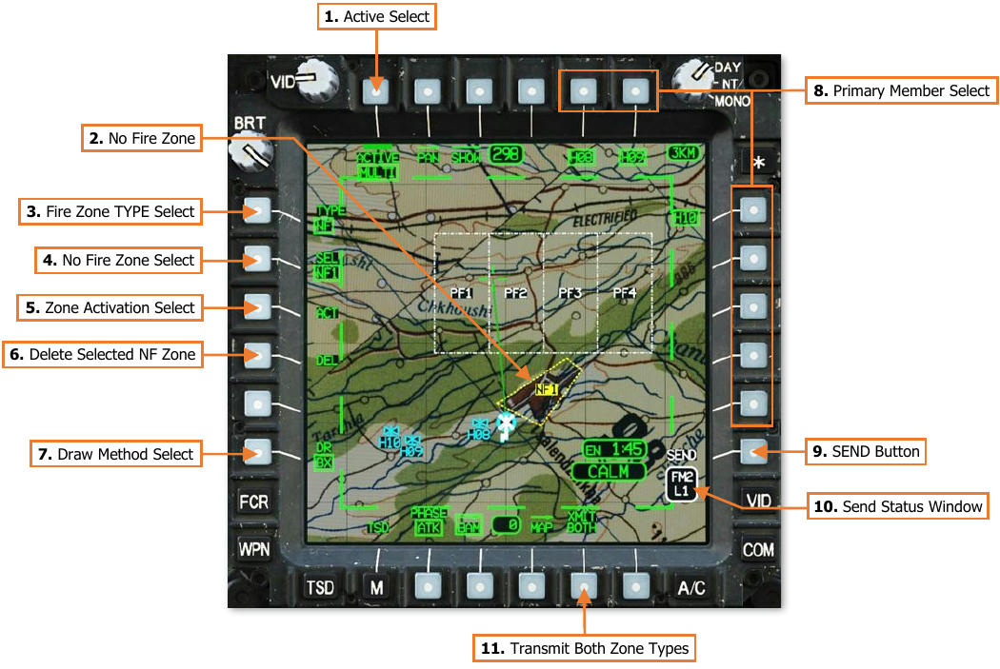

1.     **Active Select.** No function.

2.     **No Fire Zone.** Displays a geographic area in which weapons fire is prohibited during the battle. Up to 8
       NFZ’s may be present on the TSD at any given time, with each zone identified with a number 1 through 8.

3.     **Fire Zone TYPE Select.** Toggles the BAM page between PF and NF formats.

4.     **No Fire Zone Select (SEL).** Displays the NFZ selection menu, which allows the crewmember to select
       individual No Fire Zones for drawing, deleting, or activating/de-activating the selected zone. Any number of
       NFZ’s may be active at any given time.

5.     **Zone Activation Select (ACT).** Activates/Deactivates the NFZ selected using VAB L2. When a NFZ has
       been activated, the border lines of the zone will marquee in a continuous pattern.

6.     **Delete Selected NF Zone (DEL).** Deletes the NFZ selected using VAB L2.

7.     **Draw Method Select (DR).** Selects the method of drawing No Fire Zones using the MPD cursor.

    - **Box (BX).** A rectangular-shaped zone will be drawn based on the alignment of the TSD. The first
              Cursor-Enter command using the MPD cursor will establish the first corner, and the second Cursor-
              Enter command will establish the opposing corner.

    - **Line (LN).** A custom quadrilateral-shaped zone may be drawn independent of the alignment of the
              TSD. Each Cursor-Enter command using the MPD cursor establishes the next corner of the zone in
              sequence.

8.   **Primary Member Select.** Displays a list of Primary members within the selected datalink network that
     may be selected to receive the NF Zone file. Each entry within the list is generated from the Callsigns of
     Primary members as displayed on the NET sub-page, truncated to the last three alphanumeric characters.
     For example, “DH08” is displayed as “H08” within the Primary member list on the TSD page.
     If the Datalink Transmit Select Indicator is moved to a different datalink network on the EUFD, the Primary
     member list will update to reflect the Primary members within the selected datalink network. If the Datalink
     Transmit Select Indicator is moved to a radio that has not been tuned to a preset with a datalink network,
     or that network contains no Primary members, no callsigns will be displayed within the Primary member list.

9.   **SEND Button.** The SEND button is displayed on the NF format when at least one NFZ is present on the
     TSD, the Datalink Transmit Select Indicator is set to a radio that has been configured for transmitting digital
     messages, and at least one Primary member has been selected to receive it.

10. **Send Status Window.** Displays the radio and datalink network over which the zone(s) will be
    transmitted.

11. **Transmit Both Zone Types (XMIT BOTH).** The XMIT BOTH button is displayed on the BAM sub-page
    when at least one PFZ and one NFZ is present on the TSD. When selected, pressing the SEND button will
    simultaneously transmit the PF Zone and NF Zone files to the selected Primary member(s).

## Drawing Fire Zones

Fire zones may be placed on the TSD by either crewmember using several options and draw methods that are
selected from the BAM sub-page. The creation of Priority Fire Zones may be Automatic, Manual, or placed around
a central TRP, but each No Fire Zone must be individually selected and drawn. However, PFZ’s and NFZ’s may
both be drawn using either the Box (BX) or Line (LN) methods.

When using the Line method to draw PFZ’s or NFZ’s, a line will not be accepted if placed in such a way that it
crosses an existing line of the same zone. For example, an hourglass-shaped zone cannot be created.

**AUTO PFZ Option.** The geographic area to encompass all PFZ boundaries is selected using the MPD cursor,
which is automatically subdivided into individual PFZ’s based on the number of zones selected using VAB L5.

If the Box method is used to
draw the PFZ’s, the MPD
cursor designates the two
opposing corners of the PFZ
area. If the Line method is
used to draw the PFZ’s, the
MPD cursor designates each
corner in sequence, with the
total area sub-divided based
on the vector of the first line
drawn.

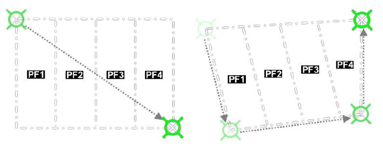

**MAN PFZ Option.** Each individual PFZ is manually drawn using the MPD cursor, the total number of which is
selected using VAB L5.

If the Box method is used to
draw the PFZ’s, the MPD
cursor designates the two
opposing corners of each PFZ.
If the Line method is used to
draw the PFZ’s, the MPD
cursor designates each corner
in sequence. The next zone is
then drawn in the same
manner until all zones are
drawn.

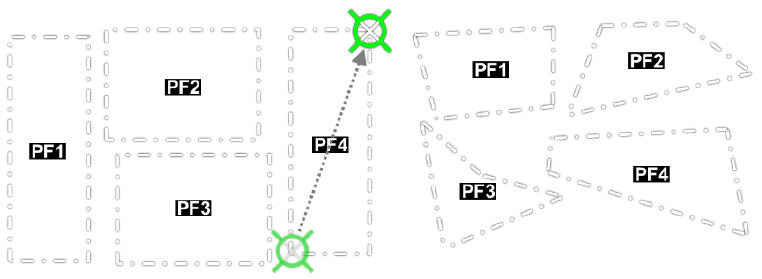

**TRP PFZ Option.** Four equally sized PFZ’s are placed on the TSD by the MPD cursor in a Target Reference Point
quadrant pattern, with the height and width of each PFZ based on the KM value selected using VAB L5.

The MPD cursor will be displayed in TRP format when
positioned within the TSD footprint. The size of the
MPD cursor’s TRP outline will be dynamically sized
based on the selected TRP size and the current TSD
scale. The MPD cursor designates the center of the
TRP, after which four equally sized square PFZ’s are
created.

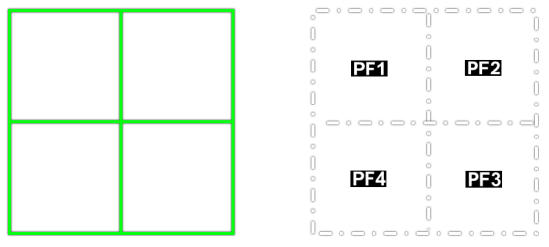

**Selected NFZ.** Each individual NFZ is selected and manually drawn using the MPD cursor.

If the Box method is used to draw the NFZ, the
MPD cursor designates the two opposing corners
of the selected NFZ. If the Line method is used to
draw the NFZ, the MPD cursor designates each
corner in sequence.

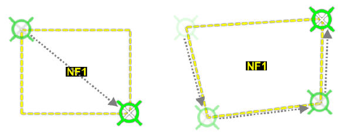

### Drawing Priority Fire Zones

To draw a Priority Fire Zone on the TSD,
perform the following:

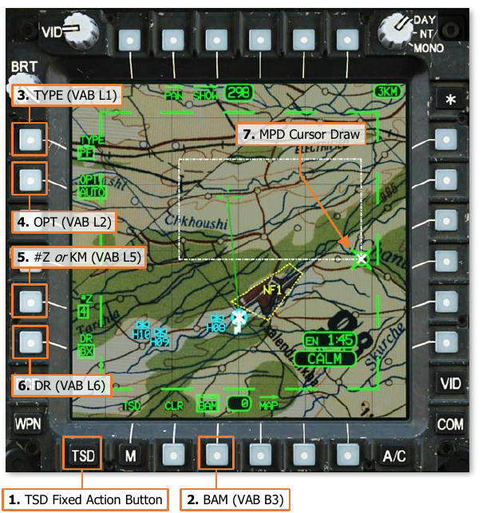

1.   TSD Fixed Action Button – Press.
2.   BAM (VAB B3) – Select.                   
3.   TYPE (VAB L1) – Set to PF.               
4.   OPT (VAB L2) – Select AUTO, MAN, or
     TRP as desired.
5.   \#Z (VAB L5) – Select desired number of   
     zones if OPT is set to AUTO or MAN.

    or

    KM (VAB L5) – Select zone size (in
     kilometers) if OPT is set to TRP.

6.   DR (VAB L6) – Select BX or LN as desired.
7.   MPD Cursor Controller/Enter – Draw each
     zone in sequence as necessary.

If a zone is being drawn while the OPT is set to MAN or AUTO, and the crewmember wishes to undo any previous
cursor actions for the zone being drawn, CLR (VAB B2) may be pressed to remove each previous cursor action in
sequence.

Once the zone(s) are drawn, ASN (VAB T4), ACT (VAB L3), and DEL (VAB L4) will be displayed, allowing the
crewmember to assign or activate PFZ’s, or delete all PFZ’s from the TSD.

### Drawing No Fire Zones

To draw a No Fire Zone on the TSD, perform
the following:

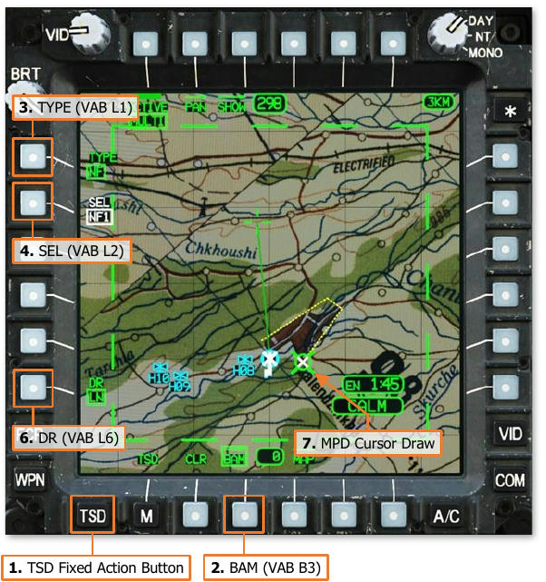

1.   TSD Fixed Action Button – Press.
2.   BAM (VAB B3) – Select.                   
3.   TYPE (VAB L1) – Set to NF.
4.   SEL (VAB L2) – Select.
5.   Zone Select (VAB T1, T2, L1-L6) – Select
     an empty (white) zone as desired.        

    !!! note
        Drawn NF Zones will be displayed
        in green. NF Zones that have not been
        drawn will be displayed in white.

6.   DR (VAB L6) – Select BX or LN as desired.
7.   MPD Cursor Controller/Enter – Draw the
     zone as necessary.                       

    If a zone is being drawn and the crewmember
wishes to undo any previous cursor actions,
CLR (VAB B2) may be pressed to remove each
previous cursor action in sequence.

    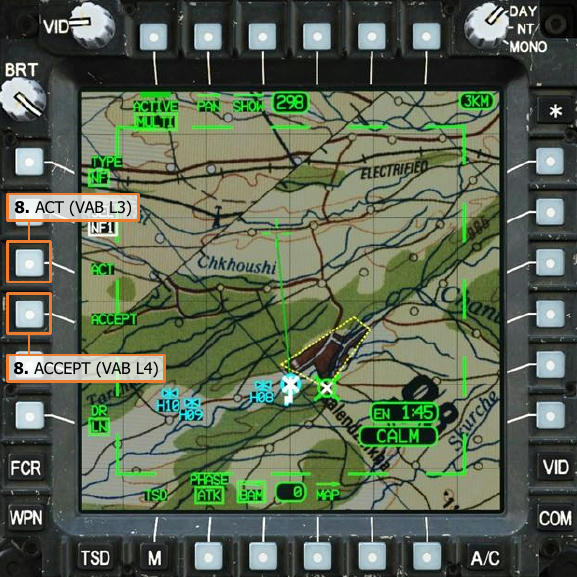

8.   ACT (VAB L3) – Select to accept and
     activate the NFZ.

    or

    ACCEPT (VAB L4) – Select to accept but
     not activate the NFZ.

    Once the zone is accepted by pressing ACT or
ACCEPT, DEL (VAB L4) will be displayed,
allowing the crewmember to delete the
selected NFZ from the TSD.

## Assigning Priority Fire Zones

Each Priority Fire Zone may have up to two Primary members within the selected datalink network assigned;
however, each Primary member may only be assigned to one zone. Once a Primary member is assigned to a PFZ,
the corresponding callsign will be removed from the Assign Primary Member options at VAB T5, T6, and R1-R5
when any other PFZ is selected. Likewise, once the ownship is assigned to a PFZ, OWN will be removed from VAB
B6 when any other PFZ is selected. If the ownship or a Primary member is to be assigned to a different zone, the
PFZ to which they are already assigned must be selected and their callsign subsequently de-selected to remove
the assignment from that zone. This will return their callsign, or the ownship, to the list of Primary members that
may then be assigned to any PFZ.

When the PF Zone file is transmitted to the corresponding Primary members across the datalink, an aircrew’s
assigned PFZ will be annotated with “OWN” within their respective cockpit.

### Priority Fire Assign (ASN) format

The BAM sub-page is displayed in ASN format when the Fire Zone TYPE (VAB L1) is set to PF and ASN (VAB T4)
is selected. This format displays options for assigning Priority Fire Zones to Primary members or the ownship.

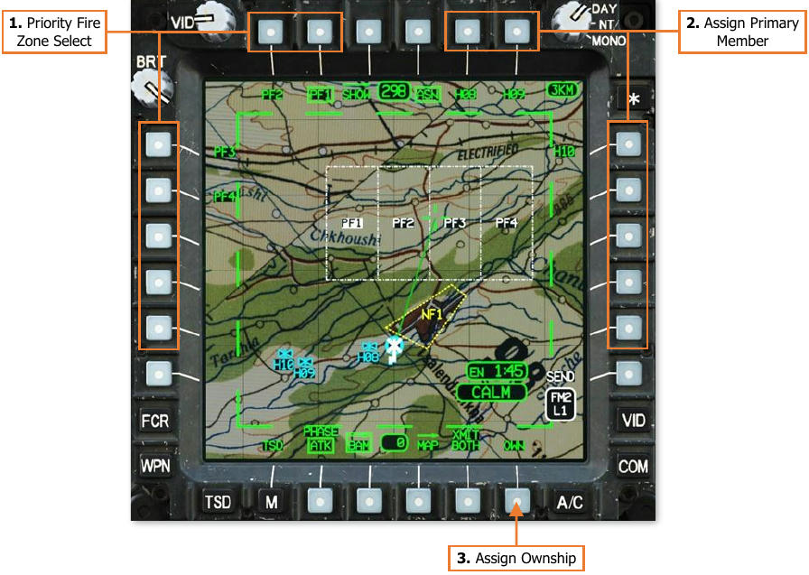

1.   **Priority Fire Zone Select.** Selects the corresponding PFZ for assigning the ownship and/or a Primary
     Member. The text label for the currently selected PFZ will be displayed in inverse video. When an assignment
     has been made, the next PFZ will be automatically selected in sequence.

2.   **Assign Primary Member.** Displays a list of Primary members within the selected datalink network that
     may be assigned to the currently selected PFZ.

3.   **Assign Ownship (OWN).** Assigns the ownship to the currently selected PFZ.

## Sending Fire Zones

Sending fire zones across the datalink is performed through the BAM sub-page of the TSD. Crewmembers may
send Priority Fire Zones, No Fire Zones, or all fire zones to any Primary member(s) within the selected datalink
network. When transmitting the PF Zone file, all PFZ’s will be transmitted from the ownship to the selected
Primary members, which will overwrite all PFZ data on the receiving aircraft’s TSD. Likewise, when transmitting
the NF Zone file, all NFZ’s will be transmitted from the ownship to the selected Primary members, which will
overwrite all NFZ data on the receiving aircraft’s TSD.

When the PF or NF Zone data is overwritten in the receiving aircraft, all PFZ’s and/or NFZ’s will be synced to the
state of the BAM sub-page in the transmitting aircraft at the time the PF Zone or NF Zone files were transmitted,
to include the shape and location of each zone, whether each zone is active or inactive, and the assignments to
each PFZ. This data overwrite ensures that the fires distribution plan is updated across the entire AH-64D team
and that each aircraft shares the same fire zone state.

To transmit fire zones, ensure the EUFD
Datalink Transmit Select Indicator is set to the
datalink network over which the transmission
is intended, and then perform the following:

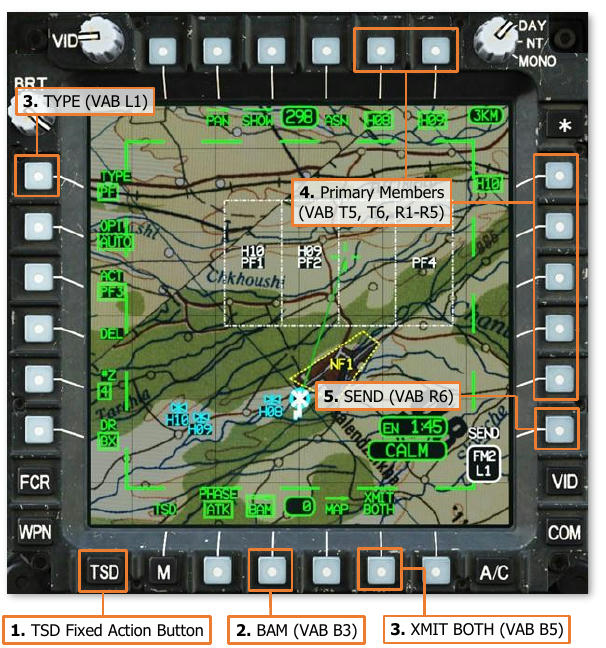

1.   TSD Fixed Action Button – Press.
2.   BAM (VAB B3) – Select.                     
                                                
3.   TYPE (VAB L1) – Set to PF or NF, if
     intending to send only one type of zones.

    or

    XMIT BOTH (VAB B5) – Select, if
     intending to send both types of zones.

4.   Primary Member(s) (VAB T5, T6, R1-R5) – Select as desired.

5.   SEND (VAB R6) – Press.

Once SEND (VAB R6) is pressed, the SEND
text label will be displayed in inverse video as
the transmission is performed to each Primary
member that is selected to receive the
zones(s). When the transmission is complete,
the SEND text label will revert to normal video.

If an acknowledgement of receipt is not received from any Primary member selected to receive the zone(s), a
“XMIT NAK” advisory will be displayed on the EUFD.

## Receiving Fire Zones

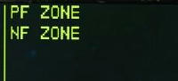

When fire zones have been received through the datalink, the EUFD will display an
advisory indicating the type of zone(s) received. These advisories will be accompanied
by an audio ring tone, prompting the aircrew to access the MSG REC sub-page or the
TSD Receive List to store the received fire zones.

Any time a datalink message intended for
Primary members is received, the aircrew
within the receiving aircraft may store the
contents of the message by selecting the COM
page and then the MSG REC sub-page, or they
may store it directly from the TSD. A white 
REC option will be displayed at VAB L2, which
will open the TSD Receive list.

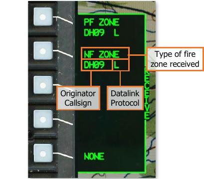

The Receive list will display the four most
recent datalink messages that have not
already been stored (excluding text messages
and mission files). Each entry will include the
type of data that has been sent within the
message, the originator callsign that sent the
message, and the modem protocol through 
which it was received.

In the example on this page, PF and NF Zones
were received from “DH09” through the
DATALINK protocol, indicated by an “L”.

To store fire zones within the database,
perform the following:

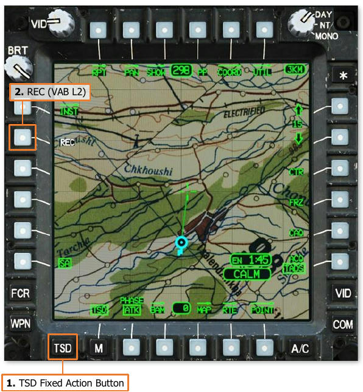

1.   TSD Fixed Action Button – Press.
2.   REC (VAB R2) – Select to display the
     Receive list.
3.   Datalink message (VAB L2-L5) – Select.

    or

    NONE (VAB L6) – Select to close the
     Receive list without storing a message.
