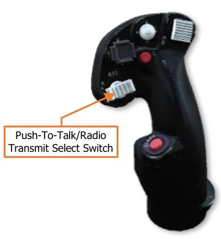
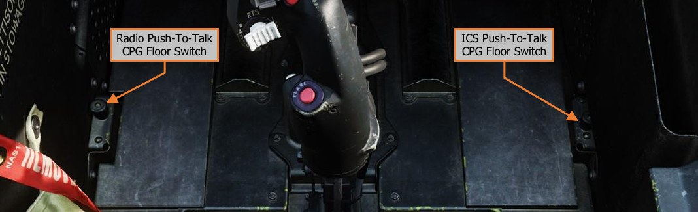
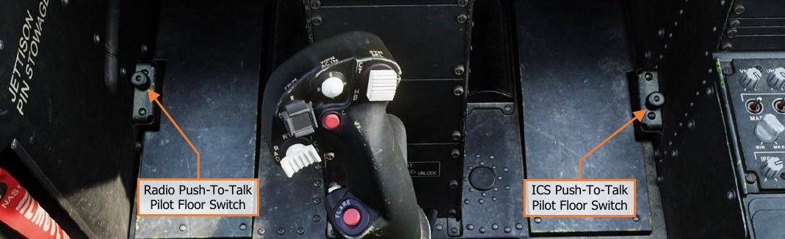

# RADIO HAND CONTROLS

Either crewmember may transmit over any radio, using either the PTT/RTS switch on the cyclic grip or the left
floor-mounted foot switch.

## Cyclic & Collective Controls

The Pilot and Copilot/Gunner Cyclic Grips include identical controls for radio
selection and transmission.

Pressing the switch to the left transmits over the crewmember’s selected
radio. Pressing the switch to the right transmits over the ICS between the
two crewstations (and ground crews). Depressing the PTT/RTS switch
inward advances the EUFD Radio Transmit Select Indicator for the
crewstation to the next radio in sequence.

## Foot Controls

The Pilot and Copilot/Gunner crewstations include floor-mounted foot switches for radio and ICS transmission.
Pressing the left floor switch transmits over the crewmember’s selected radio. Pressing the right floor switch
transmits over the ICS between the two crewstations (and ground crews).

{!abbr.md!}
{!dev-docs/ah64d/abbr.md!}
{!docs/ah64d/abbr.md!}
