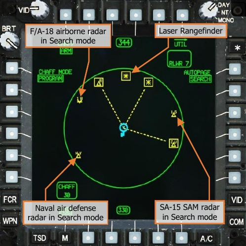
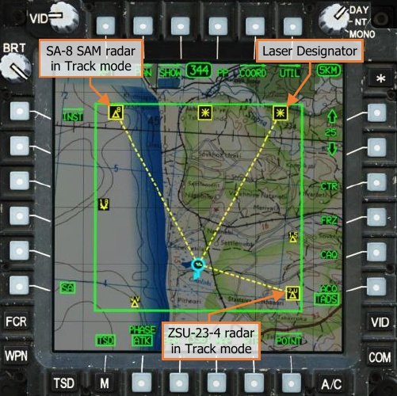
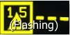

# RADAR & LASER SIGNAL DETECTING SETS

The AN/APR-39A(V)4 provides detection of threat radar emissions by using a series of external antennas to
passively detect and identify radar signals. The AN/AVR-2A provides detection of threat laser emissions by using
a series of external detectors to passively detect and classify laser sources. As the combined RLWR system, the
APR-39 and AVR-2 provide threat indications to the aircrew by displaying threat symbols on the TSD and ASE
pages. In addition, the RLWR generates audio voice warnings describing the type of threat, threat direction, and
what mode the radar or laser is operating, allowing the crew to remain focused outside for obstructions to flight
or searching for enemy targets.

Like the TSD, the ASE page provides a singular footprint for the combined indications of the RLWR and RFI (if
equipped with an FCR mast-mounted assembly). The display is an azimuth-only top-down display, with RLWR
threat symbols displayed within the inside of the ASE footprint. The nature of the threat is indicated by the type
of symbol and label, and the severity of the threat is indicated by enhancements placed around the symbol itself.

ICON|DESC
-----------------------------|----------------------------------------
|**New threat detected.** A new radar or laser threat is displayed in a bolded symbol format for 3 seconds following initial detection.
|**Radar in Search mode.** A radar signal in search mode.                           
|**Radar in Track mode.** A radar signal in target tracking mode.                  
|**Radar in Launch mode.** A radar signal   in missile guidance mode.              
|**Fixed-Wing Radar.** A radar signal identified as an airborne platform.
|**Laser Rangefinder.** A laser source emitting in a range-finding mode.
|**Laser Designator.** A laser source emitting in a target designation mode.
|**Laser Beam-Rider.** A laser source emitting in a beam-riding guidance mode.
|**Threat signal lost.** A threat that is no longer detected will be displayed in partial intensity for 10 seconds before being removed from the RLWR “footprint”.

