# DATALINK COMMUNICATIONS

The AH-64D utilizes a secure, modem-based datalink (SMDL) to send and receive targeting data, tactical reports,
text messages, and mission files amongst other AH-64D’s within the team. The modem traffic is relayed as
discreet microbursts of data across the helicopters’ radios, which allows multiple datalink networks to be tuned
simultaneously; one network across each radio.

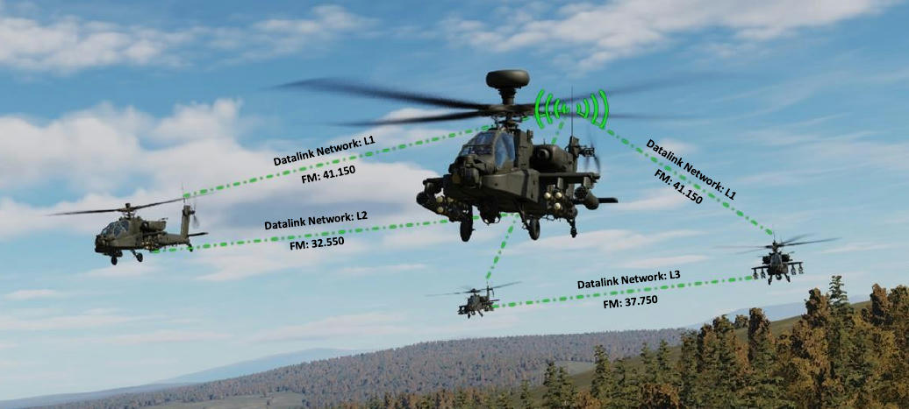

As envisioned for use on the modern battlefield, AH-64D teams are employed as tactical maneuver units in a
combined arms scenario alongside friendly infantry, armor, and artillery echelons. In such scenarios,
communications are not only critical to the success of the mission but are also multi-tiered to coordinate with the
various other air and ground forces operating in the same area of operations. This can impose significant
command and control challenges on unit commanders when coordinating the movements and actions of large
formations of attack helicopters; the challenges of which are exacerbated when performed by aircrews that are
simultaneously operating at extremely low altitudes, especially at night.

These challenges in command and control can be mitigated by employing semi-automated and direct exchanges
of data between AH-64D team members to reduce voice traffic and increase the efficiency of distributing tactical
information. Several tactical report formats are available to AH-64D aircrews in exchanging targeting data, fires
distribution, battle damage assessments, position updates, and status of onboard fuel and munitions. In addition,
individual points or entire mission files may be transmitted across the datalink to synchronize information
displayed on the TSD of each AH-64D as battlefield conditions evolve or as changes in mission occur in real-time.

Datalink messages may be transmitted between AH-64D Team members and Primary members within a datalink
network. Up to 16 aircraft may be present within a network, with 15 network members in each aircraft’s network
list and the 16th aircraft being the ownship.

**Team members.** Team members receive text messages and mission files. These messages coordinate team
actions and movements and distribute mission updates across the entire team of AH-64D’s on a datalink network.

**Primary members.** Primary members receive tactical reports, targeting data, fires distribution, and individual
TSD points. These messages coordinate tactical actions of individual companies and platoons of AH-64D’s.

## Secure Modem Datalink (SMDL) Network

A datalink network consists of multiple AH-64D network members transmitting and receiving data messages
between each aircraft by assigning unique identification numbers within each data message, one for the message
originator and one for the message subscriber.

When a data message is transmitted across the radio frequency that all network members are tuned, the modems
onboard each aircraft receive the data message and compare the message’s subscriber ID(s) with those that are
assigned to their aircraft. If the subscriber ID within the message matches their ownship ID number, the modem
stores the message within the modem buffer and notifies the crew via advisories on the EUFD. The originator ID
within the message is correlated with the matching ID number of a network member and the corresponding
callsign of the sender is displayed to the crew receiving the message. If the subscriber ID within the message
does not match their ownship ID number, the modem rejects the message without crewmember interaction.

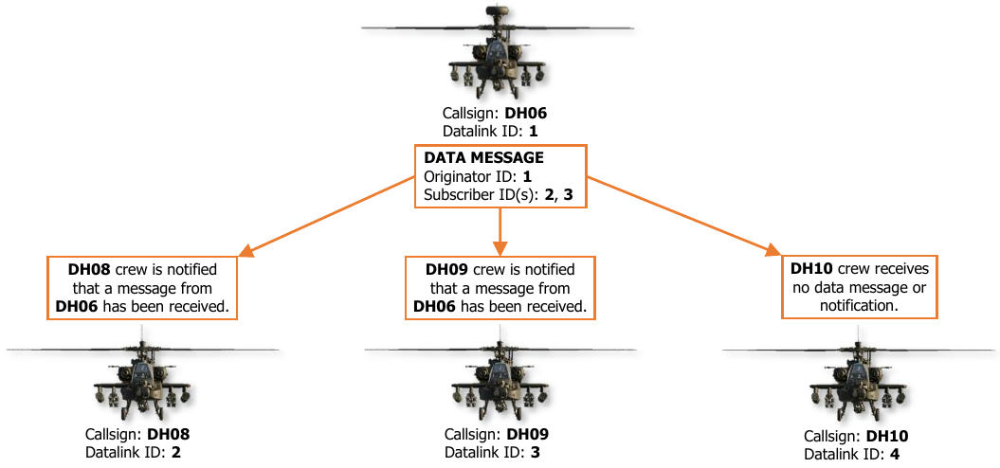

Each network may consist of 16 network members, containing 15 subscribers in addition to the ownship. Any of
the 15 subscribers may be set as a Team member, a Primary member, or both; however, a maximum of 7
subscribers within each network may be designated as a Primary member. The designation of a subscriber as
Team or Primary determines the type of data messages the member may receive from the ownship.

**Team Messages (COM page)**

Command and control, and mission updates.                    

- TEXT Text messages                                      
- CURRENT MISSION Mission files residing in               
     the aircraft memory                                     
- MISSION 1 Mission 1 files residing on the DTC           
- MISSION 2 Mission 2 files residing on the DTC           
     (Data Transfer Cartridge)                               
                                                             
**Primary Messages (TSD and FCR pages)**

Targeting, fire control, and status reports.

- BDA Battle Damage Assessment reports
- TGT FCR Target reports
- PP Present Position reports
- FARM Fuel/Ammo/Rockets/Missiles reports
- PFZ/NFZ Priority Fire Zones/No Fire Zones
- POINT Individual TSD Point transmissions
- RFHO FCR RF Target Handover

The designation of network subscribers as Team or Primary members are uniquely defined by each individual
network member, and only affect outgoing data messages from the ownship. For example, the aircrew in DH06
may designate each of the remaining three aircraft as Team members within their cockpit for sending text
messages to the entire flight platoon, but each of the other three aircrews may have designated DH06 as the
sole Team member within each of their respective cockpits for sending text messages back to the flight leader.

Each Preset on the COM page may be configured with independent network and modem settings, to include
unique frequencies, network subscribers, and Team and Primary designations. If a preset has been configured
for network protocols, the network associated with that preset will be designated by a letter indicating the type
of protocol, and a number corresponding with the preset number. Only presets 1 through 8 may be configured
with DATALINK protocol on the MODEM sub-page, which is indicated by an “L” on the COM page and EUFD.

In the example below, Presets 1, 2, and 3 have been configured for DATALINK protocol, and the networks
associated with each preset have been configured with unique lists of network subscribers on the NET sub-page.
Preset 1 includes each aircraft within the entire flight platoon, while Presets 2 and 3 only include subscribers from
each individual Air Weapons Team (AWT) within the flight platoon; Red Team and White Team.

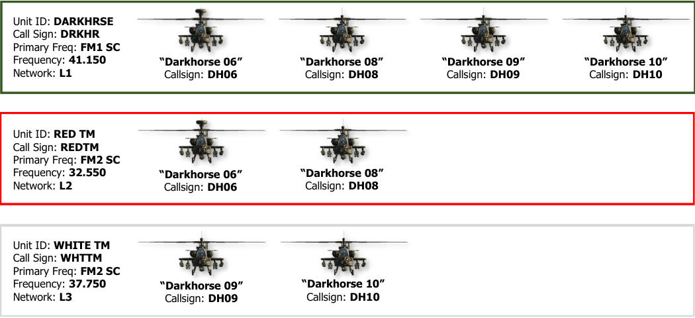

Since each preset can include a unique network configuration, and a different preset may be tuned to each radio,
it is possible to simultaneously tune different datalink networks for each echelon within the entire flight platoon,
with datalink messages being transmitted across the appropriate frequency for the echelon to which it pertains.

In the example below, each aircrew can communicate and exchange datalink messages with the entire flight
platoon using a common radio frequency and datalink network on the FM1 radio. However, Red Team and White
Team are using their FM2 radios to communicate and exchange datalink messages within their respective AWT’s;
with each AWT utilizing a separate radio frequency and datalink network.

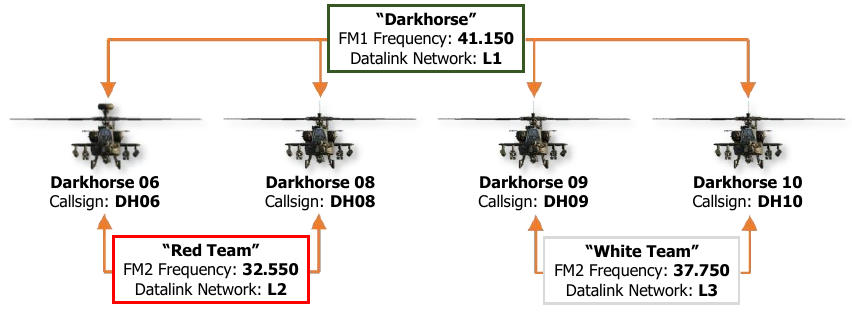

## Datalink Controls

The AH-64D’s datalink modem utilizes the same radio equipment that is used for voice communications to relay
data between other aircraft within the AH-64D team. As such, datalink networks are tuned in the same manner
as tuning a radio to a [communications preset](comm.md#communications-architecture). However, unlike voice transmissions, the datalink can only function
when a radio has been tuned to a preset, which allows the modem to send and receive datalink messages across
the network associated with that preset. If a radio is manually tuned to a frequency, datalink messages cannot
be transmitted or received across that radio, even if tuned to the same frequency of an existing datalink network.

### EUFD Controls

The Enhanced Up-Front Display (EUFD) provides the aircrew with a consolidated location for viewing the current
configuration and datalink settings of each radio. The modem can receive datalink messages from the VHF, UHF,
FM1, and FM2 radios simultaneously, but each crewmember may only transmit datalink messages across a single
radio at any given time.

The radio through which each crewmember transmits datalink messages is independent from the radio the
crewmember has selected for voice transmissions. The Datalink Transmit Select rocker is used to select a radio
for datalink transmissions while the Radio Transmit Select rocker is used to select a radio for voice transmissions.
In the example below, the current crewstation is configured to transmit voice over the VHF radio and datalink
over the FM2 radio. The opposite crewstation is configured to transmit voice over the UHF radio and datalink
over the FM1 radio.

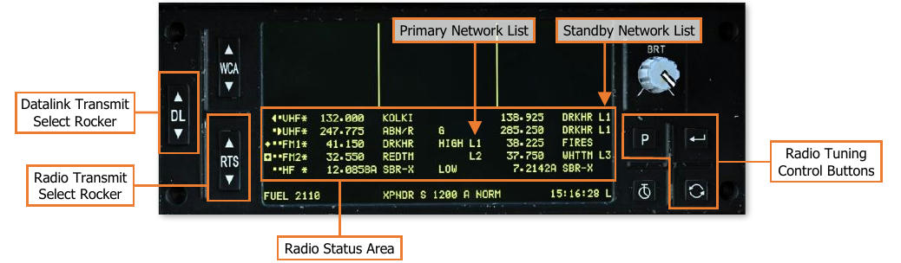

The Primary Network List displays which radios are configured to transmit and receive datalink messages, and to
which datalink network the radio has been tuned. In the example above, the modem is monitoring the FM1 radio
for datalink messages from the network associated with Preset 1 and monitoring the FM2 radio for datalink
messages from the network associated with Preset 2.

The Standby Network List displays which datalink networks are associated with the radio presets residing in the
standby slots for each radio. When considering the standby slots of each radio, the number of networks that may
be readily accessible at any given time is as follows:

- 8 datalink networks (two for each radio) may be loaded into the VHF, UHF, FM1, and FM2 radios.
- 4 datalink networks (one for each radio) may be tuned and monitored for data communications.
- 2 datalink networks (one for each crewmember) may be selected to transmit data communications,
            independently of the radios selected by each crewmember for transmitting voice communications.

If generator power is lost, crewmembers may still use the radios and the EUFD interface for voice communications
while operating on battery power, but datalink communications will not be possible.

(See [Enhanced Up-Front Display (EUFD)](eufd.md) for more information.)

#### COM Originator Identification (ORIG ID) Sub-Page

The ORIG ID sub-page allows crewmembers to review or modify the ownship’s identification settings for sending
and receiving traffic across the datalink network(s). The ownship’s ID settings may be individually edited from
this page, or they may be replaced all at once using pre-planned network member data accessed through the
Originator Directory (ORIG DIR) sub-page.

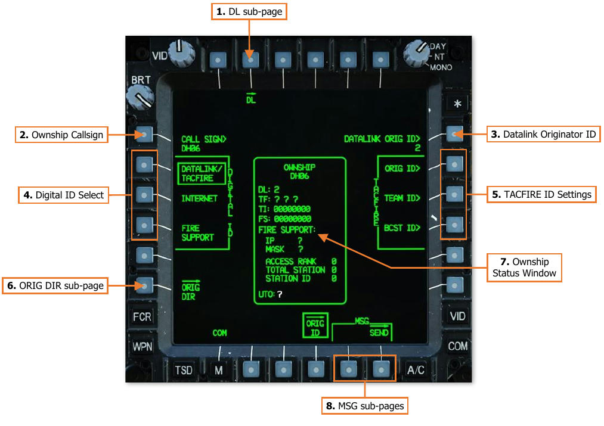

1.    **DL sub-page.** Displays the Datalink sub-page.

2.    **Ownship Callsign.** Activates the KU for inputting the originator callsign for the ownship. A minimum of 3
      and a maximum of 5 alphanumeric characters may be entered.

    !!! note
        The originator callsign is for reference only and will not affect the function of the datalink networks.

3.    **Datalink Originator ID.** Activates the KU for inputting the originator identification (ID) number which
      identifies the ownship on the datalink network. The alphanumeric character ranges that are valid for entry
      are 0-39 (with no leading zeros), A-Z, 1A-1Z, 2A-2Z, and 3A-3I; for a total of 127 unique network ID
      numbers.

    !!! note
        Each network member, to include the ownship, must have a unique ID number. If two or more
        members on the same datalink network are assigned the same identification number, erroneous behavior
        may be observed when using the datalink, or when using functions within the cockpit that are associated
        with the datalink.

4.    **Digital ID Select.** Selects a page format for configuring digital ID settings for each type of protocol.

    - DATALINK/TACFIRE. Displays digital ID settings for DATALINK or TACFIRE protocols.
    - INTERNET. Not implemented.
    - FIRE SUPPORT. Not implemented.

5.   **TACFIRE ID Settings.** Not implemented.

6.   **ORIG ID sub-page.** Displays the Originator Directory sub-page.

7.   **Ownship Status Window.** Displays the current digital ID settings of the ownship.

8.   **MSG sub-pages.** Displays Message sub-pages for sending or receiving digital messages.

    - MSG – REC. Displays the Message Receive sub-page. If no messages are present on the receive list,
           this sub-page option will not be displayed.
    - MSG – SEND. Displays the Message Send sub-page.

#### COM Originator Directory (ORIG DIR) Sub-Page

The ORIG DIR sub-page allows crewmembers to set their ownship identification settings to a pre-planned network
member entry. This directory facilitates efficient and rapid configuration of the ownship’s originator ID to
correspond to a pre-planned network identification.

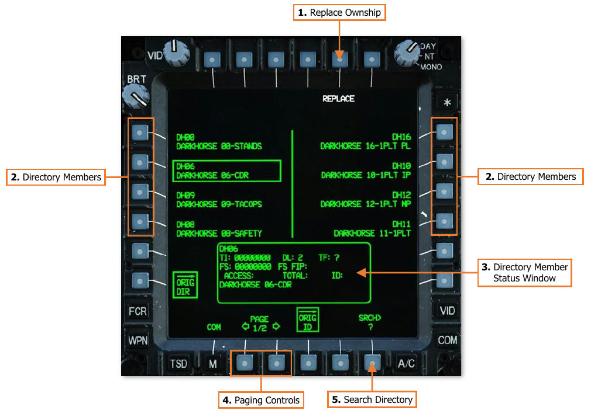

1.   **Replace Ownship.** Replaces the ownship’s digital ID settings with those of the directory member that has
     been selected for review.

2.   **Directory Members.** Selects a directory member for review within the Directory Member status window.

3.   **Directory Member Status Window.** Displays the callsign and digital ID settings of the selected directory
     member.

4.   **Paging Controls.** Cycles forward and back through multiple pages of the directory.

5.   **Search Directory.** Activates the KU for inputting alphanumeric characters to search for a specific member
     within the directory. Displayed members will be filtered accordingly based on the results.

#### COM Network (NET) Sub-Page

The NET sub-page allows crewmembers to review or modify the callsign and identification settings of each
member within the datalink network of the selected preset. The callsign and subscriber ID settings for each
network member may be manually edited from this page, or they may be replaced altogether using pre-planned
network member data accessed through the Member Directory (MBR DIR) sub-page.

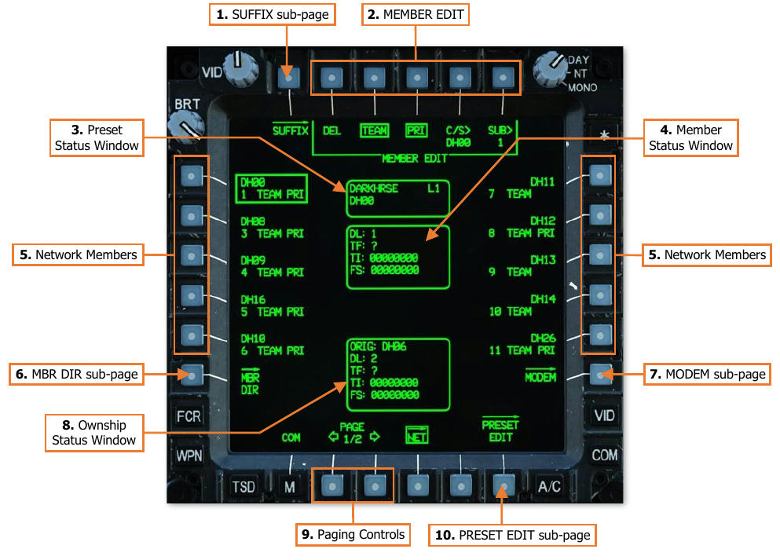

1.   **SUFFIX sub-page.** Not implemented.

2.   **MEMBER EDIT.** Displays options for editing the digital ID settings of the selected network member.

    - **MEMBER EDIT – DEL.** Deletes the network member from the preset.

    - **MEMBER EDIT – TEAM.** Designates the network member as a Team member. Any of the 15 members
             within a network may be designated as a Team member.

    - **MEMBER EDIT – PRI.** Designates the network member as a Primary member. No more than 7
             members within a network may be designated as a Primary member.

    - **MEMBER EDIT – C/S.** Activates the KU for inputting the network callsign of the member. A minimum
             of 3 and a maximum of 5 alphanumeric characters may be entered.

    - **MEMBER EDIT – SUB.** Activates the KU for inputting the subscriber identification (ID) number, which
             identifies the member on the datalink network. The alphanumeric character ranges that are valid for
             entry are 0-39 (with no leading zeros), A-Z, 1A-1Z, 2A-2Z, and 3A-3I; for a total of 127 unique network
             ID numbers.

        !!! note
            Each network member, to include the ownship, must have a unique ID number. If two or more
            members on the same datalink network are assigned the same identification number, erroneous
            behavior may be observed when using the datalink, or when using functions within the cockpit that are
            associated with the datalink.

3.   **Preset Status Window.** Displays the unit ID and modem protocol of the preset network, along with the
     callsign of the selected network member.

4.   **Member Status Window.** Displays the digital ID settings of the selected network member.

5.   **Network Members.** Selects a network member for review within the Member Status Window.

6.   **MBR DIR sub-page.** Displays the Member Directory sub-page.

7.   **MODEM sub-page.** Displays the Modem sub-page.

8.   **Ownship Status Window.** Displays the digital ID settings of the ownship.

9.   **Paging Controls.** Cycles forward and back through multiple pages of the network member list.

10. **PRESET EDIT sub-page.** Displays the Preset Edit sub-page.

#### COM Member Directory (MBR DIR) Sub-Page

The MBR DIR sub-page allows crewmembers to add new members to the network or replace existing member
entries in the network member list. This directory facilitates efficient and rapid configuration of the network
member list using pre-planned network identification data.

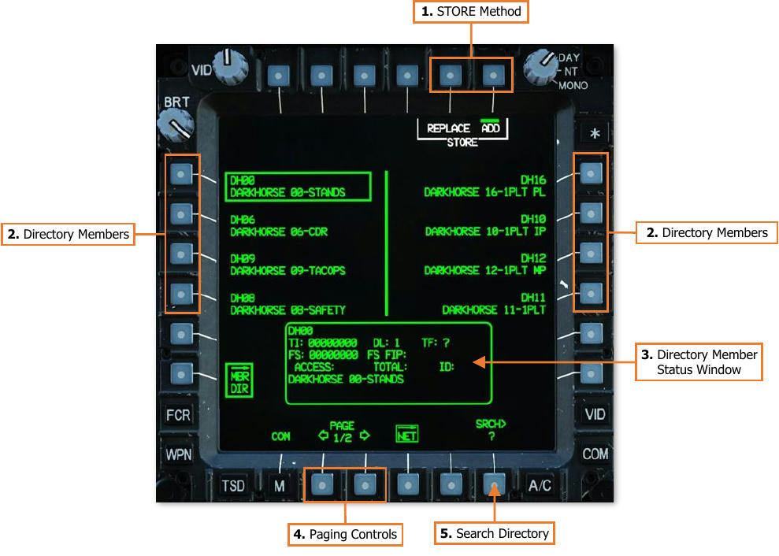

1.   **STORE Method.** Inserts the selected directory member into the selected datalink network.

    - **STORE – REPLACE.** Displays the REPLACE format of the Member Directory sub-page.

    - **STORE – ADD.** Adds the selected directory member into the first network entry is that is available. If
           the datalink network already contains 15 network members, this option will be disabled and “barriered”
           unless an existing network member is deleted from the selected datalink network.

2.   **Directory Members.** Selects a directory member for review within the Directory Member status window.

3.   **Directory Member Status Window.** Displays the digital ID settings of the selected directory member.

4.   **Paging Controls.** Cycles forward and back through multiple pages of the directory.

5.   **Search Directory.** Activates the KU for inputting alphanumeric characters to search for a specific member
     within the directory. Displayed members will be filtered accordingly based on the results.

    ##### Member Directory – Replace Format

    That Replace format of the Member Directory sub-page allows crewmembers to select an existing network
member within the current datalink network to replace with the selected directory member.

    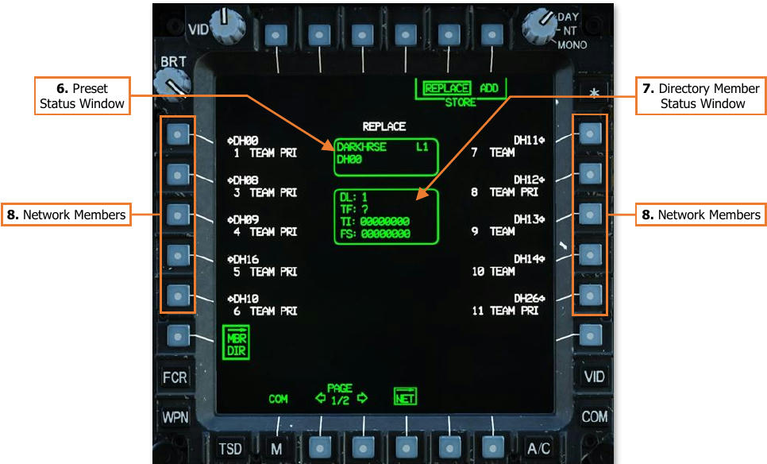

6.   Preset Status Window. Displays the unit ID and modem protocol of the preset network, along with the
     callsign of the selected directory member that will replace a selected network member.
7.   Directory Member Status Window. Displays the digital ID settings of the selected directory member
     that will replace a selected network member.
8.   Network Members. Selects an existing network member for replacement by the directory member
     displayed within the Preset Status Window, using the information displayed within the Directory Member
     Status Window.

#### COM Modem (MODEM) Sub-Page

The MODEM sub-page allows crewmembers to configure the settings the modem will utilize when sending or
receiving data through any radios tuned to the selected preset.

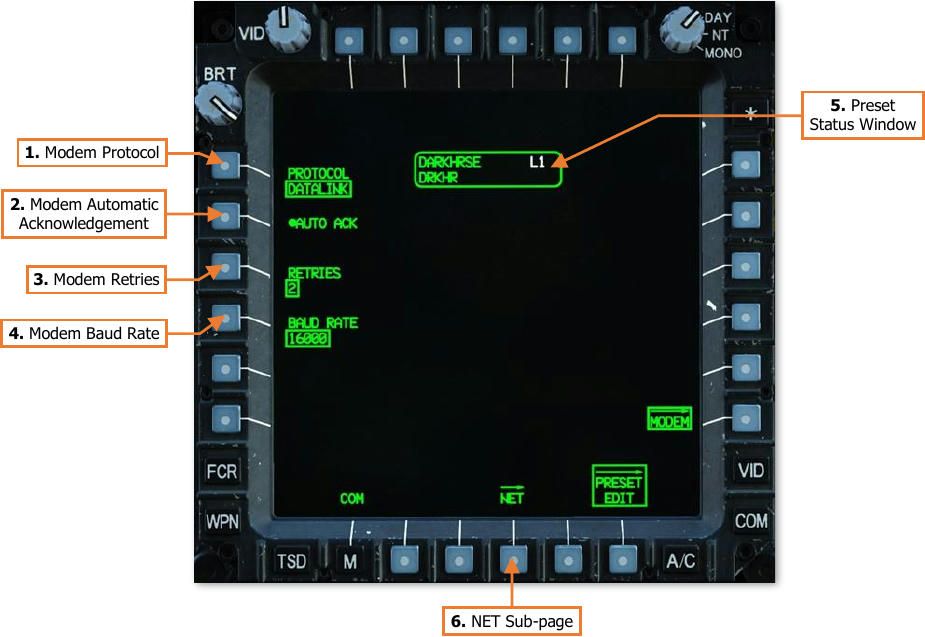

1.   **Modem Protocol.** Selects the type of protocol the modem will utilize for the selected preset.

    - **DATALINK.** DATALINK-protocol digital messages may be sent using any radio tuned to the selected
            preset. The modem will monitor any radios tuned to the selected preset for incoming digital messages
            compatible with AH-64D-only DATALINK protocols.

    - **TACFIRE.** Not implemented.

    - **INTERNET.** Not implemented.

    - **FIRE SUPPORT.** Not implemented.

    - **NONE.** Radios tuned to the selected preset cannot send digital messages. The modem will not monitor
            any radios tuned to the selected preset.

2.   **Modem Automatic Acknowledgement.** Enables/disables automatic acknowledgements by the modem.
     If a digital message is received, the modem will transmit a discreet acknowledgement to the originator ID
     of the sender that the digital message has been received by the ownship.
     NOTE: When a request for data is transmitted to a network subscriber, an “acknowledgement” from the
     subscriber’s modem only confirms the request for data was received. An acknowledgement does not contain
     the requested data, which is transmitted within a “reply”.

3.   **Modem Retries.** Selects the number of subsequent attempts the modem should transmit digital messages
     if an acknowledgement of reception is not received from any intended message recipients.
     If an acknowledgement is not received from all intended recipients following the number of selected retries,
     a “XMIT NAK” (No acknowledgement to transmission) advisory message will be displayed on the EUFD,
     indicating which radio through which the modem failed to receive all required acknowledgements. This
     advisory will be removed if the modem successfully receives acknowledgements from all intended recipients
     from a subsequent digital message transmission.
    - 0. The modem will not make additional attempts to transmit a digital message.
    - 1. The modem will make one additional attempt to transmit a digital message to any subscribers that
          did not return an acknowledgement.
    - 2. The modem will make two additional attempts to transmit a digital message to any subscribers that
          did not return an acknowledgement.

4.   **Modem Baud Rate.** Not implemented.

5.   **Preset Status Window.** Displays the unit ID, callsign, and modem protocol of the selected preset network.

6.   **NET sub-page.** Displays the Network sub-page.

### Datalink Mission Editor Options

Mission creators may configure the datalink settings for each
aircraft within the Mission Editor. These settings are located
on the Aircraft Additional Properties and Datalinks tabs.

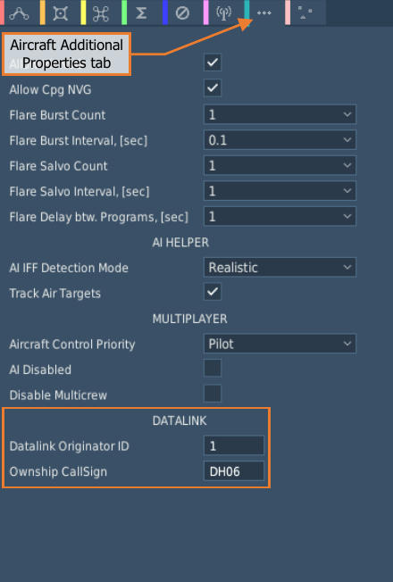

**Aircraft Additional Properties.** Allows the mission creator
to configure any remaining properties that are unique to the
aircraft type.

- **Datalink Originator ID.** The originator ID will be how
     the datalink modems of other AH-64D’s within the
     mission will recognize the aircraft when sending or
     receiving datalink messages. The alphanumeric
     character ranges that are valid for entry are 0-39 (with
     no leading zeros), A-Z, 1A-1Z, 2A-2Z, and 3A-3I; for a
     total of 127 unique network ID numbers.

    !!! note
        Each network member, to include the ownship,
        must have a unique ID number. If two or more
        members on the same datalink network are assigned
        the same identification number, erroneous behavior
        may be observed when using the datalink, or when
        using functions within the cockpit that are associated
        with the datalink.

- **Ownship Call Sign.** This data field will determine how
     the aircraft is annotated within the cockpit of other AH-
     64D’s within the mission when sending or receiving
     datalink messages. A minimum of 3 and a maximum of
     5 alphanumeric characters may be entered.

(See [ORIG ID sub-page](#com-originator-identification-orig-id-sub-page) for more information.)

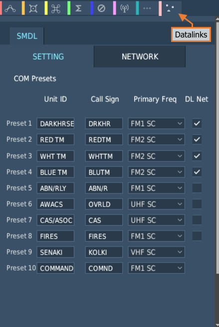

**Datalinks – SETTING tab.** Allows the mission creator to
configure the details of each preset on the COM page.

- **Unit ID.** This data field determines how the preset is
     displayed on the COM page and on the EUFD Preset list.
     Up to 8 alphanumeric characters may be entered.

- **Call Sign.** This data field determines how the preset is
     displayed on the EUFD when assigned to a radio. Up to
     5 alphanumeric characters may be entered.

- **Primary Freq.** Displays options for designating a
     primary frequency and radio for the preset. The
     corresponding entries on the COM Preset format will be
     displayed in white to highlight the intended radio and
     net with which the preset is intended to be utilized
     during the mission. The primary designation does not
     affect the function of any radio equipment or how the
     preset is assigned to a specific radio.

- **DL Net.** When checked, DATALINK protocols will be
     enabled on the MODEM sub-page for the preset.

(See [PRESET EDIT sub-page](comm.md#com-preset-edit-preset-edit-sub-page) in the Radio Communications
chapter for more information.)

**Datalinks – NETWORK tab.** Allows the mission creator to
configure the network and modem settings for each preset
on the COM page.

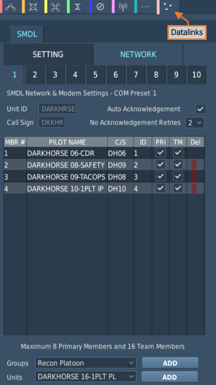

- **Preset Buttons (1-10).** Selects the corresponding
    preset with which to edit the network and modem
    settings in the table below.

- **Auto Acknowledgement.** When checked, automatic
    acknowledgements will be transmitted by the modem
    when a digital message is received across the datalink
    network associated with this preset.

- **No Acknowledgement Retries.** Selects the number
    of subsequent attempts the modem should transmit
    digital messages if an acknowledgement of reception is
    not received across the datalink network associated
    with this preset.

- **MBR #.** Displays the index of each network member
    associated with this preset. A maximum of 16 members
    may be present within each network. The ownship will
    always occupy the first entry; entries 2-16 will
    correspond with network subscribers.

- **PILOT NAME.** Displays the name of each network
    member, which corresponds to how their entries will be
    annotated within the ORIG DIR and MBR DIR sub-
    pages.

- **C/S.** Displays the Call Sign of each network member.

- **ID.** Displays the subscriber ID of each network
    member.

- **PRI.** When checked, the member will be designated as a Primary member within the datalink network
    associated with this preset. A maximum of 8 Primary members may be present within each network, with
    the ownship always included as the first entry.

- **TM.** When checked, the member will be designated as a Team member within the datalink network
    associated with this preset. A maximum of 16 Team members may be present within each network, with
    the ownship always included as the first entry.

- **Del.** When the red “trash can” icon within this column is selected, the member will be removed from the
    datalink network associated with this preset. The ownship cannot be deleted from the network.

- **Groups Selection/ADD Button.** Displays options for selecting other AH-64D BLK.II Helicopter Groups
    within the mission. Only AH-64D BLK.II Helicopter Groups that are of the same coalition and not already
    present within the displayed network will be available for selection.
    When the ADD button is pressed, all AH-64D’s within that Helicopter Group will be added to the member list
    of the displayed network.

- **Units Selection/ADD Button.** Displays options for selecting individual AH-64D BLK.II helicopters within
    the mission. Only AH-64D BLK.II helicopters that are of the same coalition and not already present within
    the displayed network will be available for selection.
    When the ADD button is pressed, the AH-64D will be added to the member list of the displayed network.

(See [NET](#com-network-net-sub-page) and [MODEM](#com-modem-modem-sub-page) sub-pages for more information.)
