# FIRE CONTROL RADAR (FCR)

## AN/APG-78 FIRE CONTROL RADAR

The AN/APG-78 is a short-range fire control radar system that utilizes a high resolution, millimeter-wave radar
antenna shrouded within an aerodynamic radome atop the AH-64D’s rotor mast. The APG-78 FCR was designed
for anti-armor missions and is optimized for detecting moving vehicles on the battlefield, but is also quite capable
of detecting stationary battlefield targets as well as low-flying aircraft.

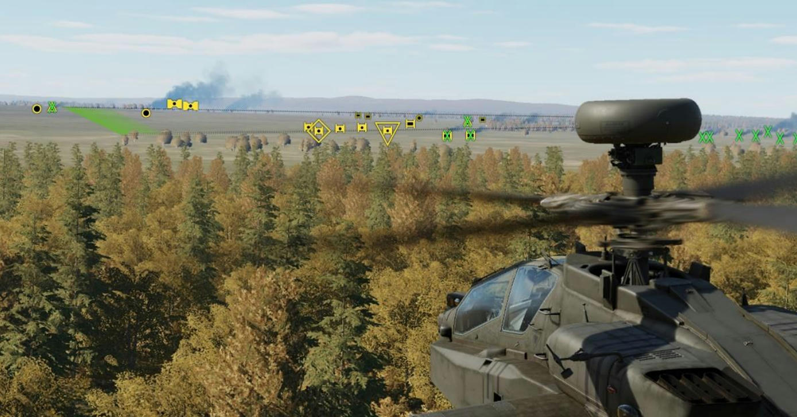

As the FCR is a sight like the HMD and the TADS, the FCR may be used to employ all three weapon systems of
the AH-64D. However, it is not capable of providing guidance to the AGM-114K laser-guided missiles and can
only provide target data to the AGM-114L radar-guided missile variants.

### FCR Activation

The FCR may be powered from the FCR Utility sub-page or
the WPN Utility sub-page (shown to the right) in either
crewstation. When powered, the FCR system will perform a
Built-In-Test (BIT) for approximately 1 minute, after which it
will be available for selection as a sight.

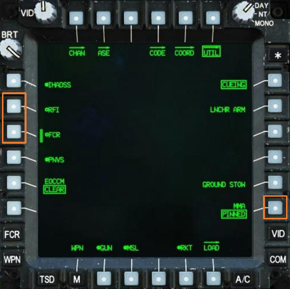

During initial start-up of the aircraft, the state of the Mast-
Mounted Assembly (MMA) on the FCR Utility or WPN Utility
sub-pages will be set to PINNED. This is to ensure that the
external pin that physically locks the MMA in place is
confirmed to be in the unlocked position prior to applying
power to the FCR. When the MMA state is toggled from
PINNED to NORM, the FCR and RFI will automatically perform
their respective power-on sequences.

While set to PINNED, FCR power will be inhibited. However,
the AN/APR-48 RFI may still be powered to provide warning
of air defense radar threats independently of FCR operation.

### Employment of the Fire Control Radar in the Battlespace

The APG-78 provides the AH-64D attack helicopter battalion with an organic “aeroscout” capability. By leveraging
the AH-64D’s datalink capabilities, multiple teams of AH-64D helicopters can be combined into a unified maneuver
force distributed across a large area, which can rapidly gain and maintain situational awareness of the battlefield.

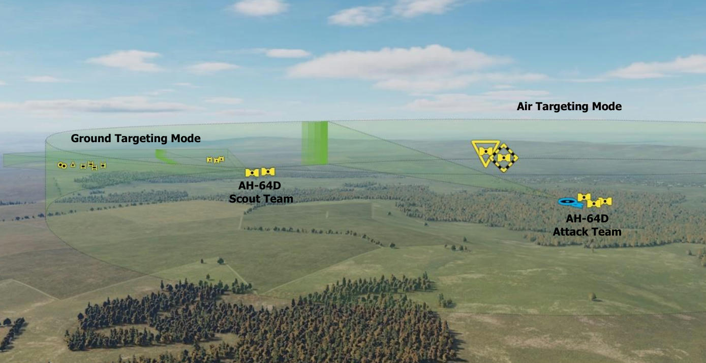

The FCR may be used for targeting, reconnaissance, or low-level obstacle avoidance using one of four modes.

**Ground Targeting Mode (GTM).** The FCR scans a 90° sector of the battlefield, processes ground and low-
flying air targets to a range of 8 kilometers, and displays targets in a PPI format.

**Radar Map Mode (RMAP).** The FCR scans a 90° sector of the battlefield, processes ground and low-flying air
targets to a range of 8 kilometers, and displays targets over a radar-generated surface map in a B-scope format.

**Air Targeting Mode (ATM).** The FCR scans 360° over the battlefield, processes air targets to a range of 8
kilometers, and displays targets in a PPI format.

**Terrain Profile Mode (TPM).** The FCR scans a 180° or 90° sector of the terrain directly in front of the aircraft
to a range of 2.5 kilometers, and displays terrain obstructions and obstacles in a PPI format.

When searching for ground targets, the FCR can scan up to 50 square kilometers of the battlefield, which could
potentially result in more targets than a single crew could prioritize themselves within a reasonable amount of
time in combat. The FCR automates the target acquisition process by detecting, classifying, and prioritizing up to
256 targets within seconds of initiating a scan using a single button push by either crewmember. The FCR will
scan the selected area of the battlefield, compare any radar signatures it detects with a library of vehicles and
aircraft, assign the appropriate target type to each processed target, and then present the 16 highest priority
targets to the crew as a “shoot list”, based on the parameters for prioritization the crew has selected.
Although the FCR may be used for autonomous targeting, it is most effective when combined with the other
sensors and data onboard the AH-64D. The automated detection and classification process allows the crew to
highlight areas of the battlefield for subsequent observation through the TADS for the purposes of target
identification. This is particularly useful in avoiding fratricide (“friendly fire”) when operating along the Forward
Edge of the Battle Area (FEBA). (See FCR Acquisition and Ranging for more information.)

### Scans and Scanbursts

Like many radar systems, the FCR antenna is mechanically steered to direct the radar beam. As the radar beam
is steered in azimuth and elevation, a given volume of 3-dimensional space may be systematically scanned by
the radar beam within each scan cycle. This is known as the FCR scan volume and may vary based on the selected
FCR mode, selected scan size, and azimuth and elevation settings within the cockpit.
The pattern in which the FCR performs each scan cycle of the FCR scan volume will also vary based on the
selected FCR mode, as either a 2-bar scan cycle or a 1-bar scan cycle.

**2-bar Scan.** When the FCR is set to Ground Targeting Mode (GTM) or Radar Map (RMAP) mode, each individual
scan cycle consists of a Near bar scan from left to right followed by a Far bar scan from right to left.

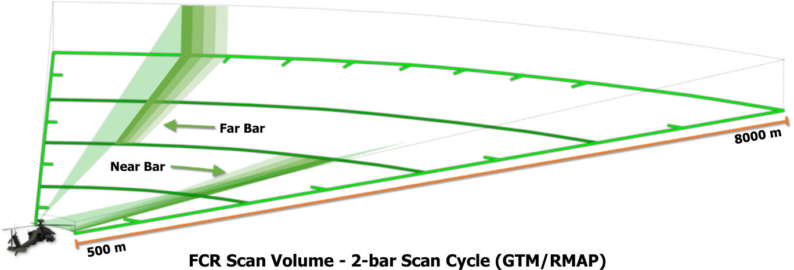

**1-bar Scan.** When the FCR is set to Air Targeting Mode (ATM) and the scan size set to Wide, a single scan cycle
consists of a 1-bar scan performed in a 360° clockwise circle around the ownship. When the FCR is set to ATM
and any other scan size is selected, or if the FCR is set to Terrain Profile Mode (TPM), a single scan cycle consists
of a 1-bar scan from left to right followed by a 1-bar scan from right to left.

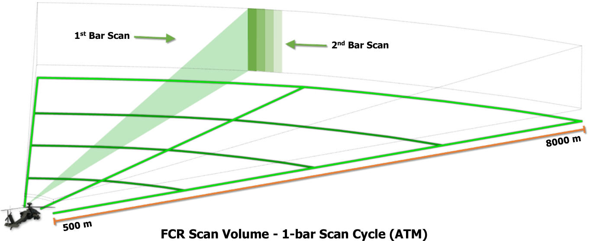

Multiple scan cycles of the entire FCR scan volume are performed sequentially in scanbursts, which may be
thought of as a series of radar-generated “photographs” of the battlespace. By processing each individual radar
scan, or “photograph”, and comparing it to the previous scans within the scanburst, the FCR is capable of
accurately correlating targets such as tanks, armored vehicles, trucks, helicopters, or fixed-wing aircraft as they
move across the battlefield or within the airspace above it. In addition, radar data correlated between each scan
allows the FCR to detect and classify stationary targets more reliably, albeit at a slightly reduced range compared
to moving targets. (See FCR Acquisition and Ranging for more information.)

As the selected sight, the FCR may be commanded to perform a single scanburst (S-SCAN) or a continuous
scanburst (C-SCAN) using the FCR Scan switch on the Collective Mission Grip or the TEDAC Left Handgrip. Each
time the FCR is commanded to perform a new scanburst, the previous radar data of the battlespace is discarded,
and new data is generated.

**Single Scanburst (S-SCAN).** Multiple scans of the FCR scan volume are performed when the FCR Scan switch
is momentarily pressed forward to the S-SCAN position. The FCR will only transmit for the duration of a single
scanburst and then automatically cease scanning. The number of scan cycles performed within a single scanburst
is dependent on the selected scan size.

- **Wide Scan Size.** 2 scans are performed within a single scanburst; unless the FCR mode is set to ATM and
     the FCR Scan Size is set Wide, in which case 1 scan will be performed within a single scanburst.

- **Medium Scan Size.** 2 scans are performed within a single scanburst.

- **Narrow Scan Size.** 3 scans are performed within a single scanburst.

- **Zoom Scan Size.** 4 scans are performed within a single scanburst.

Single scanbursts are best used in GTM, RMAP, or ATM when performing target acquisition or engagements.

**Continuous Scanburst (C-SCAN).** Multiple and continuous scans of the FCR scan volume are performed when
the FCR Scan switch is momentarily pressed aft to the C-SCAN position. The FCR will continuously transmit within
the selected scan volume until the FCR Scan switch is momentarily pressed to either position to cease scanning,
or the crewmember selects a different sight.

Continuous scanbursts are best used in ATM when performing overwatch of the local airspace; or when using
TPM to assist in avoiding obstacles and terrain at low altitude during times of darkness or low-visibility conditions.

### Azimuth and Elevation Control

The FCR’s radar beam is steered in the horizontal axis by
rotating the entire radome left and right using a pair of
azimuth servos at the base of the mast-mounted assembly
(MMA). The azimuth servo can rotate the entire MMA
independently of the de-rotation assembly on which it is
mounted through a full 360° range with no restrictions.

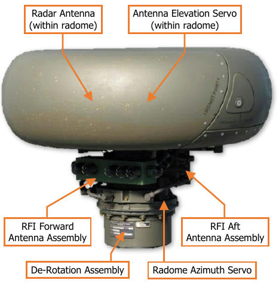

The FCR antenna itself is not directly steered in azimuth by
the aircrew. The central azimuth of the entire FCR scan
volume, known as the “FCR centerline”, is steered by either
crewmember if the FCR is the selected sight within the
respective crewstation. The FCR centerline may be slewed
up to 90° to either side of the aircraft centerline in GTM
and RMAP, or a full 360° in ATM.

When the FCR is selected as a sight in either crewstation,
or when linked to the TADS by the CPG, the azimuth servo
rotates the MMA to align the FCR antenna along the left
side of the FCR scan volume in preparation for scanning.

When the FCR is not in use by either crewmember, the MMA is aligned straight ahead, or toward the tail if FCR
STOW (VAB R3) is selected on the FCR Utility sub-page.

The FCR’s radar beam is steered in the vertical axis by mechanically adjusting the elevation of the radar antenna
itself within the radome housing. The antenna elevation may be adjusted manually in any FCR mode, or it may
be set to automatic elevation control when in GTM and RMAP, based on the current altitude above ground level
(AGL) as measured by the radar altimeter. However, the antenna elevation may not be adjusted while the FCR
is scanning in GTM or RMAP mode.

#### Pilot FCR Azimuth Controls

As the selected sight in the Pilot crewstation, the FCR centerline is automatically slaved to the Pilot’s acquisition
source. The Pilot may steer the FCR centerline using one of two methods:

- **Acquisition Source (ACQ).** The Pilot may select a different acquisition source from the ACQ selection
     menu, depending on the tactical situation. Some examples of practical use with the FCR are listed below.

    - **FXD.** The FCR centerline will be fixed forward and the Pilot may direct the FCR scan volume using
               the aircraft heading prior to initiating a scanburst.

    - **PHS.** The FCR centerline will be slaved to the Pilot’s helmet line-of-sight, allowing the Pilot to look
               in the direction of the desired scan direction and initiate a scanburst.

    - **TRN.** The FCR centerline will be slaved to a fixed geographical location on the TSD. The Pilot may
               press CAQ (VAB R5) on the TSD page, cursor-select a map location on the TSD itself, and initiate
               a scanburst to scan that area of the battlefield (if the location is within the FCR’s scanning range).

    (See Acquisition Sources for more information.)

- **Centerline Steering Arrows.** The Pilot may utilize the Centerline Steering Arrows on the FCR page to
     rotate the FCR scan volume left and right. If the Centerline Steering Arrows are used to rotate the FCR
     centerline, the FCR will be de-slaved from the Pilot’s Acquisition source and will be stabilized relative to the
     aircraft heading.

     The Pilot may re-enable Slave using either of the following methods:

    - Selecting any acquisition source from the ACQ selection menu, even if the current acquisition
               source is re-selected.
    - Selecting HMD as the sight using the Sight Select switch on the Collective Mission Grip.

#### CPG FCR Azimuth Controls

As the selected sight in the CPG crewstation, the FCR centerline may be selectively slaved to the CPG’s acquisition
source or manually steered using one of three methods:

- **Acquisition Source (ACQ).** The CPG may select a different acquisition source from the ACQ selection
     menu, depending on the tactical situation, as described above.

- **Centerline Steering Arrows.** The CPG may utilize the Centerline Steering Arrows on the FCR page to
     rotate the FCR scan volume left and right. If the Centerline Steering Arrows are used to rotate the FCR
     centerline, the FCR will be de-slaved from the CPG’s Acquisition source and will be stabilized relative to the
     aircraft heading. The CPG may re-enable Slave by pressing the SLAVE button on the TEDAC Right Handgrip.

- **Sight Manual Tracker (MAN TRK).** If the FCR is de-slaved from the CPG’s acquisition source, the CPG
     may manually slew the FCR centerline using the Sight Manual Tracker on the TEDAC Right Handgrip.

#### FCR Azimuth Stabilization

The FCR centerline may be stabilized relative to the aircraft heading or the current azimuth of the FCR centerline
itself, depending on the selected FCR mode and whether the FCR is actively scanning.

- **GTM/RMAP.** The FCR centerline will be stabilized relative to the aircraft heading when the FCR is not
     actively scanning. The aircrew may steer the FCR centerline using any of the methods described above.
     However, any time the FCR is actively scanning, the FCR centerline will become stabilized in azimuth
     independently of the aircraft heading, and the FCR centerline cannot be steered until the scanning ceases.

- **ATM.** The FCR centerline will be stabilized relative to the aircraft heading, regardless of whether the FCR is
     actively scanning. The crew may steer the FCR centerline at any time using any of the methods described
     above.

#### FCR Elevation Controls

The FCR antenna is stabilized in elevation, which typically allows the radar beam to remain within the intended
FCR scan volume at aircraft attitudes of +20° to -15° in pitch or ±20° in roll without a degradation in scan quality.
However, depending on the aircraft altitude above the terrain, the contours of the terrain itself, or the elevation
settings, portions of the FCR scan volume may not be reached by the radar beam.

To reduce crew workload when using the FCR in GTM or RMAP mode, the FCR elevation control defaults to an
automatic mode, based on the current altitude above ground level (AGL) as measured by the radar altimeter.
The automatic elevation mode adjusts the antenna elevation to maintain the 2-bar scan pattern between a range
of 500 and 8,000 meters, but this may not be possible at higher altitudes.

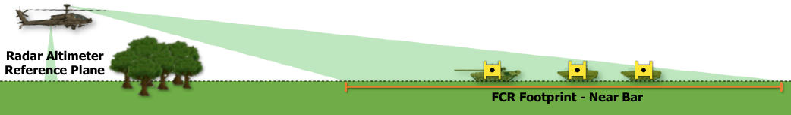

It is important to note that the accuracy of the automatic elevation mode is predicated on the assumption that
the intended FCR footprint is at the same elevation as the terrain directly below the aircraft. As this may not
always be the case, using the automatic elevation mode should only be performed in areas with minimal terrain
relief, such as open plains, non-mountainous deserts, large plateaus, or basins. Automatic elevation mode should
not be used when operating over mountains or rolling hills.

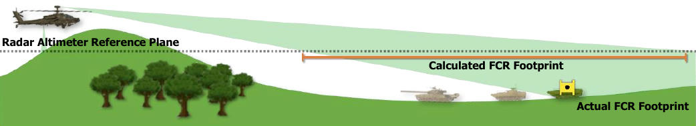

The FCR elevation control mode may be toggled between automatic (AUTO) and manual (MAN) from the FCR
Utility sub-page when the FCR is the selected sight and set to GTM or RMAP modes. When set to AUTO, the ELEV
(VAB L5) control mode option is displayed on the FCR page as a shortcut to quickly revert to manual elevation
control via the arrow buttons (VAB L5/L6) or the Sight Manual Tracker on the CPG’s TEDAC Left Handgrip.
When the FCR mode is set to GTM, RMAP, or ATM, the Elevation Scale is displayed on the main FCR page
corresponding with the current antenna elevation setting. The Elevation Scale does not indicate the mechanical
position of the elevation servo, but rather the elevation of the FCR scan volume relative to the horizontal plane.

**GTM/RMAP.** The Elevation Scale
corresponds with the relative
position of the Near bar within the
2-bar scan cycle. The Far bar will be
adjusted automatically based on the
elevation setting and elevation
control mode.

The elevation settings are in 6.25°
increments.

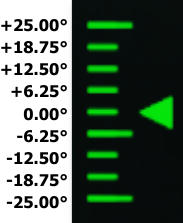

**ATM.** The Elevation
Scale corresponds with
the relative position of
the 1-bar scan cycle.

The elevation settings
are in 5° increments.

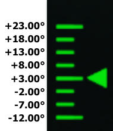

### Target Detection, Classification, and Prioritization

The APG-78 FCR accelerates the process of developing the tactical situation by automatically detecting,
classifying, and prioritizing potential targets on the battlefield. In addition, Priority Fire Zones and No Fire Zones
may be incorporated within the FCR prioritization process, which seamlessly integrates fire support control
measures (FSCM) to distribute or restrict fires within the AH-64D team.

**Target Detection**

Throughout each scan cycle within a scanburst, radar signatures within the FCR scan volume are determined to
be targets of military interest or rejected as false targets due to terrain clutter. This false target rejection uses
pre-programmed algorithms based on the terrain characteristics over which the FCR is expected to be operating.

**Target Classification**

Once a target of military interest is detected, the radar signature is compared to a library of known target types.
However, the FCR is not capable of recognizing the target (T-72 or M1A2), nor is it able to identify the coalition
affiliation of the target (friend or foe). The target is accordingly classified as one of the following six types:

**Tracked Vehicle.** T-72, M1A2, BMP-2, M113, etc.           

**Wheeled Vehicle.** BTR-80, M1126, BRDM-2, HMMWV, etc.      

**Air Defense Vehicle.** 2S6, Rapier, ZSU-23-4, Gepard, etc. 

**Helicopter.** Ka-50, AH-64, Mi-8, UH-60, etc.

**Fixed-Wing.** Su-25, A-10, MiG-29, F-16, etc.

**Unknown.** Any target that cannot be classified.

(See FCR Target Symbols for more information.) //link

**Target Prioritization**

Once targets are classified by type, they are ranked according to a series of prioritization parameters, some of
which are fixed within the avionics, while others may be adjusted by the crewmembers from within the cockpit.
As the targets are ranked, the 16 targets that are ranked at the top of the list are displayed as the “high priority
targets” on the FCR and TSD pages, the next 240 ranked targets are displayed on the TSD (when set to ATK
phase) as “low priority targets”, and any remaining targets ranked below 256 are not shown at all.

Targets are prioritized based on their positions within activated PFZ’s or NFZ’s, the selected Priority Scheme,
target classification, and range from the ownship. The automated target prioritization process consists of 5
parameters and is performed continuously as the FCR scans the battlespace; with target symbol positions
updated, added, or removed on each subsequent scan as the High Priority Target List is updated. The first three
parameters may be selected by the aircrew, but the last two parameters are fixed within the FCR software.

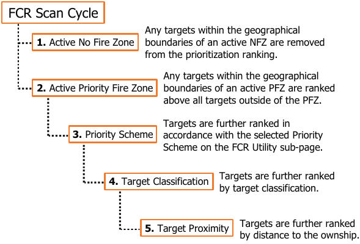

1.   **Active No Fire Zones.** The aircrew may
     selectively activate, deactivate, draw, or
     delete individual NFZ’s using the TSD
     Battle Area Management sub-page, which
     will prevent the FCR from prioritizing any
     of the targets within the boundaries of the
     active NFZ’s. However, the targets will still
     be displayed on the TSD when set to ATK
     phase, if the appropriate show options are
     enabled.

    !!! note
        No Fire Zones take precedence
        over Priority Fire Zones. Any targets
        located within an active NFZ and an active
        PFZ will not be prioritized.

2.   **Active Priority Fire Zones.** The aircrew                      may selectively activate, deactivate, draw,
     or delete PFZ’s using the TSD Battle Area Management sub-page, which will elevate the ranking of any
     target within the boundaries of the active PFZ above all other targets, even those targets outside the PFZ
     that may pose a greater threat to the aircraft.

3.    **Priority Scheme.** The aircrew may select one of three Priority Schemes
      on the FCR Utility sub-page. The default Priority Schemes are considered
      the base level prioritization parameter which are always enabled when
      employing the FCR in GTM, RMAP, or ATM, even when there are no active
      PFZ’s or NFZ’s. The Priority Scheme should be selected based on the
      current tactical situation. (See Priority Schemes for more information.)

    - **Default Scheme A.** Stationary ground targets and airborne targets
             will be prioritized over moving ground targets.

    - **Default Scheme B.** Stationary ground targets will be prioritized
             over moving ground targets or airborne targets.

    - **Default Scheme C.** Moving ground targets and airborne targets will
             be prioritized over stationary ground targets.

4.    **Target Classification.** Targets are ranked by their classification in the
      following order: Air Defense Vehicle, Helicopter, Fixed-Wing, Tracked
      Vehicle, Wheeled Vehicle, Unknown.

      (See FCR Target Symbols for more information.) //link

5.    **Target Proximity.** Targets that are equally ranked by the first four
      parameters are ranked in priority by their distance to the ownship. Targets
      that are closer to the ownship are ranked higher in priority over those that
      are further away.

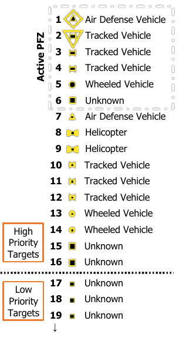

In the example above and to the right (based on the MPD images below), Default Scheme C has been selected,
a scanburst has been completed, and a PFZ and an NFZ have been activated within the FCR footprint. Even
though the selected Priority Scheme prioritizes moving ground targets and airborne targets over stationary ground
targets, the six stationary ground targets within the active PFZ are placed above those outside of the PFZ. The
targets inside the active PFZ have been further prioritized by the last three parameters, followed by the targets
outside the active PFZ which have been prioritized in the same manner.

When the TSD is set to ATK Phase, low priority targets and any targets within active No Fire Zones are displayed
as partial-intensity target symbols, at 50% of the size of high priority target symbols.

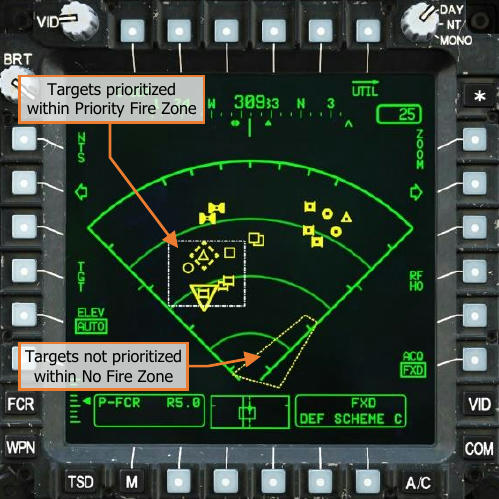

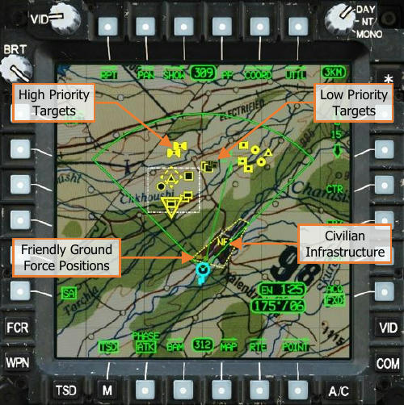

#### NTS/ANTS Designation

At the completion of the first scan cycle within the scanburst, or if the first scan is aborted for any reason, the
Next-To-Shoot (NTS) and Alternate Next-To-Shoot (ANTS) targets are designated as the first and second priority
targets, respectively. The NTS target will be surrounded by a diamond symbol and the ANTS will be surrounded
by an inverted triangle symbol.

If the High Priority Target List is updated with new target data as the FCR performs subsequent scan cycles within
the scanburst, the NTS and ANTS designations may shift to other targets throughout the scan. However, if a
weapon is actioned in the same crewstation that is using the FCR as the selected sight, the NTS designation will
become “frozen”. If another target is subsequently detected that is determined to be a higher priority while the
NTS is frozen, the ANTS triangle will shift to that target and flash for 3 seconds.

The NTS designates the target handover that will be sent to the next AGM-114L missile,
transmitted in the next RF Handover (RFHO), or the 3-dimensional location used to
calculate the weapon aiming solution for the Area Weapon System (AWS) or Aerial Rocket
Sub-system (ARS).

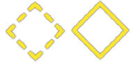
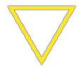

The NTS diamond will remain dashed unless all three of the following criteria are met.

-     The FCR is the selected sight within the crewstation.
-     A weapon is actioned within the crewstation in which FCR is the selected sight.
-     The A/S button on the [Armament Panel](plt-cockpit.md#armament-panel) is set to ARM.

A solid NTS diamond indicates to the crewmember using the
FCR as the selected sight that a weapon system is ready to be
fired at the current NTS target. Each time an RF missile is fired
at the NTS target or an RFHO is transmitted, the NTS and ANTS designations will
automatically sequence to the next targets on the High Priority Target List, allowing
rapid engagement of the high priority targets by RF missiles fired from the ownship
and/or other AH-64D’s receiving RF Handovers.

The NTS and ANTS may be manually sequenced by pressing the NTS button (VAB L1)
on the FCR page. Each time this button is pressed, the NTS and ANTS designations will
sequence to the next targets on the High Priority Target List in the same manner as
when an RF missile is fired or an RFHO is transmitted. When the NTS and ANTS
designations reach the end of the High Priority Target List, they will sequence back to
the top of the list in a cyclic manner.

(See RF Target Handovers in
the Datalink chapter for more
information.) //link

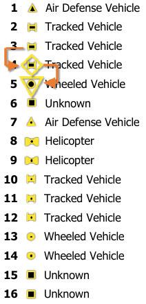

The MPD cursor may also be used to manually
designate the NTS target on the FCR page. However,
when an NTS target is manually designated in this
manner, that target is placed at the top of the High
Priority Target List, with every other target shifting
down the list as necessary.

If a different target is manually designated as NTS by
the MPD cursor, that target is then placed at the top of
the High Priority Target List, and the previous target
that had been manually designated as NTS is returned
to its previous ranking as necessary.

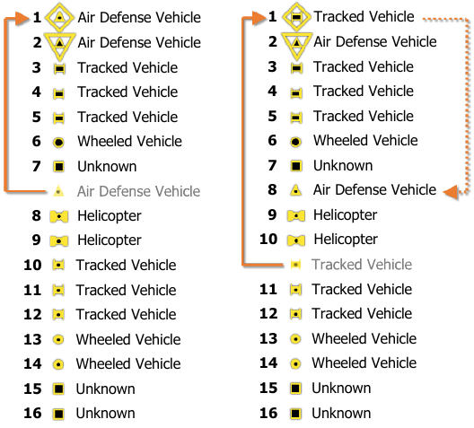

### Fire Control Radar (FCR) Page

The FCR page presents radar targeting data and/or terrain video to the crew in a format that is dependent on
the selected FCR mode. When set to GTM, RMAP, or ATM, the FCR page displays the 16 highest priority targets
that have been detected by the FCR, any of which may be designated for engagement.

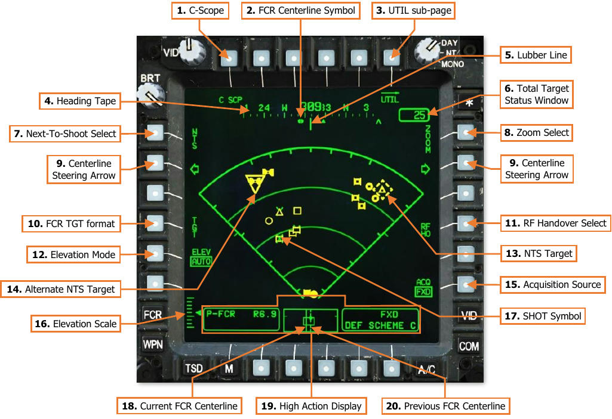

1. **C-Scope (C SCP).** When enabled, FCR symbols are displayed within Flight or Weapon symbology formats
       in the corresponding crewstation. FCR target symbols, the NTS target symbol, the ANTS target symbol, and
       SHOT symbols are displayed virtually in azimuth and elevation corresponding with their 3-dimensional
       positions. This setting is independent between crewstations. (See C-Scope for more information.)
2. **FCR Centerline Symbol.** Indicates the magnetic heading to which the centerline of the FCR scan volume
       is aligned. The centerline symbol is only displayed when either crewmember has selected FCR as a sight.
3. **FCR Utility sub-page.** Displays the FCR Utility sub-page.
4. **Heading Tape.** Displays a 180° hemisphere of magnetic headings. Major tick marks are displayed in 30°
       increments and marked by a cardinal direction or heading in the tens value. Minor tick marks are displayed
       in 10° increments.
5. **Lubber Line.** The Lubber Line is aligned to the centerline of the aircraft.
       NOTE: When set to GTM or RMAP mode, FCR target data is presented from the perspective of the FCR
       centerline during the most recent FCR scanburst, not the aircraft centerline.
6. **Total Target Status Window.** Indicates the total number of battlefield targets the FCR has detected
       within the current scan cycle.
7. **Next-To-Shoot (NTS) Select.** Advances the NTS and ANTS target designations through the 16 high
       priority targets in a descending order before cycling back to the first target on the list.
8. **Zoom Select.** Enables the cursor to designate a location within the FCR footprint to enter ZOOM format.
     When selected, the MPD cursor will be displayed in Zoom format when positioned within the FCR footprint.
9. **Centerline Steering Arrows.** Rotates the FCR centerline in azimuth, equal to the selected scan size, and
     de-slaves the FCR centerline from the selected acquisition source.

    - **Wide (W).** The FCR centerline will rotate 90° in azimuth if the FCR mode is GTM or RMAP.

    - **Medium (M).** The FCR centerline will rotate 45° in azimuth if the FCR mode is GTM or RMAP. The FCR
          centerline will rotate 90° in azimuth if the FCR mode is ATM.

    - **Narrow (N).** The FCR centerline will rotate 30° in azimuth if the FCR mode is GTM or RMAP. The FCR
          centerline will rotate 90° in azimuth if the FCR mode is ATM.

    - **Zoom (Z).** The FCR centerline will rotate 15° in azimuth if the FCR mode is GTM or RMAP. The FCR
          centerline will rotate 45° in azimuth if the FCR mode is ATM.

    When set to GTM or RMAP mode, the FCR centerline will be limited to ±90° to either side of the aircraft
     centerline and cannot be rotated while the FCR is scanning.

10. **FCR TGT format.** Displays the [FCR Target format](#fcr-target-format).
11. **RF Handover (RFHO) Select.** Displays a list of Primary members within the selected datalink network
    that may be selected to receive the RFHO datalink message. (See the RF Target Handovers in the Datalink
    chapter for more information.) //link
12. **Elevation Mode (ELEV).** Selects how the FCR antenna elevation will be controlled.

    - **AUTO.** The FCR antenna will automatically adjust its elevation based on the height above terrain as
          measured by the radar altimeter.
          This mode should be used when operating over relatively flat terrain.

    - **MAN.** The FCR antenna may be manually adjusted within the crewstation in which the FCR is the
          selected sight. When the mode is set to MAN, arrow buttons will be displayed on the FCR page at VAB
          L5 and L6 which may be used to adjust the elevation in fixed increments, or the CPG may use the MAN
          TRK controller on the TEDAC Right Handgrip to smoothly adjust the antenna elevation. However, the
          antenna elevation may not be adjusted while the FCR is scanning in GTM or RMAP mode.
          This mode should be used when operating over terrain that varies in elevation.

    !!! note
        If the FCR elevation mode is set to MAN, the mode may be set back to AUTO on the [FCR Utility](#fcr-utility-util-sub-page)
          sub-page.

13. **Next-To-Shoot (NTS) Target.** The NTS target symbol indicates the designated target location to which
    all sighting functions of the FCR are performed, or which target will be transmitted via an RFHO.
     When the first scan within a scanburst is completed, the NTS target symbol is set to the target the FCR has
     classified as the highest priority; however, the crewmember may manually designate the NTS target using
     the NTS Select button (VAB L1) or by selecting a target symbol on the FCR page with the MPD cursor.
     When a weapon is actioned, the NTS target is the target that will be engaged.

    - If the Area Weapon System (AWS) is actioned, the weapon aiming solution for the 30mm gun turret is
          calculated to the location of the NTS target.

    - If the Aerial Rocket Sub-system is actioned, the Rocket Steering Cursor indicates the weapon aiming
          solution to the location of the NTS target.

    - If the Hellfire Modular Missile System (HMMS) is actioned, the Missile Constraints Box indicates the
          target handover position of the NTS target when the RF missile is not tracking the target.

14. **Alternate Next-To-Shoot (ANTS) Target.** The Alternate NTS target symbol indicates the FCR target that
    will become Next-To-Shoot (NTS) if the NTS Select button (VAB L1) is pressed or an RF missile is fired at
    the current NTS target.

     When the first scan within a scanburst is completed, the ANTS target symbol is set to the target the FCR
     has classified as the second highest priority; however, if a crewmember manually designates a different NTS
     target using the MPD cursor, the ANTS target symbol will be set to the highest priority target as classified
     by the FCR.

15. **Acquisition (ACQ) Source.** Displays the acquisition source selection menu. (See [Acquisition Sources](tads-acq-ranging.md#acquisition-sources) in    the Tactical Employment chapter for more information.)
16. **Elevation Scale.** Displays the current elevation setting of the FCR antenna relative to the FCR radome.
    When set to GTM or RMAP mode, the upper and lower major tick marks correspond to +25° and -25°
    respectively, the major tick mark in the center corresponds to -6.25°, and each minor tick mark represents
    an interval of ±6.25°. When set to ATM, the upper and lower major tick marks correspond to +23° and -
    12° respectively, the major tick mark in the center corresponds to +3°, and each minor tick mark represents
    an interval of ±5°.
17. **SHOT Symbol.** Missile engagement locations are stored to the ownship SHOT file and displayed on the
    TSD and FCR pages as green X symbols. Missile engagement locations received via the datalink are displayed
    as partial-intensity green X symbols on the TSD and FCR pages.

    SHOT symbols are displayed over FCR target symbols if a missile engagement is stored after the FCR scan
     in which the target was detected. If subsequent FCR scans are performed, the SHOT symbol will be displayed
     under FCR target symbols.

    SHOT symbols represent locations to which an AGM-114 missile has been fired for the purposes of post-
     attack battle damage assessment (BDA). These symbols do not indicate whether the AGM-114 successfully
     hit a target nor what target was actually struck by the missile.
     See TSD SHOT sub-page in the Datalink chapter for more information. //link

18. **Current FCR Centerline.** Indicates the current azimuth of the FCR centerline when the FCR is powered.
19. **High Action Display (HAD).** The HAD provides prioritized sight and weapon status messages to the crew
    for targeting and weapons employment. (See [High Action Display](hmd.md#hmd-high-action-display) in the Helmet-Mounted Display chapter
    for more information.)
20. **Previous FCR Centerline.** Indicates the azimuth of the FCR centerline during the most recent scan when
    the FCR is powered and not scanning. When a new scan is initiated, the Previous FCR Centerline moves to
    the location of the Current FCR Centerline until the scan is completed.

#### FCR Zoom Format

The FCR page may be expanded within a designated sector of the FCR footprint by using the ZOOM function,
which displays a closer, more detailed view of FCR target symbols located within a small area. When enabled,
the selected area within the FCR footprint is enlarged by a 6:1 ratio.

The ZOOM format may be accessed in either crewstation by pressing the ZOOM button (VAB R1) on the FCR
page. When ZOOM is pressed, the MPD Zoom cursor is displayed, which represents the relative area of the FCR
footprint that will be expanded. Once the MPD Zoom cursor is placed over the desired location, Cursor-Enter may
be pressed to enter the FCR ZOOM format. The ZOOM button (VAB R1) may be subsequently de-selected to exit
the FCR ZOOM format.

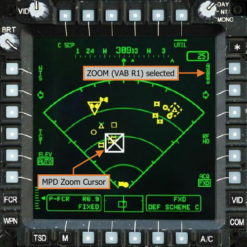

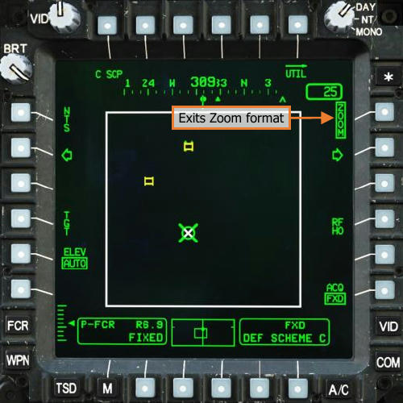

Alternatively, the CPG may directly enter the FCR ZOOM format by pressing the ZOOM button on the TEDAC Right
Handgrip. However, this method of entering ZOOM format of the FCR page bypasses the selection of the enlarged
area using the MPD Cursor, and the ZOOM format will be centered on the current Next-To-Shoot (NTS) target.
The ZOOM format may only be accessed when all three of the following criteria are met.

- The FCR is the selected sight within the crewstation.
- A Next-To-Shoot (NTS) target has been designated by the FCR.
- The FCR is not scanning.

If an FCR scan is initiated while ZOOM is enabled, the FCR page will exit ZOOM format for the duration of the
scan and will re-enter ZOOM format when the FCR scan is completed.

#### FCR Target Format

Pressing the TGT button (VAB L4) displays the FCR page in Target format. The TGT format of the FCR page
allows either crewmember to store FCR target locations as Target points within the TGT/THRT partition of the
navigational database.

When the TGT format is displayed, cursor-selecting an FCR target symbol on the FCR page will store a Target
(TG) point at that FCR target’s location. However, if point indexes T01 through T49 within the TGT/THRT partition
are already occupied with point data, Target points can no longer be stored from the FCR TGT format.

Alternatively, the CPG may store the current Next-To-Shoot (NTS) target as a Target (TG) point without entering
the FCR TGT format by pressing the STORE/UPDT switch to the STORE position on the TEDAC Left Handgrip
while the FCR is the CPG’s selected sight.

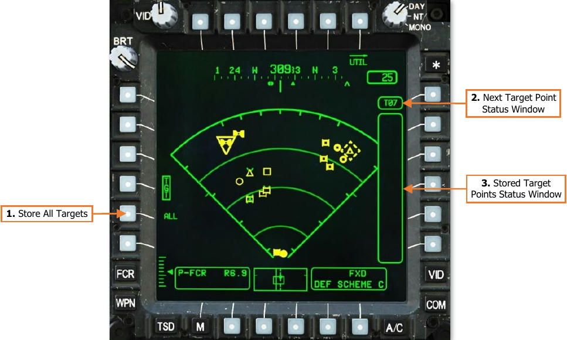

1.   **Store All Targets (ALL).** All FCR targets displayed on the FCR page will be stored as Target (TG) points
     in TGT/THRT point indexes that are not already occupied with point data.
     If ALL is selected or any FCR target symbol is cursor-selected while the FCR TGT format is displayed, the
     ALL option is removed.

2.   **Next Target Point Status Window.** Displays the next TGT/THRT point index that is available for storing
     an FCR target.

3.   **Stored Target Points Status Window.** Displays the TGT/THRT point indexes of each Target point that
     has been stored from the FCR TGT format.

#### FCR Utility (UTIL) Sub-Page

The UTIL sub-page allows either crewmember to toggle power to the FCR or RFI systems, adjust the settings of
the mast-mounted radome and/or FCR antenna elevation, or change the parameters for target prioritization.

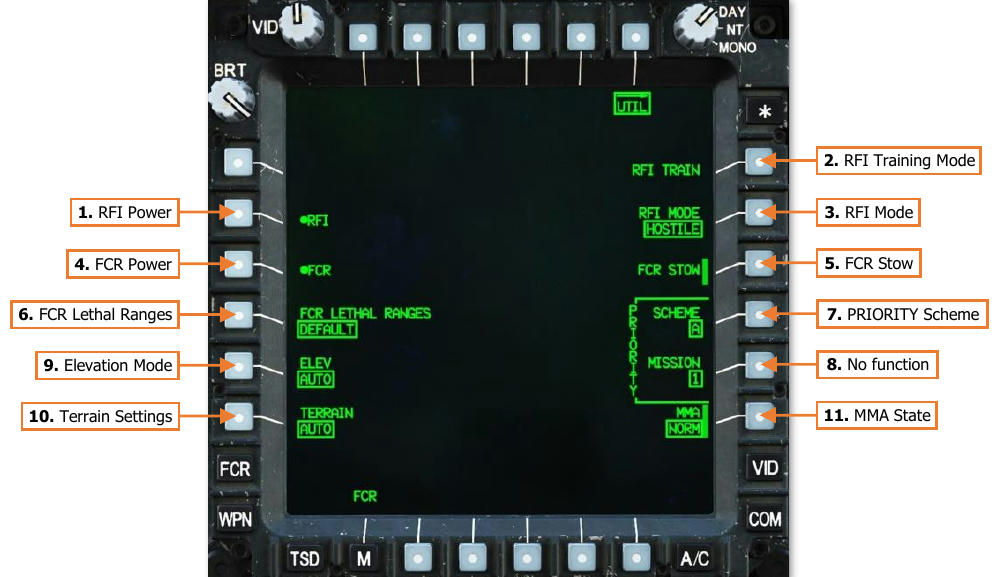

1. **RFI Power.** Not implemented.
2. **RFI Training Mode.** Not implemented.
3. **RFI Mode.** Not implemented.
4. **FCR Power.** Enables/disables the Fire Control Radar. FCR power will be inhibited if the MMA state (VAB R6)
     is set to PINNED.
5. **FCR Stow.** Manually commands the FCR radome to the stow position, rotating the mast-mounted assembly
     180° toward the rear, facing aft. If either crewmember is using the FCR as their sight, this option will be
     “barriered” and unavailable for selection. If either crewmember selects FCR as their sight while the FCR
     radome is stowed, or if the FCR is linked to the TADS, this option will be automatically de-selected.
6. **FCR Lethal Ranges.** Not implemented.
7. **PRIORITY - Scheme.** Selects how the FCR will prioritize targets detected on, or over, the battlefield when
     the FCR mode is set to GTM, RMAP, or ATM. (See Priority Schemes for more information.)

    - **Default Scheme A.** Stationary ground targets and airborne targets will be prioritized over moving
              ground targets.
    - **Default Scheme B.** Stationary ground targets will be prioritized over moving ground targets or
              airborne targets.
    - **Default Scheme C.** Moving ground targets and airborne targets will be prioritized over stationary
              ground targets.

8. **PRIORITY - Mission.** No function.
9. **Elevation Mode.** Selects the FCR elevation control mode when the FCR mode is set to GTM or RMAP.

    - **AUTO.** The FCR antenna will automatically adjust its elevation based on the altitude above terrain as
            measured by the radar altimeter.
            This mode should be used when operating over relatively flat terrain.

    - **MAN.** The FCR antenna may be manually adjusted within the crewstation in which the FCR is the
            selected sight. When the mode is set to MAN, arrow buttons will be displayed on the FCR page which
            may be used to adjust the elevation in fixed increments, or the CPG may use the MAN TRK controller
            on the TEDAC Right Handgrip to smoothly adjust the antenna elevation.
            This mode should be used when operating over terrain that varies in elevation.

10. **Terrain Settings.** Configures terrain processing settings for rejecting false targets and ground clutter. (N/I)
11. **Mast-Mounted Assembly (MMA) State.** Sets the current state of the mast-mounted assembly.

    - **NORM.** Permits the FCR to be powered. The MMA may be rotated.

    - **PINNED.** Inhibits the FCR from being powered. The MMA cannot rotate.
      When toggling the MMA state from PINNED to NORM, the FCR and RFI will be initialized automatically.

#### FCR Sight Status Messages

The following status messages pertain to the use of the FCR as the selected sight within the crewstation.

 SIGHT STATUS         CONDITION                          CORRECTIVE ACTION
      FCR NOT
                       The FCR is not installed.         None required.
     INSTALLED
        FCR            The FCR has been powered and
                                                         None required.
     NOT READY         is performing a Built-In-Test.
      FCR XMIT         The FCR is transmitting.          None required.
                       The FCR centerline is slaved to   Use an FCR arrow button or (CPG only) press the
          FIXED
                       the Fixed forward position.       SLAVE button to de-slave the FCR turret, if required.
                       The Mast Mounted Assembly is      Either crewmember should toggle the MMA to NORM
     MMA PINNED        set to a PINNED state; the FCR    on the FCR Utility or WPN Utility sub-pages, if required
                       cannot be powered.                to use the FCR for reconnaissance or targeting.
FCR Weapon Status Messages
The following status messages pertain to the use of the FCR as the selected sight within the crewstation.

 SIGHT STATUS        CONDITION                          CORRECTIVE ACTION
                     Default Priority Scheme A has
                                                        None required. Stationary ground targets and airborne
 DEF SCHEME A        been selected and no weapon is
                                                        targets will be prioritized over moving ground targets.
                     actioned in the crewstation.
                     Default Priority Scheme B has      None required. Stationary ground targets will be
 DEF SCHEME B        been selected and no weapon is     prioritized over moving ground targets or airborne
                     actioned in the crewstation.       targets.
                     Default Priority Scheme C has      None required. Moving ground targets and airborne
 DEF SCHEME C        been selected and no weapon is     targets will be prioritized over stationary ground
                     actioned in the crewstation.       targets.

FCR Target Symbols
The following FCR target symbols will be displayed on the FCR page, or within the HMD and TADS symbology
when C-Scope is enabled within the crewstation. Each symbol represents an object that the FCR has detected
and determined to be of military interest, with the symbol corresponding to the target classification.

       TARGET TYPE                   MOVING                    STATIONARY                   STATIONARY
                                 (500-8000 METERS)            (500-1500 METERS)           (1500-8000 METERS)

   TRACKED VEHICLE

   WHEELED VEHICLE

 AIR DEFENSE VEHICLE

        UNKNOWN

       HELICOPTER

       FIXED-WING

FCR target symbols may be displayed in partial-intensity yellow to represent stale FCR targeting data. Stale FCR
symbols represent tactical information that has likely changed since the completion of the most recent scan.
   •    Moving target symbols will become stale 5 seconds after the completion of the most recent scan in which
        the target was detected.
   •    Stationary target symbols will become stale 30 seconds after the completion of the most recent scan in
        which the target was detected.
NOTE: The FCR is not capable of target identification, and therefore cannot determine if a target is friendly or
enemy. As such, all targets detected by the FCR are displayed as an unknown affiliation. Battlefield intelligence,
fire support coordination measures (FSCM), and target identification through other means (such as the TADS)
should be utilized before employing munitions against unknown targets on the battlefield.
C-Scope
Selecting the C SCP button (VAB T1) on the FCR page or the C-Scope button on the TEDAC Right Handgrip
displays FCR target symbols, NTS and ANTS symbols, and SHOT symbols as virtual symbology elements within
the crewmember’s symbology overlays. C-Scope symbols will be overlaid within the crewmember’s HMD Flight
symbology, or within the CPG’s Weapon symbology, at their true positions relative to the crewmember’s HMD or
TADS line-of-sight, as virtual representations of locations “out-the-window”.

C-Scope increases the aircrew’s situational awareness by fusing FCR target data with TADS sensor video and
allowing either crewmember to see a virtual representation of battlefield targets through their helmet displays.
This capability is particularly useful when receiving FCR target data through the datalink from an FCR-equipped
AH-64D, in which target locations may be viewed while still masked behind terrain, allowing the receiving aircrew
to easily gain situational awareness of the battlefield before unmasking their own aircraft from behind cover.
In addition, C-Scope symbols are also overlaid on either crewmember’s video sources when viewed on the VID
page with VSEL (VAB T6) selected. As an example, if the CPG has enabled C SCP and is viewing a target through
the TADS that has also been detected and classified by the FCR, the Pilot will see the corresponding FCR target
symbol overlaid within the TADS video while viewing the TADS video source, even if C SCP is not enabled in the
Pilot crewstation. Since the TADS is being employed from a crewstation in which C SCP is enabled, the other
crewstation will see the video source as represented from the crewstation in which it is being sourced, regardless
of whether C SCP is enabled or disabled in the crewstation viewing the video source.
FCR MODES
The four FCR modes leverage the capabilities of the APG-78 radar as a sight for targeting and weapons
employment against ground and air targets, reconnaissance of enemy positions, or avoidance of terrain and
obstacles during low-visibility conditions. There is no direct indication as to which FCR mode has been selected;
however, the FCR page will change format based on the currently selected FCR mode.

Ground Targeting Mode (GTM)
GTM is used to detect and classify ground vehicles and low-flying aircraft, which are displayed in a Plan Position
Indicator (PPI) format. When the FCR is scanning in GTM, the FCR centerline will be stabilized in azimuth,
independently of the aircraft heading, as indicated by the FCR Centerline Symbol along the bottom of the Heading
Tape.
GTM is interchangeable with RMAP mode, in that a scanburst performed in one mode may be viewed in the
format of the other after the scanburst is complete. GTM is the default FCR mode upon power-up.
                            3. Narrow Scan Size Marks   4. Zoom Scan Size Marks   5. FCR Centerline

         2. Medium Scan
            Size Marks

                                                                                                      6. Scan Wiper

         1. FCR Footprint

         7. Activated PFZ                                                                             9. Range Marks

         8. Activated NFZ                                                                             10. Range Arcs

1.   FCR Footprint. The entire FCR Footprint represents the size of the FCR scan sector if the FCR Scan Size
     switch were pressed right to the “W” position. A Wide scan size will encompass a 90° sector of the battlefield,
     45° to either side of the FCR Centerline, to a maximum range of 8 kilometers.
2.   Medium Scan Size Tick Marks. Indicates the relative azimuth size of the FCR scan sector if the FCR Scan
     Size switch were pressed down to the “M” position. A Medium scan size will encompass a 45° sector of the
     battlefield, 22.5° to either side of the FCR Centerline, to a maximum range of 8 kilometers.
3.   Narrow Scan Size Tick Marks. Indicates the relative azimuth size of the FCR scan sector if the FCR Scan
     Size switch were pressed left to the “N” position. A Narrow scan size will encompass a 30° sector of the
     battlefield, 15° to either side of the FCR Centerline, to a maximum range of 8 kilometers.
4.   Zoom Scan Size Tick Marks. Indicates the relative azimuth size of the FCR scan sector if the FCR Scan
     Size switch were pressed up to the “Z” position. A Zoom scan size will encompass a 15° sector of the
     battlefield, 7.5° to either side of the FCR Centerline, to a maximum range of 8 kilometers.
5.   FCR Centerline. Indicates the center of the FCR scan sector within the FCR Footprint.
6.   Scan Wiper. Displays the position of the FCR antenna within the FCR scan sector when performing a scan.
     The FCR Scan Wiper will be displayed in White when performing a single scanburst or displayed in Green
     when performing a continuous scanburst.
7.   Activated PFZ. Displays the boundaries of an activated Priority Fire Zone (PFZ) in relation to the FCR
     footprint. All FCR targets detected within an activated PFZ will out-prioritize any targets detected outside
     the activated PFZ, regardless of the target classification or the selected Priority Scheme on the FCR Utility
     sub-page. (See Battle Area Management in the Datalink chapter for more information.)
8.   Activated NFZ. Displays the boundaries of an activated No Fire Zone (NFZ) in relation to the FCR footprint.
     All FCR targets detected within an activated NFZ will not be prioritized nor shown on the FCR page. However,
     targets within activated NFZ’s will still be displayed on the TSD page when set to ATK phase, if enabled on
     the SHOW sub-page. (See Battle Area Management in the Datalink chapter for more information.)
     NOTE: No Fire Zones take precedence over overlapping Priority Fire Zones, in that any FCR targets that are
     detected within an activated PFZ and an activated NFZ will not be prioritized or shown on the FCR page.
9.   Range Marks. Indicates the distance from the ownship on either side of the FCR scan sector in 2-kilometer
     increments, at 1 km, 3 km, 5 km, and 7 km.
10. Range Arcs. Indicates the distance from the ownship within the FCR scan sector in 2-kilometer increments,
    at 2 km, 4 km, and 6 km.

Tactical Employment of GTM
When the FCR is employed using Ground Targeting Mode, targeting information is presented in a decluttered 90°
sector PPI format from the perspective of the FCR centerline. This provides an easy to interpret “photograph” of
the battlespace within the FCR scan volume, to include a combined prioritization of ground and low-flying air
targets, along with any activated Priority Fire Zone (PFZ) and No Fire Zones (NFZ).

                                         GTM scanburst detects
                                         ground and air targets

                         Ground/Air Target Detection and Classification by FCR

However, unlike RMAP, GTM does not provide any indication of radar “dead space” due to terrain obstructions,
nor does it provide any direct feedback that the FCR antenna elevation is too high or too low for the intended
area to be scanned.
FCR Target Handovers (GTM/RMAP)
When engaging targets with AGM-114L radar-guided missiles, the FCR does not provide direct guidance to the
missiles themselves prior to, or after, the missiles are launched. Rather, the FCR provides the missile with a target
handover sent to the missile via the launcher umbilical, which includes the target’s position and whether it is
moving or stationary. The missile’s onboard active radar seeker acquires the target using this information, either
before launch while still on the launcher rail (LOBL mode), or after launch while already in flight (LOAL mode).
(See RF LOBL/LOAL Selection Logic for more information.)
When committing to an engagement of ground or air targets using the FCR as the selected sight, it is ideal to
perform a single scanburst to gather an updated “photograph” of the battlefield just prior to actioning a weapon
system, especially if presented with stale targeting data on the FCR page, which represents tactical information
that has likely changed since the completion of the most recent scan. (See FCR Target Symbols for more
information.)

                                          AGM-114L RF seekers lock on to
                                           moving ground and air targets

                                 Ground/Air Target Handovers to RF Missiles

When a Next-To-Shoot (NTS) target has been designated by the FCR and missiles are actioned in the same
crewstation that is employing the FCR as the selected sight, the next-to-launch AGM-114L missile receives a
target handover of the NTS target. Any time the FCR designates a new NTS target, a different NTS target is
selected by the crewmember, or the missiles are de-actioned and subsequently actioned again, a new target
handover is sent to the next-to-launch AGM-114L missile with the most recent target information.
FCR Priority Schemes (GTM/RMAP)
Three Priority Schemes may be selected on the FCR Utility sub-page which affects how targets are prioritized by
the FCR in GTM, RMAP, or ATM. These Priority Schemes reflect different tactical situations that may be
encountered by the AH-64D team and allow FCR-equipped aircraft within the team to react to changes on the
battlefield in real-time.
- Default Scheme A. Stationary ground targets and airborne targets will be prioritized over moving ground
     targets.
- Default Scheme B. Stationary ground targets will be prioritized over moving ground targets or airborne
     targets.
- Default Scheme C. Moving ground targets and airborne targets will be prioritized over stationary ground
     targets.
Three tactical scenarios are described on the following page to illustrate the potential applicability of each Priority
Scheme when employing the FCR in GTM or RMAP mode. However, these scenarios are generalized and do not
encompass the entirety of how the Priority Schemes may be applied to a given tactical situation.
For information regarding Priority Schemes when employing the FCR in ATM, see the Air Targeting Mode section
within this chapter.
Scenario 1. Performing an attack against a stationary armor force that is supported by armed helicopters, in
which the AH-64D team must provide its own protection against air defense threats and aircraft.
In such a scenario, it is anticipated that any air defense units accompanying the enemy armor force will be
deployed in a defensive posture and must be destroyed at the outset of an engagement to ensure the survival of
the AH-64D team. If enemy helicopters are detected, these aircraft must be subsequently targeted by the AH-
64D team prior to engaging the enemy armor.
                                                                                                     2
                                                                                                          3
                                                                                               1
                                                                     4    5     6   7   8

                    500 meters                            FCR Footprint                            8000 meters

                                             Priority Scheme A

Scenario 2. Performing an attack against a stationary armor force in which the AH-64D team must provide its
own protection against air defense threats, while supported by friendly counter-air assets or a second AH-64D
team that is assigned to provide protection against enemy aircraft.
In such a scenario, it is anticipated that any air defense units accompanying the enemy armor force will be
deployed in a defensive posture and must be destroyed at the outset of an engagement to ensure the survival of
the AH-64D team. If enemy helicopters are present, these units shall be engaged by other friendly aircraft or a
second AH-64D team assigned to provide support against such threats, which allows the primary AH-64D team
to focus their firepower against the enemy armor.
                                                                                                      7
                                                                                                          8
                                                                     2                         1
                                                                          3     4   5   6

                    500 meters                            FCR Footprint                            8000 meters

                                             Priority Scheme B

Scenario 3. Performing an attack against a moving armor force that is supported by air defenses and/or armed
helicopters, in which the AH-64D team must provide its own protection against enemy aircraft, while supported
by friendly SEAD assets or a second AH-64D team that is assigned to engage stationary air defense threats.
In such a scenario, it is anticipated that air defense units and helicopters will be accompanying the enemy armor
force and must be destroyed at the outset of an engagement to ensure the survival of the AH-64D team. If any
of the enemy air defenses are deployed in a stationary defensive posture to cover the movement of the enemy
armor force, these air defenses shall be engaged by other friendly aircraft or a second AH-64D team assigned to
provide support against such threats, which allows the primary AH-64D team to focus their firepower against the
enemy armor and/or helicopters.
                                                                                                      1
                                                                                                          2

                                                                     3          5       7      8
                                                                          4         6

                    500 meters                            FCR Footprint                            8000 meters

                                             Priority Scheme C

These scenarios are just a few among many potential tactical situations the AH-64D team may face. Depending
on the composition of the AH-64D team(s), the engagement plan for the mission, friendly support assets such as
artillery or fixed-wing aircraft, and the disposition and actions of the enemy forces, each FCR-equipped AH-64D
may need to adjust Priority Schemes during the mission to adapt to the evolving battlefield conditions.
Radar Map Mode (RMAP)
RMAP is used to detect and classify ground vehicles and low-flying aircraft, which are displayed in a B-Scope
format along with a radar-generated terrain map underlaid below the FCR target symbols. When the FCR is
scanning in RMAP, the FCR centerline will be stabilized in azimuth, independently of the aircraft heading, as
indicated by the FCR Centerline Symbol along the bottom of the Heading Tape.
The brightness of the terrain video underlay may be adjusted independently of the primary symbology displayed
on the MPD using the VID knob. Re-selecting RMAP using the FCR mode switch on the Collective Mission Grip or
the TEDAC Left Handgrip when the FCR mode is already set to RMAP will toggle the terrain video underlay on
the FCR page. The RMAP terrain video will take priority over any video underlay that has been selected on the
VID page. If the RMAP terrain video is disabled, the video underlay selected on the VID page will be displayed.
RMAP mode is interchangeable with GTM, in that a scanburst performed in one mode may be viewed in the
format of the other after the scanburst is complete. When the FCR mode is set to RMAP, activated Fire Zones
(PFZ’s and NFZ’s) are not displayed on the FCR page.
                            3. Narrow Scan Size Marks   4. Zoom Scan Size Marks   5. FCR Centerline

         2. Medium Scan
            Size Marks

                                                                                                      6. Scan Wiper

         1. FCR Footprint

          7. Range Marks

          8. Range Lines

1.   FCR Footprint. The entire FCR Footprint represents the size of the FCR scan sector if the FCR Scan Size
     switch were pressed right to the “W” position. A Wide scan size will encompass a 90° sector of the battlefield,
     45° to either side of the FCR Centerline, to a maximum range of 8 kilometers.
2.   Medium Scan Size Marks. Indicates the relative azimuth size of the FCR scan sector if the FCR Scan Size
     switch were pressed down to the “M” position. A Medium scan size will encompass a 45° sector of the
     battlefield, 22.5° to either side of the FCR Centerline, to a maximum range of 8 kilometers.
3.   Narrow Scan Size Marks. Indicates the relative azimuth size of the FCR scan sector if the FCR Scan Size
     switch were pressed left to the “N” position. A Narrow scan size will encompass a 30° sector of the battlefield,
     15° to either side of the FCR Centerline, to a maximum range of 8 kilometers.
4.   Zoom Scan Size Marks. Indicates the relative azimuth size of the FCR scan sector if the FCR Scan Size
     switch were pressed up to the “Z” position. A Zoom scan size will encompass a 15° sector of the battlefield,
     7.5° to either side of the FCR Centerline, to a maximum range of 8 kilometers.
5.   FCR Centerline. Indicates the center of the FCR scan sector within the FCR Footprint.
6.   Scan Wiper. Displays the position of the FCR antenna within the FCR scan sector when performing a scan.
     The FCR Scan Wiper will be displayed in White when performing a single scanburst or displayed in Green
     when performing a continuous scanburst.
7.   Range Marks. Indicates the distance from the ownship on the left side of the FCR scan sector in 2-kilometer
     increments, at 1 km, 3 km, 5 km, and 7 km.
8.   Range Lines. Indicates the distance from the ownship within the FCR scan sector in 2-kilometer increments,
     at 2 km, 4 km, and 6 km.

Tactical Employment of RMAP
The FCR-generated terrain map displayed in RMAP mode allows the crew to identify significant terrain features
or radar-reflective man-made infrastructure that may not be readily visible to the naked eye or optical sensors.
In addition, radar “dead space” may be identified, allowing the crew to determine which areas of the battlefield
cannot be seen by the aircraft sensors due to high terrain or defilade. This may indicate areas of potential enemy
positions that remain unseen, whether it be due to terrain obstructions or because the FCR scan volume is outside
the displayed FCR footprint, requiring a manual adjustment of the FCR antenna elevation.
FCR Antenna Elevation
When operating over mountains or rolling hills in which the automatic elevation mode may not result in the
intended area of the battlefield being scanned by the FCR, the RMAP terrain video provides the crew with a visual
indication as to which areas of the battlefield are actually within the FCR scan volume.

                     FCR Antenna Elevation is set too high (Left) or too low (Right)

When an FCR scanburst is performed which results in a horizontal band of no terrain video that runs along the
bottom of the FCR footprint, the FCR antenna elevation is set too high. If a horizontal band of no terrain video
runs along the top of the FCR footprint, the FCR antenna elevation is set too low. In either case, the FCR elevation
control should be set to manual mode and manually adjusted before attempting another scanburst. (See FCR
Elevation Controls for more information.)
Battlefield Analysis
Radar Map mode allows the crew to view FCR-detected targets within the overall context of the battlefield and
perform terrain analysis. When the FCR radome is unmasked and a scanburst is performed, the process of
detection, classification, and prioritization of targets is performed in the same manner as with Ground Targeting
Mode (GTM), which will present the 16 highest priority targets on the FCR page. However, with the addition of
the terrain video underlay in RMAP mode, the crew can gain better understanding as to how the targets are
arrayed across the battlefield amongst significant terrain features such as roads, rivers, hills, or urban areas.

   “Dead space”                                                                                     “Dead space”

High terrain with                                                                                   High terrain with
  steep slopes                                                                                       shallow slopes

          Airfield                                                                                  “Dead space”

   Small stream                                                                                      Power line
                                                                                                     stanchions

                                                                                                    Telephone poles
                                                                                                    alongside a road

Areas of terrain that are not visible to the radar, known as “dead space”, will be shaded black like a shadow cast
across the terrain. Depending on the amount of intelligence the crew has received prior to the mission regarding
the location of enemy positions, these areas should be regarded as potentially unknown enemy positions.

                        Wire Obstacles                    Hill                        Airfield

                     500 meters                             FCR Footprint                          8000 meters

                                          RMAP Battlefield Analysis

In the example on this page, if the crew intended to advance toward the small hill 3.5 kilometers away, identified
by the radar shadow cast beyond the hill itself, the crew could anticipate crossing several sets of wire obstacles
while enroute to their next battle position. This real-time terrain analysis, in conjunction with charts, satellite
imagery, topographic color banding, and pre-plotted hazards, control measures, and threats on the Tactical
Situation Display (TSD) page, provides the crew with a wealth of information within the cockpit for building
situational awareness of the battlefield before unmasking to re-position the helicopter or engage enemy targets.
Air Targeting Mode (ATM)
ATM is used to detect and classify helicopters and fixed-wing aircraft, which are displayed in a Plan Position
Indicator (PPI) format. When the FCR is scanning in ATM, the FCR centerline will be stabilized to the aircraft
heading, as indicated by the FCR Centerline Symbol along the bottom of the Heading Tape.
When the FCR mode is set to ATM mode from GTM or RMAP, any existing FCR targets and/or terrain map data
that was generated from GTM or RMAP modes are deleted. Accordingly, when the FCR mode is set to GTM or
RMAP mode from ATM, any existing FCR targets generated while in ATM are deleted.
The image below illustrates the FCR page when set to ATM mode and the scan size is set to Wide. When the
ATM scan size is set to Medium, Narrow, or Zoom, a solid line will be displayed in the center of the FCR footprint
itself to represent the current FCR centerline.
                                    1. FCR Footprint   2. Centerline Reference Indicators

                                                                                            3. Scan Wiper

          4. Activated PFZ

         5. Activated NFZ
                                                                                            6. Range Lines

                                                                                            7. Tail Blanking
                                                                                               Indicator

             8. Altitude
           Status Window

1.   FCR Footprint. The entire FCR Footprint represents the relative size of the FCR scan sector if the FCR Scan
     Size switch were pressed right to the “W” position. A Wide scan size will encompass the entire 360° of
     airspace around the ownship, to a maximum range of 8 kilometers.
2.   Centerline Reference Indicators. Displays reference positions relative to the aircraft centerline at the 12
     o’clock, 3 o’clock, 6 o’clock, and 9 o’clock positions.
3.   Scan Wiper. Displays the position of the FCR antenna within the FCR scan sector when performing a scan.
     The FCR Scan Wiper will be displayed in White when performing a single scanburst or displayed in Green
     when performing a continuous scanburst.
4.   Activated PFZ. Displays the boundaries of an activated Priority Fire Zone (PFZ) in relation to the FCR
     footprint. All FCR targets detected within an activated PFZ will out-prioritize any targets detected outside
     the activated PFZ, regardless of the target classification. (See Battle Area Management in the Datalink
     chapter for more information.)
5.   Activated NFZ. Displays the boundaries of an activated No Fire Zone (NFZ) in relation to the FCR footprint.
     All FCR targets detected within an activated NFZ will not be prioritized nor shown on the FCR page. However,
     targets within activated NFZ’s will still be displayed on the TSD page when set to ATK phase, if enabled on
     the SHOW sub-page. (See Battle Area Management in the Datalink chapter for more information.)
     NOTE: No Fire Zones take precedence over overlapping Priority Fire Zones, in that any FCR targets that are
     detected within an activated PFZ and an activated NFZ will not be prioritized or shown on the FCR page.
6.   Range Lines. Indicates the distance from the ownship within the FCR scan sector in 2-kilometer increments,
     at 2 km, 4 km, and 6 km.
7.   Tail Blanking Indicator. Indicates the sector of the FCR scan that has been obstructed by the vertical tail.
8.   Altitude Status Window. Indicates the upper and lower altitudes above ground level (AGL) that the FCR
     scan volume encompasses at the maximum FCR range of 8 kilometers.

Tactical Employment of ATM
When the FCR is employed using Air Targeting Mode, targeting information is presented in a 360° PPI format
centered on the ownship and oriented relative to the aircraft heading. This provides a top-down overlay of the
surrounding airspace and any rotary- and fixed-wing aircraft detected within 8 kilometers of the ownship.
When scanning in Air Targeting Mode, the FCR utilizes a 1-bar scan pattern at a constant elevation setting that
is stabilized to the horizontal plane. Unlike GTM or RMAP, ATM does not utilize an automatic elevation mode. As
such, when ATM mode is selected, the FCR elevation mode will be set to manual (MAN) on the FCR Utility sub-
page and cannot be changed. Additionally, the FCR centerline remains stabilized relative to the aircraft heading
while scanning, allowing the crew to scan a specific airspace sector relative to the AH-64D’s flight path or position.
Target Update Rate
Although a Wide scan size allows an FCR-equipped AH-64D to monitor the local airspace in a 360° search pattern
(excluding the tail blanking area under certain conditions), it is not ideal for target engagements. When engaging
an air target while using the FCR as the selected sight, a smaller scan size is more ideal due to the increased rate
at which the target’s position and velocity is updated within the FCR scan volume.
The target update rate for each FCR scan size is listed below, which may vary for scan sizes other than Wide,
depending on whether the target is in the center of the scan volume or near the edge.
    - Wide scan size (360°) – 6 seconds.                       •    Narrow scan size (90°) – 1.5 to 3 seconds.
    - Medium scan size (180°) – 3 to 6 seconds.                •    Zoom scan size (45°) – 0.75 to 1.5 seconds.

Vertical Dimensions of Scan Volume
The default elevation setting when the FCR is set to ATM is +3°, which will align the lower limit of the FCR vertical
scan volume with the altitude of the aircraft; or more precisely, the altitude of the FCR radome itself.

                                                           Helicopter exits scan volume

                     500 meters                              FCR Footprint                            8000 meters

                                           ATM Vertical Scan Volume

If an aircraft is detected by the FCR that is approaching at a constant altitude, the aircrew can expect the aircraft
to exit the FCR scan volume as the range decreases. At closer ranges to an air target, the elevation of the FCR
will likely need to be adjusted more frequently to account for the differences in altitude and relative position.
FCR Target Handovers (ATM)
When engaging air targets with AGM-114L radar-guided missiles, the FCR does not provide direct guidance to
the missiles themselves prior to, or after, the missiles are launched. Rather, the FCR provides the missile with a
target handover sent to the missile via the launcher umbilical, which includes the target’s position and whether
it is moving or stationary (in the case of a hovering helicopter). The missile’s onboard active radar seeker acquires
the target using this information, either before launch while still on the launcher rail (LOBL mode), or after launch
while already in flight (LOAL mode). (See RF LOBL/LOAL Selection Logic for more information.)
When committing to an engagement of an air target using the FCR as the selected sight, it is ideal to perform a
single scanburst along the azimuth of intended target of engagement with the scan size set to Narrow or Zoom.
This will gather an updated position of the air target just prior to actioning a weapon system.

                                                                    ATM scanburst
                                                                   detects air targets

                               Air Target Detection and Classification by FCR

When a Next-To-Shoot (NTS) target has been designated by the FCR and missiles are actioned in the same
crewstation that is employing the FCR as the selected sight, the next-to-launch AGM-114L missile receives a
target handover of the NTS target. Any time the FCR designates a new NTS target, a different NTS target is
selected by the crewmember, or the missiles are de-actioned and subsequently actioned again, a new target
handover is sent to the next-to-launch AGM-114L missile with the most recent target information.

                                                 AGM-114L RF seeker
                                                 locks on to air target

                                      Air Target Handover to RF Missile

Unless engaging a stationary, hovering helicopter that is beyond a range 2.5 kilometers, the AGM-114L will enter
LOBL mode after receiving the target handover from the FCR and attempt to acquire the air target. Due to the
greater velocity and maneuverability of aircraft compared to ground vehicles, the likelihood of a successful
engagement is much greater if the AGM-114L is launched after the missile seeker has acquired the air target.
FCR Priority Schemes (ATM)
Three Priority Schemes may be selected on the FCR Utility sub-page which affects how targets are prioritized by
the FCR in GTM, RMAP, or ATM. These Priority Schemes reflect different tactical situations that may be
encountered by the AH-64D team and allow FCR-equipped aircraft within the team to react to changes on the
battlefield in real-time.
- Default Scheme A. Stationary helicopters will be prioritized over moving helicopters or fixed-wing aircraft.
- Default Scheme B. Stationary helicopters will be prioritized over moving helicopters or fixed-wing aircraft.
- Default Scheme C. Moving helicopters and fixed-wing aircraft will be prioritized over stationary helicopters.
NOTE: Although fixed-wing aircraft are included in the target prioritization logic, the AH-64D is not equipped
with munitions that are ideal for engaging high-speed aircraft.
Two tactical scenarios are described below to illustrate the potential applicability of each Priority Scheme when
employing the FCR in Air Targeting Mode. However, these scenarios are generalized and do not encompass the
entirety of how the Priority Schemes may be applied to a given tactical situation.
For information regarding Priority Schemes when employing the FCR in GTM or RMAP, see the Ground Targeting
Mode section within this chapter.
Scenario 1. Performing an attack against an enemy armor force that is supported by armed helicopters, in which
an FCR-equipped AH-64D is tasked to provide protection for the AH-64D team against enemy helicopters that
favor hovering attack techniques.
In a scenario in which enemy helicopters are expected to employ hovering attacks from stationary battle positions
and bounding when repositioning between battle positions, target priorities will be focused on helicopters that
are stationary over the battlefield. If enemy helicopters are detected to be stationary in a hover, these aircraft
are prioritized for targeting over aircraft that are moving across the battlefield.

                                                                                               3
                                                                                4                       1
                                                                                                             2

                     500 meters                             FCR Footprint                            8000 meters

                                            Priority Scheme A or B

Scenario 2. Performing an attack against an enemy armor force that is supported by armed helicopters, in which
an FCR-equipped AH-64D is tasked to provide protection for the AH-64D team against enemy helicopters that
favor high-speed attack techniques.
In a scenario in which enemy helicopters are expected to employ high-speed moving, pop-up, or diving attacks,
target priorities will be focused on helicopters that are moving over the battlefield. If enemy aircraft are detected
inbound with a positive closure rate toward the ownship, these aircraft are prioritized for targeting over aircraft
that are flying away from the ownship or are in a stationary hover.

                                                                                                1

                                                                                2
                                                                                                         3
                                                                                                             4

                     500 meters                             FCR Footprint                            8000 meters

                                               Priority Scheme C
FCR ACQUISITION AND RANGING
The FCR cannot recognize specific vehicle types or equipment on the battlefield, nor identify whether targets are
friend or foe; however, the wide area search capability of the FCR allows the crew to efficiently direct the optical
sensors of the TADS for such purposes. Alternatively, during periods of limited visibility, the FCR C-Scope function
can directly aid the CPG in acquiring targets within the TADS field-of-view by performing a narrow scanburst
along the same line-of-sight and overlaying virtual target symbols within the TADS sensor video.
The key advantage in using the                                                                   TADS
FCR for initial detection and                                                                     FOV
classification of targets is its
ability to scan 50 square                                                        FCR
                                                                             Scan Volume
kilometers of the battlefield
within          seconds,        while
simultaneously performing an
initial classification of each target
of military interest that is
detected within the FCR scan
volume. Performing the same
task while using optical sensors
would require a significantly
longer period of time and would
be further constrained by the
narrow aperture of the optical
sensors themselves, the relative
size and aspect angle of each
target, the time of day, and                                                           8 km FCR Moving Targets
visibility conditions. Enemy forces        FCR Detection & Classification              6 km FCR Moving/Stationary Targets
that pose a direct threat to the                                                       6-10 km* TADS Moving/Stationary Targets
                                           TADS Detection, Classification,
aircraft, but are unknowingly                    & Identification                      *Dependent on target size, target aspect,
outside the optical sensor’s field-                                                    time of day, and visibility conditions.
of-view, may go unnoticed until
                                            Detection, Classification, & Identification of Targets
the aircraft is under attack.
Generally speaking, FCR scan sizes are best utilized in the following manner.
- Initial detection and classification of targets within the battlespace: Wide/Medium scan size.
- Target acquisition and weapons engagement: Narrow/Zoom scan size.
As with most tactical situations, many variables may determine the ideal FCR mode and scan patterns. Factors
such as terrain, anticipated enemy positions or movement on the battlefield, proximity of friendly forces, and the
maneuvering of the AH-64D team itself will play significant roles in determining the ideal FCR scan size, whether
Priority Fire Zones or No Fire Zones should be activated, and which FCR Priority Scheme should be employed.
Additional details regarding the employment of the FCR for target acquisition are listed below.
- Although the maximum detection range of the FCR is 8 kilometers, the FCR alone will only process and
     display stationary ground target symbols within a range of 6 kilometers.
- The FCR page is used for controlling and employing the Fire Control Radar as a sight. As such, it is limited
     to displaying the 16 high priority targets as the crewmember’s “shoot list”, which will remain frozen at the
     completion of the scanburst for ease of designation, engagement, and post-engagement BDA.
- Target point T50 may be placed at the location of an FCR target and simultaneously set as the crewmember’s
     acquisition source by selecting CAQ (VAB R5) on the TSD page and cursor-selecting an FCR target symbol
     on the TSD itself. This may be used to acquire a low priority target that is not displayed on the FCR page.
Acquisition Sources
The use of acquisition sources can reduce the time necessary to bring the FCR towards the intended FCR scan
area. This is particularly useful when leveraging the FCR’s area detection and classification capabilities to rapidly
highlight potential target positions or increase situational awareness. When target locations are already detected
using another sensor onboard the aircraft (to include visual detection by either crewmember), setting that sensor
as the acquisition source and enabling the SLAVE function increases the efficiency of target acquisition using an
FCR scanburst; especially when using narrow scan sizes.
Acquisition sources also reduce the amount of verbal communications and coordination of sensors that must
occur between the crewmembers, which increases combat efficiency. In contrast to target handovers to either
crewmembers’ HMD or the CPG’s TADS, which require less specificity due to their line-of-sight in the vertical
plane, target handovers to the FCR are more reliant on correct target descriptions and range estimations since a
single FCR scan may generate multiple targets along a given azimuth.
Examples of efficient target handovers to the FCR utilizing acquisition sources are listed below.
“Gunner, target, Pilot helmet sight. Tracked armor moving at 4 kilometers.”
“Pilot, target, TADS. Enemy helicopter inbound, on the horizon.”
In either case, the crewmember using the FCR as their sight simply selects the announced source of target
information as the acquisition source (and in the case of the CPG, enables SLAVE), slewing the FCR centerline
directly to the location of the intended target(s).
Acquisition sources listed below will command the FCR centerline to a specific azimuth relative to the aircraft
nose, but will not restrict the FCR scan size nor will it prevent any other targets from being prioritized within the
selected FCR scan volume.
- PHS. Pilot Helmet Sight; commands the FCR centerline to the azimuth of the Pilot’s helmet. May be used to
     direct the FCR to the location designated by the Pilot’s HMD LOS Reticle.
- GHS. Gunner Helmet Sight; commands the FCR centerline to the azimuth of the Copilot/Gunner’s helmet.
     May be used to direct the FCR to the location designated by the CPG’s HMD LOS Reticle.
- SKR. Seeker; commands the FCR centerline to the azimuth of the next-to-shoot AGM-114 missile seeker.
     May be used to direct the FCR to the target location that is currently being tracked by the next-to-shoot
     AGM-114 missile.
- FXD. Fixed forward; commands the FCR centerline to align with the Armament Datum Line (ADL) at 0° in
     azimuth.
- TADS. Target Acquisition Designation Sight; commands the FCR centerline to the azimuth of the TADS
     turret. May be used to direct the FCR to the location designated by the TADS sensor.
- W##, H##, C##, T##. Waypoint, Hazard, Control Measure, or Target/Threat point; commands the FCR
     centerline to the coordinates of the selected point within the navigation database. May be used to direct the
     FCR to a pre-planned, stored, or transmitted location for reconnaissance, target acquisition, or weapons
     engagement; or re-acquisition if line-of-sight was lost.
- TRN. Terrain point; commands the FCR centerline to the coordinates of the selected terrain point within the
     navigation database. May be used to direct the FCR to a cursor-selected location on the TSD that is not
     associated with an existing Waypoint, Hazard, Control Measure, or Target/Threat point for reconnaissance,
     target acquisition, or weapons engagement.
Range Sources
Among the three sights (HMD, TADS, and FCR) that may be employed by the AH-64D aircrew for targeting, the
FCR is the most limited with regards to ranging options. When the FCR is being utilized as the selected sight, only
one range source is available, which is a Radar range. However, it is one of the most accurate ranging sources
available to the crew.
- Radar range. Radar range is automatically entered as the range source any time the crewmember selects
     FCR as the selected sight. When transmitting, the FCR precisely measures the slant range between the
     ownship and targets detected on (or above) the battlefield using reflected radar energy.
     If no NTS target has been designated, “R?.?” will be displayed within the Range Source field of the High
     Action Display (HAD). In addition, “LOS INVALID” will be displayed within the Weapon Inhibit field of the
     High Action Display any time a weapon is actioned and an NTS target has not been designated or has not
     been re-detected during a subsequent scan cycle.
Radar Range
Once a target location has been processed by the FCR, its position relative to the ownship is retained within the
aircraft memory as a 3-dimensional geographic location. The Radar range displayed within the crewmember’s
High Action Display will always reflect the slant range to the current Next-To-Shoot (NTS) target as selected on
the FCR page. As the aircraft moves or re-positions to a different location, the radar range is updated accordingly
in real-time, in a similar manner to using a Navigation range to a point within the navigational database.

                                                 Slant range of 5.1 km to    NTS (Next-To-Shoot)
                                                NTS (Next-To-Shoot) target     target position

                                                  Radar Range

As this range source is dynamic, a Radar range may be used when calculating a targeting solution for any weapon
system onboard the aircraft. However, targets that are displayed in partial-intensity on the FCR page represent
stale FCR targeting data, and may not represent accurate battlefield target locations.
Sight LINK
The FCR may be linked with the TADS to leverage the capabilities of both sights simultaneously against target
locations acquired by one or the other. If either crewmember’s selected sight is FCR, the TADS may be linked to
the FCR; or if the CPG’s selected sight is TADS, the FCR may be linked to the TADS.
NOTE: Although the TADS may be manually controlled by the CPG while it is linked to the FCR, the TADS is not
the CPG’s selected sight under these conditions. As such, the LRFD cannot be fired and the CPG will be unable
to engage targets using the TADS unless it is subsequently selected as the CPG’s sight.
Likewise, although some functions of the FCR may be employed by the CPG while it is linked to the TADS, the
FCR is not the CPG’s selected sight under these conditions. As such, the CPG will be unable to engage targets
using the FCR unless it is subsequently selected as the CPG’s sight.

Linking TADS to FCR
If either crewmember’s selected sight is FCR and an FCR target has
been designated as Next-To-Shoot (NTS), pressing the Sight Select                       TADS
                                                                                         LOS
switch on the Collective Mission Grip or TEDAC Right Handgrip to the
                                                                                              FCR
LINK position within the same crewstation will link the TADS line-of-
                                                                                          Scan Volume
sight (LOS) to the geographical location of the FCR NTS target.
“P-FCRL” or “C-FCRL” will be displayed in the Sight Select Status field         NTS
                                                                               Target
of the High Action Display of the crewmember that has enabled LINK.
If the Pilot’s selected sight is FCR, the CPG’s selected sight is TADS,
and the Pilot links the TADS to the FCR, the CPG’s sight will
automatically be set to HMD and any actioned weapon in the CPG
crewstation will be de-actioned.
If any of the following criteria are met, the TADS cannot be linked to
the FCR and the LINK switch position will be ignored.
    - An NTS target has not been designated by the FCR.
    - The crewmember’s selected sight is HMD.
    - The crewmember’s acquisition source is set to TADS.
    - Either crewmember’s NVS Mode switch is set to NORM or
          FIXED with TADS as the selected NVS sensor.
If the TADS is already linked to the FCR and a new scanburst is
commanded, the TADS will remain linked but will return to the fixed
forward position until a new NTS target is designated.
The following TADS controls on the TEDAC handgrips will remain                       TADS Linked to
operational in the CPG crewstation while the TADS is linked to the FCR.              FCR NTS Target
    - Sensor Select switch.             •    IAT/OFS switch.          •   FLIR Polarity button.
    - Field-Of-View Select switch.      •    LMC button.              •   SLAVE button.
If any of the following criteria are met within the crewstation that selected LINK, LINK will be disabled and the
TADS will return to the fixed forward position.
    - The crewmember re-selects LINK while the TADS is already linked to the FCR NTS target.
    - The crewmember selects HMD as the sight.
    - The crewmember selects a different acquisition source.
Alternatively, the CPG may press the Sight Select switch to the TADS position to disable LINK and take control of
the TADS as the selected sight to independently track, lase, and engage targets as necessary.
Linking TADS for Combat Identification (CID)/Battle Damage Assessment (BDA) of an FCR Target
When potential targets are detected on the battlefield, only the aircrew is capable of identifying the detected
military units and equipment and whether they are friend or foe, a process known as Combat Identification, or
CID. In addition, only the aircrew can determine whether an enemy vehicle is operational or destroyed, a process
known as Battle Damage Assessment, or BDA. Since the FCR is not capable of recognizing a target (T-72 or
M1A2), determining its coalition affiliation (friend or foe), or whether a target is destroyed, linking the TADS to
the FCR allows the Copilot/Gunner (CPG) to perform CID and BDA with regard to FCR-detected targets.
When the TADS is linked to the FCR, the TADS will default to a Medium FOV (field-of-view) if the selected sensor
is FLIR, or Wide FOV if the selected sensor is DTV. If the aircraft and/or target are moving, this helps ensure the
CPG is able to visually acquire the target within the TADS video, and subsequently stabilize the TADS on target,
before the target exits the selected sensor’s FOV. The CPG may then select Narrow or Zoom FOV as necessary
for the purposes of performing CID or BDA of the FCR NTS target.
When employing an RF missile against an FCR target while the TADS is linked to the FCR, if the next-to-launch
RF missile has entered LOBL mode and has successfully locked on to a target (“RF MSL TRACK” displayed in the
High Action Display), the TADS will slave to the line-of-sight of the corresponding missile’s seeker rather than the
FCR NTS target. This allows the CPG to confirm the missile has locked on to the intended target prior to launch.
Slewing TADS while Linked to the FCR
If necessary, the CPG may manually slew the TADS while it is still linked to the FCR, allowing the crew to acquire
and identify additional targets in vicinity of the FCR NTS target, or to hand off an FCR target to the TADS for
engagement. This also allows the crew to perform immediate Battle Damage Assessment (BDA) on a target after
firing an RF missile against the FCR NTS target, which would otherwise shift the TADS LOS to the next FCR target
at the moment the missile was commanded to launch, which would automatically sequence the NTS designation.
When linked to the FCR NTS target, the TADS laser rangefinder/designator (LRFD) will be inhibited from firing
and the Laser Spot Track (LST) and Image Auto-Track (IAT) functions will be overridden and disabled. However,
the TADS will still attempt to maintain any tracks that remain within its optical field-of-view while linked to the
FCR.
After the TADS LOS has been linked to the FCR NTS target, the CPG may press the SLAVE button on the TEDAC
Right Handgrip, which will de-slave the TADS and enable the Sight Manual Tracker, allowing the CPG to manually
slew the TADS as normal.
To manually slew the TADS while linked to the FCR         Field-Of-View
                                                              Select      Sensor Select          Sight Select   FLIR Polarity
NTS target, perform the following:
1.   Sight Slave (SLAVE) button – Press.
2.   Sight Manual Tracker (MAN TRK) – Slew and
     employ TADS as desired.
    - Sensor Select switch – Select FLIR or
          DTV as desired.
                                                       Image Auto                    Sight Manual                    Sight Slave
    - Field-Of-View Select switch – Select as      Track/Offset                     Tracker
          desired.
    - FLIR Polarity button – Press as desired.
    - Manual tracking - Engage Linear Motion
          Compensation (LMC) as necessary.                                      Linear Motion
    - Automatic tracking - Engage Image Auto                               Compensation
                                                                               (opposite side)
          Track (IAT).
3.   Sight Slave (SLAVE) button – Press to slave the TADS back to FCR NTS target.
     or
3.   Sight Select switch – Select LINK to slave the TADS back to the FCR NTS target.
Linking FCR to TADS
If the CPG’s selected sight is TADS, pressing the Sight Select switch on Collective
                                                                                                     TADS
Mission Grip or TEDAC Right Handgrip to the LINK position will link the FCR centerline                LOS
to the azimuth of the TADS line-of-sight (LOS). “TADSL” will be displayed in the Sight
                                                                                                     FCR
Select Status field of the High Action Display in the CPG crewstation.                           Scan Volume

If the CPG’s selected sight is TADS, the Pilot’s selected sight is FCR, and the CPG links
the FCR to the TADS, the Pilot’s sight will automatically be set to HMD, and any
actioned weapon in the Pilot crewstation will be de-actioned.
If any of the following criteria are met, the FCR cannot be linked to the TADS and the
LINK switch position will be ignored.
    - The CPG’s selected sight is HMD.
    - The CPG’s acquisition source is set to FCR.
    - Either crewmember’s NVS Mode switch is set to NORM or FIXED with TADS
          as the selected NVS sensor.
The following FCR controls will become operational on the CPG’s Collective Mission
Grip and TEDAC handgrips while the FCR is linked to the TADS.
    - Mode Select switch.                 •    Scan Size Select switch.
    - Scan Select switch.                 •    ZOOM button.
If any of the following criteria are met within the CPG crewstation after selecting
LINK, LINK will be disabled and the FCR will return to the fixed forward position.
    - The CPG re-selects LINK while the FCR is already linked to the TADS LOS.
                                                                                                       FCR Linked to
    - The CPG selects HMD as the sight.
                                                                                                         TADS LOS
    - The CPG selects a different acquisition source.
Alternatively, either crewmember may press the Sight Select switch to the FCR position to disable LINK and take
control of the FCR as the selected sight to independently perform scans or engage targets as necessary.
Performing FCR scans while Linked to the TADS
If necessary, the CPG may perform FCR scans while it is still linked to the TADS, allowing the crew to detect and
acquire additional targets along the azimuth of the TADS line-of-sight, or to hand off a target acquired within the
TADS field-of-view to the FCR for engagement. However, such procedures are most effective when C-Scope has
been enabled to allow the CPG to correlate the FCR target symbols with those seen within the TADS sensor video.
To perform an FCR scanburst while linked to the                                                             Scan Size
TADS LOS, perform the following:                                                            Sight Select     Select

1.   Mode Select switch – Select GTM, RMAP, or
     ATM as appropriate.
2.   Scan Size Select switch – Select Narrow (N)                                                                        C-Scope
     or Zoom (Z) as appropriate.
3.   Scan Select switch – Select S-SCAN.
                                                      Mode Select                Scan Select
FCR HAND CONTROLS
Either crewmember may employ the Fire Control Radar for targeting and engagement of enemy targets.

Cyclic & Collective Controls
The Pilot and Copilot/Gunner Collective Mission Grips include
identical controls for FCR employment.                              Mode Select                  Scan Size Select

                                                                                                                Sight Select

                                                                                                       Scan Select

                                                                                                      Cued Search

TEDAC Controls
FCR controls are replicated on the Collective Mission Grip and TEDAC handgrips in the CPG crewstation. This
allows the CPG to employ the FCR for targeting and engagement without interfering with the flight controls, and
seamlessly transitioning between using the FCR and TADS.

       Mode Select   Store Target Point                                       Sight Select   Scan Size Select

                                                                                                       C-Scope Toggle

                                                                                                           Sight Slave
                                                                                                             Toggle

                                                                                                         Sight Manual
                                                                                                            Tracker
  Scan Select

 Cued Search
                                                                                                         Zoom Toggle
