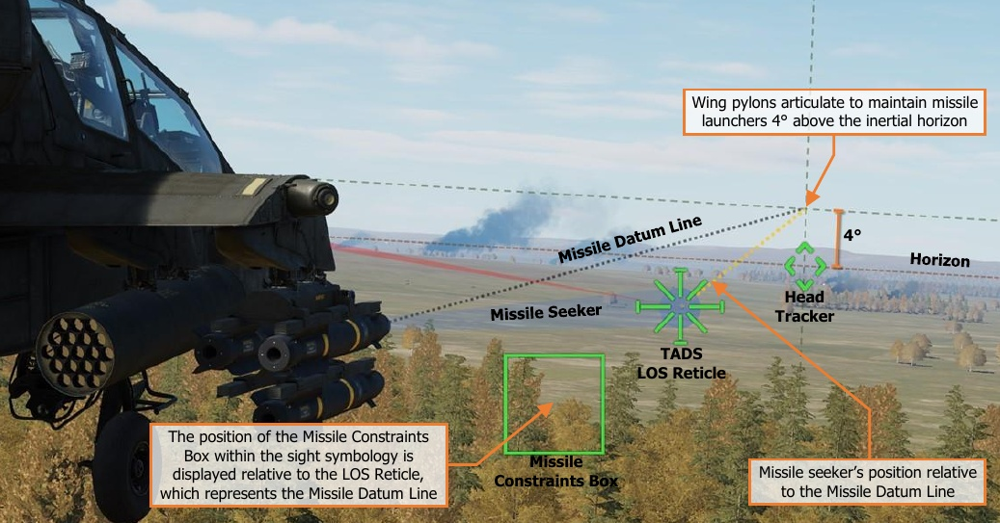

# HELLFIRE MODULAR MISSILE SYSTEM (HMMS)

The Hellfire Modular Missile System is the primary weapon system of the AH-64D, capable of employing any
variant of the AGM-114 Hellfire missile family. The AGM-114 was designed as a highly accurate anti-armor
munition, capable of engaging point targets at long range across a wide variety of battlefield conditions.

The HMMS consists of up to four M299 Hellfire missile launchers (also called “HML’s”), which can carry up to four
AGM-114 missiles of any model. Each individual launcher rail is processed by the aircraft electronics independently
of the others, essentially equipping the AH-64 with up to 16 individual missile stations. Any combination of M299
missile launchers may be used in conjunction with the M261 rocket pods, to include such possibilities of three
missile launchers and one rocket pod, or a single missile launcher and a single rocket pod in the case of reducing
overall gross weight.

The HMMS provides various levels of automation for managing the missile inventory, allowing the crew to focus
on targeting and engagement of ground targets while minimizing the duration the AH-64D is un-masked and
exposed to enemy detection and weapons fire. AGM-114 missiles may be employed by either crewmember when
using the HMD or FCR as the selected sight, or by the CPG when using the TADS. However, only specific missile
types (SAL or RF) may be employed depending on the selected sight within the crewstation.

- **HMD.** When the selected sight is HMD, only Semi-Active Laser (SAL) AGM-114 missiles may be selected and
     fired from the crewstation. When employed by the CPG, an offboard source of laser designation is required.
     When employed by the Pilot, an offboard laser designation is required or the CPG may provide designation
     using the TADS.

- **FCR.** When the selected sight is FCR, only Radio Frequency (RF) AGM-114 missiles may be selected and
     fired from the crewstation.

- **TADS.** When the CPG’s selected sight is TADS, either SAL or RF missiles may be selected and fired,
     depending on the CPG’s Weapon (WPN) page settings.

## AGM-114K Semi-Active Laser-homing (SAL) Missile

The AGM-114 family of anti-tank missiles entered service in the early 1980’s alongside the AH-64A. The laser-
guided Hellfire missiles were proven to be much more capable compared to the wire-guided BGM-71 TOW missiles
which they were to replace, with the ability to be guided to a target by the launching platform or by any other
target designation system capable of emitting a matching laser code. In addition, the AGM-114’s increased range,
speed, and its ability to employ one of several post-launch trajectories added to its versatility on the battlefield.
The first generation of missiles, commonly referred to as “Basic Hellfire” variants, included the A-, B-, C- and F-
models, and were used to a high degree of success during Operation Desert Storm in 1991.

Although the early variants of the AGM-114 missile were quite successful in combat, development of a second
generation of AGM-114 missiles, commonly referred to as “Hellfire II” variants, entered service in the late 1990’s.
These new AGM-114 variants featured numerous improvements and enhancements over the first generation,
including a new digital autopilot to replace the original analog electronics, an electronic arming fuze,
countermeasure hardening, and an integrated tandem warhead for defeating reactive armor. As a side note, the
AGM-114F did include a second warhead for defeating reactive armor, giving it a noticeable increase in length
compared to other AGM-114 variants, leading to the F-model being referred to as “Interim Hellfire”.

The AGM-114K was the first model of “Hellfire II” variants produced. Like the initial “Basic Hellfire”, the laser
frequency and post-launch trajectory are selectable from the cockpit and are immediately uploaded through the
missile’s umbilical, giving the aircrew the ability to rapidly configure the missile as needed. This flexibility, along
with the AGM-114K’s tandem shaped-charge warhead, which is capable of defeating any known armor on the
battlefield, makes the “Kilo” a versatile precision-strike weapon.

The AGM-114K may be employed in either a Lock-On-Before-Launch (LOBL) or a Lock-On-After-Launch (LOAL)
mode. If the missile’s laser seeker detects a laser designation that matches its assigned laser code prior to launch,
regardless of whether that laser designation is provided by the launching aircraft or by an offboard source such
as another aircraft or a ground-based designator, the missile will be launched in LOBL mode.

When tracking a laser designation in LOBL mode the acceptable launch envelope, referred to as the “missile
launch constraints”, is significantly more permissive when compared to LOAL. However, LOBL requires the
launching aircraft have a direct line-of-sight to the target prior to launch, which may expose the aircraft to enemy
detection and weapons fire.

### SAL Post-Launch Trajectories

The acceptable launch envelope when firing the missile in LOAL is more restrictive than LOBL to ensure the
missile is fired into the general vicinity of the intended target prior to designation. However, this allows the
launching aircraft to fire the missile while remaining behind cover and hidden from enemy detection. When a SAL
missile is launched while using LOAL, the crew may select one of three trajectories for the missile to utilize while
enroute to the target, depending on the range and any obstructions between the aircraft and the target.

- **High (HI) Trajectory.** When employed using a High trajectory, the missile will use a maximum loft climb
     after launch, ascending approximately 1,300 feet above the aircraft within 2,000 meters before leveling off
     and continuing along a level altitude. The High trajectory should be utilized when the missile needs to clear
     significant terrain obstructions between the launching aircraft and the intended target, or to maximize the
     missile’s kinematic range.

- **Low (LO) Trajectory.** When employed using a Low trajectory, the missile will use a moderate loft climb
     after launch, ascending approximately 500 feet above the aircraft within 1,000 meters before leveling off
     and continuing along a level altitude. The Low trajectory should be utilized when the missile needs to clear
     low terrain obstructions between the launching aircraft and the intended target, or to increase the missile’s
     kinematic range.

- **Direct (DIR) Trajectory.** When employed using a Direct trajectory, the missile will use a minimum loft
     climb after launch, ascending approximately 50 feet above the aircraft within 500 meters, but will continue
     along its launch azimuth in a very slight climb, reaching a peak altitude of 250 feet within 5 kilometers. The
     Direct trajectory should be utilized when there are no terrain obstructions between the launching aircraft
     and the intended target, or if the target is at a relatively close range.
    
    !!! note
        The trajectory option on the WPN page should be set to Direct (DIR) if the missile is intended to be
        employed in a Lock-On-Before-Launch mode. (See Missile Constraints Box for more information.)

Regardless of which trajectory is selected, the AGM-114K will continue along the same azimuth following launch
until it detects a laser designation with a matching laser code, at which point it will dive onto the designated
target. If no laser designation is detected, the missile will gradually lose altitude as its kinematic energy is depleted
and it impacts the ground.

### Laser Codes & Missile Channels

The AH-64D allocates laser frequencies using a combination of alphabetical laser codes and preset missile
channels to increase cockpit efficiency. Up to 16 distinct laser frequencies may be programmed and assigned to
laser codes “A” through “R”, excluding I and O to prevent confusion with one and zero respectively. These laser
codes are then allocated amongst other team members to ensure each AH-64D can designate targets
independently of one other, enabling simultaneous laser-guided missile engagements without mutual
interference. (See WPN Code sub-page for more information.)

The pre-programmed laser codes also allow rapid switching of the TADS Laser Rangefinder/Designator (LRFD)
and Laser Spot Tracker (LST) coding, without needing to manually input a 4-digit pulse repetition frequency using
the Keyboard Unit each time a change is required. Although it is rare that an AH-64D crew will need to change
their LRFD code from that which was assigned to their aircraft during a mission, the LST code may be changed
several times throughout the mission, depending on the nature of any target handovers received from other
laser-capable platforms within the battlespace.

Once the laser codes have been programmed and assigned to the TADS LRFD and LST sensors, the appropriate
laser codes must be assigned to the missile channels. Missile channels permit rapid re-coding of SAL missiles
directly from the main WPN page, independently of the ownship’s TADS LRFD and LST code assignments, and
determine which laser designations SAL missiles will scan for and track. (See WPN Channel sub-page for more
information.)

If the WPN page is displayed in MSL format, any of the four missile channels may be selected as the Priority or
Alternate channels for SAL missile coding. The Priority missile channel determines how the next launched SAL
missile will be coded, as in which laser pulse repetition frequency it will scan for and track. The Alternate missile
channel is only used when the missile mode is set to Ripple (RIPL) and determines how the subsequently launched
SAL missile will be coded. (See WPN Missile format and Missile Modes on the following page for more information.)

### Missile Modes

The AH-64’s missile management mode may be set to either Normal, Ripple, or Manual, which dictates the
manner in which the next and subsequent missiles are selected and coded for laser designations. For more
information regarding Manual mode, see WPN Missile format.

In Normal mode, each missile that is launched is coded to a single missile channel (set as the Priority channel on
the WPN page), meaning each missile searches for and tracks laser designations of a single laser pulse frequency.

When set to Ripple mode, each missile that is launched is coded to one of two missile channels (set as the Priority
and Alternate channels on the WPN page), which automatically cycles between the two channels every time a
missile is fired. This allows missiles to be employed against two separate laser pulse frequencies that are providing
simultaneous target designations without needing to manually switch the Priority missile channel between each
pull of the weapon trigger.

It should be noted that the selected missile mode only provides a means of managing how each subsequent
missile is coded prior to launch, and does not directly correlate with how targets are designated, or whether the
target is designated by the launching aircraft, another aircraft in the vicinity, or a ground-based designator. In
the figure below, the aircraft launching in NORM mode may or may not be the source of laser designation against
the intended target. NORM mode simply results in each missile being coded to the Priority missile channel.

Likewise, the aircraft launching in RIPL mode may or may not be one of the sources of laser designation against
the intended targets. Either of the designation sources could be provided by the launching aircraft, another
aircraft in the vicinity, or a ground-based designator. RIPL mode simply results in the cycling of the Priority and
Alternate channels following each launch to permit engagement of multiple targets using two designation sources.

### SAL Missile Constraints Box

The key piece of symbology associated with employing the AGM-114K is the Missile Constraints Box displayed
within the crewmember’s sight symbology. The Missile Constraints Box is a steering cue and launch mode indicator
which indicates the launch mode of the missile and whether the missile is within acceptable launch constraints.

The Missile Constraints Box is longitudinally-scaled and is not a
virtual symbology element; its displayed location does not
correspond with a real-world location that is observed “out-the-
window” like the Head Tracker or Flight Path Vector. The position
of the Missile Constraints Box is referenced from the LOS Reticle,
which corresponds to the Missile Datum Line (0° in azimuth and
elevation from the longitudinal axis of the missile body). However,
the referenced position of which the Missile Constraints Box
represents is dependent on whether the missile is in LOBL or LOAL
mode; and when in LOAL mode, which post-launch trajectory has
been selected by the crewmember.

To augment the missiles’ post-launch trajectory and to ensure the
missiles do not strike the ground, the wing pylons articulate in the
vertical axis to maintain the pylon angle of each missile launcher
4° above the inertial horizon when the missiles are actioned. This results in the Missile Datum Line of each missile
being stabilized 4° above the horizon regardless of the aircraft pitch attitude.

#### Lock-On-Before-Launch Mode (LOBL)

When the missile seeker detects a laser designation that matches its assigned laser code, the missile enters LOBL
mode. When in LOBL mode, the Missile Constraints Box corresponds with the position of the missile’s seeker, in
azimuth and elevation, relative to the Missile Datum Line.

The maximum allowable offset angle when the missile is in LOBL mode is 20°, ensuring the missile will be able
to maintain track on the laser designation after launch; otherwise, the Constraints Box will be displayed as invalid,
indicating the missile is outside of launch constraints. (See Missile Constraints Box Format for more information.)

#### Lock-On-After-Launch Mode, Direct Trajectory (LOAL-DIR)

When the missile seeker is not detecting a laser designation that matches its assigned laser code, the missile is
in LOAL mode. If the post-launch trajectory is set to DIR, the missile seeker is slaved to the crewmember’s
selected sight and the Missile Constraints Box corresponds with the position of the selected sight (HMD or TADS),
in azimuth and elevation, relative to the Missile Datum Line.

When the CPG pulls the LRFD trigger on the TEDAC Right Handgrip to the 2nd detent to designate the target, the
seeker is de-slaved, allowing the missile to track the laser designation from the launching aircraft. When the LRFD
trigger is released, the missile seeker is once again slaved to the crewmember’s selected sight.

The maximum allowable offset angle when the missile is in LOAL mode is 7.5°. This ensures the missile is fired
in the vicinity of the target location and that the missile’s flight path will carry it close enough for the seeker to
detect a laser designation after launch. Otherwise, the Constraints Box will be displayed as invalid, indicating the
missile is outside of launch constraints. (See Missile Constraints Box Format for more information.)

#### Lock-On-After-Launch Mode, Low/High Trajectory (LOAL-LO or LOAL-HI)

When the missile seeker is not detecting a laser designation that matches its assigned laser code, the missile is
in LOAL mode. If the post-launch trajectory is set to LO or HI, the missile seeker is caged directly ahead and the
Missile Constraints Box corresponds with the position of the acquisition source (ACQ), in azimuth and elevation,
relative to the Missile Datum Line when the ACQ is set to a point within the navigational database. If the ACQ is
not set to a point from the database, the Constraints Box will be displayed as invalid and be positioned at the
LOS Reticle, indicating the launch constraints are unknown.

The Missile Constraints Box indicates the azimuth to which the aircraft should be aligned to launch the missile
toward the point set as the crewmember’s ACQ. These trajectories are typically used when launching a laser-
guided AGM-114 toward a target that will be designated by an offboard designation source; in which the target
coordinates have been relayed to the launching aircraft in advance. (See Remote Fire for more information.)
The maximum allowable offset angle when the missile is in LOAL mode is 7.5°. This ensures the missile is fired
in the vicinity of the target location and that the missile’s flight path will carry it close enough for the seeker to
detect a laser designation after launch. Otherwise, the Constraints Box will be displayed as invalid, indicating the
missile is outside of launch constraints. (See Missile Constraints Box Format for more information.)

### SAL Missile Constraints Box Format

The Missile Constraints Box is displayed in four formats to indicate the missile’s launch mode (LOBL or LOAL) and
whether the missile is within acceptable launch constraints (Valid or Invalid).

If the missile seeker is not tracking a laser designation that matches its assigned
laser code, the missile will launch in Lock-On-After-Launch (LOAL) mode.

If the missile seeker is tracking a laser designation that matches its assigned
laser code, the missile will launch in Lock-On-Before-Launch (LOBL) mode.

If the missile is within acceptable launch constraints and no Weapon Inhibit
messages are displayed within the High Action Display, the Missile Constraints
Box will be displayed as Valid.

If the missile is outside acceptable launch constraints or any Weapon Inhibit
messages are displayed within the High Action Display, the Missile Constraints
Box will be displayed as Invalid.

The acceptable launch constraints for SAL missiles are dependent on the launch mode and the selected LOAL
trajectory (if applicable).

- **LOBL Constraints.** Missile seeker LOS is offset ≤ 20° from Missile Datum Line.

- **LOAL-DIR Constraints.** Selected sight (HMD or TADS LOS) is offset ≤ 7.5° from Missile Datum Line.

- **LOAL-LO or LOAL-HI Constraints.** Line-of-sight (LOS) to the location of the point currently set as the
       acquisition source (ACQ) is offset ≤ 7.5° from Missile Datum Line.

### SAL Missile Weapon Inhibits

The following conditions will inhibit the SAL missiles from being fired. Performance inhibits may be overridden by
pulling the trigger to the 2nd detent. Safety inhibits cannot be overridden.

##### Performance Inhibits

- **BAL LIMIT:**

    The required weapon aiming
solution exceeds the ballistics
processing capability.

    - If tactically feasible, engage the target at a closer
range.

- **PYLON ANGLE:**

    The position of the missile
launcher(s) is ≥10° from the
optimum launch position or the
pylon position is unknown.

    - Wait for the missile launchers to reach the optimum
launch position.

    - If inhibit message remains, missiles may still be fired
but the missile launcher positions should be visually
confirmed to ensure the appropriate considerations
may be made for a successful engagement.

- **PYLON LIMIT
 (IN FLIGHT):**

    The commanded position of the
rocket launcher(s) exceeds the
pylon articulation limits.
(+4° to -15°).

    - Adjust the aircraft pitch attitude as necessary to bring
the weapon aiming solution within the articulation
range of the wing pylons (e.g., pitch the nose toward
the Rocket Steering Cursor).

- **RATE LIMIT:**

    The pitch, roll, and/or yaw rates
are excessive.

    - Stabilize the aircraft attitude prior to launch.

- **ROLL LIMIT:**

    The roll angle of the aircraft is
excessive.

    - Reduce the roll attitude of the aircraft prior to launch.

- **SKR LIMIT:**

    When the missile is in LOBL
mode, the missile seeker has
reached a gimbal limit.

    - Adjust the heading or pitch attitude of the aircraft to
bring the target within the missile seeker field-of-view.
(e.g., turn toward the Missile Constraints box).

- **YAW LIMIT:**

    When the missile is in LOAL
mode, the target position
relative to the aircraft heading
is excessive.

    - Adjust the heading of the aircraft to bring the target
position closer to the aircraft centerline. (e.g., turn toward the Missile Constraints box).

##### Safety Inhibits

- **ACCEL LIMIT:**

    Vertical acceleration is <0.5 G;
the main rotor blades may
obstruct the trajectory of the
missile when fired.

    - Reduce the severity of the current maneuver to
increase the positive G load on the aircraft.

- **ALT LAUNCH:**

    The firing of a rocket salvo is already in
progress.

    - The missile may be fired 2 seconds after the rocket
salvo is complete.

- **BACK SCATTER:**

    The TADS LRFD is firing and the
difference between the SAL
missile seeker line-of-sight and
the TADS line-of-sight is >2°.

    - The missile is not tracking the TADS laser designation,
possibly due to atmospheric obscurance between the
aircraft and the target such as dust or smoke.

    - Release the laser trigger to slave the missile seeker
back to the TADS line-of-sight and attempt to
designate again.

- **GUN OBSTRUCT:**

    The gun is out of coincidence
from the weapon aiming
solution and may obstruct the
trajectory of missiles fired from
the inboard wing pylons.

    - If tactically feasible, instruct the crewmember that has
actioned the gun to de-action in order to permit the
firing of missiles.

    - A different missile may be manually selected by setting
the Mode to MAN and pressing the Missile Advance
button.

- **LOS INVALID:**

    The line-of-sight of the selected
sight is invalid or has failed.

    - Select a different sight for engagement.
If using HMD as the sight and the LOS Reticle is
flashing, adjust the helmet position to within the slew
limits of the assigned NVS sensor (PNVS or TADS).

- **MSL NOT RDY:**

    The SAL priority missile channel
is set to NONE in NORM or RIPL
mode.

    A missile has not been selected
in MAN mode.

    - Select a priority missile channel for SAL engagement.
Press the Missile Advance button to select the next
missile in MAN mode.

- **PYLON ERROR:**

    The aircraft is on the ground
(weight-on-wheels) and the
missile launcher positions are
unknown.

    - If inhibit message remains, the corresponding wing
pylons may have experienced a failure and the missiles
should be de-actioned.

- **PYLON LIMIT
(ON GROUND):**

    The commanded position of the
missile launcher(s) exceeds the
pylon articulation limits.
(+4° to -5°).

    - The missiles should be de-actioned.

- **SAFE:**

    The master armament state is
currently set to SAFE; weapons
cannot be fired.

    - Set the A/S button on the Armament Panel to ARM.

### WPN Missile (MSL) Format – SAL Missile Settings

When SAL missiles are selected for employment within the crewstation, the WPN page will display SAL missile
settings when set to MSL format.

!!! note
    The only SAL missile variant of the AGM-114 missile family that is simulated in DCS: AH-64D is the AGM-
    114K, which is of the Hellfire II series of sub-variants. As a result, only SAL2 missile icons will be displayed and
    available for employment.

1.    **Priority Channel.** Displays the missile channel selection menu for selecting one of the four missile channels
      as the Priority channel, with the current channel selection boxed and displayed as “PRI”. This setting is
      common between crewstations.

    

    - **Channel 1.** Missile channel 1 will be selected as the Priority channel.
              The next SAL missile to be fired will be coded to the laser code assigned
              to channel 1.

    - **Channel 2.** Missile channel 2 will be selected as the Priority channel.
              The next SAL missile to be fired will be coded to the laser code assigned
              to channel 2.

    - **Channel 3.** Missile channel 3 will be selected as the Priority channel.
              The next SAL missile to be fired will be coded to the laser code assigned
              to channel 3.

    - **Channel 4.** Missile channel 4 will be selected as the Priority channel.
              The next SAL missile to be fired will be coded to the laser code assigned
              to channel 4.

    - **NONE.** No missile channels will be selected as the Priority channel. SAL missiles will not be coded and
              are inhibited from launch. ALT channel selection (VAB L2) is inhibited and automatically set to NONE.

    !!! note
        A missile channel cannot be selected as both the Priority and Alternate channels simultaneously. If
        the Alternate channel is selected as Priority, the Priority and Alternate channels will simply be swapped.

2.   **Alternate Channel.** Displays the missile channel selection menu for selecting one of the four missile
     channels as the Alternate channel, with the current channel selection boxed and displayed as “ALT”. This
     setting is common between crewstations.

     When the Mode is set to RIPL, SAL missiles will be coded in an alternating
     sequence between the two missile channels designated as Priority and
     Alternate.

    

    - **Channel 1.** Missile channel 1 will be selected as the Alternate channel.

    - **Channel 2.** Missile channel 2 will be selected as the Alternate channel.

    - **Channel 3.** Missile channel 3 will be selected as the Alternate channel.

    - **Channel 4.** Missile channel 4 will be selected as the Alternate channel.

    - **NONE.** No missile channels will be selected as the Alternate channel.
          RIPL mode is inhibited from selection within the MODE selection menu
          (VAB R2).

    !!! note
        A missile channel cannot be selected as both the Priority and Alternate
        channels simultaneously. If the Priority channel is selected as Alternate, the Priority and Alternate channels
        will simply be swapped.

3.   **SAL Select.** Selects the sub-variant of SAL missiles to be employed, between Basic Hellfire (SAL1), Hellfire
     II (SAL2), or automatic selection between the two sub-variants. (N/I)

4.   **Missile Channels Status.** Displays the laser code assignments to each of the four missile channels and
     which channels are designated as Priority (PRI, white box) and Alternate (ALT, green box).

5.   **Type Select.** Displays the selected missile type for employment. This setting is independent between
     crewstations and is contextually dependent on the selected sight within the crewstation.

    - **SAL.** SAL missiles are selected for employment from the crewstation. The High Action Display will
          display relevant symbology for SAL missile employment and the WPN page will display SAL missile
          settings when set to MSL format.

        - If the selected sight is set to HMD, SAL is automatically selected as the missile type and
               crewmember selection will be inhibited.

    - **RF.** RF missiles are selected for employment from the crewstation. The High Action Display will display
          relevant symbology for RF missile employment and the WPN page will display RF missile settings when
          set to MSL format.

        - If the selected sight is set to FCR, RF is automatically selected as the missile type and crewmember
               selection will be inhibited.

6.   **Mode Select.** Selects the mode of missile inventory management. This setting is common between
     crewstations.

    - **RIPL.** Missile inventory, coding, and launch sequencing is managed automatically. Missile launches will
          be alternated between each wing station to maintain center-of-gravity, as appropriate.

        - The first three missiles that are designated for launch will be coded in an alternating sequence,
               with the first and third missiles coded to the Priority channel and the second missile coded to the
               Alternate channel. As each missile is fired, subsequent missiles are progressively coded in the
               same alternating sequence.

    - **NORM.** Missile inventory, coding, and launch sequencing is managed automatically. Missile launches
          will be alternated between each wing station to maintain center-of-gravity, as appropriate.

        - The first three missiles that are designated for launch will be coded to the Priority channel. As
               each missile is fired, subsequent missiles are progressively coded to the Priority channel.

    - **MAN.** Missile inventory, coding, and launch sequencing is managed manually by the aircrew. Missile
          launches may lead to asymmetric loading and may cause center-of-gravity issues.

        - A single missile is selected and coded. The Missile Advance button on the Collective Mission Grip
               or the TEDAC Right Handgrip may be used to select the next missile for launch. As each missile
               is fired, the Missile Advance button must be used to select and code the next missile.

7.   **Trajectory Select.** Selects the post-launch trajectory that will be employed by the SAL missile when fired
     in Lock-On After Launch (LOAL) mode. This setting is independent between crewstations.

    - **HI.** If the missile seeker does not detect a laser designation, the missile will employ a high-altitude loft
          trajectory along its launch azimuth.

    - **LO.** If the missile seeker does not detect a laser designation, the missile will employ a low-altitude loft
          trajectory along its launch azimuth.

    - **DIR.** If the missile seeker does not detect a laser designation, the missile will employ a direct trajectory
          with minimal loft along its launch azimuth.

8.   **RF Missile Icon.** Indicates an AGM-114L missile is loaded onto the corresponding missile launcher rail. The
     missile icon appearance and text label indicate the operational state and status of the missile. (See RF Missile
     Type Settings for more information.)

9.   **SAL Missile Icon.** Indicates an AGM-114K missile is loaded onto the corresponding missile launcher rail.
     The missile icon appearance and text label indicate the operational state and status of the missile.

    ICON|DESC
    ------------------------------|------------------------------------------------
     | A SAL2 missile is loaded onto the corresponding missile launcher rail
     | No    laser   code      is assigned. Missile is in a    Standby status. 
     | A solid missile icon is   displayed when the WPN     page is in MSL format.              
     | Laser code “A” is    assigned. Missile is in a     Ready status.                       
     | A hollow, white, flashing     missile icon indicates the     next missile to be fired.
     | Laser code “A” is     assigned. Missile is in a     Tracking status.

10. **Missile Counter-Countermeasures Mode.** Not implemented.

### SAL Missile Weapon Status Messages

The following messages will be displayed in the High Action Display based on current missile status or weapon
page settings when missiles are actioned and the missile type is set to SAL.

- **2 CHAN TRK:**            Missiles coded to the Priority and Alternate missile channels are tracking corresponding
                    laser designations in RIPL mode. Missiles are in LOBL mode.
- **ALT CHAN TRK:**                A missile coded to the Alternate missile channel is tracking a corresponding laser
                    designation in RIPL mode. Missile is in LOBL mode.
- **DIR MAN:** LOAL trajectory is set to DIR. Missile management mode is set to MAN.
- **DIR NORM:**         LOAL trajectory is set to DIR. Missile management mode is set to NORM.
- **DIR RIPL:**     LOAL trajectory is set to DIR. Missile management mode is set to RIPL.
- **FIRE MSLS:**          8 seconds has elapsed since the last launch of a SAL missile and one or more SAL
   missiles are remaining onboard the aircraft and set to the Priority missile channel that
                    matches the laser code set to the TADS LRFD.
- **HF TOF=##:**               The remaining time of flight (in seconds) for the next SAL missile that was set to a
                    Priority channel that matches the laser code set to the TADS LRFD.
- **HI MAN:**    LOAL trajectory is set to HI. Missile management mode is set to MAN.
- **HI NORM:**         LOAL trajectory is set to HI. Missile management mode is set to NORM.
- **HI RIPL:** LOAL trajectory is set to HI. Missile management mode is set to RIPL.
- **LASE ## TRGT:**           12 seconds time of flight remains for the next SAL missile that was set to a Priority
 channel that matches the laser code set to the TADS LRFD, requiring terminal guidance
                    be provided by the TADS LRFD.
- **LO MAN:**         LOAL trajectory is set to LO. Missile management mode is set to MAN.
- **LO NORM:**       LOAL trajectory is set to LO. Missile management mode is set to NORM.
- **LO RIPL:** LOAL trajectory is set to LO. Missile management mode is set to RIPL.
- **MSL LAUNCH:** A launch has been commanded of the next SAL missile that was set to a Priority channel
                    that matches the laser code set to the TADS LRFD.
- **MSL SELECT:**   Missiles are actioned but the Priority missile channel is set to NONE.
- **MSL TYPE?:**        Missiles are actioned but no missiles of the selected type (SAL or RF) are available.
- **NO MISSILES:**    Missiles are actioned but no SAL or RF missiles are available.
- **PRI CHAN TRK:** A missile coded to the Priority missile channel is tracking a corresponding laser
                    designation in MAN, NORM, or RIPL mode. Missile is in LOBL mode.
- **WEAPON?:** The weapon trigger has been pulled but no weapon has been actioned.

### Laser-guided Hellfire Engagement (LOBL)

When employing a SAL missile in Lock-On-Before-Launch (LOBL) mode, the TADS LRFD is used by the CPG to
continuously designate the target prior to missile launch and throughout the missile’s flight until it impacts the
target. TADS LMC and/or IAT targeting modes may be used to assist the CPG in stabilizing the TADS LOS Reticle
on the target. When missiles are actioned in the CPG crewstation, the Missile Constraints Box will also be displayed
in the Pilot crewstation to ensure the aircraft is maneuvered to within acceptable launch constraints.

To engage a target with a SAL missile in LOBL mode, using the TADS as the selected sight to self-designate:

1. [[**CPG**]]  Sight Select switch – TADS.
     (TEDAC Right Handgrip)
2. [[**CPG**]]    WPN Fixed Action Button – Press.
3. [[**CPG**]]  (Optional) Determine the
     appropriate acquisition source (ACQ) for
     acquiring the target.
    - If the target is visually acquired by
           either crewmember, set ACQ to PHS
           or GHS.
    - If the target is stored as a point
           within the navigational database,

4. [[**CPG**]]  (Optional) SLAVE button – Press,
     and then press again to de-slave when
     the TADS has finished slewing.
5. [[**CPG**]]  Weapon Action Switch (WAS) –
     Right. (TEDAC Left Handgrip)
6. [[**CPG**]]  Weapon settings – Verify or select.
     (WPN page)
    - TYPE (VAB R1) – SAL.
    - © MODE (VAB R2) – NORM or MAN.
    - TRAJ (VAB R3) – DIR.
    - © PRI (VAB L1) – Verify Priority
           missile channel is set to the same
           laser code as the LRFD.
7. [[**CPG**]]  Weapon Status – Verify “DIR
     NORM” or “DIR MAN”. (High Action
     Display)
8. [[**CPG**]]    Sight Status – Verify “REMOTE” is
     not displayed. (High Action Display)
9. [[**CPG**]]  A/S button – Verified in ARM.
     (Armament Panel)

    

10. [[**CPG**]]  If the target or aircraft are moving,
      engage TADS targeting modes to
      stabilize the TADS on target.
    - Manual tracking - Engage LMC and
            employ the Sight Manual Tracker.
    - Automatic tracking - Engage IAT.
11. [[**CPG**]]  LRFD Trigger – Pull and hold, 2nd
      detent. (TEDAC Right Handgrip)
12. [[**CPG**]]  Weapon Status – Verify “PRI CHAN
      TRK”. (High Action Display)
13. [[**CPG**]]  Instruct the Pilot to align the
      aircraft with the Missile Constraints Box
      – “Constraints.”
14. [[**PLT**]]  Missile Constraints Box – Align
      toward the HMD LOS Reticle.
    - Running/Diving Fire – Apply cyclic
            inputs in the direction of the Missile
            Constraints Box.
    - Hover Fire – Apply pedal inputs in
            the direction of the Missile
            Constraints Box.
15. [[**CPG**]]  Weapon Inhibit messages – Verify
      no Safety or Performance inhibit
      messages are displayed:
    - ACCEL LIMIT
    - ALT LAUNCH
    - BACK SCATTER
    - GUN OBSTRUCT
    - PYLON ERROR
    - BAL LIMIT
    - PYLON ANGLE
    - PYLON LIMIT
    - RATE LIMIT
    - ROLL LIMIT
    - SKR LIMIT
16. [[**CPG**]]  Weapon Trigger – Pull. (TEDAC
      Left Handgrip)
17. [[**CPG**]]  Weapon Status – Verify “MSL
      LAUNCH”. (High Action Display)
18. [[**CPG**]]  LRFD Trigger – Maintain
      designation, 2nd detent, until the missile
      impacts the target. (TEDAC Right
      Handgrip)

### Laser-guided Hellfire Engagement (LOAL, DIR Trajectory)

When employing a SAL missile in Lock-On-After-Launch (LOAL) mode, the TADS LRFD is used by the CPG to
designate the target after missile launch and throughout the remainder of the missile’s flight until it impacts the
target. TADS LMC and/or IAT targeting modes may be used to assist the CPG in stabilizing the TADS LOS Reticle
on the target. When missiles are actioned in the CPG crewstation, the Missile Constraints Box will also be displayed
in the Pilot crewstation to ensure the aircraft is maneuvered to within acceptable launch constraints.

To engage a target with a SAL missile in LOAL-DIR mode, using the TADS as the selected sight to self-designate:

1. [[**CPG**]]  Sight Select switch – TADS.
     (TEDAC Right Handgrip)
2. [[**CPG**]]    WPN Fixed Action Button – Press.
3. [[**CPG**]]  (Optional) Determine the
     appropriate acquisition source (ACQ) for
     acquiring the target.
    - If the target is visually acquired by
           either crewmember, set ACQ to PHS
           or GHS.
    - If the target is stored as a point
           within the navigational database,
           set ACQ to the corresponding point.  

4. [[**CPG**]]  (Optional) SLAVE button – Press,
     and then press again to de-slave when
     the TADS has finished slewing.
5. [[**CPG**]]  Weapon Action Switch (WAS) –
     Right. (TEDAC Left Handgrip)
6. [[**CPG**]]  Weapon settings – Verify or select.
     (WPN page)
    - TYPE (VAB R1) – SAL.
    - © MODE (VAB R2) – NORM or MAN.
    - TRAJ (VAB R3) – DIR.
    - © PRI (VAB L1) – Verify Priority     
           missile channel is set to the same   
           laser code as the LRFD.
7. [[**CPG**]]  Weapon Status – Verify “DIR
     NORM” or “DIR MAN”. (High Action
     Display)
8. [[**CPG**]]    Sight Status – Verify “REMOTE” is
     not displayed. (High Action Display)
9. [[**CPG**]]  A/S button – Verified in ARM.
     (Armament Panel)                           

10. [[**CPG**]]  If the target or aircraft are moving,
      engage TADS targeting modes to
      stabilize the TADS on target.
    - Manual tracking - Engage LMC and
           employ the Sight Manual Tracker.
    - Automatic tracking - Engage IAT.

    

11. [[**CPG**]]  Instruct the Pilot to align the
      aircraft with the Missile Constraints Box
      – “Constraints.”
12. [[**PLT**]]  Missile Constraints Box – Align
      toward the HMD LOS Reticle.
    - Running/Diving Fire – Apply cyclic
           inputs in the direction of the Missile
           Constraints Box.
    - Hover Fire – Apply pedal inputs in
           the direction of the Missile
           Constraints Box.
13. [[**CPG**]]  Weapon Inhibit messages – Verify
      no Safety or Performance inhibit
      messages are displayed:
    - ACCEL LIMIT
    - ALT LAUNCH
    - BACK SCATTER
    - GUN OBSTRUCT
    - PYLON ERROR
    - BAL LIMIT
    - PYLON ANGLE
    - PYLON LIMIT
    - RATE LIMIT
    - ROLL LIMIT
    - YAW LIMIT
14. [[**CPG**]]  Weapon Trigger – Pull. (TEDAC
      Left Handgrip)
15. [[**CPG**]]  Weapon Status – Verify “MSL
      LAUNCH”. (High Action Display)
16. [[**CPG**]]  LRFD Trigger – Pull, 2nd detent,
      after the missile clears the missile rail
      but no later than “LASE # TRGT” is
      displayed in the Weapon Status field,
      and hold until the missile impacts the
      target. (TEDAC Right Handgrip)

    

    

### Laser-guided Hellfire Engagement (Rapid Fire)

When employing SAL missiles using Rapid Fire against multiple targets, the TADS LRFD is used by the CPG to
designate each target in sequence while multiple missiles are in flight simultaneously. After the first missile
impacts its target, the laser designation is shifted to the next target, which will divert the next missile while in
flight. The TADS Multi-Target Tracker may be used to assist the CPG in shifting the TADS LOS Reticle to each
subsequent target. (See TADS Targeting Modes for more information)

To rapidly engage multiple targets with SAL missiles, using the TADS as the selected sight to self-designate:

1. [[**CPG**]]  Sight Select switch – TADS.
     (TEDAC Right Handgrip)
2. [[**CPG**]]    WPN Fixed Action Button – Press.
3. [[**CPG**]]  (Optional) Determine the
     appropriate acquisition source (ACQ) for
     acquiring the target.
    - If the target is visually acquired by
           either crewmember, set ACQ to PHS
           or GHS.
    - If the target is stored as a point
           within the navigational database,
           set ACQ to the corresponding point.     

4. [[**CPG**]]  (Optional) SLAVE button – Press,
     and then press again to de-slave when
     the TADS has finished slewing.
5. [[**CPG**]]  Weapon Action Switch (WAS) –
     Right. (TEDAC Left Handgrip)
6. [[**CPG**]]  Weapon settings – Verify or select.
     (WPN page)
    - TYPE (VAB R1) – SAL.
    - © MODE (VAB R2) – NORM or MAN.
    - TRAJ (VAB R3) – DIR.
    - © PRI (VAB L1) – Verify Priority
           missile channel is set to the same      
           laser code as the LRFD.
7. [[**CPG**]]  Weapon Status – Verify “DIR
     NORM” or “DIR MAN”. (High Action
     Display)
8. [[**CPG**]]    Sight Status – Verify “REMOTE” is
     not displayed. (High Action Display)
9. [[**CPG**]]  A/S button – Verified in ARM.
     (Armament Panel)

10. [[**CPG**]]  If the targets or aircraft are
      moving, engage TADS targeting modes
      to stabilize the TADS on target.
    - Manual tracking - Engage LMC and
            employ the Sight Manual Tracker.
    - Automatic tracking - Engage IAT on
            subsequent targets using MTT.

    

11. [[**CPG**]]  LRFD Trigger – Pull and hold, 2nd
      detent, if engaging in LOBL mode.
      (TEDAC Right Handgrip)
12. [[**CPG**]]  Weapon Status – Verify “PRI CHAN
      TRK” if engaging in LOBL mode. (High        
      Action Display)
13. [[**CPG**]]  Instruct the Pilot to align the
      aircraft with the Missile Constraints Box
      – “Constraints.”
14. [[**PLT**]]  Missile Constraints Box – Align
      toward the HMD LOS Reticle.
    - Running/Diving Fire – Apply cyclic
            inputs in the direction of the Missile
            Constraints Box.
    - Hover Fire – Apply pedal inputs in
            the direction of the Missile          
            Constraints Box.                      

15. [[**CPG**]]  Weapon Inhibit messages – Verify
      no Safety or Performance inhibit
      messages are displayed:
    - ACCEL LIMIT
    - ALT LAUNCH
    - BACK SCATTER
    - GUN OBSTRUCT
    - PYLON ERROR
    - BAL LIMIT
    - PYLON ANGLE
    - PYLON LIMIT
    - RATE LIMIT
    - ROLL LIMIT
    - SKR LIMIT
    - YAW LIMIT
16. [[**CPG**]]    Weapon Trigger – Pull. (TEDAC Left Handgrip)
17. [[**CPG**]]    Weapon Status – Verify “MSL LAUNCH”. (High Action Display)
18. [[**CPG**]]   LRFD Trigger – Pull and hold after the missile clears the missile rail and hold, 2nd detent, if not already
      lasing in LOBL mode. (TEDAC Right Handgrip)
19. [[**CPG**]]    Weapon Status – Verify “FIRE MSLS” 8 seconds after the first missile launch. (High Action Display)
20. [[**CPG**]]    Weapon Trigger – Pull. (TEDAC Left Handgrip)
21. [[**CPG**]]  Weapon Status – Verify “MSL
      LAUNCH”. (High Action Display)

    

    

22. [[**CPG**]]  When the first missile impacts the
      first target, shift the TADS LOS Reticle
      to the next target while continuing to
      hold the LRFD Trigger. (TEDAC Right
      Handgrip)
    - Manual tracking – Use Sight Manual
           Tracker to shift TADS LOS Reticle to
           next target.
    - Automatic tracking – Use IAT/OFS
           switch to shift TADS LOS Reticle to
           next target. (See Image Auto-Track
           for more information.)
23. [[**CPG**]]  LRFD Trigger – Maintain
      designation, 2nd detent, until the second
      missile impacts the second target.
      (TEDAC Right Handgrip)

    

!!! note
    A minimum of 8 seconds is required between missile launches to ensure the TADS LOS Reticle may be
    shifted to the next target with sufficient time to guide the next missile to its intended target. However, this is
    based on the assumption that each target is relatively close to the next. If the targets are widely spaced, the CPG
    should increase the interval between missile launches to ensure there is sufficient time to shift the laser
    designation to the next target before the missile reaches the designation.

A good rule of thumb is to only use the Rapid Fire technique if each target is simultaneously visible within the
same TADS field-of-view that will be used for laser designation, and to ensure that each subsequent target is at
the same range or further than the previous target.

### Laser-guided Hellfire Engagement (Remote Fire, LO or HI Trajectory)

When employing a SAL missile using Remote Fire, the missile is fired in Lock-On-After-Launch (LOAL) mode
toward a target location, after which an offboard source of laser designation provides terminal guidance onto the
intended target. Remote Fire is conducted in similar fashion to an artillery fire mission, in which the designating
platform relays the target location to which the munition should be delivered and the designator’s laser code.

To engage a target with a SAL missile in LOAL-LO or LOAL-HI mode, with another platform remotely providing
terminal guidance to the missile:

1. [[**CPG**]]  Sight Select switch – TADS.
     (TEDAC Right Handgrip)
2. [[**CPG**]]    WPN Fixed Action Button – Press.
3. [[**CPG**]]  Determine the appropriate
     acquisition source (ACQ) for acquiring
     the target.
    - COORD (VAB T5) – Select.
    - Point (VAB L1-L6) – Select; or use
           paging controls to locate the target
           point within the database.

    !!! note
        If the target location is not
        already present in the navigational
        database, the target point must be
        received via the datalink or manually
        input on the POINT sub-page. (See the
        Datalink chapter or TSD Point sub-page
        for more information.)

4. [[**CPG**]]  SLAVE button – Press, and evaluate
     Navigation range to target.

    !!! note
        If range to target exceeds 8
        kilometers, instruct the Pilot to re-
        position the aircraft as necessary prior
        to launch.

5. [[**CPG**]]  CHAN (VAB T1) – Select. (WPN
     page)
    - © CHANNEL (VAB T2-T5) – Select
           any un-used missile channel.
    - © Code Selection – Select the laser
           code that corresponds with the
           designating platform.

    !!! note
        If the designating platform is
        using a laser code that is not already
        present on the CHAN sub-page, the
        code must be manually input on the            
        FREQ sub-page. (See WPN Frequency
        sub-page for more information.)

6. [[**CPG**]]  Weapon Action Switch (WAS) –
     Right. (TEDAC Left Handgrip)                  
7. [[**CPG**]]  Weapon settings – Verify or select.
      (WPN page)
    - TYPE (VAB R1) – SAL.
    - © MODE (VAB R2) – NORM or MAN.
    - TRAJ (VAB R3) – LO or HI.

    - © PRI (VAB L1) – Select, and set
           the missile channel corresponding
           with the designating platform as
           Priority.
8. [[**CPG**]]  Weapon Status – Verify “LO
      NORM” or “LO MAN”; or “HI NORM” or
      “HI MAN”. (High Action Display)
9. [[**CPG**]]  Sight Status – Verify “REMOTE” is

      displayed. (High Action Display)
10. [[**CPG**]]  A/S button – Verified in ARM.
      (Armament Panel)
11. [[**CPG**]]  Instruct the Pilot to align the
      aircraft with the Missile Constraints Box
      – “Constraints.”
12. [[**PLT**]]  Missile Constraints Box – Align
      toward the HMD LOS Reticle.
    - Running/Diving Fire – Apply cyclic
           inputs in the direction of the Missile
           Constraints Box.
    - Hover Fire – Apply pedal inputs in
           the direction of the Missile
           Constraints Box.
13. [[**CPG**]]  Weapon Inhibit messages – Verify
      no Safety or Performance inhibit           
      messages are displayed:                    
    - ACCEL LIMIT
    - ALT LAUNCH
    - GUN OBSTRUCT
    - PYLON ERROR
    - BAL LIMIT
    - PYLON ANGLE
    - PYLON LIMIT                           
    - RATE LIMIT                            
    - ROLL LIMIT                            
    - YAW LIMIT                             
14. [[**PLT / CPG**]] Verify the designating platform
      is ready to designate the target.          
15. [[**CPG**]]  Weapon Trigger – Pull. (TEDAC
      Left Handgrip)                             
16. [[**CPG**]]  Sight Status – Verify “MSL LAUNCH”. (High Action Display) 
17. [[**PLT / CPG**]]  Notify designating platform that the missile has been launched and the approximate time of flight. 
18. [[**CPG**]]  Sight Status – Observe “LASE # TRGT”. (High Action Display) 
19. [[**PLT / CPG**]]  Verify the designating platform is lasing the target for terminal guidance.

### Laser-guided Hellfire Engagement (Ripple Fire)

When employing SAL missiles using Ripple (RIPL) mode against multiple targets, the missile management logic
will automatically cycle the Priority and Alternate channels each time a missile is launched, allowing each missile
to be guided by two separate sources of laser designation. Ripple Fire may conducted using a combination of
several missile engagement techniques:

    - **Lock-On-Before-Launch (LOBL).** One or both laser designators are lasing prior to launch.

    - **Lock-On-After-Launch (LOAL).** One or both laser designators begin lasing after launch.

    - **Remote Fire.** One or both missiles are being remotely guided by an offboard source of laser designation.

    - **Rapid Fire.** Multiple missiles may be guided by each source of laser designation, with the designating
     platforms shifting laser designations to subsequent targets following each preceding missile impact.

In each case, the launching aircraft may or may not be providing one of the sources of laser designation. However,
regardless of which platforms are providing terminal guidance to the SAL missiles, it is critical that the Priority
and Alternate channels correspond with the correct laser codes, and that sufficient coordination between the
launching platform and designating platform(s) is performed for a successful engagement. As an example in the
procedure below, the launching aircraft will designate for the first missile while a second AH-64D team member
will designate for the second missile. Both aircraft will begin designation prior to launch in LOBL mode to ensure
each missile is tracking their corresponding laser codes.

To rapidly engage multiple targets with SAL missiles, using the TADS as the selected sight to self-designate for
the first missile while another platform designates for the second missile:

1. [[**CPG**]]  Sight Select switch – TADS.
     (TEDAC Right Handgrip)
2. [[**CPG**]]    WPN Fixed Action Button – Press.
3. [[**CPG**]]  (Optional) Determine the
     appropriate acquisition source (ACQ) for
     acquiring the target.
    - If the target is visually acquired by
           either crewmember, set ACQ to PHS
           or GHS.
    - If the target is stored as a point
           within the navigational database,
           set ACQ to the corresponding point.

4. [[**CPG**]]  (Optional) SLAVE button – Press,
     and then press again to de-slave when
     the TADS has finished slewing.
5. [[**CPG**]]  Weapon Action Switch (WAS) –
     Right. (TEDAC Left Handgrip)
6. [[**CPG**]]  Weapon settings – Verify or select.
     (WPN page)
    - TYPE (VAB R1) – SAL.
    - © MODE (VAB R2) – RIPL.
    - TRAJ (VAB R3) – DIR.
    - © PRI (VAB L1) – Verify Priority missile channel is set to the same laser code as the LRFD.
    - © ALT (VAB L2) – Verify Alternate
            missile channel is set to the same
            laser code as the team member that
            will be designating the second
            target.
7. [[**CPG**]]  Weapon Status – Verify “DIR
      RIPL”. (High Action Display)
8. [[**CPG**]]  A/S button – Verified in ARM.
      (Armament Panel)

    

9. [[**CPG**]]  If the targets or aircraft are
      moving, engage TADS targeting modes
      to stabilize the TADS on target.
    - Manual tracking - Engage LMC and
            employ the Sight Manual Tracker.

    - Automatic tracking - Engage IAT on
            each target using MTT.
10. [[**PLT / CPG**]]  Instruct the team member to
      begin designating their target.

11. [[**CPG**]]  Weapon Status – Verify “ALT CHAN
      TRK” is displayed after team member
      begins designating. (High Action
      Display)

    

12. [[**CPG**]]  LRFD Trigger – Pull and hold, 2nd
      detent. (TEDAC Right Handgrip)
13. [[**CPG**]]  Weapon Status – Verify “2 CHAN
      TRACK”. (High Action Display)
      NOTE: If “PRI CHAN TRK” is displayed in
      the Weapon Status field of the High
      Action Display, the first missile to be
      launched is tracking a source of laser
      designation. If “ALT CHAN TRK” is
      displayed, the second missile to be
      launched is tracking a source of laser 
      designation. If “2 CHAN TRACK” is
      displayed, both sources of laser
      designation are being tracked by the
      corresponding missiles.
14. [[**CPG**]]    Instruct the Pilot to align the
      aircraft with the Missile Constraints Box – “Constraints.”
15. [[**PLT**]]    Missile Constraints Box – Align toward the HMD LOS Reticle.
    - Running/Diving Fire – Apply cyclic inputs in the direction of the Missile Constraints Box.
    - Hover Fire – Apply pedal inputs in the direction of the Missile Constraints Box.
16. [[**CPG**]]  Weapon Inhibit messages – Verify
      no Safety or Performance inhibit
      messages are displayed:
    - ACCEL LIMIT
    - ALT LAUNCH
    - BACK SCATTER
    - GUN OBSTRUCT
    - PYLON ERROR
    - BAL LIMIT
    - PYLON ANGLE
    - PYLON LIMIT
    - RATE LIMIT
    - ROLL LIMIT
    - SKR LIMIT
    - YAW LIMIT
17. [[**CPG**]]  Weapon Trigger – Pull to launch
      first missile. (TEDAC Left Handgrip)
18. [[**CPG**]]  Weapon Status – Verify “MSL
      LAUNCH”. (High Action Display)
19. [[**CPG**]]  Weapon Trigger – Pull to launch
      second missile. (TEDAC Left Handgrip)
20. [[**CPG**]]  Weapon Status – Verify “MSL
      LAUNCH”. (High Action Display)
21. [[**PLT / CPG**]]  Notify the designating team
      member that the missiles have been
      launched.
22. [[**CPG**]]  LRFD Trigger – Maintain
      designation, 2nd detent, until the first
      missile impacts the target being
      designated by the ownship’s TADS.
      (TEDAC Right Handgrip)

    

    

## AGM-114L Radio Frequency (RF) Missile

The AGM-114L was the first and only model of Hellfire missile that was designed to utilize radar-based guidance
in lieu of laser guidance. The missile itself utilizes the same components and features of the AGM-114K, including
the digital autopilot and integrated tandem warhead for defeating reactive armor, but replaced the forward nose
section with a millimeter-wave radar seeker and its associated electronics. Like the “Kilo”, the “Lima” was designed
to destroy 21st century main battle tanks and other heavy armor. But unlike the “Kilo”, the “Lima” was specifically
developed to be used in conjunction with the newly fielded AH-64D.

The forward section of the “Lima” is occupied by an active-radar seeker that can detect and track moving or
stationary ground targets, with a limited capacity to engage slow-moving air targets such as other helicopters.
Although the missile is most effective when employed using the AN/APG-78 Fire Control Radar (FCR), the AGM-
114L may also be employed when using the AN/ASQ-170 Target Acquisition Designation Sight (TADS). Prior to
launch, the missile receives a handover of the target location, whether the target location data was generated by
the FCR or the TADS, at which time it utilizes inertial guidance to navigate to its target.

When initially powered, the AGM-114L requires an alignment of its inertial guidance system to ensure it can
properly navigate to its target. An “inertial handover” of attitude and linear velocity is provided by the AH-64D’s
INU to the RF missiles as a means of rapid alignment, after which the missile is ready to receive a target handover.
However, due to the increased amount of electronics within the “Lima” compared to the “Kilo”, the missiles may
potentially overheat if the missile remains powered for extended periods of time. To mitigate this risk, the AH-
64D automatically manages the missile power amongst all RF missiles loaded on the weapon stations. The
automatic missile power logic will only keep a portion of the RF missile inventory powered at any given time; and
will cycle power to the next sub-set of the missile inventory every 10 minutes to permit the remaining missiles to
cool while keeping a number of RF missiles ready for immediate engagement.
(See WPN Missile format for more information regarding missile power management.)

Just as in the case of the AGM-114K, the AGM-114L may be employed in either a Lock-On-Before-Launch (LOBL)
mode or a Lock-On-After-Launch (LOAL) mode. However, the electronics within the AGM-114L missile itself
performs an automatic determination of which mode it should utilize, based on the nature of the target handover
it receives. The aircrew does not have any direct control over which mode the missile defaults to, but it is possible
to inhibit the RF missiles from utilizing LOBL mode, if necessary.

### RF LOBL/LOAL Selection Logic

Unlike the SAL missile variants, the RF missile performs its own determination of which launch mode (LOBL or
LOAL) is optimal for target acquisition, based on the nature of the target handover it receives.

**Lock-On-Before-Launch (LOBL).** LOBL is used to increase the likelihood of a successful engagement if the
target is moving or is at a close range to the aircraft (<2.5 km). If the missile determines the optimal mode is
LOBL, which will be indicated by “LOBL” being displayed in the Weapon Status field of the crewmember’s High
Action Display, it will immediately activate its onboard radar seeker and scan the vicinity of the target location in
an attempt to acquire and track its target. If a target is successfully acquired, “RF MSL TRACK” will be displayed
in the High Action Display.

- If the target is stationary but less than 1 km in range, there is insufficient time to acquire the target after
       launch and LOBL is necessary for a successful engagement. If target acquisition is unsuccessful, “NO
       ACQUIRE” will be displayed in the High Action Display, and engagement should not be attempted.
- If the target is stationary and between 1 and 2.5 km in range, there may be insufficient time to acquire the
       target after launch and LOBL increases the likelihood of a successful engagement. If target acquisition is
       unsuccessful, “LOAL” will be displayed in the High Action Display to indicate that LOAL is acceptable.
- If the target is moving at any range, LOBL is necessary for a successful engagement. If target acquisition is
       unsuccessful, “NO ACQUIRE” will be displayed in the High Action Display, and engagement should not be
       attempted.

If target acquisition has failed and it is desired to make another attempt to acquire the target prior to launch, the
crewmember should de-action the missile system, which will erase the target handover data from the missile.
The missiles may then be actioned once more and another target handover may be attempted. However, if
ambient temperatures are high, multiple and repeated attempts to force the missile to activate its onboard radar
and acquire a target may increase the likelihood of the missile overheating.

!!! note
    The “LOBL” or “LOAL” messages displayed in the Weapon Status field of the High Action Display indicate
    the launch mode that the missile has entered; “LOBL” does not indicate the missile has acquired its target when
    in a LOBL state. If “LOBL” is still displayed when the RF missile is launched, prior to “RF MSL TRACK” being
    displayed and accompanied by a large Missile Constraints Box, the missile will launch in a LOAL state and may
    not successfully acquire the target after launch. (See RF Missile Constraints Box for more information)

**Lock-On-After-Launch (LOAL).** LOAL is used if LOBL is not required to ensure a successful engagement, if
the target cannot be acquired prior to launch and there is sufficient time to acquire the target after launch, or if
LOBL INHIBIT is enabled on the WPN page. If the missile determines the optimal mode is LOAL, which will be
indicated by “LOAL” being displayed in the Weapon Status field of the crewmember’s High Action Display, it
should be launched as soon as the target handover is complete to ensure a successful engagement.

- If the target is stationary and between 1 and 2.5 km in range, and LOBL is unsuccessful, “LOAL” will be
       displayed in the High Action Display to indicate that LOAL is acceptable.
- If the target is stationary and greater than 2.5 km in range, “LOAL” will be displayed in the High Action
       Display to indicate that LOAL is acceptable.

### RF Post-Launch Trajectories

When an RF missile is launched, the missile will utilize one of two trajectories based on the missiles ability to
acquire and track the target. If the missile cannot acquire or maintain a track on the target, it will utilize an off-
axis flight profile to increase its radar resolution of the target amongst the ground clutter. Otherwise, the missile
will use a direct flight profile toward the target.

- **Doppler Beam Sharpening (DBS) Trajectory.** When employing an off-axis flight profile, the RF missile
     leverages a radar processing principle known as Doppler beam sharpening to increase the radar processing
     resolution in order to acquire or maintain track of its target. A DBS trajectory is more likely to occur when
     the target is at sufficient range in which such a maneuver is possible, or when the missile is employed in
     LOAL launch mode. (See Doppler Beam Sharpening on the following page for more information.)

- **Direct Trajectory.** When employed against targets that are easily acquired and tracked, or against targets
     that are at close range with insufficient maneuver space to perform a DBS trajectory, the missile will use a
     direct trajectory toward the target.

!!! note
    The RF missile may impact obstructions when utilizing a DBS trajectory after launch, such as when
    employed near high terrain or tall urban structures. If necessary, the nose of the aircraft may be offset to either
    side of the target azimuth to force the missile to execute a DBS trajectory in the corresponding direction.

### Doppler Beam Sharpening (DBS)

Doppler beam sharpening is a method of processing received radar returns to produce a higher resolution radar
map and is used in many applications in the world today, even outside of military aviation. Typical real-beam
radar mapping is limited in resolution, whereas Doppler beam sharpening uses differences in radial velocity to
achieve a more detailed radar image. However, Doppler beam sharpening is limited by the relative aspect angle
of the radar returns in relation to the movement of the transmitting radar antenna across the surface.

As the radar antenna moves across the
surface, whether it is mounted to an aircraft
like the F-16 or a missile like the AGM-114L,
radar returns are received from terrain and
objects such as vegetation, structures, or
vehicles. Even if all detected objects are
stationary, the velocity of the missile itself
generates a measurable shift in the frequency
of the electromagnetic radar energy reflected
back toward the missile seeker; a Doppler 
effect. However, radar reflections that are     
received from either side of the missile’s track
across the surface will generate a lower
Doppler shift due to their lower radial velocity
compared to those directly in front of the      
missile. The greater the angular offset from the
missile’s flight path, the lower the measured
radial velocity.

As the radar returns are processed for these
small differences in Doppler shift, the returns 
from any location within the radar image can    
be calculated and further separated into        
distinct points to account for the deviations in
radial velocity. This results in a more refined
and higher resolution radar image.                        

Since Doppler beam sharpening relies on a
sufficient difference in Doppler frequency within a measurable area, such calculations cannot be performed when
the radar is scanning an area directly in front of the missile’s flight path (nor directly abeam). As a result, Doppler
beam sharpening is rendered ineffective unless the scanned area is sufficiently offset to either side of the missile’s
flight path. When Doppler beam sharpening is necessary to acquire and track a given target, the AGM-114L will
fly an off-axis DBS trajectory to permit this processing method.

### RF Missile Constraints Box

The key piece of symbology associated with employing the AGM-114L is the Missile Constraints Box displayed
within the crewmember’s sight symbology. The Missile Constraints Box is a steering cue and launch mode indicator
which indicates the launch mode of the missile and whether the missile is within acceptable launch constraints.

The Missile Constraints Box is longitudinally-scaled and is not a
virtual symbology element; its displayed location does not
correspond with a real-world location that is observed “out-the-
window” like the Head Tracker or Flight Path Vector. The position
of the Missile Constraints Box is referenced from the LOS Reticle,
which corresponds to the Missile Datum Line (0° in azimuth and
elevation from the longitudinal axis of the missile body). However,
the referenced position of which the Missile Constraints Box
represents is either the target location relative to the Missile
Datum Line; or ,specifically in the case when TADS is the selected
sight and a target handover has not yet been performed, the
Missile Constraints Box is derived from the position of the TADS
turret relative to the Missile Datum Line.

                                               To augment the missiles’ post-launch trajectory and to ensure the
missiles do not strike the ground, the wing pylons articulate in the vertical axis to maintain the pylon angle of
each missile launcher 4° above the inertial horizon when the missiles are actioned. This results in the Missile
Datum Line of each missile being stabilized 4° above the horizon regardless of the aircraft pitch attitude.

#### Lock-On-Before-Launch Mode (LOBL), Missile Tracking (RF MSL TRACK)

If the missile is in LOBL mode and is tracking a target with its onboard seeker, the Missile Constraints Box
corresponds with the position of the missile’s seeker, in azimuth and elevation, relative to the Missile Datum Line.
The maximum allowable offset angle for the RF missile in LOBL mode is 20° for targets at a range of 1 km or
greater, or 5° for targets at ranges less than 1 km; otherwise, the Constraints Box will be displayed as invalid,
indicating the missile is outside of launch constraints. (See Missile Constraints Box Format for more information.)

#### Lock-On-After-Launch Mode (LOAL), Target Handover Complete

If the missile has received a target handover and is in LOAL mode, the Missile Constraints Box corresponds with
the location of the target, in azimuth and elevation, relative to the Missile Datum Line.

The maximum allowable offset angle for the RF missile in LOAL mode is 20° for targets at a range of 1 kilometer
or greater; otherwise, the Constraints Box will be displayed as invalid, indicating the missile is outside of launch
constraints. (See Missile Constraints Box Format for more information.)

### RF Missile Constraints Box Format

The Missile Constraints Box is displayed in four formats to indicate the missile’s launch mode (LOBL or LOAL) and
whether the missile is within acceptable launch constraints (Valid or Invalid).

If the missile seeker is not tracking a target after receiving a target handover,
the missile will be launched in Lock-On-After-Launch (LOAL) mode.

If the missile seeker acquired and is tracking a target, the missile will be
launched in Lock-On-Before-Launch (LOBL) mode.

If the missile is within acceptable launch constraints and no Weapon Inhibit
messages are displayed within the High Action Display, the Missile Constraints
Box will be displayed as Valid.

If the missile is outside acceptable launch constraints or any Weapon Inhibit
messages are displayed within the High Action Display, the Missile Constraints
Box will be displayed as Invalid.

- **LOBL Constraints (< 1 km).** Missile seeker LOS is offset ≤ 5° from the Missile Datum Line.

- **LOBL Constraints (≥ 1 km).** Missile seeker LOS is offset ≤ 20° from the Missile Datum Line.

- **LOAL Constraints (≥ 1 km).** Line-of-sight (LOS) to the target is offset ≤ 20° from the Missile Datum Line.

### RF Missile Weapon Inhibits

The following conditions will inhibit the RF missiles from being fired. Performance inhibits may be overridden by
pulling the trigger to the 2nd detent. Safety inhibits cannot be overridden.

##### Performance Inhibits

- **BAL LIMIT:**

    The required weapon aiming
solution exceeds the ballistics
processing capability.

    - If tactically feasible, engage the target at a closer
range.

- **PYLON ANGLE:**

    The position of the missile
launcher(s) is ≥10° from the
optimum launch position or the
pylon position is unknown.

    - Wait for the missile launchers to reach the optimum
launch position.

    - If inhibit message remains, missiles may still be fired
but the missile launcher positions should be visually
confirmed to ensure the appropriate considerations
may be made for a successful engagement.

- **PYLON LIMIT
 (IN FLIGHT):**

    The commanded position of the
rocket launcher(s) exceeds the
pylon articulation limits.
(+4° to -15°).

    - Adjust the aircraft pitch attitude as necessary to bring
the weapon aiming solution within the articulation
range of the wing pylons (e.g., pitch the nose toward
the Rocket Steering Cursor).

- **RATE LIMIT:**

    The pitch, roll, and/or yaw rates
are excessive.

    - Stabilize the aircraft attitude prior to launch.

- **ROLL LIMIT:**

    The roll angle of the aircraft is
excessive.

    - Reduce the roll attitude of the aircraft prior to launch.

- **SKR LIMIT:**

    When the missile is in LOBL
mode, the missile seeker has
reached a gimbal limit.

    - Adjust the heading or pitch attitude of the aircraft to
bring the target within the missile seeker field-of-view.

        (e.g., turn toward the Missile Constraints box).

- **YAW LIMIT:**

    When the missile is in LOAL
mode, the target position
relative to the aircraft heading
is excessive.

    - Adjust the heading of the aircraft to bring the target
position closer to the aircraft centerline.

        (e.g., turn toward the Missile Constraints box).

##### Safety Inhibits

- **ACCEL LIMIT:**

    Vertical acceleration is <0.5 G;
the main rotor blades may
obstruct the trajectory of the
missile when fired.

    - Reduce the severity of the current maneuver to
increase the positive G load on the aircraft.

- **ALT LAUNCH:**

    The firing of a rocket salvo is already in
progress.

    - The missile may be fired 2 seconds after the rocket
salvo is complete.

- **GUN OBSTRUCT:**

    The gun is out of coincidence
from the weapon aiming
solution and may obstruct the
trajectory of missiles fired from
the inboard wing pylons.

    - If tactically feasible, instruct the crewmember that has
actioned the gun to de-action in order to permit the
firing of missiles.

    - A different missile may be manually selected by setting
the Mode to MAN and pressing the Missile Advance
button.

- **LOS INVALID:**

    The line-of-sight of the selected
sight is invalid or has failed.

    - Select a different sight for engagement.
If using HMD as the sight and the LOS Reticle is
flashing, adjust the helmet position to within the slew
limits of the assigned NVS sensor (PNVS or TADS).

- **MSL NOT RDY:**

    No RF missiles have received an
inertial alignment from the
aircraft.

    A missile has not been selected
in MAN mode.

    - Ensure MSL PWR is set to ALL or AUTO to permit RF
missiles to receive inertial alignment.

    - Press the Missile Advance button to select the next
missile in MAN mode.

- **PYLON ERROR:**

    The aircraft is on the ground
(weight-on-wheels) and the
missile launcher positions are
unknown.

    - If inhibit message remains, the corresponding wing
pylons may have experienced a failure and the missiles
should be de-actioned.

- **PYLON LIMIT
(ON GROUND):**

    The commanded position of the
missile launcher(s) exceeds the
pylon articulation limits.
(+4° to -5°).

    - The missiles should be de-actioned.

- **SAFE:**

    The master armament state is
currently set to SAFE; weapons
cannot be fired.

    - Set the A/S button on the Armament Panel to ARM.

### WPN Missile (MSL) Format – RF Missile Settings

When RF missiles are selected for employment within the crewstation, the WPN page will display RF missile
settings when set to MSL format.

1.   **Missile Power Management Mode.** When the Mode is set to NORM, selects the power management
     setting for all AGM-114L missiles loaded on the aircraft. This setting is common between crewstations.

    - **ALL.** All RF missiles are powered on. All RF missiles perform an inertial alignment and self-test, and
             are ready to receive target handovers, but may overheat if left in this state for an extended period.

    - **AUTO.** Power to RF missiles is automatically managed based on missile inventory quantity. Sub-sets
             of the missile inventory are powered and aligned in 10-minute intervals. After 10 minutes have elapsed,
             the missiles are powered off and the next sub-set of the inventory is powered and aligned. This ensures
             that a portion of the inventory is ready to receive target handovers while mitigating the risk of missiles
             overheating.

        - If 8 or more RF missiles are loaded, 4 missiles are kept in a “Ready” state.

        - If 4 to 7 RF missiles are loaded, 2 missiles are kept in a “Ready” state.

        - If 2 or 3 RF missiles are loaded, 1 missile is kept in a “Ready” state.

        - If 1 RF missile is loaded, the missile will be powered on to a “Ready” state when either crewstation
                    actions missiles with TYPE (VAB R1) set to RF. If the missiles are de-actioned or if the TYPE is set
                    to SAL, the singular RF missile will be powered off.

    - **NONE.** All RF missiles are powered off. All RF missiles remain unaligned and are unable to receive
             target handovers, but are prevented from overheating.

2.   **LOBL Inhibit.** RF missiles are inhibited from emitting radar signals prior to launch. This will prevent AGM-
     114L missiles from entering LOBL mode or tracking assigned targets prior to launch.

3.   **2nd Target Inhibit.** Not implemented.

4.   **Type Select.** Displays the selected missile type for employment. This setting is independent between
     crewstations and is contextually dependent on the selected sight within the crewstation.

    - **SAL.** SAL missiles are selected for employment from the crewstation. The High Action Display will
          display relevant symbology for SAL missile employment and the WPN page will display SAL missile
          settings when set to MSL format.

        - If the selected sight is set to HMD, SAL is automatically selected as the missile type and
               crewmember selection will be inhibited.

    - **RF.** RF missiles are selected for employment from the crewstation. The High Action Display will display
          relevant symbology for RF missile employment and the WPN page will display RF missile settings when
          set to MSL format.

        - If the selected sight is set to FCR, RF is automatically selected as the missile type and crewmember
               selection will be inhibited.

5.   **Mode Select.** Selects the mode of missile inventory management. This setting is common between
     crewstations.

    - **NORM.** Missile inventory, power management, and launch sequencing is managed automatically.
          Missile launches will be alternated between each wing station to maintain center-of-gravity, as
          appropriate.

        - Missile power management will be in accordance with the MSL PWR selection (VAB L1-L3).

    - **MAN.** Missile inventory, power management, and launch sequencing is managed manually by the
          aircrew. Missile launches may lead to asymmetric loading and may cause center-of-gravity issues.
          Improper power management may lead to missile over-temperature conditions.

        - A single missile is selected and powered. The Missile Advance button on the Collective Mission
               Grip or the TEDAC Right Handgrip may be used to select the next missile for launch. As each
               missile is fired, the Missile Advance button must be used to select and power the next missile.

6.   **RF Missile Icon.** Indicates an AGM-114L missile is loaded onto the corresponding missile launcher rail. The
     missile icon appearance and text label indicate the operational state and status of the missile.

    ICON|DESC
    -----------------------------|----------------------------
    |An RF missile is loaded   onto the corresponding  missile launcher rail.            
    |Missile is in a Standby   status while a built-in-test is performed.
    |Missile is powered and indicating it is in an overtemperature status.
    |A solid missile icon is   displayed when the WPN  page is in MSL format.             
    |Missile is powered and in a Ready status.                    
    |A hollow, white, flashing missile icon indicates the next missile to be fired.
    |Next missile to be fired is in a Tracking status.
    

7.   **SAL Missile Icon.** Indicates an AGM-114K missile is loaded onto the corresponding missile launcher rail.
     The missile icon appearance and text label indicate the operational state and status of the missile. (See SAL
     Missile Type Settings for more information.)

### RF Missile Weapon Status Messages

The following messages will be displayed in the High Action Display based on current missile status or weapon
page settings when missiles are actioned and the missile type is set to RF.

- **HF TOF=##:**        The remaining time of flight (in seconds) for the next RF missile.
- **LOAL MAN:**    The next-to-launch RF missile is in LOAL mode. Missile management mode is set to MAN.
- **LOAL NORM:** The next-to-launch RF missile is in LOAL mode. Missile management mode is set to
                    NORM.
- **LOBL INHIBIT:** LOBL INHIBIT has been enabled on the WPN page. The next-to-launch RF missile is
                    forced to LOAL mode.
- **LOBL MAN:** The next-to-launch RF missile is in LOBL mode and attempting to acquire a target. Missile
                    management mode is set to MAN.
- **LOBL NORM:** The next-to-launch RF missile is in LOBL mode and attempting to acquire a target. Missile
                    management mode is set to NORM.
- **MSL LAUNCH:** A launch has been commanded of the next RF missile.
- **MSL TYPE?:**   Missiles are actioned but no missiles of the selected type (SAL or RF) are available.
- **NO ACQUIRE:** The next-to-launch missile requires LOBL for a successful engagement but has failed to
                    acquire at target. Launch should not be attempted.
- **NO MISSILES:** Missiles are actioned but no SAL or RF missiles are available.
- **RF MSL TRACK:**  The next-to-launch missile is in LOBL mode and is tracking a target.
- **WEAPON?:**         The weapon trigger has been pulled but no weapon has been actioned.

### Radar-guided Hellfire Engagement (FCR, Ground Targeting Mode)

When employing an RF missile from either crewstation using the FCR, the target data is transferred to the AGM-
114L when the missiles are actioned and an NTS target is selected. When missiles are actioned in the CPG
crewstation, the Missile Constraints Box will also be displayed in the Pilot crewstation to ensure the aircraft is
maneuvered to within acceptable launch constraints.

To engage a ground target with an RF missile while using the FCR in GTM to generate a target handover:

1.   Sight Select switch – FCR. (Collective
     Mission Grip or TEDAC Right Handgrip)
2.   FCR Mode switch – GTM. (Collective
     Mission Grip or TEDAC Left Handgrip)

3.   FCR Scan switch – S-SCAN. (Collective
     Mission Grip or TEDAC Left Handgrip)    

4.   NTS (VAB L1) – Select NTS target.
     
    or
    
    MPD Cursor Controller/Enter – Select
     desired target for engagement.

5.   WPN Fixed Action Button – Press.
6.   Weapon Action Switch (WAS) – Right.
     (Cyclic Grip or TEDAC Left Handgrip)
7.   Weapon settings – Verify or select. (WPN
     page)

    - © MODE (VAB R2) – NORM or MAN.     

    - © MSL PWR (VAB R1 or R2) – ALL
          or AUTO.

8.   A/S button – Verified in ARM. (Armament
     Panel)
9.   Range source – Verify Radar range is
     within appropriate engagement range.

    

    ##### Launch Mode Selection (LOBL/LOAL)
    
    After the target data has been received, the
    RF missile will automatically select LOBL or
    LOAL mode based on the nature of the target
    data itself. (See RF LOBL/LOAL Selection Logic
    for more information.)
    
    If the missile is attempting to lock on to a
    target, “LOBL NORM” or “LOBL MAN” will be
    displayed within the Weapon Status field of
    the High Action Display.
    
    If the missile successfully acquires a target in
    LOBL mode, “RF MSL TRACK” will be displayed
    in the Weapon Status field.
    
    If the missile fails to acquire a target that is
    moving or is less than 1 kilometer in range,
    “NO ACQUIRE” will be displayed in the
    Weapon Status field. The missile may still be
    fired in LOAL mode, but the missile may not
    hit the target. The missiles should be de-
    actioned to erase the target handover and re-
    actioned to attempt another target handover.
    
    If the missile is not attempting to lock on to a
    target or has failed to acquire a stationary
    target between 1 and 2.5 kilometer in range,
    “LOAL NORM” or “LOAL MAN” will be displayed
    within the Weapon Status field.

    

    

10. Weapon Status – Verify “RF MSL TRACK”,
    “LOAL NORM”, or “LOAL MAN”. (High
    Action Display)

    !!! note
        “LOBL INHIBIT” may also be
        displayed if enabled on the WPN page.
11. [[**CPG**]]  (If CPG) Instruct the Pilot to align
      the aircraft with the Missile Constraints
      Box – “Constraints.”
12. [[**PLT**]]  Missile Constraints Box – Align
      toward the HMD LOS Reticle.

    - Running/Diving Fire – Apply cyclic
           inputs in the direction of the Missile
           Constraints Box.
    - Hover Fire – Apply pedal inputs in
           the direction of the Missile
           Constraints Box.

13. Weapon Inhibit messages – Verify no
    Safety or Performance inhibit messages
    are displayed:

    - ACCEL LIMIT
    - ALT LAUNCH
    - GUN OBSTRUCT
    - PYLON ERROR
    - BAL LIMIT
    - PYLON ANGLE
    - PYLON LIMIT
    - RATE LIMIT 
    - ROLL LIMIT
    - SKR LIMIT
    - YAW LIMIT

14. Weapon Trigger – Pull. (Cyclic or TEDAC Left Handgrip)
15. Weapon Status – Verify “MSL LAUNCH”. (High Action Display)

    !!! note
        When engaging a target with an RF missile in LOAL mode, the Pilot should align the aircraft within
        launch constraints and the missile should be fired as soon as possible after target handover to the missile.

### Radar-guided Hellfire Engagement (FCR, Air Targeting Mode)

When employing an RF missile from either crewstation using the FCR, the target data is transferred to the AGM-
114L when the missiles are actioned and an NTS target is selected. When missiles are actioned in the CPG
crewstation, the Missile Constraints Box will also be displayed in the Pilot crewstation to ensure the aircraft is
maneuvered to within acceptable launch constraints.

To engage an airborne target with an RF missile while using the FCR in ATM to generate a target handover:

1.   Sight Select switch – FCR. (Collective
     Mission Grip or TEDAC Right Handgrip)
2.   FCR Mode switch – ATM. (Collective
     Mission Grip or TEDAC Left Handgrip)

3.   FCR Scan switch – S-SCAN. (Collective
     Mission Grip or TEDAC Left Handgrip)
4.   NTS (VAB L1) – Select NTS target.

    or
    
    MPD Cursor Controller/Enter – Select
     desired target for engagement.

5.   WPN Fixed Action Button – Press.
6.   Weapon Action Switch (WAS) – Right.
     (Cyclic Grip or TEDAC Left Handgrip)
7.   Weapon settings – Verify or select. (WPN
     page)

    - © MODE (VAB R2) – NORM or MAN.     

    - © MSL PWR (VAB R1 or R2) – ALL
          or AUTO.

8.   A/S button – Verified in ARM. (Armament
     Panel)                                  
9.   Range source – Verify Radar range is
     within appropriate engagement range.

    

    ##### Launch Mode Selection (LOBL/LOAL)
    
    After the target data has been received, the
    RF missile will automatically select LOBL or
    LOAL mode based on the nature of the target
    data itself. (See RF LOBL/LOAL Selection Logic
    for more information.)
    
    If the missile is attempting to lock on to a
    target, “LOBL NORM” or “LOBL MAN” will be
    displayed within the Weapon Status field of
    the High Action Display.
    
    If the missile successfully acquires a target in
    LOBL mode, “RF MSL TRACK” will be displayed
    in the Weapon Status field.
    
    If the missile fails to acquire a target that is
    moving or is less than 1 kilometer in range,
    “NO ACQUIRE” will be displayed in the
    Weapon Status field. The missile may still be
    fired in LOAL mode, but the missile may not
    hit the target. The missiles should be de-
    actioned to erase the target handover and re-
    actioned to attempt another target handover.
    
    If the missile is not attempting to lock on to a
    target or has failed to acquire a stationary
    target between 1 and 2.5 kilometer in range,
    “LOAL NORM” or “LOAL MAN” will be displayed
    within the Weapon Status field.

    

    

10. Weapon Status – Verify “RF MSL TRACK”,
    “LOAL NORM”, or “LOAL MAN”. (High
    Action Display)

    !!! note
        “LOBL INHIBIT” may also be
        displayed if enabled on the WPN page.

11. [[**CPG**]]  (If CPG) Instruct the Pilot to align
      the aircraft with the Missile Constraints
      Box – “Constraints.”
12. [[**PLT**]]  Missile Constraints Box – Align
      toward the HMD LOS Reticle.

    - Running/Diving Fire – Apply cyclic
           inputs in the direction of the Missile
           Constraints Box.
    - Hover Fire – Apply pedal inputs in
           the direction of the Missile
           Constraints Box.
                                                 
13. Weapon Inhibit messages – Verify no          
    Safety or Performance inhibit messages
    are displayed:
    
    - ACCEL LIMIT
    - ALT LAUNCH
    - GUN OBSTRUCT
    - PYLON ERROR                           
    - BAL LIMIT
    - PYLON ANGLE
    - PYLON LIMIT
    - RATE LIMIT                            
    - ROLL LIMIT
    - SKR LIMIT
    - YAW LIMIT

14. Weapon Trigger – Pull. (Cyclic or TEDAC Left Handgrip)
15. Weapon Status – Verify “MSL LAUNCH”. (High Action Display)

    !!! note
        When engaging a target with an RF missile in LOAL mode, the Pilot should align the aircraft within
        launch constraints and the missile should be fired as soon as possible after target handover to the missile.

### Radar-guided Hellfire Engagement (TADS)

When employing an RF missile while using the TADS to generate targeting data, the target is designated by the
TADS LRFD for 3 seconds prior to missile launch. TADS LMC and/or IAT targeting modes should be used to assist
the CPG in stabilizing the TADS LOS Reticle on the target, which will increase the accuracy of the target data sent
to the missile. When missiles are actioned in the CPG crewstation, the Missile Constraints Box will also be displayed
in the Pilot crewstation to ensure the aircraft is maneuvered to within acceptable launch constraints.

To engage a target with an RF missile while using the TADS to generate a target handover:

1. [[**CPG**]]  Sight Select switch – TADS.
     (TEDAC Right Handgrip)
2. [[**CPG**]]    WPN Fixed Action Button – Press.
3. [[**CPG**]]  (Optional) Determine the
     appropriate acquisition source (ACQ) for
     acquiring the target.

    - If the target is visually acquired by
           either crewmember, set ACQ to PHS
           or GHS.
    - If the target is stored as a point
           within the navigational database,
           set ACQ to the corresponding point.  

4. [[**CPG**]]  (Optional) SLAVE button – Press,
     and then press again to de-slave when
     the TADS has finished slewing.
5. [[**CPG**]]  Weapon Action Switch (WAS) –
     Right. (TEDAC Left Handgrip)
6. [[**CPG**]]  Weapon settings – Verify or select.
     (WPN page)

    - TYPE (VAB R1) – RF.
    - © MODE (VAB R2) – NORM or MAN.
    - © MSL PWR (VAB R1 or R2) – ALL
           or AUTO.

7. [[**CPG**]]  Sight Status – Verify “TARGET
     DATA?” is displayed. (High Action
     Display)
8. [[**CPG**]]  A/S button – Verified in ARM.
     (Armament Panel)
9. [[**CPG**]]  If the target or aircraft are moving,
     engage TADS targeting modes to
     stabilize the TADS on target.

    - Manual tracking - Engage LMC and     
           employ the Sight Manual Tracker.
    - Automatic tracking - Engage IAT.

10. [[**CPG**]]  LRFD Trigger – Pull and hold for 3
      seconds, 2nd detent, until “TARGET
      DATA?” is removed from the Sight
      Status field. (TEDAC Right Handgrip)

    !!! note
        When “TARGET DATA?” is
        removed from the Sight Status field, the
        LRFD trigger may be released.

    
    
    ##### Launch Mode Selection (LOBL/LOAL)
    
    After the target data has been received, the
    RF missile will automatically select LOBL or
    LOAL mode based on the nature of the target
    data itself. (See RF LOBL/LOAL Selection Logic
    for more information.)
    
    If the missile is attempting to lock on to a
    target, “LOBL NORM” or “LOBL MAN” will be
    displayed within the Weapon Status field of
    the High Action Display.
    
    If the missile successfully acquires a target in
    LOBL mode, “RF MSL TRACK” will be displayed
    in the Weapon Status field.
    
    If the missile fails to acquire a target that is
    moving or is less than 1 kilometer in range,
    “NO ACQUIRE” will be displayed in the
    Weapon Status field. The missile may still be
    fired in LOAL mode, but the missile may not
    hit the target. The missiles should be de-
    actioned to erase the target handover and re-
    actioned to attempt another target handover.
    
    If the missile is not attempting to lock on to a
    target or has failed to acquire a stationary
    target between 1 and 2.5 kilometers in range,
    “LOAL NORM” or “LOAL MAN” will be displayed
    within the Weapon Status field.
    
    

11. [[**CPG**]]  Weapon Status – Verify “RF MSL
      TRACK”, “LOAL NORM”, or “LOAL MAN”.
      (High Action Display)
      NOTE: “LOBL INHIBIT” may also be
      displayed if enabled on the WPN page.
12. [[**CPG**]]    Instruct the Pilot to align the
      aircraft with the Missile Constraints Box – “Constraints.”
13. [[**PLT**]]    Missile Constraints Box – Align toward the HMD LOS Reticle.

    - Running/Diving Fire – Apply cyclic inputs in the direction of the Missile Constraints Box.
    - Hover Fire – Apply pedal inputs in the direction of the Missile Constraints Box.

14. [[**CPG**]]  Weapon Inhibit messages – Verify
      no Safety or Performance inhibit
      messages are displayed:

    - ACCEL LIMIT
    - ALT LAUNCH
    - GUN OBSTRUCT
    - PYLON ERROR
    - BAL LIMIT
    - PYLON ANGLE
    - PYLON LIMIT
    - RATE LIMIT
    - ROLL LIMIT
    - SKR LIMIT
    - YAW LIMIT

15. [[**CPG**]]  Weapon Trigger – Pull. (TEDAC
      Left Handgrip)
16. [[**CPG**]]  Weapon Status – Verify “MSL
      LAUNCH”. (High Action Display)

    !!! note
        When engaging a target with an
        RF missile in LOAL mode, the Pilot
        should align the aircraft within launch
        constraints and the CPG should fire the
        missile as soon as possible after the
        target handover to the missile, signified
        by “TARGET DATA?” being removed
        from the Sight Status field of the High
        Action Display.

    

    

### Radar-guided Hellfire Engagement (RF Handover)

When employing an RF missile after receiving an RFHO via the datalink, the RFHO target data is stored as the
FCR Next-To-Shoot (NTS) target, even if the receiving AH-64D is not equipped with an FCR itself. When missiles
are actioned, the target data is transferred to the AGM-114L. The Missile Constraints Box will also be displayed
in the Pilot crewstation to ensure the aircraft is maneuvered to within acceptable launch constraints.

To engage a target with an RF missile while using an RF Handover (RFHO) to generate a target handover:

1.   TSD Fixed Action Button – Press.
2.   RF Handover (RFHO) – Receive (TSD
     page)

    - REC (VAB L2) - Select.
    - RFHO (VAB L2-L5) – Select.

3.   Sight Select switch – FCR. (Collective
     Mission Grip or TEDAC Right Handgrip)
4.   Weapon Action Switch (WAS) – Right.
     (Cyclic Grip or TEDAC Left Handgrip)
5.   Weapon settings – Verify or select. (WPN
     page)

    - © MODE (VAB R2) – NORM or MAN.
    - © MSL PWR (VAB R1 or R2) – ALL
          or AUTO.

6.   A/S button – Verified in ARM. (Armament
     Panel)
7.   Range source – Verify Radar range is
     within appropriate engagement range.

    ##### Launch Mode Selection (LOBL/LOAL)
    
    After the target data has been received, the
    RF missile will automatically select LOBL or
    LOAL mode based on the nature of the target
    data itself. (See RF LOBL/LOAL Selection Logic
    for more information.)
    
    If the missile is attempting to lock on to a
    target, “LOBL NORM” or “LOBL MAN” will be
    displayed within the Weapon Status field of
    the High Action Display.
    
    If the missile successfully acquires a target in
    LOBL mode, “RF MSL TRACK” will be displayed
    in the Weapon Status field.
    
    If the missile fails to acquire a target that is
    moving or is less 1 kilometer in range, “NO
    ACQUIRE” will be displayed in the Weapon
    Status field. The missile may still be fired in
    LOAL mode, but the missile may not hit the
    target. The missiles should be de-actioned to
    erase the target handover and re-actioned to
    attempt another target handover.
    
    If the missile is not attempting to lock on to a
    target or has failed to acquire a stationary
    target between 1 and 2.5 kilometers in range,
    “LOAL NORM” or “LOAL MAN” will be displayed
    within the Weapon Status field.
    
    
    
    

8.    Weapon Status – Verify “RF MSL TRACK”,
      “LOAL NORM”, or “LOAL MAN”. (High
      Action Display)

    !!! note
        “LOBL INHIBIT” may also be
        displayed if enabled on the WPN page.

9. [[**CPG**]]  (If CPG) Instruct the Pilot to align
      the aircraft with the Missile Constraints
      Box – “Constraints.”
10. [[**PLT**]]  Missile Constraints Box – Align
      toward the HMD LOS Reticle.

    - Running/Diving Fire – Apply cyclic
           inputs in the direction of the Missile
           Constraints Box.
    - Hover Fire – Apply pedal inputs in
           the direction of the Missile
           Constraints Box.

11. Weapon Inhibit messages – Verify no
    Safety or Performance inhibit messages
    are displayed:

    - ACCEL LIMIT
    - ALT LAUNCH
    - GUN OBSTRUCT
    - PYLON ERROR
    - BAL LIMIT
    - PYLON ANGLE
    - PYLON LIMIT
    - RATE LIMIT
    - ROLL LIMIT
    - SKR LIMIT
    - YAW LIMIT

12. Weapon Trigger – Pull. (Cyclic or TEDAC
    Left Handgrip)

13. [[**CPG**]]  Weapon Status – Verify           “MSL
      LAUNCH”. (High Action Display)

    !!! note
        When the crew receives an RF Handover, they should attempt to engage the target as soon as
        possible after the RFHO notification is annunciated within the cockpit. When engaging a target with an RF
        missile using an RF Handover, the Pilot should align the aircraft within launch constraints and the missile
        should be fired as soon as possible after the RFHO has been received and the missiles have been actioned.

