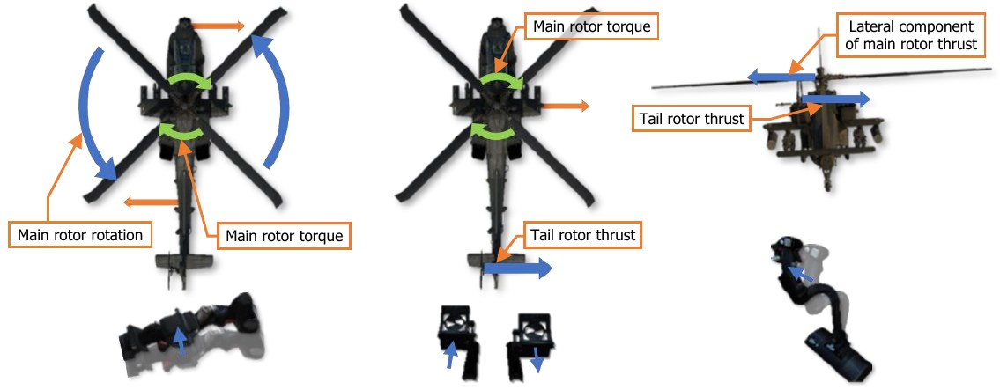
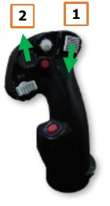
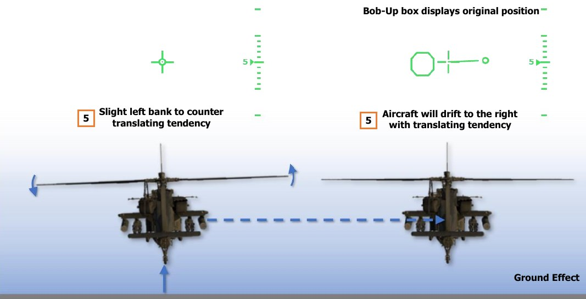
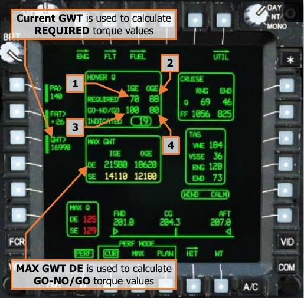
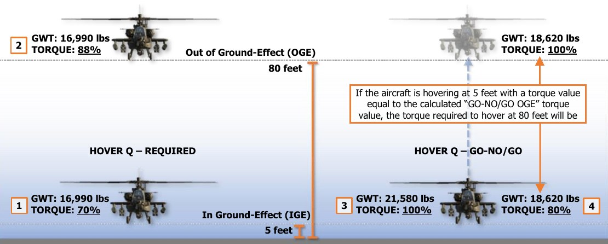

# Hovering Flight

As a helicopter with a typical operational gross weight between 7.5 to 9.5 tons (7,000 to 8,800 kilograms), a
hovering AH-64D can generate enough rotor wash to cause un-secured items to be tossed into the air at best,
or cause damage to other nearby aircraft at worst. As such, AH-64D aircrews will typically ground taxi to a safe
area before lifting off the ground into a hover or performing a takeoff. If this is not possible, aircrews will
immediately reposition their aircraft to a safe area away from equipment or personnel to minimize the time spent
hovering in any area within which they may incur injury to personnel or damage to other aircraft.

It is important to understand that when raising the collective, the torque effect from the counter-clockwise
rotation of the main rotor will cause the fuselage to spin to the right. This is countered by applying left pedal,
which subsequently results in the aircraft drifting to the right from the combined forces of the main rotor torque
and the tail rotor thrust. This in turn is countered by applying left cyclic to hover with a slight left bank.

## Performing a Hover

NVS mode or the searchlight may be used to assist with hovering under low-light conditions, or
a combination of both. Initiating a stationary hover from the ground is typically performed in the
following manner:

1.   Select Hover symbology mode (Symbology Select switch – Aft). Bob-Up symbology mode
     may also be utilized if desired.
2.   Press and hold the force trim (Force Trim/Hold Mode switch – Forward).
3.   With the cyclic in the neutral position, increase the collective while simultaneously applying
     left pedal input to counter the torque from the main rotor. Left pedal input will cause the
     aircraft to roll slightly to the right due to the thrust of the tail rotor. A slight left cyclic input
     should be made to counter the tail rotor thrust and keep the fuselage level.
     
    !!! note
        As the aircraft becomes light on the wheels (approximately 20% below the torque required to hover
        in ground effect; HOVER Q – REQUIRED IGE), the force trim may be released if desired to allow Heading
        Hold to engage as the aircraft comes off the “squat” switch (no longer weight-on-wheels).

4.   As the aircraft is about to leave the surface, a slight drift in heading may be discerned if the amount of anti-
     torque pedal input is not correctly balanced against the torque of the main rotor. If the heading begins to
     drift to the right, tail rotor thrust is insufficient to counter the torque of the main rotor and additional left
     pedal must be applied. If the heading begins to drift to the left, tail rotor thrust is excessive and left pedal
     input should be reduced slightly.
5.   As the aircraft comes off the surface, apply a slight amount of left cyclic to counter translating tendency.
     Adjust the cyclic as required to maintain the position of the helicopter over the surface. Adjust the collective
     as required to maintain altitude over the surface. Adjust the pedals as required to maintain heading.
     
    !!! note
        The combined forces of the main rotor torque and the tail rotor thrust create a sideways translating
        tendency to the right. As a result, the aircraft will normally hover left side low, depending on the additional
        effects of any crosswinds.

## Hover Power Check

Prior to any mission, or after refueling/rearming operations (if feasible), aircrews perform a hover power check
to evaluate their aircraft’s measured hover performance compared to the calculated performance on the MPD
[Performance (PERF)](09.mpd.md/#performance-perf-page) page or their pre-mission performance planning.

A hover power check is performed under the following conditions:
  
    -   Aircraft is in a stationary hover in the vicinity of the takeoff area.
  
    -   Aircraft heading is aligned with the intended direction of takeoff.
  
    -   Aircraft altitude is 5 feet AGL.

The aircrew evaluates the following factors during the
hover power check to validate the aircraft performance
and whether any aspect of their mission may be
impacted:

    -   Flight control responsiveness and positions
              required to maintain the hover. Abnormal
              control positions may indicate an aircraft
              center-of-gravity (CG) that is out-of-limits.
  
    -   A comparison of HOVER Q values on the PERF
              page between the REQUIRED IGE and the
              INDICATED torque values, and whether the
              data matches the pre-mission performance
              planning. This is used to validate whether the
              PERF page is supplying accurate performance
              calculations for use during the mission.
  
    -   HOVER Q values are used to determine
              whether the assessed aircraft performance will
              negatively impact any aspect of the mission.
  
    -   Sufficient fuel is onboard the aircraft for the mission.

{!abbr.md!}
{!dev-docs/ah64d/abbr.md!}
{!docs/ah64d/abbr.md!}
