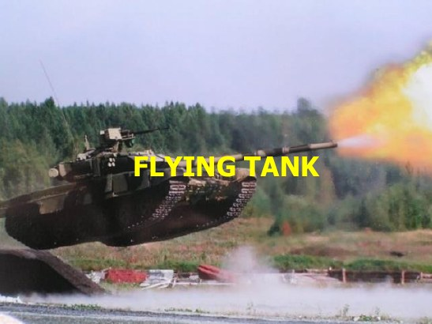
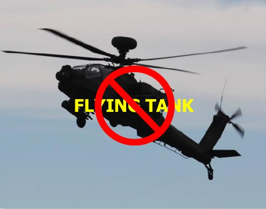
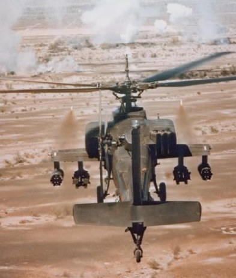
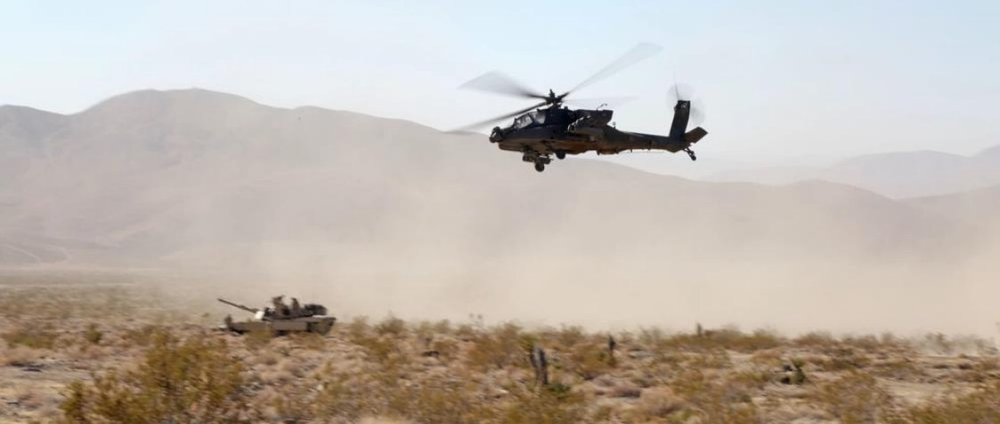
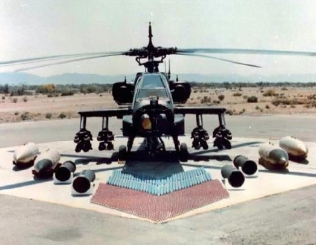
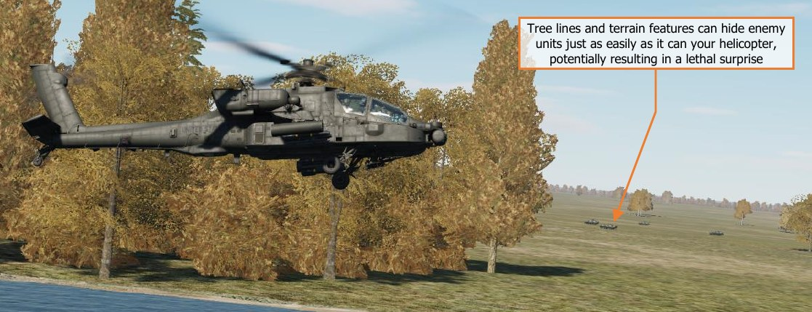
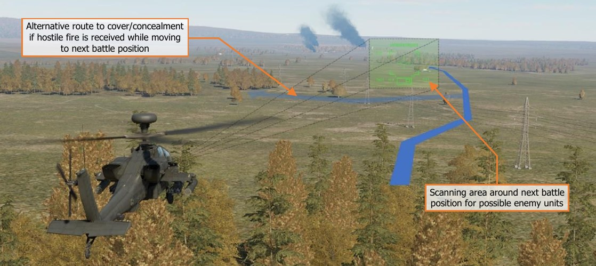
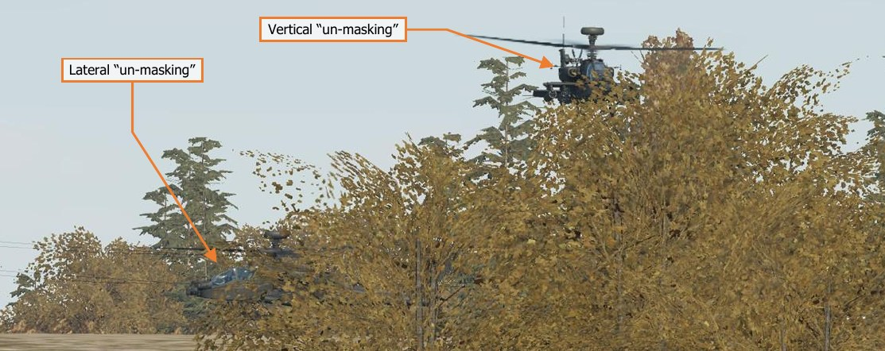

# ATTACK HELICOPTERS IN COMBAT

The most basic description of an attack helicopter is a rotary-winged aircraft that is specifically equipped with
weapons and munitions to destroy targets on the battlefield. For attack helicopters that are designed to engage
medium and heavy armor units, a common euphemism to describe such helicopters is a “flying tank”. While this
may convey the relative lethality these attack helicopters possess when compared to a main battle tank, it often
lends itself to a misconception that attack helicopters are bulletproof or can withstand enormous amounts of
punishment while continuing to engage enemy forces.

Although most attack helicopters are armored or reinforced against various calibers of weapons fire, such
protection is only in the most critical areas of the airframe. Extra armor equates to additional weight, which
hinders performance of the aircraft itself, as well as reducing the amount of fuel or weapons the helicopter can
carry to the fight. Because of this limitation, armored protection is prioritized for the most critical components (to
include the aircrew), with system redundancy and crashworthiness making up the remainder of the aircraft
resistance to hostile fire.

Such redundancy and crashworthiness are implemented to ensure crew survival and recovery of the airframe to
friendly locations for repairs. While “fighting to the death” as shown in the movies may seem worthwhile to
achieve immediate mission results, in reality it hinders the long-term strategic objectives of a military conflict. An
attack helicopter, by its nature as an airborne weapons system, can
achieve something that similarly armed ground vehicles cannot:
mobility and speed across any terrain or obstacle. This speed and
the ability to traverse any terrain by simply flying above it means an
attack helicopter can more easily attack targets behind enemy lines,
engage targets that are beyond the reach of friendly artillery,
perform reconnaissance and screening operations in areas that
ground vehicles cannot, and more rapidly respond to changes on the
battlefield in real-time.

Attack helicopters can be employed independently of ground forces
to shape the battlefield ahead of friendly ground offensives.
Alternatively, they may be employed in conjunction with ground
forces to mass fires against the enemy at decisive points in a battle;
or used as close-in security to protect friendly ground forces from
hostile attack. Depending on which country or branch of service an
attack helicopter originates, such units are employed as either Close
Air Support (CAS) aircraft or as “maneuver units” (much in the same
manner infantry or armor units are employed in conventional
maneuver warfare).

In the CAS role, one key difference between attack helicopters and most fixed-wing attack aircraft is the economy
of firepower. Fixed-wing attack aircraft may be able to physically carry a much greater payload of munitions as
far as pure tonnage is concerned, but purpose-built attack helicopters are often equipped with a greater number
of smaller munitions that are accurate and highly effective against various types of ground vehicles.
In addition, most attack helicopters are also equipped
with machine guns or medium-caliber automatic
cannons coupled with highly accurate fire control
systems that can engage or suppress ground forces at
close ranges, as well as unguided rocket systems for
large area suppression. Most modern attack helicopters
are quite capable of employing all of these weapon
systems against multiple targets within a short time
span, without the time needed by fixed-wing attack
aircraft to reorient between attack runs against
successive targets. This persistence of fire allows attack
helicopters to maintain pressure on enemy forces in a
manner that cannot be matched by fixed-wing aircraft.

## Mobility, Standoff, and Planning

The primary advantage of a helicopter on the battlefield
when compared to their ground vehicle counterparts is
their ability to cover distances across any terrain within a
short amount of time. This battlefield mobility allows
helicopters to rapidly move troops and equipment to the
rear of enemy echelons, rapidly resupply or reinforce
dispersed units, evacuate wounded soldiers to receive
medical treatment, respond to enemy attacks on flanks of
friendly units, respond to calls for fire support along the
front line, or exploit targets of opportunity beyond the
front line.

As discussed above, helicopters are still quite vulnerable to enemy weapons fire. When hovering or flying at low-
speed, helicopters are vulnerable to engagement by ATGM’s or even a tank’s main gun. The primary method for
attack helicopters to mitigate such threat weapons is standoff. Whenever possible, an attack helicopter aircrew
should always choose a battle position that places the enemy within the maximum effective range of their
weapons, while remaining outside the maximum effective range of the enemy’s. When standoff cannot be
maintained due to changes on the battlefield, the aircrew can utilize the attack helicopter’s mobility to rapidly re-
position the attack helicopter to regain and maintain that standoff for as long as possible. This maximizes the
attack helicopter’s lethality against the enemy, while minimizing the enemy’s ability to engage it.

A key part in maintaining standoff from enemy forces, especially in situations where enemy positions are not well
known, is planning. Even before climbing into the cockpit, air routes, terrain, suspected/known enemy positions,
enemy weapon systems, and even the weather, should all be evaluated to understand how each factor will affect
the aircrew’s ability to maintain standoff or remain masked behind terrain from the enemy. However, even with
a thorough plan, discretion should be taken when moving within hostile territory. Blindly bounding from one
position to the next without performing reconnaissance of the route to that next position, and any potential fields
of observation or fire, is a good way to be surprised by a missile or stream of tracers directed at your aircraft.

It is very possible that an attack helicopter aircrew can get themselves pinned down by hostile ground forces. If
the aircrew rushes from one terrain feature to the next without verifying the security of their next position or the
route to get there, the aircrew may be unable to go forward, they may be unable to go back, and if they climb
above the terrain, they may be engaged by air defenses. In this instance, the aircrew may need to risk the
success of their mission by expending significant quantities of munitions to fight their way out.

Weapons discipline is another practice that is important. Despite its firepower, an attack helicopter only has a
limited amount of munitions onboard to achieve the mission. These weapons should be used in a manner that
achieves the maximum effect on the battlefield whenever possible. Destroying every enemy that is detected while
enroute to the objective may feel satisfying, but running out of munitions prior to achieving the mission
objective(s) will remove that satisfaction quickly. Attack helicopters, by nature of their mobility and standoff, have
the advantage of being more selective about what engagements they choose to commit to, from where they may
engage their targets, and what targets they bypass and report to higher echelons.

Even when the primary objective is spotted, tactical patience should be exercised to fully develop the situation
and determine what else may be in the area. Prior to pulling the trigger, scanning the area for other enemy
positions nearby is important to ensure survival of the attack helicopter team. If the team has enough weapons
to spare, it may be wise to sanitize the immediate area of any threats (such as air defense units) prior to engaging
the primary targets.

## Masking/Un-Masking and Terrain Flight

During armed conflicts in theaters which contain large numbers of air defenses, low-level tactics are the best
advantage that attack helicopters can employ. Although fixed-wing aircraft can use high speeds to minimize the
time spent inside the engagement zone of an air defense unit, helicopters must use terrain and other forms of
cover to limit their exposure to attain a reasonable level of survivability. The level of exposure and time spent
outside of cover and concealment should be primarily dependent on threat reaction time, but also may be
predicated on the time needed to perform sensor scans of an area or employ a weapon against a target. These
two factors – time needed by the enemy to detect/engage you versus time needed by you to detect/engage the
enemy – should constantly be weighed against the other throughout the mission as the tactical situation evolves.

When used in a conflict against armor supported by air defenses, attack helicopters such as the AH-64 are often
maneuvered akin to an infantryman or a sniper, rather than a conventional aircraft. When attack helicopters
utilize terrain and other forms of cover and concealment to remain hidden from enemy observation, this is known
as “masking”. When moving between battle positions near enemy units, attack helicopters bound from one battle
position to the next to minimize exposure to enemy fire (much in the same manner an infantryman bounds from
cover to cover) in an effort to remain undetected for as long as possible until they are ready to attack.

To perform sensor scans of the battlefield or engage enemy targets with their weapon systems, attack helicopters
must “un-mask” from behind cover. Depending on the nature of the cover/concealment, attack helicopters may
un-mask vertically or laterally to expose their sensors or weapon systems. When an attack is initiated, the enemy
should be engaged within the shortest amount of time possible before re-masking and relocating to a different
battle position. Weapons fire reveals the attack helicopter’s presence to the enemy, just as a sniper reveals his
position by firing on the enemy.

The most advantageous factor attack helicopters can use for their protection is terrain. Mother Earth will always
provide the best protection from enemy observation and weapons fire, just assuredly as it protects the
infantryman. However, low-altitude flight can be quite demanding on an aircrew, especially at night or in low-
visibility conditions. As such, the speed that helicopters can attain when operating at low altitudes is dependent
on the nature of the terrain, the tactical situation, the time of day, enemy air defenses, and how much power
margin is available to the aircrew.

Conversely, in a threat environment where air defenses are low and the most prevalent threat to helicopters is
small arms fire such as rifles or machine guns, it may be advantageous to maintain a higher altitude outside the
engagement ranges of such weapons. This will improve the range at which aircrews can detect the enemy, as
well as placing less demand on an aircrew when compared to flying at low altitude, allowing them to focus on
engaging the enemy.
{!abbr.md!}
{!dev-docs/ah64d/abbr.md!}
{!docs/ah64d/abbr.md!}
