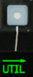

# Multi-Purpose Displays (MPD)

The revised cockpit and avionics of the AH-64D were designed to provide an efficient pilot interface, through
which the human factors were heavily considered to optimize cockpit workflow, known as MANPRINT. The
predominant means of facilitating this interface is through two Multi-Purpose Displays (MPD) within each
crewstation, and incorporating a “management by exception” principle within the avionics:

- Most aircraft systems are managed automatically without aircrew interaction by default; but may be
        monitored or managed directly by the aircrew if necessary.
- Information that is not relevant to the current task, conditions, or mode is not presented to the aircrew.
- Information that is of critical importance to the aircrew is displayed automatically without crewmember
        action, also known as auto-paging.
- Functions or commands that would create a conflict between crewstations or would otherwise interfere
        with the current task are disabled or inhibited, also known as “barriered”.

The MPDs themselves are 6 × 6 inch color liquid crystal displays that allow the Pilot and CPG to independently
access different functions or view different elements of information. There are two identical MPDs in each
crewstation. Functions that would otherwise be controlled by switches or physical controls in other aircraft are
accessed through the MPDs in the AH-64D.

If on external power, weight-on-wheels, and the Power Levers are set to OFF, the MPDs will enter a screensaver
mode if no buttons are pressed within 5 minutes. Pressing a button on either MPD will re-initialize the MPDs.

1. **Variable Action Buttons (VAB)**. Selects the option corresponding with the displayed text adjacent to the
     MPD button itself.

    -   VAB T1-T6. The top row of Variable Action Buttons are numbered from T1 starting on the far left to
            T6 on the far right.

    -   VAB L1-L6. The left column of Variable Action Buttons are numbered from L1 starting on the at the
            top to L6 at the bottom.

    -   VAB R1-R6. The right column of Variable Action Buttons are numbered from R1 starting on the at the
            top to R6 at the bottom.

    - VAB B1-B6. The bottom row of Variable Action Buttons are numbered from B1 starting on the far left
          to L6 on the far right.

1. **VID Knob**. Adjusts the brightness of the video or map underlay independently of the primary symbology
     displayed on the MPD.

1. **BRT Knob**. Adjusts the overall brightness setting of the MPD display within the overall brightness level
     selected by the Mode Knob.

1. **Mode Knob**. Sets the brightness level of the MPD.

    - DAY. Sets the MPD to daytime brightness levels.

    - NT. Sets the MPD to nighttime brightness levels.

    - MONO. Sets the MPD to nighttime brightness levels and an NVG-friendly monochromatic color scheme.

1. **Asterisk (*) Button**. Not implemented.

1. **Fixed Action Buttons**. Sets the MPD to the corresponding page.

    - FCR. Displays the Fire Control Radar page.

    - WPN. Displays the Weapon page.

    - TSD. Displays the Tactical Situation Display page.

    - VID. Displays the Video page.

    - COM. Displays the Communications page.

    - A/C. Displays the Flight page if in the air. Displays the Engine page if on the ground with weight-on-
          wheels.

1. **M Button**. Variable Action Button B1 is used to access the Menu and DMS pages.

    - Menu page: If any page is displayed on the MPD other than the Menu page, this button will display
          the Menu page.

    - DMS page: If the Menu page is displayed on the MPD, this button will access the DMS page.

#### MPD Paging

The MPD Fixed Action Buttons and the Menu page provide immediate access to most aircraft systems
or information. Upon pressing any Fixed Action Button or selection of any page option from the Menu
page, the MPD will display the requested page, which will be denoted by the text displayed above the
M button (VAB B1). If this text is boxed, the MPD is displaying the corresponding parent, or “top-
level”, page. If the text is un-boxed, a sub-page has been accessed from the parent page.

Sub-page options are denoted by a right-facing arrow placed above the text of the sub-page option.
When the first sub-page level is accessed, the corresponding sub-page text becomes boxed, removing
the box from the parent page text above the M button (VAB B1). If a second sub-page level is accessed
from the first sub-page, the second sub-page text becomes boxed, with the first sub-page text boxed
in a “partial-intensity” green.

Some MPD pages include options to display the existing page in a different format, which presents
different elements of information on the current page. Format options differ in appearance from sub-
page options in that a right-facing arrow is not displayed above the corresponding text.

An example of this distinction can be seen on the Weapon (WPN) page below. Five sub-page options
are displayed along the top row of Variable Action Buttons, whereas three additional WPN page
formats may be selected along the bottom row.

#### Auto-paging

Some MPD pages will be displayed automatically when certain events occur; this is called “auto-paging”.
Autopaging by the DMS system is automatic and contextual based on specific aircraft conditions.

DMS autopaging occurs when a critical aircraft emergency or malfunction occurs that could result in death to the
aircrew and/or catastrophic loss of the aircraft, or when an engine start sequence is initiated by the Pilot. DMS
autopaging can be suppressed in the CPG crewstation from the DMS Utility page.

- The ENG page will be displayed in Emergency format when a new Warning message is displayed.
- The ENG page will be displayed in Emergency format when the EMERG HYD button on the Emergency
      panel in either crewstation is pressed.
- The ENG page will be displayed in Ground format when an ENG START switch is engaged on the Pilot’s
      Power Quadrant panel.

ASE autopaging occurs when a threat is detected that exceeds the ASE Autopage threshold set within the
crewstation on the TSD Utility or ASE pages. (See Aircraft Survivability Equipment for more information.)

- The TSD page will display when the RLWR or RFI detects radar or laser energy exceeding the ASE
         ASE Autopage threshold. If the ASE page is displayed, ASE autopaging is suppressed.
- The FCR page will be displayed when the selected sight is changed from HMD or TADS to FCR. If the
 FCR page is displayed on the CPG’s TDU, FCR autopaging is suppressed in the CPG crewstation.

FCR autopaging occurs when the FCR is selected as that crewstation’s sight.

#### Variable Action Button (VAB) Functions

The function of a Variable Action Button is indicated by the format of its label. When a VAB command is in-
progress, the label will be displayed in “inverse video”.
                                                          

**Page button**

Displays a different MPD page or
sub-page, annotated by an
arrow. When a sub-page is
accessed, the button label will be
boxed.

**Momentary button**

Commands an action. The
button
displayed in inverse video
while the action is being
performed.

**Maintained button**

Changes the page to a
different format or toggles
an option or mode. The
state of the button is
maintained if the MPD is
switched to a different page.

**On/Off button**

Toggles
component on or off. If the
circle is hollow, the system is
not powered. If the circle is
filled, the system is powered.

**Disabled button**

Buttons that are inhibited or
“barriered” from selection will
be marked with a green line
next to their label.

**Missing/Invalid Data button**

Button labels displayed in white with a
question mark indicate data that is
missing or currently invalid.

**Paging buttons**

Cycles forward and back
through multiple pages of
data displayed on the MPD.

**Two-State button**

Toggles a mode or option between
two states, which are maintained
after switching to a different page.

**Grouped buttons**

Selects a mode or option from
a list of grouped buttons. The
label along the border of the
grouped buttons displays
what the options pertain to.

**Multi-State button**

Displays an expanded list from which to choose a
mode or option. Once a selection is made, the
expanded list will collapse. If a different option is
no longer desired, pressing the currently selected
option with
the
displayed
around its
label
collapse the
list with no
changes
made.

**Data Entry button**

Pressing a button marked
with a > symbol will activate
the Keyboard Unit for data
entry. While the KU is
active, the current data
entry is boxed. If the KU
entry is valid, the new data
is displayed once accepted.

**Search buttons**

Scrolls up and down
through a list of grouped
button options.

#### MPD Cursor

Each crewstation has an independent MPD cursor for accessing MPD commands or interacting with
MPD displayed data and symbols. The Cursor Controller on the Collective Mission Grips and TEDAC
Left Handgrip is used to slew the cursor on the active MPD. The cursor provides the crewmembers
a means to select VAB commands on the MPD without removing their hands from the flight controls
or the TEDAC handgrips. When placed over a VAB label, the label text will be bolded to indicate
Cursor-Enter can be pressed.

The cursor can be moved to the opposite MPD using the Cursor Display Select button on the
Collective Mission Grip or TEDAC Left Handgrip or by “bumping” the cursor between MPDs. To
bump the cursor to the opposite display, move the cursor to the inboard edge of the MPD, release input on the
Cursor Controller, and then re-apply pressure input toward the opposite MPD. The cursor can also be utilized on
the TDU in the CPG crewstation if the FCR page is displayed on the TDU. However, the cursor can only be moved
to the TDU FCR display using the “bump” method.

The MPD cursor itself may be displayed in several formats, depending on the specific page that is displayed on
the MPD and the position of the cursor itself.

**Normal format**

The cursor may be used for selecting
Variable Action Button commands
along the bezel of the MPD.

**Crosshairs format**

The cursor may be used for selecting
symbols or map locations within the
central “footprint” of the MPD page.

**Symbol Select format**

A symbol is identified for cursor
selection using Cursor-Enter.

**Target Reference Point format**

The cursor is being used to place a
TRP-shaped Priority Fire Zone on the
TSD Battle Area Management page.

**Opposite Crewmember format**

Distinguishes the cursor belonging to
the opposite crewmember from the
crewmember’s own cursor, if enabled
for display on the TSD.

#### MPD Symbology Colors

All MPD pages share a 6-color template for consistent indication of various types of symbology. These colors
increase the efficiency of a crewmember’s interpretation and prioritization of displayed data within the cockpit.

- Green. Default symbology color, normal conditions, and Advisory messages.

- Yellow. Hazards to flight, intermediate or transient operating conditions, and Caution messages

- Red. Targets, enemy threats, conditions exceeding allowable parameters, and Warning messages.

- White. Items requiring a crewmember’s attention, or invalid selection/data.

- Cyan. Ownship, friendly units, pitch attitudes above the horizon (sky).

- Brown. Pitch attitudes below the horizon (ground).

In addition to colors, the intensity of the symbology itself may also be adjusted to indicate relevance or recency
of the information.

- Full-intensity color. Relevant or current data.

- Partial-intensity color. Less relevant or stale data.

### Menu (M) Page

The Menu page provides immediate access to any “top-level” MPD page within the three page categories, as well
as the DMS, VIDEO, VCR, and Favorites (*) pages. The Menu page may be accessed at any time by pressing the
M button (VAB B1).

#### Page Categories

Most MPD pages are grouped within one of three categories: AIRCRAFT, COMMUNICATIONS, and MISSION.

**AIRCRAFT pages**

Aircraft systems.

- ENG Engine and powertrain information 
- FLT Flight instruments 
- FUEL Fuel systems 
- PERF Performance data 
- UTIL Utility systems

**COMMUNICATION pages**

Communication systems. 

- DL Datalink 
- XPNDR Transponder 
- UHF UHF radio 
- FM FM1/FM2 radios 
- HF HF radio 
- COM Comms presets and network management

**MISSION pages**

Navigation, weapons, radar, and defensive systems. 

- ASE Aircraft Survivability Equipment 
- TSD Tactical Situation Display 
- WPN Weapon systems 
- FCR Fire Control Radar

### Engine (ENG) Page

The ENG page displays engine and powertrain data and is displayed in either Ground, Flight, or Emergency
formats, based on aircraft status. ENG page data may be displayed as digital numerical values and/or analog
vertical tapes.
  
-    Values displayed in green represent normal operating parameters.

-    Values displayed in yellow represent intermediate or transient operating parameters that will result in
           component damage or fatigue if maintained continuously.

-    Values displayed in red represent maximum operating parameters that have been exceeded that has
               most likely resulted in component damage or fatigue and may result in imminent failure.

For data that is also displayed as an analog tape, the entire vertical tape is color-coded to indicate operating
condition, and the width of the tape will widen when outside of normal operating parameters. The increase in
the width of the tape allows crewmembers to recognize when indications are outside normal operating parameters
when the MPD is set to MONO (monochromatic) mode.

#### Engine Page, Ground format

During initial start-up of the APU, the ENG page will be displayed in Ground format, with engine oil and hydraulic
pressure windows displayed in the lower half of the page. The ENG page will return to Ground format any time
the ENG START switches are moved to the START or IGN ORIDE positions on the Pilot’s Power Quadrant panel.

1. **Engine Torque (TQ)**. Displays the torque, as a percentage, that is being exerted by engines 1 and 2 on
       the powertrain system as measured at each engines’ power turbine output shaft.

1. **Engine Turbine Gas Temperatures (TGT)**. Displays the temperature, in degrees Celsius, of the exhaust
     gases being expelled by the gas generator sections of engine 1 and 2 into each engines’ power turbine
     sections.

1. **Maximum TGT Limit**. Indicates the maximum engine turbine gas temperature (TGT) limit of 949° C.

1. **Intermediate TGT Limit**. Indicates the intermediate engine turbine gas temperature (TGT) limits of 870°
     C and 878° C.

1. **Maximum Torque Limit**. Indicates the maximum engine torque limit for the current main rotor speed NR.

1. **Digital Readout**. Digital readouts are displayed to provide precise, numerical values of engine and
     powertrain components.

1. **Analog Tape**. Vertical analog tapes are color-coded and varied in width to provide rapid and intuitive
     analysis of display normal, intermediate/transient, and maximum operating ranges of the engines and
     powertrain. As the digital readouts of torque, temperature, or speed increase, the analog tapes increase in
     length.

1. **Maximum NR Limit**. Indicates the maximum main rotor speed (NR) limit of 110%.

1. **Powertrain NR/NP Tachometer**. Displays the main rotor speed (NR), as measured at the main
     transmission, as a percentage. Includes analog tapes for NR and each engines’ NP speed.

1. **Engine NP Tachometer**. Displays the power turbine speed of engines 1 and 2, as a percentage.

1. **Engine NG Tachometer**. Displays the gas generator speed of engines 1 and 2, as a percentage.

1. **Engine Start Box**. Displayed when either Air Turbine Starter (ATS) is engaged in the START or IGN ORIDE
    modes.

    - If either ENG START switch is positioned to the START position on the Pilot’s Power Quadrant panel,
          “ON” will be displayed under the corresponding NG digital readout to indicate that a normal start
          sequence has been initiated for that engine.

    - If the ENG START switch is positioned to the IGN ORIDE position on the Pilot’s Power Quadrant panel,
          “OVRD” will be displayed under the corresponding NG digital readout to indicate that the engine is being
          motored by the ATS.

1. **Hydraulic System Pressures (PSI)**. Displays the hydraulic pressures of the primary (PRI) and utility
    (UTIL) hydraulic systems, and the hydraulic accumulator (ACC), in pounds-per-square-inch. The hydraulic
    system pressures box is removed when the ENG page transitions to In-Flight format.

1. **Engine Oil Pressures (PSI)**. Displays the oil pressures of engines 1 and 2, in pounds-per-square-inch.
    The engine oil pressure box is removed when the ENG page transitions to In-Flight format.

1. **SYS sub-page**. Displays the ENG Systems sub-page.

1. **ETF sub-page**. Not implemented.

1. **WCA sub-page**. Displays the DMS Warning/Caution/Advisory sub-page.

#### Engine Page, In-Flight Format

When both power levers are brought to FLY, the ENG page will transition from Ground to In-Flight format.

1. **Engine TORQUE % (Indications & limits)**. Displays the
    torque, as a percentage, that is being exerted by engines 1 and 2
    on the powertrain system as measured at each engines’ power
    turbine output shaft. The analog tapes and digital readouts will be
    displayed separately for each engine in red when above these
    limits under these conditions.

    The red maximum limit is dynamic and will re-position based on
    the maximum allowable torque for the current conditions, which
    is driven by the main rotor RPMs (NR) and whether the aircraft is
    operating under dual- or single-engine power.
    
    If NR is <50% the TQ red line will
    be displayed at 30%.

    

    If NR is <90% the TQ red line will
    be displayed at 70%.

    

    If NR is >90% the TQ red line will be displayed at 115% under dual engine
    power and at 125% under single-engine power.

    

    If either TQ indicates <51%, the other engine’s TGT limiter is increased to
    896 °C, allowing the healthy engine to operate in a single-engine
    contingency mode. A yellow sub-range limit will be displayed at 123% within
    both TQ analog tape ranges above the TQ digital readout, delineating
    between the 2.5-minute single-engine contingency range and the 6-second
    single-engine transient range.
    
    If either engine TQ enters the dual-engine transient operating
    range (101-115% when NR is >90%) a 6-second countdown timer          
    will be displayed instead of the engine numbers below the analog
    tapes.
                                                                         
    If either engine TQ enters a single-engine contingency range (111-
    122% when NR is >90%) a 2.5-minute countdown timer will be           

    displayed instead of the engine numbers below the analog tapes.
    If either engine TQ enters a single-engine transient operating range 

    (123-125% when NR is >90%) a 6-second countdown timer will be
    displayed instead of the engine numbers below the analog tapes.

    

1. **Engine TGT °C (Indications & limits)**. 

    Displays
    the temperature, in degrees Celsius, of the exhaust
    gases being expelled by the gas generator sections
    of engine 1 and 2 into each engines’ power turbine
    sections.

    

                                                              
    Each engine incorporates a TGT limiter within the
    Digital Electronic Control that will limit the engine to  
    a maximum TGT of 867±12 °C when under dual
    engine conditions, or 896±12 °C when under single-
    engine conditions.
                                                              
    If either engine’s torque indicates <51%, the other
    engine’s TGT limiter is increased to 896±12 °C,
    allowing the healthy engine to operate in a single-
    engine contingency mode for 2.5 minutes.

    TGT timers indicate the maximum acceptable time
    limit for the intermediate, contingency, and transient
    operating ranges.
                                                              
    If an engine’s TGT enters an intermediate operating
    range, a 30-minute (811-870 °C) or 10-minute (871-
    878 °C) countdown timer will be displayed instead
    of the engine numbers below the analog tapes.
                                                              
    If under single-engine power, a third intermediate
    sub-range limit will be displayed, delineating
    between the 2.5-minute single-engine contingency
    range (879-896 °C) and the 12-second transient
    range (897-949 °C). When operating within these
    ranges, a 2.5-minute or 12-second timer will be
    displayed respectively.
    The maximum TGT limit is 949 °C.

1. **Engine Oil & Hydraulic System Pressures (Indications & limits)**. Displays the oil pressures of engines
    1 and 2, in pounds-per-square-inch; or the hydraulic pressures of the primary (PRI) and utility (UTIL)
    hydraulic systems, and the hydraulic accumulator (ACC), in pounds-per-square-inch. If these systems are
    outside their normal operating parameters, the applicable box will be displayed above the digital NP readouts
    when the ENG page is in In-Flight format.

     If the oil pressure of an
     engine is above 120 PSI
     or below 23 PSI, the
     digital readout for that
     engine will be displayed
     in red and boxed.

    

     If the hydraulic pressures of the primary
     or utility hydraulic systems, or the
     accumulator, are above 3300 PSI, or if
    a PSI LOW or LEVEL LOW
    caution exists for either
    system, the digital readout for
    that hydraulic system will be
    displayed in yellow.

    

    If the hydraulic pressures of
    the primary or utility hydraulic
    systems, or the accumulator,
    are above 3300 for greater
    than 5 minutes, above 3400
    PSI for 5 seconds, or below
    1260 PSI, the digital readout
    for that hydraulic system will
    be displayed in red and boxed.

1. **Engine NP % (Indications & limits)**. 

    

    Displays engine power turbine
    speed (NP) as a percentage. NP is displayed as analog tapes on either side
    of the main rotor (NR) analog tape and digitally to the right of the #2    
    engine NP analog tape.
     If the power turbine speed of an engine is between 106-121%, the analog   
     tape and digital readout for that engine will be displayed in yellow, with
     the digital readout boxed at 107% and above, and a 12-second countdown    

     timer will be displayed instead of the engine numbers below the analog
     tapes.
     If the power turbine speed of an engine is above 121%, the analog tape
     and digital readout for that engine will be displayed in red (with the digital
     readout boxed).

1. **Engine NG % (Indications & limits)**. 

    

    Displays engine #1 and #2 gas
    generator speeds (NG) as a percentage. NG is indicated digitally to the right of
    the #2 engine NP analog tape, and below the engine NP digital readouts.
     If the gas generator speed of an engine is between 102.3-105.1%, the digital
     readout for that engine will be displayed in yellow.
     If the gas generator speed of an engine is above 105.1% or below 63.1%, the
     digital readout for that engine will be displayed in red and boxed

1. **Transmission NR % (Indications & limits)**. 

    

    Displays main rotor
    speed (in percent NR) as analog vertical tapes with digital readouts and
    maximum limits. NR is indicated digitally above the center analog tape.
     If the rotor is operating within 106-111% NR, the analog tape and digital
     readout will be displayed in yellow.
     If the rotor is operating below 95% or above 110%, the analog tape
     and digital readout will be displayed in red.

#### Engine Page, Emergency Format

If Warning or Caution messages are displayed on the EUFD, the ENG page will enter Emergency format and
display the Warning or Caution messages in the lower half of the page.

If the hydraulic or engine oil pressures are out of normal operating parameters, the applicable window will be
displayed in the top right corner of the ENG page.

1. **Warning Message**. Warning messages are displayed in red and alert the crew to critical aircraft
    emergencies or malfunctions that could result in death to the aircrew and/or catastrophic loss of the aircraft.

1. **Caution Message Area**. Caution messages are displayed in yellow and alert the crew to less critical but
    potentially hazardous aircraft malfunctions or conditions that could affect safe flight operations.

#### ENG Systems (SYS) Sub-page

The SYS page displays powertrain pressures and temperatures, hydraulic pressures, environmental temperatures
of the Extended Forward Avionics Bays (EFAB) and cockpits, and stabilator angle and nominal speed. Either
generator may be disabled from this page.

1. **Engine Oil Pressures (PSI)**. Displays the engine oil pressures, in pounds-per-square-inch.

1. **Engine Nose Gearbox (NGB) Oil Pressures (PSI)**. Displays the
      oil pressures of the engine nose
      gearboxes, in pounds-per-square-
      inch.

      If the nose gearbox oil pressure is 
      below 30 PSI, the digital readout
      will be displayed in red and boxed. 

    

1. **Engine Nose Gearbox (NGB) Oil Temperatures**. Displays the
      oil temperatures of the nose
      gearboxes for engines 1 and 2, in
      degrees Celsius.
                                          
      If the oil temperature of a nose
      gearbox is above 134°C, the
      digital readout will be displayed in
      red and boxed.

    

1. **Transmission (XMSN) Oil Pressures (PSI)**. Displays
   the oil pressures for the main
   transmission, in pounds-per-
   square-inch.

    If the transmission oil pressure
    is below 30 PSI, the digital
    readout will be displayed in red
    and boxed.

    

1. **Transmission (XMSN) Oil Temperatures**. Displays the
    oil pressures for the main
    transmission,  in   degrees
    Celsius.

    If    the    transmission    oil
    temperature is above 134 in
    °C, the digital readout will be 
    displayed in red and boxed.

    

     NOTE: During extended APU operations on the ground without either engine operating, monitor the XMSN
     OIL TEMP. Do not operate the APU with a XMSN OIL TEMP (1 or 2) between 120°-130° C for greater than
     5 minutes. If the temperature exceeds 130° C, shut down the APU and allow the transmission oil to cool for
     30 minutes.

1. **AC Generator Power**. Enables/Disables AC Generators 1 and 2. If both generators are disabled, the MPDs
     will blank and the generators must be reset in the Pilot crewstation to re-enable AC power. (see Pilot’s Check
     Overspeed Test/Generator Reset Panel)

1. **Hydraulic System Pressures**. Displays the hydraulic pressures of the primary (PRI) and utility (UTIL)
     hydraulic systems, and the hydraulic accumulator (ACC), in pounds-per-square-inch.

1. **ECS Temperatures**. Displays the environmental temperatures inside the forward and aft sections of each
     Extended Forward Avionics Bay (EFAB) and each cockpit, in degrees Fahrenheit.

1. **Stabilator Status**. Displays the current stabilator angle and nominal airspeed restriction. The angle is
     referenced to the trailing edge of the stabilator and displays a range of 10° UP to -35° DN.
     If the stabilator is in manual mode, the angle and nominal airspeed values are displayed in white.
     If the stabilator is detected as failed, the nominal airspeed value will be displayed in yellow.
     If the position of the stabilator is unknown, the angle indication will be displayed as a white “?” and the
     nominal airspeed will be displayed in red as the true airspeed equivalent of 90 knots IAS.

### Flight (FLT) Page

The FLT page displays flight and basic navigation information; and includes controls for configuring navigation
and instrument settings such as altimeter settings, altitude warnings, and units of measurement.

1. **Heading Tape**. Displays a 180° hemisphere of magnetic headings. Major tick marks are displayed in 30°
     increments and marked by a cardinal direction or heading in the tens value. Minor tick marks are displayed
     in 10° increments.

1. **Aircraft Heading**. Displays a digital readout of the aircraft’s current magnetic heading in 1° increments,
     superimposed over the Heading Tape.

1. **Lubber Line**. The Lubber Line is aligned to the centerline of the aircraft and serves as a reference for both
     the aircraft heading and for the Bank Angle Indicator when in Cruise symbology mode.

1. **Engine Torque**. Displays the highest torque value of the two engines, in 1% increments. A box will be
     displayed around the torque at 98% or greater. If the difference in engine torque values exceeds 12%, the
     torque digital readout will flash.

1. **Navigation Fly-To Cue**. Indicates the location of the current point selected for navigation. Also called the
     “homeplate” symbol, the Navigation Fly-To Cue is sized so the Flight Path Vector fits within it for precise 3-
     dimensional navigation. The Navigation Fly-To Cue is not displayed when the aircraft is weight-on-wheels.

1. **Horizon Line**. Indicates the horizon position and orientation relative to the aircraft nose, which is referenced
     to the Waterline.

1. **True Airspeed**. Indicates the true airspeed (TAS) of the aircraft in 1 knot increments, from 0 to 210 knots.
     The airspeed indication is displayed in red and boxed if the airspeed exceeds VNE.
     When Attitude Hold is engaged, a rounded “status window” box is displayed around the TAS digital readout.

1. **Pitch Ladder**. Indicates aircraft pitch attitude. Major pitch ladder increments are displayed at ±10°, ±20°,
     ±30°, ±45° and ±60° pitch, with minor increments placed at ±5°, ±15°, ±25°, ±37.5°, and ±52.5°.

1. **Waypoint Status**. Displays the point selected for navigation, its distance in kilometers or nautical miles,
     and estimated time enroute (ETE). The ETE is based on the aircraft’s current ground speed, and is presented
     in HH:MM format when the ETE is ≥5 minutes, or M:SS format when ETE is <5 minutes. The ETE is not
     displayed when ground speed is <15 knots or ETE is >10 hours. Waypoint Status information is not displayed
     if there is no active destination point.

1. **Ground Speed**. Indicates the speed across the surface in 1 knot increments. Ground Speed is only displayed
    when the primary INU is aligned.

1. **Bank Angle Indicator**. Indicates bank angle relative to the horizon, with major tick marks placed at 10°
    increments and minor tick marks placed at 5° increments. When the Bank Angle Indicator is aligned with
    the lubber line below the heading tape, the aircraft is in a level attitude.

1. **Barometric Altitude**. Indicates the barometric altitude when Cruise mode symbology is displayed.
    Barometric Altitude is displayed in 10-foot increments from -2,300 feet to 20,000 feet.

1. **Flight Path Vector**. The Flight Path Vector (FPV) represents the point towards which the helicopter is
    flying. It is a 3-dimensional representation of the aircraft’s velocity vector. The FPV is not displayed if the 3-
    dimensional velocity is <5 knots ground speed, or if the aircraft is weight-on-wheels.

1. **Vertical Speed Indicator (VSI)**. The Vertical Speed Indicator moves up and down the rate-of-climb scale
    to indicate vertical speed. The VSI becomes saturated at the ±1,000 fpm tick marks at the top or bottom of
    the Rate-of-climb Scale, augmented by digital readouts of rate-of-climb in 100 fpm increments.

1. **Rate-of-climb Scale**. Major tick marks are placed at 0, ±500 and ±1,000 feet per minute (fpm) rates of
    climb/descent. Minor tick marks are placed in 100 fpm increments between 0 and ±500 fpm. When the rate-
    of-climb/descent exceeds ±1,000 fpm, a digital readout to the nearest 100 fpm value is displayed adjacent
    to the 1,000 fpm major tick marks.
     When Altitude Hold is engaged, a rounded “homeplate” box is displayed next to the Rate-of-climb Scale at
     0 fpm.

1. **Radar Altitude**. Indicates the radar-detected altitude above ground level from 0 to 1,428 feet. The Radar
    Altitude is displayed in increments of 1 foot from 0 to 50 feet in altitude, and increments of 10 feet between
    50 feet and 1,428 feet in altitude. The Radar Altitude is not displayed when the altitude exceeds 1,428 feet
    above ground level.

1. **Turn Rate Indicator**. Indicates the rate of turn as the aircraft enters a bank. The rate of turn is displayed
    as a solid square moving underneath three “doghouses”. The center doghouse cooresponds with no turn
    (level attitude), and the left and right doghouses coorespond with standard-rate turns to the left and right,
    respectively. If the indicator is located between the center doghouse and either of the outer doghouses, the
    aircraft is in a half-standard-rate turn.

1. **Skid/Slip Indicator**. Also called the “trim ball”; indicates whether the aircraft is in coordinated flight (also
    known as “in aerodynamic trim”, or simply “in trim”). With the ball is centered between the tick marks, the
    aircraft is in coordinated flight, which minimizes drag. If the ball is left of center, applying left pedal will
    adjust tail rotor thrust to bring the aircraft back into coordinated flight. Likewise, if the ball is right of center,
    applying right pedal will adjust tail rotor thrust to bring the aircraft back into coordinated flight.

    

1. **Engine TGT**. Displays the highest of the two engines’ Turbine Gas Temperature (TGT) indications if
    operating in an intermediate or contingency TGT limit.
     When operating under dual engine intermediate power, the TGT (in °C) will be displayed during the final
     two minutes of either the 30-minute or 10-minute allowable timers.
     When operating under single engine contingency power, the TGT (in °C) will be displayed during the entire
     2.5 minutes allowable for operating in the contingency power temperature range.

1. **G Status**. Displays the accelerometer measured G-force on the aircraft when the load factor exceeds 2G’s,
    or if within ¼G of the G load factor limit under the current conditions of velocity, density altitude, and gross
    weight.

1. **Stabilator Position**. Displays the position of the stabilator when the stabilator is in Manual mode; the
    symbol is not shown when the stabilator is in Automatic mode. The position is shown graphically on an arc
    from 10° trailing edge up to -35° trailing edge down, with a small tick mark at 0°.
     The color of the symbol indicates operating mode:

    -     White: Stabilator is in Manual mode.

    -     Yellow: Stabilator Manual mode has failed. If the stabilator position is known, it is shown graphically;
              otherwise, a question mark “?” symbol is shown inside the stabilator symbol. The maximum true
              airspeed for the current stabilator position is shown below the symbol.

    -     Red: Stabilator manual mode has failed, and current airspeed exceeds the maximum true airspeed for
              current stabilator position.

1. **Waterline Bias**. Toggles the pitch bias of the waterline no bias and -5°. The “-W-” symbol will be boxed
    when bias is applied.
     NOTE: Adjusting the pitch bias on this page adjusts the pitch bias for both crewstations, to include the pitch
     bias of the horizon line in Transition and Cruise symbology modes.

1. **Waterline Symbol**. The waterline symbol indicates nose position and is a central reference for the pitch
    ladder. The symbol can be biased (adjusted upward or downward from its normal position) by using the FLT
    SET format. When the waterline is biased, the symbol will be partially “filled”.

    

1. **Command Heading**. Indicates the magnetic heading to the Navigation Fly-To Cue.

1. **Extended Bank Angle Scale**. When the bank angle exceeds 20°, the scale is displayed in white and will
    be extended in the direction of the current bank.

1. **HI Altitude Alert**. If an altitude value other than 0 is set into the HI Altitude Alert data field on the FLT
    SET format, and the aircraft is above that altitude as indicated by the radar altimeter, “HI” is displayed in
    yellow above the radar altimeter digital readout. In addition, the radar altimeter digital readout is displayed
    in yellow, as is the radar altimeter analog tape if shown.

1. **LO Altitude Alert**. If an altitude value other than 0 is set into the LO Altitude Alert data field on the FLT
    SET format, and the aircraft is below that altitude as indicated by the radar altimeter, “LO” is displayed in
    red below the radar altimeter digital readout. In addition, the radar altimeter digital readout is displayed in
    red, as is the radar altimeter analog tape if shown, and an “ALTITUDE LOW…ALTITUDE LOW” voice message
    will sound over the ICS.

1. **Radar Altimeter Tape**. The Radar Altimeter Tape displays altitude above ground level in an “analog”
    format. Major tick marks are displayed in 50-foot increments between 0 and 200 feet. Minor tick marks are
    displayed in 10-foot increments between 0 and 50 feet.
     When the aircraft has exceeded 200 feet AGL, the Radar Altimeter Tape will be removed from the symbology.
     The Radar Altimeter Tape will not be subsequently displayed until the aircraft descends below 180 feet AGL.

1. **FLT SET format**. Displays the FLT Settings format.

#### FLT Settings (SET) Format

Pressing the SET button (VAB B6) displays the FLT page in Settings format. Pressing the SET button a second
time returns the FLT page to standard format.

1. **HI Altitude Alert**. Activates the KU for inputting a high-altitude alert. When the aircraft is above this
       altitude as indicated by the radar altimeter, “HI” is displayed in yellow above the radar altimeter digital
       readout. In addition, the radar altimeter digital readout is displayed in yellow.
       If set to an altitude of “0”, the high-altitude alert is disabled.

1. **LO Altitude Alert**. Activates the KU for inputting a low-altitude alert. When the aircraft is below this altitude
       as indicated by the radar altimeter, “LO” is displayed in red below the radar altimeter digital readout. In
       addition, the radar altimeter digital readout is displayed in red, as is the radar altimeter analog tape if shown,
       and an “ALTITUDE LOW…ALTITUDE LOW” voice message will sound over the ICS.
       If set to an altitude of “0”, the low-altitude alert is disabled.

1. **Barometric Units**. Toggles the units used to display and edit the barometric pressure setting within the
       crewstation between inches of mercury (IN) and millibars (MB).

1. **Barometric Altitude**. Activates the KU for inputting the current altitude above sea level (MSL). When this
       value is changed, the barometric pressure setting is re-calculated based on the pressure altitude detected
       by the Helicopter Air Data System (HADS) and displayed accordingly.

1. **Barometric Pressure**. Activates the KU for inputting the current barometric pressure setting. When this
       value is changed, the current altitude above sea level (MSL) is re-calculated based on the pressure altitude
       detected by the Helicopter Air Data System (HADS) and displayed accordingly.

1. **Accelerometer Reset**. Pressing this button resets the positive and negative accelerometer telltales to 1 G.

1. **Accelerometer**. Displays current load factor (in G-force or G) along a vertical scale. A bolded tick mark
     indicates 1 G, with non-bolded tick marks every additional G in either direction, for a display range of +4 G
     to -1 G. Red dots indicate maximum positive and negative load factors for the current environmental
     conditions, gross weight, and airspeed. The solid green triangle indicates current load factor and is displayed
     in red if a limit is exceeded. Hollow green triangles are positive and negative telltales, which indicate
     maximum positive and negative G experienced since the accelerometer was last reset.

1. **Waterline Bias Setting**. Adjusts the pitch bias of the waterline symbol up or down in 1° degree increments
     for each button press, up to a maximum of 10° in either direction. “BIAS” is displayed if a bias is applied.
     NOTE: Adjusting the pitch bias on this page adjusts the pitch bias for both crewstations, to include the pitch
     bias of the horizon line in Transition and Cruise symbology modes.

1. **Radar Altimeter Power**. Enables/disables the radar altimeter. When enabled, the radar altimeter will
     perform a Built-In Test (BIT) for 10 seconds before displaying radar altitude measurements.

1. **Distance Units**. Toggles the units used for distance measurement within the crewstation between
    kilometers (KM) and nautical miles (NM). The Waypoint Status window on the FLT page, TSD page, and
    IHADSS Flight Symbology within the crewstation will display the distance to current waypoint based on this
    selection. The TSD scale and TSD grid lines within the crewstation will also be displayed based on this
    selection.

     NOTE: The Range Source displayed within the High Action Display is unaffected by this selection and will
     always be displayed in metric.

#### Fuel (FUEL) Page

The FUEL page displays fuel quantity and distribution; and includes controls for configuring the crossfeed settings
for supplying fuel to engines and transferring fuel between individual fuel tanks.

1. **Forward Main Fuel Cell**. Indicates the quantity of fuel remaining in the forward main fuel cell, in pounds
        (LB). If the quantity remaining is 240 pounds or less, the digital fuel quantity will be displayed in yellow to
        indicate a low fuel condition. If the fuel cell is empty, a white “E” will be displayed.

1. **Fuel Feed Line**. When fuel is being transferred between auxiliary fuel tanks and the main fuel cells, a solid
        line will be displayed between the auxiliary fuel tank and either of the main fuel cells. The Fuel Feed Line
        will be displayed in white for 3 seconds after transfer has been commanded before reverting to a full intensity
        green color. If fuel transfer has been commanded but is not occurring, the Fuel Feed Line will be displayed
        in partial intensity green.
        Fuel supplied from the main fuel cells to either engine are displayed as bolded Fuel Feed Lines.
        NOTE: If fuel is being transferred between the main fuel cells (either automatically or manually), fuel
        transfer from auxiliary fuel tanks cannot occur and will be paused until the main fuel cells are no longer
        transferring fuel.

1. **Internal Auxiliary Fuel Cell**. Indicates the quantity of fuel remaining in the Internal Auxiliary Fuel System
        (IAFS), in pounds (LB). If the fuel cell is empty, a white “E” will be displayed. If the IAFS is not installed,
        this symbol is not displayed.

1. **L AUX Transfer**. Enables/disables fuel transfer from Extended Range Fuel System (ERFS) tanks mounted
        on the left wing to the forward main fuel cell. If two ERFS tanks are loaded on the left wing, fuel will be
        transferred from the outboard ERFS tank to the inboard ERFS tank, and then to the forward main fuel cell
        in turn. Fuel transfer from wing-mounted ERFS tanks to the main fuel cells cannot occur if bleed air is
        disabled or unavailable. If no external fuel tanks are loaded on the left wing, this option is not displayed.

1. **C AUX Transfer**. Enables/disables fuel transfer from Internal Auxiliary Fuel System (IAFS) to both main
     fuel cells. If ERFS tanks are mounted on either wing are also commanded to transfer fuel to the main fuel
     cells, the IAFS will not transfer fuel until the ERFS tanks are empty. Fuel transfer from the IAFS to the main
     fuel cells cannot occur if bleed air is disabled or unavailable. If the IAFS is not installed, this option is not
     displayed.

1. **Aft Main Fuel Cell**. Indicates the quantity of fuel remaining in the aft main fuel cell, in pounds (LB). If the
     quantity remaining is 260 pounds or less, the digital fuel quantity will be displayed in yellow to indicate a
     low fuel condition. If the fuel cell is empty, a white “E” will be displayed.

1. **Transfer Mode**. Displays the Transfer selection menu for transferring fuel between the forward and aft
     main fuel cells. Fuel transfer between the main fuel cells cannot occur if bleed air is disabled or unavailable.

    - AUTO. Fuel is automatically transferred between the main fuel cells to maintain leveling. Automatic
          fuel transfer will only occur if both engines are running.

          Automatic fuel transfer from the aft fuel cell to the forward fuel cell will occur if:

        - The forward fuel cell contains <814 lbs of fuel and the aft fuel contains >240 lbs of fuel.
        - The aft fuel cell contains >500 lbs of fuel and contains >100 lbs more than the forward fuel cell;
              or the aft fuel cell contains <500 lbs of fuel and contains >50 lbs more than the forward fuel cell.
        - An AFT FUEL LOW caution does not exist.

          Automatic fuel transfer from the forward fuel cell to the aft fuel cell will occur if:

        - The aft fuel cell contains <814 lbs of fuel and the forward fuel contains >280 lbs of fuel.
        - The forward fuel cell contains >500 lbs of fuel and contains >100 lbs more than the aft fuel cell;
              or the forward fuel cell contains <500 lbs of fuel and contains >50 lbs more than the aft fuel cell.
        - A FWD FUEL LOW caution does not exist.

          Automatic fuel-leveling will be stopped if:

        - The difference between the forward and aft fuel quantities is <20 lbs.
        - A low fuel caution exists from the fuel cell that is being transferred from.

    - FWD. Fuel is transferred from the aft main fuel to the forward main fuel cell.

    - AFT. Fuel is transferred from the forward main fuel to the aft main fuel cell.

    - OFF. Fuel transfer between the main fuel cells is disabled. Automatic fuel transfer to maintain leveling
          between the main fuel cells will not occur.

1. **External Fuel Quantity Input**. Activates the KU to manually input the total amount of fuel within all
     external auxiliary fuel tanks loaded on the wing pylons. If ERFS tanks are not installed, this option is not
     displayed.
     NOTE: Only fuel within the 230-gallon ERFS tanks must be input manually using the KU due to the lack fuel
     quantity sensing probes. The IAFS is equipped with a fuel quantity probe which provides an indication of
     fuel quantity.

1. **Specific Fuel Range (SFR)**. When ground speed exceeds 10 knots, the SFR window will display an SFR
     factor that is calculated by dividing the current ground speed by the total fuel flow for the current power
     setting. This can be used to determine optimum power settings for fuel economy during cruise; higher SFR
     values indicate better fuel economy.
     When SFR calculation is not being performed, “NA” will be displayed.

1. **Fuel Quantity**. Displays the fuel quantity onboard the aircraft. INT (Internal) fuel only includes fuel in the
    forward and aft main fuel cells. The IAFS (if installed) is calculated as an “external” fuel tank and is only
    included in the TOT (Total) fuel amount.

    - INT. Displays the fuel quantity within the forward and aft main fuel cells only. If either main fuel cell
          is displayed in a “low fuel” status, the internal fuel quantity is displayed in yellow.

    - TOT. Displays the total fuel quantity, including internal and external auxiliary fuel tanks. The TOT fuel
          quantity is not displayed if there are no internal or external auxiliary fuel tanks loaded.

1. **Calculated Fuel Flow**. Displays the fuel consumption rate (in pounds per hour; LB/HR) of each engine (1
    and 2) and the total fuel flow (TOT). Fuel consumption by the APU (175 lb/hr) is not included within the
    calculations.

1. **Fuel Transfer Line**. A bolded, dashed line will marquee between the main fuel cells any time fuel is being
    transferred between them in either direction. The Fuel Transfer Line will be displayed in white for 3 seconds
    after transfer has been initiated before reverting to a full intensity green color.

1. **Extended Range Fuel System (ERFS) Tank**. Indicates the presence of a 230-gallon ERFS external
    auxiliary fuel tank loaded onto a wing pylon. If the external fuel tank is empty, a white “E” will be displayed.

1. **R AUX Transfer**. Enables/disables fuel transfer from Extended Range Fuel System (ERFS) tanks mounted
    on the right wing to the aft main fuel cell. If two ERFS tanks are loaded on right wing, fuel will be transferred
    from the outboard ERFS tank to the inboard ERFS tank, and then to the aft main fuel cell in turn. Fuel
    transfer from wing-mounted ERFS tanks to the main fuel cells cannot occur if bleed air is disabled or
    unavailable.
     If no external fuel tanks are loaded on the right wing, this option is not displayed.

1. **Boost Pump**. Enables/disables the fuel boost pump. When enabled, the crossfeed valves will automatically
    be set to their AFT positions, with both engines being fed from the aft main fuel (which is the only fuel cell
    equipped with a boost pump). When the boost pump is disabled, the crossfeed valves will automatically
    return to their NORM positions.

1. **Crossfeed Mode**. Controls the sources of fuel supplied from the main fuel cells to the engines.

    - CROSSFEED – FWD. Both engines are supplied with fuel from the forward main fuel cell.

    - CROSSFEED – NORM. Engine 1 is supplied with fuel from the forward main fuel; engine 2 is supplied
          with fuel from the aft main fuel cell.

    - CROSSFEED – AFT. Both engines are supplied with fuel from the aft main fuel cell.

1. **Fuel Type**. Sets the type of fuel that is loaded into the aircraft for accurate fuel weight calculations. (N/I)

1. **Endurance**. Displays the remaining flight time (endurance) until fuel is depleted. The INT (Internal) fuel
    only includes fuel in the forward and aft main fuel cells; the IAFS (if installed) is calculated as an “external”
    fuel tank and is only included in the TOT (Total) endurance calculation.

    - INT. Displays the flight time remaining calculated by the fuel quantity within the forward and aft main
          fuel cells only.

    - TOT. Displays the flight time remaining calculated by the total fuel quantity, including internal and
          external auxiliary fuel tanks. The TOT endurance calculation is not displayed if there are no internal or
          external auxiliary fuel tanks loaded.

    If the endurance calculation is less than 20 minutes, the time remaining will be displayed in white.

1. **FUEL CHECK format**. Displays the FUEL Check format.

#### FUEL Check (CHECK) Format

Pressing the CHECK button (VAB B6) displays the FUEL page in Check format. Pressing the CHECK button a
second time returns the FUEL page to standard format.

1. **Fuel Check Status Window**. If a fuel consumption check has been started, this status window will appear
     to display the progress of the fuel check.

    - RUN. Displays the amount of time that has elapsed since starting the current fuel consumption check.

    - START. Displays the time that the fuel consumption check was started. If the time format is toggled
          between Local (L) and Zulu (Z) on the TSD Utility sub-page, the fuel consumption check START time
          will be converted to the selected time format.

    - RATE. Displays the average fuel consumption rate (in pounds per hour; LB/HR) as measured since the
          fuel consumption check START time.

1. **Fuel Check MINUTES Option**. Controls the duration of the fuel consumption check. A “FUEL CHECK
     COMPLETE” advisory message will be displayed on the EUFD when the fuel consumption check has
     completed.

    - 15. The fuel consumption check will run for a duration of 15 minutes.

    - 20. The fuel consumption check will run for a duration of 20 minutes.

    - 30. The fuel consumption check will run for a duration of 30 minutes.

1. **Fuel Check START/STOP**. If a fuel consumption check is not being performed, “START” will be displayed
     to command a fuel consumption check to begin for the duration that is selected above. If a fuel consumption
     check is in progress, “STOP” will be displayed to command a fuel consumption check to terminate before
     the selected duration has been reached.

    

4.   Completed Fuel Check Status Window. When a fuel consumption check has been completed or stopped,
     this status window will appear to display the results of the fuel check. If the time format is toggled between
     Local (L) and Zulu (Z) on the TSD Utility sub-page, the results displayed within the status window will be
     converted to the selected time format.

    - BURNOUT. Displays the time the aircraft engines are estimated to flameout due to fuel exhaustion,
          based on the average consumption rate calculated during the fuel check and the total fuel quantity
          remaining onboard at the termination of the fuel check.

    - VFR RES. Displays the time the aircraft will enter the VFR reserve (20 minutes of flight time remaining),
          based on the average consumption rate calculated during the fuel check and the total fuel quantity
          remaining onboard at the termination of the fuel check.

    - IFR RES. Displays the time the aircraft will enter the IFR reserve (30 minutes of flight time remaining),
          based on the average consumption rate calculated during the fuel check and the total fuel quantity
          remaining onboard at the termination of the fuel check.

### Performance (PERF) Page

The PERF page displays predictive aircraft performance data based on current environmental conditions as
measured by the Helicopter Air Data System (HADS). The PERF page includes options for manually inputting
conditions for calculating aircraft performance based on predicted changes in air density and/or gross weight.

{align=right}

1. **Pressure Altitude (PA)**. Displays the pressure altitude (PA) used for performance
     calculations. When the PERF page is set to CUR mode, the PA will be measured by the HADS.
     When the PERF page is set to MAX or PLAN modes, the PA may be manually input by the
     aircrew or uploaded from the DTC.

1. **Free Air Temperature (FAT)**. Displays the free air temperature (FAT) used for performance
     calculations. When the PERF page is set to CUR mode, the FAT will be measured by the HADS.
     When the PERF page is set to MAX or PLAN modes, the FAT may be manually input by the
     aircrew or uploaded from the DTC.

1. **Gross Weight (GWT)**. Displays the gross weight (GWT) of the aircraft used for performance calculations.
     When the PERF page is set to CUR mode, the GWT will be calculated by the System Processor (SP). When
     the PERF page is set to MAX or PLAN modes, the GWT may be manually input by the aircrew or uploaded
     from the DTC. Current gross weight is calculated by the SP based on the following factors:

    -   Weight values entered on the PERF Weight format.

        - Aircraft basic weight, to include any operational equipment installed (such as the FCR).
        - Payload within the aircraft storage bays, such as survival equipment.
        - Pilot and CPG weights.
        - “Dummy” munitions.

    -   Fuel quantity as measured by the fuel system.

    -   Auxiliary fuel systems (IAFS/ERFS), weapon stations (M299/M261), and loaded munitions and
            ammunition as inventoried by the SP.

1. **Hover Torque Status Window**. Displays predicted engine torque (Q) values when performing hovering
     flight, based on air density and gross weight. The values in this status window are used to assess the aircraft
     engine performance during a hover power check. (See Hover Power Check for more information.)

    - Hover Torque – REQUIRED IGE. {align=right} Displays the predicted hover torque
          required to hover in-ground-effect (IGE) at 5 feet over the surface, based
          on the current or predicted gross weight and air density.

    - Hover Torque – REQUIRED OGE. Displays the predicted hover torque
          required to hover out-of-ground-effect (OGE) at 80 feet over the surface,
          based on the current or predicted gross weight and air density.

    - Hover Torque – GO-NO/GO IGE. Displays the predicted hover torque
          required to hover in-ground-effect at 5 feet over the surface, at the maximum allowable gross weight
          specified for dual-engine, in-ground-effect (IGE) hovering flight, based on the air density.

    - Hover Torque – GO-NO/GO OGE. Displays the predicted hover torque required to hover in-ground-
          effect at 5 feet over the surface, at the maximum allowable gross weight specified for dual-engine,
          out-of-ground-effect (OGE) hovering flight, based on the air density.

    - Hover Torque – INDICATED. Displays the current engine torque value, the highest of the two
          engines, in 1% increments. If the difference in engine torque values exceeds 12%, the torque value
          will flash.

1. **Cruise Status Window**. Displays predicted engine torque and fuel flow values at cruise airspeeds, based
     on air density and gross weight. The values in this status window are used to assess the performance and
     fuel flow requirements when flying at either Maximum Range or Maximum Endurance airspeeds.

    - CRUISE – Q RNG. Displays the predicted engine torque (Q) required to
        {align=right}
          maintain level flight at Maximum Range (RNG) airspeed, based on the predicted
          gross weight and air density.

    - CRUISE – Q END. Displays the predicted engine torque (Q) required to maintain
          level flight at Maximum Endurance (END) airspeed, based on the predicted gross
          weight and air density.

    - CRUISE – FF RNG. Displays the predicted dual-engine fuel flow (FF) required to maintain level flight
          at Maximum Range (RNG) airspeed, based on the predicted gross weight and air density.

    - CRUISE – FF END. Displays the predicted dual-engine fuel flow (FF) required to maintain level flight
          at Maximum Endurance (END) airspeed, based on the predicted gross weight and air density.

1. **True Airspeed Status Window**. Displays crucial airspeeds within the flight envelope, based on air density
     and gross weight. The values in this status window are used to maintain the aircraft within safe flight margins
     or to maximize the performance of the aircraft.

    - TAS – VNE. Displays the true airspeed Velocity Never Exceed (VNE), based on the
        {align=right}
          predicted gross weight and air density. If the true airspeed exceeds this value,
          controllability of the aircraft may be negatively affected, or structural damage may
          occur due to aerodynamic effects on the airframe and/or rotor system.

    - TAS – VSSE. Displays the true airspeed Velocity Safe Single Engine (VSSE), based on
          the predicted gross weight, air density, and maximum torque available under single-
          engine conditions. When operating under single-engine power, level flight at a
          constant altitude may not be possible below this true airspeed.

    - TAS – RNG. Displays the true airspeed that will result in the Maximum Range (RNG) of the aircraft,
          based on the predicted gross weight and air density.

    - TAS – END. Displays the true airspeed that will result in the Maximum Endurance (END) of the aircraft,
          based on the predicted gross weight and air density.

1. **Max Gross Weight Status Window**. Displays the maximum gross weight in which hovering flight can be
     performed, based on air density and gross weight, without exceeding the limitations of the main transmission
     or engine nose gearboxes. The values in this status window are used to maintain the aircraft within safe
     flight margins or to evaluate the allowable payload based on the calculated performance of the aircraft.

    - MAX GWT – DE IGE. Displays the maximum allowable gross weight in
        {align=right}
          which a hover can be maintained in-ground-effect (IGE), at 5 feet over the
          surface, under dual-engine (DE) power, based on the air density.

    - MAX GWT – DE OGE. Displays the maximum allowable gross weight in
          which a hover can be maintained out-of-ground-effect (OGE), at 80 feet
          over the surface, under dual-engine (DE) power, based on the air density.

    - MAX GWT – SE IGE. Displays the maximum allowable gross weight in which a hover can be
          maintained in-ground-effect (IGE), at 5 feet over the surface, under single-engine (SE) power, based
          on the air density.

    - MAX GWT – SE OGE. Displays the maximum allowable gross weight in which a hover can be
          maintained out-of-ground-effect (OGE), at 80 feet over the surface, under single-engine (SE) power,
          based on the air density.

1. **Max Torque Status Window**. {align=right} Displays the maximum torque available from the engines, based on air
     density and engine condition. The values in this status window are used to assess how much torque can be
     demanded from the engines without causing a decay in rotor RPM (NR); also known as “rotor droop”.

    - MAX Q – DE. Displays the maximum torque (Q) available under dual-engine (DE)
          power.

    - MAX Q – SE. Displays the maximum torque (Q) available under single-engine (DE)
          power.

     NOTE: These values do not take into account the limitations of the engine nose gearboxes or the main
     transmission. The torques displayed in this window may be used for a short duration in an emergency, but
     will impart excessive loads into the powertrain system, likely incurring post-flight inspection or replacement.

1. **Wind Status Window**.

    

    Displays the current wind direction and velocity, as measured
     by the Helicopter Air Data System (HADS). 

1. **Center-of-Gravity Scale**.

    

    Displays the calculated
    longitudinal center-of-gravity (CG) of the aircraft, between a
    minimum of 201.0 inches and a maximum of 207.0 inches,
    referenced from the nose of the aircraft. The CG is calculated
    using the same data used to calculate the current aircraft
    gross weight.

1. **PERF Mode**. Sets the PERF calculation mode between Current conditions, Maximum conditions, and
    Planned conditions. The calculations displayed on the PERF page will be based on the conditions displayed
    (or input) within the selected mode.

    - CUR. Calculations performed on the PERF page are based on the current PA and FAT as measured by
          the HADS, and the current GWT as calculated by the SP.

    - MAX. Calculations performed on the PERF page are based on values of PA, FAT, and GWT, as manually
          input by the aircrew or loaded by the DTC.

    - PLAN. Calculations performed on the PERF page are based on values of PA, FAT, and GWT, as manually
          input by the aircrew or loaded by the DTC.

1. **HIT sub-page**. Displays the PERF Health Indicator Test sub-page. (N/I)

1. **WT format**. Displays the PERF Weight format.

#### PERF Weight (WT) Format

Pressing the WT button (VAB B6) displays the PERF page in Weight format. Pressing the WT button a second
time returns the PERF page to standard format. The Weight format allows either crewmember to enter the weight
of the aircrew and other equipment onboard the aircraft for performance and center-of-gravity calculations.

These values are typically configured in advance by maintenance personnel based on the aircraft configuration
of installed equipment. The aircrew is only required to update their own personal weights and any additional
survival equipment they may have loaded prior to the flight.

1. **Aircraft Basic Weight**. Activates the KU for inputting the basic weight and moment of the aircraft. The
        basic weight includes the weight of the aircraft itself, permanently installed equipment, hydraulic fluid,
        engine and transmission oil, and unusable fuel.
        Upon activation, the KU prompt will display “WEIGHT:”. After entering the weight into the KU and pressing
        ENTER, the prompt will display “MOMENT”, after which the empty moment (weight × arm) may be input.

1. **Left Aft Bay Weight**. Activates the KU for inputting the weight of any payload loaded within the left aft
        fuselage storage bay.

1. **Survival Kit Weight**. Activates the KU for inputting the weight of any payload loaded within the survival
        kit bay in the aft fuselage.

1. **Pilot Weight**. Activates the KU for inputting the weight of the Pilot (including clothing and gear).

1. **CPG Weight**. Activates the KU for inputting the weight of the Copilot/Gunner (including clothing and gear).

1. **Dummy Missiles Quantity**. Activates the KU for inputting the number of M34 dummy missiles loaded onto
        the aircraft (0–16). Dummy missiles are not automatically inventoried by the SP and must be input manually.

1. **Dummy Rockets Quantity**. Activates the KU for inputting the number of dummy rockets loaded onto the
        aircraft (0–76). Dummy rockets are not automatically inventoried by the SP and must be input manually.

### Utility (UTIL) Page

The UTIL page displays cockpit and outside air temperatures, and status of the ice detector. The page also
includes controls for managing the anti-ice components, environmental systems, and Flight Management
Computer (FMC) functions.

1. **Ice Detector Status**. Displays the level of ice accumulation sensed by the external ice detection probe.
     (N/I)

1. **Free Air Temperature**. Displays free air temperature in °C as sensed by the external HADS temperature
     probe.

1. **Cockpit Temperature**. Displays the current temperature within the crewstation. (N/I)

1. **FMC Controls**. Toggles individual Flight Management Computer functions.

    - PITCH. Enables/disables the FMC Pitch channel inputs to the longitudinal flight control servo.

    - ROLL. Enables/disables the FMC Roll channel inputs to the lateral flight control servo.

    - YAW. Enables/disables the FMC Pitch channel inputs to the directional flight control servo.

    - COLL. Enables/disables the FMC Pitch channel inputs to the collective flight control servo.

    - TRIM. Enables/disables the force trim magnetic brakes on the cyclic and pedals in the Pilot crewstation.
          Disabling this function will also disable the associated functions of the Force Trim/Hold Mode switch on
          the cyclic.

    - NOE/A. Enables/disables Nap-of-the-Earth/Approach FMC mode. In NOE/A mode, the stabilator is
          commanded to 25° trailing edge down when airspeed is below 80 knots, but will revert to automatic
          mode when airspeed is 80 knots or greater. This improves “over-the-nose visibility” for low-altitude
          flight or during approach to landing.

1. **Anti-Ice Controls**. Toggles individual anti-ice elements. (N/I)

    - SYSTEM. Toggles the anti-ice system between Automatic and Manual modes of operation.
        - AUTO. Anti-ice systems are automatically enabled if ice is detected by the ice detect probe.
                    When ice is no longer detected, anti-ice systems will remain enabled but may be manually
                    disabled by the aircrew.
        - MANUAL. Anti-ice systems must be manually enabled by the aircrew.

    - PITOT. Enables/disables the electrical heating elements within the pitot and air data sensors.

    - INLET. Enables/disables the engine inlet and nose gearbox electrical heating elements.
        - NOTE: The engine inlet fairings and inlet guide vanes are heated using bleed air from the
                    engine compressor’s 5th stage. Activation of the INLET anti-ice heating will cause an increase
                    in turbine gas temperatures (TGT), which may incur TGT temperature limiting and loss of
                    rotor RPMs when operating at high power settings.

    - CANOPY. Enables/disables the electrical heating elements embedded in the forward canopy
          windscreens for the Pilot and CPG.

    - SENSOR. Enables/disables the electrical heating of the TADS/PNVS turret shrouds and sensor
          windows. The sensor anti-ice will be disabled with aircraft weight-on-wheels and will be inhibited from
          selection.

1. **Bleed Air Controls**. Enables/Disables the bleed air supply from engines 1 and 2.

1. **Cockpit Temperature Setting**. Activates the KU for inputting the desired crewstation temperature. Each
     crewstation can be set independently. (N/I)

1. **ECS Power**. Enables/Disables the Environmental Control System (ECS).

### Tactical Situation Display (TSD) Page

The Tactical Situation Display presents a top-down overview of the battlespace around the aircraft. The TSD is a
versatile, full color, moving map that fuses pre-planned mission data with real-time information and symbology
received from the various onboard sensors, or received from offboard platforms through the datalink modem.

The TSD in each crewstation can be independently customized by each crewmember to tailor the information
displayed based on the mission, changes in the tactical environment, and personal preferences. The TSD is also
used as the aircrew’s primary navigational display, whether performing a simple training flight in the local
airspace, using the ADF receiver for radio-based navigation in low-visibility conditions, or navigating to an tactical
objective within a combat area.

The Point (POINT), Route (RTE), and Instrument (INST) sub-pages are described in the Navigation chapter.
The Report (RPT), Shot (SHOT), Fuel/Ammo/Rockets/Missiles (FARM), and Battle Area Management (BAM) sub-
pages are described in the Datalink chapter.

1. **PAN sub-page**. Displays the TSD Pan sub-page.

1. **SHOW sub-page**. Displays the TSD Show sub-page.

1. **Aircraft Heading**. Displays a digital readout of the aircraft’s current magnetic heading in 1° increments.

1. **COORD sub-page**. Displays the TSD Coordinates sub-page.

1. **RPT sub-page**. Displays the TSD Report sub-page.

1. **UTIL sub-page**. Displays the TSD Utility sub-page.

1. **INST sub-page**. Displays the TSD Instruments sub-page.

1. **Message Receive (REC)**. Displays the Receive selection menu for receiving datalink messages.

1. **Ownship**. Indicates the present location of the aircraft.

1. **Waypoint Status**. Displays the point selected for navigation, its distance in kilometers or nautical miles,
    and estimated time enroute (ETE). The ETE is based on the aircraft’s current ground speed, and is presented
    in HH:MM format when the ETE is ≥5 minutes, or M:SS format when ETE is <5 minutes. The ETE is not
    displayed when ground speed is <15 knots or ETE is >10 hours. Waypoint Status information is not displayed
    if there is no active destination point.

     NOTE: The Waypoint Status window is not displayed when the TSD is set to Attack (ATK) Phase.

1. **SA Overlay**. Not implemented.

1. **Command Heading**. Indicates the magnetic heading to the point selected for navigation.

1. **Grid Status**. Displays the distance between each TSD grid line in kilometers or nautical miles. If GRID is
    disabled on the MAP sub-page, the Grid Status window will not be displayed.

1. **Scale Setting**. Adjusts the scale of the TSD up or down. The current setting is shown between the arrow
    buttons and is scaled based on the UNIT (KM/NM) selection within the crewstation on the FLT Settings page.
    The available TSD scales are shown below:

    - 400 KM/216 NM
    - 150 KM/81 NM
    - 100 KM/54 NM
    - 75 KM/40.5 NM
    - 50 KM/27 NM
    - 25 KM/13.5 NM
    - 15 KM/8.1 NM
    - 10 KM/5.4 NM
    - 5 KM/2.7 NM
    - 2 KM/1.1 NM
    - 1 KM/0.5 N

     When either of the scale buttons are depressed for more than 1 second, the TSD scale will become bolded
     and will smoothly zoom in/out while retaining the current chart scale. If neither scale button is pressed for
     1 second, the zoom function will be disabled and the TSD scale buttons will revert to normal function.

1. **Freeze Mode (FRZ)**.

    When enabled, sets the TSD to Freeze mode. All TSD symbology and
    navigation data will continue to update as normal, but the focal point of the TSD “footprint”
    will be the white Ghostship symbol. The cyan Ownship symbol will continue to move across
    the map independently of the TSD footprint to display the actual aircraft position. (See TSD
    Pan sub-page for more information.)

    

     FRZ mode may also be enabled by cursor-selecting any location within the TSD footprint
     when no other MPD cursor action is available, such as CAQ or point-select.

1. **Cursor Acquisition (CAQ)**. Enables the cursor to designate a point on the TSD as the acquisition Source.
    After pressing the CAQ button, the TSD will enter Freeze mode and enable any points displayed within the
    TSD footprint to be selected by the MPD cursor. Pressing Cursor-Enter when over a point symbol designates
    that point as the acquisition source.
     Acquisition selection may be a Waypoint, Hazard, Control Measure, pre-planned or stored Target/Threat, or
     an FCR detected target. If a map location on the TSD is selected instead of a point, a Terrain point (TRN
     PT) is created at that location. If a Terrain point is designated, the location is stored as Target/Threat points
     T55 (PLT) or T56 (CPG) in the COORD file (see TSD Coordinates sub-page). A white cross labeled “PLT” or
     “CPG” will appear on the map.

1. **Acquisition Source (ACQ)**. Displays the acquisition source selection menu. (See Acquisition Sources in
    the Tactical Employment chapter for more information.)

1. **Endurance Status (EN)**. Displays the remaining flight time (endurance) until fuel is depleted, based on
    the TOT (Total) endurance calculation. If the endurance calculation equals 20 minutes or less, the time
    remaining will be displayed in white and “EN” will flash.
     NOTE: If the calculated fuel flow to the engines is “0” (when the engines are off), the Endurance Status
     window is not displayed.

1. **Wind Status**. Displays the wind speed and direction of origin as computed by the aircraft Helicopter Air
    Data System (HADS). If wind speed is computed as <5 knots, the Wind Status will display “CALM”. If the
    NR is <50% and wind speed is >45 knots, the Wind Status will display the wind speed in yellow.

    

1. **Present Position**. When enabled, displays the Present Position Status window below the Ownship.

1. **Present Position Status**. Displays the Ownship aircraft’s MGRS coordinates, Latitude/Longitude
    coordinates, and the aircraft’s altitude in feet above mean sea level (MSL).

1. **TSD Phase**. Sets the TSD Phase to Navigation (NAV) or Attack (ATK). The TSD will display different
    elements of information relevant to the corresponding phase of the mission. Many of these elements may
    be configured within each crewstation based on crewmember preferences or mission requirements. (See
    TSD Show sub-page and TSD Coordinates Show sub-pages for more information.)

    - NAV. The Navigation phase is used for flights to and from the combat area. As such, its default Show
          settings are configured with a focus on navigation, routing, and avoidance of obstacles. However, most
          Show settings can be enabled/disabled similar to the Attack phase, with a few exceptions:

        -   Waypoint symbols and the current Route cannot be hidden.

        -   Low-priority FCR target symbols cannot be seen.

        -   Shot-At symbols cannot be seen.

    - ATK. The Attack phase is used for operations within the combat area or in the vicinity of the objective.
          As such, its default Show settings are configured with a focus on pre-planned targets and threats, FCR
          targeting data, and avoidance of obstacles. However, most Show settings can be enabled/disabled
          similar to the Navigation phase, with a few exceptions:

        -   Waypoint Status window cannot be seen.

        -   Only waypoints that are part of the current Route can be seen if CURRENT ROUTE is enabled. In
                 addition, waypoints set as the crewmember’s acquisition source can also be seen.

        -   Low-priority FCR target symbols can be seen, if enabled.

        -   Shot-At symbols can be seen.

1. **TADS Footprint**. Displays a top-down representation of the TADS line-of-
    sight and range when the CPG’s selected sight is set to TADS. The distance
    between the Ownship and the crosshairs represent the CPG’s current range
    value and may not directly represent the true range to the location seen
    through the TADS line-of-sight itself.
    When the TADS Laser Rangefinder/Designator (LRFD) is firing, the solid
    green line projected between the Ownship and the TADS Footprint will be
    displayed in white.

1. **Center Mode (CTR)**.

    

    When enabled, sets the TSD to Center mode, in
    which the TSD is centered on the Ownship. When disabled, the TSD is
    focused forward of the Ownship in a depressed mode.

1. **POINT sub-page**. Displays the TSD Point sub-page.

1. **BAM sub-page**. Displays the TSD Battle Area Management sub-page.

1. **MAP sub-page**. Displays the TSD Map sub-page.

1. **RTE sub-page**. Displays the TSD Route sub-page.

#### TSD Pan (PAN) Sub-page

The PAN sub-page allows the crewmember to move and rotate the map independently of the Ownship location
and orientation. When using the PAN sub-page, the TSD is automatically set to Freeze mode, indicated by a
dashed border displayed around the “TSD footprint”.

The PAN sub-page not only allows the aircrew to view areas of the battlespace from a different perspective, it
also allows them to more effectively plan, modify, or preview different aspects of the mission from within the
aircraft itself, which may become necessary due to changes on the battlefield. As such, the PAN sub-page is a
critical extension of other TSD functions on the Point (POINT), Route (RTE), or Battle Area Management (BAM)
sub-pages.

1. **TSD Heading**. Adjusts the heading of the TSD footprint independently of the aircraft heading. Pressing the
     left arrow (VAB T4) or right arrow (VAB T6) rotates the map in 1° increments for each momentary press, or
     40° each second when pressed and held. Alternatively, HDG> (VAB T5) can be used to activate the KU for
     directly inputting the desired TSD heading.

1. **Pan to Point**. Activates the KU for inputting a point within the navigational database. After entry, the TSD
     will pan to the location of the point so that it is centered within the TSD footprint.

1. **Pan to next Route Point**. The Ghostship will pan to the corresponding point along the currently selected
     route and will orient toward the required heading on course to the subsequent route point. This can be used
     to preview the current route as if it were being flown in a sequential order as planned.

1. **Route Pan**. The Ghostship will pan along the route. Pressing the up arrow (VAB L3) or down arrow (VAB
     L4) will advance the Ghostship along the route a distance equal to one TSD grid square. When the up or
     down arrows are pressed and held, the TSD footprint will smoothly pan along the route in a continuous
     motion.

1. **Pan to previous Route Point**. The TSD footprint will pan to the corresponding point along the currently
     selected route and will orient toward the required heading on course to the subsequent route point. This
     can be used to preview the current route as if it were being flown in a reversed sequential order as planned.

    

    

1. **Pan Mode**. Sets the PAN mode to either CURSR (default mode) or NORM mode.

    - CURSR. The TSD footprint may be moved in any direction using the Cursor Controller on the Collective
          Mission Grip or the TEDAC Left Handgrip in the CPG crewstation. Pressing Cursor-Enter will switch the
          mode to NORM.

    - NORM. The TSD footprint is re-centered on the MPD cursor location each time Cursor-Enter is pressed
          on the Collective Mission Grip or the TEDAC Left Handgrip, or the Alternate Cursor Enter Trigger is
          pulled on the Collective Mission Grip or the Alternate Cursor Enter button is pressed on the TEDAC
          Right Handgrip.

1. **Pan Cursor**. When the MPD cursor is assigned to an MPD that is displaying the TSD PAN sub-page while
     the PAN mode is set to CURSR, the cursor is placed in the bottom left corner of the MPD. The TSD footprint
     is slaved to the MPD cursor and will move with it until PAN mode is toggled to NORM, PAN sub-page is
     exited, or the MPD cursor is re-assigned to the opposite MPD using the Cursor Display Select button on the
     Collective Mission Grip or the TEDAC Left Handgrip.

1. **Freeze Footprint**. Indicates the TSD is in Freeze mode. All TSD symbology and navigation data will
     continue to update as normal, but the focal point of the TSD footprint will be the white Ghostship symbol.
     The cyan Ownship symbol will continue to move across the map independently of the TSD footprint to
     display the actual aircraft position.

1. **Ghostship**. Indicates the focal point of the TSD footprint any time the TSD is in Freeze mode.

1. **Last Pan**. Resets the TSD to the previous location and heading prior to the most
    recent Pan action.

1. **Altitude Control**. Enables/disables the Ghostship altitude controls. This option is
    only displayed when COLOR BAND is set to A/C or ELEV on the MAP sub-page.

1. **Altitude Controls**. Adjusts the Ghostship’s altitude above ground level (AGL)
    independently of the Ownship. Pressing the up arrow (VAB R3) or down arrow
    (VAB R5) adjusts the altitude in 10 foot increments for each momentary press, or
    10 feet each second when pressed and held. Alternatively, ATL> (VAB R4) can be
    used to activate the KU for directly inputting the desired Ghostship altitude.

    

#### TSD Show (SHOW) Sub-page

The SHOW sub-page allows each crewmember to configure their TSD to suit the mission, tactical situation, or
personal preferences. In addition, independent SHOW options are available for the Navigation and Attack phases.

##### NAV Phase

The Navigation Phase is used for flights to and from the combat area. As such, the default SHOW settings (shown
below) are configured with a focus on navigation, routing, and avoidance of obstacles.

1. **SA sub-page**. Not implemented.

1. **THRT SHOW sub-page**. Displays the TSD Threat Show sub-page.

1. **COORD SHOW sub-page**. Displays the TSD Coordinate Show sub-page.

1. **Waypoint Data**. Enables/disables the display of the Waypoint Status window when the TSD is set to NAV
     phase. The Waypoint Status window cannot be displayed in ATK phase.

1. **Inactive Zones**. Enables/disables the display inactive Priority Fire Zones or No Fire Zones.

1. **Obstacles**. Enables/disables the display FCR-detected obstacles when the TSD is set to NAV phase. (N/I)

1. **Opposite Crewmember Cursor**. Enables/disables the display of the opposite crewmember’s MPD cursor
     when being used on their respective TSD.

1. **Cursor Info Status**. Enables/disables the display the Cursor Info Status window.

1. **Horizontal Situation Indicator (HIS)**. Enables/disables the display Horizontal Situation Indicator around
     the Ownship. When the TSD is set to Freeze mode, the HSI will be referenced to the Ghostship. (See TSD
     Pan sub-page for more information.)

1. **Endurance Status (ENDR)**. Enables/disables the display the Endurance Status window.

1. **Wind Status (WIND)**. Enables/disables the display of the Wind Status window.

    

1. **Cursor Info Status**. Displays the aircraft’s selected Earth datum, the MGRS coordinates of the MPD cursor
    position within the TSD “footprint” in 8-digit grid format, the elevation of the terrain under the MPD cursor
    position in feet (FT) above mean sea level (MSL), and the distance from the Ownship to the cursor position.

1. **HSI Compass**. Displays the magnetic heading reference around the Ownship or Ghostship symbols.
    Cardinal directions and numerals to the nearest tens value are placed every 30° of azimuth, major tick marks
    are placed at every 10° of azimuth, and minor tick marks are placed at every 5° of azimuth. Quadrant lines
    indicate relative azimuths around the aircraft in relation to the aircraft’s heading independently of the HSI
    compass itself, in 45° increments.

     If the ADF is powered and is receiving a radio signal over the frequency to which it is tuned, the ADF Bearing
     Pointer will be displayed within the HSI Compass any time the HSI itself is shown, even if the TSD is not set
     to the Instruments (INST) sub-page. (See TSD Instruments sub-page for more information.)

##### ATK Phase

The Attack phase is used for operations within the combat area or in the vicinity of the objective. As such, the
default SHOW settings (shown below) are configured with a focus on fires distribution, FCR targeting data,
avoidance of obstacles, and operations within a battle position.

14. Current Route. Enables/disables the display of the waypoints and route lines of the current Route when
    the TSD is set to Attack phase. All waypoints are displayed on the TSD in NAV phase.
15. FCR Targets/Obstacles. Enables/disables the display of low-priority FCR targets and FCR-detected
    obstacles when the TSD is set to ATK phase. Low-priority FCR targets cannot be displayed on the TSD in
    NAV phase.

#### TSD Threat Show (THRT SHOW) Sub-page

The THRT SHOW sub-page allows each crewmember to configure hostile threat and intervisibility information on
the TSD. Unlike the SHOW and COORD SHOW sub-pages, options on the THRT SHOW sub-page are used for
both TSD phases, and will remain the same if the phase is toggled between NAV and ATK.

1. **ASE Threats**. Enables/disables the display of the ASE “footprint” around the outer edge of the TSD. When
     enabled, the ASE footprint will be displayed on the TSD if any threats are detected by the ASE system. When
     disabled, the ASE will still provide voice message alerts of detected threats, but the ASE footprint will not
     be displayed on the TSD.
     NOTE: The ASE Autopage setting overrides the ASE Threats THRT SHOW setting. If a threat meets or
     exceeds the threshold corresponding with the ASE Autopage setting, the ASE footprint will be displayed on
     the TSD even if the ASE THREATS option is disabled.
     (See Aircraft Survivability Equipment (ASE) page for more information.)

1. **Visibility Shading (VIS SHADE)**. Not implemented.

1. **Visibility Source (VIS)**. Selects the visibility source for displaying threat rings and visibility shading.

    -    THRT. Yellow shading is drawn within yellow and red threat rings to display areas in which the Ownship
             will be visible to, and likely detected by, hostile threats based on the current aircraft altitude.

    -    OWN. Cyan shading is drawn within the Ownship ring to display areas of terrain that are currently
             visible to the Ownship at its current location and altitude.

##### THRT Visibility

Threat detection and lethality rings are displayed on the TSD to indicate areas in which the aircraft is likely to be
detected and/or engaged by hostile threats.

1. **Threat Detection Ring**. Yellow rings indicate the estimated range at which hostile threats are able to
     detect the aircraft. If VIS SHADE (VAB L6) is enabled, yellow visibility shading is drawn within the ring to
     display areas in which the Ownship will be visible to, and likely detected by, hostile threats based on the
     current aircraft altitude.

1. **Threat Lethality Ring**. Red rings indicate the estimated range at which hostile threats are able to engage
     the aircraft with weapon systems. If VIS SHADE (VAB L6) is enabled, yellow visibility shading is drawn within
     the ring to display areas in which the Ownship will be visible to, and likely engaged by, hostile threats based
     on the current aircraft altitude.

1. **Terrain Point**. Terrain points (TRN) are displayed as white crosses and labeled by the crewstation that set
     them onto the TSD; PLT for the Pilot crewstation and CPG for the Copilot/Gunner crewstation. Only one
     Terrain point can be stored in each crewstation at any given time, with the Pilot’s Terrain point stored in the
     Target/Threat database at T55, and the CPG’s Terrain point stored in the Target/Threat database at T56.

1. **Terrain Point Altitude**. When TRN PT (VAB R3) is enabled, three options will be displayed at VAB L3, L4
     and L5. These options allow the crewmember to adjust the visibility shading altitude of the Terrain point
     corresponding with their crewstation. (N/I)
     Pressing the up arrow (VAB L3) or down arrow (VAB L5) increases or decreases the altitude in 5-foot
     increments for each momentary press, or continuously when pressed and held. Alternatively, ALT> (VAB
     L4) can be used to activate the KU for directly inputting the desired visibility altitude.

1. **Threat Point**. Threat points are displayed as red, hostile air defense symbols with a two-digit alphanumeric
     label corresponding with the threat type. (See Appendix C for more information.)

1. **Target Point**. Target points are displayed as red “T” symbols with a two-digit numeric label corresponding
     with the point index within the Target/Threat database (T01-T50). (See the Navigation chapter for more
     information.)

1. **Rings/Visibility Point Selections**. Enables/disables the display of threat rings and visibility shading for
    selected point types.

    - ACQ. If a Target, Threat, or Terrain point is set as the acquisition source within the crewstation, the
          corresponding threat ring(s) for that point will be displayed, regardless of the threat ring selections
          below. If a different acquisition source is selected, the threat ring(s) for that point will be removed
          unless enabled by the threat ring selections below.

    - TRN PT. Terrain points set by the Pilot and/or CPG will display a yellow threat ring with a radius of 8
          kilometers, regardless of whether those points are set as the current acquisition source within the
          crewstation.

    - FCR/RFI. Not implemented.

    - THREATS. All threat points will display yellow and/or red threat rings, based on the type of threat
          corresponding with that point type, regardless of whether the point is set as the current acquisition
          source within the crewstation.

    - TARGETS. All target points (TG) will display red threat rings with a radius of 3 kilometers, regardless
          of whether those points are set as the current acquisition source within the crewstation.

##### OWN Visibility

Cyan shading is drawn within the Ownship ring to display areas of terrain that are currently visible to the Ownship
at its current location and altitude.

1. **Visibility Ring**. Cyan rings are displayed around the Ownship, Terrain Points, and Ghostship, if enabled by
    the corresponding point selections (VAB R2, R3 and R4 respectively) and the RINGS option (VAB R6).

1. **Ownship Rings/Visibility Point Selections**. Enables/disables the display of Ownship visibility rings (VAB
    R6) and/or visibility shading (VAB L6) for selected point types.

    -  OWN. Visibility rings and/or visibility shading is displayed around the Ownship with a radius of 8
           kilometers.

    -  TRN PT. Terrain points set by the Pilot and/or CPG will display cyan visibility rings and/or visibility
           shading with a radius of 8 kilometers, regardless of whether those points are set as the current
           acquisition source within the crewstation.

    -  GHOST. Visibility rings and/or visibility shading is displayed around the Ghostship with a radius of 8
           kilometers any time the Ghostship is displayed. (See TSD Pan sub-page for more information.)

1. **Ownship Point Rings**. Enables/disables the display of cyan visibility rings for point types enabled by the
    corresponding point selections (VAB R2, R3 and R4).

#### TSD Coordinate Show (COORD SHOW) Sub-page

The COORD SHOW sub-page allows each crewmember to configure what tactical graphics are displayed on the
TSD. In addition, independent COORD SHOW options are available for the Navigation and Attack phases.

##### NAV Phase

That Navigation Phase is used for flights to and from the combat area. As such, the default COORD SHOW settings
(shown below) are configured with a focus on navigation and control of the flight within the battlespace.

1. **Control Measures**. Enables/disables the display of general control measures. General control measures
      that are part of the current route, the navigation destination, or set as the acquisition source will be shown
      on the TSD regardless of this option.

1. **Friendly Units**. Enables/disables the display of friendly unit control measures. Friendly control measures
      that are part of the current route, the navigation destination, or set as the acquisition source will be shown
      on the TSD regardless of this option.

1. **Enemy Units**. Enables/disables the display of enemy unit control measures. Enemy control measures that
      are part of the current route, the navigation destination, or set as the acquisition source will be shown on
      the TSD regardless of this option.

1. **Planned Targets/Threats**. Enables/disables the display of targets and threats, to include targets/threats
      that are added by the crew during the mission. Targets and threats cannot be part of a route, but they can
      be set as the navigation destination or set as the acquisition source; in which case they will be shown on
      the TSD regardless of this option.

1. **Tactical Lines**. Not implemented.

1. **Engagement Areas**. Not implemented.

##### ATK Phase

The Attack phase is used for operations within the combat area or in the vicinity of the objective. As such, the
default COORD SHOW settings are configured with a focus on the prevention of fratricide (“friendly fire”), pre-
planned targets and threats, battle damage assessment, and control of the flight within the battlespace.

1. **SHOT Locations**. Enables/disables the display of missile engagement locations as green X symbols.
     Ownship missile engagement locations are displayed in full-intensity green. Missile engagement locations
     received via the datalink are displayed in partial-intensity green.

#### TSD Coordinate (COORD) Sub-page

The COORD sub-page displays a list of all Target and Threat points residing within the database.
Each point entry within the list may be selected
to view additional information regarding the
point itself or selected as the crewmember’s
acquisition source.

(See Acquisition Sources for more information.)

Additional sub-pages may be accessed from the COORD sub-page that allow the crewmembers to review other
portions of the database within the aircraft memory. The COORD sub-page also allows the crewmembers to
review SHOT files and FARM reports received from other aircraft within the team.

1. **WPTHZ sub-page**. Displays the TSD Waypoint/Hazard sub-page.

1. **CTRLM sub-page**. Displays the TSD Control Measure sub-page.

1. **LINE sub-page**. Not implemented.

1. **AREA sub-page**. Not implemented.

1. **SHOT sub-page**. Displays the TSD Shot sub-page.

1. **Acquisition Source Point Select**. Selecting a VAB to the left of a Target/Threat point will set that point
     as the acquisition source and return the MPD to the main TSD page.

1. **Paging Controls**. Cycles forward and back through multiple pages of Target/Threat points.

1. **Point Search**. Activates the KU for inputting alphanumeric characters to search for a specific Target/Threat
     point within the database. Displayed points will be filtered accordingly based on the results.

1. **FARM sub-page**. Displays the TSD Fuel/Ammunition/Rockets/Missiles sub-page.

1. **Expanded Point Information Select**. Selecting a VAB to the right of a Target/Threat point will display
    an information window with expanded details regarding that Target/Threat point.

    

    - Point Index. The database partition and location within which the point resides. (see the Navigation
          chapter for more information.)

    - Identification. The one- or two-character abbreviated code of the point, which determines its specific
          symbol and color.

    - Free Text. The one-, two-, or three-character text that may be added to the point for additional
          context as to the nature of the location.

    - Estimated Time Enroute (ETE). The estimated elapsed time to travel to the point, based on the
          distance to the point from the ownship’s current position and the ownship’s current ground speed.

    - Estimated Time of Arrival (ETA). The estimated time of arrival at the point, based on the current
          system time and the estimated time enroute (ETE). The ETA time format (Local or Zulu) is based on
          the system time format selected on the TSD Utility sub-page.

    - Earth Datum. The geodetic system used to determine the point’s location on the Earth.

    - Datum Code. The one- or two-character abbreviated code of the point’s Earth datum.

    - Distance to Point (KM). The distance from the ownship position to the point’s location, in kilometers.

    - Distance to Point (NM). The distance from the ownship position to the point’s location, in nautical
          miles.

    - Bearing to Point. The magnetic heading from the ownship position to the point’s location.

    - MGRS Coordinates. The location of the point, in Military Grid Reference System 8-digit grid format.

    - Latitude/Longitude Coordinates. The location of the point, in Latitude/Longitude Degrees,
          Minutes, Minute-Decimals format (DD°MM.MM DDD°MM.MM).

    - Altitude. The altitude of the point above mean sea level (MSL).

#### TSD Waypoint/Hazard (WPTHZ) Sub-page

The WPTHZ sub-page displays a list of all Waypoint and Hazard points residing within the database. This page
functions identically to the TSD Coordinate sub-page.

#### TSD Control Measure (CTRLM) Sub-page

The CTRLM sub-page displays a list of all Control Measure points residing within the database. This page functions
identically to the TSD Coordinate sub-page.

#### TSD Map (MAP) Sub-page

The MAP sub-page allows the crewmember to configure the map underlays and enhancements displayed on the
TSD, as well as the TSD orientation around the Ownship symbol.

##### Chart Underlay

The CHART selection (VAB L2) displays a color moving map underlay on the TSD using map image tiles loaded
within the database.

1. **Grid Overlay**. Enables/disables the grid overlay on the TSD.

1. **Slope Shading**. Not implemented.

1. **Grid Status**. Displays the distance between each TSD grid line in kilometers or nautical miles. If GRID (VAB
     T5) is disabled, the Grid Status window will not be displayed.

1. **TSD Underlay Type**. Selects the type of moving map to be underlaid on the TSD.

    -    CHART. Displays a tactical navigation chart underlaid beneath all TSD symbology, generated by chart
             tiles of various scales stored within the aircraft database.

    -    DIG. Displays an elevation relief map underlaid beneath all TSD symbology, generated by Digital
             Terrain Elevation Database (DTED) information stored within the aircraft database.

    -    SAT. Displays satellite-based photo imagery beneath all TSD symbology, generated by Controlled
             Image Base (CIB) imagery stored within the aircraft database.

    -    STICK. No map underlay is displayed on the TSD. A video source may be selected as a TSD underlay
             from the Video (VID) page.

1. **Chart Underlay Scale**. Manually selects a chart scale for display as the moving map underlay. This option
     is only displayed if the TYPE (VAB L2) is set to CHART. The available chart scale selections are shown below:

    - 1:5M (1:5,000,000)              
    -  1:500K (1:500,000)              
    - 1:50K (1:50,000)

    - 1:2M (1:2,000,000)              
    -  1:250K (1:250,000)              
    - 1:12.5K (1:12,500)

    - 1:1M (1:1,000,000)              
    -  1:100K (1:100,000)

     Chart rasters may not be available for all scale selections or may be limited to certain areas.

1. **Color Band Shading**. Selects the altitude reference for applying color shading to the map underlay, based
     on terrain elevation. This option is only displayed if the TYPE (VAB L2) is set to CHART, DIG, or SAT.

    - NONE. No color shading is applied.

    - A/C. Color shading is applied based on the aircraft altitude above mean sea level (MSL). Color shading
          is dynamically updated as the aircraft altitude changes.

        

        - Red shading. Terrain with an elevation that is at
               or above the current aircraft altitude.

        - Yellow shading. Terrain with an elevation that is
               within 50 feet below the aircraft altitude.

        - No shading. Terrain that is more than 50 feet
               below the aircraft altitude.

    - ELEV. Color shading is applied based on the terrain
          elevation above mean sea level (MSL). The shading
          scale will be from green to brown if the MPD mode is
          set to DAY or NIGHT, or from green to black if the MPD
          mode is set to MONO.

        

    

    

1. **TSD Orientation**. Sets the orientation of the TSD.

    - HDG-UP. The TSD will be aligned to the aircraft’s heading.

    - TRK-UP. The TSD will be aligned to the aircraft’s ground track across the surface. If the ground speed
         is 30 knots or less, or if the difference between the aircraft’s heading and ground track is >30°, the
         TSD orientation will temporarily revert to HDG-UP.

    - N-UP. The TSD will be aligned to true North. Note that if Center mode (VAB R3) is disabled, the TSD
         footprint will shift in an angular fashion around the Ownship as the aircraft heading changes.

        

1. **TSD View Angle**. Not implemented.

##### Digital Terrain Underlay

The DIG selection (VAB L2) displays an elevation relief map underlay on the TSD using Digital Terrain Elevation
Database (DTED) information.

1. **Gray Shading**. Enables/disables gray terrain shading. This option is only displayed if the TYPE (VAB L2) is
     set to DIG, and is enabled by default. When disabled, digital terrain will be displayed with a green shading.

1. **DTED Level**. Not implemented.

1. **Contours**. Not implemented.

1. **FFD Display**. Not implemented.

##### Satellite Photo Underlay

The SAT selection (VAB L2) displays a black and white satellite photo underlay on the TSD using Controlled Image
Base (CIB) imagery.

1. **Resolution Level**. Not implemented.

##### “Stick Map” (no underlay)

The STICK selection (VAB L2) displays TSD symbology only in a “stick map” format, with no moving map underlay.
However, this selection allows a video underlay to be displayed under TSD symbology, based on video source
underlays selected on the Video (VID) page.

#### TSD Utility (UTIL) Sub-page

The UTIL sub-page allows the aircrew to monitor the status of the navigation system components, configure the
system time format between Local and Zulu times zones, modify the system time or date, and set the ASE
autopage setting.

1. **ASE page**. Displays the Aircraft Survivability Equipment (ASE) page.

1. **ABR sub-page**. Displays the TSD Abbreviation sub-page.

1. **COORD sub-page**. Displays the TSD Coordinate sub-page.

1. **INU Position Confidence Status**. Displays the estimated radial position error for INU1 and INU2. If the
       radial position error is 0.050 km (50 meters) or greater, the position error will be displayed in white.

1. **INU Reset**. Resets INU1 and INU2. If the INU data becomes invalid or unreliable, a reset is used to
       command the corresponding INU to attempt a re-alignment and update.

1. **Primary INU Select**. Sets the primary INU used by the aircraft avionics to INU1 or INU2, with the other
       used as a backup. The System Processor (SP) will automatically select the primary INU, but the aircrew may
       manually select either INU as primary as long as both INU’s are providing valid and reliable data. If the
       backup INU is detected as unreliable or in a reset/re-alignment state, this option will be unavailable and
       “barriered”
  
    -   INU1. Sets INU1 as the primary INU; sets INU2 as the backup INU.
  
    -   INU2. Sets INU2 as the primary INU; sets INU1 as the backup INU.

1. **GPS Satellites Status**. Displays the ID’s of GPS satellites that are visible to the GPS antenna. If a signal
       from a satellite is being received and utilized by the EGI’s, the satellite ID will be boxed.

1. **GPS Key Type**. Displays the type cryptographic keys loaded into each GPS receiver. (N/I)

1. **Doppler Radar Velocity Sensor Power**. Enables/disables power to the Doppler navigation sensor.

1. **GPS Keys Load Status**. Displays the state of the cryptographic keys loaded into each GPS receiver. (N/I)

1. **Doppler Data Status**. Displays the status of Doppler data utilization by each INU.

    - USED. INU is using Doppler-aided navigation.

    - MEMORY. INU is using Doppler-aided navigation in dead-reckoning mode.

    - REJECTED. INU is not using Doppler-aided navigation.

1. **ASE Autopage Setting**. Displays the ASE autopage setting for the crewstation. Pressing VAB R1 will display
    an expanded selection of autopage options.

    - SEARCH. If a new threat is detected, the TSD will be autopaged if the ASE or TSD pages are not
          already displayed within the crewstation.

    - ACQUISITION. If a detected threat elevates to ACQUISITION, the TSD will be autopaged if the ASE
          or TSD pages are not already displayed within the crewstation.

    - TRACK. If a detected threat elevates to TRACK, the TSD will be autopaged if the ASE or TSD pages
          are not already displayed within the crewstation.

    - OFF. ASE autopaging is disabled.

1. **Time Format**. Sets the system time format to Local or Zulu (UTC) time zones.
     NOTE: The selected time format is common between crewstations, in that selecting a different format in
     one crewstation changes it for both crewstations.

1. **System Time Input**. Activates the KU for inputting the system time. Each time format may be
    independently modified, and the time that will receive the input is based on the time format selected by VAB
    R2.
     NOTE: The Zulu time is normally based on timing signals received by GPS satellites and should only be
     modified if absolutely necessary

1. **System Date Input**. Activates the KU for inputting the system date.
     NOTE: The system date is referenced to the Zulu time, and is normally based on timing signals received by
     GPS satellites and should only be modified if absolutely necessary

1. **Earth Datum Input**. Activates the KU for inputting the geodetic system to be used for navigation. The
    default datum is “47” (WGS-84). A list of available datums is shown on the TSD Abbreviation sub-page.

1. **Navigation Mode**. Sets the navigation mode to LAND or SEA. During start-up, the selected mode will
    control the method of INU alignment. In flight, the selected mode changes the weighting of the data received
    by the Doppler Radar Velocity Sensor to provide the best navigational accuracy.

    - LAND. Sets the INU alignment to land-based operations, and Doppler-aided navigation to overland
          flight operations.

    - SEA. Sets the INU alignment to sea-based operations, and Doppler-aided navigation to overwater flight
          operations.

### Video (VID) Page

The VIDEO page allows the crewmembers to view video and symbology from aircraft sensors. Video sources may
be set as independent underlays on each MPD in either crewstation while other MPD pages are displayed.

1. **IMAGE sub-page**. Not implemented.

1. **VSEL format**. Displays the VID Video Select format. Displays the selected video underlay in a decluttered
     video/symbology format. The text label under VAB B6 will dynamically change based on the selected video
     underlay and the video source of the underlay selection.

    - TADS. Displays TADS Weapon symbology and TADS sensor video.

    - C-FLT. Displays CPG Flight symbology. If the CPG’s NVS Mode switch is set to NORM or FIXED, the
          CPG’s selected NVS sensor video will also be displayed.

    - P-FLT. Displays Pilot Flight symbology. If the Pilot’s NVS Mode switch is set to NORM or FIXED, the
          Pilot’s selected NVS sensor video will also be displayed.

1. **View Aspect**. Sets the video aspect for any video underlay displayed on the MPD.

    - VIEW – WIDE. Video underlay will be displayed in Wide aspect. All video will be seen but with
          significant blank space above and below the video boundaries.

    - VIEW – NORM. Video underlay will be displayed in Normal aspect. Some video area will not be seen
          beyond the left and right MPD boundaries.

    - VIEW – ZOOM. Video underlay will be displayed in Zoom aspect. Enlarges the source video but does
          not increase resolution. Some video area will not be seen beyond the MPD boundaries.

1. **Sharpness**. Adjusts the sharpness of the video underlay. Increasing the sharpness improves detection of
     fine details but also increases the intensity of video noise.

1. **Video Color**. Sets the color scale of the video underlay.

    - WHITE. Video underlay is displayed in a grayscale, with brighter shades increasing in white intensity
          and darker shades decreasing in intensity to black.

    - GREEN. Video underlay is displayed in a greenscale, with brighter shades increasing in green intensity
          and darker shades decreasing in intensity to black.
          This may be used to set the video underlay to a greenscale independently of the symbology overlay.
          This allows the crewmember to retain full MPD brightness and color symbology without setting the
          MPD mode to MONO.

1. **Underlay Select**. Selects the video source for display as an underlay on the MPD.

    - UNDERLAY – TADS. Displays TADS sensor video.
          NOTE: The TADS Weapon symbology crosshair is incorporated as part of the video underlay and will
          be displayed even if the VID page is not set to VSEL format.

    - UNDERLAY – CPG SIGHT. Displays video from the CPG’s selected sight. If the MPD is not showing
          a video underlay when the CPG displays the VID page, this video underlay option is automatically
          selected.

    - UNDERLAY – CPG HMD. Displays video from the CPG’s helmet-mounted display.

    - UNDERLAY – PLT SIGHT. Displays video from the Pilot’s selected sight.

    - UNDERLAY – PLT HMD. Displays video from the Pilot’s helmet-mounted display. If the MPD is not
          showing a video underlay when the Pilot displays the VID page, this video underlay option is
          automatically selected.

    - UNDERLAY – NO VIDEO. No video underlay will be displayed on the MPD. VSEL format selection
          (VAB B6) is blanked.

1. **Symbology Contrast**. Sets the relative brightness of the video underlay compared to the remainder of the
     symbology displayed on the MPD.

    - NORM. Displays video using the normal video brightness scale.

    - BOOST. Displays video using a reduced brightness scale in order to boost the apparent brightness of
          the symbology in contrast to the video underlay.

1. **Reset Settings**. Resets the VID page options to their default settings.
        - View Aspect: NORM
        - Sharpness: Level 3 of 7
        - Video Color: WHITE

1. **Grayscale**. Displays grayscale calibration images along the top and bottom of the MPD for ensuring all
     shades of the video underlay are easily visible with the current VID page options and MPD brightness/mode
     settings.

#### Video Select (VSEL) Format

Pressing the VSEL button (VAB T6) displays the VID page in Video Select format. Pressing the VSEL button a
second time returns the VID page to standard format. The Video Select format allows the crewmember to view
the selected video underlay in a decluttered video/symbology format.

1. **View Aspect**. Sets the video aspect for any video underlay displayed on the MPD.

    - VIEW – W. Video underlay will be displayed in Wide aspect. All video will be seen but with significant
         blank space above and below the video boundaries.

    - VIEW – N. Video underlay will be displayed in Normal aspect. Some video area will not be seen beyond
         the left and right MPD boundaries.

    - VIEW – Z. Video underlay will be displayed in Zoom aspect. Enlarges the source video but does not
         increase resolution. Some video area will not be seen beyond the MPD boundaries.

1. **Sharpness**. Adjusts the sharpness of the video underlay. Increasing the sharpness improves detection of
     fine details but also increases the intensity of video noise.

### Video Cassette Recorder (VCR) Page

The VCR page is not implemented.

### Data Management System (DMS) Page

The DMS page allows the aircrew to view advisory messages and system faults. Additional DMS sub-pages may
be accessed from this page for diagnostic and maintenance functions.

1. **FAULT sub-page**. Not implemented.

1. **IBIT sub-page**. Not implemented.

1. **SHUT DOWN sub-page**. Displays the DMS Shutdown sub-page.

1. **VERS sub-page**. Displays the DMS Version sub-page.

1. **DTU sub-page**. Not implemented.

1. **UTIL sub-page**. Displays the DMS Utility sub-page.

1. **ADVISORIES Column**. Displays current advisory messages.

1. **FAULTS Column**. Displays active system faults reported by the System Processor (SP).

1. **WCA sub-page**. Displays the DMS Warnings/Cautions/Advisories sub-page.

#### DMS Shutdown (SHUT DOWN) Sub-page

The SHUT DOWN sub-page is used to ensure critical aircraft systems are properly powered down prior to
removing aircraft power altogether.

The Stabilator Position symbol is displayed on the SHUT DOWN sub-page in the same manner as the FLT page,
to allow the aircrew to determine when the stabilator has been properly zeroized prior to shutting down the
aircraft.

1. **Master Off**. Commands the FCR (if installed), TADS, and PNVS to shut down, and switches the DTU and
     modem to STBY mode.

1. **FCR Power**. Enables/disables the FCR system components. Not shown if the FCR is not installed.

1. **TADS Power**. Enables/disables the TADS system components.

1. **PNVS Power**. Enables/disables the PNVS system components.

1. **Stabilator Position**. Displays the position of the stabilator when the stabilator is in Manual mode; the
     symbol is not shown when the stabilator is in Automatic mode. The position is shown graphically on an arc
     from 10° trailing edge up to -35° trailing edge down, with a small tick mark at 0°.

1. **Mode 4 Hold**. Prevents Mode 4 IFF codes from being zeroized following aircraft shutdown. (N/I)

1. **Modem Mode**. Toggles the modem between standby (STBY) and operational (OPER) mode.

1. **DTU Mode**. Toggles DTU between standby (STBY) and operational (OPER) mode. (N/I)

1. **WCA sub-page**. Displays the DMS Warnings/Cautions/Advisories sub-page.

#### DMS Version (VERS) Sub-page

The Versions sub-page displays the current software versions within the various aircraft avionics systems.

1. **Software Versions Columns**. Displays the Line Replaceable Units (LRU) relevant to the selected
     subsystems category along the bottom of the page.

    - LRU. Displays the applicable LRU component.

    - 1. Displays the software version of the corresponding LRU component.

    - 2. Displays the software version of redundant LRU components, if applicable.

1. **Subsystems Selection**. Sets the avionics subsystems category for viewing relevant LRU software.

    - SUBSYSTEMS – ACFT/COMM. Displays the software versions of environmental, electrical, and
          communication systems.

    - SUBSYSTEMS – WPN/SIGHT. Displays the software versions of weapon and sensor systems.

    - SUBSYSTEMS – PROC/DMS. Displays the software versions of the aircraft processors.

    - SUBSYSTEMS – NAV/ASE. Displays the software versions of the Flight Management Computer (FMC)
          and the air data and defensive systems.

#### DMS Utility (UTIL) Sub-page

The Utility sub-page allows the aircrew to configure basic aircraft settings and access diagnostic functions. Most
functions on this page are not implemented.

1. **BORESIGHT sub-page**. Not implemented.

1. **DP Select**. Allows maintenance personnel to select the Display Processor mode of operation. Inhibited when
     in the air (not weight on wheels). (N/I)

1. **WP Select**. Allows maintenance personnel to select the Weapon Processor mode of operation. Inhibited
     when in the air (not weight on wheels). (N/I)

1. **HIADC Select**. Allows maintenance personnel to select the Airspeed and Direction Sensor (AADS) mode of
     operation within the High Integrated Air Data Computer (HIADC). Inhibited when in the air (not weight on
     wheels) or if the ENG POWER levers are not set to OFF. (N/I)

1. **Time Format**. Toggles the time format between LOCAL or ZULU (UTC) time.

1. **System Time**. Activates the KU for inputting the current Local or Zulu (UTC) time.

1. **System Date**. Activates the KU for inputting the current date (UTC).

1. **Input Tail Number**. Activates the KU for inputting the aircraft’s registration number. This number is used
     when interfacing with diagnostic and maintenance equipment.

1. **DMS Autopage (CPG only)**. Enables/disables autopaging by the Data Management System. This option
     is only displayed within the CPG crewstation. DMS Autopaging cannot be disabled in the Pilot crewstation.
     (See MPD Auto-paging for more information.)

1. **FTEST sub-page**. Not implemented.

1. **TEST sub-page**. Not implemented.

1. **ECS sub-page**. Not implemented.

1. **WCA sub-page**. Displays the DMS Warnings/Cautions/Advisories sub-page.

#### DMS Warning/Caution/Advisory (WCA) Sub-page

The Warning/Caution/Advisory sub-page displays a list of all current and previous Warnings, Cautions and
Advisories that have occurred since the aircraft was powered on. Warnings are displayed in Red, Cautions are
displayed in Yellow, and Advisories are displayed in Green.

(See Enhanced Up-Front Display for more information.)

1. **Unacknowledged WCA Messages**. WCA messages that have occurred (or re-occurred) since the WCA
     history has been reset (VAB B4) are displayed in inverse video. This allows a crewmember to review
     messages that may have been displayed on the EUFD very briefly or intermittently but were not seen prior
     to their removal.

1. **Acknowledged WCA Messages**. WCA messages that have been acknowledged by resetting the WCA
     history (VAB B4) are displayed in normal video.

1. **Paging Buttons**. If the WCA history exceeds 30 messages (up to a maximum of 128), additional pages will
     be available for selection using paging buttons (VAB B2 and B3). If the WCA history is less than 30, the
     paging buttons will not be displayed.

1. **Reset**. Resets the WCA history and sets all messages currently displayed in inverse video to normal video.

{!abbr.md!}
{!dev-docs/ah64d/abbr.md!}
{!docs/ah64d/abbr.md!}
