# ROUTES

The AH-64D navigational database can store 10 unique routes, each consisting of up to 100 point entries. Route
sequences may consist of any combination of Waypoints/Hazards and Control Measures, but may not include any
points from the Targets/Threats partition. However, “direct” routes may be plotted from the aircraft’s current
position to any point file within the database at any time, to include Targets/Threats.

Routes typically consist of a Start Point (SP) and end with a Release Point (RP). When planning a mission, it is
useful to have multiple ingress and egress routes to and from the objective area. A route should not be considered
a flight plan, but rather an avenue to reach the objective area, reposition to different sectors of the battlefield,
or a method to control multiple flights of aircraft. As such, most route points are not required to be directly
overflown.

In the example below, a basic route is shown on the TSD that includes a Start Point, a Communications
Checkpoint, a standard Waypoint, a Release Point, and a solid green line linking each point within the route.

If a TSD is not displayed on either MPD within the crewstation, the EUFD will display “WAYPOINT APPROACH” in
the advisory column to alert the crewmember of an impending turn to the next route point. This advisory will
display when the estimated time enroute (ETE) to that route point is 60 seconds at the current ground speed.
When passing the route point, even if the aircraft does not directly overfly it, the next route point is automatically
set as the new destination and “WAYPOINT PASSAGE” is displayed on the EUFD for 90 seconds.

### TSD Route (RTE) Sub-page

The RTE sub-page is used to review information regarding the current route and its points, plot a direct route to
a different point in the route or any point outside of the current route sequence, or edit the current route by
adding or deleting points from the route sequence. Routes themselves may be selected or deleted entirely from
the TSD Route Menu sub-page.

!!! note
    If a point is deleted from a route sequence, it is not removed from the navigational database. Point files
    may only be deleted from the database using the TSD Point sub-page.

By default, the current route is only displayed on the TSD page when set to NAV phase, or any time the RTE sub-
page is displayed. However, the current route may be enabled for display on the TSD in the ATK phase if desired.
(See TSD Show sub-page for more information.)

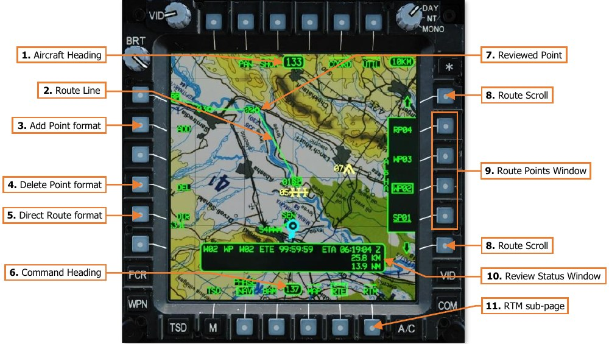

1.     **Aircraft Heading.** Displays a digital readout of the aircraft’s current magnetic heading in 1° increments.

2.     **Route Line.** Displays the current route as a solid green line.

    When a direct route is created to any point file, the direct route will be displayed as a full intensity green
       line and the route line will be displayed as a partial intensity green line

3.     **Add Point format.** Displays the ADD format for adding points to the current route.

4.     **Delete Point format.** Displays the DEL format for removing points from the current route.

5.     **Direct Route format.** Displays the DIR format for creating a direct route to an existing point file.

6.     **Command Heading.** Indicates the magnetic heading to the point selected for navigation.

7.     **Reviewed Point.** The text of the point that is selected for review will be highlighted in inverse video format.

8.     **Route Scroll.** Scrolls the Route Points window forward through route sequence when VAB R1 is pressed,
       or backward through the route sequence when VAB R6 is pressed.

9.   **Route Points Window.** Displays the point files within the current route sequence and permits selection of
     the points for review, navigation, editing of the current route. The points window may be scrolled forward
     or backwards through the route sequence using the Route Scroll buttons (VAB R1/R6).

    - 

        Each point file within the Route Points window is displayed as a 4-character sequence, with the
                   first two characters representing the point file’s identifier code, and the last two characters
                   representing the point file’s numerical index within its database partition. In the example to the
                   left, the point file is W04 within the WPTHZ partition, which is identified as a Release Point.

    - 

        When a point file within the Route Points window is selected for review, the point’s label within
                   the Route Points window is outlined within a box.

    - 

        When a point file within the Route Points window is selected as the navigation destination, the
                   point’s label within the Route Points window is underlined.

10. **Review Status Window.** Displays information regarding the reviewed route point.
                        Identification   Free Text   Estimated Time Enroute   Estimated Time of Arrival

    

    - **Point Index.** The database partition and location within which the point resides.

    - **Identification.** The one- or two-character abbreviation of the point, which determines its specific
          symbol and color.

    - **Free Text.** The one-, two-, or three-character text that may be added to the point for additional
          context as to the nature of the location.

    - **Estimated Time Enroute (ETE).** The estimated elapsed time to travel to the next point within the
          route sequence, and each subsequent route leg, until arrival at the reviewed point within the route
          sequence, based on the current ground speed.

          When a direct route is created to any point file, the ETE will be calculated based on the straight-line
          distance from the ownship position to the reviewed point and the current ground speed.

    - **Estimated Time of Arrival (ETA).** The estimated time of arrival at the reviewed point, based on the
          current system time and the estimated time enroute (ETE). The ETA time format (Local or Zulu) is
          based on the system time format selected on the TSD Utility sub-page.

          When a direct route is created to any point file, the ETA will be calculated based on the straight-line
          distance from the ownship position to the reviewed point and the current ground speed.

    - **Distance to Point (KM).** The combined distance, in kilometers, from the ownship position to the next
          point within the route sequence, and each subsequent route leg, until arrival at the reviewed point.

          When a direct route is created to any point file, the distance will be calculated as a straight-line distance
          from the ownship position to the reviewed point.

    - **Distance to Point (NM).** The combined distance, in nautical miles, from the ownship position to the
          next point within the route sequence, and each subsequent route leg, until arrival at the reviewed
          point.

          When a direct route is created to any point file, the distance will be calculated as a straight-line distance
          from the ownship position to the reviewed point.

11. **RTM sub-page.** Displays the TSD Route Menu sub-page.

#### TSD Route Menu (RTM) Sub-page

The RTM sub-page is used to select a different route sequence for navigation, reverse the current route sequence,
or delete all point files from any of the stored route sequences.

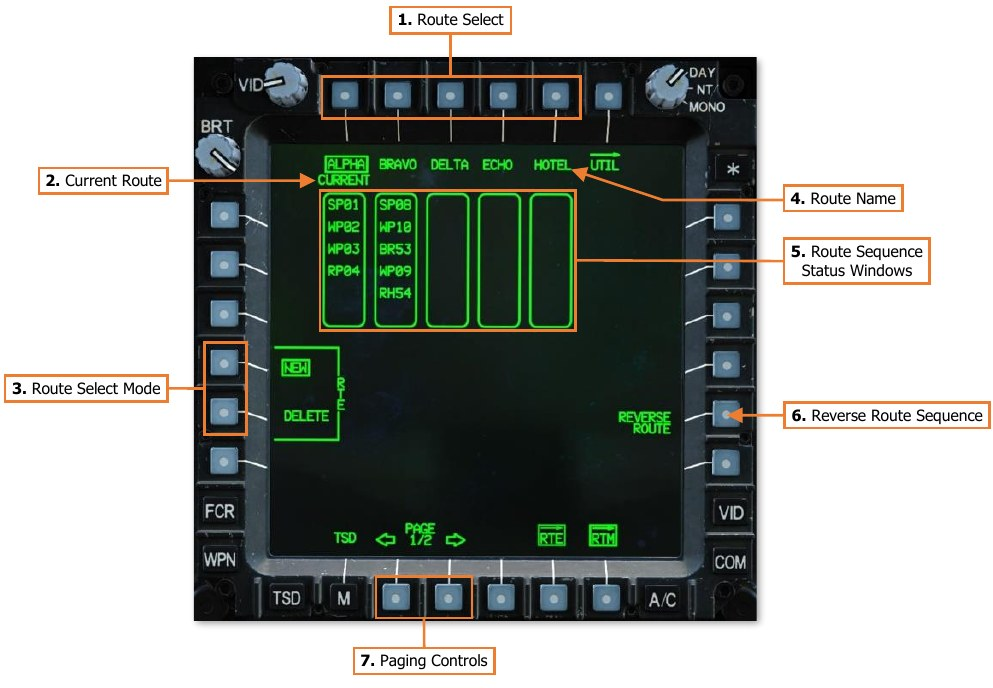

1.     **Route Select.** Selects a route sequence for navigation or for deletion, depending on the Route Select Mode
       that has been selected at (VAB L4/L5).

2.     **Current Route.** Indicates the route sequence that is being used for navigation.

3.     **Route Select Mode.** Determines the function of the Route Select buttons (VAB T1-T5).
  

    -    **NEW.** The Command Heading, Navigation Fly-To Cue, and Waypoint Status windows will switch
               navigation to the first point within the selected route sequence, and any direct route lines will be
               removed from the TSD.
  

    -    **DELETE.** All point files are removed from the route sequence that is subsequently selected. The route
               name will remain and cannot be changed from within the cockpit.

4.     **Route Name.** Displays the 5-character name of the corresponding route sequence.

5.     **Route Sequence Status windows.** Displays the first six point files within the route sequence, in order of
       navigation.

6.     **Reverse Route Sequence.** Inverts the route sequence so that the route may be flown in the reverse
       direction. Each point file will automatically sequence to the next in reverse order as the route is flown. The
       Route Sequence Status windows will update accordingly to reflect the sequence.

7.     **Paging Controls.** Cycles forward and back between the first and second pages of route sequences.

### Creating a Route using the Mission Editor

When using the Mission Editor, waypoints placed on the map from the Helicopter Group’s Route tab will auto-
populate into the DCS: AH-64D as the default TSD route sequence, Route “ALPHA”. Each waypoint following the
initial Helicopter Group position (waypoint 0) will be displayed as a Waypoint (WP) on the TSD, as part of Route
“ALPHA”, and numbered in accordance with their sequence within the Mission Editor.

!!! note
    It is currently only possible to generate one route in the Mission Editor. The remaining nine routes on the
    Route Menu (RTM) sub-page will be empty of any points. However, points may be added to the remaining routes
    from the cockpit, if desired, after the mission starts.

Point files within the AH-64D’s navigational database are input and displayed in three dimensions, therefore it
may be advisable to set the altitude of all waypoints within the Mission Editor to the minimum value, which
corresponds with ground level; especially if intended to mark a specific location or landmark. However, under
certain circumstances it may be useful to place them at altitudes above ground, depending on how they are
intended to be utilized during the mission. This may be useful to mark locations over the battlefield for illumination
rockets or to build 3-dimensional instrument approaches during low-visibility conditions.
Creating a Route using the Route (RTE) sub-page
When creating a new route, an empty route should be selected on the TSD Route Menu sub-page. After an empty
route has been selected, it may be necessary pan the TSD to the first point to be added to the route, and any
subsequent points, if not currently located within the viewable TSD footprint. Alternatively, if the point file indexes
of the points are known, they may be manually input using the Keyboard Unit (KU).

!!! note
    Routes may only be created or
    modified using existing points within the
    navigational database, which cannot be added
    from the TSD Route sub-page. (See TSD Point
    sub-page for more information).

To add points to a new route, perform the
following:

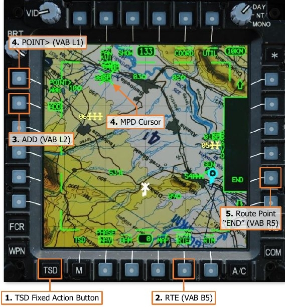

1.   TSD Fixed Action Button – Press.
2.   RTE (VAB B5) – Select.
3.   ADD (VAB L2) – Select.
4.   POINT> (VAB L1) – Select and input the
     point index of the point to be added into
     the KU (e.g., “W11”, “H05”, “C51”, etc).

    or

    MPD Cursor Controller/Enter – Select the
     point to be added on TSD.

    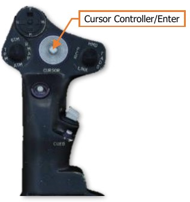

5.   Route Point (VAB R5) – Select the button
     adjacent to the route “END” identifier to
     place the point at the start of the route.

     The route “END” identifier will move to
     the following position within the route
     sequence.

    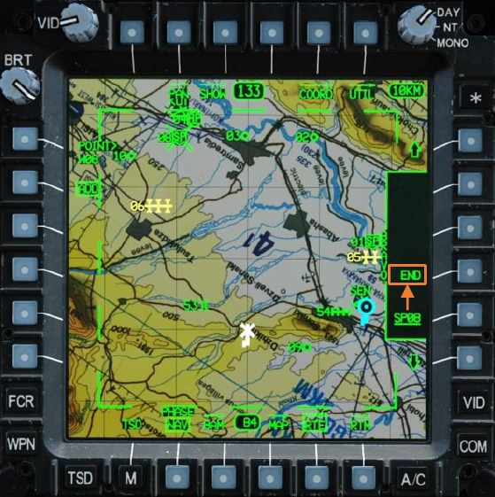

6.   POINT> (VAB L1) – Select and input the
     point index of the next point to be added
     into the KU (e.g., “W11”, “H05”, “C51”,
     etc).

     or

    MPD Cursor Controller/Enter – Select the
     next point to be added on TSD.

    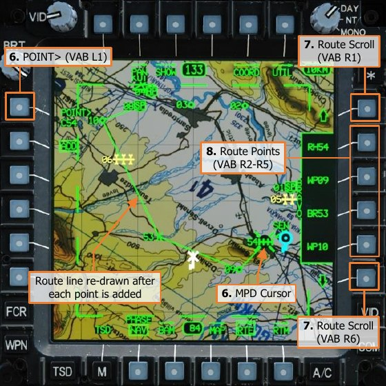

7.   The Route Scroll buttons (VAB R1/R6)
     may be used as necessary to advance up
     (or down) within the route sequence.
8.   Route Point (VAB R2-R5) – Select the
     button adjacent to the route “END”
     identifier to place the next point at the
     end of the route.

    The route “END” identifier will move to
     the following position within the route
     sequence. Repeat steps 6 and 7 as
     necessary until all points are added to the
     route sequence as intended.

    As each point is added, the route line will
     be re-drawn as appropriate.

    !!! note
        If it is desired to insert any points into an existing route, or to remove points from the route, see
        Editing a Route on the following pages.

### Creating a Direct Route using the Route (RTE) sub-page

Any point within the navigational database may be used to create a direct route, to include Target/Threat points.
When a direct route is created, a solid green line will be plotted from the ownship’s present position to the point,
and the route sequence will be displayed in partial intensity.

!!! note
    If the point that is selected for creation
    of a direct route is within the current route
    sequence, upon arrival at the point the direct
    route will be removed, the route sequence will
    return to full intensity, and the route will
    sequence through the remainder of the
    subsequent route points.

To create a direct route to a point, perform the
following:

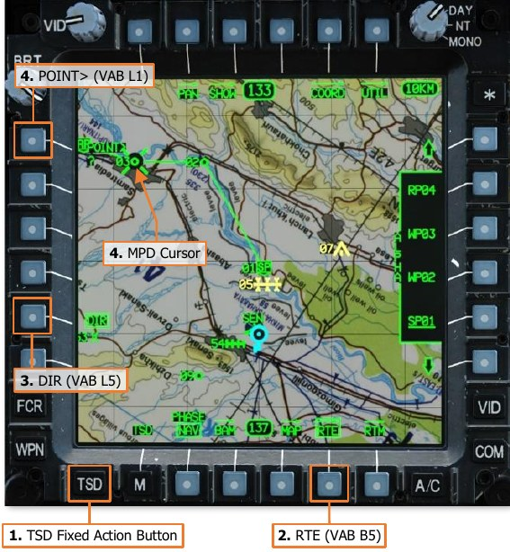

1.   TSD Fixed Action Button – Press.
2.   RTE (VAB B5) – Select.
3.   DIR (VAB L5) – Select.
4.   POINT> (VAB L1) – Select and input the
     point index for creating a direct route into
     the KU (e.g., “W11”, “H05”, “C51”, etc).

    or

    MPD Cursor Controller/Enter – Select the
     point desired for creating a direct route.

    or, if the point is part of the current route

    Route Scroll (VAB R1/R6) – Select, as
     necessary.

5.   Route Points (VAB R2-R5) – Select the
     button that corresponds with the point
     desired for creating a direct route.

    

### Editing a Route using the Route (RTE) sub-page

To remove a point from the current route,
perform the following:

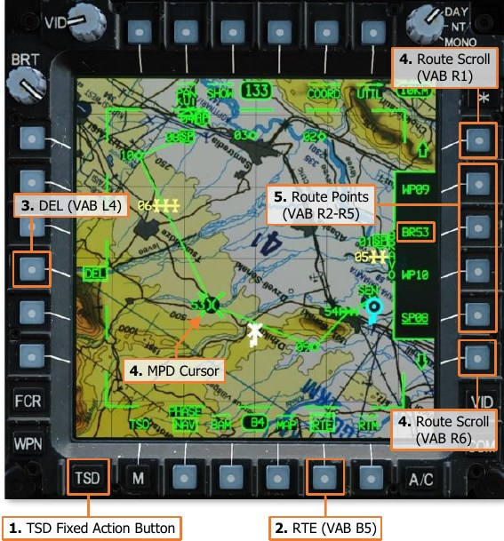

1.   TSD Fixed Action Button – Press.
2.   RTE (VAB B5) – Select.
3.   DEL (VAB L4) – Select.
4.   MPD Cursor Controller/Enter – Select the
     point to be removed on TSD.

    or

    Route Scroll (VAB R1/R6) – Select, as
     necessary.

5.   Route Points (VAB R2-R5) – Select the
     button that corresponds with the point to
     be removed.

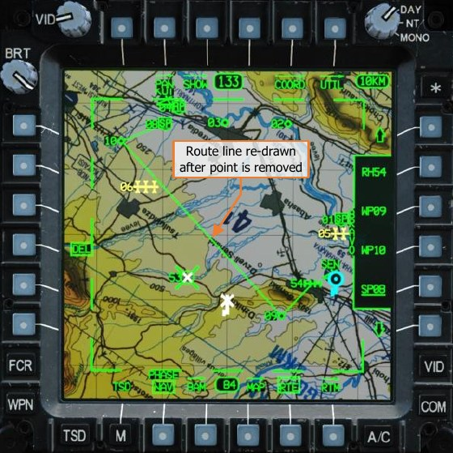

To insert a point into the current route,
perform the following:

1.   TSD Fixed Action Button – Press.
2.   RTE (VAB B5) – Select.
3.   ADD (VAB L2) – Select.
4.   POINT> (VAB L1) – Select and input the
     point index of the point to be inserted
     into the KU (e.g., “W11”, “H05”, “C51”,
     etc).

    or

    MPD Cursor Controller/Enter – Select the
     point to be inserted on TSD.

5.   Route Points (VAB R2-R5) – Select the
     button that corresponds with the desired
     location within the route to which the
     point will be inserted.

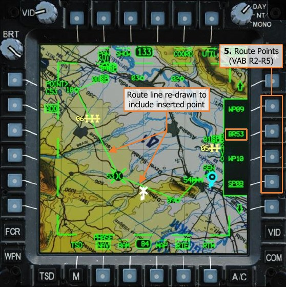

!!! note
    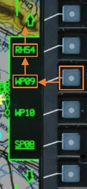{align=left}
    When a point
    is inserted into a
    position within the
    route sequence that
    is not the END, the
    point that is located
    at    that   position
    within the route
    sequence will move
    to the subsequent
    position above it. All
    other points that
    follow will move to
    subsequent positions
    accordingly.

### Selecting a Route using the Route Menu (RTM) sub-page

The route marked as CURRENT on the RTM sub-page is the route sequence currently being utilized for the
purpose of navigation.

To select a new route for navigation, perform
the following:

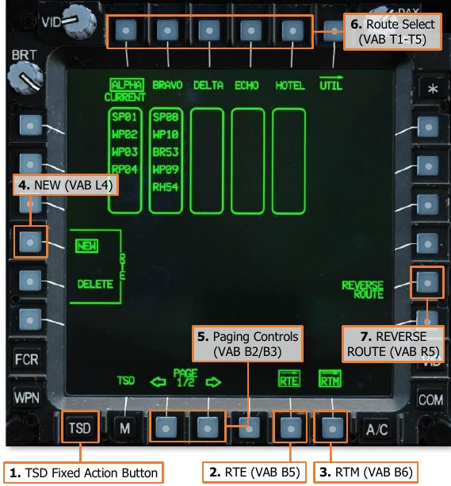

1.   TSD Fixed Action Button – Press.
2.   RTE (VAB B5) – Select.
3.   RTM (VAB B6) – Select.
4.   NEW (VAB L4) – Verify boxed.
5.   Paging Controls (VAB B2/B3) – Select as
     necessary to view the available route
     sequences.
6.   Route Select (VAB T1-T5) – Select the
     desired route sequence.
7.   REVERSE ROUTE (VAB R5) – Select as
     necessary, depending on the direction
     the route is intended to be flown.

### Deleting a Route using the Route Menu (RTM) sub-page

All point files within a route sequence may be deleted on the RTM sub-page, however the name of the route
sequence itself will remain.

To select a route for deletion, perform the
following:

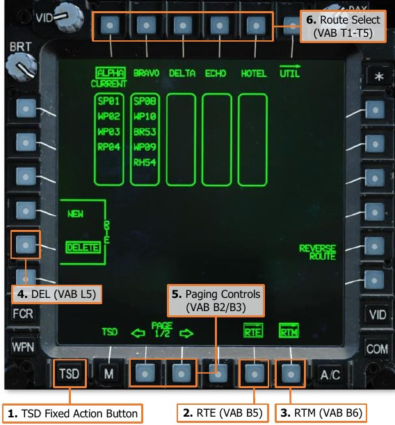

1.   TSD Fixed Action Button – Press.
2.   RTE (VAB B5) – Select.
3.   RTM (VAB B6) – Select.
4.   DEL (VAB L5) – Select
5.   Paging Controls (VAB B2/B3) – Select as
     necessary to view the available route
     sequences.
6.   Route Select (VAB T1-T5) – Select the
     route sequence that is intended for
     deletion.
7.   YES (VAB L4) – Select to confirm
     deletion.

    or
     
    NO (VAB L5) – Select to abort deletion.

    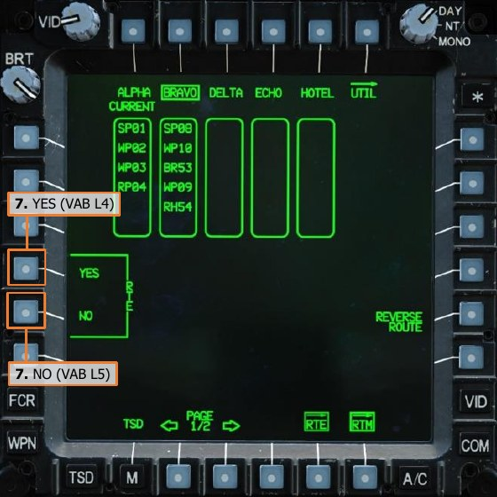

