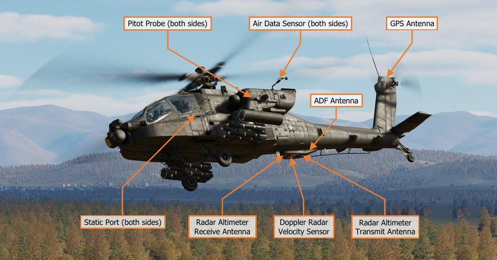

# NAVIGATION

The AH-64D primarily navigates by utilizing a pair of Embedded GPS/Inertial Navigation Units (EGI) aided by a
Doppler velocity radar and a database of stored points. After the APU is started and generator power is applied
to the aircraft, both EGI’s will automatically begin their alignment process. Aircrew intervention is normally not
required aside from verifying the EGI’s alignment status and velocity indications prior to engine start.

Unless updated with a new position via the DTC, the EGI alignment process uses the aircraft’s previous position
and heading stored in the aircraft memory from when it was last shut down. This stored position, aided by GPS
position signals, shortens the alignment process considerably, allowing an AH-64D to takeoff within minutes if
necessary.

While in flight, the AH-64D receives continuous position updates from GPS satellites to maintain INU position
confidence and aid in precision navigation. As an emergency back-up during operations in low-visibility conditions,
the AH-64D is equipped with an AN/ARN-149 Automatic Direction Finder.

The AH-64D uses true airspeed calculations derived from the pitot probe mounted on the leading edge of the left
wing and the static ports on each side of the airframe. These, along with the air data sensors, aid in more precise
ballistic calculations during weapons delivery and are the primary source of air mass data to the Flight
Management Computer (FMC).

A set of backup instruments are installed within the Pilot’s crewstation that provide indicated airspeed and
barometric altitude from the second pitot probe mounted on the leading edge of the right wing and each static
port. A standby attitude indicator and a backup magnetic compass is also installed within the Pilot’s crewstation.

