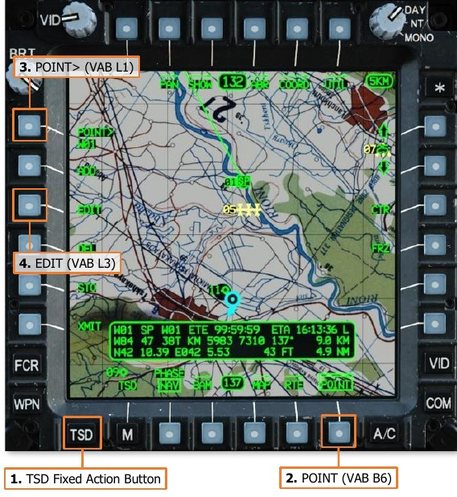

# POINTS

The AH-64D’s navigational database consists of 149 unique point files that can be uploaded from a removable
Data Transfer Cartridge (DTC), with an additional 6 non-loadable point files within the aircraft memory. These
point files serve as geographical coordinates of waypoints for navigation and routing, hazards to flight that should
be avoided, control measures that are used for battlefield coordination and maneuvers, locations of friendly and
enemy forces, and known or suspected locations of hostile air defenses.

Point files within the navigational database are stored in one of three partitions, depending on their type. Points
within these partitions may be uploaded from the DTC; and may be added, edited, or deleted from the cockpit.

- **Waypoints/Hazards (WPTHZ) partition.** Points for depicting navigation waypoints and hazards.

- **Control Measures (CTRLM) partition.** Points for depicting friendly and enemy units, airfields, and other
     graphical control measures for controlling team movements and coordinating with other friendly forces
     during a mission.

- **Targets/Threats (TGT/THRT) partition.** Points for depicting targets and threats, along with
     corresponding detection/engagement rings.

- **Targets/Threats (TGT/THRT) extended partition.** Points for storing additional TSD file locations, such
     as the Pilot and CPG Terrain (TRN) points. The Pilot’s TRN point is indexed as T55 and the CPG’s TRN point
     is indexed as T56.

The Target/Threats extended partition only resides within the aircraft memory and cannot be edited by the DTC.
Point Files

Each point file contains five elements of information, which includes the file location within the database, the
three-dimensional location of the point, the symbol that is displayed on the TSD at the point’s location, and up
to three unique alphanumeric characters that may be associated with the point, such as a name or designation.

- **Point Index (W##, H##, C##, T##).** Each point is indexed within the partition it resides, and the index
     itself is used to reference the point when performing tasks such as reviewing the points information, setting
     the point as an acquisition source, adding the point to a route, panning the TSD to its location, etc.

    - Waypoints. All points of the Waypoint type are indexed within the WPTHZ partition with a leading
           “W” followed by two digits between 1 and 50 (e.g. “W01”), which are shared with Hazards.

    - Hazards. All points of the Hazard type are indexed within the WPTHZ partition with a leading “H”
           followed by two digits between 1 and 50 (e.g. “H01”), which are shared with Waypoints.

    - Control Measures. All points of the Control Measure type are indexed within the CTRLM partition
           with a leading “C” followed by two digits between 51 and 99 (e.g. “C51”).

    - Targets/Threats. All points of the Targets/Threats type are indexed within the TGT/THRT
           partition with a leading “T” followed by two digits between 1 and 50 (e.g. “T01”). Targets/Threats
           occupy points 100-149 within the database, but are renamed to T01-T50 for presentation to the
           crew.

    The first 25 points within the WPTHZ and TGT/THRT partitions that are loaded by the DTC are considered
     “safe sets” and cannot be overridden using the STO functions on the TSD Point sub-page or by the CPG
     using the STORE/UPDT switch on the TEDAC Left Handgrip. However, Waypoints, Hazards, or
     Targets/Threats within the “safe sets” may be manually deleted from the cockpit. Once a point is deleted
     from a “safe set”, the point may be overridden at any time in the flight unless the original point is re-loaded
     from the DTC.

- **Identifier (IDENT).** A point’s identifier determines the symbol which is displayed at the point’s location on
     the TSD. 140 different symbols may be chosen, which are identified within the point file using a 1- or 2-digit
     alphanumeric code.

     Most identifiers are only valid when used with a specific point type. As an example, the Communications
     Checkpoint identifier of “CC” will only be accepted if the point type was set to Waypoint. However, several
     identifiers are used by multiple point types and will contextually display different symbols based on which
     point type was set prior to adding the point. As an example, if the point type was set to Control Measure
     and “BP” was entered as the identifier, a Battle Position symbol would be displayed; whereas if the point
     type was set to Target/Threat, a Blowpipe threat symbol would be displayed.

- **Free Text (FREE).** A point’s free text may contain up to 3 alphanumeric characters that may be added to
     the point for additional context as to the nature of the location. If no free text is entered, the free text will
     simply repeat the point index (e.g. “W01”).

- **Coordinates (UTM LAT/LONG).** A point’s coordinates is saved in both the MGRS and Latitude/Longitude
     coordinate systems. When a new point is added, or an existing point’s coordinates is edited, the point may
     be entered in either MGRS 8-digit format or Latitude/Longitude “Degrees, Minutes, Decimals” format
     (DD°MM.MM DDD°MM.MM), but the coordinates will automatically be converted to the opposite format
     when the coordinates are saved into the point file.

- **Altitude above mean sea level (ALTITUDE).** A point’s altitude is saved in feet, based on the altitude
     above mean sea level (MSL).

     Digital Terrain Elevation Data (DTED) is typically loaded into the aircraft navigational database. When a new
     point is added, the altitude will always default to the terrain elevation based on the coordinates already
     saved within the point file. However, a different altitude may be entered if desired, which will place the point
     above (or below) the actual terrain elevation. This may be useful when inputting a route in which the points
     are desired to be displayed at specific altitudes, such as GPS approach waypoints or illumination rockets.

## Choosing a Point Identifier

When adding a point during mission planning or while in the aircraft, there are many different types of point
symbols that may be selected from the list of 140 abbreviated identifier codes. Choosing the appropriate identifier
may be affected by several factors, such as the purpose of the point, the database partition the point will be
saved within, whether the point will be stored within a “safe set”, or whether the point displays its free text
directly on TSD alongside its symbol.

- **Purpose.** Choosing a point symbol based on the purpose of the point itself is useful in providing an
     immediate context to the crewmembers when viewing the TSD. For example, using a Landing Zone symbol
     in place of a generic Waypoint symbol allows the crew to immediately recognize what type of location that
     point represents when viewing the TSD with a quick glance.

- **Partition.** At times, choosing a point symbol may be predicated on whether a specific partition still contains
     empty point files that are available for use. As an example, entering enemy unit locations as Targets during
     pre-mission planning may quickly fill the TGT/THRT partition, leaving few empty point files available during
     the mission to store target locations observed within the TADS. Alternatively, many enemy locations may be
     stored as enemy control measure symbols.

- **Safe Set.** Only the first 25 points in the WPTHZ and TGT/THRT partitions contain a “safe set” that is
     protected from accidental overwriting within the cockpit. As such, it may be desired to place certain
     waypoints within either of these safe set locations to preserve their data during the mission. As an example,
     it may be desired to load anticipated enemy air defense locations into the first 25 points within the TGT/THRT
     partition to ensure their locations are not overwritten when the CPG stores targets via the TADS. Another
     example may be placing any significant hazards (like towers or wires) that are expected to be encountered
     during low-level night operations may be loaded into the first 25 points within the WPTHZ partition.

- **Free Text.** Most types of control measures will display the 3-character free text alongside their point symbol
     in lieu of their point index. Under some circumstances, it may be preferable to utilize these types of points
     if it is desired to leverage the free text itself in describing the nature of the location, even if the icon itself
     doesn’t correlate with the terrain or situation.

    

     In the example to the right, LZ “Falcon” is
     marked by a Landing Zone point on the left, and
     a Ground Light point on the right. A Landing
     Zone point will not display its free text of “FAL”
     directly on the TSD, but it can be viewed by
     entering the TSD Point sub-page and then
     selecting the point using the cursor to review its
     information. On the other hand, the Ground
     Light point displays its free text “FAL” directly
     on the TSD, but it may not be known by the
     crew that this point represents an LZ location
     unless briefed as such.

     In this situation, it is a question of what the location means versus how it is labeled. This question of context
     should be taken into consideration when planning a mission in which other players may not be aware of the
     intent behind which points are being used for specific purposes.

### Waypoints/Hazards (WPTHZ)

The Waypoints/Hazards partition includes graphics for depicting generic waypoints, communications checkpoints,
start and release points of routes, and hazards such as towers or wires. Some of the more commonly used
Waypoints/Hazards are shown below.

When a WPTHZ point file is set to an identifier that corresponds with a hazard, the point file is presented to the
crew as “H##” rather than “W##”, even though the point files are within the same partition.

It is important to note that hazards are always perpendicular to the flight path of the aircraft on the TSD and do
not depict the actual direction of the hazard, but its general location only. This is especially important to remember
regarding linear hazards such as wires.

### Control Measures (CTRLM)

Control measures include graphics for depicting friendly and enemy units, Forward Arming and Refueling Points
(FARPS), battle positions, and others. Some of the more commonly used Control Measures are shown below.

### Targets/Threats (TGT/THRT)

Targets/Threats include symbols for depicting the location of targets found during the conduct of a mission or
for depicting the location of known or templated air defense systems.

When a point is entered as an air defense threat, rings depicting the detection and/or engagement ranges of the
corresponding air defense system may be displayed on the TSD. The display of threat rings may be
enabled/disabled on the TSD Threat Show (THRT SHOW) sub-page.

A complete list of point types and their symbols can be found on the TSD Abbreviation (ABR) sub-page or in
Appendix C of this manual.

### TSD Point (POINT) Sub-page

The POINT sub-page allows either crewmember to add additional point files to the navigational database, edit or
delete existing point files from the navigational database, or transmit points to other flight members.
Other Tactical Situation Display functions and sub-pages are desribed in the AH-64D chapter.

1.      **Review Point.** Activates the KU for inputting a point file for review. Alternatively, a point may selected for
        review directly from the TSD by using the MPD cursor.

2.      **Add Point format.** Displays the ADD format for creating new point files.

3.      **Edit Point format.** Displays the EDIT format for editing existing point files.

4.      **Delete Point format.** Displays the DEL format for deleting existing point files.

5.      **Store Point format.** Displays the STO format for storing new point files using the CPG’s HMD or TADS
        lines-of-sight, or storing new point files at the current position of the ownship.

6.      **Transmit Point format.** Displays the XMIT format for transmitting existing point files to other AH-64D’s
        via the datalink modem (DL).

7.      **ABR sub-page.** Displays the TSD Abbreviation sub-page.

8.      **Reviewed Point.** The text of the point that is selected for review will be highlighted in inverse video format.

9.      **Review Status Window.** Displays information regarding the reviewed point.

- **Point Index.** The database partition and location within which the point resides.

- **Identification.** The one- or two-character abbreviation of the point, which determines its specific
    symbol and color.

- **Free Text.** The one-, two-, or three-character text that may be added to the point for additional
    context as to the nature of the location.

- **Estimated Time Enroute (ETE).** The estimated elapsed time to travel to the point, based on the
    distance to the point from the ownship’s current position and the ownship’s current ground speed.

- **Estimated Time of Arrival (ETA).** The estimated time of arrival at the point, based on the current
    system time and the estimated time enroute (ETE). The ETA time format (Local or Zulu) is based on
    the system time format selected on the TSD Utility page.

- **Earth Datum.** The geodetic system used to determine the point’s location on the Earth.

- **Datum Code.** The one- or two-character abbreviated code of the point’s Earth datum.

- **Distance to Point (KM).** The distance from the ownship position to the point’s location, in kilometers.

- **Distance to Point (NM).** The distance from the ownship position to the point’s location, in nautical
    miles.

- **Bearing to Point.** The magnetic heading from the ownship position to the point’s location.

- **MGRS Coordinates.** The location of the point, in Military Grid Reference System 8-digit grid format.

- **Latitude/Longitude Coordinates.** The location of the point, in Latitude/Longitude Degrees,
    Minutes, Minute-Decimals format (DD°MM.MM DDD°MM.MM).

- **Altitude.** The altitude of the point above mean sea level (MSL).

#### TSD Abbreviation (ABR) Sub-page

The ABR sub-page is used as an in-cockpit reference for either crewmember to review the abbreviated codes
(IDENT) that identify the specific point types when interacting with the point database, or adding a new point
through the TSD Point sub-page.

The ABR sub-page may also be accessed from the TSD Utility sub-page, as shown below.

1.   **Point Type.** Denotes the type of all points listed below. The Point Type headers, followed by Earth Datum
     headers, are listed in the following sequence on the subsequent ABR sub-pages.

    -  WAYPOINTS                                        
    -  HAZARDS                                          
    -  GENERAL CTRLM                                    
    -  FRIENDLY CTLRM                                   
    -  ENEMY CTRLM                                      
    -  PREPLANNED TGT/THRT                              
    -  AIRY               AIR                           
    -  AUSTRALIAN NATL    AUS                           
    -  BESSEL 1841        BES                           
    -  CLARK 1880              CL0

    -  CLARK 1866              CL6

    -  EVEREST SABAH           EVB

    -  EVEREST 1830            EVE

    -  INTERNATIONAL1924       INT

    -  MODIFIED AIRY           MAI

    -  EVEREST 1948            MEV

    -  WORLD GEO SYS 72        W72

    -  WORLD GEO SYS 84        W84

2.   Point Name. Denotes the name of the point.
3.   Point Identification. Denotes the abbreviated identification code of the point. This may be input via the
     Keyboard Unit (KU) when adding a new point to the TSD.
4.   Paging Controls. Cycles forward and back through multiple pages of abbreviated identification codes.

### Adding a Point

Points may be added to the TSD while the POINT sub-page is displayed in ADD format. A new point may be
added by manually entering point file data via the Keyboard Unit (KU) or by “dropping” a new point directly onto
the TSD via the MPD cursor.

#### POINT Add (ADD) format

Pressing the ADD button (VAB L2) displays the POINT sub-page in Add format. Pressing the ADD button a second
time returns the POINT sub-page to the original format.

1.   **Add Point.** Activates the KU for inputting new point file data. The first data element that may be input is
     the identifier. (See Adding a Point using the Keyboard Unit for more information.)

2.   **Waypoint (WP) Point Type.** Selects the WPTHZ partition for point entry and enables Waypoint-specific
     identifiers only: CC, LZ, PP, RP, SP, and WP. The selected point type will default to this selection when the
     POINT page is set to ADD format while the TSD Phase is set to NAV. (See Appendix C for a complete list of
     Waypoint identifiers.)

3.   **Hazard (HZ) Point Type.** Selects the WPTHZ partition for point entry and enables Hazard-specific
     identifiers only: TO, TU, WL, and WS. (See Appendix C for a complete list of Hazard identifiers.)

4.   **Control Measure (CM) Point Type.** Selects the CTRLM partition for point entry and enables Control
     Measure-specific identifiers only. (See Appendix C for a complete list of Control Measure identifiers.)

5.   **Target/Threat Point (TG) Type.** Selects the TGT/THRT partition for point entry and enables
     Target/Threat-specific identifiers only. The selected point type will default to this selection when the POINT
     page is set to ADD format while the TSD Phase is set to ATK. (See Appendix C for a complete list of
     Target/Threat identifiers.)

6.   **Next Point File Entry.** Displays the point file index that will be occupied by the next point that is entered.

7.   **ABR sub-page.** Displays the TSD Abbreviation sub-page.

#### Adding a Point using MPD Cursor

A new point may be added to the TSD quickly by selecting the desired point type (VAB L3-L6) and then “dropping”
the point onto the TSD at the desired location. However, if the “cursor drop” method is used to add a point, only
the point type may be selected and no further point file data may be entered. The default points that are dropped
at the cursor location are shown below, based on the selected point type.

When these points are “dropped”, the free text
will default to the point index within the
database (e.g., “W11”, “H05”, “C51”, “T04”
etc.). The coordinates will be entered based
on the cursor location and the altitude of the
point will be entered based on the terrain
elevation data for that location on that map.

To quickly add a point using the “cursor drop”
method, perform the following:

1.   TSD Fixed Action Button – Press.
2.   POINT (VAB B6) – Select.
3.   ADD (VAB L2) – Select.
4.   Point Type (VAB L3-L6) – Select WP,
     HZ, CM, or TG as desired.
5.   MPD Cursor Controller/Enter – Slew to
     desired location on TSD.

    

6.   MPD Cursor Controller/Enter – Press.

    

#### Adding a Point using Keyboard Unit (KU)

A new point may be added by manually entering point file data via the Keyboard Unit (KU). This method allows
the crewmember to input each element of the point file sequentially.

To add a point using the KU, perform the
following:

1.   TSD Fixed Action Button – Press.
2.   POINT (VAB B6) – Select.
3.   ADD (VAB L2) – Select.
4.   ABR (VAB T4) – Select, as required.
5.   Point Type (VAB L3-L6) – Select WP, HZ,
     CM, or TG as desired.
6.   IDENT> (VAB L1) – Select.

    Once IDENT> (VAB L1) is pressed, the KU
scratchpad display will activate with “IDENT:”
as the display prompt. The elements of the
new point file may then be entered, with the
ENTER button on the KU commanding the KU
to accept the current entry and progress to the
next display prompt in the sequence.

    If an entry is invalid and cannot be accepted
by the KU, the scratchpad display will flash.
Any button on the KU may then be pressed to
acknowledge the invalid entry condition, after
which a different data entry may be input.

7.   Input identifier data, and press ENTER on the KU.

    

8.   Input free text data, and press ENTER on the KU.

    

9. The KU scratchpad will initialize to the UTM LAT/LONG:
prompt by displaying the current MGRS coordinates of
the ownship. The cursor is automatically placed at the
first digit of the “easting” numerals (shown at right).

    

    Input location data using any of the following methods:

    - Input MGRS coordinates in an 8-digit format
          as a continuous string without spaces and
          press ENTER on the KU (e.g., 38T KM 5644
          8074 would be input as “38TKM56448074”).

        

        If a different grid zone designator and/or square identifier is to be entered, the KU arrow keys should
          be used to place the cursor over the first character to be overwritten, and then the remainder of the
          coordinate data may be typed over.

    - Press CLR and input Latitude/Longitude
          coordinates in Degrees-Minutes-Decimals
          format as a continuous string without spaces,
          decimals, or special characters and press
          ENTER on the KU (e.g., N42°14.45’
          E°042°02.88’ would be input as “N421445E0420288”)

        

    - Press CLR and input the name of an existing
          point file to copy its coordinates into the new
          point file and press ENTER on the KU (e.g.,
          “W11”, “H05”, “C51”, “T04”, etc).

        

    - Use the MPD Cursor Controller/Enter to slew the MPD cursor to the desired location on TSD and then
          press Cursor-Enter.

10. The KU scratchpad will initialize to the ALTITUDE: prompt by displaying the digital terrain elevation data at the
coordinates that was just entered within the new point file. The cursor is automatically placed at the first digit.

    Input altitude data using either of the following methods:

    - Accept the default terrain elevation by pressing ENTER on the KU.

    - Input a different altitude value in feet above
          mean sea level (MSL) by typing over the
          existing data and press ENTER on the KU.

        

After the altitude data has been accepted, the
new point file will be saved within the
navigational database and automatically
selected for review on the POINT sub-page.

### Editing a Point

Points may be edited while the POINT sub-page is displayed in EDIT format. Existing point files may receive
changes to their free text, coordinates, or altitude data elements; however the point file identifier may not be
changed.

#### POINT Edit (EDIT) format

Pressing the EDIT button (VAB L3) displays the POINT sub-page in Edit format. Pressing the EDIT button a
second time returns the POINT sub-page to the original format.

1.   **Edit Point.** Activates the KU for editing point file data of the point selected for review. The first data element
     that may be edited is the free text. (See Editing a Point using the Keyboard Unit for more information.)

2.   **Reviewed Point.** The text of the point that is selected for review will be highlighted in inverse video format.

3.   **Review Status Window.** Displays information regarding the reviewed point.

#### Editing a Point using Keyboard Unit (KU)

An existing point can only be edited by manually entering point file data via the Keyboard Unit (KU). This method
requires the crewmember to review each element of the point file sequentially and, if necessary, input new data
using the KU when the respective prompt is displayed on the KU scratchpad.

To edit a point using the KU, perform the
following:

1.   TSD Fixed Action Button – Press.
2.   POINT (VAB B6) – Select.
3.   POINT> (VAB L1) – Select and input the
     point index of the point to be edited into
     the KU (e.g., “W11”, “H05”, “C51”,
     “T04”, etc).

    or

    MPD Cursor Controller/Enter – Select
     the point to be edited on TSD.

4.   EDIT (VAB L3) – Select.

5.   FREE> (VAB L1) – Select.

    

    Once FREE> (VAB L1) is pressed, the KU
scratchpad display will activate with “FREE:”
as the display prompt. The elements of the
point file may then be edited, with the ENTER
button on the KU commanding the KU to
accept the current entry and progress to the
next display prompt in the sequence.

    If an entry is invalid and cannot be accepted
by the KU, the scratchpad display will flash.
Any button on the KU may then be pressed to
acknowledge the invalid entry condition, after
which a different data entry may be input.

6.   If the existing free text is desired, simply press
     ENTER to accept the existing data.

    If different free text data is desired, the new free
     text may be input by typing over the existing data
     and then press ENTER on the KU.

    

7. The KU scratchpad will initialize to the UTM LAT/LONG:
prompt with the cursor automatically placed at the first
digit of the “easting” numerals (shown at right).

    If the existing location is desired, simply press
     ENTER to accept the existing data.
     If different location data is desired, the new location data may be input using any of the following methods:

    - Input MGRS coordinates in an 8-digit format
          as a continuous string without spaces and
          press ENTER on the KU (e.g., 38T KM 5644
          8074 would be input as “38TKM56448074”).
          If a different grid zone designator and/or square identifier is to be entered, the KU arrow keys should
          be used to place the cursor over the first character to be overwritten, and then the remainder of the
          coordinate data may be typed over.

        

    - Press CLR and input Latitude/Longitude
          coordinates in Degrees-Minutes-Decimals
          format as a continuous string without spaces,
          decimals, or special characters and press
          ENTER on the KU (e.g., N42°14.45’
          E°042°02.88’ would be input as “N421445E0420288”)

        

    - Press CLR and input the name of an existing
          point file to copy its coordinates into the new
          point file and press ENTER on the KU (e.g.,
          “W11”, “H05”, “C51”, “T04”, etc).

        

    - Use the MPD Cursor Controller/Enter to slew the MPD cursor to the desired location on TSD and then
          press Cursor-Enter.

8. The KU scratchpad will initialize to the ALTITUDE: prompt with the cursor automatically placed at the first digit.

    If the existing altitude is desired, simply press ENTER to accept the existing data.

    If different altitude data is desired, input a different
     altitude value in feet above mean sea level (MSL)
     by typing over the existing data and press ENTER
     on the KU.

    

After the altitude data has been accepted, the
changes to the point file will be reflected
within the navigational database and may be
reviewed within the Review Status Window on
the POINT sub-page.

In the image shown to the right, the free text
was modified from the default data of “W01”
to “SPT”, with the existing location and
altitude data accepted without changes.

### Deleting a Point

Points may be deleted while the POINT sub-page is displayed in DEL format. A confirmation must be received by
the crewmember to delete the point from the navigational database.

#### POINT Delete (DEL) format

Pressing the DEL button (VAB L4) displays the POINT sub-page in Delete format and replaces the DEL button
with a two-button Grouped button confirmation option. Pressing the NO button (VAB L4) will abort the deletion
process and return the POINT sub-page to the original format.

1.      **Review Point.** Activates the KU for inputting a point file for review. Alternatively, a point may selected for
        review directly from the TSD by using the MPD cursor. (See Deleting a Point for more information.)

2.      **Confirm Point Deletion.** Deletes the point that is selected for review.

3.      **Abort Point Deletion.** Aborts the deletion process and returns the POINT sub-page to the original format.

4.      **Reviewed Point.** The text of the point that is selected for review will be highlighted in inverse video format.

5.      **Review Status Window.** Displays information regarding the reviewed point.

#### Deleting a Point

To delete an existing point, perform the
following:

1.   TSD Fixed Action Button – Press.
2.   POINT (VAB B6) – Select.
3.   POINT> (VAB L1) – Select and input the
     point index of the point to be deleted
     into the KU (e.g., “W11”, “H05”, “C51”,
     “T04”, etc).

    or

    MPD Cursor Controller/Enter – Select
     the point to be deleted on TSD.
4.   DEL (VAB L4) – Select.
5.   YES (VAB L3) – Select to confirm
     deletion.

    or

    NO (VAB L4) – Select to abort deletion.

    

### Storing a Point

Waypoints or Target Points may be selectively stored to the TSD while the POINT sub-page is displayed in STO
format. A new point may be stored using either a “flyover” store or a “CPG Sight” store.

When the POINT sub-page is displayed in STO format, the Review Status window will display the information
that will be entered into the next point file if the NOW button (VAB L1) is pressed or, in the case of the CPG, if
the STORE/UPDT button on the TEDAC Left Handgrip is momentarily set to the STORE position. This includes the
next empty point file index of the selected type, and the aircraft’s current position and altitude.

#### POINT Store (STO) format

Pressing the STO button (VAB L5) displays the POINT sub-page in Store format. Pressing the STO button a second
time returns the POINT sub-page to the original format.

1.     **Store Now.** Stores a new point at the current coordinates of the ownship. (See Storing a Point using Fly-
       over for more information.)

2.     **Point Type.** Toggles the point type of the next point to be stored.
  
    -   WP. The next point to be stored will be entered as a Waypoint (WP). The point type will default to this
              selection when the POINT page is set to STO format while the TSD Phase is set to NAV.
  
    -   TG. The next point to be stored will be entered as a Target Point (TG). The point type will default to
              this selection when the POINT page is set to STO format while the TSD Phase is set to ATK.

3.     **Next Point File Entry.** Displays the point file index that will be occupied by the next point that is stored.

4.     **Review Status Window.** Displays the coordinates that will be entered into the next point file if the NOW
       button (VAB L1) is pressed. When a point is stored using NOW (VAB L1), the point’s free text is
       automatically entered as “FLY”. When a point is stored using the CPG HMD or TADS, the point’s free text
       is automatically entered as “HMD” or “TAD” respectively.

#### Storing a Point using Fly-over

A new point may be stored to the TSD using the current aircraft position in a “fly-over” method, and may be
performed by either crewmember.

To store a point at the current aircraft position,
perform the following:

1.   TSD Fixed Action Button – Press.
2.   POINT (VAB B6) – Select.
3.   STO (VAB L5) – Select.
4.   TYPE (VAB L6) – Select WP or TG as
     desired.
5.   NOW (VAB L1) - Select.

After storing the point, the TSD will return to
the main format of the POINT sub-page, and
display the fly-over point’s information in the
Review Status window.

#### Storing a Point using CPG Sight (HMD)

A new point may be stored to the TSD using the CPG HMD line-of-sight. Although a manual range may be used
if necessary, an automatic range will typically provide greater precision when operating over relatively flat terrain.

To store a point at the CPG’s HMD line-of-sight
using an Automatic range, perform the
following:

1.   Sight Select switch – HMD.
2.   WPN Fixed Action Button – Press.
3.   MANRNG (VAB B6) – Select, enter “A”
     on the KU, and press ENTER.
4.   TSD Fixed Action Button – Press.
5.   POINT (VAB B6) – Select.
6.   STO (VAB L5) – Select.
7.   TYPE (VAB L6) – Select WP or TG as
     desired.
8.   Position the HMD LOS Reticle over the
     desired location.
9.   STORE/UPDT switch – STORE.

    

#### Storing a Point using CPG Sight (TADS)

A new point may be stored to the TSD using the TADS line-of-sight. Although an automatic or manual range may
be used if necessary, a laser range will provide the best precision when storing a point using the TADS.

!!! note
    The CPG may store a Target Point (TG) at the TADS line-of-sight and current range source any time the
    TADS is the selected sight and the STORE/UPDT switch on the TEDAC Left Handgrip is momentarily set to the
    STORE position. The TSD is not required to be displayed and set to the STO sub-page to perform this action.

Although this method allows targets to be
stored more quickly by excluding steps 3
through 6 below, the option to store a
Waypoint (WP) in lieu of a Target Point (TG)
will not be available if the POINT sub-page
STO format is not utilized.

To store a point at the CPG TADS line-of-sight
using a laser range, perform the following:

1.   NVS Mode switch – OFF, if applicable.
2.   Sight Select switch – TADS.
3.   Sight Manual Tracker – Position the
     TADS LOS Reticle over the desired
     location.
4.   TSD Fixed Action Button – Press.
5.   POINT (VAB B6) – Select.
6.   STO (VAB L5) – Select.
7.   TYPE (VAB L6) – Select WP or TG as
     desired.
8.   ARM/SAFE button – ARM.

9.   LRFD trigger – 1st detent for ranging.

10. STORE/UPDT switch – STORE.

    

