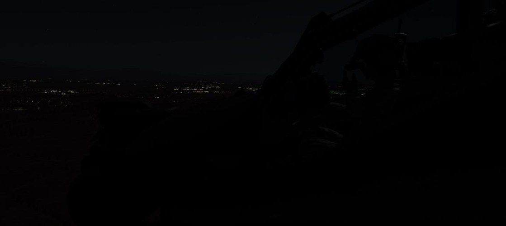
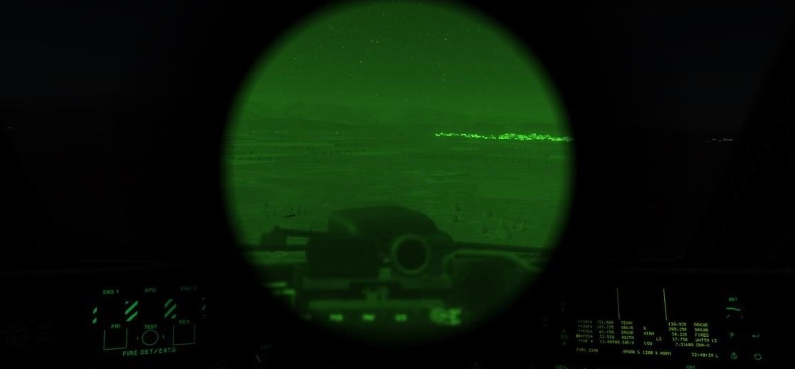

# NIGHT VISION GOGGLES (NVG)

The AN/AVS-6 Aviator Night Vision Imaging System (ANVIS) provides aircrews with a high-fidelity, binocular, 40°
field-of-view under extreme low-light conditions. The AVS-6 NVG’s amplify light in the visible and near-infrared
spectrum to enable aircrews to operate at NOE altitudes near terrain and other natural or man-made obstacles,
under all but the darkest, moonless nights.

The HDU physically interferes with the proper wear of NVG’s (and can incur misalignments within the HDU
symbology when viewed through the NVG’s) and may not be used simultaneously. If the NVG’s are enabled, the
HDU will be rotated away from the crewmember’s face prior to the NVG’s being lowered into view. The IHADSS
will continue to track the helmet position and aircraft sensors may be cued to the crewmember’s approximate
line-of-sight, but NVG’s should not be used as a means of targeting due to the lack of precise aiming symbology.

