# Pilot Cockpit Overview

The Pilot’s primary task is to facilitate the Copilot/Gunner’s ability to operate the aircraft sensors and weapon
systems. The Pilot maintains awareness of the aircrew’s surroundings and the tactical situation; and maneuvers
the aircraft as necessary to ensure the Copilot/Gunner (CPG) can perform unimpeded sensor scans or employ
weapon systems.

The Pilot’s secondary task is to maintain security of the aircraft and aircrew. As the CPG will often be focused
inside the cockpit while operating the aircraft sensors, weapons, and radios, the Pilot maintains a “heads-out”
focus as much as possible. The Pilot remains on the look-out within the immediate vicinity around the aircraft
and is ready to employ the Area Weapon System (AWS) against close-in threats to protect the aircraft or other
team members if necessary.

When equipped with the mast-mounted Fire Control Radar (FCR), the Pilot can use the FCR to assist the CPG in
the targeting process by directing the CPG to specific areas within which to perform TADS sensor scans, or even
hand over individual targets to the CPG for engagement. Alternatively, the Pilot can use the FCR to autonomously
detect, acquire and engage enemy targets with any of the aircraft’s three weapon systems.

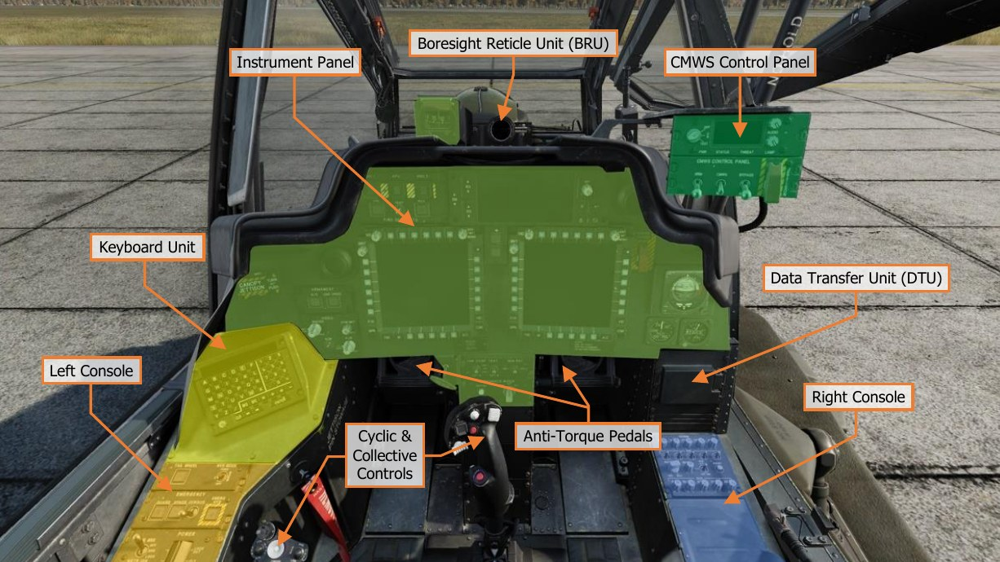

It is important to have a general understanding of where the various controls are located. To help locate items
more easily, the cockpit has been delineated into five primary areas: Instrument Panel, the Keyboard Unit
(KU), Left Console, Right Console, and the CMWS Control Panel.

Each text box above may be selected to jump to a more detailed description of that instrument panel or console,
to include the Cyclic & Collective Controls. Selecting the image of the instrument panel or console will return
the manual back to this page.

The CMWS Control Panel is described in the Aircraft Survivability Equipment (ASE) chapter. //link

### Instrument Panel

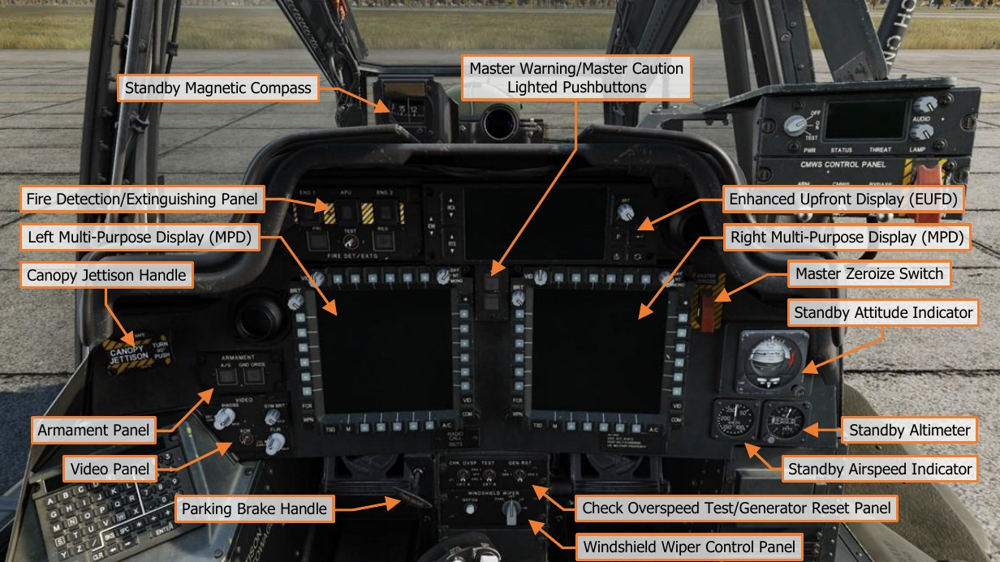

Each text box above may be selected to jump to a more detailed description of that instrument or panel. Selecting
the image of the instrument or panel will return the manual back to this page.

The Enhanced Upfront Display (EUFD) and Multi-Function Display (MPD) are described in dedicated sections later
in this chapter.

#### Standby Magnetic Compass

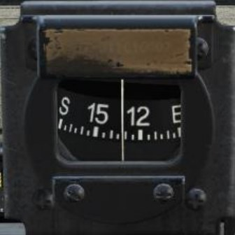

The standby magnetic compass is used by the Pilot for heading reference
when there has been a failure of primary power, or the navigation system
has become unreliable.

Due to magnetic variances and other inaccuracies during normal flight
maneuvers, the standby magnetic compass should not be relied upon for
precise heading or navigation information. The aircraft should immediately
be recovered to a suitable friendly location. Visual landmarks may be used
to maintain awareness of aircraft position and aid in navigation back to
maintenance facilities or friendly-controlled areas.

#### Master Warning/Master Caution Lighted Pushbuttons

The Master Warning/Master Caution lighted pushbuttons alerts the
Pilot to observe the EUFD WCA area for warning and caution messages
indicating conditions that require their immediate attention.

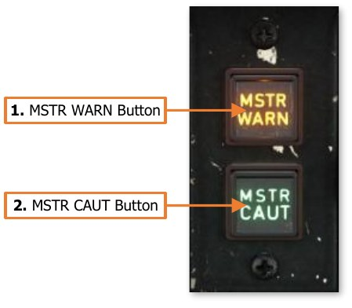

1. **MSTR WARN Button**. Acknowledges the MASTER WARNING
     condition. Extinguishes the MSTR WARN light in the Pilot
     crewstation and ceases the corresponding voice warning
     message in both crewstations.

    - MSTR WARN Light. Flashes to alert the Pilot to a 
    WARNING message displayed on the EUFD.

1. **MSTR WARN Button**. Acknowledges the MASTER CAUTION
     condition. Extinguishes the MSTR CAUT light and ceases the
     corresponding caution audio tone in the Pilot crewstation.

    - MSTR CAUT Light. Illuminates to alert the Pilot to a CAUTION message displayed on the EUFD.

#### Fire Detection/Extinguishing Panel

The FIRE DET/EXTG Panel controls the fire detection
and suppression equipment. It consists of three
pushbutton warning lights, with covers, that
illuminate when a fire is detected and two
pushbuttons that discharge extinguishing agents into
the selected component.

Fire detection sensors are present in each engine
nacelle, the APU compartment, and the aft deck area
near the transmission accessory gearbox. However,
the Halon extinguishing agent can only be discharged
into either engine nacelle or the APU compartment.

1. **ENG 1 Button**. The ENG 1 FIRE button is used
     to indicate when a fire is detected within the left
     engine nacelle and to arm the fire extinguishing system for discharge into the left engine nacelle.

    - FIRE Light. The yellow FIRE light will illuminate at any time a fire is detected within the left engine
          nacelle, and will extinguish when a fire is no longer detected.

    - RDY Light. The green RDY light will illuminate when the ENG 1 FIRE button has been pressed in either
          crewstation. When pressed, the following occurs:

        - Fuel flow to engine 1 is shut off, however the engine will continue to operate until the remaining
               fuel within the fuel lines and engine fuel manifold is consumed.

        - The fire extinguishing system is armed.

        - Bleed air from engine 1 is shut off.

        - The MSTR WARN light is acknowledged and the “ENGINE 1 FIRE” voice warning message will
               cease.

    - Once armed, only the crewstation within which the ENG 1 FIRE button was pressed can dis-arm it and
          restore the systems to their normal operating conditions.

1. **APU Button**. The APU FIRE button is used to indicate when a fire is detected within the APU compartment
     and to arm the fire extinguishing system for discharge into the APU compartment.

    - FIRE Light. The yellow FIRE light will illuminate at any time a fire is detected within the APU
          compartment, and will extinguish when a fire is no longer detected.

    - RDY Light. The green RDY light will illuminate when the APU FIRE button has been pressed in either
          crewstation. When pressed, the following occurs:

        - Fuel flow to APU is shut off, however the APU will continue to operate until the remaining fuel
               within the fuel lines and APU fuel system is consumed.

        - The fire extinguishing system is armed.

        - Bleed air from the APU is shut off.

        - The MSTR WARN light is acknowledged and the “APU FIRE” voice warning message will cease.

    - Once armed, only the crewstation within which the APU FIRE button was pressed can dis-arm it and
          restore the systems to their normal operating conditions.

1. **ENG 2 Button**. The ENG 2 FIRE button is used to indicate when a fire is detected within the right engine
     nacelle and to arm the fire extinguishing system for discharge into the right engine nacelle.

    - FIRE Light. The yellow FIRE light will illuminate at any time a fire is detected within the right engine
          nacelle, and will extinguish when a fire is no longer detected.

    - RDY Light. The green RDY light will illuminate when the ENG 1 FIRE button has been pressed in either
          crewstation. When pressed, the following occurs:

        - Fuel flow to engine 2 is shut off, however the engine will continue to operate until the remaining
               fuel within the fuel lines and engine fuel manifold is consumed.

        - The fire extinguishing system is armed.

        - Bleed air from engine 2 is shut off.

        - The MSTR WARN light is acknowledged and the “ENGINE 2 FIRE” voice warning message will
               cease.

    - Once armed, only the crewstation within which the ENG 2 FIRE button was pressed can dis-arm it and
          restore the systems to their normal operating conditions.

1. **PRI Button**. Pressing this button will discharge the Primary fire extinguishing bottle into the compartment
     selected using the ENG 1, ENG 2, or APU pushbuttons above.

    - DISCH Light. Illuminates when the Primary extinguisher bottle is armed and available for use. When
          the Primary bottle is discharged, the light will extinguish; or if the fire extinguishing system is disarmed
          by de-selecting the ENG 1, ENG 2, or APU pushbuttons above.

1. **Test Switch**. Pressing this switch to the TEST 1 or TEST 2 positions will test the fire detection circuits.
     When released, the switch is spring-loaded back to the center position.

    - TEST 1. Tests fire detection circuit 1. A successful test is indicated by the following:

        - All three FIRE lights on the ENG 1, ENG 2, and APU pushbuttons are illuminated in both
               crewstations.

        - The MSTR WARN lighted pushbutton will be illuminated in both crewstations.

        - The 'AFT DECK FIRE' warning message will be displayed on the EUFD.

        - “AFT DECK FIRE”, “ENGINE 1 FIRE”, “ENG 2 FIRE”, “APU FIRE” voice warning messages will be
               heard in sequence.

    - TEST 2. Tests fire detection circuit 2. A successful test is indicated by the same items as the TEST 1
          position, with the addition of the following:

        - Both DISCH lights on the PRI and RES pushbuttons are illuminated in both crewstations.

1. **RES Button**. Pressing this button will discharge the Reserve fire extinguishing bottle into the compartment
     selected using the ENG 1, ENG 2, or APU pushbuttons above.

    - DISCH Light. Illuminates when the Reserve extinguisher bottle is armed and available for use. When
          the Reserve bottle is discharged, the light will extinguish; or if the fire extinguishing system is disarmed
          by de-selecting the ENG 1, ENG 2, or APU pushbuttons above.

#### Armament Panel

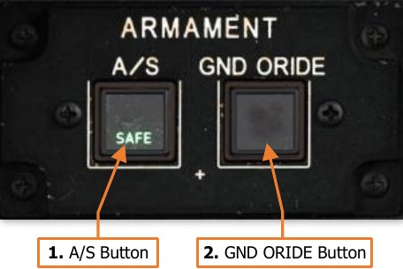

The Armament Panel controls the master arm state of the aircraft.
Each button is common to both crewstations, in that pressing a
button in one crewstation will change the state of the button in the
other crewstation accordingly.

1. **A/S Button**. Pressing this button toggles the master arm
     state between ARM and SAFE when the aircraft is not weight-
     on-wheels, or any time the Ground Override is ON.

    - ARM Light. Indicates the aircraft is Armed.

        - Weapons may be fired from the aircraft.

        - The laser rangefinder/designator may be fired.

    - SAFE Light. Indicates the aircraft is Safe.

        - Weapons are inhibited from firing.

        - The laser rangefinder/designator is inhibited from firing.

1. **GND ORIDE Button**. Pressing this button enables/disables the Ground Override. The Ground Override
     state will have no effect on aircraft systems when airborne.

    - ON Light. Indicates the Ground Override is enabled. When on the ground (weight-on-wheels), the
          following inhibits are affected:

        - The A/S button may be toggled to the ARM state. Disabling the Ground Override will automatically
               set the A/S button to the SAFE state.

        - Weapon systems may be actioned. Disabling the Ground Override will automatically de-action any
               actioned weapon systems.

        - FCR transmissions are permitted. Disabling the Ground Override will automatically cease any FCR
               transmissions.

        - The Chaff dispenser may be armed. Disabling the Ground Override will automatically set the Chaff
               state to SAFE.

#### Video Panel

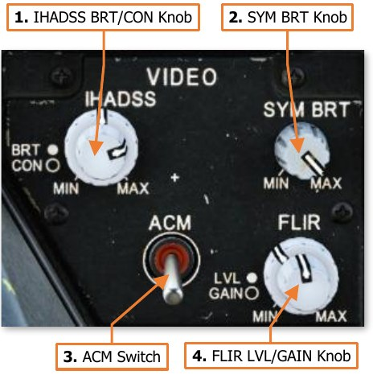

The Video Panel controls the brightness and display of sensor
video.

1. **IHADSS BRT/CON Knob**. Two concentric knobs that
     controls the brightness and contrast of the Helmet Display
     Unit (HDU). The outer knob controls video brightness and the
     inner knob controls video contrast.

1. **SYM BRT Knob**. Controls the brightness of the IHADSS
     symbology displayed on the HDU independently of the video
     underlay.

1. **ACM Switch**. When on, FLIR gain and level is controlled
     automatically. When off, the FLIR knob is enabled. (N/I)

1. **FLIR LVL/GAIN Knob**. Two concentric knobs that control
     the display of FLIR video from the PNVS or TADS. The outer
     knob controls level and the inner knob controls gain.

#### Canopy Jettison Handle

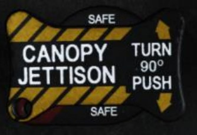

The Canopy Jettison handle can be used to aid in emergency egress from
the aircraft. When initiated, the canopy side panels on either side of each
crewstation will be explosively jettisoned from the canopy frame. Either
crewmember can initiate the canopy jettison process, as can rescue crews
via an external jettison handle. (N/I)

Each of the three Canopy Jettison handles are physically locked in place via
a safety pin, which are stowed prior to flight. A stowage slot is present in
each crewstation for storing the safety pins during flight.

#### Master Zeroize Switch

The guarded Master Zeroize switch erases all sensitive data onboard the aircraft in the
event the aircraft is forced down in a hostile area. (N/I)

#### Standby Attitude Indicator

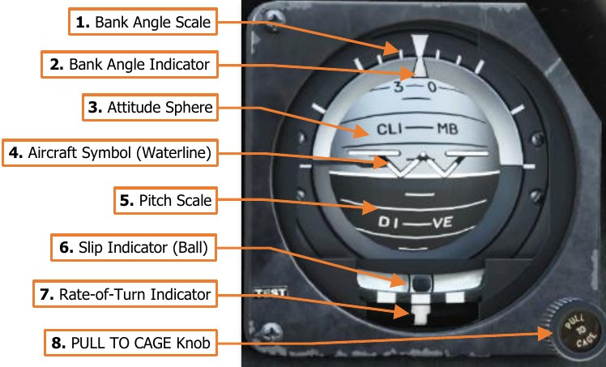

The standby attitude indicator is a self-
contained attitude indicator that displays
±85° of aircraft pitch and 360° of aircraft
roll. The indicator is used by the Pilot for
attitude reference when there has been
a failure of primary power, or the flight
reference system has become unreliable.

The attitude indicator can develop errors
during aggressive maneuvers, which may
require it to be caged in flight using the
PULL TO CAGE knob.

A yellow OFF warning flag will appear
when the indicator is caged, or electrical
power to the attitude indicator has been
lost.

1. **Bank Angle Scale**. Indicates the bank angle when used in conjunction with the Bank Angle Indicator. A
     white triangular bank angle index is set at 0° of bank. Major tick marks are placed at 30°, 60° and 90°
     angles of bank. Minor tick marks are placed at 10° and 20° angles of bank.

1. **Bank Angle Indicator**. Indicates bank angle relative to the horizon. When the indicator is aligned with the
     fixed triangular bank angle index, the aircraft is in a level attitude.

1. **Attitude Sphere**. Rotates within the indicator to indicate pitch and roll attitude throughout most
     orientations of flight, in relation to the Aircraft Symbol. The white hemisphere indicates the aircraft nose is
     pointed above the horizon toward the sky, in a climb. The black hemisphere indicates the aircraft nose is
     pointed below the horizon toward the ground, in a dive.

1. **Aircraft Symbol (Waterline)**. Provides a fixed attitude reference of the aircraft nose around which the
     Attitude Sphere rotates. The vertical alignment of the symbol can be manually adjusted by rotating the PULL
     TO CAGE knob.

1. **Pitch Scale**. Provides an attitude reference scale of aircraft pitch in relation to the Aircraft Symbol. Major
     tick marks are placed at every 10° of pitch and minor tick marks are placed at every 5° of pitch.

1. **Slip Indicator (Ball)**. Indicates whether the aircraft is in coordinated flight. With the ball centered between
     the two black marks, the aircraft is in coordinated flight, which minimizes drag. If the ball is left of center,
     applying left pedal will adjust tail rotor thrust to bring the aircraft back into coordinated flight. Likewise, if
     the ball is right of center, applying right pedal will adjust tail rotor thrust to bring the aircraft back into
     coordinated flight.

1. **Rate-of-Turn Indicator**. Indicates the aircraft rate of turn, with the lower white bar moving left and right
     to indicate an increased turn rate in that direction. One bar width equates to 1° to 1.2° per second turn
     rate. If the lower white bar is aligned with the upper white bar in the center, the aircraft is not turning. If
     the lower white bar is aligned with the upper white bars on the left or right, the aircraft is in a standard rate,
     3° per second turn. If the lower white bar is centered between two of the upper white bars, the aircraft is
     in a half standard rate turn.

1. **PULL TO CAGE Knob**. Cages the attitude indicator and is used to adjust the relative pitch of the Aircraft
     Symbol in relation to the Attitude Sphere. When the knob is pulled outward, the Attitude Sphere is caged to
     a level attitude orientation regardless of the aircraft’s actual attitude, causing the OFF warning flag to appear.
     When pulled outward and rotated fully clockwise, the attitude indicator is locked in the caged position.

#### Standby Airspeed Indicator

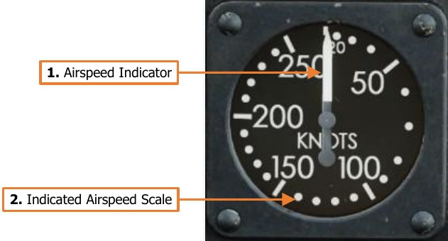

The standby airspeed indicator is used by the Pilot
for airspeed reference when there has been a failure
of primary power, or the flight reference system has
become unreliable. The indicator is pneumatically
operated by the right pitot probe.

1. **Airspeed Indicator**. Indicates indicated
     airspeed along the Indicated Airspeed Scale.

1. **Indicated Airspeed Scale**. The outer scale
     of the instrument, from 0 to 250 knots. Tick
     marks are set at 50-knot increments, and dots
     are set at 10-knot increments starting at 20
     knots.

#### Standby Altimeter

The standby altimeter is used by the Pilot for
barometric altitude reference when there has been a
failure of primary power, or the flight reference
system has become unreliable. The altimeter is
pneumatically operated by the static pressure
system.

1. **1000-foot Altitude Scale**. Each major tick
     mark corresponds with 100-foot increments,
     with minor tick marks corresponding to 50-foot
     increments.

1. **1000-foot Scale Indicator**. Indicates the
     aircraft altitude on the outer 1000-foot scale.

1. **Altitude Indicator**. Indicates the current barometric altitude in 1000-foot increments from 0 feet to 20,000
     feet.

1. **“Kollsman” Window**. Indicates current altimeter setting correction in inches of mercury (in/Hg). The
     altimeter setting on the AH-64D is designed to be used in conjunction with QNH barometric altimeter settings
     to calibrate the altimeter to altitudes above mean sea level (MSL).

1. **Barometric Setting Knob**. Sets altimeter setting correction as displayed in the “Kollsman” Window.

### Check Overspeed Test/Generator Reset Panel

Tests engine overspeed circuits and provides a means to
reset the generators if the MPDs are non-functional
following a power failure.

1. **CKT A Switch**. Tests the overspeed protection
     Circuit A for each engine.

    - ENG 1. Not implemented.

    - OFF. The switch is spring-loaded to this
          position.

    - ENG 2. Not implemented.

1. **CKT B Switch**. Tests the overspeed protection Circuit B for each engine.

    - ENG 1. Not implemented.

    - OFF. The switch is spring-loaded to this position.

    - ENG 2. Not implemented.

1. **GEN RST Switch**. Performs a reset of either generator in the case of a power failure.

    - GEN 1. Resets Generator 1.

    - GEN 2. Resets Generator 2.

#### Windshield Wiper Control Panel

Controls the external windshield wipers and canopy
defog functions.

1. **DEFOG Button**. Directs hot air mixed with ambient
     air from the cockpit against the canopy side panels
     to remove fogging. (N/I)

1. **WINDSHIELD WIPER Knob**. Sets the speed for
     the windshield wiper or returns the wiper to the
     PARK position.

    - PARK. Holding the knob in this position will move the windshield wiper to its designated parking
          location. When released, the knob will be spring-loaded to the OFF position.

    - OFF. Powers off the windshield wiper at its current position.

    - LO. Powers the windshield wiper and sets the motion to low speed.

    - HI. Powers the windshield wiper and sets the motion to high speed.

#### Parking Brake Handle

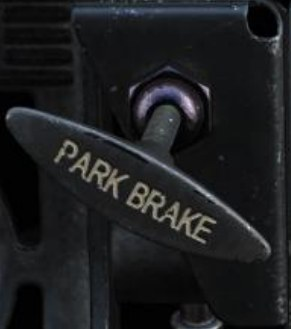

The PARK BRAKE handle can be used by the Pilot to set the wheel brakes without
needing to continuously apply pressure to the anti-torque pedals themselves. To
set the brakes using this method, the brakes are engaged by applying pressure
to the anti-torque pedals in either crewstation, and the Pilot then pulls the PARK
BRAKE handle out. The pressure on the anti-torque pedals is then released.

To release the brakes after they have been set using the PARK BRAKE handle,
either crewmember may simply apply brake pressure using the anti-torque
pedals, and the Parking Brake handle will snap inward.

Note that the PARK BRAKE handle can be pulled and locked in the outward
position without applying the wheel brakes, and therefore the outward position
of the handle does not directly correlate to the brakes being set. However, if the
PARK BRAKE handle is in the forward position, the brakes are indeed released.

#### Keyboard Unit

5The Keyboard Unit (KU) is used by
the crewmembers to input data into
the aircraft computers, perform
arithmetic functions, or be used as
a scratchpad to temporarily record
data for a brief time.

Each      Keyboard       Unit     is
independently operated by either
crewmember, and data is only
entered and utilized by the onboard
computers when a data prompt is
present on the KU display itself.

The N, E, S and W keys are boxed
for easy recognition if coordinates
are to be input using Latitude and
Longitude.

#### Data Entry and Arithmetic Functions

The KU uses an “overtype” method of data
entry, in that any data underneath the flashing
cursor will be overwritten by the next
character entered, and each subsequent
character to the right of the cursor will be
continuously overwritten as more characters
are entered.

1. **Display Prompt**. Indicates the type of
     data that will be input if accepted by the
     avionics. Pressing an MPD pushbutton
     associated with a data entry symbol >
     will show the corresponding prompt on
     the KU followed by a colon. The desired
     data can then be input into the
     scratchpad.

1. **Scratchpad Display**. The maximum
     number of characters that can be
     displayed on the KU scratchpad itself is
     22, but the scroll buttons can be used to
     move the cursor left or right in a
     continuous scrolling fashion if the data
     entry exceeds the 22 characters on the
     display.

1. **Arithmetic Buttons**. If a display prompt is not present on the scratchpad display, basic arithmetic functions
     may be performed using these keys. To perform basic arithmetic, enter a number, followed by either the *
     (multiply), ÷ (divide), + (add), or - (subtract) keys. Enter another number and press Enter (equal). The
     resultant value will display on the scratch pad.

1. **CLR Button**. Removes all data entered on the scratchpad but will not remove or cancel a display prompt if
     present.

1. **Scroll Arrows**. Moves the cursor position left or right on the display to set the data entry point over existing
     characters.

1. **ENTER Button**. Used to accept a data input to an MPD data entry prompt. If data input is invalid, the
     characters on the scratchpad display will flash, and the data will need to be edited before it can be accepted
     into the MPD data prompt.

1. **Display Brightness Knob**. Adjusts the brightness of the KU scratchpad display.

1. **BKS Button**. Removes the character to the left of the cursor and shifts the cursor to the left, along with
     any characters underneath or to the right of the cursor.

1. **SPC Button**. Places a blank character space at the cursor position.

### Left Console

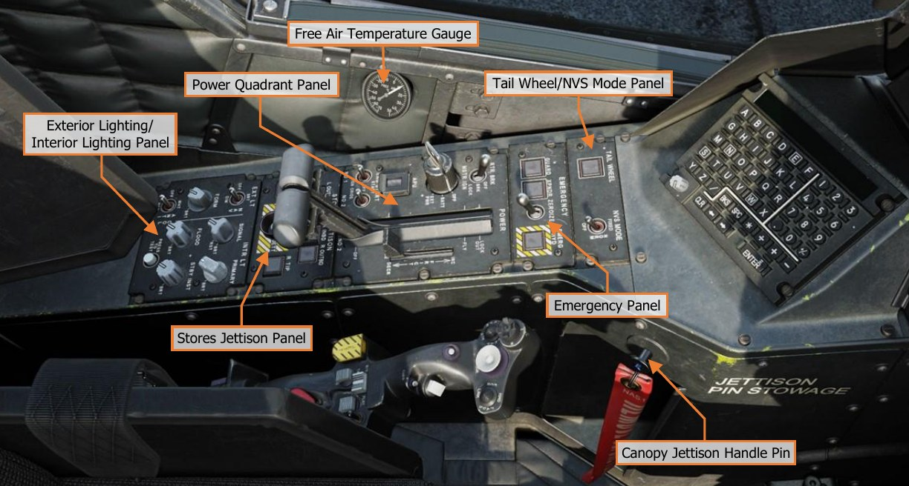

Each text box above may be selected to jump to a more detailed description of that panel. Selecting the image
of the panel will return the manual back to this page.

#### Tail Wheel/NVS Mode Panel

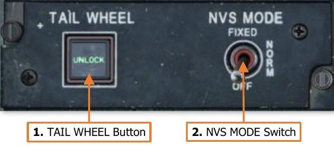

Controls the tail wheel locking mechanism and the
operating mode of the crewstation’s Night Vision System.

1. **TAIL WHEEL Button**. Toggles the commanded
     state of the tail wheel locking mechanism between
     locked and unlocked.

    -  UNLOCK Light. Illuminates to indicate when
           the tail wheel is unlocked, regardless of the
           commanded state of the locking mechanism.

1. **NVS MODE Switch**. Sets the operating mode of the Night Vision System within the crewstation. The default
     NVS sensor selections are the PNVS in the Pilot crewstation and the TADS in the CPG crewstation, unless
     the NVS Select Switch on the Collective Flight Grip has been used to swap the NVS sensor selections.

    -  FIXED. Activates the selected NVS sensor and slaves it to the fixed forward position (0° in azimuth
           and -4.9° in elevation). If the selected NVS sensor is the PNVS, it will be un-stowed. If the selected
           NVS sensor is TADS, it will switch to FLIR in Wide field-of-view, regardless of the TEDAC switch settings.

    -  NORM. Activates the selected NVS sensor and slaves it to the crewmember’s IHADSS line-of-sight. If
           the selected NVS sensor is the PNVS, it will be un-stowed. If the selected NVS sensor is TADS, it will
           switch to FLIR in Wide field-of-view, regardless of the TEDAC switch settings.

    -  OFF. Deactivates the selected NVS sensor and stows it. The PNVS will return to the stowed position
           and the TADS will stow in the fixed forward position (0° in azimuth and -4.9° in elevation).

#### Emergency Panel

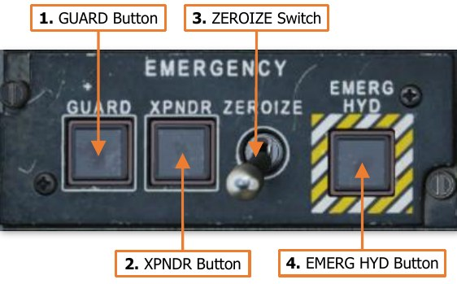

The Emergency Panel provides a singular location for the
crewmember to perform miscellaneous emergency
actions, without requiring navigation through MPD pages
to access the associated functions. (N/I)

1. **GUARD Button**. Tunes the UHF radio to the
     GUARD frequency of 243.000 MHz. The frequency
     in the Primary slot of the UHF radio will be moved
     to the Standby slot, and 'GUARD' will be displayed
     as the frequency callsign.
     Pressing this button when it is already set to ON will
     return the previous UHF frequency to the Primary
     slot and place the GUARD frequency in the Standby slot.

    - ON Light. Illuminates to indicate that the GUARD button has been pressed in either crewstation.

1. **XPNDR Button**. Sets the transponder Mode 3/A code to 7700 to indicate the aircraft is experiencing an in-
     flight emergency. If the transponder is in STBY, it will automatically be set to NORM, and EUFD transponder
     information will indicate a status of “7700 EMER”.
     Pressing this button when it is already set to ON will return the transponder to the NORM status, but the
     Mode 3/A code will need to be manually changed by either crewmember.

    - ON Light. Illuminates to indicate that the XPNDR button has been pressed in either crewstation.

1. **ZEROIZE Switch**. When set to the forward position, all communications encryption, modem settings, and
     any TSD points within the navigational database will be erased.

1. **EMERG HYD Button**. Activates the emergency hydraulics system. This system provides emergency
     hydraulic pressure to the utility hydraulic system for a very brief period in order to perform an immediate
     emergency landing.

    - ON Light. Illuminates to indicate that the emergency hydraulics has been activated by either
          crewmember.

#### Power Quadrant Panel

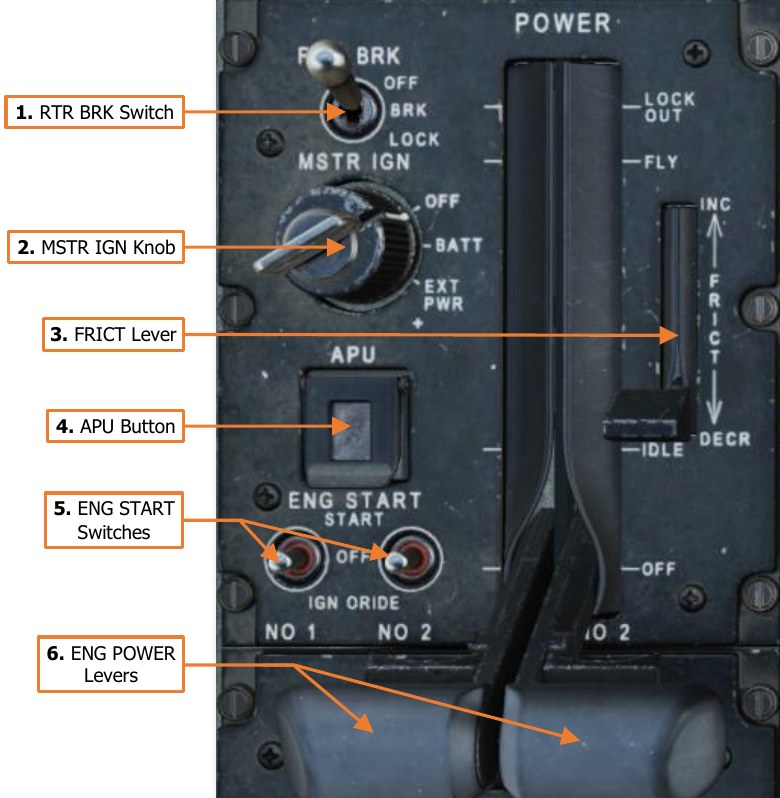

The Pilot’s Power Quadrant includes
controls for battery, APU and engine
start, and rotor brake operation. The
POWER levers manage engine output
during normal and manual control
operations.

1. **RTR BRK Switch**. Controls the
     commanded state of the rotor
     brake mounted to the accessory
     gearbox      of   the    main
     transmission.

    - OFF. The rotor brake is
          commanded to disengage.

    - BRK. The rotor brake is
          commanded to engage in a
          low-pressure     state    to
          reduce the time it takes for
          the    rotor   system     to
          decelerate to a stop. Used
          when shutting down in high
          winds or when on board a
          naval vessel in rough sea
          conditions.

    - LOCK. The rotor brake is
          commanded to engage in a
          high-pressure     state   to
          prevent the rotor from spinning. Used when performing an engine start in high winds or when on board
          a naval vessel in rough sea conditions.
     Rotor brake operation is electronically inhibited if either ENG POWER lever is beyond the IDLE position.

1. **MSTR IGN Knob**. Enables battery or external power to the aircraft.

    - OFF. Disconnects the battery from the DC battery bus.

    - BATT. Connects the battery to the DC battery bus. If the aircraft is receiving DC power from the
          Transformer-Rectifier Units (TRUs), the battery will be set to a charging state, but will automatically
          provide emergency power to the battery bus if a TRU failure occurs.

    - EXT PWR. Enables external AC and DC power to be supplied via the external power receptacle.

1. **FRICT Lever**. Adjusts the friction resistance when moving the engine power levers. (N/I)

1. **APU Button**. Intiates the APU automatic start-up and shutdown sequences.

    - ON Light. Illuminates to indicate when the APU has successfully started and is operating.

1. **ENG START Switches**. Controls the pneumatic air starters and ignition systems of each main engine.

    - START. Moving the switch momentarily to this position initiates an automatic start sequence for the
          respective engine and enables the engine ignitors. The System Processor (SP) will automatically
          activate the fuel boost pump and open the pneumatic valve to the engine air starter to spool the NG
          section of the engine. The SP will automatically close the pneumatic valve to disengage the starter
          when the NG reaches 52% RPM.

    - OFF. Normal position of the ENG START switch after initiating a START sequence or motoring the
          engine using the IGN ORIDE position.

    - IGN ORIDE. Moving the switch to this position manually opens the pneumatic valve to the engine air
          starters to spool the NG section of the engine. The System Processor (SP) will not activate the fuel
          boost pump nor the engine ignition system. The pneumatic air starters will continue to spool the N G
          section of the engine at ~25% RPM until the ENG START switch is returned to the OFF position, which
          will close the close the pneumatic valve to disengage the starter.
          An engine start sequence may be aborted by setting the ENG START switches to the IGN ORIDE
          position and then to OFF. This will disable the engine ignition system, disengage the engine air starters,
          and the fuel boost pump will be automatically deactivated by the SP.

1. **ENG POWER Levers**. Controls the fuel flow and control mode of each main engine. Each ENG POWER
     lever is connected to the corresponding Hydromechanical Unit (HMU) on the engine through the Power
     Available Spindle (PAS).
     Each ENG POWER lever includes a detent that prevents the lever from being inadvertantly advanced beyond
     FLY into the LOCK OUT range, or retarded below IDLE to OFF. A finger-lift detent lever on each ENG POWER
     lever disengages the mechanical detents.

    - LOCK OUT. Setting the ENG POWER lever to this position will lock out the Digital Electronic Control
          (DEC) from electronically regulating fuel flow and will set the engine throttle to fully open. This will also
          disable the NP overspeed protection and TGT limiting functions of the DEC, so the engine throttle will
          need to be manually controlled using the ENG POWER lever to prevent an overspeed or
          overtemperature condition.
          This position is only used during emergency procedures in which the DEC has malfunctioned or failed
          in some manner, requiring the aircrew to manually control the engine throttle in order to prevent an
          engine overspeed or overtemperature, or to maintain the rotor RPM (NR) within an acceptable range
          for flight.

    - FLY. Setting the ENG POWER lever to this position will set the PAS to the FLY position and command
          the DEC to trim fuel flow to maintain the rotor RPM (NR) at 101%. Each engine will automatically
          regulate their respective throttle settings to equally balance the torque requirement between each
          engine (load-sharing).

    - IDLE. Setting the ENG POWER lever to this position will set the PAS to the IDLE position. The DEC will
          no longer regulate the fuel flow based on rotor RPM (NR) and the load-sharing logic between the
          engines is disabled.
          Setting the ENG POWER lever to this position will also reset the DEC from the LOCK OUT condition,
          returning DEC-related functionality to the respective engine.

    - OFF. Setting the ENG POWER lever to this position will set the PAS to the OFF position, shutting off
          fuel flow to the engine.
     When the RTR BRK switch is in the BRK or LOCK positions, the ENG POWER levers will be physically inhibited
     from advancing beyond the IDLE position.

#### Stores Jettison Panel

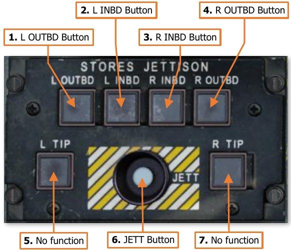

The Stores Jettison panel allows the crewmembers to
selectively jettison individual weapon stations in lieu of
performing an emergency jettison of all stations at once.

Each weapon station can be armed/disarmed by toggling
the corresponding pushbutton on this panel. Each
pushbutton includes an ARM light which indicates that
that station will be jettisoned when the JETT button is
pressed.

Only the crewstation that has armed a weapon station
for jettison can disarm it. However, once any stations are
armed, either crewmember can initiate the jettison
sequence by pressing the JETT button.

1. **L OUTBD Button**. Arms/disarms the left outboard
     wing station for jettison.

1. **L INBD Button**. Arms/disarms the left inboard
     wing station for jettison.

1. **R INBD Button**. Arms/disarms the right inboard wing station for jettison.

1. **R OUTBD Button**. Arms/disarms the right outboard wing station for jettison.

1. **L TIP Button**. No function.

1. **JETT Button**. Jettisons any weapon stations that have been selectively armed.

1. **R TIP Button**. No function.

#### Exterior Lighting/Interior Lighting Panel

The Exterior Lighting/Interior Lighting panel controls the
exterior aircraft lighting and the interior lighting within
the Pilot cockpit.

1. **NAV Switch**. Sets the brightness levels of the
     engine nacelle-mounted red/green and the tail
     mounted white navigation lights.

    - BRT. Sets the navigation lights to bright.

    - OFF. Sets the navigation lights to off.

    - DIM. Sets the navigation lights to dim.

1. **SIGNAL Knob**. Adjusts the brightness of the signal
     lights within the cockpit when set to nighttime
     brightness levels. This knob will have no function if
     the signal lights are set to daytime brightness level.
     Rotating the knob to the RST (Reset) detent will set
     the signal light brightness scale to nighttime levels

     if the PRIMARY knob is not in the OFF position and
     the FLOOD knob is less than 50%.

1. **PRIMARY Knob**. Adjusts the brightness of the primary instrument backlighting within the cockpit. Rotating
     this knob to the OFF position will revert the signal lights to daytime mode.

1. **FORM Knob**. Adjusts the brightness of the exterior formation lights on the wing tips, tail boom, and vertical
     stabilizer.

1. **FLOOD Knob**. Adjusts the brightness of the interior flood lights within the cockpit. Rotating this knob
     clockwise beyond the 50% setting will revert the signal lights to daytime mode.

1. **STBY INST Knob**. Adjusts the brightness of the standby instrument illumination within the cockpit.

1. **ANTI COLL Switch**. Sets the operating mode of the engine nacelle-mounted anti-collision strobe lights.

    - WHT. Sets the anti-collision lights to a white, alternating flash pattern.

    - OFF. Sets the anti-collision lights to off.

    - RED. Sets the anti-collision lights to a red, alternating flash pattern.

1. **PRESS TO TEST Button**. Illuminates all signal lights to verify their function.

#### Free Air Temperature Gauge

The Free Air temperature gauge indicates the
temperature of the external air mass via a probe
directly protruding from the gauge itself through the
fuselage to the outside of the aircraft.

1. **Temperature        Indicator**.     Indicates   air
     temperature in Celsius (°C) as directly measured
     outside the pilot cockpit.

1. **Temperature Scale**. Each major tick mark
     corresponds with 10-degree increments, with
     minor tick marks corresponding to 2-degree
     increments.

### Right Console

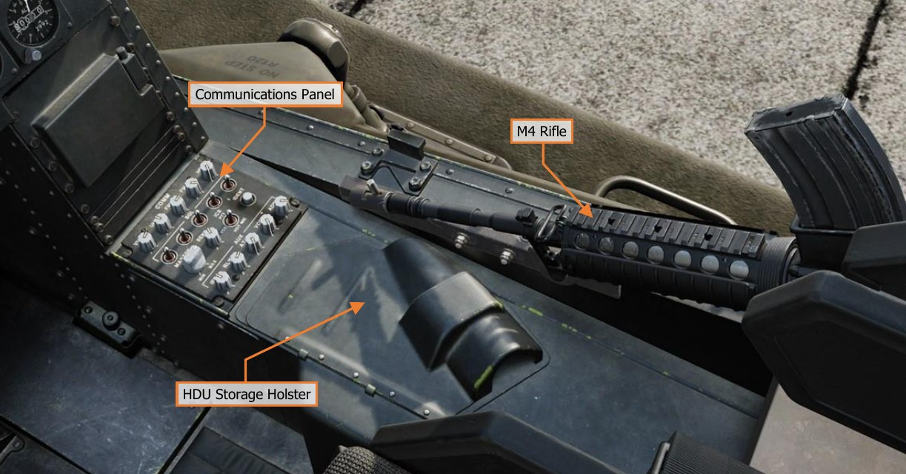

#### Communications Panel

The Communications panel controls the   
volume of the intercom, radios, and
other audio sources within the
crewstation.                            

1. **FM1 Knob**. Adjusts the volume of
     the FM1 radio. Rotating the knob
     clockwise will increase the volume
     level; and pulling the knob        
     outward will mute the audio from
     the FM1 radio.

1. **FM2 Knob**. Adjusts the volume of    
     the FM2 radio. Rotating the knob
     clockwise will increase the volume 
     level; and pulling the knob
     outward will mute the audio from   
     the FM2 radio.
                                        

1. **HF Knob**. Adjusts the volume of
     the HF radio. Rotating the knob    
     clockwise will increase the volume
     level; and pulling the knob
     outward will mute the audio from the HF radio.

1. **VHF Knob**. Adjusts the volume of the VHF radio. Rotating the knob clockwise will increase the volume level;
     and pulling the knob outward will mute the audio from the VHF radio.

1. **UHF Knob**. Adjusts the volume of the UHF radio. Rotating the knob clockwise will increase the volume
     level; and pulling the knob outward will mute the audio from the UHF radio.

1. **SQL Switches**. Momentarily pressing these switches to the forward or aft positions will toggle the squelch
     function of the corresponding radio.

1. **SENS Knob**. Adjusts the voice-activation sensitivity when the intercom switch is in the VOX position.
     Rotating the knob clockwise will increase the sensitivity and lower the voice-activation threshold.

1. **MASTER Knob**. Adjusts the overall volume level of all audio sources received within the crewmember’s
     helmet.

1. **ICS Switch**. Controls the operating mode of the crewmember’s mic on the intercom audio circuit.

    - PTT. The crewmember’s mic will only be activated when the Push-To-Talk switch on the cyclic or the
          floor button is depressed.

    - VOX. The crewmember’s mic will be activated any time the voice level exceeds the threshold set by
          the SENS knob, or when the Push-To-Talk switch on the cyclic or the floor button is depressed.

    - HOT MIC. The crewmember’s mic is continuously activated.

1. **IDENT Button**. When pressed, the transponder performs an identification-of-position function. This is
    used to momentarily highlight the ownship position when replying to non-encrypted transponder
    interrogations (non-Mode 4 interrogations). (N/I)

1. **IFF Knob**. Adjusts the volume of the IFF interrogation audio. Rotating the knob clockwise will increase
    the volume level. (N/I)

1. **RLWR Knob**. Adjusts the volume of the voice warning messages received from the APR-39/AVR-2
    Radar/Laser Warning Receiver system; as well as the Radar Frequency Interferometer (RFI) if the mast-
    mounted FCR is installed and the RFI is operational. Rotating the knob clockwise will increase the volume
    level.

1. **ATA Knob**. No function.

1. **VCR Knob**. Adjusts the volume of the VCR audio when video playback is enabled. Rotating the knob
    clockwise will increase the volume level; and pulling the knob outward will mute the audio from the VCR
    playback. (N/I)

1. **ADF Knob**. Adjusts the volume of the audio received from the ARN-149 Automatic Direction Finder (ADF).
    Rotating the knob clockwise will increase the volume level; and pulling the knob outward will mute the audio
    from the ADF receiver.

{!abbr.md!}
{!dev-docs/ah64d/abbr.md!}
{!docs/ah64d/abbr.md!}
