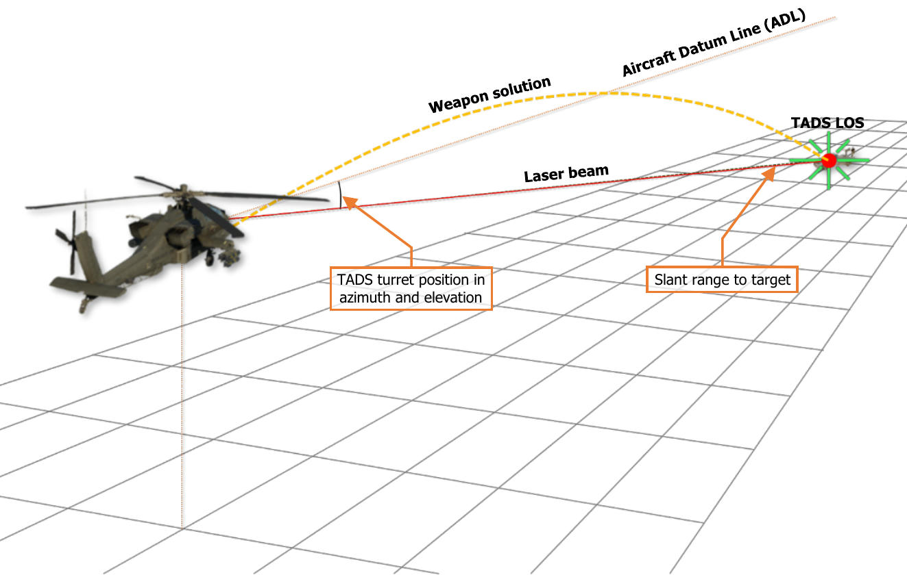
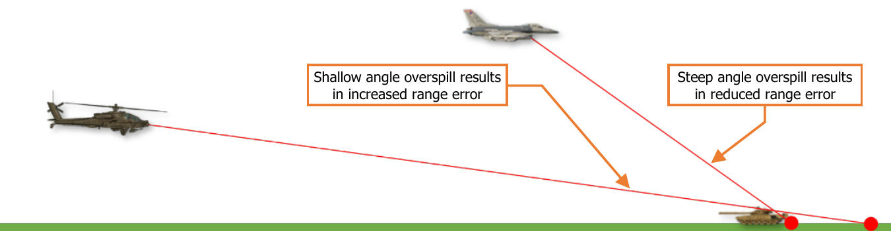
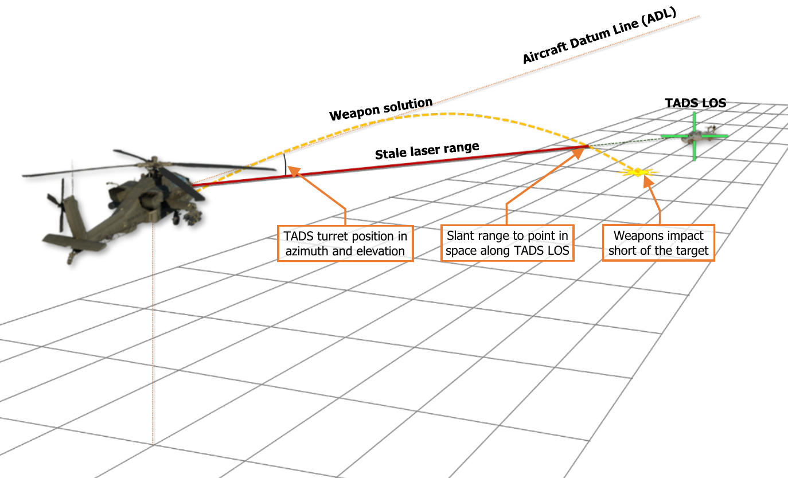
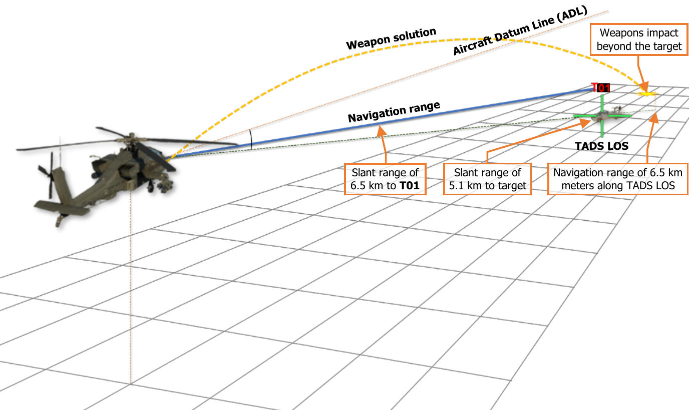
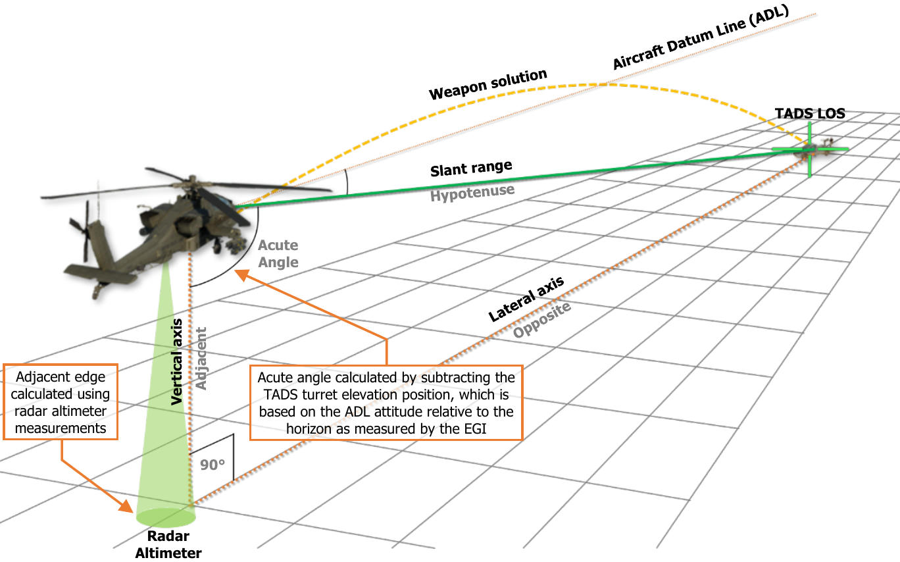
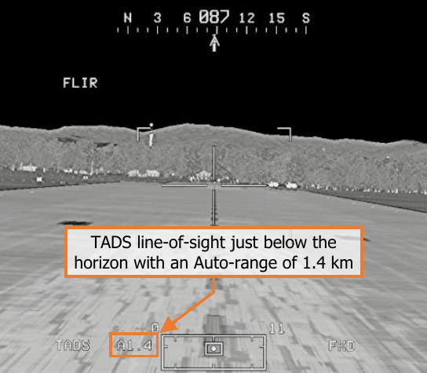
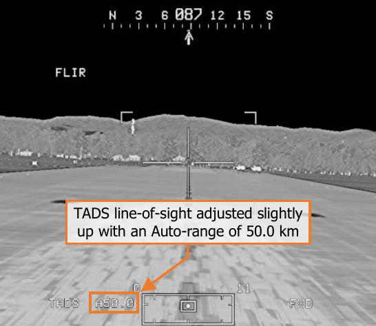
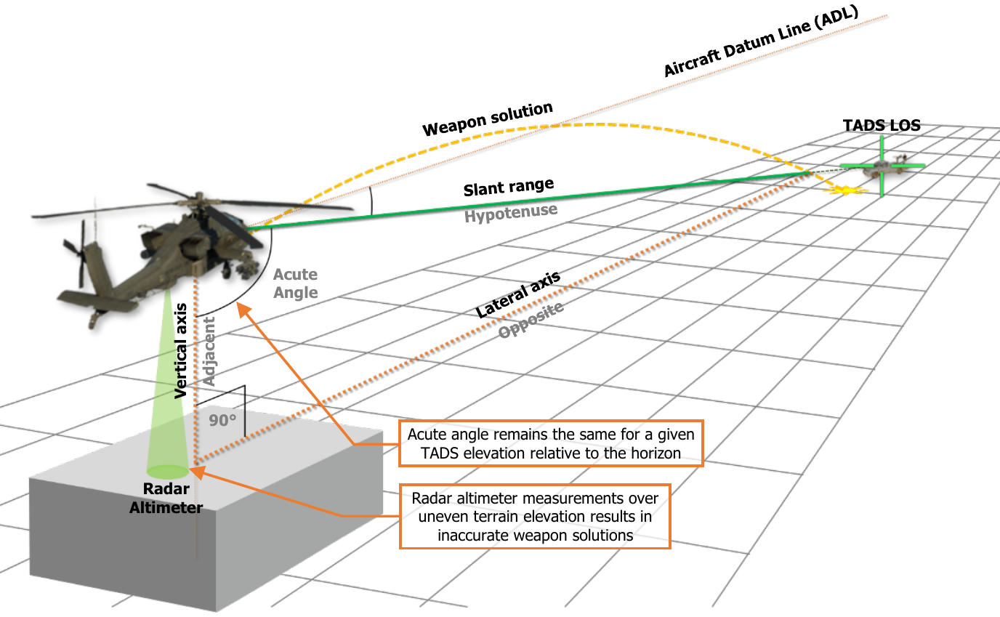
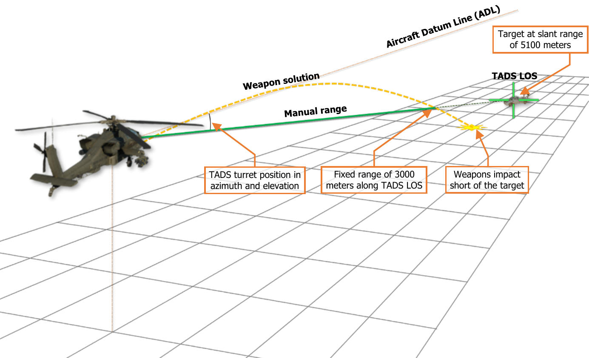
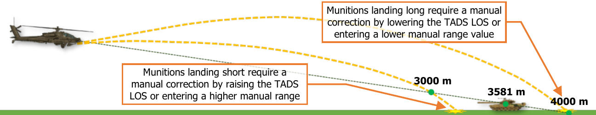

# TADS ACQUISITION AND RANGING
In similar fashion to using the HMD as the selected sight, detecting, acquiring, and engaging targets with the
TADS is fairly straightforward, in that the TADS simply needs to be directed toward and stabilized on the target
to generate an appropriate weapon solution. TADS targeting modes such as LMC and IAT assist the
Copilot/Gunner (CPG) in target tracking, and the LST assists the CPG in acquiring an offboard laser designation,
but autonomously and efficiently acquiring targets using the TADS and performing an accurate ranging of the
target location is critical in achieving a successful target engagement.
Generally speaking, TADS sensors and fields-of-view (FOV) are best used in
the following manner.                                                     

- Initial detection of targets on the battlefield: FLIR Wide/Medium FOV.

- Individual target acquisition: FLIR Wide/Medium FOV or DTV Wide FOV.

- Target identification: FLIR Narrow FOV or DTV Narrow FOV.

- Target tracking: FLIR Narrow/Zoom FOV; DTV Narrow/Zoom FOV.

As with most tactical situations, many variables may determine the ideal sensor
and field-of-view. Factors such as target size, range to target, time of day, and
movement of the aircraft or target will play significant roles in determining
which sensor or field-of-view should be. For example, a company of tanks will
be much easier to detect and acquire in Wide FOV, whereas a squad of infantry
at the same range may not be detected until Narrow FOV is utilized. In addition,
the reduced slew rates and narrow fields-of-view of Narrow or Zoom FOV levels
may make them unsuitable for engaging targets at close range, depending on
whether the intended targets (or the aircraft) are moving at a high angular
velocity.

If a target is lost or inadvertently exits the TADS field-of-view, it is normally
wise to “back out” to the previous field-of-view to re-acquire the target within
the center of the TADS video, stabilize the TADS movement as necessary, and
then “step in” to the next field-of-view to resume tracking as desired.
It is important to note that the Zoom FOV setting is simply an electronic
magnification of the video received from the TADS sensors and will not provide
an increase in target resolution or detail. However, the larger video image may
aid in precision tracking against long-range targets in which precise placement
of the TADS laser beam is critical in accurate ranging or designation of the
target.

### Acquisition Sources

The use of acquisition sources can reduce the time necessary to bring the TADS onto an intended target. When
a target is detected using another sensor onboard the aircraft (to include visual detection by either crewmember),
setting that sensor as the acquisition source and enabling the SLAVE function increases the efficiency of target
acquisition within the TADS.

Acquisition sources also reduce the amount of verbal communications and coordination of sensors that must
occur between the crewmembers, which also increases combat efficiency. By replacing the verbal description of
a target (or threat) using a verbose “description, direction, distance” with a concise “sight to source” command,
target handovers between crewstations may become near instantaneous with a proficient aircrew. In addition,
slaving the selected sight directly to the location of the acquisition source reduces the effects of inaccurate range
estimations and removes the need for verbal descriptions of the intended target, or visual reference points to aid
in locating the correct target amongst many.

An example of an inefficient target handover from the Pilot’s HMD to the CPG’s TADS is shown below:

*“Gunner, target tank at 11 o’clock, approximately 4 kilometers, dug-in along the north-south running treeline.”*

The CPG must manually slew the TADS to the approximate direction, visually identify the correct treeline along
that general direction (assuming the Pilot’s range estimate was accurate) and then locate the correct tank in that
vicinity.

Examples of efficient target handovers utilizing acquisition sources are shown below:

*“Gunner, target, Pilot helmet sight. Tank in the treeline.”*

*“Gunner, target, FCR. Tracked vehicle, range 4.6.”*

In either case, the CPG simply selects the announced source of target information as the acquisition source and
enables SLAVE, slewing the TADS line-of-sight directly to the location of the intended target, removing most of
any targeting ambiguity that exists.

Acquisition sources that will command the TADS to a specific azimuth and elevation relative to the aircraft nose
are listed below.

- **PHS.** Pilot Helmet Sight; commands the TADS to the line-of-sight of the Pilot’s helmet. May be used to direct
     the TADS to the location designated by the Pilot’s HMD LOS Reticle.

- **GHS.** Gunner Helmet Sight; commands the TADS to the line-of-sight of the Copilot/Gunner’s helmet. May
     be used to direct the TADS to the location designated by his/her own HMD LOS Reticle.

- **SKR.** Seeker; commands the TADS to the line-of-sight of the next-to-shoot AGM-114 missile seeker. May
     be used to direct the TADS to the target location that is currently being tracked by the next-to-shoot AGM-
     114 missile, possibly to confirm target identification prior to weapons release.

- **FXD.** Fixed forward; commands the TADS to align with the Armament Datum Line (ADL) at 0° in azimuth
     and -4.9° in elevation.

Acquisition sources that will command the TADS to a 3-dimensional location relative to the ownship position are
listed below.

- **FCR.** Fire Control Radar; commands the TADS to the location of the next-to-shoot target designated on the
     FCR page. May be used to direct the TADS to the location of the designated target to perform visual
     identification prior to weapons release, or to engage the designated target while using TADS as the sight.

- **W##, H##, C##, T##.** Waypoint, Hazard, Control Measure, or Target/Threat point; commands the TADS
     to the coordinates of the selected point within the navigation database. May be used to direct the TADS to
     a pre-planned, stored, or transmitted location for reconnaissance, visual identification, weapons
     engagement, or re-acquisition if line-of-sight was lost.

- **TRN.** Terrain point; commands the TADS to the coordinates of the selected terrain point within the
     navigation database. May be used to direct the TADS to a cursor-selected location on the TSD that is not
     associated with an existing Waypoint, Hazard, Control Measure, or Target/Threat point for reconnaissance,
     visual identification, or weapons engagement.

### Range Sources

Once a target has been successfully acquired and is being tracked within the TADS field-of-view, the next and
perhaps most critical step in ensuring a successful weapon engagement is determining an accurate range to the
intended target. As the TADS line-of-sight can only determine a target’s relative azimuth and elevation with
respect to the aircraft’s attitude, measuring the range to the target along the TADS line-of-sight provides the
third dimension needed to determine the target’s 3-dimensional position relative to the ownship.
Among the three sights (HMD, TADS, and FCR) that may be employed by the AH-64D aircrew for targeting, the
TADS facilitates the most options when determining what method of ranging may be employed. When a method
of ranging is employed, this is called a “range source”, and is displayed within the High Action Display in both
Flight Symbology and Weapon Symbology.

The range sources that are available to the Copilot/Gunner (CPG) when using the TADS as the selected sight are
shown below, from the most accurate to the least accurate.

- **Laser range.** Laser range is automatically entered as the range source any time the CPG fires the TADS
     LRFD to measure the slant range between the ownship and the target using reflected laser energy.

- **Navigation range.** Navigation range is automatically entered as the range source any time the TADS is
     slaved to a Waypoint, Hazard, Control Measure, Target/Threat, or a Terrain point. The slant range between
     the ownship and the corresponding point’s navigational coordinates are calculated and is subject to the
     position confidence of the aircraft.

- **Automatic range.** Automatic range is selected from the WPN page by pressing MANRNG> (VAB B6) and
     entering “A” on the Keyboard Unit (KU) in place of a numerical value. Auto-range is determined by the radar
     altitude of the aircraft over the ground and the elevation “look-down” angle of the TADS turret.

- **Manual range.** Manual range is selected from the WPN page by pressing MANRNG> (VAB B6) and entering
     a numeric value on the Keyboard Unit.

- **Default range.** Default range is selected upon initial aircraft power-on, or any time the crewmember’s
     current range source is no longer valid.

When manually tracking a target while utilizing Linear Motion Compensation (LMC), it is best to use a dynamic
range source to minimize “range jumps”, which increases the CPG’s workload in maintaining the TADS crosshairs
on the intended target. As LMC will automatically convert TADS angular rates based on the current range value
to compensate for motion parallax, the greater the difference between the previous range value and the next will
cause a greater jump in TADS slew rates.

Dynamic range sources include a laser range when a continuous laser designation is employed (2nd detent of the
laser trigger), a navigation range to a point stored in the vicinity of the target, or an automatic range when
operating over relatively flat terrain. As these range sources may not always be practical depending on the specific
tactical situation or the terrain over which the aircrew is operating, the range source that is best suited for the
situation should be chosen to reduce the CPG workload during targeting operations.

Static range sources include a laser range when a single range-finding pulse is employed (1st detent of the laser
trigger), a manual range entered on the WPN page, or the default range which is displayed upon initial power-
up of the aircraft or if the current range source is rendered invalid. Such range sources are not dynamic and
represent fixed points in space to which weapon solutions are calculated. As such, the TADS elevation relative to
the target will need to be manually adjusted to account for rounds that impact prior to or beyond the target (also
referred to as landing “short” or “long”).

#### Laser Range

The TADS laser rangefinder/designator (LRFD) provides the most precise range source available when using the
TADS as the selected sight. Based on the TADS line-of-sight (LOS) and the slant range measured by the LRFD, a
weapon solution is generated based on the selected weapon system (gun or rockets) and, in the specific case of
the rockets, the selected warhead type.

If the aircraft and/or the target is moving, a continuous laser designation using the 2nd detent of the laser trigger
should be employed. This will continuously update the precise slant range to the target and will also engage the
Target State Estimator in calculating lead angle compensation against targets that are moving across the
battlefield.

It is important to note that lasing accuracy is more critical when employed by attack helicopters due to the shallow
targeting angles compared to fixed-wing strike aircraft. Laser designations should be focused precisely onto the
target to prevent the laser beam from impacting the ground prior to the target (laser underspill) or beyond the
target (laser overspill). Due to the greater difference in slant range calculations when such events occur, weapons
accuracy is significantly affected when lasing at shallow angles.

When the LRFD is fired using the 1st detent of the laser trigger, or 14 seconds has elapsed since the LRFD stopped
firing using the 2nd detent of the laser trigger, the laser range will become “stale”, and will remain at a fixed range
value. When this occurs, the weapon solution will continue to update based on the TADS line-of-sight (LOS), but
the range value will be to a fixed point in space along the LOS and may not represent the true slant range to the
target.

If the selected weapon is employed while using a stale laser range, the weapons will likely impact prior to or
beyond the target (also referred to as landing “short” or “long”). If necessary, manual aiming adjustments may
be made by adjusting the TADS LOS higher above the target to correct for rounds landing short, or adjusting the
TADS LOS further below the target to correct for rounds landing long.

#### Navigation Range

Navigation range is calculated by simply measuring the slant range between the ownship position and the
coordinates of a point stored within the navigational database. Although a Nav range is more accurate than using
Auto-ranging or Man-ranging, in that it is dynamically updated with aircraft movement and does not rely on flat
terrain as is the case with Automatic range, Nav range is not as accurate as using a laser range.

Any time the SLAVE button is pressed when the Copilot/Gunner’s acquisition source is set to a Waypoint, Hazard,
Control Measure, Target/Threat, or Terrain point, the slant range to the corresponding point is entered as a Nav
range. This may be particularly useful when using “indirect fire” techniques, such as firing unguided rockets from
behind cover against a set of coordinates or when employing laser-guided Hellfire missiles in a “Remote Fire”
engagement method. However, when employing weapons against targets within the TADS line-of-sight, a
Navigation range is only preferred if the intended target is within close proximity to the coordinates of the point
being referenced by the Nav range, or if employing area effect weapons against the general area surrounding
the point.

In the figure below, the intended target is at a range to the ownship that is substantially closer than the point
being referenced (T01) for the Nav range. In such a situation, rockets would impact beyond the target due to
the equivalent slant range being applied along the TADS line-of-sight, placing the weapon solution beyond the
target and below the surface plane. The TADS LOS Reticle would need to be displaced below the target within
the TADS field-of-view to adjust the weapon solution in such a manner so that the weapon trajectory would
intersect with the target location.

Aside from long-range, indirect fire techniques, the most common use cases for employing a Nav range are when
the CPG desires a smooth transition to a laser range source when firing the LRFD while LMC is enabled, or when
the Pilot is employing unguided rockets with variable time delay fuzes independently of the CPG. Rocket types
such as the M255A1 or M261 are dependent on an accurate range to target for their warheads to be effective.
Unless fired in Cooperative mode with the CPG’s TADS supplying an accurate laser range, the most accurate
range source that can be used by the Pilot to achieve the desired warhead effects is a Nav range.

#### Automatic Range

Automatic range is calculated using trigonometric ratios of right triangles, where the TADS look-down angle
relative to the vertical axis between the aircraft and the surface below it is the acute angle; and the altitude
above ground level (as measured by the radar altimeter) is the adjacent edge of the right triangle.

Using these two variables, along with an assumption the target is at an elevation equal to the that of the surface
directly below the aircraft along a lateral axis that represents the opposite edge of the right triangle, the
hypotenuse is calculated to determine the slant range to target. This calculation is performed continuously based
on the TADS turret elevation and the radar altitude of the aircraft.

As the TADS line-of-sight (LOS) approaches the horizon and the look-down angles become quite shallow, the
Auto-range calculations will become increasingly less precise due to the trigonometric ratios becoming quite large
which is exacerbated if the aircraft is operating at very low altitudes over the surface.

Automatic range relies upon a functioning radar altimeter and will only be usable when the aircraft’s altitude
above ground level (AGL) is less than 1,428 feet (the maximum altitude that is capable of being measured by the
radar altimeter).

It is important to note that the accuracy of Automatic range is predicated on the assumption that the target is at
the same elevation as the surface directly below the aircraft. As this may not always be the case, using Auto-
range for weapon engagements should only be performed in areas with minimal terrain relief, such as open
plains, non-mountainous deserts, large plateaus, or basins. Auto-range should not be used when operating over
mountains, rolling hills, or complex urban areas.

In situations where the terrain directly below the aircraft is at a significantly higher elevation than that of the
intended target, it should be expected that any weapon solution generated using Auto-range will result in
unguided, ballistic munitions such as rockets or gun rounds landing short of the target location. Likewise, in
situations where the terrain directly below the aircraft is at a significantly lower elevation than that of the intended
target, it should be expected that rockets or gun rounds will land long beyond the target location.

#### Manual/Default Range

Manual range is the most inaccurate form of ranging when using the TADS. When a manual range value is
entered, the weapon solution will continue to update based on the TADS line-of-sight (LOS), but the range value
will be to a fixed point in space along the LOS at the range entered on the WPN page.

A Man-range is analogous to zeroing a rifle at a specific distance, and manually compensating for bullet drop by
manually elevating the weapon sight higher or lower depending on the estimated range to the target relative to
the range to which the rifle was zeroed.

- If the intended target is estimated to be at a range greater than the manual range value, the TADS LOS
     Reticle must be aimed above the target to compensate for the additional bullet (or rocket) drop.

- If the intended target is estimated to be at a range less than the manual range value, the TADS LOS Reticle
     must be aimed below the target to compensate for the reduced bullet (or rocket) drop.

!!! note
    Default range for the Copilot/Gunner (CPG) is 3,000 meters (displayed as “3.0”), but the Default range
    source is essentially the same as using a corresponding manual range (displayed as “M3.0”).

{!abbr.md!}
{!dev-docs/ah64d/abbr.md!}
{!docs/ah64d/abbr.md!}
