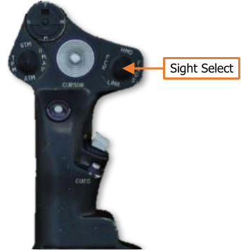
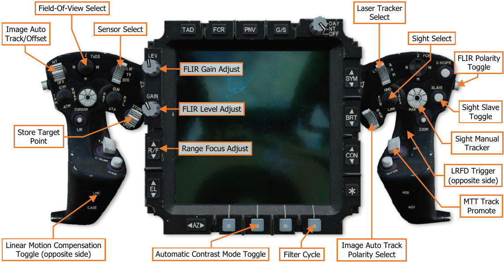

# TADS HAND CONTROLS

The Copilot/Gunner is the only crewmember that may use the Target Acquisition Designation Sight for targeting
and engagement of enemy targets.

## Cyclic & Collective Controls

The CPG may select TADS as his or her sight on the Collective Mission
Grip, but controls for employing the TADS itself are only located on the
TEDAC.

## TEDAC Controls

All TADS controls are located in the CPG cockpit on the TEDAC. TADS use by the Pilot is limited to using it as a
backup NVS sensor.

