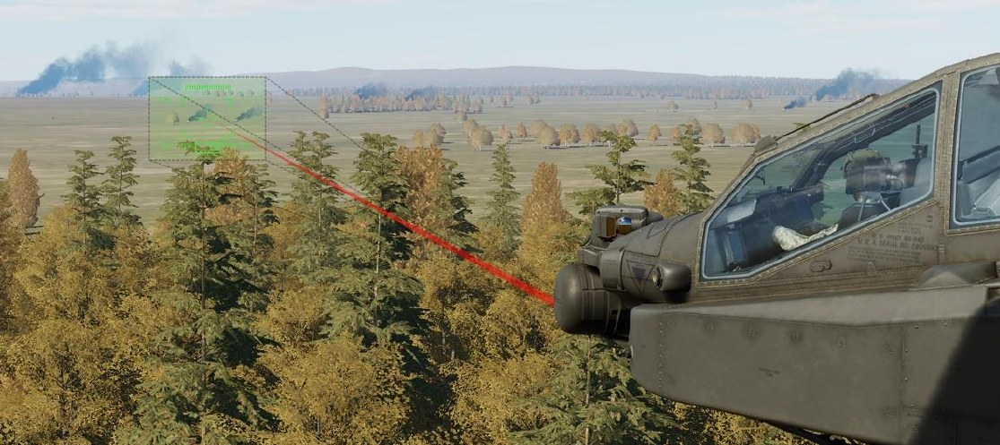
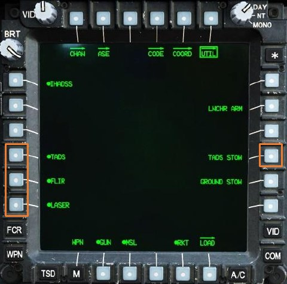
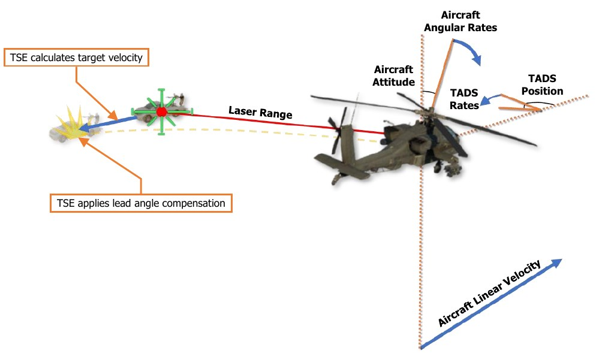

# AN/ASQ-170 MODERNIZED TARGET ACQUISITION DESIGNATION SIGHT

The AN/ASQ-170 TADS was originally designed by Martin Marietta and was selected to provide the primary
sighting and sensor system for the AH-64A, and remained in use by the AH-64D during the early years of its
service. The subsequent upgrade to the M-TADS standard by Lockheed Martin includes targeting enhancements
that increase the range and resolution that the AH-64D can detect and engage targets.

The Direct View Optics (DVO) sensor was subsequently removed during later development of the AH-64D,
although the corresponding aperture within the sensor turret itself remains.

## TADS Activation

The TADS is automatically initialized when the APU is
powered on. If necessary, the TADS can be selectively
powered on or off from the CPG station by pressing VAB L4
on the WPN Utility sub-page (shown at right), or from either
crewstation on the DMS Shutdown sub-page.

Although the TADS is automatically initialized on APU power,
the laser rangefinder/designator (LRFD) requires manual
activation by pressing VAB L6. The FLIR camera may be
independently powered on or off by pressing VAB L5, and
the TADS turret may be stowed by pressing VAB R4.

## Forward-Looking Infrared (FLIR)

The FLIR camera enables the AH-64 to detect, identify and engage enemy targets in any lighting conditions.
Although primarily used during night operations, the FLIR is equally capable during daylight hours. The
Modernized-TADS (MTADS) upgrade replaced the legacy FLIR sensor with a modern FLIR with improved
resolution and range.

The TADS FLIR camera includes three optical fields-of-view (Wide, Medium, and Narrow) with incrementally
increased magnification. A fourth field-of-view (Zoom) is available that electronically enlarges the Narrow field-
of-view by 50%. The Zoom field-of-view (FOV) does not provide increased resolution but does facilitate better
aiming precision of the laser rangefinder/designator (LRFD) at longer ranges.

## Daytime Television (DTV)

The DTV is a monochromatic (black and white) television camera that enables the AH-64 to engage targets at
long-range during daylight hours only. Although the DTV only includes two optical fields-of-view (Wide and
Narrow) and is less versatile than the FLIR camera, the magnification levels of the DTV surpass those of the FLIR,
allowing the DTV to identify and designate targets at a further distance than what is possible with the FLIR. Like
the FLIR, the DTV includes an additional Zoom field-of-view that electronically enlarges the Narrow field-of-view
by 50%.

## Laser Rangefinder/Designator (LRFD)

The LRFD uses focused laser energy to precisely measure range to target locations, and employs crew-selectable
pulsed repetition frequencies (PRF) to designate targets for laser-guided munitions, such as the AGM-114 missile.
Laser returns from the TADS LRFD are processed between a minimum range of 500 meters to a maximum range
of 9,999 meters. In addition to providing ranging data for ballistics computations, continuous laser designations
may be used to employ lead-angle compensation when engaging moving targets with the 30mm Area Weapon
System (AWS) or unguided rockets in Cooperative rocket mode.

The LRFD may be employed in range-finding mode by pulling the LRFD trigger on the TEDAC Right Handgrip to
the 1st detent, or in ranging and designation mode by pulling the LRFD trigger to the 2nd detent.

(See the WPN Code and WPN Frequency sub-pages in the Weapon Employment chapter for more information
regarding setting the LRFD laser code.)

## Laser Spot Tracker (LST)

The LST may be employed to detect other laser designations within a tactical environment when using known
PRF codes. Like the LRFD, the specific laser PRF code the LST will scan for is crew-selectable from the cockpit at
any time during the mission, and may be used as an efficient method for handing over target locations to the
AH-64 from ground-based designators or other aircraft, such as the AH-64’s own team members.

(See TADS Targeting Modes for more information regarding LST operation. See the WPN Code and WPN
Frequency sub-pages in the Weapon Employment chapter for more information regarding setting the LST laser
code.)

Sight Stabilization and Slew Rate Damping
The TADS electronics provide automatic sight stabilization to compensate for aircraft angular rates. In addition,
angular slew rates of the TADS turret itself are dampened based on the currently selected optical/electronic field-
of-view to enhance precision targeting. As the Copilot/Gunner (CPG) incrementally steps through each successive
field-of-view from Wide to Zoom, the angular rate gains from Sight Manual Tracker (MAN TRK) inputs are
incrementally reduced to compensate for the higher magnification levels of TADS video.

## Target State Estimator (TSE)

Although the Target State Estimator calculations are performed by the AH-64D’s targeting systems and is not
technically part of the TADS itself, the TSE is a key element when the TADS is being used to employ unguided,
ballistic munitions against moving targets on the battlefield.

The TSE utilizes linear velocities and attitude rates from the aircraft EGI’s, TADS turret position and angular slew
rates, and laser range data to calculate and separate true target velocities from the aircraft velocities and rates.
Once the true target velocity is calculated, the TSE can determine the appropriate lead-angle compensation for
the selected weapon system. This automatic lead angle compensation requires the Copilot/Gunner to simply
maintain the TADS line-of-sight on the target and perform a continuous laser designation to accurately employ
the Area Weapon System or provide accurate rocket steering for the Pilot when in Cooperative rocket mode.

When the laser ceases designation, the Target State Estimator will enter a “laser memory” mode for 14 seconds.
During this period, the mean rate of change of laser ranging measurements that existed prior to the termination
of laser designation will be dynamically maintained to allow the TSE to continue providing lead angle
compensation. All other variables such as linear velocities and angular rates will continue to be utilized by the
TSE in real-time to calculate the true target velocity.

After the 14 seconds has elapsed, the laser range value will become static until the LRFD is fired once again or a
different range source is utilized. Any time a dynamic laser range is not available, whether the 1 st detent of the
LRFD trigger is used or 14 seconds has elapsed since the 2nd detent of the LRFD trigger was used, or if any other
range source is utilized, TSE calculations will not be performed and lead angle compensation will be unavailable.
However, regardless of whether the TSE is providing lead angle compensation or not, ballistic compensation will
always be provided for factors such as range to target and aircraft movement when the TADS is being used as
the selected sight.
{!abbr.md!}
{!dev-docs/ah64d/abbr.md!}
{!docs/ah64d/abbr.md!}
