# AIRCRAFT DESCRIPTION
## AIRCRAFT DESCRIPTION

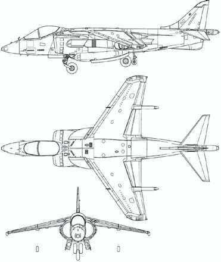

[[WING SPAN]]
30.33 feet (9.24 m)

[[LENGTH]]
46.33 feet (14.12 m)

[[HEIGHT (TOP OF FIN)]]
11.65 feet (3.55 m)

[[WING GEAR SPREAD]]
17.00 feet (5.18 m)

[[EMPTY WEIGHT]]
13,968 lb (6,340 kg)

[[LOADED WEIGHT]]
22,295 lb (10,410 kg)

[[MAXIMUM TAKEOFF    WEIGHT
(ROLLING)]]
31,000 lb (14,100 kg)

[[MAXIMUM TAKEOFF    WEIGHT
(VERTICAL)]] :thinking:

The McDonnell Douglas AV-8B Harrier II is a sub-sonic, single-engine,
ground attack aircraft possessing vertical or short takeoff and landing
(V/STOL) capability. It is currently employed by the United States
Marine Corps, as well as the Spanish and Italian Navies.

## AIRCRAFT HISTORY

### ORIGINS

The Second World War, Korean War, and Vietnam War clearly
demonstrated the need for a close air support platform that was capable
of arriving on scene quickly. Already in 1957, Gen. Randolph Pate,
Commandant of the U.S. Marine Corps, said:

> “All tactical aircraft should possess a short / vertical takeoff and landing
> capability as soon as it is technically feasible without sacrificing existing
> mission capabilities”.

The Marine Corps was interested in developing such capabilities in
order to fulfill their primary mission: be the first to fight and buy other
services - army and air force - precious time to enter the battle. That
meant going in light and without artillery support, which however,
could be substituted by their own tactical air power. The problem here
was the time needed for the aircraft to get from the carrier or the
closest airfield to the front line - in Vietnam, on average, it took 27
minutes, which was way too long for the needs of the service, estimated
at a maximum of 10 minutes).

At the same time as the USMC was looking into the above, works were
well underway on the other side of the Atlantic to build an aircraft
capable of vertical or short takeoff. The main reason for this was the
reasoning that in case of all-out war with the Soviet Union, Allied
airfields would be destroyed or severely damaged in the first hours of
the conflict. In order to retain its capabilities, NATO air forces would
need an airframe that could operate from nearly anywhere.

Therefore engineers both in Europe and USA were working hard on
delivering a functional prototype. There were numerous attempts, but
all of them failed - engines used for vertical flight were simply too
heavy to allow aircrafts to carry weapons or move forward fast enough - if they could even take off. Below are a few notable examples.

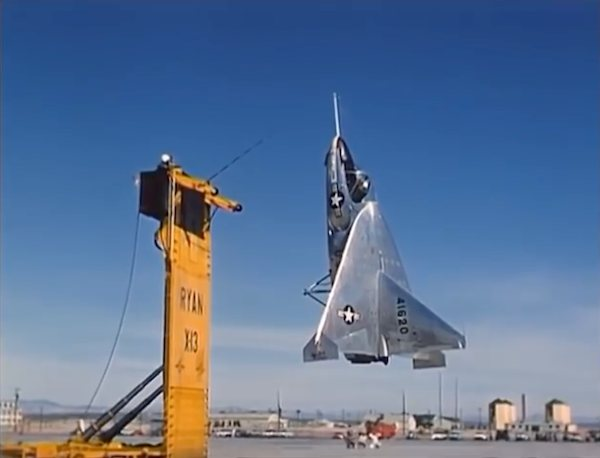

X-13 Vertijet was supposed to use the jet for vertical takeoff, but as it
had no landing gear, it had to be hooked on a specially designed stand,
which has proven very impractical.

X-14 was capable of vertical takeoff and had two jet engines in its nose,
but was way underpowered to carry any weapons.

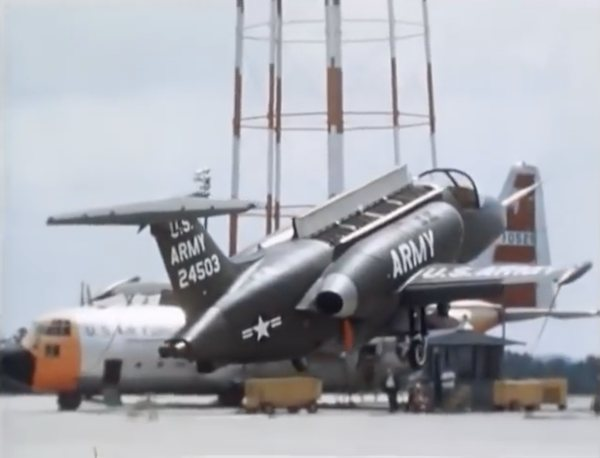

Lockheed XV-4 Hummingbird also was too heavy, and had only a 1.04
thrust-to-weight ratio. Both prototypes built were destroyed in
accidents.

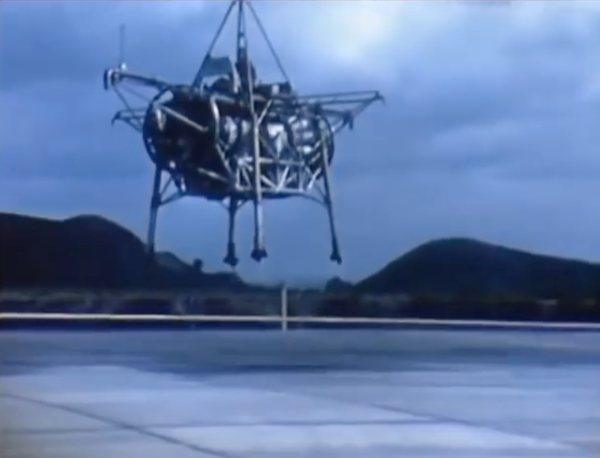

The Rolls-Royce Thrust Measuring Rig (also known as “Flying
Bedstead) was a research project, that later led to the project more
resembling a normal airplane:

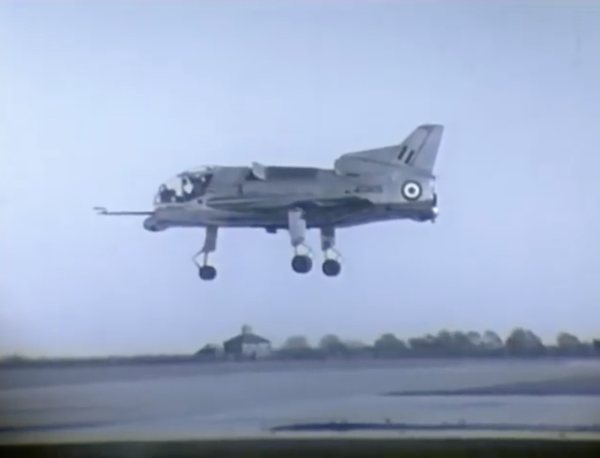

Short SC-1, which had five turbojet engines: four for vertical and one
for conventional horizontal flight. It also sported fly-by-wire control. As
other projects, it has proven to be too limited.

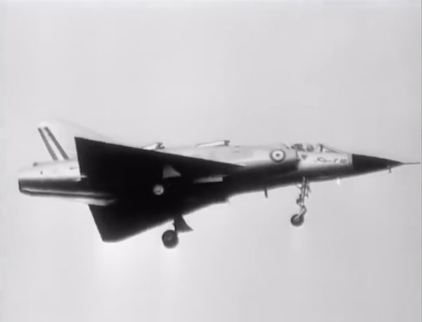

Dassault Balzac V was a French attempt to build a VTOL aircraft,
based on a Mirage III airframe. The only prototype was badly damaged
during its second flight and the project was abandoned.

However, it was a French independent engineer, Michel Wibault, who
came up with an idea that made the creation of the Harrier possible. He
envisioned using just one engine for both vertical and conventional
flight, which could be achieved by using moveable nozzles. This
concept was taken onboard and developed further by British engineers:
Gordon Lewis, designer of the Pegasus engine, and Ralph Hooper, who
was responsible for the Harrier's airframe. In less than three years of
work and tests, the Harrier was born.

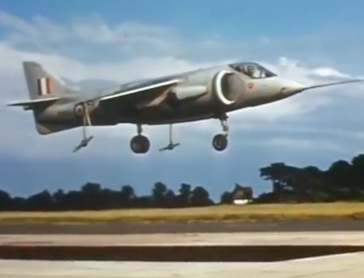

??? bug "The Best of Harrier Jump Jet History"
    <iframe width="560" height="315" src="https://www.youtube.com/embed/izpw4lLlF7w" title="YouTube video player" frameborder="0" allow="accelerometer; autoplay; clipboard-write; encrypted-media; gyroscope; picture-in-picture" allowfullscreen></iframe>

### HARRIER AND THE USMC

In 1966, USMC Colonel Tom Miller, head of Air Weapons Systems
Branch at Marine Corps Headquarters, together with Lieutenant
Colonel Bud Baker, visited the UK and flew the Harrier in order to
evaluate its relevance to Marine Corps aviation. They were extremely
impressed with what they saw and, upon their return to the states,
strongly advocated for the need to purchase the airframe for the USMC.

Even if they managed to convince the leadership of the Marine Corps,
NAVAIR - responsible for acquiring all the aircraft for both the Navy and
Marines - vehemently opposed the idea. Despite this, the Marine Corps
finally managed to get their first Harriers - by talking McDonnell
Douglas into buying the airplanes from the British government and then
selling them to USMC.

Lack of NAVAIR support meant problems with acquiring spare parts and
quality training. For the first few years, US pilots were sent to the UK to
learn from their British colleagues, but this program was closed in
\1973. That meant Americans had to come up with a way to teach future
pilots how to fly this demanding airplane.

In the beginning, only seasoned pilots (mostly with F-8 Crusader
background) were allowed to join the Harrier program. The first two
years were very successful and passed without any major mishaps.
Seeing that, the decision was made to open it up for nugget aviators
and helicopter pilots, which proved to have disastrous consequences:
between 1974 and 1978 there were 19 crashes, and the AV-8A quickly
acquired an infamous nickname: the “Widow Maker”.

The first Marine Corps squadron to employ the AV-8A Harrier was
VMA-513, “Flying Nightmares.” Thanks to the dedication and hard
work of the pilots of that squadron, the initial NATOPS and emergency
procedures were written - based on experience and previous British
textbooks.

Moreover, VMA-513 aviators also took it upon themselves to produce
the first tactics manuals for air-to-air engagements, training against the
real Soviet MiGs that were held in Area 51. The use of thrust vectoring
in air combat maneuvering has proven to be a very useful thing - so
useful in fact, that the Harriers also managed to beat the F-14s in the A-
A realm.

Learning became much easier with the introduction of two-seat TAV-8A
in 1976 and designating a formal training squadron: VMAT-203.

### OPERATIONAL HISTORY

The first armed conflict for the Harrier was not against the Soviet
Union, as her designers envisioned. Instead, it took place 8000 miles
away from Europe, in the Falkland Islands. After the Argentinian army
invaded the British islands in 1982, the United Kingdom sent a Task
Force equipped with 28 Sea Harriers, modified for air-to-air combat.

They faced the Argentinian Air Force with around 200 aircraft,
including Mirage III fighter jets. Despite the unfavorable odds, the Brits
came out victorious with 21 air kills and no losses.

The AV-8B saw extensive action in the first Gulf War from 1990-1991,
operating from two ships: the USS Nassau and the USS Tarawa. During
operations Desert Shield and Desert Storm, Harriers amassed 3,380
flights and 4,100 hours. 5 jets and 2 pilots were lost to enemy fire.
Harriers were also present during Operation Allied Force in Yugoslavia.
Twelve jets flew 34 CAS missions over Kosovo with the mission-capable
rate of 91.8 percent.

From 2001-2013, AV-8B Harriers were deployed to Afghanistan, where
they took part in Operation Enduring Freedom.

!!! success "Recommended read"
    Michael Franzak “A Nightmare’s prayer: A
    Marine Corps Harrier Pilot’s War in Afghanistan”.

Then came the second Iraq War in 2003, with as many as 60 AV-8Bs
deployed onboard USS Bonhomme Richard and USS Bataan. More than
2,000 sorties were flown.

In 2011 Harriers saw action again during Operation Odyssey Dawn in
Libya.

In 2014 AV-8Bs returned to the Gulf to fight against Islamic State
militants.

??? bug "Discovery Wings - Harrier"
    <iframe width="560" height="315" src="https://www.youtube.com/embed/esCe7qeOf6I" title="YouTube video player" frameborder="0" allow="accelerometer; autoplay; clipboard-write; encrypted-media; gyroscope; picture-in-picture" allowfullscreen></iframe>

### OTHER OPERATORS

Apart from U.S., the AV-8Bs were also acquired by the Italian Navy
(ordered in 1989). The first aircraft arrived in early 1994, with first
combat missions flown in Kosovo in 1999.

The Spanish Navy also acquired the AV-8B Harrier, ordering 12 aircraft
in March 1983. Spanish EAV-8Bs were used during Operation Deny
Flight in 1993 over Bosnia and Herzegovina. Currently Spain is
extending the aircraft’s service life to beyond 2025.

The United Kingdom used a different version of the Harrier - mainly
GR.5, GR.7 and GR.9. They were operationally deployed during many
conflicts, including 1991 Gulf War, 1995 intervention in Yugoslavia,
1999 in Kosovo, 2003 in Iraq, and 2004 and beyond in Afghanistan.

The Royal Air Force stopped using Harriers in 2011, and Royal Navy
Fleet Air Arm in 2010.

### AV-8B HARRIER II VARIANTS

AV-8B Harrier II came in four main variants:

AV-8B Harrier II Day Attack: the initial version.

AV-8B Harrier II Night Attack: modified version with additional
capabilities to perform its mission at night thanks to addition of the
forward looking infrared camera (FLIR), upgraded cockpit with NVG
compatibility and more powerful engine.

AV-8B Harrier II Plus: Similar to the Night Attack version, but
additionally equipped with an AN/APG-65 radar and the ability to use
the AIM-120 AMRAAM missiles.

TAV-8B Harrier II: two - seat version of the Harrier used exclusively for
training purposes.

### AIRCRAFT MISSION

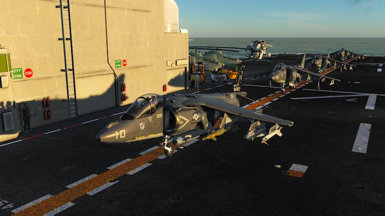

The AV-8B was designed for offensive Close Air Support and air defense
missions, although one of the first proposed missions for the airframe
was the nuclear strike capability. The aircraft is equipped to deliver a
number of conventional stores, as well as IR and laser guided missiles,
laser and GPS guided munitions with the use of a precision targeting
pod. It can also be fitted with a 25mm gun system on a lower fuselage.

### AIRCRAFT SYSTEMS

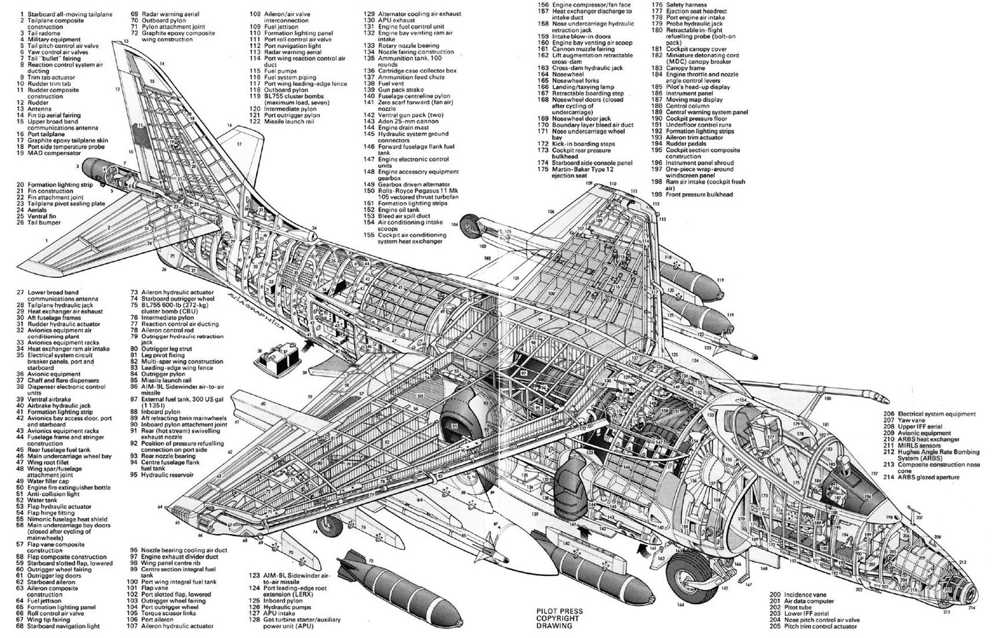

#### ENGINE

AV-8B Night Attack aircraft is powered by the Rolls Royce F402-RR-408
dual spool, axial flow, turbo fan engine with thrust-vectoring exhaust
nozzles.

The 408 engine is equipped with water injection and can develop a
nominal thrust of 23,400 pounds with water injection, or 22,200
pounds without water injection.

The engine works as follows: the air is drawn in through two intakes
and enters the Low Pressure (LP) fan. Then the air is divided, one flow
passing to an annular plenum chamber from which it is ducted through
cold nozzles located in the front, left and right side of the engine. The
other flow passes through variable inlet guide vanes, through the high
pressure compressor (HPC) and a combustion chamber to the high
pressure (HP) and low pressure (LP) turbines. Following that, it is
ducted through rear, left and right hot nozzles.
Thermocouples in the turbine exhaust gas path, sample gas
temperature and supply data to a digital jet pipe temperature (JPT)
indicator and to the engine fuel system for JPT limiter (JPTL). The
digital signal is fed to the mission computer for engine life count.

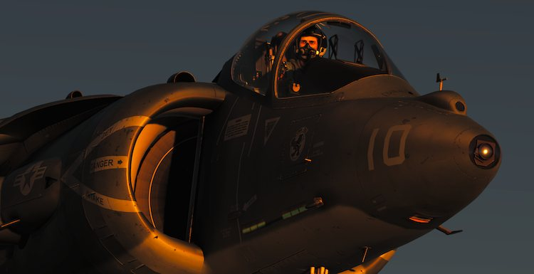

Ram air intakes at the forward end of the front nozzle fairings and the
wing roots are responsible for ventilating the engine bay. Air flow is
assisted, whenever the engine is running, by flow inducer nozzles
supplied by air bleed from the fan; this ensures that the bay is
adequately ventilated in slow and hovering flight.

There also is a gas turbine starter/auxiliary power unit (GTS/APU)
mounted on the engine used to start it or supply backup electrical
power, should the engine’s main generator fail in-flight.

#### FUEL SYSTEM

The main component of this system is DECS (Digital Engine Control
System), responsible for providing engine control throughout the
engine operating range in response to throttle position, altitude,
airspeed, angle of attack (AOA), inlet air temperature, and aircraft
configuration. In other words, DECS automatically controls the engine
performance in various conditions and following different pilot inputs.

The DECS is aided by two DECUs (Digital Electronic Control Units),
which are contained within a cast metal casing through which fuel is
passed for cooling. Each DECU is capable of independent operation and
can assure the flow of properly metered fuel to the engine via the Fuel
Metering Unit (FMU). If one DECU fails, the control is automatically
transferred to the other one. In case both fail, known as a dual lane
failure, the pilot still has the Manual Fuel System (MFS) at his disposal.
It enables the engine to continue operating following a failure within
the primary fuel control system and provides an alternate means of
engine control

!!! caution
    When in this mode, the engine response is more sensitive to throttle
    movement because the MFS does not contain any automatic altitude
    compensation, acceleration controls, or limiters. Be extra careful!

#### WATER INJECTION SYSTEM

The water injection system was added in order to allow for a temporary
increase of rpm for a given turbine entry temperature to sustain short
lift wet and normal lift wet ratings. In other words, due to extra cooling
provided by the water, the engine is capable of short-term increases of
output which is crucial especially for vertical takeoffs and landings.
Depending on the position of the H2O switch, the increase can by up to
6.0 - 7.0 percent. When in the TO (Takeoff) position, the water starts to
flow when the throttle is set above 105%. In the LDG (Landing)
position, it is enabled when the airspeed is below 250 knots and the jet
pipe temperature exceeds 765° C.

The water tank is located in the engine bay, just aft of the engine and
contains 500 pounds of demineralized water that will last for
approximately 90 seconds. Use of normal water (other than distilled or
demineralized) is possible, but if repeated, may lead to deterioration of
the engine and/or engine performance.

#### THRUST VECTORING

AV-8Bs are equipped with four mechanically interconnected nozzles,
which can be simultaneously rotated using a lever located in the
cockpit, on the inboard side of the throttle quadrant. The range of
movements go from fully aft of 0° to fully forward of 98.5°, called a
forward braking position. The whole system is driven by an air motor
connected to a gear box and mechanical linkages, responsible for
setting all four nozzles in the position selected by the pilot.
Independent movement of the nozzles is not possible.

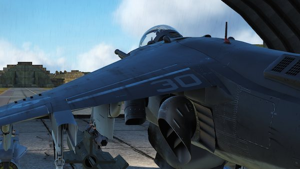
