# COCKPIT

## COCKPIT OVERVIEW

The AV-8B Night Attack version is equipped with a single-seat, elevated
cockpit. Compared to the older, “A” version, it contains two large multi-
purpose displays taken from the F/A-18, and an up-front control panel
mounted at the pedestal in front of the pilot.

To stay true to its name, this version of the Harrier also has several
adjustable flood lamps installed on both sides of the pit, as well as the
possibility to switch the backlighting of the instrument and side panels
to NVG mode.

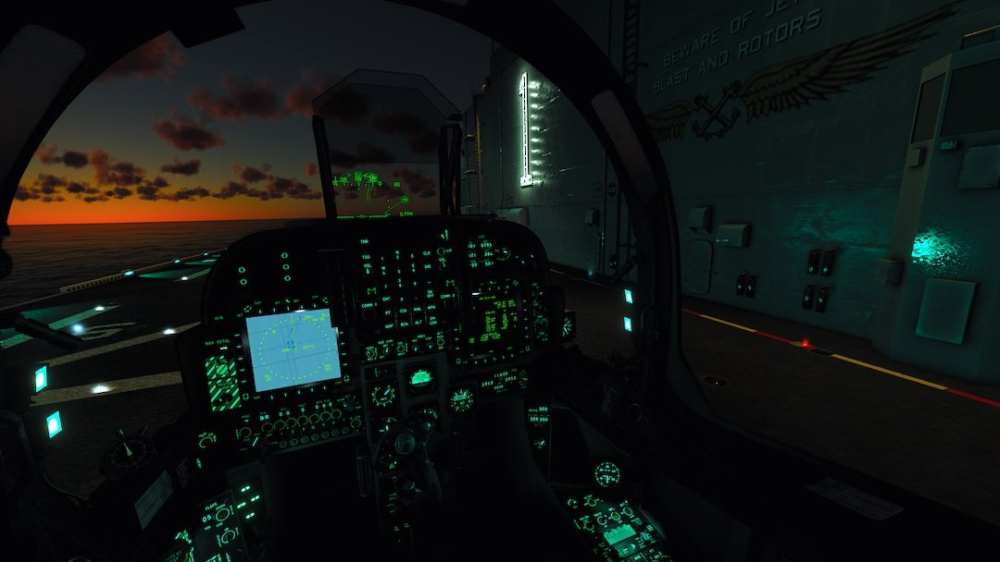

The night vision goggles are stored in a special bag on the aft part of
the right-hand panel. Installation of NVGs on the helmet (replacing the
visor) takes a few minutes, so make sure to plan the use of NVGs
accordingly!

## MAIN PANEL

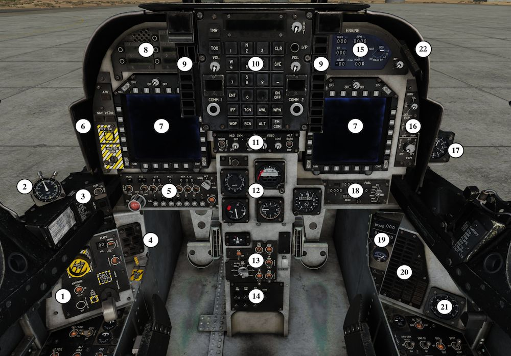

1. Landing Gear Control Panel
2. Stopwatch
3. Combat / Water Panel
4. Gear Position Indicator
5. Armament Control Panel
6. Master Mode Control
7. Left MPCD / Right MPCD
8. Option Display Unit
9. Warning / Caution / Advisory Lights
10. Up Front Control Panel
11. HUD Control Panel
12. Flight Indicators
13. Miscellaneous Control Panel
14. Circuit Breaker Panel
15. Engine Display Panel
16. ECM Panel
17. Clock
18. Fuel Panel
19. Brake / Hydraulic Indicator
20. Caution /Adv. Panel
21. Cockpit Altimeter
22. Threat advisory lights

### LANDING GEAR CONTROL PANEL

1. Emergency Jettison Button. Used to
jettison stores in case of emergency.
Removes stores and suspension equipment
on BRU-36 bomb racks, but retains AIM-9s
and / or AIM-122s on LAU-7 launchers on
stations 1 (1A) and 7 (7A). See Jettisson
Procedures section for more details. //link
2. Anti-Skid System Switch. This is an
electro-hydraulic system that controls
hydraulic pressure to the brakes and
provides full skid protection at speeds
above 16 knots and partial protection at
speeds between 8 and 16 knots. It has three positions:

    - Test: allows the pilot to check the system. The system will not work if
    the parking brake is engaged or if the essential 28 volt DC power is lost.
    - ON: activates the system. See XXX section for more information.
    - NWS: deactivates the anti-skid system but allows for tighter turns and
    manoeuvres when taxiing. When the switch is in this position, the Skid
    light on the Caution Lights Panel should illuminate. See XXX section for
    more information.

3. Flaps BIT Switch. Used to perform the pilot-initiated built-in-test of
flaps (IBIT). In order to to do so, set the Flap Power Switch (6) to ON
and press the BIT Switch. FLAPS 1, FLAPS 2 and AUT FLAP caution
lights and FLAPS warning light will illuminate FLAPS 1, FLAPS 2 and
AUT FLAP caution lights and FLAPS warning light will illuminate. The
flaps will then cycle up and down, and can be monitored by watching
the flap indicator (7) on the landing gear control panel and in the
HUD, when the V/STOL master mode is selected. Once all movement of
the flaps has stopped, place the Flaps Mode Switch (8) to the STOL
position and verify both STO and DROOP lights are illuminated. To
finish the check, place the Flaps Mode Switch (8) to the CRUISE
position.
4. Down Lock Override Button. Pressing it disables the mechanical
down lock stop and allows the pilot to set the Landing Gear Handle to
the UP position even with the weight on the main landing gear.
5. Landing Gear Handle. Used to extend and retract the landing gear.
6. Flaps Power Switch: a 3-position switch controlling the power flow
to the flaps.

    - ON: Applies power to the Flaps Mode Switch and the Flaps Controller.
    - OFF: Shuts off power to the Flaps Mode Switch.
    - RESET: Momentary switch. When used, it resets the Flaps Controller
    logic and cancels an initiated BIT.

7. Left flap position indicator. Shows the current position of the flaps
in degrees (between 00 and 98).
8. Flaps Mode Switch. This 3-position switch controls the position of
the flaps and aileron droop depending on the current airspeed.

    - STOL: used for takeoff and landing. Provides 25° of flaps and 0°
    aileron droop when the airspeed is over 165 knots and between 25°-62°
    of flaps and 15° aileron droop if the airspeed is below 165 knots and
    the nozzles are moved greater than 25° (flap angle is variable based on
    nozzle angle to prevent burning the flaps with the hot nozzles).
    - AUTO: with the landing gear up and depending on the airspeed, Mach
    number and angle-of-attack, the flaps will be scheduled between 0 and
    25° with 0° of aileron droop. When the landing gear is down, provides
    5° of flaps and 0° of aileron droop.
    - CRUISE: provides 25O of flaps and 0° of aileron droop.

    !!! hint
        More information can be found in the TRAINING MISSION 1 (cockpit
        familiarisation), 2 (starting from cold & dark) and 3-6 (covering different
        types of takeoffs and landings).

### STOPWATCH

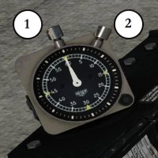

A mechanical stopwatch, containing one
pushbutton for winding, starting and
stopping (1), and one pushbutton for
resetting (2).

You can also use the stopwatch available on
your UFC after pressing the TMR function.
See Analogue Stopwatch and Clock Section. //link

### COMBAT / WATER PANEL

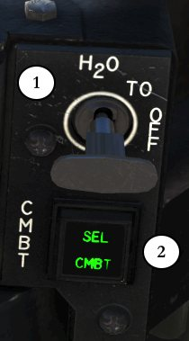

1. Water Injection Switch. This 3-position switch
controls the flow of water used for cooling down the
engine during takeoffs and landings.
TO (Takeoff): Takeoff position.
OFF: water flow is disabled.
LDG (Landing): Landing position.
See Water Injection System for details.
2. CMBT switch / light. Used for enabling the
combat thrust datum (increasing max RPM to 111%
and JPT limit to 765°C). When it is pressed once, a
green SEL light will illuminate. With gear up and nozzles aft, once the
JPT reaches 715° C, a green CMBT light comes on, indicating that
combat thrust is operational. If the JPT remains above 715°C for over
150 seconds, the CMBT light will start flashing. Pressing the switch/
light a second time disables the combat thrust and turns off the light(s).
Use of the full 10 minutes combat rating must be carefully monitored.

### GEAR POSITION INDICATOR

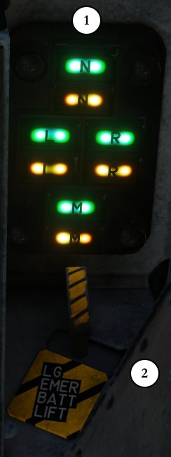{ width=180 }

1. The N (nose gear), L (left wing gear), R
(right wing gear) and M (main gear) green
indicators come on when the respective gear is
down and locked. The N, L, R and M amber
indicators come on when the respective gear is
not down and locked or up and locked and is in
transit to full down or full up position. The N
amber indicator will remain on if the nose gear
is up and the nose gear doors are not closed.
2. Landing Gear Emergency Battery. The
battery is a one-shot device for the emergency
extension of the landing gear when electrical
power is lost. The battery must be activated
with the landing gear handle in the EMER
position in order for the pneumatic system to
extend the landing gear. The battery is activated
by extending a pull shaft upward. The pull shaft
is then mechanically locked to prevent reseating
of the handle. The part that remains outside
after extending the shaft is marked by a band of
white paint on the exposed portion of the rod.

### ARMAMENT CONTROL PANEL

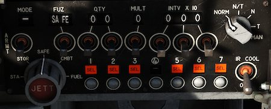

The ACP contains controls and indicators for interacting with the stores
management computer (SMC). Most of the functions of the ACP are
also mirrored on the UFC / ODU for use in conjunction with the Stores
Page on the MPCDS. See XXX Section for more details.

### MASTER MODE SELECTION / MASTER ARM PANEL

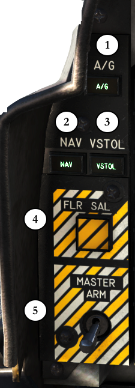{ width=180 }

1. Air to Ground Master Mode. When
pressed, puts the aircraft systems in the A/
G mode, used for employment of weapons.
See relevant section for more details.
2. Navigation Master Mode. When
pressed, puts the aircraft systems in the
NAV mode, in which primary flight
information is presented on the HUD and
aircraft horizontal situation is provided on
the EHSI/EHSD display on the DDI. See
NAV Master Mode for more details.
3. Vertical / Short Take Off and Landing
Mode. When pressed, a number of
indications useful for Harrier’s signature
takeoff and landing mode are displayed on
the HUD and ODU. See VSTOL Master
Mode for more details.
4. Flare Salvo switch. Pressing the FLRSAL
button on the armament master switch
panel initiates dispensing of flares as fast as
dispensers can handle fire commands. See
XXX Section for more details.
5. Master Arm switch. Enables the use of
weapons loaded on wing and fuselage
stations. See XXX Section for more details.

### LEFT / RIGHT MULTIPURPOSE COLOR DISPLAYS

The multipurpose colour displays (MPCD) on either side of the main
instrument panel are the primary aircraft heads down displays. They
consist of a 5 x 5 inch CRT display surrounded by 20 multi-function
buttons (PB1 thru PB20). MPCD mode selection is accomplished either
automatically, as determined by the mission computer, or manually as
selected by the pilot on the MPCD or by HOTAS.

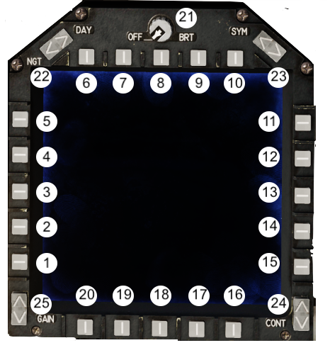

**1 - 20: Pushbuttons 1 to 20.** These numbers will often be used in other
parts of the manual and in the training missions. It is important to
remember that the numbering starts from the bottom - left and then
continues clockwise.

**21: OFF / Brightness Knob.** Placing the knob to OFF prevents the
indicator from operating. Turning the knob to the right powers the
MPCD and varies the intensity of the presentation.

**22: Night / Day Rocker Switch.** Used to quickly set the brightness level
of MPCD. The DAY position places it in the normal day operating mode.
The NGT position selects the night (dimmed) operating mode.

:octicons-x-circle-16:{ title="NOT FUNCTIONAL: this feature is currently not implemented in this module" } **23: SYM Rocker Switch.** Used to increase or decrease the intensity of
the symbols displayed on the MPCD.

**24: CONT Rocker Switch.** Used to adjust the contrast level of the
display.

**25: GAIN Rocker Switch. Used to adjust the gain level of the display.**

### OPTION DISPLAY UNIT

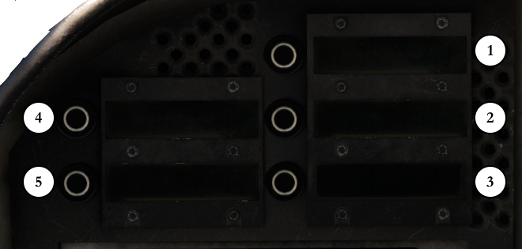

The Option Display Unit (ODU) consists of 5 LCD screens with a
pushbutton on each (OB1 to OB5). The ODU is used to display and
select the data options (one option per screen) available for a specific
UFC function mode. Selecting an option either enables/disables it or
sets the UFC for data entry.

**1 - 5: ODU windows and pushbuttons.** Various options will be
available here depending on selections made on other indicators,
mainly UFC and DDI. The button numbers will often be used in other
parts of the manual and in the training missions.

### WARNING LIGHTS PANEL

The warning/caution/advisory lights and displays system provides
visual indications of normal aircraft operation and system malfunctions
affecting safe operation of the aircraft. The lights are on various system
instruments and control panels in the cockpit.

#### MASTER WARNING LIGHTS

The Master Warning lights consist of eleven green warning lights
located to the right of the UFC panel and below the red MASTER
WARNING light.

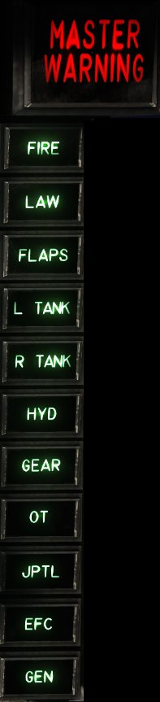{ align=left width=100 }

**FIRE:** Fire in the engine compartment.

**LAW:** Low Altitude Warning: Below the minimum set altitude.

**FLAPS:** Flap system failure.

**L TANK:** Left fuel tank system overpressure or overtemperature.

**R TANK:** Right fuel tank system overpressure or overtemperature.

**HYD:** Both HYD1 and HYD2 systems have failed.

**GEAR:** Landing Gear Unsafe/ Fails to Extend.

**OT:** (Overtemp) Engine JPT limits exceeded.

**JPTL:** JPTL control inoperative. (Computer engine temperature control is
malfunctioning).

**EFC:** All Engine digital control boxes (DECU 1 and DECU 2) have
failed. (Engine and fuel control reverts to manual).

**GEN:** AC generator is offline.

#### CAUTION LIGHTS PANEL

The Master Caution Lights consist of six green priority caution
lights located to the left of the UFC panel and below the yellow
MASTER CAUTION light. They indicate the existence of an
impending dangerous condition requiring attention but not
necessarily immediate action. Illumination of a priority caution light
may require immediate corrective action in certain flight conditions.

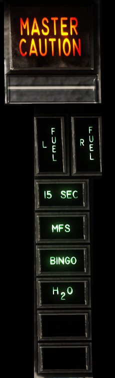{ align=left width=100 }

**MASTER CAUTION light:** lights up in
conjunction with any of the warnings listed
below.

**L FUEL, R FUEL:** Left / Right fuel system level is low.

Steady light: fuel level is less than 750 pounds.

Flashing lights: fuel level is less than 250 pounds.

**15 SEC:** JPT above normal lift rating (flashes after 15 seconds).

**MFS:** Manual fuel system on.

**BINGO:** Fuel below bingo setting.

**H~2~O:** Less than 15 seconds water remain.

### UP FRONT CONTROL PANEL

The Up Front Control (UFC) pushbuttons and indicators are used for
entering (ENT) or clearing (CLR) data. It is also the main
communications controller.

The UFC consists of:

1. **LCD screen.** Works both as a display and as a scratchpad when
entering data.
2. **Brightness Knob.** Turns on the UFC and is used to regulate the
backlight intensity of the LCD screen and the pushbuttons.
3. **COMM 1 and COMM 2 radio panels.** See Comms for details. //link
4. **Timer (TMR) pushbutton.** Used to change the time display settings,
use digital stopwatch, set Time on Target etc. For more info, refer to
Timer section. //link
5. **Target Of Opportunity (TOO) pushbutton.** Used during combat to
mark targets and quickly arm aircraft attack systems. See XXX section
for details.
6. :octicons-x-circle-16:{ title="NOT FUNCTIONAL: this feature is currently not implemented in this module" } **Identification-of-Position (I/P):** Used by the IFF to send an ID pulse
when in modes 1, 2 and 3/A.
7. **Numeric Keypad.** Used to enter data on the scratchpad. Contains:

    - Numbers from 0 to 9 with N (North), E (East), S (South), W
(West)
    - Clear (CLR) button, which clears all entered values without
validating nor saving them.
    - :octicons-x-circle-16:{ title="NOT FUNCTIONAL: this feature is currently not implemented in this module" } Save (SVE) button.
    - [[—]] (negative), used to convert entered values into their negative. If
the value is positive, it is converted into a negative and vice versa.
    - ON / OFF toggle, used to activate or deactivate the selected
function and/or device.
    - [[.]] (decimal point), used to enter a decimal point. Any value
entered after this key has been pressed will be considered a
decimal.
    - Enter (ENT) button, validating entered values and saving them.

8. **Function mode keys.** Used to select a specific system / device, set it
up and enable / disable it. These are:

    - **IFF (Identification Friend or Foe):** Sets the UFC for configuring
the Identification Friend or Foe system. See XXX for a description
of this mode.
    - **TCN (TACAN):** sets the UFC for configuring the TACAN. See
TACAN Controls for a description of this mode. //link
    - **AWL (All Weather Landing System):** Sets the UFC for configuring
Instruments only landing system (AWL/ILS). See AWLS Section for
more information. //link
    - **WPN (Weapons):** Sets the UFC for weapons delivery
programming. See XXX for more information.
    - **WOF (Waypoint Over Fly):** Used for INS position update.
    - :octicons-x-circle-16:{ title="NOT FUNCTIONAL: this feature is currently not implemented in this module" } **BCN (RADAR Beacon):** Activates/Deactivates the RADAR beacon
identification system.
    - **ALT (Altimeter):** Sets the UFC to configure the aircraft’s
altimeters. See relevant section for more information. //link
    - :octicons-x-circle-16:{ title="NOT FUNCTIONAL: this feature is currently not implemented in this module" } **EMCON (Emission Control):** Activates/Deactivate the Emission
Control system.

### HUD CONTROL PANEL

Responsible for controlling the brightness and contents of the Heads Up
Display.

1. **HUD Symbology Reject Switch.** This three-position switch controls
the amount of symbology provided for all HUD displays. The three
levels are covered in greater detail in HUD section. //link
2. **HUD Symbology Brightness Control.** This knob is used to turn on
the HUD and varies the symbology display intensity.
3. **HUD Symbology Brightness Selector Switch.** This switch in
conjunction with the HUD symbology brightness control selects
symbol brightness. The NIGHT position must be selected to have
FLIR video on the HUD.
4. **FLIR Brightness Control.** This knob controls FLIR video brightness
on the HUD. The BRT control has a pushbutton feature which swaps
the displays on the MPCD when clicked.
5. **FLIR Contrast Control.** This knob controls FLIR video contrast on
the HUD.
6. **Altitude Switch.** This is a two-position toggle switch, used to select
either radar altitude(RDR) or barometric altitude (BARO) for
display in the HUD.

### FLIGHT INDICATORS

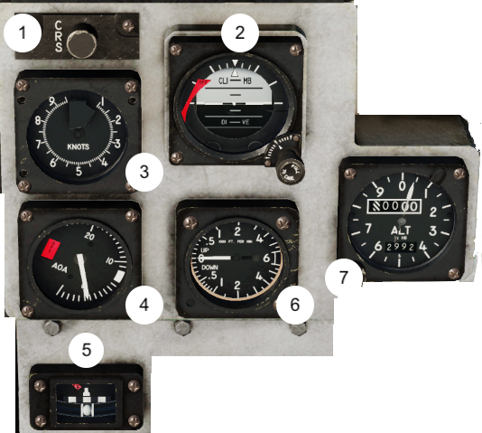

1. **Course Set Knob (CNS):** This knob, labeled CRS, is used to set a
predetermined course to be steered to a tacan station.
2. **Standby Attitude Indicator.** It is a self-contained, electrically
driven instrument indicating the roll (throughout 360 degrees) and
pitch (between 92 degrees climb and 78 degrees dive). OFF flag is
displayed on the right whenever DC power is unavailable. The knob
in the bottom - right is used to adjust the pitch.
3. **Standby Airspeed Indicator.** Contains two pointers and displays
current airspeed of the aircraft. At speeds below 100 knots, the
speed is indicated by the thin pointer. Above 100 knots, the speed is
indicated by the thick pointer.
4. **Standby Angle of Attack Indicator.** Shows current Angle of Attack.
When electrical power is interrupted, the word OFF appears in a
window in the face of the indicator.
5. **Turn and Slip Indicator.** The turn and slip indicator contains a
scale, turn pointer, power warning flag and inclinometer ball. A 2-
minute turn is indicated with the needle over the index to the left
and right of center. A 4-minute turn is indicated with the needle
half way between the center and the right or left index.
6. **Standby Vertical Velocity Indicator.** Displays rate of ascent or
descent on a scale from 0 to 6000 feet per minute.
7. **Standby Altimeter.** Displays altitude from −1000 feet to 50,000
feet. The top counter drum indicates altitude in thousands of feet
from 00 to 99. The long pointer indicates altitude in hundreds of
feet, with one full revolution equaling 1000 feet. A knob and the
bottom window permit setting the altimeter to the desired
barometer setting, which is also used by the air data computer.

### MISCELLANEOUS CONTROL PANEL

The Miscellaneous Control Panel is located below the Flight Indicators,
behind the stick. It consists of:

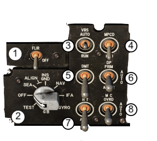

1. **FLIR Power Switch.** The FLIR power switch is a two-position switch
located on the NAVFLIR power panel. The up position (FLIR) applies
power to the NAVFLIR sensor and electronics unit. The down position
(OFF) removes power. When the switch is clicked to the FLIR position,
the NAVFLIR cool down process is initiated - it lasts around 5 minutes.
Until then, with the FLIR display selected on either MPCD a NOT RDY
legend will be shown
2. **INS Mode Selector Switch.** Used to select the modes of INS
operation. See this section for more details.
3. :octicons-x-circle-16:{ title="NOT FUNCTIONAL: this feature is currently not implemented in this module" } **VRS AUTO / RUN Switch.** provides two modes of operation for the
VRS. In AUTO, the video recorder is turned onwhen commanded by
the mission computer (when aircraft is in A/A or A/G master mode). In
RUN, the recorder will run continously, regardless of aircraft master
mode.
4. :octicons-x-circle-16:{ title="NOT FUNCTIONAL: this feature is currently not implemented in this module" } **VRS Display Select Switch.** The two-position switch selects the
applicable output video display formats:
    - DDI Selects video that is displayed (MPCD) on the DDI/MPCD. The
output video is sent to the recorder.
    - HUD When HUD is selected, only head-up display video can be
recorded, including the symbology superimposed on the HUD field-
of-view.
5. **DMT Power Switch:** The DMT power switch is a two-position switch
located on the miscellaneous control panel. The up position (DMT)
applies power to the DMT unit. The down position (OFF) removes
power. When the switch is in the off position, the DMT gimbals are not
caged and instead relies on balance and soft stops for sensor protection.
It is desirable to keep the DMT on during aircraft operation for better
sensor protection although it is not a requirement.
6. **DP Switch.** Controls selection of mutually redundant display
channels in the display computer. The display computer drives the HUD
and DDI, providing display redundancy for attack, navigation, and
approach to landing.
    - PRIM position selects a primary display channel for operation.
    - ALTER position selects an alternate display channel for operation.
    - AUTO position, which is the preferred switch position, randomly
selects the operational channel for operation and provides
automatic reselection if there is a display computer channel failure.
7. **Probe Heat Switch.** Controls power to the left and right pitot static
probes, the total temperature probe, the case and probe heater of the
angle of attack probe, and the DECS total temperature probes.
    - AUTO With weight on wheels, power is removed from all heaters
except AOA case heater. With aircraft airborne, all probe heaters
receive power.
    - PRB With weight on wheels, all HT heaters are energised but the
left and right pitot static probes are energised at reduced power.
With aircraft airborne, all probe heaters receive power same as
AUTO. The switch is magnetically held in the PRB HT position.
When power is removed, the switch drops into the AUTO position.
8. :octicons-x-circle-16:{ title="NOT FUNCTIONAL: this feature is currently not implemented in this module" } **Mission Computer Switch.** It has three positions:
    - OVRD (override): inhibits the backup mode of operation. If in the
backup mode at the time of placing the switch to OVRD, this allows
power to be reapplied to the mission computer, enabling it to operate
normally.
    - OFF: turns off the mission computer and enables the display
computer for backup mode of operation.
    - AUTO: mission computer will be normally utilized, but the system
automatically reverts to the display computer in case of MC failure.

### CIRCUIT BREAKER PANEL

Seven circuit breakers are
located on the cockpit circuit
breaker panel on the lower
main instrument panel. The
remaining circuit breakers are
inaccessible to the pilot. The
cockpit circuit breaker
functions are as follows:

Listed from top left to bottom right:

- AIL TRIM - Manual aileron trim
- STAB TRIM - Manual stabilator trim
- RUD SVO - Rudder trim and SAS servo shutoff valve
- FLAPS - Flaps, Channel 2
- SP BK - Speed brake
- LG - Normal landing gear control
- RH PROBE HEAT - Right pitot probe heat

### ENGINE DISPLAY PANEL

The EDP is on the right side of main instrument panel and consists of
six drum-type indicators for display of reaction control system duct
pressure, fuel flow, stabilator trim position, engine rpm, jet pipe
temperature (JPT), and water quantity. A dial type indicator displays
nozzle position and a green’W’ FLOW light indicates water flow.

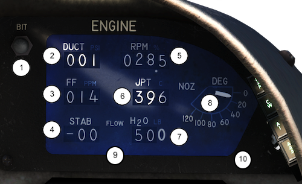

1. **Engine Display BIT Switch:** enables the BIT sequence for the EDP.
During the test, the tumblers will rotate through available numbers,
and the Overtemp, 15 Second, and water flow lights should illuminate.
After a successful BIT, all lights will extinguish and the nozzle indicator
will return to the selected nozzle angle.
2. **Duct Pressure Indicator.** Displays reaction control system duct
pressure in pounds per square inch.
3. **Fuel Flow Indicator.** The fuel flow indicator displays engine fuel
flow in pounds per minute.
4. **Stabilator Position Indicator.** The stabilator position indicator
displays stabilator position in degrees nose up or nose down - shown by
a vertical arrow pointing either up or down on the left drum.
5. **Tachometer.** Displays engine speed in percent rpm. A fixed decimal
point is placed between the tenths and unit drums. An ENG RPM SEL
(select) switch, on the left console, selects HI (compressor) or LO (fan)
rpm display.
6. **Jet Pipe Temperature Indicator.** The JPT indicator displays JPT in
°C.
7. **Water Quantity Indicator.** Displays pounds of water remaining in
units of ten. The tens and hundreds digits change while the units digit
is a fixed display indicating zero.
8. **Nozzle Position Indicator.** Displays nozzle position in degrees. The
scale is graduated in units of twenty and the range is from 0° to 120°.
9. **Water Flow Light.** Comes on displaying a green ‘W’ when water
injection is selected and water is flowing. If the flow light (W) does not
come on, indicating no water flow, the lift rating JPT limit can be
reached very quickly.
10. **Brightness Knob.** Located in the lower right - hand corner, used to
adjust the back lighting of the EPI/EDP.

### ECM PANEL

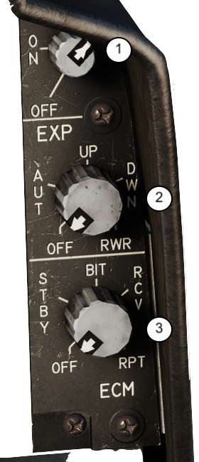{ width=180 }

The electronic countermeasures panel
is divided into three sections, contro-
lling separate defensive systems:

1. **Radar Warning Receiver (RWR):**
The dial when turned clockwise turns
the system on and also sets the
volume of warning tones.
2. **Expendables Operations (EXP):**
has a five position switch with the
following functions:

    - OFF:Power is removed from the
system.
    - AUT: The system selects the
dispenser based on aircraft altitude
and velocity vector.
    - UP: The dispensers on top of the aft
fuselage will be used first. Only after
they are empty, the lower dispensers
will be used.
    - DWN: The dispensers on the bottom
aft fuselage will be used first. Only
after they are empty, the top
dispensers will be used.
    - RWR: Option not available.

3. **ECM (Jammer Pod Control):** controls the operation of the AN/
ALQ-164 RF Jammer Pod. See XXX section for more information. //link

### CLOCK

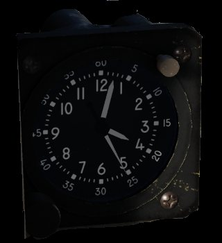

A standard, analogue clock is mounted on
the main panel, to the right of the ECM.

The clock always displays ZULU time,
irrespective to the setting selected in the
DCS MISSION EDITOR under “Additional
properties for aircraft” tab.

This setting can be changed during the
flight for the digital clock display,
controlled with the use of TMR button on
the UFC.

### FUEL QUANTITY INDICATOR

The fuel quantity indicator is on the right main instru-ment panel. It
has four display windows, a BINGO set knob, a seven-position selector
switch, and an ON/OFF indicator.

1. **Total fuel quantity (TOT):** displays total usable fuel in increments of
100 pounds.
2. **Left Display (L):** displays usable fuel in the left feed group in
increments of 50 pounds.
3. **Right Display (R):** displays usable fuel in the right feed group in
increments of 50 pounds.
4. **Bingo Window and Knob:** The Bingo Set Knob is used to set the
BINGO window in increments of 100 pounds. Once total fuel level
reaches set value, Bingo Master Caution light will turn on together with
the associated warning tone.
5. **Fuel Quantity Selector Switch:** it has seven different positions:

    - BIT: A spring loaded position that starts built-in-test of the system.
    - FEED: Fuel remaining in respective center feed tank is displayed.
    - TOT: Total fuel remaining in respective feed group is displayed.
    - INT: Fuel remaining in internal tanks of respective feed group is
displayed.
    - WING: Fuel remaining in respective internal wing tank is displayed.
    - INBD: Fuel remaining in respective inboard external tank is displayed.
    - OUTBD: Fuel remaining in respective outboard external tank is
displayed.

!!! info
    The fuel quantity selector switch should be placed to the position that best
    describes the aircraft state. If external tanks are used, the TOT position
    will present the most accurate fuel indication. With internal fuel only, the
    INT position is more accurate and should be used. When aircraft total fuel
    is below 750 pounds, the FEED position will most accurately indicate the
    fuel remaining in the respective center feed tank.

### BRAKE / HYDRAULIC PRESSURE INDICATOR

1. **Brake and Hydraulic Pressure Indicators.** Consists of three drum - type
indicators. The top one shows the applied
brake pressure. Below, two windows are
showing the pressure of two hydraulic
systems (1 and 2).
Steady state Hyd 1 and Hyd 2 indicator
read- ings of 3000 ±200 psi are normal
throughout engine rpm range with no
hydraulic system demands.
2. **Brake Accumulator Usable Pressure.**
range is 3000 to 1000 psi. When
accumulator pressure drops below 1000 psi,
braking power is lost. If excessive brake
heating occurs in a main wheel, three
fusible plugs are provided to deflate the tire.

### CAUTION / ADVISORY LIGHT PANEL

All caution lights indicate the existence of an impending dangerous
condition requiring attention, but not necessarily immediate action. The
green advisory lights indicate safe or normal configuration, condition of
performance, operation of essential equipment, or information for
routine purposes. The advisory lights are on the caution/advisory light
panel and on various other panels throughout the cockpit. More details
on each light may be found in description of relevant systems.

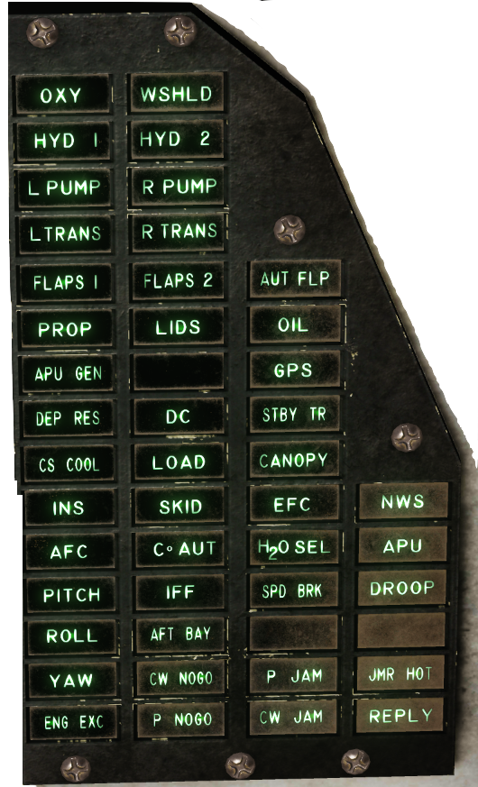

### COCKPIT ALTIMETER

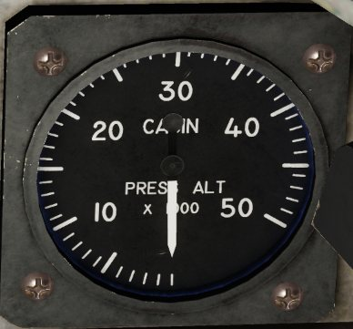

Cockpit altimeter is mounted
to the right of the caution
light panel on the main
instrument panel (see
cockpit, foldout section) and
indicates cockpit pressure
altitude from 0 to 50,000
feet.

Between altitudes of 8,000
feet to 23,000 feet the system
maintains a constant cockpit
pressure altitude of 8,000
feet. At altitudes above
23,000 feet, the cockpit
pressure regulator maintains a constant 5 psi pressure differential
greater then ambient pressure.

### THREAT ADVISORY LIGHTS

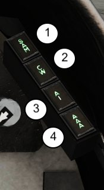

Threat warning lights indicate when the aircraft is
under threat from enemy radars.

1. **SAM.** SAM launch detected.
2. **CW.** Ground tracking (Continuous Wave) radar
is locked on aircraft.
3. **AI.** Air intercept radar is locked on aircraft.
Flashes if launch is detected (radar is guiding a
missile)
4. **AAA.** Anti Aircraft Artillery gun radar is locked
on aircraft.

## LEFT PANEL

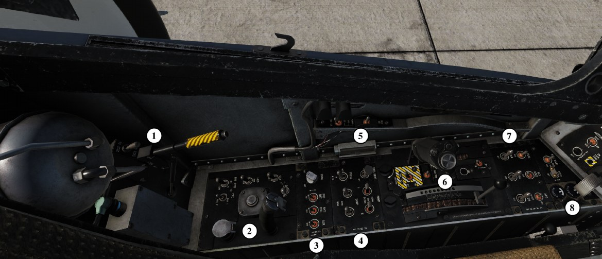

1. Rear Panel Left (DECS Switch, Fuel Cutoff Switch)
2. Pilot Services Panel
3. External Lights Panel
4. Fuel Panel
5. Miscellaneous Switch Panel
6. Throttle Quadrant
7. SAAHS Panel
8. Trim Panel

### REAL PANEL LEFT

1. **DECS Enable Switch.** DECS stands for Digital Engine Control
System - which provides engine control throughout the engine
operating range in response to throttle position, altitude, airspeed,
AOA, inlet air temperature, and aircraft configuration.
2. **Fuel Shutoff Handle.** When the handle is OFF, the aircraft fuel
system is isolated from the engine and the fuel flow proportioner is shut
off. The handle can be moved down to the ON position where it will be
locked. To put it back up, a button on the end of the handle has to be
pressed (note: there is no default keybind assigned to it).

### PILOT SERVICES PANEL

1. **Engine Fuel Control Switch.** Responsible for choosing which DECU
(Digital Electronic Control Unit) will be controlling the engine at any
given time. POS 1 selects DECU 1, POS 2 selects DECU 2. Each DECU is
capable of full control over the engine and one will take over in case
the other fails. This happens automatically, but pilot’s control over the
lane which is used could be helpful in resetting the failed DECU
processing erroneous data. In case of loss of power to either DECU, [[EFC]]{ color=yellow }
caution and [[JPTL]]{ color=red } warning lights will illuminate.
2. **Engine RPM Select Switch.** Used to switch the data displayed on a
tachometer between compressor (HI) and fan (LOW) rpm on the EDP.
3. **LIDS Switch.** Responsible for operating the LIDS - Lift Improvement
Device System. The LIDS, composed of fixed strakes and a retractable
fence, increase the vertical lift 1200 pounds by directing the jet
fountain energy and reducing hot air reingestion in ground effects. It
has two positions:

    - **RET:** retracts LIDS fence.
    - **NORM:** LIDS fence operates normally.

4. **Oxygen Switch.** Turns ON and OFF the OBOGS (On-Board Oxygen
Generating System), providing continuously available supply of
breathing gas for the pilot while the aircraft’s engine is operating.
5. **Water Dump Switch.** Used to dump water from the 500 pound tank
containing distilled or demineralized water and located in the engine
bay. It has two positions:

    - **DUMP:** water is dumped.
    - **OFF:** dumping is stopped.

### EXTERIOR LIGHTS PANEL

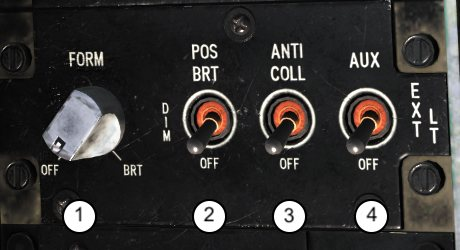

The exterior lights panel controls some of the lights mounted on the
outside of the aircraft.

1. **Formation lights.** This knob controls the intensity of twelve
formation lights, providing variable lightning between OFF and full
brightness.
2. **Position lights.** Controls brightness of the three position lights:

    - **BRT:** full intensity
    - **DIM:** reduced intensity
    - **OFF:** lights are off.

3. **Anti-collision lights.** Switches the anti-collision light ON and OFF.
4. **Auxiliary Landing Light.** Controls 70 watt lamp usually used as a
taxi light. To operate, it does not need the exterior lights master switch
to be on.

### FUEL PANEL

1. **Air Refuelling (A/R) Switch.** The switch is lever-locked and has
positions of IN, OUT and PRESS.

    - **IN:** Retracts the probe and pressurizes the tanks.
    - **OUT:** stops pressurization to the tanks and extends A/R probe. After
contact is made and refueling begins, the tanks depressurize.
    - **PRESS:** Leaves the probe extended and pressurizes the tanks.

2. **Fuel Flow Proportioner Switch.** The function of the fuel flow
proportioner is to equalize the flow of fuel from the two feed groups.
This switch provides a means of shutting off the proportioner if a fuel
out of balance correction is needed.
3. **Boost Pump Switches.** These switches operate the four boost
pumps, two in each of the feed tanks. The ac driven pumps (NORM)
only operate with the main generator online or external electrical
power applied. The dc driven pumps will operate with external power,
main generator, emergency generator, or battery. They can be used in
conjunction with the PROP switch to correct a fuel imbalance by
turning OFF the low side.
4. **Wing Fuel Dump Switches.** External and internal wing fuel may be
dumped in flight by selecting the DUMP position on the wing fuel dump
switches. There are two electro-magnetically held switches, on the left
console, marked L (left) and R (right). Both switches may be used
simultaneously in order to reduce gross weight, or individually when
pilot wants to correct out of balance conditions.

Fuel will continue to dump until the internal wing tanks are empty, the
switches are placed to NORM or if fuel setting in the BINGO window
equals the remaining total fuel.

### MISCELLANEOUS SWITCH PANEL

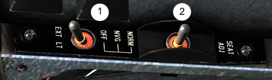

1. **External Lights Master Switch.** Provides a master control for the
following lights: position lights, formation lights, anti-collision lights,
landing/taxi lights, sideslip vane lights, and the air refueling probe
light. It has three positions:

    - **OFF:** power for all lights controlled by this switch is set to off.
    - **NVG:** power available for Anti-Collision Lights and Formation lights in
the NVG (covert) mode. This means they won’t be visible for someone
not equipped with the NVGs.
    - **NORM:** power for all lights controlled by this switch is set to ON.

2. **Seat Adjustment Switch.** Allow to bring the seat up or down for
better outside visibility from the cockpit.

### THROTTLE QUADRANT

1. :octicons-x-circle-16:{ title="NOT FUNCTIONAL: this feature is currently not implemented in this module" } **Throttle Friction Knob.** Used to set the friction of the throttle.
2. :octicons-x-circle-16:{ title="NOT FUNCTIONAL: this feature is currently not implemented in this module" } **Nozzle Angle Control Lever Friction Knob.** Used to set the friction
of the nozzle angle lever.
3. **Throttle.** See HOTAS Section for more details. //link
4. **STO Stop Lever.** Short Takeoff Stop Lever is used to block the Nozzle
Angle Control Lever at the desired nozzle angle.
5. **Throttle Cutoff Lever.** Can only be used with the throttle in idle
position.

    !!! caution "Note"
        When disengaging the Parking Brake using the mouse, be extra
        careful not to accidentally click on the Throttle Cutoff Lever, as this will
        turn off the engine.

6. **Rudder Trim Switch.** Used to set the desired rudder trim.
7. :octicons-x-circle-16:{ title="NOT FUNCTIONAL: this feature is currently not implemented in this module" } **EMS (Engine Monitoring System) Pilot Record Button.** When
depressed, EMU (Engine Monitoring Unit) records engine parameters,
which will be available for the ground maintenance crews after flight.
8. **Nozzle Angle Control Lever.** Used to control the angle of engine
nozzles, with range between 0 to 98.5 degrees, with 82-84 degrees
used for hovering.
9. **Parking Brake Lever.** If engaged, makes it impossible to advance the
throttles. Moreover, during INS alignment, Parking Brake has to be in
AFT (engaged) position for the process to begin / continue.
10. **Jet Pipe Temperature Limiter (JPTL) Switch.** When set to OFF, it
mutes the DECS JPT limits. The acceleration limit is retained and AOA
cutback is not retained. In addition, the fan speed schedule is reset to
the short lift wet schedule and limit. This results in a 6.0 to 7.0% rpm
increase.
11. **Manual Fuel Switch (MFS).** This switch has three positions:

    - **ON (forward):** Engine control is transferred from DECS to MFS
    - **Neutral (center):** neutral position.
    - **OFF (back):** Engine control is transferred from MFS to DECS.

    The MFS provides an alternate means of engine control if the primary
fuel control system fails. Engine handling and relighting are adequate
for emergency recovery. With MFS control the engine response is more
sensitive to throttle movement because the MFS does not contain any
automatic acceleration controls or limiters. The engine ignitors
continually pop as long as MFS is selected.

### STABILITY AUGMENTATION & ATTITUDE HOLD SYSTEM (SAAHS) PANEL

The two basic SAAHS modes of operation are the stability
augmentation system (SAS) mode and the automatic flight control
(AFC) mode.

1. **Yaw Switch.** Engages the stability augmentation in the yaw axis.
2. **Roll Switch.** Engages the stability augmentation in the roll axis.
3. **Pitch Switch.** Engages the stability augmentation in the pitch axis.
4. :octicons-x-circle-16:{ title="NOT FUNCTIONAL: this feature is currently not implemented in this module" } **Q Feel Switch.** Enables system providing force feedback based on
aircraft’s airspeed / dynamic pressure.
5. **Alt Hold Switch.** Engages Altitude Hold option for the AFC Switch.
6. **Automatic Flight Control (AFC) Switch.** Used to engage the AFC
mode. See Automatic Flight Control section for more information. //link

### TRIM PANEL

1. :octicons-x-circle-16:{ title="NOT FUNCTIONAL: this feature is currently not implemented in this module" } **Rudder Pedal Shaker Switch.** Used to provide early warning of side-
slip to the pilot. It has three positions:

- **OFF:** Rudder Pedal Shaker is disabled.
    - **ON:** Rudder Pedal Shaker is enabled.
    - **TEST:** Allows the rudder pedal shakers to be tested on the ground.

2. **Landing / Taxi Lights Switch.** Used to select the power of the two
landing lights mounted on the nose gear strut:

    - **APRCH (Approach):** 250 watt filament illuminates
    - **HVR (Hover):** 150 watt filament illuminates
    - **OFF:** Lights are off.

3. **Aileron and Rudder Trim Indicators.** Shows current trim setting for
aileron and the rudder.

## RIGHT PANEL

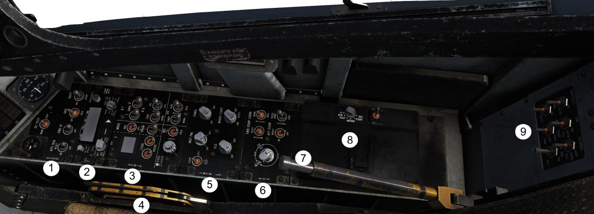

1. Electrical Panel
2. V/UHF Radio Panel
3. ACNIP (Auxiliary communication, navigation, identification panel)
4. Emergency Restraint Release
5. Interior Lights Panel
6. Environmental Control
7. Ground Safety Control Handle
8. Video Recorder / NVG Stowage
9. Ground Power Control Panel

### ELECTRICAL PANEL

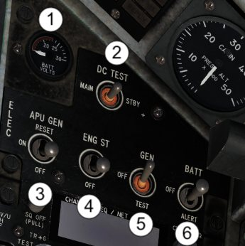

1. **DC Voltmeter.** Indicates voltage on the alert 24/28 volts dc bus. The
voltmeter indicates battery voltage when the battery switch is in ALERT
and emergency dc bus voltage when the battery switch is in BATT. The
most accurate indication of battery condition is with generators off and
the battery switch set to BATT.
2. **DC Test Switch.** It is use for checking the operation of electrical
system in case of failure of main or standby TRU (Transformer-rectifier
unit). It has three positions:
    - **MAIN:** disables standby TRU.
    - **NEUTRAL:** off
    - **STBY (standby):** disables the main TRU.
3. **APU GEN (Auxiliary Power Unit) Switch.** The Harrier is equipped
with a 6KVA emergency generator, installed as a backup for the main
generator. It is driven by a gas turbine starter (GTS) and can be used
either for translational engine starting when on the ground or as
standby generator when in flight (taking over whenever main generator
drops off-line). During ground alert, APU can be used to recharge the
battery. It has three positions:
    - **OFF:** APU is powered off.
    - **ON:** powers up the APU. If BATT is on and ENGINE START SWITCH is
off, it starts the gas turbine starter (GTS/APU). Otherwise, it puts the
APU in the standby mode if selected after the engine is started.
    - **RESET:** used to bring APU back on the line after a fault is detected.
4. **Engine Start (ENG ST) Switch.** Placing the switch to ENG ST
initiates the GTS and engine starting sequence.
5. **Generator (GEN) Control Switch.** It has three positions:
    - **GEN:** allows main generator to come on the line when all conditions
are correct (generator is connected to the bus system and voltage and
frequency are within prescribed limits - app. 23% engine RPM)
    - **OFF:** removes main generator from the line. Position is also used
when cycling generator protective functions after a malfunction to
allow reset.
    - **TEST:** Position used for ground test (not operative).
6. **Battery (BATT) Switch.** Needs to be set to ON before attempting to
start GTS and Engine. It has three positions:
    - **BATT:** standard operating procedure. In this position battery is
recharged by one of the TRUs.
    - **OFF:** battery is OFF.
    - **ALERT:** used to check the battery voltage. In this position battery is
isolated from TRUs and therefore is not being recharged.

### V/UHF RADIO PANEL

1. **Volume control / Squelch Switch.** Volume control knob is not
operational, as audio level is controlled via the UFC (even in MAN
mode). The Squelch Switch has two positions:
    - **SQ ON (default):** Squelch circuit is operational and background noise
is removed by reducing receiver gain.
    - :octicons-x-circle-16:{ title="NOT FUNCTIONAL: this feature is currently not implemented in this module" } **SQ OFF:** disables Squelch.
2. **Operational Mode Switch.** Determines mode in which the radio is
operating. It has seven positions:
    - **ZRO (PULL):** not used.
    - **OFF:** Power is removed from the panel.
    - :octicons-x-circle-16:{ title="NOT FUNCTIONAL: this feature is currently not implemented in this module" } **TEST:** Selects internal BIT of radio set control and BIT of receiver-
transmitter.
    - **T/R:** Transmit / Receive. Enables the main receiver and transmitter of
the radio.
    - **T/R + G:** Enables the main receiver and transmitter of the radio as
well as Guard receiver (243.000)
    - **ADF:** not used.
    - **CHNG PRST:** Change preset mode. Allows preset channels,
frequencies and modulation to be loaded into receiver - transmitter.

        !!! info
            This option is not available in the pit. Instead, you can use Mission
            Editor to set up to 26 preset channels for both radios.

3. **CHAN FREQ/NET/TIME Display.** Displays digital readouts of
channel number, frequency, net (not used), time, and mode or BIT
results.
4. **Frequency Mode Switch.** It has seven positions:
    - **AJ/M:** not used.
    - **AJ:** not used.
    - **MAR:** Selects one of 57 preset maritime channels (1-28 and 60 - 88).
    - **PRST:** Enables channel preset selection. When used, the number of
channel, frequency and type of modulation is shown on the CHAN
FREQ/NET/TIME Display.
    - **MAN:** enables manual frequency selection using pushbuttons (6) and
(7).
    - **243:** turns on both receivers - transmitters and sets the UHF
emergency frequency of 243.000.
    - **121:** turns on both receivers - transmitters and sets the VHF
emergency frequency to 121.000.
5. **CHAN/FREQ Control and CRSR Switch.** Rotating CHAN/FREQ
control changes the channel or frequency value depending on mode
selector. If PRST is selected, it will cycle through preset frequencies. Is
MAN is selected, it will change the frequency by 0.025 with each turn.
6. :octicons-x-circle-16:{ title="NOT FUNCTIONAL: this feature is currently not implemented in this module" } **V/UHF Ancillary Mode Switch.** Used with ancillary mode pointer
to select or deselect ancillary modes.
7. :octicons-x-circle-16:{ title="NOT FUNCTIONAL: this feature is currently not implemented in this module" } **V/UHF Ancillary Mode Pointer.** Positions pointer to select or
deselect ancillary mode option defined by the – pushbutton.
8. :octicons-x-circle-16:{ title="NOT FUNCTIONAL: this feature is currently not implemented in this module" } **LOAD / OFFSET Switch.** Enables selection of alternate functions.

### ACNIP (AUXILIARY COMMUNICATION, NAVIGATION, IDENTIFICATION PANEL)

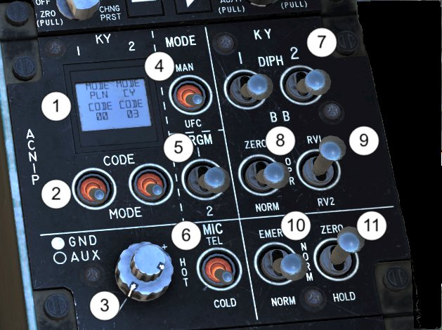

1. :octicons-x-circle-16:{ title="NOT FUNCTIONAL: this feature is currently not implemented in this module" } **KY-58 Secure Speech Display.** Shows selected Mode and Code for
KY-58 Unit #1 and Unit #2.
2. :octicons-x-circle-16:{ title="NOT FUNCTIONAL: this feature is currently not implemented in this module" } **KY-58 Secure Speech Code / Mode Switches.** Used to select desired
code and mode for Unit#1 and Unit#2.
3. **ICS (Intercom System) Volume Knobs.**
    - **GROUND (GND) Volume Knob:** the larger, bottom of the two knobs.
Controls the audio level to the ground crew headset.
    - **AUXULIARY (AUX) Volume Knob:** smaller knob on the top. Controls
the audio level of aural warnings to the pilot headset.
4. **V/UHF Radio Control Switch.** Used to select primary panel for
operating the radios.
    - **MANUAL (MAN):** Radios are controlled via the V/UHF Radio Set
Control (RSC) and ACNIP. The manual mode is a back-up mode and
will mostly be used during in-flight failures of the UFC mode. It is also
used for ground alert operation when there is no ac power applied to
the aircraft.
    - **UP FRONT CONTROLLER (UFC):** Radios are controlled via the panel
and knobs on the UFC. This is the primary mode of operations.
5. **Radio Program 1/2 Switch.** Used only in manual mode in order to
select the receiver - transmitter for which settings (transmit and receive
mode, frequency mode,, squelch, and UHF mode) are being entered.
6. :octicons-x-circle-16:{ title="NOT FUNCTIONAL: this feature is currently not implemented in this module" } **MIC Switch.** Allows communications between the ground crew or a
telephone land line without keying the radio system.
7. :octicons-x-circle-16:{ title="NOT FUNCTIONAL: this feature is currently not implemented in this module" } **Baseband / Diphase Switches.** Used to select the type of cipher for
UHF AM transmissions.
8. :octicons-x-circle-16:{ title="NOT FUNCTIONAL: this feature is currently not implemented in this module" } **Cypher Zero / Norm Switch.** When the switch is placed to ZERO,
the codes stored in each of the secure speech systems are set to zero.
With the switch in the NORM position, codes can be stored in the
speech security system.
9. :octicons-x-circle-16:{ title="NOT FUNCTIONAL: this feature is currently not implemented in this module" } **Remote Variable Load Switch.** Allows to operate with pre-loaded
codes or use new variables.
10. :octicons-x-circle-16:{ title="NOT FUNCTIONAL: this feature is currently not implemented in this module" } **IFF Emergency / Normal Switch.** Not simulated
11. :octicons-x-circle-16:{ title="NOT FUNCTIONAL: this feature is currently not implemented in this module" } **IFF Zero / Hold Switch.** Not simulated.

### EMERGENCY RESTRAINT RELEASE

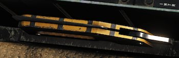

This handle does NOT eject the pilot from the airplane. It is used for
ground emergency escape or emergency crew removal, in case the pilot
is unconscious. What it does is, it cuts the leg restraints that are
connected to the pilot’s G-suit behind their calves. When the pilot is
ejected, those leg restraints pull the pilot’s legs in toward the seat so
they are not injured during ejection. If a pilot had a ground emergency
and didn’t want to reach down to disconnect his/her leg restraints, they
could squeeze the handle and pull up to cut them off, making a ground
egress much quicker.

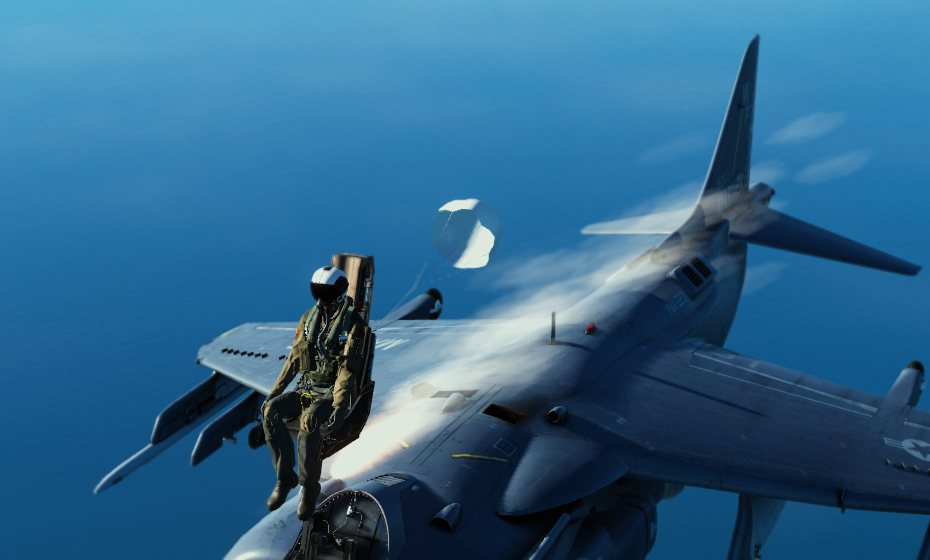

### INTERIOR LIGHTS PANEL

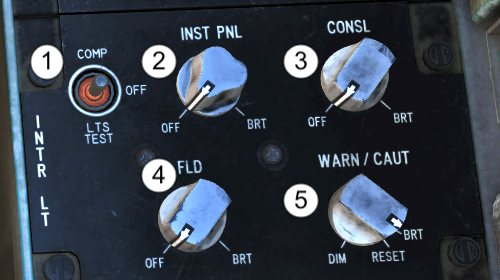

1. **Compass / Lights Test Switch.** Performs dual function - controls the
standby compass light and tests the warning/caution/advisory lights.
    - **COMPASS (COMP):** The compass light is on, as long as the CONSL
knob is out of OFF position.
    - **OFF:** both functions of the switch are off.
    - **LIGHTS TEST (LTS TEST):** a spring loaded position allowing to test
all the warning/caution/ advisory lights installed in the cockpit.
2. **Instrument Panel Knob.** Controls the integral and light panel
lighting for the main instrument panel.
3. **Console Lighting Knob.** Controls the integral and light panel
lighting for the left and right consoles, landing gear control and
emergency jettison button panels, hydraulics indicator panel and the
cockpit altimeter.
4. **Floodlights Knob.** Controls the intensity of the floodlights installed
in the cockpit.
5. **Warning / Caution Lights Knob.** Used to switch the warning/
caution/advisory lights from bright intensity to the low intensity range,
and then vary the brightness within the low intensity range.

### :octicons-x-circle-16:{ title="NOT FUNCTIONAL: this feature is currently not implemented in this module" } ENVIRONMENTAL CONTROL PANEL

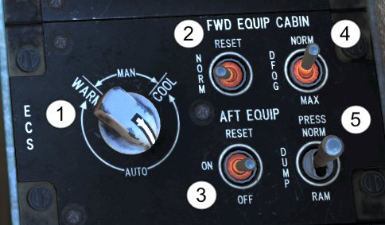

!!! note
    Understandably, the ECS system is not modelled in the DCS AV-8B.
    However, each element is described below.

1. **Temperature Controller Knob.** Used to regulate the cockpit and
windshield defog air temperature, as well as temperature inside the
cockpit. It can be set to AUTO or MANUAL mode.
2. **Forward Equipment Bay Cooling Switch.** Used to control cooling of
equipment installed in the forward part of the aircraft (INS etc.)
3. **After Equipment Bay Cooling Switch.** Used to control cooling of
equipment installed in the rear of the aircraft.
4. **Defog Switch.** Used to choose how much of the conditioned airflow
is used for the pilot and how much is directed to the windshield.
5. **Cockpit Pressure Switch.** Used to control the cockpit pressure.

### GROUND SAFETY CONTROL HANDLE

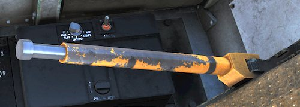

The Ground Safety Control Handle on the right forward side of the seat
at shoulder level provides a means for safeing or arming the seat. The
armed position is down and locked against the seat. The safe position is
up and locked away from the seat.

### :octicons-x-circle-16:{ title="NOT FUNCTIONAL: this feature is currently not implemented in this module" } VIDEO RECORDER AND NVG STORAGE

{ width=240 }

Divital Video Recorder, DVR,
where the pilot or Plane
Captain load the DVR
recorder ‘brick’. This is
where the HUD or DDI
recordings are saved to. The
selector knob shown here is
for the older cassettes,
which were 8MM tapes.

The NVG stowage goes
directly AFT of the recorder
and is a mount that sticks up from the panel and provides a holder to
clip the NVGs on for easier retrieval.

### :octicons-x-circle-16:{ title="NOT FUNCTIONAL: this feature is currently not implemented in this module" } GROUND POWER CONTROL PANEL

1. **IGN ISO (Ignition Isolation) Switch:** With the switch in OFF
position (default), ignition is automatically provided during engine
start. Placing the switch to ON disables the normal start ignition and
allows the engine to be wet or dry cycled without ignition.
2. **JPTL Test Switch:** it has three positions, AMP, OFF and MAX. The
switch is spring loaded to the OFF position. The MAX and AMPL
positions are for maintenance use only and should not be selected by
the pilot.
3. **MISC (Miscellaneous) Switch:** applies power to TACAN, external
lights and RWR.
4. **DSP / FLT (Display / Flight Instrument) Switch:** applies power to
HUD, EDP, FLIR, inverter, UFC, VRS, MPCDs, DSS, DVMS, ADC, SAAHS,
as well as flight displays and indicators
5. **CNI (Communication, Navigation, Identification) Switch:** applies
power to mission computer, radar altimeter and beacon, KY-58, radios,
ECM, RWR, IFF, INS, DECM and DVMS.
6. **Stores Switch:** it has two positions.
    - **ACP:** in this position applies power to the Armament Control Panel
only
    - **SMS:** in this position applies power to Stores Management Computer,
Armament Control Panel, TACTS and DECM.

!!! note
    Ground Power Control Panel is not functional at the time of writing, but it
    will be implemented at a later stage.

