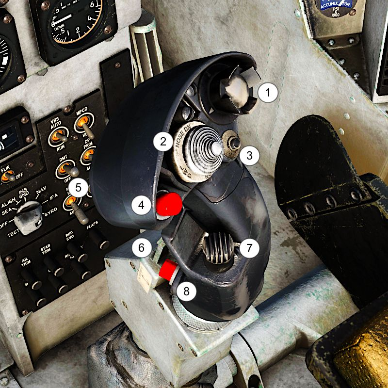
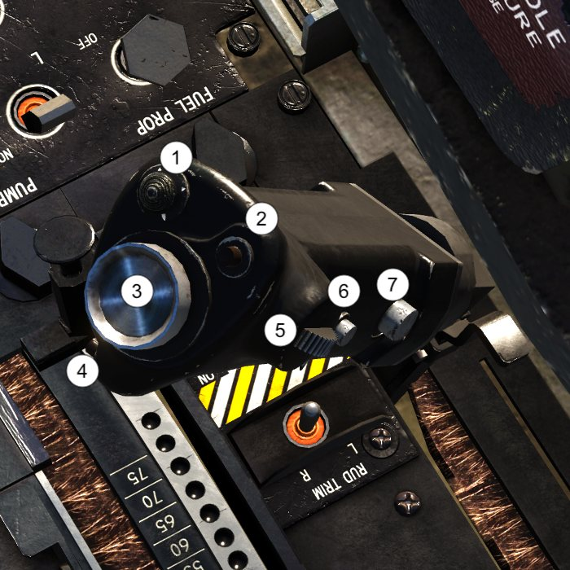
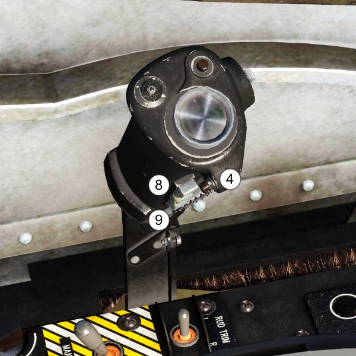

# FLIGHT CONTROLS

## INTRODUCTION

The primary flight controls for AV-8B are the stabilator, rudder and
ailerons for aerodynamic control and reaction control system for jet
borne control power.

Secondary flight controls include flaps, speedbrake, Stability
Augmentation and Attitude Hold System (SAAHS).
This chapter will also present the HOTAS system, however detailed
functions of all the switches will be described in other sections of the
manual, where it will be more relevant.

## PRIMARY FLIGHT CONTROLS

### AILERON CONTROL SYSTEM

The ailerons are responsible for the lateral control of the aircraft (roll).
With the landing gear down, ailerons travel to maximum 25° up and to
10° down. When the gear is up, these limits are reduced. Aileron
deflection is increased, however, at speeds between 0.88 and 0.96 Mach
or AoA between -2.6O and 9.1, thus improving roll rate.

Ailerons can be trimmed using a manual or auto trim system - the
former by actuating a trim switch on the stick, and the latter connected
to the automatic flight control (AFC) system. Current trim setting can //link
be monitored using the Aileron Trim Indicator located on the 
[Trim Panel](02.cockpit.md#trim-panel) on the left console. //link

### STABILATOR CONTROL SYSTEM

The stabilator controls the longitudinal movement of the aircraft. Its
travel is limited to maximum 10° trailing edge up and to 11° trailing
edge down.

Stabilators can be trimmed using a manual or auto trim system - the
former by actuating a trim switch on the stick, and the latter connected
to the automatic flight control (AFC) system. Current trim setting can //link
be monitored using the Stabilator Position Indicator (4) located on
the [Engine Display Panel](02.cockpit.md#engine-display-panel) on the main console.

### RUDDER CONTROL SYSTEM

Rudder is a directional control elevator attached to the vertical
stabiliser. It is controlled by rudder pedals in the cockpit, and its travel
is limited to 15° left and right. The rudder actuator is powered by HYD
1 system.

The rudder also has its own trim system, which consists of a trim switch
on the [Trim Panel](02.cockpit.md#trim-panel), which positions the rudder actuator and has about 2°
authority. Current trim setting can be monitored using the Rudder Trim
Indicator.

:octicons-x-circle-16:{ title="NOT FUNCTIONAL: this feature is currently not implemented in this module" } Rudder feel is provided by the Q-feel unit, which provides rudder
forces independent of airspeed up to 165 knots. Above 165 knots, the
Q-feel unit increases rudder forces as airspeed increases. The Q-feel
system may be shut off by placing the Q-feel switch on the SAAHS
Control Panel to OFF.

:octicons-x-circle-16:{ title="NOT FUNCTIONAL: this feature is currently not implemented in this module" } Rudder pedal shakers give early warning of side-slip at low speed. In
flight, at approximately 165 knots or below, if over 0.06 lateral g’s
occur, one of the two shakers will oscillate its associated pedal, giving a
cue to the pedal that should be pushed. In order for shakers to work,
one of the conditions need to be fulfilled:

- Gear down and STOL flaps selected
- Gear down, AUTO or CRUISE flaps and less than 0.3 Mach
- Gear up, STOL flaps and less than 0.3 Mach
- Nozzles greater than 10°

Rudder Pedal Shakers are controlled by the Ruder Pedal Shaker Switch,
which is located on the left console on Trim Panel. It has three
positions:

- **OFF:** Rudder Pedal Shaker is disabled.
- **ON:** Rudder Pedal Shaker is enabled.
- **TEST:** Allows the rudder pedal shakers to be tested on the ground. In
order to do this, the nose wheel steering should be enabled. Pilot
should hold the switch in TEST position and turn the aircraft while
taxiing, which causes a side force on the side of the forward pressed
rudder pedal and generate oscillation, as well as brief imposition of
the side force symbol on the HUD.

### REACTION CONTROL SYSTEM

During jetborne flight, control is maintained by a system of reaction
control valves, which use a bleed air supplied from the HP compressor,
through a master butterfly valve which is interconnected with the
engine nozzles control mechanism. It automatically opens whenever
nozzles are deflected from fully aft. Air supply is progressive as the
nozzles are lowered from 0° to 36° down.

The pressure of the air supplied is shown by the Duct Pressure
Indicator (2) located on the [Engine Display Panel](02.cockpit.md#engine-display-panel). When the nozzles are fully
aft, the pressure will oscillate between 0 and 3 psi. However, as the
nozzles are lowered, the psi increases.

The lateral and longitudinal controls are provided by control valves
located on the wingtips, nose and tail. They blow up or down,
depending on the stick actuation, giving more control for the pilot.
There also is a double tail valve used for directional control.

## SECONDARY FLIGHT CONTROLS

### FLAPS

The AV-8B is equipped with electro-hydraulic operated trailing edge
flaps, controlled by a dual channel electronic flap controller, a dual
system hydraulic control valve and two dual tandem actuators.

Depending on the position of the Flap switch on the [Landing Gear
Control Panel](02.cockpit.md#landing-gear-control-panel), current speed and whether the landing gear is up or
down, flaps will behave differently:

There are two primary switches responsible for operating the flaps.

Flaps Power Switch: a 3-position switch controlling the power flow to
the flaps.

- ON: Applies power to the Flaps Mode Switch and the Flaps Controller.
- OFF: Shuts off power to the Flaps Mode Switch.
- RESET: Momentary switch. When used, it resets the Flaps Controller
logic and cancels an initiated BIT.

Flaps Mode Switch. This 3-position switch controls the position of the
flaps and aileron droop depending on the current airspeed.

- STOL: used for takeoff and landing. Provides variable flap angle and
aileron droop, as shown in the table above. Flap angle is variable based
on nozzle angle to prevent burning the flaps with the hot nozzles.
- AUTO: with the landing gear up and depending on the airspeed, Mach
number and angle-of-attack, the flaps will be scheduled between 0 and
25° with 0° of aileron droop. When the landing gear is down, provides
25° of flaps and 0° of aileron droop.
- CRUISE: provides 5° of flaps and 0° of aileron droop.

Current angle of the flaps is shown
on the flap position indicator and
on the HUD in the STOL Master
Mode. The number displayed
indicates the current position of the
flaps in degrees (between 00 and
98).

In case of failure of both flap channels and even if the Flap Power
Switch is off, pilot still can retract the flaps completely using
Emergency Flap Retract Button located on the throttle.

#### FLAPS WARNING / CAUTION LIGHTS

The green [[FLAPS]] light on the [Warning / Threat Light Panel](02.cockpit.md#stabilator-control-system) indicates a
dual channel flap failure or tells pilot that the flap power switch is set
to OFF.

The three flaps caution lights are on the [Caution / Advisory Light Panel](02.cockpit.md#caution-lights-panel):
[[FLAPS 1]] or [[FLAPS 2]] (but not both) indicates a failure in the flap system
without loss of function. The digital flap controller will keep the flaps
engaged as long as a valid signal path exists to control the flaps.
[[AUTO FLAPS]] caution light indicates the loss of AUTO mode
computation or air data computer input.

#### FLAPS IBIT

To perform the pilot - initiated Built In Test follow the steps below:

1. Set the flap power switch to ON. Ensure nozzles are set lower than
10°.
2. Press the flaps BIT switch on the landing gear control panel.
3. The Master Warning light will illuminate and the Flaps Position
(FLAPS POS) indicator will fluctuate between 25° and 5°, indicating
that the FLAPS BIT is being conducted.
4. When complete, your flaps caution and warning lights should
extinguish and your flaps should be at 25°.

### AILERON DROOP

Aileron droop is an automatic function in which neutral positions of the
ailerons are set to 15° down, producing greater lift in slow speed
regimes. See the table above for exact conditions in which the droop
will occur.

The pilot can verify that the ailerons droop by checking that the Aileron
Droop Light is illuminated on the Caution / Advisory Light Panel.

### SPEEDBRAKE

The electro-hydraulic operated speedbrake is hinged on the fuselage
underside, aft of the main landing gear.

The main principles of operation of the speedbrake are outlined in the
table below:

LANDING GEAR |  SPEED BRAKE POSITION | SPD BRK LIGHT |                        NOTES
-------------|-----------------------|---------------|-----------------------------------
UP           |        1 - 66°        |      ON       | Max travel is reduced as air speed increases
UP           |           0°          |      OFF      |
DOWN         |          25°          |      OFF      | Speed brake set to max 25° regardless of previous selection

The speedbrake is operated by a thumb - actuated switch on the
throttle, which has three positions:

- **OUT:** extends the speedbrake
- **NORM:** neutral position.
- **IN:** retracts the speedbrake

### STABILITY AUGMENTATION AND ATTITUDE HOLD SYSTEM (SAAHS)

Two basic modes of operation are Stability Augmentation System (SAS)
and Automatic Flight Control (AFC).

#### STABILITY AUGMENTATION SYSTEM (SAS)

The three SAS mode selection controls are the PITCH, ROLL and YAW
switches which engage the stability augmentation in the corresponding
aircraft axes. The stability augmentation system increases aircraft
stability and improves the response to pilot inputs in maneuvering flight
throughout the entire flight envelope. The yaw SAS also provides a
lateral stick to rudder inter-connect for improved turn coordination.

SAS is controlled by switches on the SAAHS panel located on the left
console.

Pilot can engage or disengage the YAW (1), ROLL (2) and PITCH (3)
systems individually to provide stability augmentation in any desired
combination of the three axes. Q FEEL switch (4) is not part of the SAS.

!!! note
    Disengaging individual switches greatly reduces Departure
    Resistance system and can lead to violent spins and loss of control.

Pressing the emergency SAAHS disengage switch (paddle switch)
located on the control stick grip interrupts the stability augmentation
system in all three axes and also removes rudder trim. Releasing the
paddle switch restores stability augmentation to those axes selected by
the SAS switches and restores the rudder trim.

The departure resistance (DEP RES) improves lateral/directional
handling at low to moderate AOA and resists out-of-control departures
at AOA below and above the maneuvering tone. DEPRES is at all AOA
and varies in function depending on airspeed, Mach number and AOA.

##### SAS WARNING / CAUTION LIGHTS

The four SAS caution lights are on the [Caution / Advisory Light Panel](02.cockpit.md#caution-advisory-light-panel):

[[DEP RES]] light illuminates whenever, the in-flight computer detects
invalid sensor data or one or more SAS axes are disengaged by the
pilot.

[[PITCH]] light illuminates when the pitch axis is disengaged or not
functional.

[[ROLL]] light illuminates when the roll axis is disengaged or not
functional.

[[YAW]] light illuminates when the yaw axis is disengaged or not
functional.

#### AUTOMATIC FLIGHT CONTROL (AFC)

The Automatic Flight Control is an official name of the Harrier’s
autopilot. It is a relatively simple system allowing to pilot to hold
current pitch and roll - up to certain limits - as well as to make the
aircraft hold the current altitude.

In order for the AFC to work, several conditions need to be fulfilled:

- All three SAS switches need to be engaged
- INS needs to be in NAV mode
- Aircraft has to be airborne

AFC is controlled by two switches located on the SAAHS panel:

AFC switch, which has three positions:

- AFC: solenoid held position. Engages the AFC.
- OFF: AFC is off.
- RESET: Momentary position used for SAAHS reset.

ALT HOLD switch, which has two positions:
- ALT HOLD: solenoid held position. When engaged, it enables the
altitude hold mode of the AFC.
- OFF: altitude hold mode is off.

If any of the conditions mentioned above is no longer true, both AFC
and ALT HOLD switches will automatically disengage. ALT HOLD will
also disengage if AFC is switched off. Pressing the paddle switch on the
stick will also cause both switches to disengage.

##### AFC SWITCH ENGAGED, ALT HOLD DISENGAGED

When both the AFC switch is engaged and the ALT HOLD switch is in
the off position, the AFC mode provides pitch attitude hold, roll attitude
hold and heading hold within the following parameters:

AIRSPEED   |FLAPS   |GEAR    |MAX PITCH    |MAX ROLL                   |NOTES
-----------|--------|--------|-------------|---------------------------|---------
**PITCH AND ROLL HOLD** { colspan="2"}
<50 kts    |ANY      |ANY    |+3 to 12°*   |+/- 20°**     |\*If engaged within this range automatic roll to wings level **If engaged within -15° to +20° automatic pitch adjustment to given ranges
> 50 kts   |CRUISE/AUTO |UP  | +/- 30°     |+/- 60°       | If above 5° from wings level
**HEADING HOLD** { colspan="2"}
> 140 kts |   UP    |  UP    |   +/- 5°    |    -        |
> 0.3M    | STOL*   |DOWN*   |  +/- 5°     |    -        | \*if one of these is true, not both
ANY      | STOL    | DOWN       | N/A      |     -  | If engaged within +/- 5° roll automatic roll to wings level

If AFC is engaged above the pitch limit of 30° or roll limit of 60°, the
switch will remain ON, but the hold function will not work until the
aircraft is back within the limits.

!!! note
    There is no indication in the cockpit (visual or sound) that the AFC is
    disengaged or that it is engaged above the limits listed above.

With airspeed below 50 knots and -15° to +20° pitch limits or -20° to
+20° roll limits exceeded, the AFC will disengage automatically. The
same will happen at airspeed above 60 knots whenever true AOA goes
beyond 15°.

##### AFC SWITCH ENGAGED, ALT HOLD ENGAGED

When both AFC and ALT HOLD switches are engaged, altitude hold
function replaces the pitch hold. ALT HOLD will only work if the
following conditions are true:

- AFC switch is already engaged.
- Airspeed is greater than 160 knots.
- Climb or descend rate is below 2000 feet / minute.
- Pitch must be within ±30° and roll within ±60° limit

When engaged, the aircraft will maintain current altitude and selected
roll. ALT HOLD will be disengaged and revert to AFC only whenever
one of the events listed below occurs:

- There is an excursion in altitude of ±250 feet from the altitude
reference (altitude maintained during selection of ALT HODE mode)
- The altitude changes due to stick or trim inputs by a cumulative total
of more than ±250 feet following establishment of an altitude
reference.
- The altitude rate exceeds ±2000 feet per minute or airspeed falls
below 160 knots.

##### MANEUVERING IN AFC FLIGHT MODE

When the AFC is on, the pilot still retains some capabilities to maneuver
the aircraft. He can use the control stick and the manual trim switch to
lock the AFC onto new pitch attitude, roll attitude and heading
references without disengaging the AFC switch during the maneuvers.
When using the control stick for that, it is important to make very
delicate movements, as using too much force (1 pound in real aircraft)
will interrupt the AFC. Still, after returning to level flight on new
heading, the AFC should start working again.

Manual trim on the stick can also be used to make small attitude and
roll adjustments. Whenever the trim button is pushed, the AFC will
temporarily disengage and then re-engage again at the new roll or pitch
value.

However, if pitch manual trim button is clicked, the ALT HOLD will turn
off, reverting the airplane to AFC only mode.

## HANDS ON THROTTLE AND STICK (HOTAS)

The Harrier received the current HOTAS configuration during the
upgrade from the A model, which had very rudimentary controls. The
stick (together with MPCDs) was taken from the F/A-18 Hornet.

### CONTROL STICK

Control stick allows for left, right, fore, and aft movement for control
of the ailerons and stabilator. It also has 8 controls mounted on the
grip, making it a true HOTAS controller.

1. Sensor Select Switch. The sensor select switch is a six-position
switch (center off). It uses five momentary positions: forward, aft,
left, right and down. More info in Sensor Management section..
2. Trim Switch. Used for manual trimming of the aircraft. When the
trim switch is actuated, the actuator repositions the spring feel unit
which, in turn, moves the stick neutral position, causing the aircraft to
roll left or right, pitch up or down. [See Primary Flight Controls section](#primary-flight-controls)
for more information.
3. Waypoint Increment Switch (WINC). Used to change the currently
selected waypoint. See Navigation section for more information. //link
4. Air to Ground Bomb Pickle Button. Used to release air to ground
ordnance. See XXX section for more information.
5. Trigger. Hidden on the picture. Used to fire the GAU-12 cannon, as
well as launch Sidewinder and Sidearm missiles. See XXX section for
more information.
6. Emergency SAAHS Disengage Switch. Pressing the emergency
SAAHS disengage switch (paddle switch) located on the control stick
grip interrupts the stability augmentation system in all three axes and
also removes rudder trim. See [Stability Augmentation System (SAS)](#stability-augmentation-system-sas)
section for more information.
7. Air to Air Weapon Select Switch. This is a three-position
momentary switch that automatically selects the A/A master mode
when an A/A weapon selection is made. See XXX section for more
information.
8. Nosewheel Steering Switch. Used for controlling the sensitivity of
nose-wheel steering system, as well as Target Undesignate and FOV
toggle, depending on currently selected Sensor and / or Master Mode.
See XXX section for more information.

### THROTTLE

The throttle on the Harrier is mounted on the left panel in a larger
Throttle Quadrant. During the upgrade to the B model, the throttle
received serious updates and a number of controls added to the grip.

{ width=500 }
{ width=500 }

1. **ECM Dispense Switch.** Used for deploying countermeasures. See
XXX for more information.
2. **Cage / Uncage Switch.** Used to control some of the sensors and
weapons, mostly Maverick missiles. See XXX and YYY sections for more
information.
3. **Slew Control / Designate Switch.** Mostly used to control sensors -
especially DMT and TGP, but also the weapons. See XXX and YYY
sections for more information.
4. **A/A Programming Switch.** Not used in Night Attack version.
5. **Antenna Elevation Switch.** Not used in Night Attack version.
6. **Airstart Switch.** As the name implies, used in case of need to restart
the engine during flight. It is also pressed during normal start up to
check the igniters. See Emergency Procedures section for more
information.
7. **Emergency Flap Retract Switch.** Allows the pilot to retract the flaps
in case of failure of both flap channels. See Flaps section for more
information.
8. **Comm Switch.** It is a rocker switch pressed to enable radio
transmissions on COMM 1 or COMM 2 channel. See Comms section for
more information.
9. **Speedbrake Switch.** Used to extend and retract the speedbrake - see
relevant section for more information.

