# FLIGHT CONTROLS

## INTRODUCTION

The primary flight controls for AV-8B are the stabilator, rudder and
ailerons for aerodynamic control and reaction control system for jet
borne control power.

Secondary flight controls include flaps, speedbrake, Stability
Augmentation and Attitude Hold System (SAAHS).
This chapter will also present the HOTAS system, however detailed
functions of all the switches will be described in other sections of the
manual, where it will be more relevant.

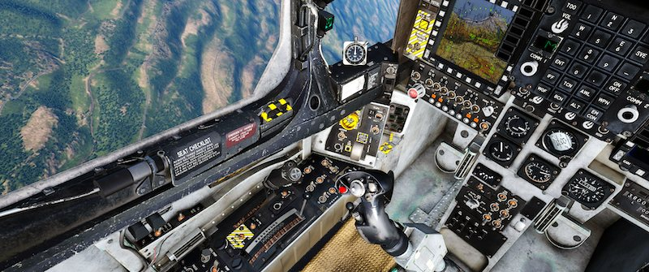

## PRIMARY FLIGHT CONTROLS

### AILERON CONTROL SYSTEM

The ailerons are responsible for the lateral control of the aircraft (roll).
With the landing gear down, ailerons travel to maximum 25° up and to
10° down. When the gear is up, these limits are reduced. Aileron
deflection is increased, however, at speeds between 0.88 and 0.96 Mach
or AoA between -2.6O and 9.1, thus improving roll rate.

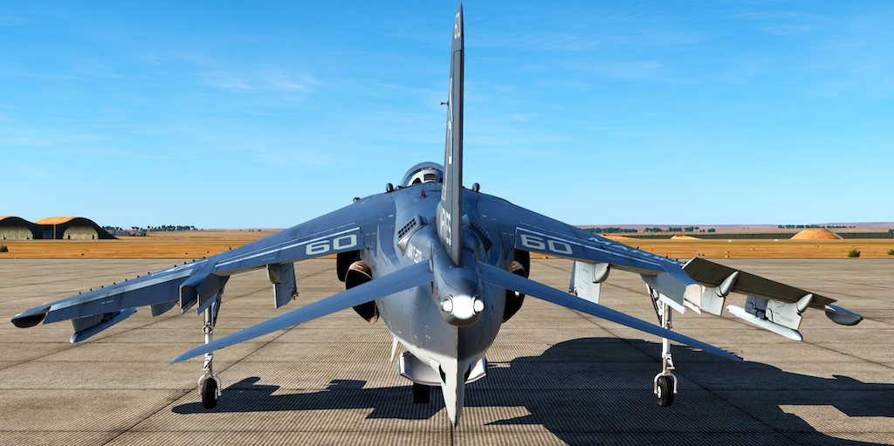

Ailerons can be trimmed using a manual or auto trim system - the
former by actuating a trim switch on the stick, and the latter connected
to the automatic flight control (AFC) system. Current trim setting can //link
be monitored using the Aileron Trim Indicator located on the 
[Trim Panel](02.cockpit.md#trim-panel) on the left console. //link

### STABILATOR CONTROL SYSTEM

The stabilator controls the longitudinal movement of the aircraft. Its
travel is limited to maximum 10° trailing edge up and to 11° trailing
edge down.

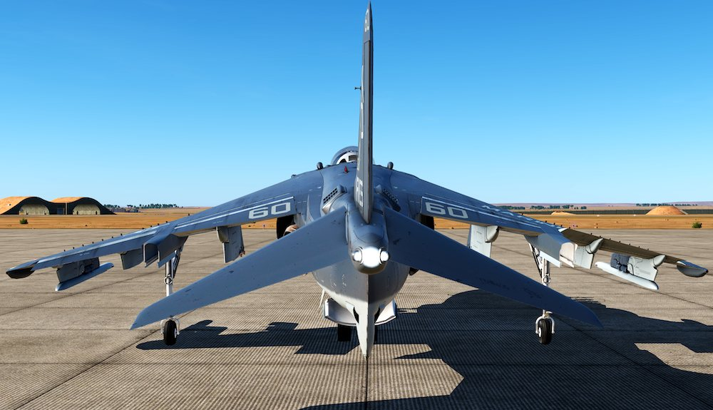

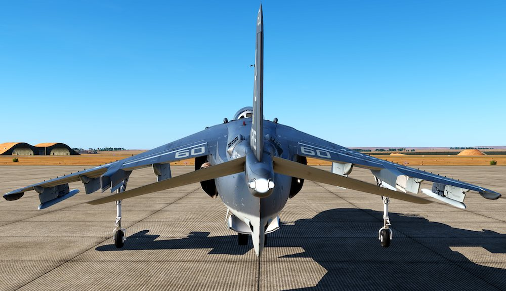

Stabilators can be trimmed using a manual or auto trim system - the
former by actuating a trim switch on the stick, and the latter connected
to the automatic flight control (AFC) system. Current trim setting can //link
be monitored using the Stabilator Position Indicator (4) located on
the [Engine Display Panel](02.cockpit.md#engine-display-panel) on the main console.

### RUDDER CONTROL SYSTEM

Rudder is a directional control elevator attached to the vertical
stabiliser. It is controlled by rudder pedals in the cockpit, and its travel
is limited to 15° left and right. The rudder actuator is powered by HYD
1 system.

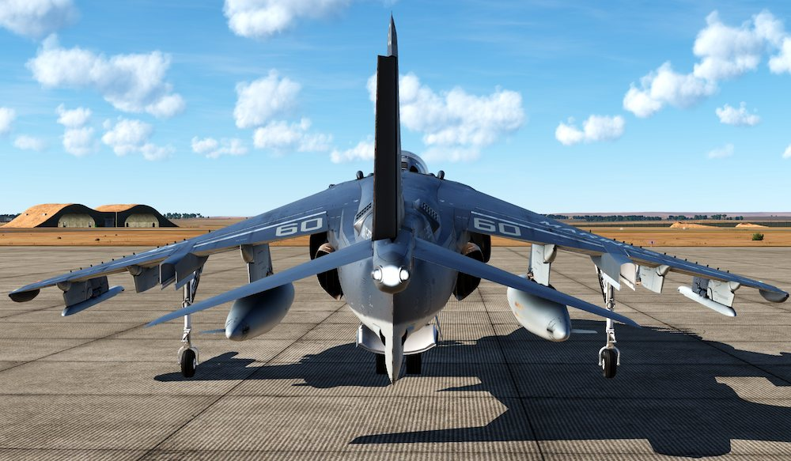

The rudder also has its own trim system, which consists of a trim switch
on the [Trim Panel](02.cockpit.md#trim-panel), which positions the rudder actuator and has about 2°
authority. Current trim setting can be monitored using the Rudder Trim
Indicator.

:octicons-x-circle-16:{ title="NOT FUNCTIONAL: this feature is currently not implemented in this module" } Rudder feel is provided by the Q-feel unit, which provides rudder
forces independent of airspeed up to 165 knots. Above 165 knots, the
Q-feel unit increases rudder forces as airspeed increases. The Q-feel
system may be shut off by placing the Q-feel switch on the SAAHS
Control Panel to OFF.

:octicons-x-circle-16:{ title="NOT FUNCTIONAL: this feature is currently not implemented in this module" } Rudder pedal shakers give early warning of side-slip at low speed. In
flight, at approximately 165 knots or below, if over 0.06 lateral g’s
occur, one of the two shakers will oscillate its associated pedal, giving a
cue to the pedal that should be pushed. In order for shakers to work,
one of the conditions need to be fulfilled:

- Gear down and STOL flaps selected
- Gear down, AUTO or CRUISE flaps and less than 0.3 Mach
- Gear up, STOL flaps and less than 0.3 Mach
- Nozzles greater than 10°

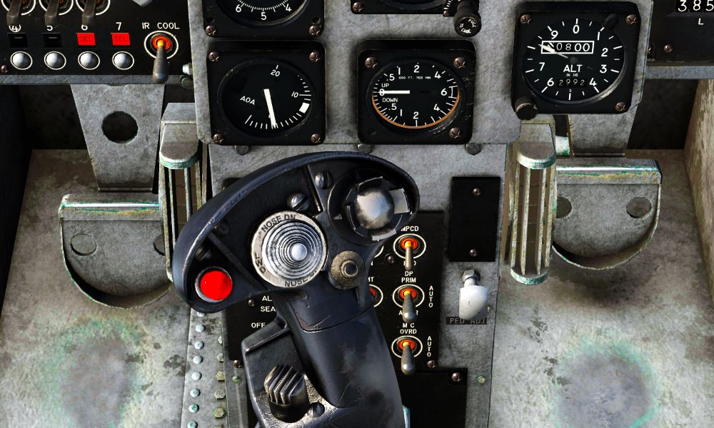

Rudder Pedal Shakers are controlled by the Ruder Pedal Shaker Switch,
which is located on the left console on Trim Panel. It has three
positions:

- **OFF:** Rudder Pedal Shaker is disabled.
- **ON:** Rudder Pedal Shaker is enabled.
- **TEST:** Allows the rudder pedal shakers to be tested on the ground. In
order to do this, the nose wheel steering should be enabled. Pilot
should hold the switch in TEST position and turn the aircraft while
taxiing, which causes a side force on the side of the forward pressed
rudder pedal and generate oscillation, as well as brief imposition of
the side force symbol on the HUD.

### REACTION CONTROL SYSTEM

During jetborne flight, control is maintained by a system of reaction
control valves, which use a bleed air supplied from the HP compressor,
through a master butterfly valve which is interconnected with the
engine nozzles control mechanism. It automatically opens whenever
nozzles are deflected from fully aft. Air supply is progressive as the
nozzles are lowered from 0° to 36° down.

The pressure of the air supplied is shown by the Duct Pressure
Indicator (2) located on the [Engine Display Panel](02.cockpit.md#engine-display-panel). When the nozzles are fully
aft, the pressure will oscillate between 0 and 3 psi. However, as the
nozzles are lowered, the psi increases.

The lateral and longitudinal controls are provided by control valves
located on the wingtips, nose and tail. They blow up or down,
depending on the stick actuation, giving more control for the pilot.
There also is a double tail valve used for directional control.

## SECONDARY FLIGHT CONTROLS

### FLAPS

The AV-8B is equipped with electro-hydraulic operated trailing edge
flaps, controlled by a dual channel electronic flap controller, a dual
system hydraulic control valve and two dual tandem actuators.

Depending on the position of the Flap switch on the [Landing Gear
Control Panel](02.cockpit.md#landing-gear-control-panel), current speed and whether the landing gear is up or
down, flaps will behave differently:

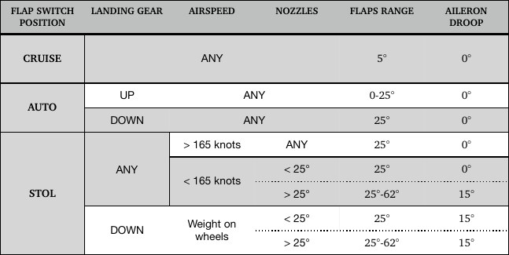

There are two primary switches responsible for operating the flaps.

Flaps Power Switch: a 3-position switch controlling the power flow to
the flaps.

- ON: Applies power to the Flaps Mode Switch and the Flaps Controller.
- OFF: Shuts off power to the Flaps Mode Switch.
- RESET: Momentary switch. When used, it resets the Flaps Controller
logic and cancels an initiated BIT.

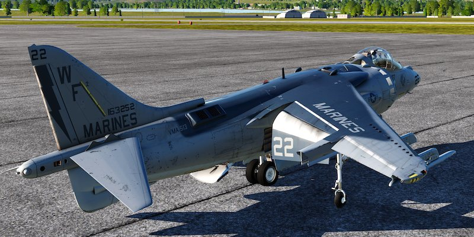

Flaps Mode Switch. This 3-position switch controls the position of the
flaps and aileron droop depending on the current airspeed.

- STOL: used for takeoff and landing. Provides variable flap angle and
aileron droop, as shown in the table above. Flap angle is variable based
on nozzle angle to prevent burning the flaps with the hot nozzles.
- AUTO: with the landing gear up and depending on the airspeed, Mach
number and angle-of-attack, the flaps will be scheduled between 0 and
25° with 0° of aileron droop. When the landing gear is down, provides
25° of flaps and 0° of aileron droop.
- CRUISE: provides 5° of flaps and 0° of aileron droop.

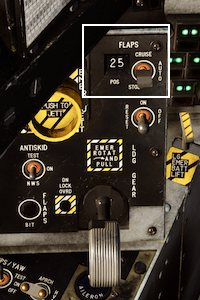
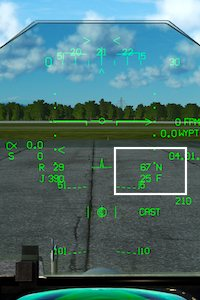

Current angle of the flaps is shown
on the flap position indicator and
on the HUD in the STOL Master
Mode. The number displayed
indicates the current position of the
flaps in degrees (between 00 and
98).

In case of failure of both flap channels and even if the Flap Power
Switch is off, pilot still can retract the flaps completely using
Emergency Flap Retract Button located on the throttle.

#### FLAPS WARNING / CAUTION LIGHTS

The green [[FLAPS]] light on the [Warning / Threat Light Panel](02.cockpit.md#stabilator-control-system) indicates a
dual channel flap failure or tells pilot that the flap power switch is set
to OFF.

The three flaps caution lights are on the [Caution / Advisory Light Panel](02.cockpit.md#caution-lights-panel):
[[FLAPS 1]] or [[FLAPS 2]] (but not both) indicates a failure in the flap system
without loss of function. The digital flap controller will keep the flaps
engaged as long as a valid signal path exists to control the flaps.
[[AUTO FLAPS]] caution light indicates the loss of AUTO mode
computation or air data computer input.

#### FLAPS IBIT

To perform the pilot - initiated Built In Test follow the steps below:

1. Set the flap power switch to ON. Ensure nozzles are set lower than
10°.
2. Press the flaps BIT switch on the landing gear control panel.
3. The Master Warning light will illuminate and the Flaps Position
(FLAPS POS) indicator will fluctuate between 25° and 5°, indicating
that the FLAPS BIT is being conducted.
4. When complete, your flaps caution and warning lights should
extinguish and your flaps should be at 25°.

### AILERON DROOP

Aileron droop is an automatic function in which neutral positions of the
ailerons are set to 15° down, producing greater lift in slow speed
regimes. See the table above for exact conditions in which the droop
will occur.

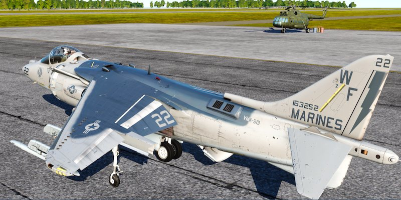

The pilot can verify that the ailerons droop by checking that the Aileron
Droop Light is illuminated on the Caution / Advisory Light Panel.

### SPEEDBRAKE

The electro-hydraulic operated speedbrake is hinged on the fuselage
underside, aft of the main landing gear.

The main principles of operation of the speedbrake are outlined in the
table below:

LANDING GEAR |  SPEED BRAKE POSITION | SPD BRK LIGHT |                        NOTES
-------------|-----------------------|---------------|-----------------------------------
UP           |        1 - 66°        |      ON       | Max travel is reduced as air speed increases
UP           |           0°          |      OFF      |
DOWN         |          25°          |      OFF      | Speed brake set to max 25° regardless of previous selection

The speedbrake is operated by a thumb - actuated switch on the
throttle, which has three positions:

- **OUT:** extends the speedbrake
- **NORM:** neutral position.
- **IN:** retracts the speedbrake

### STABILITY AUGMENTATION AND ATTITUDE HOLD SYSTEM (SAAHS)

Two basic modes of operation are Stability Augmentation System (SAS)
and Automatic Flight Control (AFC).

#### STABILITY AUGMENTATION SYSTEM (SAS)

The three SAS mode selection controls are the PITCH, ROLL and YAW
switches which engage the stability augmentation in the corresponding
aircraft axes. The stability augmentation system increases aircraft
stability and improves the response to pilot inputs in maneuvering flight
throughout the entire flight envelope. The yaw SAS also provides a
lateral stick to rudder inter-connect for improved turn coordination.

SAS is controlled by switches on the SAAHS panel located on the left
console.

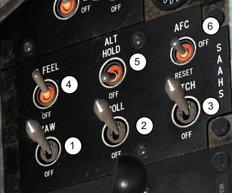

Pilot can engage or disengage the YAW (1), ROLL (2) and PITCH (3)
systems individually to provide stability augmentation in any desired
combination of the three axes. Q FEEL switch (4) is not part of the SAS.

!!! note
    Disengaging individual switches greatly reduces Departure
    Resistance system and can lead to violent spins and loss of control.

Pressing the emergency SAAHS disengage switch (paddle switch)
located on the control stick grip interrupts the stability augmentation
system in all three axes and also removes rudder trim. Releasing the
paddle switch restores stability augmentation to those axes selected by
the SAS switches and restores the rudder trim.

The departure resistance (DEP RES) improves lateral/directional
handling at low to moderate AOA and resists out-of-control departures
at AOA below and above the maneuvering tone. DEPRES is at all AOA
and varies in function depending on airspeed, Mach number and AOA.

##### SAS WARNING / CAUTION LIGHTS

The four SAS caution lights are on the [Caution / Advisory Light Panel](02.cockpit.md#caution-advisory-light-panel):

[[DEP RES]] light illuminates whenever, the in-flight computer detects
invalid sensor data or one or more SAS axes are disengaged by the
pilot.

[[PITCH]] light illuminates when the pitch axis is disengaged or not
functional.

[[ROLL]] light illuminates when the roll axis is disengaged or not
functional.

[[YAW]] light illuminates when the yaw axis is disengaged or not
functional.

#### AUTOMATIC FLIGHT CONTROL (AFC)

The Automatic Flight Control is an official name of the Harrier’s
autopilot. It is a relatively simple system allowing to pilot to hold
current pitch and roll - up to certain limits - as well as to make the
aircraft hold the current altitude.

In order for the AFC to work, several conditions need to be fulfilled:

- All three SAS switches need to be engaged
- INS needs to be in NAV mode
- Aircraft has to be airborne

AFC is controlled by two switches located on the SAAHS panel:

AFC switch, which has three positions:

- AFC: solenoid held position. Engages the AFC.
- OFF: AFC is off.
- RESET: Momentary position used for SAAHS reset.

ALT HOLD switch, which has two positions:
- ALT HOLD: solenoid held position. When engaged, it enables the
altitude hold mode of the AFC.
- OFF: altitude hold mode is off.

If any of the conditions mentioned above is no longer true, both AFC
and ALT HOLD switches will automatically disengage. ALT HOLD will
also disengage if AFC is switched off. Pressing the paddle switch on the
stick will also cause both switches to disengage.

##### AFC SWITCH ENGAGED, ALT HOLD DISENGAGED

When both the AFC switch is engaged and the ALT HOLD switch is in
the off position, the AFC mode provides pitch attitude hold, roll attitude
hold and heading hold within the following parameters:

AIRSPEED   |FLAPS   |GEAR    |MAX PITCH    |MAX ROLL                   |NOTES
-----------|--------|--------|-------------|---------------------------|---------
PITCH AND ROLL HOLD { colspan="2"}
<50 kts    |ANY      |ANY    |+3 to 12°*   |+/- 20°**     |\*If engaged within this range automatic roll to wings level **If engaged within -15° to +20° automatic pitch adjustment to given ranges
> 50 kts   |CRUISE/AUTO |UP  | +/- 30°     |+/- 60°       | If above 5° from wings level
HEADING HOLD { colspan="2"}
> 140 kts |   UP    |  UP    |   +/- 5°    |    -        |
> 0.3M    | STOL*   |DOWN*   |  +/- 5°     |    -        | \*if one of these is true, not both
ANY      | STOL    | DOWN       | N/A      |     -  | If engaged within +/- 5° roll automatic roll to wings level

If AFC is engaged above the pitch limit of 30° or roll limit of 60°, the
switch will remain ON, but the hold function will not work until the
aircraft is back within the limits.
Note: there is no indication in the cockpit (visual or sound) that the AFC is
disengaged or that it is engaged above the limits listed above.
With airspeed below 50 knots and -15° to +20° pitch limits or -20° to
+20° roll limits exceeded, the AFC will disengage automatically. The
same will happen at airspeed above 60 knots whenever true AOA goes
beyond 15°.
4.3.4.2.2 AFC SWITCH ENGAGED, ALT HOLD ENGAGED
When both AFC and ALT HOLD switches are engaged, altitude hold
function replaces the pitch hold. ALT HOLD will only work if the
following conditions are true:
• AFC switch is already engaged.
• Airspeed is greater than 160 knots.
• Climb or descend rate is below 2000 feet / minute.
• Pitch must be within ±30° and roll within ±60° limit
When engaged, the aircraft will maintain current altitude and selected
roll. ALT HOLD will be disengaged and revert to AFC only whenever
one of the events listed below occurs:
• There is an excursion in altitude of ±250 feet from the altitude
reference (altitude maintained during selection of ALT HODE mode)
• The altitude changes due to stick or trim inputs by a cumulative total
of more than ±250 feet following establishment of an altitude
reference.
• The altitude rate exceeds ±2000 feet per minute or airspeed falls
below 160 knots.
4.3.4.2.3 MANEUVERING IN AFC FLIGHT MODE
When the AFC is on, the pilot still retains some capabilities to maneuver
the aircraft. He can use the control stick and the manual trim switch to
lock the AFC onto new pitch attitude, roll attitude and heading
references without disengaging the AFC switch during the maneuvers.
When using the control stick for that, it is important to make very
delicate movements, as using too much force (1 pound in real aircraft)
will interrupt the AFC. Still, after returning to level flight on new
heading, the AFC should start working again.
Manual trim on the stick can also be used to make small attitude and
roll adjustments. Whenever the trim button is pushed, the AFC will
temporarily disengage and then re-engage again at the new roll or pitch
value.
However, if pitch manual trim button is clicked, the ALT HOLD will turn
off, reverting the airplane to AFC only mode.

## HANDS ON THROTTLE AND STICK (HOTAS)
The Harrier received the current HOTAS configuration during the
upgrade from the A model, which had very rudimentary controls. The
stick (together with MPCDs) was taken from the F/A-18 Hornet.

### CONTROL STICK
Control stick allows for left, right, fore, and aft movement for control
of the ailerons and stabilator. It also has 8 controls mounted on the
grip, making it a true HOTAS controller.
1. Sensor Select Switch. The sensor select switch is a six-position
switch (center off). It uses five momentary positions: forward, aft,
left, right and down. More info in Sensor Management section..
2. Trim Switch. Used for manual trimming of the aircraft. When the
trim switch is actuated, the actuator repositions the spring feel unit
which, in turn, moves the stick neutral position, causing the aircraft to
roll left or right, pitch up or down. See Primary Flight Controls section
for more information.
3. Waypoint Increment Switch (WINC). Used to change the currently
selected waypoint. See Navigation section for more information.
4. Air to Ground Bomb Pickle Button. Used to release air to ground
ordnance. See XXX section for more information.
5. Trigger. Hidden on the picture. Used to fire the GAU-12 cannon, as
well as launch Sidewinder and Sidearm missiles. See XXX section for
more information.
6. Emergency SAAHS Disengage Switch. Pressing the emergency
SAAHS disengage switch (paddle switch) located on the control stick
grip interrupts the stability augmentation system in all three axes and
also removes rudder trim. See Stability Augmentation System (SAS)
section for more information.
7. Air to Air Weapon Select Switch. This is a three-position
momentary switch that automatically selects the A/A master mode
when an A/A weapon selection is made. See XXX section for more
information.
8. Nosewheel Steering Switch. Used for controlling the sensitivity of
nose-wheel steering system, as well as Target Undesignate and FOV
toggle, depending on currently selected Sensor and / or Master Mode.
See XXX section for more information.

### THROTTLE
The throttle on the Harrier is mounted on the left panel in a larger
Throttle Quadrant. During the upgrade to the B model, the throttle
received serious updates and a number of controls added to the grip.
1. ECM Dispense Switch. Used for deploying countermeasures. See
XXX for more information.
2. Cage / Uncage Switch. Used to control some of the sensors and
weapons, mostly Maverick missiles. See XXX and YYY sections for more
information.
3. Slew Control / Designate Switch. Mostly used to control sensors -
especially DMT and TGP, but also the weapons. See XXX and YYY
sections for more information.
4. A/A Programming Switch. Not used in Night Attack version.
5. Antenna Elevation Switch. Not used in Night Attack version.
6. Airstart Switch. As the name implies, used in case of need to restart
the engine during flight. It is also pressed during normal start up to
check the igniters. See Emergency Procedures section for more
information.
7. Emergency Flap Retract Switch. Allows the pilot to retract the flaps
in case of failure of both flap channels. See Flaps section for more
information.
8. Comm Switch. It is a rocker switch pressed to enable radio
transmissions on COMM 1 or COMM 2 channel. See Comms section for
more information.
9. Speedbrake Switch. Used to extend and retract the speedbrake - see
relevant section for more information.
CHAPTER 5: ENGINE
5.1. INTRODUCTION
AV-8B Night Attack aircraft is powered by the Rolls Royce F402-RR-408
dual spool, axial flow, turbo fan engine with thrust-vectoring exhaust
nozzles.
The 408 engine is equipped with water injection and can develop a
nominal thrust of 23,400 pounds with water injection, or 22,200
pounds without water injection.

402-RR-408 Engine Source: globalsecurity.org

The engine works as follows: the air is drawn in through two intakes
and enters the Low Pressure (LP) fan. Then the air is divided, one flow
passing to an annular plenum chamber from which it is ducted through
cold nozzles located in the front, left and right side of the engine. The
other flow passes through variable inlet guide vanes, through the high
pressure compressor (HPC) and a combustion chamber to the high
pressure (HP) and low pressure (LP) turbines. Following that, it is
ducted through rear, left and right hot nozzles.
5.2. ENGINE CONTROLS
This part of the manual will cover the throttle, nozzles control lever and
the JPTL switch.
5.2.1 THROTTLE
The throttle is located on the left console (see Throttle section for
description of the HOTAS function). When the throttle is fully aft, the
high pressure fuel shutoff valve is closed and cuts off fuel supply to the
engine fuel gallery and drains the remaining fuel into a small collector
tank. Forward movement to the idle rpm position opens the shutoff
valve and a ratchet stop prevents movement back except when a spring
loaded throttle cutoff lever, on the front of the throttle, is lifted.
On the other side there is a spring loaded full throttle stop. If the
throttle is pushed hard against this and compresses it, the jet pipe
temperature limiter (JPTL) switch is switched OFF.
There is also a parking brake lock that makes it impossible to advance
the throttle until the lock is moved forward.
5.2.2 NOZZLE CONTROL LEVER / STO STOP
1. Nozzle Control Lever is used to move the four nozzles from
horizontal (fully aft) to nozzle braking position (at 98.5°).

The engine datum is at 1.5° to the fuselage datum, therefore the nozzle
angle for hovering is 82° from the engine datum. To recapitulate, the
most important nozzle positions are listed in the table below:

Position     Degrees                          Notes

Fully aft      0°      Used during cruise flight

Taxi         10°     Used during taxiing

Hover         82°     For vertical take off / landing

98.5°    Used to slow down (both in the air and on the
Braking Stop
ground)
2. Short Take Off (STO) Stop Lever is an aid meant to help the pilot
rapidly select a preset nozzle angle between 35° and 75° in 5°
increments (as indicated on the scale located between the nozzle and
STO STOP). What it does it blocks the travel of the Nozzle control lever
beyond a certain angle set by placing the STO Stop in the given
position.
If the STO Stop Lever is not in use, it should be immediately moved fully
aft, as otherwise it could prevent using the nozzles in their full range.

Nozzles set to 0° (fully aft)        Nozzles set to 10° for taxi

Nozzles set to 82° (hover stop)        Nozzle set to 98.5° (braking stop)
5.2.3 CMBT SWITCH AND LIGHT
When the switch/light is first pressed, a green SEL light
comes on indicating combat thrust rating is operational
and armed for wing borne flight.
With the SEL light on, gear up, and nozzles aft, a green
CMBT light comes on when JPT reaches 715° Celsius
and the RPM is limited to 111%. If JPT remains at or
above this temperature for 2.5 minutes, the CMBT light
will start to flash.
Pressing the switch/light a second time disables the
combat datum and turns off the light(s). With the combat mode switch
disabled, max rpm will be restricted to 109% when above 250 knots
during Thrust Vectoring Control (nozzles greater than 11° to 17°).

5.2.4 JPTL (JET PIPE TEMPERATURE LIMITER) SWITCH
The JPTL switch is located in front of the throttle. If turned off, it mutes
the DECS JPT limits, resulting in rise in RPM, Fuel Flow, and Jet Pipe
Temperature on the EDP. An audible warning can be heard and JPTL
light will start flashing on the master warning panel. The JPT limiter
uses thermocouples in the turbine exhaust sample gas temperature to
limit the RPM in different flight configurations, known as datums.
In real aircraft if sufficient pressure is used on the throttle, it will move
forward and push the JPTL switch to off. This procedure is rarely used, but
would allow for temporary and quick rpm gain if necessary.
5.2.5 IGNITION SYSTEM
During engine start, fuel is pumped, via the torch igniter valve, into a
vaporising chamber through two primer jest adjacent to the two torch
igniters and three auxiliary primer jets.
5.2.5.1 Airstart Switch. The airstart button is located on the front of the
throttle. It is used during the normal startup procedure to check the igniters:
if it is pressed before the engine start, the ignition system is energized and
will remain so until the button is released, and the irregular crackle of the
igniters can be heard; this is a preflight check of the torch igniters.
When pilot presses the airstart button as part of the pre-flight checks, the
crackle of the igniters will be irregular. A regular crackle indicates failure
of one of the igniters. The right-hand boost pump should also turn on in
DC mode to pump fuel into the engine, making the R PUMP light go out.
This button is also used during emergency in-flight engine restart.
5.2.5.2 Ignition Isolation (IGN ISO) Switch. It is located on the
ground power panel is lever-locked to the OFF position. With the switch
in OFF, ignition is automatically provided during engine start. Placing
the switch to ON disables the normal start ignition and allows the
engine to be wet or dry cycled without ignition.
5.2.5.3 Engine Start Switch. The engine start switch is located on the
right console. Placing the switch to ENG ST initiates the GTS and
engine starting sequence
5.2.5.4 DECS Enable Switch. Located on the rear - left panel. DECS
stands for Digital Engine Control System - which provides engine
control throughout the engine operating range in response to throttle
position, altitude, airspeed, AOA, inlet air temperature, and aircraft
configuration. It needs to be enabled before the engine start.
5.2.5.5 Manual Fuel Switch. The MFS provides an alternate means of
engine control if the primary fuel control system fails. Engine handling
and relighting are adequate for emergency recovery. MFS is selected by
actuation of the MAN FUEL switch located in the striped area of the
throttle quadrant panel.
5.2.6 WATER INJECTION SYSTEM
The water injection system enables rpm to be increased for a given
turbine entry temperature to sustain short lift wet and normal lift wet
ratings. The main components consist of a water tank, air turbine
pump, water filter and pressure switch, water manifold injectors,
engine fuel control, bleed air supply, a short lift thrust relay, an airspeed
relay and an H2O control relay. A flow control valve allows warm air to
heat the system components at low temperature to keep them from
freezing.
The water tank is located in the engine bay, just aft of the engine. It
contains approximately 500 pounds of distilled or demineralised water
lasting for 90 seconds of flow.
5.2.6.1 Water Injection Switch. This 3-position switch
controls the flow of water used for cooling down the
engine during takeoffs and landings.
TO (Takeoff): Takeoff position (up). In this position,
water injection system is armed and the engine controls
provide supplementary fuel, resulting in increase of rpm
by between 6% and 7%.
Water flows if the throttle is set above 105% rpm.
After takeoff, water continues to flow until airspeed exceeds 250 knots,
water is depleted, OFF is selected, or the throttle is moved below 103%
rpm.
OFF: water flow is disabled.
LDG (Landing): Landing position (down). In this position, water
injection system is armed and the engine controls provide
supplementary fuel, resulting in increase of rpm by between 6% and
7%.
Water flows when the speed is below 250 knots, jet pipe temperature
exceeds 765°C.
Water flow stops only if water is depleted, OFF is selected, or the
throttle is moved below 103% rpm.
5.2.6.2 Water Dump Switch. Located on the left panel. This switch can
be used to dump water from the tank by selecting DUMP position.
5.2.6.3 Water Injection System Warning / Caution Lights
A green water light is illuminated on the Engine Display Panel
whenever the water is flowing. A “W” will also be visible on the HUD
whenever the power margins are exceeded (check power margin
indicator for more information).

There are also additional lights on the caution / advisory light panel
and on caution lights panel:

H2O SEL caution light on the caution/advisory light panel comes on if
the water switch is in TO or LDG and airspeed is above 250 knots.
15 SEC caution light on the priority caution panel comes on when
water injection is selected and less than 15 seconds of water remains.
The light stays on after all water is consumed or until the water switch
is placed to OFF. A WATER, WATER voice warning is provided in
conjunction with the H2O caution light.
5.3. ENGINE DISPLAYS
Engine displays are provided by the engine display panel (EDP), HUD,
and DDI. Various warning and caution lights are provided to notify the
pilot of conditions which would hinder engine performance.

5.3.1 ENGINE DISPLAY PANEL
The EDP is on the right side of main instrument panel and consists of
six drum-type indicators for display of reaction control system duct
pressure, fuel flow, stabilator trim position, selected engine rpm, jet
pipe temperature (JPT), and water quantity. A dial type indicator
displays nozzle position and a green’W’ FLOW light indicates water
flow.

1. Engine Display BIT Switch: enables the BIT sequence for the EDP.
During the test, the tumblers will rotate through available numbers,
and the Overtemp, 15 Second, and water flow lights should illuminate.
After a successful BIT, all lights will extinguish and the nozzle indicator
will return to the selected nozzle angle.
2. Duct Pressure Indicator. Displays reaction control system duct
pressure in pounds per square inch. See Reaction Control System part
for more information.
3. Fuel Flow Indicator. The fuel flow indicator displays engine fuel
flow in pounds per minute.
4. Stabilator Position Indicator. The stabilator position indicator
displays stabilator position in degrees nose up or nose down - shown by
a vertical arrow pointing either up or down on the left drum.
5. Tachometer. Displays engine speed in percent rpm. A fixed decimal
point is placed between the tenths and unit drums. An ENG RPM SEL
(select) switch, on the left console, selects HI (compressor) or LO (fan)
rpm display.
6. Jet Pipe Temperature Indicator. The JPT indicator displays JPT in
°C.
7. Water Quantity Indicator. Displays pounds of water remaining in
units of ten. The tens and hundreds digits change while the units digit
is a fixed display indicating zero.
8. Nozzle Position Indicator. Displays nozzle position in degrees. The
scale is graduated in units of twenty and the range is from 0° to 120°.
9. Water Flow Light. Comes on displaying a green ‘W’ when water
injection is selected and water is flowing. If the flow light (W) does not
come on, indicating no water flow, the lift rating JPT limit can be
reached very quickly.
10. Brightness Knob. Located in the lower right - hand corner, used to
adjust the back lighting of the EPI/EDP.
5.3.2 ENGINE HUD DISPLAYS
Some of the engine data is also displayed on the HUD, depending of the
selected Master Mode. In the VSTOL mode the following information is
available:

1. Engine RPM (R): mirrors the information shown on Tachometer,
displaying the engine speed in percent rpm.
2. Jet Pipe Temperature (J): Displays JPT in °C.
3. Whenever the Threshold limits are reached for JPT and / or RPM,
both indicators above are replaced with the Power Margin Indicator
for either rpm or JPT, whichever is higher. See the table below for more
details on that.
4. Water Flow Indicator appears when the Water switch is in either TO
or LDG and the water is flowing into the engine.
Whenever REJ 1 is selected for the HUD, the Power Margin Indicator is no
longer shown, and normal R and J values are displayed. With REJ 2, also
R and J are removed from the HUD.
5.3.2.1 POWER MARGIN INDICATOR
The threshold reached first determines whether R or J power margin is
displayed. If RPM or JPT is still increasing after completing the
hexagon, the last leg of the hexagon continues in a straight line. The
length of the line is proportional to the increase in RPM or JPT.

RPM %                               JPT C°

DRY        WET                     DRY         WET

107.0       113.5                   715         735

108.0       114.5                   725         745

109.0       115.5                   735         755

110.0       116.5                   745         765

111.0       117.5                   755         775

112.0       118.5                   765         785

113.0       119.5                   775         795

113.5       120.0                   780         800

Dry Thrust means the thrust obtained without the water injection.
Wet Thrust means the thrust obtained by injecting the water.
5.3.3 ENGINE MPCD DISPLAYS
There is a separate page on the MPCD dedicated to the engine,
displaying very specific information for each sortie. In order to access it,
press the P/B 11 marked ENG. You will see the following data:
1. Engine ID. Displays the engine identification (408)
2. Engine Life Count. Provided in hours, summarises the number of
hours the engine has been used for, up to maximum of 50 000 for the
-408.
3. Sortie JPT displays the highest JPT for the current flight. It may be
reset by the pilot by pressing the JPT button (11).
4. Maximum JPT (MAX JPT) shows the all-time highest JPT
temperature. This value can not be reset by the pilot.
5. Overtemperature Time (OT TIME) displays the total time of
overtemperature for the given sortie. Cannot be reset by the pilot.
6. Stabilator position shows the current angle of stabilator, together
with an arrow indicating up or down deflection.
7. The middle block displays various engine data, including the inlet
guide vane angle (IGV), compressor rpm (COMP RPM), corrected high
pressure compressor rpm (corrected for standard day, COR RPM), fan
rpm (FAN RPM) and corrected fan speed (corrected for standard day,
COR FAN), Jet Pipe Temperature (JPT), and fuel weight (FUEL WT).
When the FRZ button (12) is pressed the fan rpm, JPT, and fuel weight
are recorded in the hover column (14), plus additional information on
the PHOV page, provided that pilot accepts the readouts using an
option on the ODU.
8. Acceleration part shows the applicable engine rpm range. The -408
engine display has two rpm ranges (35 to 60% and 60 to 105%). The
acceleration times are reset to 0.0 seconds by pressing the ACCEL (13)
button.
9. EMS button selects the incident summary display.
10. PHOV button selects the performance hover checks (see below).
5.3.3.1 PHOV PAGE
Aircraft with the PHOV option incorporate a function to manually
freeze engine data during a hover. The pilot is given options to accept
and store data for three individual performance hovers and to reject or
clear any data not deemed valid.
In order to use the PHOV option, pilot should enter the hover and press
P/B 20 on engine page to freeze current hover data, and then use the
ACCEPT option on the ODU (he can also REJECT it).
1. PHOV option switches between the ENG and PHOV pages.
2. HOV 1-2-3 allows the pilot to select one of three engine data points
stored by the use of FRZ option. They will be displayed as HOV1, HOV2
and HOV3.
3. HOVER 1-2-3 indicates which of the three points is being currently
displayed.
4. DRY / WET indicates whether the hover was a dry or a wet one.
5. DATA BLOCK contains the following information about the hover:
STAB - stabilator position
RPM - compressor rpm
JPT - jet pipe temperature
FUEL - fuel quantity in pounds
HWT - aircraft total weight in pounds
OATC - outside temperature in degrees Celsius
BALT - barometric altitude
ALTM - altimeter setting
RALT - radar altitude
STPR - static pressure at hover height
RHOV - relative hover performance
RJPT - relative jet pipe temperature
6. HCLR allows the pilot to clear stored hover data.
5.3.4 ENGINE WARNING / CAUTION LIGHTS
The engine warning/caution lights consist of the FIRE, OT, JPTL, and
EFC warning lights on the master warning lights panel and the 15 SEC
caution light on the master caution light panel.
FIRE The fire warning light, on the right main instrument panel, comes
on if a fire condition is sensed in any of the engine bay zones. An
ENGINE FIRE, ENGINE FIRE voice warning is provided in conjunction
with the FIRE warning light.
OT The overtemperature warning light and OT XXX legend under the
airspeed box on the HUD display, comes on if the JPT exceeds 820°C.
The OT warning light goes out after the JPT is reduced below 816° C.
An OVERTEMP, OVERTEMP voice warning is provided in conjunction
with the OT warning light.
JPTL warning light comes on if the JPTL switch is OFF. A LIMITER OFF,
LIMITER OFF voice warning is provided in conjunction with the JPTL
warning light. Illumination of thIS light can signify any one of four
faults:
1. JPTL switch is set to OFF.
2. Failure of JPT limiter function within the DECU in use.
3. When illuminated in conjunction with an EFC caution, either
electrical power to a DECU has been lost or a DECU has failed and
the JOT limiter has failed in the DECU in use.
4. A failure has been detected in one or more of the DECU state
inputs.
15 SEC caution light, on the priority caution light panel, comes on
steady if the JPT exceeds the short lift dry or short lift wet threshold,
which is 765° and 780° C respectively. If the JPT remains at or above
the threshold over 15 seconds, the 15 SEC light flashes. If the JPT
decreases 4° below the threshold the 15SEC light will go out. A
FIFTEEN SECONDS, FIFTEEN SECONDS voice warning is provided in
conjunction with the15 SEC caution light.
EFC Warning Light is located on the warning light panel. The light
comes on when both DECUs have failed, or if both DECUs are not
powered on. A “FUEL CONTROL, FUEL CONTROL” voice warning is
provided in conjunction with the EFC warning light.

EFC Caution Light is located on the caution/advisory light panel. The
light comes on when either DECU is failed regardless of the EFC switch
position or if either DECU is not powered on. A CAUTION, CAUTION
voice warning is provided in conjunction with the EFC caution light.The
EFC caution light will come on momentarily when the EFC switch
position is changed.

MFS caution light is located on the priority caution light panel. It
illuminates any time the engine fuel system is in the manual fuel mode.
If the MFS caution light illuminates when operating under DECS
control, MFS should be selected ON. A MANUAL FUEL, MANUAL FUEL
voice warning, is provided in conjunction with the MFS caution light.
5.4 ENGINE LIMITS
The main visual cue of reaching the limits of the engine are R and J
hexagons described in the previous section. As rule of thumb, the pilot
should avoid remaining in the excessive engine setting for too long.
Below some additional information about the engine limits:
LIMITATIONS
RATING          NOTES
MAX %       MAX C° JPT   COMBINED TIME LIMITS
RPM
SHORT LIFT WET            1        120.0          800
15s 1.5
SHORT LIFT DRY                     113.5          780                 2.5
M
M     10
NORMAL LIFT WET          1,2       116.0          780                            15
M
NORMAL LIFT DRY           2        111.0          765                            M

COMBAT                             111.0          750

MAXIMUM THRUST                     109.0          710

MAXIMUM CONTINUOUS        2        102.0          645             UNLIMITED

IDLE                      5      28.4 - 29.0      545             UNLIMITED

STARTING                 2,4                      475          MOMENTARILY

NOTES:
1. Do not use water injection below ambient temperatures of -50C or at
altitude above 10,000 feet.
2. Requires pilot action to maintain limit.
3. Each 2.5 or 10.0 minute period of operation at the lift or combat
ratings respectively must be separated by a minimum of 1 minute at
maximum thrust or below.
4. Slow or abortive starting attempts should be discontinued without
waiting for JPT to reach 475C.
5. The minimum allowable sub-idle RPM is 22%
5.5 GAS TURBINE STARTER / AUXILIARY POWER UNIT
The Gas Turbine Starter is used for engine ignition. It uses onboard fuel
system supply and requires the battery switch to be set to BATT position
to work. The electric starter motor is energised by placing the engine
start switch to the electrically held ENG ST position, which engages the
GTS output shaft to the engine. The GTS ignition and fuel control
systems are automatic and the GTS starts and accelerates to operating
speed within 25 seconds.
If the GTS is operating in the APU mode (APU generator operating),
engine start is accomplished by placing the engine start switch to ENG
ST. In this condition, the GTS/APU engages a brake and slows the GTS
to allow a translational start to begin. The APU generator drops off the
line as the GTS slows down, the APU switch automatically returns to
OFF, the 40 second GTS shut down protection circuit is activated and
the main engine is automatically engaged for start, assuming the GTS
has been slowed to a safe RPM. The APU advisory light comes on
whenever GTS/APU operation is selected and the APU is ready to
accept an electrical load. More information on APU mode operation,
can be found in XXX.

5.5.1 GAS TURBINE STARTER / AUXILIARY POWER UNIT CAUTION LIGHT

APU Caution Light is located on the Caution / Advisory Lights Panel. It
comes on whenever the GTS is operating in either the engine start or
APU mode.
CHAPTER 6: FUEL SYSTEM
6.1. FUEL SYSTEM
The fuel system of the AV-8B Harrier consists of seven integral tanks
(five fuselage tanks and two internal wing tanks). There is also a
possibility to carry up to four externally mounted tanks, which are
droppable. The tanks are divided into two feed groups:
• the left feed group, which consists of the left external tank(s) (when
installed: 10,11), left internal wing tank (3), left and right front tanks
(1, 4) and the left center feed tank (2).
• the right feed group consists of the right external tank(s) (when
installed: 8, 9), right internal wing tank (6), rear tank (7) and right
center feed tank (5).
The capacity of each of the tank can be found in the table below:
LEFT FEED GROUP        TOTAL (L+R)       RIGHT FEED GROUP

TANK           POUNDS     POUNDS      POUNDS            TANK

Center Feed        320        640          320          Center Feed

Left Front        547
2188         1094            Rear
Right Front        547

Internal Wing      2465.5      4391        2465.5       Internal Wing

Total Internal     3879.5      7759        3879.5           Total

External Station 2    1917       3834         1917      External Station 6

External Station 3    1917       3834         1917      External Station 5

Total Maximum        7915      15830         7915       Total Maximum

Fuel transfer is automatic anytime the engine is running. It is normally
accomplished by utilising regulated sixth stage engine bleed air to
pressurise the fuel tanks. Pressure is applied to, and transfer starts
from, the outboard external tanks to the inboard external tanks (if
installed) to the internal wing tanks and from them to the left and right
front tanks (left feed group) or the rear tank (right feed group). From
there fuel goes to the respective, left or right, center feed tank where a
boost pump supplies the engine via the flow proportioner.

6.1.1 FUEL BOOST SYSTEM
Fuel is supplied to the engine by the electrical fuel boost pumps (ac or
dc powered) and a fuel proportioner, the latter being responsible for
making sure that equal amounts of fuel are consumed from each feed
tank.
If the proportioner fails, the fuel levels will probably go slowly out of
balance. In this case, the boost pump associated with the low level
should be shut off until balance is regained.
There are four electrically driven boost pumps, two in the lower portion
of each center feed tank. During normal operations, fuel is supplied to
the engine by the ac driven pumps.
During the ground engine start, only the right dc pump supplies fuel to
the engine. However, after the engine reaches self-sustaining rpm, dc
pump goes offline and ac pumps take over.
Each pump is enclosed in a negative g chamber for limited inverted
flight.
At maximum power and with at least 300 pounds of fuel in each feed
tank, approximately 15 seconds of fuel is available to the boost pumps
during negative G flight.
6.2 FUEL SYSTEM DISPLAYS AND CONTROLS

6.2.1 FUEL SHUTOFF HANDLE

This hello and black striped handle is located on the left wall just aft of
the left console. When the handle is OFF, the aircraft fuel system is
isolated from the engine and the fuel flow proportioner is shut off. The
handle can be moved down to the ON position where it will be locked.
To put it back up, a button on the end of the handle has to be pressed.
6.2.2 BOOST PUMP SWITCHES
These switches, located on the Fuel Panel,
operate the four boost pumps, two in each of
the feed tanks. The ac driven pumps (NORM)
only operate with the main generator online
or external electrical power applied. The dc
driven pumps will operate with external
power, main generator, emergency generator,
or battery. They can be used in conjunction
with the PROP switch to correct a fuel
imbalance by turning OFF the low side.

6.2.3 FUEL PROPORTIONER SWITCH
Located on the Fuel Panel on the left console.
The function of the fuel flow proportioner is
to equalize the flow of fuel from the two feed
groups. This switch provides a means of
shutting off the proportioner if a fuel out of
balance correction is needed.
Fuel balance should be maintained for the
following reasons:

1. To prevent excessive lateral unbalance of the aircraft with fuel in the
internal and external tanks.
2. To maintain the aircraft center of gravity within longitudinal limits
after the wing tanks are empty.
3. To prevent one feed tank from becoming empty before the other.
6.2.4 WING FUEL DUMP SWITCHES.
External and internal wing fuel may be
dumped in flight by selecting the DUMP
position on the wing fuel dump switches.
There are two electro-magnetically held
switches, on the left console, marked L (left)
and R (right). Both switches may be used
simultaneously in order to reduce gross
weight, or individually when pilot wants to
correct out of balance conditions.
Fuel will continue to dump until the internal wing tanks are empty, the
switches are placed to NORM or if fuel setting in the BINGO window
equals the remaining total fuel.

6.2.5 FUEL QUANTITY INDICATOR
The fuel quantity indicator is on the right main instrument panel. It has
four display windows, a BINGO set knob, a seven-position selector
switch, and an ON/OFF indicator.
1. Total fuel quantity (TOT): displays total usable fuel in increments of
100 pounds.
2. Left Display (L): displays usable fuel in the left feed group in
increments of 50 pounds.
3. Right Display (R): displays usable fuel in the right feed group in
increments of 50 pounds.
4. Bingo Window and Knob: The Bingo Set Knob is used to set the
BINGO window in increments of 100 pounds. Once total fuel level
reaches set value, Bingo Master Caution light will turn on together with
the associated warning tone.
5. Fuel Quantity Selector Switch: it has seven different positions:
• BIT: A spring loaded position that starts built-in-test of the system.
• FEED: Fuel remaining in respective center feed tank is displayed.
• TOT: Total fuel remaining in respective feed group is displayed.
• INT: Fuel remaining in internal tanks of respective feed group is
displayed.
• WING: Fuel remaining in respective internal wing tank is displayed.
• INBD: Fuel remaining in respective inboard external tank is displayed.
• OUTBD: Fuel remaining in respective outboard external tank is
displayed.
The fuel quantity selector switch should be placed to the position that best
describes the aircraft state. If external tanks are used, the TOT position
will present the most accurate fuel indication. With internal fuel only, the
INT position is more accurate and should be used. When aircraft total fuel
is below 750 pounds, the FEED position will most accurately indicate the
fuel remaining in the respective center feed tank.
6.2.6 FUEL SYSTEM WARNING AND CAUTION LIGHTS
The following caution and warning lights are associated with the fuel
system:
L TRANS R TRANS lights are located on the caution lights panel. When
illuminated, they indicate that the fuel pressure at the inlet to the
respective center feed tank has dropped to a point where fuel transfer
into the center tank may be insufficient.
L TANK R TANK, Tanks Overpressurised / Over temperature warning
lights. Located on the master warning lights panel, they indicate that
the pressure in the corresponding feed group is approaching a level
where structural damage to the tank may occur or that the bleed air
temperature is above a safe level.
PROP caution light, on the caution light panel, comes on if the
proportioner fails or is shut off electrically. If the electrical power supply
to the PROP switch fails, the proportioner light will come ON regardless
of the switch position.
L FUEL R FUEL lights are located on the priority caution light panel.
When the internal fuel level in either feed group drops to between 700
and 800 pounds of actual fuel, the corresponding (L or R) FUEL caution
light illuminates steady. When the internal fuel level in either feed
group drops to between 200 and 300 pounds of actual fuel, center feed
tank only, the corresponding (L or R) FUEL caution light flashes.
BINGO light is located on the priority caution light panel. Comes on
when the total fuel reaches a value preset by the pilot via the Bingo
Knob on the Fuel Quantity Indicator. A BINGO, BINGO voice warning is
provided in conjunction with theBINGO caution light.
LOAD caution light on the Caution / Advisory Lights Panel will come on
whenever lateral fuel asymmetry exceeds 103,000 ±20,000inch-
pounds.
6.3 AIR TO AIR REFUELLING
While AAR is very important for all naval aircraft, it is even more
crucial for the Harrier, which not only possesses a limited fuel capacity
compared to most other attack aircraft but sometimes needs to forgo a
full fuel load in order to take off from short runways with plenty of
ordnance. Therefore the standard operating procedure would be to get
airborne with enough fuel to rendezvous with the tanker, then top off
and carry on with the mission.

6.3.1 AIR REFUELING SYSTEM

A retractable air refueling probe is installed above the left inlet, slightly
behind the cockpit. When extending it is using the HYD 1 pressure.
The following elements are part of the air refueling system:
6.3.1.1 Air Refueling Switch.

This switch is used to extend and retract the air refueling probe. It has
three positions:
• IN - the probe is retracted with tanks pressurized.
• OUT - the probe is extended and pressurization of the tanks stops.
• PRESS - leaves the probe extended but keeps the fuel tanks
pressurized, so no refueling is possible.
6.3.1.2. AAR Advisory Lights

1. READY Light. Located on the windshield arch. When the A/R switch
is placed to OUT, the READY light comes on after the probe extends and
locks. When refueling begins, the light goes out. After refueling, the
light comes on and stays on until the A/R switch is placed to IN and the
probe is fully retracted and locked. The light should not be on with the
A/R switch in PRESS.
2 -3. LEFT and RIGHT Full Advisory Lights. These lights also sit on
the windshield arch. On a clean aircraft or when only two external
tanks are installed, each light flashes when its corresponding feed
group is full. However, when four external tanks are installed, the LEFT
or RIGHT light comes on steady when the corresponding inboard
external tank is full, then flashes when the feed group is full. The lights
should not be on with the A/R switch set to IN or PRESS.
6.3.1.3 Air Refueling Probe Light. It is located on the AAR Probe and
automatically turns on whenever the Air Refueling Switch is set to OUT
and exterior master light switch is in EXT LT. It is used during night air
refuelling to illuminate the refuelling probe and drogue.

6.3.2 AIR TO AIR REFUELING ZONES
It is possible to set up special AAR zones for up to three waypoints in
the Mission Editor. These will be shown on the EHSD as light - blue
circles if OL1 is selected. See this section for more information.
6.3.3 AIR TO AIR REFUELING TIPS
AAR in the Harrier is not an easy task, especially due to the position of
the probe which is outside the pilot’s field of view. It therefore requires
a lot of practice to master.
In this excellent video, 104-Maverick goes through the whole AAR
procedure. This is a good starting point to get the hang of basics.
Below some additional tips that should make it easier during your own
refueling runs.
• stay calm and keep your head cool. If at some point you will be
getting nervous, return to pre-contact position, take a few deep
breaths and start all over again when you are absolutely calm.
• Align the refueling probe horizontally and vertically with the basket.
What that means in practice is that you will want the heading caret
to point at a spot on the wing roughly between the nacelle and the
outer engine of the KC-130. For the vertical alignment, try to line the
hose up with the top of the left mirror.
• Fly formation with the tanker, and not with the drogue. Second,
make small, smooth inputs with your stick for vertical corrections
and your rudder for horizontal corrections. It isn't advised to use
your ailerons since this displaces the probe in both the horizontal and
vertical planes.
• Remember that the aircraft needs some time to react to your throttle
inputs. Bear that in mind when increasing or decreasing the speed.
• Never chase the basket. Reduce the throttle and return to your initial
position, align yourself with the tanker and start all over again.

It is recommended that you fly Training Mission 7, which covers all the
relevant information about the fuel system and air to air refuelling
techniques.
CHAPTER 7: ELECTRICAL AND
HYDRAULIC POWER SUPPLY SYSTEM
7.1 INTRODUCTION
The electrical power supply system consists of a main generator, an
emergency generator, also called an Auxiliary Power Unit (APU), two
transformer-rectifiers, a battery, and a power distribution (bus) system.
External electrical power can be applied to the bus system on the
ground, which can be controlled using the Ground Power Panel.

7.2 ELECTRICAL PANEL

1. Generator Control Switch. Used to control the Main Generator,
which is a an engine driven 30 KVA, variable speed constant frequency
generator that supplies 115/200 volt, 3 phase, 400 Hz alternating
current to the aircraft main and essential ac buses, and to the main and
standby transformer-rectifiers (TRUs).
This switch has three positions:
• GEN: allows main generator to come online.
• OFF: Removes main generator from the line. Position is also used
when cycling generator protective functions after a malfunction to
allow reset.
• TEST: Position used for ground test by Plane Captain. \

2. Battery Switch. Needs to be set to ON before attempting to start
GTS and Engine. It has three positions:
• BATT: standard operating procedure. In this position battery is
recharged by one of the TRUs.
• OFF: battery is OFF.
• ALERT: used to check the battery voltage. In this position battery is
isolated from TRUs and therefore is not being recharged.

3. APU GEN (Auxiliary Power Unit) Switch. The Harrier is equipped
with a 6KVA emergency generator, installed as a backup for the main
generator. It is driven by a gas turbine starter (GTS) and can be used
either for translational engine starting when on the ground or as
standby generator when in flight (taking over whenever main generator
drops off-line). During ground alert, APU can be used to recharge the
battery. It has three positions:
• OFF: APU is powered off.
• ON: powers up the APU. If BATT is on and ENGINE START SWITCH is
off, it starts the gas turbine starter (GTS/APU). Otherwise, it puts the
APU in the standby mode if selected after the engine is started.
• RESET: used to bring APU back on the line after a fault is detected.

4. DC Test Switch. It is use for checking the operation of electrical
system in case of failure of main or standby TRU (Transformer-rectifier
unit). It has three positions:
• MAIN: disables standby TRU.
• NEUTRAL: off
• STBY (standby): disables the main TRU.

5. DC Voltmeter. Indicates voltage on the alert 24/28 volts dc bus. The
voltmeter indicates battery voltage when the battery switch is in ALERT
and emergency dc bus voltage when the battery switch is in BATT. The
most accurate indication of battery condition is with generators off and
the battery switch set to BATT.

7.2.1 ELECTRICAL POWER SUPPLY SYSTEM WARNING AND CAUTION LIGHTS
The following caution and warning lights are associated with the
Electrical Power Supply System:
GEN Generator Warning Light is located on the Warning Lights Panel.
The light comes on whenever the main generator is off the line. A
GENERATOR, GENERATOR voice warning is provided in conjunction
with the GEN warning light, and the MASTER WARNING light comes
on.
APU GEN APU Generator Caution Light is located on the Caution /
Advisory Lights Panel. It comes on whenever the emergency generator
system malfunctions with the APU on.
DC Caution Light is located on the Caution / Advisory Lights Panel. It
turns on whenever a failure of the main TRU is detected. Works with
conjunction with the MASTER CAUTION light.
STBY TR Caution Light is located on the Caution / Advisory Lights
Panel. It turns ON whenever the standby TRU is off the line and is not
charging the battery. The light operates in conjunction with the
MASTER CAUTION light.
7.3 EXTERNAL ELECTRICAL POWER
External electrical power may be connected to the aircraft bus system
through an external electrical power receptacle on the left side of the
aft fuselage. The battery switch must be in the BATT position in order to
apply external power. The aircraft buses are energized by external
power in the same manner as if the main generator were operating.
However, some air- craft systems will not energize upon application of
external power. Power control for these systems is provided by ground
power switches.

7.3.1 GROUND POWER CONTROL PANEL

1. IGN ISO (Ignition Isolation) Switch: With the switch in OFF
position (default), ignition is automatically provided during engine
start. Placing the switch to ON disables the normal start ignition and
allows the engine to be wet or dry cycled without ignition.
2. JPTL Test Switch: it has three positions, AMP, OFF and MAX. The
switch is spring loaded to the OFF position. The MAX and AMPL
positions are for maintenance use only and should not be selected by
the pilot.
3. MISC (Miscellaneous) Switch: applies power to TACAN, external
lights and RWR.
4. DSP / FLT (Display / Flight Instrument) Switch: applies power to
HUD, EDP, FLIR, inverter, UFC, VRS, MPCDs, DSS, DVMS, ADC, SAAHS,
as well as flight displays and indicators
5. CNI (Communication, Navigation, Identification) Switch: applies
power to mission computer, radar altimeter and beacon, KY-58, radios,
ECM, RWR, IFF, INS, DECM and DVMS.
6. Stores Switch: it has two positions.
• ACP: in this position applies power to the Armament Control Panel
only
• SMS: in this position applies power to Stores Management Computer,
Armament Control Panel, TACTS and DECM.

NOTE: Ground Power Control Panel is not functional at the time of
writing, but it will be implemented at a later stage.
7.4. CIRCUIT BREAKER PANEL
Seven circuit breakers are located on the cockpit circuit breaker panel
on the lower main instrument panel. The remaining circuit breakers are
inaccessible to the pilot. The cockpit circuit breaker functions are as
follows:

Listed from top left to bottom right:
• AIL TRIM - Manual aileron trim
• STAB TRIM - Manual stabilator trim
• RUD SVO - Rudder trim and SAS servo shutoff valve
• FLAPS - Flaps, Channel 2
• SP BK - Speed brake
• LG - Normal landing gear control
• RH PROBE HEAT - Right pitot probe heat
7.5 HYDRAULIC POWER SUPPLY SYSTEM
The hydraulic power in AV-8B Night Attack aircraft is generated by two
engine driven hydraulic pumps and distributed by two independent
3,000 psi hydraulic systems: Hyd 1 and Hyd 2. Both systems provide
power to the following flight control actuators:
• stabilator
• aileron
• flap dual system
However, each system is capable of providing the power necessary for
actuator operation in the event of the loss of the other one.
1.Brake and Hydraulic Pressure Indicators.
Consists of three drum - type indicators. The
top one shows the applied brake pressure.
Below, two windows are showing the pressure
of two hydraulic systems (1 and 2).
Steady state Hyd 1 and Hyd 2 indicator
readings of 3000 ±200 psi are normal
throughout engine rpm range with no
hydraulic system demands.
2. Brake Accumulator Usable Pressure.
range is 3000 to 1000 psi. When accumulator
pressure drops below 1000 psi, braking power
is lost. If excessive brake heating occurs in a
main wheel, three fusible plugs are provided
to deflate the tire.
7.5.1 HYD 1 POWER GENERATION SYSTEM
HYD 1 is dedicated to a number of utility systems on top of supporting
the correct functioning of flight control actuators. These systems can
generally be divided into three different groups:
PUMP OUTPUT AND
PUMP OUTPUT                         NON - PRIORITY
ACCUMULATOR
Supplied mainly by pump, but in       Supplied only by the pump due      Supplied from the main system
case of large flow demands,         to general low flow demands or     via a priority valve, which
power can also be provided by        flow demands occurring on the      restricts landing gear flow below
the accumulator.                          ground.                2000 psi and stops it at 1600 psi.

Ailerons                      Fuel flow proportioner              Landing gear functions

Stabilator                      Nosewheel steering

Flaps                             Wheel brake

Rudder                                Q-feel

Aileron droop                             LIDS

Auto stabilisation servos                  Speedbrake

In-flight refueling probe

7.5.2 HYD 2 POWER GENERATION SYSTEM
HYD 2 is dedicated to the flight control actuators except upon loss of
HYD 1, it is then used for emergency nosewheel steering when the
aircraft is on the ground.
MAIN OPERATION                                       EMERGENCY OPERATION
With Nosewheel steering selected, weight-on-
Supplied by pump.
wheels and when HYD 1 falls below 1400 psi

Aileron actuators                                      Nosewheel steering

Stabilator actuators

Flap actuators
CHAPTER 8: LIGHTING
8.1 INTRODUCTION
AV-8B NA lights system is specially adapted for one of the aircraft main
tasks, which are missions flown during the night. Therefore cockpit
illumination is prepared for night vision goggles and there are
additional flood lights installed above both side panels. As far as the
external lighting goes, there are two modes of operation: normal and
dedicated for NVGs, which is invisible with the naked night.

8.2 EXTERIOR LIGHTING
Exterior lights are controlled from the exterior lights panel, the trim
panel and the exterior lights master switch.
Exterior lights master switch
The exterior lights master switch,
outboard of the exterior lights panel,
provides a master control for the
following lights: position lights,
formation lights, anti-collision lights,
landing/taxi lights, sideslip vane lights,
and the air refueling probe light.
This switch has three positions:
- OFF: external lights are off.
- NVG: Power available for Anti-Collision Lights and Formation lights
in the NVG (covert) mode. There are no position lights in this mode.
- NORM: Power available for: position lights, formation lights, anti-
collision lights, landing/taxi lights, sideslip vane lights and air
refueling probe.
Position lights
Three position lights are provided: a red light on the left forward wing
tip, a green light on the right forward wing tip, and a white light on the
tail of the aircraft.

Position lights are controlled with the POS switch on the Exterior Lights
Panel.
Formation lights
Twelve formation lights are installed. One on each side of the vertical
tail fin, one on each side of the fuselage just forward of the tail section,
one on each upper wing tip aft of the position lights, two on the upper
fuselage just aft of the canopy, and two on each side of the fuselage just
below the canopy. Formation lights function both in NORMAL MODE:
Formation lights also operate in the covert mode when the Exterior
Lights Switch is set to NVG:

Formation lights are controlled with the FORM knob on the Exterior
Lights Panel.
Anti - collision lights
Two anti-collision lights are provided. One light is on the upper
fuselage near the midpoint between the tail and canopy. The other light
is on the lower fuselage just forward of the tail section. These lighs alos
operate in visible or covert mode.

Position lights are controlled with the POS switch on the Exterior Lights
Panel.
Sideslip Vane Lights
Sideslip vane lights, consisting of a vertical light strip on the back of the
vane and a horizontal light strip on top of the vane are provided to
illuminate the vane in poor visibility conditions with the gear down. To
illuminate the sideslip vane lights:
- the instrument lights must be turned on
- the gear handle must be down
- exterior lights master switch should be in the NORM or NVG
position.
Landing lights
AV-8B NA features two landing lights, both installed on the nose gear
strut. These are controlled by the main landing light switch on the trim
control panel, which has three different positions:
APPRCH (APPROACH): A 250 watt filament for full
brilliance during the landing.
HVR (HOVER): a weaker, 150 watt filament used for
hovering.
OFF: the landing light is off.
Note that landing gear needs to be down and locked
and the Exterior Lights Master Switch has to be set to
ON for the landing lights to illuminate.
Taxi light
The taxi light switch is controlled by the AUX light switch on the
exterior lights panel. It turns on a 70 watt lamp that is normally used
for taxiing. It does not require the Exterior Lights Master Switch to be
ON to operate.

The picture on the left shows the landing
light (1), which has two filaments used for
landing (stronger) and hover (weaker).
The smaller lamp (2) is the taxi light.
8.3 INTERIOR LIGHTING
The AV-8B N/A has the following types of interior lights installed and
available for the pilot: instrument lighting, console lighting, floodlights
(utility and emergency), as well as chart and kneeboard lights. Apart
from the last two, all other lights are fully NVG-compatible.

Instrument lightning
Integral and light panel lighting for the main instrument panel.

Instrument lights are controlled by the INST PNL knob on the interior
lights control panel.
Console lighting
This covers integral and light panel lighting for the left and right
consoles, landing gear control and emergency jettison button panels,
hydraulics indicator panel and the cockpit altimeter.

It is controlled by the CONSL knob which provides variable lighting
between positions OFF and BRT.
Floodlights
Three console floodlights are above each console and two instrument
floodlights on each side of the windshield arch. They are also used as
emergency lights (which come on automatically whenever power to the
115 volt ac bus, which provides power for normal instrument lighting,
is lost).

The lights are controlled by the FLD knob in both normal and
emergency operation.
Warning / Caution Lights Knob
A knob labeled WARN/CAUT is provided on the interior lights control
panel to switch the warning/caution/advisory lights from bright
intensity to the low intensity range, and then vary the brightness within
the low intensity range.
Warning/ caution/advisory lights can be switched to the low intensity
range by placing the knob momentarily to RESET, providing the
instrument panel knob is out of the OFF position and the flood knob is
less than half way to BRT.

Compass / Lights Test Switch
This switch has two functions. In the spring-loaded TEST (down)
position, it turns on serviceable warning/caution/ advisory lights in the
cockpit. In the COMP (up) position, it provides power to the compass
light whenever the CONS knob is out of OFF position.
CHAPTER 9: LANDING SYSTEMS
9.1 INTRODUCTION
Landing systems consist of the landing gear, nosewheel steering, brakes,
anti-skid and a Lift Improvement Device System (LIDS).

9.2 LANDING GEAR
Landing gear in the Harrier is different than in most other aircraft due
to its unique VSTOL capabilities. Possibility to land and take off
vertically requires additional stability and these could only be achieved
by setting four points or contact with the ground. Landing gear is thus
composed of a nose gear, a main gear with twin wheels in tandem with
the nose gear, and two single wheel wing gears. The nose gear retracts
forward and the main gear retracts aft into fuselage bays. The wing
gears retract aft and are partially enclosed in a fairing assembly just
inboard of the ailerons.
1. Main Landing Gear
The main landing gear has two wheels in tandem located in the
fuselage. The main gear is hydraulically retracted and extended, and
mechanically locked in the up and down positions.

2. Nose Gear
The nose gear is hydraulically retracted and extended. It is
mechanically locked in the down position and hydraulically locked in
the up position. The nose gear is used for steering on the ground, which
will be described in more detail in later section in this chapter.

3. Wing Gear
The two wing gears are hydraulically retracted and extended, and are
mechanically locked in the extended and retracted position. The wing
gear struts when retracted, are enclosed by the fairing doors attached to
the wing gear fairing pods.
9.2.1 LANDING GEAR PANEL

1. Landing Gear Handle is on the lower left main instrument panel. A
mechanical down lock stop locks the landing gear handle in the down
position when aircraft weight is on the main landing gear. There are
three modes of operation:
• DOWN, which extends the landing gear
• UP, which retracts the landing gear
• EMER (emergency), in which the handle needs to be rotated 90°
clockwise and pulled. It Actuates emergency pneumatic system to
extend landing gear.
2. Landing Gear Emergency Battery is a one shot device for the
emergency extension of the landing gear when electrical power is lost.
The battery must be activated with the landing gear handle in the
EMER position in order for the pneumatic system to extend the landing
gear.
Once the battery is pulled out, there is no way to put it back in from
inside the cockpit, it has to be done by the ground crew.

3. Down Lock Override Button disengages the mechanical down lock
stop and permits the landing gear handle to be set to the UP position
with aircraft weight on the main landing gear.
Using the DN Lock OVRD button does not disable the Weight on Wheels
safeguards. It will cause the landing gear to retract, however, once there is
no weight on wheels.
4. Landing Gear Position Indicators become green when the
respective gear is down and locked. The amber colour indicates that the
gear is in transition. N is for nose gear, M is for main gear and L and R
are left and right wing gear.

9.2.4 LIFT IMPROVEMENT DEVICE SYSTEM (LIDS)
The lift improvement device system(LIDS) is part of the landing gear
system. The LIDS, composed of fixed strakes and a retractable fence,
increase the vertical lift 1200 pounds by directing the jet fountain
energy and reducing hot air reingestion in ground effects.
The LIDS fence extends into the airstream and is powered and held up
by Hyd 1 pressure. Mechanically actuated locks hold the fence in the
retracted position with Hyd 1 loss. The fence normally extends and
retracts with the landing gear. However, the fence may be retracted to
reduce conventional takeoff drag with the LIDS switch. Fence retraction
is automatic above 125 knots.
LIDS switch
(Pic) The LIDS switch is located on the pilot’s services panel on the left
console and is a two position lever-locked switch:
• RET: Retracts LIDS fence
• NORM: LIDS fence operates normally

LIDS open                             LIDS closed
9.2.3 LANDING GEAR WARNING AND CAUTION LIGHTS
The following caution and warning lights are associated with the
Landing Gear System:
GEAR Warning Light is located on the Warning Lights Panel.
(Pic) Red Light located on the landing gear handle. Both will behave in
the same manner:
The lights flash whenever the gear is in transition, and it turns off as
soon as they are down and locked or fully retracted with nose gear door
closed.
The warning lights come on steady when any gear position disagrees
with the landing gear handle position or with the landing gear up and
either nose gear door is not closed.
With the landing gear handle in the up position, the warning light will
flash and the aural tone will sound in the pilots head set when the
aircraft altitude is below 6000 feet, airspeed is less than 160 knots and
the sink rate is over 250 feet per minute.
LIDS light on the caution light panel indicates that the landing gear
selector handle and fence position do not agree, the LIDS fence is down
above 125 knots, is up below 125 knots or is unlocked with the gear
handle up and the LIDS retracted.
9.3 NOSEWHEEL STEERING
The nosewheel steering system is an electro-hydraulic operated system
that provides directional control for ground operations with three
modes: caster, lo gain steering and hi gain steering. A fourth steering
mode, centered, is used for gear retraction.

9.3.1 ANTI-SKID AND NWS OPERATION
With the landing gear handle DOWN, the nosewheel steering mode is
controlled by the anti skid switch and the undesignate/NWS button on
the stick grip.

Anti-Skid Switch   NWS Mode without NWS button   NWS Mode with NWS pressed

TEST                  No function                  No function

ON                 CASTER (CAST)                LO GAIN (NWS)

NWS                 LO GAIN (NWS)               HI GAIN (NWS HI)
Caster
In Caster mode the NWS has a range of 179° left and right, which
means it is moving freely around its axis. However, it cannot be
controlled by rudder pedals input - to be able to do so, you have to
switch to one of the other modes. A steering mode indication is
provided in the lower right hand corner of the HUD, in this case
showing CAST.
Lo Gain
In lo gain mode the NWS has a range of 14° left and right, and is
controlled by the rudder pedals. A steering mode indication is provided
in the lower right hand corner of the HUD, in this case showing NWS.

Lo gain steering is most commonly used during normal operations at
airfields or locations with more space. Below is an example of the turn
radius when using NWS mode.
Hi Gain
In hi gain mode the NWS has a range of 45° left and right, and it is
controlled by the rudder pedals. A steering mode indication is provided
in the lower right hand corner of the HUD, in this case showing NWS
HI.

Hi gain steering is most commonly used during LHA operations and on
FARPs / airfields with very little space. Below is an example of the turn
radius when using NWS mode.
Caution: Hi gain steering is undesirable above 20 knots ground speed due
to poor directional control characteristics. Sharp turns at higher speeds
may lead to loss of balance or even toppling the aircraft.

9.4 BRAKE SYSTEM
The twin-wheel main landing gear is equipped with hydraulic operated
carbon disc brakes. An anti-skid system and parking brake are also
incorporated into the brake system. Both brakes operate simultaneously
and progressively as either brake pedal is depressed.

Note: this means, that unlike many other aircraft, differential brake
steering is not possible in the AV-8B Harrier - pressing any of the pedals
will enable the brakes.
Hydraulic pressure is supplied by the Hyd 1 system and displayed on
two pressure indicators adjacent to the inboard side of the caution light
panel. They provide information on brake accumulator pressure and
applied brake pressure. The brake accumulator usable pressure range is
3000 to 1000 psi. When accumulator pressure drops below 1000 psi,
braking power is lost.

9.4.1 PARKING BRAKE
The parking brake handle is located outboard off the throttle. When the
throttle is in idle, the handle can be moved into the parking detent. The
throttle cannot be advanced until the parking brake is released from the
detent.
Actuation of the parking brake applies brake pressure in the system. As
it bleeds over time (approximately 3 hours) it is important to make sure
that the aircraft is properly secured (using wheel chocks or chains) after
shutdown.
Parking brake needs to be on for proper INS alignment. Please refer to this
section for more information.
In the sim, it is very easy to mistakenly click the Throttle Cutoff Lever
instead of the barking brake. It is therefore advised to bind the parking
brake to your HOTAS or keyboard.
9.4.2 ANTI SKID SYSTEM
The anti-skid system is an electro-hydraulic system that controls
hydraulic pressure to the brakes providing full skid protection above 16
knots. The system also provides partial skid protection from 16 knots
down to 8 knots.
Anti-skid switch is located on the landing gear/flaps control panel and
has three different positions:

• TEST: Allows the pilot to check the anti-skid system.Anti-skid is
inoperative when the parking brake is engaged or essential 28 volt dc
power is lost.
• ON: Anti-skid system is energised and the nose wheel steering is in
caster mode (or lo gain if the NWS button on the stick is pressed).
• NWS: anti-skid system is not energised in this position (resulting in
SKID caution light turning on the Caution / Advisory Lights Panel).
Nose wheel steering is in lo gain mode (or hi gain if the NWS button
on the stick is pressed).
CHAPTER 10: HUD / MASTER MODES
10.1 INTRODUCTION
AV-8B N/A has four different Master Modes for operating, which are
directly related with how HUD looks and works, though they are mainly
linked with weapons systems and as such will be described as such in
later chapters.
The four Master Modes are:
• Navigation (NAV)
• Vertical takeoff and landing (VSTOL)
• Air - to - Ground (A/G)
• Air - to - Air (A/A)
The NAV, VSTOL and A/G master modes can be selected by pressing the
appropriate pushbutton in the MASTER MODE panel. The pushbutton
illuminates when selected. The A/A mode is different, as it can only be
selected by actuating the three-position A/A weapon select switch on
the control stick.

The master modes are mutually exclusive with the last selected mode
being the current mode of operations. At power up, the system
initialises to the V/STOL mode. Master modes are deselected by
selecting another master mode.
10.2 NAVIGATION (NAV) MASTER MODE
The NAV master mode is used for aircraft navigation. The NAV mode
can be selected by clicking on the NAV pushbutton in the MASTER
MODE panel.
In the navigation mode, primary flight information is presented on the
HUD and aircraft horizontal situation is provided in the EHSD display
in the MPCD
1. Heading tape. Displays the moving 360° scale, divided by 5 degree
increments. The caret below it (A) shows exact heading of the aircraft.
Short green vertical line (B) marks location of the currently selected
waypoint, markpoint or TACAN station. If TRUE hearing is selected on
EHSD, a letter T (C) will be displayed above the tape.

2. Airspeed. Displays calibrated airspeed from the air data computer is
provided.
3. Altitude. Displays the altitude of the aircraft and can show
barometric or radar altitude depending on the setting of the altitude
switch on the HUD control panel. Radar altitude is identified by an R
next to the readout. If the radar altitude becomes invalid, barometric
altitude will be displayed and a flashing B is shown to the right of the
box. The flashing B remains until either radar altitude becomes valid
again (aircraft descends to 5000 feet AGL or the bank is reduced and
radar is able to see the ground again) or the altitude switch is placed in
BARO position.
A secondary altitude indicator is located below the main altitude
indicator. It will always display altitude above ground level. A letter in
front of the reading indicates the sensor R for the radar altimeter or D
for GPS derived altitude.
Note: If the Altitude Selector switch is placed on the RADALT position the
indicator is removed form the HUD display.
In order to make sure that barometric altitude shows the correct value,
barometric pressure value needs to be adjusted by turning the knob next to
the altimeter. Harrier uses inches of mercury and standard setting is
29.92.
4. Velocity Vector. The velocity vector provides the pilot with an
outside world reference with regard to actual aircraft flight path. The
velocity vector represents the point towards which the aircraft is flying
(aircraft flight path). In the NAV master mode, the velocity vector is
always caged to the vertical center line of the HUD.
A ghost velocity vector (A) is displayed at the true velocity vector
position if that position is more than 2° from the caged positions,
showing the actual flight path.

5. Pitch Ladder. The vertical flight path angle of the aircraft is
indicated by the position of the velocity vector on the flightpath/pitch
ladder.
Each pitch angle line represent 5° angle between when within plus and
minus 30° range. Above that (so between 30° and 90°), each line
represents 10°. Positive pitch lines are solid, while negative lines are
dashed.
6. Angle of Attack / G / Speed. To the left of the pitch ladder, several
additional indications are displayed:
Angle of Attack (alpha): Angle of attack in degrees mirrors.
Mach Number (M): aircraft speed in Mach.
Aircraft G (G): Normal acceleration (G) is displayed immediately
below the Mach number.
Ground Speed (S): shows current ground speed of the aircraft.
Bullseye: the numbers below indicate the bearing from and distance to
the bullseye.
7. Maximum G: Maximum normal acceleration (MAX G) attained since
it was last reset.
8. Rate of Climb/Descent. This number indicates the feet per minute
that the aircraft is climbing or descending (indicated by a minus sign).
9. Miles to Waypoint. Displays name of and distance to the currently
selected waypoint / markpoint.
10. Current time. Displays current Zulu time.
11. Auxiliary Heading. It is displayed in all master modes and is a
repeat of the HUD aircraft heading. The auxiliary heading provides a
way to view aircraft heading during video playback. A T is displayed if
true heading is being set on EHSD.
10.3 VSTOL MASTER MODE
The VSTOL master mode is a special mode used for takeoffs and
landings. The VSTOL mode can be selected by clicking on the VSTOL
pushbutton in the MASTER MODE panel.
A number of HUD indications in VSTOL Master Mode is identical to the
ones described in NAV and require no further explanation. These are:
• Heading tape with marker and waypoint / markpoint / offset marker
• Speed
• Altitude
• Angle of Attack
• Waypoint number and distance
• Auxiliary Heading
Additional ones are marked on the picture above.
1. Pitch Carets Cue. The pitch carets initialize at 14° and provide a
cue for pitch. The carets are adjustable from 0° to 30° in 1° increments.
They are referenced to the depressed attitude symbol and move with
the pitch ladder. See ODU Options in VSTOL Master Mode for more
information about setting the carets.
2. Vertical Speed Analog Scale. The vertical speed analog scale
provides trend information during climbs and dives. The scale range
is+1500 to −2000 feet per minute with graduations at +1000, +500,
0, −500, −1000 and −1500 feet per minute. The moving caret is
displayed on the inboard side of the scale and when displaced from
zero has a reference line connecting the caret to the zero graduation.
3. FPM (feet per minute). Digital vertical velocity is displayed in feet
per minute with a limit of ±9950 fpm and a resolution of 50 fpm. Plus
or minus signs are not displayed on the FPM display.
4. N (nozzle). Digital nozzle position is displayed in degrees.
5. F (flap). Digital flap position is displayed in degrees.
6. Vertical Flight Path Symbol. The vertical flight path symbol is
caged laterally and above 60 knots provides climb and dive angle
information, referenced to the flight path/pitch ladder. Below 60 knots,
the vertical flightpath symbol indicates vertical speed in feet per
minute. When referenced against the flight path/pitch ladder, 1° of
displacement from the horizon line equals 100 fpm vertical speed.
7. Sideslip Indicator. Sideslip is indicated by horizontal movement of
the sideslip ballin relation to three vertical lines. Full movement of the
ball to either side is equal to 0.09g and is represented by the ball being
bisected by an outer vertical line. A C is displayed at the centre of the
Sideslip Indicator whenever the nosewheel is within 3° of neutral
position.
8. Nosewheel Steering Mode. Steering modes are displayed in V/
STOL master mode in all reject levels with landing gear extended. The
four modes are displayed to the right of the sideslip indicator. CAST,
CTR, NWS, or NWS HI is displayed depending on which steering mode
is selected. See Nosewheel Steering part for more information.
9. J (jet pipe temperature). Digital jet pipe temperature (JPT) is
displayed in degrees Celsius with a resolution of 10°C.
10. R (rpm). Digital engine rpm is displayed in percent with a
resolution of 1%.

J and R readouts are replaced with the Power Margin Displayed when JPT
is approximately 60° below maximum JPT or when rpm is approximately
6% below maximum rpm. The display is a growing hexagon around the
letter J or R with each completed side representing 10° CJPT or 1% rpm.
See Power Margin Indicator section for more information.

11. Angle of Attack Analog Scale. It has a range of +25° to−5° AOA
with graduations at +20°, +15°, +10°(double dot), +5° and 0°. The
moving caret is displayed on the inboard side of the scale and when
displaced from zero has a reference line connecting the caret to the
zero graduation.
12. Depressed Attitude Symbol. The depressed attitude symbol is
fixed at 8° below the waterline. When the horizon bar of the flightpath/
pitch ladder is aligned with the depressed attitude symbol, the aircraft
is at the proper hover attitude.
Depressed Attitude Symbol is better known under the term “Witches Hat”
due to its characteristic shape.
10.4 AIR TO GROUND MODE
In Air to Ground mode HUD will look differently depending on the
currently selected weapon, designated target etc. Still, there are some
features which are different than in other modes. The A/G mode mode
can be selected by clicking on the A/G pushbutton in the MASTER
MODE panel. Alternatively, it can also be done by selecting waypoint
overfly (WOF) or target-of-opportunity (TOO) modes in the UFC
A number of HUD indications in A/G Master Mode is identical to the
ones described in NAV and require no further explanation. These are:
• Altitude
• Pitch ladder
• AoA, Ground Speed, Mach Number, G
• Relation to Bullseye
• Waypoint number and distance
• Auxiliary Heading
Additional ones are marked on the picture above.
1. Heading Marker. In A/G mode the heading tape is missing, replaced
by a caret showing current heading and a three digit display above it.
2. True Speed. Instead of showing the Calibrates Indicated AirSpeed, in
the A/G mode True AirSpeed is shown instead.
3. Altitude Source used for computing attack data. These can be AUTO
(for ARBS), RAUT (if radar altimeter is used), GAUT (if GPS is used) or
BAUT (if barometric altimeter is used). See XXX for more information.
10.5. AIR TO AIR MODE
The A/A/ master mode is automatically entered by selecting an air-to-
air weapon via the A/A weapon select switch on the control switch.
Selection of any of these weapons activates the weapon’s associated
A/A aiming symbology on the HUD.
Most of the HUD indications in A/A Master Mode is identical to the
ones described in A/G and require no further explanation. Exception to
this are:
1. Calibrated Airspeed. In A/A, just like in NAV and VSTOL, a
calibrated indicated airspeed is displayed instead of True airspeed.
2. HUD Targeting Symbology. This will differ depending on the
position of the A/A Weapons Select Switch. Please refer to XXX chapter
for more information.
3. Selected weapon. Shows currently selected weapon and quantity of
ammunition / missiles remaining. Please refer to XXX chapter for more
information.
10.6 HUD CONTROL PANEL
Responsible for controlling the brightness and contents of the Heads Up
Display.

1. HUD Symbology Reject Switch. This three-position switch controls
the amount of symbology provided for all HUD displays. In NORM
mode, symbology on the HUD is as described in previous chapters for
each of the Master Modes.
NAV REJ 1 mode removes AOA legend, FPM legend, airspeed box,
altitude box, heading box, and replaces large heading numerics with
nominal sized heading. Also adds AOA and FPM analog scales.
NAV REJ 2 mode removes the AOA, FPM, Mach, normal g’s, and
ground speed legends, and also removes the heading numerics, heading
scale, altitude box, airspeed box, and heading box.

VSTOL REJ 1 mode removes AOA legend, FPM legend, airspeed box
altitude box, heading box, power margin indicator (digital rpm and JPT
indications are dis-played) and replaces large heading numeric switch
nominal sized heading.
VSTOL REJ 2 mode removes AOA legend, FPM legend, airspeed box,
altitude box, heading box, vertical flight path symbol, and nozzle, flaps,
rpm, and JPT water-flow legends (power margin indicator if dis-
played). Also replaces large heading numeric switch nominal sized
heading.

A/G REJ 1 mode removes AOA legend, airspeed box, altitude box,
heading box, and replaces large heading numerics with nominal sized
heading. Also adds AOA analog scale.
A/G REJ 2 mode removes AOA legend, air-speed box, altitude box,
heading box, heading numeric, and heading scale.

A/A REJ 1 mode removes AOA legend, airspeed box, altitude box,
heading box, and replaces large heading numerics with nominal sized
heading. Also adds AOA analog scale.
A/A REJ 2 mode removes airspeed box, altitude box, heading box,
heading numerics, head-ing scale, and pitch ladder. Also removes AOA,
Mach, and normal g’s legends.

3. HUD Symbology Brightness Control. This knob is used to turn on
the HUD and varies the symbology display intensity.
4. HUD Symbology Brightness Selector Switch. This switch in
conjunction with the HUD symbology brightness control selects
symbol brightness. The NIGHT position must be selected to have
FLIR video on the HUD. Please refer to XXX section for more
information about the FLIR video on the HUD.

DAY

NIGHT
5. FLIR Brightness Control. This knob controls FLIR video brightness
on the HUD. The BRT control has a pushbutton feature which swaps
the displays on the MPCD when clicked. An example of FLIR in the
HUD below:

6. FLIR Contrast Control. This knob controls FLIR video contrast on
the HUD. On the left low contrast, on the right high contrast set.
7. Altitude Switch. This is a two-position toggle switch, used to select
either radar altitude(RDR) or barometric altitude (BARO) for
display in the HUD. When the switch is set to RDR (radar), radar
altimeter altitude preceded by an ‘R’ is displayed in a box in the
upper right hand part of the HUD display. In BARO, barometric
altitude is displayed without the ‘R’ in the box. If radar altimeter
altitude is invalid with switch inRDR, the R disappears and a
flashing B appears to the right of the box indicating barometric
altitude is being displayed. The flashing ‘B’ remains until either
radar altitude becomes valid again or the altitude switch is placed
to BARO.
CHAPTER 11: MPCD PAGES
10.1 INTRODUCTION
The multipurpose colour display (MPCD), on either side of the main
instrument panel, are the primary aircraft head down displays. They
consist of a 5 by 5-inch CRT display surrounded by 20 multi-function
pushbutton switches. MPCD mode selection is accomplished either
automatically, as determined by the mission computer, or manually, as
selected by the pilot on the MPCD or by the HOTAS. The display
computer converts information received from the mission computer to
symbology for display on the MPCD. This chapter will give an overview
of all the available menu displays and provide general description of
each of them, also pointing to the part of this manual where more
detailed information can be found.
10.2 MPCD OVERVIEW

1 - 20: Pushbuttons 1 to 20. These numbers will often be used in other
parts of the manual and in the training missions. It is important to
remember that the numbering starts from the bottom - left and then
continues clockwise.
21. OFF / Brightness Knob. Placing the knob to OFF prevents the
indicator from operating. Turning the knob to the right powers the
MPCD and varies the intensity of the presentation.
22. Night / Day Rocker Switch. Used to quickly set the brightness level
of MPCD. The DAY position places it in the normal day operating mode.
The NGT position selects the night (dimmed) operating mode.
23. SYM Rocker Switch. Used to increase or decrease the intensity of
the symbols displayed on the MPCD.
24. CONT Rocker Switch. Used to adjust the contrast level of the
display.
25. GAIN Rocker Switch. Used to adjust the gain level of the display
10.3 MPCD PAGES

10.3.1 MAIN PAGE

The page visible after turning on the MPCDs or after pressing OSB 18,
which in all modes but this has current time displayed and allows pilot
to come back to this screen.
Moving from OSB 1 on the bottom - left, the following sub-pages are
available.
FLIR (OSB 1)

Displays the image from FLIR sensor head is mounted directly to a
boresight adaptor tray in the upper portion of the nose cone in front of
the windscreen. Please refer to SENSORS section for detailed
explanation of this page.
EHSD (OSB 2)

Brings up the Electronic Horizontal and Situational Display (EHSD),
which displays aircraft current position in relation to waypoints and
radio navigation stations like TACAN or ALWS. It also displays data
about waypoint and TACAN stations and a digital map. Please refer to
Navigation section for detailed explanation of this page.
DMT (OSB 3)

The DMT (Dual Mode Tracker) shows the picture from the sensor
located in the nose of the aircraft and is capable of tracking both TV
(contrast) and laser designated targets. It affords the pilot with a 6x
magnified image of the target. Please refer to SENSORS section for
detailed explanation of this page.
STRS (OSB 4)

The Stores (STRS) page shows a digital image of all the ordnance
loaded onto the aircraft together with additional options for arming and
preparing the weapons. Please refer to XXXX section for detailed
explanation of this page.
HUD (OSB 5)

The Heads Up Display repeater shows the HUD in the selected MPCD.
This can be useful for maintaining proper situational awareness when
flying heads - down for longer periods of time.
BIT (OSB 6)

BIT page shows options for built-in test for all main aircraft systems. It
allows to perform selective tests for particular systems. Whenever any
of the systems is undergoing the BIT, a green TEST legend will be
shown next to its line for the duration of the test. The available options
are, going from OSB 1:
FLIR (OSB 1): runs the FLIR BIT test.

DMT (OSB 3): runs the DMT BIT test.
SMS (OSB 4): runs the Stores Management System test.

MSC (OSB 5): runs the ???

AUTO (OSB 6): initiates the automatic test of all the systems. Note that
after successful completion of BIT in AUTO mode, individual tests of the
systems are no longer possible.

MAINT (OSB 7): reserved for ground maintenance.

MI (OSB 8): unknown.

ATHS (OSB 9): runs the ???

STOP (OSB 10): cancels currently running BIT.

CMDS (OSB 13): runs the ???

DBST (OSB 16): runs the DMT Boresight.

FBST (OSB 17): runs the FLIR Boresight. FLIR video will be available
on the CMPD.

SMSFF (OSB 19): runs Stores Management System Functional Fail test.
SMS page will be displayed. Pressing OSB 19 again returns to the main
BIT page.

BIT2 (OSB 20): opens additional BIT page.
BIT2 (from BIT page)

DSS (OSB 1): runs the Data Storage Set BIT.

DSPLY (OSB 2): runs the Display BIT.

GPS (OSB 3): runs the Global Positioning System BIT.

CNI (OSB 4): runs the CNIDC (CNI Data Converter) BIT.
ADC (OSB 5): runs the Air Data Computer BIT.
AUTO (OSB 6): initiates the automatic test of all the systems. Note that
after successful completion of BIT in AUTO mode, individual tests of the
systems are no longer possible.

MAINT (OSB 7): reserved for ground maintenance.

MI (OSB 8): unknown.

STOP (OSB 10): cancels currently running BIT.

INS (OSB 11): runs the Inertial Navigation System BIT.

SAAHS (OSB 12): runs the Stability Augumentation and Attitude Hold
System BIT.

EMS (OSB 13): runs the Engine Monitoring System BIT.

VIDEO (OSB 14): runs the ??? BIT.

DVMS (OSB 15): runs the Digital Video Mapping Set BIT.

BIT1 (OSB 20): returns to BIT1 page.
VREST (OSB 8)

Displays VSTOL, range, endurance, speed and time Mission Computer
function, which is used for calculations for takeoff and landing. Please
refer to VREST section for detailed explanation of this page.
ENG (OSB 11)

Shows the ENGINE display page shows detailed information about the
engine operation. Please refer to Engine MPCD Displays section for
detailed explanation of this page.
CONF (OSB 12)

Brings up the Software Configuration page, displaying software version
number for all installed systems. CONF2 (OSB 13) and CONF3 (OSB
14) are used to view additional pages. EW can be used at any time to
enter the Electronic Warfare page.
TPOD (OSB 13)

Brings up the Targeting Pod control page. Please refer to XXX section
for detailed explanation of this page.

IFF (OSB 14)
EW (OSB 15)

Shows the Electronic Warfare page, showing the RWR display and used
to set up countermeasures programmes. Please refer to XXX section for
detailed explanation of this page.
CARD (OSB 16)

This page is not modelled, as it contains classified information.
CAS (OSB 17)

This page shows the Closa Air Support page, used during working with
JTACs or for dropping the JDAMs in pre-planned mode. Please refer to
XXX section for detailed explanation of this page.
EMER (OSB 18)

From the Main page, brings up the emergency procedures page,
containing checklists and operating procedures for most common
emergencies. Please refer to XXX section for detailed explanation of this
page.
SDAT (OSB 19)

Brings up System Data Page (SDAT). This page is not modelled, as it
contains classified information.
COMM (OSB 20)

Brings up the communications page, listing all the pre-set frequencies
for both radios, together with some additional information. Please refer
to this section for detailed explanation of this page.
PART II
FLIGHT SCHOOL
CHAPTER 12: SHORE BASED
PROCEDURES
12.1 INTRODUCTION
This chapter will cover all the basics of takeoffs, landings and standard
handling, including the systems most commonly used therein or description of
which does not fit in other parts of this manual.
It will first cover items like radar altimeter, Low Altitude Warning System,
Ground Proximity Warning System and all functions of the VREST page
(used both for takeoffs / landings and during the flight to calculate maximum
range and cruising altitude).
It is important to bear in mind that the AV-8B Harrier is a very special
airplane, which allows for a number of different takeoffs, depending on
current situation, load out, weather, available runway (or lack of one) etc.
Most of them require a number of steps and checks that need to be completed,
so it is best to describe them in the beginning before going into specific
checklists.
12.2.1 RADAR ALTIMETER / LOW ALTITUDE WARNING
Radar Altimeter is an important instrument used during all types of takeoffs
and landings, as it provides more accurate altitude data than the barometric
altimeter.

1. ALT function selection pushbutton. When pressed, it brings up the Radar
Altimeter information on the scratchpad and on the ODU.
2. Radar Altimeter status. Shows current status of the Radar Altimeter: ON
if radar altimeter is enabled and blank space if it is off. In order to switch
between both modes a ON-OFF pushbutton on the UFC is used.
3. LAW Threshold Altitude. Displays currently selected Law Altitude
Warning system altitude (in feet). Please see below for more information.
4. Radar Altimeter ODU Options. Whenever ALT pushbutton is pressed, it
brings up four additional options on the ODU.
1. GPWS (Ground Proximity Warning System). GPWS is a safety backup
system that alerts the aircrew of an impending controlled flight into terrain
(CFIT) condition. When colonised, the GPWS system is enabled. Deactivation
(removal of the colon) starts a 20-minute timer, after which system is
automatically re-activated. Please check the next page for more information.
2. BOMB. With the ALT function selector switch pressed, BOMB is displayed
in the option number 1 display window. With the radar altimeter operating,
pressing the option number 1 pushbutton causes a colon to be displayed to the
left of BOMB. The colon indicates that radar altitude is being used by the
mission computer for ballistic computations.
3. PUC (Pull-Up Cue). When enabled, it provides cueing to the pilot to pull
out of a dive to avoid flying into a weapon’s fragmentation envelope or to
release a weapon by a given altitude to ensure there is sufficient arming time
prior to impact.
4. GPS. disables the Radar Altimeter and enables the GPS as the source for
elevation data for weapon delivery in a GCIP delivery mode.
12.2.2 GROUND PROXIMITY WARNING SYSTEM
GPWS is a safety backup system that alerts the aircrew of an impending
controlled flight into terrain (CFIT) condition. GPWS provides warnings of
potentially unsafe maneuvering flight conditions, such as:
• excessive bank angles,
• excessive sink rates,
• gear-up landings,
• floor altitude violations,
• limited protection against flight into rising terrain,
• diving flight depending on flight stages that include takeoff, cruise, or
landing
• Altitude Loss During Recovery (ALDR).

The GPWS is a look-down system with no forward look capability. GPWS
uses the radar altimeter as the primary altitude source with ADC and INS as
backup altitude sources when the radar altitude is invalid. GPWS calculates
terrain slope with inputs from the INS and radar altimeter.

All GPWS warnings should be treated as imminent flight into terrain, unless
reassessed situational awareness dictates otherwise.

GPWS warning cues
PWS provides unambiguous directive aural and visual cues to the aircrew for
each potential CFIT condition. A HUD recovery cue, findicating the correct
direction to recover the aircraft, and voice warnings are provided. GPWS
voice warnings are:
• ROLL OUT (for excessive bank angle condition)
• CHECK GEAR (for potential gear-up landing condition)
• PULL UP (for flying below the floor altitude or Altitude Loss During
Recovery)
• POWER (for excessive takeoff and landing sink rate).
Hud recovery cue examples
12.2.3 LOW ALTITUDE WARNING SYSTEM
The Low Altitude Warning system is a Radar Altimeter function that allows
the pilot to set a specific altitude between 0 and 5000 feet. As long as it is
operational and whenever the aircraft descends below this preset low altitude
threshold, a Low Altitude Warning (LAW) light on the Master Warning Lights
panel will turn on, accompanied by an ALTITUDE, ALTITUDE voice
warning provided in conjunction with the LAW light.

Low Threshold Altitude is displayed on the scratchpad and set using the
keyboard on the UFC, followed by ENT button. Radar Altimeter has to be set
to ON for LAW to work.
12.2.4 VREST
VREST (short for VSTOL, range, endurance, speed, and time) is the special
function of the mission computer, which performs necessary calculations
required for different types of takeoffs, cruise and bingo information and
many more. VREST page is available in NAV and VSTOL master modes. In
order to bring it up, press OSB 8 marked VREST on the main MPCD page.

There are five VREST displays: vertical landing (VL), vertical takeoff (VTO),
short takeoff (STO), cruise (CRUS), and bingo (BNGO). To enable the desired
display select the appropriate pushbutton VL, VTO, STO, CRUS or BNGO.
Selection is indicated by the box around the legend.
BASIC DISPLAY

After selecting VREST, you enter the basic display, allowing you to
choose between different, more specific options and providing the pilot
with some basic data. These are:
1. VL (Vertical Landing Display): pressing this pushbutton (VL) selects
vertical takeoff / landing display and causes VL and VTO to be boxed,
indicating selection.
2. VTO (Vertical Takeoff Display): pressing this pushbutton (VTO)
selects vertical takeoff / landing display and causes VTO and VL to be
boxed, indicating selection.
3. STO (Short Takeoff Display): pressing this pushbutton (VL) selects
short takeoff display and causes STO to be boxed, indicating selection.
4. CRU (Cruise display): pressing this pushbutton (CRU) selects Cruise
display and causes CRU to be boxed, indicating selection.
5. Selected waypoint. The number between the arrows indicates
selected waypoint. Waypoint can be changed by pressing the increment
(OSB 11) or decrement (OSB 13) pushbutton. Changing waypoint does
not change waypoint selection on EHSI/EHSD display. Pressing the
increment or decrement pushbutton for more than 0.8 seconds enables
a quick access session allowing the pilot to select between all 60
waypoints, 30 markpoints, and 1 targetpoint.
7. Basic Information. These consist of:
BAW (Basic Aircraft Weight): Shows the current aircraft weight in
pounds (lbs), calculated constantly against the fuel use.
H2O (Water weight): shows the water weight in pounds (lbs).
BDI (Basic Drag Index): shows current aircraft drag index, based on
current configuration. This info is used in all the VREST computations.
It can also by introduced manually by the pilot ((see Drag Index Values
table for computations).
BASIC DISPLAY ODU OPTIONS
With Basic Page selected, the following options are available on the
ODU page:

1. BAW (Basic Aircraft Weight): pressing this option shows the current
weight of the aircraft on the Scratchpad in the UFC.
2. H20 (Water): pressing this option shows the current amount of
remaining water on the Scratchpad in the UFC.
3. BDI (Basic Drag Index): pressing this option shows the current BDI
value on the Scratchpad in the UFC.
VTO/VL Display

When VL is pressed, both VL and VTO become box and the VL / VTO
VREST page is displayed. It contains the following data:
1. F + W (Fuel + Water): Shows the maximum combined weight of
fuel and water (in pounds) aboard the aircraft at which the vertical
takeoff or landing can be done, computed for wet (using water) or dry
(without water) variant.
2. TEMC (or TEMF): this pushbutton allows the outside air
temperature to be entered and displayed in units Fahrenheit (in which
case TEMF is displayed) or Celsius (in which case TEMC is shown).
3. Additional information. This consists of:
OATC or OATF: depending of the selection made using pushbutton 4,
this field shows the Outside Air Temperature in degrees Celsius or
Fahrenheit.
ALTM: current altimeter in inches of mercury.
FELV: field elevation, which is used to compute the maximum allowable
F+W weight. The displayed FELV is either computed or pilot entered
via the ODU.
GWT: Aircraft gross weight, or the total weight of the aircraft including
fuel, water, pilot, stores including hung stores, and rounds remaining
including spent casings.

VTO/VL ODU OPTIONS
Whenever VTO or VL are boxed, the following options will be shown on
the ODU:

GWT (Gros Aircraft Weight): pressing this option shows the current
weight of the aircraft on the Scratchpad in the UFC.
OATC or OATF (Outside Air Temperture): shows the outside air
temperature in degrees Celsius or Fahrenheit. Pressing ODU 2 switches
between the two options.
FELV (Field elevation): pressing this option shows the elevation of
current airfield on the Scratchpad and enables pilot’s input.
ENG (Engine): allows the pilot to enter the engine data s. A colon
appears next to the ENG legend indicating selection and new options
are shown on the ODU.

The relative jet pipe temperature (RJPT), jet pipe temperature limit
(JPTL), and relative hover (RHOV) options are displayed. Selecting
anyone of these options enables the UFC scratch pad and keyboard for
data entry. A colon appears to the left of the selected option.
STO Display

The Short Takeoff Display is pilot’s main tool used by the pilot to make
necessary calculations during short takeoffs, such as nozzle rotation
airspeed, abort speed or stopping distance. When selected (as indicated
by the boxed STO legend under pushbutton 8) the following data is
shown:
1. STO information. Most of the values presented on this page are in
two columns, for wet or dry takeoff. This includes:
NRAS (Nozzle Rotation Air Speed): indicates the airspeed at which
nozzles should be rotated during the Short Takeoff in order to match
the results shown under GROL and DT50 (see below).
NOZ (Nozzle Setting in Degrees): displays the desired nozzle
deflection to be used during given takeoff, which is dependent mainly
on the hover weight ratio, but also other factors such as wind, runway
length etc.
GROL (Ground Roll): indicates the minimum ground roll distance (in
feet) required for short take off.
DT50 (Distance to 50 feet): indicates the linear distance in feet that
needs to be covered before clearance of 50 foot obstacle can be
achieved.
ASPD (Abort Speed): it needs to be computed and initially shows three
asterisks. After relevant information is introduced into the mission
computer (see below) and ABRT (abort) pushbutton is pressed, the
maximum safe abort speed is displayed next to ASPD field for both wet
and dry takeoff.
SDST (Stopping Distance): initially shows three asterisks. After
relevant information is introduced into the mission computer (see
below) and ABRT (abort) pushbutton is pressed, the approximate
distance travel before coming to full stop is shown next to SDST field
for both wet and dry takeoff.
OATC (Outside Air Temperature in degrees Celsius): see the
description for the VTO / VL.
ALTM: current altimeter in inches of mercury.
FELV: field elevation, which is used to compute the maximum
allowable F+W weight. The displayed FELV is either computed or pilot
entered via the ODU.
GWT: Aircraft gross weight, or the total weight of the aircraft including
fuel, water, pilot, stores including hung stores, and rounds remaining
including spent casings.
RUNW (Runway): displays runway distance (RDIST), runway heading
(RHDG) and runway condition (RWET/ RDRY), which are all pilot
entered. See STO Display ODU Options below.
GWIND (Ground Wind): indicates wind direction and speed at ground
level. It also should be entered by the pilot.
The direction and speed of the wind can be found on the ESHD Data page
under A/C or it can be obtained from the ATC.

2. ABRT (Abort) pushbutton. Used for the pilot to let the system
compute the ASPD and SDST after all the relevant information is
entered via the ODU. When selected, the ABRT legend is boxed and
asterisks on the main page are replaced by the calculated values.

STO ODU OPTIONS
Whenever STO is boxed, the following options will be shown on the
ODU:

GWT (Gros Aircraft Weight): pressing this option shows the current
weight of the aircraft on the Scratchpad in the UFC.
OATC or OATF (Outside Air Temperture): shows the outside air
temperature in degrees Celsius or Fahrenheit. Pressing ODU 2 switches
between the two options.
FELV (Field elevation): pressing this option shows the elevation of
current airfield on the Scratchpad and enables pilot’s input.
ENG (Engine): allows the pilot to enter the engine data s. A colon
appears next to the ENG legend indicating selection and new options
are shown on the ODU.

The relative jet pipe temperature (RJPT), jet pipe temperature limit
(JPTL), and relative hover (RHOV) options are displayed. Selecting
anyone of these options enables the UFC scratch pad and keyboard for
data entry. A colon appears to the left of the selected option.
FDAT (Field Data): colonising this field opens another set of options on
the ODU. These are used to input the airfield data into the mission
computer.

RDIS (Runway Distance): when pressed, it allows you to enter the
runway length in feet on the Scratchpad using the UFC keyboard. Press
ENT to save the entered value.
RHDG (Runway Heading): when pressed, it allows you to enter the
runway heading on the Scratchpad, using the UFC keyboard. Press ENT
to save the entered value.
GWND (Ground Wind): indicates wind direction and speed at ground
level. It also should be entered by the pilot.
RDRY (Runway Dry): depending on the conditions, colonise it when
the runway (or improvised runway) is dry. Leave it uncolonised when
the runway is wet.
All of the data introduced under FDAT will be shown next to RUNW
and GWND on the STO display.
CRUISE DISPLAY
Cruise display is not used during takeoff or landing, but in-flight. It
computes the best flight profile for altitude cruise (ACR) and optimum
cruise (OPCR) performance.

When CRUS is selected (as indicated by the boxed CRUS legend under
next to pushbutton 11) the following data is shown:
1. Selected waypoint. The number between the arrows indicates
selected waypoint. Waypoint can be changed by pressing the increment
(OSB 11) or decrement (OSB 13) pushbutton. Changing waypoint does
not change waypoint selection on EHSI/EHSD display. Pressing the
increment or decrement pushbutton for more than 0.8 seconds enables
a quick access session allowing the pilot to select between all 60
waypoints, 30 markpoints, and 1 targetpoint.
2. CRUS data. Data is shown in two columns.
ACR (left column) displays the profile necessary to obtain the
maximum cruise performance at the existing altitude.
OPCR (right column) displays the flight profile at which maximum
cruise performance can be obtained.
Other lines are:
CAS (Calibrated Airspeed) indicates the best airspeed that should be
obtained to increase aircraft’s range at current altitude (under ACR) or
the best airspeed that should be used at optimal altitude (under OPCR).
Pilot can manually enter the desired speed used for calculations under
OPCR (see below).
MACH (speed in Mach) indicates the best Mach number that should be
obtained to increase aircraft’s range at current altitude (under ACR) or
the best Mach number that should be used at optimal altitude (under
OPCR).
CALT (Cruise Altitude) in ACR column shows the current aircraft
altitude in feet). Number in OPCR column indicates best altitude for use
with other OPCR variables to increase maximum cruising range. Pilot
can manually enter the desired altitude used for calculations under
OPCR (see below).
RANG (Range to selected waypoint) in Nautical Miles.
RFUL (Remaining fuel) indicates remaining fuel in pounds after
arriving at selected waypoint if ACR or OPCR profile is followed.
MRNG (Maximum Range) indicates maximum range that can be
reached if the altitude, airspeed, and Mach of respective columns is
followed. The MRNG computations allow a 800 pound fuel reserve.
WIND (wind direction and strength). Displayed ACR wind is
computed from aircraft sensors. OPCR wind is a pilot entered value.
3. Aircraft Gross Weight and Drag Index. Aircraft weight is indicated
by GWT and, again, displays the total weight of the aircraft including
fuel, water, pilot, stores including hung stores, and rounds remaining
including spent casings.
Drag Index (DI) indicate total drag of aircraft and stores. DI can also be
introduced manually by the pilot (see the Drag Index Values table for
manual computations).

CRUS ODU options
Whenever CRUS is boxed, the following options will be shown on the
ODU:

GWT (Gross Aircraft Weight): pressing this option shows the current
weight of the aircraft on the Scratchpad in the UFC.
DI (Drag Index): pressing this option shows the current DI on the
Scratchpad in the UFC. Pilot can manually change this value using the
UFC keyboard and accepting the new value with the ENT key. Please
refer to the Drag Index Values table for manual computations.
OWND (Optimum Cruise Wind): pressing this option shows the
currently introduced wind direction and speed on the Scratchpad. Pilot
can manually change this value using the UFC keyboard and accepting
the new value with the ENT key.
The direction and speed of the wind can be found on the ACR column, on
the ESHD Data page under A/C or it can be obtained from the ATC. It is
not automatically computed by the aircraft for the OPCR column and
needs to be introduced manually by the pilot there.
ALT (Cruise Altitude): pressing this option shows the desired altitude
that should be used for OPCR computations on the Scratchpad. Pilot
can manually enter the altitude he wants to calculate optimal range
that should be kept for best range. Manual entries for ALT calculations
are denoted with an asterisk preceding the CALT (*) next to the legend.
Instances, when pilot would need to change the optimal altitude are, for
instance, when it is advisable to avoid the contrail altitude or when
aircraft’s oxygen supply is damaged and pilot needs to stay below 10 000
feet etc.

CAS (Calibrated Airspeed): pressing this option shows the desired
calibrated airspeed that should be used for OPCR computations on the
Scratchpad. Pilot can manually enter the speed he wants to calculate
optimal range that should be kept for best range (within the limit of
600 knots CAS). Manual entries for ALT calculations are denoted with
an asterisk preceding the CALT (*) next to the legend.
Here, examples could be escorting another flight with a given maximum
speed. In this case after CAS is introduced into the system, OPCR column
will show the altitude that should be attained for maximum range.
BINGO Display
The bingo display presents the best flight profile for altitude bingo
(ABNG) and optimum bingo (OBNG) performance.

When BNGO is selected (as indicated by the boxed BNGO legend under
next to pushbutton 14) the following data is shown:
1. Selected waypoint. The number between the arrows indicates
selected waypoint for BNGO calculations. Waypoint can be changed by
pressing the increment (OSB 11) or decrement (OSB 13) pushbutton.
Changing waypoint does not change waypoint selection on EHSI/EHSD
display. Pressing the increment or decrement pushbutton for more than
0.8 seconds enables a quick access session allowing the pilot to select
between all 60 waypoints, 30 markpoints, and 1 targetpoint.
2. BNGO data is displayed in two columns:
ABNG (left column) displays the profile necessary to obtain the
maximum bingo performance at the existing altitude.
OPCR (right column) displays the flight profile at which maximum
bingo performance can be obtained.
CAS (Calibrated Airspeed) indicates the best airspeed that should be
obtained to increase aircraft’s range at current altitude (under ABNG)
or the best airspeed that should be used at optimal altitude (under
OBNG). Pilot can manually enter the desired speed used for
calculations under OBNG (see below).
MACH (speed in Mach) indicates the best Mach number that should be
obtained to increase aircraft’s range at current altitude (under ABNG)
or the best Mach number that should be used at optimal altitude (under
OBNG).
CALT (Cruise Altitude) in ABNG column shows the current aircraft
altitude in feet). Number in OBNG column indicates best altitude for
use with other OBNG variables to increase maximum cruising range.
Pilot can manually enter the desired altitude used for calculations
under OBNG (see below).
RANG (Range to selected waypoint) in Nautical Miles.
RFUL (Remaining fuel) indicates remaining fuel in pounds after
arriving at selected waypoint if ABNG or OBNG profile is followed.
MRNG (Maximum Range) indicates maximum range that can be
reached in the direction of selected waypoint if the altitude, airspeed,
and Mach indications of respective columns are followed. The MRNG
computations allow a 800 pound fuel reserve.
WIND (wind direction and strength). Displayed ACR wind is
computed from aircraft sensors. OPCR wind is a pilot entered value.
GWT (Aircraft Gross Weight) displays the total weight of the aircraft
including fuel, water, pilot, stores including hung stores, and rounds
remaining including spent casings.
DI (Drag Index) indicates total drag of aircraft and stores. DI can also
be introduced manually by the pilot (see the Drag Index Values table for
manual computations).
BNGO ODU OPTIONS
Whenever CRUS is boxed, the following options will be shown on the
ODU:

GWT (Gross Aircraft Weight): pressing this option shows the current
weight of the aircraft on the Scratchpad in the UFC.
DI (Drag Index): pressing this option shows the current DI on the
Scratchpad in the UFC. Pilot can manually change this value using the
UFC keyboard and accepting the new value with the ENT key. Please
refer to the Drag Index Values table for manual computations.
OWND (Optimum Cruise Wind): pressing this option shows the
currently introduced wind direction and speed on the Scratchpad. Pilot
can manually change this value using the UFC keyboard and accepting
the new value with the ENT key.
ALT (Cruise Altitude): pressing this option shows the desired altitude
that should be used for OPCR computations on the Scratchpad. Pilot
can manually enter the altitude he wants to calculate optimal range
that should be kept for best range. Manual entries for ALT calculations
are denoted with an asterisk preceding the CALT (*) next to the legend.
CAS (Calibrated Airspeed): pressing this option shows the desired
calibrated airspeed that should be used for OPCR computations on the
Scratchpad. Pilot can manually enter the speed he wants to calculate
optimal range that should be kept for best range (within the limit of
600 knots CAS). Manual entries for ALT calculations are denoted with
an asterisk preceding the CALT (*) next to the legend.
12.2.5 DRAG INDEX VALUES
The table below should be used to manually calculate the Drag Index
(DI) later introduced into the CRUS or BNGO pages. Basic drag value
for clean AV-8B N/A aircraft is 1.4.

ITEM            DI           ITEM            DI           ITEM           DI

MISSILES

AIM-9L/M         2.25       AGM-65E           3.25        AGM-65F         3.20

AGM-122          2.25

GENERAL PURPOSE BOMBS

Mk-81          1.00         Mk-82           1.35          Mk-83         2.25

LASER GUIDED BOMBS

GBU-12          3.25        GBU-16           5.50

CLUSTER BOMBS

Mk-20          4.50        CBU-99           4.50

ROCKETS

ZUNI           0.75       2.75 INCH         0.25

ROCKET LAUNCHERS

LAU-10 ZUNI (FULL)   3.40   LAU-62 2.75 (FULL)    5.30    LAU-68 2.75 FULL    1.70

LAU-10 (EMPTY)      5.50   LAU-62 2.75 (EMPTY)   10.25   LAU-68 2.75 EMPTY   3.25

OTHER

SUU-25 with LUU-2    4.25     TPOD (OPEN)          4.0       TPOD (SBY)       2.0

EXT. FUEL TANK      7.75    GAU-12 SYSTEM        6.70    REF. PROBE (EXT)    2.7
12.2.6 NRAS (NOZZLE ROTATION AIRSPEED)
NRAS stands for Nozzle Rotation Airspeed cue. It is used to notify the
pilot that the required airspeed at which nozzles should be rotated
during Short Takeoff has been reached. On pictures below, the right one
shows airspeed before set NRAS is reached; the left one shows airspeed
after NRAS is reached.

With VSTOL mode selected while weight-on-wheels, the nozzle rotation
airspeed (NRAS) cue is set by pressing the NRAS option on the ODU
(1), typing the desired airspeed (up to 160 knots) on the UFC (2), then
pressing ENT.

The airspeed will be boxed unless REJ 2 is selected on the HUD control
panel.
12.2.7 PITCH CARETS
Pitch carets are a visual cue displayed on the HUD and used during
Conventional and Short Takeoffs by putting the Depressed Altitude
Symbol (Witch’s Hat) on the Pitch Carets.

Pitch Carets are also set up on the ODU and the Scratchpad, set by
colonising the PC option on the ODU (1), typing the desired angle on
the UFC (between 0 and 30 degrees, 2) and then pressing ENT.
12.3 COLD START
In most of the missions pilots will be required to go through a full start
procedure of the aircraft, which can be a lengthy process. Only on rare
occasions you will start a mission in an already prepared jet - be it after
hot refueling between two consecutive missions or if you’re sitting on
alert. Therefore it is important to learn the whole process by heart. This
chapter will guide you step by step through it.
NOTE: for interactive version of information contained in this chapter,
please refer to separate training missions mentioned at the beginning of
each part.
12.3.1 COCKPIT PREPARATION
Following checks should be performed before starting the aircraft
(going from the back of the left console through the front panel to the
back of the right console):

1. DECS enable switch                                 OFF.
2. Fuel shutoff handle                                OFF.
3. Engine RPM switch                                  LO.
4. Engine fuel control switch                         POS 2.
5. LIDS switch                                        NORM.
6. Oxygen switch                                      OFF.
7. H2O dump                                           OFF.
8. Exterior lights                                    AS REQUIRED.
9. A/R switch                                         IN.
10. Left and right wing dump switches                 NORM.
11. Left and right boost pump switches                NORM.
12. FUEL PROP                                         ON.
13. Throttle                                          OFF.
14. JPTL switch                                       ON.
15. Manual fuel switch                                OFF.
16. Parking brake                                     ON.
17. SAS                                               SET.
a. Pitch                                        ON.
b. Roll                    ON.
c. Yaw                     ON.
18. Q-feel switch                ON.
19. Alt Hold / AFC               OFF.
20. Rudder pedal shaker switch   ON.
21. Landing light switch         OFF.
22. ANTISKID switch              ON.
23. Landing gear handle          DOWN.
24. LDG GEAR EMER BATT           CHECK
25. Flap switches                AUTO and OFF.
26. Water switch                 OFF.
27. MASTER ARM                   OFF.
28. Armament control panel       SAFE/NORM.
29. IR cool switch               OFF.
30. DDI, HUD, COMM, UFC          AS DESIRED.
31. Clock                        SET.
32. FLIR switch                  AS DESIRED.
33. VRS switches                 AUTO and HUD
34. DMT switch                   AS DESIRED.
35. INS mode selector knob       OFF.
36. DP switch                    AUTO.
37. MC switch                    AUTO.
38. Probe Heat switch             AUTO.
39. Circuit breakers (7)          IN.
40. ECM control panel:
a. RWR                      AS DESIRED.
b. Expendables              OFF.
c. ECM                      OFF.
41. Battery switch                OFF.
42. Generator switch              GEN.
43. V/UHF radio remote control    T/R or T/R + G.
44. ACNIP panel                   AS DESIRED.
45. IFF                           NORM.
46. Internal lights panel         AS DESIRED.
47. ECS panel.
a. Temperature controller   AUTO.
b. Aft bay equip switch     ON.
c. DEFOG switch             NORM.
d. Cabin pressure switch    NORM.
48. Video recorder                LOAD TAPE,
STBY/REMOTE
12.3.2 STARTING THE AIRCRAFT
After verifying that all switches are in the correct positions, you can
begin the process of starting up the aircraft. In order to do this, you the
following steps should be followed:

Set the Battery Switch (6) to BATT position. Verify that the voltage on the
1
DC voltmeter shows at least 24.5 Volts.

Conduct a test of the warning and caution lights by holding the compass
light / lights test switch (1) in the lights test (LTS TEST) position. Look
2                   around the cockpit to ensure that all warning, caution, landing gear,
combat switch panel, HUD master mode, in- ight refueling, and threat
lights are operational. Reset Master Caution and Master Warning buttons.

3A                  Check your accumulator pressure for indications of at least 1000 PSI

3B                  Check your brake pressure for indications of at least 1500 PSI

Make sure that the landing gear indicator on the left console shows four
4
gear down and locked (green)
Test the throttle quadrant. First, release the parking brake (9). Then,
move the throttle to the full power position to trip the Jet Pipe
Temperature Limiter (JPTL, 10). Watch that the switch disengages and
5
listen for the audible caution. Next, pull the throttle back to idle, lift the
throttle cuto lever, and pull the throttle into the OFF position. Reset the
JPTL switch to ON and re-engage the parking brake.

Check the igniters. Press the airstart button (6) on the throttle to activate
the igniters and listen for an irregular crackle, indicating that both igniters
6
are ring. Note that both boost pump lights should extinguish during this
check, since the DC portion of the boost pumps is active while they re.

Place the DECS enable switch and the Fuel SHUTOFF handle into the
7-8
ON position.

Perform a Built-In Test (BIT) of the Engine Display Panel (EDP) by
pressing the BIT button at the upper left of the EDP. Watch for the
tumblers to rotate through available numbers, and the Overtemp, 15
9
Second, and water ow lights to illuminate. After a successful BIT, all
lights will extinguish and the nozzle indicator will return to between 0 and
10°.
Perform a Fuel Panel BIT by setting the Bingo bug to 4000 lbs or greater
and turning the selector knob to BIT and holding it in position. The left
feed group will indicate 1400 ± 100 pounds, the right feed group will
indicate 2400 ± 100 pounds, and the totalizer will read 3800 ± 200
10    pounds. The Master Caution, left and right full advisory lights on the arch
(LEFT and RIGHT), and 250 pound ashers (L FUEL and R FUEL) will
ash. The LOAD and BINGO caution lights will also illuminate. Return the
selector knob back to TOTAL or INT position and set the Bingo bug to the
briefed value.

12    Close the canopy.

13    Place the APU Generator switch (3) in the ON position.

Prior to engine start, conduct a Digital Engine Control System (DECS)
power check by moving the DECS enable switch to OFF. Look for the
14
Electronic Fuel Control (EFC) and JPTL warning and caution lights to
illuminate. Return the DECS enable switch to the ON position.
Cycle the EFC switch (1) to POS 1. Your EFC caution light should
momentarily ash, with an associated audible alert. This veri es that the
15
redundant Digital Electronic Control Unit (DECU) is functional prior to
starting the engine. Reset the switch to POS 2.

16   Signal to the Plane Captain to disconnect the external power.

Place the Engine Start switch (4) in the forward ENG ST position. Listen
17   for the APU to decelerate for 10 seconds before the GTS engages to start
the engine.

When RPM reaches approximately 3%, bring the throttle into the idle
position. Engine light is indicated by a jet pipe temperature (JPT) rise (6)
18   and rapid RPM increase (5). Check that the start switch automatically
shuts o prior to 15% RPM. Verify that the engine idle RPM stabilises
between 28.4 and 29% and that the JPT is below 545° C.

Check that the hydraulic 1 and 2, and brake accumulator gauges read
19   3000 ± 200 PSI. Fully depress the toe brakes and verify that the brake
pressure gauge reads a minimum of 2700 PSI.

Conduct another lights test by holding the compass light / lights test
switch in the aft LTS TEST position for about 5 seconds, waiting for the
20   LIDS caution light to illuminate. This delay is to check the electrical
circuitry on the LIDS fence. Upon release of the compass light / lights test
switch, all remaining lights indicate a current condition of the aircraft.

Re-check the landing gear indicator on the left console and make sure
21
that it shows four gear down and locked (green)
Turn on your MFCDs by rotating the OFF / BRT knob (21) at the top of
22   each panel clockwise and selecting DAY or NGT as appropriate to the
current lighting conditions.

Turn on your HUD by rotating the BRT knob (2) on the HUD control panel
clockwise, setting the brightness as desired. Select NORM on the NORM
23
/ REJ 1 / REJ 2 switch (1) and select the desired mode with the DAY /
AUTO / NIGHT switch (3) as appropriate.

Turn on both radios by adjusting the volume knobs (7) as desired. Set
24   the BRT knob (2) to a level that allows you to read the ODU, scratchpad,
and COMM channel windows in the current lighting conditions.

To monitor the engine, press the pushbutton 18 twice, and then select
ENG with pushbutton 11. Check that your Inlet Guide Vane (IGV) angle is
25   between 31 and 39° at Idle RPM, and press the Jet Pipe Temperature
(JPT) button with pushbutton 10 to reset the sortie JPT to the current
indicated temperature.

26   You may open the canopy.

Align your INS. Make sure that the parking brake is SET. Enter the EHSD,
27
then DATA page, then A/C.

Using the buttons on the ODU, enter aircraft current LAT / LONG position,
28
as well as MAGV (Magnetic Variation) using the Scratchpad on the UFC.
Rotate the INS knob (2) clockwise to the Ground Align (GND ALIGN)
setting and ensure the MPCD initiates with quality ATT NOT OK and time
counting upward. After approximately one minute you will notice QUAL
29
counting down until it reaches 0.7.

NOTE: Do not release the parking brake until the alignment is complete.

Place the DMT switch (5) in the DMT or ON position to power on the
30
Dual-Mode Tracker.

Press the TACAN (TCN) button and press the ON OFF button, verifying
the ODU is set to Transmit / Receive.
31
Press the Altitude (ALT) button and press the ON OFF button to activate
the audible alert.

Power on the FLIR by placing the FLIR switch (1) in the FLIR or ON
32
position. The FLIR sensor will begin its cool down period.

Conduct a JPT Limiter check. Place the JPTL switch (10) in the OFF
position and observe a rise in RPM, Fuel Flow, and Jet Pipe Temperature
on the EDP as the aircraft switches from the Short Lift Dry schedule and
33   limit to the Short Lift Wet schedule and limit. You will hear an audible
warning and observe JPTL ashing on the master warning panel. Return
the JPTL switch to the ON position and observe the associated drop in
RPM, Fuel Flow, and Jet Pipe Temperature on the EDP.

Conduct a Manual Fuel System (MFS) check by placing the momentary
Manual Fuel (MAN FUEL) switch (11) behind the throttle in the ON
34   position. Observe a rise in RPM and Jet Pipe Temperature on the EDP,
listen for the audible caution, and observe the MFS light to illuminate on
the Master Caution panel. Return it to OFF position.

Check the Water Injection system. Place the Water (H2O) switch (1) in
the takeo (TO) position and observe an increase in RPM, Fuel Flow, and
35   Jet Pipe Temperature as the DECS switches to the wet datum. Then
place it in the Landing (LDG) position. Finally, switch it back to OFF and
observe a return to IDLE RPM.
Check the Enhanced Variable Inlet Guide Vane Control System (EVICS).
First, release the parking brake. Select the ENG page on your MPCD.
Hold your brakes and advance the throttle to 55% corrected high-
36   pressure compressor (COR COMP) RPM and then return to idle. Press
the MENU button with pushbutton 18, press the BIT button (P/B 6), and
observe that there are no error codes in the IGV system. Set your parking
brake.

Conduct a Trim check by trimming the aircraft's rudder and ailerons left
37   and right through their full range of motion and verifying an appropriate
response on the rudder and aileron trim gauges (3).

Cycle the stabilator trim through its full forward and aft range of motion,
verifying an appropriate response on either the EDP (4) or AMPCD ENG
38   page. Set the stabilator to 4° nose down. This keeps the front RCS duct
closed so that you don't inadvertently blow foreign object debris, or FOD,
into the engine intake while taxiing.

Check the standby instruments by verifying they match other indicators in
the cockpit. Uncage the attitude indicator 1 minute after power was
39   applied to the gyro. Turn the cage knob to set the proper attitude. Set the
barometric pressure on the altimeter and make sure that the barometric
altimeter matches the air eld elevation listed in the kneeboard.

Enable the On-Board Oxygen Generating System, or OBOGS, by moving
40
the Oxygen switch (4) to the OXY, or ON position.

Set the FLAPS switches (6, 8) to ON and AUTO. Place the FLAPS Mode
switch (8) to the Short Takeo and Landing (STOL) position and verify
that the Aileron Droop (DROOP) light illuminates. This indicates that the
41
aileron neutral positions are set to 15° down, producing greater lift in slow
speed regimes. Set the FLAPS Mode switch to CRUISE, watch that the
DROOP light extinguishes, and verify Flaps position at 5°.

Perform the ight controls check. Move the ight controls through their
full range of motion, starting with full left and right rudder de ection. Next,
check stabilator by pushing the stick full forward and checking the EDP
42   stabilator position at 11° down. Pull the stick full aft and check EDP
stabilator position at 10° up. Finally, check aileron function with full left
and right de ection, ensuring that you can visually see the up aileron
above the plane of the wing.
Initiate the SAAHS BIT from the BIT 1 page on the right MPCD. Press the
SAAHS button (P/B 12), and observe TEST appear next to the SAAHS
43   legend, as well as the illumination DEP RES, PITCH, ROLL, and YAW
caution / advisory lights. A successful BIT is indicated by all lights
extinguishing.

Next, conduct a Stores / BIT check and review the Stores Management
System Function Failure (SMSFF) page. Select MENU (P/B 18) then STRS
44
(P/B 4) and look for any weapon failures or ashing weapons fail
indications.

Conduct a check of Display Processor function by cycling the DP switch
(6) between primary (PRIM) and alternate (ALTER). Set the switch back to
45
AUTO, which will randomly select an operational channel and provide
automatic re-selection upon channel failure.

Test the Air Refueling Probe for function. Extend the air refueling probe by
moving the A/R switch (1) to the OUT position. Look for the green
46   READY light on the left canopy arch, and retract the probe by moving the
A/R switch to the IN position. Verify that the green READY light
extinguishes.

Verify vertical landing aircraft performance against the aircraft's weight,
current environmentals, and the dimensions of the selected runway
47   surface. This is done through the Vertical Takeo , Vertical Landing, Range
Endurance, Speed and Time computer. This is also called V/STOL-REST,
or just VREST for short.

Adjust your cockpit lighting and set your displays. Set your left MPCD to
the Electronic Horizontal Situation Display (EHSD) by returning to the
48   MENU page with P/B 18 and pressing the EHSD button (P/B 2). Set your
right MPCD to the Forward Looking Inrared (FLIR) page by returning to
the MENU page with P/B 18 and pressing the FLIR button (P/B 01).
12.3.3 BEFORE TAXI CHECKLIST
Once the aircraft is started and all systems are ready, before starting to
taxi the pilot should perform several additional checks and steps.

1                   Verify that the parking brake is set and turn the ANTISKID switch to ON.

Check the EHSD for proper INS alignment. The goal for INS alignment is
2
a QUAL readout of less than 1.0 with an OK indication.

Rotate the INS switch (2) to the NAV or In-Flight Alignment (IFA) position
3                   once the aircraft has a satisfactory alignment and verify a tightly-coupled
GPS and INS with a "POS/INS" indication at the lower right of the EHSD.

Verify that the aircraft is properly con gured for taxi by checking that it is
in V/STOL HUD master mode, nozzles are set to 10°, FLAPS Mode is in
4
CRUISE, FLAPS POS is 5°, and the aircraft is properly trimmed 4° nose
down.

Test the brakes and Nose Wheel Steering (NWS) by moving the ANTISKID
5
switch to the NWS position and obtain taxi clearance from Ground.

Release the parking brake and brake pedals and begin to taxi forward.
Tap the pedals to verify proper operation of the brakes. With the aircraft
6                   slowly rolling forward, press the Undesignate / NWS pinky button on the
stick to activate high gain NWS and saw the pedals left and right to verify
proper function and range of motion of the NWS system.
Release brake pressure and begin rolling to a speed of about 15 knots.
Follow the yellow taxiway line and turn left, being careful not to ride the
7
brakes. As you leave the line, bring the nozzles to 10°. Even at idle power
you can start to build up excessive ground speed.

As you approach the active runway, smoothly apply brake pressure and
come to a stop toward the edge. Set your parking brake and deselect
8
NWS by placing the ANTISKID switch in the ON position. Verify the SKID
caution light extinguishes.

You are now ready to try Training Mission 02 (COLD START) included
with the AV-8B Night Attack module.
12.4 CONVENTIONAL TAKEOFF
Conventional takeoffs (or CTOs) aren't the default type of takeoff
although they are the easiest to perform. The Harrier was designed
from the ground up as a V/STOL aircraft and as such CTOs tend only to
be used when asymmetric loadings or high crosswinds preclude the use
of any other type of takeoff.
Still, the CTO entails the lowest workload and is probably the safest
aerodynamic takeoff for the Harrier. It might be considered by some to
be beyond the“purist” design intent of the aircraft, but it allows the
pilot to take off with a minimum of workload.
12.4.1 CONVENTIONAL TAKEOFF PROCEDURE
Following steps should be observed for proper conventional takeoff in
the AV-8B N/A:

Set the Clock by pressing the Timer (TMR, 4) button on the UFC. Select
TTT with ODU-2 and then press ODU-1 and verify that the clock shows
1                  current time. Press ODU-5 and check that the UTC time shows 4 am.
Verify that this is the same as the time shown on the cockpit watch and
on the HUD.

Program your weapons via the UFC Weapons (WPN, 8 right) button and
2
ODU.

Set your FLIR by pressing MENU (P/B 18) and then FLIR (P/B1). Set the
3
mode to Black or White by pressing pushbutton 20.

Set up your TACAN by pressing the TCN (8) button. Enter desired channel
4                  on your scratchpad and press ENTER. Next, turn it ON by pressing the
ON / OFF button.

Set up your Video Recording System by setting your VRS and MFCD /
5
HUD switches as desired.

Set your electronic countermeasures switches by performing a BIT and
6                  monitoring for failures. This isn't necessary on our FAM ight so we will
skip it.
Set your Radar altimeter low altitude warning to desired value (usually
4900 feet). First press ALT button on your UFC. Next, colonise GPS with
7
ODU button 3 and check that the Ground Proximity Warning System
(GPWS) is colonised. Type "4900" and press ENTER.

Con rm that your canopy is locked and the canopy close light is
8
extinguished.

Make sure that the ejection seat is armed by checking that the ground
9    safety control handle on the right side of the seat is closed and pointing
up.

10   Ensure the ANTISKID (2) switch is in the ON position.

Next, we will check our Abort numbers for the eld we're on. On the right
11   MPCD, select MENU (P/B 18), select VREST (VRST) (P/B 8), and box
Short Takeo (STO) (P/B 3).

On the ODU, select Field Data (FDAT) with ODU button 4, colonize
Runway Distance (RDIS) with ODU button 1, and input a runway length
12
into the scratchpad, con rming your entry with the Enter (ENT) button on
the UFC.

Colonize Runway Heading (RHDG) with ODU button 2, enter a runway
13   heading (degrees magnetic), and con rm your entry with the Enter (ENT)
button on the UFC.

Colonize Ground Wind (GWND) with ODU button 3, enter a ground wind
14   direction and magnitude, and con rm your entries with the Enter (ENT)
button on the UFC.
Calculate your Abort criteria by pressing the Abort (ABRT) button (P/B 16,
2) on your VREST STO page. Your Abort Speed (ASPD) and Stopping
15
Distance (SDST) values will be displayed. We will talk about others during
the Short Take O and Landing lesson.

16   Place your Altitude (ALT) switch (6) in the Radar (RDR) position.

Make sure that your INS knob (2) is in the IFA position to ensure a tightly
17
coupled GPS and INS throughout your ight.

18   Turn your Approach light (2) ON.

Begin "one nger" checks by pressing the V/STOL Master Mode button
to colonize the ODU with V/STOL options. Select Nozzle Rotation
19
Airspeed (NRAS) with ODU button 1 and enter a value of 135 knots in the
scratchpad. Con rm entry with the Enter (ENT) button on the UFC.

Select Pitch Carets (PC) with ODU button 2 and verify a default setting of
20
14° in the scratchpad and con rm with ENT button

Ensure the Short Takeo      (STO) stop lever (4) is stowed in its full aft
21
position.

22   Trim the Stabilator (4) to 2° nose down.
Set Flaps to AUTO, observe 25° in the Flaps Position indicator, and verify
that no warning / caution / advisory lights are illuminated. Set the nozzle
23
lever to 50° and verify that the Engine Display Panel matches and that the
aps remain at 25° with no DROOP light. Reset the nozzle lever to 10°.

Request permission from tower to take the active runway. When you
24   receive the clearance, release the brakes and taxi onto the runway,
steering the aircraft onto the runway centerline.

Select MENU on the right AMPCD (P/B 18), select Engine (ENG) (P/B 11),
and press Acceleration (ACCEL) (P/B 16). Keep your wheel brakes
pressed.Advance the throttle to just above 60%, then reduce power to
25
maintain 60%. The aircraft will time how long it takes for the engine to
spool between 35% and 60%. Verify that this value is between 2.4 and
3.1 seconds on the ENG page.

Place the nozzles at 30° and check that the duct pressure (2) is between
26
45 and 47 PSI. Once veri ed, place the nozzles back at 10°.

On the left MPCD, select EHSD with P/B 2 or Sensor Select Switch Left.
27   On the right MPCD, select FLIR with Sensor Select Switch Right. Two-
Finger Checks are complete.

Initiate your takeo . Engage Nose Wheel Steering by holding the NWS
28
switch on your stick. Keep your wheel brakes pressed.

Advance the throttle to full power. Release the brakes before the tires
29
skid. Verify "top end" RPM is achieved. Steer the aircraft for centerline.

You will begin to have aerodynamic control of the rudder at 50-60 knots.
30   At 135 knots, indicated by the box around your airspeed indicator, rotate
with slight aft stick.
As the aircraft leaves ground e ect, apply forward stick to set and keep
31                the witch's hat indicator inside the pitch carets, ensuring a positive rate of
climb.

Raise the landing gear by placing the Landing Gear handle (5) in the UP
32
position.

Nozzle out to 0° by advancing the nozzle lever fully forward (8). With
33                nozzles aft, your duct pressure should read between 0 and 3 PSI. Do not
exceed 300 knots.

Check your V/STOL HUD to verify aps and nozzles are set as desired
34
and when satis ed, select the NAV master mode button (2).

You are now ready to try Training Mission 03 (CONVENTIONAL TAKEOFF
AND BASIC HANDLING) included with the AV-8B Night Attack module.
12.5 SHORT TAKEOFF (STO)
A short takeoff, or STO, is the general-purpose and most widely used
takeoff type, with nearly infinite combinations of speed and nozzle
angles to account for varying payloads and environmental conditions.
This remarkable capability allows Marine commanders to carry this
aircraft with them from ship to shore and operate almost anywhere,
from a seized and damaged airfield to a small section of road.
This chapter will describe the general philosophy behind the STOs,
followed by the detailed checklist that can also be found in the training
mission.
Short Takeoff Basics
STO is a type of semi-jetborne takeoff, which is characterised by using
the nozzles to enable the aircraft to get airborne earlier, ie. without
sufficient speed needed for the CTO. All STOs end with an accelerating
transition to wingborne flight.

ROLL             ACCELERATING TRANSITION                 WINGBORNE

The red arrow shows the nozzle angle during all three phases of STO.
The accelerating transition begins once the aircraft is clear of ground
effect and at an altitude sufficient to avoid obstacles and introduction of
FOD onto the landing surface. A slight climb should be maintained
throughout the transition manuever. Accelerating transitions are
performed using a capture attitude technique - meaning the aircraft is
rotated in pitch until the depressed attitude symbol, or Witches Hat,
coincides with the pitch carets. The capture attitude technique
decreases pilot workload, as well as reducing the probability of having
AOA excursions early in the takeoff maneuver due to pilot induced
pitch oscillations. The nozzles are gradually rotated aft.
The liftoff occurs at a speed well below wingborne flight and a busy
follow-on accelerating transition is required, any subtle unknowns will
have maximum and sudden effect on the aircraft - things like wind
variables, GC location, asymmetries, etc. It behooves the pilot, then, to
be vigilant of wind directions, known asymmetries on his airplane, and
performance margins, and take them all into account for the liftoff.
12.5.1 SHORT TAKEOFF PROCEDURE
Following steps should be observed for proper conventional takeoff in
the AV-8B N/A:

Set the Clock by pressing the Timer (TMR, 4) button on the UFC. Select
TTT with ODU-2 and then press ODU-1 and verify that the clock shows
1                  current time. Press ODU-5 and check that the UTC time shows 4 am.
Verify that this is the same as the time shown on the cockpit watch and
on the HUD.

Program your weapons via the UFC Weapons (WPN, 8 right) button and
2
ODU.

Set your FLIR by pressing MENU (P/B 18) and then FLIR (P/B1). Set the
3
mode to Black or White by pressing pushbutton 20.

Set up your TACAN by pressing the TCN (8) button. Enter desired channel
4                  on your scratchpad and press ENTER. Next, turn it ON by pressing the
ON / OFF button.

Set up your Video Recording System by setting your VRS and MFCD /
5
HUD switches as desired.

Set your electronic countermeasures switches by performing a BIT and
6                  monitoring for failures. This isn't necessary on our FAM ight so we will
skip it.
Set your Radar altimeter low altitude warning to desired value (usually
4900 feet). First press ALT button on your UFC. Next, colonise GPS with
7
ODU button 3 and check that the Ground Proximity Warning System
(GPWS) is colonised. Type "4900" and press ENTER.

Con rm that your canopy is locked and the canopy close light is
8
extinguished.

Make sure that the ejection seat is armed by checking that the ground
9    safety control handle on the right side of the seat is closed and pointing
up.

10   Ensure the ANTISKID (2) switch is in the ON position.

Next, we will check our Abort numbers for the eld we're on. On the right
11   MPCD, select MENU (P/B 18), select VREST (VRST) (P/B 8), and box
Short Takeo (STO) (P/B 3).

On the ODU, select Field Data (FDAT) with ODU button 4, colonize
Runway Distance (RDIS) with ODU button 1, and input a runway length
12
into the scratchpad, con rming your entry with the Enter (ENT) button on
the UFC.

Colonize Runway Heading (RHDG) with ODU button 2, enter a runway
13   heading (degrees magnetic), and con rm your entry with the Enter (ENT)
button on the UFC.

Colonize Ground Wind (GWND) with ODU button 3, enter a ground wind
14   direction and magnitude, and con rm your entries with the Enter (ENT)
button on the UFC.
Calculate your Abort criteria by pressing the Abort (ABRT) button (P/B 16,
2) on your VREST STO page. Your Abort Speed (ASPD) and Stopping
15
Distance (SDST) values will be displayed. We will talk about others during
the Short Take O and Landing lesson.

16   Place your Altitude (ALT) switch (6) in the Radar (RDR) position.

Make sure that your INS knob (2) is in the IFA position to ensure a tightly
17
coupled GPS and INS throughout your ight.

18   Turn your Approach light (2) ON.

Begin "one nger" checks by pressing the V/STOL Master Mode button
to colonize the ODU with V/STOL options. Find the Dry or Wet Nozzle
Rotation Airspeed on the VREST STO page. Select Nozzle Rotation
19
Airspeed (NRAS) with ODU button 1 and enter a value derived from the
STO page in the scratchpad. Con rm entry with the Enter (ENT) button on
the UFC.

Select Pitch Carets (PC) with ODU button 2 and verify a default setting of
20
14° in the scratchpad and con rm with ENT button.

Set the Short Takeo (STO) stop lever (4) to the Dry Nozzle (NOZ) value
21
calculated on the VREST STO page on your right MPCD.

22   Trim the Stabilator (4) to 2° nose down.
Set Flaps to STOL, observe 25° in the Flaps Position indicator, and verify
23   that no warning / caution / advisory lights are illuminated other than
DROOP, which can be on.

Select MENU on the right MPCD (P/B 18) and select Engine (ENG) (P/B
11). Set the nozzle lever to the STO stop and verify that the Engine
24   Display Panel matches the HUD. Verify that the aps adjust to 62° and
that the Flaps Indicator matches the HUD with DROOP light illuminated.
Reset the nozzle lever to 10°.

Request permission from tower to take the active runway. When you
25   receive the clearance, release the brakes and taxi onto the runway,
steering the aircraft onto the runway centerline.

Box Acceleration (ACCEL) (P/B 16) on the Engine (ENG) page on your
right MPCD. Hold the brakes and advance the throttle to just above 60%,
26   then reduce power to maintain 60%. The aircraft will time how long it
takes for the engine to spool between 35% and 60%. Verify that this
value is between 2.4 and 3.1 seconds on the ENG page.

Place the nozzles at 30° and check that the duct pressure (2) is between
27
45 and 47 PSI. Once veri ed, place the nozzles back at 10°.

On the left MPCD, select EHSD with P/B 2 or Sensor Select Switch Left.
28   On the right MPCD, select FLIR with Sensor Select Switch Right. Two-
Finger Checks are complete.

Initiate your takeo . Engage Nose Wheel Steering by holding the NWS
29
switch on your stick. Keep your wheel brakes pressed.

Advance the throttle to full power. Release the brakes before the tires
30
skid. Verify "top end" RPM is achieved. Steer the aircraft for centerline.
At the calculated NRAS speed, indicated by the box around your
31              airspeed indicator, quickly move the nozzle lever to the STO stop and
allow the aircraft to take o . Do not rotate with the stick.

As the aircraft leaves ground e ect, smoothly capture 4-6° of pitch. Keep
32              the witch's hat indicator inside the pitch carets, ensuring a positive rate of
climb.

Raise theRaise the landing gear by placing the Landing Gear handle in
the UP position. This will reduce engine temperature and extinguish the
33
"15 SEC" light, if lit. landing gear by placing the Landing Gear handle (5)
in the UP position.

Maintain 12-14° AOA by smoothly nozzling out to 25° as quickly as
34              aircraft performance will permit. Use the Velocity Vector as a visual
reference above the horizon bars to help ensure a positive rate of climb.

At 25° nozzles and at least 120 KIAS, select AUTO Flaps by placing the
35              Flaps switch in the AUTO position and nish smoothly moving the nozzles
fully aft (0°).

Level o at 2000 feet AGL, reduce power, and seek to capture an
35
airspeed of 250 KIAS. Select the NAV Master Mode button.

You are now ready to try first part of Training Mission 05
(CONVENTIONAL TAKEOFF AND BASIC HANDLING) included with the
AV-8B Night Attack module.
12.6 VERTICAL TAKEOFF (VTO)
Vertical takeoff, alongside the vertical landing, is the one for which
perhaps the AV-8B Harrier is most well known. It is also considered - at
least by some - to be the easiest type of takeoff, there are a number of
insidious flight characteristics that must be anticipated and accounted
for.
Three golden rules pilots has to memorise for all VTOs:
1. Always takeoff into the wind.
2. Always takeoff from the flat terrain.
3. Do not exceed the maximum takeoff weight of 20 500 lbs.
VTO Basics
VTO is a type of jetborne takeoff, which is characterised by using the
nozzles to enable the aircraft to get airborne vertically, without any
forward movement. Just like STOs, all VTOs should end with an
accelerating transition to wingborne flight.

VTO            ACCELERATING TRANSITION                 WINGBORNE

The red arrow shows the nozzle angle during all three phases of VTO.
It is crucial to keep the aircraft level - scanning for roll is always the
primary focus on liftoff. The pilot should immediately counteract any
developing roll or bank angle, keeping the wings level, and scan left
and right to ensure there is no sideways drift.
Once the aircraft reaches 50 feet (which is the usual hover altitude),
you can begin the accelerating transition. To do so, the Witch’s Hat
should be put at the pitch carets while simultaneously nozzling out so
that the nozzle angle with relation to the ground remains unchanged.
Once established in wingborne flight, reduce power and complete the
nozzle out to fully aft (or 0°).
12.6.1 VERTICAL TAKEOFF PROCEDURE:
Following steps should be observed for proper conventional takeoff in
the AV-8B N/A:

Set the Clock by pressing the Timer (TMR, 4) button on the UFC. Select
TTT with ODU-2 and then press ODU-1 and verify that the clock shows
1                  current time. Press ODU-5 and check that the UTC time shows 4 am.
Verify that this is the same as the time shown on the cockpit watch and
on the HUD.

Program your weapons via the UFC Weapons (WPN, 8 right) button and
2
ODU.

Set your FLIR by pressing MENU (P/B 18) and then FLIR (P/B1). Set the
3
mode to Black or White by pressing pushbutton 20.

Set up your TACAN by pressing the TCN (8) button. Enter desired channel
4                  on your scratchpad and press ENTER. Next, turn it ON by pressing the
ON / OFF button.

Set up your Video Recording System by setting your VRS and MFCD /
5
HUD switches as desired.

Set your electronic countermeasures switches by performing a BIT and
6                  monitoring for failures. This isn't necessary on our FAM ight so we will
skip it.
Set your Radar altimeter low altitude warning to desired value (usually
4900 feet). First press ALT button on your UFC. Next, colonise GPS with
7
ODU button 3 and check that the Ground Proximity Warning System
(GPWS) is colonised. Type "4900" and press ENTER.

Con rm that your canopy is locked and the canopy close light is
8
extinguished.

Make sure that the ejection seat is armed by checking that the ground
9    safety control handle on the right side of the seat is closed and pointing
up.

16   Place your Altitude (ALT) switch (6) in the Radar (RDR) position.

Make sure that your INS knob (2) is in the IFA position to ensure a tightly
17
coupled GPS and INS throughout your ight.

18   Turn your Approach light (2) ON.

Check the current aircraft weight by using the VREST page. On the right
MPCD, select MENU (P/B 18). Next, select VREST (VRST) (P/B 8). OK,
19   now box either Vertical Landing (VL) (P/B 6) or Vertical Take O (VTO) (P/B
7). The aircraft weight is listed in the gross weight (GWT) readout at the
bottom of the list.

Begin "one nger" checks by pressing the V/STOL Master Mode button
to colonize the ODU with V/STOL options. Select Pitch Carets (PC) with
19
ODU button 2 and verify a default setting of 14° in the scratchpad and
con rm with ENT button.

21   Ensure the STO stop is clear and fully aft.
22   Trim the Stabilator (4) to 2° nose down.

Set Flaps to STOL, observe 25° in the Flaps Position indicator, and verify
that no warning / caution / advisory lights are illuminated other than
23
DROOP, which can be on.During the takeo , you will have to maintain a
nozzle angle of 25° or greater while in STOL aps.

Select MENU on the right MPCD (P/B 18) and select Engine (ENG) (P/B
11). Set the nozzle lever to the STO stop and verify that the Engine
24   Display Panel matches the HUD. Verify that the aps adjust to 62° and
that the Flaps Indicator matches the HUD with DROOP light illuminated.
Reset the nozzle lever to 10°.

Request permission from tower to take o . When cleared, you may
25   release the brakes and steer into the wind. Apply the brakes to come to a
stop.

Box Acceleration (ACCEL) (P/B 16) on the Engine (ENG) page on your
right MPCD. Hold the brakes and advance the throttle to just above 60%,
26   then reduce power to maintain 60%. The aircraft will time how long it
takes for the engine to spool between 35% and 60%. Verify that this
value is between 2.4 and 3.1 seconds on the ENG page.

Arm the water switch to Takeo (TO) and note the RPM rise by 6% to 7%.
27
Reset the RPM to 60%

Next, place the nozzles at 30° and check the duct pressure. Once
27
veri ed, set the nozzles for takeo at the hover stop, or 82°.
On the left MPCD, select EHSD with P/B 2 or Sensor Select Switch Left.
28   On the right MPCD, select FLIR with Sensor Select Switch Right. Two-
Finger Checks are complete.

Keep the Anti-Skid Switch in the ON position.

Hold the brakes until you are airborne. You will initiate the takeo by
throttling up to full power in one smooth motion. Check your top end
29   RPM and that you have positive water ow. Immediately counteract any
developing roll or bank angle, keeping the wings level, and scan left and
right to ensure there is no sideways drift.

As you pass 50 feet, set your accelerating attitude by placing the Witch's
Hat at the pitch carets and begin nozzling out simultaneously, such that
the nozzle angle with relation to the ground remains unchanged. You will
30   center the windvane and V/STOL sideslip ball in the HUD (preferably by
looking through the V/STOL ball at the windvane) using the rudder pedals
prior to reaching 30 knots, and remain wings level while gradually
reducing nozzle angle further.

Once established in wingborne ight, reduce power and complete the
nozzle out to fully aft (or 0°). Maintain climbing ight and ensure the
31   velocity vector does not descend below the horizon bars in the HUD.
Seek to maintain between 12 and 14 units of AOA with the nozzle handle
until established in wingborne ight.

Place your landing gear up, Ensure your aps are in AUTO and Ensure
32
you have nozzled out to fully aft (0°).
33   Set the Water switch to OFF.

35   Select the NAV Master Mode button.
12.7 LANDING
Unlike most aircraft type, that are capable of only one type of landing -
the conventional one (be it through the overhead break or straight - in
approach), AV-8B pilots can choose between several ways to get back
on the ground. These are:
1. Conventional landing
2. Short landing (with three sub-categories)
3. Vertical landing (with two sub-categories)

This part of the manual will describe the techniques and procedures for
each type of landing.
It is advised to practice each landing type by playing specific training
missions dedicated to them. These are based on the information from the
manual, with an advantage of more practical info added here and there.
12.7.1 LANDING CHECKLIST
There are two different checklists that should be followed before
landing.

Before descent
Before descent checklist consists of six steps:
1. Check that the STO STOP is in the CLEAR position.
2. Check weather information by contacting the airfield you are about
to land or by tuning to ATIS station. Pay special attention to the wind.
3. Set steerpoint to the airfield you are about to land at.
4. Set up the TACAN. See XXX section for more information.
5. Set the approach course, aligning the course arrow with the runway
you are going to use.
6. Turn on the APU (during nights or bad weather landings the APU can
serve as a backup generator if the main unit fails).

Before landing
Landing checklist contains six further steps:
1. Extend the landing gear.
2. Set flaps to AUTO.
3. Make sure that the STO STOP is clear.
4. Check the DUCT PRESSURE.
5. Check the BRAKE PRESSURE by pressing both TOE BRAKES.
6. Set the H2O switch as required.
12.8 CONVENTIONAL LANDING (CL)
Just like the conventional takeoff, the conventional landing is not the
most common way of getting back on the ground in the Harrier. In fact,
combination of design characteristics make conventional landings more
of a contingency procedure, generally only used if there is a suspected
failure of the Reaction Control System (RCS).
Nevertheless, this section will describe the conventional landing
procedures using the overhead break.
Conventional landing basics
After performing the before descent, pilot should fly the following
pattern for a successful conventional landing:

1. Fly at 800 feet AGL, 350 IAS,
2
turn as runway end disappears
1                                 from view.

2. 4G level turn, intercept 10
units AoA, exit below 250 IAS.

3. Descend to 600 feet AGL,
3         landing gear DOWN, flaps AUTO,
brake pressure CHECK, water AS
REQUIRED.

5                         4. V/STOL Master Mode ON,
Radar Alt ON, turn, keep 10-12
units AoA, descend to 200 ft AGL
on Final.

5. At 50 feet AGL put Witch’s Hat
2 degrees above horizon, control
4
descent with throttle.
CL operating limits
When performing the conventional landing, always bear in mind the
following limitations:
1. Maximum landing weight is 26 000 lbs.
2. Maximum speed for deploying landing gear is 250 knots.
3. Maximum speed on the ground is 180 knots.
Crosswinds for landing at 140+ and more:
4. Maximum crosswind for dry runway during the day is 20 knots.
5. Maximum crosswind for dry runway during the night is 15 knots.
6. Maximum crosswind for wet runway during the day is 15 knots.
7. Maximum crosswind for wet runway during the night is 10 knots.
Crosswinds for landing at below 140 knots:
8. Maximum crosswind for dry runway during the day is 15 knots.
9. Maximum crosswind for dry runway during the night is 10 knots.
10. Maximum crosswind for wet runway during the day is 10 knots.
11. Maximum crosswind for wet runway during the night is 5 knots.

If the gross weight of the aircraft exceeds 19 550 pounds, deduct 10
knots from the numbers listed above for crosswind.
12.9 SHORT LANDING
Short landing is probably the most commonly used way of getting back
to the ground in the Harrier, especially when returning to base with
remaining ordnance. It is also easier to perform than vertical landing.
There are two basic types of short landing:
Fixed Nozzle Slow Landing (FNSL) is the most common slow landing,
used in most environments where maximum performance isn't
necessary. It gets its name from the fact that the pilot sets the nozzles
and doesn't adjust them until after touchdown.
Most FNSLs are performed with flaps set to STOL, because it is easy to
perform, less costly in fuel than other types.
However, when crosswinds exceed 15 knots during the day or 10 knots
during the night, an alternate version of FNSL can be chosen, with flaps
set to AUTO. This type is also recommended for landings with high
stores asymmetries.
Variable Nozzle Slow Landing (VNSL) is less common, but provide
maximum performance and wave-off margins, especially at high field
elevations, in hot weather, or when bringing back a lot of ordnance. In
this case, the pilot sets a specified power setting and performs slight
"trial and error" variations of nozzle angles to maintain a steady,
optimum angle of attack.
Again, the recommended VNSL is conducted with STOL Flaps, but
requires a power setting high enough that the nozzles won't need to be
set to less than 50°, so that the STOL Flaps do not raise inadvertently,
but low enough that you will still have power available for a wave-off if
necessary.
The alternate version is conducted with AUTO Flaps, and is used for
VNSL RPM settings below 90% or in the event of an emergency such as
a stuck throttle below 90% or an "OIL" caution.
12.9.1 STOL FLAPS FIXED NOZZLE SLOW LANDING
As it was stated above, the Fixed Nozzle Slow Landing is the
recommended slow landing technique, used when maximum
performance is not necessary and allowing pilot to save fuel.

2

9

8
1

3
7

6

4

5
1. Arrive over the runway at 800 feet and 350 KIAS.
2. Once the runway disappears from view below the nose of your
aircraft, execute a level turn, in which you will capture 4G in the
beginning and then intercept and keep 10 units of angle of attack
(AoA). Reduce the throttle. Hold that turn for 180° until you are flying
parallel to the runway.
3. On downwind leg, keep below 250 KIAS, perform landing checklist:
lower the landing gear, set flaps to STOL mode; check that the STO
Stop is clear and stowed aft; check for positive duct pressure; check
that brake pressure is 2700 PSI with pedals depressed; make sure that
the water switch is set as required for landing performance.
4. Approaching the 180 at 1.3 to 1.5 NM abeam, around half the
length of the runway beyond its starting point, set the nozzles to 60°
and double check that your Flaps are in STOL. Switch to the radar
altimeter by entering the V/STOL HUD master mode.
5. At the 180, begin your turn towards the runway. Control descent
with the stick and seek roughly a 5° glide path through the first half of
the turn to "the 90" and a 3° glide path past "the 90", with a rate of
descent between 1000 and 1500 feet per minute. You are targeting
between 500 and 600 feet AGL at the 90 and between 200 and 225 feet
AGL for the roll out on final ("in the groove").
6. On final, you may require a power reduction to remain "on speed"
between 10 and 12 units of AOA. Ensure you are maintaining
coordinated flight with your rudder. Maintain a 3° glide path. At 50 feet
AGL assume landing attitude by placing the Witch's Hat 2° above the
horizon, continue to control rate of descent with the throttle and
attitude with the stick, with a rate of descent between 200 and 400 feet
per minute.
7. At touchdown, set the throttle to idle and make sure that you are
rolling straight with the pedals neutralised before engaging Nose Wheel
Steering (NWS). Set the nozzles to 98° for power nozzle braking (PNB),
trim for 2° nose down, and set the throttle no higher than 70% to slow
the aircraft.
8. As the aircraft slows below 60 knots ground speed, bring the
throttle back to idle, place the nozzles to the hover stop, and use
wheelbrakes to finish slowing the aircraft.
9. At taxi speed set the water switch to OFF, and bring the nozzles to
60°, and then set them to 10°.
12.9.2. AUTO FLAPS FIXED NOZZLE SLOW LANDING
Auto flaps Fixed Nozzle Slow Landing is used during high crosswinds,
or when high stores asymmetry is present. This landing requires higher
approach speed and landing rollout. For reference, differences between
STOL flaps landing will be marked in blue.

2

9

8
1

3
7

6

4

5
1. Arrive over the runway at 800 feet and 350 KIAS.
2. Once the runway disappears from view below the nose of your
aircraft, execute a level turn, in which you will capture 4G in the
beginning and then intercept and keep 10 units of angle of attack
(AoA). Reduce the throttle. Hold that turn for 180° until you are flying
parallel to the runway.
3. On downwind leg, keep below 250 KIAS, perform landing checklist:
lower the landing gear, set flaps to AUTO mode; check that the STO
Stop is clear and stowed aft; check for positive duct pressure; check
that brake pressure is 2700 PSI with pedals depressed; make sure that
the water switch is set as required for landing performance.
4. Approaching the 180 at 1.3 to 1.5 NM abeam, around half the
length of the runway beyond its starting point, set the nozzles to 60°
and double check that your Flaps are in AUTO. Switch to the radar
altimeter by entering the V/STOL HUD master mode.
5. At the 180, begin your turn towards the runway. Control descent
with the stick and seek roughly a 5° glide path through the first half of
the turn to "the 90" and a 3° glide path past "the 90", with a rate of
descent between 1000 and 1500 feet per minute. You are targeting
between 500 and 600 feet AGL at the 90 and between 200 and 225 feet
AGL for the roll out on final ("in the groove").
6. On final, you may require a power reduction to remain "on speed"
between 10 and 12 units of AOA. Ensure you are maintaining
coordinated flight with your rudder. Maintain a 3° glide path and fly a
crabbed approach to ensure your aircraft is lined up on centerline. At
around 50 feet AGL assume landing attitude by placing the Witch's Hat
at 2° above the horizon, continue to control your rate of descent with
your throttle and attitude with the stick, with a rate of descent between
200 and 400 feet per minute.
7. At touchdown, set the throttle to idle and make sure that you are
rolling straight with the pedals neutralised before engaging Nose Wheel
Steering (NWS). Set the nozzles to 98° for power nozzle braking (PNB),
trim for 2° nose down, and set the throttle no higher than 70% to slow
the aircraft.
8. As the aircraft slows below 60 knots ground speed, bring the
throttle back to idle, place the nozzles to the hover stop, and use
wheelbrakes to finish slowing the aircraft.
9. At taxi speed set the water switch to OFF, and bring the nozzles to
60°, and then set them to 10°.
12.9.3 STOL FLAPS VARIABLE NOZZLE SLOW LANDING
This type of landing provides maximum performance and wave off
margins, and therefore it is recommended when landing at high field
elevations, during very hot weather or with heavy ordnance load.

2

9

8
1

3
7

6

4

5
1. Arrive over the runway at 800 feet and 350 KIAS.
2. Once the runway disappears from view below the nose of your
aircraft, execute a level turn, in which you will capture 4G in the
beginning and then intercept and keep 10 units of angle of attack
(AoA). Reduce the throttle. Hold that turn for 180° until you are flying
parallel to the runway.
3. On downwind leg, keep below 250 KIAS, perform landing checklist:
lower the landing gear, set flaps to STOL mode; check that the STO
Stop is clear and stowed aft; check for positive duct pressure; check
that brake pressure is 2700 PSI with pedals depressed; make sure that
the water switch is set as required for landing performance.
4. Approaching the 180 at 1.3 to 1.5 NM abeam, around half the
length of the runway beyond its starting point, set your throttle
between 90 and 100%, initially set the nozzles between 50° and 60°,
and double check that your Flaps are in STOL. Switch to the radar
altimeter by entering the V/STOL HUD master mode.
5. At the 180, Control your descent with the stick and place the Witch's
Hat 5° nose down. Wait for your AOA to settle and adjust your nozzles
to control AOA. If AOA is low, increase nozzle angle slightly. If AOA is
high, decrease nozzle angle slightly. Avoid overshooting the target AOA
by anticipating the nozzle movement and adjusting nozzle angle to
capture 8 to 10 units AOA. You are targeting between 500 and 600 feet
AGL at the 90 and between 200 and 225 feet AGL when you roll out on
final ("in the groove").
6. On final, you may require a power reduction to remain "on speed"
between 10 and 12 units of AOA. Ensure you are maintaining
coordinated flight with your rudder. Maintain a 3° glide path and fly a
crabbed approach to ensure your aircraft is lined up on centerline.
Avoid getting too slow and nozzling below 50° in STOL Flaps. Doing so
will cause the flaps to begin programming less than full, resulting in a
potentially hazardous loss of lift and AOA increase. As you pass through
100 feet AGL, you may begin controlling your rate of descent with your
throttle. At around 50 feet AGL assume landing attitude by placing the
Witch's Hat at 2° above the horizon, continue to control your rate of
descent with your throttle and attitude with the stick, with a rate of
descent between 200 and 400 feet per minute.
7. At touchdown, set the throttle to idle and make sure that you are
rolling straight with the pedals neutralised before engaging Nose Wheel
Steering (NWS). Set the nozzles to 98° for power nozzle braking (PNB),
trim for 2° nose down, and set the throttle no higher than 70% to slow
the aircraft.
8. As the aircraft slows below 60 knots ground speed, bring the
throttle back to idle, place the nozzles to the hover stop, and use
wheelbrakes to finish slowing the aircraft.
9. At taxi speed set the water switch to OFF, and bring the nozzles to
60°, and then set them to 10°.
12.9.4 AUTO FLAPS VARIABLE NOZZLE SLOW LANDING
This landing type is very rarely used and mostly in an emergency,
notably when RPM setting is below 90% for any reason or during “OIL”
caution. For reference, differences between STOL flaps landing will be
marked in blue.

2

9

8
1

3
7

6

4

5
1. Arrive over the runway at 800 feet and 350 KIAS.
2. Once the runway disappears from view below the nose of your
aircraft, execute a level turn, in which you will capture 4G in the
beginning and then intercept and keep 10 units of angle of attack
(AoA). Reduce the throttle. Hold that turn for 180° until you are flying
parallel to the runway.
3. On downwind leg, keep below 250 KIAS, perform landing checklist:
lower the landing gear, set flaps to STOL mode; check that the STO
Stop is clear and stowed aft; check for positive duct pressure; check
that brake pressure is 2700 PSI with pedals depressed; make sure that
the water switch is set as required for landing performance.
4. Approaching the 180 at 1.3 to 1.5 NM abeam, around half the
length of the runway beyond its starting point, set your throttle
between 80 and 90%, initially set the nozzles between 40° and 50°, and
double check that your Flaps are in AUTO. Switch to the radar altimeter
by entering the V/STOL HUD master mode.
5. At the 180, Control your descent with the stick and place the Witch's
Hat 5° nose down. Wait for your AOA to settle and adjust your nozzles
to control AOA. If AOA is low, increase nozzle angle slightly. If AOA is
high, decrease nozzle angle slightly. Avoid overshooting the target AOA
by anticipating the nozzle movement and adjusting nozzle angle to
capture 8 to 10 units AOA. You are targeting between 500 and 600 feet
AGL at the 90 and between 200 and 225 feet AGL when you roll out on
final ("in the groove").
6. On final, you may require a power reduction to remain "on speed"
between 10 and 12 units of AOA. Ensure you are maintaining
coordinated flight with your rudder. Maintain a 3° glide path and fly a
crabbed approach to ensure your aircraft is lined up on centerline. At
around 50 feet AGL assume landing attitude by placing the Witch's Hat
at 2° above the horizon, continue to control your rate of descent with
your throttle and attitude with the stick, with a rate of descent between
200 and 400 feet per minute.
7. At touchdown, set the throttle to idle and make sure that you are
rolling straight with the pedals neutralised before engaging Nose Wheel
Steering (NWS). Set the nozzles to 98° for power nozzle braking (PNB),
trim for 2° nose down, and set the throttle no higher than 70% to slow
the aircraft.
8. As the aircraft slows below 60 knots ground speed, bring the
throttle back to idle, place the nozzles to the hover stop, and use
wheelbrakes to finish slowing the aircraft.
9. At taxi speed set the water switch to OFF, and bring the nozzles to
60°, and then set them to 10°.
12.10 VERTICAL LANDING (VL)
It is important to bear in mind that this is a kind of landing the Harrier
was designed to perform. The geometry of its landing configuration is
thus arranged to optimize vertical landing control and reference.
VLs are the only types of landings allowed on the boat and will be
regularly performed on deployments - but as they require different
procedures, will be described in a different chapters. Some of the FARPs
will also only be accessible via a VL.
This type of getting back on the ground may seem daunting at first, but
with some practice it will become a second nature of any Harrier pilot.
The three golden rules for the VLs are the same as for the takeoff:
1. Always land into the wind.
2. Always land on the flat terrain.
3. Do not exceed the maximum landing weight of 20 500 lbs.
Vertical landing basics
The full procedure of the vertical landing is as follows:
1. Perform the Before Landing checklist and then aim to arrive at the
Key, which is located approximately half a nautical mile (3500 feet)
from the designated landing spot, at an altitude of approximately
325 feet AGL. On the way, keep the nozzles at 60° and keep the
AOA between 10 and 12 units.
2. At the Key, set a correct attitude by placing the Witch's Hat on the
horizon and moving the nozzles to Hover Stop position (81-83°)
and use a Decelerating Transition to switch from wingborne flight to
jetborne flight.
3. After that you will maintain a shallow glideslope of 3 degrees to
arrive over and slightly offset, or abeam the landing site.
4. Then, maintaining altitude of at least 150 feet AGL and speed below
30 knots, you will cross over to the landing site and enter hover.
5. Finally, you will commence the Vertical Landing from the hover at
around 50 feet AGL.

5

4

3                      1
2
12.10.1 VERTICAL LANDING CHECKLIST
The vertical landing checklist slightly differs from the standard one
described before and consists of the following steps:
1. Extend the landing gear below 250 knots.
2. Enter V/STOL Master Mode.
3. Make sure that your nozzles are set to 25 degrees or more and set
the flaps to STOL mode.
4. Check that the STO Stop is clear.
5. Check the DUCT PRESSURE.
6. Check the BRAKE PRESSURE by pressing both TOE BRAKES.
7. Set the H2O switch to landing (LDG) as required.
8. Set your Video Recording System to RUN.
9. Check that there are no warning or caution lights illuminated.
10. Set the lights as required. Standard operation procedures require
you to enable your position lights, anti-collision lights and landing
lights.

It goes without saying that for the vertical landing you will need your
Radar Altimeter turned on and working. As a backup measure, remember
to set up your Barometric Altimeter pressure to match the conditions of the
landing site.
12.10.2 AT THE KEY / DECELERATING TRANSITION
1. On the way, keep the nozzles at 60° and keep the AOA between 10
and 12 units. Make sure to arrive at the Key at exactly 325 feet AGL.
2. The Key is located 0.5 Nm from the designated landing spot and can
be marked for the pilot by the ground units with the use of smoke,
determined using the portable TACAN station placed on the landing site
or just judged by the pilot if no other means are available.
Over the Key keep the wings level and place the nozzles in Hover Stop.
Check that the nozzle angle is between 81 and 83° and that flaps have
programmed to 62°. Maintain AOA below 15 units.
3. Place the Witch's Hat on the horizon and use your throttle
to maintain the shallow glideslope of 3°. Aim the aircraft for a position
150 feet AGL above the pad and slightly offset to one side. This will
allow you to keep good sight of it.

At 60 knots, with the velocity vector on the horizon and wings level,
you should see no more than 2 legs of the power hexagon, although
this may not guarantee performance enough for hover and landing
depending on environmental factors. If you see more than 2 legs, you
are too heavy for your power available. Initiate a waveoff with full
power, perform an accelerating transition, and reset at the Key.
If your speed falls below 50 knots a large power addition may be
needed due to the loss of wing lift.
4. When the pad is on a 45° bearing from you, begin your cross to the
pad by lowering your wing in its direction.
Control closure to the pad to less than 30 knots by making small pitch
adjustments and keep the vane centered using the rudder. Trim the
aircraft as necessary to minimize your workload!
When you are directly over it, flare slightly to stop and establish a
stabilized hover.
When you are ready, reduce power slightly and descend to 50 feet AGL
in a stabilized hover.
5. Once you are in a stabilized hover at 50 feet AGL over the landing
point, you may initiate a vertical landing by reducing power slightly by
1-2% and establish a rate of descent between 300-400 feet per minute.
You may need to re-add throttle to capture this rate of descent, and
reduce throttle as you enter ground effect (5-10 feet AGL).

Vertical landing tips
• Remember that the pitch control will be very sensitive and will
require fine inputs and corrections.
• Roll control is even more important and any oscillations should be
quickly corrected. It is imperative to keep to wings level unless you
want to initiate a lateral translation of the aircraft.
• Pay constant attention to the yaw and govern it with the rudder.
• Maintain constant scan of the surroundings in order to maintain a
reasonably fixed position over the landing site. There is absolutely no
reason to be looking through the HUD for anything but RPM, JPT
Ball, windvane and Velocity Vector. The best compromise scan is to
look at some object to the side at an angle less than 90° left or right,
about 20 to 30° down, and within about 100 to 200 feet of the
aircraft (depending on hover height).
• Practice, practice, practice!
HUD Vertical landing aids
While this is true that during the VL pilot is required to keep a constant
scan outside the pit, HUD does contain a number of very useful
references which should often be consulted:

1. TVV. During VL it shows whether the aircraft is climbing or
descending and by what amount. The higher it is above the horizon
line, the fastest the climb and vice versa - the lower it gets, the quicker
the descend. It is generally good to have the TVV inside the HUD FOV
at all times to maintan control.
2. Witch’s Hat. It shows where the nose of the Harrier is pointing at
any given moment. Therefore keeping it on the horizon line means that
the aircraft is in in perfect position for landing.
3. Pitch carets. Just like TVV is used to show the rate of climb or
descend, the pitch carets move up and down indicating the forward or
backward speed of the aircraft.
4. Digital climb rate and climb / descend scale. Both should help the
pilot to quickly determine if the aircraft is climbing or descending and
by what amount.
5. Speed scale. A small caret on the right side of the scale shows the
forward or backward movement of the aircraft and its magnitude. It
sometimes is difficult to read and should be treated as additional aid,
with the digital speed readout and Pitch carets being used as the main
ones.
12.10.3 AFTER LANDING CHECKLIST
When you touchdown:
1. bring the throttle to IDLE,
2. apply the brakes
3. set the nozzles fully aft
4. turn the water switch off
5. trim the nose to 4° nose down.

Rolling vertical landing (RVL)
RVL is performed in the same way as normal VL, however a small
forward speed is maintained during the maneuver. RVL landing weight
can be up to 4000 lbs higher than for the VL due to some wing lift
developed thanks to the speed.
RVL requires even better scan of the surroundings and less HUD - focus
than the normal VL. Pilot should should look outside to sense the rate-
of descent and closure on the target spot. Looking through the narrow
FOV of the HUD restricts his view and channels his concentration on
too small a set of references.
12.11 FORWARD OPERATING BASE
Basing flexibility is a cornerstone of V/STOL (or more accurately
STOVL) operations. Carrying tactical loads, STOVL aircraft can launch
from unimproved surfaces of 1500 feet or less, requiring no external
arresting or launching devices. STOVL also offers carrier independence
and the opportunity for collocation with ground combat elements to
enhance cooperative support and direct involvement in ground combat
operations planning. Dispersed forward bases are also less susceptible
to enemy attack on known, fixed locations such as air traffic control
towers, communications facilities, and improved runways. Lastly, and
likely most importantly, forward basing decreases the response time of
tactical aircraft through the advantages of ground loiter and an
increased sortie rate.
FOB operations can be extremely challenging and dangerous, and
therefore it is crucial to practice them as often as possible in different
types of bases and under various conditions.
FOB operations are not that different from normal procedures described
in the earlier parts of this chapter.
However, for improvised runways, it is crucial to correctly use the
VREST page and introduce all the necessary data for determining the
nozzle rotation speeds and abort criteria.
Taxiing
For FOB operations you will always want to taxi with flaps in CRUISE
mode, 5 degree nozzle angle and full nose-down trim, with a maximum
of 15 knots ground speed.
Due to restricted spaces, you may need to use the HI-GAIN mode of the
NWS. When maneuvering under such conditions, do not exceed 3 knots
ground speed in order to achieve a minimum radius turn.
Takeoff
Both Vertical and Short Takeoffs are common for FOBs. The procedures
for these do not differ from what was described earlier.

Landing
Depending on the type of the FOB, you will most likely perform a Fixed
Nozzle Short Landing (FNSL), Precision Rolling Vertical Landing (RVL
described below) or a normal Vertical Landing (VL).
Before the first landing at the given location, it is advised to overfly the
destination before attempting to land in order to assess the situation
and conditions. The area around smaller air facilities or air sites is not
normally as clear as that of a main base or airfield, which means the
approach end of a landing runway may be obscured from view by trees
or terrain. The recommended overflight is made at 250 knots, 800 feet
AGL, into the wind, and offset from the landing zone for ease of
observation.
It is also a good habit to either create a new waypoint using the
coordinates of the intended landing site or - if such coordinates are not
available - to mark it while performing the overfly and later use it to set
the desired landing heading / course line.
Precision Rolling Vertical Landing
This is a sub-type of a RVL specially adapted to conditions pilots may
encounter at the FOBs.

3

2                                 4

5

1

6

7
1. Enter the downwind leg flying at 600 feet AGL between 0.8 - 1.0
NM from the runway. Complete the following landing checklist:
A. Extend the landing gear.
B. Set flaps to AUTO.
C. Make sure that the STO STOP is clear.
D. Check the DUCT PRESSURE.
E. Check the BRAKE PRESSURE by pressing both TOE BRAKES.
F. Set the H2O switch as required.
G. Set nozzles to 60 degrees.
H. Set ALTIMETER to RADAR.

2. When passing the KEY, turn towards the runway.
3. When passing the 90 degrees, arrive at 450 feet AGL
4. Arrive at the key at 325 feet AGL
5. Use nozzles to set the speed of 60 knots, fly level until 4 degree mark
on pitch ladder is over the desired landing spot.
6. Begin to descend, keep the speed of 60 knots, aim at the middle of
the intended landing spot. Watch for any obstacles.
7. After landing: set power to idle, apply brakes, nose trim 4 degree
ND, nozzles to 10 degrees, H2O to off.
CHAPTER 13: SHIP BASED
PROCEDURES
13.1 INTRODUCTION
This chapter will cover the basics for shipborne operations in the AV-8B N/A
Harrier. One of the most important advantages of being able to perform the
short takeoffs and vertical landings is the ability to operate from the decks of
different kinds of amphibious attack ships.
As the INS alignment on the ship is different to the one performed on the
shore, it will be described in more detail, alongside the taxi and takeoff
procedure. This chapter will also contain detailed instructions for CASE I, II
and III types of recovery, use of XXX landing system.
It is imperative that any Harrier pilot masters landing on the amphibious
vessels in any weather and sea conditions, as due to very nature of USMC
operations these will be performed often.
13.2. AMPHIBIOUS SHIPS
The general purpose amphibious assault ship (LHA), the amphibious
assault ship, multipurpose (LHD), and the amphibious transport dock
(LPD) play an important role in amphibious operations.
They transport and land troops and essential equipment and supplies,
using embarked transport helicopters, landing craft, and amphibious
vehicles. The air-capable ship (ACS) are all ships other than carrier,
fixed-wing aircraft, nuclear (CVN) or LHA/LHD from which aircraft can
take off, be recovered, or routinely receive and transfer logistic support.
The LHA class is a general-purpose amphibious assault ship and is the
most widely used. The ship has the general profile of an aircraft carrier
with its superstructure to starboard, flight deck, deck-edge aircraft
elevator to port and aircraft elevator aft stem centerline, and well deck
for landing craft. An LHA like USS Tarawa can carry AV-8B Harrier
vertical takeoff (VTO) and/or short takeoff (STO) and landing aircraft
as well as the usual compliment of helicopters.
Tarawa Class
The Tarawa class Landing Helicopter Assault type amphibious assault
ships was operated by the US Navy between 1971 and 2015. A total of
five vessels entered into service: USS Tarawa (LHA-1), USS Taipan
(LHA-2), USS Belleau Wood (LHA-3), USS Nassau (LHA-4) and USS
Peleliu (LHA-5).

Specifications of Tarawa Class vessels:
Displacement: 39 967 tonnes
Length:         834 feet (254 meters)
Beam:           132 feet (40.2 meters)
Draft:          26 feet (8 meters)
Speed:          24 knots (44 km/h)
Range:          10 000 nautical miles (19 000 km)
Crew:           56 officers, 874 sailors
Landing craft: 4 LCU or 2 LCU / 2 LCM-8 or 17 LCM-6 or 45 LVT
Troops:         1703
Aircraft:       Up to 6 Harrier Jump Jets plus helicopters
Armament:       2x Vulcan Phalanx
6x 25mm automatic cannons
8x 12.7mm machine guns
Flight deck:    820 by 118 foot (249.9 x 36 meters)
LHA-1 USS TARAWA
Deck crew
During flight operations, only essential personnel are allowed on the
flight deck. All others should remain clear of the flight deck, catwalks,
and gun tub areas. All personnel engaged in flight operations should
wear appropriate safety clothing.
Aircraft Handling Crew / Chockmen / Tractor Drivers.
Wearing blue helmet and blue jersey.

Aircraft Handling Officers / Petty Officers / Crew
Directors.
Wearing yellow helmet and jersey.

Medical Officers / Combat Cargo / Safety Observers
Wearing white helmet and jersey.

Squadron Maintenance / Photographers
Wearing green helmet and jersey.

Ordnance / Crash and Salvage Crews
Wearing red helmet and jersey.

Plane Captains
Wearing brown helmet and jersey.

Aviation Fuel Crew / Aviation Fuel Officers
Wearing purple helmet and jersey
13.3. INS ALIGNMENT ON THE SHIP
The startup procedure on deck of the LHA for the most part is quite
similar to he one performed on the ground, however there are some
important extra steps that needs to be taken into account during the
INS alignment and when taxiing.
You should follow the procedure as described in Starting the Aircraft
section up until the point where you would start your INS alignment
(step 28).
Whenever you turn the INS knob to the SEA position, you will see the
following options on the ODU:

SEA: does not have any function, informs that SEA position is selected.
DECK: used for alignment using the SINS cable, which connects the
aircraft to the ship’s INS system.
COM 1: used for aligning the INS using COM 1 radio.
COM 2: used for aligning the INS using the COM 2 radio.
13.3.1 ALIGNMENT USING THE SINS CABLE
This is the default way of performing the alignment in the SEA mode.
In order to perform it, you need to follow the steps below:

Ask your Plane Captain to connect the ground power using Radio->
1                 Ground Crew menu. Deck crew will also connect the "deck cable" used
to communicate with the Ship Inertial Navigation System - or SINS.

Enter your EHSD page on the left MPCD. Select DATA with P/B 2 and
2
then A/C with P/B16.

Verify that the parking brake is on and place the INS Knob (2) in the SEA
4                 position. There is no need to manually introduce starting position, this
info is fed directly through the SINS cable.

On the ODU the DECK option should be colonised by default. If it isn’t,
5
press the button next to it.

On the MPCD the standard information QUAL NOT OK will be displayed,
together with the timer counting up below it. The whole alignment
6
process should take around 3 minutes. When "OK" is displayed, pilot
may place the INS mode selector knob in NAV or IFA.
13.3.2 ALIGNMENT USING THE RADIOS
This is less common way to prepare the jet and it uses onboard radios
to transmit position data required to align the INS.

Enter your EHSD page on the left MPCD. Select DATA with P/B 2 and
1
then A/C with P/B16.

Verify that the parking brake is on and place the INS Knob (2) in the SEA
2                  position. There is no need to manually introduce starting position, this
info is fed directly through the radio.

On the ODU, colonize COM 1 or COM 2 to select the radio used for
3
alignment.

Make sure that default frequency: 300.000 is displayed on the UFC. This
4                  frequency is automatically selected whenever COM 1 or COM 2 are
colonized.

On the MPCD the standard information QUAL NOT OK will be displayed,
together with the timer counting up below it. The whole alignment
5
process should take around 3 minutes. When "OK" is displayed, pilot
may place the INS mode selector knob in NAV or IFA.
13.4. TAKEOFF FROM THE LHA
Before takeoff
For taking off from the LHA short takeoff is exclusively used in normal
operations. Most of the checklist used on the shore should be followed
with exception of the use of VREST page, which is not utilised. Instead,
a special board with information (called Tote-Board) is displayed for the
pilot by the Deck Crew. Typical Tote Board looks like this:

AC - aircraft number
Nozzle - nozzle setting to be used by the pilot during short takeoff
Trim - required trim setting to be set by the pilot before takeoff
WT - aircraft’s weight
RUN - current distance from the Nozzle Rotation Line
WET / DRY - type of takeoff, one of these options will be marked.
The pilot should make sure to note all the data as shown on the board
and continue with the takeoff checklist.
Make sure to put the anti-skid in the NWS position, which will enable
the HI GAIN mode, giving the pilot much better manoeuvrability on the
deck (see Antiskid and nosewheel steering section for more
information).
Set the STO Stop to value shown next to NOZZLE on the Tote-Board.
Do not set the NRAS, as you will rotate your nozzles at the Nozzle
Rotation Line (see below).

NOZZLE
ROTATION
LINE

As always, remember to ask Deck Crew to remove the chocks and
chains when you are ready to taxi. Follow the instructions from the
Director or just taxi to the spot corresponding to the takeoff distance
indicated on the tote-board.
13.4.1 TAKEOFF AND DEPARTURE TYPES
The takeoff sequence is very similar to the procedure described in shore
based procedures chapter. The main difference is that nozzles are not
rotated at speed indicated by NRAS, but always when the front wheel
of departing aircraft is on the nozzle rotation line at the front of the
ship. Vertical takeoff is also possible, but not used frequently.

There are three basic types of departure used, which depend mainly on
the weather conditions:
Case 1 the most commonly used type .
Case 2 is used when the ceiling is above 1000 feet and below 3000 feet
and the visibility is 5 miles or less.
Case 3 is used when the ceiling is less than 1000 feet and / or the
visibility is less than 5 miles.
13.4.2 CASE 1 DEPARTURE
For Case 1, the aircraft taking off should proceed straight ahead on the
BRC, climbing to a maximum of 500 feet. After passing 7 DME, an
unrestricted climb may be conducted in Visual Meteorological
Conditions. Rendezvous is done in accordance with the briefing or with
squadron SOPs.

2. PASSING 7 DME:
Turn towards RDV
Unrestricted climb

1. AFTER TAKEOFF:
Continue on BRC
Max 500 feet AGL
13.4.3 CASE 2 DEPARTURE
Case 2 is conducted if the ceiling is at between 1000 and 3000 feet and
the visibility is at least 5 nautical miles. Passing 7 DME the 500 feet
restriction is lifted and the aircraft climb to the briefed randezvous
point, which usually is at 20 or 40 degree radial to the left of the BRC
at a distance between 20 and 50 nautical miles.

3A. RDV
Radial 20 to the left of BRC
20 to 50 NM from Mother

3B. RDV
Radial 40 to the left of BRC
20 to 50 NM from Mother

20°

2. PASSING 7 DME:
40°                                    Turn towards RDV
Unrestricted climb

1. AFTER TAKEOFF:
Continue on BRC
Max 500 feet AGL
13.4.4 CASE 3 DEPARTURE
Case 3 is conducted if the ceiling is at below 1000 and / or the visibility
is less than 5 miles. After takeoff, aircraft conduct a 300-knot climb on
the BRC to cross the 5 DME fix at 1500 feet or above, after which they
climb to assigned altitude. At 10 DME, a turn is performed to intercept
the assigned departure radial. Randezvous is the same as for Case 2.

3A. RDV
Radial 20 to the left of BRC
20 to 50 NM from Mother

3B. RDV
Radial 40 to the left of BRC
20 to 50 NM from Mother

20°
3. PASSING 10 DME:
Intercept assigned radial

40°

2. PASSING 5 DME:
Climb to assigned altitude

1. AFTER TAKEOFF:
Continue on BRC, 300 kts
Climb towards 1500
13.5 LANDING ON THE LHA
Depending on the type of recovery flown, there are three main patterns
for the recovery:
Delta pattern: The delta pattern is a VFR pattern oriented overhead the
ship with left-hand turns.
TACAN Primary Marshal: which means stacking the aircraft on the 180
bearing relative to the BRC (BaseRecovery Course) at a specific altitude.
This pattern uses ship’s TACAN (or Father) for correct positioning.
TACAN Overhead Marshal: is an overhead holding pattern with the
inbound leg being 210 degrees relative to the BRC. The holding pattern
is a racetrack pattern flown with 10NM legs and left-hand turns.
Just as for the carriers, there are three main types of landing on the
LHA, which mostly depend on the time of day and weather conditions.
CASE 1: Case 1 recoveries are conducted when the weather is 3,000/5
or better. A VFR recovery is conducted to the overhead. Case 1
recoveries are the preferred recovery method for day and night VMC
operations.
CASE 2: Case 2 recoveries are conducted when weather is 1,000/5 or
better but less than 3,000/5. During a Case 2 recovery, an instrument
approach is conducted in order to reach VMC underneath. Case 2
recoveries are conducted during the day or during NVD recoveries.
CASE 3: Case 3 recoveries are conducted when the weather is less than
1,000/5 or during night unaided recoveries. A Case 3 recovery is an
instrument approach to a full stop or low approach to enter the Case 1
CQ pattern. Case 3 recoveries shall be conducted under procedural or
positive radar control until the pilot assumes visual control.
The patterns are your way to get to the desired position in relation to
Mother. Case 1,2 or 3 are the types of landings performed.
13.5.1 DELTA PATTERN
Delta pattern is the most commonly used way of getting back onboard
the Mother.
All aircraft should remain within 5 DME of the ship while flying it and
maintain the assigned altitude not lower than angels 2.

DME STANDS FOR
DISTANCE
MEASURING
EQUIPMENT.

LEFT TURNS                                          THIS IS YOUR
DISTANCE FROM
THE TACAN.
REMAIN WITHIN
5 NM OF SHIP                                        THIS MEANS THAT
AT NO POINT
(USE YOUR TACAN                                     DURING THIS
TO MEASURE THE                                      PATTERN YOU
DME)                                                SHOULD BE MORE
THAN 5NM AWAY
FROM THE SHIP.
13.5.2 TACAN PRIMARY MARSHAL
TACAN Primary Marshal will be oriented on the 180 bearing relative to the
Base Recovery Course, or BRC, at a distance of 1NM for every 1000 feet of
altitude plus 15, with the base altitude being no less than angels 6.
Example: If told to hold at angels 8 and the BRC is 050, your holding radial
would be the 230 radial (050 + 180 = 230) and your holding fix/initial
approach fix would be 23 NM (8 + 15 = 22).

TACAN primary marshal is oriented on the
180 bearing relative to the BRC. That means
it is exactly behind the ship. To determine it,
TACAN / SHIP            you simply add the BRC to 180 (or
(FATHER / MOTHER) substract, if the BRC is greater than 180).
Examples:

If BRC is 090, then TPM will be at radial
270
If BRC is 270, then TPM will be at radial
Relative Bearing
090
180 from BRC
The distance is calculated as follows:

For each 1000 feet of altitude add 1NM to
the base of 15 NM, which will give you the
distance from the Mother to the holding fix.
DISTANCE
So if you are told to hold at angels 7, your
15 NM                holding fix will be 22 NM (15 + 7) behind
+                         the ship on the given radial.
1 NM for
each 1000            TIP: to easily determine that point, use the
feet of alt.         TACAN offset function and enter desired
13.5.3. TACAN OVERHEAD MARSHAL
TACAN overhead marshal is an overhead holding pattern with the inbound
leg being 210 degrees relative to the BRC. The holding pattern is a racetrack
pattern, with 10NM legs, left-hand turns and with the inbound leg passing
over the holding/initial approach fix (4 DME). The base altitude assigned shall
not be less than 6,000 feet.
030 radial relative

BRC

4 DME

210 radial relative

Example: If told to hold in TACAN Overhead Marshal at angels 6 and the
BRC is 030, your inbound holding heading would be 240 (030 + 210 = 240),
and your holding radial would be the 060 radial (030 + 030 = 080). The
holding/initial approach fix would be at the 060 radial at 4 DME, and your
holding altitude would be 6,000 feet.
13.5.4 CASE 1 RECOVERY
Case 1 recovery is the most standard way of getting back to Mother,
performed during day and night operations if weather permits. It
closely resembles the standard recovery for the aircraft carriers. All
recoveries are made using the Vertical Landing.
CASE 1, Part 1

4. DOWNWIND:                                        3. BREAK:
600 feet                                            10s after passing the bow
10 - 12 units AoA                                   350 knots, 800 feet

5. ABEAM:                       <0.8 - 1.0 NM>
Landing checks
Anti-Skid OFF
External Lights OFF
Distance from MOTHER:
0.8-1.0 NM

2. INITIAL:
3NM behind the ship
800 feet
6. TURN:                                            Starboard side
Instrument type, 20-25 deg
Nozzles: 50-60 deg
Wind > 20 kts, turn prior
Wind 10-20 kts, turn abeam
Wind <10 kts, turn after 2-4s

1. GATE:
12NM behind the ship
1200 feet
CASE 1, Part 2
10. OVER LDG SPOT:
50-foot hover
Vertical landing
Remember that the ship is
constantly moving forward!
9. ABEAM to LDG SPOT:
100 to 120 feet
One plane width
When abeam:                                11. AFTER TOUCHDOWN
Level Cross                                Idle Power
Full brakes
Nozzles AFT
Water OFF (if used)

8. GROOVE:
300 to 325 feet
1/2 - 3/4 NM astern
‘HOVER STOP’
3 degree glideslope

7. 90:
400 to 450 feet
10 to 12 units AoA
13.5.5 CASE 2 RECOVERY
Case 2 recovery is flown in a similar manner to Case 1, with several
difference with regard to altitude (800 ft as opposed to 600 ft).
CASE 2, Part 1

4. DOWNWIND:                                       3. BREAK:
800 feet                                           10s after passing the bow
10 - 12 units AoA                                  250-300 knots, 800 feet

5. ABEAM:                       <0.8 - 1.0 NM>
Landing checks
Anti-Skid OFF
External Lights OFF
Distance from MOTHER:
0.8-1.0 NM
800 feet
2. INITIAL:
3NM behind the ship
800 feet
6. TURN:                                           Starboard side
Instrument type, 20-25 deg
Nozzles: 50-60 deg
Wind > 20 kts, turn prior
Wind 10-20 kts, turn abeam
Wind <10 kts, turn after 2-4s

1. GATE:
12NM behind the ship
1200 feet
CASE 2, Part 2

11. OVER LDG SPOT:
50-foot hover
Vertical landing
Remember that the ship is
constantly moving forward!
10. ABEAM to LDG SPOT:
120 feet
One plane width
When abeam:                                  12. AFTER TOUCHDOWN
Level Cross                                  Idle Power
Full brakes
Nozzles AFT
Water OFF (if used)
9. HOVER STOP:
0.5 - 0.8 DME
Nozzles to Hover Stop

8. GROOVE:
500 to 550 feet
1.3-1.5 DME
Pilot calls “Harrier Ball”
or “Clara”

7. 90:
650 feet
10 to 12 units AoA
13.5.6 CASE 3 RECOVERY
Case 3 recovery is different to the other to as it relies to much extent on
instruments and landing aids. Depending on the weather conditions,
Case 3 may be an instrument approach to full stop or a low approach to
enter Case 1 pattern. The most common pattern used for Case 3 would
be Tacan Primary Marshal.

7. AFTER TOUCHDOWN
Idle, full brakes, NOZ AFT
6. OVER THE SPOT
5. RAMP                           45 to 50-foot hover
45 - 50 feet above deck
4. HOVER STOP:
0.5 to 0.8 DME
At 1 DME                          400 feet
400 feet AGL
At 2 DME
700 feet AGL
At 3 DME
1000 feet AGL
3. FINAL APPROACH FIX:
1200 ft AGL
5 DME astern
Landing checks complete

2. GATE:
1200 ft AGL
12 DME astern
1. PRIOR THE GATE:
Set the APU to ON
Set Radar Altimeter - 400 ft
13.5.7 V/STOL OPTICAL LANDING SYSTEM
V/STOL OLS is an instrument providing the Visual glideslope and trend
information during the final portion of the Case 3 landing. It is
mounted above the deck on the aft end of the island and is deployed
aboard LHD and LHA class ships.

1. Green datum light bars. These are mounted exactly in the middle of
the indicator.
2. Indicator with amber ball. Depending on position of the
approaching aircraft, the ball moves up and down. If the amber
light is in the upper portion of the indicator, the pilot is above the
glideslope. If it is in the lower part, then the pilot is below.
3. LSO lights, used to send signals to the pilot - waveoff (flashing red),
power (flashing green), cut call (steady green), bingo (alternate
flashing red and green).
The glideslope indication is set for 3° in order to bring the pilot to the
ship’s ramp with his eye approximately 50 feet above the deck.
CHAPTER 14: NAVIGATION
14.1. INTRODUCTION
AV-8B Night Attack aircraft uses both INS and GPS systems for
navigation, usually in a closely coupled mode. This chapter will
describe both of these and also cover advanced capabilities offered to
the pilot, including the Electronic Horizontal Situation Display (EHSD),
TACAN, Waypoints, Markpoints, offsets as well as All Weather Landing
System (AWLS).
14.2. INERTIAL NAVIGATION SYSTEM (INS)
Inertial Navigations System, is a self-contained, fully automatic dead
reckoning navigation system that does not require any external signals
to operate, but it does accumulate some error over time.
AV-8B NA is equipped with Inertial Navigation Unit AN/ASN-139 that
consists of inertial measurement unit (IMU), signal data converter
(SDC) and power supply. Without going into technical details, the IMU
contains three ring laser gyros and three accelerometers, which after
proper alignment follow and register each change of course, bank,
altitude etc. of the aircraft.

14.2.1 INS CONTROLS AND INDICATORS
The controls and indicators for the INS include the option display unit
(ODU), UFC, DDI and miscellaneous switch panel. The latter contains
the INS Mode selector switch which selects the modes of INS
operations.
OFF       Power is removed from INS.
SEA       Selects INS (ship inertial navigation system - SINS or
manual) sea align mode and commands the MC to provide a sea
alignment display on the DDI provided the parking brake is on.
GND        Selects INS aalign mode and commands the Mission
Computer to provide a ground alignment display on the DDI provided
that the parking brake is on.
NAV       Selects INS navigation mode of operation and enables the
Mission Computer to use INS information to provide navigation
steering.
IFA        In this mode the in-flight alignment is initiated and causes
the navigation system to enter a tightly coupled mode.
GYRO         When selected on the ground, selects an attitude mode in
which INS operates as a 33-second quick reaction higher order AHRS
mode (true heading available). When selected aboard ship, provides
higher order AHRS in approximately 45 seconds. When selected in
flight, pro- vides GYRO mode attitude (no true heading).
GB        Not used
TEST      Selects the test mode and initiates the BIT of the INS.
14.2.2 GROUND ALIGNMENT PROCEDURE
In order to perform a Ground Alignment procedure, follow the steps
below.
Make sure that you have external power or your engine is up and
running.
Press the Pushbutton 2 to enter EHSD and then push it again to enter
DATA page.
The waypoint data option display should now be visible on the DDI.

In the top - left corner of the DDI data for waypoint 0 is displayed. In
the top - right corner elevation and MGRS position is shown. In order to
ensure the best possible functioning of the INS, it is imperative that
system is fed with the most accurate data on current position of the
aircraft.
To do so, bring up the kneeboard which contains the exact starting
position of the jet, together with current magnetic variation. This data
will be required for proper alignment.
Exact information can be found at the bottom of the page, below Initial
Position part.
In the next steps the pilot is required to use the ODU and scratchpad to
introduce the following data into the system:
- position (in LAT/LONG format)
- magnetic variation
- (not required) wind speed
Press the A/C pushbutton (P/B 16) to enter A/C mode, which shows
information about the aircraft. The following information should be
displayed:

At this stage, the pilot should introduce the necessary data before
commencing the alignment process. ODU and UFC are used for this
purpose.
ODU options
SHIP: used for alignment onboard the ship. Please see INS alignment
on the ship for more information.
THDG: current true heading of the aircraft. Adding this information is
not necessary for the correct alignment.
POS: position of the aircraft in LAT / LONG coordinates. First press of
this button enters the LAT data entry:

The pilot should use the scratchpad to first select N (button 2) or S
(button 8), and then enter the coordinates, followed by ENT button on
the UFC.
Second press of POS button switches to LONG data entry:

The pilot should use the scratchpad to first select W (button 4) or E
(button 6), and then enter the coordinates, followed by ENT button on
the UFC.
MVAR: used to enter the magnetic variation. Magnetic Variation is the
angle on the horizontal plane between magnetic north (the direction
the north end of a magnetized compass needle points, corresponding to
the direction of the Earth's magnetic field lines) and true north (the
direction along a meridian towards the geographic North Pole). It is
entered via scratchpad by first selecting W (button 4) or E (button 6)
and then entering the value (which can be found on the kneeboard).
Entering MVAR is necessary for correct alignment!
WIND: used to enter current wind speed and heading. First press
enables DIR input, second press enables SPEED input in knots per hour.
Entering wind speed is not necessary for correct INS alignment.
Alignment
Once the necessary data is in the system (LAT / LONG position and
Magnetic Variation), pilot should verify that the parking brake is on and
place the INS mode selector knob to the GND position (without pausing
at the SEA). Ground alignment display will appear on the DDI:
During first one or two minutes the indicator has ATT NOT OK
displayed right to the QUAL. After some time the map will show up on
the DDI and - when INS true heading is valid - HDG will be displayed
after the quality digits.
If maximum accuracy is desired, wait until an OK is displayed and then
select NAV. This happens after QUAL gets to the value of 0.7. Once this
happens, it is safe to put the INS mode selector knob into NAV or IFA
position.
14.2.3. STORED HEADING ALIGNMENT PROCEDURE
The Stored Heading Alignment allows for a much quicker alignment of
the INS, provided that the aircraft is parked and an INS complete
ground alignment has been done, if the aircraft has not been moved
since the alignment, and if NAV has not been selected on the
miscellaneous control panel.
The Stored Heading is only available if a relevant box is ticked in the
SPECIAL - AV-8B N/A in DCS options menu:

In order to perform a Ground Alignment procedure, follow the steps
below.
Make sure that you have external power or your engine is up and
running.
Press the Pushbutton 2 to enter EHSD and then push it again to enter
DATA page.
The waypoint data option display should now be visible on the DDI,
with the SHDG under P/B 6.

Place the mode selector knob on the miscellaneous control panel to the
GND position. The DDI will display INS ground alignment. Press the
SHDG pushbutton on the DDI. A box is displayed around SHDG legend.
Observe the DDI for INS ground alignment indications. During the first
portion of alignment, the indicator may have ATT NOT OK displayed on
the right of QUAL. QUAL digits start counting down and TIME digits
start counting up. When INS heading is valid, HDG will be displayed
after the quality digits. When the INS alignment is completed, OK is
displayed next to QUAL. Once this happens, it is safe to put the INS
mode selector knob into NAV or IFA position.
The SHDG pushbutton should be selected as quickly as possible after
selecting a ground alignment. A recently operated system would be warm
and the SHDG option is displayed only as long as its use would assist in
the alignment (and if relevant option is checked in the aircraft menu).

Alignment in this procedure should not take longer than 2 minutes.
14.2.4 INS GYRO ALIGNMENT PROCEDURE
A GYRO alignment provides a 33 second quick reaction AHRS (Attitude
Heading and Reference System) capability. When GYRO is selected with
weight on wheels the system provides a higher order AHRS with AHRS
true heading. When the INS is operating as an AHRS, present position
data is not available from the INS. The full gyro alignment in thi mode
takes approximately 33 seconds.
When performed in flight, selecting GYRO causes the INS to revert to
acceleration - levelled AHRS. Following options will be visible below
the top row of pushbuttons on the DDI display:
DG (Directional Gyro): The DG legend appears as an AHRS option
when directional gyro signals are available in the event of degraded INS
outputs.
COMP (Compass): the COMP legend appears as an AHRS option when
magnetic azimuth detector (MAD) signals are available in the event of
degraded INS outputs.
SLV (Slave): The SLV legend appears when AHRS options become
available due to INS failure in which INS outputs are degraded.
ERECT: the ERECT legend appears when INS is in AHRS mode of
operation. Press- ing this pushbutton sends fast erect signal to the INS
for fast leveling of the platform. The signal continues for as long as this
pushbutton is pressed.
14.2.5 GPS IN-FLIGHT ALIGNMENT
In IFA the GPS data is used to align the INS. After selecting it,
navigation system enters a tightly-coupled mode, in which the GPS
continuously provides corrections to the INS platform.
In order to enter this mode, set INS Mode Selector Switch to IFA
position.
Although the IFA is the least time consuming and easiest way to align the
INS, it is highly advised to do the INS alignment first and to perform
flights without GPS on regular basis to verify that the INS is functioning
properly.
If IFA is selected with out prior alignment of the INS, GPS data will be
used to align the INS. Internally, the INS will be in in-flight align mode.
However, there is no indication informing the pilot that this is
happening.
Once the alignment is complete (after approximately 10 minutes), the
INS will automatically enter aided navigation mode and the IFA legend
will be removed from the EHSD display format.
14.3 GLOBAL POSITIONING SYSTEM (GPS)
GPS, or the Global Positioning System, is a space-based radio
positioning system which provides suitably equipped users with very
accurate position, velocity and time data. However, it is useless if the
satellites are not available for any reason.
The AV-8B N/A aircraft is fitted with two GPS Antennas. First one is
mounted next to the water fill tank door and provides omnidirectional
coverage above 10° elevation from its surface.
The second one, a Miniaturized Airborne GPS Receiver (MAGR). It
receives ranging codes and a navigation data message from the
NAVSTAR satellites through the GPS antenna. The MAGR provides UTC
time, aircraft position, aircraft velocity, and altitude data to the Mission
Computer.
Pressing OSB 8 when on EHSD page will bring the following GPS page:

As the data is classified, none of the options around are functional.
14.4 EHSD (ELECTRONIC HORIZONTAL SITUATION DISPLAY) PAGE
The Electronic Horizontal Situation Display is the main interactive
instrument used by the pilots to navigate in the AV-8B N/A Harrier. It
can be brought up on both the left and the right DDI.
In order to bring up the EHSD page, press P/B 2 labeled EHSD on
either display or press Sensor Select Switch left once, in which case
EHSD will show up on the left DDI.
14.4.1 ESHD SYMBOLS
1. GPS error: indicates the GPS error in vertical (V) and horizontal (H).
2. SCALE (SCL): indicates the selected scale of the map. The default
values are: 100, 25, 13 and 5, unless ZOOM is selected.
3. Compass Rose: shows the cardinal directions (capital leters: N, E, S,
W) as well as directions in between marked with numbers (03 for 30
degress, 06 for 60 etc) and green dots for tens.
4. Selected sensor: not linked with navigation, can show INS, FLIR or
LST depending on the sensor chosen using the Sensor Select Switch.
5. Data for selected TACAN station: shows bearing, distance and time
to go to the currently selected TACAN station.
6. Data for selected Waypoint: shows bearing, distance and time to go
to the currently selected Waypoint.
7. Bearing pointer: indicates the bearing (in relation to the compass
rose) to the selected Waypoint, Markpoint or Waypoint / Markpoint /
TACAN Offset.
8. Lubber line: a line showing the direction straight ahead, extending
from the ownship symbol. Ends with ground track pointer.
9. TACAN station: shows currently selected TACAN station in relation
to the aircraft, provided that it is within the current scale.
10. Waypoint: shows other Waypoints from the flight plan with their
numbers displayed beneath. The currently selected Waypoint does not
have its number shown.
11. Aircraft Symbol. Shows the current position of the aircraft.
12. Ground track and Ground Speed: show current heading relative
to the ground and ground speed in knots.
13. TACAN bearing pointer: located outside the compass rose, it shows
the bearing towards the currently selected TACAN or TACAN Offset.
14. Active Waypoint: currently selected waypoint, as denoted by lack
of the WP number beneath.
15. Waypoint offset: shows the offset created for the currently selected
waypoint.
16. TACAN offset: shows the offset created for the currently selected
TACAN station.
14.4.2 EHSD CONTROLS
This section will describe all the main items and subitems available on
the EHSD page.
1. Designate (DESG): when pressed, it will designate the currently
selected Waypoint / Mark Point / Offset Point as target for the attack.
Please refer to XXX for more information.
2. DATA: opens DATA submenu, which allows the pilot to obtain
detailed information about the aircraft position, selected Waypoint or
TACAN station and to edit specific parameters. See 14.4.2.1 DATA
PAGE section for more information.
3. MAPM: Pressing this pushbutton enables map menu pushbutton
options, allowing the pilot to adjust what information is diplayed on the
EHSD. See 14.4.2.2 MAPM section for more information.
4. All Weather Landing System (AWLS): pressing this pushbutton
enables the AWLS steering mode. See this section for more information.
5. TACAN (TCN): enables the TACAN steering mode.
6. ROUTE: Pressing this pushbutton enables non-sequential waypoint
navigation. See NSEQ part for more information.
7. Waypoint (WYPT): enables the Waypoint steering mode.
8. Waypoint Increment: when pressed, it increases the selected
Waypoint by one. Currently selected Waypoint is visible below this
pushbutton.
9. Waypoint Decrement: when pressed, it decreases the selected
Waypoint by one.
10. Decenter (DCTR): First press of this P/B switches from centered to
de-centered mode. Next press switches to Electronic Warfare (EW)
page. Third press brings the view back to centered mode.
The same can be achieved by pressing Sensor Select Switch Left on HOTAS.
11. Position / INS (GPS): indicates the current source used for
maintaining aircraft present position. The possible options are ADC, INS
and GPS.
12. MK0 (MK1 etc): each press of this pushbutton creates a markpoint
exactly below the location of the aircraft. See Markpoints for more
information about the markpoints.
13. Scale (SCL): changes the Scale of the map. See Map Scale section
for more information about the scale.

14.4.2.1 DATA PAGE (WAYPOINT)
Upon pressing P/B 2, the system enters into the DATA page, which
opens up many additional options, and looks like this:
The DATA page defaults to WYPT (Waypoint) mode (1), which focuses
the system on the currently selected Waypoint, that is displayed in the
centre of the DDI (2).
The following information on the Waypoint is displayed: LAT / LONG
position and datum information (3A), ground elevation, MGRS
coordinates, name and current magnetic variation (3B). Elevation and
MGRS coordinates are also repeated in the bottom - right corner (3C).
Depending on the selected scale (10), the aircraft symbol (4) might be
visible on the screen or not. It is always situated in relation to the
currently selected Waypoint, with the exact bearing towards the
Waypoint and range to it (5). Also, there is a small line on the compass
rose (5A) showing the current bearing.
Current Waypoint can be selected using the P/B 12 (up, 7) and P/B 13
(down, 8). With the use of P/B 20 pilot can freely change the scale of
the display, with current selection shown in the bottom - right (10).
The BULL option (11) allows to mark the currently selected Waypoint
as a Bullseye. When this is done, BULL legend becomes boxed and a
new option is shown on the ODU:

The HUD legend on the ODU enables the display of current aircraft’s
position in relation to the Bullseye on the HUD. When colonised, the
data is visible below the ground speed:
BULL LEGEND

The NSEQ option (6) initializes the UFC for programming of ingress
(IGRS) and egress (EGRS) routes for display over the EHSD display
(with or without a map displayed).
Any waypoint (0-24) may be programmed, in any sequence, into either
string any number of times, up to a total of 20 waypoints for the ingress
and egress strings combined. This can be done using the ODU and UFC:
The options available are:
IGRS: allows to set up the ingress route by adding a number of
Waypoints. This is the list of Waypoints that are connected in the
sequence in which they have been added. The last Waypoint added will
be automatically treated by the system as a target.
EGRS: same as for ingress, this selection is used to create a sequence of
waypoints which will become an egress route.
TERM: allows to set the final waypoint for sequential flight plan. In
other words it will create a SEQ (sequential) ingress route to Waypoint
designated as TERM by using all the Waypoints with number lower
than the one assigned to TERM.
RSET: when pressed, it resets the selected IGRS and EGRS route.
RSET option will only work if the ROUTE option on main EHSD page is
not boxed. Also, INGR and EGRS cannot be edited. If the pilot makes a
mistake, he or she will have to clear the route using RESET.

All the changes are made via the UFC by first colonizing the required
option (IGRS or EGRS). The Scratchpad will show the last waypoint in
the route. Enter each new waypoint and confirm by pressing ENT.
Once all the options are set and the desired flight plan is built, it can be
displayed on the EHSD by returning to the main page and boxing the
ROUTE legend under P/B 10.

If TERM was colonized, the SEQ route will be shown. In the example
below WP4 was selected as TERM.

With ROUTE boxed, using P/B 12 and P/B 13 to increment / decrement
currently selected waypoint, or pressing Waypoint Increment Button on
the stick will only move through the waypoints added to SEQ flight
plan.
If IGRS or EGRS was colonized and waypoints added to one or both, a
non-sequential route will be displayed. Below are examples of only
IGRS route set, another one containing both IGRS and EGRS flight
plans and the third one with only EGRS route set.

The screenshot above both IGRS and EGRS options used. Waypoints 1
and 2 were set as ingress, Waypoints 3 and 4 as egress route. Note that
in this configuration WP 2 is treated by the system as target point.
This image contains all four Waypoints added to the ingress flight plan.
In this scenario Waypoint 4 will be treated as a Target Point by the
system, as it is the last leg of the IGRS route.

The image above contains flight plan consisting only of EGRS points.
Note that there is no line between the aircraft and first waypoint shown
on the display.
Again, with ROUTE boxed, using P/B 12 and P/B 13 to increment /
decrement currently selected waypoint, or pressing Waypoint Increment
Button on the stick will only move through the waypoints added to
NSEQ flight plan.

Other options displayed in DATA (Waypoint) mode are as follows:
12. MAPM: Pressing this pushbutton enables map menu pushbutton
options, allowing the pilot to adjust what information is diplayed on the
EHSD. See 14.4.2.2 MAPM section for more information.
13. OLX (Digital Transfer): this pushbutton is used to transfer map
overlays to the digital video mapping set.
14. DTX (Data Transfer): this pushbutton is used to transfer data from
the DSS to the Mission Computer.
15. EW (Electronic Warfare): enters the EW overlay.
16. TACAN page: shows the DATA page specific for selected TACAN
station. See next page for more details.
17. A/C (Aircraft) page: shows the DATA page containing information
on current position of the aircraft. See Data Page (A/C) sub-section for
more details.
Data Page (TACAN)
The TCN Data page shows the DATA page specific for selected TACAN
station.

1. TACAN Station: the symbol will always be in the middle of the
screen.
The aircraft symbol (in relation to the station) is not visible on this screen.
2. TACAN LAT / LONG position: the exact position of the currently
selected TACAN station with the datum (WGS-84) shown below.
3. TACAN elevation and channel: shows the elevation in feet of the
TACAN station, as well as its channel.
Data Page (A/C)
Shows the DATA page containing information on current position of the
aircraft.

1. Aircraft symbol. In this mode the symbol will always be in the
middle of the screen.
No waypoints are not shown on the screen in this mode.
2. Waypoint coordinates: shows the exact coordinates of the waypoint
in LAT / LONG format.
3. Magnetic variation: shows current estimated magnetic variation.
4. Wind direction and speed: shows current wind direction and speed
in knots.
14.4.2.2 MAPM (MAP MENU) PAGE
The Map Menu (MAPM) page is used to enable or disable the digital
map on the DDI and set up the way data is displayed to the pilot.

1. TRAK: selection of TRAK increases length of ground track line
extending between the aircraft symbol and the pointer. When enabled
TRAK legend is boxed. TRAK is not available in DATA mode
2. TRUE: selects TRUE or MAGNETIC heading to compute the
orientation of the compass rose, aircraft symbol, ground track pointer,
map heading and bearing to waypoint, offset or tacan station. When
legend is boxed true heading is selected; otherwise magnetic heading is
selected.
3. MAPM (Map Menu): when boxed, options described in this section
are visible on the DDI. Pressing it again returns to the main ESHD page.
After boxing MAPM there are 10 seconds to choose another option. After
that time system reverts to main EHSD page.
4. SEQ: Selects sequential navigation function. Displays five waypoints
(but not markpoints) above and two below the currently selected
waypoint if they are in range.
5. LAR: Displays the JDAM or dual mode LGB launch acceptable region
on the EHSD.
6. TDB: enables display of the target data block in the lower right
corner of the EHSD. The data block is displayed when an appropriate
weapon is selected and assigned a target contributor.
7. EHSI: When boxed, it enables display of compass rose, lubber line
and T-legend, ground track symbol, waypoint, waypoint offset, tacan
and target bearing pointers.
8. MAP: Enables display of map video if location is covered by map and
map scene is ready for display.
9. OL 1 (Overlay 1): enables display of overlay 1, which shows the Air
to Air refueling zones, set up in the mission editor. There are maximum
3 zones that can be assigned to set waypoints and these will be shown
on the screen as light-blue circles when OL1 is boxed.

10. OL 2 (Overlay 2): Enables display of overlay 2 information (OL2)
from the data storage unit with NSEQ not boxed or the non-sequential
programmed ingress/egress route lines (OVLY) with NSEQ boxed. See
this section for more details.
11. DCTR (Decenter): first press switches the view to DECENTER
mode. Second press enters the EW (Electronic Warfare) page. Third
press returns to CENTER mode. In decenter mode, the information is
displayed normally, with a few differences: the aircraft symbol is at the
bottom of display and only part of the compass rose that fits into the
display is shown.

12. N-UP (North Up): orients the display with north fixed at the top,
regardless of aircraft heading. It is not available in the decenter mode.
13. COLOR: provides several different color options for EHSD data.
These are especially useful when using map overlay to make the DDI
legend more visible against the background.
14. ZOOM: Magnifies map display by two. When enabled, ZOOM
legend is boxed and Z-legend is displayed next to SCL. The SCL legend
is halved, providing following scale ranges: 50, 13, 6 and 3.
14.4.2.3 AWLS PAGE
The all weather landing system (AWLS) provides the aircraft with
steering information to fly a selected glideslope and localizer. The
AWLS operates in conjunction with a ground system which provides
azimuth and elevation angle information along with range derived from
tacan DME.
Boxing the AWLS legend enables additional options on the ODU and
UFC. Their exact functions are described in AWLS Section.
14.4.2.4 TACAN STEERING
Boxing of the TCN legend sets TACAN as the current steerpoint,
provided that TACAN channel is set and TACAN is ON. It enables
additional options in the ODU and UFC and provides steering cues on
the HUD.
Current heading towards the station, distance in Nautical Miles, as well
as estimated Time-To-Go are displayed in the top-left corner of the
screen as long as correct channel is set, even if TCN is not boxed.
More information about using TACAN for navigation can be found in
the this section.
14.4.2.4 WAYPOINT STEERING
Boxing of the WYPT legend sets currently selected Waypoint as
aircraft’s steerpoint. It does not bring any additional options on the
ODU.
Current heading towards the steerpoint, distance in Nautical Miles, as
well as estimated Time-To-Go are displayed in the top-left corner of the
screen, even if WYPT is not boxed.
More information about using waypoints for navigation can be found in
this section.
14.4.2.5 MAP SCALE
The SCALE pushbutton is used to select the scale of the map.
Depending whether ZOOM is boxed on the MAPM page, different scales
are available for use, as shown in the table below.

ZOOM UNBOXED                        [ZOOM] BOXED

AUTO                               AUTO
100                                 50
25                                  13
13                                  6
5                                  3

The scale legend corresponds to nautical miles of map coverage from
top to bottom of the display.
Each press of the SCALE pushbutton changes the scale by one step. In
AUTO mode the most appropriate scale out of those available is
selected, depending on currently selected waypoint.
When the ZOOM is boxed, a small letter Z is displayed next to the scale
to remind pilot about this.
14.5 WAYPOINT NAVIGATION
The AV-8B N/A uses three basic types of steerpoints, for which
navigation cues will be provided as described below. These are:
Waypoints: pre-planned navigational points with set position, name
and elevation. They can be used to set up a flight plan, denote
important points of interest, mark air to air refueling zones etc.
Waypoint data can be easily edited and new Waypoints can be added
from inside the pit. Harrier’s MC can store up to 60 Waypoints and the
same number of their Offset Points.
Markpoints: markpoints are always created during the flight to denote
important point of interest, like friendly or enemy positions, location of
ejection of the wingman etc. In all other respects they work just like
regular Waypoints, so can be modified, used for navigation etc. The MC
is capable of storing 30 Markpoints.
Targetpoint: the targetpoint is designation of a target or location for
attack with aircraft weapons. There can be only one targetpoint at any
given time and the new one overwrites the previous one. Targetpoint is
created and memorized every time you press the Air- to-Ground Bomb
Pickle Button and release a bomb in CCIP or by pressing the TOO
button on the UFC.
Additionally, also the following other sources of navigation can be
selected and will be described in the later part of the manual:
TACAN station: each TACAN station has an assigned channel. When
this is matched by the Harrier’s TACAN, it provides navigation cues over
limited range. As for waypoints, it is possible to create and navigate to
TACAN Offset Points.
AWLS station: also called ILS, this is a station used for precision
navigation and landing during the bad weather.
14.5.1 NAVIGATION BASICS
In order to navigate to a specific point, make sure that the NAV Master
Mode is selected (1), EHSD page is displayed on one of the DDI’s and
the WAYP legend is boxed (2).

Basic data, such as bearing to the waypoint, distance in Nautical Miles
and estimated Time-To-Go will be displayed in the top - right corner of
the EHSD page (3). Selected waypoint will also be visible, portrayed as
a green circle with a dot (4). Currently selected waypoint is shown
between P/B 12 and P/B 13 (5).
Some of this information is also repeated in the HUD:

A small vertical line will show the bearing to the selected waypoint on
the heading tape at the top. Aircraft’s current heading is denoted by an
inverted caret (1). It is also displayed in digital form at the bottom -
right (2). Distance to the Waypoint in Nautical Miles and number of
currently selected Waypoint is displayed above current time on the right
side (3).
Currently selected waypoint is also visible on the HUD (4) denoted with
a circle.
Selecting waypoints
You can change the currently selected waypoint in several ways:

By using arrows next to P/B 12 and P/B 13 on the EHSD page
in order to change the waypoints up or down. The one used
for steering is displayed between the arrows.

By pressing the WINC (Waypoint Increment) button on the
control stick for less than 0.8 second. Each press of the button
will change the number of selected waypoint by one.

By pressing the WINC (Waypoint Increment) button on the
control stick for more than 0.8 second. This will bring up the
Quick Access Menu on the ODU.

Once there, after making sure that ODU 1 option (WYPT) is colonized
(1), currently selected waypoint will be shown on the Scratchpad (2). It
is enough to type the number of the desired waypoint on the UFC
keyboard (3) and press ENT to approve it.
14.5.2 WAYPOINT COURSE LINE
Apart from flying directly to a selected waypoint, it is also possible to
choose a specific heading at which the pilot wants to arrive there. It can
be set up using the Course Setting Knob located just below the HUD
Control Panel.

After pressing the Course Setting Knob left or right (by clicking with
LMB or RMB), additional data will show up on the EHSD:
1. Course Line, going through the middle of the selected waypoint. The
arrow at the end points towards the selected course.
2. Selected Course shows digital display of the bearing of the course
line as set by the pilot.
3. Delta shows current distance between the aircraft and the course
line.
Delta is especially useful when the aircraft should fly along a given course
but at a certain offset to the left or to the right, for instance during
recoveries or some bombing runs.
In order to remove the Course Line from the EHSD screen, simply
choose another Waypoint by using the WINC button or P/B 12 or 13.
This deletes the set course from the memory.
Also, it is important to remember that the course line will be visibly
only if the waypoint itself is visible on the display. If it is outside (the
scale is too small), the Course Line will not be visible.
There is also a quicker way of setting the desired course to with holding
the knob and waiting for the course line to turn. Once Course Setting
Knob is pressed, the following option is displayed on the ODU:

When CRS option is colonized, the pilot can use the keypad on the UFC
to enter the desired course and introduce it pressing ENT. The course
line will immediately jump to the desired direction.
14.5.3 ADDING WAYPOINTS
Apart from creating the flight plan or set of waypoints at the level of
Mission Editor, it is also possible to add additional ones from the
cockpit.
In order to do so, it is necessary to have the coordinates of the new
Waypoint either in LAT / LONG (4) or UTM format (7). Make sure that
the aircraft is in NAV Master Mode, enter the EHSD / DATA page on the
DDI (1) and make sure that the WYPT (2) option is boxed above P/B
19. A set of new options will appear on the ODU.
3. WYPT: when colonized, it enables selection of waypoint on the
Scratchpad, using the keypad. Pressing this button again brings up
Offset or Targetpoint menus, which will be described later.

In order to change the selected waypoint, the pilot should type the
desired Waypoint number and confirm it with ENT key. If selected
number corresponds to Waypoint that is already present in the system,
a W will be displayed at the left side of the scratchpad and the given
number on the right.
If the number introduced is higher than the highest Waypoint number,
then the system will be ready for addition of a new one.

In this case, an asterisk (*) will appear on the left instead of ‘W’, and
the first available waypoint number will be shown on the right.
No matter what number is typed, if it is higher than the highest waypoint
number, the number of the right will always revert to the first available
one. If you are not certain about the total number of waypoints, type 77
and press ENT to quickly access the first open slot.
Once the first available waypoint number is set and the asterisk is
visible on the scratchpad, it is time to introduce the position. This can
be done using LAT / LONG or UTM.
LAT/LONG

In order to introduce the LAT/LONG coordinates, POS ODU option
should be colonized. Using the scratchpad, the pilot should introduce
the Latitude (N - button 2 or S - button 8) followed by the coordinates
in XX XX XX format:

Next, press the POS ODU option again to switch to Longitude.
Introduce the W (button 4) or E (button 6) hemisphere, followed by the
coordinates in XXX XX XX format:

Once this is done, the system should automatically assign the ground
elevation of the selected spot. This can be adjusted using the ELEV ODU
option by entering new value in feet.
UTM
Selecting UTM to introduce the coordinates opens up a new set of
options on the ODU:

ODU options 1 - 3 show a total of 9 different grid designations: the one
in which the aircraft currently flies and others around it. The pilot can
switch through them by repeatedly pressing the UTM (4) ODU button.
Pressing RTN (5) exits the UTM options.
In order to use MGRS coordinates for a new Waypoint, the pilot should
first choose the appropriate grid designation using options 1 - 3.

Then, using the keypad exact coordinates (in XXXXX XXXXX format) of
the new waypoint should be introduced, and acknowledged pressing
ENT.
14.5.4 EDITING WAYPOINTS
Editing waypoint coordinates is done in a similar way as adding new
ones, with the exception that the operation is carried out for already
existing waypoints.
One additional aspect that require more attention is setting the
elevation of the waypoint. This is done using the ELEV ODU pushbutton
with WYPT ODU option selected.

To enter elevation select the ELEV option on the ODU. A colon appears
next to the ELEV option indicating selection and the scratch pad
displays the stored elevation for the selected waypoint or mark point.
The elevation range from 0 to 25,000 feet. Enter new elevation by
introducing 1 to five digits if above sea level.
After new elevation is entered and confirmed with ENT button, the
system will convert it to meters and store it for the selected waypoint or
offset point.
Editing waypoints using moving map
However, there also is a possibility to move an existing waypoint
around the map using the EHSD page without the need to type any
coordinates in.
In order to do so, make sure that you are in NAV Master Mode, and that
the Map is visible on the EHSD page. Enter DATA page and make sure
that WYPT is boxed.
Press Sensor Select Switch forward and make sure that Target
Designator Caret (TDC) is slaved to INS and verify that the INS legend
is displayed below the coordinates in the top - left of the screen.

You can now move the waypoint around the moving map using your
TDC controls. When you are happy with the position of the waypoint,
simply deselect DATA page using P/B 2.
14.6 OFFSET POINTS
Offset points are used to create additional points that are determined
by setting up certain distance and bearing from the parent waypoint.
Only one offset point can be created for each Waypoint.
Selecting a waypoint on the EHSD also displays the offset
point if it has been set. Offset points are denoted by the symbol
visible on the left.

14.6.1 CREATING OFFSET POINTS
In order to create an offset point, the pilot first has to choose the
waypoint which will be used as the basis for an offset. Make sure that
the WYPT legend on the EHSD is boxed and that correct waypoint
number is shown between P/B 12 and 13. Number of currently selected
waypoint can also be verified on the HUD when in NAV Master Mode.
Press P/B 2 to enter DATA page. This is the only way to create an offset
point.
Creating markpoints won’t be possible by pressing the WINC button for
longer than 0.8s, despite the fact that options shown on the ODU will look
the same.
On the ODU, you should see the following:
Press ODU 1 (WYPT) in order to switch it into OFFSET mode.
Following options should now be visible on ODU:

1. WO/S: indicates that you are in a waypoint / offset mode and you
can add or edit offset point for the selected waypoint, as described
below.
2. BRG: when colonized, it enables input on the UFC of bearing from
the selected waypoint to the offset point. The range used can be
between 001 and 360.
3. ELEV: when colonized, it enables input on the UFC of offset point’s
elevation in feet. The range used can be between 0 and 26 000.
4. RNG: when colonized, it enables input of range (in Nautical Miles or
Meters) from the selected waypoint to offset point. Input between 1
and 100 is treated by the system as Nautical Miles and can be set to the
hundredths of a mile if a decimal is entered. If the value entered is
higher than 100, it is treated by the system as Meters. Maximal value
that can be entered is 185 200, as 185 200 meters equal 100 NM.
Moreover, 100 NM is the maximum scale of the EHSD map that can be
set.
The range from the waypoint set in this way is visible in the bottom -
left corner of the EHSD DATA display, together with the bearing.

If the range entered is less than 10 NM (or 18 520M) the number
shown will be in meters, as denoted by letter “M” at the end of RNG
line.
If the range entered is 18 520M or more, the number shown will be in
NM, as denoted by letters “NM” at the end of RNG line.
Bear in mind that any value above 18 520 will be treated as meters and
converted automatically to Nautical Miles. Likewise, very detailed offsets
can be set up - even as close as 101 meters!
5. UTM: when selected, opens new set of options on ODU, allowing to
introduce the offset point location using the UTM / MGRS grid. See the
UTM section for more details.

14.6.2 OFFSET DATA PAGE
As offset points can only be created using the Waypoint Data Page, the
following information is displayed on the data page with offset added:

Offset point symbol (1) is always shown in relation to its parent
waypoint, which is always in the middle of the page. Bearing and range
is displayed in the bottom - left (2). Exact offset coordinates in LAT /
LONG (3) and in MGRS format (4) are also displayed in the top - left
and top - right, respectively.
This information is visible as long as WO/S is displayed on the ODU.
14.6.3 OFFSET POINT NAVIGATION
It is possible to use the offset point for navigation purposes in the same
way, as for the waypoints.

In order to be able to do so, offset point first has to be set up for a given
waypoint, as described earlier in this chapter. Next, the WO/S legend
next to P/B 14, should be boxed (1).
The offset point is marked on the EHSD with a circle open on four sides
(2). Once WO/S is boxed, the steering bug (3) will point to the bearing
towards the offset point rather than waypoint. Bearing, distance and
estimated time-to-go is also displayed instead of waypoint information
in the top-right corner of the screen (4).
Some of this information will also be mirrored on the HUD:

Bearing to selected offset point is visible on the heading tape (1).
Distance in Nautical Miles (2) and information about the parent
waypoint and that the offset is currently selected as destination (3) is
displayed above the current time.
14.6.4 USING OFFSET POINTS IN PRACTICE
Offset points can be a very useful tool during any mission. Perhaps the
most natural way to use them is in conjunction with the bullseye. If you
receive a bullseye call, and bullseye is assigned to existing waypoint,
then with some practice you can quickly create an offset point and use
it for navigation, targeting etc. In most of the missions, bullseye will be
aligned with one of the waypoints in the flight plan.
It is also important to remember, that just like for waypoints, it is
possible to set up the course line using the Course Select Knob (or the
ODU and UFC, as described in Waypoint Course Line section. This
allows the pilot to arrive over the offset point flying on specific heading.
While it may seem tempting to build waypoints on top of friendly units
and then use offsets to mark locations of enemy troops etc. it is advised
NOT TO do this. Creating waypoints on friendly positions is a very bad
habit which led to several blue on blue incidents and therefore should
be avoided at all costs.
14.7 MARKPOINTS
The mission computer has the capability to store thirty mark locations
(from MK0 to MK29). Markpoints are always created during the flight
to denote important point of interest, like targets, friendly or enemy
positions etc. In all other respects they work just like regular Waypoints,
so can be modified, have offsets created etc.

14.7.1 CREATING MARKPOINTS

Markpoints are created by pressing the MK pushbutton at the bottom of
the EHSI/EHSD display (1). MK ‘X’ is displayed above the pushbutton,
with ‘X’ denoting the storage location that will be used when the
pushbutton is pressed.
After each press the pushbutton and the latitude and longitude of the
ground point beneath the aircraft is stored in the mark ‘X’ location. New
MK, higher than one is then displayed above the pushbutton in
preparation for the next mark.
Currently selected Markpoint is displayed between P/B 12 and 13,
denoted by ‘M’ instead of ‘W’ (2).
Markpoints are displayed in the same way as waypoints (3), the main
difference being that even with SEQ boxed only currently selected
Markpoint will be visible on the EHSD.
Using TOO
Another way of creating the Markpoint is by pressing the TOO
pushbutton on the UFC.

After all 30 marks are stored, the system recycles and stores the next
mark in the mark 0 location. A mark location can be used like a
waypoint, including entry of offsets. The marks are stored at the end of
the waypoints and are accessed in the same way as waypoints.
Using TPOD
Markpoints can also be created using the Targeting Pod and designating
a target there. This procedure will be fully explained in XXX section.
14.7.2. MARKPOINT DATA PAGE
Just like the waypoints, Markpoint details can also be viewed in the
DATA mode of the EHSD.

As with the waypoints, currently selected markpoint is shown at the
middle of the display (1). Its number is displayed between arrows next
to P/B 12 and 13 (2). Bearing and distance from the aircraft to the
markpoint is displayed in the bottom - left (3). As with offset points,
distance lower than 10 NM is shown in meters (up to 18 520M). After
that the distance is given in NM. LAT / LONG (4), elevation, name and
MGRS are also displayed (5).
Unlike waypoints, it is not possible to create offsets for the Markpoints.
14.7.3 MARKPOINT NAVIGATION
When it comes to using Markpoints, they are treated exactly in the
same way as waypoints: they can be added, edited, have course line set
etc.

Distance and name of the Markpoint is displayed on the right side of
the HUD (1). Bearing is shown on the heading tape (2). Note the
distance on DATA page is shown in Meters (3).
14.8 TARGETPOINTS
The targetpoint is designation of a target or location for attack with
aircraft weapons. There can be only one targetpoint at any given time
and the new one overwrites the previous one. Targetpoint is created
and memorized every time you press the Air- to-Ground Bomb Pickle
Button and release a bomb in CCIP or by pressing the TOO button on
the UFC.
There are many ways to create a targetpoint, which will be looked at in
greater detail in XXX section. Here we will focus on different ways of
creating the targetpoints as destination for navigation purposes.

14.8.1 WAYPOINT DESIGNATE
The easiest way to create a targetpoint is to designate a currently
selected waypoint as such. In order to do so, make sure that WYPT is
boxed (1) and set to desired number and then press P/B 1 to designate
it. The DESG legend will be boxed (2).
14.8.2 TARGETPOINT CREATION USING HUD AND DMT
Another easy way to create a targetpoint is to use the HUD velocity
vector. Make sure you are in NAV or A/G Master Mode, then place the
TVV on the HUD (1) over desired spot and press TDC switch DOWN
once. The created targetpoint will be marked with a diamond with a
dot inside (2).

If you press the WP Increment Button LONG you will be able to select
the targetpoint as your navigation destination. It will be marked as T0
on the HUD, with range and bearing shown as for normal waypoints.
14.8.3 TARGETPOINT CREATION USING BOMB PICKLE BUTTON
Another easy way to create a targetpoint is by pressing the Bomb Pickle
Button when in A/G Master Mode and releasing a bomb in CCIP. Please
note that with each release previous targetpoint will be overwritten by
the new one, as at any given time there can only be one targetpoint
(T0).

14.8.4 SLEWING THE TARGETPOINT IN TV MODE
With targetpoint created, it is possible to slew it around using the DMT
in TV mode. After selecting this mode, the pilot can move the
targetpoint using the TDC left / forward / right / aft to move the cursor
and then pressing the TDC down to designate a new target. Please note
that HUD indication for targetpoint in TV mode (right picture) will be
different than in INS mode (left picture), as illustrated below.
14.8.5 TARGETPOINT DATA PAGE
As with any waypoint, the Targetpoint can be chosen on the WYPT /
DATA page of the EHSD (1), which allows the pilot to see its position
(2) and read accurate coordinates and elevation (3-4). This
information can be edited in the same way as for normal waypoints.

Please note that it is not possible to create an offset for target points.
14.9 TACAN NAVIGATION
TACAN (Tactical Air Navigation System) is used by military aircraft and
provides precise bearing and/or slant range distance to a TACAN
ground station or suitably equipped aircraft.
The TACAN system is limited to line of sight range which depends upon
aircraft altitude. The maximum operating range is 390 nautical miles
for a surface beacon and 200 nautical miles when the selected TACAN
beacon is an airborne one. The aircraft receives a three letter audio
station signal to identify the beacon being received.

14.9.1 TACAN CONTROLS
TACAN can be set up and turned ON and OFF using the UFC and ODU.

In order to enter the TACAN menu, press TCN button (1). If the system
is on, it will be indicated on the right side of the display (2), if it isn’t
then nothing will be shown.
Currently selected channel is shown on the right side of the display (3).
There are 126 two-way channels available for use. Pilot should use the
numbers on the UFC in order to type in selected channel and then
confirm it using the ENT button.
TACAN can be enabled or disabled using the ON OFF button (4).
Whenever TCN is pressed, additional options are displayed on the ODU:

Option 1: selecting the :T/R option commands the TACAN Receiver-
Transmitter (R/T) to operate in that mode. Air-to-ground range and
bearing information is provided by the R/T for display on the DDI
(EHSI/EHSD display) and on the HUD. When :T/R is selected range
and bearing information is provided by a ground station, when :A/A is
also selected, then range and bearing is provided by another aircraft.
Option 2: Selecting the :RCV option commands the TACAN R/T to
operate in the air-to-ground receive mode. Bearing information is
provided by the receiver for display on the DDI (EHSI/EHSD display)
and on the HUD. The T/R and RCV options are mutually exclusive. In
RCV mode only bearing (not range) is provided by the ground station.
Option 3: Selecting the :A/A option commands the TACAN R/T to
operate in the air-to-air mode. In A/A T/R mode distance information is
provided for display on the DDI (EHSI/EHSD display). Bearing to a
suitably equipped cooperating aircraft (AWACS, KC-10, etc.) is also
displayed on the EHSI/EHSD display. In A/A T/R mode the TACAN R/T
transmits a distance replay to an interrogating aircraft. Selecting :A/A
again displays :PROX in window 3 and enables A/A TACAN proximity
warning (see this section for details).
Option 4: allows to switch between the X and Y channel. Successive
Successive pressing of the pushbutton alternates between the X and Y
channels.
Option 5: Pressing the TONE pushbutton allows the TACAN
identification tone to be turned on or off. A colon appears on the left
side of the option display window when the tone is enabled. The tone
emitted by the station is the morse ID code.

TACAN volume control: when the TONE is
enabled, its volume can be altered using the
AUX (outer knob) on the ACNIP panel.
14.9.2 TACAN STEERING
When active, the currently set TACAN beacon can be used for steering
in the same manner as selected waypoint and as described in
Navigation Basics chapter.
In order to do so, the pilot first needs to make sure that the TACAN is
ON and set to correct channel (both number and X or Y). When this is
the case, additional data is visible in the top - left of the EHSD page,
indicating current bearing and distance to selected TACAN station, as
well as estimated time-to-go (1). The TACAN symbol will also be shown
in relation to the ownship symbol (2).

To select the TACAN station as destination for the navigation, P/B 5
should be pressed and TCN legend boxed (3). Doing that will display
steering cues on the HUD (see below). T/OS option next to P/B 14 is
used to introduce the TACAN offset (4).
Steering cues on the HUD consist of bearing to the selected TACAN
station (1) as well as distance in nautical miles from it (2), with DME
(Distance to Measuring Equipment) legend next to it.
As with waypoints, it is possible to set the desired course to the TACAN
station and display the course line on the EHSD.
The course is set by pressing the Course Setting Knob (1) and holding it
down or up until the Course Line on the EHSD (2) is set at the desired
heading. The value set will be displayed in the bottom - right corner of
the display (3), together with the Delta value indicating distance from
the ownship symbol to the Course Line. The course can also be set by
colonizing CRS in ODU (4), typing the desired value on the scratchpad
(5) and confirming it using the ENT button.
14.9.3 TACAN DATA PAGE
Just as for the waypoint or A/C, the pilot can open a DATA page for the
currently selected TACAN station. The information is shown both on the
ODU and on the EHSD:
ODU 1 allows the pilot to change between CH X and CH Y (1).
Other options (2): MVAR, POS, DATM and ELEV are used to manually
input TACAN position for INS update purpose.
Usual information about the currently selected station is displayed in
the top - left (LAT / LONG position) and top - right (elevation and
channel) parts of the EHSD (3).
Selected TACAN station is always displayed in the middle of the screen
(4), showing its exact location on the moving map.
14.9.4 TACAN OFFSET
Creating a TACAN offset for navigation is a very useful feature,
especially during the CASE 3 recoveries onto the LHA.
Selecting active TACAN on the EHSD also displays the TACAN
offset point if it has been set. Offset points are denoted by the
symbol visible on the left.

14.9.4.1 CREATING TACAN OFFSET POINTS
In order to create an offset point, the pilot first has to select an active
TACAN station by making sure that the TCN legend on the EHSD next
to P/B 5is boxed.
Press P/B 14 next to TO/S page. This should bring up the following
options on the ODU:

1. RNG: when colonized, it enables input of range (in Nautical Miles or
Meters) from the selected TACAN station to offset point. Input between
1 and 100 is treated by the system as Nautical Miles and can be set to
the hundredths of a mile if a decimal is entered. If the value entered is
higher than 100, it is treated by the system as Meters. Maximal value
that can be entered is 185 200, as 185 200 meters equal 100 NM.
Moreover, 100 NM is the maximum scale of the EHSD map that can be
set.
2. BRG: when colonized, it enables input on the UFC of bearing from
the selected waypoint to the offset point. The input can be between 001
and 360.
After setting the desired range and bearing and with TACAN selected as
steering point, the EHSD page will display the TCN offset symbol (1).
Note that in the top-right corner of the screen (2), route to currently
selected waypoint (3) will still be displayed.
14.9.4.2 TACAN OFFSET NAVIGATION
In order to select TACAN offset as a current steerpoint, the pilot needs
to press P/B 14 and box the TO/S option (1). Once this is done, ROUTE
section in the top - right corner of the EHSD display (2) will show
bearing, distance and time to go to the TACAN Offset instead of the
waypoint. The steering bug outside the compass rose (3) will also be
pointing towards the TO/S.
With TO/S boxed, steering cues will also be shown on the HUD:

To the right, just below the vertical velocity indicator, distance to
selected TACAN offset will be visible (1), marked with TO/S legend.
Moreover, desired bearing towards the TO/S will be shown on the
heading tape (2).
As with waypoints, offsets and TACAN it is also possible to set the
desired course towards the TACAN offset point using the Course Setting
Knob or the ODU and typing the course on the scratchpad. Once that is
done, the following elements will be visible on the EHSD page:

The set Course Line will be extending towards the TACAN offset point
symbol (1). The Route section will continue to show the bearing,
distance and time to go. Below the TO/S legend, selected Course and
Delta (distance from the course line) should be visible (3). Below that,
bearing and distance from the offset point to the aircraft will also be
shown (4).
14.9.5 TACAN AIR TO AIR MODE
TACAN in air to air mode allows the pilot to navigate to an airborne
station. Larger aircraft, like tankers, have TACAN capable of displaying
both the bearing and the distance making it easier to find them,
especially for fighter planes that do not have a radar, like the AV-8B N/
A. However, two TACAN-equipped fighters can also determine distance
between them by using the yardstick function.
In order to navigate to another aircraft, correct channel has to be set on
the UFC (1) and A/A option on the ODU needs to be colonised (2), as
described in the TACAN Controls section. When that is done, both
bearing, range and time - to - go will be visible on EHSD (3).
TACAN yardstick
TACAN yardstick is a special mode allowing two aircraft to determine
distance between them by tuning their systems 63 channels apart. The
aircraft designated as transmitter (usually the flight or element lead)
chooses a TACAN channel to operate on, typically anywhere between
1-63X or Y and sets it into the air-to-air mode. Then the receiving
aircraft sets their systems to a channel on the same band but 63 Mhz
higher than the transmitter. This way the pilot (pilots) set as receivers
will get the exact distance (but not bearing) to the flight lead.

14.9.6 TACAN PROX MODE
This mode allows the pilot to set up a warning whenever another
aircraft (usually a wingman) enters a pre-defined range (between 0.3
and 99.9 nautical mile).
In order to make it work, set the TACAN to the same channel as the
aircraft designated as a transmitter using the UFC and press ODU
option 3 until :PROX is shown.

The system will automatically add or subtract 63 to / from current
TACAN channel and tune the system.
The the Proximity Warning Range will be displayed in the scratchpad. It
can be modified using UFC keyboard. Valid values are between 0.3 to
99.9. Default value is 0.3. All values are in NM.
When the DME value is below the Proximity Warning Range, an
OBSTACLE OBSTACLE voice warning will be heard. An X will appear on
the HUD (1) and the yellow CAUTION light will flash (2). All warnings
will turn off when the voice warning ends. NO further warnings will be
heard/seen. Current distance from the other aircraft will also be shown
on the HUD (3).
14.10 BULLSEYE
Bullseye in aviation is an established reference point from which the
position of an object can be referenced. Normally, for each mission
certain waypoint in the flight plan will be designated as a bullseye
(which can also be given a specific name or colour; there can also be
more than one reference point set for a specific sortie).
The idea behind the bullseye is to be able to share information about
friendly or enemy contacts in a way that would be understandable for
all actors on the blue side (as they all know the position of the
bullseye), but impossible to decipher for the opposing force.
In DCS, Bullseye location is determined in the Mission Editor:
It will also be automatically used by the aircraft's onboard systems to
determine current position in relation to the Bullseye. This information
is displayed in the lower - left part of the HUD:

In the example above, aircraft is 38.9 NM away from the bullseye
almost directly to the west (bearing 267).
The bullseye information will not be visible if REJ 2 option is selected on
the HUD control panel.
Apart from the pre-programmed bullseye location, it is also possible to
assign any of the waypoints stored in the Mission Computer as current
reference point. In order to do this:

Make sure you are in NAV master mode and enter the EHSD page. Press
P/B 2 to enter DATA page (1). Using P/B 12 and 13 select the desired
waypoint (2), and then press P/B 14 and box the BULL legend. Once
this is done, selected waypoint is treated as reference point. The pilot
can check the exact bearing and distance from bullseye to the aircraft in
the bottom - left part of the page (4).
The same information is shown on the HUD (1) and also mirrored in
the waypoint legend (2), provided that currently selected waypoint is
also set as reference point (bullseye).

Understanding Bullseye calls
The standard bullseye communication is given in the following format:
“bandit at bullseye 090 for 30, at 10 000”, which means that the bandit
is 30 miles east (bearing 090) from the bullseye at ten thousand feet.
14.11 ALL WEATHER LANDING SYSTEM
The all weather landing system (or AWLS) provides the aircraft with
steering information to fly a selected glideslope and localizer. It
operates in conjunction with a ground system which provides azimuth
and elevation angle information along with range derived from TACAN
DME. AWLS steering provides situation steering displays on the HUD,
representing aircraft position to maintain the localizer and selected
glideslope.
The azimuth steering bar is displayed when the azimuth signal is valid.
The elevation steering bar is displayed only when both elevation and
azimuth signals are valid. DME range is displayed when valid TACAN
signals are present. Azimuth and elevation offsets can be entered by the
pilot if required to offset the steering signals to a station offset.
Enabling the system
In order to enable the system, the AWL button
should be pushed on the UFC (1). Once that is
done, a default channel is displayed on the
scratchpad (3). The pilot can then type the
desired station channel using the keyboard and
confirming with ENT.
In order to turn the AWLS on, the ON/OFF
pushbutton should be used (2). Once the
system is active, a green ON will appear on the
left side of the display (3).
A new set of options will also be displayed on
the ODU panel.
AWLS ODU panel

1. Currently selected channel. Displays the current AWLS ground
station channel(CH1 through 20).When the option is enabled, the
channel number appears on the scratch pad and the keyboard can be
used to change channel number.
The channel assigned to each airport can be found in the kneeboard,
together with other information, like the TACAN station. These numbers
are set for each map and cannot be changed neither from inside the
cockpit, nor in the mission editor.
2. Glideslope. While the optimal glideslope is normally transmitted by
the ground station, it is possible to change it using this option. When
the option is enabled, the scratch pad also displays the current
glideslope and allows the keyboard to be used to change glideslope (2°
to 6° with resolution to 0.1°).
3. Azimuth. When the AZ option is selected, the scratch pad displays
the current azimuth offset and the keyboard can be used to change the
value. Azimuth offsets up to ±310 feet in 1 foot increments can be
entered. Minus numbers mean centerline of runway is left of AWLS
station and positive numbers mean centerline of runway is right of the
AWLS station. Zero is a valid azimuth offset entry.
4. TACAN. Displays the letters: TCN X or: TCN Y. Successive pressing of
the option 4 pushbutton alternates X and Y and displays the TACAN
channel number on the scratch pad and current X and Y selection in
window 4.
5. Elevation. When the EL option is selected, the scratch pad displays
the current elevation offset and the keyboard can be used to change the
value. Elevation offsets up to 31 feet in 1-foot increments can be
entered. Zero is a valid azimuth or elevation offset entry. Offsets are
automatically zeroed upon changing AWLS stations.
AWLS DDI
In order to select the AWLS steering mode, P/B 4 needs to be pressed
while in EHSD mode, after which the AWLS legend becomes boxed (1).
The AWLS steering is now active, and the AWLS display should be
visible on HUD, provided that the aircraft is within the guidance beam.
In the top - right corner of the DDI bearing, distance and time - to - go
to the selected station is also displayed (2).
Note that in the example above airport is also at the selected waypoint,
leading to almost the same indications in the top - right corner of the
screen.
Selection of the AWLS steering mode activates the AWLS and the
TACAN (3), and tunes the TACAN to the preselected channel. Selection
of AWLS also deselects any other steering mode.
AWLS HUD indications

When the beam is acquired, a vertical azimuth steering bar (2) and a
horizontal elevation steering bar (1) are displayed. Both bars are
referenced to the velocity vector in the NAV mode and to the vertical
flightpath symbol in the VSTOL mode. The azimuth bar represents
aircraft azimuth angle from the localizer and the horizontal bar
represents elevation angle from glideslope. Full deflection of the
steering bars on the HUD represents ±2° for elevation and ±6° for
azimuth.
Azimuth steering reference marks (3) are provided adjacent to the
velocity vector/vertical flightpath symbol when the AWLS steering
mode is selected. The reference markers denote 3° and 6° steering
deviation (left and right). The distance to the TACAN station is also
shown next to DME (4).
For a good landing, the vertical azimuth and horizontal elevation
steering bars should form a perfect cross in the middle of the velocity
vector (in NAV mode) or the vertical flightpath symbol (in VSTOL
mode).
14.12 TIMER FUNCTION
Pressing the TMR button on the UFC brings up additional options on
the ODU, allowing the pilot to switch between the local and Zulu time,
set desired time on target, use the stopwatch function etc.

1. Timer (TMR): when pressed, it brings up different options on the
ODU.
2. HACK: used to perform a time hack during the mission. To work, it
should be coupled with the TTT functions (see below).
3. Time To Target (TTT): allows the pilot to set the desired flight time
to selected waypoint. Also, when pressed, it brings up separate set
of options for choosing the local or ZULU time and setting desired
time on target. See below for more details.
4. Stopwatch (STPW): brings up separate set of options on the ODU
allowing the pilot to use stopwatch function. See below for more
details.
5. Reset (RSET): resets the count up for HACK or for the stopwatch.
14.12.1 TIME TO TARGET (TTT) SUBMENU

When colonized, TTT mode allows pilot to introduce desired time to go
to the currently selected waypoint. After colonizing the TTT (1), the
value should be typed on the UFC keyboard, using MM.SS format and
confirmed with the ENT button. The minimal time which can be set is
0.10 (ten seconds), the maximum is 59.5 (fifty nine minutes, fifty
seconds).
Once this is done, the scratchpad will show the value typed in on the
left and the timer counting from zero up on the right (3). Once it
reaches the value set on the left, it will stop counting.
With TTT set to desired number of minutes and seconds, additional
option will show up on the ODU - which is CS/T (2). A new visual cue
will also be visible on the HUD.
Switching between the waypoints will not reset the set TOT, but will
adjust the speed cue on the HUD and CS/T value to take into account
the distance to the currently selected waypoint.
CS/T (1), once colonized, will show on the scratchpad the speed in
calibrated IAS needed to reach currently selected waypoint exactly after
the time set in TTT on the left and the set TTT on the right (2).
Also, a small vertical line and a caret appears below the KCAS display
(3). The caret will move horizontally and show if the pilot is flying too
slow or too fast in order to reach the currently selected waypoint at the
desired time.
If the caret is to the left, the speed is too low. If it is to the right, the
opposite is true - the aircraft is flying too fast and will arrive at the
waypoint early. Consequently, if the caret is aligned with the line below
KCSAS, the aircraft is on-speed:

It is important to note that setting the TTT to any value will also set the
TOT (Time On Target) value corresponding to the TTT setting.
For example: It is 08:15 LT. The pilot wants to arrive at waypoint 1 atfter
3 minutes 30 seconds at sets that in TTT (introducing 03.3 using the
keyboard). This automatically sets the TTT to 3.30 and the TOT to
08.18.30.

14.12.2 HACK FUNCTION
The Hack function is used to reverse the normal view in TTT and make
the timer to the right from the set TTT to count down from that value
instead of counting up.

In other words with both TTT and HACK options colonized, the timer
on the right side of the scratchpad will be counting down from 3.00 (in
the example above) to zero. If HACK was not colonized, it would count
up from zero to 3.00.
14.12.3 OTHER TTT OPTIONS
Pressing the TTT button again brings up a new set of ODU options:

1. REAL: when colonized, this option will make the system use the local
time (LT). Current LT will be briefly displayed on the scratchpad and
will also be shown on the HUD.

Note that changing the system time to REAL will not have any effects on
the analog clock placed in the cockpit. That clock uses the time setting
(REAL or UTC) as set in the Mission Editor.
2. TOT (Time on Target): this is a similar option to TTT, but instead of
setting the time it will take to get to currently selected waypoint, the
pilot can introduce the desired time of arrival. More details in TOT
section below.
3. UTC (Coordinated Universal Time): when colonized, this option
will make the system use the UTC time (Zulu). Zulu time will be briefly
displayed on the scratchpad and will also be shown on the HUD.

Note that changing the system time to UTC will not have any effects on the
analog clock placed in the cockpit. That clock uses the time setting (REAL
or UTC) as set in the Mission Editor.
14.12.4 TIME ON TARGET (TOT) SUBMENU
When colonized, TOT mode allows pilot to introduce exact time at
which he should arrive at the currently selected waypoint. The value
should be typed on the UFC keyboard, using HH.MM.SS format and
confirmed with the ENT button.
Once this is done, an additional steering cue will show up on the HUD.
Moreover, like for TTT, one extra option will appear on the ODU.
A small vertical line and a caret appears below the KCAS display. The
caret will move horizontally and show if the pilot is flying too slow or
too fast in order to reach the currently selected waypoint at the desired
time.
If the caret is to the left, the speed is too low. If it is to the right, the
opposite is true - the aircraft is flying too fast and will arrive at the
waypoint early. Consequently, if the caret is aligned with the line below
KCSAS, the aircraft is on-speed.
The CS/T option (1) should also appear on the ODU. When colonized,
it will show the optimal speed required to arrive over current waypoint
at time set under TOT. This value is visible on the scratchpad (2) in
calibrated air speed, followed by the Time-To-Target that was true for
the moment of introducing current TOT.

For example: It is 08:15 LT. The pilot wants to arrive at waypoint 1 at
08:20 LT at sets that in TOT (introducing 08.20.00). This automatically
sets the TTT to -05.00, which will be shown both under TTT page and in
CS/T next to optimal speed.
As with TTT, switching between the waypoints will not reset the set
TOT, but will adjust the speed cue on the HUD and CS/T value to take
into account the distance to the currently selected waypoint.
14.12.5 DIGITAL STOPWATCH
The digital stopwatch allows the pilot to measure passing time and also
to mark the lap times without reseting the counting.

Pressing the STPW ODU button (1) starts the time count on the
scratchpad (2). It also enables the LAP option which can be used to
stop the counting and show the given stopwatch value at the moment
of pressing the LAP button without the need to stop the counting in the
background.

With LAP colonized, the current lap time will be shown on the
Scratchpad with LP legend next to it. To return to the main time count,
LAP has to be pressed again. In order to reset the timer, RSET option
should be pressed.
14.12.6 ANALOGUE STOPWATCH AND CLOCK
In addition to the digital timer functions, Harrier's cockpit is also
equipped with the analogue stopwatch and clock.

The stopwatch is operated by the two
buttons on top. The middle one begins,
stops and resumes the time count.
The right button is used to create a lap
(so stop counting at the given moment,
but upon second press returning to the
main time count and advancing the
clock hand). When the counting is
stopped, right button is used to reset
the stopwatch.

The analogue watch is located to the
right from the ECM panel and always
shows the UTC time.
The option set in the Mission Editor
under “Other Options" tab only affects
the default clock displayed in the HUD.
CHAPTER 15: COMMUNICATIONS
15.1 INTRODUCTION
AV-8B Night Attack aircraft is equipped with two AN/ARC-210 radios
that provide two-way, multi-mode voice and data communications.
They cover both Ultra High Frequency (UHF) and Very High Frequency
(VHF) bands with AM and FM capabilities.
The frequency range for the radios is between 30.0 MHz and 399.999
MHz. COM1 and COM2 are independent from one another and each
has 26 preset channels plus an emergency one, set by default to
243.000.
Radios are normally controlled via the UFC (Upfront Control) panel
(left picture), but the manual mode of operation is also possible via the
ACNIP panel on the right console (right picture).
In order to transmit, you should use the COMM switch on the throttle.
Pressing it forward or backward will bring up relevant radio menu on
the screen.
15.2 SETTING UP FREQUENCIES
By default, radios are used by choosing one of 26 preset channels with
assigned common frequencies (flight, mission, ATIS, Tower etc.).

This can be done in the mission editor by
clicking on the aircraft and then choosing
the COMMS tab (one before last with
small antenna on the icon).
It has a list of all the channels for V/UHF
Radio 1, V/UHF Radio 2, as well as V/
UHF RSC presets.
The first two allow the mission creator to
assign frequencies to 26 channels for
COM1 and COM2. These channels will be
accessible via the UFC menu.
The RSC (Radio Set Control) presets allow
to define 30 channels available via the
ACNIP panel.
15.3 RADIO IN MANUAL MODE (ACNIP)
Use of radios in the manual mode via V/UHF and ACNIP panels is a
backup procedure in case of UFC malfunction.

1. Volume control / Squelch Switch. Volume control knob is not
operational, as audio level is controlled via the UFC (even in MAN
mode). The Squelch Switch has two positions:
• SQ ON (default): Squelch circuit is operational and background noise
is removed by reducing receiver gain.
• SQ OFF: disables Squelch.
2. Operational Mode Switch. Determines mode in which the radio is
operating. It has seven positions:
• ZRO (PULL): not used.
• OFF: Power is removed from the panel.
• TEST: Selects internal BIT of radio set control and BIT of receiver-
transmitter.
• T/R: Transmit / Receive. Enables the main receiver and transmitter of
the radio.
• T/R + G: Enables the main receiver and transmitter of the radio as
well as Guard receiver (243.000)
• ADF: not used.
• CHNG PRST: Change preset mode. Allows preset channels,
frequencies and modulation to be loaded into receiver - transmitter.
3. CHAN FREQ/NET/TIME Display. Displays digital readouts of
channel number, frequency, net (not used), time, and mode or BIT
results.
4. Frequency Mode Switch. It has seven positions:
• AJ/M: not used.
• AJ: not used.
• MAR: Selects one of 57 preset maritime channels (1-28 and 60 - 88).
• PRST: Enables channel preset selection. When used, the number of
channel, frequency and type of modulation is shown on the CHAN
FREQ/NET/TIME Display.
• MAN: enables manual frequency selection using pushbuttons (6) and
(7).
• 243: turns on both receivers - transmitters and sets the UHF
emergency frequency of 243.000.
• 121: turns on both receivers - transmitters and sets the VHF
emergency frequency to 121.000.
5. CHAN/FREQ Control and CRSR Switch. Rotating CHAN/FREQ
control changes the channel or frequency value depending on mode
selector. If PRST is selected, it will cycle through preset frequencies. Is
MAN is selected, it will change the frequency by 0.025 with each turn.
6. V/UHF Ancillary Mode Switch. Used with ancillary mode pointer
to select or deselect ancillary modes.
7. V/UHF Ancillary Mode Pointer. Positions pointer to select or
deselect ancillary mode option defined by the – pushbutton.
8. LOAD / OFFSET Switch. Enables selection of alternate functions.
ACNIP Panel

1. KY-58 Secure Speech Display. Shows selected Mode and Code for
KY-58 Unit #1 and Unit #2.
2. KY-58 Secure Speech Code / Mode Switches. Used to select desired
code and mode for Unit#1 and Unit#2.
3. ICS (Intercom System) Volume Knobs.
• GROUND (GND) Volume Knob: the larger, bottom of the two knobs.
Controls the audio level to the ground crew headset.
• AUXULIARY (AUX) Volume Knob: smaller knob on the top. Controls
the audio level of aural warnings to the pilot headset.
4. V/UHF Radio Control Switch. Used to select primary panel for
operating the radios.
• MANUAL (MAN): Radios are controlled via the V/UHF Radio Set
Control (RSC) and ACNIP. The manual mode is a back-up mode and
will mostly be used during in-flight failures of the UFC mode. It is also
used for ground alert operation when there is no ac power applied to
the aircraft.
• UP FRONT CONTROLLER (UFC): Radios are controlled via the panel
and knobs on the UFC. This is the primary mode of operations.
5. Radio Program 1/2 Switch. Used only in manual mode in order to
select the receiver - transmitter for which settings (transmit and receive
mode, frequency mode,, squelch, and UHF mode) are being entered.
6. MIC Switch. Allows communications between the ground crew or a
telephone land line without keying the radio system.
7. Baseband / Diphase Switches. Used to select the type of cipher for
UHF AM transmissions.
8. Cypher Zero / Norm Switch. When the switch is placed to ZERO,
the codes stored in each of the secure speech systems are set to zero.
With the switch in the NORM position, codes can be stored in the
speech security system.
9. Remote Variable Load Switch. Allows to operate with pre-loaded
codes or use new variables.
10. IFF Emergency / Normal Switch. Not simulated
11. IFF Zero / Hold Switch. Not simulated.
15.4 RADIO IN UFC MODE
This is the primary way of utilising the onboard radios.

1. FREQUENCY. Shows currently selected frequency chosen either in
manual or preset mode. The range of frequencies used is between
50.000 and 399.999 MHz.
2. COM 1 Volume. This knob is used to set the volume of COM 1 radio.
3. COM 2 Volume. This knob is ued to set the volume of COM 2 radio.
4. COM 1 Channel. Displays the currently selected channel for the
COM 1 radio. The possible options are: M (manual frequency
selection), 1-26 (pre-set channel number) or E (emergency / guard
channel).
5. COM 2 Channel. Displays the currently selected channel for the
COM 1 radio. The possible options are: M (manual frequency
selection), 1-26 (pre-set channel number) or E (emergency / guard
channel).
6. COM 1 Selector Knob. When pressed, it selects COM 1 radio and
enables additional options on the ODU. When turned (using the mouse
wheel), it switches between available channels.
7. COM 2 Selector Knob. When pressed, it selects COM 2 radio and
enables additional options on the ODU. When turned (using the mouse
wheel), it switches between available channels.
Setting manual frequency
In order to set the manual frequency, turn the COM 1 or COM 2
Selector Knob until is M displayed in the channel window. Then simply
type desired frequency using the keyboard on the UFC (using XXX.XXX
format) and acknowledge pressing the ENT button.
Changing preset frequencies
To change the frequency assigned to a given preset channel, turn the
COM 1 or COM 2 Selector Knob until desired number is shown in the
channel window. Then type desired frequency (using XXX.XXX format)
and acknowledge pressing the ENT button. The new frequency will stay
assigned to the given channel.
15.4.1 ODU OPTIONS
Comm 1 and Comm 2 options are displayed on the ODU by pressing the
respective COMM 1 or COMM 2 channel selector knob on the UFC. The
options are displayed for 30 seconds if a preset channel is selected or
until deselected or another function is enabled if a manual channel is
selected.

Option 1. Allows selection between the following transmission types:
T/R: transmit / receive mode. The standard mode for two-way
communication.
TR+G: transmit / receive and guard. Works as T/R, but Guard channel
is also monitored in the background.
G: only Guard channel is active. Overrides any other radio settings.

Option 2. Selects between two types of modulation AM (amplitude
modulation) or FM (frequency modulation).

Option 3. Pressing the option 3 pushbutton alternates between squelch
on as indicated by a colon (:) on the left side of the option display
window, and squelch off as indicated by no colon.
Option 4. Used in conjunction with the KY-58 unit and allow selection
of the following options:
PLN (plain) - open comms without any encryption.
CIPH (cipher) - uses KY-58 panel settings for encrypted comms.
DLY (delay) - uses KY-58 panel settings for encrypted comms.

Option 5. Pressing the option 5 pushbutton enables selection of cipher
codes 1 thru 6 via UFC keyboard input. The cipher code (CD) is
automatically displayed in the option window if a preset channel is
selected. This is based on mission computer data but can be overridden
with keyboard input. If a manual channel is selected, the cipher mode
must be entered on the keyboard.
15.5 COM PAGE ON DDI
A dedicated communications page, listing all the pre-set frequencies for
both radios, together with some additional information:
1. Main Screen. Contains the list of all the preset radio channels for the
selected radio (COMM1 or COMM2). Displays following information:
CH: channel number
FREQ/MOD: frequency for the given channel and modulation (A for
AM or F for FM)
COLOR: channel color assigned in mission briefing
CIPH: type of channel encryption (P for plain)
AGENCY: type of the asset frequency is assigned to.
CALL: callsign of the asset frequency is assigned to.
Note that currently there is no way to include any information other than
frequency for a given channel. This may change in the future as the team
is hard at work trying to find a way to make this page fully usable.
2. Stat (P/B 1): statistics. Not functional.
3. Line (P/B 4 and 5): when pushed, changes the highlighted line /
channel.
4. Scan. Not functional.
5. FF. Selects Fixed Frequency COMM Card. Not functional.
6. AJ. Selects the AJ COMM Card. Not functional.
7. MX. Selects the MX COMM Card. Not functional.
8. PG (Page Up or Down, P/B 11 and 12): when pushed, allows the
pilot to move to next or previous page with frequencies.
9. HO. unknown
10. COMM 2 (P/B 17): when pressed, brings up the list of frequencies
for COMM 2 radio.
11. COMM 1 (P/B 20): when pressed, brings up the list of frequencies
for COMM 1 radio.

