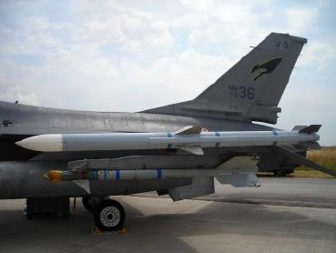

# F/A-18C Stores

## M61A1 Vulcan 20mm Cannon

The F/A-18C is equipped with an M61 Vulcan internal cannon. The M61 fires standard M50 20mm
rounds at 6,000 rounds per minute. It is effective against both surface and air targets. The
ammunition drum carries 510 rounds.

The M61 in DCS can be loaded with a mix of live rounds and tracers, or with live rounds only.

## AIM-9 Sidewinder

{ align=right }

The AIM-9 Sidewinder is an infrared-guided (heat-seeking)
short-range air-to-air missile. It first entered service in 1956 and
has since become one of the most successful missiles in the
West. Its longevity is thanks to its versatility and continued
improvement over multiple generations.

The AIM-9 uses an array of up to five scanning infrared sensors,
cooled by an internal argon bottle (L and M models). The
Sidewinder has a maximum speed of over Mach 2.5 and a
maximum range of around 10 to 20 miles, depending on the 
variant. Minimum range is around 3,000 feet.

The AIM-9 can be mounted directly to an LAU-127 on the wingtips, or up to two Sidewinders can be
mounted to an LAU-127 mated with an LAU-115C, which adapts to the BRU-32 ejector rack, allowing
the missile to be mounted to the underwing pylons.

**AIM-9L Sidewinder**. The 1977 “Lima” model was the first all-aspect Sidewinder, meaning it no
longer required the target to present a rear profile. The AIM-9L earned its first kill when it struck a
Libyan Su-22, after being fired from an F-14 Tomcat, in the infamous Gulf of Sidra engagement of
1981.

**AIM-9M Sidewinder**. The 1982 “Mike” model improved on the Guidance Control Section (GCS).
Susceptibility to flares was reduced, and background discrimination was improved, resulting in a
greater chance of lock-on. The motor’s smoke signature was reduced, making the missile less likely
to be detected.

**AIM-9X Sidewinder**. The 2003 “X-ray” model is the latest iteration of the Sidewinder. The X-ray
adds high off-boresight (HOBS) capability and the ability to slave the seeker head to the JHMCS. The
missile’s maneuverability was boosted with all-axis thrust-vectoring capability. These changes allow
the pilot to simply “point their head and shoot” in nearly any direction, and the missile will make its
way to the target. The infrared sensor was replaced with focal-plane arrays (FPAs) and counter-
countermeasures capability was improved further. Electronic fuzing was added to reduce minimum
range.

**CAP-9M**. Captive variant of the AIM-9M. The captive variant has the same size, weight, and drag
characteristics as the AIM-9M, for training effectiveness. It also contains an integrated infrared
sensor and will provide audio and visual guidance cues to the pilot, but it does not have a motor and
does not release from the aircraft.

## AIM-120 AMRAAM

The AIM-120 AMRAAM is an active radar homing (ARH)
medium-range air-to-air missile. First introduced in 1982,
the AMRAAM was intended to replace the semi-active
radar homing AIM-7 Sparrow, which was the medium-
range BVR missile in the US inventory at the time.

The AIM-120 uses both command guidance and radar
homing to reach its target. The AIM-120’s integral radar
has a comparatively short range, and so until the missile is
within that range, it is guided by datalink commands sent
automatically from the launching aircraft. The AMRAAM
has a maximum speed around Mach 4 and a maximum
range of 30 to 40 miles. 

The AIM-120 is mounted to the LAU-127, which can be mounted in singles or pairs to LAU-115C,
allowing the missile to be mounted to the underwing pylons. It can also be mounted directly to
stations 4 and 6.

**AIM-120B AMRAAM**. This 1994 variant is the earliest variant still in production.

**AIM-120C AMRAAM**. The 1996 variant improved target detection, homing capability, and fuzing.

AIM-7 Sparrow
The AIM-7 Sparrow is a semi-active medium-range air-to-air missile.
Development on the Sparrow first began in 1949, when it was originally
conceived as a beamrider. The AAM-N-2 Sparrow I, this beam-rider variant,
entered service in 1954. Later prototypes were active radar-guided, but the
first Sparrow to enter widespread production was the AAM-N-6 Sparrow III
(later renamed the AIM-7C). The AIM-7E saw extensive use in Vietnam, CMDR John Leenhouts
where 612 were fired, resulting in 56 kills. (USN)

The modern AIM-7 has a maximum speed of Mach 4 and an operational range of up to 53 nautical
miles, though performance will depend on the intensity of the radar energy reflected from the target.
As a semi-active guided missile, the launching aircraft must maintain a continuous radar lock on the
target until impact.
The AIM-7 is mounted to the LAU-115C connected to underwing pylons.
AIM-7F Sparrow. The 1976 variant had improved range thanks to a dual-stage rocket motor, solid-
state electronics, and a larger warhead than the E model.
AIM-7M Sparrow. The most common variant today, the M was first introduced in 1982 and used
extensively during the First Gulf War. Tracking reliability was greatly improved with the use of an
inverse monopulse radar. It also added active-radar proximity fuzing, better ECCM, and better
performance at low altitudes.
AIM-7MH Sparrow. This is the AIM-7M variant with a newer software version (the H build). The
upgraded software improves guidance and loft performance.

AGM-154 Joint Standoff Weapon (JSOW)
The AGM-154 is the result of a combined
Navy/Air Force venture to produce a
precision-guided glide bomb, first introduced
in 1988 and first employed during Operation
Desert Fox. The AGM-154 uses an INS/GPS
guidance system to navigate to its target.
The bomb is unpowered, but the extending
glide fins give it a range of around 70
nautical miles when dropped from high
altitudes. The bomb weighs around 1,000
pounds.
PHAN Jose Cordero (USN)
The AGM-154 development program is widely
considered to be one of the best successes in project management in the defense industry. The
program is often used as an example in the industry and in academia.
AGM-154A. The baseline JSOW has a warhead containing 145 BLU-97/B combined effects
submunitions. The submunitions have anti-armor, anti-materiel, and anti-personnel effects. The AGM-
154A is typically used as a SEAD weapon.
AGM-154C. The unitary variant contains an infrared seeker used during the terminal phase and the
penetrating BROACH warhead. The BROACH warhead is a two-stage system designed for penetrating
hardened bunkers. It consists of the WDU-44 shaped augmenting warhead and the WDU-45 follow-
through bomb. The WDU-44 penetrates the armor layer, and the WDU-45 detonates within the
interior chambers, amplifying its concussive effects.
AGM-84 HARM, SLAM, and SLAM-ER
The AGM-84D is a turbojet-powered sea-skimming
anti-ship missile with over-the-horizon attack
capability. The Harpoon uses INS mid-course
guidance, then locates and guides to its target using
terminal attack radar. It then performs a terminal
pop-up maneuver just prior to impact. The missile
sea-skims at around Mach 0.7 and contains a 500-
pound warhead with impact fuzing. The missile
weighs 1,500 pounds.
The AGM-84E Standoff Land Attack Missile (SLAM)
is a land attack variant developed from the
Harpoon. The SLAM enhances the INS midcourse
guidance with GPS updates, adds infrared-homing Combined Military Service Digital Photographic Files
terminal guidance and the capability for datalinked
seeker head video and datalinked command guidance, and increases the warhead size to 1,000
pounds.
Both variants have a range more than 60 nautical miles.
The AGM-84K SLAM Extended Response (SLAM-ER) is an improvement over the SLAM that greatly
improves its range to around 150 nautical miles and adds improved terminal guidance capabilities.

AGM-88 HARM
The AGM-88 High-speed Anti-Radiation Missile (HARM) is a passive
radar homing air-to-ground missile used in the suppression of enemy
air defenses (SEAD) role. The HARM has a radar receiver and
processor that detects and identifies signals from enemy surface
radars. When launched, it can guide to the target by homing on its
specific radar emissions. The missile also has an inertial guidance
system to provide mid-course guidance prior to detection of the radar
signal (or if the signal is lost).
The AGM-88 has a maximum speed of Mach 1.84 and an operational
range of around 80 nautical miles. It uses a laser proximity fuze for
detonation. SSGT Scott Stewart (USAF)
AGM-88C. This mid-1980s variant incorporates field-reprogrammable software and improved
guidance and fuzing.
AGM-65 Maverick
The AGM-65 Maverick is a medium-range air-to-ground
missile designed for the close air support role. The AGM-
65 family contains a diverse set of variants and guidance
systems, including infrared, electro-optical, and laser
guidance.
The AGM-65 has a maximum range of around 13
nautical miles. It was first delivered in 1972. A single
Maverick can be mounted to an LAU-117 rack.
AGM-65E Maverick. The E model uses laser guidance,
either from the Hornet’s onboard or from another laser SSGT Glenn B. Lindsey (USAF)
emitter. It has a 300-lb penetrating warhead with a
delayed fuze.
AGM-65F Maverick. The F model uses an infrared
tracking system adapted for the anti-ship role. It has the
same warhead as the Maverick E.

AGM-62 Walleye II
The AGM-62 Walleye II is a television-guided glide bomb
dating back to 1963 and used principally during the
Vietnam War. The original AGM-62 models used image
centroid tracking like electro-optical Mavericks; newer
models also added datalinked video and command Combined Military Service Digital Photographic Files
guidance capability.
The AGM-62 has a 2,000-lb high-explosive warhead.
Despite being designated “AGM,” the AGM-62 is an
unpowered glide bomb.

Mk. 20 Rockeye and CBU-99
The Mk. 20 Rockeye is a 500-lb anti-tank cluster bomb
that carries 247 Mk. 118 Mod 1 bomblets. Each bomblet
contains a shaped charge capable of penetrating several
inches of armor. Rockeyes were used extensively during
Operation Desert Storm to attrit Iraqi tank battalions.
The Mk. 20 and CBU-99 are unguided free-fall bombs.
Mk. 20 Rockeye. The baseline variant is used for
Combined Military Service Digital Photographic Files
shore-based operations.
CBU-99. This variant has increased thermal protection and is used for shipboard operations.
The Rockeye can be mounted in pairs on a BRU-33 rack.

Paveway II Laser Guided Bomb
The Paveway II is a series of laser-guided bombs based on
conventional general-purpose bombs. The guidance kit consists
of a laser detector and processor in the front and a set of
steering fins in the back. The bomb detects and tracks reflected
laser energy off a target. The laser designation can come from
the launching aircraft, another aircraft (“buddy lasing”), or from
a laser-capable ground unit such as a JTAC.
The Paveway II series was introduced in the early 1970s to
replace the first-generation Paveway series of laser-guided
SSGT Glenn B. Lindsey (USAF)
bombs. The Paveway II improved sensor reliability and added
extendible rear fins to extend glide range. The Paveway II series uses “bang-bang” control (where
the fins can only deflect fully in either direction), limiting its maximum range and forcing it to follow a
sinusoidal path to the target.
GBU-12. Paveway II bomb based on the Mk. 82, a 500-pound conventional bomb. The GBU-12 can
be mounted in pairs using a BRU-33 rack.
GBU-16. Paveway II bomb based on the Mk. 83, a 1,000-pound conventional bomb.
GBU-10. Paveway II bomb based on the Mk. 84, a 2,000-pound conventional bomb.

Paveway III Laser Guided Bomb
The Paveway III series of laser-guided bombs was introduced in 1983. The series added the ability
for the fins to move continuously, increasing glide efficiency. Paveway III technology also introduced
improved avionics, including launch acceptability region calculations and configurable attack
headings.
GBU-24. Paveway III bomb based on the Mk. 84, a 2,000-pound conventional bomb.
Joint Direct Attack Munition (JDAM)
JDAM is a kit that modifies a Mk. 80-series conventional
bomb, giving it precision INS/GPS guidance capability. The
JDAM kit consists of a GPS receiver, integral INS, and
steerable fins. JDAM bombs must downlink target
coordinates prior to release and cannot be manually
steered or re-targeted after release. Modern JDAM kits
have a precision of around 25 feet circular error probable
(CEP).
The Joint Direct Attack Munition program began after
Operation Desert Storm, when the US Air Force sought a
weapon that could guide more reliably than an LGB in
adverse weather such as dust storms. After extensive
testing, the concept of an INS/GPS-guided bomb was MC2 Milosz Reterski (USN)
shown to be effective by 1993, and the first JDAM kits
were delivered to operational squadrons in 1997.
GBU-38. JDAM guidance kit installed on a Mk. 82 500-pound conventional bomb. Up to two can be
mounted on a BRU-55.
GBU-32(V)2/B. JDAM guidance kit installed on a Mk. 83 1,000-pound conventional bomb.
GBU-31(V)1/B. JDAM guidance kit installed on a Mk. 84 2,000-pound conventional bomb. USAF
variant.
GBU-31(V)2/B. JDAM guidance kit installed on a Mk. 84 2,000-pound conventional bomb. USN
variant.
GBU-31(V)3/B. JDAM guidance kit installed on a BLU-109, a 500-pound hardened penetrating
bomb. USAF variant.
GBU-31(V)4/B. JDAM guidance kit installed on a BLU-109, a 500-pound hardened penetrating
bomb. USN variant.

Mark 80-Series General-Purpose
Bomb
The Mk. 80-series of general-purpose bombs is a series of
unguided bombs dating back to the Vietnam War. The bombs
come in nominal weights of 500, 1,000, and 2,000 pounds. The
bombs are very versatile, and they can be fitted with both nose SSGT Randy Mallard (USAF)
and tail fuzes, as well as different guidance kits.
The Mk. 82 and Mk. 83 variants can be mounted in singles or pairs on a BRU-33 rack.
Mk. 82. A general-purpose bomb with a nominal weight of 500 pounds.
Mk.82 Snakeye. A Mk. 82 with retarding petals that extend after release. The petals reduce the
bomb’s downrange speed after release, allowing aircraft to perform low-level straight-through
deliveries at lower altitudes without risk of frag damage.
Mk. 82Y. A Mk. 82 with a BSU-49 Air Inflatable Retarder (AIR). The AIR is a ballute that expands
after release, performing the same retarding function as the Snakeye. The AIR is a newer technology
and is more effective than the Snakeye, making the bomb safe to use at higher speeds than the
Snakeye.
Mk. 83. A general-purpose bomb with a nominal weight of 1,000 pounds.
Mk. 84. A general-purpose bomb with a nominal weight of 2,000 pounds.

Rockets
The F/A-18 can equip a variety of different rocket pods that can fire 2.75-inch FFARs or 5-inch Zuni
rockets. These pods are mounted on BRU-33 racks in singles or pairs.
LAU-10. The LAU-10 launcher can carry up to four 5-inch Zuni rockets.
LAU-61. The LAU-61 can load up to 19 2.75-inch FFARs.
LA-68. The LAU-68 can load up to 7 2.75-inch FFARs.
Zuni Mk. 71. The Mk. 71 Zuni rocket has a higher-thrust, longer-burning motor. The Mk. 71 is
equipped with a high-explosive warhead. The Zuni rocket dates back to 1957, and was used
extensively in the Vietnam War. It has a modular design and can accommodate different motors,
warheads, and fuzes.
M151 HE. A Hydra 70 FFAR with an M151 high-explosive warhead, effective against personnel and
light vehicles.
Mk. 5. A Hydra 70 FFAR with a Mk. 5 high-explosive anti-tank (HEAT) warhead, effective against
armor with direct hits, and secondary blast effects for nearby personnel and light vehicles.

Fuel Tanks
External fuel tanks carry additional fuel to increase the F/A-18’s
range and combat radius. Like most munitions, the fuel tanks are
capable of being jettisoned when needed. The external tanks can
be refueled during air-to-air refueling. The weight of the tank
depends on the amount of fuel carried.
FPU-8/A. External fuel tank with a capacity of 330 gallons
(approximately 2,200 pounds). MCSA Figueroa Medina (USN)
###AN/ASQ-228 ATFLIR
The Advanced Targeting Forward Looking Infrared (ATFLIR) pod is an electro-optical TV and infrared
targeting pod with laser target designation capability. It includes a steerable camera with a wide
zoom range, capable of daylight and nighttime target detection and laser designation.
To learn how to use the ATFLIR, see AN/ASQ-228 ATFLIR.

AN/AAQ-28 LITENING II Targeting Pod
The AN/AAQ-28 LITENING II is an electro-optical and infrared targeting pod with target designation
capability. It includes a steerable camera with a wide zoom range, capable of daylight and nighttime
target detection and laser designation.
To learn how to use the LITENING II, see LITENING II TARGETING POD.

AN/AWW-13 Advanced Datalink
The AN/AWW-13 is used to receive post-launch video from, and send guidance commands to, the
AGM-62 Walleye, AGM-84E SLAM, and AGM-84K SLAM-ER.

AN/ASQ-T50 TCTS Pod
The AN/ASQ-T50 is a Tactical Combat Training System (TCTS) pod. It incorporates a sensor platform
and datalink transceiver, allowing it to record and transmit real-time aircraft telemetry to monitoring
stations. TCTS pods are used during training exercises to monitor and record aircraft positions, for
many purposes, including debriefing analysis.
The TCTS pod is captive and cannot be released. It can be mounted to either outboard wingtip
station.
Training Bombs
Training bombs are inert, releasable munitions
with the same ballistic properties as combat
stores. Upon impact, these bombs can release
a smoke cloud that can be used to identify the
impact point.
BDU-33. Inert training bomb simulating the
weight and ballistic characteristics of the Mk.
82. The BDU-33 is loaded in groups of six on a
BRU-41A rack.
BDU-45. Inert training bomb simulating the
weight and ballistic characteristics of the Mk. 82
Snakeye. The BDU-45 provides Mk. 82-specific
training for both pilots and ordnancemen. Combined Military Service Digital Photographic Files

BDU-45/B. Inert training bomb simulating the weight and ballistic characteristics of the Mk. 82.
Unlike the BDU-33, the BDU-45/B also matches the shape and size of the Mk. 82, meaning it can only
be loaded in singles or pairs.
INSTALLATION AND LAUNCH
You will need to be logged into Windows with Administrator rights to install DCS World and the DCS:
F/A-18C Hornet module.
After purchasing DCS: F/A-18C Hornet from our e-Shop, start DCS World. Select the Module Manager
icon at the top of the Main Menu. Upon selection, your Hornet will automatically install.
DCS World is the PC simulation environment that the F/A-18C Hornet simulation operates within.
When you run DCS World, you in turn launch DCS: F/A-18C Hornet.
As part of DCS World, a map of the Caucuses region, the Su-25T Frogfoot attack aircraft, and TF-51
training aircraft are also included for free.
After executing the DCS World icon on your desktop, the DCS World Main Menu page is opened.
From the Main Menu, you can read DCS news, change your wallpaper by selecting either the F/A-18C
Hornet icon at the bottom of the page, or select any of the options along the right side of the page.
To get started quickly, you can select Instant Action and play any of the missions listed for the F/A-
18C Hornet.

Game Problems
If you encounter a problem, particularly with controls, we suggest you back up and then delete the
Saved Games\DCS\Config directory within your home directory, which is created by DCS on your
operating system drive at first launch. Restart the game and this folder will be rebuilt automatically
with default settings, including all the controller input profiles.
If problems persist, we suggest consulting our online technical support forums at
http://forums.eagle.ru/forumdisplay.php?f=251

Useful Links
DCS Homepage: http://www.digitalcombatsimulator.com/
DCS: F/A-18C Hornet forum: https://forums.eagle.ru/forumdisplay.php?f=557
DCS Wiki: http://en.wiki.eagle.ru/wiki/Main_Page
CONFIGURE YOUR GAME
Before jumping into the Hornet cockpit, the first thing we suggest is to configure your game. To do
so, select the Options button at the top of the Main Menu screen. You can read a detailed description
of all Options in the DCS World Game Manual.

Options

Figure 1. DCS World Main Menu

Upon selecting the Options screen, you will see seven tabs along the top of the page.
Figure 2. DCS World Options

SYSTEM. Configure your graphics options to best balance aesthetics with performance. You have
PRESET options along the bottom of the page, but you can further adjust your graphics settings to
best suit your computer. If you have lower performance, we suggest selecting the Low PRESET and
then increase graphics options to find your best balance.
Items that most affect performance include Visible Range, Resolution, and MSAA. If you wish to
improve performance, you may wish to first adjust these System options.
CONTROLS. Set up your controls and functional bindings. Let’s take a closer look at this page:
First, select the aircraft you wish to assign control inputs to by use of the Aircraft Selection drop-
down. Next, along the left side of the screen are all the ACTIONS associated with the selected Input
Function drop down. To the right are all the detected input devices that have been detected to
include keyboard, mouse, and any joysticks, throttles, and rudder pedals.
Aircraft Selection Input Functions

Axis Tune

Figure 3. Controls Configuration

1. Aircraft Selection. From this drop-down menu, select F/A-18C Sim.

2. Input Functions. This displays various categories of input functions, such as axis devices,
views, cockpit functions, etc. To assign a function, double mouse-click in the box that
corresponds to the desired input function and the input controller device. Once selected,
press the button, or move the axis of the device to assign it.

a. Example 1: if setting a pitch axis for a joystick, first select AXIS COMMANDS from
the Input Functions drop down. Find the box where your Joystick input device
and the Pitch Action intersect, and double mouse-click in the box. In the ADD
ASSIGNMENT PANEL, move your joystick forward and back to assign the axis.
Press OK when done.

b. Example 2: if setting a keyboard of HOTAS command like cycle the landing gear,
first select ALL as the Input Function category. Find the box where your input
device and the LANDING GEAR CONTROL HANDLE - UP/DOWN Action intersect,
and double mouse-click in the box. In the ADD ASSIGNMENT PANEL, press the
keyboard or controller device button you wish to assign to the action. Press OK
when done.

3. Axis Tune. When assigning an axis (like X and Y axis for a joystick), you can use this sub-
page to assign a dead zone, response curve, and other tuning. This can be very useful if
you find the aircraft overly sensitive to control. The Deadzone, Response Curve Saturation
Y, and Invert and the most common and useful elements to tune your controls.

GAMEPLAY. This page primarily allows you to adjust the game to be as realistic or casual as you
want it to be. Choose from many difficulty settings like labels, tooltips, unlimited fuel and weapons,
etc.
To help improve performance, turning Mirrors off can assist in this.
AUDIO. Use this page to adjust the audio levels of the game. You also have the option to turn on
and off different audio effects.
MISC. This is a catch-all of features to further tune the game to your preference.
VR. The VR tab allows you to enable support for the Oculus Rift and HTC Vive and adjust its
functionality. When using VR, be particularly aware of the Pixel Density setting as it can have a
dramatic effect on game performance.
PLAY A MISSION
Now that you have configured your game, let’s get to why you purchased DCS: F/A-18C, to fly some
missions! You have several options to fly a single- and multi-player mission.

Figure 4. DCS World Main Menu

1. INSTANT ACTION. Simple missions that place you in the task of your choice. We will be
using several of these in this guide to test what you learn.

2. CREATE FAST MISSION. Set various mission criteria to allow a mission to be created for
you.

3. MISSION. More in-depth, stand-alone missions. We will be using several of these in this
guide to test what you learn.

4. CAMPAIGN. Linked missions to create a campaign narrative. One mini-campaign for the
Hornet is available.

5. MULTIPLAYER. Create your own or join an internet server.
6. MISSION EDITOR. Use this very powerful Mission Editor to create your own missions.

On the Main Menu page, you have the options to fly the Hornet in an INSTANT ACTION mission,
CREATE FAST MISSION, load a MISSION, play a Hornet CAMPAIGN, or create a mission in the
MISSION EDITOR. You also have the option to jump online and fly with others.
Select the INSTANT ACTION from the right side of the screen. From here, you will be presented
several F/A-18C Hornet INSTANT ACTION missions to choose from.
To get started, we suggest the FREE FLIGHT mission. Later, you can also use these missions to
practice starting up the aircraft, takeoffs, landings, navigation, and sensor/weapon employment. The
MISSIONS selection holds a great number of combat and practice missions.

