# F/A-18C HORNET COCKPIT OVERVIEW

Once in the cockpit, it’s best to have a general understanding of where the various controls are
located. To help locate items more easily, we have broken the Hornet cockpit into eight primary
areas. In later sections of this guide, we will reference these locations.

Hornet Instant Action Mission: Hornet Cold and Dark. Use this mission to explore the cockpit and
become familiar with its layout. To move your view:

- [Keypad 8]: Up
- [Keypad 6]: Right
- [Keypad 2]: Down
- [Keypad 4]: Left
- [Keypad \*]: Zoom In
- [Keypad /]: Zoom Out

Pressing [LAlt]+[C] toggles mouse control between interacting with the cockpit and controlling your
view.

## Left Instrument Panel

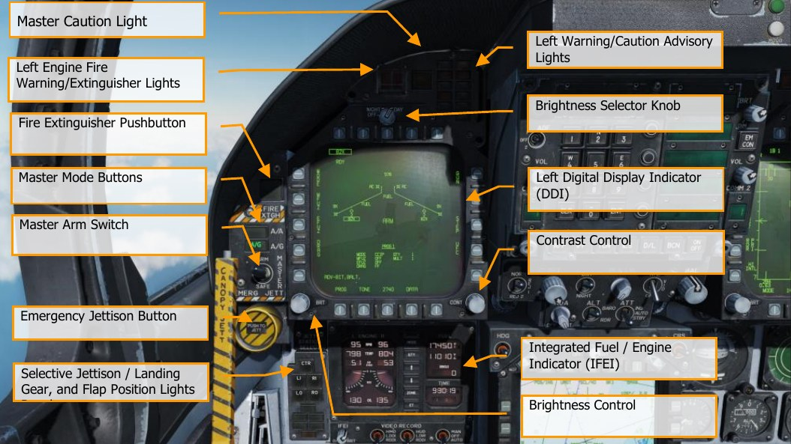

### Left Digital Display Indicator (DDI)

The left DDI is a 3-color (green, yellow, and red) display that provides desired information to control
various aircraft functions and displays. There are 20 pushbuttons (PB) on the DDI which are used to
select the function and the mode for proper indicator display. PB 1 is the lowest button on the left
side, and then each PB button is numbered sequentially in a clockwise manner.

### Brightness Selector Knob

Placing this rotary knob to OFF prevents the DDI from operating. Placing the knob to NIGHT provides
a lower brightness control range, and the DAY setting provides a brighter default setting.

### Brightness Control

This knob varies the intensity of the symbols and text. Rotate clockwise to increase brightness and
counterclockwise to decrease brightness.

### Contrast Control

This knob varies the contrast between symbology and the dark background on any level of
brightness. (N/I)

### Master Mode Buttons

These two buttons allow you to change between Air-to-Air (A/A) [1] and Air-to-Ground (A/G) [2]
master modes. There are three master modes of operation: navigation (NAV), air-to-air (A/A), and
air-to-ground (A/G). The controls, displays, and the avionic equipment operation are tailored as a
function of the master mode you select. The navigation master mode is entered automatically when
power is applied to the aircraft, when the air-to-air or air-to-ground modes are deselected, when the
landing gear is lowered, when the SPIN mode activates, or when the aircraft has weight on wheels
and the throttle position (power lever angle) is greater than 56°. The A/A master mode is entered
either by pressing the A/A master mode button or by selecting an A/A weapon with the A/A weapon
select switch on the control stick. The A/G master mode is selected by pressing the A/G master mode
button. The selection is performed by the Stores Management Set (SMS), and the SMS identifies the
selected master mode to the mission computer.

### Master Arm Switch [M]

This switch controls the ability for weapons to be employed or jettisoned. Weapons can only be
released when this switch is set to the ARM position.

### Emergency Jettison Button

The emergency jettison button, labeled EMERG JETT jettisons stores from the parent bomb racks on
external stores stations 2, 3, 5, 7 and 8. Holding the button down for 375 msec initiates jettison.

### Selective Jettison / Landing Gear, and Flap Position Lights Panel

This panel has three primary functions; the top is used to selectively select stations to jettison and
the bottom two provide landing gear and flaps status.

**Station Jettison Select Buttons**. Selective jettison is performed by the selective jettison knob in
conjunction with the station jettison select buttons. The station jettison select buttons are used to
select which weapon station or stations will be jettisoned. The selective jettison knob is used to select
jettison of either the stores or the stores and launchers/racks on the weapon stations selected by the
station jettison select buttons. After station and store/launcher/rack selection, jettison is performed
by pressing the JETT center pushbutton in the selective jettison knob. In addition, the selective
jettison knob can jettison the right or left fuselage Sparrow or AMRAAM missile by selecting R FUS,
MSL or L FUS MSL and pressing the JETT center pushbutton. Selective jettison can only be performed
with the landing gear up and locked with the master arm switch in ARM and jettisons the stores in a
safe condition.

The station jettison select buttons are on the left edge of the instrument panel below the emergency
jettison button. The buttons are labeled CTR (center), LI (left inboard), RI (right inboard), LO (left
outboard) and RO (right outboard). Pressing a button illuminates an internal light and selects a
weapon station for jettison. The station jettison select buttons are also used in the backup A/G
weapon delivery modes for weapon selection.

**Landing Gear Indications**. There are three green landing gear position lights marked NOSE, LEFT
and RIGHT. The lights indicate that the gear is down and locked, or that a gear link is not locked.

**Flap Indications**. A green light indicates the aircraft is within flight parameters for the flight control
computer to adjust flap scheduling in accordance with the selected switch position.

- **HALF**. FLAP switch at HALF setting and airspeed below 250 knots.
- **FULL**. FLAP switch at FULL setting and airspeed below 250 knots.
- **FLAPS**. FLAP switch HALF or FULL settings and airspeed over 250 knots, abnormal flap
condition (any flap is off or lacks hydraulic pressure), in spin recovery mode, or GAIN
switch in ORIDE position.

### Integrated Fuel / Engine Indicator (IFEI)

The integrated fuel/engine indicator (IFEI) engine display contains a left and right liquid crystal
display for RPM (N2)%, TEMP (EGT)°C, FF (fuel flow) PPH, NOZ (nozzle position)%, and OIL (oil
pressure) psi. During engine starts without external electrical power, only RPM and TEMP are
displayed by battery power until the APU comes online. With the APU online or external power, all
engine data is displayed.

**Engine RPM**. Displays engine N2 rpm from 0 to 100%. There is no RPM indication of afterburner.

**Exhaust Gas Temperature (TEMP)**. Displays turbine exhaust gas temperature (EGT) from 0 to
1,999°C.

**Engine Fuel Flow (FF)**. Displays main engine fuel flow only (afterburner fuel flow is not displayed).
Range is 300 to 15000 Pounds Per Hour (PPH) with 100 pound per hour increments. The tens of
units positions have fixed zeros. When fuel flow is less than 320 PPH, zero is displayed.

**Engine Nozzle Position (NOZ)**. Displays exhaust nozzle position from 0 to 100% open in 10%
increments.

**Engine Oil Pressure (OIL)**. Displays engine oil pressure from 0 to 195 psi in 5 psi increments.
The IFEI fuel display window contains three digital counters to provide dynamic fuel quantity
indications. The upper digital counter displays total aircraft fuel quantity (10-pound increments). The
middle digital counter displays total internal fuel quantity (10-pound increments). A digital counter
legend is displayed to the right of the upper and middle counters (T - total fuel, I - internal fuel). The
lower digital counter displays the selected BINGO fuel quantity (100-pound increments).

**BINGO**. The Bingo fuel setting can be set by pressing the up and down arrows in the center of the
IFEI. The value in pounds will then be displayed in the Bingo Fuel field and be used to trigger Bingo
fuel caution messages and audio alerts.

Bingo fuel is only editable when the total (T) and internal (I) fuel quantities are shown.

**MODE Button**. Pressing the MODE button in the center of the IFEI. Two presses of the button allow
you to set the day and time. Use the QTY button to cycle between editing of Hour (H), Minute (M),
time offset (D), and Year (Y). Upon selection of each, use the up and down arrows on the IFEI to
adjust the value.

**QTY Button**. Cycles IFEI display between different fuel tank quantities. A legend is displayed next to
the quantity:

1. Total (T) and Internal (I). This is the normal display.
2. Left Feed Tank #2 (FL) and Right Feed Tank #3 (FR)
3. Left Transfer Tank #1 (TL) and Right Transfer Tank #4 (TR)
4. Left Wing Tank (WL) and Right Wing Tank (WR)
5. Left External Tank (XL) and Right External Tank (XR)
6. Centerline Tank (C)

When the quantity display is set to anything other than total + internal, the Bingo display instead
displays total fuel quantity.

**ZONE Button**. Press the ZONE button on the IFEI to toggle the TIME to display local or ZULU (Z)
time.

**Elapsed Time (ET) Button**. Press once on the ET button to start an elapsed time timer that will
count in seconds. A second presses pauses the timer. A third presses resumes. By holding down the
button, the timer will reset to zero.

**IFEI Brightness Knob**. In the bottom left corner of the IFEI panel is the IFEI Brightness (BRT)
knob. This is used to control the brightness of the display in the internal lighting panel mode switch is
set to NITE or NVG. It has no effect in the DAY setting.

### Left Engine Fire Warning/Extinguisher Lights

If a fire is detected in the left engine, this indicator, marked FIRE, will be lit along with an “Engine
Fire Left, Engine Fire Left” audio warning. This is a steady state, red light. To enable the fire bottle to
discharge into the selected engine/AMAD bay, the pilot must lift the guard over the FIRE warning
light and press the FIRE button. The button has two positions. Pushed in shuts off fuel flow to the
engine and arms the fire extinguisher and the READY light will illuminate. Pushing this FIRE Warning
button in once more toggles the button to the out position and the fuel valve will open again for that
engine and the READY light will turn off.

### Master Caution Light

A yellow MASTER CAUTION light, on the upper left part of the instrument panel, comes on when any
of the caution lights or caution displays come on. The MASTER CAUTION light goes out when it is
pressed (reset). An audio tone is initiated whenever the MASTER CAUTION light comes on. This
button is also used to “re-stack” caution and advisory notices.

### Left Warning/Caution Advisory Lights

The Left Warning/Caution Advisory Lights provide visual indications of normal aircraft operation and
system malfunctions affecting safe operation of the aircraft. A red warning light normally indicates a
system malfunction that could be a severe hazard to further flight and may require immediate action.
Yellow caution lights and displays normally, but not always, indicate malfunctions that require
attention but not immediate action. After the malfunction has been corrected, warning and caution
lights and caution displays go out. Advisory lights and displays indicate safe or normal conditions and
supply information for routine purposes.

**L BLEED**. Will light when the Fire and Bleed Air Test Switch is pressed, or bleed air leak or fire (600
°F) has been detected in the left engine bleed air ducting. If illuminated, the left bleed valve is
automatically closed. Will light when TEST A or TEST B switch is held, or a bleed air leak or fire has
been detected in the left engine ducting. A “Bleed Air Left, Bleed Air Left” audio message will also
sound. L BLD OFF caution will be displayed on the LDDI.

**R BLEED**. Will light when the Fire and Bleed Air Test Switch is pressed, or bleed air leak or fire (600
°F) has been detected in the right engine bleed air ducting. If illuminated, the right bleed valve is
automatically closed. Will light when TEST A or TEST B switch is held, or a bleed air leak or fire has
been detected in the right engine ducting. A “Bleed Air Right, Bleed Air Right” audio message will also
sound. R BLD OFF caution will be displayed on the LDDI.

**SPD BRK**. Will light anytime the speed brake is not fully retracted.

**STBY**. When ALQ-165 ECM mode switch is set to STBY on the ECM control panel, the STBY light
indicates that the ECM Jammer is in warm up mode. This will last five minutes and then time out and
extinguish.

**L BAR (Red)**. Launch bar malfunction. Nose gear cannot retract. The launch bar can only be
extended with weight on wheels.

**L BAR (Green)**. Launch bar extended with weight on wheels. Will extinguish when the launch bar
switch is in the UP position (catapult shuttle holds the launch bar in the extend position until the end
of the catapult stroke).

**REC**. Indicates that the aircraft is being illuminated by a threat radar.

**XMIT**. Lit when ECM Jammer is transmitting.

**GO**. Indication of successful BIT of ALQ-165. Will remain illuminated until BIT mode is deselected.

**NO GO**. Indication of unsuccessful BIT of ALQ-165. Will remain illuminated until BIT mode is
deselected. ALQ-126 is inoperable.

### Fire Extinguisher Pushbutton

This switch has two lights: a yellow light labeled READY, and a green light labeled DISCH (discharge).
When READY is on, the fire extinguisher bottle is armed. The READY light comes on when the
appropriate fire warning/extinguisher light is lit. Pressing an engine fire warning/extinguisher light
shuts off fuel to the engine at the feed tank. With READY on, pressing the fire extinguisher
pushbutton discharges the fire extinguisher bottle and turns on the DISCH light.

## Center Instrument Panel

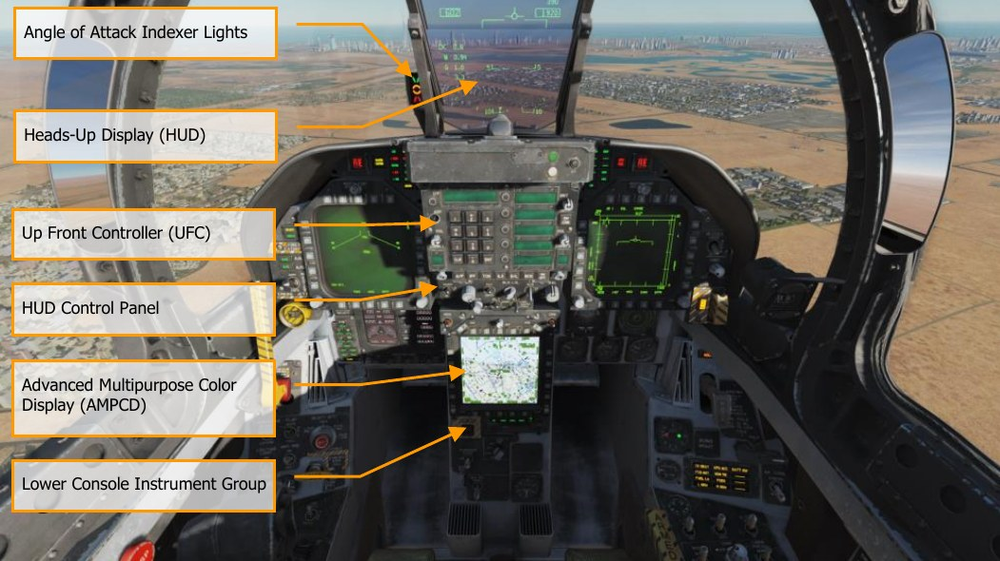

### Heads-Up Display (HUD)

The HUD is used as the primary flight instruments, weapon status, and weapon delivery display for
the aircraft under all selected conditions. The HUD receives attack, navigation, situation, and steering
control information from the left or right DDI symbol generators (under mission computer control),
and projects symbology on the combining glass for head-up viewing. The HUD will be discussed in
much greater detail later in this guide.

### Angle of Attack Indexer Lights

The AOA indexer is mounted to the left of the HUD. It displays approach angle of attack (AoA) with
lighted symbols. Corresponding AOA indications are shown on the HUD. The indexer only operates
with the landing gear down, Weight-off-Wheels, a valid Air Data Computer (ADC) AOA signal and a
functional ADC. The lighted symbol(s) flash if the arresting hook is up and the Hook Bypass Switch,
on the left vertical panel, is in CARRIER. The symbols do not flash with the arresting hook up and the
hook bypass switch in FIELD. The switch is solenoid held to FIELD and automatically goes to
CARRIER when the arresting hook is lowered, or aircraft power is removed. The AOA Indexer Knob
on the HUD control panel dims the symbols.

With Weight on Wheels (WoW), the indexer lights do not operate.

SYMBOL | AIRSPEED | AOA
-------|----------|-----
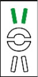 | Slow             | 9.3° to 9.0°
 | Slightly slow    | 8.8° to 9.3°
 | On speed         | 7.4° to 8.8°
 | Slightly fast    | 6.9° to 7.4°
 | Fast             | 0° to 6.9°

### Upfront Controller (UFC)

The UFC is on the main instrument panel below the HUD. The UFC is used to select the autopilot,
ILS, datalink, and radios. The UFC is used in conjunction with the two DDIs and the AMPCD to enter
navigation, sensor, and weapon delivery data.

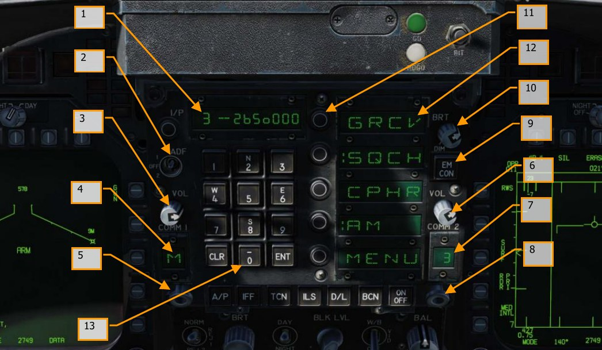

1. **Scratchpad Window**. The scratchpad window displays keyboard entries on a nine-
character readout. The first two characters are alphanumeric and the other seven are
numeric.

2. **Automatic Direction Finding (ADF) Function Select Switch**. This is a three-place
switch that allows the pilot to set ADF navigation based on the COMM 1 radio by setting
the switch to 1, or COMM 2 by setting the switch to 2. Placing the switch in the center, OFF
position disables ADF navigation. See the Automatic Direction Finder (ADF) Navigation
chapter for greater detail.

3. **COMM 1 Volume Control**. Turning the volume control to the OFF position turns off the
COMM 1 radio. Out of the OFF position, the knob controls the audio volume for the
corresponding COMM 1 radio.

4. **COMM 1 Channel Display**. The COMM 1 channel display window displays the channel of
the COMM 1 radio.

5. **COMM 1 Channel Selector**. Rotating the knob with the mouse wheel selects channel 1
through 20, manual (M), guard (G), cue channel (C), or maritime channel (M). The channel
is displayed in the corresponding COMM 1 channel display window. Pulling the spring-
loaded knob (a right mouse click) causes the selected channel and its frequency to be
displayed in the scratchpad and enables the control converter to change the frequency of
the selected channel via the keyboard entry.

6. **COMM 2 Volume Control**. Turning the volume control to the OFF position turns off the
COMM 2 radio. Out of the OFF position, the knob controls the audio volume for the
corresponding COMM 2 radio.

7. **COMM 2 Channel Display**. The COMM 2 channel display window displays the channel of
the COMM 2 radio.

8. **COMM 2 Channel Selector**. Rotating the knob with the mouse wheel selects channel 1
through 20, manual (M), guard (G), cue channel (C), or maritime channel (M). The channel
is displayed in the corresponding COMM 2 channel display window. Pulling the spring-
loaded knob with a right mouse click causes the selected channel and its frequency to be
displayed in the scratchpad and enables the control converter to change the frequency of
the selected channel via the keyboard entry.

9. **EMCON Pushbutton**. Pushing the button inhibits radar, radar altimeter, datalink, and
Walleye from transmitting. The letters E, M, C, O, and N are displayed in a vertical column
in the five option windows when EMCON is selected. Pushing the button again permits the
transmitters to radiate. Currently no function.

10. **Brightness Control Knob**. The knob has positions of BRT (bright) and DIM. The
brightness of the Option Display Windows and Scratchpad Window increases as the knob is
rotated clockwise toward BRT.

11. **Option Select Pushbuttons**. The five pushbuttons select or deselect the displayed
options.

12. **Option Display Windows**. The option display windows display five options of four
alphanumeric characters each that are available for selection.

13. **Pushbutton Keyboard**. The pushbutton keyboard contains alphanumeric pushbuttons, a
CLR (clear) pushbutton, and an ENT (enter) pushbutton. Pressing the alphanumeric
pushbutton enters a corresponding alphanumeric as digital information into the control
converter. The number or letter of the pressed button is displayed on the right end of the
scratchpad. The number or letter moves to the left as additional numbers are entered. The
decimal point or degree/minute symbols are automatically displayed in correct position for
information being entered. Trailing zeroes must be entered. Pressing the CLR pushbutton
clears the scratchpad and/or the option display windows. Pressing the CLR pushbutton
once clears the scratchpad, pressing it a second time clears the option display windows.

Pressing the ENT pushbutton causes the keyboard entry displayed in the scratchpad to be
sent to the control converter to change operation of selected equipment or to make data
available to the mission computer. If entry via the keyboard is valid, the scratchpad display
blinks once. If entry is invalid, ERROR appears and flashes in the scratchpad display until
the scratchpad is cleared.

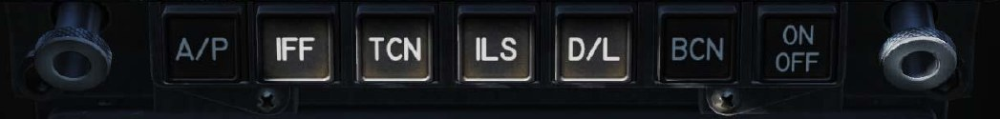

**Function Selector Push buttons**. The function selector pushbuttons as pictured above are all
mutually exclusive. When a function selector pushbutton is pressed, the control options for that
equipment are displayed in the Option Windows. The autopilot button displays the selected autopilot
mode options in the option windows and the desired mode/modes are colonized (prefaced with a
colon). Note that pressing the autopilot button will not engage autopilot! When the equipment is on,
the word ON is displayed in the first two alphanumeric of the scratchpads. The first two alphanumeric
are blank when the equipment is off. Pressing the function selector pushbutton, a second time clears
the UFC display. The pressing of a function selector pushbutton, the pulling of a channel selector
knob, or the receipt of a UFC mode command from the mission computer terminates all prior activity,
with all previous entries retained, and presents the options for the newly selected mode.

**Autopilot Pushbutton (AP)**. The automatic flight control system (autopilot) has two basic modes:
pilot relief and datalink. The pilot relief mode consists of heading hold, heading select, attitude hold,
barometric altitude hold, and radar altitude hold. Control of the automatic flight control modes is
accomplished by the switches on the up-front control (UFC), heading set switches on the heading
and course set switches panel, and the autopilot disengage/nosewheel steering switch on the control
stick. Before any mode can be selected bank must be less than or equal to 70°, pitch must be less
than or equal to 45°, and the A/P pushbutton must be pressed. Selection of the A/P pushbutton
displays the pilot relief options of: ATTH (attitude hold), HSEL (heading select), BALT (barometric
altitude hold), and RALT (radar altitude hold) the UFC option display windows. When a pilot relief
option is selected via the UFC a colon (:) appears in front of the selected display and the selected
mode appears on the DDI advisory display. If an option is not available, it is not displayed.

Pressing the A/P button displays the autopilot options, and the desired mode is colonized by pressing
the Option Select Button next to the desired mode. Decolonizing will disconnect the autopilot, as will
actuating the autopilot disconnect paddle on the stick.

**ATTH**. Attitude hold mode is selected. Attitude hold is engaged by pressing the option
pushbutton next to the option display window displaying ATTH. Engagement is indicated by
a colon in the ATTH option window. Currently the aircraft maintains the existing pitch and
roll attitude.

**BALT**. Barometric altitude hold mode is selected. To establish barometric altitude hold,
press the button next to the option display window displaying BALT. The existing
barometric altitude at time of engagement is captured and maintained. Heading or attitude
hold is maintained, depending upon which mode was previously engaged. The operating
range is 0 to 70,000 feet. ATTH or HSEL can be selected with BALT to provide lateral
control.

**HSEL**. Heading select mode is selected. To establish heading select mode, select the
desired heading on the HSI display by using the heading set switch, located to the left of
the center DDI. Press the button next to the option display window displaying HSEL. The
aircraft turns from existing heading through the smallest angle to the selected heading.
Heading hold is reestablished after the selected heading is captured. Existing pitch attitude
is maintained.

**RALT**. Radar altitude hold mode is selected. To establish radar altitude hold, press the
pushbutton next to the option display window displaying RALT. Engagement is indicated by
a colon appearing in the window next to RALT. The existing radar altitude is maintained
upon engagement. Radar altitude hold coverage is from 0 to 5,000 feet. If no other mode
is selected, the lateral axis control remains in heading hold. In this configuration, roll trim
switch can be utilized with automatic turn coordination up to 45° with altitude maintained.
ATTH or HSEL can be selected with RALT to provide lateral control.

**CPL**. Coupled mode is selected. See Using Coupled Autopilot Mode.

**TCN Pushbutton (TCN)**. To enable the TACAN system press the TCN pushbutton. This allows the
TACAN code and ON/OFF status to be displayed on the UFC scratchpad, along with the TACAN mode
options on the UFC Option Windows. These include:

- T/R: Transmit / Receive.
- RCV: Receive
- A/A: Air-to-Air
- X: X Band
- Y: Y Band

Now you can actuate the ON/OFF selector pushbutton to turn the TACAN system on. The TACAN
channel number may be changed using the UFC keypad. In the T/R mode the TACAN computes
bearing, and measures slant range from the selected TACAN station. In the RCV mode only bearing
from the selected TACAN station is computed. In the A/A mode, interrogations and replies are only
single pulse from one aircraft to another. TACAN with bearing and range information is plotted on the
HSI. When TACAN is boxed on the HSI, range information is displayed on the HSI and HUD. With a
course line selected and in NAV mode, steering information is displayed on the HUD and the distance
course line is displayed in the lower right corner of the HSI with a C beside it. For example: 15 miles
from course line would be displayed as “15 C”. This is very useful on the downwind leg of a carrier
landing pattern by selecting the carrier TACAN, set the carrier course line, and then fly 1.2 miles
abeam of the course line on the downwind leg parallel to the course line until starting the 180° turn.

Please see the TACAN Navigation chapter for greater detail. //link

**ILS Pushbutton (ILS)**. This allows the Instrumented Carrier Landing System (ICLS) channel
number and ON/OFF status to be displayed on the UFC scratchpad along with the CHNL option
appearing on the UFC Option Window. Now you Can actuate the ON/OFF selector pushbutton to turn
the ILS on. The ILS channel may be changed (1 to 20) using the UFC keypad. For ILS data to be
displayed on the HUD, “ILS” must be boxed on the HSI.

Please see the Instrument Carrier Landing System (ICLS) chapter for greater detail. //link

**ON/OFF Pushbuttons**. Activates or deactivates selected function.

### HUD Control Panel

The HUD control panel allows the pilot to adjust the HUD display and how some data is presented.

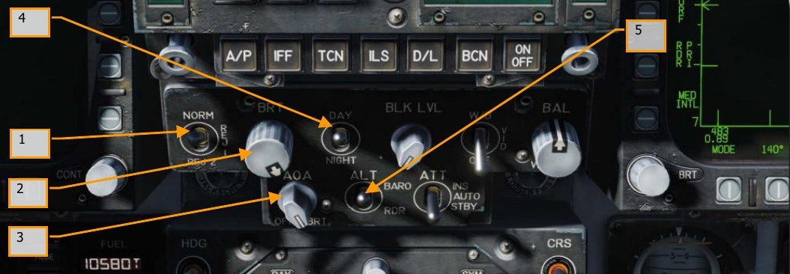

1. **HUD Symbology Reject Switch**. This three-position toggle switch has positions of
NORM, REJ 1, and REJ 2. With the switch placed to NORM, the normal amount of
symbology is provided for all HUD displays. Placing the switch to REJ 1 removes aircraft
Mach number, aircraft g, bank angle and pointer, airspeed box, altitude box, peak positive
g, and required ground speed cue from the HUD. Placing the switch to REJ 2 removes all
REJ 1 symbology plus the heading scale, current heading indication (caret/T), command
heading marker, NAV/TACAN range, and the ET/CD timer.

2. **HUD Symbology Brightness Selector Knob**. Sets the brightness of the HUD
symbology.

3. **AOA Indexer Control**. This knob controls the brightness of the AoA indexer lights.
Currently no function.
4. **HUD Symbology Brightness Selector**. This is a two-position toggle switch with
positions of DAY and NIGHT. Placing the switch to DAY provides maximum symbol
brightness in conjunction with the HUD symbology brightness control. With the switch set
to NIGHT, a reduced symbol brightness is provided in conjunction with the HUD symbology
brightness control.

5. **Altitude Switch**. The ALT switch is used to select either radar altitude or barometric
altitude for display on the HUD and as the primary altitude source for the mission
computer. When the switch is set to RDR (radar), the altimeter altitude followed by an R is
displayed in the upper right portion of the HUD display. If radar altitude becomes invalid,
such as the aircraft exceeding the 5,000 feet AGL radar altimeter limit, barometric altitude
is displayed and a B next to the altitude flashes to indicate barometric altitude is being
displayed.

### Advanced Multipurpose Color Display (AMPCD)

The AMPCD (generally referred to as just the MPCD) is a full-color, NVG compatible digital display
capable of providing any MENU selectable format except the A/G radar display. The MPCD is driven
by either the Digital Map Set (DMS) for HSI displays, or the left DDI for all other MENU selectable
formats. Four momentary two-position rocker switches and a rotary knob, located on the front of the
MPCD, permit control of MPCD off/brightness, night/day viewing modes, symbology, gain, and
contrast.

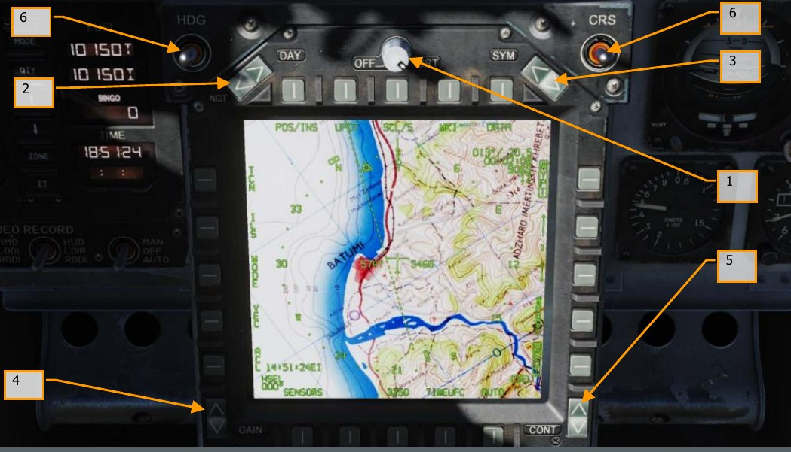

1. **Off/Brightness Control**. This rotary switch powers on the AMPCD when it is rotated out
of the OFF position. When DAY is selected on the night/day brightness selector, AMPCD
brightness is controlled using this rotary. When NGT is selected, brightness is controlled
automatically. (Brightness is always controlled automatically when the HSI format is shown
on the AMPCD.)

2. **Night/Day Brightness Selector**. This rocker switch toggles between auto and manual
brightness control. When DAY is pressed, AMPCD brightness can be adjusted using the
brightness knob to the right. When NGT is pressed, AMPCD brightness is controlled
automatically. (Brightness is always controlled automatically when the HSI format is shown
on the AMPCD.)

3. **Symbology Control**. Momentary actuations of the upper half of the switch incrementally
narrows the symbology, making it sharper and dimmer. Momentary actuations of the lower
half incrementally widens the symbology, making it brighter and less sharp.

4. **Gain Control**. Momentary actuations of the upper half of the switch incrementally
increases background video brightness. Momentary actuations of the lower half
incrementally decrease video brightness.
5. **Contrast Control**. Momentary actuations of the upper half of the switch incrementally
increase the contrast of the display. Momentary actuations of the lower half incrementally
decrease the contrast of the display.

6. **Heading and Course Set Switches**. At either side of the top of the MPCD are the
Course (CRS) and Heading (HDG) switches that allow the pilot to manually set course and
headings on the HSI. Both switches are spring-loaded to the center position but can be
held up to increase value (degrees) or held down to decrease value (degrees). Increase
heading with [LAlt] + [LShift] + [2] and decrease with [LAlt] + [LShift] + [1].
Increase course with [LAlt] + [LShift] + [4] and decrease with [LAlt] + [LShift] +
 [3].

### Lower Console Instrument Group

Aside from the cabin pressure gauge, this group of instruments is dedicated toward defensive
systems. These will be discussed in the Defensive Systems portion of this guide.

## Right Instrument Panel

### Lock / Shoot Lights

The Lock/Shoot cue function is provided during air-to-air (A/A) operation for air-to-air weapons. This
function provides a visual indication for radar lock on (LOCK light) and when weapon release
interlocks are satisfied (SHOOT light/SHOOT cue).

- Lock: Single Target Track (STT) and target within R~MAX~ range.
- Shoot / Steady / Missile: target locked and within R~MAX~ range.
- Shoot / Flashing / Missile: target locked and within R~NE~ range.
- Shoot / Steady / Gun: target within solution.

The strobe light below the SHOOT cue will also flash when shot is valid.

### Right Warning/Caution Advisory Lights

The Right Warning/Caution Advisory lights provide visual indications of the recorder and the onboard
Threat Warning System (TWS). See Defensive Systems Chapter for greater details.

- **DISP**. Countermeasure dispense program is active.
- **SAM**. Surface-to-Air Missile tracking radar locked to aircraft. Light is solid when radar is
tracking and flashing when guiding a missile.
- **AI**. Airborne Intercept (AI) radar locked to aircraft.
- **AAA**. Ant-Aircraft Artillery (AAA) fire control radar locked to aircraft.
- **CW**. Aircraft illuminated by Continuous Wave (CW) radar.
- **APU Fire Light**. The APU Fire Light will light when a fire has been detected in the APU
compartment.
- **Right Engine Fire Warning/Extinguisher Lights**. If a fire is detected in the right
engine, this indicator will be lit. it will light when a temperature greater than 1,000 °F is
detected in the right engine bay.

### Right Digital Display Indicator (DDI)

The right DDI functions identically to the left DDI.

### IR Cool Switch

Manually provides coolant to AIM-9 seekers. See AIM-9 procedures section of this guide.

### Standby Attitude Reference Indicator (SARI)

This is a self-contained instrument to indicate aircraft pitch, roll, and yaw.

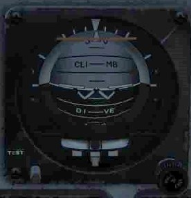

The standby attitude reference indicator (SARI) is a self-contained electrically driven gyro-horizon
type instrument An OFF flag appears if both power sources fail, or if the gyro is caged. During caging
the gyro initially cages to 4° pitch and 0° roll regardless of aircraft attitude. Caging when the aircraft
is in a roll attitude greater than 5° cuts out the roll erection system and the gyro does not erect
properly. After 3 to 5 minutes, the indicator reads 0° in pitch and 0° in roll. Both readings assume the
aircraft is straight and level. Pitch display is limited by mechanical stops at approximately 90° climb
and 80° dive. As the aircraft reaches a near vertical orientation, the roll display experiences large
rotations. An aircraft wings level attitude in the vertical orientation may result in large errors in either
pitch or roll, or both. This is normal and is not an indication of damage or improper function of the
indicator. After completion of vertical maneuvers, the indicator most likely requires caging in the
normal cruise attitude, to eliminate the errors. Vertical maneuvers with a wing down condition of 7°
or more usually do not develop significant gyro errors. A needle and ball are at the bottom of the
instrument. A one-needle width turn is 90° per minute.

Turn the knob at the bottom right to set the zero-pitch index. Pull the knob to cage the attitude
indicator.

### Azimuth Indicator

Also referred to as the Radar Warning Receiver (RWR), this is discussed in the Defensive Systems
section of this guide.

### Standby Airspeed Indicator

The standby airspeed indicator displays airspeed from 60 to 850 knots indicated airspeed. It operates
directly off left pitot pressure and left static pressure with NORMAL selected by the static source
selector lever or right static pressure with BACKUP selected.

### Standby Altimeter

Indication of aircraft barometric altitude. The standby altimeter is a counter-pointer type. The counter
drum indicates altitude in thousands of feet from 00 to 99. The long pointer indicates altitude in 50-
foot increments with one full revolution each 1,000 feet. A knob and window permit setting the
altimeter to the desired barometric setting. This setting is also used by the air data computer. The
standby altimeter operates directly off the left static pressure with NORMAL selected by the static
source selector lever or right static pressure with BACKUP selected.

### Standby Vertical Velocity Indicator

Indication of aircraft positive or negative change of altitude rate.

### HMD Control

Rotating the HMD knob clockwise activates the Helmet Mounted Sight and adjusts brightness. Please
see the Helmet Mounted Display (HMD) chapter.

### Spin Recovery

This control is a hold-over from earlier production lots of the Hornet. During later development of the
Hornet’s flight control system, this switch and system was rendered obsolete. In fact, in official
Hornet flight manuals, it is prohibited from use. Although we have fully-modeled this system for
complete accuracy, it should not be used.

The spin recovery system, when engaged, puts the flight controls in a spin recovery mode (SRM).
This mode, unlike CAS, gives the pilot full aileron, rudder and stabilator authority without any control
surface interconnects and all rate and acceleration feedbacks are removed. The leading-edge flaps
are driven to 33° ±1° down and the trailing edge flaps are driven to 0° ±1°.

- NORM. Spin recovery mode engaged when all the following conditions are met:

    - Airspeed 120 ±15 knots.

    - Sustained, un-commanded yaw rate.

    - Stick is placed in the direction indicated on the DDI spin recovery display.
    - The flight controls revert to CAS anytime the stick is placed in the wrong
direction (i.e., pro-spin), the airspeed increases above about 245 knots, or the
yaw rate decreases to less than 15°/second.

- RCVY. Spin mode engaged when airspeed is 120 ±15 knots. The flight controls revert to
CAS when the airspeed increases above about 245 knots. Full authority pro-spin controls
can be applied with the switch in RCVY, and spin mode engaged.

#### Spin Recovery Switch in NORM

With the airspeed at 120 ±15 knots and a sustained, un-commanded left yaw rate with positive g or
sustained, un-commanded right yaw rate with negative g:

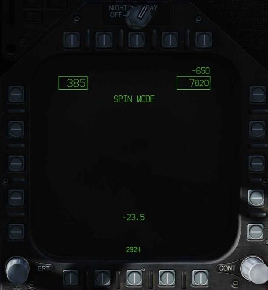

This appears on both DDIs after about a 15-second delay at 15°/second yaw rate decreasing to
about a 5-second delay at 50°/second yaw rate.

{ align=right }

With the airspeed at 120 ±15 knots and a right yaw rate over 15°/second with positive g or left yaw
rate over 15°/second with negative g,
appears on both DDIs after about a 15-second delay at 15°/second yaw rate decreasing to about a
5-second delay at 50°/second yaw rate.

When the stick is placed in the indicated directions, the words

**SPIN MODE**

are replaced by

**SPIN MODE 
ENGAGED**

When the yaw rate decreases below 15°/second or the airspeed increases above about 245 knots,
the spin recovery display is replaced by the MENU display.

#### Spin Recovery Switch in RCVY

**SPIN MODE**

Appears on both DDIs.

If the airspeed decreases to 120 ±15 knots, the words

**SPIN MODE**

are replaced by

**SPIN MODE 
ENGAGED**

If a yaw rate over 15°/second develops the words **STICK RIGHT** or **STICK LEFT** with an
accompanying arrow also appear on the DDI.

When the airspeed increases above about 245 knots

**SPIN MODE**

appears on both DDIs and the flight controls revert to CAS.

Airspeed appears in the upper left corner, altitude appears in the upper right corner, and AOA
appears in the lower center of the spin recovery display.

## Left Vertical Panel

### Canopy Jettison Handle

The black and yellow striped canopy jettison handle is on the left inboard canopy sill just aft of the
instrument panel. Pulling the handle aft activates the canopy jettison system.

### Landing Gear Handle [G]

The landing gear is controlled by a two-position, wheel-shaped handle on the lower left side of the
main instrument panel. Two conditions must be met before the gear can be raised: the aircraft must
sense that weight is off all three-landing gear and the launch bar must be retracted. When these
conditions are met, the landing gear is raised by moving the handle up. If the launch bar is extended
when the handle is raised, the main gear retracts but the nose gear remains extended. When the
aircraft senses weight on any of the three-landing gear, a mechanical stop in the landing gear control
panel extends preventing movement of the handle from DN to UP. Moving the handle down lowers
the gear.

The landing gear warning light is a red light in the gear handle. The light comes on when the gear is
in transit and remains on until all three gear are down and locked when DN is selected, or all the
gear doors are closed when UP is selected. The light remains on with the gear down and locked if the
left or right main landing gear link is not locked. When the landing gear handle light has been on for
15 seconds the landing gear aural tone also comes on.

Emergency gear extension is done by rotating the gear handle 90° clockwise and pulling to the
detent where the handle locks in place (in the sim, this is done with the mousewheel). This can be
done with the handle in either UP or DN; however, the handle must be rotated 90° before it is pulled.
Rotating and pulling the gear handle opens the valves for the emergency landing gear control, the
APU accumulator and the emergency brake accumulator. The nose landing gear extends by free fall
aided by air loads, and the main landing gear extends by free fall aided by the side brace down lock
actuator and the compressed shock absorber. If gear indicates unsafe following emergency
extension, it may be the result of the APU accumulator arming valve not opening.

### Launch Bar Switch

The launch bar is hydraulically extended and retracted by redundant springs. A locking tab
mechanically locks the launch bar in the up position. The two position (EXTEND and RETRACT)
launch bar switch controls launch bar operation. As the launch bar extends the green L BAR advisory
light comes on. When the launch bar is fully extended it is held against the deck by load control
springs. The control springs allow vertical movement of the launch bar during taxi. As the aircraft is
taxied into the launch gear the launch bar drops over the shuttle and is held captive in the extended
position as the shuttle is tensioned. The green L BAR advisory light goes out when the switch is
placed to RETRACT. If the red L BAR warning light is on with the switch in RETRACT, an electrical
fault exists which prevents launch bar retraction after launch. At the completion of the catapult
stroke, launch bar/catapult separation occurs and the return springs cause launch bar retraction
which allows the landing gear to be retracted. If the launch bar fails to retract after the aircraft is
launched, the red L BAR warning light comes on and the nosewheel does not retract. A launch bar
circuit breaker is on the left essential circuit breaker panel and when pulled de-energizes the launch
bar electrical system.

### Flap Switch

The FLAP switch selects which of the two flight control computer modes (auto flap up or takeoff and
land) is active and thus determines the flight characteristics for those conditions.

- **AUTO**. Without Weight on Wheels (WOW), leading and trailing edge flaps are scheduled as
a function of AoA. With WOW, leading and trailing edge flaps and aileron droop are set to
0°. [F]

- **HALF**. Below 250 knots, leading edge flaps are scheduled as a function of AoA. Trailing
edge flaps and aileron droop are scheduled as a function of airspeed to a maximum of 30°
at approach airspeeds. Above 250 knots, the flaps operate in the auto flap up mode and
the amber FLAPS light comes on. On the ground, the leading-edge flaps are set to 12°. The
trailing edge flaps and aileron droop are set to 30°. With the wing unlocked, aileron droop
is set to 0°. [LShift] + [F]

- **FULL**. Below 250 knots, leading edge flaps are scheduled as a function of AoA. Trailing
edge flaps and aileron droop are scheduled as a function of airspeed to a maximum of 45°
flaps and 42° aileron droop at approach airspeeds. Above 250 knots, the flaps operate in
the auto flaps up mode and the amber FLAPS light comes on. On the ground, the leading-
edge flaps are set to 12°. The trailing edge flaps are set to 43° to 45° and aileron droop to
42°. With the wings unlocked, aileron droop is set to 0°. [LCtrl] + [F]

### Selective Jettison Knob

The selective jettison knob on the left vertical panel has rotary positions L FUS MSL, SAFE, R FUS
MSL, RACK/LCHR, and STORES. L FUS MSL and R FUS MSL selects the required fuselage missile for
jettison. The RACK/LCHR and STORES positions select what is to be jettisoned from the weapon
stations selected by the station jettison select buttons. The JETT center pushbutton activates the
jettison circuits provided the landing gear is up and locked and the master arm switch is in ARM. The
SAFE position prevents any selective jettison.

### Landing / Taxi Light

This is a combination landing and taxi light located on the nose gear strut. The light is controlled by
the LDG/TAXI light switch on the left vertical panel.

- OFF. Light is off.
- ON. If the landing gear handle is in DN and the landing gear is down, the light is on.

### Anti-Skid Switch

The anti-skid circuit prevents brake application on landing until wheel speed is over 50 knots, or if a
wet runway delays wheel spin-up, 3 seconds after touchdown. A locked wheel protection circuit
releases the brakes if the speed of one main wheel is 40% of the other main wheel. The locked
wheel protection circuit is disabled at about 35 knots. The anti-skid system is totally disabled below
10 knots. Anti-skid is used for airfield operation, but not for carrier operations.

### Emergency / Parking Brake Handle

The combination emergency/parking brake handle is on the lower left corner of the main instrument
panel. The handle is shaped such that EMERG is visible to the pilot when the handle is in the stowed
or emergency position and PARK is visible to the pilot when the handle is rotated to the park position.
The parking brake system uses the same hydraulic lines, accumulators, and actuation handle as the
emergency brake system. The system is activated by rotating the emergency/parking brake handle
90° counterclockwise from the horizontal stowed position and pulling it out to a positive locked
position. If the emergency brakes have been activated, it is necessary to reposition the handle to the
stowed position then rotate it 90° counterclockwise and pull it to the locked position to select parking
brakes. This action applies non-regulated pressure to the disc brakes. With the INS on, the parking
brake set, and both throttles above about 80% rpm, the PARK BRK caution and MASTER CAUTION
come on. To release the parking brake, rotate the emergency/ parking brake handle 45°
counterclockwise from the extended position. This releases the lock and allows the handle to return
to the horizontal stowed position.

### Brake Accumulator Pressure Gauge

Brake accumulator pressure is shown on a pressure gauge on the lower left corner of the main
instrument panel and is redlined to indicate pressure below 2,000 psi. 3,000 psi is a normal level.

### Arrestor Hook Bypass Switch

With this switch set to the CARRIER position, the AoA Indexer Lights will light solid when the arrestor
hook and landing gear are down and locked. It will however flash if the arrestor hook is up. When set
to FIELD, the AoA Indexer Lights will stay solid when the arrestor hook is not down. Lowering the
arresting hook will release a solenoid and move the switch to the CARRIER position.

## Left Console

### Ground Power Panel

To avoid using the battery to start the aircraft, or to run electrical systems without starting the
aircraft, the ground power panel is used once electrical power is requested from the ground crew.
Once EXT PWR (External Power) is selected from the panel, four electrical power groups can be
selected, with each having subsidiary A and B groups of instruments and systems being powered by
the parent group.

To start the aircraft while on ground power, connect external power and do the following:

1. EXT PWR switch — RESET
2. GND PWR switches 1, 2, and 4 — B ON and hold for 3 seconds

### Fire Test Switch

The fire/bleed air leakage detection sensors and associated circuits are tested by the fire and bleed
air test switch. Operation of the fire and bleed air test switch requires power on the essential 24/28-
volt DC bus. The fire and bleed air switch is on the fire test panel on the left console. When actuated
to TEST A or TEST B, the fire warning, bleed air leak detection and voice alert warning circuitry for
the designated loop is tested.

Switch actuation turns on the L BLEED and R BLEED warning lights and the L BLD OFF and R BLD
OFF caution displays.

The L(R) BLEED warning lights go out after the switch is released to NORM.

- TEST A Turns on the three red fire warning/extinguisher lights, activates the voice alert
 (“Engine Fire Left, Engine Fire Left”, “Engine Fire Right, Engine Fire Right”, “APU Fire, APU
Fire”, Bleed Air Left, Bleed Air Left”, Bleed Air Right, Bleed Air Right”, turns on the two
bleed air warning lights and two caution displays, indicating that Loop A fire detection
sensors and circuitry are operational.
- TEST B Turns on the three red fire warning/extinguisher lights, activates the voice alert
 (“Engine Fire Left, Engine Fire Left”, “Engine Fire Right, Engine Fire Right”, “APU Fire, APU
Fire”, Bleed Air Left, Bleed Air Left”, Bleed Air Right, Bleed Air Right”, turns on the two
bleed air warning lights and two caution displays, indicating that Loop A fire detection
sensors and circuitry are operational.

This is a spring-loaded switch, and if released will return to center and the last audio message will
finish.

### Exterior Lighting Panel

Three lighting controls comprise this panel:

- **Position Lights**. The position lights include a white light just below the tip of the right
vertical tail fin, three green lights on the right side of the aircraft, and three red lights on
the left side of the aircraft. The position lights are controlled by the POSITION lights knob.
The exterior lights master switch must be ON for the position lights knob to operate.
- **Formation Lights**. Eight formation lights are provided. Two lights are on each wing tip,
two lights are on the outboard of the vertical tail fins, two lights are on the aft fuselage
below the vertical tail fins, and two lights are on either side of the forward fuselage just
forward of the LEX. The formation lights are controlled by the FORMATION lights control
knob on the exterior lights panel which provides variable lighting between positions OFF
and BRT. The exterior lights master switch must be ON for the formation lights knob to
operate.
- **Strobe Lights**. Two red anti-collision strobe lights, one on each outboard vertical tail fin,
are provided. The strobe lights are controlled by the STROBE lights switch on the exterior
lights panel. The exterior lights master switch must be ON for the strobe lights switch to be
operative.

    - OFF Lights are off.
    - BRT Lights illuminate at full intensity.
    - DIM Lights illuminate at reduced intensity.

### APU and Engine Crank Panel

The APU switch is a two-position switch with positions of ON and OFF. OFF Provides a manual
shutdown for the APU. ON Starts the start cycle of the APU. Switch is electrically held in the ON
position and automatically returns to OFF 1 minute after the second generator comes on the line.

The APU is a small aircraft mounted gas turbine engine used to generate a source of air to power the
air turbine starter(s). It is situated on the underside of the fuselage between the engines, with both
intake and exhaust facing downwards. A hydraulic motor powered by the APU accumulator, normally
charged by HYD 2B, is used to start the APU. A hand pump may be used to charge the accumulator.
The aircraft battery provides electrical power for the APU ignition and start control circuits. The APU
uses aircraft fuel.

Operation of the APU is automatic after the APU switch, on the left console, is placed to ON. The APU
may be shut down at any time by placing the APU switch to OFF. After the APU has completed its
start cycle a green READY light comes on. After the second generator is online, the APU runs
approximately 1 minute then the APU switch returns to OFF.

Either engine may be started first; however, starting the right engine first provides normal hydraulic
pressure to the brakes. After the APU READY light is on, place the electrically held engine crank
switch to R. This opens the right air turbine starter control valve.

(ATSCV) and APU air powers the ATS. The ATS in turn cranks the right engine by way of the AMAD
gearbox and power transmission shaft. After the right generator comes online the engine crank
switch automatically returns to OFF. The left engine is started the same way as the right. One minute
after the second generator comes online the APU shuts down.

### Flight Control System (FCS) Panel

Movement of the rudder trim knob on the FCS control panel electrically biases the flight control
computers. The rudder pedals do not move.

The T/O trim button is in the center of the rudder trim knob on the FCS panel. With WOW, holding
the button down drives the roll and yaw trim to the neutral position, stabilator 12° nose up, and
zeros the mechanical stick position. When the roll and yaw control surfaces are trimmed to neutral
and the stabilator to 12° nose up, the TRIM advisory is displayed on the DDI until the button is
released. In flight, pressing the T/O trim button only neutralizes the mechanical stick position.

### Volume Panel

The volume controls (TCN, WPN, and RWR) on the volume control panel adjusts the volume of each
audio source individually.

- **TCN**. TACAN audio code volume.
- **RWR**. Radar Warning Receiver audio output volume.
- **WPN**. Weapon audio output volume (e.g., AIM-9 seeker).

### Oxygen System Panel

The Oxygen System panel includes control of the Onboard Oxygen Generation Systems (OBOGS).
Controls include an ON/OFF switch and a flow selector. Along the left wall are the circuit breakers for
FCS channels 1 and 2, as well as for the speed brake and launch bar. The large red button is the
countermeasures dispenser button.

### IFF Panel

The IFF Panel includes controls for the Mode-4 IFF transponder.

1. CRYPTO. Controls storage of the encrypted mode-4 identification keys.

    - NORM. Mode-4 identification keys are stored, but are zeroized when the aircraft is
    powered down.
    - HOLD. Mode-4 identification keys are not zeroized at aircraft power-down. They will be
    retained for the next startup. This position is only functional when the landing gear is
    down.
    - ZERO. Mode-4 identification keys are immediately zeroized. Selecting this option will cause
    your mode-4 IFF transponder to fail.

2. MODE 4. Controls how the aircraft indicates mode-4 interrogations. The mode-4 transponder will not
reply to an unrecognized interrogation from another aircraft. If another aircraft is attempting to
interrogate your transponder, but your transponder does not recognize their identification key, you
will appear as unknown/non-friendly to them.

    - DIS/AUD. If a valid interrogation is received, “M4 OK” is displayed. If an unrecognized
    interrogation is received, an “IFF” voice alert is played.
    - DIS. If a valid interrogation is received, “M4 OK” is displayed. No indication is given for an
    unrecognized interrogation.
    - OFF. No indication is given for recognized or unrecognized interrogations.

3. MASTER. When set to EMER, responds to all interrogations with the emergency code. This will alert
controllers that you are experiencing an emergency.

## Right Vertical Panel

### Standby Magnetic Compass

A conventional aircraft magnetic compass is mounted on the right windshield arch.

### Arresting Hook Handle and Light

To extend the arresting hook, place the arresting hook handle down. The HOOK light comes on when
the hook is in transit and goes out when the hook reaches the selected position. The light remains on
if the hook is in contact with the deck and is prevented from reaching the hook down proximity
switch. The HOOK light remains on any time the hook position does not agree with the handle
position. Lower and raise with [H].

### Wing Fold Handle

Normal folding and spreading the wings is accomplished through operation of the wing fold handle.
To fold the wings, pull out and rotate counterclockwise to FOLD. The MASTER CAUTION light comes
on. To spread the wings, rotate the wing fold handle clockwise to SPREAD. To lock the wings after
they have fully spread, push the handle in. The wings can be stopped and held in any intermediate
position by placing the wing fold handle to HOLD.

### Radar Altimeter

The radar altimeter set indicates clearance over land or water from 0 to 5,000 feet. Operation is
based on precise measurement of time required for an electromagnetic energy pulse to travel from
the aircraft to the ground terrain and return. Voice alert and/or warning tone and visual warnings are
activated when the aircraft is at or below a selectable low altitude limit. The set consists of a
receiver-transmitter, individual transmitting and receiving antennas, and a height indicator. The
receiver-transmitter produces the energy pulses, transmits the energy to the ground, receives the
reflected signal and processes this data for display as altitude by the head-up display unit (HUD) and
the height indicator. The height indicator, on the instrument panel, consists of a calibrated scale from
0 to 5,000 feet, a push-to-test switch, a low altitude index pointer, an altitude pointer, an OFF flag, a
low altitude warning light, and a BIT light.

### Hydraulic Pressure Indicator

The left, or system 1, provides power to the primary flight control surface actuators exclusively. The
right, or system 2, also provides power to the primary flight control actuators and additionally
supplies power to the speed brake and non-flight control actuators.

### Right Warning / Caution Advisory Lights

All lights on this panel are steady state, yellow lights.

- **APU ACC**. Indicates that the APU accumulator pressure necessary for the starting the
engine is inadequate.
- **FUEL LO**. Indicates the fuel quantity remaining is below 800 pounds in either of the two
feed tanks. FUEL LO will remain on for at least one minute for each fuel low occurrence to
avoid repetitive occurrences due to fuel sloshing.
- **L GEN**. Indicates that the left generator output has failed or is turned off.
- **R GEN**. Indicates that the right generator output has failed or is turned off.
- **BATT SW**. Battery switch is set to ON.
- **FCS HOT**. The flight control computer and transformer/rectifier are undercooled. This is
due to insufficient avionics cooling in the right-hand equipment bay. In such a situation,
the EMERG position on the AV Cool switch should be selected.
- **FCES**. A function has been lost in one or more axis of the Flight Control Electronics
Systems. Loss of one of the eleven flight control functions.
- **GEN TIE**. GEN TIE switch set to RESET.
- **CK SEAT**. Ejection seat has not been armed.

## Right Console

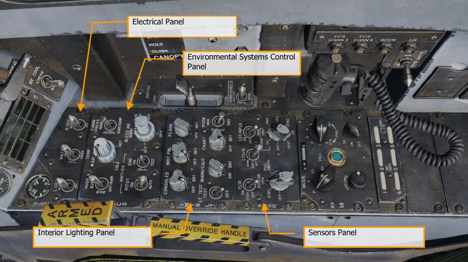

### Electrical Panel

The electrical (ELEC) panel has controls for both generators, the battery, and its voltage meter.

- **Left Generator Switch**. Used to enable or disable the left generator. This switch has two
positions. NORM to enable normal operation and OFF to disable the generator.
- **Right Generator Switch**. Used to enable or disable the right generator. This switch has
two positions. NORM to enable normal operation and OFF to disable the generator.
- **Batteries Voltmeter**. The voltmeter, which combines a utility battery voltmeter and
emergency battery voltmeter in one indicator, is on the electrical power panel. With the
battery switch OFF, the voltmeters are inoperative, and the indicator needles indicate 16
volts. With the battery switch ON, both voltmeters are operative; with the switch in ORIDE,
only the emergency battery voltmeter is operative.
- **Battery Switch**. The battery switch controls operation of the two onboard batteries and
has three positions:

    - OFF. Batteries can be charged, but battery contactors will not energize to
connect a battery to the essential bus in response to low voltage conditions.
    - ON. Enables control circuitry of both battery contactors, so the utility battery
contactor will automatically close in response to a low voltage condition on the
left 28-volt DC bus, and the emergency battery contactor will subsequently close
in response to a low voltage condition from the utility battery output and left 28-
volt DC bus.
    - ORIDE. Energizes emergency battery contactor regardless of charge status of
the utility battery, providing voltage on left 28-volt DC bus is absent or low.
Position can be used to connect the emergency battery to the essential buses in
the event utility battery contactor fails to energize with switch in the ON position.

### Environmental Control System Panel

The ECS panel controls include:

- **Bleed Air Select Switch**. This switch controls the bleed air source. Bleed air is
automatically shut off if a leak is detected.

    - **BOTH**. Bleed airflow is provided to the ECS by both engines.
    - **R OFF**. Bleed airflow is provided to the ECS by only the left engine.
    - **L OFF**. Bleed airflow is provided to the ECS by only the right engine.
    - **OFF**. All bleed airflow from the engines is shut off. This includes ECS cooling,
cabin pressurization, and warm air. Ram air is automatically used instead.
    - **AUG**. Allows the APU to augment bleed air pressurization of the cabin when the
aircraft has weight on wheels and engine operating at less than intermediate
settings.

- **Engine Anti-Ice Switch**. This switch controls anti-ice heating of the engine inlets.

    - **ON**. Allows hot bleed air to circulate through the engine inlet and engine
components.
    - **OFF**. Turns off engine anti-ice.
    - **TEST**. Triggers ice caution message.

- **Pitot Heater Switch**. There are two pitot-static tubes mounted under the nose on each
side forward of the nosewheel well. Each tube contains one pitot source and two static
sources. The pitot heater switch on the ECS panel has positions ON and AUTO.

    - **AUTO**. Heaters are on when airborne.
    - **ON**. Heaters are on when AC power is available.

###Interior Lighting Panel

The interior light panel controls all illumination options and settings within the cockpit.

- **Console Lighting Knob**. Integral and light panel lighting for the left and right consoles
and both cockpit circuit breaker panels are controlled by the CONSOLES knob which
provides variable lighting between positions OFF and BRT. With the MODE knob in the NVG
position, the CONSOLES knob provides variable NVG floodlighting between OFF and BRT
for the consoles.
- **Instrument Lighting Knob**. Integral and light panel lighting for the instrument panel,
UFC background, right and left vertical panels, and standby magnetic compass are
controlled by the INST PNL knob which provides variable lighting between positions OFF
and BRT. The INST PNL knob provides variable lighting between OFF and BRT, with the
MODE switch in either NORM or NVG.
- **Flood Lighting Knob**. Eight white floodlights are provided for secondary lighting. Three
console floodlights are above each console, and an instrument panel floodlight is located to
either side of the instrument panel. The FLOOD knob is inoperative with the MODE switch
in the NVG position.
- **Chart Lighting Knob**. A chart light is installed on the canopy arch. An NVG compatible
chart light is controlled by the CHART knob and rotates in two axes with variable lighting
between OFF and BRT. The chart light operates independent of the MODE switch position.
- **Lights Test Switch**. A lights test switch, labeled LT TEST, is provided to test the
warning/caution/advisory lights in addition to the AOA indexer lights and the integrated
fuel/engine indicator LCD displays.
- **Warning and Caution Lights Knob**. A knob labeled WARN/CAUT is provided on the
interior lights control panel to vary the brightness of the warning/caution/advisory lights
within the low intensity range. The warning/caution/advisory lights can be switched to the
low intensity range by placing the warning/caution lights knob momentarily to RESET, if
the INST PNL knob is out of the OFF position, and either the FLOOD knob is out of OFF but
less than 70% of BRT or the flood switch is in CHART.
The warning/caution lights come on at a reduced brightness in the NITE and NVG mode.
Once in the low intensity range, the warning/caution/advisory lights can be brought back to
high intensity by turning the MODE switch to the DAY position. With power interruption and
the MODE switch in NVG, the lighting system remains in the NVG mode when power is
restored. With power interruption and the MODE switch in DAY or NITE, the lighting
system defaults to the DAY mode when power is restored.
- **Mode Switch**. The MODE switch has positions of NVG, NITE, and DAY. The DAY position
permits the maximum brightness range for the warning, caution, and advisory lights and
the main and console panel lighting. The NITE position provides reduced brightness for the
warning, caution, and advisory lights, and normal intensity for the main and console
lighting. The NVG position provides reduced brightness for the warning, caution, and
advisory lights, disables the integral console lighting, and enables NVG compatible
floodlights to illuminate the consoles. The IFEI brightness knob is only functional in NITE
and NVG modes.

### Sensors Panel

- **INS Knob**. This eight-position rotary knob controls the inertial navigation system.

    - **OFF**. Removes power from the INS.
    - **CV**. Places the INS in carrier alignment mode.
    - **GND**. Places the INS in ground alignment mode.
    - **NAV**. Places the INS in navigation mode.
    - **IFA**. Places the INS in inflight alignment mode.

- **RADAR Knob**. Four position rotary knob controls all operating power applied to the radar
set.

    - **OFF**. Removes all radar set power.
    - **STBY**. Activates all components except for high voltage. Allows radar set to
warm-up before application of high voltage; or, removes high voltage but
maintains radar for immediate application of high voltage.
    - **OPR**. Commands radar to full operation if all safety interlocks have been
satisfied and initial warm-up time is complete.

- **FLIR Switch**. Three position toggle switch that controls electrical power to the ATFLIR or
LITENING targeting pod.

    - **OFF**. Removes all electrical power from the targeting pod.
    - **STBY**. Turns on standby electrical power, enables detector cool down.
    - **ON**. Turns power on for FLIR.

- **Laser Target Designator/Ranger (LTD/R) Switch**. Two position lever locked switch
that must be lifted before it can be moved to the magnetically held position. The LTD/R
switch enables arming of the laser when all other interlocks are met.

    - **SAFE**. Inhibits laser arming.
    - **ARM**. Enables laser arming. Magnetically held in ARM position when all interlocks
are met.

- **Laser Spot Tracker/Navigation FLIR (LST/NFLIR) Switch**. Two position toggle
switch that enables or disables LST/NFLR.

    - **OFF**. Disables primary power to the interconnecting box.
    - **ON**. with the LST/NFLR switch in the ON position, the primary power relay is
energized. The 28vdc power is supplied to the 5vdc regulators and is filtered.

Along the right wall are the canopy control switch, the FCS BIT switch, and circuit breakers for the
arrestor hook, landing gear, and FCS channels 3 and 4.

### Internal Canopy Switch

The internal canopy switch has three positions: OPEN, CLOSE and HOLD.

- **OPEN**. Raises canopy to maximum position. If selected when canopy is locked, the canopy
unlocks, then moves 1.5 inches aft before rising. With WOW, the OPEN position is solenoid
held until the maximum up position is reached, after which it is spring loaded to the HOLD
position. The solenoid can be overridden at any time by placing the switch to HOLD. With
weight off wheels, the switch must be held in the OPEN position to open the canopy.
Objects/Grimes light placed in the area near the canopy switch could inadvertently shift
causing actuation of the canopy switch airborne resulting in loss of canopy.
- **HOLD**. Stops the canopy at any point during the open or close cycle.
- **CLOSE**. Lowers canopy. If held after canopy reaches canopy sill, canopy moves forward
1.5 inches and then locks. Locked condition indicated by MASTER CAUTION light and
CANOPY display going out. CLOSE position is spring loaded to the HOLD position.

### Control Stick

The stick contains the pitch and roll trim switch, sensor control switch, Air-to-Ground bomb release
button, gun/forward-firing weapons trigger, Air-to-Air weapon select switch, undesignate/nosewheel
steering button. An autopilot/nosewheel steering disengage switch (paddle switch) is mounted below
the stick grip. Stick position sensors transmit an electrical signal proportional to stick displacement
from neutral to the flight control computers.

Several of the switches have multiple functions that depend on a selected mode. We will discuss
those in the later, relevant sections of this manual.

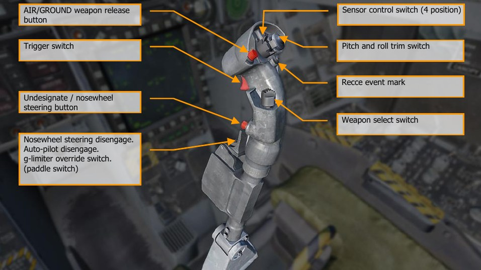

1. **Weapon release button [RAlt] + [Space]**. Press and hold to launch air-to-ground weapons,
including bombs, rockets, and air-to-surfaces missiles.
1. **Trigger switch [Space]**. Press to fire the gun and air-to-air missiles.
Undesignate/nosewheel steering button [S]. This button has different functions depending on
the state of the aircraft:

    - **Nosewheel Steering**. With weight on wheels and the flight control computers operating,
momentarily pressing the nose-wheel steering button activates and engages nose-wheel
steering and NWS is displayed on the HUD.

        If the nosewheel steering system fails, NWS and FCS are displayed on the DDI as cautions,
the MASTER CAUTION light comes on, and the NWS or NWS HI display is removed from
the HUD. When failed, the nosewheel steering system reverts to a free swiveling mode.

    - **Undesignate**. When not in a nose-wheel steering state (weight off wheels), this button is
used to undesignate a previously designated target or location. This commands radar
return to search and undesignates targets.

1. **Nosewheel steering disengage [A]**. This paddle switch has multiple functions depending on the
state of the aircraft. Functions include:

    - **Nosewheel Steering**. Disengages commanded nosewheel steering. If the high mode is
    desired during taxi, press and hold the nosewheel steering button. If the wings are folded
    and NWS is engaged, high gain mode is entered by pressing and releasing the NWS
    button.
    - **Autopilot Disengage**. Disengage the commanded autopilot mode and return to manually
    controlled flight.
    - **G Limiter Override**. The g limiter may be overridden by momentarily pressing the paddle
    switch with the control stick near full aft. Command limit g is then increased by 33%. A g-
    LIM OVRD caution is displayed, and the MASTER CAUTION light and tone come on.
    Override is disengaged when the control stick is returned to near neutral.

1. **Pitch and roll trim switch**. Normally, movement of the pitch ([RCtrl] + [.] and [RCtrl] + [;])
and roll ([RCtrl] + [,] and [RCtrl] + [/]) trim switch electrically biases the flight controls and the
stick does not move (unlike the A-10C and Black Shark). Little if any pitch trim is required in the
AUTO flap mode due to the automatic trimming functions within the flight control computers. Only in
landing configuration will manual pitch trim be required. If there is asymmetric loading, roll trim will
be required. In MECH, pitch trim moves the control stick fore and aft, changing the stick neutral
point. There is no mechanical lateral trim.

    Trim changes the tracked g loading up to 25° AoA. It is normally 1 g. Disengaging the autopilot in a
level 2 g, 60° bank angle turn will leave the stick trimmed for 2 g. This then requires significant stick
force to hold the nose down while in level flight. Re-engaging either Altitude Hold or Attitude Hold
with wings level should reset the trim back to 1 g. To better support game play, it is suggested that
the aircraft return to 1 g when AP is disengaged under all conditions.

    If flaps are down, pitch trim functions like other trim switches, holding the trim switch results in
continuous linear changes until the switch is released. Trim input with flaps down sets the flight
control computers to target an angle of attack. With flaps up, trim inputs more than one second are
ignored. Trim inputs with flaps up results in changes to tracked g.
Recce event mark [R]. In the early access, this can be used to blank the helmet mounted display
when pressed.

1. **Weapon select switch**. Four position switch which selects A/A weapon in A/A aircraft master mode.
Switch functions are discrete inputs.

    - **Forward [LShift] + [W]: Activates AIM-7, displays the priority missile**. Commands a
    radar antenna four bar elevation, 140° azimuth scan, 40-mile range selection, and
    interleaved PRF.
    - **Center Push [LShift] + [S]: Activates AIM-9 and displays the priority missile**. Commands
    a radar antenna four bar elevation, 80° azimuth scan, 40-mile range selection for AIM-9L,
    AIM-9M and AIM-9X, and interleaved PRF.
    - **Aft [LShift] + [X]: Activates gun and displays gun**. Commands GACQ to the radar
    system, a range of 5nmi, radar antenna azimuth scan of five bars, with 20° elevation scan
     (vertical scan). Configures sensor control switch to the ACM condition.
    - **Right [LShift] + [D]: Activates AIM-120 and displays priority missile**. Commands a radar
    antenna two-bar elevation, 80° azimuth scan, 40-mile range selection for AIM-120B/C, and
    interleaved PRF.
    
    !!! note
        If a target is tracked as the L&S, the weapon select switch should only change the weapon
        and not affect radar operation based on weapon selection.

1. **Sensor control switch (4 position)**. This is a four position, momentary, centering switch. Switch
functions are discrete inputs.

    - **Forward [RAlt] + [;]:** When in NAV or A/G mode, this assigns throttle designator control
     (TDC) priority to Head-Up Display (HUD). When in A/A mode, this also places the HUD in
    the ACM sub-mode and radar in boresight.
    - **Aft [RAlt] + [.]:** When in A/G mode, this assigns TDC priority to Advanced Multipurpose
    Color Display (AMPCD). When in A/A mode, this assigns the TDC to the AMPCD SA page. If
    in an A/A ACM sub-mode, this puts radar in vertical acquisition (VACQ). If in NAV mode,
    this toggles the AMPCD between the HSI and SA formats.
    - **Left [LAlt] + [,]:** Assigns TDC priority to the LDDI. If TDC priority is already assigned to
    the LDDI and LDDI is radar display, commands radar to track mode STT when TDC is over
    a radar return. If radar is tracking, commands break lock (not undesignate). In A/A ACM
    sub-mode, commands wide acquisition (WACQ) to radar system. If TGP FLIR is displayed
    on the LDDI, it will command a track in either A/A or A/G.
    - **Right [RAlt] + [/]:** Assigns TDC priority to the RDDI. If TDC priority is already assigned
    to the RDDI and RDDI is radar display, commands radar to track mode STT when TDC is
    over a radar return. If TGP FLIR is displayed on the RDDI, it will command a track in either
    A/A or A/G.
    
    !!! note
        All ACM modes will automatically lock a target.

## Throttles

The throttle grips contain switches that provide various systems control without moving the hand
from the throttles. As with the control stick, the HOTAS functions of the throttles vary in functionality
depending on the state and operational modes of the aircraft. These are discussed in the appropriate
sections of this document.

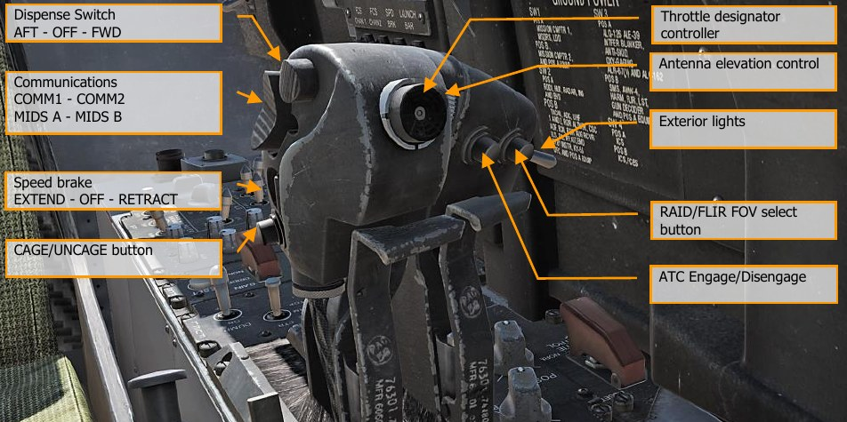

**Dispense Switch, AFT - OFF - FWD**. This three-way switch allows manual and semi-automatic use
of the ALE-47 countermeasure system.

- **Forward [E]**. Activates countermeasures program 5.
- **Center**. No function.
- **Aft [D]**. Activates the countermeasures program selected on the EW page.

When the Dispenser selector knob is in BYPASS, the switch has an alternate function:

- **Forward [E]**. Dispenses a single chaff.
- **Center**. No function.
- **Aft [D]**. Dispenses a single flare.

**Communications, COMM1 - COMM2 - MIDS A - MIDS B**. This is a four-position switch that
controls transmission over the four radios.

- **Forward**. Transmit over COMM1.
- **Aft**. Transmit over COMM2.
- **Down**. Transmit over MIDS A.
- **Up**. Transmit over MIDS B.

**Speedbrake EXTEND - OFF - RETRACT**. The speedbrake is mounted between the vertical
stabilizers. It is controlled by a throttle mounted switch. Airborne, when in the AUTO FLAPS UP mode,
the speedbrake automatically retracts above 6.0 g or above 28° AOA and, when not in the auto flaps
up mode, below 250 knots. The speedbrake will automatically retract if flaps are extended unless the
speedbrake switch is held aft. The speedbrake extends with the flaps HALF or FULL so long as the
switch is held in EXTEND. The speedbrake can be commanded to extend to any intermediate position
but will retract fully with a momentary forward press of the speedbrake switch. The speedbrake
operates normally on the ground.

With flaps extended and weight on wheels (after landing or during an abort for example), the speed
brake remains extended without holding the speed brake switch aft.

- **Aft [LShift] + [B]**. Extends the speed brake while the switch is held aft. Spring-loaded to
center detent.
- **Forward [LCtrl] + [B]**. Retracts the speed brake or maintains the speed brake retracted
and prevents creep.
- **Center [B]**. Speedbrake will creep closed if open when speed is greater than 400 kts.

**CAGE/UNCAGE button [C]**. This switch has multiple functions that depend on the active system or
weapon.

- **NAV Mode**. Used to cage or uncage the velocity vector on the HUD.
- **A/A Mode, AIM-9**. Controls Sidewinder seeker position. AIM-9 seeker head is boresighted
until L&S designation, then it is slaved to the L&S. Pressing the cage button with an L&S,
toggles the seeker head between the L&S and boresight. Pressing and holding the cage
button with the AIM-9 seeker head in boresight, then maneuvering the aircraft to point at a
target heat source, achieving AIM-9 tone rise, then releasing the cage button will result
in AIM-9 seeker head tracking the heat source to the gimbals of the missile.
- **A/A Mode, AIM-7**. In A/A mode with Sparrow missile selected, commands radar into STT
on the L&S target.
- **A/G Mode, Maverick**. Cages the Maverick to boresight, or uncages it and allows it to
slew.

**Throttle Designator Controller (TDC)**. Upon setting TDC to one of the displays, the TDC acts as
a slew control to move the cursor / sensor. Controls are up [;], down [.], left [,], right [/], and
depress [Enter].

- Not pressed, with left or right force applied: Positions acquisition symbol left or right
at rate proportional to pressure applied to control.
- Not pressed with up or down force applied: Positions acquisition symbol up or down
at rate proportional to pressure applied to control.
- Pressed: Starts acquisition phase. Positions acquisition symbol or designator cursors
depending on direction of force applied to control.
- Released (cursor in tactical area of display): Commands radar lock-on, target
designation, or active processing depending on mode of operation.

With the “Realistic TDC Slew” option enabled under the Special settings for the F/A-18 Hornet, the
TDC must be held down to slew certain display formats, such as the AGM-65 Maverick.

**Antenna elevation control**. The AN/APG-73 radar can have its antenna dish rotated up and down
to alter the radar elevation scan. This rotary allows the pilot to position the antenna elevation scan.
Controls are up [=] and down [-].

**Exterior lights switch [L]**. The exterior lights master switch, on the outboard left throttle grip,
provides a master control for the following exterior lights: position lights, formation lights, strobe
lights, and refueling probe light.

- **OFF (AFT)**. Power for lights controlled by switch is cut off.
- **ON (FWD)**. Power is available for lights controlled by switch.

**RAID/FLIR FOV select button [I]**. Depending on the controlled sensor or weapon, this button
has multiple functions:

- Selects the RAID mode when the radar set operating mode is Track While Scan (TWS) or
Single Target Track (STT).
- When HARM is selected, cycles HARM targets from center outwards.
- When ATFLIR or TGP is active, cycles between FOV settings.
- When in Maverick mode, toggles FOV.

**ATC Engage/Disengage [T]**. The ATC approach mode is engaged by pressing and releasing the
ATC button on the left throttle with the flap switch in HALF or FULL and the trailing edge flaps
extended at least 27°. When ATC is engaged in the approach mode, the flight control computer
modulates engine thrust to maintain on-speed AOA. The computer uses inputs of AOA, normal load
factor, stabilator position, pitch rate, and angle of bank to generate command signals. These signals
drive the engine mounted throttle control units which in turn command the engine fuel controls. The
computer uses AOA as the primary input to generate command signals. However, normal load factor
provides increased stability, stabilator position provides increased or decreased thrust for pilot
induced pitch changes, pitch rate provides lead during pitch maneuvers, and bank angle provides
additional thrust during banking maneuvers. Normal disengagement is accomplished by pressing the
ATC button or applying and holding force to either throttle. Automatic disengagement occurs for the
following reasons:

- Flap AUTO up
- AOA sensor failure
- Two or more failures of either trailing edge flap
- Trailing edge flap deflection less than 27°
- ATC button fails
- FCES channel 2 or 4 fails
- WOW
- FCS reversion to MECH or to DEL in any axis
- Left and right throttle angles differ by more than 10° for more than 1 second
- Bank angle exceeds 70°
- Any internal system failure
- Selection of gain ORIDE

**ATC Cruise Mode**. The ATC cruise mode is engaged by pressing and releasing the ATC button on
the left throttle with the flap switch in AUTO. When ATC is engaged in the cruise mode, the existing
airspeed is used by the flight control computer to modulate engine thrust to maintain this existing
airspeed. The existing airspeed is the airspeed being sent from the ADC to the flight control
computers via the mission computers. An ADC failure inhibits the ATC cruise mode of operation. The
FCC uses true airspeed from ADC via the mission computers at the time of engagement to generate a
command signal. This signal is then used as a reference to generate an error signal that drives the
engine mounted throttle control units. Normal disengagement is accomplished by pressing the ATC
button or applying and holding force to either throttle. Automatic disengagement occurs for the
following reasons:

- Flaps HALF or FULL
- ATC button fails
- FCES channel 2 or 4 fails
- FCS reversion to MECH or to DEL in any axis
- Left and right throttle angles differ by more than 10° for more than 1 second
- ADC true airspeed failure
- ADC degraded
- Any internal system failure

## Audio Tones

The Hornet has a variant of audio tones that consist of the following:
Departure Warning Tone. The Departure Warning tone is a high-pitched solid or broken tone that
occurs when certain AoA limits are exceeded.

**Master Caution Tone**. Whenever the master caution is triggered, the master caution tone will
sound. It has a “deedle deedle” sound.

**Radar Warning Receiver Tones**. There are three tones associated with the RWR:

- RWR Status Change. This descending three tone is heard when an RWR contact changes
status (i.e., search mode to lock mode).
- New RWR spike detected. This single, short tone is heard when a new RWR signal is
detected.
- Launch tone. When a radar guided missile launch is detected, this repeating, multi-pitch
tone is heard while the threat is detected.

**FCS Voice Alerts**. Any FCS caution except CHECK TRIM, FCS, NWS, FC AIR DAT, g-LIM OVRD, or R-
LIM OFF is accompanied by a “flight controls, “flight controls” voice alert. An engine fire would be
result in “Engine Fire Left” and/or “Engine Fire Right”. An APU fire would result in “APU Fire”. A bleed
air failure will result in either a “Bleed Air Left” and/or “Bleed Air Right”.

- “Flight controls, flight controls”
- “Engine fire left, engine fire left”
- “Engine fire right, engine fire right”
- “APU fire, APU fire”
- “Bleed air left, bleed air left”
- “Bleed air right, bleed air right”
- “Flight computer hot”
- “Fuel low”
- “Bingo”
- “Altitude”

All voice alerts are repeated twice (e.g., “Engine Fire Left, Engine Fire Left”)
Primary Radar Low Altitude Warning. If the landing gear is up and locked and the radar altitude
is less than the Low Altitude Limit index, the primary low altitude warning tone/voice alert is heard in
the pilot’s headset. A “whoop whoop” warning tone is heard. The voice alert or warning tone is
activated at ground power-up to familiarize the pilot with the warning. When first activated in flight,
the warning is continuously repeated until reset or disabled. The warning is reset by setting the low
altitude index to an altitude below the present altitude or by climbing to an altitude above the low
altitude index setting. The warning can be disabled by pressing the RALT button on the UFC or by
commanding the UFC to another mode. Once disabled it cannot be triggered until after being reset as
described above.

With an MC1 failure, the voice alert/warning tone is not sounded when the aircraft descends below
the altitude set by the low altitude index pointer.

With landing gear down, the radar altimeter warning sounds once when the aircraft descends
through the set altitude.

