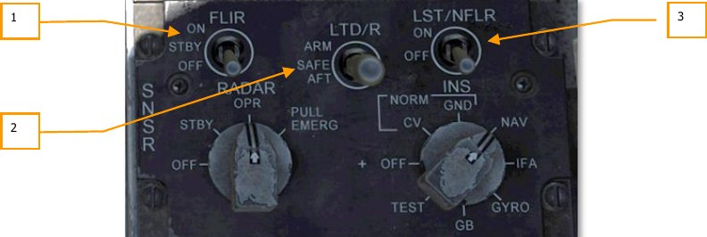
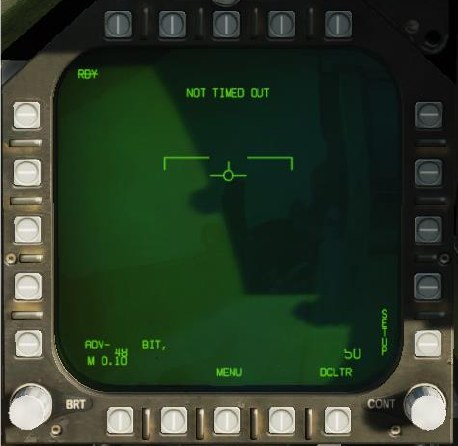
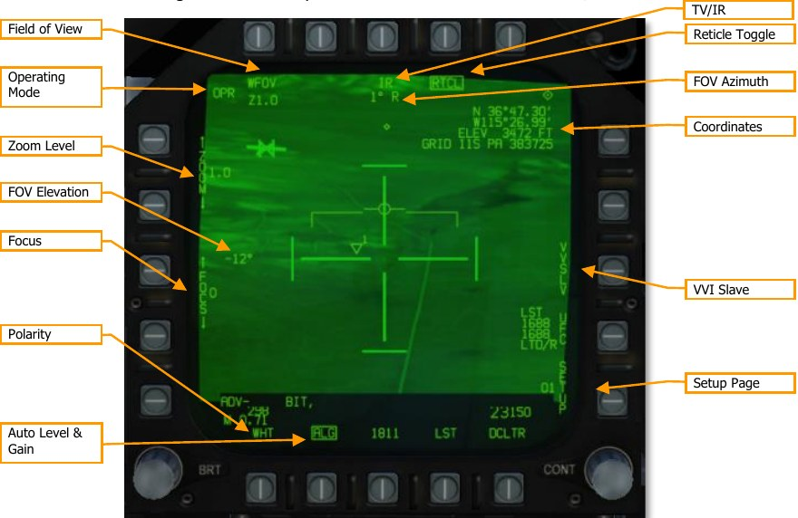
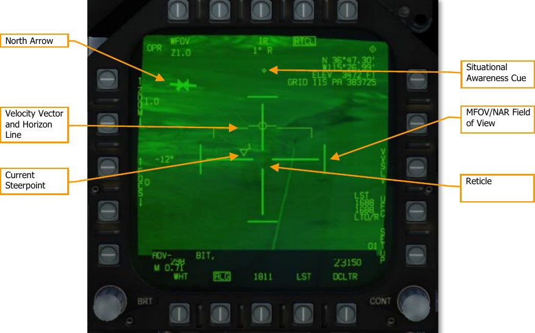
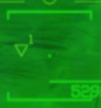
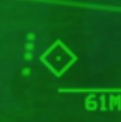
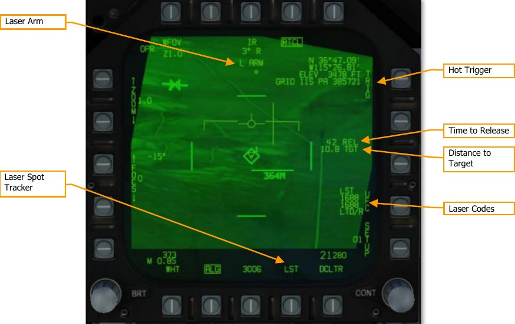
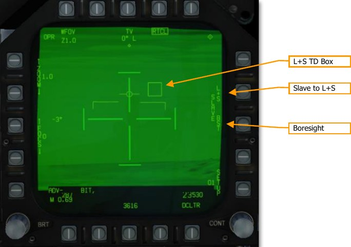

# AN/ASQ-228 ATFLIR

The Advanced Targeting Forward Looking Infrared (ATFLIR) pod is a slewable electro-optical pod
with laser designation, ranging, and searching capability. It is capable of both video and infrared
imaging, as well as moving target tracking. The ATFLIR is effective in both the air-to-ground and air-
to-air role. The ATFLIR can only be mounted on the left cheek hardpoint, and weighs 424 lbs.
The ATFLIR is selected from the PB6 on the TAC page with the Master Mode set to A/G or NAV.
The ATFLIR camera is slewed using the TDC, when the TDC is assigned to the DDI displaying the
FLIR format. As with other formats, a small diamond appears in the top-right corner of the display
when TDC is assigned to that DDI. TDC assignment is done using the Sensor Control Switch on the
stick.

The three primary operating modes of the ATFLIR are standby (STBY), air-to-ground (A/G) and air-
to-air (A/A). The FLIR format is also available while the ATFLIR is warming up (“not timed out”).
The ATFLIR’s sensor suite is mounted on a gimballed platform that can move in two directions. The
sensor platform is normally stowed when the power switch is in OFF or STBY, when the landing gear
is down, and when the aircraft is stopped on the ground. When airborne and with the ATFLIR active,
the sensor platform rotates, exposing the lenses.
The sensor platform is free to rotate in two axes but is limited by obscuration from the aircraft or the
rest of the pod structure. This is true of the FLIR and CCD video, the laser target designator, and the
laser spot tracker. When the sensors are obscured by a part of the aircraft or the pod itself, the
sensors are said to be “masked.”

When the laser target designator (LTD) fires, it modulates the laser signal with a pre-coded pulse
repetition frequency (PRF). This PRF is coded as a four-digit number, from 1211 to 1688, which is
used to distinguish between different simultaneous laser designations made by other aircraft or
ground units. Likewise, when the laser spot tracker (LST) searches for a laser, it does so using a
specific PRF code, and ignores laser spots with a different code (or unmodulated laser emissions with
no code). The code used by the LTD and the one used by the LST need not be the same.
Sensor Control Panel

Power to the FLIR, laser target designator (LTD), and laser spot tracker (LST) is done using controls
on the Sensor Control Panel.

1. **FLIR Power Switch.** In OFF, power to the ATFLIR is removed. In STBY, power is applied
to the ATFLIR but no video is displayed. In ON, power is applied, and video is displayed.
Moving the power switch from OFF to either STBY or ON begins a warm-up period, during
which the FLIR format will display NOT TIMED OUT.

2. **Laser Target Designator Power Switch.** When set to SAFE, the laser target designator
will not fire. When set to ARM, the laser target designator will fire when commanded.

3. **Laser Spot Tracker Power Switch.** Controls power to the laser spot tracker.

## ATFLIR Activation

Before the targeting pod can be used, power must be applied. This is done by moving the FLIR
Power switch from OFF to either STBY or ON. After doing so, the targeting pod will enter a warm-up
period. During this time, the FLIR format will display NOT TIMED OUT:

Once the warmup period is complete, if the FLIR Power switch is in STBY, the FLIR format will display
STBY in the upper-left corner, and show standby symbology:

If the FLIR Power switch is moved to ON, the ATFLIR will begin displaying video. Initially, video will
be slaved to the velocity vector (VVSLV).

## Air-to-Ground Mode

The ATFLIR is in air-to-ground mode any time the aircraft master mode is A/G.

**Operating Mode.** Displays the current operating mode of the ATFLIR:
- -RDY-: Not timed out (ATFLIR is warming up)
- STBY: Standby (ATFLIR is powered but in standby mode)
- IBIT: Interruptive BIT (ATFLIR is in TEST mode)
- OPR: Operating

**Field of View.** Depressing this PB toggles between WFOV (wide field-of-view), MFOV (medium field-
of-view) and NAR (narrow field-of-view). The second line displays the current zoom level within that
field of view. Both MFOV and NAR have Z1.0 and Z2.0 levels available, while WFOV only has Z1.0.

**Zoom Level.** The pushbuttons alter the zoom level within the current field of view. The current
zoom level is shown adjacent to the word “ZOOM”. Both MFOV and NAR have Z1.0 and Z2.0 levels
available, while WFOV only has Z1.0.

Field of view and zoom together can also be modified using the antenna elevation control on the
throttle when TDC is assigned to the FLIR.

**TV/IR.** Pressing this PB toggles the video display between TV (normal CCD video) and IR (infrared
video).

**FOV Azimuth/Elevation.** These fields indicate the ATFLIR field-of-view’s angle away from
boresight. In the image, the ATFLIR is pointing 1° right of boresight and 12° below boresight.

**Focus.** The pushbuttons alter the focus level of the IR video. The number adjacent the word
“FOCUS” is the current focus level. Not implemented.

**Polarity.** Pressing this PB toggles the infrared video between WHT (white-hot) and BLK (black-hot)
polarity. Not shown when TV video is active.

**Auto Level & Gain.** Pressing this PB toggles auto level and gain on and off. When on, video level
and gain is controlled automatically to produce the best image. When off, level and gain is controlled
by the pilot. See Manually Controlling Level and Gain, below.

**Reticle Toggle.** Pressing this PB displays or inhibits the reticle.

**Coordinates.** This datablock displays the coordinates where the current pod FOV intersects with the
ground (i.e., the location under the reticle). Coordinates are displayed as latitude and longitude, then
elevation, and then MGRS grid. If the offset reticle is displayed, the coordinates will reference the
offset reticle.

**VVI Slave.** Boxing VVSLV slaves pod LOS to the VVI in the HUD. VVSLV can also be activated by
pressing the Undesignate button twice.

**Setup Page.** Pressing this PB displays additional setup options. The number adjacent the word
“SETUP” is the active profile. Currently only profile 01 is available. See SETUP Menu, below.

**Reticle.** The reticle indicates pod LOS. The shape of the reticle depends on the current tracking
mode (see Tracking Modes, below).

**MFOV/NAR Field of View.** In WFOV, the tick marks at the edges of the reticle indicate the MFOV
area. In MFOV, the ticks indicate the NAR area. The tick marks are larger in WFOV than they are in
MFOV, to indicate the current zoom level. The tick marks are not displayed in NAR.

**North Arrow.** Indicates the direction of magnetic north. Rendered as four tick marks oriented along
the ground plane.

**Velocity Vector and Horizon Line.** Repeats the velocity vector and horizon line on the HUD. The
horizon line flashes if the aircraft enters an unusual attitude.

**Current Steerpoint.** Indicates the location (including elevation) and number of the active
steerpoint.

**Situational Awareness Cue.** This diamond moves left or right from center to indicate that the pod
has a left or right azimuth offset from boresight. The diamond moves up or down to indicate that the
pod has an up or down elevation offset from boresight. When boresighted, the diamond is centered
laterally and close to the top of the display. The extreme edges of the display roughly correspond to
the slew limits of the pod. The diamond is centered vertically on the screen when the pod is pointed
straight down.

**Tracking Mode.** Indicates the current target tracking mode. See Tracking Modes, below. Pressing
the SCS in the direction of the FLIR format cycles between designation, SCENE, and AUTO tracking
modes. Pressing the Undesignate button activates INR tracking mode.

**Tracking Gates.** In AUTO track mode, the reticle becomes a pair of tracking gates. The gates
expand or contract to enclose the target that was contrast-locked and is being tracked.

**Offset Designation Reticle.** This reticle is used to make an offset designation (see Offset
Designation, below).

**Meterstick.** The meterstick is rendered as a horizontal line. The number below the meterstick is the
length of that line in meters along the ground plane.

**Moving Target Indication.** “MVTGT” is displayed when tracking a moving target. This field is blank
when not tracking a moving target.

### Tracking Modes

The ATFLIR is in one of the following tracking modes at any time:

- **INR.** This mode is active when the pod is being slewed. It maintains pod orientation
relative to the aircraft by using inertial rate data from the aircraft.

- **SCENE.** The ATFLIR attempts to track the portion of the image under the reticle. This
tracking mode is effective against stationary targets without well-defined edges.

- **INR SCENE.** The ATFLIR enters this mode when the pod is slewed while in SCENE mode.
The ATFLIR will enter SCENE mode again once slewing is complete.

- **AUTO.** The ATFLIR attempts to track an object centroid using a contrast-detecting
algorithm. This tracking mode is effective against stationary and moving targets with well-
defined edges, either in TV or IR mode.

- **INR AUTO.** The ATFLIR enters this mode when the pod is acquiring a target while in
AUTO mode. The ATFLIR will enter AUTO mode once acquisition is complete.

- **Designation.** Pod LOS is slaved to the designated target or target waypoint.

Initially the ATFLIR will be in designation mode or will be slaved to the VVI if there is no designation.
Pressing the SCS in the direction of the FLIR format will cycle between designation, SCENE, and
AUTO modes. Pressing the Undesignate button once will return to INR mode, and pressing it twice
will slave the pod to the VVI.

In INR and SCENE modes, the pod can be slewed using the TDC. In designation mode, pressing
down on the TDC will activate slew and allow the designation to moved. The TDC cannot be moved
in AUTO mode, whether or not the pod is tracking a target.

The reticle shape changes depending on the current tracking mode:

### Using the LTD/R and LST

The FLIR format has options and indications relevant to laser designation and laser search:

**Laser Arm.** This field is displayed whenever the LTD/R switch is in ARM.

**Time to Release.** Displays the estimated time until reaching the weapon release point, in seconds.
Post-release, the “REL” text will change to “LASER” and the field will count down until the time the
laser begins firing (for LGB attacks). Finally, the text will change to “TTI” and the field will count
down the estimated time until impact.

**Distance to Target.** The range to the tracked target, in nautical miles. Displayed when the ATFLIR
is in a track mode and the LTD/R is armed.

**Hot Trigger.** Boxing this option will cause the laser to fire whenever the trigger is pressed. When
the trigger is pressed, the laser will fire for two seconds. When the trigger is held down, the laser will
fire continuously.

**Laser Spot Tracker.** Pressing this PB activates the laser spot tracker. See Using Laser Spot
Tracking, below.

**Laser Codes.** Pressing this PB displays options for setting the LTD/R and LST laser codes on the UFC
(see Setting Laser Codes, below). The datablock indicates the selected laser codes for the laser spot
tracker and the laser target designator/ranger.

### SETUP Menu

Pressing PB 15 (SETUP) will display the setup menu:

**Coordinate Option.** Pressing this PB cycles between the display options for the coordinates
datablock: ALL (latitude/longitude, elevation, and MGRS), L/L (latitude/longitude and elevation),
GRID (elevation and MGRS) and OFF.

**Eye Safe Laser.** Boxing this option sets the LTD/R laser power to an eye-safe level suitable for
training. Not implemented.

**Transfer Alignment Mode.** When boxed, the primary transfer alignment mode (transfers aircraft
position and velocity) is used. When unboxed, the reversionary transfer alignment mode (transfers
aircraft position only) is used. Not implemented.

**Reinitialize Alignment.** Restarts the transfer alignment process. Not implemented.

**Grayscale.** A static grayscale image. Can be used when manually setting level and gain.

### Setting Laser Codes

To set the laser codes for the LTD/R or the LST, press PB 14, labeled “UFC”:

Then, on the UFC, press the OSB adjacent to either LTDC (to set the LTD/R code) or LSTC (to set the
LST code):

Finally, enter the laser code and press ENT. The new code will be reflected on the FLIR format.

### Designating and Tracking Ground Targets

The ATFLIR will initially be slewed to the designated target, if one has been designated. For example,
if you have a waypoint in the vicinity of the target area, or an A/G radar lock in the target area,
designating that waypoint or radar lock will cause the ATFLIR to slew to that location. From there,
you can assign TDC to the FLIR format, and press down on the TDC to activate slewing. Use the TDC
to locate the target and move the designation to it.

Designate mode is an inertial-rates tracking mode, which means the pod is using the aircraft’s inertial
data only to track the target, which will incur inaccuracies over time. With the TDC assigned to the
FLIR format, press the SCS in the direction of the FLIR format to change to SCENE tracking mode.
SCENE mode is suitable for tracking stationary targets.

If you wish to track a moving target, position the reticle just ahead of the moving target and then
press the SCS once more to change to AUTO mode. As the vehicle moves into the reticle, the pod will
lock onto it and begin tracking it. If the pod was unable to acquire the target, cycle back to INR or
SCENE mode, reposition the reticle, and change back to AUTO mode for another attempt.

Once a target has been acquired by the pod, the designation can be used for attacks with laser-
guided bombs. See Laser-Guided Bombing for more.

Pressing the Undesignate button will return the pod to INR mode.

#### Offset Designation

When in AUTO mode with a target acquired, pressing the TDC will show the Offset Designation
reticle:

When the Offset Designation reticle is displayed, the coordinates in the top-right datablock reference
that reticle instead of the tracked target. You can slew the Offset Designation reticle using the TDC.
The Offset Designation reticle always moves relative to the tracked target; it is not ground-stabilized.

#### Designating Targets Using the Laser

The laser target designator/rangefinder (LTD/R) is a pulsed laser that is automatically aimed along
pod line of sight. In the designation role, the laser can provide a guidance solution for laser-guided
munitions, both onboard the designating aircraft and from other units; and it can train other
platforms’ sensors onto the designated target. In the range-finding role, the laser provides
continuous target slant range measurements to the aircraft avionics.

To use the LTD/R, the LTD/R switch on the Sensor Control Panel must be set to ARM. Normally, the
laser will fire automatically when designating a target, launching an AGM-65E, or dropping an LGB.
Boxing the TRIG option (PB 11) allows the laser to be controlled by the trigger. This is useful when
buddy-lasing (designating a target for another aircraft to fire upon).

### Using Laser Spot Tracking

The ATFLIR can also detect and track laser signals emitted by other aircraft or ground units, in laser
spot track (LST) mode. In this mode, the targeting pod searches for a laser signal by its PRF code.
When the laser signal is detected, the pod slews to the target being designated by that laser. Laser
spot tracking can by other aircraft or ground units to slew your targeting pod onto their target.

To set the PRF code that the laser spot tracker searches for, press PB 14 (UFC) on the FLIR format.
Box PB 17 (labeled LST) to activate LST mode. The display will initially blank:

Once a designation laser is detected, the pod will slew to its location, and “LST” will be displayed at
the top of the FLIR format. You can then designate the target or switch to a tracking mode, and LST
mode will automatically exit.

### Manually Controlling Level and Gain

Normally the video level (brightness) and gain (contrast) is controlled automatically to produce the
best picture. If needed, the pilot can manually adjust level and gain to identify targets that would
otherwise appear washed out or too dark.

To manually control level and gain, unbox the ALG option at PB 19. After doing so, the ZOOM and
FOCUS controls will be replaced by level and gain controls:

Use PB 2 through 5 to manually adjust level and gain. Zoom and focus levels are shown adjacent to
PB 1. Pressing PB 1 restores the zoom and focus controls, and gain and level values will then be
displayed adjacent to PB 1.

Pressing PB 19 returns the ATFLIR to auto gain and level.

## Air-to-Air Mode

The ATFLIR is in air-to-air mode whenever the aircraft master mode is A/A. Most of the controls and
symbology are shared with the air-to-ground mode:

**L+S TD Box.** This box encloses the Launch & Steering Target. The L+S is outside pod FOV, the box
flashes and is pinned to one side of the display.

**Slave to L+S.** Pressing this PB slews the pod to the current L&S. The pod remains slewed to the
L&S while this PB is boxed. Pressing the PB again will return the pod to INR mode and allow slewing.

**Boresight.** Pressing this PB boresights the pod. Slewing the pod will automatically unbox this PB.

### Acquiring Air Targets

In air-to-air mode, only INR and AUTO tracking modes are available. Either boresight the pod or
slave it to the L&S to put the target within the pod FOV. Once the target is within the pod FOV, press
the SCS switch in the direction of the FLIR format to command AUTO track. The pod will attempt to
lock onto the aircraft. It is not necessary to place the reticle over the aircraft first.

