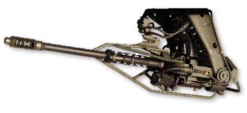
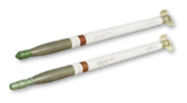
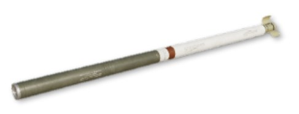

# Weapons & Munitions

The AH-64D was designed primarily to employ the Hellfire Modular Missile System (HMMS), along with its Area
Weapon System and Aerial Rocket Subsystem. It has four hardpoints, two mounted to each stub wing. Each
hardpoint is capable of articulating between +4° to -15° in elevation.

### M139 Area Weapon System (AWS)

The Area Weapon System (AWS) consists of an M230 30mm
automatic chain-driven gun mounted on the underside of the
helicopter between the two main landing gear, its turret,
controls, and the ammunition handling system. The weapon is
mounted on a hydraulically steered turret that can be slaved to
the TADS line-of-sight, the IHADSS line-of-sight, or a fixed
forward-firing position. The turret can steer up to ±86° in
azimuth and can elevate up to +11° or depress down to -60°.

The M230 fires 30x113mm link-less, tracer-less ammunition at a rate of up to 625 rounds per minute. Ammunition
is stored in a magazine in the main fuselage under the transmission and can hold up to 1200 rounds. When the
Internal Auxiliary Fuel System (IAFS) is installed, magazine size is reduced to 300 rounds.

**M788 Target Practice**. The M788 is an inert training round used for target
practice. The M788 is ballistically matched to the M789 HEDP rounds.

**M789 High Explosive/Dual Purpose**. The M789 is a dual-purpose tactical
round used for combat operations. The round has a light armor penetrating
capability as well as a bursting fragmentation effect for anti-material and anti-
personnel use.

### Aerial Rocket Sub-System (ARS)

The Aerial Rocket Sub-system consists of M261 lightweight
rocket launchers, capable of firing 2.75-inch folding fin aerial
rockets (FFARs), primarily variants of the Hydra-70 rocket
family. The M261 consists of 19 individual rocket tubes, and
may be loaded on all four pylons, for a maximum of 76 rockets.
Each M261 rocket launcher is "zoned", allowing for carriage of
up to three different rocket types with one pair of launchers
mounted, or up to five rocket types with two pairs of rocket
launchers mounted. Each tube includes individual firing and
fusing circuits.

The Hydra-70 rocket family is typically employed with the Mk 66 motor, with many different warhead options
available. Variants employed by the U.S. Army include the following:

**M151 High Explosive**. Also called the "10-pounder", the M151 is used
against lightly armored and soft targets. The warhead may be equipped with
the either M423 point-detonating (PD) fuze or the M433 resistance-
capacitance (RC) programmable delay fuze.

**M229 High Explosive**. Also called the "17-pounder", the M229 is used
as an enhanced “aerial artillery” warhead over the M151. The warhead
is equipped with the M423 point-detonating (PD) fuze. Minimum range:
140 meters.

**M156 White Phosphorus**. The M156 “Willie Pete” rocket is used for
target marking. The warhead is equipped with an M423 point-detonating
fuze for ground dispersal of the warhead’s effects, which generates a        
white smoke marking signal for approximately 2 minutes (depending on
wind conditions). (N/I)

**M264 Red Phosphorus**. The M264 is used for generating smoke-
screen concealment. The warhead is equipped with an M439 variable
time delay fuze, which generates a white smoke concentration across          
several hundred meters for approximately 5 minutes (depending on wind
conditions). (N/I)

**M261 Multi-Purpose Sub-Munition**. The MPSM contains 9
submunitions for use against lightly- to medium-armored vehicles and
soft targets. The warhead is equipped with an M439 variable time delay       
fuze for an airburst just prior to the target. Minimum range 1,000 meters.
(N/I)

**M255A1 Flechette**. The “Flechette” contains 1,179 60-grain
hardened steel flechettes for use against soft targets or personnel. The
warhead is equipped with an M439 variable time delay fuze for an             
airburst just prior to the target. Minimum range 800 meters; effective
range 1 to 3 kilometers. (N/I)

**M257 Illumination**. The “Overt Illum” is used for battlefield
illumination, and is equipped with an M442 fixed time fuze, which
will deploy a parachute-equipped flare approximately 3,500 meters
from its launch point. Provides illumination for approximately 3
minutes.

**M278 IR Illumination**. The M278 “Covert Illum” is used for covert
battlefield illumination, and is equipped with an M442 fixed time fuze,
which will deploy a parachute-equipped flare approximately 3,500             
meters from its launch point. Provides IR illumination for night vision
goggle-equipped personnel for approximately 3 minutes. (N/I)

**M274 Training**. Also called the "blue spear", the M274 training rocket
produces a brief smoke signature for target practice. An M423 point-
detonating (PD) fuze is integrated into warhead casing, which detonates
to provide a small, but noticeable flash and smoke signature for impact
spotting. This rocket is ballistically matched to the M151 HE rocket to
provide identical targeting and engagement training for aircrews.

### Hellfire Modular Missile System (HMMS)

The Hellfire Modular Missile System is the primary weapon system
of the AH-64D. It can employ both semi-active laser-guided (SAL)
and active radar-guided (RF) variants of the AGM-114 Hellfire
missile. The system consists of the M299 four-rail missile launcher,
which can fire all variants of the Hellfire missile.

The Hellfire is an air-to-ground, anti-armor missile that has been
expanded in capability to include other air-to-surface applications.
The Hellfire is an effective standoff weapon which can be employed
as a direct- or indirect-fire weapon and can be fired from behind
cover or in the open. The Hellfire weighs approximately 100 lbs.
and has a 20-pound high-explosive anti-tank (HEAT) warhead,
which includes a tandem shaped-charge for defeating reactive armor.
Up to four Hellfires can be loaded on a single launcher, for a total of up to sixteen.

**AGM-114K Laser-guided HEAT**. The AGM-114K is a semi-active
laser-homing variant with both Lock-On Before Launch (LOBL) and
Lock-On After Launch (LOAL) capability. In LOBL mode, the Hellfire uses
a nose-mounted laser seeker to lock on to a coded laser designation
prior to launch. When launched in LOAL mode, the crew can select from
multiple trajectories that the missile will fly using a digital autopilot
system until it detects a laser designation mid-flight that matches its
assigned laser code.

**AGM-114L Radar-guided HEAT**. The AGM-114L is an active
radar-guided variant, making it a fire-and-forget weapon, and
retains LOBL and LOAL capability like its laser-guided predecessor.
In LOBL mode, the Hellfire uses an onboard millimeter wave
(MMW) radar seeker to lock on to the target prior to launch. In
LOAL mode, the Hellfire uses an inertial guidance system to fly to
the target location prior to acquiring the target with its MMW radar.

### Auxiliary Fuel Systems (IAFS & ERFS)

The AH-64D can be equipped with auxiliary fuel systems to increase range and combat radius, extend endurance
at the objective area, or enable the AH-64D to self-deploy over long distances.

**100-gallon Internal Auxiliary Fuel System (IAFS)**. The 100-gallon IAFS replaces the standard 1200-round
ammunition magazine for the Area Weapon System. The IAFS provides 98 gallons of usable fuel and storage for
up to 242 rounds of 30mm ammunition (300 rounds total). Like the main fuel tanks, the IAFS is crashworthy,
self-sealing if punctured by hostile fire, and nitrogen-inerted to prevent incendiary effects.

**230-gallon Extended Range Fuel System (ERFS)**. The 230-gallon ERFS tanks can be
mounted to the external wing stations. Unlike
the IAFS, the ERFS tanks do not have a fuel
quantity measurement system, but each ERFS
tank does have a sensor to indicate when the
tank itself is empty. In addition, the ERFS tanks
are not crashworthy or self-sealing, and are
typically only used for self-deployment.
However, on occasion these tanks may be used
in combat areas if absolutely necessary.

{!abbr.md!}
{!dev-docs/ah64d/abbr.md!}
{!docs/ah64d/abbr.md!}
