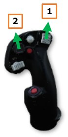

# Taxi & Before Takeoff

The AH-64 may perform hover taxi (<25 feet and <20 knots) or air taxi (<100 feet and/or >20 knots) operations
like any other helicopter, but ground taxi is typically used when feasible. Ground taxi allows the aircraft to be re-
positioned away from other aircraft and ground support equipment using a lower power setting, which minimizes
the rotor wash effects on the aircraft surroundings. This prevents foreign object damage to other aircraft, blowing
dust/snow, and allows ground personnel to continue operations on the flight line with minimal disturbance.

The AH-64 uses a free-rotating tail wheel to facilitate taxi maneuvers on the flight line, which can be selectively
locked to the rear position by either crewmember. Steering control is provided by tail rotor thrust, controlled by
the anti-torque pedals within the cockpit. As such, it is advisable that the aircrew keep the tail wheel locked until
aircraft movement has been initiated and the aircraft is clear of personnel and equipment. This allows the
crewmember on the controls to better ascertain the appropriate pedal positions that are required to prevent the
tail from adversely swinging to either side after the tail wheel is unlocked.

## Before Taxi

Prior to initiating ground taxi, perform the following:

1.   [[**PLT / CPG**]]   Chocks removed – Verify with ground personnel.
2.   [[**PLT / CPG**]]   Bleed Air – On (UTIL page).
3.   [[**PLT / CPG**]]   ANTI-ICE – As required (UTIL page).
4.    [[**PLT**]] EXT LT panel – Verify NAV lights are set in accordance with local procedures, ANTI-COL – WHT for day
     or RED for night, FORM knob set as appropriate.
5.   [[**PLT & CPG**]]   Searchlight – As required.
6.    [[**PLT**]]   PARK BRAKE – Release by applying wheel brake pressure; ensure PARK BRAKE handle is inward.

## Ground Taxi

NVS mode or the searchlight may be used to assist with ground taxi under low-light conditions,
or a combination of both. Ground taxi is typically performed in the following manner:

1.   Select Transition symbology mode (Symbology Select switch – Forward).
2.   Press and hold the force trim (Force Trim/Hold Mode switch – Forward).
3.   With the cyclic in the neutral position, increase the collective to 27-30%.
     
    !!! note
        Additional collective (30-35%) may be necessary to initiate ground taxi movement
        when the aircraft is at a high gross weight and/or at a location with a high density altitude.

4.   Apply forward cyclic to begin taxi movement. Use left/right pedal inputs as necessary to
     maintain heading and left/right cyclic inputs to maintain a level fuselage attitude. Ensure the aircraft is clear
     of personnel and equipment before unlocking the tail wheel. The force trim may be held throughout this
     maneuver as desired, or it may be released and pressed intermittently as necessary.
     
    !!! note
        The Horizon Line within the HDU Flight symbology may be used as a reference for a level fuselage
        attitude. The Skid/Slip Indicator should not be used as a reference as it will not indicate a level fuselage
        attitude while the aircraft is performing a turn.

5.   Prior to initiating a turn when ground taxiing, ensure the tail wheel is unlocked
     (“UNLOCK” light is illuminated on the TAIL WHEEL button). Either crewmember
     may unlock the tail wheel, but as a common practice the crewmember on the
     controls will command tail wheel lock/unlock using the Tail Wheel Lock/Unlock
     button on the [Collective Flight Grip.](06.controls.md/#cyclic-grip)
6.   Apply pedal in the intended direction of the turn while applying cyclic input in the same direction to maintain
     a level fuselage attitude. Apply left/right pedal inputs using an alternating sequence of “pressure/counter-
     pressure” on the pedals to maintain a constant and controlled rate of turn.
7.   Prior to stopping the ground taxi or lifting off the ground, ensure the tail wheel is locked (“UNLOCK” light is
     not illuminated on the TAIL WHEEL button). Once the tail wheel is locked, apply aft cyclic to decelerate the
     aircraft. When the aircraft has stopped, set the cyclic into the center position prior to lowering the collective.
     The wheel brakes may also be used to assist with stopping the aircraft.
     
    !!! note
        The “TAIL WHEEL LOCK SEL” and “TAIL WHEEL UNLK SEL”
        advisories on the EUFD indicate the commanded state of the tail wheel
        locking actuator as selected by the aircrew, but do not reflect whether the
        tail wheel is physically locked.

        

        Only the “UNLOCK” light on the TAIL WHEEL button indicates whether the
        tail wheel is physically locked (“UNLOCK” light will extinguish when locked).

        

During ground taxi, perform the following:

1.   [[**PLT & CPG**]]   Wheel brakes – Check in each crew station by applying a slight amount of pressure against the toe
     brakes.
2.   [[**PLT / CPG**]]   ENG page – Check; ensure NP and NR 101%, all indications green.
3.   [[**PLT / CPG**]]   FLT page – Check; update altimeter if necessary.
4.    [[**PLT**]]   Pilot standby instruments – Check; update altimeter if necessary.

## Before Takeoff

Perform the following prior to lifting up to a hover or initiating takeoff from the ground:

1.   [[**PLT & CPG**]]   Weapons systems – Check the following:

    -   A/S button – “SAFE” light is illuminated. (see [Armament Panel for more information](04.plt-cockpit.md/#armament-panel).)

    -   GND ORIDE button – Off; “ON” light is not illuminated. (see Armament Panel for more information.)

    -   Weapons not actioned – Verify. (see HMD High Action Display for more information.)
2.   [[**PLT / CPG**]]   TAIL WHEEL button – Verify locked; “UNLOCK” light is not illuminated.
3.    [[**PLT**]]   PARK BRAKE – As desired (Ensure released unless operating on uneven or sloped terrain).
4.   [[**PLT & CPG**]]   POWER levers – Ensure both POWER levers are set to FLY.
5.   [[**PLT / CPG**]]   Systems – Check as follows:

    -   FUEL page – Verify options set as appropriate.
        - XFER – AUTO.
        - BOOST – OFF.
        - XFEED – NORM.
    -   Fuel quantity – Check; verify sufficient fuel
            is onboard the aircraft for the mission.
    -   EUFD – Check; clear of Warnings and
            Cautions.                                 
    -   Engine and flight instruments – Check.
        - NP/NR 101%, all indications
                      green.
        - Update altimeter as required on
                      [FLT SET page](09.mpd.md/#flt-settings-set-format) and Pilot’s [Standby Altimeter](04.plt-cockpit.md/#standby-altimeter).

    -   ASE – As required.
    -   Avionics – As desired (COM/TSD pages).
        - Transponder – NORM; verify correct modes are enabled and codes are set for the mission.
        - Communications – As appropriate; verify on EUFD.
        - Navigation – As appropriate; ensure desired Route or Direct destination is selected.

6.    [[**PLT**]]   Hover Power Check – Perform. (see Hover Power Check in the next section for more information.)

{!abbr.md!}
{!dev-docs/ah64d/abbr.md!}
{!docs/ah64d/abbr.md!}
