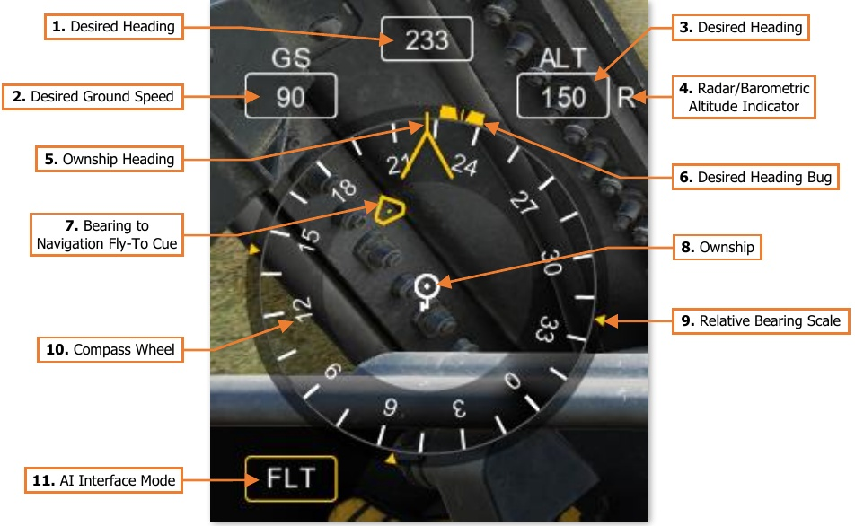
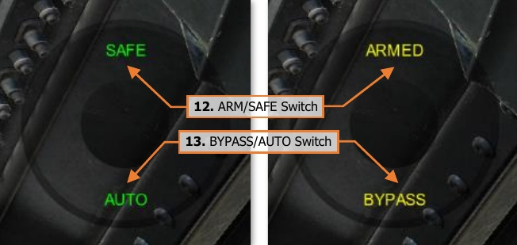

# Player-As-Cpg “George” AI Controls

When the player is in the Copilot/Gunner (CPG) crewstation, pressing the George AI Helper Interface –
Show/Hide command will display a horizontal situation indicator that can be used as a directional reference for
giving commands to George (as the Pilot).

1.   **Desired Heading.** Displays the heading that George has been commanded to maintain.

2.   **Desired Ground Speed.** Displays the ground speed that George has been commanded to maintain.

3.   **Desired Altitude.** Displays the altitude that George has been commanded to maintain.

4.   **Radar/Barometric Altitude Indicator.** Displays the altitude reference that George will use to maintain
     the desired altitude.
    
    - R. George will maintain the desired radar altitude above ground level (AGL).
    - B. George will maintain the desired barometric altitude above mean sea level (MSL).

5.   **Ownship Heading.** Displays the current heading of the ownship on the compass wheel.

6.   **Desired Heading Bug.** Displays the heading that George has been commanded to maintain relative to the
     ownship heading on the compass wheel.

7.   **Bearing to Navigation Fly-To Cue.** Displays the bearing to the Navigation Fly-To Cue relative to the
     ownship heading on the compass wheel.

8.   **Ownship.** Indicates the aircraft orientation relative to the compass wheel and associated bearing indicators.

9.   **Relative Bearing Scale.** Displays bearings relative to the desired heading bug at the 3 o’clock, 6 o’clock,
     and 9 o’clock positions.

10. **Compass Wheel.** Displays the magnetic heading reference around the ownship.

11. **AI Interface Mode.** Displays the current mode of the George AI Helper Interface.

    - **FLT.** The AI Interface is set to “Flight” mode, which is used to direct specific flight parameters for
         George to fly.

        - Assign a ground speed to achieve and maintain.

        - Assign a heading to turn toward and maintain.

        - Assign an altitude to achieve and maintain.

        - Turn the aircraft toward the direction the player (as the CPG) is looking.

    - **H-B.** The AI Interface is set to “Hover/Bob-up” mode, which is used to direct George to maneuver the
         aircraft while in a stationary hover, such as when occupying a battle position.

        - Translate the aircraft forward/backward/left/right across the surface at low speed.

        - Assign a hover altitude to achieve and maintain.

        - Turn the aircraft toward the direction the player (as the CPG) is looking.

        !!! note
            H-B mode is only available when the aircraft is below 30 knots ground speed. When above 30
            knots ground speed, this mode will be skipped, and the AI Interface Mode will proceed from FLT directly
            to CMBT.

    - **CMBT.** The AI Interface is set to “Combat” mode, which is used to direct George in performing combat
         mission-related tasks.

        - Perform an immediate break turn to the 3 o’clock, 6 o’clock, or 9 o’clock directions.

        - Align the aircraft heading to the azimuth of the TADS sensor turret.

        - Navigate along the current route and come to a hover at the final waypoint.

    - **CMWS.** The AI Interface is set to “Common Missile Warning System” mode. This mode directs George
         to change the settings on the CMWS control panel in the Pilot crewstation.

        - Arm/Safe the flare dispensers.

        - Enable/disable automatic dispensing of flares.

    When CMWS mode is entered, an
    additional circular interface element
    will be displayed to the player as a
    directional reference for giving
    commands, showing the current
    settings of the CMWS control panel.
    
    The text color of the AI Helper
    Interface text corresponds with the
    Arm/Safe status of the CMWS in the
    same color pattern as the A/S button
    on the Armament Panel.
    
    
    

12. **ARM/SAFE Switch.** Displays                       
    the position of the ARM/SAFE
    switch on the CMWS control panel.

    - **SAFE.** Flare dispensers are safed.

    - **ARMED.** Flare dispensers are armed.

13. **BYPASS/AUTO Switch.** Displays the position of the BYPASS/AUTO switch on the CMWS control panel.

    - **AUTO.** Flares will be dispensed automatically when threats are detected by the CMWS.

    - **BYPASS.** Flares will not be dispensed when threats are detected by the CMWS.

## Player-As-Cpg AI Helper Controls

The AI Helper Controls are contextual based on the current mode of the AI Helper Interface. The actions listed
below correspond with the commands issued by the player when occupying the Copilot/Gunner crewstation.

##### FLT FLIGHT PARAMETERS

- **Left Short.**

    If >30 knots, changes the AI Interface mode to [[CMBT]].

    If <30 knots, changes the AI Interface mode to [[H-B]].

- **Left Long.**   Moves desired heading bug left. After the button is released,
         commands George to turn the helicopter to the new heading.

- **Right Short.**    Commands George to turn the helicopter toward the direction you
         are looking.

- **Right Long.**     Moves desired heading bug right. After the button is released,
         commands George to turn the helicopter to the new heading.

- **Up Short.**    Increases the desired speed in the GS window. After a short delay,
         George will accelerate the helicopter to the new speed.

- **Up Long.**   Increases the desired altitude in the ALT window. After the button is
         released, George will increase the helicopter’s altitude.

    If set to         <1,420 feet AGL, George will hold the radar altitude.

    If set ≥1,420         feet AGL, George will hold the barometric altitude.

- **Down Short.**    Decreases the desired speed in the GS window. After a short delay,
         George will decelerate the helicopter to the new speed.
         
    ([[H-B]] Interface mode becomes available if speed decreases below 30
         knots.)

- **Down Long.**     Decreases the desired radar altitude in the ALT window. After the
         button is released, George will decrease the helicopter’s altitude. If
         set to <1,420 feet AGL, George will hold the radar altitude. If set
         ≥1,420 feet AGL, George will hold the barometric altitude.

##### H-B HOVER/BOB-UP MANEUVERS

- **Left      Short.** Changes the AI Interface mode to [[CMBT]].

- **Left Long.** George translates the helicopter to the left while the button is held.

- **Right   Short.**    Same function as [[FLT]] mode.

- **Right Long.**   George translates the helicopter to the right while the button is held.

- **Up  Short.** George increases hover altitude by 10 feet.

- **Up Long.**     George translates the helicopter forward while the button is held.

- **Down      Short.** George decreases hover altitude by 10 feet.

- **Down Long.** George translates the helicopter backward while the button is held.

##### CMBT COMBAT TASKS

- **Left      Short.** Changes the AI Interface mode to [[CMWS]].

- **Left Long.** Commands George to perform a 90° turn to the left to evade or
                           more quickly re-attack.

- **Right     Short.** Commands George to fly a direct path to the current Navigation
                           Direct-To Cue. If the point is part of a route, George will continue
                           along that route in sequence. If the point is not part of a route, or is
                the final point in the route, George will come to a hover at that
                location.

- **Right Long.** Commands George to perform a 90° turn to the right to evade or
                more quickly re-attack.

- **Up      Short.** Commands George to turn the aircraft to the heading of the TADS
                LOS reticle. This is useful for starting an attack run, bringing the
                helicopter into Hellfire launch constraints, or aligning the Rocket
                Steering Cursor.

- **Down Long.** Commands George to perform a 180° turn to evade or turn away
                after an attack.

##### CMWS CMWS PANEL SETTINGS
- **Left    Short.** Changes the AI Interface mode to FLT.

- **Up      Short.** Toggles flare dispensers arming state between ARM and SAFE.

- **Down    Short.** Toggles flare dispense mode between AUTO and BYPASS.

{!abbr.md!}
{!dev-docs/ah64d/abbr.md!}
{!docs/ah64d/abbr.md!}
