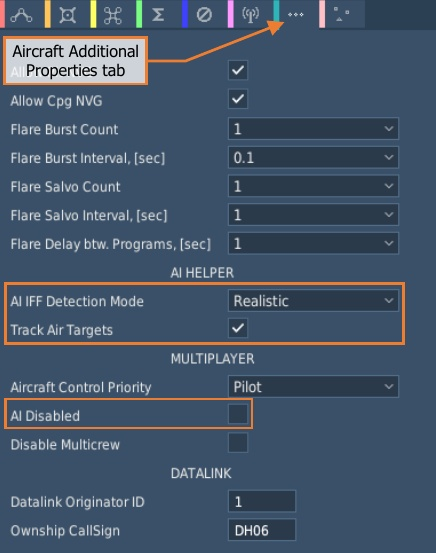

# Additional “George” AI Features

Some additional features and important notes regarding George are listed below.

- During a cold start, George will close his cockpit canopy when the player closes theirs, or after the APU is
     powered on, whichever comes first. George will also power on the TADS and boresight the CPG IHADSS.
- George may be configured to automatically take over the flight controls when the player switches from the
     Pilot seat to the Copilot/Gunner seat. (See the Special Tab in the DCS Fundamentals chapter for more
     information.)
- When George assumes control of the aircraft, he will attempt to maintain the current flight parameters until
     ordered to do otherwise.
- George will not ground taxi. When the player is occupying the Copilot/Gunner seat, George may be directed
     to takeoff by increasing the Desired Altitude above zero, or order him to land by decreasing the Desired
     Altitude to zero. Once airborne, the [[FLT]] and [[H-B]] modes may be used to direct George to fly, hover, or
     translate in any direction. This can be useful to hover taxi around a FARP or airfield or maneuver the aircraft
     within a battle position.
- When the player is occupying the Pilot seat and George is tracking a target, he will automatically laser
     designate the tracked target if required for his assigned weapon within the engagement parameters.
- George is not immortal. If the player “dies”, George cannot occupy the player’s position to resume the
     mission.

## AI Mission Editor Options

Mission creators may configure several additional options that affect the behavior of George during a mission.
These options are displayed within the Aircraft Additional Properties tab for the AH-64D BLK.II.

**AI IFF Detection Mode.** Sets the level of Identification-
Friend-or-Foe that George will utilize when detecting,
acquiring, and identifying potential targets. Depending on
the selection, F10 View Options and Labels selections will
affect the level George is able to identify whether a contact
is friendly or enemy, and what type of target it is. (See AI
Combat Identification for more information)

**Track Air Targets.** When checked, George (as the CPG) will
include aircraft as potential targets when generating the
Target List. If this option is un-checked, George will ignore
helicopter and fixed-wing aircraft when performing sensor
scans of the battlefield.

**AI Disabled.** When checked, this option will disable all
George AI Interface functions.

- As the CPG, George will not scan for targets, will not
     use the TADS laser rangefinder/designator, and will not
     action any weapons.
- As the Pilot, George will not fly the aircraft.

If the player is flying the DCS AH-64D by himself or herself
in single-player, they will need to perform all duties as
necessary, which will usually require switching between seats.
{!abbr.md!}
{!dev-docs/ah64d/abbr.md!}
{!docs/ah64d/abbr.md!}
