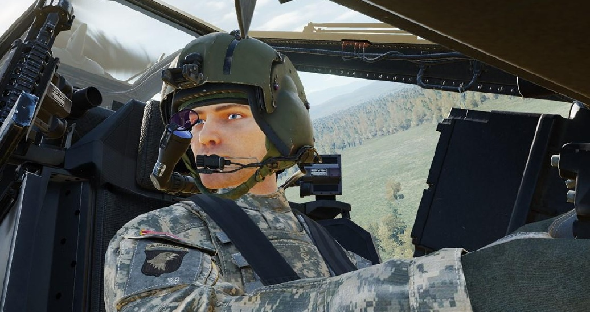
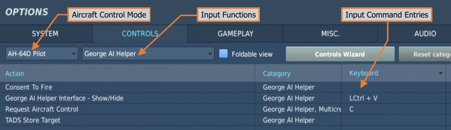
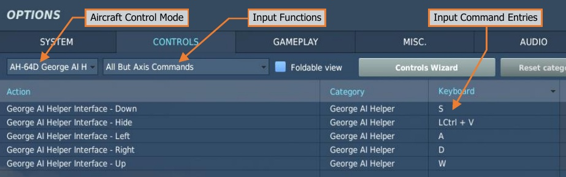

# “GEORGE” AI

The AH-64D is operated by two crewmembers: a Pilot (PLT) and a Copilot/Gunner (CPG). The DCS: AH-64D
module supports multicrew capability, where two players can occupy the two seats in a multiplayer session for
cooperative play. To accommodate a single-player experience, a player may utilize “George” AI, a virtual
crewmember that allows players to manage mission-critical items in the crewstation that the player is not
occupying.

Unless specifically disabled in the Mission Editor options, George AI will always be present in the opposite
crewstation from the player. When the player enters an AH-64D in DCS, they will be placed in the aft Pilot
crewstation while George AI occupies the front CPG crewstation. If the player moves to the CPG crewstation,
George will occupy the Pilot crewstation.

George may be directed by keyboard commands or a 4-way hat switch on the player’s joystick. As an AI
crewmember, George is more than simply a means of interacting with the controls and systems in the crewstation
that the player is not occupying. George is designed to mimic the real-life procedures used by AH-64D crew
members, which permits players to direct and coordinate the AI crewmember actions in a similar manner to
interacting with another person, albeit in a more limited capacity. When a player directs George AI via a command
or control input, they are directing George to perform “tasks” rather than simple “actions”. These tasks could be
as basic as toggling the laser designator on and off to begin/cease target designation, or they may be as complex
as following a sequence of waypoints to navigate a route at low altitude into a battle position.

As George is simulating a real crewmember, some commands may not result in an immediate or apparent reaction
from George. This simulates the time needed to communicate the command over the intercom and the
commanded action(s) to be performed by a real crewmember. Many commands carry several implied actions
beyond what the command itself entails. These will be described throughout this chapter.

!!! note
    George will continue to be refined throughout the Early Access process and will receive new features on
    a periodic basis.

## AH-64D AI Controls Structure

The AI controls are divided into two categories: AI Helper Commands and AI Helper Controls.

**AI Helper Commands.** Simple but immediate commands that may be given to George at any time, such as
“Consent To Fire” or “Request Aircraft Control.” These commands do not require the George AI Helper Interface
to be displayed.

**AI Helper Controls.** Complex commands that are contextual based on the current mode of the George AI Helper
Interface, such as commanding George as the CPG to action a specific weapon or commanding George as the
Pilot to fly along the current route. These controls are only available when the AI Helper Interface is displayed.

The AI Helper Interface responds to short and long presses of the interface controls to perform different functions.
A short press is held down for less than 0.5 seconds, and a long press is held down for more than 0.5 seconds.

Under the AH-64D Pilot and AH-64D CPG aircraft control modes, the AH-64D George AI Helper input functions
category contains the input command entries for the AI Helper Commands that are available from each respective
AH-64D crewstation and the input command entry for displaying the George AI Helper Interface.

Under the AH-64D George AI Helper aircraft control mode, input command entries may be programmed to
navigate and utilize the George AI Helper Interface. These commands may be dual-bound to any command
entries that are already bound within the AH-64D Pilot or AH-64D CPG control modes; however, these commands
will take priority when the AI Helper Interface is displayed.

For example, if a 4-way hat switch is bound to the Sight Select switch under AH-64D Pilot and to the George AI
Helper Interface under AH-64D George AI Helper, the 4-way hat switch will perform its function as the Sight
Select switch when the AI Helper Interface is hidden, but will function as the AI Helper Controls switch when the
AI Helper Interface is shown.

To control George from either crewstation, the George AI Helper Interface Up/Down/Left/Right and
George AI Interface Hide commands will need to be bound under AH-64D George AI Helper aircraft control
mode; as will the George AI Helper Interface Show/Hide Menu command entry under AH-64D Pilot and
AH-64D CPG aircraft control modes.

## AH-64D AI Helper Commands

The George AI Helper Interface is not required to be displayed to utilize the commands listed below.

**Consent To Fire.** If George (as the CPG) is tracking a target, this command will give George clearance to fire
his assigned weapon at that target, even if his ROE is set to Hold Fire. This command is only available when the
Player is occupying the Pilot seat.

**George AI Helper Interface – Show/Hide.** Displays the AI Helper Interface and enables the input command
entries within the AH-64D George AI Helper aircraft control mode. It is recommended that this command is bound
to the same button as George AI Helper Interface – Hide under AH-64D George AI Helper aircraft control
mode to allow the AI Helper Interface to be toggled between shown/hidden with the same input.

**Request Aircraft Control.** When flying without another player, this command transfers aircraft control to
George (as the Pilot) or returns it to the player (as the CPG). George cannot accept aircraft control when
performing CPG duties. This command is only available when the player is occupying the CPG seat.
When flying with another player in multi-crew, this command transfers the flight controls from the other player.
For example, if the Pilot is flying the helicopter and the Copilot/Gunner presses this button to request control; if
the Pilot accepts the handoff the CPG’s cyclic stick will un-stow, and the Pilot’s flight controls will become inactive.

!!! note
    If George AI is disabled in the Mission Editor, the player will be required to fly the aircraft at all times,
    regardless of which seat the player is occupying at any point in the mission.

**TADS Store Target.** If George (as the CPG) is tracking a target with the TADS, this command will direct George
to store a Target point (T##) using the STORE/UPDT switch on the TEDAC Left Handgrip. If George is not already
lasing, he will momentarily fire the LRFD to get accurate range data before storing the location as a Target point.

This command is only available when the Player is occupying the Pilot seat.

!!! note
    This command may also be used while the Target List is displayed to store multiple Target points.

## AH-64D AI Helper Controls

The commands listed below will only function when the George AI Helper Interface is displayed.

**George AI Helper Interface – Hide.** Hides the on-screen AI Helper Interface and disables the input command
entries within the AH-64D George AI Helper aircraft control mode. It is recommended that this command is bound
to the same button as George AI Helper Interface – Hide under AH-64D George AI Helper aircraft control
mode to allow the AI Helper Interface to be toggled between shown/hidden with the same input.

**George AI Helper Interface – Down.** Performs the function associated with the Down action, given the
current Interface mode.

**George AI Helper Interface – Left.** Performs the function associated with the Left action, given the current
Interface mode.

**George AI Helper Interface – Right.** Performs the function associated with the Right action, given the current
Interface mode.

**George AI Helper Interface – Up.** Performs the function associated with the Up action, given the current
Interface mode.

See the command list of AI Helper Controls in the Player-as-CPG or Player-as-PLT sections of this chapter for
more information.
{!abbr.md!}
{!dev-docs/ah64d/abbr.md!}
{!docs/ah64d/abbr.md!}
