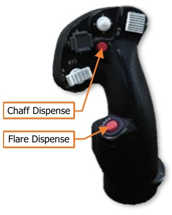

# ASE Hand Controls

Either crewmember may manually dispense chaff and flares. Either crewmember may configure and arm the
chaff dispenser; however, only the Pilot has access to the CMWS Control Panel to arm the flare dispensers.

## Cyclic & Collective Controls

The Pilot and Copilot/Gunner Cyclic Grips include buttons for dispensing chaff
and flares.

{!abbr.md!}
{!dev-docs/ah64d/abbr.md!}
{!docs/ah64d/abbr.md!}
