# Area Weapon System (AWS)

The Area Weapon System is designed for engaging or suppressing targets at close range and is effective against
lightly armored vehicles, unarmored vehicles, and personnel. Although the entire M139 AWS also includes the
hydraulically-steered turret, ammunition magazine, and ammo handling system that transports ammunition from
the magazine to the turret, the most noticeable component of the AWS is the M230E1 30mm gun (also called the
“thirty” or simply the “gun”).

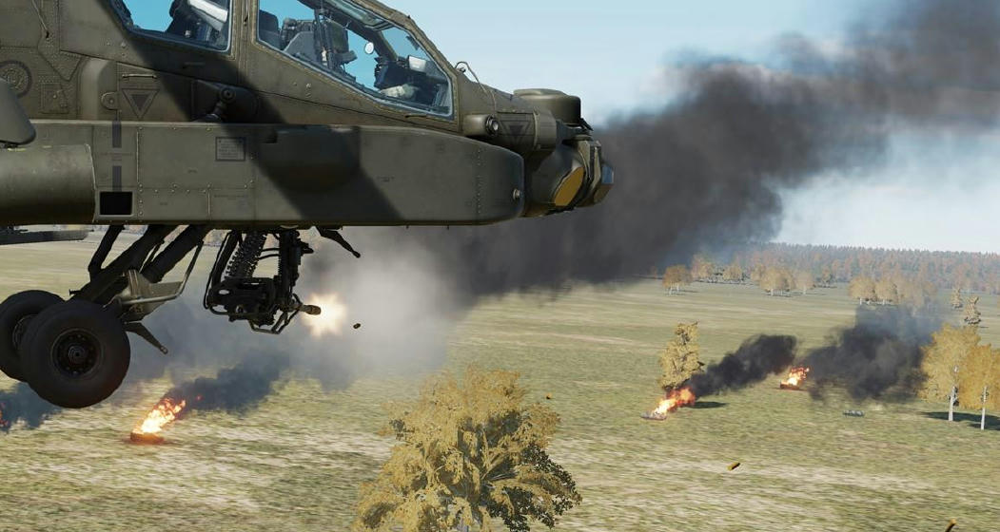

The gun may be employed by either crewmember when using the HMD or FCR as the selected sight; or by the
CPG when using the TADS. When employed using the HMD as the selected sight, gun engagements are typically
performed with the intent to engage or suppress close-range threats to the aircraft, in which the speed of placing
“rounds on target” is of greater importance over accuracy and precision. When employed using the TADS as the
selected sight, gun engagements may be performed in a more offensive manner in which accuracy and precision
is desired.

The gun may be used in the normal “flex gun” mode (NORM mode) in which the gun turret is articulated to match
the ballistic solution against the target location as calculated by the Weapon Processors; or in a forward-firing
“fixed gun” mode (FXD mode) in which the gun is fixed to a ballistic solution of 1,575 meters directly in front of
the aircraft, regardless of the selected sight or computed target location.

During major combat operations, the ammunition capacity of the Area Weapon System can hold up to 1,200
rounds if necessary. However, the ammunition magazine may be replaced with an Internal Auxiliary Fuel System
(IAFS), which includes a reduced-size 30mm ammunition magazine but extends the range and endurance of the
aircraft with an additional 100 gallons of fuel. The IAFS reduces the ammunition storage to just 25% of its full
capacity, limiting the total rounds that may be carried to 300.

## M230E1 30mm Automatic Gun

The M230 is a single-barrel, automatic chain gun which fires 30x113mm link-less ammunition. The M230 is
designed as an anti-material and anti-personnel weapon, employing a high-explosive dual-purpose (HEDP) round
that is capable of penetrating light armor while simultaneously producing fragmentation effects against
unarmored vehicles or personnel.

As a chain gun, the weapon uses a rotating chain within the receiver assembly to cycle the internal action in
loading the next round for firing and clearing the empty casing from the chamber after firing. This contrasts with
other weapons which use the expanding gases from the round’s explosive charge or the recoil of the round itself
to cycle the internal action. The gun action is powered by an external drive motor which is supplied with aircraft
electrical power.

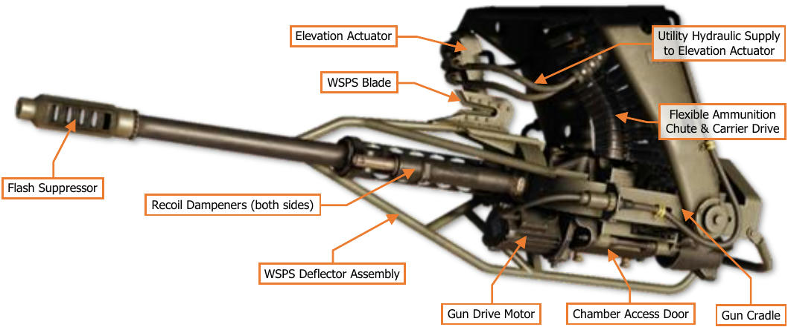

The gun turret itself is steered using hydraulic pressure from the Utility hydraulic system and includes Wire Strike
Protection System (WSPS) components. The WSPS is intended to divert or sever high-tension wires that may be
inadvertently encountered by the aircraft during low-level operations, especially during hours of darkness. The
M230 is intended as a “low-signature weapon”, in which tracer rounds are not utilized and the gun barrel is
equipped with a flash suppressor to reduce visual detection during operations at night.

The M230 has an approximate rate of fire of 625 (±25) rounds per minute, but this may vary slightly between
individual aircraft. Two types of ammunition may be employed, each with identical ballistic characteristics.

**M789 High-Explosive Dual-Purpose (HEDP).** The M789 round uses a shaped
charge surrounded by a steel case to provide armor penetration and fragmentation
effects.

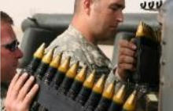

**M788 Training/Practice (TP).** The M788 round uses an inert round casing with
an aluminum tip to simulate the ballistic characteristics of the M789 during live-fire
training and exercises.

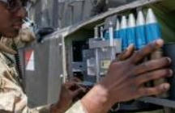

The M789 and M788 rounds have a relatively low muzzle velocity. As such, they are ill-suited for long-range
precision engagements, with an effective range of approximately 1,500 meters; although the AH-64 fire control
system will calculate a ballistic solution for the M230 out to 4,200 meters.

### Gun Articulation Limits

The AWS turret can articulate through a maximum range of ±86° in azimuth and +11°/-60° in elevation.
However, additional limitations are automatically applied to the turret based on specific conditions.

- If the gun azimuth is within ±10° of the aircraft centerline, the elevation is limited to +9°. This limitation
    does not apply when the gun is de-actioned and the gun is stowed at +11° in elevation.
- If the aircraft is on the ground (weight-on-wheels), the elevation is limited to -6.45°.

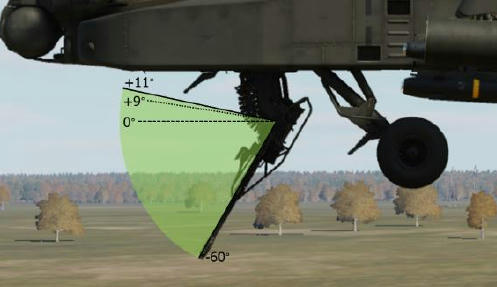

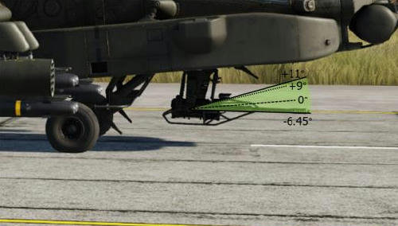

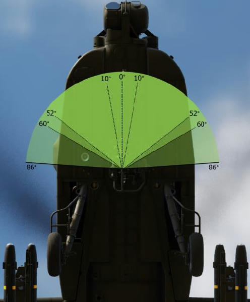

- If the gun is actioned while the missiles are also actioned, and the next-to-launch missile is on an inboard
    launcher rail of an inboard pylon, the gun azimuth will be limited to 52° on the corresponding side of the
    aircraft to prevent the missile from colliding with the gun barrel.
- If the gun is actioned while the rockets are also actioned, and rocket launchers are installed on the inboard
    pylons, the gun azimuth will be limited to ±60° to either side to prevent the rockets from colliding with the
    gun barrel.

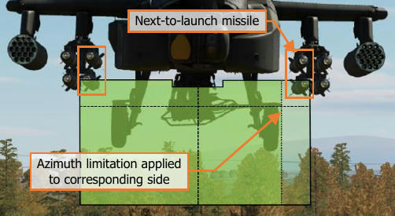

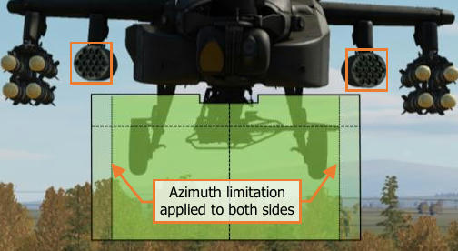

### Gun Weapon Inhibits

The following conditions will inhibit the gun from being fired or interrupt the firing of the gun if already in in
progress. Performance inhibits may be overridden by pulling the trigger to the 2 nd detent. Safety inhibits cannot
be overridden.

##### Performance Inhibits

- **BAL LIMIT:**

    The required weapon aiming
solution exceeds the ballistics
processing capability.

    - If tactically feasible, engage the target at a closer
range.

##### Safety Inhibits

- **ALT LAUNCH:**

    A missile launch or a rocket
salvo is already in progress.

    - The gun may be fired 2 seconds after the missile
launch or rocket salvo is complete.

- **AZ LIMIT:**

    The gun turret is at an azimuth
limit and cannot reach the
weapon aiming solution.

    - Adjust the aircraft heading as necessary to bring the
weapon aiming solution within the azimuth limits of
the gun turret.

- **COINCIDENCE:**

    The gun is out of coincidence
from the weapon aiming
solution.

    - Wait for the gun to reach the weapon aiming solution.
If inhibit message remains, the gun may have
experienced a failure and should be de-actioned.

- **EL LIMIT:**

    The gun turret is at an elevation
limit and cannot reach the
weapon aiming solution.

    - Adjust the aircraft pitch attitude as necessary to bring
the weapon aiming solution within the elevation limits
of the gun turret (e.g., pitch the nose up when
engaging a target at long range).

- **LOS INVALID:**

    The line-of-sight of the selected
sight is invalid or has failed;
and cannot provide a weapon
aiming solution to the gun.

    - Select a different sight for engagement.
If using HMD as the sight and the LOS Reticle is
flashing, adjust the helmet position to within the slew
limits of the assigned NVS sensor (PNVS or TADS).

- **SAFE:**

    The master armament state is
currently set to SAFE; weapons
cannot be fired.

    - Set the A/S button on the Armament Panel to ARM.

### WPN Gun (GUN) Format

When the gun is selected for employment within the crewstation, the WPN page will be set to GUN format.

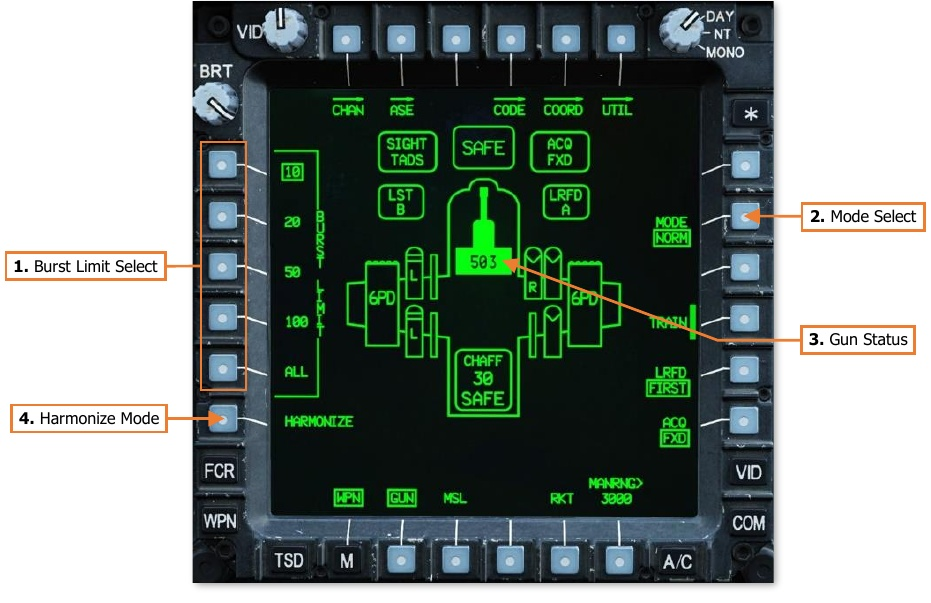

1.   **Burst Limit Select.** Displays the quantity of 30mm rounds that will be fired each time the weapon trigger
     is pulled and held. When the burst limit is reached, a subsequent trigger pull is required to fire a subsequent
     burst. This setting is independent between crewstations.

    - **10.** Gun burst is limited to 10 rounds of ammunition.

    - **20.** Gun burst is limited to 20 rounds of ammunition.

    - **50.** Gun burst is limited to 50 rounds of ammunition.

    - **100.** Gun burst is limited to 100 rounds of ammunition.

    - **ALL.** The gun will continuously fire until the ammunition is depleted.

2.   **Mode Select.** Displays the selected firing mode of the gun. This setting is independent between
     crewstations.

    - **NORM.** The gun turret is articulated to match the weapon aiming solution derived from the
           crewmember’s selected sight and range source, as calculated by the Weapon Processors.

    - **FXD.** The gun turret is fixed forward to a weapon aiming solution directly in front of the aircraft at a
           range of 1,575 meters, regardless of the selected sight or range source.

3.   **Gun Status.** Displays the status of the gun and the remaining quantity of ammunition on board the aircraft.

4.   **Harmonize Mode (CPG Only).** Not implemented.

### Gun Weapon Status Messages

The following messages will be displayed in the High Action Display based on current gun status or weapon page
settings when the gun is actioned.

- **ROUNDS ####:** The gun is actioned and the number of remaining rounds onboard is displayed.
- **WEAPON?:** The weapon trigger has been pulled but no weapon has been actioned.

## Gun Engagement Using TADS (NORM Mode)

When employing the AWS with the TADS, ballistic compensation for aircraft linear velocities and environmental
factors is automatically calculated. If the target is moving, continuous laser designation via the 2 nd detent of the
laser trigger should be used to incorporate the Target State Estimator (TSE) for lead-angle compensation. TADS
LMC and/or IAT may also be used to assist the CPG in stabilizing the TADS LOS Reticle on the target.

To engage a target from the CPG crewstation while using the TADS as the selected sight:

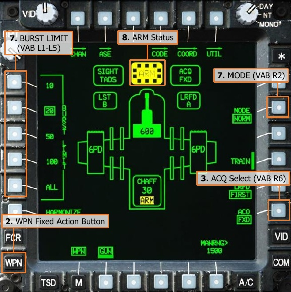

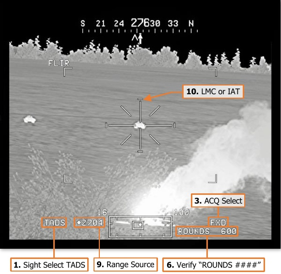

1. [[**CPG**]] Sight Select switch – TADS.
      (TEDAC Right Handgrip)
2. [[**CPG**]]   WPN Fixed Action Button – Press.
                                                  
3. [[**CPG**]] (Optional) Determine the
      appropriate acquisition source (ACQ) for    
      acquiring the target.

    - If the target is visually acquired by
            either crewmember, set ACQ to PHS
            or GHS.
    - If the target is stored as a point
            within the navigational database,
            set ACQ to the corresponding point.   

4. [[**CPG**]] (Optional) SLAVE button – Press,
      and then press again to de-slave when                                            
      the TADS has finished slewing.
5. [[**CPG**]] Weapon Action Switch (WAS) –
      Forward. (TEDAC Left Handgrip)
6. [[**CPG**]] Weapon Status – Verify “ROUNDS
      ####”. (High Action Display)
7. [[**CPG**]] Weapon settings – Verify or select.
      (WPN page)

    - BURST LIMIT (VAB L1-L5) – Select
            as desired.
    - MODE (VAB R2) – Select NORM.

8. [[**CPG**]] A/S button – Verified in ARM.
      (Armament Panel)
9. [[**CPG**]] Range source – Verify or select:
      Laser, Navigation, Auto, or Manual.
      (TADS Acquisition and Ranging)

    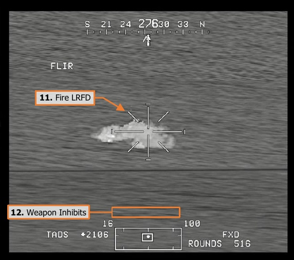

10. [[**CPG**]] If the target or aircraft are moving,
      engage TADS targeting modes to
      stabilize the TADS on target.

    - Manual tracking - Engage LMC and
            employ the Sight Manual Tracker.
    - Automatic tracking - Engage IAT.
                                                
11. [[**CPG**]] LRFD Trigger – Pull, if laser ranging
      is desired. (TEDAC Right Handgrip)

    - Target and aircraft are stationary –
           LRFD trigger, 1st detent, may be
           pulled momentarily (ranging).
    - Target or aircraft are moving –
           LRFD trigger, 2nd detent, should be
           pulled and held (designation).

12. [[**CPG**]] Weapon Inhibit messages – Verify
      no Safety or Performance inhibit
      messages are displayed:

    - COINCIDENCE
    - AZ LIMIT
    - EL LIMIT
    - BAL LIMIT

13. [[**CPG**]] Weapon Trigger – Pull and hold for
      duration of burst. (TEDAC Left
      Handgrip)
14. [[**CPG**]] Observe for round impacts – Adjust
      the TADS LOS Reticle aimpoint and
      repeat bursts on target as necessary
      until target effects are achieved.

## Gun Engagement Using FCR (NORM Mode)

When employing the AWS with the FCR, the NTS target is used for calculating the weapon aiming solution for
the AWS turret. Ballistic compensation for aircraft linear velocities and environmental factors is automatically
calculated. If the target is moving, the target should be engaged in as short amount of time possible following
the completion of the FCR scan to ensure the lead-angle compensation to the target is accurate.

To engage a target from either crewstation while using the FCR as the selected sight:

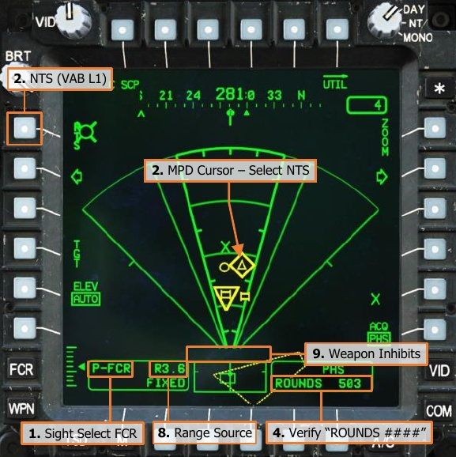

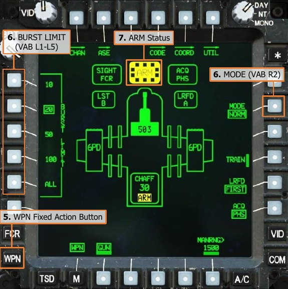

1.   Sight Select switch – FCR. (Collective
     Mission Grip or TEDAC Right Handgrip)
2.   NTS (VAB L1) – Select to advance NTS to
     desired target for engagement.

     or

    MPD Cursor Controller/Enter – Select
     desired target for engagement.

3.   Weapon Action Switch (WAS) – Forward.
     (Cyclic Grip or TEDAC Left Handgrip)
4.   Weapon Status – Verify “ROUNDS
     ####”. (High Action Display)
5.   WPN Fixed Action Button – Press.
6.   Weapon settings – Verify or select.
                                           
    - BURST LIMIT ( VAB L1-L5) – Select
          as desired.
    - MODE (VAB R2) – Select NORM.     

7.   A/S button – Verify ARM is illuminated.
     (Armament Panel)
8.   Range source – Verify Radar range is
     within appropriate engagement range.
9.   Weapon Inhibit messages – Verify no
     Safety or Performance inhibit messages
     are displayed:

    - COINCIDENCE
    - AZ LIMIT
    - EL LIMIT
    - BAL LIMIT

10. Weapon Trigger – Pull and hold for
    duration of burst. (Cyclic Grip or TEDAC
    Left Handgrip)

## Gun Engagement Using HMD (NORM Mode)

When employing the AWS with the HMD, the gun can be used to rapidly suppress close-in threats to the aircraft.
However, unlike the TADS, the HMD does not provide any ballistic compensation for the gun with the exception
of range compensation. Lead angle and other linear velocity compensations must be manually provided by the
crewmember by adjusting the LOS Reticle of the HMD accordingly.

To engage a target from either crewstation while using the HMD as the selected sight:

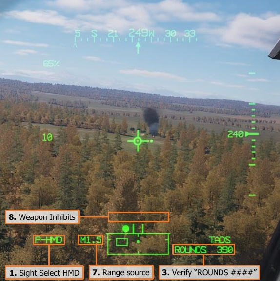

1.   Sight Select switch – HMD. (Cyclic Grip or
     TEDAC Right Handgrip)
2.   Weapon Action Switch (WAS) – Forward.
     (Cyclic Grip or TEDAC Left Handgrip)

    !!! note
        The range source will be
        automatically set to Manual range based
        on the WPN page MANRNG> value.

3.   Weapon Status – Verify “ROUNDS
     ####”. (High Action Display)
4.   WPN Fixed Action Button – Press.
5.   Weapon settings – Verify or select.

    - BURST LIMIT (VAB L1-L5) – Select
          as desired.
    - MODE (VAB R2) – Select NORM.

6.   A/S button – Verify ARM is illuminated.
     (Armament Panel)
7.   Range source – Verify or select:
     Navigation, Auto, or Manual. (HMD
     Acquisition and Ranging)
8.   Weapon Inhibit messages – Verify no
     Safety or Performance inhibit messages
     are displayed:

    - COINCIDENCE
    - AZ LIMIT
    - EL LIMIT
    - BAL LIMIT

9.   Weapon Trigger – Pull and hold for
     duration of burst. (Cyclic Grip or TEDAC
     Left Handgrip)

    !!! note
        If the CPG actions the gun from
        the Cyclic Grip, the cyclic weapon trigger
        must be used. If the CPG actions the gun
        from the TEDAC Left Handgrip, the
        TEDAC weapon trigger must be used.

10. Observe for round impacts – Adjust the
    HMD LOS Reticle aimpoint and repeat
    bursts on target as necessary until
    weapon effects are achieved.

## Gun Engagement Using HMD (FXD Mode)

When employing the AWS in Fixed mode, the gun is fixed forward at a ballistic solution of 1,575 meters, requiring
the pilot to maneuver the aircraft to aim the gun at the target. The Fixed Gun Reticle is identical to the Cued LOS
Reticle of the acquisition source (ACQ) and represents the virtual location in front of the aircraft that coincides
with the 1,575-meter ballistic solution.

To engage a target from either crewstation while using the gun in Fixed mode and the HMD as the selected sight:

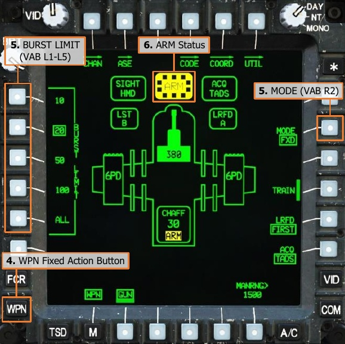

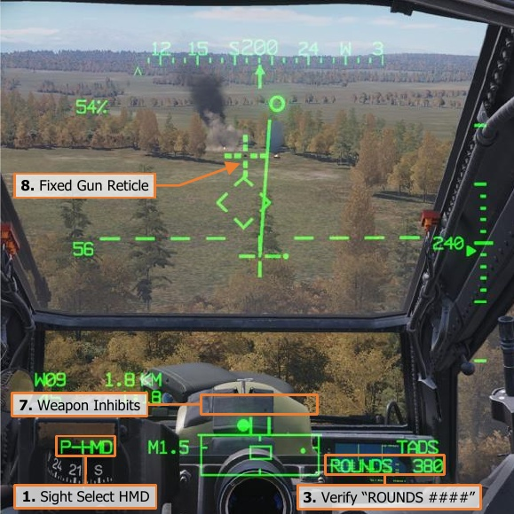

1.   Sight Select switch – HMD. (Cyclic Grip)
2.   Weapon Action Switch (WAS) – Forward.
     (Cyclic Grip)
3.   Weapon Status – Verify “ROUNDS
     ####”. (High Action Display)
4.   WPN Fixed Action Button – Press.
5.   Weapon settings – Verify or select. (WPN
     page)

    - BURST LIMIT (VAB L1-L5) – Select
          as desired.
    - MODE (VAB R2) – Select FXD.

6.   A/S button – Verify ARM is illuminated.
     (Armament Panel)                        

7.   Weapon Inhibit messages – Verify no
     Safety or Performance inhibit messages
     are displayed:

    - COINCIDENCE

8.   Maneuver aircraft to adjust the HMD
     Fixed Gun Reticle aimpoint as necessary.
9.   Weapon Trigger – Pull and hold for
     duration of burst. (Cyclic Grip)
10. Observe for round impacts – Maneuver
    aircraft to adjust the HMD Fixed Gun
    Reticle aimpoint and repeat bursts on
    target as necessary until weapon effects 
    are achieved.

{!abbr.md!}
{!dev-docs/ah64d/abbr.md!}
{!docs/ah64d/abbr.md!}
