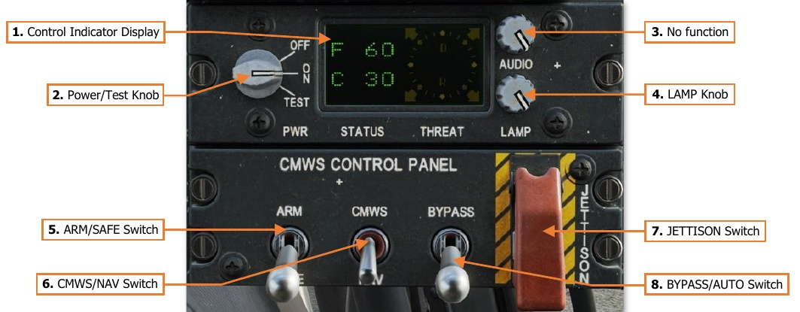
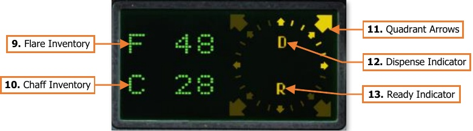

# Common Missile Warning System

The AN/AAR-57 Common Missile Warning System (CMWS) provides detection of threat missiles via a series of
external detectors to passively detect missiles after launch. The system displays the threat direction to the Pilot
via the Control Indicator Display, along with an audio threat alert to the crew. The AAR-57 is also capable of
automatically dispensing flare countermeasures without crew interaction; however, the crew retains the ability to
manually dispense flares by pressing the cyclic-mounted FLARE button in either crewstation.

As a post-production modification to the AH-64D, the CMWS utilizes the ADF audio channel to provide audio
threat alerts to each crewstation. As such, the ADF knob on the Communications Panel controls the volume of
CMWS threat alerts within the crewstation, independently of the RLWR volume.

The CMWS/NAV switch on the CMWS Control Panel in the Pilot crewstation is used to switch the ADF audio
channel between radio signals received by the AN/ARN-49 Automatic Direction Finder and the CMWS. The Pilot
should ensure this switch is set to the CMWS position if operating in a hostile area where missile threats are
expected.

1.    **Control Indicator Display.** Displays the current inventory of chaff and flare countermeasures onboard
      the aircraft, direction of detected missile threats, and system status.

2.    **Power/Test Knob.** Enables/disables power to the CMWS and initiates a Built-In-Test (BIT) sequence.

    - **OFF.** Disables power to the CMWS.

    - **ON.** Enables power to the CMWS. A BIT will automatically be performed after the CMWS initializes.

    - **TEST.** Manually initiates a BIT of the CMWS.

3.    **AUDIO Knob.** No function.

4.    **LAMP Knob.** Adjusts the brightness of the Control Indicator Display.

5.    **ARM/SAFE Switch.** Arms flare dispensers for automatic or manual dispensing. Flare dispensing is inhibited
      with aircraft weight-on-wheels regardless of the switch position.

    - **SAFE.** Flare dispensing is inhibited.

    - **ARM.** Flares may be automatically dispensed upon detection of a missile threat or manually dispensed
              by either crewstation.

6.   **CMWS/NAV Switch.** Sets the ADF audio channel in both crewstations to the CMWS or ADF receiver.

    - **CMWS.** The ADF audio channel will relay threat alert audio from the CMWS. While providing threat
          alert audio, the crew will be unable to monitor radio signals received by the ADF.

    - **NAV.** The ADF audio channel will relay radio audio from the ADF receiver. While providing ADF radio
          audio, the crew will be unable to receive threat alert audio from the CMWS.

7.   **JETTISON Switch (Guarded).** Jettisons all flares from the tail-mounted flare dispensers in an emergency.
     The CMWS does not need to be armed to initiate a jettison of flares.

8.   **BYPASS/AUTO Switch.** Enables/disables automatic flare dispensing as commanded by the CMWS. Missile
     threat alert audio is provided regardless of switch position.

    - **BYPASS.** Automatic dispensing commands by the CMWS are bypassed. Flares will only by dispensed
          if the FLARE button on either Cyclic Grip is pressed.

    - **AUTO.** Automatic dispensing commands by the CMWS are enabled. Flares may be automatically
          dispensed by the CMWS when missile threats are detected, or manually dispensed if the FLARE button
          on either Cyclic Grip is pressed.

    

9.   **Flare Inventory.** Indicates the number of remaining flare cartridges onboard, up to a maximum of 60.
     When all flares have been depleted, the flare inventory will alternate between “0” and “OUT”.

10. **Chaff Inventory.** Indicates the number of remaining chaff cartridges onboard, up to a maximum of 30.
    When all chaff cartridges have been depleted, the flare inventory will alternate between “0” and “OUT.

11. **Quadrant Arrows.** When illuminated, indicates the direction of threat missile detection(s).

12. **Dispense Indicator.** When illuminated, indicates dispensing of flares or chaff is in progress.

13. **Ready Indicator.** When illuminated, indicates system is in a “ready” state for flare dispensing (CMWS
    ARM/SAFE switch is in the ARM position and the aircraft is not weight-on-wheels).

{!abbr.md!}
{!dev-docs/ah64d/abbr.md!}
{!docs/ah64d/abbr.md!}
